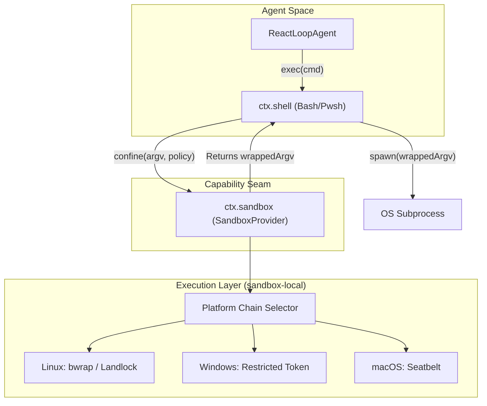
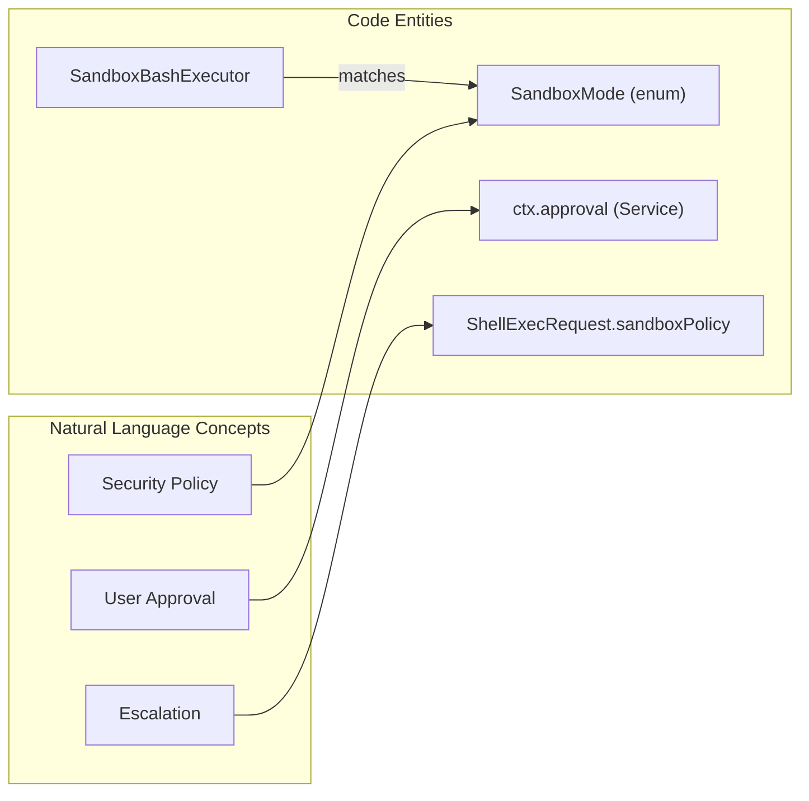

# Sandboxing & Security

<details>
<summary>Relevant source files</summary>

The following files were used as context for generating this wiki page:

- [.agents/notes/implemented/feature/2026-07-06-approval-seam.i18n.yaml](.agents/notes/implemented/feature/2026-07-06-approval-seam.i18n.yaml)
- [.agents/notes/implemented/feature/2026-07-06-approval-seam.md](.agents/notes/implemented/feature/2026-07-06-approval-seam.md)
- [.agents/notes/implemented/feature/2026-07-06-approval-seam.zh.md](.agents/notes/implemented/feature/2026-07-06-approval-seam.zh.md)
- [.agents/notes/implemented/feature/2026-07-06-sandbox.i18n.yaml](.agents/notes/implemented/feature/2026-07-06-sandbox.i18n.yaml)
- [.agents/notes/implemented/feature/2026-07-06-sandbox.md](.agents/notes/implemented/feature/2026-07-06-sandbox.md)
- [.agents/notes/implemented/feature/2026-07-06-sandbox.zh.md](.agents/notes/implemented/feature/2026-07-06-sandbox.zh.md)
- [.agents/notes/implemented/feature/2026-08-08-windows-acl-restricted-token-sandbox.i18n.yaml](.agents/notes/implemented/feature/2026-08-08-windows-acl-restricted-token-sandbox.i18n.yaml)
- [.agents/notes/implemented/feature/2026-08-08-windows-acl-restricted-token-sandbox.md](.agents/notes/implemented/feature/2026-08-08-windows-acl-restricted-token-sandbox.md)
- [.agents/notes/implemented/feature/2026-08-08-windows-acl-restricted-token-sandbox.zh.md](.agents/notes/implemented/feature/2026-08-08-windows-acl-restricted-token-sandbox.zh.md)
- [.github/workflows/landlock-run-release.yml](.github/workflows/landlock-run-release.yml)
- [native/landlock-run/docs/release.md](native/landlock-run/docs/release.md)
- [packages/sandbox/sandbox-local/README.i18n.yaml](packages/sandbox/sandbox-local/README.i18n.yaml)
- [packages/sandbox/sandbox-local/README.md](packages/sandbox/sandbox-local/README.md)
- [packages/sandbox/sandbox-local/README.zh.md](packages/sandbox/sandbox-local/README.zh.md)
- [packages/sandbox/sandbox-local/src/index.ts](packages/sandbox/sandbox-local/src/index.ts)
- [packages/sandbox/sandbox-local/src/profiles.ts](packages/sandbox/sandbox-local/src/profiles.ts)
- [packages/sandbox/sandbox-local/tests/local.spec.ts](packages/sandbox/sandbox-local/tests/local.spec.ts)
- [packages/sandbox/sandbox-local/tests/seatbelt.e2e.ts](packages/sandbox/sandbox-local/tests/seatbelt.e2e.ts)
- [packages/sandbox/sandbox-policy/package.json](packages/sandbox/sandbox-policy/package.json)
- [packages/sandbox/sandbox-policy/tsconfig.json](packages/sandbox/sandbox-policy/tsconfig.json)
- [packages/sandbox/sandbox-windows-acl/README.i18n.yaml](packages/sandbox/sandbox-windows-acl/README.i18n.yaml)
- [packages/sandbox/sandbox-windows-acl/README.md](packages/sandbox/sandbox-windows-acl/README.md)
- [packages/sandbox/sandbox-windows-acl/README.zh.md](packages/sandbox/sandbox-windows-acl/README.zh.md)
- [packages/sandbox/sandbox-windows-acl/package.json](packages/sandbox/sandbox-windows-acl/package.json)
- [packages/sandbox/sandbox-windows-acl/src/acl.ts](packages/sandbox/sandbox-windows-acl/src/acl.ts)
- [packages/sandbox/sandbox-windows-acl/src/ffi.ts](packages/sandbox/sandbox-windows-acl/src/ffi.ts)
- [packages/sandbox/sandbox-windows-acl/src/grant.ts](packages/sandbox/sandbox-windows-acl/src/grant.ts)
- [packages/sandbox/sandbox-windows-acl/src/index.ts](packages/sandbox/sandbox-windows-acl/src/index.ts)
- [packages/sandbox/sandbox-windows-acl/src/runner.ts](packages/sandbox/sandbox-windows-acl/src/runner.ts)
- [packages/sandbox/sandbox-windows-acl/src/spawn.ts](packages/sandbox/sandbox-windows-acl/src/spawn.ts)
- [packages/sandbox/sandbox-windows-acl/src/token.ts](packages/sandbox/sandbox-windows-acl/src/token.ts)
- [packages/sandbox/sandbox-windows-acl/src/win32-abi.ts](packages/sandbox/sandbox-windows-acl/src/win32-abi.ts)
- [packages/sandbox/sandbox-windows-acl/src/workspace-sid.ts](packages/sandbox/sandbox-windows-acl/src/workspace-sid.ts)
- [packages/sandbox/sandbox-windows-acl/tests/acl.spec.ts](packages/sandbox/sandbox-windows-acl/tests/acl.spec.ts)
- [packages/sandbox/sandbox-windows-acl/tests/runner.spec.ts](packages/sandbox/sandbox-windows-acl/tests/runner.spec.ts)
- [packages/sandbox/sandbox-windows-acl/tests/workspace-sid.spec.ts](packages/sandbox/sandbox-windows-acl/tests/workspace-sid.spec.ts)
- [packages/sandbox/sandbox/README.md](packages/sandbox/sandbox/README.md)
- [packages/sandbox/sandbox/src/index.ts](packages/sandbox/sandbox/src/index.ts)

</details>


The DeepSeek Harness (dsh) execution environment employs a multi-layered sandboxing strategy to confine subprocesses (primarily `bash` and `pwsh` executors) while providing a controlled escalation path for user-approved operations. The system is built around a unified capability seam that abstracts platform-specific enforcement mechanisms like Landlock on Linux and Restricted Tokens on Windows.

## Overview & Capability Seam

Sandboxing in dsh is not a hardcoded feature of any single executor but a **capability** composed via the Cordis plugin framework. The core abstraction is `ctx.sandbox`, provided by `SandboxProvider` [.agents/notes/implemented/feature/2026-07-06-sandbox.md:51-53]().

### Key Vocabulary
- **SandboxMode**: Defines the file-effect boundary. Supported modes are `read-only` (FILE effects only), `workspace-write` (allows writes to the workspace root and a backend-defined private temp area), and `danger-full-access` [.agents/notes/implemented/feature/2026-07-06-sandbox.md:53-54]().
- **SandboxEnforcement**: Indicates whether the backend achieved `full` or `partial` confinement [.agents/notes/implemented/feature/2026-07-06-sandbox.md:53-54]().
- **Denial Signatures**: Stderr substrings used to identify when a kernel or launcher has blocked a file operation (`denialSignatures`) [.agents/notes/implemented/feature/2026-07-06-sandbox.md:53-54]().
- **Runner Failure Rules**: Rules for identifying when the sandbox launcher itself fails (e.g., missing binary) vs. the command failing (`runnerFailureRules`) [.agents/notes/implemented/feature/2026-07-06-sandbox.md:53-54]().

### Data Flow: Subprocess Confinement
The following diagram illustrates how a command from an agent reaches the OS while being wrapped by the sandbox provider.

**Diagram: Subprocess Wrapping Flow**

Sources: [.agents/notes/implemented/feature/2026-07-06-sandbox.md:51-57](), [packages/sandbox/sandbox-local/src/index.ts:2-21]()

## Linux Sandboxing: Landlock & Bubblewrap

On Linux, `dsh-sandbox-local` attempts a chain of runners. It first probes for `bwrap` (Bubblewrap) and falls back to a native `landlock-run` binary if `bwrap` is unavailable (e.g., in minimal containers where unprivileged user namespaces are disabled) [.agents/notes/implemented/feature/2026-07-06-sandbox.md:11-12]().

### landlock-run Native Binary
The `landlock-run` utility is a C11 program located in `native/landlock-run`. It uses the Linux Landlock UAPI to enforce rulesets that persist across `execve` [.agents/notes/implemented/feature/2026-07-06-sandbox.zh.md:65-67]().

- **Probing**: The launcher executes a short-lived child with a maximum ruleset to verify kernel support via `--probe` [.agents/notes/implemented/feature/2026-07-06-sandbox.zh.md:65-66]().
- **Enforcement**: It supports `--ro <path>` and `--rw <path>` flags. If the kernel version is old and cannot govern all requested operations, it reports `partial` enforcement [.agents/notes/implemented/feature/2026-07-06-sandbox.zh.md:65-69]().
- **Failure Handling**: All launcher failures exit with code `125` and print a fatal `landlock-run:` diagnostic to distinguish them from child process exits [.agents/notes/implemented/feature/2026-07-06-sandbox.zh.md:65-66]().

Sources: [packages/sandbox/sandbox-local/src/index.ts:29-33](), [.agents/notes/implemented/feature/2026-07-06-sandbox.zh.md:65-69]()

## Windows Sandboxing: Restricted Tokens

Windows confinement is implemented in `@deepseek-ai/dsh-sandbox-windows-acl` using `WRITE_RESTRICTED` tokens. Unlike identity-based sandboxing (like AppContainer), this approach allows the subprocess to retain the user's ambient read permissions while strictly intersecting write access with specific capability SIDs [packages/sandbox/sandbox-windows-acl/src/index.ts:2-20]().

### Implementation Details
1. **Token Derivation**: The caller's token is duplicated using `CreateRestrictedToken` with `WRITE_RESTRICTED`, `DISABLE_MAX_PRIVILEGE`, and `LUA_TOKEN` flags [.agents/notes/implemented/feature/2026-08-08-windows-acl-restricted-token-sandbox.md:13-17]().
2. **Capability SIDs**:
   - **Workspace SID**: Deterministically derived from the workspace path via `workspaceWriteSid(path)`. The ACE is applied once and persists as a cache to avoid repeated tree propagation [packages/sandbox/sandbox-windows-acl/src/index.ts:8-14]().
   - **Temp SID**: A random SID generated per session for a private temporary directory, ensuring session isolation [packages/sandbox/sandbox-windows-acl/src/index.ts:10-12]().
3. **Partial Enforcement**: Reported as `partial` because certain environmental write access (like `Everyone` grants on `NUL` or NTFS hard links) cannot be fully blocked by restricted tokens [packages/sandbox/sandbox-windows-acl/README.zh.md:77-79]().
4. **Runner Logic**: The `runner.ts` creates the token, spawns the child under a `KILL_ON_JOB_CLOSE` job, and manages DACL revokes for temporary directories [packages/sandbox/sandbox-windows-acl/src/runner.ts:47-51]().

Sources: [packages/sandbox/sandbox-windows-acl/src/index.ts:1-41](), [.agents/notes/implemented/feature/2026-08-08-windows-acl-restricted-token-sandbox.md:13-17](), [packages/sandbox/sandbox-windows-acl/README.md:47-51]()

## Approval Seam & Escalation

A critical feature of the dsh sandbox is the **Escalation Path**. If a model's command is denied by the sandbox, it can request a one-time approval from the user to retry with elevated permissions [.agents/notes/implemented/feature/2026-07-06-sandbox.md:9-10]().

### Escalation Logic
- **Denial Detection**: The executor (e.g., `dsh-bash-sandbox`) matches stderr against `denialSignatures` provided by the `SandboxProvider` [.agents/notes/implemented/feature/2026-07-06-sandbox.zh.md:73-75]().
- **User Approval**: If `dsh-user-approval` is configured, the agent loop pauses for user consent [.agents/notes/implemented/feature/2026-07-06-sandbox.md:31-34]().
- **Retry**: Upon approval, the command is retried once with a `SandboxExecutionPolicy` that is strictly wider than the session's default mode [.agents/notes/implemented/feature/2026-07-06-sandbox.zh.md:81-83]().

**Diagram: Escalation Entity Mapping**

Sources: [.agents/notes/implemented/feature/2026-07-06-sandbox.md:53-55](), [.agents/notes/implemented/feature/2026-07-06-sandbox.zh.md:77-83]()

## Configuration

Sandbox behavior is controlled via `cordis.yml`. The system fails closed; if a requested sandbox backend is unavailable, it throws `SANDBOX_UNAVAILABLE` rather than executing unconfined [.agents/notes/implemented/feature/2026-07-06-sandbox.md:41-43]().

### Example Configuration
```yaml
- id: sandbox
  name: '@deepseek-ai/dsh-sandbox-local'
- id: bash
  name: '@deepseek-ai/dsh-bash-sandbox'
  config:
    mode: workspace-write
    workspaceRoot: !!js process.cwd()
- id: approval
  name: '@deepseek-ai/dsh-user-approval'
  config:
    policy: ask
```
Sources: [.agents/notes/implemented/feature/2026-07-06-sandbox.md:23-37]()

## Security Boundaries & Limitations

| Feature | Linux (Landlock/bwrap) | Windows (Restricted Token) |
| :--- | :--- | :--- |
| **Write Restriction** | Full (or Partial on old kernels) | Partial (Logon SID/Everyone gaps) |
| **Read Restriction** | Supported (read-only mode) | Not supported (Ambient access) |
| **Network Restriction** | Not claimed in this seam | Not supported |
| **Process Visibility** | Not claimed in this seam | Not supported |
| **Console Isolation** | Supported | Unavailable (dies on init) |

Sources: [.agents/notes/implemented/feature/2026-07-06-sandbox.md:53-54](), [packages/sandbox/sandbox-windows-acl/README.zh.md:75-80](), [.agents/notes/implemented/feature/2026-08-08-windows-acl-restricted-token-sandbox.md:13-17]()
