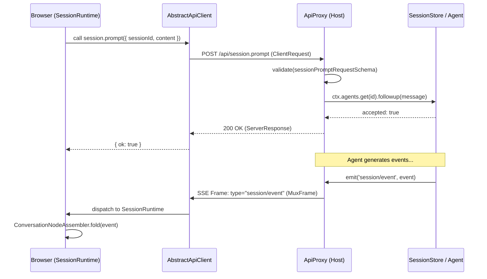

# API Layer & Host-Client Bridge

<details>
<summary>Relevant source files</summary>

The following files were used as context for generating this wiki page:

- [.agents/notes/implemented/architecture/2026-08-02-typert-remote-method-calls.i18n.yaml](.agents/notes/implemented/architecture/2026-08-02-typert-remote-method-calls.i18n.yaml)
- [.agents/notes/implemented/architecture/2026-08-02-typert-remote-method-calls.md](.agents/notes/implemented/architecture/2026-08-02-typert-remote-method-calls.md)
- [.agents/notes/implemented/architecture/2026-08-02-typert-remote-method-calls.zh.md](.agents/notes/implemented/architecture/2026-08-02-typert-remote-method-calls.zh.md)
- [packages/client/connection/src/client/fixture.ts](packages/client/connection/src/client/fixture.ts)
- [packages/host/apiproxy/README.i18n.yaml](packages/host/apiproxy/README.i18n.yaml)
- [packages/host/apiproxy/README.md](packages/host/apiproxy/README.md)
- [packages/host/apiproxy/README.zh.md](packages/host/apiproxy/README.zh.md)
- [packages/host/apiproxy/src/api-proxy.ts](packages/host/apiproxy/src/api-proxy.ts)
- [packages/host/apiproxy/src/api/events.schema.ts](packages/host/apiproxy/src/api/events.schema.ts)
- [packages/host/apiproxy/src/api/events.ts](packages/host/apiproxy/src/api/events.ts)
- [packages/host/apiproxy/src/api/rpc-map.ts](packages/host/apiproxy/src/api/rpc-map.ts)
- [packages/host/apiproxy/src/api/sessions.schema.ts](packages/host/apiproxy/src/api/sessions.schema.ts)
- [packages/host/apiproxy/src/api/sessions.ts](packages/host/apiproxy/src/api/sessions.ts)
- [packages/host/apiproxy/src/fetch/client.ts](packages/host/apiproxy/src/fetch/client.ts)
- [packages/host/apiproxy/src/fetch/handler.ts](packages/host/apiproxy/src/fetch/handler.ts)
- [packages/host/apiproxy/tests/api-proxy-models.spec.ts](packages/host/apiproxy/tests/api-proxy-models.spec.ts)
- [packages/host/apiproxy/tests/api-proxy-projections.spec.ts](packages/host/apiproxy/tests/api-proxy-projections.spec.ts)
- [packages/host/apiproxy/tests/client-handler.spec.ts](packages/host/apiproxy/tests/client-handler.spec.ts)
- [packages/host/apiproxy/tests/fetch-carrier.spec.ts](packages/host/apiproxy/tests/fetch-carrier.spec.ts)
- [packages/host/apiproxy/tests/rpc-schemas.spec.ts](packages/host/apiproxy/tests/rpc-schemas.spec.ts)
- [packages/typert/generator/package.json](packages/typert/generator/package.json)
- [packages/typert/generator/src/analyzer.ts](packages/typert/generator/src/analyzer.ts)
- [packages/typert/generator/src/emitter.ts](packages/typert/generator/src/emitter.ts)
- [packages/typert/generator/src/tsdown-plugin.ts](packages/typert/generator/src/tsdown-plugin.ts)
- [packages/typert/generator/src/workspace.ts](packages/typert/generator/src/workspace.ts)
- [packages/typert/generator/tests/remote-model.spec.ts](packages/typert/generator/tests/remote-model.spec.ts)
- [packages/typert/generator/tests/tsdown-plugin.spec.ts](packages/typert/generator/tests/tsdown-plugin.spec.ts)
- [packages/typert/generator/tsconfig.json](packages/typert/generator/tsconfig.json)
- [packages/typert/registry/src/service.ts](packages/typert/registry/src/service.ts)
- [packages/typert/registry/tests/typert.spec.ts](packages/typert/registry/tests/typert.spec.ts)

</details>


The **API Layer & Host-Client Bridge** provides the communication infrastructure between the Node.js host and the browser-based Web UI. It is designed to be transport-agnostic, type-safe, and capable of handling both unary RPC calls and complex event streaming (SSE).

The system ensures that the client can interact with the host's plugin-based services (like the Agent loop, Filesystem, and Session Store) as if they were local, while maintaining strict validation and error handling boundaries.

### Architecture Overview

The bridge consists of three primary components:
1.  **ApiProxy & RPC Protocol**: The wire protocol and gateway service that routes messages.
2.  **Typert**: A build-time tool that generates TypeScript declarations for remote services, ensuring type safety across the bridge.
3.  **Client Runtime**: The browser-side implementation that manages session state, stream dispatching, and optimistic UI updates.

#### System Entity Map: Host to Client

The following diagram maps the high-level system concepts to the specific code entities that implement them.

```mermaid
graph TD
    subgraph "Host Space (Node.js)"
        ["ApiProxyService"] -- "dispatches" --> ["SessionsApi / HostApi"]
        ["SessionsApi / HostApi"] -- "reads" --> ["SessionStore"]
        ["SessionsApi / HostApi"] -- "executes" --> ["AgentRegistry"]
        ["TypertRemoteService"] -- "generates" --> ["api/remotes"]
    end

    subgraph "Bridge (HTTP/SSE)"
        ["toFetchHandler"] <--> ["AbstractApiClient"]
        ["ServerRequest (SSE)"] -- "MuxFrame / HostFrame" --> ["EventSource"]
    end

    subgraph "Client Space (Browser)"
        ["SessionRuntime"] -- "subscribes" --> ["AbstractApiClient"]
        ["WorkspaceRuntime"] -- "manages" --> ["AbstractApiClient"]
        ["ConversationNodeAssembler"] -- "folds" --> ["SessionRuntime"]
    end

    ["packages/host/apiproxy/src/api-proxy.ts:25-112"]()
    ["packages/host/apiproxy/src/fetch/client.ts:1-50"]()
```
**Sources:** [packages/host/apiproxy/src/api-proxy.ts:25-112](), [packages/host/apiproxy/src/fetch/client.ts:6-10](), [packages/host/apiproxy/README.md:5-21]()

---

## 5.1 API Proxy & RPC Protocol

The `ApiProxy` is the central gateway on the host. It exposes methods for session management, workspace organization, and host-level operations (like directory picking).

-   **Wire Protocol**: Uses a four-quadrant discriminated union: `ClientRequest` (POST body), `ServerResponse` (POST response), `ServerRequest` (SSE frame), and `ClientResponse` (callback POST) [packages/host/apiproxy/README.md:21-21]().
-   **Validation**: Every message is validated using Zod schemas (e.g., `sessionListRequestSchema`, `muxFrameSchema`) at two levels: envelope first, followed by business payload [packages/host/apiproxy/src/api/rpc.schema.ts:104-112](), [packages/host/apiproxy/src/api/sessions.schema.ts:65-116]().
-   **Streaming**: The `events.mux` and `events.host` methods provide Server-Sent Events (SSE) for real-time updates. The `MuxFrame` union carries session-specific data like `session/event`, `session/queue`, and `approval/requested` [packages/host/apiproxy/src/api/events.schema.ts:43-67]().
-   **Session Export**: A specialized non-RPC endpoint `GET /api/session.export` streams a ZIP archive containing raw session artifacts and associated media directly from persistence [packages/host/apiproxy/src/api-proxy.ts:45-53](), [packages/host/apiproxy/README.md:31-31]().

For details, see [API Proxy & RPC Protocol](#5.1).

**Sources:** [packages/host/apiproxy/src/api-proxy.ts:1113-1120](), [packages/host/apiproxy/README.md:21-31](), [packages/host/apiproxy/src/api/rpc.schema.ts:104-115](), [packages/host/apiproxy/src/api/events.schema.ts:43-67]()

---

## 5.2 Typert: Type-Safe RPC Generation

`Typert` is the internal framework for generating "Host-for-Client" remote declarations. It allows host services to be decorated and automatically exposed to the client with full type fidelity.

-   **Decorators**: Uses `@Remote` and `@RemoteScope` to mark Cordis services and methods that should be reachable over the bridge.
-   **Build Pipeline**: The `Analyzer` scans the host source code for decorated classes [packages/typert/generator/src/analyzer.ts:1-20](), and the `Emitter` generates the TypeScript contracts [packages/typert/generator/src/emitter.ts:1-10]().
-   **Service Registry**: `TypertRemoteService` manages the runtime mapping between RPC method names and the actual service instances in the Cordis context [packages/typert/registry/src/service.ts:1-30]().

For details, see [Typert: Type-Safe RPC Generation](#5.2).

**Sources:** [packages/typert/registry/src/service.ts:1-30](), [packages/typert/generator/src/analyzer.ts:1-20](), [packages/typert/generator/src/emitter.ts:1-10]()

---

## 5.3 Client Runtime & Session Management

The Client Runtime translates the raw RPC and SSE streams into a coherent state for the UI.

-   **SessionRuntime**: Manages the lifecycle of a single session, including subscribing to its event muxer and handling history paging via `session.history` [packages/host/apiproxy/README.md:27-29]().
-   **Event Folding**: The `ConversationNodeAssembler` and `foldSurface` logic take raw `SessionEvent` sequences and project them into the message tree [packages/client/connection/src/client/fixture.ts:33-33]().
-   **Projections**: The client maintains a per-session value store (e.g., `sessionListMetadata`, `imageLimits`) updated via `session/projection` frames using a "higher-seq-wins" rule [packages/host/apiproxy/src/api/sessions.ts:18-36](), [packages/host/apiproxy/README.md:29-29]().
-   **Workspace Management**: The `WorkspaceRuntime` synchronizes the list of workspaces and handles session grouping/archiving [packages/host/apiproxy/src/api/workspace.schema.ts:23-30]().

For details, see [Client Runtime & Session Management](#5.3).

**Sources:** [packages/host/apiproxy/README.md:27-33](), [packages/client/connection/src/client/fixture.ts:33-42](), [packages/host/apiproxy/src/api/sessions.ts:18-84]()

---

### Communication Flow Diagram

This diagram illustrates how a user action in the browser travels to the host and back.


**Sources:** [packages/host/apiproxy/src/api-proxy.ts:161-182](), [packages/host/apiproxy/README.md:21-25](), [packages/host/apiproxy/src/api/events.schema.ts:43-67]()
