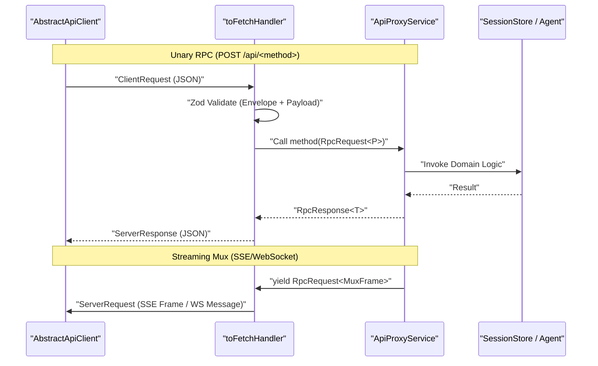
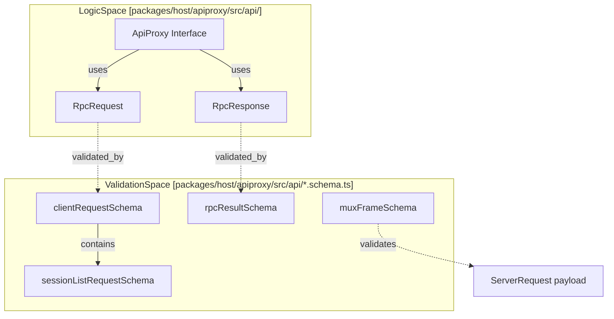
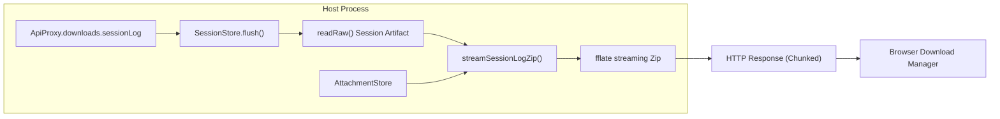

# API Proxy & RPC Protocol

Relevant source files

The following files were used as context for generating this wiki page:

- [.agents/notes/implemented/architecture/2026-07-28-api-browser-trust-boundary.i18n.yaml](.agents/notes/implemented/architecture/2026-07-28-api-browser-trust-boundary.i18n.yaml)
- [.agents/notes/implemented/architecture/2026-07-28-api-browser-trust-boundary.md](.agents/notes/implemented/architecture/2026-07-28-api-browser-trust-boundary.md)
- [.agents/notes/implemented/architecture/2026-07-28-api-browser-trust-boundary.zh.md](.agents/notes/implemented/architecture/2026-07-28-api-browser-trust-boundary.zh.md)
- [.agents/notes/implemented/feature/2026-08-10-web-session-log-export.i18n.yaml](.agents/notes/implemented/feature/2026-08-10-web-session-log-export.i18n.yaml)
- [.agents/notes/implemented/feature/2026-08-10-web-session-log-export.md](.agents/notes/implemented/feature/2026-08-10-web-session-log-export.md)
- [.agents/notes/implemented/feature/2026-08-10-web-session-log-export.zh.md](.agents/notes/implemented/feature/2026-08-10-web-session-log-export.zh.md)
- [packages/client/connection/README.i18n.yaml](packages/client/connection/README.i18n.yaml)
- [packages/client/connection/README.md](packages/client/connection/README.md)
- [packages/client/connection/README.zh.md](packages/client/connection/README.zh.md)
- [packages/client/connection/src/api-request-trust.ts](packages/client/connection/src/api-request-trust.ts)
- [packages/client/connection/src/client/fixture.ts](packages/client/connection/src/client/fixture.ts)
- [packages/client/connection/src/index.ts](packages/client/connection/src/index.ts)
- [packages/host/apiproxy/README.i18n.yaml](packages/host/apiproxy/README.i18n.yaml)
- [packages/host/apiproxy/README.md](packages/host/apiproxy/README.md)
- [packages/host/apiproxy/README.zh.md](packages/host/apiproxy/README.zh.md)
- [packages/host/apiproxy/src/api-proxy.ts](packages/host/apiproxy/src/api-proxy.ts)
- [packages/host/apiproxy/src/api/downloads.schema.ts](packages/host/apiproxy/src/api/downloads.schema.ts)
- [packages/host/apiproxy/src/api/downloads.ts](packages/host/apiproxy/src/api/downloads.ts)
- [packages/host/apiproxy/src/api/events.schema.ts](packages/host/apiproxy/src/api/events.schema.ts)
- [packages/host/apiproxy/src/api/events.ts](packages/host/apiproxy/src/api/events.ts)
- [packages/host/apiproxy/src/api/rpc-map.ts](packages/host/apiproxy/src/api/rpc-map.ts)
- [packages/host/apiproxy/src/api/sessions.schema.ts](packages/host/apiproxy/src/api/sessions.schema.ts)
- [packages/host/apiproxy/src/api/sessions.ts](packages/host/apiproxy/src/api/sessions.ts)
- [packages/host/apiproxy/src/fetch/client.ts](packages/host/apiproxy/src/fetch/client.ts)
- [packages/host/apiproxy/src/fetch/handler.ts](packages/host/apiproxy/src/fetch/handler.ts)
- [packages/host/apiproxy/src/session-export.ts](packages/host/apiproxy/src/session-export.ts)
- [packages/host/apiproxy/tests/api-proxy-models.spec.ts](packages/host/apiproxy/tests/api-proxy-models.spec.ts)
- [packages/host/apiproxy/tests/api-proxy-projections.spec.ts](packages/host/apiproxy/tests/api-proxy-projections.spec.ts)
- [packages/host/apiproxy/tests/client-handler.spec.ts](packages/host/apiproxy/tests/client-handler.spec.ts)
- [packages/host/apiproxy/tests/fetch-carrier.spec.ts](packages/host/apiproxy/tests/fetch-carrier.spec.ts)
- [packages/host/apiproxy/tests/rpc-schemas.spec.ts](packages/host/apiproxy/tests/rpc-schemas.spec.ts)
- [packages/host/apiproxy/tests/session-export.spec.ts](packages/host/apiproxy/tests/session-export.spec.ts)

The API Proxy system serves as the unified communication gateway between the DeepSeek Harness (dsh) host (Node.js) and its clients (Browser/Web UI or In-Process) [[packages/host/apiproxy/README.md:5-5]](). It defines a type-safe RPC protocol using a four-quadrant message model, handles SSE/WebSocket streaming, and enforces strict schema validation via Zod [[packages/host/apiproxy/README.md:21-21]]().

## System Architecture

The architecture decouples the logical API contract from the physical transport carrier. The `ApiProxyService` implements the business logic on the host, while fetch handlers and clients manage the wire serialization [[packages/host/apiproxy/README.md:5-5]]().

### Host-Client Data Flow
The following diagram illustrates the flow of a request from the Web Client to the Host Service through the proxy layers.

**Diagram: RPC Request & Response Lifecycle**

Sources: [[packages/host/apiproxy/README.md:21-21]](), [[packages/host/apiproxy/src/fetch/handler.ts:5-5]](), [[packages/host/apiproxy/src/api-proxy.ts:156-160]]()

## RPC Protocol Definition

The protocol uses a discriminated union of four message types, ensuring that responses always echo the `rpcId` of the initiator [[packages/host/apiproxy/README.md:21-21]]().

### Message Quadrants
| Message Type | Direction | Usage |
| :--- | :--- | :--- |
| `ClientRequest` | Client → Host | Initiates a method call (e.g., `session.list`). |
| `ServerResponse` | Host → Client | Returns the result of a `ClientRequest`. |
| `ServerRequest` | Host → Client | Pushes asynchronous events (SSE/WS frames). |
| `ClientResponse` | Client → Host | Answers a host-initiated question (e.g., `respond`). |

Sources: [[packages/host/apiproxy/README.md:21-21]](), [[packages/host/apiproxy/src/api/rpc.ts:95-96]]()

### Key RPC Methods
The `RpcMethodMap` defines the available operations across several domains:
*   **`session.*`**: `list`, `create`, `history`, `prompt`, `rename`, `fork`, `models`, `selectModel`, `updateQueue`, `cancel` [[packages/host/apiproxy/src/api/sessions.ts:2-5]]().
*   **`host.*`**: `describe`, `pickDirectory`, `listDirectory`, `openPath` [[packages/host/apiproxy/src/api/host.schema.ts:18-21]]().
*   **`events.*`**: `mux` (Session-specific events), `host` (Global host events) [[packages/host/apiproxy/tests/client-handler.spec.ts:131-131]]().

## Schema Validation & Type Safety

Every message crossing the wire is validated twice: first for the envelope structure, and second for the method-specific business payload [[packages/host/apiproxy/README.md:21-21]]().

### Zod Integration
The system uses Zod schemas to anchor the TypeScript types:
*   **`sessionIdSchema`**: Brands strings as `SessionId` after validation [[packages/host/apiproxy/src/api/sessions.schema.ts:27-27]]().
*   **`rpcResultSchema`**: Handles the `ok: true | false` branching for all responses [[packages/host/apiproxy/src/api/rpc.schema.ts:93-93]]().
*   **`sessionEventSchema`**: Provides a strict envelope for events while allowing wide data passthrough for extensibility [[packages/host/apiproxy/src/api/sessions.schema.ts:41-49]]().

**Diagram: Code Entity Mapping (Logic to Schema)**

Sources: [[packages/host/apiproxy/src/api/rpc.schema.ts:4-6]](), [[packages/host/apiproxy/src/api/sessions.schema.ts:65-67]](), [[packages/host/apiproxy/src/api/rpc-map.ts:1-5]](), [[packages/host/apiproxy/src/api/events.schema.ts:43-43]]()

## Streaming & Projections

The proxy handles real-time updates through a combination of SSE (Server-Sent Events) and a projection system.

### SSE and WebSocket Downlinks
*   **In-Process**: Uses an isomorphic `toFetchHandler` with an SSE codec [[packages/host/apiproxy/src/fetch/handler.ts:5-10]]().
*   **Web**: The browser opens dedicated WebSocket downlinks for `events.mux` and `events.host` [[packages/host/apiproxy/README.md:29-29]]().

### Session Projections
The `session.history` tail page carries a `projections` block, which is a watermark snapshot of registered units (e.g., `sessionListMetadata`, `imageLimits`) [[packages/host/apiproxy/README.md:29-29]]().
*   **`sessionListMetadata`**: Caches blank-state transitions and latest prompt times for efficient listing [[packages/host/apiproxy/src/api/sessions.ts:39-44]]().
*   **`imageLimits`**: Publishes host-enforced attachment constraints to the client [[packages/host/apiproxy/src/api/sessions.ts:34-34]]().

## Session Export Endpoint

The system provides a non-RPC binary streaming endpoint for exporting session logs as ZIP archives [[packages/host/apiproxy/README.md:31-31]]().

*   **Endpoint**: `GET /api/session.export?sessionId=...` [[packages/host/apiproxy/README.md:31-31]]().
*   **Implementation**: `streamSessionLogZip` uses the `fflate` streaming API to compress logs and referenced media on-the-fly [[packages/host/apiproxy/src/session-export.ts:50-50]](), [[packages/host/apiproxy/README.md:31-31]]().
*   **Durability**: Triggers a `SessionStore.flush` before reading raw artifacts to ensure data consistency [[packages/host/apiproxy/README.md:31-31]]().

**Diagram: Session Export Data Flow**

Sources: [[packages/host/apiproxy/src/session-export.ts:45-53]](), [[packages/host/apiproxy/README.md:31-31]](), [[packages/host/apiproxy/src/api-proxy.ts:133-133]]()
