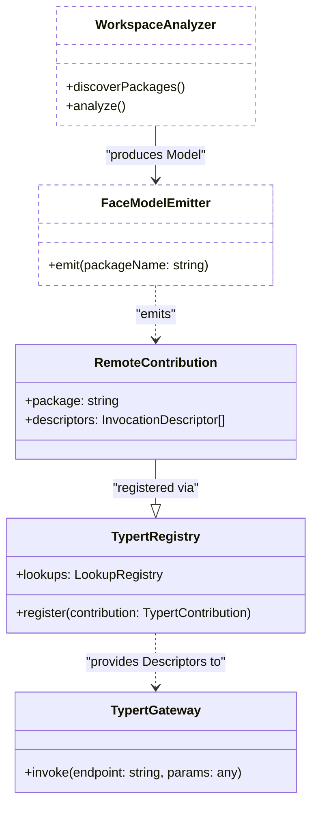

# Typert: Type-Safe RPC Generation

<details>
<summary>Relevant source files</summary>

The following files were used as context for generating this wiki page:

- [.agents/notes/implemented/architecture/2026-07-28-portable-execution-world-consumers.i18n.yaml](.agents/notes/implemented/architecture/2026-07-28-portable-execution-world-consumers.i18n.yaml)
- [.agents/notes/implemented/architecture/2026-07-28-portable-execution-world-consumers.md](.agents/notes/implemented/architecture/2026-07-28-portable-execution-world-consumers.md)
- [.agents/notes/implemented/architecture/2026-07-28-portable-execution-world-consumers.zh.md](.agents/notes/implemented/architecture/2026-07-28-portable-execution-world-consumers.zh.md)
- [.agents/notes/implemented/architecture/2026-08-02-typert-remote-method-calls.i18n.yaml](.agents/notes/implemented/architecture/2026-08-02-typert-remote-method-calls.i18n.yaml)
- [.agents/notes/implemented/architecture/2026-08-02-typert-remote-method-calls.md](.agents/notes/implemented/architecture/2026-08-02-typert-remote-method-calls.md)
- [.agents/notes/implemented/architecture/2026-08-02-typert-remote-method-calls.zh.md](.agents/notes/implemented/architecture/2026-08-02-typert-remote-method-calls.zh.md)
- [packages/typert/README.i18n.yaml](packages/typert/README.i18n.yaml)
- [packages/typert/generator/package.json](packages/typert/generator/package.json)
- [packages/typert/generator/src/analyzer.ts](packages/typert/generator/src/analyzer.ts)
- [packages/typert/generator/src/emitter.ts](packages/typert/generator/src/emitter.ts)
- [packages/typert/generator/src/tsdown-plugin.ts](packages/typert/generator/src/tsdown-plugin.ts)
- [packages/typert/generator/src/workspace.ts](packages/typert/generator/src/workspace.ts)
- [packages/typert/generator/tests/remote-model.spec.ts](packages/typert/generator/tests/remote-model.spec.ts)
- [packages/typert/generator/tests/tsdown-plugin.spec.ts](packages/typert/generator/tests/tsdown-plugin.spec.ts)
- [packages/typert/generator/tsconfig.json](packages/typert/generator/tsconfig.json)
- [packages/typert/registry/src/service.ts](packages/typert/registry/src/service.ts)
- [packages/typert/registry/tests/typert.spec.ts](packages/typert/registry/tests/typert.spec.ts)

</details>


Typert is the type-safe Remote Procedure Call (RPC) system in DeepSeek Harness (`dsh`) that bridges the Node.js Host environment and the browser Client runtime. It eliminates manual boilerplate by automatically generating client-side proxy declarations from decorated Host service classes, ensuring compile-time type safety across the network boundary.

## Implementation Overview

Typert operates as a build-time analyzer and a runtime registry. It identifies services intended for remote exposure, extracts their method signatures, and emits platform-independent TypeScript contracts used by the browser to invoke Host-side logic without importing Host implementation code.

### The Build Pipeline

The Typert build pipeline is integrated into the workspace via a generator that coordinates discovery, analysis, and emission [packages/typert/generator/src/workspace.ts:19-25](). It consists of two primary phases:

1.  **Analysis**: The `WorkspaceAnalyzer` uses the TypeScript Compiler API to scan source files [packages/typert/generator/src/analyzer.ts:1-10](). It targets classes that extend `TypertRemoteService` or use the `@Remote` and `@RemoteScope` decorators [packages/typert/generator/src/analyzer.ts:80-110](). It constructs a `WorkspaceModel` containing the extracted types and metadata [packages/typert/generator/src/model.ts:43]().
2.  **Emission**: The `FaceModelEmitter` transforms the analyzed model into generated artifacts [packages/typert/generator/src/emitter.ts:10-15](). These include `.d.ts` interfaces for the client, `.js` reflection descriptors, and `.d.ts.map` files that allow editor "Go to Definition" to navigate from the client proxy back to the Host source [packages/typert/generator/src/emitter.ts:130-150]().

### Data Flow: From Host to Client

```mermaid
graph TD
    subgraph "Host Environment (Node.js)"
        ["@Remote Class"] -- "extends" --> B["TypertRemoteService"]
        B -- "registers with" --> C["ctx.typertGateway"]
    end

    subgraph "Build Pipeline (Typert Generator)"
        D["WorkspaceAnalyzer"] -- "extracts metadata" --> E["InvocationDescriptor"]
        E -- "FaceModelEmitter" --> F["typert.remote-client.d.ts"]
        E -- "generates Zod" --> G["typert.remote-client.js"]
    end

    subgraph "Client Environment (Browser)"
        F -- "Static Type" --> H["ctx.remote"]
        G -- "Runtime Descriptor" --> H
        H -- "ctx.connection.rpc" --> I["/api RPC Channel"]
    end

    I -- "Network" --> C
    C -- "Invokes" --> B
```

**Sources:** [packages/typert/generator/src/workspace.ts:19-52](), [packages/typert/registry/src/service.ts:182-200](), [.agents/notes/implemented/architecture/2026-08-02-typert-remote-method-calls.md:19-26]()

## Key Decorators and Service Registration

Typert relies on Cordis-integrated decorators and base classes to mark services for remote exposure while maintaining strict separation between the Host and Client programs.

### `@Remote` and `@RemoteScope`
*   **`@Remote(name?)`**: Marks a method or class as remote-accessible [packages/typert/generator/src/analyzer.ts:80-110](). If a name is provided, it serves as the wire alias; otherwise, the member name is used [.agents/notes/implemented/architecture/2026-08-02-typert-remote-method-calls.md:88-95]().
*   **`@RemoteScope(context, name?)`**: Used when the service receiver must be resolved within an isolated context (e.g., an `Agent` context) rather than the global host context [.agents/notes/implemented/architecture/2026-08-02-typert-remote-method-calls.md:67-80]().

### `TypertRemoteService`
Business services typically extend `TypertRemoteService` and pass their Cordis service key to `super()` [.agents/notes/implemented/architecture/2026-08-02-typert-remote-method-calls.md:47-51](). This establishes the default wire namespace.

| Entity | Role | Source |
| :--- | :--- | :--- |
| `TypertRemoteService` | Base class for Host services providing remote bindings | [packages/typert/registry/src/service.ts:31-32]() |
| `InvocationDescriptor` | The canonical metadata exchanged between registry and gateway | [packages/typert/registry/src/service.ts:11-12]() |
| `TypertRegistry` | Cordis service (`ctx.typert`) managing reflection and lookups | [packages/typert/registry/src/service.ts:412-420]() |

**Sources:** [packages/typert/registry/src/service.ts:1-70](), [.agents/notes/implemented/architecture/2026-08-02-typert-remote-method-calls.md:28-40]()

## Invocation Descriptors and Codecs

Typert does not just generate types; it generates runtime validation logic using Zod.

### Descriptor Composition
The `InvocationDescriptor` is the "source of truth" for a remote call [packages/typert/registry/src/service.ts:121-125](). It contains:
*   **Namespace/Method**: Routing information.
*   **Parameters**: A list of arguments, identifying which are JSON data and which are `lookup` objects (like `Agent` or `Session`) that need server-side resolution [packages/typert/registry/src/service.ts:135-140]().
*   **Codecs**: Zod schemas for validating request payloads and result shapes [packages/typert/registry/src/service.ts:285-300]().

### Lookup Resolution
When a method defines a parameter as a business object (e.g., `agent: Agent`), Typert generates a descriptor indicating that the client should send an `agentId` [packages/typert/generator/tests/remote-model.spec.ts:77-84](). The Host-side `ctx.typert.lookups` registry is responsible for resolving that ID into a live object before the business method is called [.agents/notes/implemented/architecture/2026-08-02-typert-remote-method-calls.zh.md:100-112]().

### Code Entity Space Mapping

This diagram maps the logical Typert components to their specific TypeScript implementations and file locations.



**Sources:** [packages/typert/generator/src/workspace.ts:1-66](), [packages/typert/registry/src/service.ts:107-250](), [packages/typert/registry/src/service.ts:412-450]()

## RPC Protocol and Execution

When a client invokes a method on `ctx.remote.<namespace>`:
1.  **Client Proxy**: The `ctx.remote` service uses the generated `InvocationDescriptor` to validate arguments and identify the endpoint [.agents/notes/implemented/architecture/2026-08-02-typert-remote-method-calls.md:36]().
2.  **Transport**: The call is delegated to `ctx.connection.rpc`, which handles serialization and network transport (HTTP or WebSocket) [.agents/notes/implemented/architecture/2026-08-02-typert-remote-method-calls.md:35-36]().
3.  **Host Gateway**: `ctx.typertGateway` receives the request, resolves any `lookup` parameters using `ctx.typert.lookups`, and validates JSON data against the Zod codecs [packages/typert/registry/src/service.ts:34-35]().
4.  **Execution**: The gateway resolves the target service instance from the Cordis context and executes the implementation method [.agents/notes/implemented/architecture/2026-08-02-typert-remote-method-calls.md:34]().
5.  **Cancellation**: If the method accepts an `AbortSignal` as the last parameter, Typert generates a client-side optional signal parameter to support cooperative cancellation [.agents/notes/implemented/architecture/2026-08-02-typert-remote-method-calls.zh.md:86-88]().

**Sources:** [packages/typert/registry/src/service.ts:5-180](), [.agents/notes/implemented/architecture/2026-08-02-typert-remote-method-calls.md:1-42]()
