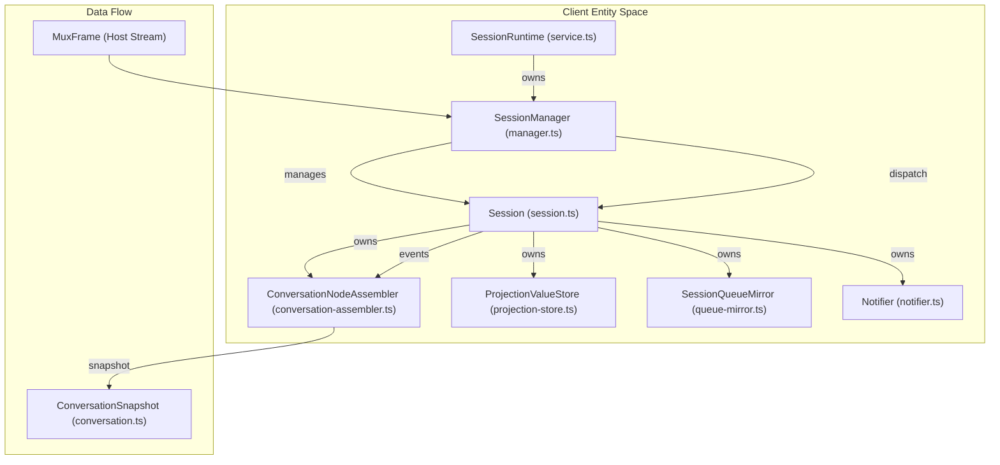
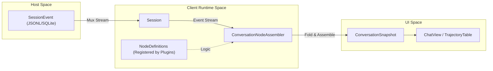

# Client Runtime & Session Management

Relevant source files

The following files were used as context for generating this wiki page:

- [.agents/notes/proposed/architecture/2026-07-24-domain-kv-storage-and-workspace.i18n.yaml](.agents/notes/proposed/architecture/2026-07-24-domain-kv-storage-and-workspace.i18n.yaml)
- [.agents/notes/proposed/architecture/2026-07-24-domain-kv-storage-and-workspace.md](.agents/notes/proposed/architecture/2026-07-24-domain-kv-storage-and-workspace.md)
- [.agents/notes/proposed/architecture/2026-07-24-domain-kv-storage-and-workspace.zh.md](.agents/notes/proposed/architecture/2026-07-24-domain-kv-storage-and-workspace.zh.md)
- [packages/client/runtime/README.i18n.yaml](packages/client/runtime/README.i18n.yaml)
- [packages/client/runtime/README.md](packages/client/runtime/README.md)
- [packages/client/runtime/README.zh.md](packages/client/runtime/README.zh.md)
- [packages/client/runtime/src/client/contract/workspaces.ts](packages/client/runtime/src/client/contract/workspaces.ts)
- [packages/client/runtime/src/client/index.ts](packages/client/runtime/src/client/index.ts)
- [packages/client/runtime/src/client/sessions/conversation.ts](packages/client/runtime/src/client/sessions/conversation.ts)
- [packages/client/runtime/src/client/sessions/manager.ts](packages/client/runtime/src/client/sessions/manager.ts)
- [packages/client/runtime/src/client/sessions/service.ts](packages/client/runtime/src/client/sessions/service.ts)
- [packages/client/runtime/src/client/sessions/session.ts](packages/client/runtime/src/client/sessions/session.ts)
- [packages/client/runtime/src/client/workspaces/manager.ts](packages/client/runtime/src/client/workspaces/manager.ts)
- [packages/client/runtime/src/client/workspaces/service.ts](packages/client/runtime/src/client/workspaces/service.ts)
- [packages/workspace/README.md](packages/workspace/README.md)
- [packages/workspace/workspace/README.i18n.yaml](packages/workspace/workspace/README.i18n.yaml)
- [packages/workspace/workspace/README.md](packages/workspace/workspace/README.md)
- [packages/workspace/workspace/README.zh.md](packages/workspace/workspace/README.zh.md)
- [packages/workspace/workspace/package.json](packages/workspace/workspace/package.json)
- [packages/workspace/workspace/src/entity.ts](packages/workspace/workspace/src/entity.ts)
- [packages/workspace/workspace/src/index.ts](packages/workspace/workspace/src/index.ts)
- [packages/workspace/workspace/src/invariant.ts](packages/workspace/workspace/src/invariant.ts)
- [packages/workspace/workspace/src/paths.ts](packages/workspace/workspace/src/paths.ts)
- [packages/workspace/workspace/src/spec.ts](packages/workspace/workspace/src/spec.ts)
- [packages/workspace/workspace/src/types.ts](packages/workspace/workspace/src/types.ts)
- [packages/workspace/workspace/tests/invariant.spec.ts](packages/workspace/workspace/tests/invariant.spec.ts)
- [packages/workspace/workspace/tests/workspace.spec.ts](packages/workspace/workspace/tests/workspace.spec.ts)
- [packages/workspace/workspace/tsconfig.json](packages/workspace/workspace/tsconfig.json)

The Client Runtime provides the browser-side orchestration layer for DeepSeek Harness. It manages the lifecycle of sessions and workspaces, handles real-time stream multiplexing from the host, and assembles raw event logs into high-level conversation snapshots for the UI.

## Overview & Service Architecture

The runtime is built on the Cordis framework, utilizing service injection to provide `ctx.sessions` and `ctx.workspaces` to the browser environment [[packages/client/runtime/src/client/index.ts:11-13]](). It maintains a local mirror of host state, allowing for React-free object management and efficient UI updates through a snapshot-based store [[packages/client/runtime/README.md:5-5]]().

### Key Runtime Services
*   **`SessionRuntime`**: Root sessions service managing the `SessionManager`, session list snapshot store, and the Agent scope tree (client-side mirror of `dsh-scope`) [[packages/client/runtime/src/client/sessions/service.ts:1-7]]().
*   **`WorkspaceRuntime`**: Manages the `WorkspaceManager`, workspace list, and the "New Session" logic that connects workspaces to sessions [[packages/client/runtime/src/client/workspaces/service.ts:51-55]]().
*   **`SlotRegistry`**: Supplies renderer data sources and manages UI extension points via `ctx.slots.inject` [[packages/client/runtime/README.md:5-5]](), [[packages/client/runtime/README.md:11-13]]().

**Sources:** [[packages/client/runtime/src/client/index.ts:1-13]](), [[packages/client/runtime/src/client/sessions/service.ts:1-40]](), [[packages/client/runtime/README.md:1-16]]()

## Session Management

A `Session` object represents a single conversation thread. Sessions remain resident in memory after creation to continue consuming multiplexed (mux) frames even when off-screen [[packages/client/runtime/src/client/sessions/session.ts:1-1]]().

### The Session Lifecycle
Sessions are always born on the Host (via `session.create`) and mirrored to the client [[packages/client/runtime/README.md:5-5]]().

1.  **Creation**: Initiated via `SessionRuntime.create`. The host generates a `SessionId` which the client uses to track the session in its list mirror [[packages/client/runtime/src/client/sessions/service.ts:107-120]]().
2.  **Opening**: When a session is selected (staged), the client opens a history window and begins consuming live mux frames [[packages/client/runtime/src/client/sessions/service.ts:8-15]]().
3.  **Mux Frame Dispatch**: The `SessionManager` routes incoming `MuxFrame` packets from the shared host stream to the specific `Session` instance [[packages/client/runtime/src/client/sessions/manager.ts:106-111]]().
4.  **Pruning**: When a session is removed from the list, its client-side `AgentScope` is destroyed [[packages/client/runtime/README.md:5-5]]().

### History Paging & Gap Repair
Sessions manage their own event windows using a paging mechanism (defaulting to 50 messages per page) [[packages/client/runtime/src/client/sessions/session.ts:32-32]]().

*   **History Loading**: `loadingOlder` tracks in-flight RPC requests for previous history pages [[packages/client/runtime/src/client/sessions/session.ts:80-80]]().
*   **Stitching & Gap Repair**: If a sequence gap is detected between the history baseline and live frames, the session enters a `stitching` state. Live events detour to a `liveBuffer` until the missing tail page lands, at which point they are stitched by sequence ID [[packages/client/runtime/src/client/sessions/session.ts:104-107]]().
*   **Queue Mirroring**: The `SessionQueueMirror` tracks the authoritative stream-only inbox snapshot provided by the host [[packages/client/runtime/src/client/sessions/session.ts:85-85]]().

### Entity Space: Session Components
The following diagram maps the logical session concepts to their code implementations.

**Sources:** [[packages/client/runtime/src/client/sessions/session.ts:65-126]](), [[packages/client/runtime/src/client/sessions/manager.ts:106-130]](), [[packages/client/runtime/src/client/sessions/service.ts:34-39]]()

## Conversation Assembly

The `ConversationNodeAssembler` is responsible for transforming a raw `SessionEvent` log into a structured `ConversationSnapshot` for the UI [[packages/client/runtime/src/client/sessions/session.ts:87-87]]().

### The Assembly Pipeline
1.  **Definition Mapping**: Plugins register `ConversationNodeDefinition` objects that map specific events to business nodes (e.g., User Message, Assistant Message, Tool Call) [[packages/client/runtime/README.zh.md:47-49]]().
2.  **State Folding**: The assembler folds updates (like streaming assistant chunks) into existing nodes based on stable IDs [[packages/client/runtime/README.zh.md:47-49]]().
3.  **Location Indexing**: It maintains a `ConversationLocationIndex` for stable referencing of Turns and Steps [[packages/client/runtime/src/client/index.ts:24-25]]().
4.  **Snapshot Publication**: The final `ConversationSnapshot` is published to the UI. It contains `nodes`, `partial` (streaming) content, and `runningCalls` [[packages/client/runtime/src/client/sessions/conversation.ts:211-224]]().

### Conversation Data Flow
This diagram illustrates how raw host events become UI-ready snapshots.

**Sources:** [[packages/client/runtime/README.zh.md:47-53]](), [[packages/client/runtime/src/client/sessions/conversation.ts:1-6]](), [[packages/client/runtime/src/client/sessions/session.ts:87-87]]()

## Workspace & Session Interaction

The `WorkspaceRuntime` manages the relationship between file system directories (Workspaces) and conversation threads (Sessions).

### Workspace-Session Logic
*   **`connectWorkspace(workspaceId)`**: Resolves which session a "New Session" flow should use. It first attempts to reuse an existing **blank** session targeting the same path and workspace membership. If none is found, it calls `session.create` on the host [[packages/client/runtime/src/client/workspaces/service.ts:89-116]]().
*   **Blank Session Reuse**: A session is considered "blank" if its log is empty (`SessionSummary.blank`). Once a prompt is accepted or a tool starts running, the blank bit is flipped to `false` [[packages/client/runtime/README.zh.md:37-39]]().
*   **Archiving**: `archiveSession(sessionId)` moves a session into a registry-global archive set. These sessions are hidden from grouping surfaces, but their logs and accounting slots remain [[packages/client/runtime/src/client/contract/workspaces.ts:88-93]]().

## Projection Management

DeepSeek Harness uses a **Push-Model Projection** system for domain-specific data (like TODOs or session titles).

*   **`ProjectionValueStore`**: Each session owns a store that holds host-computed values computed on the host and seeded by the history-tail projections block [[packages/client/runtime/src/client/sessions/session.ts:112-123]]().
*   **Higher-Seq-Wins**: Updates arrive via `session/projection` frames. The store applies a "higher sequence wins" rule to ensure consistency during out-of-order delivery or reconnection [[packages/client/runtime/README.md:5-5]]().
*   **UI Access**: Domain packages use the `useProjection(key)` hook to read these values without needing to scan the entire conversation history [[packages/client/runtime/src/client/sessions/session.ts:116-118]]().

## Implementation Details Summary

| Class / Concept | File Path | Role |
| :--- | :--- | :--- |
| `Session` | `.../sessions/session.ts` | Manages the event window, history paging, and projection store for one thread [[packages/client/runtime/src/client/sessions/session.ts:65-65]](). |
| `SessionManager` | `.../sessions/manager.ts` | Dispatches mux frames and maintains the session list mirror [[packages/client/runtime/src/client/sessions/manager.ts:106-106]](). |
| `WorkspaceManager` | `.../workspaces/manager.ts` | Handles workspace baselines, reordering, and incremental frame updates [[packages/client/runtime/src/client/workspaces/manager.ts:35-35]](). |
| `ConversationNodeAssembler` | `.../sessions/conversation-assembler.ts` | The core engine for folding raw events into UI-ready nodes [[packages/client/runtime/src/client/sessions/session.ts:87-87]](). |
| `ProjectionValueStore` | `.../sessions/projection-store.ts` | Stores host-computed domain values (e.g., titles, todos) [[packages/client/runtime/src/client/sessions/session.ts:123-123]](). |
| `PendingWait` | `.../sessions/pending.ts` | Tracks user interactions blocking the agent (approvals, questions) [[packages/client/runtime/src/client/sessions/pending.ts:22-22]](). |

**Sources:** [[packages/client/runtime/src/client/sessions/session.ts:65-126]](), [[packages/client/runtime/src/client/sessions/manager.ts:106-130]](), [[packages/client/runtime/src/client/workspaces/manager.ts:35-72]](), [[packages/client/runtime/README.md:5-5]]()
