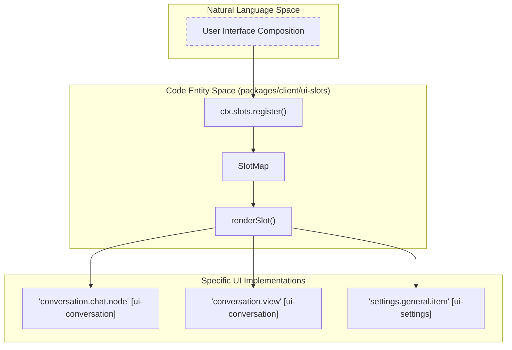
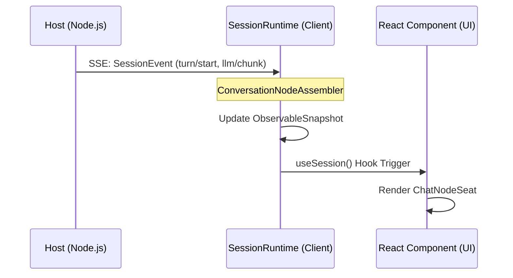

# Web UI

Relevant source files

The following files were used as context for generating this wiki page:

- [apps/web/.npmignore](apps/web/.npmignore)
- [apps/web/package.json](apps/web/package.json)
- [apps/web/tests/vite-entry.e2e.ts](apps/web/tests/vite-entry.e2e.ts)
- [apps/web/vite.config.ts](apps/web/vite.config.ts)
- [packages/client/connection/package.json](packages/client/connection/package.json)
- [packages/client/locale/package.json](packages/client/locale/package.json)
- [packages/client/tsdown.client.ts](packages/client/tsdown.client.ts)
- [packages/client/ui-agent-preset/package.json](packages/client/ui-agent-preset/package.json)
- [packages/client/ui-conversation/README.i18n.yaml](packages/client/ui-conversation/README.i18n.yaml)
- [packages/client/ui-conversation/README.md](packages/client/ui-conversation/README.md)
- [packages/client/ui-conversation/README.zh.md](packages/client/ui-conversation/README.zh.md)
- [packages/client/ui-conversation/package.json](packages/client/ui-conversation/package.json)
- [packages/client/ui-conversation/src/client/apply.ts](packages/client/ui-conversation/src/client/apply.ts)
- [packages/client/ui-conversation/src/client/chat/AssistantMarkdown.module.css](packages/client/ui-conversation/src/client/chat/AssistantMarkdown.module.css)
- [packages/client/ui-conversation/src/client/chat/AssistantMarkdown.tsx](packages/client/ui-conversation/src/client/chat/AssistantMarkdown.tsx)
- [packages/client/ui-conversation/src/client/chat/ChatView.tsx](packages/client/ui-conversation/src/client/chat/ChatView.tsx)
- [packages/client/ui-conversation/src/client/chat/MessageIconActions.module.css](packages/client/ui-conversation/src/client/chat/MessageIconActions.module.css)
- [packages/client/ui-conversation/src/client/chat/MessageIconActions.tsx](packages/client/ui-conversation/src/client/chat/MessageIconActions.tsx)
- [packages/client/ui-conversation/src/client/chat/MessageItem.module.css](packages/client/ui-conversation/src/client/chat/MessageItem.module.css)
- [packages/client/ui-conversation/src/client/chat/MessageItem.tsx](packages/client/ui-conversation/src/client/chat/MessageItem.tsx)
- [packages/client/ui-conversation/src/client/contract/slots.ts](packages/client/ui-conversation/src/client/contract/slots.ts)
- [packages/client/ui-conversation/src/client/skeleton/ConversationRoot.tsx](packages/client/ui-conversation/src/client/skeleton/ConversationRoot.tsx)
- [packages/client/ui-conversation/src/client/skeleton/InputBar.tsx](packages/client/ui-conversation/src/client/skeleton/InputBar.tsx)
- [packages/client/ui-conversation/tsconfig.json](packages/client/ui-conversation/tsconfig.json)
- [packages/client/ui-directory-picker-native/package.json](packages/client/ui-directory-picker-native/package.json)
- [packages/client/ui-layout/package.json](packages/client/ui-layout/package.json)
- [packages/client/ui-settings/package.json](packages/client/ui-settings/package.json)
- [packages/client/ui-sidebar/package.json](packages/client/ui-sidebar/package.json)
- [packages/client/ui-skill/package.json](packages/client/ui-skill/package.json)
- [packages/client/ui-theme/package.json](packages/client/ui-theme/package.json)
- [packages/client/ui-tool/package.json](packages/client/ui-tool/package.json)
- [packages/client/ui-trajectory/package.json](packages/client/ui-trajectory/package.json)
- [packages/client/ui-workspace/package.json](packages/client/ui-workspace/package.json)
- [packages/extensions/cordis-client-runner/package.json](packages/extensions/cordis-client-runner/package.json)
- [packages/extensions/cordis-host-runner/package.json](packages/extensions/cordis-host-runner/package.json)
- [packages/extensions/ui-cordis/package.json](packages/extensions/ui-cordis/package.json)
- [packages/interaction/commands/package.json](packages/interaction/commands/package.json)
- [packages/typert/generator/tests/fixtures/remote-model/packages/remote/package.json](packages/typert/generator/tests/fixtures/remote-model/packages/remote/package.json)
- [scripts/client-bundle-purity.spec.ts](scripts/client-bundle-purity.spec.ts)
- [scripts/publication-payload.spec.ts](scripts/publication-payload.spec.ts)
- [scripts/publication-payload.ts](scripts/publication-payload.ts)
- [scripts/rescope-vendor.ts](scripts/rescope-vendor.ts)
- [tsconfig.client.json](tsconfig.client.json)

The DeepSeek Harness (dsh) Web UI is a modular, plugin-based React application built on the **Cordis** framework. It provides a rich, extensible environment for interacting with AI agents, managing code workspaces, and inspecting execution trajectories. The architecture emphasizes a strict separation between the browser-side presentation logic and the host-side execution logic, bridged by a type-safe RPC layer.

## Plugin Architecture & UI Composition

The UI is not a monolithic application but a composition of independent packages that register components into **slots**. This allows features like "Code Mode," "Trajectory Inspection," or "MCP Tool Views" to be added or removed without modifying the core shell. The `ui-conversation` package, for instance, provides the skeleton (header, tabs, composer) while delegating tool presentation to `ui-tool` [packages/client/ui-conversation/README.md:5]().

### Core UI Package Hierarchy

| Package | Role | Key Entities |
| :--- | :--- | :--- |
| `ui-slots` | Slot & Injection Kernel | `ctx.slots`, `renderSlot`, `inject` |
| `ui-layout` | Main App Frame | `AppFrame`, `Sidebar`, `ConversationColumn` |
| `ui-conversation` | Chat & Message Flow | `ConversationRoot`, `ChatView`, `InputBar` |
| `ui-workspace` | File & Session Browser | `WorkspaceBrowser`, `SessionTree` |
| `ui-tool` | Tool Call Rendering | `ToolCallNode`, `RecursiveToolTree` |

The UI relies on **Context Merging** via Cordis to allow plugins to contribute to the global state and service registry [tsconfig.client.json:3-6]().

### UI Slot Registry System

The UI composition is driven by the `ctx.slots` service. Packages register "entries" into named slots, which are then rendered by the owner of that slot. For example, `ui-conversation` registers `ChatView` as the default entry for the `conversation.view` slot [packages/client/ui-conversation/src/client/apply.ts:153-158]().

**Sources:** [packages/client/ui-conversation/src/client/contract/slots.ts:60-71](), [packages/client/ui-conversation/src/client/apply.ts:137-141]()

## Key UI Components

### 1. Conversation & Chat Flow
The `ui-conversation` package manages the primary interaction surface. It handles message streaming, "Think" block rendering with real-time throughput [packages/client/ui-conversation/README.md:21](), and the **Composer** takeover mechanism for approvals and questions [packages/client/ui-conversation/README.md:17]().
*   **ConversationRoot**: The resident skeleton surviving session transitions and managing the workspace picker [packages/client/ui-conversation/src/client/skeleton/ConversationRoot.tsx:15-22]().
*   **ChatView**: A stable keyed parent list over business nodes that handles paging and bottom-following [packages/client/ui-conversation/src/client/chat/ChatView.tsx:1-5]().
*   **InputBar**: The default composer body with attachment support, permission selection, and context metering [packages/client/ui-conversation/src/client/skeleton/InputBar.tsx:39-46]().

For details, see [Conversation UI & Chat View](#6.1).

### 2. Workspace & Sidebar
The `ui-workspace` and `ui-sidebar` packages manage the navigation and file-system context.
*   **WorkspaceBrowser**: Handles directory adoption and session tree rendering.
*   **AppFrame**: Manages the multi-column layout and collapsed/expanded sidebar states.

For details, see [Workspace Browser & Sidebar](#6.2).

### 3. Tool & Trajectory Inspection
Tools are rendered via a recursive tree structure in `ui-tool`, while the execution history is visualized through trajectory views.
*   **TrajectoryTable**: A ledger-style view of agent steps.
*   **ToolView**: Keyed dispatch for specific tool outputs (e.g., shell, filesystem) via `conversation.details.tool` [packages/client/ui-conversation/README.md:23]().

For details, see [UI Primitives, Trajectory & Tool Views](#6.3).

### 4. Settings & Presets
Global configuration and agent authoring are handled by specialized settings packages.
*   **Model Selection**: Routing and adapter configuration.
*   **Agent Presets**: Authoring system instructions and tool permissions.
*   **Enter Behavior**: Configurable via `settings.general.item` to toggle between "Queue" and "Steer" modes [packages/client/ui-conversation/src/client/apply.ts:137-146]().

For details, see [Settings, Agent Presets & Onboarding](#6.4).

## Data Flow: Host to Browser

The UI interacts with the host through a type-safe bridge. The `SessionRuntime` in the browser mirrors the host's `Session` state, providing observable snapshots to React components via hooks like `useSession` [packages/client/ui-conversation/src/client/contract/slots.ts:5-12]().

**Sources:** [packages/client/ui-conversation/src/client/chat/ChatView.tsx:12-15](), [packages/client/ui-conversation/src/client/contract/slots.ts:101-103](), [packages/client/ui-conversation/src/client/apply.ts:80-88]()

## Build & Distribution

The Web UI is bundled using **Vite** [apps/web/vite.config.ts:2](). The build pipeline optimizes for performance by splitting large dependencies (like KaTeX, Shiki, and Markdown parsers) into a stable `vendor` chunk [apps/web/vite.config.ts:59-79](). It uses **tsdown** for client-side package aggregation [packages/client/tsdown.client.ts:1]().

**Sources:** [apps/web/vite.config.ts:110-115](), [tsconfig.client.json:1-10]()
