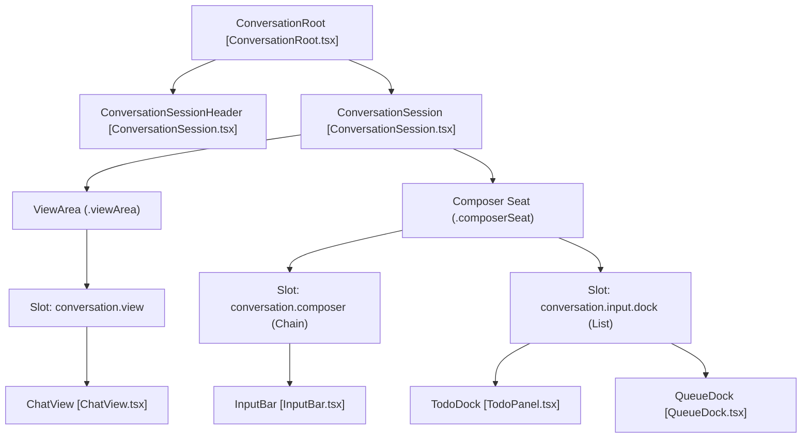
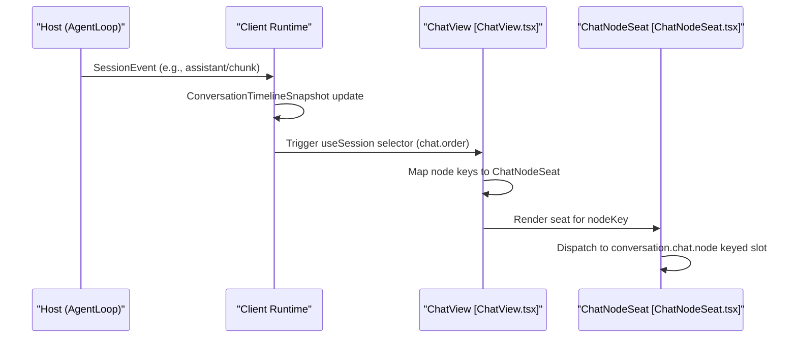

# Conversation UI & Chat View

Relevant source files

The following files were used as context for generating this wiki page:

- [.agents/notes/implemented/bug-fix/2026-08-04-composer-tab-gutter-reservation.i18n.yaml](.agents/notes/implemented/bug-fix/2026-08-04-composer-tab-gutter-reservation.i18n.yaml)
- [.agents/notes/implemented/bug-fix/2026-08-04-composer-tab-gutter-reservation.md](.agents/notes/implemented/bug-fix/2026-08-04-composer-tab-gutter-reservation.md)
- [.agents/notes/implemented/bug-fix/2026-08-04-composer-tab-gutter-reservation.zh.md](.agents/notes/implemented/bug-fix/2026-08-04-composer-tab-gutter-reservation.zh.md)
- [.agents/notes/implemented/bug-fix/2026-08-12-composer-overlay-seat-width-compensation.i18n.yaml](.agents/notes/implemented/bug-fix/2026-08-12-composer-overlay-seat-width-compensation.i18n.yaml)
- [.agents/notes/implemented/bug-fix/2026-08-12-composer-overlay-seat-width-compensation.md](.agents/notes/implemented/bug-fix/2026-08-12-composer-overlay-seat-width-compensation.md)
- [.agents/notes/implemented/bug-fix/2026-08-12-composer-overlay-seat-width-compensation.zh.md](.agents/notes/implemented/bug-fix/2026-08-12-composer-overlay-seat-width-compensation.zh.md)
- [.agents/notes/implemented/bug-fix/2026-08-18-tool-row-file-open-failure.i18n.yaml](.agents/notes/implemented/bug-fix/2026-08-18-tool-row-file-open-failure.i18n.yaml)
- [.agents/notes/implemented/bug-fix/2026-08-18-tool-row-file-open-failure.md](.agents/notes/implemented/bug-fix/2026-08-18-tool-row-file-open-failure.md)
- [.agents/notes/implemented/bug-fix/2026-08-18-tool-row-file-open-failure.zh.md](.agents/notes/implemented/bug-fix/2026-08-18-tool-row-file-open-failure.zh.md)
- [.agents/notes/implemented/feature/2026-07-28-tool-call-file-open-in-os.i18n.yaml](.agents/notes/implemented/feature/2026-07-28-tool-call-file-open-in-os.i18n.yaml)
- [.agents/notes/implemented/feature/2026-07-28-tool-call-file-open-in-os.md](.agents/notes/implemented/feature/2026-07-28-tool-call-file-open-in-os.md)
- [.agents/notes/implemented/feature/2026-07-28-tool-call-file-open-in-os.zh.md](.agents/notes/implemented/feature/2026-07-28-tool-call-file-open-in-os.zh.md)
- [.agents/notes/implemented/feature/2026-08-17-command-image-attachment-envelope.i18n.yaml](.agents/notes/implemented/feature/2026-08-17-command-image-attachment-envelope.i18n.yaml)
- [.agents/notes/implemented/feature/2026-08-17-command-image-attachment-envelope.md](.agents/notes/implemented/feature/2026-08-17-command-image-attachment-envelope.md)
- [.agents/notes/implemented/feature/2026-08-17-command-image-attachment-envelope.zh.md](.agents/notes/implemented/feature/2026-08-17-command-image-attachment-envelope.zh.md)
- [apps/web/tests/command-image-envelope.snapshot.ts](apps/web/tests/command-image-envelope.snapshot.ts)
- [apps/web/tests/composer-tab-geometry.e2e.ts](apps/web/tests/composer-tab-geometry.e2e.ts)
- [apps/web/tests/seeded-history.e2e.ts](apps/web/tests/seeded-history.e2e.ts)
- [apps/web/tests/snapshots/code-mode-round/ui.expected.md](apps/web/tests/snapshots/code-mode-round/ui.expected.md)
- [apps/web/tests/snapshots/composer-tab-geometry/geometry.expected.md](apps/web/tests/snapshots/composer-tab-geometry/geometry.expected.md)
- [apps/web/tests/snapshots/cordis-tool-round/ui.expected.md](apps/web/tests/snapshots/cordis-tool-round/ui.expected.md)
- [apps/web/tests/snapshots/fresh-round-trip/ui.expected.md](apps/web/tests/snapshots/fresh-round-trip/ui.expected.md)
- [apps/web/tests/snapshots/lifecycle-chrome/reloaded.expected.md](apps/web/tests/snapshots/lifecycle-chrome/reloaded.expected.md)
- [apps/web/tests/snapshots/live-interactions/cancel.expected.md](apps/web/tests/snapshots/live-interactions/cancel.expected.md)
- [apps/web/tests/snapshots/live-interactions/error-auth.expected.md](apps/web/tests/snapshots/live-interactions/error-auth.expected.md)
- [apps/web/tests/snapshots/live-interactions/retry.expected.md](apps/web/tests/snapshots/live-interactions/retry.expected.md)
- [apps/web/tests/snapshots/message-actions/ui.expected.md](apps/web/tests/snapshots/message-actions/ui.expected.md)
- [apps/web/tests/snapshots/plan-review/approved.expected.md](apps/web/tests/snapshots/plan-review/approved.expected.md)
- [apps/web/tests/snapshots/question-composer/answered.expected.md](apps/web/tests/snapshots/question-composer/answered.expected.md)
- [apps/web/tests/snapshots/queue-actions/editing.expected.md](apps/web/tests/snapshots/queue-actions/editing.expected.md)
- [apps/web/tests/snapshots/queue-actions/ui.expected.md](apps/web/tests/snapshots/queue-actions/ui.expected.md)
- [apps/web/tests/snapshots/seeded-history/command-row.expected.md](apps/web/tests/snapshots/seeded-history/command-row.expected.md)
- [apps/web/tests/snapshots/seeded-history/file-open-failure.expected.md](apps/web/tests/snapshots/seeded-history/file-open-failure.expected.md)
- [apps/web/tests/snapshots/seeded-history/ui.expected.md](apps/web/tests/snapshots/seeded-history/ui.expected.md)
- [apps/web/tests/snapshots/steering/mid-steer.expected.md](apps/web/tests/snapshots/steering/mid-steer.expected.md)
- [apps/web/tests/snapshots/steering/settled.expected.md](apps/web/tests/snapshots/steering/settled.expected.md)
- [apps/web/tests/snapshots/web-search-round/ui.expected.md](apps/web/tests/snapshots/web-search-round/ui.expected.md)
- [packages/client/connection/tests/fixture-commands.client.spec.ts](packages/client/connection/tests/fixture-commands.client.spec.ts)
- [packages/client/ui-commands/README.i18n.yaml](packages/client/ui-commands/README.i18n.yaml)
- [packages/client/ui-commands/README.md](packages/client/ui-commands/README.md)
- [packages/client/ui-commands/README.zh.md](packages/client/ui-commands/README.zh.md)
- [packages/client/ui-conversation/README.i18n.yaml](packages/client/ui-conversation/README.i18n.yaml)
- [packages/client/ui-conversation/README.md](packages/client/ui-conversation/README.md)
- [packages/client/ui-conversation/README.zh.md](packages/client/ui-conversation/README.zh.md)
- [packages/client/ui-conversation/src/client/apply.ts](packages/client/ui-conversation/src/client/apply.ts)
- [packages/client/ui-conversation/src/client/chat/AssistantMarkdown.module.css](packages/client/ui-conversation/src/client/chat/AssistantMarkdown.module.css)
- [packages/client/ui-conversation/src/client/chat/AssistantMarkdown.tsx](packages/client/ui-conversation/src/client/chat/AssistantMarkdown.tsx)
- [packages/client/ui-conversation/src/client/chat/ChatView.module.css](packages/client/ui-conversation/src/client/chat/ChatView.module.css)
- [packages/client/ui-conversation/src/client/chat/ChatView.tsx](packages/client/ui-conversation/src/client/chat/ChatView.tsx)
- [packages/client/ui-conversation/src/client/chat/MessageIconActions.module.css](packages/client/ui-conversation/src/client/chat/MessageIconActions.module.css)
- [packages/client/ui-conversation/src/client/chat/MessageIconActions.tsx](packages/client/ui-conversation/src/client/chat/MessageIconActions.tsx)
- [packages/client/ui-conversation/src/client/chat/MessageItem.module.css](packages/client/ui-conversation/src/client/chat/MessageItem.module.css)
- [packages/client/ui-conversation/src/client/chat/MessageItem.tsx](packages/client/ui-conversation/src/client/chat/MessageItem.tsx)
- [packages/client/ui-conversation/src/client/contract/slots.ts](packages/client/ui-conversation/src/client/contract/slots.ts)
- [packages/client/ui-conversation/src/client/input/contract.ts](packages/client/ui-conversation/src/client/input/contract.ts)
- [packages/client/ui-conversation/src/client/input/facade.ts](packages/client/ui-conversation/src/client/input/facade.ts)
- [packages/client/ui-conversation/src/client/input/hub.ts](packages/client/ui-conversation/src/client/input/hub.ts)
- [packages/client/ui-conversation/src/client/input/machine.ts](packages/client/ui-conversation/src/client/input/machine.ts)
- [packages/client/ui-conversation/src/client/locales.ts](packages/client/ui-conversation/src/client/locales.ts)
- [packages/client/ui-conversation/src/client/skeleton/ConversationRoot.module.css](packages/client/ui-conversation/src/client/skeleton/ConversationRoot.module.css)
- [packages/client/ui-conversation/src/client/skeleton/ConversationRoot.tsx](packages/client/ui-conversation/src/client/skeleton/ConversationRoot.tsx)
- [packages/client/ui-conversation/src/client/skeleton/ConversationSession.tsx](packages/client/ui-conversation/src/client/skeleton/ConversationSession.tsx)
- [packages/client/ui-conversation/src/client/skeleton/InputBar.module.css](packages/client/ui-conversation/src/client/skeleton/InputBar.module.css)
- [packages/client/ui-conversation/src/client/skeleton/InputBar.tsx](packages/client/ui-conversation/src/client/skeleton/InputBar.tsx)
- [packages/client/ui-conversation/tests/apply-inject.client.spec.tsx](packages/client/ui-conversation/tests/apply-inject.client.spec.tsx)
- [packages/client/ui-conversation/tests/chat-branch-tails.client.spec.tsx](packages/client/ui-conversation/tests/chat-branch-tails.client.spec.tsx)
- [packages/client/ui-conversation/tests/chat-view.client.spec.tsx](packages/client/ui-conversation/tests/chat-view.client.spec.tsx)
- [packages/client/ui-conversation/tests/input-bar.client.spec.tsx](packages/client/ui-conversation/tests/input-bar.client.spec.tsx)
- [packages/client/ui-conversation/tests/input-matrix.client.spec.tsx](packages/client/ui-conversation/tests/input-matrix.client.spec.tsx)
- [packages/client/ui-conversation/tests/input-reference-submit.client.spec.ts](packages/client/ui-conversation/tests/input-reference-submit.client.spec.ts)
- [packages/client/ui-conversation/tests/views-type-chain.client.spec.tsx](packages/client/ui-conversation/tests/views-type-chain.client.spec.tsx)
- [packages/client/ui-input-trigger/src/types.ts](packages/client/ui-input-trigger/src/types.ts)
- [packages/client/ui-input-trigger/tests/service.client.spec.ts](packages/client/ui-input-trigger/tests/service.client.spec.ts)
- [packages/interaction/commands/src/index.ts](packages/interaction/commands/src/index.ts)
- [packages/interaction/commands/tests/commands.spec.ts](packages/interaction/commands/tests/commands.spec.ts)

The `ui-conversation` package provides the core messaging interface for the DeepSeek Harness client. It implements the conversation skeleton, the streaming chat transcript, and the extensible composer system. It is designed to be session-agnostic at the root level while providing strict session-scoped views and controls once a session is active.

## Conversation Skeleton & Root

The `ConversationRoot` serves as the primary layout container for the chat interface. It manages the transition between the "Hero" state (no active session, showing a workspace picker) and the "Active" state (session transcript and composer).

### Implementation Details
- **Phase Management**: The root uses a `data-phase` attribute (`hero` or `active`) to toggle visibility and layout behaviors [packages/client/ui-conversation/src/client/skeleton/ConversationRoot.module.css:217-252]().
- **Layout Consistency**: It reserves a stable scrollbar gutter unconditionally to prevent the input card from shifting horizontally when the transcript length changes or when views switch [packages/client/ui-conversation/README.md:9-9]().
- **Scrollport**: The main scrolling area is identified by `data-conversation-scroll`. This host is shared by the transcript and the sticky composer seat [packages/client/ui-conversation/src/client/skeleton/ConversationRoot.module.css:225-244]().
- **Hero State**: Without a current session, the composer card acts as a trigger for the `conversation.hero.workspace` slot, typically occupied by the Workspace picker [packages/client/ui-conversation/README.md:9-9]().

### Component Hierarchy

**Sources:** [packages/client/ui-conversation/src/client/skeleton/ConversationRoot.tsx](), [packages/client/ui-conversation/src/client/contract/slots.ts:71-140](), [packages/client/ui-conversation/src/client/skeleton/ConversationRoot.module.css:1-26](), [packages/client/ui-conversation/src/client/apply.ts:137-180]()

---

## Chat View & Message Streaming

The `ChatView` is the default occupant of the `conversation.view` slot. It renders the sequential flow of "Nodes" (User messages, Assistant responses, Tool calls, etc.) retrieved from the session timeline.

### Key Features
- **Node-Based Rendering**: Instead of a monolithic message list, it dispatches to keyed renderers via the `conversation.chat.node` slot. Each `ChatNodeSeat` subscribes to one node key so updates only re-render the affected row [packages/client/ui-conversation/src/client/chat/ChatView.tsx:1-15](), [packages/client/ui-conversation/src/client/contract/slots.ts:105-112]().
- **Streaming Isolation**: During active assistant turns, the "tail" of the stream is isolated to prevent full-list re-renders. A `TurnStatus` component displays a "Deep diving..." indicator and a run clock for long-running turns [packages/client/ui-conversation/src/client/chat/ChatView.tsx:118-152]().
- **Paging & Anchoring**: Implements reflow-resistant scroll anchoring using `pagingAnchor` to find stable nodes in the viewport during history loading or window resizing [packages/client/ui-conversation/src/client/chat/ChatView.tsx:31-82]().
- **Compaction Display**: Renders a `CompactionSummaryNode` as a collapsed row. Automatic compaction uses the "Context Compacted" title, while manual `/compact` commands fold into the checkpoint row upon settlement [packages/client/ui-conversation/README.md:7-7]().
- **Steering Bubbles**: Pending steering (interruptions) are projected at the end of the flow as user-style bubbles with a copy action, ensuring no gaps during handoff to persistent user messages [packages/client/ui-conversation/README.zh.md:33-33]().

### Assistant Markdown Renderer
The `AssistantMarkdown` component handles the rendering of model output.
- **Thinking Blocks**: Reasoning blocks are rendered as `DisclosureRow` components. During streaming, they show real-time throughput and a single-line moving summary. Once settled, they display a stable first-line summary [packages/client/ui-conversation/README.zh.md:21-21]().
- **Tool Delegations**: Tool calls are dispatched by name to `conversation.chat.node`. The `ui-tool` package typically handles the recursive root/child tree rendering [packages/client/ui-conversation/README.zh.md:23-23]().

**Sources:** [packages/client/ui-conversation/src/client/chat/ChatView.tsx:1-22](), [packages/client/ui-conversation/README.md:7-15](), [packages/client/ui-conversation/src/client/contract/slots.ts:105-112]()

---

## Composer & Input System

The composer is a slot-based chain (`conversation.composer`) that allows plugins to take over the input area or add functional docks.

### InputBar
The default occupant of the composer chain (`conversation.composer.bar`). It manages:
- **Drafting & InputHub**: Synchronizes local state with the `InputHub` to carry drafts across session and workspace switches [packages/client/ui-conversation/README.md:9-9]().
- **Attachments**: Handles image uploads, validating against host-provided `imageLimits` and rendering errors via a transient `Toast` [packages/client/ui-conversation/src/client/skeleton/InputBar.tsx:69-97]().
- **Submission Logic**: Enter behaviors are configurable via `ui-conversation.busyEnter` settings (e.g., toggling between `Queue` and `Steer` when the agent is busy). This preference is stored in the user's `$DSH_HOME/settings.yaml` [packages/client/ui-conversation/README.zh.md:35-35]().
- **Access Control**: Mounts `PermissionSelect`, which is fed by the `permissions` projection. Sensitive levels like `Full access` require an in-page `Modal` confirmation [packages/client/ui-conversation/README.md:17-17]().

### Composer Takeover (Approvals & Questions)
When the agent requires human intervention, the `InputBar` is replaced by specific panels in the `conversation.composer` chain:
- **ApprovalPanel**: Occupies the composer during a `PendingWait` of kind `approval`. It shows an amber strip, justification, and one-shot allow/refuse buttons [packages/client/ui-conversation/README.md:17-17]().
- **User Questions**: Handled by the `ui-user-questions` pattern, answering through the same takeover mechanism [packages/client/ui-conversation/README.md:17-17]().

### Composer Docks
Located in the `conversation.input.dock` list slot, these provide persistent context:
- **TodoDock**: Occupies `order: 0`. It renders the `TodoPanel` based on the host-computed `todos` projection [packages/client/ui-conversation/README.zh.md:29-29]().
- **QueueDock**: Occupies `order: 20`. It displays pending messages. When multiple messages are queued, it collapses into a header showing the count (e.g., "3 messages queued") [packages/client/ui-conversation/README.zh.md:31-31]().

**Sources:** [packages/client/ui-conversation/src/client/skeleton/InputBar.tsx:39-133](), [packages/client/ui-conversation/src/client/contract/slots.ts:123-145](), [packages/client/ui-conversation/README.md:11-17]()

---

## Data Flow & Service Integration

The UI interacts with the host via the `ConversationController` and session-scoped projections.

### Code Entity Mapping
| UI Concept | Code Identifier | File |
| :--- | :--- | :--- |
| Main Controller | `ConversationController` | [packages/client/ui-conversation/src/client/service.ts]() |
| Session Store | `createChatStore` | [packages/client/ui-conversation/src/client/stores.ts]() |
| Input State Machine | `InputHub` | [packages/client/ui-conversation/src/client/input/hub.ts]() |
| Submission Policy | `ComposerSubmissionPolicy` | [packages/client/ui-conversation/src/client/input/submission-policy.ts]() |
| Node Registration | `registerConversationNodes` | [packages/client/ui-conversation/src/client/conversation-nodes/register.ts]() |

### Event to UI Flow

**Sources:** [packages/client/ui-conversation/src/client/chat/ChatView.tsx:158-180](), [packages/client/ui-conversation/src/client/apply.ts:115-153](), [packages/client/ui-conversation/README.md:13-15]()

---

## Extensibility via Slots

The package relies on the `Cordis` slot system to remain decoupled from specific tool or view implementations.

- **`conversation.view`**: A list slot for adding tabs like "Trajectory" or "Artifacts". The active view is rendered via `only: <active id>` [packages/client/ui-conversation/src/client/contract/slots.ts:97-103]().
- **`conversation.chat.node`**: A keyed slot where the key is the `ChatNodeKind` (e.g., `tool-call`, `user-message`). Renderer definitions include stable event IDs and append/prepend replay support [packages/client/ui-conversation/README.md:15-15](), [packages/client/ui-conversation/src/client/contract/slots.ts:105-112]().
- **`conversation.session.header.actions`**: A list slot for per-session controls beside the title. Negative `order` values are reserved for static session context [packages/client/ui-conversation/src/client/contract/slots.ts:81-90]().
- **`conversation.composer`**: A chain slot for composer takeover (Approvals) or the default bar [packages/client/ui-conversation/src/client/contract/slots.ts:126-132]().

**Sources:** [packages/client/ui-conversation/src/client/contract/slots.ts:60-145](), [packages/client/ui-conversation/src/client/apply.ts:115-180]()
