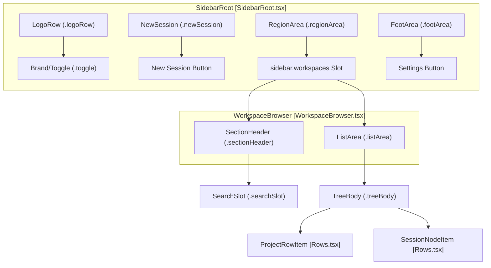
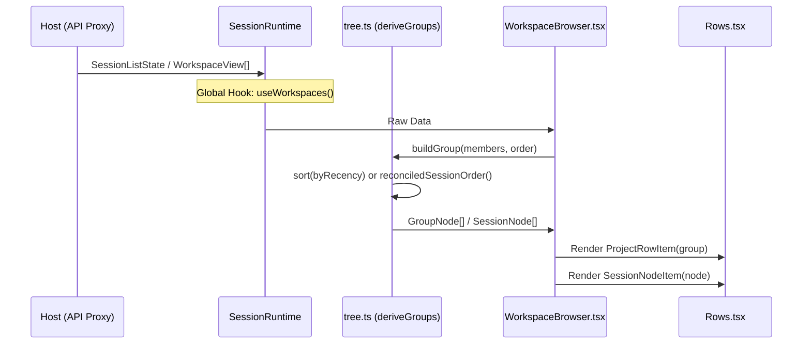

# Workspace Browser & Sidebar

Relevant source files

The following files were used as context for generating this wiki page:

- [.agents/notes/implemented/bug-fix/2026-07-29-web-details-session-lifecycle.i18n.yaml](.agents/notes/implemented/bug-fix/2026-07-29-web-details-session-lifecycle.i18n.yaml)
- [.agents/notes/implemented/bug-fix/2026-07-29-web-details-session-lifecycle.md](.agents/notes/implemented/bug-fix/2026-07-29-web-details-session-lifecycle.md)
- [.agents/notes/implemented/bug-fix/2026-07-29-web-details-session-lifecycle.zh.md](.agents/notes/implemented/bug-fix/2026-07-29-web-details-session-lifecycle.zh.md)
- [.agents/notes/implemented/bug-fix/2026-08-18-rail-search-outside-click-self-dismissal.i18n.yaml](.agents/notes/implemented/bug-fix/2026-08-18-rail-search-outside-click-self-dismissal.i18n.yaml)
- [.agents/notes/implemented/bug-fix/2026-08-18-rail-search-outside-click-self-dismissal.md](.agents/notes/implemented/bug-fix/2026-08-18-rail-search-outside-click-self-dismissal.md)
- [.agents/notes/implemented/bug-fix/2026-08-18-rail-search-outside-click-self-dismissal.zh.md](.agents/notes/implemented/bug-fix/2026-08-18-rail-search-outside-click-self-dismissal.zh.md)
- [.agents/notes/implemented/feature/2026-08-11-workspace-sidebar-order-and-folding.i18n.yaml](.agents/notes/implemented/feature/2026-08-11-workspace-sidebar-order-and-folding.i18n.yaml)
- [.agents/notes/implemented/feature/2026-08-11-workspace-sidebar-order-and-folding.md](.agents/notes/implemented/feature/2026-08-11-workspace-sidebar-order-and-folding.md)
- [.agents/notes/implemented/feature/2026-08-11-workspace-sidebar-order-and-folding.zh.md](.agents/notes/implemented/feature/2026-08-11-workspace-sidebar-order-and-folding.zh.md)
- [.agents/notes/implemented/feature/2026-08-18-web-home-path-tilde.i18n.yaml](.agents/notes/implemented/feature/2026-08-18-web-home-path-tilde.i18n.yaml)
- [.agents/notes/implemented/feature/2026-08-18-web-home-path-tilde.md](.agents/notes/implemented/feature/2026-08-18-web-home-path-tilde.md)
- [.agents/notes/implemented/feature/2026-08-18-web-home-path-tilde.zh.md](.agents/notes/implemented/feature/2026-08-18-web-home-path-tilde.zh.md)
- [apps/web/tests/home-path-tilde.snapshot.ts](apps/web/tests/home-path-tilde.snapshot.ts)
- [apps/web/tests/rail-search-expand.e2e.ts](apps/web/tests/rail-search-expand.e2e.ts)
- [apps/web/tests/snapshots/home-path-tilde/workspace-hover.expected.txt](apps/web/tests/snapshots/home-path-tilde/workspace-hover.expected.txt)
- [packages/client/connection/tests/connection.client.spec.ts](packages/client/connection/tests/connection.client.spec.ts)
- [packages/client/ui-conversation/src/client/index.ts](packages/client/ui-conversation/src/client/index.ts)
- [packages/client/ui-layout/README.i18n.yaml](packages/client/ui-layout/README.i18n.yaml)
- [packages/client/ui-layout/README.md](packages/client/ui-layout/README.md)
- [packages/client/ui-layout/README.zh.md](packages/client/ui-layout/README.zh.md)
- [packages/client/ui-layout/src/client/AppFrame.module.css](packages/client/ui-layout/src/client/AppFrame.module.css)
- [packages/client/ui-layout/src/client/AppFrame.tsx](packages/client/ui-layout/src/client/AppFrame.tsx)
- [packages/client/ui-layout/src/client/columns.ts](packages/client/ui-layout/src/client/columns.ts)
- [packages/client/ui-layout/src/client/index.ts](packages/client/ui-layout/src/client/index.ts)
- [packages/client/ui-layout/src/client/stores.ts](packages/client/ui-layout/src/client/stores.ts)
- [packages/client/ui-sidebar/README.i18n.yaml](packages/client/ui-sidebar/README.i18n.yaml)
- [packages/client/ui-sidebar/README.md](packages/client/ui-sidebar/README.md)
- [packages/client/ui-sidebar/README.zh.md](packages/client/ui-sidebar/README.zh.md)
- [packages/client/ui-sidebar/src/client/SidebarRoot.module.css](packages/client/ui-sidebar/src/client/SidebarRoot.module.css)
- [packages/client/ui-sidebar/src/client/SidebarRoot.tsx](packages/client/ui-sidebar/src/client/SidebarRoot.tsx)
- [packages/client/ui-sidebar/src/client/contract/slots.ts](packages/client/ui-sidebar/src/client/contract/slots.ts)
- [packages/client/ui-sidebar/src/client/index.ts](packages/client/ui-sidebar/src/client/index.ts)
- [packages/client/ui-sidebar/tests/apply.client.spec.tsx](packages/client/ui-sidebar/tests/apply.client.spec.tsx)
- [packages/client/ui-sidebar/tests/sidebar-root.client.spec.tsx](packages/client/ui-sidebar/tests/sidebar-root.client.spec.tsx)
- [packages/client/ui-sidebar/tests/sidebar-styles.client.spec.ts](packages/client/ui-sidebar/tests/sidebar-styles.client.spec.ts)
- [packages/client/ui-tool/tests/read-card.client.spec.tsx](packages/client/ui-tool/tests/read-card.client.spec.tsx)
- [packages/client/ui-tool/tests/tool-call-tree.client.spec.tsx](packages/client/ui-tool/tests/tool-call-tree.client.spec.tsx)
- [packages/client/ui-tool/tests/tool-details-render.client.tsx](packages/client/ui-tool/tests/tool-details-render.client.tsx)
- [packages/client/ui-tool/tests/tool-row.client.spec.tsx](packages/client/ui-tool/tests/tool-row.client.spec.tsx)
- [packages/client/ui-workspace/README.i18n.yaml](packages/client/ui-workspace/README.i18n.yaml)
- [packages/client/ui-workspace/README.md](packages/client/ui-workspace/README.md)
- [packages/client/ui-workspace/README.zh.md](packages/client/ui-workspace/README.zh.md)
- [packages/client/ui-workspace/src/client/WorkspaceBrowser.module.css](packages/client/ui-workspace/src/client/WorkspaceBrowser.module.css)
- [packages/client/ui-workspace/src/client/WorkspaceBrowser.tsx](packages/client/ui-workspace/src/client/WorkspaceBrowser.tsx)
- [packages/client/ui-workspace/src/client/WorkspacePicker.tsx](packages/client/ui-workspace/src/client/WorkspacePicker.tsx)
- [packages/client/ui-workspace/src/client/contract/slots.ts](packages/client/ui-workspace/src/client/contract/slots.ts)
- [packages/client/ui-workspace/src/client/index.ts](packages/client/ui-workspace/src/client/index.ts)
- [packages/client/ui-workspace/src/client/locales.ts](packages/client/ui-workspace/src/client/locales.ts)
- [packages/client/ui-workspace/src/client/rows/Rows.module.css](packages/client/ui-workspace/src/client/rows/Rows.module.css)
- [packages/client/ui-workspace/src/client/rows/Rows.tsx](packages/client/ui-workspace/src/client/rows/Rows.tsx)
- [packages/client/ui-workspace/src/client/stores.ts](packages/client/ui-workspace/src/client/stores.ts)
- [packages/client/ui-workspace/src/client/tree.ts](packages/client/ui-workspace/src/client/tree.ts)
- [packages/client/ui-workspace/tests/workspace-browser.client.spec.tsx](packages/client/ui-workspace/tests/workspace-browser.client.spec.tsx)

The Workspace Browser and Sidebar system provides the primary navigation interface for the DeepSeek Harness (dsh) web client. It manages the organization of sessions into workspaces, session search, and the responsive transitions between expanded and collapsed (rail) states.

## Overview

The system is composed of three primary packages:
1.  **`ui-sidebar`**: The outer shell (`SidebarRoot`) managing the collapse/expand state machine and the "rail" geometry [packages/client/ui-sidebar/src/client/SidebarRoot.tsx]().
2.  **`ui-workspace`**: The core content provider, including the `WorkspaceBrowser` (session tree/search) and `WorkspacePicker` (directory selection) [packages/client/ui-workspace/src/client/WorkspaceBrowser.tsx:1-11]().
3.  **`ui-layout`**: The `AppFrame` which handles the CSS Grid column management and transition timing for the sidebar [packages/client/ui-layout/src/client/AppFrame.tsx]().

## Sidebar Lifecycle & Layout

The `SidebarRoot` component implements a two-phase transition for collapsing/expanding. Instead of a fluid "morph," it uses a frozen-width fade followed by a layout snap to prevent content reflow during the slide [packages/client/ui-sidebar/src/client/SidebarRoot.module.css:1-7]().

### Transition States
| State | Behavior | CSS Class |
| :--- | :--- | :--- |
| **Expanded** | Full width (typically 260px), showing wordmark and full tree. | `.wide` [packages/client/ui-sidebar/src/client/SidebarRoot.module.css:53-55]() |
| **Fading** | The content's opacity transitions to 0 over 150ms. | `.fading` [packages/client/ui-sidebar/src/client/SidebarRoot.module.css:47-50]() |
| **Rail (Collapsed)** | 56px width, icons only, centered in 36px control boxes. | `.collapsed` [packages/client/ui-sidebar/src/client/SidebarRoot.module.css:28-30]() |

### Code-to-UI Mapping: Sidebar Structure

This diagram maps the logical UI regions to their implementing React components and CSS classes.

Sources: [packages/client/ui-sidebar/src/client/SidebarRoot.tsx](), [packages/client/ui-workspace/src/client/WorkspaceBrowser.tsx](), [packages/client/ui-workspace/src/client/rows/Rows.tsx]()

## Workspace Browser Logic

The `WorkspaceBrowser` reconciles the host-provided workspace data with browser-local viewing preferences (order, expansion state).

### Session Tree Derivation
The tree is derived via `deriveGroups` and `deriveFlat` functions in `tree.ts`.
*   **Grouping**: Sessions are grouped by `WorkspaceId`. Sessions without a workspace are placed in the `UNGROUPED_KEY` (empty string) bucket [packages/client/ui-workspace/src/client/tree.ts:12-13]().
*   **Ordering**: Supports `manual` (user-dragged) and `updated` (recency-based) modes [packages/client/ui-workspace/src/client/tree.ts:36]().
*   **Visibility**: Subagent-origin sessions (where `origin === 'subagent'`) are filtered out of the main sidebar tree; they are accessed via the parent's subagent page header [packages/client/ui-workspace/src/client/tree.ts:118-122]().

### State Management
The browser uses a dedicated store created by `createWorkspaceViewStore` to persist:
*   `groupExpansion`: Which workspace folders are open [packages/client/ui-workspace/src/client/stores.ts:22-23]().
*   `sessionOrderByAccount`: Per-workspace manual session ordering [packages/client/ui-workspace/src/client/stores.ts:24-25]().
*   `groupBy`: Toggle between 'workspace' and 'flat' views [packages/client/ui-workspace/src/client/stores.ts:20]().

### Search Implementation
Search is a hybrid process:
1.  **Local Match**: Immediate case-insensitive substring matching on titles and workspace names [packages/client/ui-workspace/README.md:9]().
2.  **Host Request**: A 250ms debounced RPC call to `session.search` for content-based matches and snippets [packages/client/ui-workspace/src/client/WorkspaceBrowser.tsx:34-35]().
3.  **Sanitization**: Queries are capped at 500 UTF-16 code units to match the wire schema, ensuring surrogate pairs are not split [packages/client/ui-workspace/src/client/WorkspaceBrowser.tsx:37-50]().

## Row Interactions & Drag-and-Drop

The `Rows.tsx` file defines the presentational components for the tree.

### Row Types
| Component | Purpose | Features |
| :--- | :--- | :--- |
| `ProjectRowItem` | Workspace folder | Expand/Collapse, Rename, Delete, Drag handle [packages/client/ui-workspace/src/client/rows/Rows.tsx:112-123]() |
| `SessionNodeItem` | Individual session | Status dots, Fork, Archive, Rename, Relative time [packages/client/ui-workspace/src/client/rows/Rows.tsx:216-240]() |
| `SearchResultItem` | Search hit | Displays snippets and workspace context [packages/client/ui-workspace/src/client/rows/Rows.tsx:438-448]() |

### Status Indicators
Sessions display a `StateDot` based on the `pendingInteraction` state:
*   **Amber Dot**: Waiting for approval (`pendingInteraction === 'approval'`) or plan review (`'plan-review'`) [packages/client/ui-workspace/src/client/rows/Rows.tsx:265-275]().
*   **Blue Dot**: Session is currently running [packages/client/ui-workspace/src/client/rows/Rows.tsx:280-285]().
*   **Green Dot**: Session completed while unselected (unviewed) [packages/client/ui-workspace/src/client/tree.ts:30-31]().

### Code-to-UI Mapping: Data Flow

This diagram illustrates how data flows from the Host API through the derivation logic to the rendered React components.

Sources: [packages/client/ui-workspace/src/client/tree.ts:134-148](), [packages/client/ui-workspace/src/client/WorkspaceBrowser.tsx:116-144](), [packages/client/ui-workspace/src/client/rows/Rows.tsx:112-123]()

## Workspace Picker & Directory Flow

The `WorkspacePicker` manages the selection of directories as workspaces.

*   **Hole Pattern**: It declares a `directoryFlow` hole (`conversation.hero.workspace.directoryFlow`). This is filled by the `directory-picker-native` package which invokes the OS-native folder chooser [packages/client/ui-workspace/src/client/contract/slots.ts:54-61]().
*   **Adoption**: Once a path is picked, the picker calls `onPicked`, and the owner adopts the path via the runtime `workspaces.create` service [packages/client/ui-workspace/src/client/contract/slots.ts:47]().
*   **Validation**: Host-side normalization handles title/path invalidation, which is rendered back to the user in a retryable dialog [packages/client/ui-workspace/README.md:11]().

Sources:
- `packages/client/ui-workspace/src/client/WorkspaceBrowser.tsx`
- `packages/client/ui-workspace/src/client/rows/Rows.tsx`
- `packages/client/ui-workspace/src/client/tree.ts`
- `packages/client/ui-workspace/src/client/stores.ts`
- `packages/client/ui-sidebar/src/client/SidebarRoot.tsx`
- `packages/client/ui-sidebar/src/client/SidebarRoot.module.css`
- `packages/client/ui-workspace/README.md`
- `packages/client/ui-layout/src/client/AppFrame.tsx`
- `packages/client/ui-workspace/src/client/contract/slots.ts`
