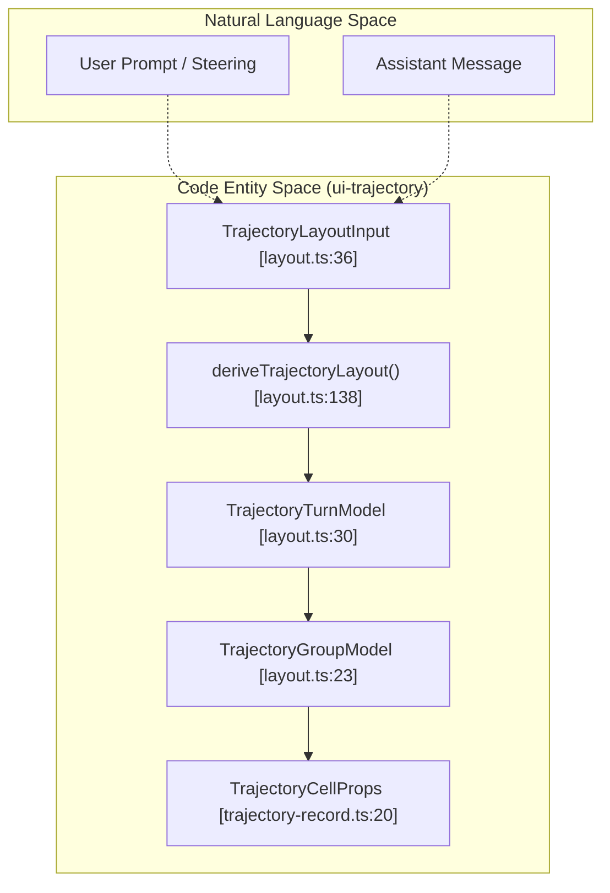
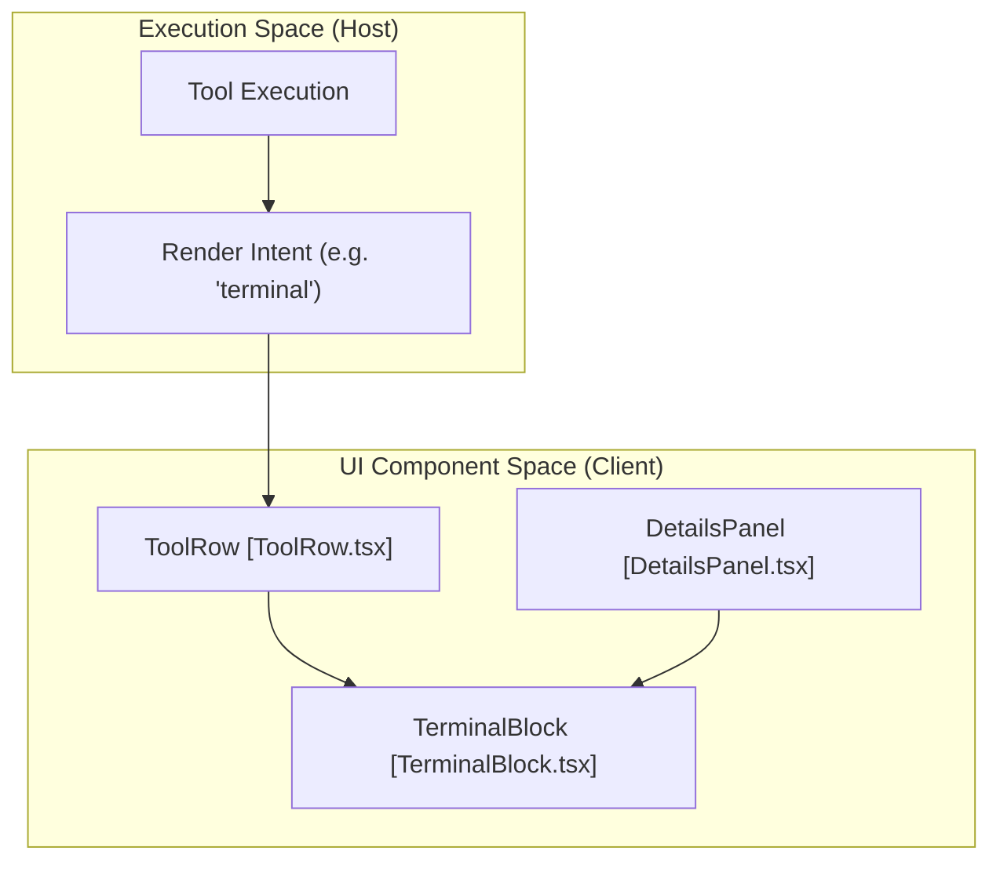

# UI Primitives, Trajectory & Tool Views

Relevant source files

The following files were used as context for generating this wiki page:

- [.agents/notes/implemented/feature/2026-07-27-trajectory-inspection-ledger.i18n.yaml](.agents/notes/implemented/feature/2026-07-27-trajectory-inspection-ledger.i18n.yaml)
- [.agents/notes/implemented/feature/2026-07-27-trajectory-inspection-ledger.md](.agents/notes/implemented/feature/2026-07-27-trajectory-inspection-ledger.md)
- [.agents/notes/implemented/feature/2026-07-27-trajectory-inspection-ledger.zh.md](.agents/notes/implemented/feature/2026-07-27-trajectory-inspection-ledger.zh.md)
- [.agents/notes/implemented/feature/2026-07-28-web-terminal-card.i18n.yaml](.agents/notes/implemented/feature/2026-07-28-web-terminal-card.i18n.yaml)
- [.agents/notes/implemented/feature/2026-07-28-web-terminal-card.md](.agents/notes/implemented/feature/2026-07-28-web-terminal-card.md)
- [.agents/notes/implemented/feature/2026-07-28-web-terminal-card.zh.md](.agents/notes/implemented/feature/2026-07-28-web-terminal-card.zh.md)
- [apps/web/tests/navigation-panes.e2e.ts](apps/web/tests/navigation-panes.e2e.ts)
- [apps/web/tests/queue-actions.e2e.ts](apps/web/tests/queue-actions.e2e.ts)
- [apps/web/tests/snapshots/navigation-panes/trajectory.expected.md](apps/web/tests/snapshots/navigation-panes/trajectory.expected.md)
- [packages/client/ui-conversation/src/client/queue/QueueDock.module.css](packages/client/ui-conversation/src/client/queue/QueueDock.module.css)
- [packages/client/ui-conversation/src/client/queue/QueueDock.tsx](packages/client/ui-conversation/src/client/queue/QueueDock.tsx)
- [packages/client/ui-conversation/src/client/skeleton/PermissionSelect.module.css](packages/client/ui-conversation/src/client/skeleton/PermissionSelect.module.css)
- [packages/client/ui-conversation/src/client/skeleton/PermissionSelect.tsx](packages/client/ui-conversation/src/client/skeleton/PermissionSelect.tsx)
- [packages/client/ui-conversation/src/client/skeleton/TodoPanel.module.css](packages/client/ui-conversation/src/client/skeleton/TodoPanel.module.css)
- [packages/client/ui-goal/README.i18n.yaml](packages/client/ui-goal/README.i18n.yaml)
- [packages/client/ui-goal/README.md](packages/client/ui-goal/README.md)
- [packages/client/ui-goal/README.zh.md](packages/client/ui-goal/README.zh.md)
- [packages/client/ui-goal/package.json](packages/client/ui-goal/package.json)
- [packages/client/ui-goal/src/client/GoalBar.module.css](packages/client/ui-goal/src/client/GoalBar.module.css)
- [packages/client/ui-goal/src/client/GoalBar.tsx](packages/client/ui-goal/src/client/GoalBar.tsx)
- [packages/client/ui-goal/src/client/index.ts](packages/client/ui-goal/src/client/index.ts)
- [packages/client/ui-goal/src/client/slots.ts](packages/client/ui-goal/src/client/slots.ts)
- [packages/client/ui-goal/tsconfig.json](packages/client/ui-goal/tsconfig.json)
- [packages/client/ui-primitives/README.i18n.yaml](packages/client/ui-primitives/README.i18n.yaml)
- [packages/client/ui-primitives/README.md](packages/client/ui-primitives/README.md)
- [packages/client/ui-primitives/README.zh.md](packages/client/ui-primitives/README.zh.md)
- [packages/client/ui-primitives/src/TerminalBlock.module.css](packages/client/ui-primitives/src/TerminalBlock.module.css)
- [packages/client/ui-primitives/src/TerminalBlock.tsx](packages/client/ui-primitives/src/TerminalBlock.tsx)
- [packages/client/ui-primitives/src/ansi.ts](packages/client/ui-primitives/src/ansi.ts)
- [packages/client/ui-primitives/src/icons/index.tsx](packages/client/ui-primitives/src/icons/index.tsx)
- [packages/client/ui-primitives/src/icons/props.ts](packages/client/ui-primitives/src/icons/props.ts)
- [packages/client/ui-trajectory/README.i18n.yaml](packages/client/ui-trajectory/README.i18n.yaml)
- [packages/client/ui-trajectory/README.md](packages/client/ui-trajectory/README.md)
- [packages/client/ui-trajectory/README.zh.md](packages/client/ui-trajectory/README.zh.md)
- [packages/client/ui-trajectory/src/client/TrajectoryCell.module.css](packages/client/ui-trajectory/src/client/TrajectoryCell.module.css)
- [packages/client/ui-trajectory/src/client/TrajectoryCell.tsx](packages/client/ui-trajectory/src/client/TrajectoryCell.tsx)
- [packages/client/ui-trajectory/src/client/TrajectoryTable.module.css](packages/client/ui-trajectory/src/client/TrajectoryTable.module.css)
- [packages/client/ui-trajectory/src/client/TrajectoryTable.tsx](packages/client/ui-trajectory/src/client/TrajectoryTable.tsx)
- [packages/client/ui-trajectory/src/client/TrajectoryTimeline.module.css](packages/client/ui-trajectory/src/client/TrajectoryTimeline.module.css)
- [packages/client/ui-trajectory/src/client/TrajectoryTimeline.tsx](packages/client/ui-trajectory/src/client/TrajectoryTimeline.tsx)
- [packages/client/ui-trajectory/src/client/TrajectoryToolbar.module.css](packages/client/ui-trajectory/src/client/TrajectoryToolbar.module.css)
- [packages/client/ui-trajectory/src/client/TrajectoryToolbar.tsx](packages/client/ui-trajectory/src/client/TrajectoryToolbar.tsx)
- [packages/client/ui-trajectory/src/client/TrajectoryView.tsx](packages/client/ui-trajectory/src/client/TrajectoryView.tsx)
- [packages/client/ui-trajectory/src/client/index.ts](packages/client/ui-trajectory/src/client/index.ts)
- [packages/client/ui-trajectory/src/client/layout.ts](packages/client/ui-trajectory/src/client/layout.ts)
- [packages/client/ui-trajectory/src/client/locales.ts](packages/client/ui-trajectory/src/client/locales.ts)
- [packages/client/ui-trajectory/src/client/timeline.ts](packages/client/ui-trajectory/src/client/timeline.ts)
- [packages/client/ui-trajectory/src/client/trajectory-record.ts](packages/client/ui-trajectory/src/client/trajectory-record.ts)
- [packages/client/ui-trajectory/src/client/views.module.css](packages/client/ui-trajectory/src/client/views.module.css)

This section covers the shared UI foundation of the DeepSeek Harness (dsh) web client, the specialized trajectory inspection system for debugging agent reasoning, and the rendering pipeline for tool execution results. These components bridge raw session events and execution logs into a structured, interactive debugging surface.

## 1. UI Primitives

The `ui-primitives` package contains pure React atoms that are independent of the Cordis framework [packages/client/ui-primitives/README.md:5-5](). These components handle complex rendering tasks such as ANSI-to-HTML conversion, LaTeX typesetting, and incremental Markdown parsing.

### 1.1 TerminalBlock & ANSI Rendering
`TerminalBlock` renders shell commands and their outputs as a terminal surface [packages/client/ui-primitives/README.md:19-21](). It uses the `anser` library to parse ANSI escape sequences into React spans [packages/client/ui-primitives/README.md:21-21]().

*   **Cursor Management**: Implements a per-line column buffer to handle carriage returns (`\r`) and backspaces, ensuring that overwriting behavior (e.g., progress spinners) renders correctly [packages/client/ui-primitives/README.md:21-21]().
*   **State Dot**: A single `StateDot` is rendered on the first row to indicate the overall run state (running, success, or error) [packages/client/ui-primitives/README.md:21-21]().
*   **Virtualization**: Large outputs are collapsed to a head and tail slice if they exceed `maxLines` (default 16) [packages/client/ui-primitives/README.md:21-21]().

### 1.2 MarkdownText & Incremental Rendering
`MarkdownText` is the primary renderer for assistant output, supporting GFM and TeX math via KaTeX [packages/client/ui-primitives/README.md:17-17]().

*   **Incremental Pipeline**: To maintain performance during streaming, all but the trailing two blocks are frozen as cached React elements. Only the source tail is re-parsed per chunk [packages/client/ui-primitives/README.md:17-17]().
*   **File Mentions**: Supports an optional `fileMentions` resolver that transforms inline code tokens into interactive buttons if they match real workspace files [packages/client/ui-primitives/README.md:17-17]().

### 1.3 Shared Primitives Table
| Component | Purpose | Key Implementation Detail |
| :--- | :--- | :--- |
| `JsonTree` | Read-only JSON inspector | Used for tool arguments and raw event inspection [packages/client/ui-primitives/README.md:5-5](). |
| `HoverCard` | Portaled previews | Includes a pointer-leave grace period and click-to-copy semantics [packages/client/ui-primitives/README.md:9-9](). |
| `Toast` | Transient banners | Body-portaled, centers over a specific anchor (e.g., chat column) [packages/client/ui-primitives/README.md:13-13](). |
| `ReadBlock` | File content view | Renders syntax-highlighted code with original file line numbers [packages/client/ui-primitives/README.md:25-25](). |
| `DiffBlock` | File change view | Renders inline diffs with multiple hunk support [packages/client/ui-primitives/README.zh.md:29-29](). |
| `SearchBlock` | Search result view | Handles `grep` and `glob` results with truncation summaries [packages/client/ui-primitives/README.zh.md:33-33](). |

**Sources:** [packages/client/ui-primitives/README.md:1-25](), [packages/client/ui-primitives/src/ansi.ts:1-50](), [packages/client/ui-primitives/src/TerminalBlock.tsx:1-50]().

---

## 2. Trajectory Inspection Ledger

The Trajectory view provides a turn-aware event ledger for inspecting the agent's internal reasoning steps, tool calls, and prompt transitions.

### 2.1 Trajectory Data Flow
The trajectory view is registered as a conversation view slot via `ctx.slots.inject('conversation.view', ...)` [packages/client/ui-trajectory/src/client/index.ts:43-49](). It consumes a `TrajectoryLayoutInput` which includes session nodes, requests, and in-flight partials [packages/client/ui-trajectory/src/client/layout.ts:36-43]().

**Trajectory Layout Logic**

**Sources:** [packages/client/ui-trajectory/src/client/layout.ts:22-138](), [packages/client/ui-trajectory/src/client/index.ts:30-65]().

### 2.2 TrajectoryTable Implementation
`TrajectoryTable` is the core component for the event ledger, utilizing `@tanstack/react-virtual` for high-performance rendering of long session histories [packages/client/ui-trajectory/src/client/TrajectoryTable.tsx:5-22]().

*   **Virtualization Threshold**: Virtualization activates when the row count exceeds 100 [packages/client/ui-trajectory/src/client/TrajectoryTable.tsx:34-34]().
*   **Cell Kinds**: The table categorizes events into `system`, `user`, `context`, `compacted`, `message`, `tool`, and `subtool` [packages/client/ui-trajectory/src/client/TrajectoryTable.tsx:38-46]().
*   **Local Record Inspector**: Selecting a row opens a details pane for inspecting raw JSON, diffs, or tool outputs [packages/client/ui-trajectory/src/client/TrajectoryTable.tsx:1-4]().
*   **History Loading**: Supports pagination via `loadOlder` to fetch previous session segments [packages/client/ui-trajectory/src/client/TrajectoryTable.tsx:32-33]().

### 2.3 TrajectoryTimeline
The `TrajectoryTimeline` provides a visual overview of token usage and timing across the session [packages/client/ui-trajectory/src/client/TrajectoryView.tsx:16-16](). It allows users to filter the `TrajectoryTable` by selecting specific time ranges or turns [packages/client/ui-trajectory/src/client/TrajectoryView.tsx:127-127]().

**Sources:** [packages/client/ui-trajectory/src/client/TrajectoryTable.tsx:1-248](), [packages/client/ui-trajectory/src/client/TrajectoryView.tsx:120-153]().

---

## 3. Tool View Rendering

Tool rendering is managed by `ui-tool`, which bridges the `ToolRuntime` execution data to the `ui-primitives` cards.

### 3.1 Tool-Call Logic
When a tool is invoked, the client determines the rendering intent (e.g., `terminal`, `diff`, `search`) from the `callView` and `resultView` provided by the host [packages/client/ui-tool/src/client/tool/models/terminal-card-model.ts:15-15]().

**Tool Rendering Pipeline**

### 3.2 Specific Tool Views
*   **Terminal View**: Bash tool calls are rendered using `TerminalBlock`. The `terminalCardModel` resolves the working directory (CWD) relative to the session workspace [packages/client/ui-tool/src/client/tool/models/terminal-card-model.ts:15-15]().
*   **Diff View**: `DiffBlock` renders file changes as inline diffs, showing deletions above additions with support for multiple hunks [packages/client/ui-primitives/README.zh.md:29-29]().
*   **Search View**: `SearchBlock` handles both `grep` (matches) and `glob` (paths) results, providing truncated summaries if the output is too large [packages/client/ui-primitives/README.zh.md:33-33]().
*   **Web View**: `WebBlock` renders web search results with snippets, publication dates, and source citations [packages/client/ui-primitives/README.zh.md:37-37]().

**Sources:** [packages/client/ui-tool/src/client/tool/models/terminal-card-model.ts:1-20](), [packages/client/ui-primitives/README.zh.md:27-37](), [packages/client/ui-conversation/src/client/skeleton/DetailsPanel.tsx:1-50]().
