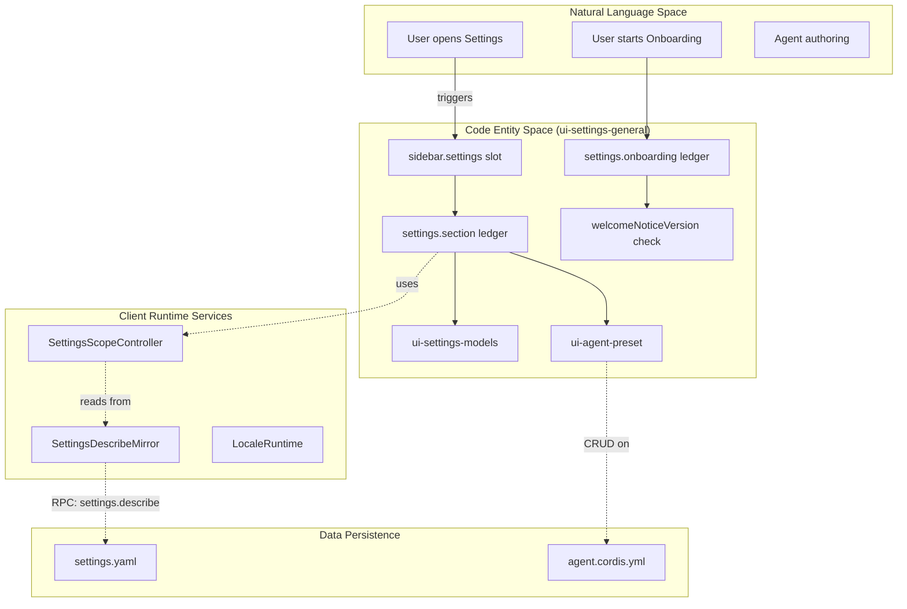
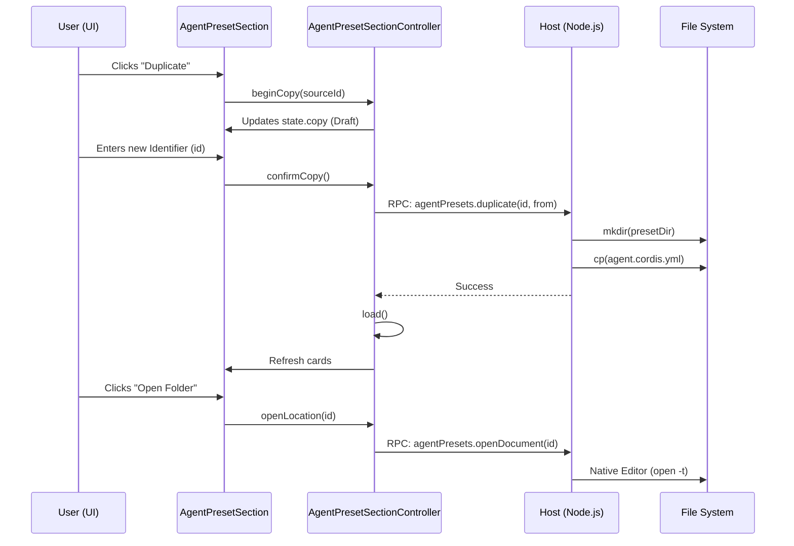

# Settings, Agent Presets & Onboarding

Relevant source files

The following files were used as context for generating this wiki page:

- [.agents/notes/implemented/bug-fix/2026-08-06-host-backed-web-preferences.i18n.yaml](.agents/notes/implemented/bug-fix/2026-08-06-host-backed-web-preferences.i18n.yaml)
- [.agents/notes/implemented/bug-fix/2026-08-06-host-backed-web-preferences.md](.agents/notes/implemented/bug-fix/2026-08-06-host-backed-web-preferences.md)
- [.agents/notes/implemented/bug-fix/2026-08-06-host-backed-web-preferences.zh.md](.agents/notes/implemented/bug-fix/2026-08-06-host-backed-web-preferences.zh.md)
- [.agents/notes/implemented/feature/2026-07-30-versioned-gui-welcome-onboarding.i18n.yaml](.agents/notes/implemented/feature/2026-07-30-versioned-gui-welcome-onboarding.i18n.yaml)
- [.agents/notes/implemented/feature/2026-07-30-versioned-gui-welcome-onboarding.md](.agents/notes/implemented/feature/2026-07-30-versioned-gui-welcome-onboarding.md)
- [.agents/notes/implemented/feature/2026-07-30-versioned-gui-welcome-onboarding.zh.md](.agents/notes/implemented/feature/2026-07-30-versioned-gui-welcome-onboarding.zh.md)
- [.agents/notes/implemented/feature/2026-07-31-browser-derived-initial-locale.i18n.yaml](.agents/notes/implemented/feature/2026-07-31-browser-derived-initial-locale.i18n.yaml)
- [.agents/notes/implemented/feature/2026-07-31-browser-derived-initial-locale.md](.agents/notes/implemented/feature/2026-07-31-browser-derived-initial-locale.md)
- [.agents/notes/implemented/feature/2026-07-31-browser-derived-initial-locale.zh.md](.agents/notes/implemented/feature/2026-07-31-browser-derived-initial-locale.zh.md)
- [.agents/notes/implemented/feature/2026-08-10-telemetry-default-off.i18n.yaml](.agents/notes/implemented/feature/2026-08-10-telemetry-default-off.i18n.yaml)
- [.agents/notes/implemented/feature/2026-08-10-telemetry-default-off.md](.agents/notes/implemented/feature/2026-08-10-telemetry-default-off.md)
- [.agents/notes/implemented/feature/2026-08-10-telemetry-default-off.zh.md](.agents/notes/implemented/feature/2026-08-10-telemetry-default-off.zh.md)
- [.agents/notes/implemented/simplification/2026-08-13-remove-first-run-beta-notice.i18n.yaml](.agents/notes/implemented/simplification/2026-08-13-remove-first-run-beta-notice.i18n.yaml)
- [.agents/notes/implemented/simplification/2026-08-13-remove-first-run-beta-notice.md](.agents/notes/implemented/simplification/2026-08-13-remove-first-run-beta-notice.md)
- [.agents/notes/implemented/simplification/2026-08-13-remove-first-run-beta-notice.zh.md](.agents/notes/implemented/simplification/2026-08-13-remove-first-run-beta-notice.zh.md)
- [apps/cli/config/agent-presets/code/preset.yml](apps/cli/config/agent-presets/code/preset.yml)
- [apps/cli/config/agent-presets/cordis/preset.yml](apps/cli/config/agent-presets/cordis/preset.yml)
- [apps/cli/config/agent-presets/minimal/preset.yml](apps/cli/config/agent-presets/minimal/preset.yml)
- [apps/cli/config/agent-presets/standard/preset.yml](apps/cli/config/agent-presets/standard/preset.yml)
- [apps/web/tests/README.i18n.yaml](apps/web/tests/README.i18n.yaml)
- [apps/web/tests/README.md](apps/web/tests/README.md)
- [apps/web/tests/agent-preset-authoring.e2e.ts](apps/web/tests/agent-preset-authoring.e2e.ts)
- [apps/web/tests/settings-chrome.e2e.ts](apps/web/tests/settings-chrome.e2e.ts)
- [apps/web/tests/snapshots/agent-preset-authoring/created.expected.md](apps/web/tests/snapshots/agent-preset-authoring/created.expected.md)
- [apps/web/tests/snapshots/agent-preset-authoring/damaged.expected.md](apps/web/tests/snapshots/agent-preset-authoring/damaged.expected.md)
- [apps/web/tests/snapshots/agent-preset-authoring/section.expected.md](apps/web/tests/snapshots/agent-preset-authoring/section.expected.md)
- [apps/web/tests/snapshots/agent-preset-selection/menu.expected.md](apps/web/tests/snapshots/agent-preset-selection/menu.expected.md)
- [apps/web/tests/snapshots/onboarding-deepseek-config/welcome.expected.md](apps/web/tests/snapshots/onboarding-deepseek-config/welcome.expected.md)
- [apps/web/tests/startup-rpc-budget.e2e.ts](apps/web/tests/startup-rpc-budget.e2e.ts)
- [packages/api/gateway/src/client/index.ts](packages/api/gateway/src/client/index.ts)
- [packages/client/locale/src/client/index.ts](packages/client/locale/src/client/index.ts)
- [packages/client/locale/tests/apply.client.spec.ts](packages/client/locale/tests/apply.client.spec.ts)
- [packages/client/locale/tests/document-language.client.spec.ts](packages/client/locale/tests/document-language.client.spec.ts)
- [packages/client/locale/tests/locale.client.spec.ts](packages/client/locale/tests/locale.client.spec.ts)
- [packages/client/ui-agent-preset/README.i18n.yaml](packages/client/ui-agent-preset/README.i18n.yaml)
- [packages/client/ui-agent-preset/README.md](packages/client/ui-agent-preset/README.md)
- [packages/client/ui-agent-preset/README.zh.md](packages/client/ui-agent-preset/README.zh.md)
- [packages/client/ui-agent-preset/src/client/AgentPresetSection.module.css](packages/client/ui-agent-preset/src/client/AgentPresetSection.module.css)
- [packages/client/ui-agent-preset/src/client/AgentPresetSection.tsx](packages/client/ui-agent-preset/src/client/AgentPresetSection.tsx)
- [packages/client/ui-agent-preset/src/client/index.ts](packages/client/ui-agent-preset/src/client/index.ts)
- [packages/client/ui-agent-preset/src/client/locales.ts](packages/client/ui-agent-preset/src/client/locales.ts)
- [packages/client/ui-agent-preset/src/client/seat-store.ts](packages/client/ui-agent-preset/src/client/seat-store.ts)
- [packages/client/ui-agent-preset/src/client/section-store.ts](packages/client/ui-agent-preset/src/client/section-store.ts)
- [packages/client/ui-agent-preset/src/client/settings-store.ts](packages/client/ui-agent-preset/src/client/settings-store.ts)
- [packages/client/ui-agent-preset/tests/apply.client.spec.ts](packages/client/ui-agent-preset/tests/apply.client.spec.ts)
- [packages/client/ui-agent-preset/tests/settings-store.client.spec.ts](packages/client/ui-agent-preset/tests/settings-store.client.spec.ts)
- [packages/client/ui-attachment/tests/plugin.client.spec.ts](packages/client/ui-attachment/tests/plugin.client.spec.ts)
- [packages/client/ui-input-trigger/tests/apply.client.spec.ts](packages/client/ui-input-trigger/tests/apply.client.spec.ts)
- [packages/client/ui-permission-presets/src/client/index.ts](packages/client/ui-permission-presets/src/client/index.ts)
- [packages/client/ui-permission-presets/src/client/settings-store.ts](packages/client/ui-permission-presets/src/client/settings-store.ts)
- [packages/client/ui-permission-presets/tests/browser-plugin.client.spec.ts](packages/client/ui-permission-presets/tests/browser-plugin.client.spec.ts)
- [packages/client/ui-permission-presets/tests/permission-presets-row.client.spec.tsx](packages/client/ui-permission-presets/tests/permission-presets-row.client.spec.tsx)
- [packages/client/ui-permission-presets/tests/settings-store.client.spec.ts](packages/client/ui-permission-presets/tests/settings-store.client.spec.ts)
- [packages/client/ui-settings-general/README.i18n.yaml](packages/client/ui-settings-general/README.i18n.yaml)
- [packages/client/ui-settings-general/README.md](packages/client/ui-settings-general/README.md)
- [packages/client/ui-settings-general/README.zh.md](packages/client/ui-settings-general/README.zh.md)
- [packages/client/ui-settings-general/package.json](packages/client/ui-settings-general/package.json)
- [packages/client/ui-settings-general/src/client/index.ts](packages/client/ui-settings-general/src/client/index.ts)
- [packages/client/ui-settings-general/src/client/locales.ts](packages/client/ui-settings-general/src/client/locales.ts)
- [packages/client/ui-settings-general/tests/apply.client.spec.ts](packages/client/ui-settings-general/tests/apply.client.spec.ts)
- [packages/client/ui-settings-models/tests/apply.client.spec.ts](packages/client/ui-settings-models/tests/apply.client.spec.ts)
- [packages/client/ui-settings-plugins/src/client/index.ts](packages/client/ui-settings-plugins/src/client/index.ts)
- [packages/client/ui-settings-plugins/src/client/tab-store.ts](packages/client/ui-settings-plugins/src/client/tab-store.ts)
- [packages/client/ui-settings-plugins/tests/apply.client.spec.ts](packages/client/ui-settings-plugins/tests/apply.client.spec.ts)
- [packages/client/ui-settings-plugins/tests/stores.client.spec.ts](packages/client/ui-settings-plugins/tests/stores.client.spec.ts)
- [packages/client/ui-settings/src/client/index.ts](packages/client/ui-settings/src/client/index.ts)
- [packages/client/ui-settings/src/client/schema.ts](packages/client/ui-settings/src/client/schema.ts)
- [packages/client/ui-settings/src/client/settings-mirror.ts](packages/client/ui-settings/src/client/settings-mirror.ts)
- [packages/client/ui-settings/src/client/settings-scope.ts](packages/client/ui-settings/src/client/settings-scope.ts)
- [packages/client/ui-settings/tests/plugin.client.spec.ts](packages/client/ui-settings/tests/plugin.client.spec.ts)
- [packages/client/ui-settings/tests/settings-mirror.client.spec.ts](packages/client/ui-settings/tests/settings-mirror.client.spec.ts)
- [packages/client/ui-settings/tests/settings-scope.client.spec.ts](packages/client/ui-settings/tests/settings-scope.client.spec.ts)
- [packages/client/ui-theme/tests/apply.client.spec.ts](packages/client/ui-theme/tests/apply.client.spec.ts)
- [packages/client/ui-workspace/tests/apply.client.spec.ts](packages/client/ui-workspace/tests/apply.client.spec.ts)
- [packages/host/apiproxy/tests/api-proxy-config.spec.ts](packages/host/apiproxy/tests/api-proxy-config.spec.ts)
- [packages/plan/plan-mode/README.i18n.yaml](packages/plan/plan-mode/README.i18n.yaml)
- [packages/plan/plan-mode/README.md](packages/plan/plan-mode/README.md)
- [packages/plan/plan-mode/README.zh.md](packages/plan/plan-mode/README.zh.md)
- [packages/plan/plan-mode/package.json](packages/plan/plan-mode/package.json)
- [packages/plan/plan-mode/src/client.ts](packages/plan/plan-mode/src/client.ts)
- [packages/plan/plan-mode/src/index.ts](packages/plan/plan-mode/src/index.ts)
- [packages/plan/plan-mode/src/types.ts](packages/plan/plan-mode/src/types.ts)
- [packages/plan/plan-mode/tests/plan-mode.spec.ts](packages/plan/plan-mode/tests/plan-mode.spec.ts)
- [packages/plan/plan-mode/tests/projection.spec.ts](packages/plan/plan-mode/tests/projection.spec.ts)
- [packages/plan/plan-mode/tsconfig.json](packages/plan/plan-mode/tsconfig.json)
- [scripts/locale-dictionary-parity.spec.ts](scripts/locale-dictionary-parity.spec.ts)

This page details the implementation of the user configuration interface, the agent preset authoring system, and the sequential onboarding flow. These systems manage how users customize their environment, define agent behaviors, and are introduced to the application features.

## Settings UI & General Chrome

The settings infrastructure is partitioned into a core shell and feature-specific extensions. The primary entry point is the `ui-settings-general` package, which provides the modal frame and navigation logic.

### Settings Shell Implementation
The settings shell (`ui-settings-general`) occupies the `sidebar.settings` slot [packages/client/ui-settings-general/README.md:5-7](). It projects two primary ledgers:
1.  **`settings.section`**: Populates the left-hand navigation in the settings modal [packages/client/ui-settings-general/README.md:5-7]().
2.  **`settings.general.item`**: A slot within the "General" section for individual toggle/input rows [packages/client/ui-settings-general/README.md:5-7]().

The shell handles the "Open configuration file" action, which is a privileged operation only available to loopback (local) browsers [packages/client/ui-settings-general/README.md:9-10](). When triggered, the Host resolves the provider path and opens the local `settings.yaml` using a native editor [apps/web/tests/settings-chrome.e2e.ts:71-91]().

### Scope & Mirror Pattern
Settings synchronization between the browser and the host uses a "Mirror and Scope" pattern to minimize wire traffic:
*   **`SettingsDescribeMirror`**: A shared client-side service that maintains a single `settings.describe` subscription, caching the full configuration tree [packages/client/ui-settings/src/client/settings-scope.ts:42-45]().
*   **`SettingsScopeController`**: Provides a namespace-specific view over the mirror. It handles serialized writes, ensuring that mutations carry the latest known revision to prevent race conditions [packages/client/ui-settings/src/client/settings-scope.ts:47-58]().
*   **Revision Fencing**: Writes use `expectedRevision`. If a write fails due to a conflict, the controller triggers a `recover()` call to resync the mirror [packages/client/ui-settings/src/client/settings-scope.ts:124-158]().

### Locale & Language Preferences
The `LocaleRuntime` manages UI translations and the "Language" setting row [packages/client/locale/src/client/index.ts:1-6]().
*   **Initial Resolution**: The system derives the initial locale from the browser (`navigator.language`) if no host setting exists [packages/client/locale/src/client/index.ts:151-152]().
*   **Fallback Chain**: Lookups follow a chain: `Active Locale` -> `English Fallback` -> `Common Namespace` [packages/client/locale/src/client/index.ts:134-143]().
*   **DOM Sync**: Changes trigger `syncDocumentLanguage`, updating the `<html lang>` attribute for assistive technology [packages/client/locale/src/client/index.ts:128-132]().

**Sources:** [packages/client/ui-settings-general/README.md:1-23](), [packages/client/ui-settings/src/client/settings-scope.ts:1-173](), [packages/client/locale/src/client/index.ts:1-164]()

## Agent Preset Authoring

Agent presets define the plugin composition, tools, and system prompts for a session [packages/client/ui-agent-preset/src/client/locales.ts:31-33]().

### Preset Lifecycle
Presets are fixed at the start of a session; running sessions do not react to preset file changes [packages/client/ui-agent-preset/src/client/AgentPresetSection.tsx:6-10](). The UI supports:
*   **Duplication**: Users can duplicate built-in presets (Standard, PTC, Minimal, Creator) to create custom versions [packages/client/ui-agent-preset/src/client/locales.ts:37-48]().
*   **Creator Mode**: A specialized preset (`presetCordisName`) designed for authoring other presets, featuring runtime inspection and plugin experiment tools [packages/client/ui-agent-preset/src/client/locales.ts:46-48]().
*   **FileSystem Binding**: Custom presets are stored in a writable directory. The "Open Folder" action allows users to edit the `agent.cordis.yml` composition directly in their local environment [packages/client/ui-agent-preset/src/client/AgentPresetSection.tsx:6-10]().

### Implementation: `AgentPresetSection`
The `AgentPresetSection` component manages the roster of available presets as cards [packages/client/ui-agent-preset/src/client/AgentPresetSection.tsx:1-5]().

| Feature | Code Entity | Description |
| :--- | :--- | :--- |
| **State Management** | `AgentPresetSectionController` | Tracks the roster, loading status, and active copy/delete drafts [packages/client/ui-agent-preset/src/client/index.ts:61-64](). |
| **Validation** | `draftBlocker` | Ensures unique IDs and valid naming (lowercase, digits, hyphens) for new presets [packages/client/ui-agent-preset/src/client/locales.ts:77-79](). |
| **Default Setting** | `writeDefaultPreset` | Writes the selected preset ID to the `agent-presets` namespace's `default` field [packages/client/ui-agent-preset/src/client/settings-store.ts:38-51](). |

**Sources:** [packages/client/ui-agent-preset/src/client/AgentPresetSection.tsx:1-140](), [packages/client/ui-agent-preset/src/client/locales.ts:1-173](), [packages/client/ui-agent-preset/src/client/settings-store.ts:1-163]()

## Onboarding Flow

The onboarding system uses a sequential step-based ledger to guide new users through configuration.

### Onboarding Ledger
The shell projects the `settings.onboarding` ledger, mounting exactly one step at a time in ascending order [packages/client/ui-settings-general/README.md:7-8]().
*   **Inert Lifecycle**: Visible steps own the app-root `inert` state, blocking interaction with the main UI until the step is completed or skipped [packages/client/ui-settings-general/README.md:7-8]().
*   **State Persistence**: Steps like the "Welcome Notice" read and write their completion status (e.g., `welcomeNoticeVersion`) via the public settings boundary [packages/client/ui-settings-general/README.md:13-14]().

### Telemetry Opt-in
A critical part of onboarding and general settings is the telemetry configuration.
*   **Default State**: Telemetry is `DISABLED` by default [.agents/notes/implemented/feature/2026-08-10-telemetry-default-off.md:11-13]().
*   **Modes**: Users must explicitly opt into `FEEDBACK_ONLY` (sharing logs only on feedback) or `FULL` (enabling both logs and launcher reporting) [.agents/notes/implemented/feature/2026-08-10-telemetry-default-off.md:11-13]().
*   **Environment Lockdown**: The telemetry consent is frozen from the environment variables (`DSH_TELEMETRY_MODE`) before execution to prevent project code from self-authorizing data exfiltration [.agents/notes/implemented/feature/2026-08-10-telemetry-default-off.md:15-16]().

**Sources:** [packages/client/ui-settings-general/README.md:5-14](), [.agents/notes/implemented/feature/2026-08-10-telemetry-default-off.md:1-31]()

## Plan Mode Control

Plan Mode is a specialized agent state that restricts the model's tool usage to a "planning" phase.

### Implementation: `PlanModeController`
The `PlanModeController` manages the transition between planning and execution.
*   **Instruction Injection**: It injects specific instructions (the `section`) into the system prompt when active [packages/plan/plan-mode/tests/plan-mode.spec.ts:17-18]().
*   **Tool Gating**: When in plan mode, the agent is restricted to a subset of tools until it explicitly calls `exit_plan_mode` [packages/plan/plan-mode/tests/plan-mode.spec.ts:135-142]().
*   **Session Events**: The state is persisted in the session log via the `plan/mode` event [packages/plan/plan-mode/tests/plan-mode.spec.ts:50-51]().

**Sources:** [packages/plan/plan-mode/tests/plan-mode.spec.ts:1-153]()

## System Architecture Diagram: Settings & Configuration Flow

The following diagram bridges the Natural Language concepts of "Settings" and "Onboarding" to the specific Code Entities that implement them.

**Sources:** [packages/client/ui-settings-general/README.md:5-14](), [packages/client/ui-settings/src/client/settings-scope.ts:42-58](), [packages/client/locale/src/client/index.ts:144-164]()

## Implementation Diagram: Agent Preset Duplication

This diagram illustrates the flow of data when a user duplicates a preset to create a custom configuration.

**Sources:** [packages/client/ui-agent-preset/src/client/AgentPresetSection.tsx:32-60](), [packages/client/ui-agent-preset/src/client/index.ts:61-64](), [packages/client/ui-agent-preset/src/client/settings-store.ts:81-89]()
