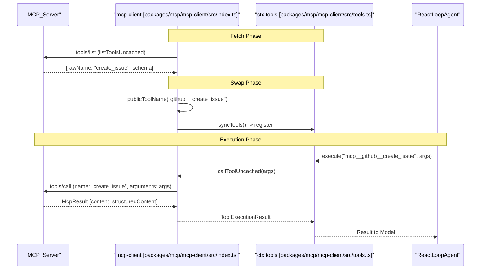

# Extensions & Integrations

<details>
<summary>Relevant source files</summary>

The following files were used as context for generating this wiki page:

- [.agents/notes/implemented/feature/2026-07-07-mcp-client-plugin.i18n.yaml](.agents/notes/implemented/feature/2026-07-07-mcp-client-plugin.i18n.yaml)
- [.agents/notes/implemented/feature/2026-07-07-mcp-client-plugin.md](.agents/notes/implemented/feature/2026-07-07-mcp-client-plugin.md)
- [.agents/notes/implemented/feature/2026-07-07-mcp-client-plugin.zh.md](.agents/notes/implemented/feature/2026-07-07-mcp-client-plugin.zh.md)
- [.agents/notes/implemented/simplification/2026-07-23-acp-automation-only-protocol.i18n.yaml](.agents/notes/implemented/simplification/2026-07-23-acp-automation-only-protocol.i18n.yaml)
- [.agents/notes/implemented/simplification/2026-07-23-acp-automation-only-protocol.md](.agents/notes/implemented/simplification/2026-07-23-acp-automation-only-protocol.md)
- [.agents/notes/implemented/simplification/2026-07-23-acp-automation-only-protocol.zh.md](.agents/notes/implemented/simplification/2026-07-23-acp-automation-only-protocol.zh.md)
- [packages/acp/acp/README.i18n.yaml](packages/acp/acp/README.i18n.yaml)
- [packages/acp/acp/README.md](packages/acp/acp/README.md)
- [packages/acp/acp/README.zh.md](packages/acp/acp/README.zh.md)
- [packages/acp/acp/src/codec.ts](packages/acp/acp/src/codec.ts)
- [packages/acp/acp/src/index.ts](packages/acp/acp/src/index.ts)
- [packages/acp/acp/tests/bridge.spec.ts](packages/acp/acp/tests/bridge.spec.ts)
- [packages/acp/acp/tests/codec.spec.ts](packages/acp/acp/tests/codec.spec.ts)
- [packages/acp/acp/tests/dispose.spec.ts](packages/acp/acp/tests/dispose.spec.ts)
- [packages/acp/acp/tests/edges.spec.ts](packages/acp/acp/tests/edges.spec.ts)
- [packages/acp/acp/tests/harness.ts](packages/acp/acp/tests/harness.ts)
- [packages/acp/acp/tests/turns.spec.ts](packages/acp/acp/tests/turns.spec.ts)
- [packages/mcp/mcp-client/README.i18n.yaml](packages/mcp/mcp-client/README.i18n.yaml)
- [packages/mcp/mcp-client/README.md](packages/mcp/mcp-client/README.md)
- [packages/mcp/mcp-client/README.zh.md](packages/mcp/mcp-client/README.zh.md)
- [packages/mcp/mcp-client/package.json](packages/mcp/mcp-client/package.json)
- [packages/mcp/mcp-client/src/index.ts](packages/mcp/mcp-client/src/index.ts)
- [packages/mcp/mcp-client/src/tools.ts](packages/mcp/mcp-client/src/tools.ts)
- [packages/mcp/mcp-client/tests/apply.spec.ts](packages/mcp/mcp-client/tests/apply.spec.ts)
- [packages/mcp/mcp-client/tests/fixture-server.ts](packages/mcp/mcp-client/tests/fixture-server.ts)
- [packages/mcp/mcp-client/tests/mcp-client.e2e.ts](packages/mcp/mcp-client/tests/mcp-client.e2e.ts)
- [packages/mcp/mcp-client/tests/mcp-client.spec.ts](packages/mcp/mcp-client/tests/mcp-client.spec.ts)

</details>


The DeepSeek Harness (DSH) architecture is designed for extensibility through a robust plugin system and standardized protocols. This section covers the optional extension packages that bridge DSH with external tool ecosystems, automation clients, and high-level task management systems like goals and workflows.

## 7.1 ACP Protocol & Agent Communication

The **Agent Client Protocol (ACP)** is an automation-only bridge that exposes DSH sessions to trusted programmatic clients over JSON-RPC stdio. It allows external systems to drive agents, handle turns, and manage session lifecycles without the overhead of the full DSH web UI.

The `acp` plugin acts as a server that owns and creates agents [packages/acp/acp/src/index.ts:42-45](). It maps ACP `prompt` requests to agent turns and handles complex disposal semantics, ensuring that all continuable subagents are drained via `drainContinuableDescendants` before the parent session is destroyed [packages/acp/acp/src/index.ts:51-58]().

**Key Components:**
*   **`AcpAgent`**: The SDK-level representation of the protocol [packages/acp/acp/src/index.ts:23-35]().
*   **Turn Correlation**: Logic in `settleAfterQuiescence` ensures that asynchronous injections or autonomous messages do not interfere with the settlement of a client-initiated prompt [packages/acp/acp/src/index.ts:169-200]().
*   **Codec**: Translates between DSH `SessionEvent` types and ACP wire formats using `assistantBlockToAcp`, specifically filtering for committed assistant content while keeping reasoning and trace data off the automation wire [packages/acp/acp/src/index.ts:40-41]().

For details, see [ACP Protocol & Agent Communication](#7.1).

**Sources:** [packages/acp/acp/src/index.ts:1-120](), [packages/acp/acp/tests/turns.spec.ts:1-156](), [packages/acp/acp/tests/dispose.spec.ts:1-100]()

---

## 7.2 MCP Client, Hooks & Skills

DSH integrates with the **Model Context Protocol (MCP)** to bridge external toolsets into the DSH tool registry. The `mcp-client` plugin connects to external MCP servers (via `stdio` or `streamable-http`) and registers their tools under server-qualified public names [packages/mcp/mcp-client/src/index.ts:1-14]().

### MCP Tool Naming & Synchronization
To prevent collisions between multiple MCP servers or native tools, DSH uses a deterministic naming contract: `mcp__<serverName>__<rawName>` [packages/mcp/mcp-client/src/tools.ts:96-102](). The synchronization process in `syncTools` is split into a **Fetch phase** (listing tools without mutating the registry) and a **Swap phase** (atomically replacing the old generation with the new one) [packages/mcp/mcp-client/src/tools.ts:128-160]().

### Hooks and Skills
The extension layer also includes:
*   **Hooks**: Protocols like `hooks-codex` and `hooks-claude-code` that allow for pre-tool interception and modification of agent behavior.
*   **Skills**: A system for loading curated sets of instructions and tool configurations (agent instruction sets) into a session.

For details, see [MCP Client, Hooks & Skills](#7.2).

**Sources:** [packages/mcp/mcp-client/src/index.ts:49-129](), [packages/mcp/mcp-client/src/tools.ts:1-160](), [packages/mcp/mcp-client/README.md:1-72]()

---

## 7.3 Goals, Todos, Workflows & Web Tools

High-level task orchestration is managed through a suite of domain-specific plugins. These move beyond simple chat turns into structured task execution.

*   **Goal System**: Uses `tool-goal` and `goal-round-driver` to track high-level objectives across multiple turns.
*   **Todo Tracking**: Managed via `tool-todo` and visualized in the `TodoPanel`, allowing agents to maintain a stateful list of pending sub-tasks.
*   **Workflows**: The `workflow-worker-thread` allows for long-running, multi-step processes to run in the background, with the `ui-workflow-run` package providing visibility into their progress.
*   **Web Tools**: Specialized tools for fetching web content and performing searches, integrated with the DSH schedule and time-context systems.

For details, see [Goals, Todos, Workflows & Web Tools](#7.3).

---

## 7.4 Python SDK & Runtime Distribution

The `deepseek-harness-sdk` provides a Python-native way to interact with DSH. This is primarily used for "Code Mode," where the agent writes and executes Python code that can call back into DSH tools.

*   **JSON-RPC Client**: A lightweight client that communicates with the DSH host.
*   **Turns API**: Allows Python scripts to trigger new agent turns or inject messages.
*   **Runtime Distribution**: The `deepseek-harness-runtime-bin` package handles the distribution of the DSH runtime as a single-file executable, simplifying deployment in varied environments.

For details, see [Python SDK & Runtime Distribution](#7.4).

---

## Architecture Overview: Integration Space

The following diagram illustrates how external protocols (ACP/MCP) and internal task systems (Goals/Workflows) bridge the gap between Natural Language requests and Code Entity execution.

### Protocol & Task Bridge
| Concept | Code Entity / Service | Purpose |
| :--- | :--- | :--- |
| **Automation Bridge** | `AcpAgent` [packages/acp/acp/src/index.ts:23]() | Exposes sessions to external JSON-RPC clients. |
| **Tool Provider** | `mcp-client` [packages/mcp/mcp-client/src/index.ts:28]() | Imports tools from external MCP servers. |
| **Tool Registry** | `ctx.tools` [packages/mcp/mcp-client/src/index.ts:31]() | Central hub where native and MCP tools are registered. |
| **Task State** | `tool-goal` | Maintains persistent state for long-term objectives. |

### System Integration Diagram
This diagram shows how the `acp` plugin and `mcp-client` interact with the core `agents` and `tools` services.

```mermaid
graph TD
    subgraph "External_Space"
        ["ACP_Client_(External)"]
        ["MCP_Server_(External)"]
    end

    subgraph "DSH_Host_(Code_Entity_Space)"
        ACP_Plugin["acp_plugin [packages/acp/acp/src/index.ts]"]
        MCP_Plugin["mcp-client_plugin [packages/mcp/mcp-client/src/index.ts]"]
        
        AgentService["ctx.agents (AgentRuntime)"]
        ToolService["ctx.tools (ToolRuntime)"]
        
        Session["SessionEvent_Log [packages/acp/acp/src/index.ts:155]"]
    end

    ["ACP_Client_(External)"] -- "JSON-RPC (stdio)" --> ACP_Plugin
    ACP_Plugin -- "creates/manages" --> AgentService
    
    ["MCP_Server_(External)"] -- "stdio / http" --> MCP_Plugin
    MCP_Plugin -- "syncTools()" --> ToolService
    
    AgentService -- "emits" --> Session
    ACP_Plugin -- "listens/codec" --> Session
    Session -- "notifies" --> ["ACP_Client_(External)"]
```
**Sources:** [packages/acp/acp/src/index.ts:42-110](), [packages/mcp/mcp-client/src/index.ts:1-40](), [packages/mcp/mcp-client/src/tools.ts:128-140]()

### Tool Discovery & Execution Flow
This diagram bridges the gap between an MCP server's raw tool definitions and the agent's ability to call them using the DSH `ToolRuntime`.


**Sources:** [packages/mcp/mcp-client/src/tools.ts:57-102](), [packages/mcp/mcp-client/src/tools.ts:128-160](), [packages/mcp/mcp-client/README.md:53-70]()
