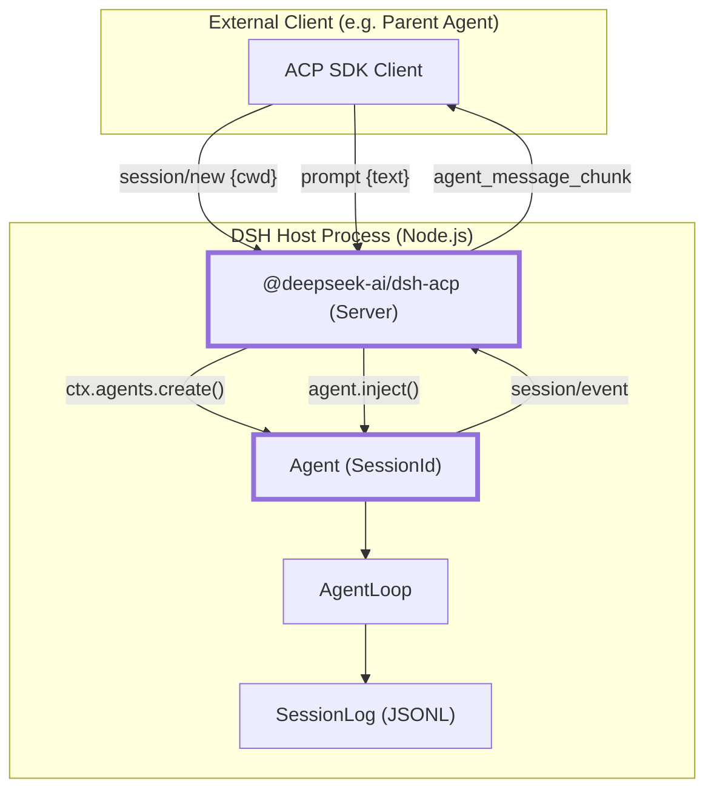
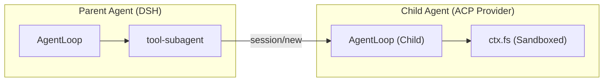

# ACP Protocol & Agent Communication

Relevant source files

The following files were used as context for generating this wiki page:

- [.agents/notes/implemented/bug-fix/2026-07-27-glob-sampling.i18n.yaml](.agents/notes/implemented/bug-fix/2026-07-27-glob-sampling.i18n.yaml)
- [.agents/notes/implemented/bug-fix/2026-07-27-glob-sampling.md](.agents/notes/implemented/bug-fix/2026-07-27-glob-sampling.md)
- [.agents/notes/implemented/bug-fix/2026-07-27-glob-sampling.zh.md](.agents/notes/implemented/bug-fix/2026-07-27-glob-sampling.zh.md)
- [.agents/notes/implemented/simplification/2026-07-23-acp-automation-only-protocol.i18n.yaml](.agents/notes/implemented/simplification/2026-07-23-acp-automation-only-protocol.i18n.yaml)
- [.agents/notes/implemented/simplification/2026-07-23-acp-automation-only-protocol.md](.agents/notes/implemented/simplification/2026-07-23-acp-automation-only-protocol.md)
- [.agents/notes/implemented/simplification/2026-07-23-acp-automation-only-protocol.zh.md](.agents/notes/implemented/simplification/2026-07-23-acp-automation-only-protocol.zh.md)
- [examples/README.md](examples/README.md)
- [examples/acp-agent/README.md](examples/acp-agent/README.md)
- [examples/acp-agent/composition.md](examples/acp-agent/composition.md)
- [examples/acp-agent/cordis.snapshot.yml](examples/acp-agent/cordis.snapshot.yml)
- [examples/acp-agent/cordis.yml](examples/acp-agent/cordis.yml)
- [examples/acp-agent/tests/acp.e2e.ts](examples/acp-agent/tests/acp.e2e.ts)
- [examples/acp-agent/tests/acp.snapshot.ts](examples/acp-agent/tests/acp.snapshot.ts)
- [examples/acp-agent/tests/cleanup.e2e.ts](examples/acp-agent/tests/cleanup.e2e.ts)
- [examples/acp-agent/tests/cleanup.ts](examples/acp-agent/tests/cleanup.ts)
- [examples/acp-agent/tests/escalation.e2e.ts](examples/acp-agent/tests/escalation.e2e.ts)
- [examples/acp-agent/tests/fs-search.cordis.snapshot.yml](examples/acp-agent/tests/fs-search.cordis.snapshot.yml)
- [examples/acp-agent/tests/fs-search.cordis.yml](examples/acp-agent/tests/fs-search.cordis.yml)
- [examples/acp-agent/tests/hooks.e2e.ts](examples/acp-agent/tests/hooks.e2e.ts)
- [examples/acp-agent/tests/snapshots/fs-glob-sampling/session.jsonl](examples/acp-agent/tests/snapshots/fs-glob-sampling/session.jsonl)
- [examples/headless-agent/composition.md](examples/headless-agent/composition.md)
- [examples/headless-agent/cordis.yml](examples/headless-agent/cordis.yml)
- [packages/acp/README.md](packages/acp/README.md)
- [packages/acp/acp/README.i18n.yaml](packages/acp/acp/README.i18n.yaml)
- [packages/acp/acp/README.md](packages/acp/acp/README.md)
- [packages/acp/acp/README.zh.md](packages/acp/acp/README.zh.md)
- [packages/acp/acp/src/codec.ts](packages/acp/acp/src/codec.ts)
- [packages/acp/acp/src/index.ts](packages/acp/acp/src/index.ts)
- [packages/acp/acp/tests/bridge.spec.ts](packages/acp/acp/tests/bridge.spec.ts)
- [packages/acp/acp/tests/codec.spec.ts](packages/acp/acp/tests/codec.spec.ts)
- [packages/acp/acp/tests/dispose.spec.ts](packages/acp/acp/tests/dispose.spec.ts)
- [packages/acp/acp/tests/edges.spec.ts](packages/acp/acp/tests/edges.spec.ts)
- [packages/acp/acp/tests/harness.ts](packages/acp/acp/tests/harness.ts)
- [packages/acp/acp/tests/turns.spec.ts](packages/acp/acp/tests/turns.spec.ts)
- [scripts/demo-code-mode.mjs](scripts/demo-code-mode.mjs)

The Agent Client Protocol (ACP) is an automation-oriented communication standard used by DeepSeek Harness (DSH) to expose agent capabilities to programmatic clients over JSON-RPC. Unlike the DSH Web UI, which uses a proprietary RPC system (Typert), ACP is designed for interoperability with parent agents, external subagent providers, and automated toolchains.

## Overview of ACP in DSH

In the DSH ecosystem, ACP serves as the primary bridge for "headless" automation. It allows a DSH instance to act as a server that provides fresh agent sessions to a client. The implementation is split between a server-side bridge and a client-side provider used for subagent orchestration.

### Key Characteristics
- **Transport**: Newline-delimited JSON-RPC over `stdio` (standard input/output) [examples/acp-agent/README.md:5-5]().
- **Purity**: The protocol channel is kept "pure"—the `@deepseek-ai/dsh-acp-demo` installs no stdout logger to ensure only valid JSON-RPC frames are transmitted; diagnostics must use `stderr` [examples/acp-agent/README.md:16-16]().
- **Scope**: Focused on prompt text/images, assistant text/images, cancellation, and one-shot permission decisions [packages/acp/acp/src/index.ts:4-7]().

### ACP Communication Flow

This diagram illustrates how the `acp` plugin bridges the "Natural Language Space" of the LLM to the "Code Entity Space" of the DSH Agent System.

**DSH ACP Bridge Architecture**

Sources: [packages/acp/acp/src/index.ts:121-156](), [examples/acp-agent/README.md:12-12]()

---

## Turn Codec & Lifecycle

The ACP bridge maps internal DSH `SessionEvent` types to ACP-compliant JSON-RPC notifications.

### Turn Correlation
When a client sends a `prompt` request, the bridge tracks the resulting "turn" within the `AgentLoop`. DSH agents may perform multiple steps (tool calls) before finishing a turn. The bridge ensures that the client's `prompt` call only resolves when the agent reaches an "idle" state or a terminal stop reason is reached [packages/acp/acp/src/index.ts:173-182]().

### Data Transformation (Codec)
The `acp` plugin uses a codec to translate between DSH's internal message blocks and ACP's content types:
- **Assistant Text**: `assistant/message` events are filtered for text blocks and emitted as `agent_message_chunk` updates [packages/acp/acp/src/index.ts:148-156]().
- **Assistant Images**: Committed assistant images are delivered as verified ACP base64 chunks [packages/acp/acp/tests/turns.spec.ts:44-66]().
- **Stop Reasons**: Internal `TurnEndReason` values (like `stop`, `error`, or `max-tokens`) are mapped to ACP `StopReason` strings (like `end_turn` or `cancelled`) via the `turnEndToStopReason` codec [packages/acp/acp/src/index.ts:41-41]().

Sources: [packages/acp/acp/src/index.ts:158-185](), [packages/acp/acp/tests/turns.spec.ts:34-42](), [packages/acp/acp/src/codec.ts:1-20]()

---

## Dispose Semantics & Teardown

ACP implementation in DSH includes strict disposal logic to prevent resource leaks, especially when dealing with nested subagents.

### Shutdown Sequence
When the ACP connection is closed or the plugin is disposed, the following sequence occurs:
1. **Cancel In-flight Prompts**: Any active agent turns are immediately cancelled [packages/acp/acp/tests/dispose.spec.ts:16-27]().
2. **Drain Subagents**: The bridge calls `drainContinuableDescendants` on the `subagents` service. This ensures that background subagents (continuable activations) are terminated child-first before their parent agents are destroyed [packages/acp/acp/tests/dispose.spec.ts:61-84]().
3. **Session Cleanup**: Owned `Agent` instances are disposed child-first, triggering the persistence layer to flush logs to disk [packages/acp/acp/tests/dispose.spec.ts:139-152]().

### Error Handling during Disposal
If a session fails to dispose (e.g., a scope cleanup failure), the bridge collects these errors and logs them as an `AggregateError`, ensuring that one failing session does not prevent the cleanup of others [packages/acp/acp/tests/dispose.spec.ts:139-152]().

Sources: [packages/acp/acp/src/index.ts:52-58](), [packages/acp/acp/tests/dispose.spec.ts:16-84]()

---

## The `acp-agent` Example

The `examples/acp-agent` directory provides a reference implementation of a standalone ACP server.

### Composition
The example is assembled via `cordis.yml` and includes:
- **LLM Adapter**: `@deepseek-ai/dsh-llm-deepseek` with reasoning enabled [examples/acp-agent/cordis.yml:9-16]().
- **Sandboxed Tools**: Sandboxed `bash` and filesystem tools restricted to the session's `cwd` [examples/acp-agent/cordis.yml:18-41]().
- **Persistence**: JSONL logging for every session, with compression disabled during snapshot runs for easier inspection [examples/acp-agent/cordis.yml:51-57]().
- **Subagent Support**: Both in-process spawning and forking of child agents [examples/acp-agent/cordis.yml:90-102]().

### Subagent Orchestration
ACP is used for subagent orchestration in two ways:
1. **Internal**: The `dsh-subagent` package can spawn child agents within the same process using the `spawn` or `fork` providers [examples/acp-agent/cordis.yml:90-102]().
2. **External**: DSH can integrate with external agents by acting as an ACP client (via `subagent-acp`), translating tool calls from the parent LLM into ACP requests to the external process [packages/acp/README.md:5-5]().

**Subagent Entity Mapping**

Sources: [examples/acp-agent/cordis.yml:116-135](), [packages/acp/README.md:5-5]()

---

## Testing & Snapshots

DSH uses a specialized snapshot suite for ACP to ensure protocol stability and behavioral regression testing.

### Snapshot Suite
The `acp.snapshot.ts` file defines scenarios that are recorded against live LLMs and then replayed during CI.
- **Recording**: Real model transcripts are captured into `session.jsonl` files [examples/acp-agent/tests/acp.snapshot.ts:21-30]().
- **Replay**: During testing, the `llm-replay` plugin serves these recorded responses, allowing the full ACP stack (including tools and sandboxes) to be tested deterministically without network access [examples/acp-agent/cordis.snapshot.yml:49-57]().

### E2E Verification
End-to-end tests boot the `acp-agent` as a real subprocess and verify its `stdout` purity—ensuring every line is valid JSON—and verify filesystem effects like the agent writing a `proof.txt` file [examples/acp-agent/tests/acp.e2e.ts:43-66](), [examples/acp-agent/tests/acp.e2e.ts:101-125]().

Sources: [examples/acp-agent/tests/acp.snapshot.ts:10-40](), [examples/acp-agent/tests/acp.e2e.ts:43-125]()
