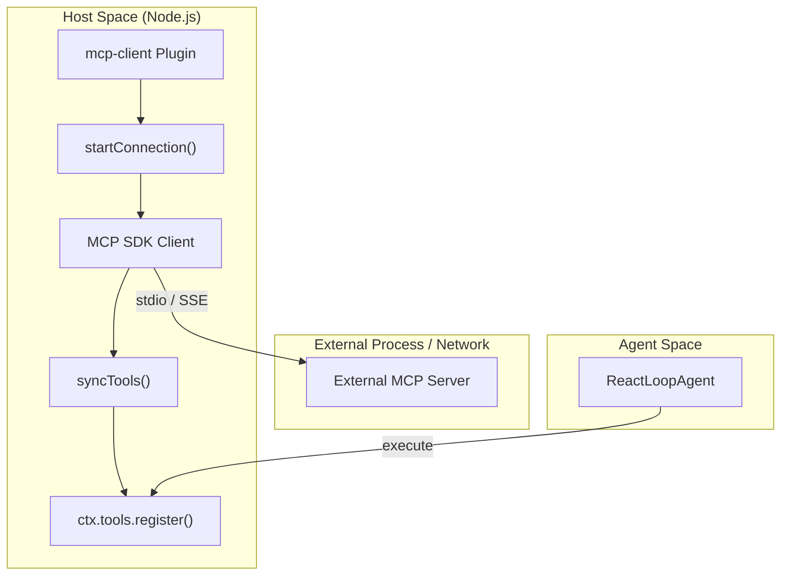
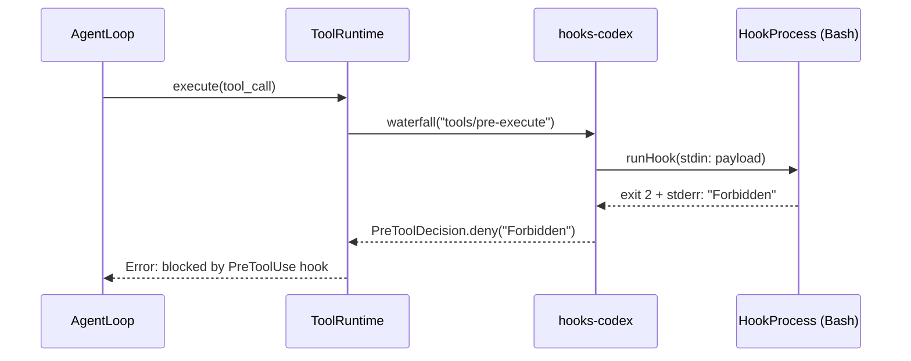
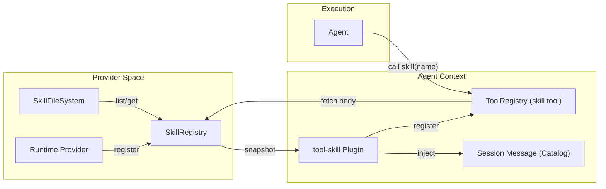

# MCP Client, Hooks & Skills

Relevant source files

The following files were used as context for generating this wiki page:

- [.agents/notes/implemented/feature/2026-06-30-hook-protocol-lib.i18n.yaml](.agents/notes/implemented/feature/2026-06-30-hook-protocol-lib.i18n.yaml)
- [.agents/notes/implemented/feature/2026-06-30-hook-protocol-lib.md](.agents/notes/implemented/feature/2026-06-30-hook-protocol-lib.md)
- [.agents/notes/implemented/feature/2026-06-30-hook-protocol-lib.zh.md](.agents/notes/implemented/feature/2026-06-30-hook-protocol-lib.zh.md)
- [.agents/notes/implemented/feature/2026-07-07-mcp-client-plugin.i18n.yaml](.agents/notes/implemented/feature/2026-07-07-mcp-client-plugin.i18n.yaml)
- [.agents/notes/implemented/feature/2026-07-07-mcp-client-plugin.md](.agents/notes/implemented/feature/2026-07-07-mcp-client-plugin.md)
- [.agents/notes/implemented/feature/2026-07-07-mcp-client-plugin.zh.md](.agents/notes/implemented/feature/2026-07-07-mcp-client-plugin.zh.md)
- [.agents/notes/implemented/feature/2026-08-08-user-explicit-skill-invocation.i18n.yaml](.agents/notes/implemented/feature/2026-08-08-user-explicit-skill-invocation.i18n.yaml)
- [.agents/notes/implemented/feature/2026-08-08-user-explicit-skill-invocation.md](.agents/notes/implemented/feature/2026-08-08-user-explicit-skill-invocation.md)
- [.agents/notes/implemented/feature/2026-08-08-user-explicit-skill-invocation.zh.md](.agents/notes/implemented/feature/2026-08-08-user-explicit-skill-invocation.zh.md)
- [examples/acp-agent/tests/snapshots/hook-cc-invalid-matcher/input.json](examples/acp-agent/tests/snapshots/hook-cc-invalid-matcher/input.json)
- [examples/acp-agent/tests/snapshots/hook-cc-invalid-matcher/session.jsonl](examples/acp-agent/tests/snapshots/hook-cc-invalid-matcher/session.jsonl)
- [examples/acp-agent/tests/snapshots/hook-cc-invalid-matcher/stdout.expected.jsonl](examples/acp-agent/tests/snapshots/hook-cc-invalid-matcher/stdout.expected.jsonl)
- [examples/acp-agent/tests/snapshots/hook-cc-invalid-matcher/workspace/hooks.json](examples/acp-agent/tests/snapshots/hook-cc-invalid-matcher/workspace/hooks.json)
- [examples/acp-agent/tests/snapshots/hook-codex-invalid-matcher/input.json](examples/acp-agent/tests/snapshots/hook-codex-invalid-matcher/input.json)
- [examples/acp-agent/tests/snapshots/hook-codex-invalid-matcher/session.jsonl](examples/acp-agent/tests/snapshots/hook-codex-invalid-matcher/session.jsonl)
- [examples/acp-agent/tests/snapshots/hook-codex-invalid-matcher/stdout.expected.jsonl](examples/acp-agent/tests/snapshots/hook-codex-invalid-matcher/stdout.expected.jsonl)
- [packages/client/ui-skill/README.i18n.yaml](packages/client/ui-skill/README.i18n.yaml)
- [packages/client/ui-skill/README.md](packages/client/ui-skill/README.md)
- [packages/client/ui-skill/README.zh.md](packages/client/ui-skill/README.zh.md)
- [packages/client/ui-skill/src/client/index.ts](packages/client/ui-skill/src/client/index.ts)
- [packages/hooks/hook-protocol/README.i18n.yaml](packages/hooks/hook-protocol/README.i18n.yaml)
- [packages/hooks/hook-protocol/README.md](packages/hooks/hook-protocol/README.md)
- [packages/hooks/hook-protocol/README.zh.md](packages/hooks/hook-protocol/README.zh.md)
- [packages/hooks/hook-protocol/src/index.ts](packages/hooks/hook-protocol/src/index.ts)
- [packages/hooks/hook-protocol/src/matcher.ts](packages/hooks/hook-protocol/src/matcher.ts)
- [packages/hooks/hook-protocol/tests/matcher.spec.ts](packages/hooks/hook-protocol/tests/matcher.spec.ts)
- [packages/hooks/hooks-codex/README.md](packages/hooks/hooks-codex/README.md)
- [packages/hooks/hooks-codex/src/config.ts](packages/hooks/hooks-codex/src/config.ts)
- [packages/hooks/hooks-codex/src/index.ts](packages/hooks/hooks-codex/src/index.ts)
- [packages/hooks/hooks-codex/tests/bridge.spec.ts](packages/hooks/hooks-codex/tests/bridge.spec.ts)
- [packages/hooks/hooks-codex/tests/config.spec.ts](packages/hooks/hooks-codex/tests/config.spec.ts)
- [packages/mcp/mcp-client/README.i18n.yaml](packages/mcp/mcp-client/README.i18n.yaml)
- [packages/mcp/mcp-client/README.md](packages/mcp/mcp-client/README.md)
- [packages/mcp/mcp-client/README.zh.md](packages/mcp/mcp-client/README.zh.md)
- [packages/mcp/mcp-client/package.json](packages/mcp/mcp-client/package.json)
- [packages/mcp/mcp-client/src/index.ts](packages/mcp/mcp-client/src/index.ts)
- [packages/mcp/mcp-client/src/tools.ts](packages/mcp/mcp-client/src/tools.ts)
- [packages/mcp/mcp-client/tests/apply.spec.ts](packages/mcp/mcp-client/tests/apply.spec.ts)
- [packages/mcp/mcp-client/tests/fixture-server.ts](packages/mcp/mcp-client/tests/fixture-server.ts)
- [packages/mcp/mcp-client/tests/mcp-client.e2e.ts](packages/mcp/mcp-client/tests/mcp-client.e2e.ts)
- [packages/mcp/mcp-client/tests/mcp-client.spec.ts](packages/mcp/mcp-client/tests/mcp-client.spec.ts)
- [packages/skill/skill/README.i18n.yaml](packages/skill/skill/README.i18n.yaml)
- [packages/skill/skill/README.md](packages/skill/skill/README.md)
- [packages/skill/skill/README.zh.md](packages/skill/skill/README.zh.md)
- [packages/skill/skill/package.json](packages/skill/skill/package.json)
- [packages/skill/skill/src/index.ts](packages/skill/skill/src/index.ts)
- [packages/skill/skill/tests/skill.spec.ts](packages/skill/skill/tests/skill.spec.ts)
- [packages/skill/skill/tsconfig.json](packages/skill/skill/tsconfig.json)
- [packages/skill/tool-skill/README.i18n.yaml](packages/skill/tool-skill/README.i18n.yaml)
- [packages/skill/tool-skill/README.md](packages/skill/tool-skill/README.md)
- [packages/skill/tool-skill/README.zh.md](packages/skill/tool-skill/README.zh.md)
- [packages/skill/tool-skill/src/index.ts](packages/skill/tool-skill/src/index.ts)
- [packages/skill/tool-skill/tests/tool-skill.spec.ts](packages/skill/tool-skill/tests/tool-skill.spec.ts)

The DeepSeek Harness (dsh) integrates external tools and agent behaviors through three primary mechanisms: the **Model Context Protocol (MCP)** for bridging third-party tool servers, a **Hook Protocol** for intercepting agent actions (compatible with Codex and Claude Code), and a **Skill System** for loading durable instruction sets into the agent's context.

## 1. MCP Client Bridge

The `mcp-client` plugin connects dsh to external MCP servers, projecting remote tools into the local `ctx.tools` registry. Each plugin instance manages one connection to a specific MCP server [packages/mcp/mcp-client/src/index.ts:1-14]().

### 1.1 Implementation & Tool Namespacing
To prevent collisions between multiple MCP servers or native tools, remote tools are registered under a server-qualified namespace: `mcp__<serverName>__<rawName>` [packages/mcp/mcp-client/src/index.ts:1-5](). The `publicToolName` function handles normalization, ensuring names fit within the 64-character budget by using deterministic identity hashes (SHA-256) for over-long names [packages/mcp/mcp-client/src/tools.ts:98-117]().

### 1.2 Connection Lifecycle
The client supports two primary transports: `stdio` (spawning child processes) and `streamable-http` (SSE) [packages/mcp/mcp-client/src/index.ts:49-95](). It implements an automatic reconnect policy with exponential backoff [packages/mcp/mcp-client/src/index.ts:100-105]().

**MCP Client Data Flow**

Sources: [packages/mcp/mcp-client/src/index.ts:132-171](), [packages/mcp/mcp-client/src/tools.ts:143-174]()

## 2. Hook Protocol

The Hook Protocol allows for pre-tool and pre-step interception. It is split into a dialect-neutral library (`dsh-hook-protocol`) and bridge plugins for specific implementations like `hooks-codex` and `hooks-claude-code` [packages/hooks/hook-protocol/README.md:1-8]().

### 2.1 Codex Bridge (`hooks-codex`)
The Codex bridge implements a subset of the Codex hook protocol, supporting five interception points [packages/hooks/hooks-codex/README.md:7-15]():
*   **SessionStart**: Runs detached during session initialization [packages/hooks/hooks-codex/src/index.ts:101-105]().
*   **UserPromptSubmit**: Intercepts prompts at the `agent/pre-step` waterfall [packages/hooks/hooks-codex/README.md:43-50]().
*   **PreToolUse**: Intercepts tool execution via `tools/pre-execute` [packages/hooks/hooks-codex/src/index.ts:23-24]().
*   **PostToolUse**: Intercepts tool results via `tools/post-execute` [packages/hooks/hooks-codex/README.md:43-50]().
*   **Stop**: Intercepts turn completion via `agent/turn-stopping` [packages/hooks/hooks-codex/src/index.ts:43-50]().

### 2.2 Execution & Decisions
Hooks are executed as shell commands via `runHook` [packages/hooks/hook-protocol/README.md:23](). The protocol parses exit codes and stdout to produce a `MergedHookOutcome` [packages/hooks/hook-protocol/README.md:25-26]().
*   **Exit Code 2**: Blocks the action (e.g., `PreToolDecision.deny` or `PreStepDecision.reject`) [packages/hooks/hook-protocol/README.md:24-25](), [packages/hooks/hooks-codex/README.md:43-50]().
*   **stdout/additionalContext**: Injected into the agent's transcript as a `plugin` source message [packages/hooks/hooks-codex/src/index.ts:150-157]().

**Hook Interception Logic**

Sources: [packages/hooks/hooks-codex/src/index.ts:113-160](), [packages/hooks/hook-protocol/README.md:22-26](), [packages/hooks/hooks-codex/tests/bridge.spec.ts:69-88]()

## 3. Skill System

Skills are reusable instruction sets (Markdown) that provide domain-specific guidance to agents. They are managed by the `SkillRegistry` service, which supports scoped layers (global vs. agent-specific) [packages/skill/skill/src/index.ts:1-15]().

### 3.1 Skill Catalog (`tool-skill`)
The `tool-skill` plugin maintains a durable catalog in the session log. It monitors the `agent/pre-step` waterfall to ensure the model always has an up-to-date list of available skills [packages/skill/tool-skill/src/index.ts:77-80]().

*   **System Reminder**: If skills are available, a `<system-reminder>` block containing the `<available_skills>` list is injected into the conversation [packages/skill/tool-skill/tests/tool-skill.spec.ts:125-130]().
*   **Durable Updates**: The catalog is re-published only if the set of available skills changes, detected via a hash of the entries [packages/skill/tool-skill/src/index.ts:29-41]().

### 3.2 Loading Skills
Models interact with skills via the `skill` tool. Calling `skill(name="xyz")` retrieves the full Markdown body and injects it into the next model turn [packages/skill/tool-skill/src/index.ts:81-161]().

**Skill Discovery and Invocation**
| Component | Code Entity | Role |
| :--- | :--- | :--- |
| **Registry** | `SkillRegistry` | Merges skills from `SkillFileSystem` and runtime providers [packages/skill/skill/src/index.ts:13-16](). |
| **Tool** | `skillTool` | The `defineTool` instance allowing models to fetch instructions [packages/skill/tool-skill/src/index.ts:81-161](). |
| **Catalog** | `SkillCatalogSource` | A `MessageSource` that tracks published skill summaries [packages/skill/tool-skill/src/index.ts:34-41](). |
| **User Gesture** | `/<name>` | A deterministic load gesture for user-invocable skills [packages/skill/tool-skill/src/index.ts:163-175](). |

**Skill System Architecture**

Sources: [packages/skill/skill/src/index.ts:4-11](), [packages/skill/tool-skill/src/index.ts:77-83](), [packages/skill/tool-skill/tests/tool-skill.spec.ts:160-172]()
