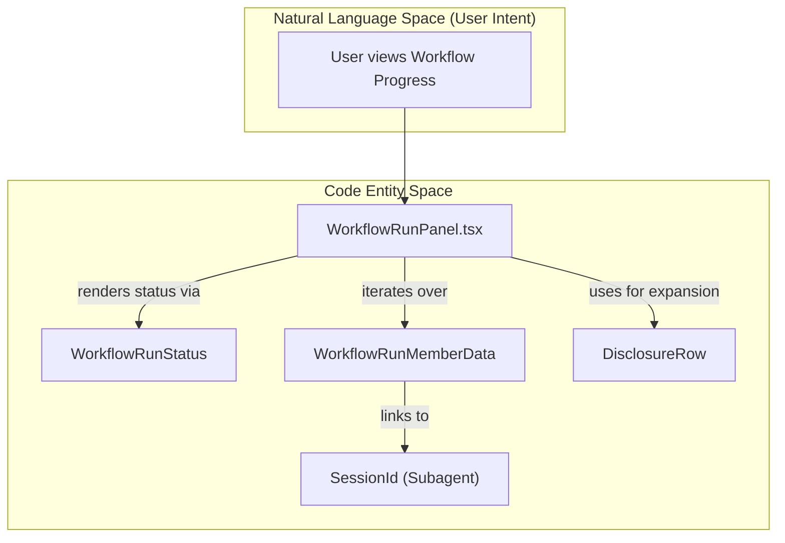
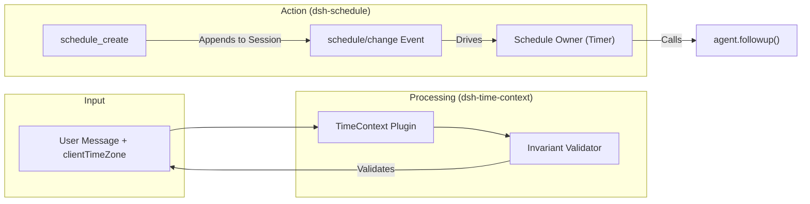

# Goals, Todos, Workflows & Web Tools

Relevant source files

The following files were used as context for generating this wiki page:

- [.agents/notes/implemented/bug-fix/2026-08-02-goal-round-wrapup-message.i18n.yaml](.agents/notes/implemented/bug-fix/2026-08-02-goal-round-wrapup-message.i18n.yaml)
- [.agents/notes/implemented/bug-fix/2026-08-02-goal-round-wrapup-message.md](.agents/notes/implemented/bug-fix/2026-08-02-goal-round-wrapup-message.md)
- [.agents/notes/implemented/bug-fix/2026-08-02-goal-round-wrapup-message.zh.md](.agents/notes/implemented/bug-fix/2026-08-02-goal-round-wrapup-message.zh.md)
- [.agents/notes/implemented/feature/2026-07-16-durable-per-step-time-context.md](.agents/notes/implemented/feature/2026-07-16-durable-per-step-time-context.md)
- [.agents/notes/implemented/feature/2026-07-19-model-facing-goal-tools.i18n.yaml](.agents/notes/implemented/feature/2026-07-19-model-facing-goal-tools.i18n.yaml)
- [.agents/notes/implemented/feature/2026-07-19-model-facing-goal-tools.md](.agents/notes/implemented/feature/2026-07-19-model-facing-goal-tools.md)
- [.agents/notes/implemented/feature/2026-07-19-model-facing-goal-tools.zh.md](.agents/notes/implemented/feature/2026-07-19-model-facing-goal-tools.zh.md)
- [.agents/notes/implemented/feature/2026-08-05-durable-web-schedule.md](.agents/notes/implemented/feature/2026-08-05-durable-web-schedule.md)
- [.agents/notes/implemented/feature/2026-08-05-durable-web-schedule.zh.md](.agents/notes/implemented/feature/2026-08-05-durable-web-schedule.zh.md)
- [.agents/notes/implemented/feature/2026-08-11-workflow-run-status-driven-disclosure.i18n.yaml](.agents/notes/implemented/feature/2026-08-11-workflow-run-status-driven-disclosure.i18n.yaml)
- [.agents/notes/implemented/feature/2026-08-11-workflow-run-status-driven-disclosure.md](.agents/notes/implemented/feature/2026-08-11-workflow-run-status-driven-disclosure.md)
- [.agents/notes/implemented/feature/2026-08-11-workflow-run-status-driven-disclosure.zh.md](.agents/notes/implemented/feature/2026-08-11-workflow-run-status-driven-disclosure.zh.md)
- [.agents/notes/implemented/feature/2026-08-17-web-search-multiple-queries.i18n.yaml](.agents/notes/implemented/feature/2026-08-17-web-search-multiple-queries.i18n.yaml)
- [.agents/notes/implemented/feature/2026-08-17-web-search-multiple-queries.md](.agents/notes/implemented/feature/2026-08-17-web-search-multiple-queries.md)
- [.agents/notes/implemented/feature/2026-08-17-web-search-multiple-queries.zh.md](.agents/notes/implemented/feature/2026-08-17-web-search-multiple-queries.zh.md)
- [apps/web/tests/schedule-after.e2e.ts](apps/web/tests/schedule-after.e2e.ts)
- [apps/web/tests/snapshots/workflow-run/ui-live.expected.md](apps/web/tests/snapshots/workflow-run/ui-live.expected.md)
- [apps/web/tests/snapshots/workflow-run/ui.expected.md](apps/web/tests/snapshots/workflow-run/ui.expected.md)
- [apps/web/tests/web-search-round.e2e.ts](apps/web/tests/web-search-round.e2e.ts)
- [apps/web/tests/workflow-run.e2e.ts](apps/web/tests/workflow-run.e2e.ts)
- [docs/subsystems/web.i18n.yaml](docs/subsystems/web.i18n.yaml)
- [docs/subsystems/web.md](docs/subsystems/web.md)
- [docs/subsystems/web.zh.md](docs/subsystems/web.zh.md)
- [examples/acp-agent/tests/goal-snapshots/goal-wrapup/input.json](examples/acp-agent/tests/goal-snapshots/goal-wrapup/input.json)
- [examples/acp-agent/tests/goal-snapshots/goal-wrapup/replay.override.json](examples/acp-agent/tests/goal-snapshots/goal-wrapup/replay.override.json)
- [examples/acp-agent/tests/goal-snapshots/goal-wrapup/session.expected.jsonl](examples/acp-agent/tests/goal-snapshots/goal-wrapup/session.expected.jsonl)
- [examples/acp-agent/tests/goal-snapshots/goal-wrapup/session.jsonl](examples/acp-agent/tests/goal-snapshots/goal-wrapup/session.jsonl)
- [examples/headless-agent/goal.cordis.snapshot.yml](examples/headless-agent/goal.cordis.snapshot.yml)
- [examples/headless-agent/goal.cordis.yml](examples/headless-agent/goal.cordis.yml)
- [examples/headless-agent/tests/keyless-smoke.e2e.ts](examples/headless-agent/tests/keyless-smoke.e2e.ts)
- [examples/headless-agent/tests/snapshots/goal-tools/input.json](examples/headless-agent/tests/snapshots/goal-tools/input.json)
- [examples/headless-agent/tests/snapshots/goal-tools/replay.override.json](examples/headless-agent/tests/snapshots/goal-tools/replay.override.json)
- [examples/headless-agent/tests/snapshots/goal-tools/stream-json.expected.jsonl](examples/headless-agent/tests/snapshots/goal-tools/stream-json.expected.jsonl)
- [packages/client/ui-workflow-run/README.i18n.yaml](packages/client/ui-workflow-run/README.i18n.yaml)
- [packages/client/ui-workflow-run/README.md](packages/client/ui-workflow-run/README.md)
- [packages/client/ui-workflow-run/README.zh.md](packages/client/ui-workflow-run/README.zh.md)
- [packages/client/ui-workflow-run/src/client/WorkflowRunPanel.tsx](packages/client/ui-workflow-run/src/client/WorkflowRunPanel.tsx)
- [packages/client/ui-workflow-run/tests/workflow-run.client.spec.tsx](packages/client/ui-workflow-run/tests/workflow-run.client.spec.tsx)
- [packages/context/README.md](packages/context/README.md)
- [packages/context/time-context/README.md](packages/context/time-context/README.md)
- [packages/context/time-context/package.json](packages/context/time-context/package.json)
- [packages/context/time-context/src/index.ts](packages/context/time-context/src/index.ts)
- [packages/context/time-context/src/invariant.ts](packages/context/time-context/src/invariant.ts)
- [packages/context/time-context/src/request-zone.ts](packages/context/time-context/src/request-zone.ts)
- [packages/context/time-context/src/timestamp.ts](packages/context/time-context/src/timestamp.ts)
- [packages/context/time-context/tests/invariant.spec.ts](packages/context/time-context/tests/invariant.spec.ts)
- [packages/context/time-context/tests/request-zone.spec.ts](packages/context/time-context/tests/request-zone.spec.ts)
- [packages/context/time-context/tests/time-context.e2e.ts](packages/context/time-context/tests/time-context.e2e.ts)
- [packages/context/time-context/tests/time-context.spec.ts](packages/context/time-context/tests/time-context.spec.ts)
- [packages/context/time-context/tsconfig.json](packages/context/time-context/tsconfig.json)
- [packages/goal/goal/tests/goal.e2e.ts](packages/goal/goal/tests/goal.e2e.ts)
- [packages/goal/tool-goal/README.md](packages/goal/tool-goal/README.md)
- [packages/goal/tool-goal/src/index.ts](packages/goal/tool-goal/src/index.ts)
- [packages/goal/tool-goal/src/wrapup.ts](packages/goal/tool-goal/src/wrapup.ts)
- [packages/goal/tool-goal/tests/tool-goal.spec.ts](packages/goal/tool-goal/tests/tool-goal.spec.ts)
- [packages/todo/README.i18n.yaml](packages/todo/README.i18n.yaml)
- [packages/todo/README.md](packages/todo/README.md)
- [packages/todo/README.zh.md](packages/todo/README.zh.md)
- [packages/todo/tool-todo/README.i18n.yaml](packages/todo/tool-todo/README.i18n.yaml)
- [packages/todo/tool-todo/README.md](packages/todo/tool-todo/README.md)
- [packages/todo/tool-todo/README.zh.md](packages/todo/tool-todo/README.zh.md)
- [packages/todo/tool-todo/package.json](packages/todo/tool-todo/package.json)
- [packages/todo/tool-todo/src/index.ts](packages/todo/tool-todo/src/index.ts)
- [packages/todo/tool-todo/tests/loader-composition.spec.ts](packages/todo/tool-todo/tests/loader-composition.spec.ts)
- [packages/todo/tool-todo/tests/projection.spec.ts](packages/todo/tool-todo/tests/projection.spec.ts)
- [packages/todo/tool-todo/tests/tool-todo.spec.ts](packages/todo/tool-todo/tests/tool-todo.spec.ts)
- [packages/web/tool-web/README.i18n.yaml](packages/web/tool-web/README.i18n.yaml)
- [packages/web/tool-web/README.md](packages/web/tool-web/README.md)
- [packages/web/tool-web/README.zh.md](packages/web/tool-web/README.zh.md)
- [packages/web/tool-web/src/index.ts](packages/web/tool-web/src/index.ts)
- [packages/web/tool-web/src/search.ts](packages/web/tool-web/src/search.ts)
- [packages/web/tool-web/tests/tool-web.spec.ts](packages/web/tool-web/tests/tool-web.spec.ts)

This page details the specialized task management, planning, and environmental observation systems in DeepSeek Harness. These components bridge the gap between simple LLM text generation and autonomous, long-running agentic behavior.

## 1. Goal System

The goal system provides a mechanism for agents to manage long-running objectives that span multiple autonomous rounds. It is implemented via the `@deepseek-ai/dsh-goal` service and exposed to models through `@deepseek-ai/dsh-tool-goal`.

### Implementation & Tools
The system registers three primary tools on `ctx.tools`: `create_goal`, `get_goal`, and `update_goal` [packages/goal/tool-goal/tests/tool-goal.spec.ts:123-124](). These tools interact with a persisted same-session goal domain [packages/goal/tool-goal/tests/tool-goal.spec.ts:6-7]().

| Tool | Purpose | Key Constraints |
| :--- | :--- | :--- |
| `create_goal` | Initializes a long-running objective. | Rejects non-human and subagent authority [packages/goal/tool-goal/tests/tool-goal.spec.ts:89-100](). |
| `get_goal` | Reads current goal status, revision, and blockers. | Must be called before `update_goal` to ensure revision alignment [packages/goal/tool-goal/tests/tool-goal.spec.ts:140-142](). |
| `update_goal` | Modifies phase (`edit`, `pause`, `resume`, `complete`, `blocked`). | `blocked` requires a persistence threshold (default: 3 rounds) [packages/goal/tool-goal/tests/tool-goal.spec.ts:122-132](). |

### Data Flow: Goal Execution
Goals use a "compare-and-set" pattern using a `GoalRef` (ID + Revision) to prevent race conditions during autonomous updates [packages/goal/tool-goal/tests/tool-goal.spec.ts:147-148]().

**Sources:** `packages/goal/tool-goal/src/index.ts`, `packages/goal/tool-goal/tests/tool-goal.spec.ts`.

---

## 2. Todo Tracking & Standing Plans

The Todo system (`@deepseek-ai/dsh-tool-todo`) implements a "last-write-wins" snapshot pattern for task management. Unlike traditional CRUD, the model replaces the entire list on every update.

### Tool: `todo_write`
- **Snapshot Pattern:** Every call appends a `todo/write` event containing the full list to the session log [packages/todo/tool-todo/src/index.ts:2-3]().
- **Validation:** Rejects empty content, duplicate items, or extra properties to ensure the log matches the model's belief [packages/todo/tool-todo/src/index.ts:91-111]().
- **Concurrency Policy:** Configurable via `allowParallelInProgress`. If `false`, the tool enforces that at most one task is active [packages/todo/tool-todo/src/index.ts:107-109]().

### Session Projection
The `todos` projection (via `@deepseek-ai/dsh-session-projection`) maintains the current state of the list.
- **Lifetime:** The list is cleared on `turn/start` to ensure the agent re-evaluates its plan for the new turn [packages/todo/tool-todo/src/index.ts:142]().
- **UI:** The `TodoPanel` renders the latest `todo/write` snapshot from the session events [packages/todo/tool-todo/src/index.ts:136-141]().

**Sources:** `packages/todo/tool-todo/src/index.ts`, `packages/todo/tool-todo/README.md`.

---

## 3. Workflow Runs & UI

Workflows represent structured multi-agent or multi-step executions. The `ui-workflow-run` package provides the visualization layer for these runs.

### WorkflowRunPanel
The `WorkflowRunPanel` component tracks the status of a workflow and its constituent members [packages/client/ui-workflow-run/src/client/WorkflowRunPanel.tsx:23-26]().
- **Status Mapping:** Maps internal `WorkflowRunStatus` (`running`, `completed`, `failed`, etc.) to UI states and state dots [packages/client/ui-workflow-run/src/client/WorkflowRunPanel.tsx:36-46]().
- **Disclosure Logic:** Phases automatically expand if they contain active or abnormal (failed/interrupted) members [packages/client/ui-workflow-run/src/client/WorkflowRunPanel.tsx:96-101]().
- **Navigation:** Allows users to jump directly to the subagent session associated with a workflow member [packages/client/ui-workflow-run/src/client/WorkflowRunPanel.tsx:180-192]().

### Diagram: Workflow Run Entity Mapping
This diagram bridges the UI representation to the underlying session and status data.

**Sources:** `packages/client/ui-workflow-run/src/client/WorkflowRunPanel.tsx`, `packages/client/ui-workflow-run/tests/workflow-run.client.spec.tsx`.

---

## 4. Web Fetch & Search Tools

The `@deepseek-ai/dsh-tool-web` package provides environmental observation capabilities, allowing agents to retrieve external data through a capability seam (`ctx.web`).

- **Search (`web_search`):** Accepts multiple queries (up to `searchMaxQueries`, default 4) and returns merged sources [packages/web/tool-web/README.md:13](). It performs deduplication and round-robin merging of results [packages/web/tool-web/src/search.ts:40-52]().
- **Fetch (`web_fetch`):** Retrieves specific URLs and converts HTML to Markdown using Turndown [packages/web/tool-web/README.md:14](). It enforces a `fetchMaxOutputChars` limit (default 200,000) [packages/web/tool-web/README.md:30]().
- **UI Rendering:** Uses specialized cards (`card: 'web'`) discriminated by `kind: 'search' | 'fetch'` [packages/web/tool-web/README.md:5](). Structured metadata like `answer`, `sources`, and `truncated` flags are persisted in `presentationMeta` [packages/web/tool-web/src/search.ts:116-123]().

**Sources:** `packages/web/tool-web/src/search.ts`, `packages/web/tool-web/README.md`, `packages/web/tool-web/tests/tool-web.spec.ts`.

---

## 5. Schedule & Time Context

The schedule system (`@deepseek-ai/dsh-schedule`) and time context system (`@deepseek-ai/dsh-time-context`) handle temporal awareness and future task execution.

### Time Context
The `time-context` plugin injects a durable "snapshot" of the current time into the agent's turn.
- **Zoned Time:** It captures the browser's IANA time zone from the user message and formats timestamps accordingly [packages/context/time-context/tests/time-context.spec.ts:155-167]().
- **Invariants:** The `time-context-invariant` ensures that time readings are appended correctly within turn/step boundaries and that the elapsed time baselines are accurate [packages/context/time-context/tests/invariant.spec.ts:89-95]().

### Durable Scheduling
The schedule system allows agents to create "Reminders" that survive process restarts and are session-local.
- **Persistence:** Reminders are stored as `schedule/change` events in the session log [.agents/notes/implemented/feature/2026-08-05-durable-web-schedule.md:29]().
- **Fixed-Rate (Every):** Supports fixed-duration intervals (minimum 5 minutes) that stay aligned to the creation anchor, preventing drift or backlog accumulation during cold sessions [.agents/notes/implemented/feature/2026-08-05-durable-web-schedule.md:44-48]().
- **Execution:** When a reminder is due, the system waits for the agent to be idle, then uses `agent.followup()` to inject the reminder as a new turn [.agents/notes/implemented/feature/2026-08-05-durable-web-schedule.md:17]().

### Diagram: Time & Schedule Data Flow

**Sources:** `packages/context/time-context/tests/invariant.spec.ts`, `packages/context/time-context/tests/time-context.spec.ts`, `.agents/notes/implemented/feature/2026-08-05-durable-web-schedule.md`, `apps/web/tests/schedule-after.e2e.ts`.
