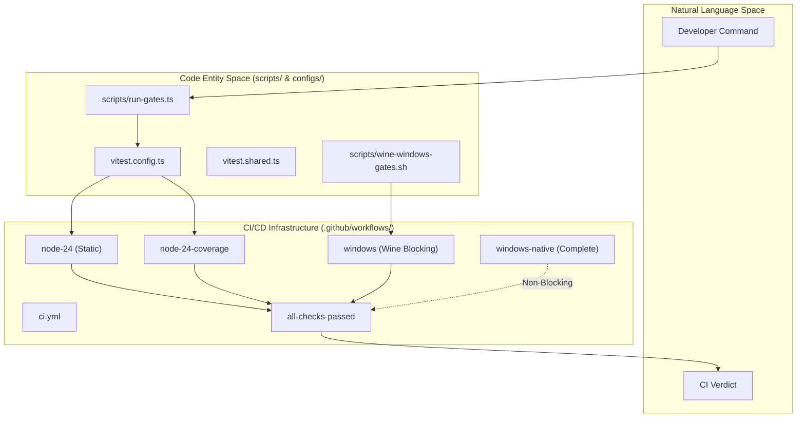
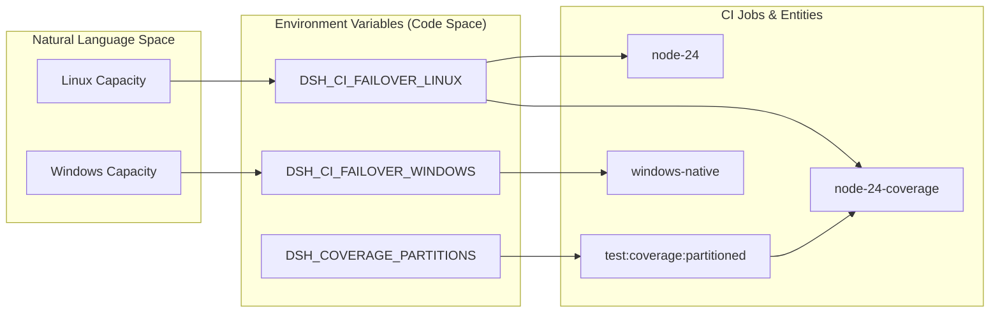

# Testing & Quality Infrastructure

Relevant source files

The following files were used as context for generating this wiki page:

- [.agents/notes/implemented/bug-fix/2026-08-06-plan-narrow-viewport-regression.i18n.yaml](.agents/notes/implemented/bug-fix/2026-08-06-plan-narrow-viewport-regression.i18n.yaml)
- [.agents/notes/implemented/bug-fix/2026-08-06-plan-narrow-viewport-regression.md](.agents/notes/implemented/bug-fix/2026-08-06-plan-narrow-viewport-regression.md)
- [.agents/notes/implemented/bug-fix/2026-08-06-plan-narrow-viewport-regression.zh.md](.agents/notes/implemented/bug-fix/2026-08-06-plan-narrow-viewport-regression.zh.md)
- [.agents/notes/implemented/process/2026-07-06-parallel-pre-push-gates.i18n.yaml](.agents/notes/implemented/process/2026-07-06-parallel-pre-push-gates.i18n.yaml)
- [.agents/notes/implemented/process/2026-07-06-parallel-pre-push-gates.md](.agents/notes/implemented/process/2026-07-06-parallel-pre-push-gates.md)
- [.agents/notes/implemented/process/2026-07-06-parallel-pre-push-gates.zh.md](.agents/notes/implemented/process/2026-07-06-parallel-pre-push-gates.zh.md)
- [.agents/notes/implemented/process/2026-07-26-ci-failover-runbook.i18n.yaml](.agents/notes/implemented/process/2026-07-26-ci-failover-runbook.i18n.yaml)
- [.agents/notes/implemented/process/2026-07-26-ci-failover-runbook.md](.agents/notes/implemented/process/2026-07-26-ci-failover-runbook.md)
- [.agents/notes/implemented/process/2026-07-26-ci-failover-runbook.zh.md](.agents/notes/implemented/process/2026-07-26-ci-failover-runbook.zh.md)
- [.agents/notes/implemented/process/2026-08-08-native-windows-pull-request-ci.i18n.yaml](.agents/notes/implemented/process/2026-08-08-native-windows-pull-request-ci.i18n.yaml)
- [.agents/notes/implemented/process/2026-08-08-native-windows-pull-request-ci.md](.agents/notes/implemented/process/2026-08-08-native-windows-pull-request-ci.md)
- [.agents/notes/implemented/process/2026-08-08-native-windows-pull-request-ci.zh.md](.agents/notes/implemented/process/2026-08-08-native-windows-pull-request-ci.zh.md)
- [.agents/notes/implemented/process/2026-08-18-in-job-partitioned-coverage.i18n.yaml](.agents/notes/implemented/process/2026-08-18-in-job-partitioned-coverage.i18n.yaml)
- [.agents/notes/implemented/process/2026-08-18-in-job-partitioned-coverage.md](.agents/notes/implemented/process/2026-08-18-in-job-partitioned-coverage.md)
- [.agents/notes/implemented/process/2026-08-18-in-job-partitioned-coverage.zh.md](.agents/notes/implemented/process/2026-08-18-in-job-partitioned-coverage.zh.md)
- [.agents/notes/implemented/testing/2026-07-24-web-gui-browser-e2e-lane.i18n.yaml](.agents/notes/implemented/testing/2026-07-24-web-gui-browser-e2e-lane.i18n.yaml)
- [.agents/notes/implemented/testing/2026-07-24-web-gui-browser-e2e-lane.md](.agents/notes/implemented/testing/2026-07-24-web-gui-browser-e2e-lane.md)
- [.agents/notes/implemented/testing/2026-07-24-web-gui-browser-e2e-lane.zh.md](.agents/notes/implemented/testing/2026-07-24-web-gui-browser-e2e-lane.zh.md)
- [.agents/notes/implemented/testing/2026-07-30-web-browser-snapshot-ci-gate.i18n.yaml](.agents/notes/implemented/testing/2026-07-30-web-browser-snapshot-ci-gate.i18n.yaml)
- [.agents/notes/implemented/testing/2026-07-30-web-browser-snapshot-ci-gate.md](.agents/notes/implemented/testing/2026-07-30-web-browser-snapshot-ci-gate.md)
- [.agents/notes/implemented/testing/2026-07-30-web-browser-snapshot-ci-gate.zh.md](.agents/notes/implemented/testing/2026-07-30-web-browser-snapshot-ci-gate.zh.md)
- [apps/web/tests/plan-control-row.e2e.ts](apps/web/tests/plan-control-row.e2e.ts)
- [apps/web/tests/scaffold.ts](apps/web/tests/scaffold.ts)
- [apps/web/tests/snapshots/plan-narrow-viewport/layout.expected.md](apps/web/tests/snapshots/plan-narrow-viewport/layout.expected.md)
- [apps/web/tests/snapshots/plan-narrow-viewport/session.jsonl](apps/web/tests/snapshots/plan-narrow-viewport/session.jsonl)
- [apps/web/tsconfig.json](apps/web/tsconfig.json)
- [packages/subprocess/subprocess-local/tests/fixtures/process-exit-host.ts](packages/subprocess/subprocess-local/tests/fixtures/process-exit-host.ts)
- [packages/subprocess/subprocess-local/tests/process-exit.spec.ts](packages/subprocess/subprocess-local/tests/process-exit.spec.ts)
- [scripts/ci-workflow.spec.ts](scripts/ci-workflow.spec.ts)
- [scripts/run-gates.spec.ts](scripts/run-gates.spec.ts)
- [scripts/verify-package-readme-model-experience.ts](scripts/verify-package-readme-model-experience.ts)
- [tsconfig.host.json](tsconfig.host.json)
- [vitest.config.ts](vitest.config.ts)

The DeepSeek Harness (dsh) employs a multi-tiered testing strategy designed to enforce a 100% per-file coverage requirement for core packages while maintaining high-fidelity signals across different operating systems (Linux and Windows). The infrastructure balances fast unit-level feedback with hermetic E2E browser snapshots and a resilient CI/CD pipeline that utilizes larger hosted runners and self-hosted failover options.

## Testing Tiers & Strategy

The codebase follows a "real implementation over mock" philosophy [apps/web/tests/scaffold.ts:3-7](). Mocks are reserved for non-deterministic boundaries like LLM adapters, network I/O, and system clocks.

### Unit & Integration Testing
The foundation of the quality gate is a Vitest-based suite that enforces a strict 100% per-file line coverage requirement for all packages. To ensure stability and handle process-global state, the test runner is split into `thread-safe` and `process-bound` projects [vitest.config.ts:137-154]().

*   **Coverage Reporting:** The `uncoveredLocationsReporter` provides exact `path:line:col` records for every uncovered statement or branch when a file misses the 100% gate [vitest.config.ts:10-14]().
*   **Partitioned Coverage:** To optimize execution on high-core runners, the system supports in-job partitioned coverage via `DSH_COVERAGE_PARTITIONS` [scripts/run-gates.spec.ts:154-162]().
*   **Snapshot Testing:** Used for keyless verification of external behavior, such as transport contracts and session logs [apps/web/tests/scaffold.ts:7-12]().

For details, see [Unit & Integration Testing](#8.1).

### Browser E2E Testing
The `test:web` lane uses Playwright to compare replayed browser output against golden snapshots. The `launchWebScaffold` function boots a real web composition using the vendored Loader and `cordis.patch.yml` layers [apps/web/tests/scaffold.ts:99-105](). This environment is hermetic, using a "determinism barrier" (host idle + browser poll) to ensure UI snapshots are consistent across CI runs [apps/web/tests/scaffold.ts:25-27]().

For details, see [Browser E2E Testing](#8.2).

## CI/CD Infrastructure

The CI pipeline is orchestrated via GitHub Actions, optimized for low latency using organization-owned 16-core runners [.agents/notes/implemented/process/2026-08-08-native-windows-pull-request-ci.md:17-17]().

### The Dual Windows Strategy
To provide fast feedback without depleting scarce Windows runner capacity, dsh uses a dual-path approach for Windows verification:
1.  **Wine-based Blocking Gate:** Runs on `ubuntu-latest` using Wine to verify win32 toolchain compatibility. This is a required dependency for the final verdict [.agents/notes/implemented/process/2026-08-08-native-windows-pull-request-ci.md:15-15]().
2.  **Native Windows Job:** An independent, non-blocking job running on real Windows 2025 runners (`dsh-windows-2025-16core`) to verify NTFS, DACL, and native process behavior [.agents/notes/implemented/process/2026-08-08-native-windows-pull-request-ci.md:17-19]().

### Failover & Resilience
The system includes a pre-wired failover mechanism to in-house self-hosted pools. This is triggered by repository variables `DSH_CI_FAILOVER_LINUX` and `DSH_CI_FAILOVER_WINDOWS`, allowing the pipeline to switch to `vm-backup` or `dsh-win-ci` pools without a code merge [scripts/ci-workflow.spec.ts:67-72]().

For details, see [CI/CD Pipeline](#8.3).

## Quality Gate Architecture

The following diagrams illustrate how quality gates bridge from developer commands to specific code entities and CI infrastructure.

### Quality Gate Flow

**Sources:** [vitest.config.ts:1-13](), [scripts/run-gates.ts:1-10](), [scripts/ci-workflow.spec.ts:59-93]().

### CI Runner & Environment Mapping

**Sources:** [scripts/ci-workflow.spec.ts:67-72](), [scripts/run-gates.spec.ts:154-162](), [.agents/notes/implemented/process/2026-08-08-native-windows-pull-request-ci.md:21-23]().

## Related Pages
*   [Unit & Integration Testing](#8.1)
*   [Browser E2E Testing](#8.2)
*   [CI/CD Pipeline](#8.3)

**Sources:**
- [vitest.config.ts:1-154]()
- [apps/web/tests/scaffold.ts:1-105]()
- [.agents/notes/implemented/process/2026-08-08-native-windows-pull-request-ci.md:1-57]()
- [scripts/ci-workflow.spec.ts:1-109]()
- [scripts/run-gates.spec.ts:104-123]()
