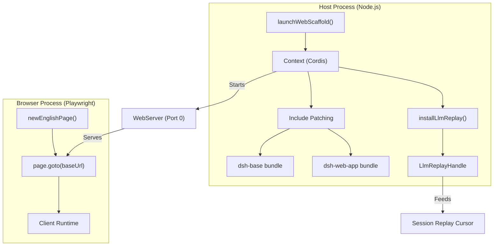
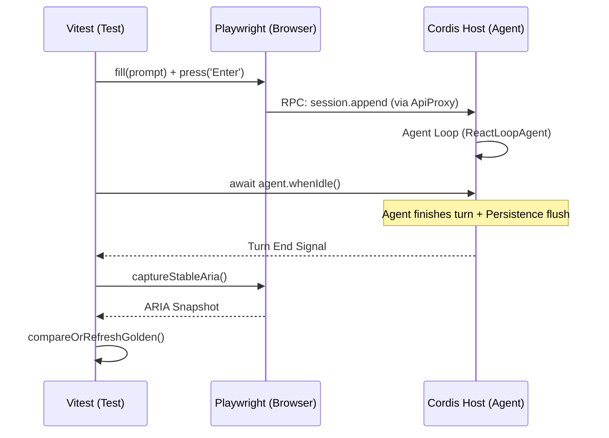

# Browser E2E Testing

Relevant source files

The following files were used as context for generating this wiki page:

- [.agents/notes/implemented/bug-fix/2026-07-28-web-gui-feedback-loop.i18n.yaml](.agents/notes/implemented/bug-fix/2026-07-28-web-gui-feedback-loop.i18n.yaml)
- [.agents/notes/implemented/bug-fix/2026-07-28-web-gui-feedback-loop.md](.agents/notes/implemented/bug-fix/2026-07-28-web-gui-feedback-loop.md)
- [.agents/notes/implemented/bug-fix/2026-07-28-web-gui-feedback-loop.zh.md](.agents/notes/implemented/bug-fix/2026-07-28-web-gui-feedback-loop.zh.md)
- [.agents/notes/implemented/bug-fix/2026-08-06-plan-narrow-viewport-regression.i18n.yaml](.agents/notes/implemented/bug-fix/2026-08-06-plan-narrow-viewport-regression.i18n.yaml)
- [.agents/notes/implemented/bug-fix/2026-08-06-plan-narrow-viewport-regression.md](.agents/notes/implemented/bug-fix/2026-08-06-plan-narrow-viewport-regression.md)
- [.agents/notes/implemented/bug-fix/2026-08-06-plan-narrow-viewport-regression.zh.md](.agents/notes/implemented/bug-fix/2026-08-06-plan-narrow-viewport-regression.zh.md)
- [.agents/notes/implemented/testing/2026-07-24-web-gui-browser-e2e-lane.i18n.yaml](.agents/notes/implemented/testing/2026-07-24-web-gui-browser-e2e-lane.i18n.yaml)
- [.agents/notes/implemented/testing/2026-07-24-web-gui-browser-e2e-lane.md](.agents/notes/implemented/testing/2026-07-24-web-gui-browser-e2e-lane.md)
- [.agents/notes/implemented/testing/2026-07-24-web-gui-browser-e2e-lane.zh.md](.agents/notes/implemented/testing/2026-07-24-web-gui-browser-e2e-lane.zh.md)
- [.agents/notes/implemented/testing/2026-07-30-web-browser-snapshot-ci-gate.i18n.yaml](.agents/notes/implemented/testing/2026-07-30-web-browser-snapshot-ci-gate.i18n.yaml)
- [.agents/notes/implemented/testing/2026-07-30-web-browser-snapshot-ci-gate.md](.agents/notes/implemented/testing/2026-07-30-web-browser-snapshot-ci-gate.md)
- [.agents/notes/implemented/testing/2026-07-30-web-browser-snapshot-ci-gate.zh.md](.agents/notes/implemented/testing/2026-07-30-web-browser-snapshot-ci-gate.zh.md)
- [apps/web/tests/access-confirmation.e2e.ts](apps/web/tests/access-confirmation.e2e.ts)
- [apps/web/tests/code-mode-round.e2e.ts](apps/web/tests/code-mode-round.e2e.ts)
- [apps/web/tests/live-interactions.e2e.ts](apps/web/tests/live-interactions.e2e.ts)
- [apps/web/tests/plan-control-row.e2e.ts](apps/web/tests/plan-control-row.e2e.ts)
- [apps/web/tests/question-composer.e2e.ts](apps/web/tests/question-composer.e2e.ts)
- [apps/web/tests/replay-round-trip.e2e.ts](apps/web/tests/replay-round-trip.e2e.ts)
- [apps/web/tests/scaffold.ts](apps/web/tests/scaffold.ts)
- [apps/web/tests/smoke-real.e2e.ts](apps/web/tests/smoke-real.e2e.ts)
- [apps/web/tests/snapshots/code-mode-round/ui.expected.md](apps/web/tests/snapshots/code-mode-round/ui.expected.md)
- [apps/web/tests/snapshots/cordis-tool-round/ui.expected.md](apps/web/tests/snapshots/cordis-tool-round/ui.expected.md)
- [apps/web/tests/snapshots/fresh-round-trip/system-prompt.expected.md](apps/web/tests/snapshots/fresh-round-trip/system-prompt.expected.md)
- [apps/web/tests/snapshots/fresh-round-trip/ui.expected.md](apps/web/tests/snapshots/fresh-round-trip/ui.expected.md)
- [apps/web/tests/snapshots/lifecycle-chrome/reloaded.expected.md](apps/web/tests/snapshots/lifecycle-chrome/reloaded.expected.md)
- [apps/web/tests/snapshots/live-interactions/cancel.expected.md](apps/web/tests/snapshots/live-interactions/cancel.expected.md)
- [apps/web/tests/snapshots/live-interactions/error-auth.expected.md](apps/web/tests/snapshots/live-interactions/error-auth.expected.md)
- [apps/web/tests/snapshots/live-interactions/retry.expected.md](apps/web/tests/snapshots/live-interactions/retry.expected.md)
- [apps/web/tests/snapshots/live-interactions/session.jsonl](apps/web/tests/snapshots/live-interactions/session.jsonl)
- [apps/web/tests/snapshots/message-actions/ui.expected.md](apps/web/tests/snapshots/message-actions/ui.expected.md)
- [apps/web/tests/snapshots/plan-narrow-viewport/layout.expected.md](apps/web/tests/snapshots/plan-narrow-viewport/layout.expected.md)
- [apps/web/tests/snapshots/plan-narrow-viewport/session.jsonl](apps/web/tests/snapshots/plan-narrow-viewport/session.jsonl)
- [apps/web/tests/snapshots/plan-review/approved.expected.md](apps/web/tests/snapshots/plan-review/approved.expected.md)
- [apps/web/tests/snapshots/question-composer/answered.expected.md](apps/web/tests/snapshots/question-composer/answered.expected.md)
- [apps/web/tests/snapshots/question-composer/composed.expected.md](apps/web/tests/snapshots/question-composer/composed.expected.md)
- [apps/web/tests/snapshots/question-composer/session.jsonl](apps/web/tests/snapshots/question-composer/session.jsonl)
- [apps/web/tests/snapshots/question-composer/ui.expected.md](apps/web/tests/snapshots/question-composer/ui.expected.md)
- [apps/web/tests/snapshots/queue-actions/editing.expected.md](apps/web/tests/snapshots/queue-actions/editing.expected.md)
- [apps/web/tests/snapshots/queue-actions/ui.expected.md](apps/web/tests/snapshots/queue-actions/ui.expected.md)
- [apps/web/tests/snapshots/seeded-history/command-row.expected.md](apps/web/tests/snapshots/seeded-history/command-row.expected.md)
- [apps/web/tests/snapshots/seeded-history/ui.expected.md](apps/web/tests/snapshots/seeded-history/ui.expected.md)
- [apps/web/tests/snapshots/steer-all/mid-steer.expected.md](apps/web/tests/snapshots/steer-all/mid-steer.expected.md)
- [apps/web/tests/snapshots/steer-all/replay.override.json](apps/web/tests/snapshots/steer-all/replay.override.json)
- [apps/web/tests/snapshots/steer-all/settled.expected.md](apps/web/tests/snapshots/steer-all/settled.expected.md)
- [apps/web/tests/snapshots/steering/mid-steer.expected.md](apps/web/tests/snapshots/steering/mid-steer.expected.md)
- [apps/web/tests/snapshots/steering/session.jsonl](apps/web/tests/snapshots/steering/session.jsonl)
- [apps/web/tests/snapshots/steering/settled.expected.md](apps/web/tests/snapshots/steering/settled.expected.md)
- [apps/web/tests/snapshots/web-search-round/ui.expected.md](apps/web/tests/snapshots/web-search-round/ui.expected.md)
- [apps/web/tests/steering.e2e.ts](apps/web/tests/steering.e2e.ts)
- [apps/web/tests/support.ts](apps/web/tests/support.ts)
- [apps/web/tsconfig.json](apps/web/tsconfig.json)
- [packages/client/ui-user-questions/tests/user-questions-composer.client.spec.tsx](packages/client/ui-user-questions/tests/user-questions-composer.client.spec.tsx)
- [scripts/verify-package-readme-model-experience.ts](scripts/verify-package-readme-model-experience.ts)
- [tsconfig.host.json](tsconfig.host.json)

DeepSeek Harness (dsh) employs a hermetic Playwright-based end-to-end (E2E) testing infrastructure to validate the full stack, from the browser UI to the host-side agent loop and tool execution. The system uses a specialized scaffold to boot the real application composition in a controlled environment, leveraging a deterministic replay mechanism to eliminate LLM non-determinism during CI.

## The Web Scaffold

The `launchWebScaffold` function is the entry point for E2E tests. It boots a "REAL" web composition by applying the `dsh-base` and `dsh-web-app` bundle patches over an empty profile root [apps/web/tests/scaffold.ts:3-7](). This ensures that the test environment exercises the actual HTTP/WebSocket bridge, API gateway, and persistence layers used in production [apps/web/tests/scaffold.ts:6-7]().

### Execution Modes
The scaffold operates in three modes, controlled by the `DSH_SNAPSHOT` environment variable [apps/web/tests/scaffold.ts:85-97]():

| Mode | Description |
| :--- | :--- |
| `replay` | **Default/CI mode.** Uses `dsh-llm-replay` to satisfy model calls from local fixtures. Keyless [apps/web/tests/scaffold.ts:8-9](). |
| `record` | **Authoring mode.** Uses real LLM adapters and credentials to harvest new fixtures from live sessions [apps/web/tests/scaffold.ts:9-10](). |
| `refresh` | **Maintenance mode.** A keyless replay that re-runs existing fixtures and updates the ARIA snapshot goldens [apps/web/tests/scaffold.ts:10-11](). |

### Composition Divergences
To ensure test stability, the scaffold applies specific include patches after the standard bundles [apps/web/tests/scaffold.ts:14-16](). These divergences include:
*   **Temporary Roots:** Redirects `persistenceRoot` and workspace paths to temporary directories to avoid polluting the developer's environment [apps/web/tests/scaffold.ts:16-17]().
*   **Determinism:** Disables `session-title-llm` to prevent fire-and-forget background LLM calls from racing the replay cursor [apps/web/tests/scaffold.ts:19-20]().
*   **Isolation:** Disables `agent-instructions` to prevent recorded fixtures from embedding local `AGENTS.md` content [apps/web/tests/scaffold.ts:17-18]().
*   **Replay Injection:** In keyless modes, it disables `llm-deepseek` and uses `installLlmReplay` to fill the LLM seam on the settled root context [apps/web/tests/scaffold.ts:21-24]().

### Code Entity Mapping: Scaffold Lifecycle
The following diagram illustrates how the `launchWebScaffold` setup associates high-level test concepts with specific code entities.

**Web Scaffold Initialization**

Sources: [apps/web/tests/scaffold.ts:1-24](), [apps/web/tests/scaffold.ts:50-58](), [apps/web/tests/support.ts:28-28]()

## Determinism and the Barrier

E2E tests in dsh face a "determinism barrier" where the asynchronous nature of the browser and the agent loop can cause race conditions. The harness addresses this through specific rules [apps/web/tests/scaffold.ts:25-31]():

1.  **Host Idle Barrier:** Tests await `agent.whenIdle()` under a timeout. This is keyed off the in-process `turn/end` event, which follows the persistence flush [apps/web/tests/scaffold.ts:27-27]().
2.  **Browser Settled Poll:** After the host is idle, the test polls the browser to ensure streaming is detached and final text is visible [apps/web/tests/scaffold.ts:27-27]().
3.  **Banned Barriers:** `networkidle` is banned because it never resolves while an SSE stream is open. Polling persistence files directly is also banned in favor of `whenIdle()` [apps/web/tests/scaffold.ts:27-27]().

### Determinism Flow

Sources: [apps/web/tests/scaffold.ts:27-27](), [apps/web/tests/scaffold.ts:31-31]()

## ARIA Snapshot Goldens

Instead of raw HTML snapshots, the dsh web lane uses **ARIA snapshots**. These represent the UI as a tree of accessible roles and labels, which is more resilient to styling changes while being highly sensitive to functional regressions [apps/web/tests/scaffold.ts:12-13]().

*   **Implementation:** The system generates a markdown representation of the accessibility tree, including roles, names, and states like `[disabled]` or `[selected]` [apps/web/tests/snapshots/question-composer/answered.expected.md:1-50]().
*   **Goldens:** Expected snapshots are stored as `.expected.md` files alongside the test files [apps/web/tests/snapshots/cordis-tool-round/ui.expected.md:1-104]().
*   **Verification:** In CI, any mismatch between the captured ARIA tree and the golden file fails the build, acting as a "Web Snapshot CI Gate" [apps/web/tests/scaffold.ts:27-28]().

### Example ARIA Tree Structure
Snapshots capture the hierarchical structure of the UI, such as the banner, navigation, tablists, and message content [apps/web/tests/snapshots/steering/settled.expected.md:1-53]().

## Key Scenarios and Implementation

The E2E suite covers complex multi-turn interactions and system-level features across numerous files [tsconfig.host.json:11-89]():

### Subagent Conversations
Validates the persistence and UI rendering of subagents, including interrupts and conversation flows [tsconfig.host.json:72-74](). Tests ensure that subagent activity is correctly reflected in the sidebar [tsconfig.host.json:75-75]().

### Tool Rounds
Tests specific tool-related UI flows to ensure the host-client bridge correctly handles tool results and presentations:
*   **Code Mode:** Validates the `run_code` program execution and how the browser renders bash output or file read errors [apps/web/tests/snapshots/code-mode-round/ui.expected.md:23-31]().
*   **Cordis Tools:** Testing `cordis_inspect_self`, `cordis_define`, and `cordis_run` to ensure dynamic plugin loading and user approval flows work end-to-end [apps/web/tests/snapshots/cordis-tool-round/ui.expected.md:12-50]().
*   **Web Search:** Validates the tool round for web search interactions [tsconfig.host.json:48-48]().

### Live Interactions and Steering
Tests the ability to steer the agent mid-turn or handle retries:
*   **Steering:** Asserts that interjections (e.g., "include the word BANANA") are respected in the final output [apps/web/tests/snapshots/steering/settled.expected.md:27-34]().
*   **Retries:** Validates the UI rendering of the "Retried model request" status when the LLM adapter encounters transient errors [apps/web/tests/snapshots/live-interactions/retry.expected.md:19-20]().

## CI Infrastructure: The Web Snapshot Gate

The E2E tests are integrated into the GitHub Actions pipeline, typically running on Node 24 [tsconfig.host.json:1-10]().

*   **Replay Consumption:** The scaffold calls `ReplayHandle.assertConsumed()` during teardown to ensure every recorded LLM interaction in the fixture was actually used, catching silent underruns [apps/web/tests/scaffold.ts:30-31]().
*   **Failure Analysis:** Scenarios fail on any `pageerror` or client-side connection-loss warnings to ensure the reconnect machinery isn't masking a broken wire [apps/web/tests/scaffold.ts:31-31]().

Sources: [apps/web/tests/scaffold.ts:1-31](), [tsconfig.host.json:11-89](), [apps/web/tests/snapshots/question-composer/answered.expected.md:1-50]()
