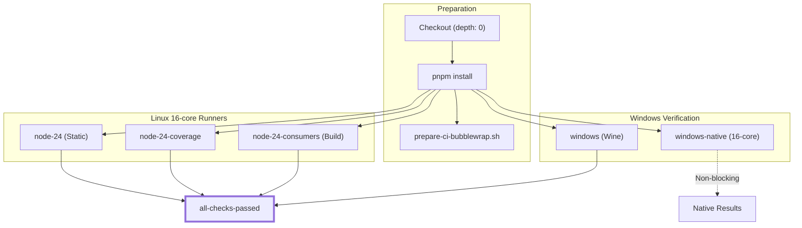
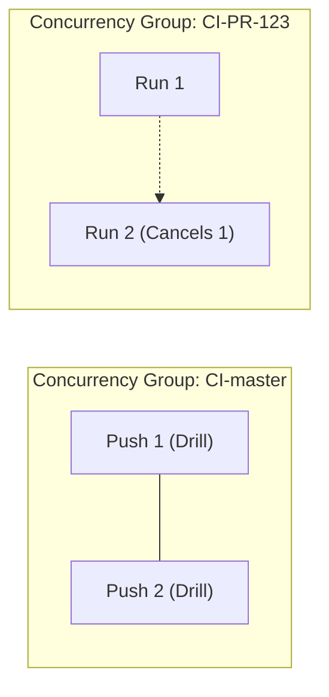

# CI/CD Pipeline

<details>
<summary>Relevant source files</summary>

The following files were used as context for generating this wiki page:

- [.agents/notes/implemented/architecture/2026-08-18-client-build-environment.i18n.yaml](.agents/notes/implemented/architecture/2026-08-18-client-build-environment.i18n.yaml)
- [.agents/notes/implemented/architecture/2026-08-18-client-build-environment.md](.agents/notes/implemented/architecture/2026-08-18-client-build-environment.md)
- [.agents/notes/implemented/architecture/2026-08-18-client-build-environment.zh.md](.agents/notes/implemented/architecture/2026-08-18-client-build-environment.zh.md)
- [.agents/notes/implemented/process/2026-07-06-parallel-pre-push-gates.i18n.yaml](.agents/notes/implemented/process/2026-07-06-parallel-pre-push-gates.i18n.yaml)
- [.agents/notes/implemented/process/2026-07-06-parallel-pre-push-gates.md](.agents/notes/implemented/process/2026-07-06-parallel-pre-push-gates.md)
- [.agents/notes/implemented/process/2026-07-06-parallel-pre-push-gates.zh.md](.agents/notes/implemented/process/2026-07-06-parallel-pre-push-gates.zh.md)
- [.agents/notes/implemented/process/2026-07-21-serial-cross-platform-ci-reference.i18n.yaml](.agents/notes/implemented/process/2026-07-21-serial-cross-platform-ci-reference.i18n.yaml)
- [.agents/notes/implemented/process/2026-07-21-serial-cross-platform-ci-reference.md](.agents/notes/implemented/process/2026-07-21-serial-cross-platform-ci-reference.md)
- [.agents/notes/implemented/process/2026-07-21-serial-cross-platform-ci-reference.zh.md](.agents/notes/implemented/process/2026-07-21-serial-cross-platform-ci-reference.zh.md)
- [.agents/notes/implemented/process/2026-07-22-evidence-based-larger-hosted-runners.i18n.yaml](.agents/notes/implemented/process/2026-07-22-evidence-based-larger-hosted-runners.i18n.yaml)
- [.agents/notes/implemented/process/2026-07-22-evidence-based-larger-hosted-runners.md](.agents/notes/implemented/process/2026-07-22-evidence-based-larger-hosted-runners.md)
- [.agents/notes/implemented/process/2026-07-22-evidence-based-larger-hosted-runners.zh.md](.agents/notes/implemented/process/2026-07-22-evidence-based-larger-hosted-runners.zh.md)
- [.agents/notes/implemented/process/2026-07-23-portable-required-pull-request-ci.i18n.yaml](.agents/notes/implemented/process/2026-07-23-portable-required-pull-request-ci.i18n.yaml)
- [.agents/notes/implemented/process/2026-07-23-portable-required-pull-request-ci.md](.agents/notes/implemented/process/2026-07-23-portable-required-pull-request-ci.md)
- [.agents/notes/implemented/process/2026-07-23-portable-required-pull-request-ci.zh.md](.agents/notes/implemented/process/2026-07-23-portable-required-pull-request-ci.zh.md)
- [.agents/notes/implemented/process/2026-07-26-ci-failover-runbook.i18n.yaml](.agents/notes/implemented/process/2026-07-26-ci-failover-runbook.i18n.yaml)
- [.agents/notes/implemented/process/2026-07-26-ci-failover-runbook.md](.agents/notes/implemented/process/2026-07-26-ci-failover-runbook.md)
- [.agents/notes/implemented/process/2026-07-26-ci-failover-runbook.zh.md](.agents/notes/implemented/process/2026-07-26-ci-failover-runbook.zh.md)
- [.agents/notes/implemented/process/2026-07-26-pnpm-action-setup-for-symmetric-ci-caching.i18n.yaml](.agents/notes/implemented/process/2026-07-26-pnpm-action-setup-for-symmetric-ci-caching.i18n.yaml)
- [.agents/notes/implemented/process/2026-07-26-pnpm-action-setup-for-symmetric-ci-caching.md](.agents/notes/implemented/process/2026-07-26-pnpm-action-setup-for-symmetric-ci-caching.md)
- [.agents/notes/implemented/process/2026-07-26-pnpm-action-setup-for-symmetric-ci-caching.zh.md](.agents/notes/implemented/process/2026-07-26-pnpm-action-setup-for-symmetric-ci-caching.zh.md)
- [.agents/notes/implemented/process/2026-08-08-native-windows-pull-request-ci.i18n.yaml](.agents/notes/implemented/process/2026-08-08-native-windows-pull-request-ci.i18n.yaml)
- [.agents/notes/implemented/process/2026-08-08-native-windows-pull-request-ci.md](.agents/notes/implemented/process/2026-08-08-native-windows-pull-request-ci.md)
- [.agents/notes/implemented/process/2026-08-08-native-windows-pull-request-ci.zh.md](.agents/notes/implemented/process/2026-08-08-native-windows-pull-request-ci.zh.md)
- [.agents/notes/implemented/process/2026-08-10-npm-release-sequences.i18n.yaml](.agents/notes/implemented/process/2026-08-10-npm-release-sequences.i18n.yaml)
- [.agents/notes/implemented/process/2026-08-10-npm-release-sequences.md](.agents/notes/implemented/process/2026-08-10-npm-release-sequences.md)
- [.agents/notes/implemented/process/2026-08-10-npm-release-sequences.zh.md](.agents/notes/implemented/process/2026-08-10-npm-release-sequences.zh.md)
- [.agents/notes/implemented/process/2026-08-18-in-job-partitioned-coverage.i18n.yaml](.agents/notes/implemented/process/2026-08-18-in-job-partitioned-coverage.i18n.yaml)
- [.agents/notes/implemented/process/2026-08-18-in-job-partitioned-coverage.md](.agents/notes/implemented/process/2026-08-18-in-job-partitioned-coverage.md)
- [.agents/notes/implemented/process/2026-08-18-in-job-partitioned-coverage.zh.md](.agents/notes/implemented/process/2026-08-18-in-job-partitioned-coverage.zh.md)
- [.github/workflows/ci.yml](.github/workflows/ci.yml)
- [.github/workflows/e2b-e2e.yml](.github/workflows/e2b-e2e.yml)
- [.github/workflows/e2e.yml](.github/workflows/e2e.yml)
- [.github/workflows/release-vendor.yml](.github/workflows/release-vendor.yml)
- [.github/workflows/release.yml](.github/workflows/release.yml)
- [.github/workflows/sandbox.yml](.github/workflows/sandbox.yml)
- [packages/subprocess/subprocess-local/tests/fixtures/process-exit-host.ts](packages/subprocess/subprocess-local/tests/fixtures/process-exit-host.ts)
- [packages/subprocess/subprocess-local/tests/process-exit.spec.ts](packages/subprocess/subprocess-local/tests/process-exit.spec.ts)
- [scripts/check-workspace-constraints.ts](scripts/check-workspace-constraints.ts)
- [scripts/ci-workflow.spec.ts](scripts/ci-workflow.spec.ts)
- [scripts/client-build-environment.client.spec.ts](scripts/client-build-environment.client.spec.ts)
- [scripts/release/bump.ts](scripts/release/bump.ts)
- [scripts/release/families.spec.ts](scripts/release/families.spec.ts)
- [scripts/release/families.ts](scripts/release/families.ts)
- [scripts/release/pack.ts](scripts/release/pack.ts)
- [scripts/release/process.ts](scripts/release/process.ts)
- [scripts/release/publish.ts](scripts/release/publish.ts)
- [scripts/release/tarball.ts](scripts/release/tarball.ts)
- [scripts/release/verify-packed-install.ts](scripts/release/verify-packed-install.ts)
- [scripts/release/verify.ts](scripts/release/verify.ts)
- [scripts/run-gates.spec.ts](scripts/run-gates.spec.ts)
- [vitest.config.ts](vitest.config.ts)

</details>


The DeepSeek Harness (DSH) CI/CD infrastructure is designed for high-concurrency verification across Linux and Windows, utilizing a mix of GitHub-hosted enterprise runners and in-house self-hosted failover pools. The pipeline prioritizes low latency by consolidating setup overhead into large 16-core runners while maintaining strict quality gates, including a 100% per-file coverage requirement.

## Pipeline Architecture

The primary workflow is defined in `.github/workflows/ci.yml`. It employs a topology that has been consolidated into three primary 16-core Linux jobs and a dual-path Windows strategy to minimize repeated setup costs (checkout, pnpm install, and cache restoration) [.github/workflows/ci.yml:51-62]().

### Workflow Topology

The pipeline is triggered on `push` to master, `pull_request`, and manual `workflow_dispatch` [.github/workflows/ci.yml:3-7]().

| Job ID | Platform | Purpose | Required Gate |
| :--- | :--- | :--- | :--- |
| `node-24` | Linux | Static analysis, linting, and documentation gates. | Yes |
| `node-24-coverage` | Linux | Exhaustive Vitest coverage (100% per-file). | Yes |
| `node-24-consumers` | Linux | Build-backed snapshots, E2E replays, and package exports. | Yes |
| `windows` | Linux (Wine) | Fast Win32 toolchain signal (Wine on Ubuntu). | Yes |
| `windows-native` | Windows | Native NT kernel, NTFS, and ConPTY verification. | No (Observational) |
| `all-checks-passed` | Linux | Final verdict job aggregating all required statuses. | Final Gate |

### Data Flow and Job Dependencies


**Sources:** [.github/workflows/ci.yml:66-132](), [.agents/notes/implemented/process/2026-07-22-evidence-based-larger-hosted-runners.md:21-27]()

---

## Core Verification Jobs

### 1. Static Analysis (`node-24`)
Executes `pnpm run check:ci:static`. This includes Oxlint, documentation type-checking, and bilingual pairing verification [.github/workflows/ci.yml:113-116](). It uses a 16-core runner (`dsh-ubuntu-24-04-16core`) to handle the entire repository graph concurrently [.github/workflows/ci.yml:66-73]().

### 2. Coverage Gate (`node-24-coverage`)
Enforces a 100% per-file coverage threshold using Vitest.
- **Concurrency:** Uses `DSH_COVERAGE_MAX_WORKERS` (6 on hosted) and `DSH_COVERAGE_PARTITIONS` (4) [.github/workflows/ci.yml:129-130]().
- **Isolation:** Tests are split into `thread-safe` (using worker threads) and `process-bound` (using forks for global state isolation like `session-persistence-jsonl` or `subagent-acp`) [vitest.config.ts:117-152]().
- **Bubblewrap:** Linux runners execute `scripts/prepare-ci-bubblewrap.sh` to provide unprivileged sandboxing for filesystem tests [.github/workflows/ci.yml:164-169]().

### 3. Consumer Verification (`node-24-consumers`)
This job performs the single Linux build and then runs all artifact consumers against the resulting tree. This includes `publint` checks via `scripts/publint-all.ts` and build-invariant verification via `scripts/verify-built-package-invariants.mjs` [.agents/notes/implemented/process/2026-07-22-evidence-based-larger-hosted-runners.md:21-25]().

---

## Windows Dual-Path Strategy

DSH employs a unique "Wine + Native" approach to balance verification speed with kernel fidelity [.agents/notes/implemented/process/2026-08-08-native-windows-pull-request-ci.md:1-5]().

### Wine Gate (`windows`)
- **Environment:** Runs on `ubuntu-latest` [.github/workflows/ci.yml:256]().
- **Mechanism:** Uses Wine to execute Win32 Node.js binaries on Linux via `scripts/wine-windows-gates.sh` [.github/workflows/ci.yml:284-286]().
- **Role:** Provides a fast, blocking signal for toolchain compatibility without consuming scarce Windows runner minutes [.agents/notes/implemented/process/2026-08-08-native-windows-pull-request-ci.md:15]().

### Native Windows Gate (`windows-native`)
- **Environment:** Runs on `dsh-windows-2025-16core` [.github/workflows/ci.yml:301]().
- **Mechanism:** Executes `pnpm run check:ci:windows-complete` natively under PowerShell 7 [.github/workflows/ci.yml:343]().
- **Role:** Verifies NTFS-specific behavior, DACLs, and ConPTY. It is non-blocking to the PR merge but reports status independently [.agents/notes/implemented/process/2026-08-08-native-windows-pull-request-ci.md:17-19]().

**Sources:** [.agents/notes/implemented/process/2026-08-08-native-windows-pull-request-ci.md:14-23](), [scripts/ci-workflow.spec.ts:59-81]()

---

## Failover Runbook (DSH_CI_FAILOVER)

To prevent deadlocks during GitHub Enterprise pool outages, the pipeline includes a manual failover mechanism to in-house self-hosted runners.

### Failover Controls
Responders with write access can set repository variables to retarget jobs without a code merge [.github/workflows/ci.yml:55-65]().

| Variable | Target Pool | Affected Jobs |
| :--- | :--- | :--- |
| `DSH_CI_FAILOVER_LINUX` | `vm-backup` (64-core) | `node-24`, `node-24-coverage`, `node-24-consumers`, `all-checks-passed` |
| `DSH_CI_FAILOVER_WINDOWS` | `dsh-win-ci` (96-core) | `windows-native` |

### Self-Hosted Standby
The readiness of the failover pools is proven on every `push` to `master` via standby jobs:
- `serial-linux-selfhosted` [.github/workflows/ci.yml:384]()
- `serial-windows` [.github/workflows/ci.yml:411]()

These jobs are exempt from `cancel-in-progress` to ensure a complete "readiness verdict" is reached even during frequent merges [.github/workflows/ci.yml:18-32]().

**Sources:** [.agents/notes/implemented/process/2026-07-26-ci-failover-runbook.md:21-35](), [.github/workflows/ci.yml:69-72]()

---

## Performance and Resource Management

### Runner Allocation
The pipeline utilizes GitHub Larger Runners to optimize for "Active Time" (the interval from `startedAt` to `completedAt`).

| Specification | Use Case | Active Time (Measured) |
| :--- | :--- | :--- |
| **Ubuntu 16-core** | Linux Primary Jobs | ~103s [.agents/notes/implemented/process/2026-07-22-evidence-based-larger-hosted-runners.md:33]() |
| **Windows 16-core** | Windows Blocking Builds | ~104s [.agents/notes/implemented/process/2026-07-22-evidence-based-larger-hosted-runners.md:41]() |

### Concurrency Logic
Workflow-level concurrency is grouped by `${{ github.workflow }}-${{ github.ref }}`. Cancellation is disabled for `push` events to protect the self-hosted standby drills [.github/workflows/ci.yml:30-32]().



### CI Implementation Entities

```mermaid
classDiagram
    class CIWorkflow {
        <<YAML>>
        +node-24
        +node-24-coverage
        +node-24-consumers
        +windows-wine
        +windows-native
        +all-checks-passed
    }
    class RunGates {
        <<TypeScript>>
        +gatesForMode(mode)
        +runGates(gates, concurrency)
    }
    class VitestConfig {
        <<TypeScript>>
        +windowsUnsupportedPackages
        +processBoundTests
        +coverageExemptHeavySuites
    }
    CIWorkflow ..> RunGates : "pnpm run check:ci:*"
    RunGates ..> VitestConfig : "executes vitest"
```

**Sources:** [.github/workflows/ci.yml:18-32](), [scripts/run-gates.ts:5-10](), [vitest.config.ts:22-126]()
