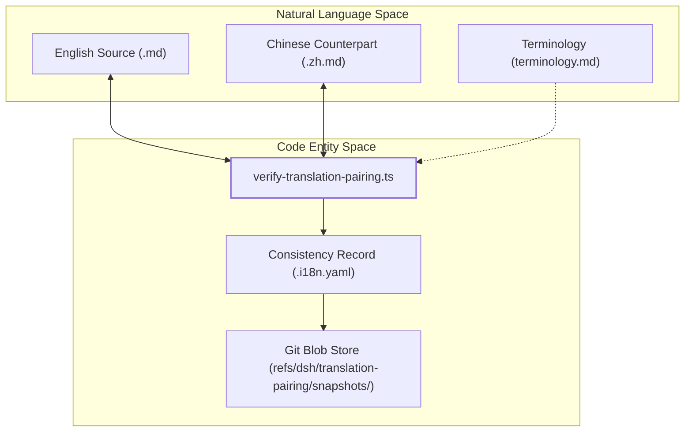
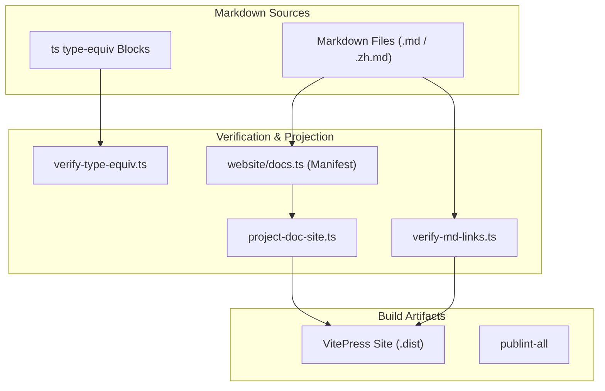

# Documentation & Internationalization

Relevant source files

The following files were used as context for generating this wiki page:

- [.agents/notes/implemented/process/2026-07-02-bilingual-docs-and-pairing-gate.i18n.yaml](.agents/notes/implemented/process/2026-07-02-bilingual-docs-and-pairing-gate.i18n.yaml)
- [.agents/notes/implemented/process/2026-07-02-bilingual-docs-and-pairing-gate.md](.agents/notes/implemented/process/2026-07-02-bilingual-docs-and-pairing-gate.md)
- [.agents/notes/implemented/process/2026-07-02-bilingual-docs-and-pairing-gate.zh.md](.agents/notes/implemented/process/2026-07-02-bilingual-docs-and-pairing-gate.zh.md)
- [.agents/notes/implemented/process/2026-07-13-documentation-site-projection.i18n.yaml](.agents/notes/implemented/process/2026-07-13-documentation-site-projection.i18n.yaml)
- [.agents/notes/implemented/process/2026-07-13-documentation-site-projection.md](.agents/notes/implemented/process/2026-07-13-documentation-site-projection.md)
- [.agents/notes/implemented/process/2026-07-13-documentation-site-projection.zh.md](.agents/notes/implemented/process/2026-07-13-documentation-site-projection.zh.md)
- [.agents/notes/implemented/process/2026-08-06-doc-site-carries-its-images.i18n.yaml](.agents/notes/implemented/process/2026-08-06-doc-site-carries-its-images.i18n.yaml)
- [.agents/notes/implemented/process/2026-08-06-doc-site-carries-its-images.md](.agents/notes/implemented/process/2026-08-06-doc-site-carries-its-images.md)
- [.agents/notes/implemented/process/2026-08-06-doc-site-carries-its-images.zh.md](.agents/notes/implemented/process/2026-08-06-doc-site-carries-its-images.zh.md)
- [.agents/notes/implemented/process/2026-08-12-documentation-site-navigation-and-chrome.i18n.yaml](.agents/notes/implemented/process/2026-08-12-documentation-site-navigation-and-chrome.i18n.yaml)
- [.agents/notes/implemented/process/2026-08-12-documentation-site-navigation-and-chrome.md](.agents/notes/implemented/process/2026-08-12-documentation-site-navigation-and-chrome.md)
- [.agents/notes/implemented/process/2026-08-12-documentation-site-navigation-and-chrome.zh.md](.agents/notes/implemented/process/2026-08-12-documentation-site-navigation-and-chrome.zh.md)
- [.agents/skills/dsh-translate-docs/SKILL.md](.agents/skills/dsh-translate-docs/SKILL.md)
- [.github/workflows/docs-pages.yml](.github/workflows/docs-pages.yml)
- [BRAND_GUIDELINES.i18n.yaml](BRAND_GUIDELINES.i18n.yaml)
- [BRAND_GUIDELINES.md](BRAND_GUIDELINES.md)
- [BRAND_GUIDELINES.zh.md](BRAND_GUIDELINES.zh.md)
- [docs/i18n/README.i18n.yaml](docs/i18n/README.i18n.yaml)
- [docs/i18n/README.md](docs/i18n/README.md)
- [docs/i18n/README.zh.md](docs/i18n/README.zh.md)
- [docs/i18n/style-samples.md](docs/i18n/style-samples.md)
- [docs/i18n/terminology.md](docs/i18n/terminology.md)
- [docs/i18n/translation-rules.i18n.yaml](docs/i18n/translation-rules.i18n.yaml)
- [docs/i18n/translation-rules.md](docs/i18n/translation-rules.md)
- [docs/i18n/translation-rules.zh.md](docs/i18n/translation-rules.zh.md)
- [scripts/project-doc-site.spec.ts](scripts/project-doc-site.spec.ts)
- [scripts/project-doc-site.ts](scripts/project-doc-site.ts)
- [scripts/translation-pairing.manifest.json](scripts/translation-pairing.manifest.json)
- [scripts/translation-pairing.spec.ts](scripts/translation-pairing.spec.ts)
- [scripts/translation-pairing.ts](scripts/translation-pairing.ts)
- [scripts/verify-translation-pairing.ts](scripts/verify-translation-pairing.ts)
- [website/.vitepress/config.ts](website/.vitepress/config.ts)
- [website/docs.ts](website/docs.ts)

The DeepSeek Harness (dsh) documentation system is designed for a bilingual environment where both human engineers and AI agents collaborate. It enforces a strict "Bilingual Pairing" contract and utilizes automated quality gates to ensure that technical documentation, type definitions, and translations remain synchronized and accurate.

## Bilingual Documentation & Translation Pairing

Dsh treats English and Simplified Chinese as equal authorities. Every document in scope—including READMEs, architecture guides, and Agent Notes—must exist as a three-file triplet: the English source (`.md`), the Chinese counterpart (`.zh.md`), and a consistency record (`.i18n.yaml`) [docs/i18n/README.md:9-11]().

The system uses `git blob` hashes to track consistency, allowing the `verify-translation-pairing` gate to detect out-of-sync files even before they are committed [docs/i18n/README.md:11-18](). A custom Git merge driver, `dsh-translation-pairing`, is provided to automatically resolve conflicts in these records by performing a three-way merge on the recorded blobs [docs/i18n/README.md:20-20]().

### Key Components
*   **Terminology Truth**: Centralized term mapping in `docs/i18n/terminology.md` provides binding translations for both human and agent authors [docs/i18n/README.md:5-5]().
*   **Structural Verification**: The gate enforces that heading depths, list item counts, table dimensions, and byte-exact code blocks match exactly between languages [docs/i18n/README.md:29-29]().
*   **dsh-translate-docs**: An agent skill for managing complex updates, using a "briefing-driven" workflow via `gen-translation-brief` to patch counterparts minimally rather than re-translating [ .agents/skills/dsh-translate-docs/SKILL.md:20-30]().

For details, see [Bilingual Documentation & Translation Pairing](#9.1).

**Translation Pairing Lifecycle**

Sources: [docs/i18n/README.md:7-38](), [scripts/verify-translation-pairing.ts:1-11](), [docs/i18n/terminology.md:1-10](), [scripts/translation-pairing-git.ts:55-60]()

---

## Type Equivalence & Doc Verification Gates

To prevent documentation from becoming stale as the codebase evolves, dsh employs "Type Equivalence" gates. This allows developers to paste TypeScript declarations directly into Markdown files using special info strings like `ts type-equiv` or `ts public-api`. The `verify-type-equiv` gate then checks these snippets against the actual source code to ensure they haven't drifted.

### Documentation Standards
*   **Wordcount Budgets**: A `doc-budgets.manifest.json` defines maximum lengths for high-level files to prevent "documentation bloat".
*   **Model Experience (MX)**: A standard for READMEs ensuring they provide the necessary context for an LLM to understand a package's purpose and configuration.
*   **VitePress Site**: The documentation is projected into a searchable, bilingual website. The `website/docs.ts` manifest maps repository sources to site routes, handling locale-specific navigation [website/docs.ts:4-8]().
*   **Site Projection**: `scripts/project-doc-site.ts` rewrites Markdown links to point to the correct published routes or pinned GitHub blobs [scripts/project-doc-site.ts:10-11]().

For details, see [Type Equivalence & Doc Verification Gates](#9.2).

**Documentation Quality Pipeline**

Sources: [website/docs.ts:1-44](), [scripts/project-doc-site.ts:1-11](), [scripts/verify-translation-pairing.ts:22-33]()

---

## Documentation Tiers

The documentation follows a strict taxonomy to ensure "one home per fact."

| Tier | Purpose | File/Path |
| :--- | :--- | :--- |
| **Standing Orders** | Critical rules for agents in every session. | `AGENTS.md` (Root) |
| **Architecture** | High-level map of seams, loops, and core packages. | `docs/architecture.md` |
| **Terminology** | Canonical translations for technical terms. | `docs/i18n/terminology.md` |
| **Agent Notes** | Records of implemented decisions and rationale. | `.agents/notes/` |
| **Package Contract** | Configuration and semantics for specific packages. | `packages/**/README.md` |
| **Website Manifest** | Controls how docs are published to the web. | `website/docs.ts` |

Sources: [docs/i18n/README.md:5-5](), [website/docs.ts:107-141](), [docs/i18n/terminology.md:1-10]()
