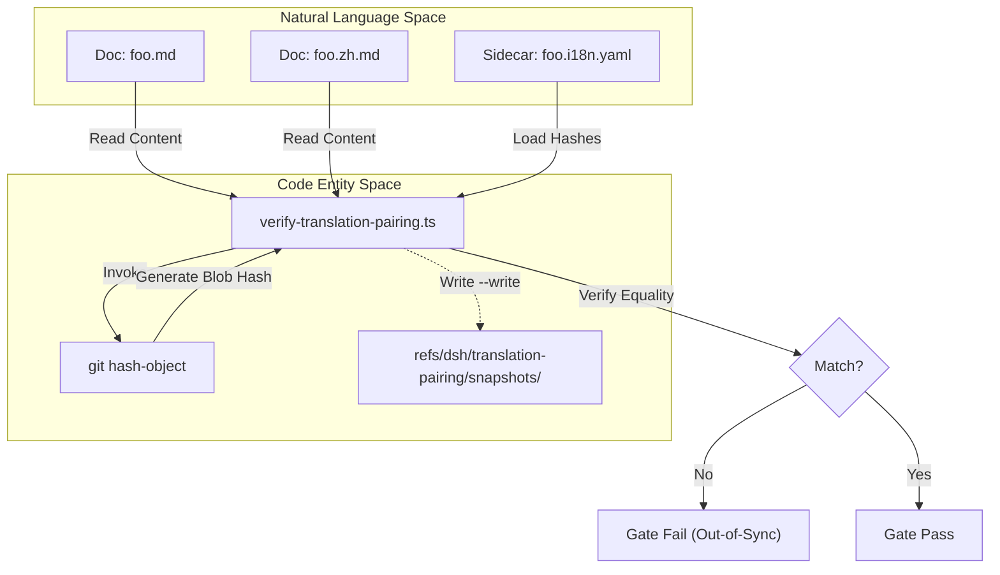
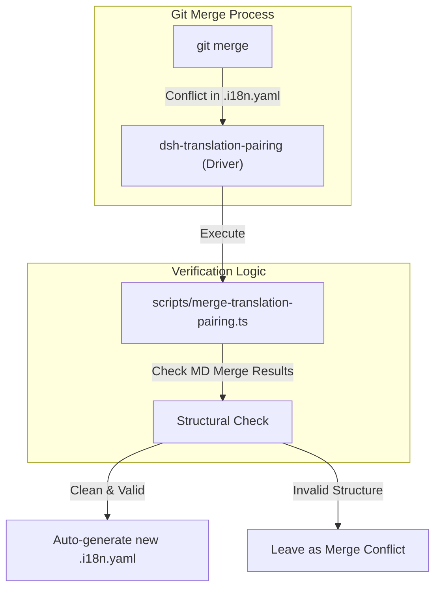

# Bilingual Documentation & Translation Pairing

Relevant source files

The following files were used as context for generating this wiki page:

- [.agents/notes/implemented/process/2026-07-02-bilingual-docs-and-pairing-gate.i18n.yaml](.agents/notes/implemented/process/2026-07-02-bilingual-docs-and-pairing-gate.i18n.yaml)
- [.agents/notes/implemented/process/2026-07-02-bilingual-docs-and-pairing-gate.md](.agents/notes/implemented/process/2026-07-02-bilingual-docs-and-pairing-gate.md)
- [.agents/notes/implemented/process/2026-07-02-bilingual-docs-and-pairing-gate.zh.md](.agents/notes/implemented/process/2026-07-02-bilingual-docs-and-pairing-gate.zh.md)
- [.agents/notes/implemented/process/2026-07-27-worktree-local-lefthook.i18n.yaml](.agents/notes/implemented/process/2026-07-27-worktree-local-lefthook.i18n.yaml)
- [.agents/notes/implemented/process/2026-07-27-worktree-local-lefthook.md](.agents/notes/implemented/process/2026-07-27-worktree-local-lefthook.md)
- [.agents/notes/implemented/process/2026-07-27-worktree-local-lefthook.zh.md](.agents/notes/implemented/process/2026-07-27-worktree-local-lefthook.zh.md)
- [.agents/skills/dsh-translate-docs/SKILL.md](.agents/skills/dsh-translate-docs/SKILL.md)
- [AGENTS.md](AGENTS.md)
- [BRAND_GUIDELINES.i18n.yaml](BRAND_GUIDELINES.i18n.yaml)
- [BRAND_GUIDELINES.md](BRAND_GUIDELINES.md)
- [BRAND_GUIDELINES.zh.md](BRAND_GUIDELINES.zh.md)
- [docs/development.i18n.yaml](docs/development.i18n.yaml)
- [docs/development.md](docs/development.md)
- [docs/development.zh.md](docs/development.zh.md)
- [docs/i18n/README.i18n.yaml](docs/i18n/README.i18n.yaml)
- [docs/i18n/README.md](docs/i18n/README.md)
- [docs/i18n/README.zh.md](docs/i18n/README.zh.md)
- [docs/i18n/style-samples.md](docs/i18n/style-samples.md)
- [docs/i18n/terminology.md](docs/i18n/terminology.md)
- [docs/i18n/translation-rules.i18n.yaml](docs/i18n/translation-rules.i18n.yaml)
- [docs/i18n/translation-rules.md](docs/i18n/translation-rules.md)
- [docs/i18n/translation-rules.zh.md](docs/i18n/translation-rules.zh.md)
- [package.json](package.json)
- [packages/README.i18n.yaml](packages/README.i18n.yaml)
- [packages/README.md](packages/README.md)
- [packages/README.zh.md](packages/README.zh.md)
- [scripts/install-lefthook.mjs](scripts/install-lefthook.mjs)
- [scripts/install-lefthook.spec.ts](scripts/install-lefthook.spec.ts)
- [scripts/run-gates.ts](scripts/run-gates.ts)
- [scripts/translation-pairing.manifest.json](scripts/translation-pairing.manifest.json)
- [scripts/translation-pairing.spec.ts](scripts/translation-pairing.spec.ts)
- [scripts/translation-pairing.ts](scripts/translation-pairing.ts)
- [scripts/verify-translation-pairing.ts](scripts/verify-translation-pairing.ts)

DeepSeek Harness (dsh) employs a strict bilingual documentation system where English and Simplified Chinese are maintained as equal-authority counterparts [docs/i18n/README.md:9-9](). Consistency is enforced mechanically through a sidecar-based pairing system and a dedicated quality gate, ensuring that technical documentation remains synchronized across all supported languages.

## The Sidecar System & Pairing Contract

Every document in scope consists of a triplet of sibling files located in the same directory [docs/i18n/README.md:10-10]():
1.  **Source File**: e.g., `foo.md` (English).
2.  **Counterpart File**: e.g., `foo.zh.md` (Simplified Chinese).
3.  **Consistency Record**: `foo.i18n.yaml`.

### Consistency Records (.i18n.yaml)
The `.i18n.yaml` file stores the Git blob hashes of both the English and Chinese versions at their last confirmed-consistent state [docs/i18n/README.md:11-16](). These hashes are calculated using `git hash-object`, allowing the system to verify content consistency even for uncommitted changes in the working tree [docs/i18n/README.md:18-18]().

### Language Switchers
Documents must include a language switcher line immediately following the H1 heading [docs/i18n/README.md:21-21]().
*   **Chinese**: `[English](foo.md) | 中文` [docs/i18n/README.zh.md:21-21]()
*   **English**: `English | [中文](foo.zh.md)` (Exempt for generated sources [docs/i18n/README.md:21-21]())

### Structural Mirroring
The system requires that the Markdown structure matches exactly between counterparts. This includes heading depths, list types, item counts, table dimensions, and byte-exact code block content [docs/i18n/README.md:22-22]().

### Translation Data Flow
The following diagram illustrates how documentation content is verified and updated.

**Documentation Consistency Flow**

Sources: [docs/i18n/README.md:11-30](), [scripts/verify-translation-pairing.ts]()

## Quality Gates & Verification

The `verify-translation-pairing` gate is a core component of the `doc-sync` aggregate [scripts/run-gates.ts:29-29](). It is executed locally by contributors and enforced in CI [docs/i18n/README.md:26-26]().

### verify-translation-pairing
This script [scripts/verify-translation-pairing.ts]() performs the following checks:
1.  **Completeness**: Ensures all three files in a triplet exist for every document in scope [docs/i18n/README.md:28-28]().
2.  **Hash Validation**: Compares the current `git hash-object` of the `.md` files against the values in `.i18n.yaml` [docs/i18n/README.md:29-29]().
3.  **Structural Signature**: Validates that Markdown elements (headings, code blocks, tables) match in order and count [docs/i18n/README.md:29-29]().
4.  **Exclusion Enforcement**: Ensures files listed in `scripts/translation-pairing.manifest.json` do not have translation artifacts [docs/i18n/README.md:30-30]().

### Git Integration & Merge Driver
To handle concurrent edits to bilingual pairs, dsh installs a custom Git merge driver: `dsh-translation-pairing` [docs/development.md:24-24]().

*   **Implementation**: Configured via `scripts/install-lefthook.mjs` [docs/development.md:24-24]().
*   **Behavior**: When a merge conflict occurs in an `.i18n.yaml` file, the driver attempts to resolve it by verifying if the underlying `.md` files merged cleanly. If the resulting document structure is valid, it automatically recalculates and stages the new hashes [docs/i18n/README.md:20-20]().
*   **Manual Resolution**: If the driver cannot safely resolve the pairing, the user must run `pnpm run resolve-translation-pairing-conflicts` [package.json:89-89]().

**Merge Driver Logic**

Sources: [docs/i18n/README.md:20-20](), [docs/development.zh.md:105-107]()

## Translation Rules & Style Guide

The project maintains strict standards for translation quality, defined in `docs/i18n/translation-rules.md` and `docs/i18n/terminology.md`.

### Terminology Source of Truth
`terminology.md` provides a mapping of English terms to their Chinese counterparts, categorized by:
*   **Abbreviations**: e.g., ACP, LLM, RAG [docs/i18n/terminology.md:11-30]().
*   **English-only**: Terms like "agent", "Cordis", and "Typert" are kept in English even in Chinese text [docs/i18n/terminology.md:31-74]().
*   **Bilingual**: Terms that have standard translations, like "adapter" (适配器) and "capability" (能力) [docs/i18n/terminology.md:75-161]().

### Style Requirements
*   **Code Fences**: Code blocks must be byte-identical. Source-oriented gates consume the `.zh.md` fences as derivatives of the English source [docs/i18n/README.md:32-32]().
*   **First Occurrence**: Specific terms must be followed by their English/Chinese equivalent in parentheses on first use [docs/i18n/terminology.md:7-9]().

## Automation: dsh-translate-docs

While routine updates are performed by agents during development, the `dsh-translate-docs` skill provides an extended workflow for complex translations [.agents/skills/dsh-translate-docs/SKILL.md]().

### Translation Briefs
For large updates, the system can generate a "translation brief" using `pnpm run gen-translation-brief <pair>` [package.json:90-90](). This identifies the narrowest granularity of changes (e.g., specific code fences or paragraphs) that need alignment, avoiding full-file re-translation [docs/i18n/README.md:18-18]().

### Prompt Engineering
The system uses `scripts/translation-prompt.ts` to render localized prompts for LLMs. These prompts inject the terminology list and human-calibrated rules to ensure consistent output [docs/i18n/README.zh.md:60-60]().

| Command | Purpose |
| :--- | :--- |
| `pnpm run verify-translation-pairing --write <file>` | Records current hashes into the sidecar [docs/i18n/README.md:18-18](). |
| `pnpm run verify-translation-pairing --list` | Lists all documents and their sync status [docs/i18n/README.md:34-34](). |
| `pnpm run verify-translation-prompt` | Validates the integrity of translation templates [package.json:87-87](). |

Sources: [docs/i18n/README.md:18-38](), [package.json:87-90](), [docs/i18n/terminology.md:1-10]()
