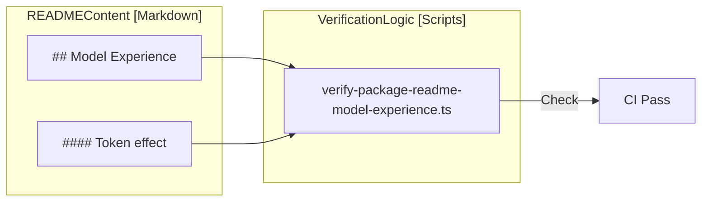

# Type Equivalence & Doc Verification Gates

<details>
<summary>Relevant source files</summary>

The following files were used as context for generating this wiki page:

- [.agents/notes/implemented/process/2026-07-13-documentation-site-projection.i18n.yaml](.agents/notes/implemented/process/2026-07-13-documentation-site-projection.i18n.yaml)
- [.agents/notes/implemented/process/2026-07-13-documentation-site-projection.md](.agents/notes/implemented/process/2026-07-13-documentation-site-projection.md)
- [.agents/notes/implemented/process/2026-07-13-documentation-site-projection.zh.md](.agents/notes/implemented/process/2026-07-13-documentation-site-projection.zh.md)
- [.agents/notes/implemented/process/2026-08-06-doc-site-carries-its-images.i18n.yaml](.agents/notes/implemented/process/2026-08-06-doc-site-carries-its-images.i18n.yaml)
- [.agents/notes/implemented/process/2026-08-06-doc-site-carries-its-images.md](.agents/notes/implemented/process/2026-08-06-doc-site-carries-its-images.md)
- [.agents/notes/implemented/process/2026-08-06-doc-site-carries-its-images.zh.md](.agents/notes/implemented/process/2026-08-06-doc-site-carries-its-images.zh.md)
- [.agents/notes/implemented/process/2026-08-12-documentation-site-navigation-and-chrome.i18n.yaml](.agents/notes/implemented/process/2026-08-12-documentation-site-navigation-and-chrome.i18n.yaml)
- [.agents/notes/implemented/process/2026-08-12-documentation-site-navigation-and-chrome.md](.agents/notes/implemented/process/2026-08-12-documentation-site-navigation-and-chrome.md)
- [.agents/notes/implemented/process/2026-08-12-documentation-site-navigation-and-chrome.zh.md](.agents/notes/implemented/process/2026-08-12-documentation-site-navigation-and-chrome.zh.md)
- [.github/workflows/docs-pages.yml](.github/workflows/docs-pages.yml)
- [docs/AGENTS.md](docs/AGENTS.md)
- [docs/cordis-primer.i18n.yaml](docs/cordis-primer.i18n.yaml)
- [docs/cordis-primer.md](docs/cordis-primer.md)
- [docs/cordis-primer.zh.md](docs/cordis-primer.zh.md)
- [docs/defensive-patterns.i18n.yaml](docs/defensive-patterns.i18n.yaml)
- [docs/defensive-patterns.md](docs/defensive-patterns.md)
- [docs/defensive-patterns.zh.md](docs/defensive-patterns.zh.md)
- [docs/glossary.i18n.yaml](docs/glossary.i18n.yaml)
- [docs/glossary.md](docs/glossary.md)
- [docs/glossary.zh.md](docs/glossary.zh.md)
- [docs/testing.i18n.yaml](docs/testing.i18n.yaml)
- [docs/testing.md](docs/testing.md)
- [docs/testing.zh.md](docs/testing.zh.md)
- [packages/boot/app-boot/tests/user-patches.spec.ts](packages/boot/app-boot/tests/user-patches.spec.ts)
- [scripts/doc-budgets.manifest.json](scripts/doc-budgets.manifest.json)
- [scripts/doc-typecheck.ts](scripts/doc-typecheck.ts)
- [scripts/project-doc-site.spec.ts](scripts/project-doc-site.spec.ts)
- [scripts/project-doc-site.ts](scripts/project-doc-site.ts)
- [scripts/verify-type-equiv.ts](scripts/verify-type-equiv.ts)
- [website/.vitepress/config.ts](website/.vitepress/config.ts)
- [website/docs.ts](website/docs.ts)

</details>


The documentation for DeepSeek Harness (DSH) is treated with the same rigor as the source code. To prevent documentation rot, the codebase employs a suite of verification gates that ensure type declarations in Markdown stay synchronized with TypeScript source, links remain valid, and documentation follows a strict "Model Experience" standard for package READMEs.

## Type Equivalence Gate (`verify-type-equiv`)

DeepSeek Harness uses a custom verification tool, `verify-type-equiv`, to ensure that code snippets pasted into documentation do not drift from the actual implementation. This is critical for maintaining accurate subsystem references and tutorials.

### Mechanism: `ts type-equiv` and `ts public-api`

The system utilizes custom Markdown code fence attributes to signal that a block must be checked against the source.

*   **`ts type-equiv`**: Used for verbatim pastes of type declarations and their associated JSDoc [docs/AGENTS.md:41-41]().
*   **`ts public-api`**: Used for body-stripped public class or interface declarations [docs/AGENTS.md:41-41]().

Documentation authors must register these blocks in a manifest to enable tracking [docs/AGENTS.md:41-42](). If the source code changes, the gate fails until the documentation is updated to match. The `verify-type-equiv` gate catches drifted pastes but does not automatically detect never-documented new types [docs/AGENTS.md:42-43]().

### Implementation Details

The verification logic resides in `scripts/verify-type-equiv.ts`. It parses Markdown files, extracts fenced blocks with these attributes, and compares them against the resolved TypeScript entities in the codebase.

Additionally, `scripts/doc-typecheck.ts` performs a complementary role by compiling Markdown `ts` fences against the workspace API [scripts/doc-typecheck.ts:1-6](). It redirects workspace aliases to declarations from a coordinated build to ensure snippets are valid TypeScript [scripts/doc-typecheck.ts:64-68]().

**Documentation-to-Code Verification Flow**

```mermaid
graph TD
    subgraph "NaturalLanguageSpace [Markdown]"
        MD["docs/subsystems/*.md"]
        FENCE["```ts type-equiv\ninterface LlmAdapter { ... }\n```"]
    end

    subgraph "CodeEntitySpace [TypeScript]"
        SRC["packages/llm/llm/src/index.ts"]
        TYPE["interface LlmAdapter"]
    end

    GATE["scripts/verify-type-equiv.ts"]
    CHECK["scripts/doc-typecheck.ts"]

    MD -->|Contains| FENCE
    FENCE -->|Verified By| GATE
    FENCE -->|Typechecked By| CHECK
    SRC -->|Defines| TYPE
    TYPE -->|Compared Against| GATE
    GATE -->|Success/Fail| RESULT["CI Verdict"]
```

**Sources:**
*   [docs/AGENTS.md:41-45]()
*   [scripts/verify-type-equiv.ts]()
*   [scripts/doc-typecheck.ts:1-126]()

---

## Documentation Budgets & Formatting

To maintain a concise and readable documentation set, DSH enforces wordcount ceilings and formatting standards.

### `doc-budgets` Manifest
The `scripts/doc-budgets.manifest.json` file defines maximum character/word counts for key documentation files [scripts/doc-budgets.manifest.json:1-11](). This prevents "documentation bloat" and ensures that high-level overviews remain high-level.

| File Path | Budget (Limit) |
| :--- | :--- |
| `AGENTS.md` | 1950 |
| `docs/architecture.md` | 2400 |
| `docs/testing.md` | 1150 |
| `packages/README.md` | 994 |

### Formatting Gates
*   **`verify-md-wrap`**: Enforces a "one physical line per paragraph" rule [docs/AGENTS.md:40-40](). This facilitates cleaner Git diffs and allows editors to handle soft-wrapping.
*   **`verify-md-links`**: Scans all Markdown files to ensure that internal cross-links and external URLs are valid.
*   **`verify-mermaid`**: Validates the syntax of Mermaid diagrams embedded in Markdown files to ensure they render correctly on the documentation site.

**Sources:**
*   [scripts/doc-budgets.manifest.json:1-11]()
*   [docs/AGENTS.md:40-42]()
*   [docs/testing.md:5-13]()

---

## Model Experience Standard

Every package in the DSH monorepo must define its "Model Experience" in its `README.md`. This section describes exactly what an LLM "sees" when the package is active, its token impact, and its KV cache effect.

### Verification Script
The `Package README` is considered a per-package contract covering config, semantics, and limitations [docs/AGENTS.md:29-29](). Verification scripts ensure that these contracts include:
1.  **Classification**: Packages are audited for whether they provide model-facing capabilities.
2.  **Headings**: Specific sub-headings regarding token effects and model visibility are required.
3.  **Audit Evidence**: Decisions to omit sections for model-agnostic packages must be recorded.

**Model Experience Verification Data Flow**



**Sources:**
*   [docs/AGENTS.md:29-29]()
*   [docs/AGENTS.md:36-45]()

---

## VitePress Documentation Site Build

The documentation site is built using VitePress, but it does not serve the Markdown files directly from their source locations. Instead, it uses a projection system to assemble the site from across the monorepo.

### Manifest-Driven Projection
The `website/docs.ts` file acts as the canonical publication manifest [website/docs.ts:1-8](). It maps repository-relative Markdown sources (like `docs/user/guide/index.md`) to VitePress routes (like `guide/quickstart.md`) [website/docs.ts:107-124]().

### Multi-Locale Support
The manifest supports bilingual pairing. The `pairedPages` function automatically associates `.md` files with their `.zh.md` counterparts [website/docs.ts:91-105](). If a translation is missing, the system projects the available source to both locale trees to avoid broken links [website/docs.ts:4-8](). Consistency is tracked via `.i18n.yaml` sidecar files [docs/testing.i18n.yaml:1-6]().

### Site Build Pipeline (`project-doc-site.ts`)
The `scripts/project-doc-site.ts` script performs the following:
1.  **Frontmatter Injection**: Adds VitePress-specific metadata like `editSource` to pages [website/.vitepress/config.ts:152-160]().
2.  **Link Rewriting**: Converts repository-relative links (e.g., `../packages/tool.ts`) into permanent GitHub blob URLs or internal site routes [scripts/project-doc-site.spec.ts:104-119]().
3.  **Image Handling**: Resolves image paths and ensures they are placed within the VitePress public directory or served via raw GitHub URLs for private repositories [scripts/project-doc-site.spec.ts:134-167]().

**Sources:**
*   [website/docs.ts:1-141]()
*   [website/.vitepress/config.ts:1-173]()
*   [scripts/project-doc-site.ts]()
*   [scripts/project-doc-site.spec.ts:45-167]()
*   [docs/testing.i18n.yaml:1-6]()

---

## Package Integrity (`publint-all`)

While not strictly a documentation gate, `publint-all` ensures that the `package.json` exports and types are correctly configured for all packages in the monorepo. This ensures that the "Type Equivalence" documented in READMEs actually matches what is exported by the package, maintaining the integrity of the published artifacts.

**Sources:**
*   [docs/AGENTS.md:41-42]()
*   [docs/testing.md:31-36]()
