# DeepWiki Archive: volcengine/OpenViking
# 抓取: 2026-08-24 08:29 UTC
# 页数: 74 | 来源: deepwiki.com RSC page_plan+T-blocks (single-fetch)
# 索引基线: commit f316d6ad (2026-07-26 index)


<!-- ===== PAGE: 1 Overview ===== -->

# Overview

<details>
<summary>Relevant source files</summary>

The following files were used as context for generating this wiki page:

- [CONTRIBUTING.md](CONTRIBUTING.md)
- [CONTRIBUTING_CN.md](CONTRIBUTING_CN.md)
- [CONTRIBUTING_JA.md](CONTRIBUTING_JA.md)
- [README.md](README.md)
- [README_CN.md](README_CN.md)
- [README_JA.md](README_JA.md)
- [docker-compose.yml](docker-compose.yml)
- [docs/en/faq/faq.md](docs/en/faq/faq.md)
- [docs/en/getting-started/02-quickstart.md](docs/en/getting-started/02-quickstart.md)
- [docs/en/getting-started/05-cli-setup.md](docs/en/getting-started/05-cli-setup.md)
- [docs/en/guides/01-configuration.md](docs/en/guides/01-configuration.md)
- [docs/en/guides/03-deployment.md](docs/en/guides/03-deployment.md)
- [docs/en/guides/17-vikingbot.md](docs/en/guides/17-vikingbot.md)
- [docs/images/benchmark-dark.svg](docs/images/benchmark-dark.svg)
- [docs/images/benchmark-light.svg](docs/images/benchmark-light.svg)
- [docs/images/ov-logo.png](docs/images/ov-logo.png)
- [docs/images/studio-playground.png](docs/images/studio-playground.png)
- [docs/zh/faq/faq.md](docs/zh/faq/faq.md)
- [docs/zh/getting-started/02-quickstart.md](docs/zh/getting-started/02-quickstart.md)
- [docs/zh/getting-started/05-cli-setup.md](docs/zh/getting-started/05-cli-setup.md)
- [docs/zh/guides/01-configuration.md](docs/zh/guides/01-configuration.md)
- [docs/zh/guides/03-deployment.md](docs/zh/guides/03-deployment.md)
- [docs/zh/guides/17-vikingbot.md](docs/zh/guides/17-vikingbot.md)
- [examples/ov.conf.example](examples/ov.conf.example)

</details>


This document provides a high-level introduction to OpenViking, an open-source context database designed for AI Agents. It explains the system's purpose, core architecture, key innovations, and project organization.

For detailed explanations of fundamental concepts like the Viking URI system and tiered information model, see [Key Concepts](#1.2). For installation and usage instructions, see [Getting Started](#2). For in-depth technical documentation of individual subsystems, see [Subsystems](#4).

---

## Purpose and Scope

OpenViking is an agent-native **Context Database** that provides unified storage and retrieval infrastructure for AI applications. It addresses critical challenges in agent development: fragmented context management, inefficient retrieval, high token consumption, and lack of observability in context operations. [README.md:32-46]()

The system organizes all agent context (memories, resources, and skills) into a virtual filesystem accessible via the `viking://` protocol, implements a three-tier information model (L0/L1/L2) for optimized token usage, and provides directory-based recursive retrieval for improved accuracy. [README.md:48-57]()

**Sources:** [README.md:32-57](), [README_CN.md:32-55]()

---

## Problems OpenViking Solves

OpenViking addresses five core challenges faced by AI Agent developers:

| Challenge | Description | OpenViking Solution |
|-----------|-------------|---------------------|
| **Fragmented Context** | Memories in code, resources in vector DBs, and skills scattered. | Unified filesystem paradigm under `viking://` protocol. [README.md:52]() |
| **Token Consumption** | Large context volumes exceed model windows and increase costs. | Tiered loading (L0/L1/L2) with on-demand access. [README.md:53]() |
| **Poor Retrieval** | Flat vector storage lacks global context understanding. | Directory recursive retrieval strategy. [README.md:54]() |
| **Unobservable Operations** | Black-box retrieval makes debugging difficult. | Visualized retrieval trajectories with URI paths. [README.md:55]() |
| **Limited Memory Evolution** | Static user logs without task experience or iteration. | Automatic session management with memory extraction. [README.md:56]() |

**Sources:** [README.md:32-57](), [README_CN.md:32-55]()

---

## System Architecture

OpenViking implements a layered architecture with clear separation between client interfaces, service orchestration, storage abstraction, and AI model integration.

### High-Level Component Architecture

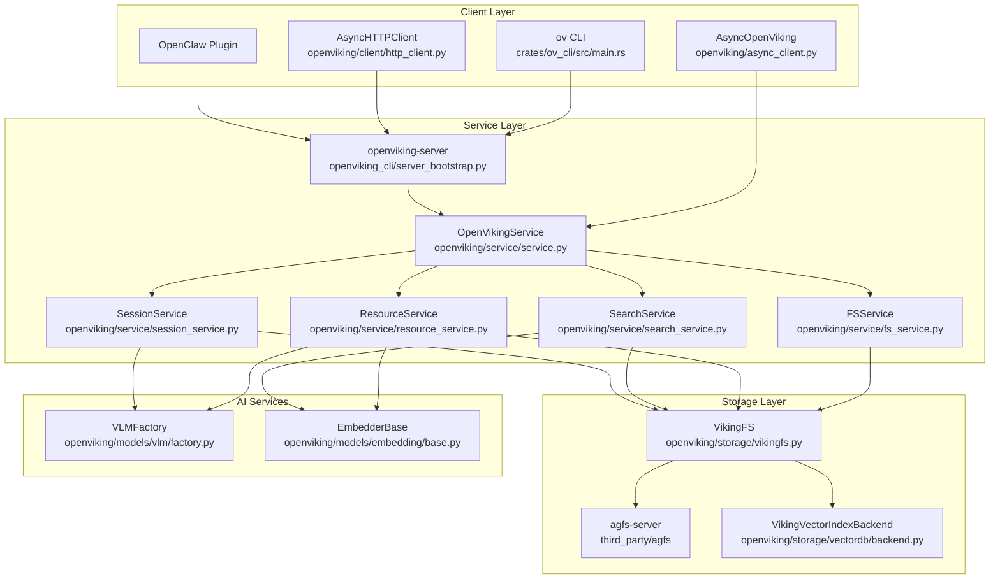

**Client Layer** provides multiple entry points:
- `ov` CLI tool: Rust-based command-line interface. [CONTRIBUTING.md:164]()
- `AsyncOpenViking`: Python SDK for embedded (local) mode. [CONTRIBUTING.md:144]()
- `AsyncHTTPClient`: Remote client for server mode. [CONTRIBUTING.md:145]()

**Service Layer** orchestrates all operations through `OpenVikingService`. Specialized services handle domain-specific logic such as `FSService` for file ops and `ResourceService` for ingestion. [CONTRIBUTING.md:155]()

**Storage Layer** abstracts persistence:
- `VikingFS`: Virtual filesystem mounting and URI mapping. [CONTRIBUTING.md:158]()
- `VikingVectorIndexBackend`: Multi-tenant vector database facade. [CONTRIBUTING.md:159]()
- `AGFS`: Go-based distributed filesystem supporting local, S3, and memory backends. [CONTRIBUTING_CN.md:139]()

**AI Services** provide model abstractions:
- `VLMFactory`: Supports Volcengine, OpenAI, and LiteLLM providers. [CONTRIBUTING.md:150]()
- `EmbedderBase`: Abstract base for dense/sparse/hybrid embedding providers. [CONTRIBUTING.md:151]()

**Sources:** [README.md:46-57](), [CONTRIBUTING.md:132-186](), [CONTRIBUTING_CN.md:139]()

---

## Viking Filesystem Paradigm

OpenViking organizes all context as a virtual filesystem accessible through the `viking://` URI protocol. [README.md:48-52]()

### Viking URI Structure

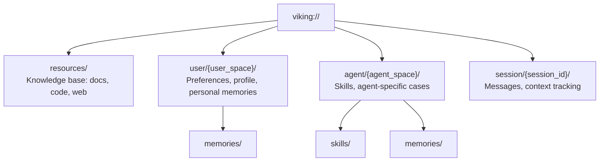

The `VikingFS` class implements URI-to-path conversion with multi-tenant isolation. Multi-tenancy is enforced through `RequestContext` which carries `account_id` and `user` identity.

**Sources:** [README.md:48-52](), [CONTRIBUTING.md:158]()

---

## Tiered Information Model (L0/L1/L2)

OpenViking generates three hierarchical abstraction levels for all content to reduce token consumption and improve retrieval speed. [README.md:73-78]()

| Layer | Name | Token Budget | Purpose |
|-------|------|-------------|---------|
| **L0** | Abstract | ~100 tokens | Vector search recall, quick filtering, directory listing. [README.md:75]() |
| **L1** | Overview | ~2000 tokens | Reranking refinement, content navigation, decision reference. [README.md:76]() |
| **L2** | Details | Unlimited | Complete original content for deep loading. [README.md:77]() |

These layers allow Agents to navigate vast datasets by first scanning L0/L1 summaries before committing to the token cost of reading full L2 content. [README.md:53-55]()

**Sources:** [README.md:53-55](), [README.md:73-78]()

---

## Deployment Modes

OpenViking supports two primary deployment patterns: embedded (single-process) and client-server (distributed).

### Deployment Architecture Comparison

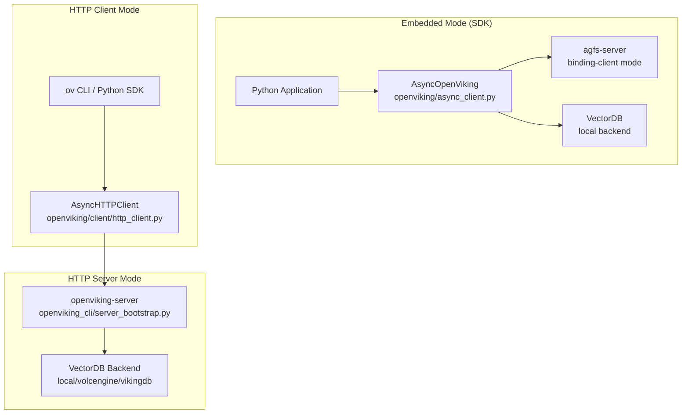

**Embedded Mode** uses the `AsyncOpenViking` client with a local `path`. It runs the `RAGFS` filesystem in-process through Rust bindings (`RAGFSBindingClient`) for zero network latency and maximum performance. [docs/en/getting-started/02-quickstart.md:162-162]()

**HTTP Server Mode** is launched via `openviking-server`. [docs/en/guides/03-deployment.md:17]() It provides a RESTful API and supports multi-tenant isolation via API keys. [docs/en/guides/03-deployment.md:59-61]()

**Sources:** [docs/en/getting-started/02-quickstart.md:162](), [docs/en/guides/03-deployment.md:17](), [docs/en/guides/03-deployment.md:59-61]()

---

## Technology Stack

OpenViking is a polyglot system combining several language ecosystems to balance development speed with runtime performance:

- **Python 3.10+**: Core logic, SDK, and service orchestration. [CONTRIBUTING.md:16]()
- **Go 1.22+**: High-performance AGFS file server and storage backends. [CONTRIBUTING.md:17]()
- **C++17**: Native vector database extensions and performance-critical parsing. [CONTRIBUTING.md:19]()
- **Rust**: High-performance CLI tool (`ov`) and safe FFI bindings for the filesystem. [CONTRIBUTING.md:18]()

The build process is managed via `pyproject.toml`, which orchestrates the compilation of native components during installation. [pyproject.toml:1-9]()

**Sources:** [CONTRIBUTING.md:14-20](), [pyproject.toml:1-9]()


<!-- ===== PAGE: 1.1 What is OpenViking ===== -->

# What is OpenViking

<details>
<summary>Relevant source files</summary>

The following files were used as context for generating this wiki page:

- [CONTRIBUTING.md](CONTRIBUTING.md)
- [CONTRIBUTING_CN.md](CONTRIBUTING_CN.md)
- [CONTRIBUTING_JA.md](CONTRIBUTING_JA.md)
- [README.md](README.md)
- [README_CN.md](README_CN.md)
- [README_JA.md](README_JA.md)
- [docs/en/about/01-about-us.md](docs/en/about/01-about-us.md)
- [docs/en/about/03-roadmap.md](docs/en/about/03-roadmap.md)
- [docs/en/faq/faq.md](docs/en/faq/faq.md)
- [docs/en/getting-started/05-cli-setup.md](docs/en/getting-started/05-cli-setup.md)
- [docs/images/benchmark-dark.svg](docs/images/benchmark-dark.svg)
- [docs/images/benchmark-light.svg](docs/images/benchmark-light.svg)
- [docs/images/ov-logo.png](docs/images/ov-logo.png)
- [docs/images/studio-playground.png](docs/images/studio-playground.png)
- [docs/zh/about/01-about-us.md](docs/zh/about/01-about-us.md)
- [docs/zh/about/03-roadmap.md](docs/zh/about/03-roadmap.md)
- [docs/zh/faq/faq.md](docs/zh/faq/faq.md)
- [docs/zh/getting-started/05-cli-setup.md](docs/zh/getting-started/05-cli-setup.md)

</details>


## Purpose and Scope

This page provides a detailed explanation of OpenViking's purpose as a context database for AI agents, the specific problems it solves, and the key innovations that distinguish it from traditional RAG and vector database systems. For detailed architecture information, see [Architecture at a Glance](). For hands-on usage, see [Quick Start Examples]().

---

## Overview

**OpenViking is an open-source context database designed specifically for AI agents.** [README.md:9-9](). It stores memories, resources, and skills as one virtual filesystem under the `viking://` protocol. [README.md:34-35](). This approach allows agents to browse their own context using familiar filesystem commands like `ls`, `tree`, and `find`, rather than querying a black-box vector store. [README.md:35-36]().

The core design philosophy is to unify the organization of memories, resources, and skills under a "file system paradigm," moving away from fragmented vector storage. [README.md:40-42](). This enables deterministic, traceable context operations and allows agents to build their "brains" much like managing local files. [README.md:42-42]().

**Sources:** [README.md:9-9](), [README.md:34-36](), [README.md:40-42](), [docs/zh/faq/faq.md:5-14]()

---

## Problems Solved

OpenViking addresses five core challenges in AI agent development:

| Challenge | Traditional Approach Problem | OpenViking Solution |
|-----------|----------------------------|---------------------|
| **Fragmented Context** | Memories, resources, and skills are scattered everywhere, making uniform management difficult. [docs/en/faq/faq.md:9-9](). | Unified management of memories, resources, and skills based on a filesystem paradigm, each with a `viking://` URI. [README.md:40-40](). |
| **Surging Context Demand** | Long-running tasks produce massive context; truncation leads to information loss. | L0/L1/L2 three-tier structure loaded on demand, significantly saving tokens. [README.md:43-43](). |
| **Poor Retrieval Effectiveness** | Flat storage lacks global view and full context understanding. [docs/en/faq/faq.md:10-10](). | Directory recursive retrieval, which first locates the highest-scoring directory and then drills down layer by layer, returning results with surrounding context intact. [README.md:44-44](). |
| **Unobservable Context** | Implicit retrieval chains are like black boxes, difficult to debug when errors occur. [docs/en/faq/faq.md:11-11](). | Observable retrieval, where each query preserves its directory-browsing trajectory, allowing debugging of incorrect results. [README.md:45-45](). |
| **Limited Memory Iteration** | Current memory is just interaction logs, lacking task-related memory and self-evolution capabilities. [docs/en/faq/faq.md:12-12](). | Sessions become memory: after a session commits, OpenViking asynchronously extracts user preferences and agent experience into long-term memory. [README.md:46-46](). |

**Sources:** [README.md:40-46](), [docs/en/faq/faq.md:9-12]()

---

## Key Innovations

### 1. Filesystem Management Paradigm

OpenViking treats all context as a virtual filesystem accessible via the `viking://` URI protocol. [README.md:34-35](). This paradigm transformation enables deterministic, traceable context operations, allowing agents to locate and manipulate context like a developer working with files. [README.md:40-42]().

#### Viking URI Structure

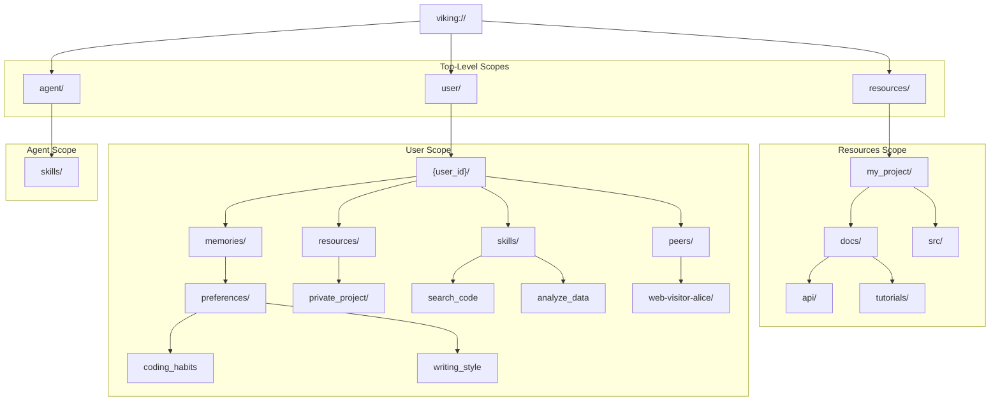

**Diagram: Viking URI Namespace Organization**

The URI system allows precise location of any context: `viking://resources/` for knowledge base items (documents, code, web pages), `viking://user/{user_id}/memories/` for user-specific context (preferences, events), and `viking://agent/skills/` for shared agent capabilities. [README.md:50-72]().

**Sources:** [README.md:34-35](), [README.md:40-42](), [README.md:50-72]()

---

### 2. Three-Level Hierarchical Context Model (L0/L1/L2)

OpenViking implements a progressive content loading mechanism to solve the problem of "stuffing massive context into prompts all at once." [README.md:43-43](). Every entry is processed into three tiers on write: L0 (abstract), L1 (overview), and L2 (details), then loaded only as deep as the task requires. [README.md:43-43]().

| Level | Name | Token Limit | Primary Use Case |
|-------|------|-------------|------------------|
| **L0** | Abstract | ~100 tokens | A one-sentence summary for quick relevance checks. [README.md:75-75](). |
| **L1** | Overview | ~2k tokens | Core information and usage scenarios for planning. [README.md:76-76](). |
| **L2** | Details | Unlimited | The full original data, read only when needed. [README.md:77-77](). |

**Progressive Loading Strategy:**
Each directory also carries its own L0/L1 layers, allowing relevance to be judged before any full file (L2) is read. [README.md:79-80](). This design allows agents to browse abstracts for quick positioning, then load details on demand, significantly saving token consumption. [docs/en/faq/faq.md:37-37]().

**Sources:** [README.md:43-43](), [README.md:75-80](), [docs/en/faq/faq.md:37-37]()

---

### 3. Directory Recursive Retrieval

OpenViking uses a sophisticated retrieval strategy called "directory recursive retrieval." [README.md:44-44](). This method first locates the highest-scoring directory via vector search, then drills down layer by layer, ensuring results arrive with their surrounding context intact. [README.md:44-44]().

```mermaid
graph TD
    Query["User Query"]
    
    subgraph "Retrieval Process"
        IntentAnalysis["Intent Analysis<br/>(LLM-based query expansion)"]
        InitialL0Scan["Initial L0 Scan<br/>(Vector search for top directories)"]
        ContextualScoreBoosting["Contextual Score Boosting<br/>(Parent directory influence)"]
        RecursiveDrillDown["Recursive Drill-down<br/>(Explore subdirectories)"]
        Reranking["Reranking<br/>(Refine results)"]
        L2Loading["L2 Loading<br/>(Fetch full content on demand)"]
    end
    
    Query --> IntentAnalysis
    IntentAnalysis --> InitialL0Scan
    InitialL0Scan --> ContextualScoreBoosting
    ContextualScoreBoosting --> RecursiveDrillDown
    RecursiveDrillDown --> Reranking
    Reranking --> L2Loading
    L2Loading --> "Retrieved Context"
```

**Diagram: Directory Recursive Retrieval Logic**

**Key Implementation Details:**
1.  **Intent Analysis:** Analyzes the user query to generate multiple retrieval conditions. [docs/zh/faq/faq.md:278-281]().
2.  **Initial L0 Scanning:** Vector search is performed on L0 abstracts to quickly identify potentially relevant directories. [README.md:75-75]().
3.  **Contextual Score Boosting:** A score propagation mechanism is used, where the final score of an item is influenced by its parent directory's score (e.g., `FinalScore = 0.5 × Embedding Similarity + 0.5 × Parent Directory Score`). This ensures that content within highly relevant directories receives a boost. [docs/zh/faq/faq.md:266-273]().
4.  **Recursive Drill-down:** The system progressively explores subdirectories within high-scoring paths, effectively traversing the filesystem hierarchy to find the most precise and contextually rich information. [docs/zh/faq/faq.md:276-284]().
5.  **Observable Retrieval:** Each query preserves its directory-browsing trajectory, allowing users to see exactly which path produced a result and debug if it's incorrect. [README.md:45-45]().

**Sources:** [README.md:44-45](), [README.md:75-75](), [docs/zh/faq/faq.md:266-284]()

---

### 4. Automatic Session Management and Memory Iteration

OpenViking includes robust session management capabilities. After a session commits, OpenViking asynchronously extracts user preferences and agent experience into long-term memory. [README.md:46-46](). This process allows agents to continuously learn and evolve.

**Memory Categories:**
OpenViking supports various memory types, which are stored in the current user or peer namespace. These include:
*   `profile`: User's basic information.
*   `preferences`: User's specific preferences (e.g., `writing_style`, `coding_habits`).
*   `entities`: Key entities mentioned in conversations.
*   `events`: Significant events or milestones.
*   `cases`: Successful task examples for agents.
*   `trajectories`: Agent's decision paths.
*   `experiences`: Agent's learned experiences.
*   `tools`: Tools the agent has used or learned about.
*   `skills`: Agent's acquired skills.

These memories are extracted and categorized during the session `commit()` operation. [docs/zh/faq/faq.md:220-223]().

**Deduplication and Iteration:**
The system automatically compresses content and extracts memories, ensuring that the agent becomes "smarter" over time without bloating the context window. [README.md:46-46]().

**Sources:** [README.md:46-46](), [docs/zh/faq/faq.md:220-237]()

---

## System Architecture Overview

OpenViking's architecture bridges the gap between natural language requests and structured storage through several key layers, primarily implemented in Python with performance-critical components in Rust and C++.

```mermaid
graph TD
    subgraph "Natural Language Interaction"
        UserQuery["User Query / Agent Prompt"]
        AgentAction["Agent Action / Session Message"]
    end
    
    subgraph "OpenViking Python Core"
        ClientSDK["AsyncOpenViking / SyncOpenViking<br/>(openviking/async_client.py, openviking/sync_client.py)"]
        ServiceLayer["Service Layer<br/>(SearchService, SessionService, ResourceService)<br/>(openviking/service/)"]
        VikingFS["VikingFS Abstraction<br/>(openviking/storage/)"]
        VikingVectorIndexBackend["VikingVectorIndexBackend<br/>(openviking/storage/)"]
    end
    
    subgraph "Native Components"
        RAGFSBindingClient["RAGFSBindingClient<br/>(Rust binding for AGFS)<br/>(crates/ragfs-python/)"]
        VectorExtensions["C++ Vector Extensions<br/>(src/)"]
    end
    
    UserQuery --> ClientSDK
    AgentAction --> ClientSDK
    
    ClientSDK --> ServiceLayer
    
    ServiceLayer --> VikingFS
    ServiceLayer --> VikingVectorIndexBackend
    
    VikingFS --> RAGFSBindingClient
    VikingVectorIndexBackend --> VectorExtensions
    
    RAGFSBindingClient --> "Underlying Storage (e.g., Local Disk, S3)"
    VectorExtensions --> "Vector Database (e.g., VikingDB, Local)"
```

**Diagram: OpenViking High-Level Architecture and Code Entities**

### Key System Entities

| Entity Name | Code Location | Responsibility |
|-------------|---------------|----------------|
| `AsyncOpenViking` | `openviking/async_client.py` | The primary asynchronous client for SDK usage, recommended for most applications. [CONTRIBUTING.md:142-142](). |
| `SyncOpenViking` | `openviking/sync_client.py` | A synchronous client wrapper for `AsyncOpenViking`. [CONTRIBUTING.md:143-143](). |
| `SearchService` | `openviking/service/` | Handles semantic search and retrieval operations. |
| `SessionService` | `openviking/service/` | Manages session lifecycle, message tracking, and memory extraction. |
| `ResourceService` | `openviking/service/` | Manages resource ingestion, parsing, and storage. |
| `VikingFS` | `openviking/storage/` | Provides a filesystem-like abstraction for managing context, including URI-to-path conversion and L0/L1/L2 content access. [CONTRIBUTING.md:155-155](). |
| `VikingVectorIndexBackend` | `openviking/storage/` | Manages vector indexing and similarity search, abstracting various vector database implementations. |
| `RAGFSBindingClient` | `crates/ragfs-python/` | A Rust binding that allows OpenViking to run RAGFS (the underlying filesystem logic) directly within the Python process for high performance and zero network latency. [docs/en/faq/faq.md:71-71](). |
| C++ Extensions | `src/` | Performance-critical components, often related to vector operations or low-level data handling. [CONTRIBUTING.md:170-170](). |

**Sources:** [CONTRIBUTING.md:135-170](), [docs/en/faq/faq.md:65-71]()

---

## Comparison with Traditional RAG Systems

OpenViking fundamentally differs from traditional RAG (Retrieval Augmented Generation) systems by adopting a database paradigm for context engineering.

| Dimension | Traditional Vector DB | OpenViking |
|-----------|----------------------|------------|
| **Storage Model** | Flat vector storage, often just a list of chunks and their embeddings. [docs/en/faq/faq.md:20-20](). | Hierarchical filesystem (AGFS), organizing context as `viking://` URIs with directories and files. [docs/en/faq/faq.md:20-20](). |
| **Retrieval Method** | Single vector similarity search, often returning isolated chunks. [docs/en/faq/faq.md:21-21](). | Directory recursive retrieval combined with intent analysis and reranking, preserving contextual hierarchy. [docs/en/faq/faq.md:21-21](). |
| **Output Format** | Raw text chunks, requiring further processing by the LLM. [docs/en/faq/faq.md:22-22](). | Structured context in L0 (abstract), L1 (overview), and L2 (details) formats, progressively loaded. [docs/en/faq/faq.md:22-22](). |
| **Memory Capability** | Not inherently supported; typically requires external systems for memory management. [docs/en/faq/faq.md:23-23](). | Built-in support for multiple extensible memory types with automatic extraction and continuous iteration from sessions. [docs/en/faq/faq.md:23-23](). |
| **Observability** | Black box; difficult to trace why specific chunks were retrieved. [docs/en/faq/faq.md:24-24](). | Fully traceable retrieval trajectory, showing the path taken through the virtual filesystem. [docs/en/faq/faq.md:24-24](). |
| **Context Types** | Primarily documents or text snippets. [docs/en/faq/faq.md:25-25](). | Resource, Memory, and Skill types, unified under the `viking://` URI. [docs/en/faq/faq.md:25-25](). |

**Sources:** [docs/en/faq/faq.md:18-26]()

---

## Implementation Technologies

OpenViking utilizes a multi-language stack to optimize for both developer experience and performance:
*   **Python (3.10+):** The core SDK and service orchestration are implemented in Python, providing flexibility and ease of development. [README.md:109-109]().
*   **Rust (1.91.1+):** Used for performance-critical components, including the `ov` CLI tool and the `ragfs-python` binding for the AGFS filesystem. [CONTRIBUTING.md:18-18](). The Rust CLI can be installed via `npm i -g @openviking/cli` or built from source using `cargo install --path crates/ov_cli`. [docs/en/getting-started/05-cli-setup.md:92-98]().
*   **C++ (GCC 9+ or Clang 11+):** Used for core vector extensions and other performance-sensitive native components, compiled via `pybind11` and `CMake`. [CONTRIBUTING.md:19-19]().
*   **Go (1.22+):** While the AGFS HTTP client mode is no longer supported, Go was historically used for AGFS components. [CONTRIBUTING.md:17-17]().

This polyglot approach allows OpenViking to leverage the strengths of each language, combining Python's ecosystem with the performance of Rust and C++.

**Sources:** [README.md:109-109](), [CONTRIBUTING.md:17-19](), [docs/en/getting-started/05-cli-setup.md:92-98]()19


<!-- ===== PAGE: 1.2 Key Concepts ===== -->

# Key Concepts

<details>
<summary>Relevant source files</summary>

The following files were used as context for generating this wiki page:

- [CONTRIBUTING.md](CONTRIBUTING.md)
- [CONTRIBUTING_CN.md](CONTRIBUTING_CN.md)
- [CONTRIBUTING_JA.md](CONTRIBUTING_JA.md)
- [README.md](README.md)
- [README_CN.md](README_CN.md)
- [README_JA.md](README_JA.md)
- [docs/design/parser-two-layer-refactor-plan.md](docs/design/parser-two-layer-refactor-plan.md)
- [docs/design/tool-stub-design.md](docs/design/tool-stub-design.md)
- [docs/en/concepts/04-viking-uri.md](docs/en/concepts/04-viking-uri.md)
- [docs/en/concepts/05-storage.md](docs/en/concepts/05-storage.md)
- [docs/en/concepts/10-encryption.md](docs/en/concepts/10-encryption.md)
- [docs/en/concepts/11-multi-tenant.md](docs/en/concepts/11-multi-tenant.md)
- [docs/en/faq/faq.md](docs/en/faq/faq.md)
- [docs/en/getting-started/05-cli-setup.md](docs/en/getting-started/05-cli-setup.md)
- [docs/en/guides/08-encryption.md](docs/en/guides/08-encryption.md)
- [docs/images/benchmark-dark.svg](docs/images/benchmark-dark.svg)
- [docs/images/benchmark-light.svg](docs/images/benchmark-light.svg)
- [docs/images/ov-logo.png](docs/images/ov-logo.png)
- [docs/images/studio-playground.png](docs/images/studio-playground.png)
- [docs/zh/concepts/04-viking-uri.md](docs/zh/concepts/04-viking-uri.md)
- [docs/zh/concepts/05-storage.md](docs/zh/concepts/05-storage.md)
- [docs/zh/concepts/10-encryption.md](docs/zh/concepts/10-encryption.md)
- [docs/zh/concepts/11-multi-tenant.md](docs/zh/concepts/11-multi-tenant.md)
- [docs/zh/faq/faq.md](docs/zh/faq/faq.md)
- [docs/zh/getting-started/05-cli-setup.md](docs/zh/getting-started/05-cli-setup.md)
- [docs/zh/guides/08-encryption.md](docs/zh/guides/08-encryption.md)
- [openviking/core/context.py](openviking/core/context.py)
- [openviking/core/namespace.py](openviking/core/namespace.py)
- [openviking/core/uri_validation.py](openviking/core/uri_validation.py)
- [openviking/service/search_service.py](openviking/service/search_service.py)
- [openviking/storage/queuefs/embedding_msg_converter.py](openviking/storage/queuefs/embedding_msg_converter.py)
- [openviking_cli/utils/uri.py](openviking_cli/utils/uri.py)
- [tests/server/test_temp_scope_acl.py](tests/server/test_temp_scope_acl.py)
- [tests/storage/test_embedding_msg_converter_tenant.py](tests/storage/test_embedding_msg_converter_tenant.py)
- [tests/unit/test_namespace_uri_classification.py](tests/unit/test_namespace_uri_classification.py)
- [tests/unit/test_uri_short_format.py](tests/unit/test_uri_short_format.py)
- [tests/unit/test_uri_validation.py](tests/unit/test_uri_validation.py)

</details>


This page introduces the fundamental concepts that underpin OpenViking's design: the **Viking URI** namespace system, **context types** (Resource/Memory/Skill), the **L0/L1/L2** hierarchical content model, the distinct roles of **VLM** and **Embedding** services, and **multi-tenancy** isolation mechanisms. These concepts form the foundation for understanding how OpenViking organizes, processes, and retrieves context for AI agents.

---

## Viking URI Namespace

OpenViking uses a unified resource identifier scheme called **Viking URI** to address all contexts in the system. The URI format is `viking://{scope}/{path}`, where the scope determines the context type and ownership model [openviking_cli/utils/uri.py:14-33]().

### URI Structure

The Viking URI namespace is organized into primary scopes that define the directory-based structure of the agent's "brain" [openviking_cli/utils/uri.py:35-47]():

| Scope | Purpose | Tenant Isolation | Example |
|-------|---------|------------------|---------|
| `resources/` | Shared knowledge base: documents, code, web pages | Account-wide | `viking://resources/my_project/docs/` |
| `user/` | User-specific context and memories | Per-user | `viking://user/memories/` |
| `agent/` | Agent-specific skills and patterns | Per-agent | `viking://agent/skills/` |
| `session/` | Conversation history and ephemeral context | Per-session | `viking://user/{user_id}/sessions/{session_id}/` |

**Sources:** [openviking_cli/utils/uri.py:14-48](), [docs/en/faq/faq.md:39-52](), [openviking/core/namespace.py:13-19]()

### URI Mapping and Validation

The `VikingURI` class [openviking_cli/utils/uri.py:49-49]() handles parsing and normalization of Viking URIs. The `VikingFS` class acts as the primary abstraction, mapping logical URIs to physical storage paths while enforcing tenant isolation. The `NamespaceManager` and `classify_uri` function parse these strings into structured segments to determine context types [openviking/core/namespace.py:137-150]().

Title: URI Processing and Namespace Mapping
```mermaid
graph LR
    Input["Input URI<br/>(viking://user/memories)"]
    VikingURI_Class["VikingURI<br/>[openviking_cli/utils/uri.py]"]
    VikingURI_Parse["_parse()<br/>[openviking_cli/utils/uri.py:63-92]"]
    Namespace_Classify["classify_uri()<br/>[openviking/core/namespace.py:86-150]"]
    VikingFS_Map["VikingFS.map_to_physical()<br/>[openviking/storage/viking_fs.py]"]
    RequestContext_Apply["Apply RequestContext<br/>(user_id / account_id)"]
    
    Input --> VikingURI_Class
    VikingURI_Class --> VikingURI_Parse
    VikingURI_Parse --> Namespace_Classify
    Namespace_Classify --> VikingFS_Map
    VikingFS_Map --> RequestContext_Apply
```

**Sources:** [openviking/core/namespace.py:86-150](), [openviking_cli/utils/uri.py:49-92](), [openviking/core/namespace.py:157-162]()

---

## Context Types

OpenViking organizes all context into three distinct types, each serving a specific role in the agent's operation [README.md:50-54]().

### RESOURCE Context
**Purpose:** External knowledge that agents reference (docs, code, media).
**Storage:** Typically found in `viking://resources/` [openviking/core/directories.py:107-111]().
**Processing:** Handled by the `ResourceProcessor` which orchestrates parsing, chunking, and L0/L1 generation [README.md:54-57]().

### MEMORY Context
**Purpose:** Learned information about users and agents extracted from sessions.
**Categories:** OpenViking uses a hierarchical preset directory structure for memory [openviking/core/directories.py:39-105]():
- **User Space:** `preferences` (habits), `entities` (people/orgs), `events` (milestones), `trajectories` (execution traces).
- **Agent Space:** `cases` (problem contexts), `patterns` (reusable methods/SOPs).

### SKILL Context
**Purpose:** Executable capabilities and tool definitions that the agent can call [README.md:50-54]().
**Storage:** Located in `viking://agent/skills/` [openviking/core/namespace.py:196-196]().

**Sources:** [README.md:50-57](), [openviking/core/directories.py:39-120](), [openviking/core/namespace.py:13-19]()

---

## L0/L1/L2 Hierarchical Model

OpenViking implements a three-tier progressive content loading model. This "tiered context loading" significantly reduces token consumption by allowing agents to browse summaries before loading full content [README.md:55-55]().

### Layer Definitions

| Layer | Name | Token Limit | Role |
|-------|------|-------------|------|
| **L0** | Abstract | ~100 tokens | Used for vector search recall, quick filtering, and listing [docs/en/faq/faq.md:33-33](). |
| **L1** | Overview | ~2000 tokens | Used for Rerank refinement and decision reference [docs/en/faq/faq.md:34-34](). |
| **L2** | Detail | Unlimited | The original source content (raw code, text, or binary) [docs/en/faq/faq.md:35-35](). |

**Sources:** [docs/en/faq/faq.md:27-37](), [README.md:55-55](), [openviking/core/directories.py:29-35]()

### Directory Recursive Retrieval
The retrieval system uses these layers to perform "Directory Recursive Retrieval." It combines directory positioning with semantic search to drill down from high-level summaries to specific details [README.md:56-56](). The `SearchService` [openviking/service/search_service.py:35-35]() orchestrates this process, calling `viking_fs.search()` [openviking/service/search_service.py:105-114]() for complex queries with session context or `viking_fs.find()` [openviking/service/search_service.py:145-154]() for simpler semantic searches.

Title: Hierarchical Retrieval Pipeline
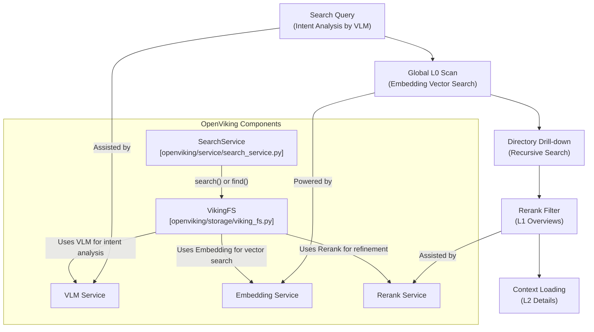

**Sources:** [README.md:56-57](), [docs/en/faq/faq.md:274-284](), [docs/en/faq/faq.md:65-71](), [openviking/service/search_service.py:35-35](), [openviking/service/search_service.py:105-114](), [openviking/service/search_service.py:145-154]()

---

## VLM vs Embedding Roles

OpenViking distinguishes between **multimodal understanding** and **semantic vectorization**.

### VLM (Vision Language Model)
- **Role:** Image understanding, content abstraction (L0/L1 generation), and memory extraction [README.md:96-98]().
- **Integration:** Supports providers like `volcengine` (Doubao), `openai`, `kimi`, and `glm` [README.md:101-111]().
- **Usage:** Used during session `commit()` to extract long-term memory from conversation logs [README.md:58-59](). The `VLM` configuration is defined in `ov.conf` [docs/en/faq/faq.md:110-114]().

### Embedding Model
- **Role:** Vectorization for semantic retrieval [README.md:97-99]().
- **Integration:** Supports dense, sparse, and hybrid modes across providers like `volcengine`, `openai`, `jina`, and `ollama` [docs/en/faq/faq.md:118-128]().
- **Usage:** Essential for the initial recall phase of the retrieval pipeline where content is indexed into `VikingVectorIndexBackend` [openviking/storage/vectordb/collection/volcengine_collection.py:24-34](). The `embedding` configuration is also defined in `ov.conf` [docs/en/faq/faq.md:100-108]().

**Sources:** [README.md:96-111](), [docs/en/faq/faq.md:118-128](), [openviking/storage/vectordb/collection/volcengine_collection.py:81-108](), [docs/en/faq/faq.md:100-114]()

---

## Multi-Tenancy Isolation

OpenViking supports multi-tenancy through `account` and `user` boundaries, managed by the `RequestContext` object [openviking/core/namespace.py:10-11]().

### Identity Model
1.  **Account Level:** The `account_id` is the primary isolation boundary. Backends like `VolcengineCollection` use this for project-level separation [openviking/storage/vectordb/collection/volcengine_collection.py:106-107]().
2.  **User Level:** Within an account, `user_id` isolates memories and sessions. URIs are canonicalized using `canonical_user_root(ctx)` [openviking/core/namespace.py:157-158]().
3.  **Peer Level:** OpenViking supports `actor_peer_id` for fine-grained visibility control, allowing a user to have different memory views for different interaction peers [openviking/core/namespace.py:207-212]().

### Authentication and Authorization
Identity is derived from headers or API keys and encapsulated in `RequestContext` [openviking/server/identity.py:20-20](). The `VikingFS` and `VectorDB` layers use this context to ensure that a request only accesses data within its authorized `viking://` URI space [openviking/core/namespace.py:199-205](). This is crucial for features like privacy configurations and encryption [docs/en/guides/08-encryption.md]().

Title: Multi-Tenancy Identity Flow
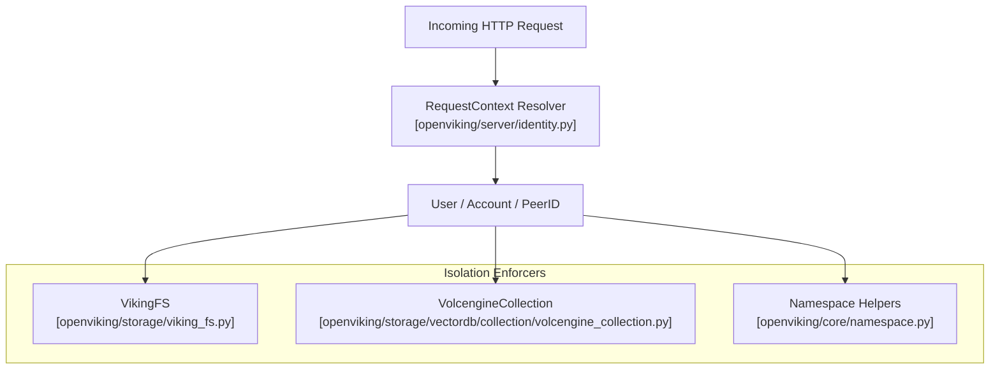

**Sources:** [openviking/core/namespace.py:157-212](), [openviking/storage/vectordb/collection/volcengine_collection.py:81-108](), [openviking/server/identity.py:20-20](), [docs/en/guides/08-encryption.md]()


<!-- ===== PAGE: 1.3 Architecture at a Glance ===== -->

# Architecture at a Glance

<details>
<summary>Relevant source files</summary>

The following files were used as context for generating this wiki page:

- [CONTRIBUTING.md](CONTRIBUTING.md)
- [CONTRIBUTING_CN.md](CONTRIBUTING_CN.md)
- [CONTRIBUTING_JA.md](CONTRIBUTING_JA.md)
- [README.md](README.md)
- [README_CN.md](README_CN.md)
- [README_JA.md](README_JA.md)
- [crates/ov_cli/src/commands/admin.rs](crates/ov_cli/src/commands/admin.rs)
- [crates/ov_cli/src/commands/mod.rs](crates/ov_cli/src/commands/mod.rs)
- [docs/en/api/08-admin.md](docs/en/api/08-admin.md)
- [docs/en/faq/faq.md](docs/en/faq/faq.md)
- [docs/en/getting-started/05-cli-setup.md](docs/en/getting-started/05-cli-setup.md)
- [docs/en/guides/04-authentication.md](docs/en/guides/04-authentication.md)
- [docs/images/benchmark-dark.svg](docs/images/benchmark-dark.svg)
- [docs/images/benchmark-light.svg](docs/images/benchmark-light.svg)
- [docs/images/ov-logo.png](docs/images/ov-logo.png)
- [docs/images/studio-playground.png](docs/images/studio-playground.png)
- [docs/zh/api/08-admin.md](docs/zh/api/08-admin.md)
- [docs/zh/faq/faq.md](docs/zh/faq/faq.md)
- [docs/zh/getting-started/05-cli-setup.md](docs/zh/getting-started/05-cli-setup.md)
- [docs/zh/guides/04-authentication.md](docs/zh/guides/04-authentication.md)
- [openviking/server/app.py](openviking/server/app.py)
- [openviking/server/auth/plugins/trusted.py](openviking/server/auth/plugins/trusted.py)
- [openviking/server/config.py](openviking/server/config.py)
- [openviking/server/routers/__init__.py](openviking/server/routers/__init__.py)
- [openviking/server/routers/admin.py](openviking/server/routers/admin.py)
- [openviking/server/routers/tasks.py](openviking/server/routers/tasks.py)
- [openviking/service/core.py](openviking/service/core.py)
- [openviking/service/task_tracker.py](openviking/service/task_tracker.py)
- [openviking/storage/queuefs/queue_manager.py](openviking/storage/queuefs/queue_manager.py)
- [tests/server/test_admin_api.py](tests/server/test_admin_api.py)
- [tests/server/test_auth.py](tests/server/test_auth.py)
- [tests/test_session_task_tracking.py](tests/test_session_task_tracking.py)
- [tests/test_task_tracker.py](tests/test_task_tracker.py)

</details>


This document provides a high-level architectural overview of OpenViking's major components and their interactions. It focuses on the system's structural organization: client interfaces, service orchestration, storage backends, and processing pipelines.

## Operational Modes

OpenViking supports three operational modes with unified client interfaces. The system can run as an embedded library within a Python process or as a standalone HTTP server.

**Client Mode Architecture**

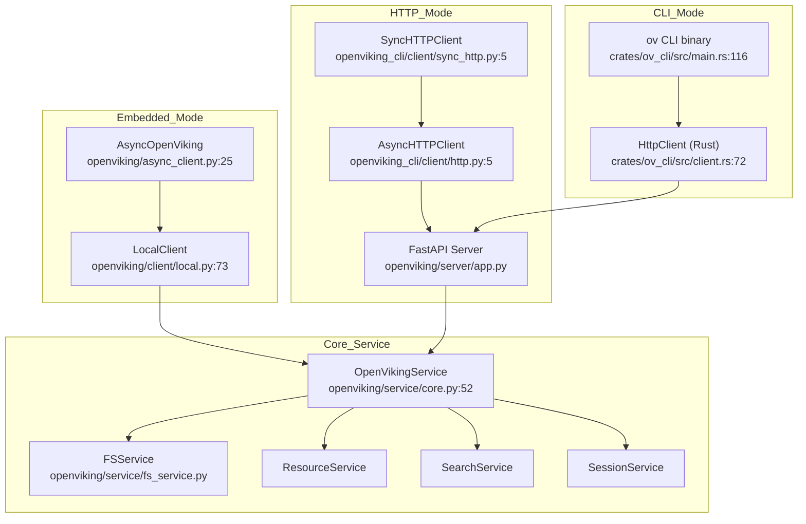

| Mode | Client Class | Use Case | Service Access |
|------|--------------|----------|----------------|
| **Embedded** | `AsyncOpenViking` | Python applications, Jupyter notebooks | Direct in-process via `LocalClient` |
| **HTTP** | `AsyncHTTPClient` (Python) or `HttpClient` (Rust) | Distributed deployments, multi-instance | Remote HTTP API |
| **CLI** | `ov` binary | Command-line operations | Remote HTTP API via Rust `HttpClient` |

All modes converge on `OpenVikingService` as the central orchestrator. Configuration is unified via `ov.conf` across all access patterns.

**Sources:** [openviking/async_client.py:25-76](), [openviking/client/local.py:73-101](), [openviking_cli/client/http.py:5-7](), [openviking_cli/client/sync_http.py:5-8](), [crates/ov_cli/src/main.rs:116-178](), [crates/ov_cli/src/client.rs:72-101]()

## Service Orchestration

The `OpenVikingService` class serves as the main orchestrator, managing the lifecycle of infrastructure components and sub-services.

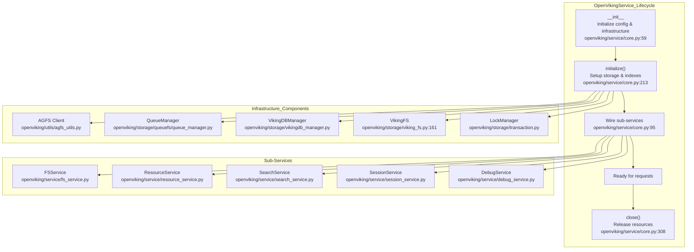

1.  **Initialization Phase** (`__init__`) [openviking/service/core.py:59-130]():
    *   Loads configuration from `ov.conf` via `initialize_openviking_config()` [openviking/service/core.py:75-78]().
    *   Initializes the AGFS client (HTTP or binding mode) via `_init_storage()` [openviking/service/core.py:131-160]().
    *   Sets up the `QueueManager` [openviking/service/core.py:150-156]() with semantic and embedding concurrency limits.
    *   Creates `VikingDBManager` [openviking/service/core.py:161-163]() for vector storage orchestration.
2.  **Setup Phase** (`initialize()`) [openviking/service/core.py:213-306]():
    *   Creates context collection schema via `init_context_collection()` [openviking/service/core.py:220]().
    *   Initializes `VikingFS` abstraction via `init_viking_fs()` [openviking/storage/viking_fs.py:164-202]().
    *   Initializes preset directories via `DirectoryInitializer` [openviking/service/core.py:222]().
3.  **Shutdown** (`close()`) [openviking/service/core.py:308-337](): Gracefully stops the `QueueManager` workers and releases AGFS resources.

**Sources:** [openviking/service/core.py:52-170](), [openviking/storage/viking_fs.py:164-202](), [openviking/storage/collection_schemas.py:56-145]()

## Storage Architecture

OpenViking employs a three-tier storage architecture to unify file management and semantic search.

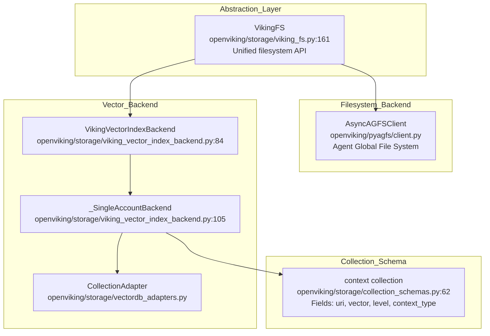

### AGFS: Agent Global File System
AGFS is a distributed file system abstraction providing a virtual URI namespace (`viking://`). It supports multiple backends (Local, S3, Memory). Configuration in [openviking/service/core.py:131-145]() determines the client type via `create_agfs_client()` [openviking/utils/agfs_utils.py:147]().

### VikingFS: Python Abstraction
`VikingFS` [openviking/storage/viking_fs.py:161] provides a unified Python API over AGFS and vector storage. It handles URI resolution, L0/L1 reading, and vector sync [openviking/storage/viking_fs.py:4-13](). It is initialized during service setup via `init_viking_fs` [openviking/storage/viking_fs.py:164]().

### Vector Storage Layer
The vector storage is abstracted by `VikingVectorIndexBackend` [openviking/storage/viking_vector_index_backend.py:84](). It uses `_SingleAccountBackend` [openviking/storage/viking_vector_index_backend.py:105]() to manage tenant-specific operations and adapter offloading via `_AsyncVectorAdapter` [openviking/storage/viking_vector_index_backend.py:84](). The `context` collection schema [openviking/storage/collection_schemas.py:62-145]() defines fields for L0/L1/L2 levels, `context_type` (resource, memory, skill), and multi-tenancy identifiers (`account_id`, `owner_user_id`).

**Sources:** [openviking/storage/viking_vector_index_backend.py:84-184](), [openviking/storage/collection_schemas.py:62-145](), [openviking/storage/viking_fs.py:4-13]()

## Processing Pipeline

OpenViking uses an asynchronous pipeline to process resources, generate summaries, and index content.

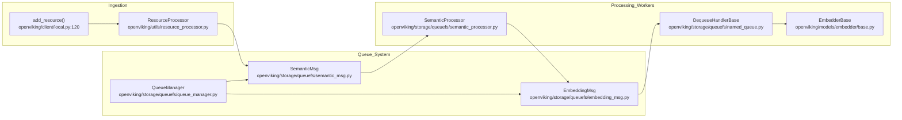

### Asynchronous Processing
The `QueueManager` [openviking/storage/queuefs/queue_manager.py:63]() orchestrates worker queues configured during storage initialization [openviking/service/core.py:150-156]():
1.  **Semantic Queue**: Handles `SemanticMsg` to generate L0 (Abstract) and L1 (Overview) content using VLMs. The `SemanticProcessor` [openviking/storage/queuefs/queue_manager.py:142]() is responsible for this.
2.  **Embedding Queue**: Handles `EmbeddingMsg` [openviking/storage/collection_schemas.py:26]() to vectorize text and upsert it into the vector database. The `TextEmbeddingHandler` [openviking/storage/queuefs/queue_manager.py:133]() processes these messages.

### Vectorization
Content and metadata are converted into vectorizable units and enqueued via `EmbeddingMsg`. The `CollectionSchemas` [openviking/storage/collection_schemas.py:56]() ensures the schema matches the active embedding model's dimension and provider [openviking/storage/collection_schemas.py:148-182]().

**Sources:** [openviking/service/core.py:150-156](), [openviking/storage/collection_schemas.py:148-182](), [openviking/client/local.py:120-163](), [openviking/storage/queuefs/queue_manager.py:63-149]()

## Configuration and Multi-Tenancy

OpenViking utilizes a robust configuration and identity system to support multi-tenant environments.

### Client-Side Configuration
Clients (Python and Rust) load connection details from `ovcli.conf`. 
*   **Python**: `AsyncHTTPClient` [openviking_cli/client/http.py:5]() and `SyncHTTPClient` [openviking_cli/client/sync_http.py:5]() provide compatibility shims for HTTP access.
*   **Rust**: `CliContext` [crates/ov_cli/src/main.rs:35-79]() manages configuration and client instantiation [crates/ov_cli/src/main.rs:91-109]() for the CLI.

### Identity & Access Control
Identity is enforced at the service level using `RequestContext` [openviking/server/identity.py:47]().
*   **Tenant Isolation**: The `_SingleAccountBackend` [openviking/storage/viking_vector_index_backend.py:105-142]() binds operations to a specific `account_id` and filters results based on `owner_user_id`.
*   **Role-Based Access**: The system distinguishes between roles such as `Role.USER` and `Role.ADMIN` [openviking/server/identity.py:47](). The `admin_router` [openviking/server/routers/admin.py]() handles administrative API endpoints, often requiring `ROOT` or `ADMIN` roles.

**Sources:** [crates/ov_cli/src/main.rs:35-109](), [openviking/storage/viking_vector_index_backend.py:105-142](), [openviking/server/identity.py:47](), [openviking/server/routers/admin.py]()


<!-- ===== PAGE: 2 Getting Started ===== -->

# Getting Started

<details>
<summary>Relevant source files</summary>

The following files were used as context for generating this wiki page:

- [CONTRIBUTING.md](CONTRIBUTING.md)
- [CONTRIBUTING_CN.md](CONTRIBUTING_CN.md)
- [CONTRIBUTING_JA.md](CONTRIBUTING_JA.md)
- [README.md](README.md)
- [README_CN.md](README_CN.md)
- [README_JA.md](README_JA.md)
- [docker-compose.yml](docker-compose.yml)
- [docs/en/faq/faq.md](docs/en/faq/faq.md)
- [docs/en/getting-started/02-quickstart.md](docs/en/getting-started/02-quickstart.md)
- [docs/en/getting-started/05-cli-setup.md](docs/en/getting-started/05-cli-setup.md)
- [docs/en/guides/01-configuration.md](docs/en/guides/01-configuration.md)
- [docs/en/guides/03-deployment.md](docs/en/guides/03-deployment.md)
- [docs/en/guides/17-vikingbot.md](docs/en/guides/17-vikingbot.md)
- [docs/images/benchmark-dark.svg](docs/images/benchmark-dark.svg)
- [docs/images/benchmark-light.svg](docs/images/benchmark-light.svg)
- [docs/images/ov-logo.png](docs/images/ov-logo.png)
- [docs/images/studio-playground.png](docs/images/studio-playground.png)
- [docs/zh/faq/faq.md](docs/zh/faq/faq.md)
- [docs/zh/getting-started/02-quickstart.md](docs/zh/getting-started/02-quickstart.md)
- [docs/zh/getting-started/05-cli-setup.md](docs/zh/getting-started/05-cli-setup.md)
- [docs/zh/guides/01-configuration.md](docs/zh/guides/01-configuration.md)
- [docs/zh/guides/03-deployment.md](docs/zh/guides/03-deployment.md)
- [docs/zh/guides/17-vikingbot.md](docs/zh/guides/17-vikingbot.md)
- [examples/ov.conf.example](examples/ov.conf.example)

</details>


This guide provides practical instructions for installing, configuring, and running OpenViking for the first time. It covers prerequisites, installation methods, basic configuration, and quick examples using both the Python SDK and CLI.

For conceptual background on what OpenViking is and how it works, see [Overview](#1) and [Key Concepts](#1.2). For production deployment options, see [Deployment Modes](#2.4).

---

## Prerequisites

OpenViking requires **Python 3.10 or higher** [README.md:68]().

**For pre-compiled wheels** (recommended for most users):
- Supported platforms: Windows (x86_64), macOS (x86_64, arm64), and Linux (x86_64, arm64 manylinux) [CONTRIBUTING.md:30-34]().
- No compiler toolchain required for standard installation.

**For building from source** (advanced):
- **Python Version**: 3.10 or higher [README.md:68]().
- **Go Version**: 1.22 or higher (Required for building AGFS components) [CONTRIBUTING.md:17]().
- **C++ Compiler**: GCC 9+ or Clang 11+ (Must support C++17) [CONTRIBUTING.md:19]().
- **Rust**: 1.91.1+ (Required for building the `ov_cli` component and RAGFS) [README.md:69](), [CONTRIBUTING.md:18]().
- **CMake**: 3.12+ [CONTRIBUTING.md:20]().

Sources: [README.md:64-73](), [CONTRIBUTING.md:14-37]()

---

## Installation

OpenViking can be installed via `pip` (using pre-built wheels) or built from source for development.

### Using pip (Recommended)

```bash
pip install openviking --upgrade --force-reinstall
```
This command installs the latest stable release of the OpenViking Python package [README.md:79]().

### Rust CLI (Optional)

To install the standalone Rust-based CLI tool:
```bash
npm i -g @openviking/cli
```
Alternatively, build it from source using Cargo:
```bash
cargo install --git https://github.com/volcengine/OpenViking ov_cli
```
[README.md:82-92]()

For detailed installation instructions, including handling multi-language builds, see [Installation](#2.1).

Sources: [README.md:74-94](), [CONTRIBUTING.md:114-129]()

### Installation Diagram

The following diagram bridges the user installation actions to the resulting code entities and runtime components.

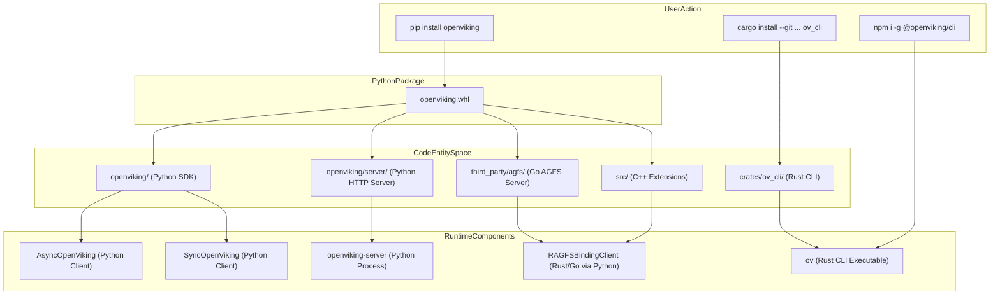
Sources: [README.md:74-94](), [CONTRIBUTING.md:132-186](), [docs/en/faq/faq.md:67-74]()

---

## Configuration

OpenViking uses a JSON configuration file (typically `~/.openviking/ov.conf`) to manage model providers and storage settings [docs/en/guides/03-deployment.md:31](). The recommended first-time setup involves using the interactive wizard:

```bash
openviking-server init
openviking-server doctor
```
The `openviking-server init` command guides you through setting up embedding and VLM configurations, including provider selection and local model detection via Ollama [README.md:231-243](). `openviking-server doctor` validates your environment and connectivity [README.md:247-250]().

### Basic ov.conf Structure

A typical `ov.conf` includes sections for `storage`, `embedding`, and `vlm`:

```json
{
  "storage": {
    "workspace": "/home/user/openviking_workspace",
    "agfs": { "backend": "local" },
    "vectordb": { "backend": "local" }
  },
  "embedding": {
    "dense": {
      "api_base" : "<api-endpoint>",
      "api_key"  : "<your-api-key>",
      "provider" : "volcengine",
      "dimension": 1024,
      "model"    : "doubao-embedding-vision-251215"
    }
  },
  "vlm": {
    "api_base" : "<api-endpoint>",
    "api_key"  : "<your-api-key>",
    "provider" : "volcengine",
    "model"    : "doubao-seed-2-0-pro-260215"
  }
}
```
[README.md:267-305]()

### Key Configuration Sections

-   **`storage`**: Defines the `workspace` directory and backends for `vectordb` and `agfs` [docs/en/guides/03-deployment.md:78-84]().
-   **`embedding`**: Configures dense embedding models. Supported providers include `volcengine`, `openai`, `azure`, `vikingdb`, `jina`, `ollama`, `gemini`, `voyage`, `dashscope`, `minimax`, `cohere`, `litellm`, or `local` [docs/en/faq/faq.md:118-128]().
-   **`vlm`**: Configures the Vision Language Model for content understanding and L0/L1 generation. Supported providers include `volcengine`, `openai`, `azure`, `openai-codex`, `kimi`, and `glm` [README.md:105-110]().

For comprehensive details on all configuration options, see [Configuration](#2.2).

Sources: [README.md:94-171](), [CONTRIBUTING.md:69-91](), [docs/en/faq/faq.md:82-136](), [docs/en/guides/03-deployment.md:48-68]()

---

## Quick Start Examples

OpenViking provides both a Python SDK and a Rust-based CLI for interaction.

### SDK Usage (Embedded Mode)

The Python SDK allows you to use OpenViking directly within your application without running a separate server.

```python
import openviking as ov

# Initialize OpenViking client with data directory
client = ov.OpenViking(path="./data")

try:
    # Initialize the client, which loads ov.conf and sets up services
    client.initialize()

    # Add a resource (e.g., a URL, local file, or directory)
    # The 'wait=True' ensures semantic processing completes before proceeding.
    add_result = client.add_resource(
        path="https://raw.githubusercontent.com/volcengine/OpenViking/refs/heads/main/README.md",
        wait=True,
    )
    root_uri = add_result['root_uri']

    # Perform a semantic search within the added resource
    results = client.find("what is openviking", target_uri=root_uri)
    for r in results.resources:
        print(f"  {r.uri} (score: {r.score:.4f})")

finally:
    # Always close the client to release resources
    client.close()
```
[docs/en/getting-started/02-quickstart.md:142-187]()

### CLI Usage

The `ov` CLI tool provides command-line access. Ensure `~/.openviking/ovcli.conf` is configured to connect to an OpenViking server [docs/en/guides/03-deployment.md:153-162]().

```bash
# List files in the resources scope
ov ls viking://resources/

# Search for content semantically
ov search "how to use openviking"

# Read the full content of a specific URI
ov read viking://resources/my_project/document.md
```

For more practical code examples covering basic operations like adding resources, semantic search, session management, and memory extraction, see [Quick Start Examples](#2.3).

Sources: [docs/en/getting-started/02-quickstart.md:135-195](), [docs/en/faq/faq.md:132-202]()

---

## Deployment Modes

OpenViking offers various deployment options to suit different needs.

1.  **Embedded Mode (SDK)**: The Python SDK (`AsyncOpenViking` or `SyncOpenViking`) runs entirely within your application process, managing local storage and processing via `RAGFSBindingClient` [docs/en/faq/faq.md:145-147](), [docs/en/faq/faq.md:67-70]().
2.  **HTTP Client-Server Mode**: Run `openviking-server` as a standalone HTTP service. Clients (Python SDK, CLI, or custom HTTP clients) connect to this server over the network [docs/en/guides/03-deployment.md:1-25]().
3.  **Docker**: Pre-built Docker images (`ghcr.io/volcengine/openviking:latest`) simplify deployment. Persistent state is stored under `/app/.openviking` [docs/en/guides/03-deployment.md:185-201]().
4.  **Systemd**: On Linux systems, OpenViking can be managed as a service for automatic restarts and startup on boot [docs/en/guides/03-deployment.md:90-116]().
5.  **Public HTTPS**: Use reverse proxies like Caddy (included in `docker-compose.yml`) for public access, OAuth support, and MCP client integration [docker-compose.yml:3-13]().

### Service Interaction Diagram

This diagram illustrates how different client types interact with the OpenViking server and its internal components.

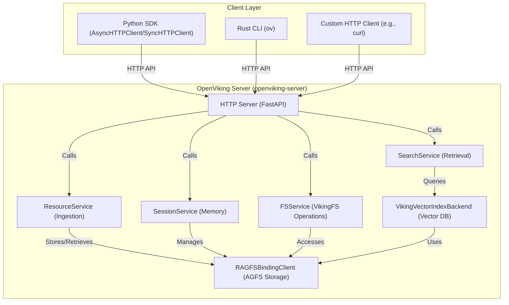
Sources: [docs/en/guides/03-deployment.md:139-180](), [CONTRIBUTING.md:132-186](), [docs/en/faq/faq.md:67-74]()

For detailed guides on each deployment mode, see [Deployment Modes](#2.4).

Sources: [docs/en/guides/03-deployment.md:1-265](), [docker-compose.yml:1-60]()


<!-- ===== PAGE: 2.1 Installation ===== -->

# Installation

<details>
<summary>Relevant source files</summary>

The following files were used as context for generating this wiki page:

- [.github/workflows/_build.yml](.github/workflows/_build.yml)
- [.github/workflows/_codeql.yml](.github/workflows/_codeql.yml)
- [.github/workflows/_publish.yml](.github/workflows/_publish.yml)
- [.github/workflows/_test_full.yml](.github/workflows/_test_full.yml)
- [.github/workflows/_test_lite.yml](.github/workflows/_test_lite.yml)
- [.github/workflows/build-docker-image.yml](.github/workflows/build-docker-image.yml)
- [.github/workflows/ci.yml](.github/workflows/ci.yml)
- [.github/workflows/pr.yml](.github/workflows/pr.yml)
- [.github/workflows/release.yml](.github/workflows/release.yml)
- [.github/workflows/schedule.yml](.github/workflows/schedule.yml)
- [.gitignore](.gitignore)
- [Dockerfile](Dockerfile)
- [Makefile](Makefile)
- [crates/ragfs-python/Cargo.toml](crates/ragfs-python/Cargo.toml)
- [openviking/pyagfs/__init__.py](openviking/pyagfs/__init__.py)
- [openviking/pyagfs/exceptions.py](openviking/pyagfs/exceptions.py)
- [pyproject.toml](pyproject.toml)
- [setup.py](setup.py)
- [tests/misc/test_abi3_packaging_config.py](tests/misc/test_abi3_packaging_config.py)
- [tests/misc/test_bot_dependency_compatibility.py](tests/misc/test_bot_dependency_compatibility.py)
- [tests/misc/test_docker_workflow_native_multiarch.py](tests/misc/test_docker_workflow_native_multiarch.py)
- [tests/misc/test_pyagfs_loader.py](tests/misc/test_pyagfs_loader.py)
- [tests/misc/test_root_docker_image_packaging.py](tests/misc/test_root_docker_image_packaging.py)
- [uv.lock](uv.lock)

</details>


Step-by-step installation instructions for OpenViking, including prerequisites, installation methods, and verification procedures. This guide covers the multi-language build process that compiles Go (AGFS), Rust (CLI), and C++ (vector extensions) components.

---

## System Requirements

### Python Version

OpenViking requires **Python 3.10 or higher**. The package is officially tested and verified on Python versions up to 3.14.

Sources: [pyproject.toml:16-16](), [pyproject.toml:26-30](), [uv.lock:3-17](), [Makefile:9-9]()

### Platform Support

Pre-compiled wheels are provided for major platforms. The build system targets specific architectures and C-library versions to ensure compatibility.

| Platform | Architectures | Minimum Requirements |
|----------|--------------|---------------------|
| **Linux** | x86_64, arm64 | glibc 2.31+ (Ubuntu 20.04+), manylinux support |
| **macOS** | x86_64, arm64 | Apple Silicon (arm64) or Intel (x86_64) |
| **Windows** | x86_64 | Windows 10+ |

Sources: [setup.py:37-69](), [Dockerfile:94-101]()

### Bundled Components

OpenViking is a multi-language project. The Python package bundles several native artifacts required for high-performance context management:

| Component | File Path in Package | Source Language | Role |
|-----------|----------------------|-----------------|------|
| **ov CLI** | `openviking/bin/ov` | Rust | High-performance CLI tool |
| **RAGFS Binding** | `openviking/lib/ragfs_python*` | Rust | Native filesystem and AGFS bindings |
| **Vector Engine** | `storage/vectordb/engine/*.abi3.so` | C++ | Optimized vector indexing (abi3) |
| **Web Studio** | `openviking/web_studio/dist/` | TypeScript/React | Management UI SPA |

Sources: [pyproject.toml:223-233](), [setup.py:176-180](), [setup.py:34-35](), [Makefile:109-110]()

---

## Installation Methods

### Method 1: Install via pip (Standard)

For most users, installing from PyPI is the simplest method. This will fetch the pre-compiled wheel for your platform.

```bash
pip install openviking --upgrade
```

To include optional features like the agent framework (`vikingbot`) or specific LLM providers:

```bash
# Install with bot framework and Google Gemini support
pip install "openviking[bot,gemini]"
```

Sources: [pyproject.toml:91-178](), [Dockerfile:79-85]()

---

### Method 2: Development Install via uv (Recommended for Devs)

The project uses `uv` for high-performance dependency management and virtual environment orchestration.

**1. Clone the Repository**
```bash
git clone https://github.com/volcengine/OpenViking.git
cd OpenViking
```

**2. Sync Environment**
```bash
# Install uv if needed: curl -LsSf https://astral.sh/uv/install.sh | sh
uv sync --all-extras
source .venv/bin/activate  # Linux/macOS
# or .venv\Scripts\activate  # Windows
```

**3. Force Native Rebuilds**
If you modify native components (Rust, C++), use the following to re-trigger `setup.py`:
```bash
uv pip install -e . --force-reinstall
```

Sources: [pyproject.toml:1-9](), [Makefile:91-97](), [Dockerfile:79-85]()

---

### Method 3: Building from Source

Building from source is required if you are on an unsupported platform or modifying native code.

#### Prerequisites

| Tool | Version | Required For |
|------|---------|--------------|
| **Rust** | 1.91.1+ | `ov` CLI and `ragfs-python` bindings |
| **C++ Compiler**| GCC 9+ / Clang 11+ | Vector engine extensions (C++17) |
| **CMake** | 3.12+ | C++ build orchestration |
| **Node.js** | 24+ | Web Studio SPA compilation |

Sources: [pyproject.toml:5-6](), [Makefile:9-13](), [crates/ragfs-python/Cargo.toml:5-5]()

#### Build Execution

The build process is orchestrated via `setup.py` using a custom `OpenVikingBuildExt` class.

```bash
python setup.py build_ext --inplace
```

This command executes the following logic:
1. **ov CLI Build**: Invokes `cargo build` for `crates/ov_cli` [setup.py:176-187]().
2. **RAGFS Build**: Compiles Rust bindings for the AGFS filesystem via `maturin` or direct `cargo` calls [setup.py:190-201](), [Makefile:105-125]().
3. **C++ Extension Build**: Invokes `cmake` and the compiler for the vector engine [setup.py:114-115]().
4. **Artifact Injection**: Copies resulting binaries into `openviking/bin` and `openviking/lib` [setup.py:125-132]().

Sources: [setup.py:106-115](), [Makefile:88-132]()

---

## Build System Architecture

The following diagram illustrates how the Python `setup.py` coordinates multi-language compilation and artifact management.

### Build Orchestration Data Flow

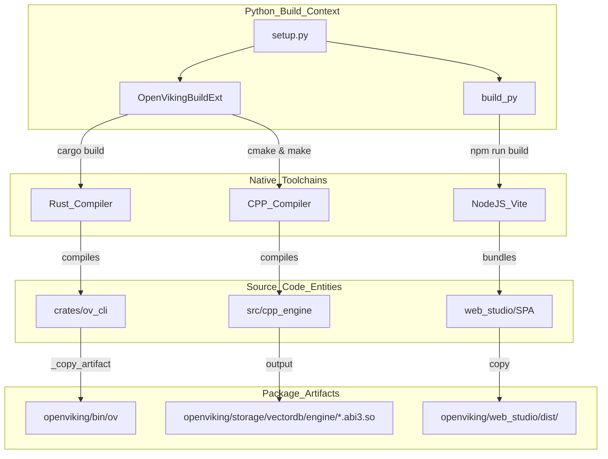

Sources: [setup.py:106-115](), [setup.py:176-187](), [Makefile:157-162]()

---

## Docker Installation

OpenViking provides a multi-stage `Dockerfile` that handles the complex toolchain requirements (Rust, Node.js, C++, Python) automatically.

### Docker Build Stages Data Flow

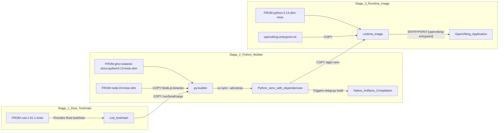

Sources: [Dockerfile:3-5](), [Dockerfile:8-17](), [Dockerfile:128-128]()

---

## Verification and Troubleshooting

### 1. Verify CLI and SDK
After installation, verify the presence of the native CLI and the SDK initialization:

```bash
# Check Rust CLI
ov --version

# Check SDK Initialization
python -c "import openviking; print(openviking.__name__)"
```

Sources: [pyproject.toml:206-207](), [openviking/pyagfs/__init__.py:1-3]()

### 2. Native Library Loading
OpenViking uses a dynamic loader to find the Rust `ragfs_python` bindings. It searches `openviking/lib/` for compatible `.so`, `.pyd`, or `.dylib` files.

*   **Logic**: `_find_ragfs_so()` checks for exact CPython ABI matches first, then falls back to `abi3` stable ABI artifacts [openviking/pyagfs/__init__.py:70-96]().
*   **Verification**: `get_binding_client()` will raise an `ImportError` if the native library is missing or incompatible [openviking/pyagfs/__init__.py:127-139]().

Sources: [openviking/pyagfs/__init__.py:49-140](), [tests/misc/test_pyagfs_loader.py:6-57]()

### 3. Common Build Issues

| Issue | Symptom | Resolution |
|-------|---------|------------|
| **Missing Cargo** | `RuntimeError: ov CLI build did not produce required ov` | Install Rust 1.91.1+ [setup.py:134-140]() |
| **Missing Node.js** | `[SKIP] npm not found; install Node.js to enable /studio` | Install Node.js for Web Studio [Makefile:152-153]() |
| **C++ Failure** | `CMAKE_CXX_COMPILER not found` | Install `build-essential` and `cmake` [Makefile:64-86]() |

Sources: [setup.py:134-140](), [Makefile:152-153](), [Dockerfile:25-30]()

### 4. Build Environment Variables

| Variable | Description |
|----------|-------------|
| `OV_SKIP_STUDIO_BUILD` | Set to `1` to skip building the Web Studio SPA [Makefile:148-149](). |
| `CARGO_TARGET_DIR` | Resolve the Cargo target directory for workspace builds [setup.py:154-156](). |
| `CC` / `CXX` | Override default C/C++ compiler paths [setup.py:32-33](). |

Sources: [setup.py:32-33](), [setup.py:154-156](), [Makefile:148-149]()


<!-- ===== PAGE: 2.2 Configuration ===== -->

# Configuration

<details>
<summary>Relevant source files</summary>

The following files were used as context for generating this wiki page:

- [bot/vikingbot/__init__.py](bot/vikingbot/__init__.py)
- [docker-compose.yml](docker-compose.yml)
- [docs/en/getting-started/02-quickstart.md](docs/en/getting-started/02-quickstart.md)
- [docs/en/guides/01-configuration.md](docs/en/guides/01-configuration.md)
- [docs/en/guides/03-deployment.md](docs/en/guides/03-deployment.md)
- [docs/en/guides/17-vikingbot.md](docs/en/guides/17-vikingbot.md)
- [docs/zh/getting-started/02-quickstart.md](docs/zh/getting-started/02-quickstart.md)
- [docs/zh/guides/01-configuration.md](docs/zh/guides/01-configuration.md)
- [docs/zh/guides/03-deployment.md](docs/zh/guides/03-deployment.md)
- [docs/zh/guides/17-vikingbot.md](docs/zh/guides/17-vikingbot.md)
- [examples/ov.conf.example](examples/ov.conf.example)
- [openviking/metrics/exporters/otel.py](openviking/metrics/exporters/otel.py)
- [openviking/metrics/global_api.py](openviking/metrics/global_api.py)
- [openviking/observability/context.py](openviking/observability/context.py)
- [openviking/server/bootstrap.py](openviking/server/bootstrap.py)
- [openviking/utils/media_processor.py](openviking/utils/media_processor.py)
- [openviking_cli/utils/config/__init__.py](openviking_cli/utils/config/__init__.py)
- [openviking_cli/utils/config/config_loader.py](openviking_cli/utils/config/config_loader.py)
- [openviking_cli/utils/config/open_viking_config.py](openviking_cli/utils/config/open_viking_config.py)
- [openviking_cli/utils/config/ovcli_config.py](openviking_cli/utils/config/ovcli_config.py)
- [openviking_cli/utils/config/storage_config.py](openviking_cli/utils/config/storage_config.py)
- [openviking_cli/utils/logger.py](openviking_cli/utils/logger.py)
- [tests/client/test_http_client_config.py](tests/client/test_http_client_config.py)
- [tests/misc/test_vikingfs_uri_guard.py](tests/misc/test_vikingfs_uri_guard.py)
- [tests/server/test_bootstrap.py](tests/server/test_bootstrap.py)
- [tests/server/test_prometheus_metrics.py](tests/server/test_prometheus_metrics.py)
- [tests/test_config_loader.py](tests/test_config_loader.py)
- [tests/test_task_backend_config.py](tests/test_task_backend_config.py)

</details>


This page documents OpenViking's configuration system, covering the structure and parameters of `ov.conf` (server/embedded mode) and `ovcli.conf` (HTTP client mode). Configuration controls AI models (embedding, VLM, rerank), storage backends (AGFS, VectorDB), and parsing behavior.

## Configuration Files Overview

OpenViking uses two JSON configuration files with distinct purposes:

| File | Purpose | Used By | Default Path |
|------|---------|---------|--------------|
| `ov.conf` | AI models, storage, server, and parser settings | SDK embedded mode, `openviking-server` | `~/.openviking/ov.conf` |
| `ovcli.conf` | Remote server connection settings | HTTP clients (`AsyncHTTPClient`, `SyncHTTPClient`), `ov` CLI | `~/.openviking/ovcli.conf` |

### Configuration Loading and Data Flow

The configuration is managed by the `OpenVikingConfig` class [openviking_cli/utils/config/open_viking_config.py:136-137](), which uses Pydantic for validation and defaults. The `OpenVikingConfigSingleton` ensures that a consistent configuration is accessible throughout the application lifecycle [openviking_cli/utils/config/open_viking_config.py:340-341]().

**Configuration Loading Hierarchy**

Title: Configuration Resolution Data Flow
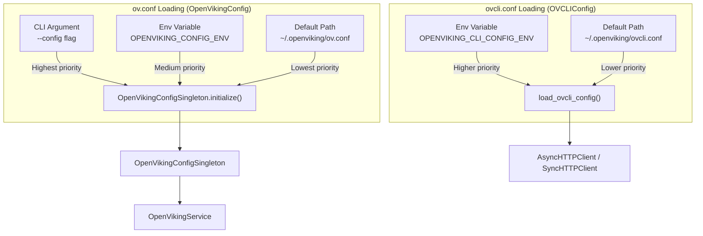

**Sources:** [openviking_cli/utils/config/open_viking_config.py:136-341](), [openviking_cli/utils/config/consts.py:16-21](), [openviking_cli/utils/config/config_loader.py:13-17](), [openviking/server/bootstrap.py:201-211]()

---

## ov.conf Structure

The `ov.conf` file is the central configuration for the core engine. It is structured into functional sections handled by specialized Pydantic models.

### Core Configuration Schema

Title: ov.conf Entity Mapping
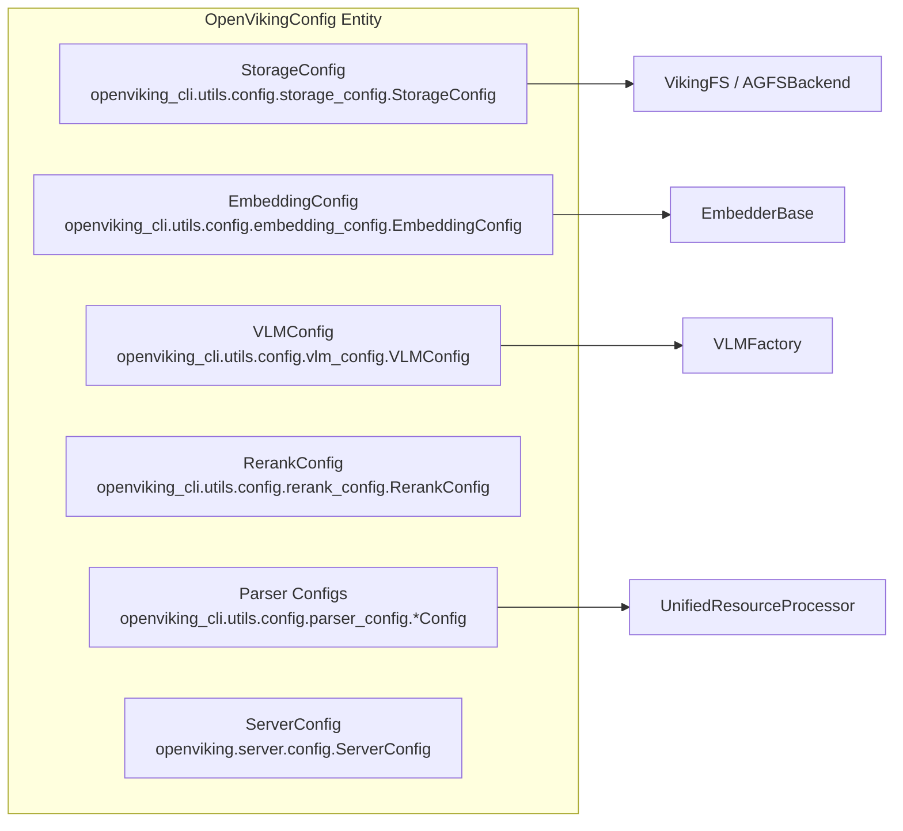

**Sources:** [openviking_cli/utils/config/open_viking_config.py:136-205](), [openviking_cli/utils/config/storage_config.py:1-43](), [openviking/utils/media_processor.py:65-77]()

---

## AI Provider Configuration

### Embedding Configuration

Controls vector embedding models for semantic search. Supports `dense`, `sparse`, and `hybrid` modes.

```json
{
  "embedding": {
    "max_concurrent": 10,
    "max_retries": 3,
    "text_source": "content_only",
    "dense": {
      "provider": "volcengine",
      "api_key": "your-api-key",
      "model": "doubao-embedding-vision-251215",
      "dimension": 1024,
      "input": "multimodal"
    },
    "circuit_breaker": {
      "failure_threshold": 5,
      "reset_timeout": 60,
      "max_reset_timeout": 600
    }
  }
}
```

**Key Parameters:**
- `max_retries`: Applies to transient errors (429, 5xx, timeouts). Permanent errors (400, 401, 403) are not retried [docs/en/guides/01-configuration.md:225-227]().
- `circuit_breaker`: When the provider experiences consecutive transient failures, OpenViking opens a circuit breaker to re-enqueue tasks [docs/en/guides/01-configuration.md:227-231]().
- `input`: Set to `"multimodal"` for Doubao models to support images and mixed content [docs/en/guides/01-configuration.md:203-204]().
- `provider`: Supports `openai`, `azure`, `volcengine`, `vikingdb`, `jina`, `ollama`, `gemini`, `voyage`, `dashscope`, `minimax`, `cohere`, `litellm`, or `local` [docs/en/guides/01-configuration.md:217-217]().

**Sources:** [docs/en/guides/01-configuration.md:185-258](), [examples/ov.conf.example:77-89](), [openviking_cli/utils/config/embedding_config.py:1-22]()

### VLM Configuration

The Vision Language Model is used for L0/L1 generation and memory extraction.

```json
{
  "vlm": {
    "provider": "volcengine",
    "api_key": "your-api-key",
    "model": "doubao-seed-2-0-pro-260215",
    "temperature": 0.0,
    "max_retries": 2,
    "thinking": false
  }
}
```

**Provider-Specific Options:**
- **OpenAI Codex**: Requires OAuth login via `openviking-server init` [docs/en/guides/01-configuration.md:104-125]().
- **Kimi/GLM**: Specialized coding models with automatic defaults [docs/en/guides/01-configuration.md:130-181]().

**Sources:** [examples/ov.conf.example:100-134](), [openviking_cli/utils/config/vlm_config.py:1-47]()

---

## Storage and Backend Configuration

### Workspace and Paths
The `workspace` field in `storage` is the primary configuration for local data. It is resolved via `resolve_config_path` during bootstrap [openviking/server/bootstrap.py:85-104]().

```json
{
  "storage": {
    "workspace": "./data",
    "agfs": { "backend": "local" },
    "vectordb": { "backend": "local", "name": "context" }
  }
}
```

**Sources:** [openviking_cli/utils/config/storage_config.py:1-43](), [openviking_cli/utils/config/agfs_config.py:1-12]()

### AGFS (Advanced Global File System)
Supports `local`, `s3`, and `memory` backends. The `RagfsBindingConfig` class manages the runtime configuration for the AGFS layer, including optional encryption [openviking/utils/agfs_utils.py:23-50]().

| Backend | Key Config Fields |
|---------|-----------------|
| `local` | `workspace` |
| `s3`    | `bucket`, `region`, `access_key`, `secret_key`, `endpoint`, `use_path_style` |
| `memory`| N/A |

**S3 Details**: `use_path_style` is used for MinIO (true) while `VirtualHostStyle` is used for TOS (false) [openviking_cli/utils/config/agfs_config.py:59-62](). `normalize_encoding_chars` defaults to `?#%+@` to escape special characters in S3 keys [openviking_cli/utils/config/agfs_config.py:76-80]().

**Sources:** [examples/ov.conf.example:61-75](), [openviking_cli/utils/config/agfs_config.py:23-107](), [openviking/utils/agfs_utils.py:92-116]()

### Vector Database
Supports `local` (Chroma/SQLite based), `volcengine` (VikingDB), and `vikingdb` (private).

**Volcengine VikingDB Config:**
Requires `ak`, `sk`, `region`, and `host` [examples/ov.conf.example:52-59]().

**Sources:** [examples/ov.conf.example:46-60](), [openviking_cli/utils/config/storage_config.py:1-43]()

---

## Parser Configuration

OpenViking features granular configuration for different file types under the `parsers` section.

### PDF and Code Parsing
```json
{
  "pdf": {
    "strategy": "auto",
    "max_content_length": 100000,
    "mineru_endpoint": "https://mineru.example.com/api/v1"
  },
  "code": {
    "code_summary_mode": "ast",
    "extract_functions": true,
    "extract_classes": true,
    "include_comments": true
  }
}
```

### Semantic Processing
Configures character limits for L0 (abstract) and L1 (overview) generation.
- `auto_generate_l0`: Automatically generate abstract if missing (default: true) [examples/ov.conf.example:155-155]().
- `auto_generate_l1`: Automatically generate overview if missing (default: true) [examples/ov.conf.example:156-156]().

**Sources:** [openviking_cli/utils/config/open_viking_config.py:188-205](), [examples/ov.conf.example:173-205]()

---

## Server and Observability

Configured in the `server` block of `ov.conf`.

| Parameter | Description |
|-----------|-------------|
| `host` | Bind address (e.g., `0.0.0.0`) [examples/ov.conf.example:3-3]() |
| `port` | Port (default `1933`) [examples/ov.conf.example:4-4]() |
| `root_api_key` | Master key for admin operations [examples/ov.conf.example:5-5]() |
| `observability` | Configures metrics (Prometheus/OTLP), Traces, and Logs [examples/ov.conf.example:7-44]() |

**Logging:** The `LogConfig` handles rotation and output levels [examples/ov.conf.example:191-196](). Logging utilities integrate with OpenTelemetry for trace propagation [openviking_cli/utils/logger.py:77-139]().

**Sources:** [examples/ov.conf.example:2-45](), [openviking/server/bootstrap.py:126-199](), [openviking_cli/utils/logger.py:1-60]()

---

## ovcli.conf Reference

Used by the `ov` CLI and HTTP clients to connect to a remote instance. It contains identity headers and connection strings.

```json
{
  "url": "http://localhost:1933",
  "api_key": "your-user-key",
  "account": "default",
  "user": "default"
}
```

**Sources:** [openviking_cli/utils/config/ovcli_config.py:1-40](), [openviking_cli/utils/config/consts.py:26-27]()


<!-- ===== PAGE: 2.3 Quick Start Examples ===== -->

# Quick Start Examples

<details>
<summary>Relevant source files</summary>

The following files were used as context for generating this wiki page:

- [docker-compose.yml](docker-compose.yml)
- [docs/en/getting-started/02-quickstart.md](docs/en/getting-started/02-quickstart.md)
- [docs/en/getting-started/03-quickstart-server.md](docs/en/getting-started/03-quickstart-server.md)
- [docs/en/guides/01-configuration.md](docs/en/guides/01-configuration.md)
- [docs/en/guides/03-deployment.md](docs/en/guides/03-deployment.md)
- [docs/en/guides/17-vikingbot.md](docs/en/guides/17-vikingbot.md)
- [docs/zh/getting-started/02-quickstart.md](docs/zh/getting-started/02-quickstart.md)
- [docs/zh/getting-started/03-quickstart-server.md](docs/zh/getting-started/03-quickstart-server.md)
- [docs/zh/guides/01-configuration.md](docs/zh/guides/01-configuration.md)
- [docs/zh/guides/03-deployment.md](docs/zh/guides/03-deployment.md)
- [docs/zh/guides/17-vikingbot.md](docs/zh/guides/17-vikingbot.md)
- [examples/basic-usage/README.md](examples/basic-usage/README.md)
- [examples/basic-usage/README_CN.md](examples/basic-usage/README_CN.md)
- [examples/basic-usage/basic_usage.py](examples/basic-usage/basic_usage.py)
- [examples/ov.conf.example](examples/ov.conf.example)

</details>


This page provides practical, code-first examples for interacting with OpenViking using its primary interfaces: the **Embedded Python SDK** (in-process), the **HTTP Client SDK** (remote server), and the **CLI** (shell). These examples demonstrate core workflows including resource ingestion, hierarchical context access (L0/L1/L2), semantic search, and session-based memory management.

## 1. Quick Start Overview

OpenViking is an agent-native context database that treats data as a managed filesystem. Whether using the SDK or CLI, the lifecycle follows a consistent pattern: **Ingest → Process → Retrieve**.

### Interface Selection

| Mode | Use Case | Implementation Class |
| :--- | :--- | :--- |
| **Embedded** | Local development, single-process scripts, or embedded agent memory. | `ov.OpenViking` (Sync/Async) |
| **HTTP Client** | Production deployments, multi-agent shared memory, or remote cloud access. | `ov.SyncHTTPClient` or `ov.AsyncHTTPClient` |
| **CLI** | Manual inspection, administrative tasks, and shell scripting. | `openviking` / `ov` (Rust-based binary) |

Sources: [examples/basic-usage/README.md:23-27](), [examples/basic-usage/basic_usage.py:44-49]()

### Code Entity Space to Natural Language Space

The following diagram bridges high-level agent requirements to the specific classes and functions used in the codebase.

Title: Mapping Agent Concepts to OpenViking Code Entities
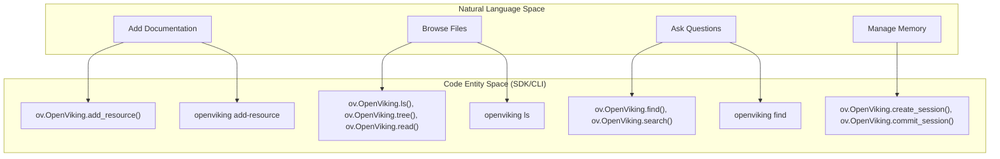
Sources: [examples/basic-usage/README.md:10-17](), [examples/basic-usage/basic_usage.py:5-11](), [docs/en/getting-started/02-quickstart.md:162-207]()

---

## 2. Python SDK Examples

The Python SDK provides a unified interface. The `OpenViking` class (embedded) and `SyncHTTPClient` (remote) share a nearly identical API, making it easy to transition from local prototyping to production.

### 2.1 Basic Resource Workflow
This example demonstrates ingesting a remote URL and accessing its hierarchical context (L0/L1/L2).

```python
import openviking as ov

# 1. Initialize (Embedded Mode)
# 'path' specifies the local workspace for VikingFS and VectorDB
client = ov.OpenViking(path="./data")
client.initialize() 

try:
    # 2. Add Resource (URL, File, or Directory)
    # Returns a root_uri like viking://resources/README/
    print("Wait for semantic processing...")
    add_result = client.add_resource(
        path="https://raw.githubusercontent.com/volcengine/OpenViking/refs/heads/main/README.md",
        wait=True # Blocking wait until L0/L1/L2 processing completes
    )
    root_uri = add_result['root_uri']

    # 3. Hierarchical Context Access
    # Explore the resource tree structure
    ls_result = client.ls(root_uri)
    print(f"Directory structure:\n{ls_result}\n")

    # Use glob to find markdown files
    glob_result = client.glob(pattern="**/*.md", uri=root_uri)
    if glob_result['matches']:
        content = client.read(glob_result['matches'][0])
        print(f"Content preview: {content[:200]}...\n")

    # Get abstract and overview of the resource
    abstract = client.abstract(root_uri) # ~100 tokens (summary)
    overview = client.overview(root_uri) # ~2k tokens (key points)
    print(f"Abstract:\n{abstract}\n\nOverview:\n{overview}\n")

    # 4. Semantic Search (find)
    # Returns ranked list of URIs with similarity scores
    results = client.find("what is openviking", target_uri=root_uri)
    print("Search results:")
    for r in results.resources:
        print(f"  {r.uri} (score: {r.score:.4f})")

finally:
    client.close()
```
Sources: [docs/en/getting-started/02-quickstart.md:162-207](), [examples/basic-usage/basic_usage.py:71-181]()

### 2.2 Session and Memory Management
Sessions track agent-user interactions and allow the extraction of durable memories via VLM.

```python
import openviking as ov
client = ov.SyncHTTPClient(url="http://localhost:1933")
client.initialize()

# 1. Create a session
session_info = client.create_session()
session_id = session_info["session_id"]

# 2. Add messages to context
client.add_message(session_id, "user", "I prefer TypeScript over JavaScript")
client.add_message(session_id, "assistant", "Understood. I will prioritize TypeScript.")

# 3. Commit session to extract long-term memory
# This triggers VLM processing to store facts in viking://user/memories/
client.commit_session(session_id)

# 4. Retrieve memory later via semantic search
memories = client.find(
    query="user programming preferences", 
    target_uri="viking://user/memories/"
)
```
Sources: [examples/basic-usage/README.md:192-218](), [examples/basic-usage/basic_usage.py:228-258]()

---

## 3. CLI Examples

The `openviking` CLI is used for shell-based interaction. It reads connection settings from `ovcli.conf`.

### 3.1 Server Setup and CLI Configuration
Start the server and configure the client connection:

```bash
# 1. Initialize and start the server
openviking-server init
openviking-server

# 2. Configure CLI connection (~/.openviking/ovcli.conf)
# {
#   "url": "http://localhost:1933",
#   "api_key": "your-key"
# }

# 3. Verify connection
openviking observer system
```
Sources: [docs/en/guides/03-deployment.md:7-25](), [docs/en/getting-started/03-quickstart-server.md:132-147]()

### 3.2 Common CLI Operations

| Operation | Command | Description |
| :--- | :--- | :--- |
| **Add Resource** | `openviking add-resource <path_or_url>` | Ingests a file/URL into the context database. |
| **List Resources**| `openviking ls viking://resources` | Lists all indexed resource roots. |
| **Semantic Find** | `openviking find "query text"` | Performs a semantic search across resources. |
| **File Tree** | `openviking ls -R viking://resources/...`| Shows the recursive structure of a resource. |

Sources: [docs/en/getting-started/03-quickstart-server.md:143-153](), [docs/en/guides/03-deployment.md:170-175]()

---

## 4. Authentication and Multi-Tenancy

OpenViking uses a two-tier API Key system (`user_key` and `root_key`) to enforce data isolation between accounts and users.

Title: OpenViking Authentication and Multi-Tenancy Data Flow
```mermaid
graph TD
    subgraph "AuthContext"["Auth Context (RequestContext)"]
    RK["root_key (Admin)"]
    UK["user_key (Tenant)"]
    end

    subgraph "StorageBackends"["VikingFS / VikingVectorIndexBackend"]
    R["viking://resources/ (Shared/Tenant Knowledge)"]
    U["viking://user/ (Private Memories)"]
    S["viking://session/ (Short-term Context)"]
    end

    RK -->|"Requires account/user headers"| R
    RK -->|"Requires account/user headers"| U
    UK -->|"Implicit account/user scope"| R
    UK -->|"Implicit account/user scope"| U
    UK -->|"Implicit account/user scope"| S
```
Sources: [docs/en/getting-started/03-quickstart-server.md:64-102](), [docs/en/guides/03-deployment.md:200-212]()

### HTTP Client with Authentication
Standard data access should always use a `user_key` or `admin_key` to ensure proper tenant scoping. Using `root_key` for tenant-scoped data APIs without explicit identity assertion returns `PERMISSION_DENIED`.

```python
import openviking as ov

# Using a User Key (Implicit Multi-tenancy)
client = ov.SyncHTTPClient(
    url="http://localhost:1933",
    api_key="sk-user-xxxx"
)

# Root Key access (Requires explicit identity assertion)
# Generally used for management, not standard data access.
admin_client = ov.SyncHTTPClient(
    url="http://localhost:1933",
    api_key="sk-root-xxxx"
)
```
Sources: [docs/en/getting-started/03-quickstart-server.md:66-99](), [examples/basic-usage/README.md:107-118]()

---

## 5. Deployment Options

OpenViking can be deployed as a standalone server, a managed service, or a Docker container.

### 5.1 Docker Deployment
The recommended way to run a shared service is via Docker, which bundles the API server, Web Studio, and VikingBot.

```bash
docker run -d \
  --name openviking \
  -p 1933:1933 \
  -v ~/.openviking:/app/.openviking \
  -e OPENVIKING_CONF_CONTENT="$(cat ~/.openviking/ov.conf)" \
  ghcr.io/volcengine/openviking:latest
```
Sources: [docs/en/guides/03-deployment.md:185-207](), [docker-compose.yml:16-33]()

### 5.2 Systemd Service
For Linux production environments, a Systemd unit ensures the server starts on boot and restarts on failure.

```ini
[Unit]
Description=OpenViking HTTP Server
After=network.target

[Service]
Type=simple
WorkingDirectory=/var/lib/openviking
ExecStart=/usr/bin/openviking-server
Restart=always
RestartSec=5
Environment="OPENVIKING_CONFIG_FILE=/etc/openviking/ov.conf"

[Install]
WantedBy=multi-user.target
```
Sources: [docs/en/guides/03-deployment.md:94-116]()1f:T


<!-- ===== PAGE: 2.4 Deployment Modes ===== -->

# Deployment Modes

<details>
<summary>Relevant source files</summary>

The following files were used as context for generating this wiki page:

- [.github/workflows/build-docker-image.yml](.github/workflows/build-docker-image.yml)
- [.gitignore](.gitignore)
- [Dockerfile](Dockerfile)
- [Makefile](Makefile)
- [bot/deploy/vke/k8s/deployment.yaml](bot/deploy/vke/k8s/deployment.yaml)
- [crates/ragfs-python/Cargo.toml](crates/ragfs-python/Cargo.toml)
- [deploy/helm/README.md](deploy/helm/README.md)
- [deploy/helm/openviking/.helmignore](deploy/helm/openviking/.helmignore)
- [deploy/helm/openviking/Chart.yaml](deploy/helm/openviking/Chart.yaml)
- [deploy/helm/openviking/templates/NOTES.txt](deploy/helm/openviking/templates/NOTES.txt)
- [deploy/helm/openviking/templates/_helpers.tpl](deploy/helm/openviking/templates/_helpers.tpl)
- [deploy/helm/openviking/templates/configmap.yaml](deploy/helm/openviking/templates/configmap.yaml)
- [deploy/helm/openviking/templates/deployment.yaml](deploy/helm/openviking/templates/deployment.yaml)
- [deploy/helm/openviking/templates/ingress.yaml](deploy/helm/openviking/templates/ingress.yaml)
- [deploy/helm/openviking/templates/pvc.yaml](deploy/helm/openviking/templates/pvc.yaml)
- [deploy/helm/openviking/templates/service.yaml](deploy/helm/openviking/templates/service.yaml)
- [deploy/helm/openviking/templates/serviceaccount.yaml](deploy/helm/openviking/templates/serviceaccount.yaml)
- [deploy/helm/openviking/values.yaml](deploy/helm/openviking/values.yaml)
- [docker-compose.yml](docker-compose.yml)
- [docs/en/getting-started/02-quickstart.md](docs/en/getting-started/02-quickstart.md)
- [docs/en/guides/01-configuration.md](docs/en/guides/01-configuration.md)
- [docs/en/guides/03-deployment.md](docs/en/guides/03-deployment.md)
- [docs/en/guides/17-vikingbot.md](docs/en/guides/17-vikingbot.md)
- [docs/zh/getting-started/02-quickstart.md](docs/zh/getting-started/02-quickstart.md)
- [docs/zh/guides/01-configuration.md](docs/zh/guides/01-configuration.md)
- [docs/zh/guides/03-deployment.md](docs/zh/guides/03-deployment.md)
- [docs/zh/guides/17-vikingbot.md](docs/zh/guides/17-vikingbot.md)
- [examples/k8s-helm/templates/deployment.yaml](examples/k8s-helm/templates/deployment.yaml)
- [examples/multi_tenant/admin_workflow.sh](examples/multi_tenant/admin_workflow.sh)
- [examples/ov.conf.example](examples/ov.conf.example)
- [openviking/pyagfs/__init__.py](openviking/pyagfs/__init__.py)
- [openviking/pyagfs/exceptions.py](openviking/pyagfs/exceptions.py)
- [setup.py](setup.py)
- [tests/misc/test_abi3_packaging_config.py](tests/misc/test_abi3_packaging_config.py)
- [tests/misc/test_docker_workflow_native_multiarch.py](tests/misc/test_docker_workflow_native_multiarch.py)
- [tests/misc/test_pyagfs_loader.py](tests/misc/test_pyagfs_loader.py)
- [tests/misc/test_root_docker_image_packaging.py](tests/misc/test_root_docker_image_packaging.py)

</details>


## Purpose and Scope

OpenViking is designed as an agent-native context database that supports flexible deployment topologies. This document explains the various deployment modes available—from local embedded SDKs to cloud-native Kubernetes clusters—and provides technical details on their implementation, data flow, and configuration.

Key deployment options covered:
- **Embedded Mode (SDK)**: Direct in-process integration for Python applications.
- **HTTP Client-Server Mode**: Distributed architecture using the `openviking-server`.
- **Docker Deployment**: Containerized execution with multi-arch support and persistent volumes.
- **Kubernetes with Helm**: Scalable orchestration for cloud environments with PVC support.
- **Systemd Service**: Managed background process for standard Linux environments.
- **Public HTTPS Access**: Reverse proxy configuration (Caddy/Nginx) for OAuth and MCP.

---

## Deployment Architecture Overview

OpenViking uses a unified service layer (`OpenVikingService`) that can be accessed either directly via Python objects or over the network via a FastAPI-based REST API.

```mermaid
graph TB
    subgraph "Client_Space"
        SDK["Python_SDK<br/>(AsyncOpenViking)"]
        CLI["Rust_CLI<br/>(ov)"]
        HTTP_Client["HTTP_Client<br/>(SyncHTTPClient)"]
    end

    subgraph "Server_Space_(HTTP_Mode)"
        FastAPI["FastAPI_App<br/>(openviking-server)"]
        Auth["APIKeyManager"]
        ServiceLayer["OpenVikingService"]
    end

    subgraph "Storage_&_AI_Layer"
        VikingFS["VikingFS_/_AGFS"]
        VectorDB["VikingVectorIndexBackend"]
        LLM["VLM_/_Embedding_Providers"]
    end

    SDK -- "Direct_Call" --> ServiceLayer
    CLI -- "HTTP/JSON" --> FastAPI
    HTTP_Client -- "HTTP/JSON" --> FastAPI
    
    FastAPI --> Auth
    Auth --> ServiceLayer
    
    ServiceLayer --> VikingFS
    ServiceLayer --> VectorDB
    ServiceLayer --> LLM

    style ServiceLayer stroke-width:4px
```

**Diagram: Logical Architecture and Entity Mapping**
This diagram bridges the "Natural Language Space" of deployment modes to the "Code Entity Space". `AsyncOpenViking` provides the embedded entry point, while `openviking-server` provides the network entry point.

Sources: `[docs/en/guides/03-deployment.md:1-40]()`, `[docs/en/getting-started/02-quickstart.md:135-187]()`

---

## 1. Embedded Mode (SDK)

In Embedded Mode, the OpenViking engine runs inside the caller's Python process. This is the lowest-latency mode and requires no external server process.

### Implementation Details
The Python SDK allows initializing a local instance by pointing to a data directory. This instantiates the core service components directly in the application's memory space.

- **Initialization**: `client = ov.OpenViking(path="./data")` `[docs/en/getting-started/02-quickstart.md:145-145]()`.
- **Lifecycle**: The client must be explicitly initialized using `client.initialize()` `[docs/en/getting-started/02-quickstart.md:149-149]()` and closed via `client.close()` `[docs/en/getting-started/02-quickstart.md:183-183]()`.
- **Data Flow**: Python Call → Service Layer → Local File/Vector Storage.
- **Native Extensions**: The embedded mode loads `ragfs_python` native extensions (Rust) from `openviking/lib/` `[Makefile:115-127]()`. The loader attempts to find a compatible `.so`, `.dylib`, or `.pyd` file based on the Python ABI `[Makefile:127-127]()`.

### Use Case
Ideal for Jupyter notebooks, local desktop agents (like OpenClaw), or single-tenant applications where network overhead is undesirable and the agent has direct access to the storage volume.

Sources: `[docs/en/getting-started/02-quickstart.md:135-187]()`, `[docs/en/guides/03-deployment.md:70-88]()`, `[Makefile:115-127]()`

---

## 2. HTTP Client-Server Mode

HTTP mode decouples the client from the server, allowing multiple clients (Python SDK, Rust CLI, or generic `curl` commands) to connect to a centralized OpenViking instance.

### Server Implementation
The server is started via the `openviking-server` command `[docs/en/guides/03-deployment.md:9-17]()`. It reads configuration from `ov.conf`, which specifies binding details:
- **Host**: Default `127.0.0.1` (can be overridden to `0.0.0.0` in config) `[docs/en/guides/03-deployment.md:32-32]()`.
- **Port**: Default `1933` `[docs/en/guides/03-deployment.md:33-33]()`.
- **Security**: Controlled by `root_api_key` in the `server` section `[docs/en/guides/03-deployment.md:59-59]()`.

### Data Flow
1. Client (e.g., `SyncHTTPClient`) sends an HTTP request with an `X-API-Key` header `[docs/en/guides/03-deployment.md:146-150]()`.
2. The server validates the token and determines the `RequestContext`.
3. The request is routed to the corresponding service method (e.g., `/api/v1/fs/ls` for file listing) `[docs/en/guides/03-deployment.md:179-180]()`.

```mermaid
sequenceDiagram
    participant Client as "SyncHTTPClient"
    participant Server as "openviking-server"
    participant Service as "OpenVikingService"

    Client->>Server: "POST /api/v1/search/find"
    Note over Server: "Validate X-API-Key"
    Server->>Service: "find(query, context)"
    Service-->>Server: "SearchResults"
    Server-->>Client: "JSON {results: [...]}"
```

Sources: `[docs/en/guides/03-deployment.md:1-68]()`, `[docs/en/guides/03-deployment.md:139-180]()`

---

## 3. Docker Deployment

OpenViking provides a multi-stage `Dockerfile` that builds the Python environment, Rust CLI, and C++ extensions into a single runtime image.

### Image Components
- **Build Stages**: Uses a Rust toolchain stage `[Dockerfile:3-5]()` and a Python builder stage with `uv` `[Dockerfile:8-12]()` to compile native components.
- **Web Studio**: Node.js is used during build to compile the React SPA `[Dockerfile:13-17]()`.
- **Runtime**: Based on `python:3.13-slim-trixie` `[Dockerfile:94]()`.
- **Entrypoint**: `openviking-entrypoint` `[Dockerfile:128]()` starts the API server and optional bot gateway.
- **Persistence**: All state is stored in `/app/.openviking` `[Dockerfile:108-113]()`.

### Running with Docker Compose
A `docker-compose.yml` is provided for easy setup with persistent volumes:
```yaml
services:
  openviking:
    image: ghcr.io/volcengine/openviking:latest
    ports:
      - "1933:1933"
    volumes:
      - ~/.openviking:/app/.openviking
```
Sources: `[Dockerfile:1-129]()`, `[docker-compose.yml:16-33]()`, `[docs/en/guides/03-deployment.md:185-265]()`

---

## 4. Kubernetes with Helm

For production-grade cloud environments, OpenViking provides a Helm chart located in `deploy/helm/openviking/`.

### Key Features
- **Persistence**: Supports `PersistentVolumeClaim` (PVC) for storing RAGFS and vector data `[deploy/helm/openviking/templates/pvc.yaml:1-20]()`. The mount path defaults to `/app/.openviking` `[deploy/helm/openviking/values.yaml:76-76]()`.
- **Config Management**: Renders `ov.conf` into a `ConfigMap` `[deploy/helm/openviking/templates/configmap.yaml:1-15]()`.
- **Ingress**: Provides an `Ingress` resource for external access to the API and Web Studio `[deploy/helm/openviking/templates/ingress.yaml:1-35]()`.
- **Probes**: Uses `/health` for liveness and `/ready` for readiness checks `[deploy/helm/openviking/values.yaml:137-153]()`.

### Installation
```bash
helm install openviking ./deploy/helm/openviking \
  --set config.server.root_api_key="YOUR_KEY"
```

Sources: `[deploy/helm/openviking/values.yaml:1-158]()`, `[deploy/helm/openviking/templates/deployment.yaml:1-100]()`

---

## 5. Systemd Service Configuration

On standard Linux VMs, Systemd is the recommended way to manage OpenViking as a background daemon with auto-restart capabilities.

### Service Configuration
The service file should be created at `/etc/systemd/system/openviking.service` `[docs/en/guides/03-deployment.md:98-117]()`:
- **Type**: `simple`
- **ExecStart**: Path to the `openviking-server` binary `[docs/en/guides/03-deployment.md:108-108]()`.
- **Restart**: `always` with a 5-second delay `[docs/en/guides/03-deployment.md:109-110]()`.
- **Environment**: Sets `OPENVIKING_CONFIG_FILE` to point to the configuration `[docs/en/guides/03-deployment.md:112-112]()`.

### Management
Users can manage the service using standard `systemctl` commands for `daemon-reload`, `start`, and `enable` `[docs/en/guides/03-deployment.md:125-134]()`.

Sources: `[docs/en/guides/03-deployment.md:90-137]()`

---

## 6. Public HTTPS Access and Reverse Proxy

For OAuth 2.1 consent flows and MCP (Model Context Protocol) clients, OpenViking requires a public HTTPS endpoint.

### Caddy Reverse Proxy
The `docker-compose.yml` includes a Caddy service to handle TLS termination and reverse proxying to the OpenViking API `[docker-compose.yml:41-60]()`.

- **Public URL**: Configured via `OPENVIKING_PUBLIC_BASE_URL` environment variable `[docker-compose.yml:26-26]()`.
- **Legacy Port**: Port `1934` is retained for backward compatibility, proxying to the main service on `1933` `[docker-compose.yml:35-46]()`.
- **ACME**: Caddy automatically manages certificates using the email provided in `OV_ACME_EMAIL` `[docker-compose.yml:57-57]()`.

### Implementation Details
When `OPENVIKING_PUBLIC_BASE_URL` is set, the server uses this as the base for generating OAuth redirect URIs and MCP metadata. The `caddy` service depends on the `openviking` service `[docker-compose.yml:58-59]()`.

Sources: `[docker-compose.yml:1-65]()`, `[docs/en/guides/03-deployment.md:328-330]()`

---

## Summary of Ports and Health Checks

| Endpoint | Default Port | Auth Required | Purpose |
|----------|--------------|---------------|---------|
| `/health`| 1933 | No | Liveness probe (returns `{"status": "ok"}`) `[docs/en/guides/03-deployment.md:23-25]()` |
| `/ready` | 1933 | No | Readiness probe for Kubernetes `[deploy/helm/openviking/values.yaml:148-149]()` |
| API | 1933 | Yes (API Key) | Primary REST API endpoint `[Dockerfile:115]()` |
| Web Studio| 1933/studio | Yes (API Key) | Web management UI (served by API server) `[docs/en/guides/03-deployment.md:199-199]()` |
| Caddy Proxy| 1934 | Varies | Legacy reverse proxy port for existing deployments `[docker-compose.yml:46-46]()` |

Sources: `[docs/en/guides/03-deployment.md:185-210]()`, `[Dockerfile:115-118]()`, `[docker-compose.yml:35-46]()`20:T3e75


<!-- ===== PAGE: 3 Core Architecture ===== -->

# Core Architecture

<details>
<summary>Relevant source files</summary>

The following files were used as context for generating this wiki page:

- [crates/ov_cli/src/commands/admin.rs](crates/ov_cli/src/commands/admin.rs)
- [crates/ov_cli/src/commands/mod.rs](crates/ov_cli/src/commands/mod.rs)
- [docs/en/api/08-admin.md](docs/en/api/08-admin.md)
- [docs/en/guides/04-authentication.md](docs/en/guides/04-authentication.md)
- [docs/zh/api/08-admin.md](docs/zh/api/08-admin.md)
- [docs/zh/guides/04-authentication.md](docs/zh/guides/04-authentication.md)
- [openviking/server/app.py](openviking/server/app.py)
- [openviking/server/auth/plugins/trusted.py](openviking/server/auth/plugins/trusted.py)
- [openviking/server/config.py](openviking/server/config.py)
- [openviking/server/routers/__init__.py](openviking/server/routers/__init__.py)
- [openviking/server/routers/admin.py](openviking/server/routers/admin.py)
- [openviking/server/routers/tasks.py](openviking/server/routers/tasks.py)
- [openviking/service/core.py](openviking/service/core.py)
- [openviking/service/task_tracker.py](openviking/service/task_tracker.py)
- [openviking/storage/queuefs/queue_manager.py](openviking/storage/queuefs/queue_manager.py)
- [tests/server/test_admin_api.py](tests/server/test_admin_api.py)
- [tests/server/test_auth.py](tests/server/test_auth.py)
- [tests/test_session_task_tracking.py](tests/test_session_task_tracking.py)
- [tests/test_task_tracker.py](tests/test_task_tracker.py)

</details>


OpenViking implements a multi-layered architecture that separates client interfaces, business logic, storage abstraction, and backend implementations. This design enables flexible deployment modes (embedded, HTTP server, CLI) while providing a unified context management interface for AI agents.

This page provides a technical overview of the core architecture. For detailed information about specific components, see the sub-pages:
- **System Overview** ([System Overview](#3.1)) — `OpenVikingService` initialization, component orchestration, service registry.
- **Client Layer** ([Client Layer](#3.2)) — Client architecture, `BaseClient` interface, embedded vs HTTP modes.
- **Service Layer** ([Service Layer](#3.3)) — Service responsibilities (`FSService`, `ResourceService`, `SearchService`, etc.).
- **Viking Filesystem** ([Viking Filesystem (VikingFS)](#3.4)) — `VikingFS` abstraction, URI handling, AGFS integration.
- **Vector Database Layer** ([Vector Database Layer](#3.5)) — `VikingVectorIndexBackend`, multi-tenancy, collection adapters.
- **Three-Level Context Model** ([Three-Level Context Model (L0/L1/L2)](#3.6)) — L0/L1/L2 hierarchical model, progressive loading.
- **Data Flow Pipeline** ([Data Flow and Processing Pipeline](#3.7)) — End-to-end resource processing, queue-based async operations.

---

## System Architecture Overview

OpenViking's architecture consists of four primary layers that work together to provide context management for AI agents.

### High-Level Component Diagram

```mermaid
graph TB
    subgraph ClientLayer["Client Layer"]
        AsyncOpenViking["AsyncOpenViking<br/>async_client.py"]
        SyncOpenViking["SyncOpenViking<br/>sync_client.py"]
        AsyncHTTPClient["AsyncHTTPClient<br/>openviking_cli/client/http.py"]
        OvCLI["ov CLI<br/>crates/ov_cli/src/main.rs"]
    end
    
    subgraph ServiceLayer["Service Layer - openviking/service/"]
        OpenVikingService["OpenVikingService<br/>service/core.py"]
        FSService["FSService<br/>service/fs_service.py"]
        ResourceService["ResourceService<br/>service/resource_service.py"]
        SearchService["SearchService<br/>service/search_service.py"]
        SessionService["SessionService<br/>service/session_service.py"]
        RelationService["RelationService<br/>service/relation_service.py"]
        PackService["PackService<br/>service/pack_service.py"]
        DebugService["DebugService<br/>service/debug_service.py"]
        TaskTracker["TaskTracker<br/>service/task_tracker.py"]
    end
    
    subgraph InfraLayer["Infrastructure Layer - openviking/storage/"]
        VikingFS["VikingFS<br/>storage/viking_fs.py"]
        VikingDBManager["VikingDBManager<br/>storage/vikingdb_manager.py"]
        QueueManager["QueueManager<br/>storage/queuefs/queue_manager.py"]
        LockManager["LockManager<br/>storage/transaction/"]
    end
    
    subgraph BackendLayer["Backend Implementations"]
        AGFSClient["AsyncAGFSClient<br/>pyagfs/"]
        VikingVectorBackend["VikingVectorIndexBackend<br/>storage/viking_vector_index_backend.py"]
        CollectionAdapters["Collection Adapters<br/>storage/vectordb_adapters/"]
    end
    
    subgraph AIServices["AI/ML Services"]
        Embedder["EmbedderBase<br/>models/embedder/base.py"]
        VLMProvider["VLMProvider<br/>config/vlm_config.py"]
    end
    
    AsyncOpenViking --> OpenVikingService
    SyncOpenViking --> AsyncOpenViking
    AsyncHTTPClient --> OpenVikingService
    OvCLI --> AsyncHTTPClient
    
    OpenVikingService --> FSService
    OpenVikingService --> ResourceService
    OpenVikingService --> SearchService
    OpenVikingService --> SessionService
    OpenVikingService --> RelationService
    OpenVikingService --> PackService
    OpenVikingService --> DebugService
    OpenVikingService --> TaskTracker
    
    FSService --> VikingFS
    ResourceService --> VikingFS
    ResourceService --> VikingDBManager
    SearchService --> VikingFS
    SessionService --> VikingFS
    RelationService --> VikingFS
    
    VikingFS --> VikingDBManager
    VikingDBManager --> QueueManager
    VikingDBManager --> VikingVectorBackend
    VikingVectorBackend --> CollectionAdapters
    
    ResourceService --> Embedder
    ResourceService --> VLMProvider
    SessionService --> VLMProvider
```

**Sources:** [openviking/service/core.py:52-102](), [openviking/service/task_tracker.py:75-101](), [openviking/storage/queuefs/queue_manager.py:24-60]()

### Architecture Layers

| Layer | Responsibility | Key Components | Details |
|-------|---------------|----------------|---------|
| **Client Layer** | User-facing APIs, protocol adapters | `AsyncOpenViking`, `SyncOpenViking`, `AsyncHTTPClient`, `ov` CLI | See page 3.2 |
| **Service Layer** | Business logic orchestration, resource lifecycle | `OpenVikingService`, `FSService`, `ResourceService`, `SearchService`, `SessionService`, `TaskTracker` | See page 3.3 |
| **Infrastructure Layer** | Storage abstraction, async processing, multi-tenancy | `VikingFS`, `VikingDBManager`, `QueueManager`, `LockManager` | See pages 3.4, 3.5 |
| **Backend Layer** | Physical storage, indexing, embedding computation | AGFS Client (Go binding), VectorBackend adapters | See pages 3.4, 3.5 |
| **AI/ML Services** | Embedding generation, VLM interactions | `EmbedderBase` hierarchy, VLM providers | See page 4.5 |

**Sources:** [openviking/service/core.py:52-123](), [openviking/storage/viking_fs.py:189-202](), [openviking/storage/viking_vector_index_backend.py:105-141](), [openviking/service/task_tracker.py:138-160]()

---

## Component Interaction and Data Flow

### Request Processing Flow

The following diagram illustrates how different components interact during typical operations. For detailed initialization lifecycle and service orchestration, see page 3.1.

```mermaid
sequenceDiagram
    participant Client as "BaseClient (SDK/CLI)"
    participant OVS as "OpenVikingService"
    participant RS as "ResourceService"
    participant VFS as "VikingFS"
    participant AGFS as "AsyncAGFSClient"
    participant VDBM as "VikingDBManager"
    participant QM as "QueueManager"
    participant TT as "TaskTracker"
    
    Note over Client,TT: Resource Addition Flow
    Client->>OVS: add_resource(path, to)
    OVS->>RS: add_resource(ctx, path, to)
    RS->>TT: create_task("add_resource")
    RS->>VFS: write_file(uri, content)
    VFS->>AGFS: write(path, content)
    VFS->>QM: enqueue(EMBEDDING, SemanticMsg)
    Note over QM: QueueManager processes tasks asynchronously
    QM->>VDBM: add_vectors()
    RS->>TT: complete_task()
    
    Note over Client,TT: Semantic Search Flow
    Client->>OVS: search.find(query)
    OVS->>RS: find(ctx, query, filters)
    RS->>VFS: find(query, filters)
    VFS->>VDBM: search_collection(query_vector)
    VDBM-->>VFS: Matching URIs + scores
    VFS->>AGFS: read(uri) for L0/L1
    AGFS-->>VFS: file_content
    VFS-->>Client: Ranked Context results
```

**Sources:** [openviking/service/core.py:141-173](), [openviking/storage/viking_fs.py:7-13](), [openviking/client/local.py:120-162](), [openviking/service/task_tracker.py:117-123](), [openviking/storage/queuefs/queue_manager.py:132-149]()

### OpenVikingService Component Registry

`OpenVikingService` serves as the central orchestrator, providing access to all sub-services and managing their dependencies during the `initialize()` lifecycle.

| Property | Type | Purpose | Reference |
|----------|------|---------|-----------|
| `_fs_service` | `FSService` | File system operations (ls, read, write) | [openviking/service/core.py:100]() |
| `_resource_service` | `ResourceService` | Resource ingestion and processing | [openviking/service/core.py:100]() |
| `_search_service` | `SearchService` | Semantic search and retrieval | [openviking/service/core.py:100]() |
| `_session_service` | `SessionService` | Session management and memory extraction | [openviking/service/core.py:100]() |
| `_viking_fs` | `VikingFS` | Storage abstraction layer | [openviking/service/core.py:86]() |
| `_vikingdb_manager` | `VikingDBManager` | Vector database management | [openviking/service/core.py:85]() |
| `_lock_manager` | `LockManager` | Transactional lock management | [openviking/service/core.py:90]() |
| `_queue_manager` | `QueueManager` | Manages asynchronous processing queues | [openviking/service/core.py:84]() |
| `_watch_scheduler` | `WatchScheduler` | Schedules and manages resource watches | [openviking/service/core.py:92]() |
| `_privacy_config_service` | `UserPrivacyConfigService` | Manages user privacy configurations | [openviking/service/core.py:95]() |

**Sources:** [openviking/service/core.py:83-102]()

---

## Storage Layer Overview

OpenViking's storage layer consists of two complementary backends that work together through the `VikingFS` abstraction.

### Dual-Backend Architecture

```mermaid
graph TB
    subgraph VikingFSLayer["VikingFS Abstraction"]
        VikingFS["VikingFS<br/>storage/viking_fs.py"]
        URIHandling["URI Handling<br/>canonicalize_uri()"]
        L0L1Reading["L0/L1 Reading<br/>.abstract.md / .overview.md"]
    end
    
    subgraph AGFSBackend["AGFS: Hierarchical File System"]
        AGFSClient["AsyncAGFSClient<br/>pyagfs/"]
        AGFSServer["AGFS Server (Go)"]
        Backends["Local / S3 / Memory"]
    end
    
    subgraph VectorBackend["VectorDB: Semantic Index"]
        VikingDBManager["VikingDBManager<br/>storage/vikingdb_manager.py"]
        VectorIndexBackend["VikingVectorIndexBackend"]
        Adapters["Collection Adapters<br/>storage/vectordb_adapters/"]
    end
    
    subgraph QueueLayer["Asynchronous Processing"]
        QueueManager["QueueManager<br/>storage/queuefs/queue_manager.py"]
        Queues["Standard Queues<br/>(Embedding, Semantic, AddResource, SessionCommit)"]
    end
    
    VikingFS --> AGFSClient
    VikingFS --> VikingDBManager
    
    VikingDBManager --> VectorIndexBackend
    VikingDBManager --> QueueManager
    VectorIndexBackend --> Adapters
    QueueManager --> Queues
```

**Sources:** [openviking/storage/viking_fs.py:4-13](), [openviking/service/core.py:141-163](), [openviking/storage/viking_vector_index_backend.py:105-141](), [openviking/storage/queuefs/queue_manager.py:70-76]()

### Storage Backend Characteristics

| Backend | Purpose | Key Features | Details |
|---------|---------|-------------|----------|
| **AGFS** | Hierarchical content storage | File operations, directory structure, multi-backend support (Local, S3, Memory) | Page 3.4 |
| **VectorDB** | Semantic indexing | Vector search, similarity ranking, multi-tenant isolation via `_SingleAccountBackend` | Page 3.5 |
| **QueueManager** | Asynchronous processing | Background workers, concurrent embedding and semantic generation tasks for `EMBEDDING`, `SEMANTIC`, `ADD_RESOURCE`, `SESSION_COMMIT` queues | Page 3.7 |

**Sources:** [openviking/storage/viking_fs.py:7-13](), [openviking/storage/viking_vector_index_backend.py:105-131](), [openviking/service/core.py:148-158](), [openviking/storage/queuefs/queue_manager.py:70-76]()

---

## Multi-Tenancy and Authentication

OpenViking is designed as a multi-tenant system where `RequestContext` carries identity and role information throughout the stack.

### Authentication and Identity Flow

- **Identity Structure**: `RequestContext` encapsulates the `UserIdentifier` (account/user) and the `Role` (USER, ADMIN, ROOT) ([openviking/server/identity.py:47]()).
- **Authentication Modes**: The server supports `api_key`, `trusted`, and `dev` modes, configurable via `server.auth_mode` in `ov.conf` ([docs/en/guides/04-authentication.md:20-24](), [openviking/server/config.py:230-231]()). Custom authentication plugins can also be registered ([docs/en/guides/04-authentication.md:74-75]()).
- **API Key Management**: `APIKeyManager` handles the creation, storage, and validation of API keys, including root keys and user keys ([tests/server/test_admin_api.py:136-137]()).
- **Client Binding**: Both `LocalClient` and `AsyncHTTPClient` bind requests to a specific user context ([openviking/client/local.py:97-101](), [crates/ov_cli/src/client.rs:89-101]()).
- **Tenant Isolation**: `VikingVectorIndexBackend` uses `_SingleAccountBackend` to ensure that vector operations are isolated by `bound_account_id` ([openviking/storage/viking_vector_index_backend.py:105-126]()).
- **Unified Schema**: The context collection schema includes mandatory `account_id` and `owner_user_id` fields for all indexed items ([openviking/storage/collection_schemas.py:112-113]()).
- **Task Tracking**: Background tasks are associated with `account_id` and `user_id` in `TaskRecord` for tenant-scoped monitoring ([openviking/service/task_tracker.py:55-56]()).

**Sources:** [openviking/server/identity.py:47](), [openviking/server/config.py:230-231](), [docs/en/guides/04-authentication.md:20-24](), [docs/en/guides/04-authentication.md:74-75](), [tests/server/test_admin_api.py:136-137](), [openviking/client/local.py:97-101](), [crates/ov_cli/src/client.rs:89-101](), [openviking/storage/viking_vector_index_backend.py:105-126](), [openviking/storage/collection_schemas.py:112-113](), [openviking/service/task_tracker.py:55-56]()

---

## Core Design Principles

1.  **Filesystem Paradigm**: All context types use the `viking://` URI scheme. Agents navigate context using familiar operations (`ls`, `read`, `write`) through `FSService` ([openviking/storage/viking_fs.py:4-13]()).
2.  **Three-Level Tiered Model (L0/L1/L2)**: Content is automatically processed into three progressive levels (Abstract, Overview, Full) for efficient token usage, reflected in the vector schema `level` field ([openviking/storage/collection_schemas.py:96-105]()).
3.  **Asynchronous Processing**: Resource ingestion and indexing are decoupled using a queue-based system managed by `QueueManager` ([openviking/service/core.py:148-158]()).
4.  **Service Orchestration**: `OpenVikingService` acts as a lifecycle manager, ensuring all sub-services are initialized and dependencies are correctly injected ([openviking/service/core.py:52-123]()).
5.  **Task Tracking**: Asynchronous operations (e.g., resource ingestion, session commits) are tracked via `TaskTracker`, allowing clients to poll for status and results ([openviking/service/task_tracker.py:138-160]()).

**Sources:** [openviking/service/core.py:52-123](), [openviking/storage/collection_schemas.py:61-145](), [openviking/storage/viking_fs.py:4-13](), [openviking/service/task_tracker.py:138-160]()21:T3728,# Sys


<!-- ===== PAGE: 3.1 System Overview ===== -->

# System Overview

<details>
<summary>Relevant source files</summary>

The following files were used as context for generating this wiki page:

- [bot/vikingbot/__init__.py](bot/vikingbot/__init__.py)
- [crates/ov_cli/src/commands/admin.rs](crates/ov_cli/src/commands/admin.rs)
- [crates/ov_cli/src/commands/mod.rs](crates/ov_cli/src/commands/mod.rs)
- [docs/en/api/08-admin.md](docs/en/api/08-admin.md)
- [docs/en/guides/04-authentication.md](docs/en/guides/04-authentication.md)
- [docs/zh/api/08-admin.md](docs/zh/api/08-admin.md)
- [docs/zh/guides/04-authentication.md](docs/zh/guides/04-authentication.md)
- [openviking/metrics/exporters/otel.py](openviking/metrics/exporters/otel.py)
- [openviking/metrics/global_api.py](openviking/metrics/global_api.py)
- [openviking/observability/context.py](openviking/observability/context.py)
- [openviking/server/app.py](openviking/server/app.py)
- [openviking/server/auth/plugins/trusted.py](openviking/server/auth/plugins/trusted.py)
- [openviking/server/bootstrap.py](openviking/server/bootstrap.py)
- [openviking/server/config.py](openviking/server/config.py)
- [openviking/server/routers/__init__.py](openviking/server/routers/__init__.py)
- [openviking/server/routers/admin.py](openviking/server/routers/admin.py)
- [openviking/server/routers/tasks.py](openviking/server/routers/tasks.py)
- [openviking/service/core.py](openviking/service/core.py)
- [openviking/service/task_tracker.py](openviking/service/task_tracker.py)
- [openviking/storage/queuefs/queue_manager.py](openviking/storage/queuefs/queue_manager.py)
- [openviking/utils/media_processor.py](openviking/utils/media_processor.py)
- [openviking_cli/utils/config/__init__.py](openviking_cli/utils/config/__init__.py)
- [openviking_cli/utils/config/config_loader.py](openviking_cli/utils/config/config_loader.py)
- [openviking_cli/utils/config/open_viking_config.py](openviking_cli/utils/config/open_viking_config.py)
- [openviking_cli/utils/config/ovcli_config.py](openviking_cli/utils/config/ovcli_config.py)
- [openviking_cli/utils/config/storage_config.py](openviking_cli/utils/config/storage_config.py)
- [openviking_cli/utils/logger.py](openviking_cli/utils/logger.py)
- [tests/client/test_http_client_config.py](tests/client/test_http_client_config.py)
- [tests/misc/test_vikingfs_uri_guard.py](tests/misc/test_vikingfs_uri_guard.py)
- [tests/server/test_admin_api.py](tests/server/test_admin_api.py)
- [tests/server/test_auth.py](tests/server/test_auth.py)
- [tests/server/test_bootstrap.py](tests/server/test_bootstrap.py)
- [tests/server/test_prometheus_metrics.py](tests/server/test_prometheus_metrics.py)
- [tests/test_config_loader.py](tests/test_config_loader.py)
- [tests/test_session_task_tracking.py](tests/test_session_task_tracking.py)
- [tests/test_task_backend_config.py](tests/test_task_backend_config.py)
- [tests/test_task_tracker.py](tests/test_task_tracker.py)

</details>


`OpenVikingService` [openviking/service/core.py:52-347]() is the central orchestrator that composes all sub-services and manages the complete infrastructure lifecycle in OpenViking. It serves as the bridge between client interfaces and the underlying storage and processing layers.

## Overview

OpenViking's architecture is organized into three primary layers, with `OpenVikingService` serving as the orchestration layer:

```mermaid
graph TB
    subgraph "Client Layer"
        AsyncOV["AsyncOpenViking"]
        SyncOV["SyncOpenViking"]
        LocalClient["LocalClient"]
        HTTPClient["AsyncHTTPClient"]
    end
    
    subgraph "Service Orchestrator"
        OVS["OpenVikingService\n(core.py)"]
    end
    
    subgraph "Sub-Services"
        FSService["FSService\n(fs_service.py)"]
        SearchService["SearchService\n(search_service.py)"]
        ResourceService["ResourceService\n(resource_service.py)"]
        SessionService["SessionService\n(session_service.py)"]
        RelationService["RelationService\n(relation_service.py)"]
        PackService["PackService\n(pack_service.py)"]
        DebugService["DebugService\n(debug_service.py)"]
    end
    
    subgraph "Infrastructure Layer"
        VikingFS["VikingFS\n(viking_fs.py)"]
        VikingDB["VikingDBManager\n(vikingdb_manager.py)"]
        AGFS["AGFS Client"]
        QueueMgr["QueueManager\n(queue_manager.py)"]
        LockMgr["LockManager\n(transaction.py)"]
    end
    
    AsyncOV --> OVS
    LocalClient --> OVS
    HTTPClient -.HTTP.-> OVS
    
    OVS --> FSService
    OVS --> SearchService
    OVS --> ResourceService
    OVS --> SessionService
    OVS --> RelationService
    OVS --> PackService
    OVS --> DebugService
    
    FSService --> VikingFS
    SearchService --> VikingFS
    ResourceService --> VikingDB
    ResourceService --> VikingFS
    SessionService --> VikingDB
    SessionService --> VikingFS
    
    VikingFS --> AGFS
    VikingDB --> QueueMgr
    QueueMgr --> AGFS
    LockMgr --> AGFS
```

**OpenVikingService layering and component relationships**

Sources: [openviking/service/core.py:52-102](), [openviking/server/app.py:19-20]()

---

## Role of `OpenVikingService`

`OpenVikingService` [openviking/service/core.py:52-347]() is the single entry point for all internal OpenViking functionality. It coordinates:

- **Configuration Management**: Initializes configuration from `ov.conf` via `initialize_openviking_config` [openviking/service/core.py:71-74]().
- **Infrastructure Ownership**: Manages lifecycle of core components:
  - **AGFS Client**: Low-level filesystem operations (Local, S3, or Memory) via `create_agfs_client` [openviking/service/core.py:141-145]().
  - **QueueManager**: Orchestrates async processing queues (Embedding, Semantic) [openviking/storage/queuefs/queue_manager.py:27-51]().
  - **VikingDBManager**: Handles vector database operations with queue integration [openviking/storage/vikingdb_manager.py:21-50]().
  - **VikingFS**: Provides unified filesystem abstraction over AGFS and vector storage [openviking/storage/viking_fs.py:31-31]().
  - **LockManager**: Coordinates distributed file locks [openviking/storage/transaction/__init__.py:30-30]().
- **Service Composition**: Instantiates specialized sub-services (`FSService`, `SearchService`, `SessionService`, `ResourceService`, `RelationService`, `PackService`, `DebugService`) [openviking/service/core.py:95-102]().
- **Lifecycle Management**: Handles startup in `initialize()` and graceful teardown in `close()`.

Sources: [openviking/service/core.py:59-105](), [openviking/service/core.py:211-320]()

---

## Construction vs. Initialization

Object construction and full initialization are separated into two distinct phases to allow for complex dependency wiring.

| Phase | Triggered by | What happens |
|---|---|---|
| **Construction** (`__init__`) | `OpenVikingService(path, user)` | Config loaded, storage bootstrapped, embedder created, sub-service instances created [openviking/service/core.py:59-130](). |
| **Initialization** (`initialize()`) | `await service.initialize()` | VikingFS created, context collection set up, directories initialized, processors created, sub-services wired [openviking/service/core.py:211-289](). |

The sub-services are created as empty shells in `__init__` and only receive their dependencies via `set_dependencies()` or `set_viking_fs()` during the `initialize()` phase [openviking/service/core.py:268-286]().

Sources: [openviking/service/core.py:59-130](), [openviking/service/core.py:211-289]()

---

## Infrastructure Components

`OpenVikingService` manages several core infrastructure components that drive the context pipeline:

**`OpenVikingService` infrastructure ownership and data flow**

```mermaid
graph TB
    subgraph "OpenVikingService Lifecycle"
        OVS["OpenVikingService\n__init__ + initialize()"]
    end
    
    subgraph "Storage Infrastructure (Phase 1: _init_storage)"
        AGFSClient["AGFS Client\n(HTTP or Binding)\nFilesystem operations"]
        QM["QueueManager\n(queue_manager.py)\nAsync workers"]
        VDB["VikingDBManager\n(vikingdb_manager.py)\nVector index backend"]
    end
    
    subgraph "Context Infrastructure (Phase 2: initialize)"
        VFS["VikingFS\n(viking_fs.py)\nUnified FS abstraction"]
        LM["LockManager\n(transaction.py)\nDistributed Locking"]
        DI["DirectoryInitializer\n(directories.py)\nPreset directory setup"]
    end
    
    subgraph "Processing Infrastructure (Phase 2: initialize)"
        RP["ResourceProcessor\n(resource_processor.py)\nContent ingestion"]
        SP["SkillProcessor\n(skill_processor.py)\nSkill management"]
        SC["SessionCompressor\n(session.py)\nMemory extraction"]
    end
    
    OVS -->|"1. create_agfs_client()"| AGFSClient
    OVS -->|"2. init_queue_manager(agfs)"| QM
    QM -->|"uses"| AGFSClient
    OVS -->|"3. VikingDBManager(config, qm)"| VDB
    VDB -->|"enqueues to"| QM
    QM -->|"setup_standard_queues(vdb)"| VDB
    
    OVS -->|"4. init_viking_fs(agfs, vdb)"| VFS
    VFS -->|"reads/writes"| AGFSClient
    VFS -->|"queries"| VDB
    
    OVS -->|"5. init_lock_manager(agfs)"| LM
    LM -->|"coordinates"| AGFSClient
    
    OVS -->|"6. DirectoryInitializer(vdb)"| DI
    DI -->|"initializes indices"| VDB
    
    OVS -->|"7. ResourceProcessor(vdb)"| RP
    OVS -->|"8. SkillProcessor(vdb)"| SP
    OVS -->|"9. SessionCompressor(vdb)"| SC
```

Sources: [openviking/service/core.py:78-102](), [openviking/service/core.py:112-163](), [openviking/storage/queuefs/queue_manager.py:109-144]()

---

## Storage Infrastructure Bootstrap (`_init_storage`)

Storage bootstrapping in `_init_storage()` [openviking/service/core.py:131-182]() creates the foundational storage layer.

**Storage initialization sequence**

1. **AGFS Client Creation**: `create_agfs_client()` creates either an HTTP client or binding client [openviking/service/core.py:145]().
2. **Queue Manager Initialization**: `init_queue_manager()` creates the singleton `QueueManager` instance with specified concurrency limits [openviking/service/core.py:150-156]().
3. **Vector Database Creation**: `VikingDBManager` is instantiated with vector DB config and queue manager reference [openviking/service/core.py:161-163]().
4. **Queue Setup**: `setup_standard_queues()` creates the `Embedding` and `Semantic` queues [openviking/service/core.py:168-169]().
5. **Lock Manager**: `init_lock_manager()` creates the singleton for coordinating distributed file locks [openviking/service/core.py:175-180]().

Sources: [openviking/service/core.py:131-182](), [openviking/storage/vikingdb_manager.py:35-50]()

---

## Full Initialization Sequence (`initialize`)

The `initialize()` method [openviking/service/core.py:211-289]() completes the system setup by building higher-level abstractions and starting workers.

**Initialization phases**

| Phase | Steps | Purpose |
|-------|-------|---------|
| **1. Validation** | Check `_initialized` flag | Prevent double-initialization [openviking/service/core.py:213-214](). |
| **2. Vector Schema** | `init_context_collection()` | Create unified context collection in vector DB [openviking/storage/collection_schemas.py:62-145](). |
| **3. Filesystem Layer** | `init_viking_fs()` | Create VikingFS abstraction over AGFS + vector DB [openviking/storage/viking_fs.py:31-31](). |
| **4. Directory Setup** | `DirectoryInitializer` | Create preset directory structures (resources, user, agent) [openviking/core/directories.py:12-12](). |
| **5. Processors** | Create processor instances | Instantiate `ResourceProcessor`, `SkillProcessor`, `SessionCompressor` [openviking/service/core.py:250-264](). |
| **6. Queue Workers** | `queue_manager.start()` | Start background worker threads for async tasks [openviking/service/core.py:246-248](). |
| **7. Service Wiring** | Call `set_dependencies()` | Inject dependencies into all sub-services [openviking/service/core.py:268-286](). |

Sources: [openviking/service/core.py:211-289](), [openviking/storage/collection_schemas.py:56-145]()

---

## Graceful Shutdown Sequence (`close`)

`close()` [openviking/service/core.py:291-320]() tears down all components in reverse dependency order to ensure data consistency.

**Shutdown phases**

1. **Queue Drain**: `QueueManager.stop()` stops worker threads after completing in-flight tasks [openviking/service/core.py:301-303]().
2. **Vector DB Closing Flag**: `VikingDBManager.mark_closing()` signals handlers to stop writing to avoid lock contention during shutdown [openviking/storage/vikingdb_manager.py:56-63]().
3. **Vector DB Closure**: `VikingDBManager.close()` releases connections [openviking/storage/vikingdb_manager.py:65-76]().
4. **Reference Clear**: All infrastructure and processor references are set to `None` to enable garbage collection [openviking/service/core.py:311-318]().

Sources: [openviking/service/core.py:291-320](), [openviking/storage/vikingdb_manager.py:56-76]()

---

## Multi-Tenancy and Request Context

OpenViking uses `RequestContext` [openviking/server/identity.py:12-12]() to enforce multi-tenancy across all service layers. 

### Identity Propagation
When a request enters the system, the server resolves identity and binds it to the execution context. This identity (Account, User, Role) is then used by:
- **VikingFS**: To scope file paths and permissions.
- **VikingDBManager**: To filter vector search results by `account_id` and `owner_user_id` [openviking/storage/viking_vector_index_backend.py:105-141]().

**Identity resolution data flow**

```mermaid
graph LR
    subgraph "HTTP Request"
        Headers["X-API-Key\nX-OpenViking-Account\nX-OpenViking-User"]
    end

    subgraph "Auth Logic (bootstrap.py / app.py)"
        Resolve["load_server_config()"]
        GetCtx["OpenVikingConfigSingleton"]
    end

    subgraph "Contextual Entities"
        RC["RequestContext\n(Account, User, Role)"]
        Backend["_SingleAccountBackend\n(bound_account_id)"]
    end

    Headers --> Resolve
    Resolve --> RC
    RC --> Backend
```

Sources: [openviking/storage/viking_vector_index_backend.py:105-141](), [openviking/server/bootstrap.py:206-214](), [openviking/storage/collection_schemas.py:62-115]()


<!-- ===== PAGE: 3.2 Client Layer ===== -->

# Client Layer

<details>
<summary>Relevant source files</summary>

The following files were used as context for generating this wiki page:

- [.github/workflows/python-sdk-release.yml](.github/workflows/python-sdk-release.yml)
- [.github/workflows/release-tos.yml](.github/workflows/release-tos.yml)
- [RELEASE.md](RELEASE.md)
- [RELEASE_CN.md](RELEASE_CN.md)
- [build_support/versioning.py](build_support/versioning.py)
- [crates/ov_cli/build.rs](crates/ov_cli/build.rs)
- [crates/ov_cli/src/client.rs](crates/ov_cli/src/client.rs)
- [crates/ov_cli/src/commands/skills.rs](crates/ov_cli/src/commands/skills.rs)
- [crates/ov_cli/src/config.rs](crates/ov_cli/src/config.rs)
- [crates/ov_cli/src/config_wizard/wizard.rs](crates/ov_cli/src/config_wizard/wizard.rs)
- [crates/ov_cli/src/handlers.rs](crates/ov_cli/src/handlers.rs)
- [crates/ov_cli/src/help_ui.rs](crates/ov_cli/src/help_ui.rs)
- [crates/ov_cli/src/main.rs](crates/ov_cli/src/main.rs)
- [crates/ov_cli/src/terminal_ui.rs](crates/ov_cli/src/terminal_ui.rs)
- [examples/ovcli.conf.example](examples/ovcli.conf.example)
- [openviking/async_client.py](openviking/async_client.py)
- [openviking/client/local.py](openviking/client/local.py)
- [openviking/service/fs_service.py](openviking/service/fs_service.py)
- [openviking/storage/viking_fs.py](openviking/storage/viking_fs.py)
- [openviking/sync_client.py](openviking/sync_client.py)
- [openviking_cli/client/base.py](openviking_cli/client/base.py)
- [openviking_cli/client/http.py](openviking_cli/client/http.py)
- [openviking_cli/client/sync_http.py](openviking_cli/client/sync_http.py)
- [sdk/python/README.md](sdk/python/README.md)
- [sdk/python/README_CN.md](sdk/python/README_CN.md)
- [sdk/python/openviking_sdk/client.py](sdk/python/openviking_sdk/client.py)
- [sdk/python/pyproject.toml](sdk/python/pyproject.toml)
- [sdk/python/tests/test_async_client_behaviors.py](sdk/python/tests/test_async_client_behaviors.py)
- [tests/misc/test_release_tag_selection.py](tests/misc/test_release_tag_selection.py)

</details>


The Client Layer provides the interface between user applications and OpenViking's service layer. It implements two deployment modes: **embedded mode** (direct service calls via `LocalClient`) and **HTTP mode** (remote calls via `AsyncHTTPClient`/`SyncHTTPClient`). The layer abstracts these modes behind a unified `BaseClient` interface, allowing applications to switch between local and remote execution transparently.

## Architecture Overview

The Client Layer implements a multi-tier abstraction strategy, bridging the gap between high-level SDK facades and low-level service implementations.

### Code Entity Space to System Architecture

This diagram associates specific code entities with their architectural roles.

```mermaid
graph TB
    subgraph "User-Facing SDKs"
        AsyncOV["AsyncOpenViking<br/>(openviking/async_client.py)"]
        SyncOV["SyncOpenViking<br/>(openviking/sync_client.py)"]
    end
    
    subgraph "Client Implementations"
        BaseClient["BaseClient Interface<br/>(openviking_cli/client/base.py)"]
        LocalClient["LocalClient<br/>(openviking/client/local.py)"]
        AsyncHTTP["AsyncHTTPClient<br/>(openviking_cli/client/http.py)"]
        SyncHTTP["SyncHTTPClient<br/>(openviking_cli/client/sync_http.py)"]
    end
    
    subgraph "Backend Integration"
        OVService["OpenVikingService<br/>(openviking/service/__init__.py)"]
        HTTPServer["FastAPI Server<br/>(openviking/server/routers/search.py)"]
    end
    
    AsyncOV -->|"wraps"| LocalClient
    SyncOV -->|"run_async()"| AsyncOV
    
    LocalClient -.->|"implements"| BaseClient
    AsyncHTTP -.->|"implements"| BaseClient
    SyncHTTP -->|"run_async()"| AsyncHTTP
    
    LocalClient -->|"direct calls"| OVService
    AsyncHTTP -->|"HTTP requests"| HTTPServer
    HTTPServer -->|"routes to"| OVService
```

**Sources:** [openviking_cli/client/base.py:15-19](), [openviking/client/local.py:73-77](), [openviking/async_client.py:25-35](), [openviking/sync_client.py:20-24](), [openviking/service/fs_service.py:10-10]()

### Component Responsibilities

| Component | Type | Purpose | Implementation Path |
|-----------|------|---------|-------------------|
| `BaseClient` | Abstract Interface | Defines unified contract for all client implementations | [openviking_cli/client/base.py:15-315]() |
| `LocalClient` | Concrete Class | Embedded mode: direct service calls without HTTP overhead | [openviking/client/local.py:73-464]() |
| `AsyncHTTPClient` | Concrete Class | Remote mode: HTTP client for distributed deployments | [openviking_cli/client/_http_compat.py:125-937]() |
| `SyncHTTPClient` | Wrapper | Synchronous interface wrapping `AsyncHTTPClient` | [openviking_cli/client/_http_compat.py:940-1300]() |
| `AsyncOpenViking` | SDK Facade | High-level async SDK with singleton lifecycle management | [openviking/async_client.py:25-501]() |
| `SyncOpenViking` | SDK Facade | High-level sync SDK wrapping `AsyncOpenViking` | [openviking/sync_client.py:20-286]() |

**Sources:** [openviking_cli/client/base.py:15-15](), [openviking/async_client.py:25-25](), [openviking/sync_client.py:20-20](), [openviking/client/local.py:73-73]()

## BaseClient Interface

`BaseClient` is an `ABC` (Abstract Base Class) that defines the mandatory methods for any OpenViking client implementation. It ensures that regardless of whether the backend is local or remote, the developer interacts with the same API surface.

### Interface Method Groups

```mermaid
graph LR
    subgraph "BaseClient Interface Groups"
        Lifecycle["Lifecycle<br/>initialize()<br/>close()"]
        Resources["Resource Management<br/>add_resource()<br/>add_skill()<br/>wait_processed()"]
        FS["File System<br/>ls(), tree(), stat()<br/>mkdir(), rm(), mv()"]
        Content["Content Reading<br/>read() [L2]<br/>abstract() [L0]<br/>overview() [L1]"]
        Search["Search<br/>find()<br/>search()<br/>grep(), glob()"]
        Relations["Relations<br/>relations()<br/>link(), unlink()"]
        Sessions["Sessions<br/>create_session()<br/>add_message()<br/>commit_session()"]
    end
    
    BaseClient["BaseClient"] --> Lifecycle
    BaseClient --> Resources
    BaseClient --> FS
    BaseClient --> Content
    BaseClient --> Search
    BaseClient --> Relations
    BaseClient --> Sessions
```

**Sources:** [openviking_cli/client/base.py:21-315]()

### Key Interface Methods

**Lifecycle Methods:**
- `initialize()`: Prepares storage, indexes, or network connections [openviking_cli/client/base.py:24-26]().
- `close()`: Releases resources and terminates connections [openviking_cli/client/base.py:29-31]().

**Resource Management:**
- `add_resource()`: Ingests local files, directories, or remote URLs into the context database [openviking_cli/client/base.py:36-49]().
- `add_skill()`: Adds structured skill definitions [openviking_cli/client/base.py:53-61]().
- `wait_processed()`: Blocks until background processing (embedding/VLM) is finished [openviking_cli/client/base.py:135-137]().

**Content Reading (L0/L1/L2):**
- `read()`: Retrieves full content (L2) with pagination support [openviking_cli/client/base.py:206-214]().
- `abstract()`: Retrieves the concise L0 abstract (.abstract.md) [openviking_cli/client/base.py:217-219]().
- `overview()`: Retrieves the L1 structural overview (.overview.md) [openviking_cli/client/base.py:222-224]().

**Search and Retrieval:**
- `find()`: Performs semantic search without session context [openviking_cli/client/base.py:254-266]().
- `search()`: Performs context-aware search using session intent analysis [openviking_cli/client/base.py:269-281]().

**Sources:** [openviking_cli/client/base.py:15-315]()

## LocalClient (Embedded Mode)

`LocalClient` implements `BaseClient` by directly invoking `OpenVikingService`. This mode is optimized for low-latency, single-process applications like IDE plugins or CLI tools.

### Service Integration and Context

Upon initialization, `LocalClient` creates a private `OpenVikingService` instance and a `RequestContext` that identifies the user and an optional `actor_peer_id` for scoped views.

```python
# openviking/client/local.py:79-101
def __init__(
    self,
    path: Optional[str] = None,
    user: Optional[UserIdentifier] = None,
    actor_peer_id: Optional[str] = None,
    agent_id: Optional[str] = None,
):
    if actor_peer_id is not None and agent_id is not None:
        raise ValueError("actor_peer_id cannot be used with legacy agent_id")
    effective_actor_peer_id = actor_peer_id or agent_id
    self._service = OpenVikingService(
        path=path,
        user=user or UserIdentifier.the_default_user(),
    )
    self._user = self._service.user
    self._ctx = RequestContext(
        user=self._user,
        role=Role.USER,
        actor_peer_id=normalize_peer_id(effective_actor_peer_id),
        legacy_agent_id=normalize_peer_id(agent_id),
    )
```

### Delegation with Telemetry

Most methods in `LocalClient` are thin wrappers that inject the `RequestContext` and wrap the service call with telemetry tracking via `run_with_telemetry`.

```python
# openviking/client/local.py:140-169
execution = await run_with_telemetry(
    operation="resources.add_resource",
    telemetry=telemetry,
    fn=lambda: self._service.resources.add_resource(
        path=path,
        ctx=self._ctx,
        to=to,
        parent=parent,
        reason=reason,
        instruction=instruction,
        wait=wait,
        timeout=timeout,
        build_index=build_index,
        summarize=summarize,
        watch_interval=watch_interval,
        args=args,
        **kwargs,
    ),
)
return attach_telemetry_payload(
    execution.result,
    execution.telemetry,
)
```

**Sources:** [openviking/client/local.py:79-108](), [openviking/client/local.py:140-169]()

## Remote Clients (HTTP Mode)

OpenViking provides high-level HTTP clients for remote connectivity. These are implemented in Python (via `AsyncHTTPClient`) and Rust (via `HttpClient`).

### Python AsyncHTTPClient

The `AsyncHTTPClient` (accessible via `openviking_cli.client.http`) handles communication with the OpenViking Server. It maps local method calls to HTTP endpoints such as `/api/v1/search/find` [openviking/service/fs_service.py:10-10]() or `/api/v1/content/read` [openviking_cli/client/base.py:206-214]().

**Sources:** [openviking_cli/client/http.py:5-7](), [openviking_cli/client/base.py:206-214](), [openviking/service/fs_service.py:10-10]()

### Rust HttpClient

The native Rust client in `crates/ov_cli/src/client.rs` is used by the `ov` CLI tool. It supports advanced features like file uploading with progress tracking and directory zipping.

```rust
// crates/ov_cli/src/client.rs:103-106
pub struct HttpClient {
    base: BaseClient,
}
```

The Rust client implements a `compact_request_body` utility [crates/ov_cli/src/client.rs:17-35]() to ensure compatibility with older server versions by stripping null fields.

**Sources:** [crates/ov_cli/src/client.rs:103-106](), [crates/ov_cli/src/client.rs:17-35]()

## Singleton Pattern in AsyncOpenViking

`AsyncOpenViking` is the primary entry point for developers using embedded mode. It uses a thread-safe singleton pattern to ensure that only one `OpenVikingService` (and thus one database lock manager) exists per process.

```python
# openviking/async_client.py:44-52
_instance: Optional["AsyncOpenViking"] = None
_lock = threading.Lock()

def __new__(cls, *args, **kwargs):
    if cls._instance is None:
        with cls._lock:
            if cls._instance is None:
                cls._instance = object.__new__(cls)
    return cls._instance
```

**Sources:** [openviking/async_client.py:44-52]()

## Sync/Async Wrapper Pattern

OpenViking provides a dual-API strategy (Sync and Async). The synchronous `SyncOpenViking` class internally manages an `AsyncOpenViking` instance and executes coroutines using `run_async()`.

### Sync/Async Data Flow

```mermaid
sequenceDiagram
    participant App as "User Application"
    participant SyncClnt as "SyncOpenViking"
    participant AsyncClnt as "AsyncOpenViking"
    participant Util as "run_async()"
    
    App->>SyncClnt: find("query")
    SyncClnt->>Util: run_async(AsyncClnt.find("query"))
    Util->>AsyncClnt: await find("query")
    AsyncClnt-->>Util: return results
    Util-->>SyncClnt: return results
    SyncClnt-->>App: return results
```

**Sources:** [openviking/sync_client.py:20-36](), [openviking/sync_client.py:210-225](), [openviking_cli/utils/__init__.py:17-17]()

## CLI Context and Handlers

The Rust CLI uses a `CliContext` to manage configuration and client instantiation across different commands.

```rust
// crates/ov_cli/src/main.rs:34-44
pub struct CliContext {
    pub config: Config,
    pub output_format: OutputFormat,
    pub compact: bool,
    pub sudo: bool,
    pub show_progress: Option<bool>,
    pub verbose: Option<bool>,
    pub profile: Option<bool>,
}
```

Command handlers like `handle_add_resource` [crates/ov_cli/src/handlers.rs:16-33]() use this context to obtain a pre-configured `HttpClient` [crates/ov_cli/src/handlers.rs:84-94]() and execute operations like `add_resource` [crates/ov_cli/src/handlers.rs:95-117]().

**Sources:** [crates/ov_cli/src/main.rs:34-44](), [crates/ov_cli/src/handlers.rs:16-118]()


<!-- ===== PAGE: 3.3 Service Layer ===== -->

# Service Layer

<details>
<summary>Relevant source files</summary>

The following files were used as context for generating this wiki page:

- [openviking/parse/tree_builder.py](openviking/parse/tree_builder.py)
- [openviking/server/routers/content.py](openviking/server/routers/content.py)
- [openviking/server/routers/resources.py](openviking/server/routers/resources.py)
- [openviking/server/routers/tasks.py](openviking/server/routers/tasks.py)
- [openviking/service/core.py](openviking/service/core.py)
- [openviking/service/reindex_executor.py](openviking/service/reindex_executor.py)
- [openviking/service/resource_service.py](openviking/service/resource_service.py)
- [openviking/service/task_tracker.py](openviking/service/task_tracker.py)
- [openviking/storage/content_write.py](openviking/storage/content_write.py)
- [openviking/storage/queuefs/queue_manager.py](openviking/storage/queuefs/queue_manager.py)
- [openviking/storage/queuefs/semantic_dag.py](openviking/storage/queuefs/semantic_dag.py)
- [openviking/storage/queuefs/semantic_msg.py](openviking/storage/queuefs/semantic_msg.py)
- [openviking/storage/queuefs/semantic_processor.py](openviking/storage/queuefs/semantic_processor.py)
- [openviking/utils/embedding_input.py](openviking/utils/embedding_input.py)
- [openviking/utils/embedding_utils.py](openviking/utils/embedding_utils.py)
- [openviking/utils/resource_processor.py](openviking/utils/resource_processor.py)
- [openviking/utils/summarizer.py](openviking/utils/summarizer.py)
- [tests/server/test_admin_rebuild_api.py](tests/server/test_admin_rebuild_api.py)
- [tests/server/test_api_content.py](tests/server/test_api_content.py)
- [tests/server/test_api_content_write.py](tests/server/test_api_content_write.py)
- [tests/server/test_api_fs_content_endpoint_suite.py](tests/server/test_api_fs_content_endpoint_suite.py)
- [tests/server/test_api_resources.py](tests/server/test_api_resources.py)
- [tests/server/test_content_write_service.py](tests/server/test_content_write_service.py)
- [tests/service/test_reindex_placeholder.py](tests/service/test_reindex_placeholder.py)
- [tests/test_session_task_tracking.py](tests/test_session_task_tracking.py)
- [tests/test_task_tracker.py](tests/test_task_tracker.py)
- [tests/unit/test_embedding_vectorize_strategy.py](tests/unit/test_embedding_vectorize_strategy.py)
- [tests/unit/test_vectorize_file_strategy.py](tests/unit/test_vectorize_file_strategy.py)

</details>


The Service Layer provides business logic orchestration for OpenViking's core capabilities. It sits between the HTTP API layer and the storage layer (VikingFS, VikingDBManager), delegating domain-specific operations to specialized services while managing their lifecycle and dependencies. Each service wraps lower-level storage abstractions with application-level concerns like validation, context handling, and multi-step workflows.

For client-side interfaces that consume these services, see [Client Layer](#3.2). For the underlying storage abstractions, see [Viking Filesystem (VikingFS)](#3.4) and [Vector Database Layer](#3.5).

---

## Service Orchestration

### OpenVikingService: Main Service Class

`OpenVikingService` is the root orchestrator that initializes infrastructure components and composes all sub-services. It manages the complete lifecycle from configuration loading through graceful shutdown.

**Service Composition Hierarchy**

```mermaid
graph TB
    OVS["OpenVikingService<br/>(openviking/service/core.py)"]
    
    subgraph "Infrastructure Components"
        AGFS["AGFSClient<br/>(self._agfs_client)"]
        QueueMgr["QueueManager<br/>(openviking/storage/queuefs/queue_manager.py)"]
        VikingDB["VikingDBManager<br/>(openviking/storage/viking_db_manager.py)"]
        VikingFS["VikingFS<br/>(openviking/storage/viking_fs.py)"]
        LockMgr["LockManager<br/>(openviking/storage/transaction.py)"]
        WatchSched["WatchScheduler<br/>(openviking/resource/watch_scheduler.py)"]
        PrivacySvc["UserPrivacyConfigService<br/>(openviking/privacy.py)"]
    end
    
    subgraph "Processing Components"
        ResProc["ResourceProcessor<br/>(openviking/utils/resource_processor.py)"]
        SkillProc["SkillProcessor<br/>(openviking/utils/skill_processor.py)"]
        SemProc["SemanticProcessor<br/>(openviking/storage/queuefs/semantic_processor.py)"]
        EmbedHandler["TextEmbeddingHandler<br/>(openviking/storage/collection_schemas.py)"]
        AddResProc["AddResourceProcessor<br/>(openviking/storage/queuefs/add_resource_processor.py)"]
        SessCommitProc["SessionCommitProcessor<br/>(openviking/storage/queuefs/session_commit_processor.py)"]
    end
    
    subgraph "Sub-Services"
        FSServ["FSService<br/>(openviking/service/fs_service.py)"]
        RelServ["RelationService<br/>(openviking/service/relation_service.py)"]
        PackServ["PackService<br/>(openviking/service/pack_service.py)"]
        SearchServ["SearchService<br/>(openviking/service/search_service.py)"]
        ResServ["ResourceService<br/>(openviking/service/resource_service.py)"]
        SessServ["SessionService<br/>(openviking/service/session_service.py)"]
        ResMemLinkServ["ResourceMemoryLinkService<br/>(openviking/service/resource_memory_link_service.py)"]
        DebugServ["DebugService<br/>(openviking/service/debug_service.py)"]
    end
    
    OVS --> AGFS
    OVS --> QueueMgr
    OVS --> VikingDB
    OVS --> VikingFS
    OVS --> LockMgr
    OVS --> WatchSched
    OVS --> PrivacySvc
    OVS --> ResProc
    OVS --> SkillProc
    
    OVS --> FSServ
    OVS --> RelServ
    OVS --> PackServ
    OVS --> SearchServ
    OVS --> ResServ
    OVS --> SessServ
    OVS --> ResMemLinkServ
    OVS --> DebugServ

    QueueMgr -- registers --> SemProc
    QueueMgr -- registers --> EmbedHandler
    QueueMgr -- registers --> AddResProc
    QueueMgr -- registers --> SessCommitProc

    FSServ -.->|uses| VikingFS
    ResServ -.->|uses| VikingFS
    ResServ -.->|uses| VikingDB
    ResServ -.->|uses| ResProc
    ResServ -.->|uses| SkillProc
    ResServ -.->|enqueues| QueueMgr
    SemProc -.->|enqueues| QueueMgr
    EmbedHandler -.->|writes| VikingDB
    SessServ -.->|uses| VikingFS
    SessServ -.->|uses| VikingDB
    SessServ -.->|enqueues| QueueMgr
```

Sources:
- [openviking/service/core.py:99-108]()
- [openviking/service/core.py:83-98]()
- [openviking/service/core.py:153-161]()
- [openviking/service/core.py:165-166]()
- [openviking/storage/queuefs/queue_manager.py:129-149]()

---

## Individual Service Responsibilities

### FSService and ContentWriteCoordinator

`FSService` and `ContentWriteCoordinator` manage direct file operations. While `FSService` handles metadata and reads, the `ContentWriteCoordinator` manages complex write operations that require downstream maintenance (like updating vector indexes after a manual edit).

**Content Write Flow**
When a user writes to a file (e.g., via `ov write`), the coordinator ensures the content is updated and then triggers semantic/vector refreshes.

```mermaid
sequenceDiagram
    participant API as "API/CLI"
    participant FSServ as "FSService<br/>(openviking/service/fs_service.py)"
    participant CWC as "ContentWriteCoordinator<br/>(openviking/storage/content_write.py)"
    participant VFS as "VikingFS<br/>(openviking/storage/viking_fs.py)"
    participant QM as "QueueManager<br/>(openviking/storage/queuefs/queue_manager.py)"

    API->>FSServ: write(uri, content, mode)
    FSServ->>CWC: write(uri, content, mode, ctx)
    CWC->>VFS: write_file(uri, content)
    Note over CWC: Determine context_type (resource/memory)
    CWC->>QM: enqueue_semantic_msg(SemanticMsg)
    Note right of QM: Triggers async L0/L1/Vector update
    CWC-->>FSServ: return {semantic_status: "queued", ...}
    FSServ-->>API: return {semantic_status: "queued", ...}
```

Sources:
- [openviking/storage/content_write.py:51-60]()
- [openviking/storage/content_write.py:100-111]()
- [openviking/storage/content_write.py:146-178]()
- [openviking/server/routers/content.py:213-220]()
- [openviking/service/fs_service.py:100-108]()

### ResourceService: Ingestion and Processing

`ResourceService` orchestrates resource ingestion, parsing, and vectorization. It manages the complete pipeline from external sources through to indexed contexts.

**Resource Ingestion Flow (v5.0)**
In v5.0, the architecture emphasizes temporary storage to reduce memory pressure. The `ResourceProcessor` coordinates the `MediaProcessor` (parsing) and `TreeBuilder` (finalization).

```mermaid
graph LR
    API["API Request<br/>/api/v1/resources"]
    ResServ["ResourceService<br/>.add_resource()"]
    ResProc["ResourceProcessor<br/>.process_resource()"]
    MediaProc["UnifiedResourceProcessor<br/>.process()"]
    TempFS["Temp VikingFS<br/>(Parsed Structure)"]
    TreeB["TreeBuilder<br/>.finalize_from_temp()"]
    AGFS["AGFS<br/>(Final Storage)"]
    QM["QueueManager<br/>(SemanticMsg)"]
    
    API --> ResServ
    ResServ --> ResProc
    ResProc --> MediaProc
    MediaProc --> TempFS
    ResProc --> TreeB
    TreeB --> AGFS
    TreeB --> QM
```

Sources:
- [openviking/service/resource_service.py:112-147]()
- [openviking/utils/resource_processor.py:108-131]()
- [openviking/utils/resource_processor.py:167-171]()
- [openviking/parse/tree_builder.py:146-164]()

**Resource Processing Details**
The `add_resource` method supports multiple input types:
1. **Remote Paths**: URLs or repositories handled via `ResourceProcessor`. [openviking/service/resource_service.py:201-210]()
2. **Temporary Uploads**: Files uploaded via `/api/v1/resources/temp_upload` and identified by `temp_file_id`. [openviking/server/routers/resources.py:125-145]()
3. **Scheduled Watches**: If `watch_interval > 0`, the service creates a monitoring task via `WatchManager`. [openviking/service/resource_service.py:149-153]()

### SearchService: Semantic Retrieval

`SearchService` provides both simple vector search and context-aware retrieval. It leverages a hierarchical L0/L1/L2 strategy.

**Retrieval Strategy**
1. **Find**: Semantic search without session context. [openviking/service/search_service.py]()
2. **Search**: Advanced retrieval that may include session context and intent analysis. [openviking/service/search_service.py]()

### SessionService: Memory Extraction

`SessionService` manages the lifecycle of agent sessions, including message tracking, committing sessions, and extracting memories. It leverages VLMs for memory extraction and the queue manager for asynchronous processing.

**Session Commit and Memory Extraction Flow**
```mermaid
sequenceDiagram
    participant API as "API/CLI"
    participant SessServ as "SessionService<br/>(openviking/service/session_service.py)"
    participant QM as "QueueManager<br/>(openviking/storage/queuefs/queue_manager.py)"
    participant SessCommitProc as "SessionCommitProcessor<br/>(openviking/storage/queuefs/session_commit_processor.py)"
    participant VLM as "VLMProcessor<br/>(openviking/parse/vlm.py)"
    participant MemUpd as "MemoryUpdater<br/>(openviking/session/memory/memory_updater.py)"
    participant VFS as "VikingFS<br/>(openviking/storage/viking_fs.py)"
    participant VikingDB as "VikingDBManager<br/>(openviking/storage/viking_db_manager.py)"

    API->>SessServ: commit_session(session_id, messages)
    SessServ->>QM: enqueue_session_commit_msg(SessionCommitMsg)
    Note over QM,SessCommitProc: Asynchronous processing
    SessCommitProc->>VLM: extract_memories(messages)
    VLM->>MemUpd: update_memories(extracted_memories)
    MemUpd->>VFS: write_file(memory_uri, content)
    MemUpd->>VikingDB: update_vector_index(memory_uri)
    SessCommitProc-->>SessServ: (completion signal)
    SessServ-->>API: return {status: "queued"}
```
Sources:
- [openviking/service/session_service.py:100-108]()
- [openviking/storage/queuefs/session_commit_processor.py:100-108]()
- [openviking/session/memory/memory_updater.py:100-108]()

### RelationService: Graph Links

`RelationService` is responsible for managing relationships and links between different entities within OpenViking. This includes creating, querying, and deleting explicit graph links.

Sources:
- [openviking/service/relation_service.py]() (Implicit, as it's listed in `OpenVikingService` initialization)

### PackService: Import/Export

`PackService` handles the packaging and unpackaging of OpenViking data, enabling import and export functionalities. This is crucial for data migration, backup, and sharing.

Sources:
- [openviking/service/pack_service.py]() (Implicit, as it's listed in `OpenVikingService` initialization)

### ReindexExecutor: Reindexing Content

The `ReindexExecutor` is a utility service responsible for re-processing content, typically to update its vector embeddings or semantic summaries. This is often triggered by administrative actions or system updates.

```mermaid
sequenceDiagram
    participant API as "API/CLI"
    participant ReindexExec as "ReindexExecutor<br/>(openviking/service/reindex_executor.py)"
    participant VFS as "VikingFS<br/>(openviking/storage/viking_fs.py)"
    participant QM as "QueueManager<br/>(openviking/storage/queuefs/queue_manager.py)"

    API->>ReindexExec: reindex(uri, mode)
    ReindexExec->>VFS: list_recursive(uri)
    loop For each file/directory
        ReindexExec->>QM: enqueue_semantic_msg(SemanticMsg)
    end
    ReindexExec-->>API: return {status: "reindexing started"}
```
Sources:
- [openviking/service/reindex_executor.py:100-108]()
- [openviking/server/routers/content.py:240-250]()

---

## Semantic Processing Pipeline

The service layer relies on an asynchronous pipeline to handle computationally expensive LLM and embedding operations.

### SemanticProcessor and DAG Execution
The `SemanticProcessor` consumes messages from the `SemanticQueue`. It uses a `SemanticDagExecutor` to process directories bottom-up, ensuring that children (files and subdirectories) are summarized before the parent directory's overview is generated.

**Processing Logic**
1. **File Summary**: For each file, it generates an L0 abstract. [openviking/storage/queuefs/semantic_processor.py:84-93]()
2. **Directory Abstract**: Collects abstracts from subdirectories. [openviking/storage/queuefs/semantic_processor.py:90]()
3. **Overview Generation**: Generates L1 `.overview.md` for the directory based on child abstracts. [openviking/storage/queuefs/semantic_processor.py:91]()
4. **Vectorization**: Enqueues the results for vector indexing. [openviking/storage/queuefs/semantic_processor.py:92]()

Sources:
- [openviking/storage/queuefs/semantic_processor.py:84-112]()
- [openviking/storage/queuefs/semantic_dag.py:153-176]()

### Summarizer Utility
The `Summarizer` is a utility used by services to trigger the semantic pipeline. It creates `SemanticMsg` objects and enqueues them into the `SemanticQueue`.

Sources:
- [openviking/utils/summarizer.py:26-45]()
- [openviking/utils/summarizer.py:114-153]()

---

## Service Dependency Injection

Services receive dependencies in two phases to handle circular or deferred initialization requirements.

### Phase 1: Dependency Injection
All services receive their core dependencies via `set_dependencies()`. For `ResourceService`, this includes the database manager, filesystem, and specialized processors.

Sources:
- [openviking/service/resource_service.py:132-147]()

### Phase 2: Internal Guarding
Services validate that dependencies are present before executing logic.

```python
# Example pattern from service implementations
if not self._resource_processor:
    raise NotInitializedError("ResourceProcessor")
```

Sources:
- [openviking/service/resource_service.py:50-55]()

---

## HTTP API to Service Mapping

FastAPI routers delegate to service methods with automatic request context injection.

| Route | Service Method | Description |
|-------|----------------|-------------|
| `POST /api/v1/resources` | `ResourceService.add_resource` | Ingest new content from URL or temp upload. |
| `POST /api/v1/search/find` | `SearchService.find` | Semantic search without session. |
| `POST /api/v1/search/search` | `SearchService.search` | Semantic search with session context. |
| `POST /api/v1/resources/temp_upload` | `TempUploadStore.save_upload` | Handle temporary file persistence. |
| `POST /api/v1/content/write` | `FSService.write` | Write text content to a file. |
| `POST /api/v1/content/set_tags` | `FSService.set_tags` | Set retrieval tags for a file or directory. |
| `POST /api/v1/content/reindex` | `ReindexExecutor.reindex` | Reindex content for vectorization/summarization. |
| `GET /api/v1/content/read` | `FSService.read` | Read L2 (full) content of a file. |
| `GET /api/v1/content/abstract` | `FSService.abstract` | Read L0 abstract of a file. |
| `GET /api/v1/content/overview` | `FSService.overview` | Read L1 overview of a directory. |
| `GET /api/v1/content/download` | `FSService.read_file_bytes` | Download raw file bytes. |

Sources:
- [openviking/server/routers/resources.py:26-95]()
- [openviking/server/routers/resources.py:125-145]()
- [openviking/service/resource_service.py:112-147]()
- [openviking/server/routers/content.py:213-220]()
- [openviking/server/routers/content.py:223-230]()
- [openviking/server/routers/content.py:100-108]()
- [openviking/server/routers/content.py:139-147]()
- [openviking/server/routers/content.py:159-167]()
- [openviking/server/routers/content.py:179-187]()
- [openviking/server/routers/content.py:240-250]()


<!-- ===== PAGE: 3.4 Viking Filesystem (VikingFS) ===== -->

# Viking Filesystem (VikingFS)

<details>
<summary>Relevant source files</summary>

The following files were used as context for generating this wiki page:

- [Cargo.lock](Cargo.lock)
- [crates/ov_cli/src/client.rs](crates/ov_cli/src/client.rs)
- [crates/ov_cli/src/commands/skills.rs](crates/ov_cli/src/commands/skills.rs)
- [crates/ov_cli/src/config.rs](crates/ov_cli/src/config.rs)
- [crates/ov_cli/src/config_wizard/wizard.rs](crates/ov_cli/src/config_wizard/wizard.rs)
- [crates/ov_cli/src/handlers.rs](crates/ov_cli/src/handlers.rs)
- [crates/ov_cli/src/help_ui.rs](crates/ov_cli/src/help_ui.rs)
- [crates/ov_cli/src/main.rs](crates/ov_cli/src/main.rs)
- [crates/ov_cli/src/terminal_ui.rs](crates/ov_cli/src/terminal_ui.rs)
- [crates/ragfs-python/src/lib.rs](crates/ragfs-python/src/lib.rs)
- [crates/ragfs/Cargo.toml](crates/ragfs/Cargo.toml)
- [crates/ragfs/src/core/filesystem.rs](crates/ragfs/src/core/filesystem.rs)
- [crates/ragfs/src/core/mod.rs](crates/ragfs/src/core/mod.rs)
- [crates/ragfs/src/core/mountable.rs](crates/ragfs/src/core/mountable.rs)
- [crates/ragfs/src/core/stats.rs](crates/ragfs/src/core/stats.rs)
- [crates/ragfs/src/core/stats_wrapper.rs](crates/ragfs/src/core/stats_wrapper.rs)
- [crates/ragfs/src/core/types.rs](crates/ragfs/src/core/types.rs)
- [crates/ragfs/src/plugins/localfs/mod.rs](crates/ragfs/src/plugins/localfs/mod.rs)
- [crates/ragfs/src/plugins/s3fs/client.rs](crates/ragfs/src/plugins/s3fs/client.rs)
- [crates/ragfs/src/plugins/s3fs/mod.rs](crates/ragfs/src/plugins/s3fs/mod.rs)
- [crates/ragfs/src/plugins/s3fs/tree.rs](crates/ragfs/src/plugins/s3fs/tree.rs)
- [examples/ovcli.conf.example](examples/ovcli.conf.example)
- [openviking/async_client.py](openviking/async_client.py)
- [openviking/client/local.py](openviking/client/local.py)
- [openviking/pyagfs/async_client.py](openviking/pyagfs/async_client.py)
- [openviking/service/fs_service.py](openviking/service/fs_service.py)
- [openviking/storage/viking_fs.py](openviking/storage/viking_fs.py)
- [openviking/sync_client.py](openviking/sync_client.py)
- [openviking/utils/agfs_utils.py](openviking/utils/agfs_utils.py)
- [openviking_cli/client/base.py](openviking_cli/client/base.py)
- [openviking_cli/client/http.py](openviking_cli/client/http.py)
- [openviking_cli/client/sync_http.py](openviking_cli/client/sync_http.py)
- [openviking_cli/utils/config/agfs_config.py](openviking_cli/utils/config/agfs_config.py)
- [tests/misc/test_config_validation.py](tests/misc/test_config_validation.py)
- [tests/storage/test_viking_fs_tree.py](tests/storage/test_viking_fs_tree.py)

</details>


This document describes the VikingFS abstraction layer, which provides a unified file system interface for OpenViking using Viking URI addressing. For information about the underlying storage backend system, see [Go AGFS Server](#5.3). For details on how VikingFS integrates with vector search, see [Vector Database Layer](#3.5). For the service layer that wraps VikingFS, see [Service Layer](#3.3).

## Purpose and Scope

The `VikingFS` class [openviking/storage/viking_fs.py:230-231]() is OpenViking's file system abstraction layer that sits between the service layer and the AGFS storage backend. It provides:

- **Viking URI-based addressing** (`viking://scope/path`) instead of raw file paths. [openviking/storage/viking_fs.py:4-8]()
- **Tenant isolation** through automatic account-based path prefixing via `_uri_to_path()`. [openviking/storage/viking_fs.py:1085-1109]()
- **Access control** via `_ensure_access()` and `_is_accessible()` methods enforcing user/agent space boundaries. [openviking/storage/viking_fs.py:1176-1221]()
- **Vector index synchronization** via `_delete_from_vector_store()` and `_update_vector_store_uris()` triggered during file removal or moves. [openviking/storage/viking_fs.py:1325-1387]()
- **L0/L1 content access** via `abstract()` and `overview()` methods for tiered context loading. [openviking/storage/viking_fs.py:775-803]()
- **Relations management** via `link()`, `unlink()`, and `get_relation_table()` methods for `.relations.json` handling. [openviking/storage/viking_fs.py:1054-1123]()
- **Semantic search integration** via `find()` and `search()` methods bridging file system and vector retrieval. [openviking/storage/viking_fs.py:823-1052]()

VikingFS encapsulates all AGFS client interactions, ensuring consistent URI handling, security boundaries, and maintaining coherence between the file system and the vector index backend. [openviking/storage/viking_fs.py:4-13]()

Sources: [openviking/storage/viking_fs.py:4-13](), [openviking/storage/viking_fs.py:230-231](), [openviking/storage/viking_fs.py:1085-1109](), [openviking/storage/viking_fs.py:1325-1387]()

## Architecture Overview

VikingFS operates as a stateless abstraction layer initialized as a singleton. The global `_instance` variable [openviking/storage/viking_fs.py:161]() stores the singleton reference.

### VikingFS Component Dependencies

```mermaid
graph TB
    subgraph "Service Layer"
        FSService["FSService<br/>openviking/service/fs_service.py"]
        ResourceService["ResourceService"]
        SessionService["SessionService"]
    end
    
    subgraph "VikingFS Singleton"
        VikingFS_Class["VikingFS class<br/>openviking/storage/viking_fs.py:230"]
        init_viking_fs["init_viking_fs()<br/>openviking/storage/viking_fs.py:204-228"]
        get_viking_fs["get_viking_fs()<br/>openviking/storage/viking_fs.py:241-245"]
    end
    
    subgraph "Storage Backend (self.agfs)"
        AsyncAGFSClient["AsyncAGFSClient<br/>openviking/pyagfs/async_client.py"]
        AGFS_Backend["AGFS Storage Backend"]
    end
    
    subgraph "Search Backend"
        VectorStore["self.vector_store<br/>VikingVectorIndexBackend"]
        Embedder["self.query_embedder"]
        RerankConfig["self.rerank_config"]
    end
    
    subgraph "Identity & Access"
        RequestContext["RequestContext<br/>openviking/server/identity.py:50"]
        _is_accessible["_is_accessible()<br/>openviking/storage/viking_fs.py:1223-1260"]
    end
    
    FSService --> get_viking_fs
    ResourceService --> get_viking_fs
    SessionService --> get_viking_fs
    
    init_viking_fs --> VikingFS_Class
    get_viking_fs --> VikingFS_Class
    
    VikingFS_Class --> AsyncAGFSClient
    VikingFS_Class --> VectorStore
    VikingFS_Class --> Embedder
    VikingFS_Class --> RerankConfig
    VikingFS_Class --> _is_accessible
    
    AsyncAGFSClient --> AGFS_Backend
    
    _is_accessible --> RequestContext
```

**Initialization Flow**: VikingFS is initialized once via `init_viking_fs()` [openviking/storage/viking_fs.py:204-228](), which sets the global `_instance`. Services retrieve the singleton using `get_viking_fs()` [openviking/storage/viking_fs.py:241-245](). The underlying `agfs` client is an `AsyncAGFSClient` [openviking/pyagfs/async_client.py]().

Sources: [openviking/storage/viking_fs.py:161-245](), [openviking/pyagfs/async_client.py](), [openviking/storage/viking_fs.py:204-228](), [openviking/storage/viking_fs.py:241-245](), [openviking/server/identity.py:50](), [openviking/storage/viking_fs.py:1223-1260]()

## Viking URI Scheme

All resources in OpenViking are identified by Viking URIs following the format `viking://<scope>/<path>`. The `VikingURI` class handles parsing, validation, and normalization. [openviking_cli/utils/uri.py:64]()

### URI Structure

```mermaid
graph LR
    URI["viking://scope/path/to/resource"]
    
    scheme["Scheme:<br/>viking://"]
    scope["Scope:<br/>resources | user | agent | session | queue | temp"]
    path["Path:<br/>hierarchical/segments"]
    
    URI --> scheme
    URI --> scope
    URI --> path
```

### Valid Scopes

The `VikingURI` utility [openviking_cli/utils/uri.py:64]() and the `namespace` module [openviking/core/namespace.py:29-36]() define allowed top-level scopes:

| Scope | Purpose | Space Extraction |
|-------|---------|------------------|
| `resources` | Shared resource storage | None (account-wide) |
| `user` | User-specific context | Second segment |
| `agent` | Agent-specific context | Second segment |
| `session` | Conversation sessions | Second segment (session ID) |
| `queue` | Async processing queues | None |
| `temp` | Temporary staging area | None |

Structure directories that do NOT count as spaces for isolation purposes include `memories`, `skills`, `instructions`, and `workspaces`. [openviking/storage/viking_fs.py:1143-1144]()

Sources: [openviking_cli/utils/uri.py:64](), [openviking/storage/viking_fs.py:1143-1144](), [openviking/core/namespace.py:29-36]()

## URI to Path Mapping

VikingFS converts virtual Viking URIs to physical AGFS paths with automatic tenant isolation. This mapping is bidirectional and deterministic. [openviking/storage/viking_fs.py:1085-1139]()

### Conversion Logic

```mermaid
graph TB
    subgraph "URI to Path"
        URI_Input["viking://user/alice/memories/pref"]
        ctx1["RequestContext<br/>account_id = acc_123"]
        
        _uri_to_path["_uri_to_path(uri, ctx)<br/>openviking/storage/viking_fs.py:1085"]
        
        extract["Extract remainder"]
        sanitize["Sanitize each segment"]
        prefix["Prefix with account:<br/>/local/{account_id}/"]
        
        Path_Output["/local/acc_123/user/alice/memories/pref"]
        
        URI_Input --> _uri_to_path
        ctx1 --> _uri_to_path
        _uri_to_path --> extract
        extract --> sanitize
        sanitize --> prefix
        prefix --> Path_Output
    end
    
    subgraph "Path to URI"
        Path_Input["/local/acc_123/user/alice/memories/pref"]
        ctx2["RequestContext<br/>account_id = acc_123"]
        
        _path_to_uri["_path_to_uri(path, ctx)<br/>openviking/storage/viking_fs.py:1111"]
        
        strip["Strip /local/{account_id}/"]
        reconstruct["Prepend viking://"]
        
        URI_Output["viking://user/alice/memories/pref"]
        
        Path_Input --> _path_to_uri
        ctx2 --> _path_to_uri
        _path_to_uri --> strip
        strip --> reconstruct
        reconstruct --> URI_Output
    end
```

**Key Implementation Details**:
- **Account Isolation**: All paths are prefixed with `/local/{account_id}/` [openviking/storage/viking_fs.py:1096]().
- **Filename Length Limits**: Components exceeding 255 bytes are truncated with a hash suffix via `_shorten_component()` [openviking/storage/viking_fs.py:1130-1141]().

Sources: [openviking/storage/viking_fs.py:1085-1141]()

## File and Directory Operations

VikingFS provides a comprehensive set of operations that mirror standard filesystem commands but operate on the Viking URI abstraction.

### Operation Mapping

| VikingFS Method | Description | Implementation |
|-----------------|-------------|----------------|
| `read_file` | Read L2 content | `self.agfs.read(path, offset, limit)` [openviking/storage/viking_fs.py:450-466]() |
| `write_file` | Write raw content | `self.agfs.write(path, content)` [openviking/storage/viking_fs.py:468-479]() |
| `mkdir` | Create directory | `self.agfs.mkdir(path)` [openviking/storage/viking_fs.py:481-501]() |
| `rm` | Delete & sync vector | `self.agfs.rm(path, recursive)` [openviking/storage/viking_fs.py:503-518]() |
| `mv` | Move & sync vector | `self.agfs.mv(old, new)` [openviking/storage/viking_fs.py:520-543]() |
| `ls` | List directory | `self.agfs.ls(path)` [openviking/storage/viking_fs.py:1262-1286]() |

### L0/L1/L2 Content Reading
- `abstract(uri, ctx)`: Reads the L0 summary (e.g., `.abstract.md`). [openviking/storage/viking_fs.py:775-788]()
- `overview(uri, ctx)`: Reads the L1 overview (e.g., `.overview.md`). [openviking/storage/viking_fs.py:790-803]()
- `read(uri, ctx)`: Reads the L2 full content with memory field filtering. [openviking/storage/viking_fs.py:348-415]()

Sources: [openviking/storage/viking_fs.py:348-543](), [openviking/storage/viking_fs.py:775-803](), [openviking/storage/viking_fs.py:1262-1286]()

## Vector Store Synchronization

VikingFS ensures the vector database stays in sync with filesystem changes. This is critical for RAG operations.

### rm and mv Synchronization Flow

```mermaid
sequenceDiagram
    participant Client
    participant VikingFS
    participant AGFS as "self.agfs"
    participant _collect_uris
    participant VectorDB as "self.vector_store"
    
    rect rgb(240, 240, 240)
        note over Client,VectorDB: rm(uri, recursive, ctx)
        Client->>VikingFS: rm(uri, recursive, ctx)
        VikingFS->>_collect_uris: _collect_uris(path, recursive, ctx)
        _collect_uris->>AGFS: Walk tree via ls()
        _collect_uris-->>VikingFS: List[uri]
        VikingFS->>AGFS: self.agfs.rm(path, recursive)
        VikingFS->>VectorDB: _delete_from_vector_store(uris, ctx)
        VectorDB-->>VikingFS: Done
    end
    
    rect rgb(250, 250, 250)
        note over Client,VectorDB: mv(from_uri, to_uri, ctx)
        Client->>VikingFS: mv(from_uri, to_uri, ctx)
        VikingFS->>_collect_uris: _collect_uris(from_path, True, ctx)
        VikingFS->>AGFS: self.agfs.mv(from_path, to_path)
        VikingFS->>VectorDB: _update_vector_store_uris(uris, from, to, ctx)
        VectorDB-->>VikingFS: Done
    end
```

**Implementation Details**:
- `_delete_from_vector_store`: Calls `delete_by_uri_prefix` on the vector backend. [openviking/storage/viking_fs.py:1325-1350]()
- `_update_vector_store_uris`: Iteratively calls `update_uri` for all moved items. [openviking/storage/viking_fs.py:1352-1387]()

Sources: [openviking/storage/viking_fs.py:1288-1387]()

## WebDAV Adapter

OpenViking Server provides a WebDAV adapter for resource files at `/webdav/resources`. [docs/en/api/03-filesystem.md:7-10]()

- **Scope**: Limited to the `resources` namespace. [docs/en/api/03-filesystem.md:15]()
- **Behavior**: Creating or replacing a file through WebDAV triggers OpenViking's semantic generation and vector refresh, mirroring the `write()` behavior. [docs/en/api/03-filesystem.md:22-23]()
- **Internal Files**: System files like `.abstract.md`, `.overview.md`, and `.relations.json` are hidden from WebDAV listings. [docs/en/api/03-filesystem.md:18]()

Sources: [docs/en/api/03-filesystem.md:7-26]()


<!-- ===== PAGE: 3.5 Vector Database Layer ===== -->

# Vector Database Layer

<details>
<summary>Relevant source files</summary>

The following files were used as context for generating this wiki page:

- [benchmark/cuvs/PRELIMINARY_RESULTS.md](benchmark/cuvs/PRELIMINARY_RESULTS.md)
- [benchmark/cuvs/README.md](benchmark/cuvs/README.md)
- [benchmark/vectordb_perf/README.md](benchmark/vectordb_perf/README.md)
- [benchmark/vectordb_perf/async_utils.py](benchmark/vectordb_perf/async_utils.py)
- [benchmark/vectordb_perf/run.py](benchmark/vectordb_perf/run.py)
- [docs/design/openviking-cuvs-benchmark-plan.md](docs/design/openviking-cuvs-benchmark-plan.md)
- [docs/design/openviking-cuvs-integration-plan.md](docs/design/openviking-cuvs-integration-plan.md)
- [docs/en/guides/07-operation-telemetry.md](docs/en/guides/07-operation-telemetry.md)
- [docs/en/guides/16-cuvs.md](docs/en/guides/16-cuvs.md)
- [docs/zh/guides/07-operation-telemetry.md](docs/zh/guides/07-operation-telemetry.md)
- [docs/zh/guides/16-cuvs.md](docs/zh/guides/16-cuvs.md)
- [openviking/storage/collection_schemas.py](openviking/storage/collection_schemas.py)
- [openviking/storage/vectordb/collection/collection.py](openviking/storage/vectordb/collection/collection.py)
- [openviking/storage/vectordb/collection/vikingdb_collection.py](openviking/storage/vectordb/collection/vikingdb_collection.py)
- [openviking/storage/vectordb/collection/volcengine_api_key_collection.py](openviking/storage/vectordb/collection/volcengine_api_key_collection.py)
- [openviking/storage/vectordb/collection/volcengine_clients.py](openviking/storage/vectordb/collection/volcengine_clients.py)
- [openviking/storage/vectordb/collection/volcengine_collection.py](openviking/storage/vectordb/collection/volcengine_collection.py)
- [openviking/storage/vectordb/index/cuvs_index.py](openviking/storage/vectordb/index/cuvs_index.py)
- [openviking/storage/vectordb/store/local_store.py](openviking/storage/vectordb/store/local_store.py)
- [openviking/storage/vectordb_adapters/README.md](openviking/storage/vectordb_adapters/README.md)
- [openviking/storage/vectordb_adapters/base.py](openviking/storage/vectordb_adapters/base.py)
- [openviking/storage/vectordb_adapters/http_adapter.py](openviking/storage/vectordb_adapters/http_adapter.py)
- [openviking/storage/vectordb_adapters/local_adapter.py](openviking/storage/vectordb_adapters/local_adapter.py)
- [openviking/storage/vectordb_adapters/vikingdb_private_adapter.py](openviking/storage/vectordb_adapters/vikingdb_private_adapter.py)
- [openviking/storage/vectordb_adapters/volcengine_adapter.py](openviking/storage/vectordb_adapters/volcengine_adapter.py)
- [openviking/storage/viking_vector_index_backend.py](openviking/storage/viking_vector_index_backend.py)
- [openviking/storage/vikingdb_manager.py](openviking/storage/vikingdb_manager.py)
- [openviking/telemetry/operation.py](openviking/telemetry/operation.py)
- [openviking_cli/utils/config/vectordb_config.py](openviking_cli/utils/config/vectordb_config.py)
- [tests/benchmark/test_vectordb_perf_async_utils.py](tests/benchmark/test_vectordb_perf_async_utils.py)
- [tests/benchmark/test_vectordb_perf_run.py](tests/benchmark/test_vectordb_perf_run.py)
- [tests/storage/test_bulk_upsert.py](tests/storage/test_bulk_upsert.py)
- [tests/storage/test_collection_schemas.py](tests/storage/test_collection_schemas.py)
- [tests/storage/test_volcengine_clients.py](tests/storage/test_volcengine_clients.py)
- [tests/test_telemetry_runtime.py](tests/test_telemetry_runtime.py)
- [tests/vectordb/test_cuvs_collection.py](tests/vectordb/test_cuvs_collection.py)
- [tests/vectordb/test_cuvs_config.py](tests/vectordb/test_cuvs_config.py)
- [tests/vectordb/test_cuvs_index.py](tests/vectordb/test_cuvs_index.py)

</details>


## Purpose and Scope

The Vector Database Layer provides multi-tenant vector storage and retrieval for OpenViking's hierarchical context system. It implements a facade pattern through `VikingVectorIndexBackend` [openviking/storage/viking_vector_index_backend.py:412-414]() that enforces tenant isolation while supporting multiple storage backends (local, HTTP, Volcengine VikingDB, private VikingDB). This layer handles all vector indexing, similarity search, and metadata filtering operations for L0/L1/L2 context records.

A specialized extension, `VikingDBManager`, integrates the vector backend with the asynchronous `QueueManager` to handle background embedding and semantic processing tasks [openviking/storage/vikingdb_manager.py:21-39]().

**Sources:** [openviking/storage/viking_vector_index_backend.py:1-978](), [openviking/storage/vikingdb_manager.py:1-189]()

---

## Architecture Overview

The Vector Database Layer uses a two-tier facade architecture where a single public facade manages multiple internal backend instances bound to specific accounts.

### System Components and Code Entities

```mermaid
graph TB
    subgraph "Public Facade & Manager"
        VikingDBManager["VikingDBManager"]
        VikingVectorIndexBackend["VikingVectorIndexBackend"]
    end
    
    subgraph "Per-Account Backends"
        Backend_Default["_SingleAccountBackend<br/>(bound_account_id='default')"]
        Backend_AcctA["_SingleAccountBackend<br/>(bound_account_id='acct_a')"]
        Backend_Root["_SingleAccountBackend<br/>(bound_account_id=None)"]
    end
    
    subgraph "Collection Adapters"
        LocalAdapter["LocalCollectionAdapter"]
        VolcAdapter["VolcengineCollectionAdapter"]
        VikingDBPrivateAdapter["VikingDBPrivateCollectionAdapter"]
        HTTPAdapter["HTTPCollectionAdapter"]
    end
    
    VikingDBManager -- "inherits from" --> VikingVectorIndexBackend
    VikingVectorIndexBackend -- "_get_backend_for_account()" --> Backend_Default
    VikingVectorIndexBackend -- "_get_backend_for_account()" --> Backend_AcctA
    VikingVectorIndexBackend -- "_get_root_backend()" --> Backend_Root
    
    Backend_Default -- "create_collection_adapter()" --> LocalAdapter
    Backend_AcctA -- "create_collection_adapter()" --> VolcAdapter
    Backend_Root -- "create_collection_adapter()" --> VikingDBPrivateAdapter
```

**Diagram: Vector Database Layer Architecture**

The facade pattern provides:
- **Single entry point**: `VikingVectorIndexBackend` for all operations [openviking/storage/viking_vector_index_backend.py:412-414]().
- **Lazy instantiation**: Backends created on-demand per account in `_get_backend_for_account` [openviking/storage/viking_vector_index_backend.py:442-461]().
- **Tenant isolation**: Each `_SingleAccountBackend` is bound to a specific `account_id` [openviking/storage/viking_vector_index_backend.py:103-104]().
- **Pluggable adapters**: Multiple collection backend implementations via `create_collection_adapter` [openviking/storage/viking_vector_index_backend.py:127]().

**Sources:** [openviking/storage/viking_vector_index_backend.py:412-475](), [openviking/storage/viking_vector_index_backend.py:94-130](), [openviking/storage/vikingdb_manager.py:21-50]()

---

## Core Classes

### VikingVectorIndexBackend

The public facade that manages per-account backend instances and enforces request context requirements.

| Property | Type | Description |
|----------|------|-------------|
| `_config` | `VectorDBBackendConfig` | Shared configuration for all backends [openviking/storage/viking_vector_index_backend.py:421]() |
| `_account_backends` | `Dict[str, _SingleAccountBackend]` | Lazily-created backends per account [openviking/storage/viking_vector_index_backend.py:423]() |
| `_root_backend` | `Optional[_SingleAccountBackend]` | Root-privileged backend (no account binding) [openviking/storage/viking_vector_index_backend.py:424]() |

**Key Methods:**
- `upsert(data, *, ctx)`: Dispatches to account-specific backend [openviking/storage/viking_vector_index_backend.py:504-506]().
- `query(query_vector, ..., *, ctx)`: Executes vector search with tenant filtering [openviking/storage/viking_vector_index_backend.py:532-557]().
- `search_in_tenant(ctx, ...)`: High-level search with automatic scope building [openviking/storage/viking_vector_index_backend.py:675-699]().

**Sources:** [openviking/storage/viking_vector_index_backend.py:412-440](), [openviking/storage/viking_vector_index_backend.py:504-597]()

### VikingDBManager & Proxy

`VikingDBManager` extends the backend with `QueueManager` integration for asynchronous task handling [openviking/storage/vikingdb_manager.py:21-39]().

- **Queue Integration**: Provides `enqueue_embedding_msg` to push tasks to the `EmbeddingQueue` [openviking/storage/vikingdb_manager.py:110-136]().
- **VikingDBManagerProxy**: A tenant-bound proxy that automatically injects `RequestContext` into every call, simplifying service-layer code [openviking/storage/vikingdb_manager.py:172-204]().

**Sources:** [openviking/storage/vikingdb_manager.py:21-136](), [openviking/storage/vikingdb_manager.py:172-204]()

### _SingleAccountBackend

Internal class representing a backend instance bound to a single account. It automatically injects `account_id` filters into all operations to ensure isolation.

**Tenant Enforcement Logic:**

```mermaid
graph LR
    subgraph "upsert(data)"
        Input["Input data<br/>{uri: 'viking://...'}"]
        CheckBound["_bound_account_id<br/>exists?"]
        InjectAccount["Inject account_id<br/>into payload"]
        FilterFields["_filter_known_fields()"]
        AdapterUpsert["_adapter.upsert(data)"]
        
        Input --> CheckBound
        CheckBound -->|Yes| InjectAccount
        CheckBound -->|No| FilterFields
        InjectAccount --> FilterFields
        FilterFields --> AdapterUpsert
    end
    
    subgraph "query(vector, filter)"
        QueryInput["Query params<br/>{filter: {...}}"]
        CheckBoundQ["_bound_account_id<br/>exists?"]
        BuildFilter["Build Eq('account_id',<br/>_bound_account_id)"]
        MergeFilters["And([account_filter,<br/>user_filter])"]
        AdapterQuery["_adapter.query(...)"]
        
        QueryInput --> CheckBoundQ
        CheckBoundQ -->|Yes| BuildFilter
        CheckBoundQ -->|No| AdapterQuery
        BuildFilter --> MergeFilters
        MergeFilters --> AdapterQuery
    end
```

**Diagram: Tenant Enforcement in _SingleAccountBackend**

**Sources:** [openviking/storage/viking_vector_index_backend.py:94-130](), [openviking/storage/viking_vector_index_backend.py:143-156](), [openviking/storage/viking_vector_index_backend.py:218-258]()

---

## Collection Schema and Initialization

OpenViking uses a unified context collection schema defined in `CollectionSchemas.context_collection` [openviking/storage/collection_schemas.py:61-145]().

### Metadata Validation
During initialization via `init_context_collection`, the system embeds embedding model metadata (provider, model name, dimension) into the collection's description [openviking/storage/collection_schemas.py:189-205]().
- If an existing collection is found with mismatched embedding metadata, an `EmbeddingRebuildRequiredError` is raised to prevent index corruption [openviking/storage/collection_schemas.py:24]().
- This ensures that vectors generated by one model (e.g., OpenAI) are not searched using another (e.g., local BGE) [openviking/storage/collection_schemas.py:207-228]().

**Sources:** [openviking/storage/collection_schemas.py:56-145](), [openviking/storage/collection_schemas.py:148-230]()

---

## Collection Adapters

Adapters translate generic vector operations into backend-specific API calls. All adapters implement the `CollectionAdapter` base class [openviking/storage/vectordb_adapters/base.py:80]().

### Adapter Types and Data Flow

```mermaid
graph TD
    subgraph "Adapter Selection"
        Config["VectorDBBackendConfig"]
        CreateAdapter["create_collection_adapter()"]
        Config --> CreateAdapter
    end
    
    subgraph "Local Backend"
        LocalAdapter["LocalCollectionAdapter"]
        LocalStore["LocalStore"]
        LocalAdapter --> LocalStore
    end

    subgraph "Volcengine Backend"
        VolcAdapter["VolcengineCollectionAdapter"]
        VolcColl["VolcengineCollection"]
        ConsoleClient["ClientForConsoleApi"]
        DataClient["ClientForDataApi"]
        
        VolcAdapter --> VolcColl
        VolcColl --> ConsoleClient
        VolcColl --> DataClient
    end
    
    subgraph "VikingDB Private"
        VikingAdapter["VikingDBPrivateCollectionAdapter"]
        VikingColl["VikingDBCollection"]
        VikingClient["VikingDBClient"]
        
        VikingAdapter --> VikingColl
        VikingColl --> VikingClient
    end

    subgraph "HTTP Backend"
        HTTPAdapter["HTTPCollectionAdapter"]
        HTTPClient["requests.Session"]
        HTTPAdapter --> HTTPClient
    end
    
    CreateAdapter -->|"backend='local'"| LocalAdapter
    CreateAdapter -->|"backend='volcengine'"| VolcAdapter
    CreateAdapter -->|"backend='vikingdb'"| VikingAdapter
    CreateAdapter -->|"backend='http'"| HTTPAdapter
```

**Diagram: Collection Adapter Data Flow**

### Supported Backends

| Backend Type | Class | Description |
|-------------|-------|-------------|
| `local` | `LocalCollectionAdapter` | File-based storage using RocksDB/LevelDB. |
| `volcengine` | `VolcengineCollectionAdapter` | Integration with Volcengine VikingDB cloud service using AK/SK or Data API Key [openviking/storage/vectordb_adapters/volcengine_adapter.py:21-38](). |
| `vikingdb` | `VikingDBPrivateCollectionAdapter` | Integration with private VikingDB deployments via host/headers [openviking/storage/vectordb_adapters/vikingdb_private_adapter.py:16-30](). |
| `http` | `HTTPCollectionAdapter` | Forwards requests to a remote OpenViking HTTP service. |

**Sources:** [openviking/storage/vectordb_adapters/volcengine_adapter.py:21-72](), [openviking/storage/vectordb_adapters/vikingdb_private_adapter.py:16-47](), [openviking/storage/vectordb_adapters/base.py:80-120]()

---

## Tenant Isolation Mechanisms

### Request Context Enforcement
All public data operations **require** a `RequestContext` [openviking/server/identity.py:12]() to be passed as a keyword-only argument. This ensures that the caller's identity is always verified before accessing the database [openviking/storage/viking_vector_index_backend.py:504]().

### Owner-Space Isolation
For `resource`, `memory`, and `skill` context types, additional `owner_space` filtering is applied in `_build_owner_space_filter` [openviking/storage/viking_vector_index_backend.py:895-900]().

| Context Type | Isolation Rule |
|-------------|----------------|
| `resource` | Accessible if `owner_space` matches user/agent space OR is empty (shared) [openviking/storage/viking_vector_index_backend.py:937-943](). |
| `memory` | Accessible only if `owner_space` matches specific user/agent spaces [openviking/storage/viking_vector_index_backend.py:944-949](). |
| `skill` | Same as memory; strictly bound to owner space [openviking/storage/viking_vector_index_backend.py:944-949](). |

**Sources:** [openviking/storage/viking_vector_index_backend.py:895-959]()

---

## Filter Expression System

OpenViking uses a structured DSL for database filtering defined in `openviking/storage/expr.py`.

### Hierarchical URI Matching: PathScope
The `PathScope` expression is critical for OpenViking's directory-based retrieval. It supports prefix matching with depth control:
- **Depth 0**: Exact URI match.
- **Depth 1**: Direct children of the URI.
- **Depth -1**: All descendants (recursive) [openviking/storage/expr.py:22]().

### Key Filter Classes
- `Eq(field, value)`: Equality check [openviking/storage/expr.py:13]().
- `In(field, values)`: Set membership [openviking/storage/expr.py:13]().
- `And(conditions)` / `Or(conditions)`: Logical composition [openviking/storage/expr.py:13]().

**Sources:** [openviking/storage/expr.py:1-26](), [openviking/storage/viking_vector_index_backend.py:961-977]()

---

## Volcengine VikingDB Integration

The `VolcengineCollection` handles communication with the cloud service using two distinct clients:
1. **ClientForConsoleApi**: Manages collection lifecycle (Create, Drop, GetMeta) [openviking/storage/vectordb/collection/volcengine_clients.py:17]().
2. **ClientForDataApi**: Handles high-frequency data operations (Upsert, Search, Fetch) [openviking/storage/vectordb/collection/volcengine_clients.py:80]().

### Byte Limit Truncation
VikingDB imposes a strict byte limit on text fields (1MB). The `_truncate_text_field` utility ensures that content and abstracts are truncated at valid UTF-8 character boundaries before upsert [openviking/storage/vectordb_adapters/base.py:40-55]().

**Sources:** [openviking/storage/vectordb_adapters/volcengine_adapter.py:21-150](), [openviking/storage/vectordb_adapters/base.py:40-55]()


<!-- ===== PAGE: 3.6 Three-Level Context Model (L0/L1/L2) ===== -->

# Three-Level Context Model (L0/L1/L2)

<details>
<summary>Relevant source files</summary>

The following files were used as context for generating this wiki page:

- [CONTRIBUTING.md](CONTRIBUTING.md)
- [CONTRIBUTING_CN.md](CONTRIBUTING_CN.md)
- [CONTRIBUTING_JA.md](CONTRIBUTING_JA.md)
- [README.md](README.md)
- [README_CN.md](README_CN.md)
- [README_JA.md](README_JA.md)
- [docs/en/faq/faq.md](docs/en/faq/faq.md)
- [docs/en/getting-started/05-cli-setup.md](docs/en/getting-started/05-cli-setup.md)
- [docs/images/benchmark-dark.svg](docs/images/benchmark-dark.svg)
- [docs/images/benchmark-light.svg](docs/images/benchmark-light.svg)
- [docs/images/ov-logo.png](docs/images/ov-logo.png)
- [docs/images/studio-playground.png](docs/images/studio-playground.png)
- [docs/zh/faq/faq.md](docs/zh/faq/faq.md)
- [docs/zh/getting-started/05-cli-setup.md](docs/zh/getting-started/05-cli-setup.md)
- [openviking/parse/tree_builder.py](openviking/parse/tree_builder.py)
- [openviking/prompts/templates/semantic/code_ast_summary.yaml](openviking/prompts/templates/semantic/code_ast_summary.yaml)
- [openviking/prompts/templates/semantic/code_summary.yaml](openviking/prompts/templates/semantic/code_summary.yaml)
- [openviking/prompts/templates/semantic/document_summary.yaml](openviking/prompts/templates/semantic/document_summary.yaml)
- [openviking/prompts/templates/semantic/file_summary.yaml](openviking/prompts/templates/semantic/file_summary.yaml)
- [openviking/prompts/templates/semantic/overview_generation.yaml](openviking/prompts/templates/semantic/overview_generation.yaml)
- [openviking/server/routers/resources.py](openviking/server/routers/resources.py)
- [openviking/service/resource_service.py](openviking/service/resource_service.py)
- [openviking/session/memory/utils/__init__.py](openviking/session/memory/utils/__init__.py)
- [openviking/session/memory/utils/json_parser.py](openviking/session/memory/utils/json_parser.py)
- [openviking/session/memory/utils/language.py](openviking/session/memory/utils/language.py)
- [openviking/storage/queuefs/semantic_dag.py](openviking/storage/queuefs/semantic_dag.py)
- [openviking/storage/queuefs/semantic_msg.py](openviking/storage/queuefs/semantic_msg.py)
- [openviking/storage/queuefs/semantic_processor.py](openviking/storage/queuefs/semantic_processor.py)
- [openviking/utils/embedding_input.py](openviking/utils/embedding_input.py)
- [openviking/utils/embedding_utils.py](openviking/utils/embedding_utils.py)
- [openviking/utils/resource_processor.py](openviking/utils/resource_processor.py)
- [openviking/utils/summarizer.py](openviking/utils/summarizer.py)
- [tests/server/test_api_resources.py](tests/server/test_api_resources.py)
- [tests/session/memory/test_json_stability.py](tests/session/memory/test_json_stability.py)
- [tests/storage/test_semantic_processor_language.py](tests/storage/test_semantic_processor_language.py)
- [tests/unit/test_embedding_vectorize_strategy.py](tests/unit/test_embedding_vectorize_strategy.py)
- [tests/unit/test_vectorize_file_strategy.py](tests/unit/test_vectorize_file_strategy.py)
- [tests/unit/test_vlm_reasoning_models.py](tests/unit/test_vlm_reasoning_models.py)

</details>


This page documents the three-level context representation used by OpenViking: what each level contains, how the levels are generated during resource ingestion, where they are stored, and how they are consumed during hierarchical retrieval.

---

## Overview

OpenViking attaches three levels of representation to every directory and file node in the filesystem. This hierarchical approach allows agents to navigate large datasets progressively, moving from high-level summaries to full content only when necessary.

| Level | Name | Enum Value | Approx. Size | Primary Use |
|-------|------|------------|-------------|-------------|
| **L0** | Abstract | `ABSTRACT (0)` | ~100 tokens | Vector search recall, directory listing display |
| **L1** | Overview | `OVERVIEW (1)` | ~2000 tokens | Rerank refinement, content navigation, decision reference |
| **L2** | Full Content | `DETAIL (2)` | Unlimited | On-demand deep reading by agents |

The L0/L1 pair is generated by the `SemanticProcessor` using a VLM and stored as hidden sidecar files. L2 represents the raw ingested content.

**Sources:** [openviking/core/context.py:16-16](), [openviking/core/context.py:34-40](), [openviking/storage/queuefs/semantic_processor.py:84-93]()

---

## Storage Layout and Sidecars

Every VikingFS directory node processed by the semantic pipeline contains hidden files representing the hierarchy. The `SemanticProcessor` and `SemanticDagExecutor` coordinate the creation of these "sidecar" files.

```
viking://resources/my-project/
├── .abstract.md          ← L0: ~100-token abstract
├── .overview.md          ← L1: ~2000-token overview
├── .relations.json       ← relation table (managed by RelationService)
├── code.py               ← L2: raw content file
└── docs/
    ├── .abstract.md      ← L0 for docs/
    ├── .overview.md      ← L1 for docs/
    └── readme.md         ← L2: raw content file
```

The `write_semantic_sidecars` function is responsible for persisting these files to the underlying storage via `VikingFS`. [openviking/storage/queuefs/semantic_sidecar.py:40-40]()

**Sources:** [openviking/storage/queuefs/semantic_sidecar.py:40-40](), [openviking/storage/content_write.py:38-38](), [openviking/storage/queuefs/semantic_dag.py:21-24]()

---

## Generation Pipeline

The generation of L0 and L1 is an asynchronous process managed by the `QueueManager` and `SemanticProcessor`. It uses a Directed Acyclic Graph (DAG) approach to process directories bottom-up.

### Semantic DAG Execution
The `SemanticDagExecutor` traverses directory structures. For each directory:
1. It concurrently generates summaries for files in the directory [openviking/storage/queuefs/semantic_processor.py:89-89]().
2. It collects `.abstract.md` from subdirectories [openviking/storage/queuefs/semantic_processor.py:90-90]().
3. It calls the VLM (via `render_prompt`) to synthesize the directory's `.overview.md` (L1) and `.abstract.md` (L0) [openviking/storage/queuefs/semantic_processor.py:91-91]().
4. It enqueues the results for vectorization and insertion into the collection [openviking/storage/queuefs/semantic_processor.py:92-93]().

**Diagram: L0/L1 Generation Flow (Code Entities)**

```mermaid
flowchart TD
    A["ResourceProcessor.process_resource()"] --> B["Summarizer.summarize()"]
    B --> C["QueueManager.enqueue(SemanticMsg)"]
    C --> D["SemanticProcessor.on_dequeue()"]
    D --> E["SemanticDagExecutor.run()"]
    E --> F["VLM Call (render_prompt)"]
    F --> G["write_semantic_sidecars()"]
    G --> H["VikingFS.write_file(.abstract.md/.overview.md)"]
    H --> I["SemanticDagExecutor._dispatch_vectorize_tasks()"]
    I --> J["TextEmbeddingHandler.process()"]
    J --> K["VikingVectorIndexBackend.upsert()"]
```

**Sources:** [openviking/utils/resource_processor.py:108-121](), [openviking/utils/summarizer.py:34-45](), [openviking/storage/queuefs/semantic_processor.py:84-93](), [openviking/storage/queuefs/semantic_dag.py:159-176]()

---

## Data Structure: The Context Class

The `Context` class [openviking/core/context.py:52-79]() is the unified data structure representing a node at any level (L0, L1, or L2) within the system. It maps directly to the schema defined in the vector database.

| Attribute | Role |
|-----------|------|
| `uri` | The Viking URI (e.g., `viking://resources/doc.md`) |
| `level` | `ContextLevel` enum (0, 1, or 2) |
| `abstract` | The text used for L0/L1 representation in the vector store |
| `context_type` | Categorization: `resource`, `memory`, or `skill` |
| `vectorize` | Enum controlling if content should be vectorized |

To prevent failures in the vector store, abstracts are truncated to a maximum of 50,000 bytes before being persisted. This is handled by `_truncate_abstract_bytes` [openviking/utils/embedding_utils.py:34-42]().

**Sources:** [openviking/core/context.py:52-79](), [openviking/utils/embedding_utils.py:16-16](), [openviking/utils/embedding_utils.py:34-42]()

---

## Consumption and Progressive Loading

During retrieval, OpenViking uses a progressive loading strategy. It first searches the vector database for L0/L1 records to identify relevant contexts before drilling down to L2 content.

**Diagram: Natural Language to Code Entity Retrieval**

```mermaid
flowchart LR
    subgraph "Natural Language Space"
    UserQuery["'Find system architecture'"]
    end

    subgraph "Code Entity Space"
    HR["HierarchicalRetriever.retrieve()"]
    VectorProxy["VikingDBManagerProxy.search()"]
    FS["VikingFS.read_file()"]
    end

    UserQuery --> HR
    HR --> VectorProxy
    VectorProxy -- "Returns level=0 (Abstracts)" --> HR
    HR -- "Recursive drill-down or L2 load" --> FS
    FS -- "Returns level=2 (Full Content)" --> UserQuery
```

**Sources:** [openviking/retrieve/hierarchical_retriever.py:44-52](), [openviking/retrieve/hierarchical_retriever.py:92-102](), [openviking/retrieve/hierarchical_retriever.py:119-140]()

---

## Vector Database Schema Mapping

The context model is mapped to the vector store with specific URI suffixes to distinguish levels during retrieval.

- **Level 0 (L0)**: Uses the suffix `.abstract.md` [openviking/retrieve/hierarchical_retriever.py:52-52]().
- **Level 1 (L1)**: Uses the suffix `.overview.md` [openviking/retrieve/hierarchical_retriever.py:52-52]().
- **Level 2 (L2)**: Represents the raw file path.

The `HierarchicalRetriever` uses these levels to propagate scores from directories to children and to perform "thinking" mode searches that navigate the tree structure.

**Sources:** [openviking/retrieve/hierarchical_retriever.py:44-52](), [openviking/storage/queuefs/semantic_processor.py:84-93]()27:T2fe3,# Data Flow and Processing Pipeline

<details>
<summa


<!-- ===== PAGE: 3.7 Data Flow and Processing Pipeline ===== -->

# Data Flow and Processing Pipeline

<details>
<summary>Relevant source files</summary>

The following files were used as context for generating this wiki page:

- [openviking/core/directories.py](openviking/core/directories.py)
- [openviking/parse/image_rewrite.py](openviking/parse/image_rewrite.py)
- [openviking/parse/parser_router.py](openviking/parse/parser_router.py)
- [openviking/parse/parsers/directory.py](openviking/parse/parsers/directory.py)
- [openviking/parse/parsers/markdown.py](openviking/parse/parsers/markdown.py)
- [openviking/parse/tree_builder.py](openviking/parse/tree_builder.py)
- [openviking/parse/understanding_api.py](openviking/parse/understanding_api.py)
- [openviking/resource/feishu_watch_auth.py](openviking/resource/feishu_watch_auth.py)
- [openviking/server/routers/resources.py](openviking/server/routers/resources.py)
- [openviking/service/resource_service.py](openviking/service/resource_service.py)
- [openviking/service/task_store.py](openviking/service/task_store.py)
- [openviking/storage/queuefs/__init__.py](openviking/storage/queuefs/__init__.py)
- [openviking/storage/queuefs/add_resource_msg.py](openviking/storage/queuefs/add_resource_msg.py)
- [openviking/storage/queuefs/add_resource_processor.py](openviking/storage/queuefs/add_resource_processor.py)
- [openviking/storage/queuefs/named_queue.py](openviking/storage/queuefs/named_queue.py)
- [openviking/storage/queuefs/semantic_dag.py](openviking/storage/queuefs/semantic_dag.py)
- [openviking/storage/queuefs/semantic_msg.py](openviking/storage/queuefs/semantic_msg.py)
- [openviking/storage/queuefs/semantic_processor.py](openviking/storage/queuefs/semantic_processor.py)
- [openviking/storage/queuefs/session_commit_msg.py](openviking/storage/queuefs/session_commit_msg.py)
- [openviking/storage/queuefs/session_commit_processor.py](openviking/storage/queuefs/session_commit_processor.py)
- [openviking/utils/embedding_input.py](openviking/utils/embedding_input.py)
- [openviking/utils/embedding_utils.py](openviking/utils/embedding_utils.py)
- [openviking/utils/resource_processor.py](openviking/utils/resource_processor.py)
- [openviking/utils/summarizer.py](openviking/utils/summarizer.py)
- [openviking_cli/utils/config/parser_config.py](openviking_cli/utils/config/parser_config.py)
- [tests/misc/test_semantic_config.py](tests/misc/test_semantic_config.py)
- [tests/parse/test_feishu_parser_api.py](tests/parse/test_feishu_parser_api.py)
- [tests/parse/test_markdown_link_rewrite.py](tests/parse/test_markdown_link_rewrite.py)
- [tests/parse/test_parser_router.py](tests/parse/test_parser_router.py)
- [tests/resource/test_feishu_watch_auth.py](tests/resource/test_feishu_watch_auth.py)
- [tests/server/test_api_resources.py](tests/server/test_api_resources.py)
- [tests/storage/test_session_commit_processor_identity.py](tests/storage/test_session_commit_processor_identity.py)
- [tests/unit/session/test_session_commit_resume.py](tests/unit/session/test_session_commit_resume.py)
- [tests/unit/test_directory_initializer.py](tests/unit/test_directory_initializer.py)
- [tests/unit/test_embedding_vectorize_strategy.py](tests/unit/test_embedding_vectorize_strategy.py)
- [tests/unit/test_vectorize_file_strategy.py](tests/unit/test_vectorize_file_strategy.py)

</details>


This page traces the complete end-to-end flow of a resource through OpenViking: from raw input (file, URL, directory) through parsing, temporary staging, VLM-based semantic generation, embedding, and final vector index insertion. It also covers how the retrieval pipeline consumes the indexed data.

This page focuses on the **pipeline mechanics** — message flow, queue handoffs, and data transformation. For details on individual subsystems, see:
- Resource Ingestion and Parsing: [4.1]()
- Three-level content model (L0/L1/L2): [3.6]()
- Queue and Async Processing: [4.4]()
- Vector Database Layer: [3.5]()
- Semantic Search and Retrieval: [4.2]()

---

## Pipeline Overview

The ingestion pipeline is deliberately split into fast synchronous parsing and slow asynchronous semantic enrichment. Parsing places files into a temporary staging area immediately; the expensive VLM and embedding work happens in background queues.

**End-to-End Ingestion Flow**

```mermaid
flowchart TD
    A["User: add_resource()"] --> B["ResourceProcessor\n.process_resource()"]
    B --> C["UnifiedResourceProcessor\n.process()"]
    C --> D["Parser\n(MarkdownParser / DirectoryParser /\nImageParser / AudioParser / VideoParser)"]
    D --> E["ParseResult\n.temp_dir_path = viking://temp/..."]
    E --> F["TreeBuilder\n.finalize_from_temp()"]
    F --> G["AGFS permanent storage\nviking://resources/..."]
    F --> H["Summarizer.summarize()\nenqueue(SemanticMsg)"]
    H --> I["SemanticProcessor\n.on_dequeue()"]
    I --> J["SemanticDagExecutor\n.run()"]
    J --> K["VLM / MediaProcessor\nGenerate summaries"]
    K --> L["Write .overview.md (L1)\nWrite .abstract.md (L0)"]
    L --> M["EmbeddingQueue\nenqueue(EmbeddingMsg)"]
    M --> N["TextEmbeddingHandler\n.on_dequeue()"]
    N --> O["Embedder\n.embed()"]
    O --> P["VikingVectorIndexBackend\n.upsert() -> context collection"]
```

Sources: [openviking/utils/resource_processor.py:40-51](), [openviking/utils/resource_processor.py:108-131](), [openviking/utils/media_processor.py:103-118](), [openviking/parse/tree_builder.py:107-116](), [openviking/utils/summarizer.py:34-46](), [openviking/storage/queuefs/semantic_processor.py:84-93](), [openviking/storage/queuefs/semantic_dag.py:153-176]()

---

## Stage 1: Parsing and Ingestion

### Entry Points and Orchestration
When `add_resource` is called via the HTTP API [openviking/server/routers/resources.py:125-145](), the request is routed to `ResourceService.add_resource()`. This delegates to `ResourceProcessor.process_resource()`, which manages the coordinated write [openviking/utils/resource_processor.py:108-121]().

| Component | Responsibility |
|---|---|
| `ResourceService` | API handling, parameter normalization, and watch task scheduling. [openviking/service/resource_service.py:112-147]() |
| `ResourceProcessor` | Phase orchestration: Parse -> Finalize -> Index -> Summarize. [openviking/utils/resource_processor.py:40-51]() |
| `UnifiedResourceProcessor` | Content fetching and parser selection. [openviking/utils/media_processor.py:103-118]() |

### What Parsers Produce
Parsers return a `ParseResult` containing a `temp_dir_path` (e.g., `viking://temp/<uuid>`). For multi-file sources like directories or repositories, the structure is preserved or flattened into this temporary VikingFS space before finalization [openviking/utils/resource_processor.py:178-184]().

Sources: [openviking/service/resource_service.py:112-147](), [openviking/utils/resource_processor.py:108-184](), [openviking/server/routers/resources.py:125-145]()

---

## Stage 2: TreeBuilder — Temp to Permanent

`TreeBuilder.finalize_from_temp()` moves parsed content from ephemeral staging into permanent AGFS storage and triggers async processing.

**TreeBuilder.finalize_from_temp() Steps**

```mermaid
sequenceDiagram
    participant C as "Caller (ResourceProcessor)"
    participant TB as "TreeBuilder"
    participant VFS as "VikingFS (get_viking_fs())"
    participant SQ as "Summarizer / SemanticQueue"

    C->>TB: "finalize_from_temp(temp_dir_path, ctx, ...)"
    TB->>VFS: "ls(temp_uri) → find doc root dir"
    TB->>TB: "_resolve_unique_uri() → candidate_uri"
    TB->>VFS: "move_temp_to_dest(src, dst) → agfs.mv()"
    C->>SQ: "summarize(uri, temp_uri) → enqueue(SemanticMsg)"
    TB-->>C: "BuildingTree(root_uri=final_uri)"
```

Key implementation details:
- **Unique URI Resolution**: The system appends `_1`, `_2` suffixes to avoid collisions in the URI namespace [openviking/parse/tree_builder.py:85-140]().
- **Async Trigger**: `Summarizer.summarize()` creates a `SemanticMsg` mapping the `target_uri` to the `source_uri` (temp) and enqueues it to the `SemanticQueue` [openviking/utils/summarizer.py:113-132]().

Sources: [openviking/parse/tree_builder.py:107-177](), [openviking/utils/summarizer.py:34-153]()

---

## Stage 3: SemanticQueue and DAG Execution

`SemanticProcessor` handles the `SemanticQueue`. It uses `SemanticDagExecutor` to process directories bottom-up, ensuring parent summaries (L0/L1) incorporate child information.

### DAG Execution Workflow
`SemanticDagExecutor` manages directory dependencies using event-driven lazy dispatch [openviking/storage/queuefs/semantic_dag.py:153-176]().

```mermaid
flowchart TD
    Start["SemanticDagExecutor.run(root_uri)"] --> Dispatch["_dispatch_dir(uri)"]
    Dispatch --> Scan["viking_fs.ls()"]
    Scan --> Subdirs["Recurse into subdirectories"]
    Subdirs --> Files["_generate_file_summaries()"]
    Files --> VectorizeFile["_vectorize_single_file()"]
    VectorizeFile --> Parent["Notify parent (pending count--)"]
    Parent --> Overview["If pending == 0: _generate_overview()"]
    Overview --> VectorizeDir["_vectorize_directory_simple()"]
```

### Media Processing
Media files (Images, Audio, Video) use specialized VLM-driven utilities to generate summaries before they are enqueued for vectorization [openviking/storage/queuefs/semantic_processor.py:26-31](). These summaries form the `abstract` (L0) and `overview` (L1) for non-textual content.

Sources: [openviking/storage/queuefs/semantic_processor.py:84-93](), [openviking/storage/queuefs/semantic_dag.py:153-207](), [openviking/storage/queuefs/semantic_dag.py:210-220]()

---

## Stage 4: Embedding and Vectorization

The final stage of ingestion is handled by the `TextEmbeddingHandler` (triggered via `EmbeddingQueue`), which consumes `EmbeddingMsg` objects [openviking/storage/queuefs/embedding_msg_converter.py:19-20]().

### Context Collection Schema
OpenViking uses a unified context collection in the vector database. The schema is defined in `CollectionSchemas.context_collection()` [openviking/core/context.py:16-20]().

| Field | Type | Description |
|---|---|---|
| `uri` | `path` | The Viking URI [openviking/core/context.py:16]() |
| `level` | `int64` | 0 (L0/Abstract), 1 (L1/Overview), 2 (L2/Detail) [openviking/core/context.py:16]() |
| `context_type` | `string` | `resource`, `memory`, or `skill` [openviking/core/context.py:16]() |
| `vector` | `vector` | Dense embedding vector [openviking/core/context.py:16]() |
| `sparse_vector`| `sparse_vector` | Sparse vector for hybrid search [openviking/core/context.py:16]() |
| `account_id` | `string` | Tenant isolation key [openviking/core/context.py:16]() |

### Vectorization Logic
1. **Embedding**: The system calls the configured embedder to generate dense and/or sparse vectors [openviking/utils/embedding_utils.py:18-20]().
2. **Metadata Compatibility**: Embedding metadata (provider, model, dimension) is encoded in the collection description. If a configuration change is detected (e.g., changing models), the system raises `EmbeddingRebuildRequiredError` [openviking/utils/embedding_utils.py:18-20]().
3. **Upsert**: `VikingVectorIndexBackend` performs the write, dropping runtime-only or stale fields via `_prepare_upsert_payload` [openviking/utils/embedding_utils.py:18-20]().

Sources: [openviking/utils/embedding_utils.py:18-20]()

---

## Retrieval Pipeline

The search pipeline reverses the ingestion logic, using the same vector space to find relevant contexts.

**Search Execution Flow**

```mermaid
flowchart LR
    Query["Search Query"] --> Embed["Embedder.embed()"]
    Embed --> Search["VikingVectorIndexBackend.search()"]
    Search --> Filter["Filter by account_id / owner_space"]
    Filter --> Rerank["Rerank results (L0 -> L1 -> L2)"]
    Rerank --> Result["Return MatchedContexts"]
```

### Retrieval Logic Details
- **Tenant Isolation**: Search filters (e.g., `account_id`, `owner_user_id`) are automatically applied by `_SingleAccountBackend` based on the `RequestContext` [openviking/server/identity.py:34-35]().
- **Field Selection**: Retrieval operations use specific field lists like `RETRIEVAL_OUTPUT_FIELDS` to optimize performance and ensure necessary metadata (like `level` and `abstract`) is returned [openviking/core/context.py:16-20]().

Sources: [openviking/server/identity.py:34-35](), [openviking/core/context.py:16-20]()28:T29c2,# S


<!-- ===== PAGE: 4 Subsystems ===== -->

# Subsystems

<details>
<summary>Relevant source files</summary>

The following files were used as context for generating this wiki page:

- [openviking/message/message.py](openviking/message/message.py)
- [openviking/parse/tree_builder.py](openviking/parse/tree_builder.py)
- [openviking/server/routers/resources.py](openviking/server/routers/resources.py)
- [openviking/server/routers/sessions.py](openviking/server/routers/sessions.py)
- [openviking/service/resource_service.py](openviking/service/resource_service.py)
- [openviking/service/session_service.py](openviking/service/session_service.py)
- [openviking/session/session.py](openviking/session/session.py)
- [openviking/storage/queuefs/semantic_dag.py](openviking/storage/queuefs/semantic_dag.py)
- [openviking/storage/queuefs/semantic_msg.py](openviking/storage/queuefs/semantic_msg.py)
- [openviking/storage/queuefs/semantic_processor.py](openviking/storage/queuefs/semantic_processor.py)
- [openviking/utils/embedding_input.py](openviking/utils/embedding_input.py)
- [openviking/utils/embedding_utils.py](openviking/utils/embedding_utils.py)
- [openviking/utils/resource_processor.py](openviking/utils/resource_processor.py)
- [openviking/utils/summarizer.py](openviking/utils/summarizer.py)
- [tests/server/test_api_resources.py](tests/server/test_api_resources.py)
- [tests/server/test_api_sessions.py](tests/server/test_api_sessions.py)
- [tests/server/test_http_client_sdk.py](tests/server/test_http_client_sdk.py)
- [tests/session/test_session_commit.py](tests/session/test_session_commit.py)
- [tests/session/test_session_context.py](tests/session/test_session_context.py)
- [tests/unit/test_embedding_vectorize_strategy.py](tests/unit/test_embedding_vectorize_strategy.py)
- [tests/unit/test_vectorize_file_strategy.py](tests/unit/test_vectorize_file_strategy.py)

</details>


This page documents the major subsystems that implement OpenViking's core functionality. Each subsystem is a cohesive unit responsible for a specific aspect of the system, from ingesting resources to managing sessions and processing embeddings asynchronously.

For high-level system architecture and component interactions, see [Core Architecture](#3). For build system details covering multi-language compilation, see [Multi-Language Build System](#5).

---

## 4.1. Resource Ingestion and Parsing

The resource ingestion subsystem handles importing external content (files, directories, URLs) into OpenViking's unified storage layer. It parses various media types, builds directory structures, and coordinates with the semantic queue for asynchronous processing.

### Key Components

| Component | Location | Responsibility |
|-----------|----------|----------------|
| `ResourceService` | [openviking/service/resource_service.py:123-124]() | Service-layer orchestration of resource operations. |
| `ResourceProcessor` | [openviking/utils/resource_processor.py:40-41]() | Coordinates parsing, temporary storage, and finalization. |
| `UnifiedResourceProcessor` | [openviking/utils/media_processor.py:86-91]() | Strategy-based routing for files, URLs, and media processing. |
| `TreeBuilder` | [openviking/parse/tree_builder.py:41-42]() | Moves content from temp to AGFS and finalizes URI metadata. |
| `Summarizer` | [openviking/utils/summarizer.py:29-29]() | Generates L0 (abstract) and L1 (overview) contexts. |

### Ingestion Pipeline (v5.0 Architecture)

```mermaid
graph TB
    Input["External Input<br/>(File/URL/Git)"]
    MediaProc["UnifiedResourceProcessor<br/>process()"]
    TempStore["Temporary VikingFS<br/>viking://temp/{uuid}/"]
    TreeBuild["TreeBuilder<br/>finalize_from_temp()"]
    Finalize["Move to AGFS<br/>viking://resources/"]
    SemanticQ["QueueManager<br/>enqueue SemanticMsg"]
    SemanticProc["SemanticProcessor<br/>Async L0/L1/L2 Generation"]
    VectorDB["VikingVectorIndexBackend<br/>Direct Vectorization"]
    
    Input --> MediaProc
    MediaProc --> TempStore
    TempStore --> TreeBuild
    TreeBuild --> Finalize
    Finalize --> SemanticQ
    SemanticQ --> SemanticProc
    SemanticProc --> VectorDB
```

**Sources**: [openviking/utils/resource_processor.py:108-131](), [openviking/service/resource_service.py:123-150]()

### Processing Stages

**Stage 1: Parsing and Temporary Storage**
`UnifiedResourceProcessor` (lazy-loaded by `ResourceProcessor`) uses Accessors to retrieve the resource and Parsers to write content directly into a temporary directory structure in VikingFS. This avoids memory pressure when handling large directories [openviking/utils/resource_processor.py:148-170]().

**Stage 2: Finalization and Tree Building**
`TreeBuilder` scans the temporary directory and resolves the final target URI. It handles URI sanitization and ensures parent directories exist [openviking/parse/tree_builder.py:146-164]().

**Stage 3: Async Semantic Generation**
In the v5.0 architecture, LLM/VLM calls are moved out of the synchronous parsing phase. The `ResourceProcessor` enqueues tasks to the `QueueManager`, where the `SemanticProcessor` generates `.abstract.md` (L0) and `.overview.md` (L1) asynchronously [openviking/utils/resource_processor.py:44-51]().

For details, see [Resource Ingestion and Parsing](#4.1).

---

## 4.2. Semantic Search and Retrieval

The semantic search subsystem implements OpenViking's signature "directory recursive retrieval" algorithm, which leverages the hierarchical context model to navigate large datasets.

### Key Components

| Component | Location | Responsibility |
|-----------|----------|----------------|
| `SearchService` | [openviking/service/search_service.py:12-12]() | Service-layer API for search operations. |
| `HierarchicalRetriever` | [openviking/retrieval/hierarchical.py:15-15]() | Implements recursive drill-down logic. |
| `VikingVectorIndexBackend` | [openviking/storage/viking_vector_index_backend.py:18-18]() | Multi-tenant vector similarity search interface. |

### Directory Recursive Retrieval

The algorithm begins by scanning L0 abstracts to identify relevant top-level directories. It then drills down into L1 overviews of identified directories, propagating scores from parent to child to maintain context. This allows the system to handle massive context windows by selectively loading only relevant L2 full content.

For details, see [Semantic Search and Retrieval](#4.2).

---

## 4.3. Session and Memory Management

The session subsystem tracks conversations and extracts structured long-term memories using VLM.

### Key Components

| Component | Location | Responsibility |
|-----------|----------|----------------|
| `SessionService` | [openviking/service/session_service.py:14-14]() | Orchestrates session creation and retrieval. |
| `Session` | [openviking/session/session.py:228-250]() | Manages message history, metadata, and token usage. |
| `Message` | [openviking/message/message.py:18-18]() | Data structure for role + parts (Text, Context, Tool). |
| `SessionCompressor` | [openviking/session/compressor_v2.py:20-20]() | Handles session archiving and memory extraction. |

### Session Data Model

```mermaid
graph LR
    Session["Session<br/>session.py"]
    Meta["SessionMeta<br/>.meta.json"]
    History["Message History<br/>messages.jsonl"]
    Part["Part<br/>(TextPart/ContextPart/ToolPart)"]
    WM["Working Memory<br/>.overview.md"]
    
    Session --> Meta
    Session --> History
    Session --> WM
    History --> Part
```

**Sources**: [openviking/session/session.py:135-143](), [openviking/message/message.py:18-18](), [openviking/message/part.py:19-19]()

### Memory Extraction
During a `session.commit()`, the system uses a VLM to extract memories categorized as User (profile, preferences, entities, events) or Agent (cases, patterns, tools, skills). Phase 2 of a commit generates a structured 7-section Working Memory (WM) document [openviking/session/session.py:151-174]().

For details, see [Session and Memory Management](#4.3).

---

## 4.4. Queue and Async Processing

The queue subsystem manages background tasks for semantic generation and embedding using AGFS-based durable queues.

### Key Components

| Component | Location | Responsibility |
|-----------|----------|----------------|
| `QueueManager` | [openviking/storage/queuefs/queue_manager.py:15-15]() | Manages named queues for Semantic and Embedding tasks. |
| `SemanticProcessor` | [openviking/storage/queuefs/semantic_processor.py:84-93]() | Generates .abstract.md and .overview.md bottom-up. |
| `SemanticDagExecutor` | [openviking/storage/queuefs/semantic_dag.py:153-176]() | Executes semantic generation with event-driven lazy dispatch. |
| `EmbeddingMsgConverter` | [openviking/storage/queuefs/embedding_msg_converter.py:10-10]() | Converts Context objects to Embedding messages. |

The `SemanticProcessor` orchestrates the generation of summaries concurrently for files in a directory before generating the directory's own L0/L1 sidecars [openviking/storage/queuefs/semantic_processor.py:88-91]().

For details, see [Queue and Async Processing](#4.4).

---

## 4.5. VLM and Embedding Integration

This subsystem provides a unified interface for various AI model providers (Volcengine, OpenAI, Gemini, etc.).

### Key Components

| Component | Location | Responsibility |
|-----------|----------|----------------|
| `EmbedderBase` | [openviking/embedding/base.py:12-12]() | Abstract base class for dense/sparse embedders. |
| `VLMProcessor` | [openviking/parse/vlm.py:78-81]() | Interface for Vision-Language Models used in parsing. |
| `Summarizer` | [openviking/utils/summarizer.py:29-29]() | High-level utility for generating resource summaries. |

The `ResourceProcessor` uses lazy initialization for these components to minimize startup overhead [openviking/utils/resource_processor.py:69-92]().

For details, see [VLM and Embedding Integration](#4.5).

---

## 4.6. Storage Backend Configuration

OpenViking abstracts storage into two primary layers: AGFS (files) and VectorDB (embeddings).

### Key Components

| Component | Location | Responsibility |
|-----------|----------|----------------|
| `VikingFS` | [openviking/storage/viking_fs.py:25-25]() | Unified URI-based filesystem abstraction. |
| `VikingDBManager` | [openviking/storage/vikingdb_manager.py:17-17]() | Manages vector collections and multi-tenant isolation. |
| `ContentWriteCoordinator` | [openviking/storage/content_write.py:44-49]() | Coordinates file writes and downstream maintenance. |

The system supports multiple backends, including local filesystems and S3 for AGFS. Multi-tenancy is enforced at the storage layer via `RequestContext` [openviking/server/identity.py:21-21]().

For details, see [Storage Backend Configuration](#4.6).


<!-- ===== PAGE: 4.1 Resource Ingestion and Parsing ===== -->

# Resource Ingestion and Parsing

<details>
<summary>Relevant source files</summary>

The following files were used as context for generating this wiki page:

- [openviking/parse/__init__.py](openviking/parse/__init__.py)
- [openviking/parse/accessors/http_accessor.py](openviking/parse/accessors/http_accessor.py)
- [openviking/parse/accessors/mime_types.py](openviking/parse/accessors/mime_types.py)
- [openviking/parse/directory_scan.py](openviking/parse/directory_scan.py)
- [openviking/parse/image_rewrite.py](openviking/parse/image_rewrite.py)
- [openviking/parse/parser_router.py](openviking/parse/parser_router.py)
- [openviking/parse/parsers/__init__.py](openviking/parse/parsers/__init__.py)
- [openviking/parse/parsers/base_parser.py](openviking/parse/parsers/base_parser.py)
- [openviking/parse/parsers/code/code.py](openviking/parse/parsers/code/code.py)
- [openviking/parse/parsers/constants.py](openviking/parse/parsers/constants.py)
- [openviking/parse/parsers/directory.py](openviking/parse/parsers/directory.py)
- [openviking/parse/parsers/epub.py](openviking/parse/parsers/epub.py)
- [openviking/parse/parsers/excel.py](openviking/parse/parsers/excel.py)
- [openviking/parse/parsers/legacy_doc.py](openviking/parse/parsers/legacy_doc.py)
- [openviking/parse/parsers/markdown.py](openviking/parse/parsers/markdown.py)
- [openviking/parse/parsers/media/audio.py](openviking/parse/parsers/media/audio.py)
- [openviking/parse/parsers/media/constants.py](openviking/parse/parsers/media/constants.py)
- [openviking/parse/parsers/media/image.py](openviking/parse/parsers/media/image.py)
- [openviking/parse/parsers/media/large_image_processor.py](openviking/parse/parsers/media/large_image_processor.py)
- [openviking/parse/parsers/media/naming.py](openviking/parse/parsers/media/naming.py)
- [openviking/parse/parsers/media/utils.py](openviking/parse/parsers/media/utils.py)
- [openviking/parse/parsers/media/video.py](openviking/parse/parsers/media/video.py)
- [openviking/parse/parsers/powerpoint.py](openviking/parse/parsers/powerpoint.py)
- [openviking/parse/parsers/text.py](openviking/parse/parsers/text.py)
- [openviking/parse/parsers/text_encoding.py](openviking/parse/parsers/text_encoding.py)
- [openviking/parse/parsers/upload_utils.py](openviking/parse/parsers/upload_utils.py)
- [openviking/parse/parsers/word.py](openviking/parse/parsers/word.py)
- [openviking/parse/parsers/zip_parser.py](openviking/parse/parsers/zip_parser.py)
- [openviking/parse/registry.py](openviking/parse/registry.py)
- [openviking/parse/tree_builder.py](openviking/parse/tree_builder.py)
- [openviking/parse/understanding_api.py](openviking/parse/understanding_api.py)
- [openviking/resource/feishu_watch_auth.py](openviking/resource/feishu_watch_auth.py)
- [openviking/server/routers/resources.py](openviking/server/routers/resources.py)
- [openviking/service/resource_service.py](openviking/service/resource_service.py)
- [openviking/storage/queuefs/add_resource_msg.py](openviking/storage/queuefs/add_resource_msg.py)
- [openviking/storage/queuefs/add_resource_processor.py](openviking/storage/queuefs/add_resource_processor.py)
- [openviking/storage/queuefs/semantic_dag.py](openviking/storage/queuefs/semantic_dag.py)
- [openviking/storage/queuefs/semantic_msg.py](openviking/storage/queuefs/semantic_msg.py)
- [openviking/storage/queuefs/semantic_processor.py](openviking/storage/queuefs/semantic_processor.py)
- [openviking/utils/embedding_input.py](openviking/utils/embedding_input.py)
- [openviking/utils/embedding_utils.py](openviking/utils/embedding_utils.py)
- [openviking/utils/resource_processor.py](openviking/utils/resource_processor.py)
- [openviking/utils/summarizer.py](openviking/utils/summarizer.py)
- [openviking_cli/utils/config/parser_config.py](openviking_cli/utils/config/parser_config.py)
- [tests/misc/test_media_processor_zip_root.py](tests/misc/test_media_processor_zip_root.py)
- [tests/misc/test_semantic_config.py](tests/misc/test_semantic_config.py)
- [tests/misc/test_tree_builder_dedup.py](tests/misc/test_tree_builder_dedup.py)
- [tests/parse/__init__.py](tests/parse/__init__.py)
- [tests/parse/parsers/test_text.py](tests/parse/parsers/test_text.py)
- [tests/parse/test_add_directory.py](tests/parse/test_add_directory.py)
- [tests/parse/test_directory_parser_routing.py](tests/parse/test_directory_parser_routing.py)
- [tests/parse/test_directory_scan.py](tests/parse/test_directory_scan.py)
- [tests/parse/test_document_parser_threading.py](tests/parse/test_document_parser_threading.py)
- [tests/parse/test_feishu_parser_api.py](tests/parse/test_feishu_parser_api.py)
- [tests/parse/test_markdown_link_rewrite.py](tests/parse/test_markdown_link_rewrite.py)
- [tests/parse/test_media_resource_name.py](tests/parse/test_media_resource_name.py)
- [tests/parse/test_multimodal_file_matrix_integration.py](tests/parse/test_multimodal_file_matrix_integration.py)
- [tests/parse/test_parser_router.py](tests/parse/test_parser_router.py)
- [tests/parse/test_text_file_encoding.py](tests/parse/test_text_file_encoding.py)
- [tests/parse/test_url_filename_preservation.py](tests/parse/test_url_filename_preservation.py)
- [tests/resource/test_feishu_watch_auth.py](tests/resource/test_feishu_watch_auth.py)
- [tests/server/test_api_resources.py](tests/server/test_api_resources.py)
- [tests/test_upload_utils.py](tests/test_upload_utils.py)
- [tests/unit/test_embedding_vectorize_strategy.py](tests/unit/test_embedding_vectorize_strategy.py)
- [tests/unit/test_summarizer_resources_root_split.py](tests/unit/test_summarizer_resources_root_split.py)
- [tests/unit/test_vectorize_file_strategy.py](tests/unit/test_vectorize_file_strategy.py)

</details>


## Purpose and Scope

This document describes the **Resource Ingestion and Parsing** subsystem, which handles the extraction, filtering, and upload of external data sources into OpenViking's VikingFS storage. The system is designed around a coordinated orchestration of specialized processors that convert raw inputs (URLs, git repositories, zip archives, local documents) into structured file hierarchies stored in temporary VikingFS directories before finalization.

**Scope:** This page covers the `ResourceProcessor` orchestration, `UnifiedResourceProcessor` strategies for different file types, `TreeBuilder` for directory structures, temporary storage handling, the finalization process, and Watch-based automatic re-ingestion. For information about post-ingestion async processing (L0/L1/L2 generation), see [Queue and Async Processing](4.4).

---

## System Orchestration

The ingestion process is orchestrated by the `ResourceProcessor`, which coordinates between the parsing layer, the filesystem, and the semantic indexing pipeline.

### Resource Ingestion Flow

The following diagram maps the high-level ingestion flow to specific code entities within the OpenViking service.

```mermaid
graph TB
    subgraph "Client Layer"
        CLI["ov_cli (Rust)<br/>handle_add_resource()"]
        SDK["openviking/service/resource_service.py<br/>ResourceService.add_resource()"]
    end

    subgraph "Ingestion Orchestrator"
        RP["openviking/utils/resource_processor.py<br/>ResourceProcessor.process_resource()"]
        MP["openviking/utils/media_processor.py<br/>UnifiedResourceProcessor.process()"]
    end

    subgraph "Parsing & Extraction"
        DP["openviking/parse/parsers/directory.py<br/>DirectoryParser"]
        CRP["openviking/parse/parsers/code/code.py<br/>CodeRepositoryParser"]
        MDP["openviking/parse/parsers/markdown.py<br/>MarkdownParser"]
        VLM["openviking/parse/vlm.py<br/>VLMProcessor"]
    end

    subgraph "Storage & Finalization"
        TVFS["Temporary VikingFS<br/>viking://temp/..."]
        TB["openviking/parse/tree_builder.py<br/>TreeBuilder.finalize_from_temp()"]
        AGFS["AGFS (Permanent Storage)"]
    end

    CLI -->|HTTP POST /api/v1/resources| SDK
    SDK --> RP
    RP -->|Phase 1: Parse| MP
    MP --> DP
    MP --> MDP
    DP --> CRP
    CRP --> TVFS
    MDP --> TVFS
    RP -->|Phase 2: Finalize| TB
    TB -->|Move| AGFS
    TB -->|Enqueue| SQ["openviking/storage/queuefs/semantic_msg.py<br/>SemanticMsg"]

    style TVFS stroke-dasharray: 5 5
```

**Key Code Entities:**
- `ResourceProcessor`: The high-level coordinator defined in `[openviking/utils/resource_processor.py:40-51]()`.
- `UnifiedResourceProcessor`: A strategy-based router that selects the correct parser for a given source, defined in `[openviking/utils/media_processor.py:88-93]()`.
- `TreeBuilder`: Responsible for building URI metadata from temporary structures, defined in `[openviking/parse/tree_builder.py:38-59]()`.

**Sources:** `[openviking/utils/resource_processor.py:108-131]()`, `[openviking/service/resource_service.py:112-148]()`, `[openviking/parse/tree_builder.py:143-153]()`, `[openviking/utils/media_processor.py:88-93]()`

---

## Media Processing and Strategies

The `UnifiedResourceProcessor` acts as a central dispatcher. It evaluates the input source (URL, local path, or raw content) and routes it to the appropriate parsing strategy.

### Routing Logic

| Source Type | Detector | Strategy / Parser |
| :--- | :--- | :--- |
| **URL (Git)** | `is_git_repo_url()` | `CodeRepositoryParser` |
| **URL (Web)** | `_is_url()` | `HTMLParser` |
| **Local Directory** | `looks_like_local_path()` | `DirectoryParser` |
| **Local File (.zip)** | `ZipParser` | `ZipParser` |
| **Local File (.pdf)** | `PDFParser` | `PDFParser` |

**Sources:** `[openviking/utils/media_processor.py:112-135]()`, `[openviking/service/resource_service.py:45-48]()`, `[openviking/parse/parsers/pdf.py:88-91]()`

### Specialized Parsers
- **CodeRepositoryParser**: Handles Git repositories and zip archives. It maps content to a VikingFS temp directory and preserves structure without chunking. `[openviking/parse/parsers/code/code.py:48-52]()`
- **PDFParser**: Implements a dual strategy. It can use `pdfplumber` locally or the `MinerU` API. It converts PDF to Markdown before delegating to `MarkdownParser` `[openviking_cli/utils/config/parser_config.py:134-142]()`.
- **MarkdownParser**: Extracts structure and stores in segments. It handles the splitting of large documents into manageable context chunks based on `max_section_size` `[openviking/parse/parsers/markdown.py:143-145]()`.
- **Media Summarization**: Non-text files (images, audio, video) are processed via `generate_image_summary`, `generate_audio_summary`, and `generate_video_summary` in the semantic pipeline `[openviking/storage/queuefs/semantic_processor.py:28-30]()`.

**Sources:** `[openviking/parse/parsers/code/code.py:48-52]()`, `[openviking_cli/utils/config/parser_config.py:134-142]()`, `[openviking/parse/parsers/markdown.py:143-145]()`, `[openviking/storage/queuefs/semantic_processor.py:28-30]()`

---

## Parsing Implementation (V5.0 Architecture)

OpenViking V5.0 introduces a "Physical-First" parsing approach. Parsers are responsible for creating the directory structure and raw files in a temporary VikingFS location without performing expensive LLM/VLM calls during the initial ingestion phase.

### Implementation Characteristics
- **No LLM in Parser**: Semantic generation is moved to the `SemanticQueue` and `SemanticProcessor` to prevent blocking the ingestion pipeline `[openviking/storage/queuefs/semantic_processor.py:84-93]()`.
- **Smart Stemming**: Filenames are processed using `_smart_stem` to only strip known extensions, preventing corruption of versioned filenames like `2601.00014` `[openviking/parse/parsers/markdown.py:64-83]()`.
- **Incremental Updates**: The `SemanticDagExecutor` supports `incremental_update` by comparing `_changed_paths` to avoid re-processing unchanged files in a directory `[openviking/storage/queuefs/semantic_dag.py:181-194]()`.

**Sources:** `[openviking/parse/parsers/markdown.py:6-18]()`, `[openviking/storage/queuefs/semantic_processor.py:84-93]()`, `[openviking/utils/resource_processor.py:44-51]()`, `[openviking/parse/parsers/markdown.py:64-83]()`, `[openviking/storage/queuefs/semantic_dag.py:181-194]()`

---

## Temporary Storage and Finalization

To handle large-scale ingestion without memory pressure, OpenViking uses a temporary directory approach within VikingFS.

### The Temp-to-Permanent Pipeline

1.  **Temp Upload**: For HTTP clients, files are first sent to `/api/v1/resources/temp_upload` which returns a `temp_file_id` `[openviking/server/routers/resources.py:125-138]()`.
2.  **Parser Buffer**: Parsers write their output to a `temp_dir_path` provided by the `LocalResource` accessor `[openviking/utils/resource_processor.py:174-175]()`.
3.  **TreeBuilder Finalization**: `TreeBuilder.finalize_from_temp()` performs the following:
    -   Scans the temp directory structure and builds the internal tree `[openviking/parse/tree_builder.py:38-59]()`.
    -   Resolves the final target URI and handles conflicts.
4.  **Source Commit**: `ResourceProcessor` moves the temporary content to the final path in AGFS `[openviking/utils/resource_processor.py:200-202]()`.
5.  **Semantic Enqueueing**: Once moved, `Summarizer` enqueues the resource to `SemanticQueue` for asynchronous L0/L1 generation and vectorization `[openviking/utils/summarizer.py:46-47]()`.

**Sources:** `[openviking/utils/resource_processor.py:148-210]()`, `[openviking/server/routers/resources.py:26-66]()`, `[openviking/utils/summarizer.py:115-132]()`, `[openviking/server/routers/resources.py:125-138]()`, `[openviking/utils/resource_processor.py:174-175]()`

---

## Watch-based Automatic Re-ingestion

OpenViking supports continuous monitoring of resources through a "Watch" mechanism.

### Watch Lifecycle
- **Creation**: When calling `add_resource`, a `watch_interval` > 0 triggers the creation of a watch task `[openviking/server/routers/resources.py:55-61]()`.
- **Scheduling**: The `WatchScheduler` manages periodic triggers. When a watch fires, it re-invokes the `ResourceProcessor` with the original source and parameters. `[openviking/service/resource_service.py:199-210]()`
- **Deduplication**: Ingestion tasks are coalesced using `build_semantic_coalesce_key` to prevent redundant processing if a watch fires while a previous task is still in the queue `[openviking/storage/queuefs/semantic_msg.py:38]()`.

**Sources:** `[openviking/service/resource_service.py:149-152]()`, `[openviking/server/routers/resources.py:88]()`, `[openviking/storage/queuefs/semantic_msg.py:38]()`, `[openviking/server/routers/resources.py:55-61]()`, `[openviking/service/resource_service.py:199-210]()`

---

## Security and Validation

### Input Guard and Remote Source Requirements
In HTTP server mode, OpenViking implements guards to prevent unauthorized access to the host filesystem.

- **Remote Enforcement**: `is_remote_resource_source` and `require_remote_resource_source` ensure that the server only processes authorized remote URLs (HTTP/HTTPS/Git) when configured `[openviking/server/local_input_guard.py:33-34]()`.
- **Network Guard**: `ensure_public_remote_target` validates that remote URLs do not point to internal network resources (SSRF protection) `[openviking/service/resource_service.py:54]()`.

### Temporary File Lifecycle
Temporary files are managed by `TempUploadStore`. Access to these files is restricted, and they serve as short-lived buffers before the `add_resource` call consumes them `[openviking/server/temp_upload_store.py:19-20]()`.

**Sources:** `[openviking/server/routers/resources.py:148-163]()`, `[openviking/service/resource_service.py:28-31]()`, `[openviking/server/local_input_guard.py:33-34]()`, `[openviking/service/resource_service.py:54]()`, `[openviking/server/temp_upload_store.py:19-20]()`

---

## CLI and Client Ingestion

The Rust-based CLI and Python SDK provide high-level abstractions for these operations.

### Resource Addition Sequence

```mermaid
sequenceDiagram
    participant User
    participant CLI as "ov_cli (Rust)"
    participant SDK as "ResourceService (Python)"
    participant RP as "ResourceProcessor"
    participant VFS as "VikingFS"

    User->>CLI: ov add ./docs
    CLI->>SDK: POST /api/v1/resources (temp_file_id)
    SDK->>RP: process_resource()
    Note over RP: Phase 1: Parse to Temp
    RP->>VFS: write to viking://temp/...
    Note over RP: Phase 2: Finalize Tree
    RP->>VFS: move to viking://resources/...
    RP-->>SDK: root_uri
    SDK-->>CLI: { "status": "ok", "result": { "root_uri": "..." } }
```

**Key Code Entities:**
- `AddResourceRequest`: The Pydantic model defining the ingestion parameters for the HTTP API `[openviking/server/routers/resources.py:26-66]()`.
- `ResourceService`: The service-layer class that manages background task tracking and dependency orchestration `[openviking/service/resource_service.py:112-129]()`.

**Sources:** `[openviking/server/routers/resources.py:26-90]()`, `[openviking/service/resource_service.py:112-148]()`, `[openviking/utils/resource_processor.py:108-131]()`


<!-- ===== PAGE: 4.2 Semantic Search and Retrieval ===== -->

# Semantic Search and Retrieval

<details>
<summary>Relevant source files</summary>

The following files were used as context for generating this wiki page:

- [crates/ov_cli/src/commands/search.rs](crates/ov_cli/src/commands/search.rs)
- [docs/en/api/06-retrieval.md](docs/en/api/06-retrieval.md)
- [docs/en/concepts/07-retrieval.md](docs/en/concepts/07-retrieval.md)
- [docs/zh/api/06-retrieval.md](docs/zh/api/06-retrieval.md)
- [docs/zh/concepts/07-retrieval.md](docs/zh/concepts/07-retrieval.md)
- [openviking/models/rerank/base.py](openviking/models/rerank/base.py)
- [openviking/retrieve/hierarchical_retriever.py](openviking/retrieve/hierarchical_retriever.py)
- [openviking/retrieve/type_quota_recall.py](openviking/retrieve/type_quota_recall.py)
- [openviking/server/routers/search.py](openviking/server/routers/search.py)
- [openviking/utils/token_estimation.py](openviking/utils/token_estimation.py)
- [openviking_cli/utils/config/rerank_config.py](openviking_cli/utils/config/rerank_config.py)
- [tests/retrieve/test_hierarchical_retriever_rerank.py](tests/retrieve/test_hierarchical_retriever_rerank.py)
- [tests/retrieve/test_type_quota_recall.py](tests/retrieve/test_type_quota_recall.py)
- [tests/server/test_api_search.py](tests/server/test_api_search.py)
- [tests/test_token_estimation.py](tests/test_token_estimation.py)

</details>


This page documents OpenViking's semantic search and retrieval system, which enables AI agents to locate relevant context across the virtual filesystem. The system combines vector similarity search with a unique directory-aware recursive retrieval algorithm to achieve high-precision context discovery.

## Overview

OpenViking's retrieval system differs from traditional RAG by integrating directory structure into the search process. Rather than treating all content as a flat vector space, retrieval respects the hierarchical organization of the `viking://` filesystem and uses directory boundaries to guide exploration through an L0/L1/L2 model.

**Key Features:**
- **Directory Recursive Retrieval**: Navigates the directory tree based on vector scores and score propagation.
- **Intent Analysis**: Generates multiple typed queries (MEMORY, RESOURCE, SKILL) from user intent using LLMs.
- **Contextual Score Boosting**: Increases relevance for contexts matching the current session's "hotness."
- **Reranking**: Refines vector search results using cross-encoder models (e.g., Doubao, Cohere).
- **L0/L1/L2 Loading**: Progressive loading from abstracts (L0) to overviews (L1) and full content (L2).

Sources: [openviking/retrieve/hierarchical_retriever.py:6-8](), [docs/en/concepts/07-retrieval.md:3-11]()

## Search Architecture

The retrieval process bridges the gap between Natural Language Space (user queries) and Code Entity Space (Viking URIs and Vector IDs).

```mermaid
graph TD
    subgraph "HTTP API Endpoints (openviking/server/routers/search.py)"
        FindAPI["POST /api/v1/search/find<br/>(FindRequest)"]
        SearchAPI["POST /api/v1/search/search<br/>(SearchRequest)"]
        RecallAPI["POST /api/v1/search/recall<br/>(RecallRequest)"]
    end
    
    subgraph "Service Layer (SearchService)"
        SearchService["SearchService"]
    end

    subgraph "Query Planning (IntentAnalyzer)"
        IA["IntentAnalyzer.analyze()"]
        TypedQuery["TypedQuery<br/>(query + context_type + intent)"]
    end
    
    subgraph "Retrieval Engine (HierarchicalRetriever)"
        HR["HierarchicalRetriever.retrieve()"]
        RecursiveLogic["Recursive Drill-down<br/>with Score Propagation"]
    end
    
    subgraph "Vector & Model Layer"
        Embedder["EmbedderBase<br/>(Dense/Sparse)"]
        VDBProxy["VikingDBManagerProxy"]
        RerankClient["RerankClient"]
    end
    
    FindAPI --> SearchService
    SearchAPI --> SearchService
    RecallAPI --> SearchService

    SearchService --> IA
    SearchService --> HR

    IA --> TypedQuery
    TypedQuery --> HR
    
    HR --> Embedder
    HR --> VDBProxy
    HR --> RecursiveLogic
    RecursiveLogic --> RerankClient
    RerankClient --> HR
    HR --> QueryResult["QueryResult<br/>(MatchedContexts)"]
    QueryResult --> SearchService
    SearchService --> FindAPI
    SearchService --> SearchAPI
    SearchService --> RecallAPI
```

**Diagram: Search System Data Flow**

Sources: [openviking/server/routers/search.py:48-49](), [openviking/server/routers/search.py:176-205](), [openviking/server/routers/search.py:116-141](), [openviking/server/routers/search.py:143-155](), [openviking/retrieve/hierarchical_retriever.py:99-119](), [openviking/retrieve/hierarchical_retriever.py:148-164](), [openviking/retrieve/hierarchical_retriever.py:81-98]()

## Hierarchical Retrieval Algorithm

The core logic resides in `HierarchicalRetriever` at [openviking/retrieve/hierarchical_retriever.py:44](). It implements a multi-step process to find the most relevant nodes in the Viking hierarchy.

### 1. Intent Analysis and Initial Positioning
When a user submits a query via `search()`, the `IntentAnalyzer` first evaluates the session context. The `find()` method, on the other hand, directly calls the `HierarchicalRetriever` without intent analysis [docs/en/api/06-retrieval.md:9-13]().
- **IntentAnalyzer**: Uses an LLM to generate a `QueryPlan` containing 0-5 `TypedQuery` objects [docs/en/concepts/07-retrieval.md:40-58]().
- **Dense/Sparse Embedding**: Generated via `embed_compat` for each query using the configured `embedder` [openviking/retrieve/hierarchical_retriever.py:157-163]().
- **Global Search**: An initial `_global_vector_search` [openviking/retrieve/hierarchical_retriever.py:176]() identifies potential starting points across the entire collection to supplement explicit target directories. This search uses `GLOBAL_SEARCH_TOPK` (default 10) to retrieve candidates [openviking/retrieve/hierarchical_retriever.py:56]().

### 2. Directory Recursive Drill-down
Instead of a flat top-K return, the retriever performs a recursive search:
- **Starting Points**: Determined by `context_type` (e.g., `viking://resources`) or explicit `target_dirs` from the `TypedQuery` [openviking/retrieve/hierarchical_retriever.py:166-170]().
- **L0 Scanning**: The retriever prioritizes directory abstracts and overviews using suffixes like `.abstract.md` and `.overview.md` for L0 and L1 respectively [openviking/retrieve/hierarchical_retriever.py:59]().
- **Score Propagation**: Scores from parent directories propagate to children using `score_propagation_alpha` (default 1.0, meaning child's own score is used) [openviking/retrieve/hierarchical_retriever.py:74]().
- **Recursive Expansion**: The algorithm uses a priority queue (`dir_queue`) to drill down into high-scoring directories. It continues until convergence is reached, defined by `MAX_CONVERGENCE_ROUNDS` (default 3) [openviking/retrieve/hierarchical_retriever.py:47](), or `MAX_PARALLEL_CHILD_SEARCHES` (default 4) limits fan-out [openviking/retrieve/hierarchical_retriever.py:57]().

### 3. Contextual Score Boosting (Hotness)
The system applies a "hotness" score to favor recently accessed or modified contexts.
- **Weight**: Controlled by `hotness_alpha` [openviking/retrieve/hierarchical_retriever.py:73]().
- **Implementation**: Uses `hotness_score` from `memory_lifecycle.py` [openviking/retrieve/hierarchical_retriever.py:21]().

### 4. Reranking and Loading
Once a candidate set is gathered:
- **Rerank**: If a `RerankClient` is configured and the mode is `THINKING` (default for `search()`), candidates are refined using a cross-encoder [openviking/retrieve/hierarchical_retriever.py:81](). The `RerankConfig` [openviking_cli/utils/config/rerank_config.py:8-57]() specifies the provider (e.g., `vikingdb`, `cohere`, `openai`) and model.
- **Thresholding**: Results below the effective `threshold` (default 0.1) are discarded [openviking/retrieve/hierarchical_retriever.py:84](), [openviking/retrieve/hierarchical_retriever.py:122]().
- **L2 Loading**: The `HierarchicalRetriever` primarily works with L0/L1 content during the search phase. Full L2 content is loaded only for the final `MatchedContext` objects if requested, typically by the calling service.

Sources: [openviking/retrieve/hierarchical_retriever.py:44-90](), [openviking/retrieve/hierarchical_retriever.py:113-160](), [docs/en/concepts/07-retrieval.md:99-121](), [openviking_cli/utils/config/rerank_config.py:8-57]()

## Retrieval Sequence

OpenViking provides a systematic flow for both simple lookups (`find`) and complex session-aware searches (`search`).

```mermaid
sequenceDiagram
    participant C as Client (CLI/SDK)
    participant HTTP_API as "HTTP API<br/>(/api/v1/search/find, /search)"
    participant SS as "SearchService"
    participant IA as "IntentAnalyzer"
    participant HR as "HierarchicalRetriever"
    participant E as "Embedder"
    participant VDBP as "VikingDBManagerProxy"
    participant RC as "RerankClient"

    C->>HTTP_API: find(query, ...) or search(query, ...)
    HTTP_API->>SS: find() or search()
    
    alt If search() (THINKING mode)
        SS->>IA: analyze(session_context, query)
        IA-->>SS: QueryPlan (TypedQueries)
        SS->>HR: retrieve(TypedQuery, ...)
    else If find() (QUICK mode)
        SS->>HR: retrieve(TypedQuery, ...)
    end

    HR->>E: embed_compat(query_text)
    E-->>HR: EmbedResult (dense/sparse vectors)
    
    HR->>VDBP: _global_vector_search(query_vectors, target_dirs, ...)
    VDBP-->>HR: Initial L0/L1 candidates

    loop Recursive Drill-down (Priority Queue)
        HR->>HR: Select next directory from queue
        HR->>VDBP: search_children_in_tenant(parent_uri, query_vectors, ...)
        VDBP-->>HR: Child L0/L1 nodes
        HR->>HR: Apply score propagation, filter by threshold
        HR->>HR: Add high-scoring directories to queue
    end

    alt If RC is available and mode is THINKING
        HR->>RC: rerank_batch(query, candidate_documents)
        RC-->>HR: Reranked scores
    else
        HR->>HR: Use vector scores
    end

    HR-->>SS: QueryResult (MatchedContexts)
    SS-->>HTTP_API: Response (FindResult/SearchResult)
    HTTP_API-->>C: JSON Response
```

**Diagram: Retrieval Sequence and Trace Generation**

Sources: [openviking/server/routers/search.py:176-205](), [openviking/server/routers/search.py:116-141](), [openviking/retrieve/hierarchical_retriever.py:99-119](), [openviking/retrieve/hierarchical_retriever.py:148-164](), [openviking/retrieve/hierarchical_retriever.py:81-98](), [openviking/retrieve/hierarchical_retriever.py:157-163]()

## Context Types and URI Space

Retrieval is strictly partitioned by `ContextType` [openviking_cli/retrieve/types.py:35-39]():

| ContextType | Root Directories (Default) | Purpose |
| :--- | :--- | :--- |
| `RESOURCE` | `viking://resources/` | Static files, code, documentation. |
| `MEMORY` | `viking://user/{user_id}/memories/` | Extracted long-term memories. |
| `SKILL` | `viking://user/{user_id}/skills/` | Tool definitions and agent capabilities. |

The `default_target_directories` function [openviking/core/retrieval_targets.py:10-24]() determines the initial search scope based on the `RequestContext` and `ContextType`.

Sources: [docs/en/concepts/07-retrieval.md:91-97](), [openviking/retrieve/hierarchical_retriever.py:169](), [openviking_cli/retrieve/types.py:35-39](), [openviking/core/retrieval_targets.py:10-24]()

## Implementation Details

### Key Classes and Functions

- **`HierarchicalRetriever`**: Orchestrates the entire retrieval flow, including vector search and recursion [openviking/retrieve/hierarchical_retriever.py:44]().
- **`IntentAnalyzer`**: Analyzes session context (compression summary + messages) to generate query plans. (Not directly shown in provided files, but referenced in docs).
- **`VikingDBManagerProxy`**: Wraps the vector store (`VikingDBManager`) to bind it to a specific `RequestContext` for tenant isolation [openviking/retrieve/hierarchical_retriever.py:132]().
- **`RerankClient`**: Unified dispatch for reranking providers (Volcengine, Cohere, OpenAI-compatible, LiteLLM) [openviking/retrieve/hierarchical_retriever.py:81](), [openviking_cli/utils/config/rerank_config.py:8-10]().
- **`merge_search_filter`**: Merges public search filter shortcuts (since, until, context_type) into a metadata filter tree [openviking/utils/search_filters.py:24]().
- **`search_type_quota_recall`**: A specialized recall function for memory types, used by the `/api/v1/search/recall` endpoint, which performs independent searches for different memory types (events, entities, preferences, experiences) and then combines them [openviking/retrieve/type_quota_recall.py:19](), [openviking/server/routers/search.py:143-155]().

### Search CLI Integration
The system supports advanced filtering via the CLI and SDK.
- **Time Filtering**: The `since` and `until` parameters support relative offsets (e.g., `2h`, `7d`) and ISO 8601 dates, mapped to `updated_at` or `created_at` fields [docs/en/api/06-retrieval.md:65-68]().
- **Metadata Filters**: Users can pass a `filter` dictionary to constrain searches to specific metadata fields [docs/en/api/06-retrieval.md:64]().
- **Context Level**: Retrieval can be restricted to specific tiers (e.g., only L0 abstracts) using the `level` parameter [docs/en/api/06-retrieval.md:69]().
- **Tags**: Explicit retrieval tags in `k=v` format can be used to filter results, with multiple tags combined using an AND logic [docs/en/api/06-retrieval.md:61](), [openviking/utils/tags.py:10-20]().

Sources: [openviking/retrieve/hierarchical_retriever.py:44-93](), [openviking/retrieve/hierarchical_retriever.py:132](), [openviking_cli/utils/config/rerank_config.py:8-10](), [openviking/utils/search_filters.py:24-41](), [openviking/retrieve/type_quota_recall.py:19](), [openviking/server/routers/search.py:143-155](), [docs/en/api/06-retrieval.md:61-69](), [openviking/utils/tags.py:10-20]()


<!-- ===== PAGE: 4.3 Session and Memory Management ===== -->

# Session and Memory Management

<details>
<summary>Relevant source files</summary>

The following files were used as context for generating this wiki page:

- [openviking/message/message.py](openviking/message/message.py)
- [openviking/prompts/templates/memory/entities.yaml](openviking/prompts/templates/memory/entities.yaml)
- [openviking/prompts/templates/memory/events.yaml](openviking/prompts/templates/memory/events.yaml)
- [openviking/prompts/templates/memory/experiences.yaml](openviking/prompts/templates/memory/experiences.yaml)
- [openviking/prompts/templates/memory/trajectories.yaml](openviking/prompts/templates/memory/trajectories.yaml)
- [openviking/server/routers/sessions.py](openviking/server/routers/sessions.py)
- [openviking/service/session_service.py](openviking/service/session_service.py)
- [openviking/session/compressor_v2.py](openviking/session/compressor_v2.py)
- [openviking/session/compressor_v3.py](openviking/session/compressor_v3.py)
- [openviking/session/memory/agent_experience_context_provider.py](openviking/session/memory/agent_experience_context_provider.py)
- [openviking/session/memory/agent_trajectory_context_provider.py](openviking/session/memory/agent_trajectory_context_provider.py)
- [openviking/session/memory/dataclass.py](openviking/session/memory/dataclass.py)
- [openviking/session/memory/extract_loop.py](openviking/session/memory/extract_loop.py)
- [openviking/session/memory/memory_isolation_handler.py](openviking/session/memory/memory_isolation_handler.py)
- [openviking/session/memory/memory_type_registry.py](openviking/session/memory/memory_type_registry.py)
- [openviking/session/memory/memory_updater.py](openviking/session/memory/memory_updater.py)
- [openviking/session/memory/merge_op/patch.py](openviking/session/memory/merge_op/patch.py)
- [openviking/session/memory/schema_model_generator.py](openviking/session/memory/schema_model_generator.py)
- [openviking/session/memory/session_extract_context_provider.py](openviking/session/memory/session_extract_context_provider.py)
- [openviking/session/memory/utils/uri.py](openviking/session/memory/utils/uri.py)
- [openviking/session/session.py](openviking/session/session.py)
- [openviking/session/train/components/trajectory_analyzer.py](openviking/session/train/components/trajectory_analyzer.py)
- [openviking_cli/utils/config/memory_config.py](openviking_cli/utils/config/memory_config.py)
- [tests/agfs/test_viking_fs_git.py](tests/agfs/test_viking_fs_git.py)
- [tests/integration/test_agent_memory_e2e.py](tests/integration/test_agent_memory_e2e.py)
- [tests/integration/test_compressor_v2_xiaomei.py](tests/integration/test_compressor_v2_xiaomei.py)
- [tests/server/test_api_sessions.py](tests/server/test_api_sessions.py)
- [tests/server/test_http_client_sdk.py](tests/server/test_http_client_sdk.py)
- [tests/session/memory/test_agent_experience_context_provider.py](tests/session/memory/test_agent_experience_context_provider.py)
- [tests/session/memory/test_compressor_v2.py](tests/session/memory/test_compressor_v2.py)
- [tests/session/memory/test_memory_isolation_handler.py](tests/session/memory/test_memory_isolation_handler.py)
- [tests/session/memory/test_memory_patch.py](tests/session/memory/test_memory_patch.py)
- [tests/session/memory/test_memory_react_system_prompt.py](tests/session/memory/test_memory_react_system_prompt.py)
- [tests/session/memory/test_memory_timestamp_parsing.py](tests/session/memory/test_memory_timestamp_parsing.py)
- [tests/session/memory/test_memory_updater.py](tests/session/memory/test_memory_updater.py)
- [tests/session/test_compressor_v3.py](tests/session/test_compressor_v3.py)
- [tests/session/test_memory_extraction_scope.py](tests/session/test_memory_extraction_scope.py)
- [tests/session/test_session_commit.py](tests/session/test_session_commit.py)
- [tests/session/test_session_context.py](tests/session/test_session_context.py)
- [tests/session/train/test_train_components.py](tests/session/train/test_train_components.py)
- [tests/session/train/test_trajectory_analyzer_component.py](tests/session/train/test_trajectory_analyzer_component.py)
- [tests/test_prompt_manager.py](tests/test_prompt_manager.py)

</details>


## Purpose and Scope

This document describes OpenViking's session management system and long-term memory extraction subsystem. Sessions capture multi-turn conversations with context usage tracking, while the memory extraction pipeline analyzes completed sessions to derive persistent memories that improve agent performance over time.

OpenViking acts as an agent-native context database where sessions are integrated into the L0/L1/L2 hierarchical system [openviking/session/session.py:1-6]().

---

## Session Lifecycle

Sessions represent bounded conversational contexts. Each session tracks messages (role + parts), context usage, and triggers memory extraction upon `commit()`.

### Session States and Transitions

```mermaid
graph TD
    subgraph "Natural Language Space"
        UserIntent["User starts chat"]
        Chatting["Ongoing conversation"]
        Finalize["Ending session"]
    end

    subgraph "Code Entity Space"
        Session_create["SessionService.create()"]
        Add_msg["SessionService.add_message()"]
Commit_async["Session.commit_async()"]
Archive["Session._archive_v2()"]
Extract["SessionCompressorV2.ov_extract_v2()"]
    end

    UserIntent --> Session_create
    Chatting --> Add_msg
    Finalize --> Commit_async
    Commit_async --> Archive
    Archive --> Extract
```

**Sources:** [openviking/session/session.py:440-475](), [openviking/service/session_service.py:125-157](), [openviking/server/routers/sessions.py:178-200]()

### Session Storage and Metadata

Sessions are stored in VikingFS under `viking://user/{user_id}/sessions/{session_id}` [openviking/core/namespace:canonical_session_uri]() (derived from [openviking/session/session.py:16-17]()).

| Entity | Class | Purpose |
|---|---|---|
| **Session** | `Session` | Core class handling message tracking and state [openviking/session/session.py:228-231]() |
| **SessionMeta** | `SessionMeta` | Persisted metadata (token usage, memory counts) [openviking/session/session.py:202-225]() |
| **Message** | `Message` | Container for role and multiple `Part` objects [openviking/message/message.py:17-24]() |
| **ToolResultStore** | `ToolResultStore` | Handles externalization of large tool outputs [openviking/session/tool_result_store.py:33-39]() |

**Sources:** [openviking/session/session.py:202-231](), [openviking/message/message.py:17-24](), [openviking/session/tool_result_store.py:33-39]()

---

## Memory Extraction V2/V3 (Templating)

OpenViking uses a sophisticated ReAct-based extraction pipeline (`SessionCompressorV2` and `SessionCompressorV3`) that relies on YAML-defined memory schemas [openviking/session/compressor_v2.py:123-133](), [openviking_cli/utils/config/memory_config.py:15-18](). While `memory.version` in configuration is deprecated, extraction always uses the latest v3 logic [openviking_cli/utils/config/memory_config.py:110-112]().

### Memory Categorization

Memories are categorized into two primary spaces:
1.  **User Space** (`viking://user/...`):
    *   **Profile**: Identity summary (minimalist, rewritten on change) [openviking/prompts/templates/memory/profile.yaml:1-5]().
    *   **Preferences**: Habits and styles, aggregated by topic [openviking/prompts/templates/memory/preferences.yaml:1-5]().
    *   **Entities**: Projects, people, or organizations [openviking/prompts/templates/memory/entities.yaml:1-5]().
    *   **Events**: Specific decisions or milestones [openviking/prompts/templates/memory/events.yaml:1-5]().
2.  **Agent Space** (`viking://agent/...`):
    *   **Trajectories**: Reusable operation contracts distilled from tasks [openviking/prompts/templates/memory/trajectories.yaml:1-6]().
    *   **Experiences**: Higher-level patterns consolidated from trajectories [openviking/prompts/templates/memory/experiences.yaml:1-5]().
    *   **Skills**: Reusable workflow strategies extracted into the skill directory [openviking/session/skill/session_skill_context_provider.py:30]().

**Sources:** [openviking/session/memory/memory_type_registry.py:28-34](), [openviking/prompts/templates/memory/trajectories.yaml:1-17](), [openviking_cli/utils/config/memory_config.py:72-79](), [openviking/prompts/templates/memory/profile.yaml:1-5](), [openviking/prompts/templates/memory/preferences.yaml:1-5](), [openviking/prompts/templates/memory/entities.yaml:1-5](), [openviking/prompts/templates/memory/events.yaml:1-5](), [openviking/prompts/templates/memory/experiences.yaml:1-5]()

---

## The ReAct Extraction Pipeline

The `ExtractLoop` orchestrates the extraction process using a VLM that can use tools to read existing memories before deciding how to update them [openviking/session/memory/extract_loop.py:41-50]().

### Extraction Data Flow

```mermaid
sequenceDiagram
    participant S as SessionService
    participant C as SessionCompressorV2
    participant L as ExtractLoop
    participant P as SessionExtractContextProvider
    participant V as VLM
    participant M as MemoryUpdater
    participant F as VikingFS
    participant D as VikingDBManager

    S->>C: ov_extract_v2(messages)
    C->>L: run()
    L->>P: get_memory_schemas()
    P->>V: System Prompt (Rules + Schemas)
    loop ReAct Iterations
        V->>L: ToolCall (read/search/list)
        L->>P: Execute Tool
        P-->>L: File Content / Search Results
        L->>V: Tool Result
    end
    V->>L: Final JSON Operations
    L-->>C: ResolvedOperations
    C->>M: apply(ResolvedOperations)
    M->>F: write_file() / rm()
    M->>D: update_vectors()
```

**Sources:** [openviking/session/compressor_v2.py:135-172](), [openviking/session/memory/extract_loop.py:99-155](), [openviking/session/memory/memory_updater.py:175-177]()

### Key Extraction Mechanics

*   **Deduplication via Vector Pre-filtering**: If `eager_prefetch` is enabled, the system performs a vector search to preload relevant memory file contents into the context, reducing the need for the LLM to call search tools [openviking/session/memory/session_extract_context_provider.py:77-80](). The `prefetch_search_topn` configuration controls how many top search results are read during prefetch [openviking_cli/utils/config/memory_config.py:55-61]().
*   **LLM-Based Decisions**: The VLM outputs structured JSON following a schema generated by `SchemaModelGenerator` [openviking/session/memory/extract_loop.py:120-124](). It determines whether to perform `KEEP`, `UPDATE`, or `APPEND` operations on specific memory sections [openviking/session/session.py:145-186]().
*   **Memory Isolation**: `MemoryIsolationHandler` ensures the extraction process respects user/agent boundaries and peer visibility, enforcing that agents only extract into appropriate spaces [openviking/session/memory/memory_isolation_handler.py:19-23](). It resolves target user spaces and peer IDs for memory operations [openviking/session/memory/memory_isolation_handler.py:146-165]().

**Sources:** [openviking/session/memory/session_extract_context_provider.py:77-80](), [openviking/session/memory/extract_loop.py:120-124](), [openviking/session/memory/memory_isolation_handler.py:19-23](), [openviking_cli/utils/config/memory_config.py:55-61](), [openviking/session/memory/memory_isolation_handler.py:146-165]()

---

## Memory Deduplication and Merging

Updates are applied by the `MemoryUpdater`, which handles the physical writing to VikingFS and synchronization with the Vector Database [openviking/session/memory/memory_updater.py:9-15]().

*   **Atomic Operations**: The system uses `MergeOpFactory` to apply field-level merge logic (e.g., `immutable`, `replace`, `append`) defined in the YAML templates [openviking/session/memory/merge_op:MergeOpFactory](). The `MemoryUpdater` processes `ResolvedOperation` objects, which contain `MergeOp` instances for each field [openviking/session/memory/memory_updater.py:28-29]().
*   **Link Management**: When `link_enabled` is true, the system extracts and persists links between memory items using `page_id` references, allowing the creation of a semantic graph [openviking/session/memory/memory_updater.py:69-80](), [openviking_cli/utils/config/memory_config.py:80-87](). The `write_stored_links` function updates `links` and `backlinks` fields in memory files [openviking/session/memory/memory_updater.py:74-130]().
*   **Vector Sync**: After a file is written, the system triggers embedding generation for semantic retrieval via the `VikingDBManager` [openviking/session/compressor_v2.py:181-183]().

**Sources:** [openviking/session/memory/memory_updater.py:28-29](), [openviking/session/memory/memory_updater.py:69-80](), [openviking/session/compressor_v2.py:181-183](), [openviking_cli/utils/config/memory_config.py:80-87](), [openviking/session/memory/memory_updater.py:74-130]()

---

## Policy Training Engine (`session/train`)

The `session/train` module provides components for analyzing agent trajectories and experiences, which can be used to train or refine memory extraction policies. For example, `TrajectoryAnalyzer` can process a sequence of messages to identify patterns and generate insights [openviking/session/train/components/trajectory_analyzer.py:1-10](). This engine is crucial for improving the quality and relevance of extracted memories over time.

**Sources:** [openviking/session/train/components/trajectory_analyzer.py:1-10]()

---

## Summary of Key Classes

| Class | File | Responsibility |
|---|---|---|
| `Session` | [openviking/session/session.py:228]() | Manages live session state and message history. |
| `SessionService` | [openviking/service/session_service.py:33]() | Orchestrates session lifecycle and commit operations. |
| `SessionCompressorV2` | [openviking/session/compressor_v2.py:123]() | Entry point for the V2 memory extraction pipeline. |
| `ExtractLoop` | [openviking/session/memory/extract_loop.py:41]() | ReAct orchestrator that manages LLM tool use during extraction. |
| `SessionExtractContextProvider` | [openviking/session/memory/session_extract_context_provider.py:57]() | Provides conversation context and tools to the extraction loop. |
| `MemoryUpdater` | [openviking/session/memory/memory_updater.py:110]() | Applies resolved memory operations to VikingFS and VectorDB. |
| `MemoryTypeRegistry` | [openviking/session/memory/memory_type_registry.py:24]() | Loads and manages YAML-based memory type definitions. |
| `MemoryIsolationHandler` | [openviking/session/memory/memory_isolation_handler.py:36]() | Enforces access control and isolation for memory operations. |
| `TrajectoryAnalyzer` | [openviking/session/train/components/trajectory_analyzer.py:1-10]() | Analyzes agent trajectories for policy training. |

**Sources:** [openviking/session/session.py:228](), [openviking/service/session_service.py:33](), [openviking/session/compressor_v2.py:123](), [openviking/session/memory/extract_loop.py:41](), [openviking/session/memory/session_extract_context_provider.py:57](), [openviking/session/memory/memory_updater.py:110](), [openviking/session/memory/memory_type_registry.py:24](), [openviking/session/memory/memory_isolation_handler.py:36](), [openviking/session/train/components/trajectory_analyzer.py:1-10]()


<!-- ===== PAGE: 4.4 Queue and Async Processing ===== -->

# Queue and Async Processing

<details>
<summary>Relevant source files</summary>

The following files were used as context for generating this wiki page:

- [openviking/core/directories.py](openviking/core/directories.py)
- [openviking/server/routers/tasks.py](openviking/server/routers/tasks.py)
- [openviking/service/core.py](openviking/service/core.py)
- [openviking/service/task_store.py](openviking/service/task_store.py)
- [openviking/service/task_tracker.py](openviking/service/task_tracker.py)
- [openviking/storage/queuefs/__init__.py](openviking/storage/queuefs/__init__.py)
- [openviking/storage/queuefs/embedding_tracker.py](openviking/storage/queuefs/embedding_tracker.py)
- [openviking/storage/queuefs/named_queue.py](openviking/storage/queuefs/named_queue.py)
- [openviking/storage/queuefs/queue_manager.py](openviking/storage/queuefs/queue_manager.py)
- [openviking/storage/queuefs/semantic_queue.py](openviking/storage/queuefs/semantic_queue.py)
- [openviking/storage/queuefs/session_commit_msg.py](openviking/storage/queuefs/session_commit_msg.py)
- [openviking/storage/queuefs/session_commit_processor.py](openviking/storage/queuefs/session_commit_processor.py)
- [tests/storage/test_embedding_tracker.py](tests/storage/test_embedding_tracker.py)
- [tests/storage/test_semantic_dag_incremental.py](tests/storage/test_semantic_dag_incremental.py)
- [tests/storage/test_semantic_dag_skip_files.py](tests/storage/test_semantic_dag_skip_files.py)
- [tests/storage/test_semantic_dag_stats.py](tests/storage/test_semantic_dag_stats.py)
- [tests/storage/test_semantic_processor_l0_l1.py](tests/storage/test_semantic_processor_l0_l1.py)
- [tests/storage/test_semantic_queue_memory_dedupe.py](tests/storage/test_semantic_queue_memory_dedupe.py)
- [tests/storage/test_session_commit_processor_identity.py](tests/storage/test_session_commit_processor_identity.py)
- [tests/test_session_task_tracking.py](tests/test_session_task_tracking.py)
- [tests/test_task_tracker.py](tests/test_task_tracker.py)
- [tests/unit/session/test_session_commit_resume.py](tests/unit/session/test_session_commit_resume.py)
- [tests/unit/test_directory_initializer.py](tests/unit/test_directory_initializer.py)

</details>


This document describes the asynchronous queue processing system in OpenViking, which handles background tasks such as embedding generation and semantic content processing. The queue system decouples resource ingestion from expensive LLM/embedding operations, enabling non-blocking workflows and high-throughput indexing.

**Scope**: This page covers the `QueueManager` architecture, worker threads, message handlers, and the integration between queues and storage systems. For information about the resource ingestion pipeline that produces queue messages, see [Resource Ingestion and Parsing (4.1)](). For details on session memory extraction that also uses async processing, see [Session and Memory Management (4.3)]().

## Architecture Overview

The queue system is built on AGFS's QueueFS plugin, which provides persistent FIFO queues accessible through filesystem operations. OpenViking wraps this with Python abstractions that support concurrent processing, handler composition, and lifecycle management.

### Component Architecture

```mermaid
graph TB
    subgraph "Service Layer"
        OVService["OpenVikingService"]
        ResourceService["ResourceService"]
        SessionService["SessionService"]
    end
    
    subgraph "Queue Infrastructure"
        QueueManager["QueueManager<br/>Singleton Instance"]
        EmbeddingQueue["EmbeddingQueue<br/>queue_name: 'Embedding'"]
        SemanticQueue["SemanticQueue<br/>queue_name: 'Semantic'"]
        SessionCommitQueue["NamedQueue<br/>queue_name: 'SessionCommit'"]
    end
    
    subgraph "Worker Threads"
        EmbedWorker["Embedding Worker Thread<br/>_queue_worker_loop()"]
        SemanticWorker["Semantic Worker Thread<br/>_queue_worker_loop()"]
        SessionCommitWorker["SessionCommit Worker Thread<br/>_queue_worker_loop()"]
    end
    
    subgraph "Message Handlers"
        TextEmbeddingHandler["TextEmbeddingHandler<br/>DequeueHandlerBase"]
        SemanticProcessor["SemanticProcessor<br/>DequeueHandlerBase"]
        SessionCommitProcessor["SessionCommitProcessor<br/>DequeueHandlerBase"]
        SemanticDagExecutor["SemanticDagExecutor<br/>DAG Runner"]
    end
    
    subgraph "Storage Backends"
        AGFS["AGFS Client<br/>/queue mount point"]
        VikingDB["VikingDBManager<br/>Vector Database"]
    end
    
    subgraph "Producer Components"
        Summarizer["Summarizer<br/>Resource Processing"]
        ContentWrite["ContentWriteCoordinator<br/>Direct Write Trigger"]
        SessionCommit["Session.commit_async()"]
    end
    
    OVService -->|"init_queue_manager()"| QueueManager
    ResourceService -->|"summarize()"| Summarizer
    Summarizer -->|"enqueue SemanticMsg"| SemanticQueue
    ContentWrite -->|"_enqueue_semantic_refresh()"| SemanticQueue
    SessionCommit -->|"enqueue SessionCommitMsg"| SessionCommitQueue
    
    QueueManager -->|"manages"| EmbeddingQueue
    QueueManager -->|"manages"| SemanticQueue
    QueueManager -->|"manages"| SessionCommitQueue
    QueueManager -->|"filesystem ops"| AGFS
    
    EmbeddingQueue -->|"processed by"| EmbedWorker
    SemanticQueue -->|"processed by"| SemanticWorker
    SessionCommitQueue -->|"processed by"| SessionCommitWorker
    
    EmbedWorker -->|"calls on_dequeue()"| TextEmbeddingHandler
    SemanticWorker -->|"calls on_dequeue()"| SemanticProcessor
    SessionCommitWorker -->|"calls on_dequeue()"| SessionCommitProcessor
    
    SemanticProcessor -->|"runs"| SemanticDagExecutor
    SemanticDagExecutor -->|"enqueue EmbeddingMsg"| EmbeddingQueue
    TextEmbeddingHandler -->|"upsert vectors"| VikingDB
    SessionCommitProcessor -->|"calls Session.resume_queued_commit()"| SessionService
```

**Sources**: `[openviking/storage/queuefs/semantic_processor.py:84-93]()`, `[openviking/storage/queuefs/queue_manager.py:109-144]()`, `[openviking/utils/summarizer.py:46-48]()`, `[openviking/storage/queuefs/semantic_dag.py:153-176]()`, `[openviking/service/core.py:148-156]()`, `[openviking/storage/content_write.py:19-21]()`, `[openviking/storage/queuefs/session_commit_processor.py:28-33]()`, `[openviking/storage/queuefs/queue_manager.py:75-76]()`

## QueueManager Singleton

The `QueueManager` is a singleton class that orchestrates all queue operations. It is initialized during service startup and manages the lifecycle of worker threads and queue instances.

### Initialization

The `QueueManager` is initialized in `OpenVikingService._init_storage()` using the `init_queue_manager()` factory function. The singleton can be retrieved later using `get_queue_manager()`.

**Key initialization parameters**:

| Parameter | Purpose | File Reference |
|-----------|---------|----------------|
| `agfs` | Pre-initialized AGFS client (HTTP or binding mode) | `[openviking/service/core.py:151]()` |
| `timeout` | Request timeout in seconds for queue operations | `[openviking/service/core.py:152]()` |
| `mount_point` | Path where QueueFS is mounted (default `/queue`) | `[openviking/service/core.py:153]()` |
| `max_concurrent_embedding` | Maximum concurrent embedding tasks | `[openviking/service/core.py:154]()` |
| `max_concurrent_semantic` | Maximum concurrent semantic generation tasks | `[openviking/service/core.py:155]()` |
| `max_concurrent_external_parse` | Maximum concurrent external parsing tasks (used for `SessionCommit` and `AddResource` queues) | `[openviking/storage/queuefs/queue_manager.py:33-34]()` |

Workers are not started immediately during setup; `start()` is called manually in `OpenVikingService.initialize()` after other resources like `VikingFS` are ready to prevent recovered tasks from racing against filesystem initialization.

**Sources**: `[openviking/storage/queuefs/queue_manager.py:29-35]()`, `[openviking/service/core.py:148-173]()`, `[openviking/storage/queuefs/queue_manager.py:109-115]()`

## Queue Types and Message Formats

OpenViking uses several standard queues, each with specialized message types and processing semantics.

### Embedding Queue

**Queue Name**: `"Embedding"` (`QueueManager.EMBEDDING`)
**Message Type**: `EmbeddingMsg`
**Handler**: `TextEmbeddingHandler`

**Purpose**: Converts text content into dense and sparse embedding vectors, then upserts the complete context data into the vector database.

**Message Schema**:
The `EmbeddingMsg` contains text to be vectorized and the target metadata for the unified context collection schema defined in `CollectionSchemas`.

| Field | Type | Description |
|-------|------|-------------|
| `message` | string | Text to be vectorized (usually L0/L1 summary or L2 content) |
| `context_data` | dict | Full record metadata (uri, level, context_type, etc.) |
| `telemetry_id` | string | ID for request tracking and wait synchronization |

**Sources**: `[openviking/storage/queuefs/embedding_msg.py:10-26]()`, `[openviking/storage/collection_schemas.py:62-145]()`, `[openviking/storage/collection_schemas.py:211-218]()`, `[openviking/storage/queuefs/queue_manager.py:70]()`

### Semantic Queue

**Queue Name**: `"Semantic"` (`QueueManager.SEMANTIC`)
**Message Type**: `SemanticMsg`
**Handler**: `SemanticProcessor`

**Purpose**: Orchestrates the bottom-up generation of L0 (abstract) and L1 (overview) summaries for resource trees.

**Message Schema**:
`SemanticMsg` includes metadata required for LLM processing and optional transaction handoffs. It supports `coalesce_key` to prevent redundant processing of the same directory root during rapid updates.

**Sources**: `[openviking/storage/queuefs/semantic_msg.py:11-35]()`, `[openviking/storage/queuefs/semantic_msg.py:38-52]()`, `[openviking/storage/queuefs/semantic_processor.py:84-93]()`, `[openviking/storage/queuefs/queue_manager.py:71]()`

### Session Commit Queue

**Queue Name**: `"SessionCommit"` (`QueueManager.SESSION_COMMIT`)
**Message Type**: `SessionCommitMsg`
**Handler**: `SessionCommitProcessor`

**Purpose**: Handles the asynchronous, restart-safe Phase 2 work of session commits, primarily memory extraction and archiving. This allows the initial commit API call to return quickly.

**Message Schema**:
`SessionCommitMsg` contains the `session_id`, `session_uri`, `archive_uri`, and user context (`account_id`, `user_id`) necessary to resume the commit process. It also includes the `task_id` for tracking the background operation.

**Sources**: `[openviking/storage/queuefs/queue_manager.py:75]()`, `[openviking/storage/queuefs/session_commit_msg.py:10-24]()`, `[openviking/storage/queuefs/session_commit_processor.py:28-33]()`

## Semantic Processing and DAG Execution

The `SemanticProcessor` handles complex directory-level processing using an event-driven DAG (Directed Acyclic Graph) approach implemented in `SemanticDagExecutor`.

### Processing Flow
1. **Directory Traversal**: The executor recursively explores the filesystem tree starting from the target URI using `get_viking_fs().ls`.
2. **Bottom-Up Execution**: It uses a `SemanticNodeScheduler` to process leaf nodes first, ensuring file summaries are available before parent directory overviews are generated.
3. **LLM Generation**:
   - Files are summarized using VLMs to generate `abstract` metadata.
   - Directories generate `.abstract.md` (L0) and `.overview.md` (L1) based on child summaries.
4. **Vectorization Hand-off**: As summaries are generated, the executor creates `VectorizeTask` objects and enqueues them into the `EmbeddingQueue` via `EmbeddingMsgConverter`.

```mermaid
graph TD
    subgraph "Natural Language Space"
        Doc["Document Content"]
        Abs["L0 Abstract"]
        Ovr["L1 Overview"]
    end

    subgraph "Code Entity Space"
        SP["SemanticProcessor"]
        DAG["SemanticDagExecutor"]
        VTask["VectorizeTask"]
        EMsg["EmbeddingMsg"]
        TEH["TextEmbeddingHandler"]
        VDB["VikingVectorIndexBackend"]
    end

    Doc --> SP
    SP --> DAG
    DAG --> Abs
    DAG --> Ovr
    Abs --> VTask
    Ovr --> VTask
    VTask --> EMsg
    EMsg --> TEH
    TEH --> VDB
```

**Sources**: `[openviking/storage/queuefs/semantic_processor.py:84-93]()`, `[openviking/storage/queuefs/semantic_dag.py:153-207]()`, `[openviking/storage/queuefs/semantic_dag.py:88-136]()`, `[openviking/utils/embedding_utils.py:20-24]()`

## Session Commit Processing

The `SessionCommitProcessor` handles `SessionCommitMsg` messages, resuming the second phase of a session commit.

### Processing Flow
1. **Message Parsing**: The `on_dequeue` method parses the incoming `SessionCommitMsg` and reconstructs the `RequestContext` for the operation. `[openviking/storage/queuefs/session_commit_processor.py:77-91]()`
2. **Observability Context**: A root observability context is bound to ensure VLM/embedding token events are attributed correctly. `[openviking/storage/queuefs/session_commit_processor.py:40-49]()`
3. **Session Retrieval**: It retrieves the `Session` object using the `SessionService`. `[openviking/storage/queuefs/session_commit_processor.py:50-54]()`
4. **Resume Commit**: The core logic calls `session.resume_queued_commit(msg)` to continue the commit process, which involves memory extraction and archiving. `[openviking/storage/queuefs/session_commit_processor.py:73]()`
5. **Task Tracking**: The `TaskTracker` is used to update the status of the background session commit task (e.g., `running`, `completed`, `failed`). `[openviking/storage/queuefs/session_commit_processor.py:57-70]()`
6. **Error Handling**: If the session no longer exists or an error occurs during processing, the task is marked as `FAILED`. `[openviking/storage/queuefs/session_commit_processor.py:55-70]()`, `[openviking/storage/queuefs/session_commit_processor.py:92-104]()`

```mermaid
graph TD
    subgraph "Session Commit Flow"
        Client["Client (e.g., HTTP API)"]
        SessionService["SessionService"]
        SessionCommitMsg["SessionCommitMsg"]
        SessionCommitQueue["SessionCommit Queue"]
        SessionCommitProcessor["SessionCommitProcessor"]
        Session["Session Object"]
        TaskTracker["TaskTracker"]
    end

    Client -- "POST /api/v1/sessions/{id}/commit (wait=false)" --> SessionService
    SessionService -- "Creates TaskRecord (PENDING)" --> TaskTracker
    SessionService -- "Enqueues SessionCommitMsg" --> SessionCommitQueue
    SessionCommitQueue -- "Dequeued by worker" --> SessionCommitProcessor
    SessionCommitProcessor -- "Updates TaskRecord (RUNNING)" --> TaskTracker
    SessionCommitProcessor -- "Calls resume_queued_commit()" --> Session
    Session -- "Performs memory extraction, archiving" --> SessionCommitProcessor
    SessionCommitProcessor -- "Updates TaskRecord (COMPLETED/FAILED)" --> TaskTracker
    Client -- "GET /api/v1/tasks/{task_id}" --> TaskTracker
```

**Sources**: `[openviking/storage/queuefs/session_commit_processor.py:28-33]()`, `[openviking/storage/queuefs/session_commit_processor.py:77-104]()`, `[openviking/service/task_tracker.py:138-141]()`, `[openviking/session/session.py:67-70]()`

## TextEmbeddingHandler and Vectorization

The `TextEmbeddingHandler` consumes `EmbeddingMsg` objects and performs the actual vectorization and storage.

### Key Implementation Details
- **Circuit Breaker**: Uses `CircuitBreaker` to handle transient API failures from embedding providers (e.g., rate limits). If the breaker is open, messages are re-enqueued.
- **Embedding Metadata Validation**: During collection initialization, `init_context_collection` writes embedding model metadata (provider, model, dimension) into the collection description. If a mismatch is detected in a non-empty collection, an `EmbeddingRebuildRequiredError` is raised.
- **Concurrency**: Leverages worker thread loops in `QueueManager` to handle tasks in parallel up to `max_concurrent_embedding`.
- **Backend Isolation**: Interacts with `VikingVectorIndexBackend` via `_SingleAccountBackend` to ensure tenant isolation during upsert operations by filtering fields and preparing payloads.

**Sources**: `[openviking/storage/collection_schemas.py:211-235]()`, `[openviking/storage/collection_schemas.py:19-25]()`, `[openviking/storage/viking_vector_index_backend.py:105-141]()`, `[openviking/storage/viking_vector_index_backend.py:163-184]()`

## Error Handling and Retry Logic

OpenViking implements robust error handling within the queue system:

1.  **Re-enqueueing**: Handlers can report a requeue status to put a message back for later retry. This is used when external LLM/Embedding APIs are unavailable. `[openviking/storage/queuefs/named_queue.py:148-152]()`
2.  **Circuit Breaker**: The `CircuitBreaker` tracks failure rates and opens when thresholds are exceeded. It supports dynamic failure thresholds and reset timeouts via configuration. `[openviking/utils/circuit_breaker.py:46-50]()`
3.  **Stale Message Detection**: `is_semantic_msg_stale` is used to discard messages that have been superseded by newer versions (via `coalesce_version`). `[openviking/storage/queuefs/semantic_processor.py:39]()`
4.  **Lock Management**: Async processing often involves directory-level locks. `SemanticLockScope` and `LockLease` ensure that if a processor crashes, locks are eventually expired. `[openviking/storage/collection_schemas.py:31-36]()`
5.  **Task Tracking for Failures**: The `TaskTracker` records task failures, including error messages, allowing clients to query the status of failed background operations. `[openviking/service/task_tracker.py:190-193]()`, `[openviking/storage/queuefs/session_commit_processor.py:65-70]()`

**Sources**: `[openviking/utils/circuit_breaker.py:46-50]()`, `[openviking/storage/queuefs/semantic_processor.py:39]()`, `[openviking/storage/queuefs/semantic_dag.py:185-191]()`, `[openviking/storage/collection_schemas.py:31-36]()`, `[openviking/storage/queuefs/named_queue.py:148-152]()`, `[openviking/service/task_tracker.py:190-193]()`, `[openviking/storage/queuefs/session_commit_processor.py:65-70]()`

## Observability and Telemetry

The queue system is deeply integrated with OpenViking's telemetry framework.

-   **TaskTracker**: Provides a centralized mechanism to track the lifecycle of asynchronous tasks (e.g., session commits, resource ingestion). It stores `TaskRecord` objects, which include status (`PENDING`, `RUNNING`, `COMPLETED`, `FAILED`), `task_type`, `resource_id`, and `error` information. `[openviking/service/task_tracker.py:45-60]()`
-   **RequestWaitTracker**: Tracks the completion status of complex requests (like `ResourceProcessor.process_resource`) that trigger multiple async tasks. It registers "roots" for semantic tasks and decrements counters as embedding tasks finish.
-   **DagStats**: Tracks the progress of the `SemanticDagExecutor`, including total nodes, pending nodes, in_progress nodes, and completed nodes. `[openviking/storage/queuefs/semantic_dag.py:45-50]()`
-   **RequestQueueStats**: Provides per-telemetry-ID statistics on processed, requeued, and failed messages within the handlers.
-   **Observability Context Propagation**: For handlers like `SessionCommitProcessor`, a root observability context is explicitly bound to ensure that metrics and traces generated during background processing are correctly attributed to the originating user and request. `[openviking/storage/queuefs/session_commit_processor.py:40-49]()`

**Sources**: `[openviking/storage/queuefs/semantic_dag.py:45-50]()`, `[openviking/storage/queuefs/semantic_processor.py:78-83]()`, `[openviking/utils/summarizer.py:129-130]()`, `[openviking/utils/embedding_utils.py:66-74]()`, `[openviking/service/task_tracker.py:45-60]()`, `[openviking/storage/queuefs/session_commit_processor.py:40-49]()`


<!-- ===== PAGE: 4.5 VLM and Embedding Integration ===== -->

# VLM and Embedding Integration

<details>
<summary>Relevant source files</summary>

The following files were used as context for generating this wiki page:

- [benchmark/locomo/vikingbot/preflight_eval_config.py](benchmark/locomo/vikingbot/preflight_eval_config.py)
- [benchmark/locomo/vikingbot/preflight_eval_runtime.py](benchmark/locomo/vikingbot/preflight_eval_runtime.py)
- [benchmark/locomo/vikingbot/run_full_eval.sh](benchmark/locomo/vikingbot/run_full_eval.sh)
- [openviking/models/embedder/__init__.py](openviking/models/embedder/__init__.py)
- [openviking/models/embedder/base.py](openviking/models/embedder/base.py)
- [openviking/models/embedder/cohere_embedders.py](openviking/models/embedder/cohere_embedders.py)
- [openviking/models/embedder/gemini_embedders.py](openviking/models/embedder/gemini_embedders.py)
- [openviking/models/embedder/jina_embedders.py](openviking/models/embedder/jina_embedders.py)
- [openviking/models/embedder/litellm_embedders.py](openviking/models/embedder/litellm_embedders.py)
- [openviking/models/embedder/minimax_embedders.py](openviking/models/embedder/minimax_embedders.py)
- [openviking/models/embedder/openai_embedders.py](openviking/models/embedder/openai_embedders.py)
- [openviking/models/embedder/vikingdb_embedders.py](openviking/models/embedder/vikingdb_embedders.py)
- [openviking/models/embedder/volcengine_embedders.py](openviking/models/embedder/volcengine_embedders.py)
- [openviking/models/embedder/voyage_embedders.py](openviking/models/embedder/voyage_embedders.py)
- [openviking/models/rerank/openai_rerank.py](openviking/models/rerank/openai_rerank.py)
- [openviking/models/vlm/__init__.py](openviking/models/vlm/__init__.py)
- [openviking/models/vlm/backends/litellm_vlm.py](openviking/models/vlm/backends/litellm_vlm.py)
- [openviking/models/vlm/backends/openai_vlm.py](openviking/models/vlm/backends/openai_vlm.py)
- [openviking/models/vlm/backends/volcengine_vlm.py](openviking/models/vlm/backends/volcengine_vlm.py)
- [openviking/models/vlm/base.py](openviking/models/vlm/base.py)
- [openviking/models/vlm/registry.py](openviking/models/vlm/registry.py)
- [openviking/utils/circuit_breaker.py](openviking/utils/circuit_breaker.py)
- [openviking/utils/model_retry.py](openviking/utils/model_retry.py)
- [openviking_cli/utils/config/embedding_config.py](openviking_cli/utils/config/embedding_config.py)
- [openviking_cli/utils/config/vlm_config.py](openviking_cli/utils/config/vlm_config.py)
- [tests/misc/test_embedding_input_type.py](tests/misc/test_embedding_input_type.py)
- [tests/misc/test_rerank_openai.py](tests/misc/test_rerank_openai.py)
- [tests/models/test_openai_rerank.py](tests/models/test_openai_rerank.py)
- [tests/storage/test_memory_semantic_stall.py](tests/storage/test_memory_semantic_stall.py)
- [tests/unit/config/test_rerank_extra_headers_config.py](tests/unit/config/test_rerank_extra_headers_config.py)
- [tests/unit/models/rerank/test_openai_rerank_extra_headers.py](tests/unit/models/rerank/test_openai_rerank_extra_headers.py)
- [tests/unit/models/rerank/test_openai_rerank_timeout.py](tests/unit/models/rerank/test_openai_rerank_timeout.py)
- [tests/unit/test_circuit_breaker.py](tests/unit/test_circuit_breaker.py)
- [tests/unit/test_extra_body_embedding.py](tests/unit/test_extra_body_embedding.py)
- [tests/unit/test_extra_headers_vlm.py](tests/unit/test_extra_headers_vlm.py)
- [tests/unit/test_jina_embedder.py](tests/unit/test_jina_embedder.py)
- [tests/unit/test_litellm_vlm_provider_detection.py](tests/unit/test_litellm_vlm_provider_detection.py)
- [tests/unit/test_model_retry.py](tests/unit/test_model_retry.py)
- [tests/unit/test_openai_embedder.py](tests/unit/test_openai_embedder.py)
- [tests/unit/test_vikingbot_vlm_adapter_retry.py](tests/unit/test_vikingbot_vlm_adapter_retry.py)
- [tests/unit/test_vlm_failover.py](tests/unit/test_vlm_failover.py)
- [tests/unit/test_vlm_response_formats.py](tests/unit/test_vlm_response_formats.py)
- [tests/unit/test_vlm_thinking_param.py](tests/unit/test_vlm_thinking_param.py)
- [tests/utils/test_circuit_breaker.py](tests/utils/test_circuit_breaker.py)

</details>


This page documents the model integration layer for Vision Language Models (VLMs) and embedding models in OpenViking. It covers the configuration schemas, abstract interfaces, backend implementations, and the factory dispatch mechanism that wires them together.

For how VLM output feeds into the L0/L1 generation pipeline, see [3.6](). For how embeddings are stored and queried in the vector database, see [3.5](). For how the `SemanticQueue` and `EmbeddingQueue` route work items to these models, see [4.4](). For general `ov.conf` configuration options, see [2.2]().

---

## VLM Integration

### VLMConfig

`VLMConfig` is a Pydantic model defined in [openviking_cli/utils/config/vlm_config.py:49-215]() that represents the `vlm` section of `ov.conf`. It supports multiple provider backends and multi-credential failover. The class provides a `get_vlm_instance()` method that lazily creates and caches a `VLMBase` instance [openviking_cli/utils/config/vlm_config.py:177-182]().

**Fields:**

| Field | Type | Default | Description |
|---|---|---|---|
| `model` | `str` | `None` | Model name, e.g. `doubao-seed-2-0-pro-260215` [openviking_cli/utils/config/vlm_config.py:55]() |
| `api_key` | `str` | `None` | API key for the provider [openviking_cli/utils/config/vlm_config.py:56]() |
| `api_base` | `str` | `None` | Override endpoint URL [openviking_cli/utils/config/vlm_config.py:63]() |
| `provider` | `str` | `None` | Provider: `volcengine`, `openai`, or `litellm` [openviking_cli/utils/config/vlm_config.py:76]() |
| `temperature` | `float` | `0.0` | Generation temperature [openviking_cli/utils/config/vlm_config.py:64]() |
| `max_retries` | `int` | `3` | Retry attempts on failure [openviking_cli/utils/config/vlm_config.py:65]() |
| `thinking` | `bool` | `False` | Enable thinking mode (Volcengine/DashScope models) [openviking_cli/utils/config/vlm_config.py:93]() |
| `credentials` | `List[VLMCredential]` | `[]` | Ordered list of credentials for failover [openviking_cli/utils/config/vlm_config.py:121]() |
| `failback_timeout_seconds` | `float` | `600.0` | Time in seconds after which to attempt failback to primary [openviking_cli/utils/config/vlm_config.py:127]() |
| `failback_request_count` | `int` | `50` | Number of backup requests after which to attempt failback [openviking_cli/utils/config/vlm_config.py:130]() |

**Lifecycle — from config to instance:**

The `VLMConfig.get_vlm_instance()` method follows this initialization flow:
1. Checks if `_vlm_instance` is already cached; returns it if present [openviking_cli/utils/config/vlm_config.py:180-181]().
2. Calls `_build_vlm_config_dict()` to construct a plain dictionary from the config fields [openviking_cli/utils/config/vlm_config.py:187-209]().
3. Passes this dictionary to `VLMFactory.create()` to instantiate the appropriate backend [openviking_cli/utils/config/vlm_config.py:184]().
4. Stores the resulting `VLMBase` instance in `_vlm_instance` for reuse [openviking_cli/utils/config/vlm_config.py:185]().

Sources: [openviking_cli/utils/config/vlm_config.py:49-215]()

---

### VLMBase — Abstract Interface

`VLMBase` is the abstract class all VLM backends must implement, defined in [openviking/models/vlm/base.py:59-204]().

**Abstract methods every backend must implement:**

| Method | Signature | Purpose |
|---|---|---|
| `get_completion` | `(prompt, thinking, tools, messages) -> Union[str, VLMResponse]` | Synchronous text completion [openviking/models/vlm/base.py:80-101]() |
| `get_completion_async` | `(prompt, thinking, tools, messages) -> Union[str, VLMResponse]` | Async text completion with retry [openviking/models/vlm/base.py:103-124]() |
| `get_vision_completion` | `(prompt, images, thinking, tools, messages) -> Union[str, VLMResponse]` | Synchronous multimodal completion [openviking/models/vlm/base.py:126-150]() |
| `get_vision_completion_async` | `(prompt, images, thinking, tools, messages) -> Union[str, VLMResponse]` | Async multimodal completion [openviking/models/vlm/base.py:151-175]() |

`images` accepts `List[Union[str, Path, bytes]]` — a URL string, a local file path, or raw bytes [openviking/models/vlm/base.py:130](). Each backend calls `self.update_token_usage(...)` after every successful API response to forward data to the `TokenUsageTracker` [openviking/models/vlm/base.py:185-204]().

Sources: [openviking/models/vlm/base.py:59-204]()

---

### VLMFactory — Provider Dispatch

`VLMFactory` in [openviking/models/vlm/registry.py:34-62]() is a static factory. Its `create(config)` method inspects the `provider` key and instantiates the correct backend class.

**Dispatch logic:**

```
provider == "volcengine"  →  VolcEngineVLM
provider == "openai"      →  OpenAIVLM
provider == "litellm"     →  LiteLLMVLMProvider
```

**VLM module hierarchy diagram:**

```mermaid
classDiagram
    class VLMBase {
        <<abstract>>
        +config: Dict
        +provider: str
        +model: str
        +api_key: str
        +api_base: str
        +temperature: float
        +_token_tracker: TokenUsageTracker
        +get_completion(prompt, thinking, tools) Union[str, VLMResponse]
        +get_completion_async(prompt, thinking, tools) Union[str, VLMResponse]
        +update_token_usage(model_name, provider, prompt_tokens, completion_tokens)
    }

    class OpenAIVLM {
        +_sync_client: openai.OpenAI
        +_async_client_cache: LoopScopedAsyncClientCache
        +get_client()
        +get_async_client()
        +_build_vlm_response(response, has_tools) VLMResponse
    }

    class VolcEngineVLM {
        +_sync_client: Ark
        +_async_client_cache: LoopScopedAsyncClientCache
        +get_client()
        +get_async_client()
    }

    class LiteLLMVLMProvider {
        +_detected_provider: str
        +_setup_env(api_key, model)
        +_resolve_model(model) str
    }

    class VLMFactory {
        <<static>>
        +create(config: Dict) VLMBase
    }

    VLMBase <|-- OpenAIVLM
    OpenAIVLM <|-- VolcEngineVLM
    VLMBase <|-- LiteLLMVLMProvider
    VLMFactory ..> VLMBase : "creates"
```

Sources: [openviking/models/vlm/base.py:59-204](), [openviking/models/vlm/registry.py:34-62](), [openviking/models/vlm/backends/openai_vlm.py:77-124](), [openviking/models/vlm/backends/volcengine_vlm.py:21-98](), [openviking/models/vlm/backends/litellm_vlm.py:141-162]()

---

### Backend Implementations

#### OpenAIVLM
Defined in [openviking/models/vlm/backends/openai_vlm.py:77-215](). Wraps `openai.OpenAI` and `openai.AsyncOpenAI`.
- Supports tool calls via `_parse_tool_calls` [openviking/models/vlm/backends/openai_vlm.py:178-190]().
- Handles Azure OpenAI via `provider == "azure"` and `api_version` [openviking/models/vlm/backends/openai_vlm.py:58-66]().
- Thinking mode is supported for DashScope endpoints by passing `enable_thinking` in `extra_body` [openviking/models/vlm/backends/openai_vlm.py:144-151]().
- `extra_headers` are passed as `default_headers` to the OpenAI client [openviking/models/vlm/backends/openai_vlm.py:72-74]().

#### VolcEngineVLM
Defined in [openviking/models/vlm/backends/volcengine_vlm.py:21-190](). Subclasses `OpenAIVLM`.
- Uses `volcenginesdkarkruntime.Ark` / `AsyncArk` [openviking/models/vlm/backends/volcengine_vlm.py:72-98]().
- Thinking mode is explicitly controlled via a nested dict: `{"thinking": {"type": "enabled"/"disabled"}}` [openviking/models/vlm/backends/volcengine_vlm.py:115]().
- Automatically adds `X-Client-Request-Id` header for VolcEngine API calls [openviking/models/vlm/backends/volcengine_vlm.py:26-30]().

#### LiteLLMVLMProvider
Defined in [openviking/models/vlm/backends/litellm_vlm.py:141-255](). Uses `litellm` for multi-provider support.
- Auto-detects providers (Anthropic, DeepSeek, Gemini, etc.) from model names [openviking/models/vlm/backends/litellm_vlm.py:129-138]().
- Resolves model names by applying required prefixes (e.g., `anthropic/claude-3`) [openviking/models/vlm/backends/litellm_vlm.py:180-199]().
- Handles specific `num_ctx` for Ollama models to prevent silent truncation [openviking/models/vlm/backends/litellm_vlm.py:101-106]().
- Manages API keys by setting environment variables for LiteLLM [openviking/models/vlm/backends/litellm_vlm.py:175-191]().

Sources: [openviking/models/vlm/backends/openai_vlm.py:1-215](), [openviking/models/vlm/backends/volcengine_vlm.py:1-190](), [openviking/models/vlm/backends/litellm_vlm.py:1-255](), [tests/unit/test_extra_headers_vlm.py:20-105]()

---

## Embedding Integration

### Embedding Architecture

OpenViking uses `EmbedderBase` [openviking/models/embedder/base.py:159-210]() as the root interface. It supports dense, sparse, and hybrid vectors via the `EmbedResult` dataclass [openviking/models/embedder/base.py:132-157]().

**Embedding Model Configuration Hierarchy:**

```mermaid
flowchart TD
    subgraph "Natural Language Space"
    A["Text Input"]
    B["Query Intent"]
    end

    subgraph "Code Entity Space"
    C["EmbeddingModelConfig (embedding_config.py)"]
    D["EmbedderBase (base.py)"]
    E["VolcengineDenseEmbedder (volcengine_embedders.py)"]
    F["OpenAIDenseEmbedder (openai_embedders.py)"]
    G["JinaDenseEmbedder (jina_embedders.py)"]
    H["LiteLLMDenseEmbedder (litellm_embedders.py)"]
    I["GeminiDenseEmbedder (gemini_embedders.py)"]
    J["MinimaxDenseEmbedder (minimax_embedders.py)"]
    K["CohereDenseEmbedder (cohere_embedders.py)"]
    L["VoyageDenseEmbedder (voyage_embedders.py)"]
    M["VikingDBDenseEmbedder (vikingdb_embedders.py)"]
    end

    A --> D
    B --> D
    C --> D
    D -- "Dispatch by provider" --> E
    D -- "Dispatch by provider" --> F
    D -- "Dispatch by provider" --> G
    D -- "Dispatch by provider" --> H
    D -- "Dispatch by provider" --> I
    D -- "Dispatch by provider" --> J
    D -- "Dispatch by provider" --> K
    D -- "Dispatch by provider" --> L
    D -- "Dispatch by provider" --> M
    
    E -- "Calls" --> ArkClient["volcenginesdkarkruntime.Ark"]
    F -- "Calls" --> OpenAIClient["openai.OpenAI"]
    G -- "Calls" --> JinaClient["openai.OpenAI (Jina Base)"]
    H -- "Calls" --> LiteLLMClient["litellm.embedding"]
    I -- "Calls" --> GeminiClient["google.generativeai"]
    J -- "Calls" --> MinimaxClient["minimax.Minimax"]
    K -- "Calls" --> CohereClient["cohere.Client"]
    L -- "Calls" --> VoyageClient["voyageai.Client"]
    M -- "Calls" --> VikingDBClient["vikingdb.VikingDB"]
```

Sources: [openviking/models/embedder/base.py:132-210](), [openviking/models/embedder/volcengine_embedders.py:71-114](), [openviking/models/embedder/openai_embedders.py:23-148](), [openviking/models/embedder/jina_embedders.py](), [openviking/models/embedder/litellm_embedders.py](), [openviking/models/embedder/gemini_embedders.py](), [openviking/models/embedder/minimax_embedders.py](), [openviking/models/embedder/cohere_embedders.py](), [openviking/models/embedder/voyage_embedders.py](), [openviking/models/embedder/vikingdb_embedders.py](), [openviking_cli/utils/config/embedding_config.py:33-135]()

### EmbeddingModelConfig

`EmbeddingModelConfig` is a Pydantic model defined in [openviking_cli/utils/config/embedding_config.py:33-135]() that represents the configuration for a specific embedding model. It supports various providers and non-symmetric embedding parameters.

**Fields:**

| Field | Type | Default | Description |
|---|---|---|---|
| `model` | `str` | `None` | Model name [openviking_cli/utils/config/embedding_config.py:35]() |
| `api_key` | `str` | `None` | API key [openviking_cli/utils/config/embedding_config.py:36]() |
| `api_base` | `str` | `None` | API base URL [openviking_cli/utils/config/embedding_config.py:37]() |
| `dimension` | `int` | `None` | Embedding dimension [openviking_cli/utils/config/embedding_config.py:39]() |
| `batch_size` | `int` | `32` | Batch size for embedding generation [openviking_cli/utils/config/embedding_config.py:40]() |
| `input` | `str` | `multimodal` | Input type: 'text' or 'multimodal' [openviking_cli/utils/config/embedding_config.py:41]() |
| `query_param` | `str` | `None` | Parameter for query-side embeddings (non-symmetric mode) [openviking_cli/utils/config/embedding_config.py:42-50]() |
| `document_param` | `str` | `None` | Parameter for document-side embeddings (non-symmetric mode) [openviking_cli/utils/config/embedding_config.py:51-59]() |
| `provider` | `str` | `volcengine` | Provider type: `openai`, `volcengine`, `vikingdb`, `jina`, `ollama`, `gemini`, `voyage`, `dashscope`, `minimax`, `cohere`, `litellm`, `local` [openviking_cli/utils/config/embedding_config.py:62-68]() |
| `credentials` | `List[EmbeddingCredential]` | `[]` | Ordered list of credentials for failover [openviking_cli/utils/config/embedding_config.py:133]() |
| `failback_timeout_seconds` | `float` | `600.0` | Time in seconds after which to attempt failback to primary [openviking_cli/utils/config/embedding_config.py:138]() |
| `failback_request_count` | `int` | `50` | Number of backup requests after which to attempt failback [openviking_cli/utils/config/embedding_config.py:141]() |

Sources: [openviking_cli/utils/config/embedding_config.py:33-135]()

### EmbedderBase Hierarchy

The `EmbedderBase` class [openviking/models/embedder/base.py:159-210]() defines the common interface for all embedders. It includes methods for embedding text and handling multimodal inputs.

- `DenseEmbedderBase` [openviking/models/embedder/base.py:270-271]() for models that produce dense vectors.
- `SparseEmbedderBase` [openviking/models/embedder/base.py:273-274]() for models that produce sparse vectors.
- `HybridEmbedderBase` [openviking/models/embedder/base.py:276-277]() for models that produce both dense and sparse vectors.

The `EmbedResult` dataclass [openviking/models/embedder/base.py:132-157]() encapsulates the output, allowing for dense, sparse, or hybrid embeddings.

Sources: [openviking/models/embedder/base.py:132-277]()

### Non-Symmetric Embeddings

OpenViking supports non-symmetric embeddings where query and document vectors use different parameters. This is configured via `query_param` and `document_param` [openviking_cli/utils/config/embedding_config.py:42-61]().

- **Jina**: Maps to the `task` parameter (e.g., `retrieval.query` vs `retrieval.passage`) [openviking/models/embedder/jina_embedders.py:136-150]().
- **OpenAI-Compatible**: Maps to the `input_type` parameter for third-party models like BGE-M3 [openviking/models/embedder/openai_embedders.py:44-53]().
- **Non-Symmetric Activation**: Setting either `query_param` or `document_param` activates non-symmetric mode [openviking_cli/utils/config/embedding_config.py:48-59]().

Sources: [openviking_cli/utils/config/embedding_config.py:42-61](), [openviking/models/embedder/jina_embedders.py](), [openviking/models/embedder/openai_embedders.py:44-53]()

### Token Estimation and Truncation

- **Truncation**: `truncate_and_normalize` [openviking/models/embedder/base.py:109-128]() is used to slice vectors to a target dimension and L2-normalize them.
- **Batching**: `EmbedderBase.embed_batch` [openviking/models/embedder/base.py:214-224]() and `embed_batch_async` [openviking/models/embedder/base.py:242-249]() allow efficient processing of multiple texts.
- **Concurrency**: An internal `asyncio.Semaphore` [openviking/models/embedder/base.py:40-49]() limits concurrent API calls based on `max_concurrent`.
- **Input Guard**: `prepare_embedding_input` applies token-based truncation before provider calls using `truncate_embedding_input` [openviking/models/embedder/base.py:183-189]().
- **Multimodal Input Handling**: `extract_text_from_content` [openviking/models/embedder/base.py:62-77]() extracts text from multimodal inputs, while `to_multimodal_input` [openviking/models/embedder/volcengine_embedders.py:33-40]() normalizes input for multimodal APIs.

Sources: [openviking/models/embedder/base.py:40-49](), [openviking/models/embedder/base.py:62-77](), [openviking/models/embedder/base.py:109-128](), [openviking/models/embedder/base.py:183-189](), [openviking/models/embedder/volcengine_embedders.py:33-40]()

### Data Flow for Resource Vectorization

The process of converting a resource into vector space involves determining the content type and enqueuing tasks.

```mermaid
sequenceDiagram
    participant U as Utils (embedding_utils.py)
    participant Q as QueueManager
    participant E as EmbeddingQueue
    participant V as VikingVectorIndexBackend

    U->>U: get_resource_content_type(file_name)
    U->>Q: get_queue(EMBEDDING)
    U->>E: enqueue(EmbeddingMsg)
    Note over E,V: EmbeddingQueue processes Msg
    E->>V: upsert(Context, vectors)
```

Sources: [openviking/utils/embedding_utils.py:116-194](), [openviking/utils/embedding_utils.py:197-250](), [openviking/models/embedder/base.py:1-210]()2e:T3bf9,# Sto


<!-- ===== PAGE: 4.6 Storage Backend Configuration ===== -->

# Storage Backend Configuration

<details>
<summary>Relevant source files</summary>

The following files were used as context for generating this wiki page:

- [Cargo.lock](Cargo.lock)
- [build_support/__init__.py](build_support/__init__.py)
- [build_support/x86_profiles.py](build_support/x86_profiles.py)
- [crates/ragfs-python/src/lib.rs](crates/ragfs-python/src/lib.rs)
- [crates/ragfs/Cargo.toml](crates/ragfs/Cargo.toml)
- [crates/ragfs/src/core/filesystem.rs](crates/ragfs/src/core/filesystem.rs)
- [crates/ragfs/src/core/mod.rs](crates/ragfs/src/core/mod.rs)
- [crates/ragfs/src/core/mountable.rs](crates/ragfs/src/core/mountable.rs)
- [crates/ragfs/src/core/stats.rs](crates/ragfs/src/core/stats.rs)
- [crates/ragfs/src/core/stats_wrapper.rs](crates/ragfs/src/core/stats_wrapper.rs)
- [crates/ragfs/src/core/types.rs](crates/ragfs/src/core/types.rs)
- [crates/ragfs/src/plugins/localfs/mod.rs](crates/ragfs/src/plugins/localfs/mod.rs)
- [crates/ragfs/src/plugins/s3fs/client.rs](crates/ragfs/src/plugins/s3fs/client.rs)
- [crates/ragfs/src/plugins/s3fs/mod.rs](crates/ragfs/src/plugins/s3fs/mod.rs)
- [crates/ragfs/src/plugins/s3fs/tree.rs](crates/ragfs/src/plugins/s3fs/tree.rs)
- [openviking/pyagfs/async_client.py](openviking/pyagfs/async_client.py)
- [openviking/storage/vectordb/collection/local_collection.py](openviking/storage/vectordb/collection/local_collection.py)
- [openviking/storage/vectordb/engine/__init__.py](openviking/storage/vectordb/engine/__init__.py)
- [openviking/storage/vectordb/index/local_index.py](openviking/storage/vectordb/index/local_index.py)
- [openviking/storage/vectordb/store/bytes_row.py](openviking/storage/vectordb/store/bytes_row.py)
- [openviking/storage/vectordb/store/serializable.py](openviking/storage/vectordb/store/serializable.py)
- [openviking/storage/vectordb/store/store_manager.py](openviking/storage/vectordb/store/store_manager.py)
- [openviking/utils/agfs_utils.py](openviking/utils/agfs_utils.py)
- [openviking_cli/utils/config/agfs_config.py](openviking_cli/utils/config/agfs_config.py)
- [src/store/bytes_row.cpp](src/store/bytes_row.cpp)
- [src/store/bytes_row.h](src/store/bytes_row.h)
- [src/store/persist_store.cpp](src/store/persist_store.cpp)
- [tests/engine/CMakeLists.txt](tests/engine/CMakeLists.txt)
- [tests/misc/test_config_validation.py](tests/misc/test_config_validation.py)
- [tests/misc/test_vectordb_engine_loader.py](tests/misc/test_vectordb_engine_loader.py)
- [tests/storage/test_viking_fs_tree.py](tests/storage/test_viking_fs_tree.py)
- [tests/vectordb/test_bytes_row.py](tests/vectordb/test_bytes_row.py)
- [tests/vectordb/test_filter_ops.py](tests/vectordb/test_filter_ops.py)
- [tests/vectordb/test_local_collection_projection.py](tests/vectordb/test_local_collection_projection.py)
- [tests/vectordb/test_recall.py](tests/vectordb/test_recall.py)

</details>


This document describes the storage backend configuration system in OpenViking, which provides flexible options for both vector database and filesystem storage. Storage backends allow OpenViking to operate in different deployment scenarios, from local development to distributed cloud deployments.

For general configuration information, see [Configuration](). For details on the Viking filesystem abstraction, see [Viking Filesystem (VikingFS)](). For vector database layer details, see [Vector Database Layer]().

## Purpose and Scope

OpenViking uses two independent storage systems that can be configured separately:

1.  **VectorDB Backend** - Stores vector embeddings and enables semantic search over context data.
2.  **AGFS Backend** - Stores file content (L0 abstracts, L1 overviews, L2 details) via the RAGFS engine.

OpenViking uses a Rust-based engine (RAGFS), which is embedded directly into the Python process via native bindings [crates/ragfs-python/src/lib.rs:1-5]().

## Storage Architecture Overview

**Storage Backend Components and Data Flow**

```mermaid
graph TB
    subgraph "Service Layer (Python)"
        OVService["OpenVikingService"]
        FSService["FSService"]
        SearchService["SearchService"]
    end

    subgraph "Storage Abstraction"
        VikingFS["VikingFS"]
        VikingVectorIndexBackend["VikingVectorIndexBackend"]
    end

    subgraph "VectorDB Implementation"
        AdapterFactory["create_collection_adapter"]
        CollectionAdapter["CollectionAdapter"]
        LocalCollection["LocalCollection"]
        VolcengineAdapter["VolcengineCollectionAdapter"]
        OpenGaussAdapter["OpenGaussCollectionAdapter"]
        QdrantAdapter["QdrantCollectionAdapter"]
    end

    subgraph "RAGFS Implementation (Rust/C++)"
        RAGFSBinding["RAGFSBindingClient (PyO3)"]
        MountableFS["MountableFS (Router)"]
        LocalFS["LocalFSPlugin"]
        S3FS["S3FSPlugin"]
        MemFS["MemFSPlugin"]
        QueueFS["QueueFSPlugin (SQLite)"]
        ServerInfoFS["ServerInfoFSPlugin"]
    end

    OVService --> FSService
    OVService --> SearchService

    FSService --> VikingFS
    SearchService --> VikingVectorIndexBackend

    VikingVectorIndexBackend --> AdapterFactory
    AdapterFactory --> LocalCollection
    AdapterFactory --> VolcengineAdapter
    AdapterFactory --> OpenGaussAdapter
    AdapterFactory --> QdrantAdapter

    VikingFS --> RAGFSBinding
    RAGFSBinding --> MountableFS
    MountableFS --> LocalFS
    MountableFS --> S3FS
    MountableFS --> MemFS
    MountableFS --> QueueFS
    MountableFS --> ServerInfoFS
```

OpenViking's storage layer consists of two independent subsystems:

1.  **VectorDB Backend**: Managed by `VikingVectorIndexBackend`. Backend selection is handled by `create_collection_adapter`, which returns the appropriate adapter (Local, Volcengine, Qdrant, OpenGauss, etc.) based on the `VectorDBBackendConfig` [openviking_cli/utils/config/vectordb_config.py:127-127](). The `LocalCollection` [openviking/storage/vectordb/collection/local_collection.py:159-164]() is a key component for local vector storage.
2.  **AGFS Backend**: Implemented as `RAGFS` (Rust AGFS). It uses a `MountableFS` [crates/ragfs/src/core/mountable.rs:41-41]() to route operations to different plugins (local, s3, memory) based on the path prefix. The configuration is handled by `AGFSConfig` [openviking_cli/utils/config/agfs_config.py:17-17]().

Sources: [openviking_cli/utils/config/vectordb_config.py:127-186](), [crates/ragfs/src/core/mountable.rs:1-5](), [openviking/utils/agfs_utils.py:119-149](), [crates/ragfs-python/src/lib.rs:1-5](), [openviking/storage/vectordb/collection/local_collection.py:159-164]()

## VectorDB Backend Configuration

### Configuration Schema

VectorDB backends are configured via the `VectorDBBackendConfig` model. It consolidates settings for various providers including Volcengine, Qdrant, and openGauss.

**VectorDB Configuration Mapping**

| Backend Type | Configuration Class | Key Parameters |
| :--- | :--- | :--- |
| `local` | `LocalCollectionAdapter` | `path` (workspace) [docs/en/guides/01-configuration.md:21-25]() |
| `volcengine` | `VolcengineConfig` | `ak`, `sk`, `region`, `api_key` [openviking_cli/utils/config/vectordb_config.py:15-23]() |
| `opengauss` | `OpenGaussConfig` | `host`, `port`, `user`, `password`, `mode` [openviking_cli/utils/config/vectordb_config.py:53-65]() |
| `qdrant` | `QdrantConfig` | `url`, `api_key`, `dense_vector_name` [openviking_cli/utils/config/vectordb_config.py:100-108]() |

The `VectorDBBackendConfig` class defines default metrics such as `distance_metric="cosine"` [openviking_cli/utils/config/vectordb_config.py:165-168]() and supports hybrid search via `sparse_weight` [openviking_cli/utils/config/vectordb_config.py:175-181]().

Sources: [openviking_cli/utils/config/vectordb_config.py:15-125](), [openviking_cli/utils/config/vectordb_config.py:127-186](), [docs/en/guides/01-configuration.md:21-25]()

### Volcengine VikingDB

The Volcengine backend connects to the cloud VikingDB service. It supports both full AK/SK signing and data-plane-only access via an API key [openviking_cli/utils/config/vectordb_config.py:20-23]().

**Configuration Example:**
```json
"vectordb": {
    "name": "context",
    "backend": "volcengine",
    "volcengine": {
        "region": "cn-beijing",
        "ak": "your-ak",
        "sk": "your-sk",
        "host": "api-vikingdb.vikingdb.cn-beijing.volces.com"
    }
}
```
[examples/ov.conf.example:48-60]()

Sources: [openviking_cli/utils/config/vectordb_config.py:15-40](), [examples/ov.conf.example:48-60]()

## AGFS (RAGFS) Backend Configuration

### Plugin-Based Architecture

OpenViking uses a plugin system to mount different filesystems under a unified root. `_generate_plugin_config` [openviking/utils/agfs_utils.py:181-181]() dynamically builds the RAGFS configuration:
*   `/serverinfo`: Provides system versioning [openviking/utils/agfs_utils.py:186-192]().
*   `/queue`: Provides task queueing via `QueueFS` [openviking/utils/agfs_utils.py:193-197]().
*   `/local`: The primary data storage, which can be backed by `localfs`, `s3fs`, or `memfs` [openviking/utils/agfs_utils.py:200-234]().

### S3 Backend Configuration

The S3 backend (`s3fs`) supports AWS S3 and compatible services like MinIO, LocalStack, or ByteDance TOS [crates/ragfs/src/plugins/s3fs/mod.rs:1-5]().

**Key S3 Parameters (`S3Config`):**
*   **Path Style**: `use_path_style` (default `True`) is required for MinIO, while `False` (VirtualHostStyle) is used for TOS [openviking_cli/utils/config/agfs_config.py:59-62](). This is handled by the `S3Client` [crates/ragfs/src/plugins/s3fs/client.rs:319-322]().
*   **Directory Markers**: S3 is an object store without real folders. `directory_marker_mode` (`none`, `empty`, `nonempty`) determines how "folders" are simulated [openviking_cli/utils/config/agfs_config.py:64-67](). The `DirectoryMarkerMode` enum [crates/ragfs/src/plugins/s3fs/client.rs:223-232]() defines these options.
*   **Key Normalization**: `normalize_encoding_chars` (default `?#%+@`) escapes special characters in S3 keys to ensure compatibility [openviking_cli/utils/config/agfs_config.py:76-80](). The `encode_path` and `decode_path` functions in `S3Client` [crates/ragfs/src/plugins/s3fs/client.rs:142-179]() implement this.
*   **Batch Delete**: `disable_batch_delete` (default `False`) can be enabled for providers like Alibaba Cloud OSS that require specific headers for batch operations [openviking_cli/utils/config/agfs_config.py:69-74]().

Sources: [openviking/utils/agfs_utils.py:152-235](), [openviking_cli/utils/config/agfs_config.py:23-154](), [crates/ragfs/src/plugins/s3fs/mod.rs:1-5](), [crates/ragfs/src/plugins/s3fs/client.rs:142-179](), [crates/ragfs/src/plugins/s3fs/client.rs:223-232](), [crates/ragfs/src/plugins/s3fs/client.rs:319-322]()

### QueueFS Configuration

`QueueFS` provides storage for asynchronous task queues. It primarily uses SQLite [openviking_cli/utils/config/agfs_config.py:110-110]().

*   **Modes**: `shared` (global queue) or `worker` (isolates queues per process/worker) [openviking_cli/utils/config/agfs_config.py:113-116](). The `resolve_queuefs_mount_point` function [openviking/utils/agfs_utils.py:119-149]() determines the mount point based on this mode.
*   **Backends**: Supports `sqlite` (persistent) or `memory` (ephemeral) [openviking_cli/utils/config/agfs_config.py:118-121]().
*   **Stale Recovery**: `recover_stale_sec` recovers processing messages older than a threshold on startup [openviking_cli/utils/config/agfs_config.py:128-131]().

Sources: [openviking/utils/agfs_utils.py:152-235](), [openviking_cli/utils/config/agfs_config.py:23-154](), [openviking/utils/agfs_utils.py:119-149]()

## RAGFS Cache Layer

RAGFS supports a multi-tier caching layer to accelerate file access, particularly for remote backends like S3. The `AGFSCacheConfig` [openviking_cli/utils/config/agfs_config.py:237-250]() defines the cache settings.

**Cache Providers (`AGFSCacheProvider`):**
*   **Memory**: Standard in-process LRU cache [openviking_cli/utils/config/agfs_config.py:159-159](). Implemented by `MemoryCacheProvider` [crates/ragfs-python/src/lib.rs:18-18]().
*   **Redis**: Distributed cache for multi-instance deployments [openviking_cli/utils/config/agfs_config.py:162-162](). Configured via `RedisCacheConfig` [openviking_cli/utils/config/agfs_config.py:290-302]().
*   **Mooncake**: High-performance distributed cache [openviking_cli/utils/config/agfs_config.py:161-161](). Configured via `MooncakeCacheConfig` [openviking_cli/utils/config/agfs_config.py:252-262]().
*   **Yuanrong**: Enterprise-grade distributed storage cache [openviking_cli/utils/config/agfs_config.py:160-160](). Configured via `YuanrongCacheConfig` [openviking_cli/utils/config/agfs_config.py:173-178]().

The `CacheProviderFactory` [crates/ragfs-python/src/lib.rs:147-158]() is responsible for creating the appropriate cache provider based on the configuration.

**Traversal Modes:**
*   `backend`: Direct traversal of the underlying storage [openviking_cli/utils/config/agfs_config.py:168-168]().
*   `cached_traversal`: Uses the cache to accelerate recursive directory listings [openviking_cli/utils/config/agfs_config.py:169-169](). This is defined by `AGFSCacheTraversalMode` [openviking_cli/utils/config/agfs_config.py:166-170]().

Sources: [openviking_cli/utils/config/agfs_config.py:156-234](), [crates/ragfs-python/src/lib.rs:35-83](), [openviking_cli/utils/config/agfs_config.py:173-178](), [openviking_cli/utils/config/agfs_config.py:252-262](), [openviking_cli/utils/config/agfs_config.py:290-302](), [crates/ragfs-python/src/lib.rs:147-158]()

## Multi-Tenancy and Isolation

### Multi-Write Replication

OpenViking supports multi-write replication to synchronize data across multiple storage backends. This is configured via the `multi_write` section, allowing a primary storage to replicate to one or more secondary targets. The `MountableFS` uses `build_multi_write_fs` [crates/ragfs/src/core/mountable.rs:15-15]() to construct the multi-write filesystem. The `MultiWriteWrappedFS` [crates/ragfs/src/core/mountable.rs:26-26]() handles the replication logic.

### Identity to Code Entity Mapping

```mermaid
graph LR
    subgraph "Natural Language Space"
        User["User Identity"]
        Tenant["Tenant/Account"]
        URI["Resource URI"]
    end

    subgraph "Code Entity Space"
        RC["RequestContext"]
        VFS["VikingFS"]
        AD["CollectionAdapter"]
        RAGFS["RAGFSBindingClient"]
        OwnerSpace["owner_space (VectorDB)"]
        CanonicalUserRoot["canonical_user_root (AGFS)"]
    end

    User --> RC
    Tenant --> RC
    RC --> VFS
    URI --> VFS
    VFS --> RAGFS
    VFS --> AD
    RC --> OwnerSpace
    RC --> CanonicalUserRoot
    OwnerSpace -- "isolates vector data" --> AD
    CanonicalUserRoot -- "isolates file data" --> RAGFS
```

The `RequestContext` is the source of truth for identity. It is used by `VikingFS` to resolve the `canonical_user_root`, ensuring that even if a backend like S3 is shared, the data is isolated under user-specific prefixes. In the VectorDB layer, `owner_space` is enforced during indexing and retrieval to maintain tenant isolation.

Sources: [openviking/utils/agfs_utils.py:23-50](), [openviking_cli/utils/config/agfs_config.py:113-116](), [crates/ragfs-python/src/lib.rs:16-25](), [crates/ragfs/src/core/mountable.rs:15-15](), [crates/ragfs/src/core/mountable.rs:26-26]()


<!-- ===== PAGE: 4.7 Transaction and Locking ===== -->

# Transaction and Locking

<details>
<summary>Relevant source files</summary>

The following files were used as context for generating this wiki page:

- [docs/en/concepts/09-transaction.md](docs/en/concepts/09-transaction.md)
- [docs/zh/concepts/09-transaction.md](docs/zh/concepts/09-transaction.md)
- [openviking/server/api_keys/legacy.py](openviking/server/api_keys/legacy.py)
- [openviking/server/api_keys/new.py](openviking/server/api_keys/new.py)
- [openviking/storage/observers/lock_observer.py](openviking/storage/observers/lock_observer.py)
- [openviking/storage/queuefs/semantic_lock.py](openviking/storage/queuefs/semantic_lock.py)
- [openviking/storage/queuefs/semantic_sidecar.py](openviking/storage/queuefs/semantic_sidecar.py)
- [openviking/storage/transaction/__init__.py](openviking/storage/transaction/__init__.py)
- [openviking/storage/transaction/lock_context.py](openviking/storage/transaction/lock_context.py)
- [openviking/storage/transaction/lock_handle.py](openviking/storage/transaction/lock_handle.py)
- [openviking/storage/transaction/lock_lease.py](openviking/storage/transaction/lock_lease.py)
- [openviking/storage/transaction/lock_manager.py](openviking/storage/transaction/lock_manager.py)
- [openviking/storage/transaction/path_lock.py](openviking/storage/transaction/path_lock.py)
- [openviking_cli/session/user_id.py](openviking_cli/session/user_id.py)
- [openviking_cli/utils/config/transaction_config.py](openviking_cli/utils/config/transaction_config.py)
- [tests/cli/test_user_identifier.py](tests/cli/test_user_identifier.py)
- [tests/server/test_api_key_manager.py](tests/server/test_api_key_manager.py)
- [tests/service/test_reindex_file_lock.py](tests/service/test_reindex_file_lock.py)
- [tests/storage/test_lock_observer.py](tests/storage/test_lock_observer.py)
- [tests/storage/test_semantic_processor_lock_ownership.py](tests/storage/test_semantic_processor_lock_ownership.py)
- [tests/storage/test_viking_fs_write_locking.py](tests/storage/test_viking_fs_write_locking.py)
- [tests/transaction/test_exact_path_lock.py](tests/transaction/test_exact_path_lock.py)
- [tests/transaction/test_lock_manager.py](tests/transaction/test_lock_manager.py)
- [tests/transaction/test_lock_manager_staleness.py](tests/transaction/test_lock_manager_staleness.py)
- [tests/transaction/test_path_lock.py](tests/transaction/test_path_lock.py)
- [tests/unit/config/test_transaction_config.py](tests/unit/config/test_transaction_config.py)

</details>


OpenViking employs a robust distributed locking and transaction system to ensure consistency across its hybrid storage architecture (VikingFS and VectorDB). The system is designed to handle concurrent access in multi-tenant environments, providing crash recovery through redo logs and preventing storage corruption via stale lock detection.

## 1. Core Architecture

The locking subsystem is built on a hierarchy of managers that abstract low-level file-based advisory locks into high-level transactional primitives.

### 1.1 Key Components

*   **`PathLockEngine`**: The core engine implementing file-based advisory locks on AGFS. It handles the creation, validation, and expiration of lock files [openviking/storage/transaction/path_lock.py:84-88]().
*   **`LockManager`**: A global singleton that manages the lifecycle of `LockHandle` objects, background stale cleanup, and redo log recovery [openviking/storage/transaction/lock_manager.py:35-54]().
*   **`LockHandle`**: A session-like object that tracks all locks (exact or tree) held by a specific operation or transaction [openviking/storage/transaction/lock_handle.py:14-14]().
*   **`LockContext`**: An asynchronous context manager that simplifies lock acquisition and automatic release for developers [openviking/storage/transaction/lock_context.py:9-9]().

### 1.2 Entity Relationship Diagram

The following diagram shows how high-level service calls translate into internal locking entities.

**Locking System Entity Mapping**
```mermaid
graph TD
    subgraph "Service Layer"
        Service["ResourceService / FSService"]
    end

    subgraph "Transaction Subsystem"
        LC["LockContext (Context Manager)"]
        LM["LockManager (Singleton)"]
        LH["LockHandle (Owner ID: UUID)"]
        PLE["PathLockEngine"]
    end

    subgraph "Storage Layer (AGFS)"
        LF["Lock Files (.path.ovlock)"]
    end

    Service -->|with| LC
    LC -->|requests| LM
    LM -->|creates| LH
    LM -->|calls| PLE
    PLE -->|writes/reads| LF
```
Sources: [openviking/storage/transaction/lock_manager.py:35-54](), [openviking/storage/transaction/path_lock.py:84-88](), [openviking/storage/transaction/lock_context.py:9-9]().

---

## 2. Lock Types and Fencing Tokens

OpenViking uses two primary lock types to balance concurrency and safety.

### 2.1 EXACT vs TREE Locks

| Lock Type | Code Symbol | Description | Scope |
| :--- | :--- | :--- | :--- |
| **EXACT** | `LOCK_TYPE_EXACT` ("E") | Protects only the specific path. | Does not propagate to children. [openviking/storage/transaction/path_lock.py:24-24]() |
| **TREE** | `LOCK_TYPE_TREE` ("T") | Protects the path and all its descendants. | Recursive protection for directories. [openviking/storage/transaction/path_lock.py:25-25]() |

### 2.2 Fencing Tokens
To detect stale locks and handle network partitions, every lock file contains a **Fencing Token**. The token follows the format: `owner_id:timestamp_ns:lock_type` [openviking/storage/transaction/path_lock.py:42-43]().

The `PathLockEngine` uses these tokens to:
1.  **Detect Staleness**: If the timestamp in the token is older than the `lock_expire` threshold (default 300s), the lock is considered stale and can be reclaimed [openviking/storage/transaction/path_lock.py:88-210](). The `lock_expire` value is configurable via `TransactionConfig.lock_expire` [openviking_cli/utils/config/transaction_config.py:25-30]().
2.  **Verify Ownership**: During release or refresh, the engine ensures the `owner_id` matches the current `LockHandle` [openviking/storage/transaction/path_lock.py:236-250]().

Sources: [openviking/storage/transaction/path_lock.py:20-61](), [openviking/storage/transaction/path_lock.py:84-150](), [openviking_cli/utils/config/transaction_config.py:25-30]().

---

## 3. Crash Recovery and Redo Log

To maintain consistency between the Viking Filesystem (AGFS) and the Vector Database, OpenViking implements a **Redo Log** mechanism.

### 3.1 Data Flow for Consistent Writes
When a resource is finalized (e.g., moved from temporary storage to the final Viking URI), the system follows this flow:
1.  **Acquire Lock**: Acquire a `TREE` lock on the target directory.
2.  **Write Redo Log**: Record the intended operation (e.g., `archive_uri`, `session_uri`) to the `.redo` directory [openviking/storage/transaction/lock_manager.py:50-58]().
3.  **Perform FS Operation**: Move/Write files in AGFS.
4.  **Perform VectorDB Operation**: Update embeddings and metadata.
5.  **Mark Done**: Remove the redo log entry [openviking/storage/transaction/lock_manager.py:109-115]().

### 3.2 Recovery Process
On startup, `LockManager.start()` triggers `_recover_pending_redo()`. This method scans for unfinished operations in the redo log and re-executes them to ensure that a crash during a VectorDB update doesn't leave the index out of sync with the filesystem [openviking/storage/transaction/lock_manager.py:86-91](). Redo recovery can be enabled or disabled via `TransactionConfig.redo_recovery_enabled` [openviking_cli/utils/config/transaction_config.py:32-37]().

Sources: [openviking/storage/transaction/lock_manager.py:86-115](), [openviking/storage/transaction/redo_log.py:13-13](), [openviking_cli/utils/config/transaction_config.py:32-37]().

---

## 4. Stale Lock Detection

OpenViking manages two levels of stale locks: file-based locks on AGFS and process-based locks on the local data directory.

### 4.1 Data Directory Exclusivity
To prevent multiple OpenViking processes from corrupting the same local database, `acquire_data_dir_lock` creates a `.openviking.pid` file [openviking/utils/process_lock.py:18-18]().
*   It checks if the PID in the file is still alive using `os.kill(pid, 0)` [openviking/utils/process_lock.py:34-48]().
*   On Linux, it further verifies the process name in `/proc/{pid}/cmdline` to avoid false positives from recycled PIDs [openviking/utils/process_lock.py:53-69]().

### 4.2 RocksDB Lock Cleanup
In containerized environments or on Windows (where file handles might not release immediately after a crash), OpenViking performs a "conservative cleanup" of RocksDB `LOCK` files [openviking/storage/vectordb/utils/stale_lock.py:5-21]().
*   **Windows**: Attempts direct removal; fails if a live process holds the handle [openviking/storage/vectordb/utils/stale_lock.py:155-160]().
*   **Linux/Containers**: Uses `fcntl.lockf` with `LOCK_NB` (non-blocking) to probe if the file is truly free before unlinking [openviking/storage/vectordb/utils/stale_lock.py:68-105]().

Sources: [openviking/utils/process_lock.py:72-125](), [openviking/storage/vectordb/utils/stale_lock.py:115-175]().

---

## 5. Deadlock Prevention

The `LockManager` provides `acquire_tree_batch` and `acquire_exact_path_batch` to handle multiple locks safely. It uses **Ordered Locking**:
1.  Paths are sorted by length (ascending).
2.  Paths of equal length are sorted alphabetically [openviking/storage/transaction/lock_manager.py:177-181]().
This ensures that all processes request locks in the same order, satisfying the Coffman conditions to prevent circular wait deadlocks.

**Batch Acquisition Logic**
```mermaid
sequenceDiagram
    participant App as Application
    participant LM as LockManager
    participant PLE as PathLockEngine
    participant FS as AGFS

    App->>LM: acquire_tree_batch([pathB, pathA])
    Note over LM: Sort paths: [pathA, pathB]
    LM->>PLE: acquire_tree(pathA)
    PLE->>FS: write .path.ovlock
    LM->>PLE: acquire_tree(pathB)
    PLE->>FS: write .path.ovlock
    LM-->>App: Success (Handle active)
```
Sources: [openviking/storage/transaction/lock_manager.py:148-201]().

---

## 6. Consistency Protection for FS and VectorDB

The locking system is crucial for maintaining consistency between VikingFS (the source of truth) and the VectorDB (derived indexes). The core principle is: **"Better to not find it than to find a bad result."** [docs/zh/concepts/09-transaction.md:9-9]()

### 6.1 `rm(uri)` Operation

When deleting a resource, the order of operations and locking strategy are critical:

| Problem | Solution |
| :--- | :--- |
| File deleted, but index remains -> search returns non-existent file. | **Reverse order**: Delete index first, then file. If index deletion fails, both file and index remain, search works normally. [docs/zh/concepts/09-transaction.md:88-89]() |

**Locking Strategy**:
*   **Deleting a directory**: `lock_mode="tree"` locks the directory itself and its entire subtree [docs/zh/concepts/09-transaction.md:91-91]().
*   **Deleting a file**: `lock_mode="exact"` locks only the file path [docs/zh/concepts/09-transaction.md:92-92]().

**Operation Flow**:
1.  Determine if the target is a directory or file, and select the lock mode.
2.  Acquire the lock.
3.  Delete VectorDB indexes (making the resource immediately invisible to search).
4.  Delete FS files.
5.  Release the lock.

If VectorDB deletion fails, an exception is raised, the lock is automatically released, and both the file and index remain consistent. If FS deletion fails, the VectorDB index is already removed, and the file can be retried later [docs/zh/concepts/09-transaction.md:94-104]().

### 6.2 `mv(old_uri, new_uri)` Operation

Moving a resource requires careful handling to ensure the VectorDB index is updated correctly.

| Problem | Solution |
| :--- | :--- |
| File moved to new path, but index points to old path -> search returns old (non-existent) path. | Copy first, then update index. Clean up the copy if it fails. [docs/zh/concepts/09-transaction.md:110-111]() |

**Locking Strategy**: Handled automatically by `lock_mode="mv"` [docs/zh/concepts/09-transaction.md:113-113]().
*   **Moving a directory**: `TreeLock` on the source path, `ExactPathLock` on the destination path.
*   **Moving a file**: `EXACT` lock on both source and destination paths.

**Operation Flow**:
1.  Determine if the source is a directory or file (`src_is_dir`).
2.  Acquire `mv` locks (internally selects `TreeLock` or `ExactPathLock` based on `src_is_dir`).
3.  Copy the resource to the new location (source remains, ensuring safety).
4.  If it's a directory, delete any lock files copied over in the duplicate.
5.  Update URIs in VectorDB.
    *   If this fails, clean up the copied resource; the source and old index remain, maintaining a consistent state.
6.  Delete the source resource.
7.  Release the locks.
[docs/zh/concepts/09-transaction.md:116-127]()

### 6.3 `add_resource` Operation

Adding a resource involves moving it from a temporary location to its final URI and processing it.

| Problem | Solution |
| :--- | :--- |
| Crash after moving file from temp to formal directory, but before semantic processing -> file exists but is never searchable. | Separate initial addition and incremental updates. [docs/zh/concepts/09-transaction.md:132-133]() |
| Resource is on disk, but semantic processing/vectorization is running, then `rm` deletes it -> processing wasted. | Use a `TreeLock` for the resource's lifecycle, from disk write until processing completes. [docs/zh/concepts/09-transaction.md:134-135]() |

**Initial Addition (target does not exist)**: Handled in `ResourceProcessor.process_resource` Phase 3.5 [docs/zh/concepts/09-transaction.md:137-137]().
1.  Acquire a `TreeLock` on `final_uri`.
    *   If `final_uri` directory doesn't exist, check for ancestor/descendant/same-path lock conflicts.
    *   If no conflict, create `final_uri` directory and write a `T` lock to `final_uri/.path.ovlock`.
2.  Keep `temp` as the source directory, enqueue `SemanticMsg(uri=temp, target_uri=final_uri, lifecycle_lock_handle_id=...)`.
3.  The DAG runs on `temp`, and upon completion, `temp` content is synchronized to `final_uri`.
    *   `final_uri` is already used for the lock file, so a direct `agfs.mv(temp -> final_uri)` is avoided.
4.  Clean up the temporary directory.
5.  The DAG starts a lock refresh loop (refreshing the lock token and updating handle activity every `lock_expire/2` seconds).
6.  Once the DAG completes and all embeddings are done, the `TreeLock` is released.

During this process, any `rm` operation attempting to acquire a `TreeLock` on the same path will fail, raising a `ResourceBusyError` [docs/zh/concepts/09-transaction.md:139-150]().

**Incremental Update (target already exists)**: `temp` remains untouched.
1.  Acquire a `TreeLock` on `target_uri` (protecting the existing resource).
2.  Enqueue `SemanticMsg(uri=temp, target_uri=final, lifecycle_lock_handle_id=...)`.
3.  The DAG runs on `temp`, starting a lock refresh loop.
4.  After DAG completion, `sync_diff_callback` or `move_temp_to_target_callback` is triggered.
5.  After the callback executes, the `TreeLock` is released.
[docs/zh/concepts/09-transaction.md:156-164]()

**Service Restart Recovery**: `SemanticMsg` is persisted in QueueFS. Upon restart, if `SemanticProcessor` finds that the `lifecycle_lock_handle_id` corresponding to a message is not in memory, it reacquires the `TreeLock` [docs/zh/concepts/09-transaction.md:176-177]().

### 6.4 Derived Semantic Files (`.abstract.md` / `.overview.md`)

Derived semantic files are generated in the background and have a two-layer concurrency protection:

| Problem | Solution |
| :--- | :--- |
| Multiple background tasks concurrently refresh the same directory summary, old results overwrite new. | Use `coalesce_version` for the same dirty key; only the latest version is allowed to write back. [docs/zh/concepts/09-transaction.md:183-184]() |
| Latest task writes back derived file, interleaving with another write. | Acquire an `ExactPathLock` before writing `.abstract.md` or `.overview.md`. [docs/zh/concepts/09-transaction.md:185-185]() |

For example, if `a.md`, `b.md`, `c.md` are concurrently written in the same directory, each foreground write holds an `ExactPathLock` on its respective file, not blocking each other. Multiple background tasks might generate summaries for the `docs/` directory, but only the task with the latest version is allowed to write to `docs/.overview.md` and `docs/.abstract.md`. Older tasks, upon detecting they are stale, discard their results. Memory directory summaries follow the same rules [docs/zh/concepts/09-transaction.md:187-200]().

### 6.5 `session.commit()`

The `session.commit()` operation, which involves LLM calls, is split into two phases to handle potential crashes.

| Problem | Solution |
| :--- | :--- |
| Messages cleared but archive not written -> conversation data lost. | Phase 1 is lock-free (incomplete archive has no side effects) + Phase 2 uses RedoLog. [docs/zh/concepts/09-transaction.md:202-203]() |

LLM calls can be time-consuming (5s-60s+), so they cannot be held within a locked operation.

**Phase 1 — Archiving (lock-free)**:
1.  Generate archive summary (LLM).
2.  Write archive (`history/archive_N/messages.jsonl` + summary).
3.  Clear `messages.jsonl`.
4.  Clear in-memory message list.

**Phase 2 — Memory Extraction + Writing (RedoLog)**:
1.  Write redo marker (`archive_uri`, `session_uri`, user identity information).
2.  Extract memories from archived messages (LLM).
3.  Write current message state.
4.  Write relations.
5.  Enqueue `SemanticQueue` directly.
6.  Delete redo marker.
[docs/zh/concepts/09-transaction.md:208-219]()

**Crash Recovery Analysis**:

| Crash Timepoint | State | Recovery Action |
| :--- | :--- | :--- |
| During Phase 1 archive write | No marker | Archive incomplete, next commit scans `history/` index, unaffected. |
| Phase 1 archive complete, but messages not cleared | No marker | Archive complete + messages still present = data redundancy but safe. |
| During Phase 2 memory extraction/write | Redo marker exists | Startup recovery: re-extract and re-write from archive + re-enqueue. |
| Phase 2 complete | Redo marker deleted | No recovery needed. |
[docs/zh/concepts/09-transaction.md:223-230]()

### 6.6 `LockContext` Usage

The `LockContext` is an **asynchronous** context manager that encapsulates lock acquisition and release [docs/zh/concepts/09-transaction.md:232-233]().

```python
from openviking.storage.transaction import LockContext, get_lock_manager

lock_manager = get_lock_manager()

# Exact lock (write operations, semantic processing)
async with LockContext(lock_manager, [path], lock_mode="exact"):
    # Perform operations...
    pass

# Tree lock (directory deletion, directory lifecycle protection)
async with LockContext(lock_manager, [path], lock_mode="tree"):
    # Perform operations...
    pass

# MV lock (move operations)
async with LockContext(lock_manager, [src], lock_mode="mv", mv_dst_path=dst):
    # Perform operations...
    pass
```
[docs/zh/concepts/09-transaction.md:236-254]()

**Lock Modes**:

| `lock_mode` | Purpose | Behavior |
| :--- | :--- | :--- |
| `exact` | File writes, single file deletion. | Acquires `ExactPathLock` on the specified paths. [openviking/storage/transaction/lock_context.py:56-58]() |
| `tree` | Directory deletion, resource lifecycle protection. | Acquires `TreeLock` on the specified paths. [openviking/storage/transaction/lock_context.py:50-55]() |
| `mv` | Move operations (`mv(src, dst)`). | Acquires `TreeLock` on `src` and `ExactPathLock` on `dst` if `src_is_dir` is true; otherwise, `ExactPathLock` on both. [openviking/storage/transaction/lock_context.py:59-67]() |

The `LockContext` automatically handles creating a `LockHandle` if one is not provided, and ensures that locks are released upon exiting the context, even if an exception occurs [openviking/storage/transaction/lock_context.py:43-44](). If a lock cannot be acquired within the configured `lock_timeout` (default 0.0, meaning fail immediately), a `LockAcquisitionError` is raised [openviking/storage/transaction/lock_context.py:77-81](), which is configurable via `TransactionConfig.lock_timeout` [openviking_cli/utils/config/transaction_config.py:15-22]().

Sources: [docs/zh/concepts/09-transaction.md:232-260](), [openviking/storage/transaction/lock_context.py:9-9](), [openviking/storage/transaction/lock_context.py:43-81](), [openviking_cli/utils/config/transaction_config.py:15-22]().30:T


<!-- ===== PAGE: 4.8 Snapshots and Multi-Version Management ===== -->

# Snapshots and Multi-Version Management

<details>
<summary>Relevant source files</summary>

The following files were used as context for generating this wiki page:

- [Cargo.lock](Cargo.lock)
- [crates/ragfs-python/src/lib.rs](crates/ragfs-python/src/lib.rs)
- [crates/ragfs/Cargo.toml](crates/ragfs/Cargo.toml)
- [crates/ragfs/src/cache/wrapper.rs](crates/ragfs/src/cache/wrapper.rs)
- [crates/ragfs/src/core/builder.rs](crates/ragfs/src/core/builder.rs)
- [crates/ragfs/src/core/encryption_wrapper.rs](crates/ragfs/src/core/encryption_wrapper.rs)
- [crates/ragfs/src/core/filesystem.rs](crates/ragfs/src/core/filesystem.rs)
- [crates/ragfs/src/core/mod.rs](crates/ragfs/src/core/mod.rs)
- [crates/ragfs/src/core/mountable.rs](crates/ragfs/src/core/mountable.rs)
- [crates/ragfs/src/core/stats.rs](crates/ragfs/src/core/stats.rs)
- [crates/ragfs/src/core/stats_wrapper.rs](crates/ragfs/src/core/stats_wrapper.rs)
- [crates/ragfs/src/core/types.rs](crates/ragfs/src/core/types.rs)
- [crates/ragfs/src/crypto/mod.rs](crates/ragfs/src/crypto/mod.rs)
- [crates/ragfs/src/git/enumerate.rs](crates/ragfs/src/git/enumerate.rs)
- [crates/ragfs/src/multibackend/factory.rs](crates/ragfs/src/multibackend/factory.rs)
- [crates/ragfs/src/plugins/localfs/mod.rs](crates/ragfs/src/plugins/localfs/mod.rs)
- [crates/ragfs/src/plugins/memfs/mod.rs](crates/ragfs/src/plugins/memfs/mod.rs)
- [crates/ragfs/src/plugins/s3fs/client.rs](crates/ragfs/src/plugins/s3fs/client.rs)
- [crates/ragfs/src/plugins/s3fs/mod.rs](crates/ragfs/src/plugins/s3fs/mod.rs)
- [crates/ragfs/src/plugins/s3fs/tree.rs](crates/ragfs/src/plugins/s3fs/tree.rs)
- [crates/ragfs/src/shape/probe.rs](crates/ragfs/src/shape/probe.rs)
- [openviking/pyagfs/async_client.py](openviking/pyagfs/async_client.py)
- [openviking/utils/agfs_utils.py](openviking/utils/agfs_utils.py)
- [openviking_cli/utils/config/agfs_config.py](openviking_cli/utils/config/agfs_config.py)
- [tests/misc/test_config_validation.py](tests/misc/test_config_validation.py)
- [tests/storage/test_viking_fs_tree.py](tests/storage/test_viking_fs_tree.py)

</details>


OpenViking implements a robust, Git-based snapshot system within the **RAGFS** (Resource-Augmented File System) layer. This system provides AI agents and users with the ability to capture, track, and restore states of their context database (resources, memories, and skills) with full version history. Built upon the `gitoxide` Rust library, the snapshot system ensures high-performance repository operations even when backed by object storage like S3.

## System Architecture

The snapshot system operates as a specialized plugin within the RAGFS architecture. Every account in OpenViking is associated with its own per-tenant Git repository, ensuring strict data isolation.

### Component Relationship
The following diagram illustrates how high-level snapshot operations map to internal code entities and storage backends.

**Snapshot Data Flow and Code Entities**
```mermaid
graph TD
    subgraph "API & SDK Space"
        API["/api/v1/snapshots"] -- calls --> FS_SERVICE["FSService"]
        CLI["ov snapshot"] -- calls --> FS_SERVICE
    end

    subgraph "Service Layer (Python)"
        FS_SERVICE -- "interacts with" --> RAGFS_BINDING["RAGFSBindingClient"]
    end

    subgraph "Core Engine (Rust/RAGFS)"
        RAGFS_BINDING -- "JNI/C-ABI" --> RAGFS_CORE["ragfs::core::MountableFS"]
        RAGFS_CORE -- "mounts" --> GIT_PLUGIN["ragfs::plugins::git::GitPlugin"]
        GIT_PLUGIN -- "powered by" --> GITOXIDE["gitoxide (Rust crate)"]
    end

    subgraph "Storage Backend"
        GITOXIDE -- "reads/writes via" --> S3FS["ragfs::plugins::s3fs::S3FileSystem"]
        GITOXIDE -- "reads/writes via" --> LOCALFS["ragfs::plugins::localfs::LocalFileSystem"]
        S3FS -- "persists to" --> S3["S3 Object Storage"]
        LOCALFS -- "persists to" --> LOCAL["Local Disk"]
    end

    style GITOXIDE stroke-dasharray: 5 5
```
Sources: [openviking/server/routers/filesystem.py:19-20](), [openviking/utils/agfs_utils.py:34-50](), [crates/ragfs/src/core/mountable.rs:64-80](), [crates/ragfs/src/plugins/s3fs/mod.rs:177-181](), [crates/ragfs/src/plugins/localfs/mod.rs:26-31]()

## Core Primitives

OpenViking exposes four primary snapshot operations via the `FSService` and the HTTP API:

| Operation | Description | API Endpoint |
| :--- | :--- | :--- |
| **Commit** | Creates a new snapshot of the current state. | `POST /api/v1/snapshots/commit` |
| **Log** | Lists the history of snapshots for the current account. | `GET /api/v1/snapshots/log` |
| **Show** | Displays the changes or metadata for a specific `commit_oid`. | `GET /api/v1/snapshots/show` |
| **Restore** | Reverts the filesystem to a previous `commit_oid`. | `POST /api/v1/snapshots/restore` |

### Implementation Details
*   **Per-Account Repositories**: RAGFS creates a Git repository for each tenant under the `_system/git` directory in the workspace. The `GitPlugin` is responsible for managing these repositories [crates/ragfs/src/git/enumerate.rs]().
*   **Forward-Commit Semantics**: Restoring a snapshot does not "rewind" the head in a destructive way; instead, it performs a forward-commit that makes the working directory match the target state, preserving the audit trail of the restoration itself.
*   **Object Backends**: The system supports both `local` and `s3` backends. When using `s3`, Git objects are persisted as S3 blobs, leveraging RAGFS's `s3fs` plugin [crates/ragfs/src/plugins/s3fs/mod.rs:1-14](). The `localfs` plugin handles local disk storage [crates/ragfs/src/plugins/localfs/mod.rs:1-5]().

Sources: [openviking/server/routers/filesystem.py:148-186](), [crates/ragfs/src/plugins/s3fs/mod.rs:1-14](), [crates/ragfs/src/plugins/localfs/mod.rs:1-5]()

## Data Flow: The Snapshot Lifecycle

When an agent triggers a snapshot, the request flows through the `FSService`, which coordinates the underlying RAGFS binding to interact with the Git plugin.

**Snapshot Commit Logic**
```mermaid
sequenceDiagram
    participant User as Client (SDK/CLI)
    participant Router as /api/v1/snapshots/commit
    participant FSS as FSService (Python)
    participant RB as RAGFSBindingClient (Python)
    participant MountableFS as ragfs::core::MountableFS (Rust)
    participant GitPlugin as ragfs::plugins::git::GitPlugin (Rust)

    User->>Router: POST {message: "Updated skills"}
    Router->>FSS: commit(message, ctx)
    FSS->>RB: snapshot_create(message)
    RB->>MountableFS: call_plugin("git", "commit", ...)
    MountableFS->>GitPlugin: commit(message)
    Note over GitPlugin: gitoxide indexes changed files
    Note over GitPlugin: Creates tree and commit objects
    GitPlugin-->>MountableFS: commit_oid (SHA-1)
    MountableFS-->>RB: commit_oid
    RB-->>FSS: commit_oid
    FSS-->>User: {"status": "ok", "commit_oid": "..."}
```
Sources: [openviking/server/routers/filesystem.py:148-186](), [crates/ragfs-python/src/lib.rs:300-302](), [crates/ragfs/src/core/mountable.rs:185-186]()

## Storage Backend Configuration

The behavior of the snapshot system is influenced by the `agfs` section of `ov.conf`.

### S3 Configuration
When `storage.agfs.backend` is set to `s3`, snapshots are stored remotely. Key parameters include:
*   `use_path_style`: Must be `true` for MinIO/LocalStack and `false` for TOS [openviking_cli/utils/config/agfs_config.py:59-62]().
*   `normalize_encoding_chars`: Defines characters (default `?#%+@`) that are escaped in S3 keys to ensure Git compatibility [openviking_cli/utils/config/agfs_config.py:76-80](). This configuration is forwarded to the `s3fs` plugin [tests/misc/test_config_validation.py:68-70]().
*   `directory_marker_mode`: Controls how directory structures are represented in S3 (e.g., `empty` vs `nonempty` markers) [openviking_cli/utils/config/agfs_config.py:64-67](). The `S3Client` in `ragfs::plugins::s3fs::client` uses this mode [crates/ragfs/src/plugins/s3fs/client.rs:223-232]().

### Local Configuration
For local development, the `local` backend stores the Git history in the `./data` workspace specified in the configuration. The `LocalFileSystem` plugin handles these operations [crates/ragfs/src/plugins/localfs/mod.rs:26-31]().

Sources: [openviking_cli/utils/config/agfs_config.py:23-88](), [tests/misc/test_config_validation.py:68-70](), [crates/ragfs/src/plugins/s3fs/client.rs:223-232](), [crates/ragfs/src/plugins/localfs/mod.rs:26-31]()

## Multi-Version Management and Consistency

The snapshot system is tightly integrated with the OpenViking **Lock Manager**. During a `restore` or `commit` operation, the system acquires path-level locks to prevent concurrent modifications that could lead to repository corruption [openviking/server/routers/filesystem.py:161-173]().

### Snapshot API Reference

| Endpoint | Method | Key Parameters |
| :--- | :--- | :--- |
| `/api/v1/snapshots/log` | `GET` | `limit` (number of entries), `offset` |
| `/api/v1/snapshots/commit` | `POST` | `message` (commit description) |
| `/api/v1/snapshots/restore` | `POST` | `commit_oid` (target version hash) |

### CLI Usage
Users can interact with snapshots directly via the `ov` CLI:
```bash
# Create a snapshot
ov snapshot commit "Saved current agent state"

# View history
ov snapshot log

# Restore to a specific version
ov snapshot restore <commit_oid>
```
Sources: [openviking/server/routers/filesystem.py:22-57]()


<!-- ===== PAGE: 4.9 Privacy Configs and Encryption ===== -->

# Privacy Configs and Encryption

<details>
<summary>Relevant source files</summary>

The following files were used as context for generating this wiki page:

- [crates/ragfs/src/cache/wrapper.rs](crates/ragfs/src/cache/wrapper.rs)
- [crates/ragfs/src/core/builder.rs](crates/ragfs/src/core/builder.rs)
- [crates/ragfs/src/core/encryption_wrapper.rs](crates/ragfs/src/core/encryption_wrapper.rs)
- [crates/ragfs/src/crypto/mod.rs](crates/ragfs/src/crypto/mod.rs)
- [crates/ragfs/src/git/enumerate.rs](crates/ragfs/src/git/enumerate.rs)
- [crates/ragfs/src/multibackend/factory.rs](crates/ragfs/src/multibackend/factory.rs)
- [crates/ragfs/src/plugins/memfs/mod.rs](crates/ragfs/src/plugins/memfs/mod.rs)
- [crates/ragfs/src/shape/probe.rs](crates/ragfs/src/shape/probe.rs)
- [docs/design/parser-two-layer-refactor-plan.md](docs/design/parser-two-layer-refactor-plan.md)
- [docs/design/tool-stub-design.md](docs/design/tool-stub-design.md)
- [docs/en/concepts/10-encryption.md](docs/en/concepts/10-encryption.md)
- [docs/en/concepts/11-multi-tenant.md](docs/en/concepts/11-multi-tenant.md)
- [docs/en/guides/08-encryption.md](docs/en/guides/08-encryption.md)
- [docs/zh/concepts/10-encryption.md](docs/zh/concepts/10-encryption.md)
- [docs/zh/concepts/11-multi-tenant.md](docs/zh/concepts/11-multi-tenant.md)
- [docs/zh/guides/08-encryption.md](docs/zh/guides/08-encryption.md)
- [openviking/crypto/config.py](openviking/crypto/config.py)
- [openviking/crypto/encryptor.py](openviking/crypto/encryptor.py)
- [openviking/crypto/providers.py](openviking/crypto/providers.py)
- [tests/integration/test_encryption_integration.py](tests/integration/test_encryption_integration.py)
- [tests/integration/test_vault_encryption_integration.py](tests/integration/test_vault_encryption_integration.py)
- [tests/integration/test_volcengine_kms_encryption_integration.py](tests/integration/test_volcengine_kms_encryption_integration.py)
- [tests/unit/crypto/test_providers_mock.py](tests/unit/crypto/test_providers_mock.py)

</details>


OpenViking provides transparent at-rest data encryption to ensure data security and multi-tenant isolation. Encryption is handled at the **VikingFS (RAGFS)** layer, making it invisible to the application layer and client SDKs. This system ensures that even if the underlying storage (Local, S3, etc.) is compromised, the data remains unreadable without the proper keys.

## Overview and Purpose

The primary goals of the privacy and encryption subsystem are:
- **Transparent Encryption**: No changes are required in client code; encryption and decryption happen automatically during I/O [docs/en/concepts/10-encryption.md:17-21]().
- **Multi-tenant Isolation**: Each account uses a unique key derived from the system root key, ensuring data cannot be decrypted across tenant boundaries [docs/en/concepts/10-encryption.md:9-13]().
- **Flexible Key Management**: Supports local keys, HashiCorp Vault, and Volcengine KMS [docs/en/concepts/10-encryption.md:62-69]().
- **Backward Compatibility**: The system can detect and read legacy plaintext files while encrypting all new writes [crates/ragfs/src/shape/probe.rs:118-167]().

Sources: [docs/en/concepts/10-encryption.md](), [crates/ragfs/src/shape/probe.rs]()

## Three-Layer Key Architecture

OpenViking implements **Envelope Encryption** using a hierarchical key model to balance security and performance.

| Layer | Entity | Description | Lifecycle |
| :--- | :--- | :--- | :--- |
| **L1** | **Root Key** | The master key for the entire OpenViking instance. | Stored in KMS or local file. |
| **L2** | **Account Key (KEK)** | Per-tenant key derived from the Root Key + `account_id` using HKDF-SHA256. | Derived at runtime; never persisted. |
| **L3** | **File Key (DEK)** | A random 32-byte key generated for every write operation. | Stored encrypted inside the file envelope. |

### Key Derivation Flow
The `EncryptionWrappedFS` manages the derivation and caching of Account Keys.

1.  **L1 to L2**: The `account_key` is derived using `crypto::hkdf_sha256(root_key, account_id)` [crates/ragfs/src/core/encryption_wrapper.rs:60-61]().
2.  **L2 to L3**: A random `file_key` is generated for each write. This `file_key` is encrypted using the `account_key` via AES-256-GCM and stored in the file's header [crates/ragfs/src/shape/probe.rs:70-76]().

Sources: [docs/en/concepts/10-encryption.md:25-58](), [crates/ragfs/src/core/encryption_wrapper.rs:56-66](), [crates/ragfs/src/shape/probe.rs:70-84]()

## Implementation: EncryptionWrappedFS

The `EncryptionWrappedFS` is a decorator in the RAGFS stack that intercepts `read`, `write`, and `grep` operations to apply cryptographic logic.

### Natural Language to Code Entity Space: Write Flow
Title: Encryption Write Flow (Code Entities)
```mermaid
graph TD
    Client["Client Request"] -- "write(path, data)" --> Top["StatsWrappedFS"]
    Top -- "write(...)" --> EWFS["EncryptionWrappedFS::write()"]
    EWFS -- "get_account_key(account_id)" --> Cache["account_keys: HashMap"]
    EWFS -- "crypto::aes_gcm_encrypt(file_key, data)" --> Cipher["Ciphertext"]
    EWFS -- "crypto::aes_gcm_encrypt(account_key, file_key)" --> EncKey["Encrypted File Key"]
    EWFS -- "crypto::build_envelope()" --> Envelope["OVE1 Envelope Blob"]
    Envelope -- "write_raw(...)" --> Inner["Inner FileSystem (Local/S3)"]
```
Sources: [crates/ragfs/src/core/encryption_wrapper.rs:28-37](), [crates/ragfs/src/core/builder.rs:52-68]()

### Critical Functions
- **`require_account_id()`**: Extracts the `account_id` from the task-local `FsContextView`. It ensures that no operation proceeds without a valid tenant context [crates/ragfs/src/core/encryption_wrapper.rs:70-75]().
- **`encryption_account_domain(path)`**: Determines if a path belongs to a specific tenant (e.g., `/local/{account_id}/...`) or the reserved `_system` account [crates/ragfs/src/core/encryption_wrapper.rs:113-120]().
- **`should_passthrough_content(path)`**: Bypasses encryption for control paths like `/queue` or `/serverinfo` to preserve system plugin semantics [crates/ragfs/src/core/encryption_wrapper.rs:97-102]().

Sources: [crates/ragfs/src/core/encryption_wrapper.rs]()

## Storage Shape and Probing

OpenViking uses a "Shape Guard" file (`.ragfs_shape`) to persist the encryption state of a backend.

### Detection Logic
When a backend is mounted, RAGFS performs a "probe" to determine the storage shape:
1.  **Shape Manifest**: It first looks for `SHAPE_MANIFEST_PATH` [crates/ragfs/src/shape/probe.rs:87-94]().
2.  **Legacy Detection**: If no manifest exists, `detect_legacy_shape` scans existing files. It reads the first 6 bytes of candidate files to check for the `OVE1` magic number [crates/ragfs/src/shape/probe.rs:118-149]().
3.  **Consistency Check**: The system errors if it finds mixed storage shapes (some encrypted, some plaintext) within the same backend [crates/ragfs/src/shape/probe.rs:157-163]().

### Envelope Format (OVE1)
Encrypted files start with a 6-byte header:
- `Magic`: `OVE1` (4 bytes)
- `Envelope Version`: `bytes[4]`
- `Provider Type`: `bytes[5]` (e.g., Local, Vault, KMS) [crates/ragfs/src/shape/probe.rs:51-63]()

Sources: [crates/ragfs/src/shape/probe.rs]()

## Privacy Configs: API Key Protection

Beyond file-level encryption, OpenViking provides specialized protection for sensitive fields like `api_key` within skill configurations.

### API Key Hashing
OpenViking supports Argon2id one-way hashing for API keys stored in JSON files.
- **`encryption.api_key_hashing.enabled = true`**: Keys are hashed. The plaintext key is only visible during creation/regeneration. `ov admin list-users` will only show a prefix [docs/en/guides/08-encryption.md:122-141]().
- **`encryption.api_key_hashing.enabled = false`**: Keys are stored in plaintext. If file encryption is enabled, the JSON file itself is encrypted, but the field inside is plaintext [docs/en/guides/08-encryption.md:115-120]().

### Placeholder Extraction
Sensitive values in skill configurations (e.g., `base_url`, `api_key`) are extracted into versioned privacy configs. At read time, these placeholders are restored based on the requester's context.

Sources: [docs/en/guides/08-encryption.md](), [docs/design/tool-stub-design.md:10-27]()

## Data Flow: Code Entity Space
Title: Code Entity Interaction for Encryption
```mermaid
graph LR
    subgraph "RAGFS Stack"
        Stats["StatsWrappedFS"]
        EncWrap["EncryptionWrappedFS"]
        Mount["MountableFS"]
    end

    subgraph "Crypto Module"
        HKDF["crypto::hkdf_sha256"]
        AES["crypto::aes_gcm_encrypt"]
        Env["crypto::build_envelope"]
    end

    Stats -- "Delegates" --> EncWrap
    EncWrap -- "1. Derive Key" --> HKDF
    EncWrap -- "2. Encrypt Data" --> AES
    EncWrap -- "3. Pack" --> Env
    EncWrap -- "4. Persist" --> Mount
    Mount -- "Physical I/O" --> Backend["LocalFS / S3FS"]
```
Sources: [crates/ragfs/src/core/builder.rs:52-68](), [crates/ragfs/src/core/encryption_wrapper.rs:28-53]()

## Key Providers Configuration

OpenViking supports three primary providers configured in `ov.conf`.

| Provider | Config Key | Key Components |
| :--- | :--- | :--- |
| **Local** | `local` | `key_file` path [docs/en/guides/08-encryption.md:46-48]() |
| **Vault** | `vault` | `address`, `token`, `mount_point`, `kv_mount_point` [docs/en/guides/08-encryption.md:244-252]() |
| **Volcengine** | `volcengine_kms` | `key_id`, `region`, `access_key`, `secret_key` [docs/en/guides/08-encryption.md:307-314]() |

### Local Key Initialization
The CLI provides a utility to generate the L1 root key:
```bash
ov system crypto init-key --output ~/.openviking/master.key
```
[docs/en/guides/08-encryption.md:34-35]()

Sources: [docs/en/guides/08-encryption.md](), [docs/en/concepts/10-encryption.md]()


<!-- ===== PAGE: 4.10 Observability and Metrics ===== -->

# Observability and Metrics

<details>
<summary>Relevant source files</summary>

The following files were used as context for generating this wiki page:

- [benchmark/cuvs/PRELIMINARY_RESULTS.md](benchmark/cuvs/PRELIMINARY_RESULTS.md)
- [benchmark/cuvs/README.md](benchmark/cuvs/README.md)
- [docs/design/openviking-cuvs-benchmark-plan.md](docs/design/openviking-cuvs-benchmark-plan.md)
- [docs/design/openviking-cuvs-integration-plan.md](docs/design/openviking-cuvs-integration-plan.md)
- [docs/en/concepts/12-metrics.md](docs/en/concepts/12-metrics.md)
- [docs/en/guides/05-observability.md](docs/en/guides/05-observability.md)
- [docs/en/guides/07-operation-telemetry.md](docs/en/guides/07-operation-telemetry.md)
- [docs/en/guides/16-cuvs.md](docs/en/guides/16-cuvs.md)
- [docs/zh/concepts/12-metrics.md](docs/zh/concepts/12-metrics.md)
- [docs/zh/guides/05-observability.md](docs/zh/guides/05-observability.md)
- [docs/zh/guides/07-operation-telemetry.md](docs/zh/guides/07-operation-telemetry.md)
- [docs/zh/guides/16-cuvs.md](docs/zh/guides/16-cuvs.md)
- [openviking/observability/usage_audit/README.md](openviking/observability/usage_audit/README.md)
- [openviking/observability/usage_audit/api_service.py](openviking/observability/usage_audit/api_service.py)
- [openviking/observability/usage_audit/projection.py](openviking/observability/usage_audit/projection.py)
- [openviking/observability/usage_audit/runtime.py](openviking/observability/usage_audit/runtime.py)
- [openviking/observability/usage_audit/schema.py](openviking/observability/usage_audit/schema.py)
- [openviking/observability/usage_audit/sqlite_store.py](openviking/observability/usage_audit/sqlite_store.py)
- [openviking/observability/usage_audit/store.py](openviking/observability/usage_audit/store.py)
- [openviking/observability/usage_audit/time.py](openviking/observability/usage_audit/time.py)
- [openviking/retrieve/retrieval_stats.py](openviking/retrieve/retrieval_stats.py)
- [openviking/server/routers/console.py](openviking/server/routers/console.py)
- [openviking/server/routers/metrics.py](openviking/server/routers/metrics.py)
- [openviking/server/routers/observer.py](openviking/server/routers/observer.py)
- [openviking/service/debug_service.py](openviking/service/debug_service.py)
- [openviking/storage/observers/README.md](openviking/storage/observers/README.md)
- [openviking/storage/observers/__init__.py](openviking/storage/observers/__init__.py)
- [openviking/storage/observers/queue_observer.py](openviking/storage/observers/queue_observer.py)
- [openviking/storage/observers/vikingdb_observer.py](openviking/storage/observers/vikingdb_observer.py)
- [openviking/storage/vectordb/index/cuvs_index.py](openviking/storage/vectordb/index/cuvs_index.py)
- [openviking/telemetry/operation.py](openviking/telemetry/operation.py)
- [openviking/telemetry/tracer.py](openviking/telemetry/tracer.py)
- [openviking_cli/utils/config/vectordb_config.py](openviking_cli/utils/config/vectordb_config.py)
- [tests/metrics/core/test_exporter.py](tests/metrics/core/test_exporter.py)
- [tests/misc/test_debug_service.py](tests/misc/test_debug_service.py)
- [tests/misc/test_vikingdb_observer.py](tests/misc/test_vikingdb_observer.py)
- [tests/observability/test_console_router.py](tests/observability/test_console_router.py)
- [tests/observability/test_usage_audit_runtime.py](tests/observability/test_usage_audit_runtime.py)
- [tests/observability/test_usage_audit_store.py](tests/observability/test_usage_audit_store.py)
- [tests/test_server_config_loader.py](tests/test_server_config_loader.py)
- [tests/test_telemetry_runtime.py](tests/test_telemetry_runtime.py)
- [tests/upload_offline_trace.py](tests/upload_offline_trace.py)
- [tests/vectordb/test_cuvs_collection.py](tests/vectordb/test_cuvs_collection.py)
- [tests/vectordb/test_cuvs_config.py](tests/vectordb/test_cuvs_config.py)
- [tests/vectordb/test_cuvs_index.py](tests/vectordb/test_cuvs_index.py)

</details>


OpenViking provides a multi-layered observability stack designed for both human-facing diagnostics and machine-oriented monitoring. This includes request-level telemetry, Prometheus-compatible metrics, real-time component status probes, and interactive debugging tools.

## Observability Architecture

The observability system is divided into three primary signal types:
1.  **Metrics**: Aggregated time-series data for monitoring and alerting via the `/metrics` endpoint [docs/en/concepts/12-metrics.md:34-34]().
2.  **Telemetry**: Request-scoped execution traces, token attribution, and resource usage (duration/vector stats) [docs/en/guides/07-operation-telemetry.md:3-3]().
3.  **Observer/Status**: Instantaneous snapshots of system component health (Queue, VikingDB, VLM, and Filesystem) [docs/en/guides/05-observability.md:69-75]().

### Data Flow Diagram
The following diagram illustrates how business events and system states are transformed into observable signals.

**Observability Data Flow**
```mermaid
graph TD
    subgraph "Execution_Layer"
        A["Business Logic / Tasks"]
        B["HTTP Middleware"]
    end

    subgraph "Collection_Layer"
        C["Telemetry Context Manager"]
        D["Metric Collectors"]
        E["Component Observers"]
    end

    subgraph "Exposition_Layer"
        F["/api/v1/search/find (with telemetry)"]
        G["/metrics (Prometheus)"]
        H["/api/v1/observer/* (JSON Status)"]
        I["ov tui / Web Studio"]
    end

    A -->|"Event Emission"| D
    A -->|"State Reads"| E
    A -->|"bind_telemetry()"| C
    B -->|"X-Process-Time"| F
    C --> F
    D -->|"MetricRegistry"| G
    E --> H
    H --> I
    F --> I
```
Sources: [docs/en/concepts/12-metrics.md:45-68](), [docs/en/guides/05-observability.md:110-118](), [openviking/telemetry/operation.py:62-85]().

---

## Prometheus Metrics

The metrics system uses a four-layer architecture: **DataSource** → **Collector** → **MetricRegistry** → **Exporter** [docs/en/concepts/12-metrics.md:45-68]().

### Configuration
Metrics are disabled by default. To enable the Prometheus endpoint and configure tenant-level dimensions, modify `ov.conf`:
```json
{
  "server": {
    "observability": {
      "metrics": {
        "enabled": true,
        "account_dimension": {
          "enabled": true,
          "max_active_accounts": 5
        }
      }
    }
  }
}
```
Sources: [tests/test_server_config_loader.py:176-205](), [docs/en/concepts/12-metrics.md:132-132]().

### Key Metric Families
| Metric Family | Type | Labels | Description |
| :--- | :--- | :--- | :--- |
| `openviking_http_requests_total` | Counter | `account_id, route, status` | HTTP traffic volume [docs/en/concepts/12-metrics.md:146-146]() |
| `openviking_operation_duration_seconds` | Histogram | `operation, status` | Latency of logical operations [docs/en/concepts/12-metrics.md:150-150]() |
| `openviking_model_tokens_total` | Counter | `model_type, provider, token_type` | LLM/Embedding token usage [docs/en/concepts/12-metrics.md:197-197]() |
| `openviking_resource_stage_total` | Counter | `stage, status` | Ingestion pipeline progress [docs/en/concepts/12-metrics.md:167-167]() |
| `openviking_vector_scanned_total` | Counter | `operation` | Number of vectors scanned [docs/en/concepts/12-metrics.md:188-188]() |

---

## Operation Telemetry

Operation telemetry provides a structured summary of a specific request's execution. It is opt-in via the `telemetry: true` parameter in API requests or SDK calls [docs/en/guides/07-operation-telemetry.md:15-15]().

### Implementation and Logic
The `MemoryOperationTelemetry` class tracks usage during the request lifecycle [openviking/telemetry/backends/memory.py](). It uses `bind_telemetry` and `bind_telemetry_stage` context managers to propagate state across asynchronous tasks and attribute tokens to specific stages (e.g., `embed_query`, `rerank`, `vlm`) [tests/test_telemetry_runtime.py:120-137]().

**Telemetry Code Entities**
```mermaid
classDiagram
    class TelemetrySnapshot {
        +str telemetry_id
        +dict summary
        +to_dict(include_summary)
    }
    class MemoryOperationTelemetry {
        +record_token_usage(source, input, output, stage)
        +add_vector_stats(scored, scanned)
        +finish() TelemetrySnapshot
    }
    class TelemetrySummaryBuilder {
        +build_stage_token_summary(counters)
        +prune_zero_metrics(value)
    }
    class CuVSSearchTelemetry {
        +record_route(reason)
        +record_timing(stage, us)
    }
    
    MemoryOperationTelemetry ..> TelemetrySnapshot : creates
    TelemetrySummaryBuilder ..> TelemetrySnapshot : formats
    CuVSSearchTelemetry --|> MemoryOperationTelemetry : integrated into
```
Sources: [openviking/telemetry/operation.py:44-60](), [openviking/telemetry/operation.py:62-85](), [tests/test_telemetry_runtime.py:78-98](), [openviking/storage/vectordb/index/cuvs_index.py:112-118]().

### Summary Groups
Telemetry responses include specialized blocks:
*   **tokens**: Breakdown by LLM/Embedding and execution stages [docs/en/guides/07-operation-telemetry.md:158-166]().
*   **vector**: Includes standard counts and specialized `cuvs` metrics (GPU memory, batch size, and routing reasons) when using GPU acceleration [docs/en/guides/07-operation-telemetry.md:179-207]().
*   **resource**: Durations for `parse`, `summarize`, and `finalize` stages [docs/en/guides/07-operation-telemetry.md:218-229]().

---

## Component Status and Debugging

OpenViking uses an `Observer` pattern to provide real-time snapshots of internal subsystems via the `/api/v1/observer/*` endpoints [docs/en/guides/05-observability.md:72-81]().

### Observers and Probes
*   **QueueObserver**: Monitors the `QueueManager`, reporting pending, in-progress, and error counts for `SemanticMsg` and `EmbeddingMsg` [openviking/storage/observers/queue_observer.py:20-28]().
*   **VikingDBObserver**: Validates connectivity and collection status for the Volcengine VikingDB backend [openviking/storage/observers/vikingdb_observer.py:15-25]().
*   **DebugService**: Aggregates component health and provides the `/api/v1/debug/health` endpoint [openviking/service/debug_service.py:62-64]().

### Local Tracing
For offline diagnostics, OpenViking can export OpenTelemetry traces to a local JSONL file [docs/en/guides/05-observability.md:227-248]().
*   **Protocol**: `local`
*   **Default Path**: `~/.openviking/logs/traces.jsonl`
*   **Rotation**: Configurable via `local_rotation_mb` and `local_backup_count` [docs/en/guides/05-observability.md:237-244]().

---

## User Interfaces

### ov tui
A terminal-based explorer for the `viking://` space.
*   **Usage**: `ov tui /` or `ov tui viking://resources` [docs/en/guides/05-observability.md:124-134]().
*   **Features**: Browse file trees, view L0/L1/L2 content, and inspect raw vector records using the `v` key [docs/en/guides/05-observability.md:148-158]().

### Web Studio
A built-in management console served at `/studio`.
*   **Home**: Displays token consumption and retrieval trends via the `/api/v1/console/*` BFF [docs/en/guides/05-observability.md:180-181]().
*   **Request Logs**: Audit logs filterable by account, user, and route [docs/en/guides/05-observability.md:182-182]().
*   **Retrieval Playground**: Interactive interface for testing `find` and `search` with telemetry visualization [docs/en/guides/05-observability.md:183-183]().

Sources: [docs/en/guides/05-observability.md:168-190]().33:T2a


<!-- ===== PAGE: 5 Multi-Language Build System ===== -->

# Multi-Language Build System

<details>
<summary>Relevant source files</summary>

The following files were used as context for generating this wiki page:

- [.github/workflows/_build.yml](.github/workflows/_build.yml)
- [.github/workflows/_codeql.yml](.github/workflows/_codeql.yml)
- [.github/workflows/_publish.yml](.github/workflows/_publish.yml)
- [.github/workflows/_test_full.yml](.github/workflows/_test_full.yml)
- [.github/workflows/_test_lite.yml](.github/workflows/_test_lite.yml)
- [.github/workflows/build-docker-image.yml](.github/workflows/build-docker-image.yml)
- [.github/workflows/ci.yml](.github/workflows/ci.yml)
- [.github/workflows/pr.yml](.github/workflows/pr.yml)
- [.github/workflows/release.yml](.github/workflows/release.yml)
- [.github/workflows/schedule.yml](.github/workflows/schedule.yml)
- [.gitignore](.gitignore)
- [Dockerfile](Dockerfile)
- [Makefile](Makefile)
- [crates/ragfs-python/Cargo.toml](crates/ragfs-python/Cargo.toml)
- [openviking/pyagfs/__init__.py](openviking/pyagfs/__init__.py)
- [openviking/pyagfs/exceptions.py](openviking/pyagfs/exceptions.py)
- [pyproject.toml](pyproject.toml)
- [setup.py](setup.py)
- [tests/misc/test_abi3_packaging_config.py](tests/misc/test_abi3_packaging_config.py)
- [tests/misc/test_bot_dependency_compatibility.py](tests/misc/test_bot_dependency_compatibility.py)
- [tests/misc/test_docker_workflow_native_multiarch.py](tests/misc/test_docker_workflow_native_multiarch.py)
- [tests/misc/test_pyagfs_loader.py](tests/misc/test_pyagfs_loader.py)
- [tests/misc/test_root_docker_image_packaging.py](tests/misc/test_root_docker_image_packaging.py)
- [uv.lock](uv.lock)

</details>


OpenViking's build system orchestrates compilation and packaging across four programming languages: Python, C++, Go, and Rust. The build process is coordinated through a custom `setuptools` extension that invokes language-specific toolchains, produces platform-specific binaries, and packages everything into distributable Python wheels.

This page provides an overview of the build architecture. For detailed information on each component:
- **Python Core and SDK**: See [Python Core and SDK](#5.1)
- **C++ Vector Extensions**: See [C++ Vector Extensions](#5.2)
- **Go AGFS Server**: See [Go AGFS Server](#5.3)
- **Rust CLI Tool**: See [Rust CLI Tool](#5.4)
- **Build Orchestration**: See [Build Orchestration](#5.5)

## Build System Architecture

OpenViking's build system uses a custom `setuptools.command.build_ext` subclass named `OpenVikingBuildExt` [setup.py:106-106]() to coordinate multi-language compilation. The build process follows this hierarchy:

**Build System Component Hierarchy**

```mermaid
graph TB
    subgraph "Build Entry Points"
        pip["pip install openviking"]
        setup_build["python setup.py build"]
        pyproject["pyproject.toml<br/>[build-system]"]
    end
    
    subgraph "setuptools Orchestration"
        setup_py["setup.py<br/>setup() call"]
        build_ext_class["OpenVikingBuildExt<br/>setup.py:106"]
        run_method["run() method<br/>setup.py:109-115"]
    end
    
    subgraph "Build Stages"
        ragfs_stage["build_ragfs_python_artifact()<br/>setup.py:255"]
        ov_cli_stage["build_ov_cli_artifact()<br/>setup.py:176"]
        cpp_stage["build_extension()<br/>setup.py:406"]
    end
    
    subgraph "Language Toolchains"
        maturin_tool["maturin build<br/>Rust/Python Bindings"]
        cargo_compiler["Cargo compiler<br/>cargo build"]
        cmake_compiler["CMake + gcc/g++<br/>C++ compilation"]
    end
    
    subgraph "Build Artifacts"
        ragfs_lib["ragfs_python*.so/pyd<br/>openviking/lib/"]
        ov_bin["ov binary<br/>openviking/bin/"]
        engine_ext["engine.abi3.so/pyd<br/>openviking/storage/vectordb/engine/"]
    end
    
    pip --> pyproject
    setup_build --> pyproject
    pyproject --> setup_py
    setup_py --> build_ext_class
    build_ext_class --> run_method
    
    run_method --> ragfs_stage
    run_method --> ov_cli_stage
    run_method --> cpp_stage
    
    ragfs_stage --> maturin_tool
    ov_cli_stage --> cargo_compiler
    cpp_stage --> cmake_compiler
    
    maturin_tool --> ragfs_lib
    cargo_compiler --> ov_bin
    cmake_compiler --> engine_ext
```

**Sources:** [setup.py:106-115](), [Makefile:88-90]()

### Build Configuration Files

The build system is configured through three key files:

| File | Purpose | Key Sections |
|------|---------|--------------|
| `pyproject.toml` | Python package metadata, build dependencies, tool configuration | `[build-system]`, `[project]`, `[project.scripts]` |
| `setup.py` | Custom build orchestration logic and artifact placement | `OpenVikingBuildExt` class, artifact handling |
| `Dockerfile` | Multi-stage containerized build environment | `rust-toolchain`, `py-builder`, `runtime` stages |

**Sources:** [setup.py:1-12](), [Dockerfile:1-128](), [pyproject.toml:1-9]()

## Build Process Flow

The `OpenVikingBuildExt.run()` method [setup.py:109-115]() executes three build stages sequentially:

**Multi-Stage Build Execution**

```mermaid
graph LR
    subgraph "Stage 1: Rust CLI Build"
        ov_check["Check OV_PREBUILT_BIN_DIR<br/>or OV_SKIP_OV_BUILD"]
        ov_cargo["Cargo 1.91.1+<br/>cargo build --release"]
        ov_output["ov binary<br/>or ov.exe"]
    end

    subgraph "Stage 2: RAGFS Binding"
        ragfs_maturin["maturin build<br/>crates/ragfs-python"]
        ragfs_output["ragfs_python.so/pyd"]
    end
    
    subgraph "Stage 3: C++ Extensions"
        cpp_cmake_config["CMake configure<br/>-Dpybind11_DIR=..."]
        cpp_cmake_build["CMake build<br/>--build --config Release"]
        cpp_output["engine.abi3.so/pyd"]
    end
    
    ov_check --> ov_cargo
    ov_cargo --> ov_output
    ov_output --> ragfs_maturin
    ragfs_maturin --> ragfs_output
    ragfs_output --> cpp_cmake_config
    
    cpp_cmake_config --> cpp_cmake_build
    cpp_cmake_build --> cpp_output
```

**Sources:** [setup.py:109-115](), [Makefile:11-12](), [Dockerfile:3-17]()

### Stage 1: Rust CLI Tool

The `build_ov_cli_artifact()` method [setup.py:176-187]() produces the `ov` command-line binary. It supports cross-compilation via `CARGO_BUILD_TARGET` [setup.py:218-221]() and respects pre-built binaries via `OV_PREBUILT_BIN_DIR` [setup.py:192-197](). The minimum required Rust version is 1.91.1 [Makefile:11-11](), as specified in the Rust toolchain stage [Dockerfile:5-5]().

### Stage 2: RAGFS Python Bindings

The `build_ragfs_python_artifact()` method [setup.py:255-290]() (and the `Makefile` [Makefile:98-131]()) uses `maturin` to build the `ragfs-python` crate. This provides the core filesystem integration that embeds the RAGFS engine directly in the Python process. The binding is loaded dynamically by searching `openviking/lib/` for `ragfs_python*.so` or `.pyd` files [pyproject.toml:225-226]().

### Stage 3: C++ Vector Extensions

The `build_extension()` method [setup.py:406-455]() compiles C++ code into Python extension modules. It handles CMake configuration, passing Python interpreter paths and `pybind11` directories to the build system [setup.py:426-438](). It requires a C++17 compatible compiler (GCC 9+ or Clang 11+) [Makefile:12-13]().

## Language Component Overview

OpenViking integrates four programming languages, each selected for specific technical requirements:

| Language | Components | Primary Role | Build Output |
|----------|------------|--------------|--------------|
| **Python** | SDK, services, HTTP server | Orchestration, AI/ML integration | `.py` source files |
| **C++** | Vector database engine | High-performance vector operations | `*.abi3.so` / `.pyd` extension |
| **Go** | AGFS server | Concurrent file I/O, storage backends | `agfs-server` binary |
| **Rust** | CLI tool, RAGFS engine | Fast CLI, embedded filesystem | `ov` binary, `ragfs_python.so` |

**Build Artifacts and Package Integration**

```mermaid
graph TB
    subgraph "Python Package: openviking"
        py_src["Python Source<br/>openviking/**/*.py"]
        prompts["Prompts<br/>prompts/templates/**/*.yaml"]
    end
    
    subgraph "Native Extensions (In-Process)"
        cpp_ext["C++ Extension<br/>storage/vectordb/engine/*.abi3.so"]
        ragfs_ext["Rust Extension<br/>lib/ragfs_python*.so"]
    end
    
    subgraph "External Binaries (Subprocess)"
        ov_cli["ov CLI<br/>bin/ov or ov.exe"]
    end
    
    subgraph "Python Wheel Distribution"
        wheel["openviking-*.whl"]
    end
    
    py_src --> wheel
    prompts --> wheel
    cpp_ext --> wheel
    ragfs_ext --> wheel
    ov_cli --> wheel
```

**Sources:** [setup.py:125-133](), [Dockerfile:46-56](), [pyproject.toml:222-233]()

## Build Orchestration Details

The `OpenVikingBuildExt` class [setup.py:106-106]() provides the core build orchestration logic. Key features:

### Artifact Detection and Validation

The build system uses a pattern of "build stages with artifact checks" [setup.py:142-151](). Each build stage must produce expected artifacts, or the build fails with a `RuntimeError` [setup.py:134-140]().

### Environment Variable Configuration

The build system respects several environment variables for customization:

| Variable | Purpose |
|----------|---------|
| `OV_PREBUILT_BIN_DIR` | Path to pre-built binaries (skip compilation) [setup.py:192-197]() |
| `OV_SKIP_OV_BUILD` | Skip `ov` CLI build if binary exists [setup.py:199-204]() |
| `CARGO_BUILD_TARGET` | Cross-compile target triple for Rust components [setup.py:218-221]() |
| `OV_SKIP_STUDIO_BUILD` | Skip Web Studio SPA build [Makefile:154-155]() |

### CI/CD and Docker Integration

The `Dockerfile` implements a multi-stage build that includes Rust, Node.js, and Python toolchains to compile all components from source [Dockerfile:3-17](). It uses `uv sync` for dependency resolution and management [Dockerfile:79-85](), ensuring a reproducible environment. The GitHub Actions workflows utilize `_build.yml` as a reusable component for generating cross-platform wheels [release.yml:49-54]().

**Sources:** [setup.py:125-151](), [Dockerfile:1-92](), [pyproject.toml:1-8]()

## Summary

OpenViking's multi-language architecture balances:

1. **Python**: Primary language for AI/ML integration and high-level orchestration [pyproject.toml:32-88]().
2. **C++**: Performance-critical vector operations, compiled via pybind11 and CMake [setup.py:34-35]().
3. **Rust**: Fast CLI tool (`ov`) [setup.py:176-177]() and high-performance embedded filesystem (`ragfs-python`) [Dockerfile:4-5]().
4. **Go**: AGFS server for distributed storage scenarios.

The build system orchestrates these through `setup.py` and containerized workflows, ensuring that all native components are compiled and bundled correctly for the target platform. For detailed information on specific language components, refer to the child pages listed at the top of this document.

**Sources:** [setup.py:1-12](), [Makefile:1-132](), [pyproject.toml:1-210]()


<!-- ===== PAGE: 5.1 Python Core and SDK ===== -->

# Python Core and SDK

<details>
<summary>Relevant source files</summary>

The following files were used as context for generating this wiki page:

- [.github/workflows/_build.yml](.github/workflows/_build.yml)
- [.github/workflows/_codeql.yml](.github/workflows/_codeql.yml)
- [.github/workflows/_publish.yml](.github/workflows/_publish.yml)
- [.github/workflows/_test_full.yml](.github/workflows/_test_full.yml)
- [.github/workflows/_test_lite.yml](.github/workflows/_test_lite.yml)
- [.github/workflows/ci.yml](.github/workflows/ci.yml)
- [.github/workflows/pr.yml](.github/workflows/pr.yml)
- [.github/workflows/python-sdk-release.yml](.github/workflows/python-sdk-release.yml)
- [.github/workflows/release-tos.yml](.github/workflows/release-tos.yml)
- [.github/workflows/release.yml](.github/workflows/release.yml)
- [.github/workflows/schedule.yml](.github/workflows/schedule.yml)
- [RELEASE.md](RELEASE.md)
- [RELEASE_CN.md](RELEASE_CN.md)
- [build_support/versioning.py](build_support/versioning.py)
- [crates/ov_cli/build.rs](crates/ov_cli/build.rs)
- [crates/ov_cli/src/client.rs](crates/ov_cli/src/client.rs)
- [crates/ov_cli/src/commands/skills.rs](crates/ov_cli/src/commands/skills.rs)
- [crates/ov_cli/src/config.rs](crates/ov_cli/src/config.rs)
- [crates/ov_cli/src/config_wizard/wizard.rs](crates/ov_cli/src/config_wizard/wizard.rs)
- [crates/ov_cli/src/handlers.rs](crates/ov_cli/src/handlers.rs)
- [crates/ov_cli/src/help_ui.rs](crates/ov_cli/src/help_ui.rs)
- [crates/ov_cli/src/main.rs](crates/ov_cli/src/main.rs)
- [crates/ov_cli/src/terminal_ui.rs](crates/ov_cli/src/terminal_ui.rs)
- [examples/ovcli.conf.example](examples/ovcli.conf.example)
- [openviking/async_client.py](openviking/async_client.py)
- [openviking/client/local.py](openviking/client/local.py)
- [openviking/service/fs_service.py](openviking/service/fs_service.py)
- [openviking/storage/viking_fs.py](openviking/storage/viking_fs.py)
- [openviking/sync_client.py](openviking/sync_client.py)
- [openviking_cli/client/base.py](openviking_cli/client/base.py)
- [openviking_cli/client/http.py](openviking_cli/client/http.py)
- [openviking_cli/client/sync_http.py](openviking_cli/client/sync_http.py)
- [pyproject.toml](pyproject.toml)
- [sdk/python/README.md](sdk/python/README.md)
- [sdk/python/README_CN.md](sdk/python/README_CN.md)
- [sdk/python/openviking_sdk/client.py](sdk/python/openviking_sdk/client.py)
- [sdk/python/pyproject.toml](sdk/python/pyproject.toml)
- [sdk/python/tests/test_async_client_behaviors.py](sdk/python/tests/test_async_client_behaviors.py)
- [tests/misc/test_bot_dependency_compatibility.py](tests/misc/test_bot_dependency_compatibility.py)
- [tests/misc/test_release_tag_selection.py](tests/misc/test_release_tag_selection.py)
- [uv.lock](uv.lock)

</details>


## Purpose and Scope

This page documents the Python implementation of OpenViking, which constitutes the primary programming interface and core service layer. It covers the public SDK API (`AsyncOpenViking` and `SyncOpenViking`), the embedded client architecture (`LocalClient`), service orchestration (`OpenVikingService`), and the filesystem abstraction layer (`VikingFS`). It also covers the lightweight, standalone `openviking-sdk` package and the dependencies managed via `pyproject.toml`.

---

## Package Structure

The Python codebase is organized into several top-level modules:

```mermaid
graph TB
    subgraph "Python Package Structure"
        Root["openviking/"]
        CLI["openviking_cli/"]
        Bot["vikingbot/"]
        
        Root --> Client["client/<br/>LocalClient, Session"]
        Root --> Service["service/<br/>OpenVikingService, Services"]
        Root --> Storage["storage/<br/>VikingFS, VectorDB, Transaction"]
        Root --> Core["core/<br/>Context, Namespace, PeerID"]
        Root --> AsyncClient["async_client.py<br/>AsyncOpenViking"]
        Root --> SyncClient["sync_client.py<br/>SyncOpenViking"]
        Root --> PyAGFS["pyagfs/<br/>AsyncAGFSClient"]
        
        CLI --> CLIClient["client/<br/>BaseClient, HTTP Clients"]
        CLI --> CLIServer["server_bootstrap.py<br/>FastAPI Server"]
        
        Bot --> BotCLI["cli/<br/>VikingBot Commands"]
    end
```

**Sources:** [pyproject.toml:215-218](), [openviking/async_client.py:32-83](), [openviking/storage/viking_fs.py:4-13]()

### Package Metadata

The package is defined in `pyproject.toml` with dynamic versioning via `setuptools-scm`. It includes native binaries for AGFS, the vector engine, and the Rust CLI.

| Field | Value |
|-------|-------|
| **Package Name** | `openviking` |
| **Python Requirement** | `>=3.10` |
| **Build System** | `setuptools` with `cmake`, `maturin`, `wheel` |
| **Version Management** | `setuptools-scm` (tag-based) |
| **License** | AGPL-3.0 |

**Key Entry Points:**

```python
[project.scripts]
ov = "openviking_cli.rust_cli:main"           # Rust CLI wrapper
openviking = "openviking_cli.rust_cli:main"   # Rust CLI entry
openviking-server = "openviking_cli.server_bootstrap:main"  # FastAPI server
vikingbot = "vikingbot.cli.commands:app"      # VikingBot CLI
```

**Sources:** [pyproject.toml:1-31](), [pyproject.toml:203-207](), [pyproject.toml:209-214]()

---

## Public SDK API

### AsyncOpenViking (Embedded Mode)

`AsyncOpenViking` is the main asynchronous client for embedded mode. It implements a **singleton pattern** to ensure a single service instance per process, managing the lifecycle of the underlying `OpenVikingService`.

```mermaid
graph LR
    User["User Code"]
    AsyncOV["AsyncOpenViking<br/>(Singleton)"]
    LocalClient["LocalClient"]
    OVService["OpenVikingService"]
    AGFS["AsyncAGFSClient"]
    
    User -->|"await client.add_resource()"| AsyncOV
    AsyncOV -->|delegates to| LocalClient
    LocalClient -->|direct calls| OVService
    OVService -->|storage ops| AGFS
```

**Initialization Pattern:**

```python
# Singleton: multiple instantiations return the same instance
client = AsyncOpenViking(path="./data")
await client.initialize()  # Must be called before first use
```

**Sources:** [openviking/async_client.py:32-52](), [openviking/async_client.py:87-90](), [openviking/client/local.py:74-108]()

### SyncOpenViking (Synchronous Wrapper)

`SyncOpenViking` wraps `AsyncOpenViking` with synchronous methods using the `run_async()` utility. This utility manages the event loop for environments where users prefer a blocking API.

```python
from openviking import SyncOpenViking

client = SyncOpenViking(path="./data")
client.initialize()
result = client.add_resource("file.pdf", wait=True)
```

**Sources:** [openviking/sync_client.py:21-45](), [openviking/sync_client.py:189-201]()

---

## Standalone openviking-sdk

OpenViking provides a lightweight, HTTP-only package `openviking-sdk` (located in `sdk/python/`). This package is intended for clients that communicate with a remote OpenViking server via REST and do not need the full embedded engine.

### SDK Architecture
The SDK provides `AsyncHTTPClient` and `SyncHTTPClient`. The CLI also uses a similar architecture for its remote operations.

| Component | Responsibility |
|-----------|----------------|
| `AsyncHTTPClient` | Asynchronous HTTP communication using `httpx`. |
| `SyncHTTPClient` | Synchronous wrapper for HTTP operations. |
| `BaseClient` | Common interface for both local and HTTP clients. |

**Sources:** [pyproject.toml:33-33](), [openviking_cli/client/http.py:7-9](), [openviking/client/local.py:74-78](), [crates/ov_cli/src/client.rs:102-131]()

---

## VikingFS: Filesystem Abstraction

`VikingFS` is the core abstraction layer that translates between logical Viking URIs (`viking://...`) and physical storage paths.

### Key Responsibilities
*   **URI Conversion**: Maps `viking://` to `/local/` paths [openviking/storage/viking_fs.py:8]().
*   **L0/L1 Reading**: Provides specialized access to `.abstract.md` (L0) and `.overview.md` (L1) files [openviking/storage/viking_fs.py:9]().
*   **Vector Sync**: Ensures the vector database remains consistent during file operations like `rm` or `mv` [openviking/storage/viking_fs.py:12]().

**Sources:** [openviking/storage/viking_fs.py:4-13]()

---

## Service Layer Orchestration

The `OpenVikingService` orchestrator manages specialized internal services. It is responsible for the initialization lifecycle and providing a unified entry point for `LocalClient`.

### Internal Service Registry
1.  **FSService**: Handles VikingFS operations and semantic content reading [openviking/service/fs_service.py:20-22]().
2.  **ResourceService**: Manages the ingestion pipeline and resource lifecycle.
3.  **SearchService**: Executes semantic retrieval and reranking.
4.  **SessionService**: Manages conversation history, memory extraction, and context assembly.

**Sources:** [openviking/client/local.py:98-101](), [openviking/service/fs_service.py:20-30]()

---

## Dependency Management

OpenViking relies on a multi-language build system orchestrated by `setuptools` and `pyproject.toml`.

| Category | Key Packages |
|----------|--------------|
| **Core** | `pydantic`, `httpx`, `fastapi`, `uvicorn` |
| **AI/LLM** | `openai`, `litellm`, `volcengine-python-sdk[ark]` |
| **Parsing** | `pdfplumber`, `python-docx`, `tree-sitter`, `trafilatura` |
| **Native** | `xxhash`, `argon2-cffi`, `cryptography` |

**Sources:** [pyproject.toml:32-90](), [pyproject.toml:142-176]()

### Native Extensions
The package includes several native components that are detected and loaded at runtime:
*   `ragfs_python`: The AGFS Python binding [pyproject.toml:225-226]().
*   Vector Engine: Native C++ extensions for vector indexing [pyproject.toml:229-230]().
*   Rust CLI: The `ov` binary bundled within the package [pyproject.toml:227-228]().

**Sources:** [pyproject.toml:220-231]()


<!-- ===== PAGE: 5.2 C++ Vector Extensions ===== -->

# C++ Vector Extensions

<details>
<summary>Relevant source files</summary>

The following files were used as context for generating this wiki page:

- [.github/workflows/build-docker-image.yml](.github/workflows/build-docker-image.yml)
- [.gitignore](.gitignore)
- [Dockerfile](Dockerfile)
- [Makefile](Makefile)
- [build_support/__init__.py](build_support/__init__.py)
- [build_support/x86_profiles.py](build_support/x86_profiles.py)
- [crates/ragfs-python/Cargo.toml](crates/ragfs-python/Cargo.toml)
- [openviking/pyagfs/__init__.py](openviking/pyagfs/__init__.py)
- [openviking/pyagfs/exceptions.py](openviking/pyagfs/exceptions.py)
- [openviking/storage/vectordb/engine/__init__.py](openviking/storage/vectordb/engine/__init__.py)
- [setup.py](setup.py)
- [src/CMakeLists.txt](src/CMakeLists.txt)
- [src/index/detail/vector/common/space_ip.h](src/index/detail/vector/common/space_ip.h)
- [src/index/detail/vector/common/space_l2.h](src/index/detail/vector/common/space_l2.h)
- [src/index/detail/vector/common/vector_base.h](src/index/detail/vector/common/vector_base.h)
- [tests/engine/CMakeLists.txt](tests/engine/CMakeLists.txt)
- [tests/misc/test_abi3_packaging_config.py](tests/misc/test_abi3_packaging_config.py)
- [tests/misc/test_docker_workflow_native_multiarch.py](tests/misc/test_docker_workflow_native_multiarch.py)
- [tests/misc/test_pyagfs_loader.py](tests/misc/test_pyagfs_loader.py)
- [tests/misc/test_root_docker_image_packaging.py](tests/misc/test_root_docker_image_packaging.py)
- [tests/misc/test_vectordb_engine_loader.py](tests/misc/test_vectordb_engine_loader.py)
- [third_party/krl/CMakeLists.txt](third_party/krl/CMakeLists.txt)
- [third_party/krl/include/krl.h](third_party/krl/include/krl.h)
- [third_party/krl/include/krl_internal.h](third_party/krl/include/krl_internal.h)
- [third_party/krl/include/platform_macros.h](third_party/krl/include/platform_macros.h)
- [third_party/krl/include/safe_memory.h](third_party/krl/include/safe_memory.h)
- [third_party/krl/src/IPdistance_simd.cpp](third_party/krl/src/IPdistance_simd.cpp)
- [third_party/krl/src/L2distance_simd.cpp](third_party/krl/src/L2distance_simd.cpp)

</details>


## Purpose and Scope

This document describes the C++ vector database extensions that provide OpenViking's high-performance native engine. These extensions are compiled as native shared libraries and exposed to Python through stable-ABI (`abi3`) bindings. They implement performance-critical components including SIMD-optimized distance metrics, bitmask filtering, sparse retrieval, and persistent storage management via LevelDB.

For information about the Python interface to these extensions, see [Vector Database Layer (3.5)](). For build orchestration details, see [Build Orchestration (5.5)]().

## Architecture Overview

The C++ extensions provide the core indexing and storage logic for the `LocalCollection` backend. The system is designed with a multi-layered architecture that bridges high-level Python requests to low-level hardware optimizations.

### Component Association Map

This diagram associates high-level system components with specific code entities and source files.

```mermaid
graph TB
    subgraph "Python Runtime [openviking/storage/vectordb/]"
        LocalColl["collection/local_collection.py<br/>(LocalCollection)"]
        DataProc["utils/data_processor.py<br/>(DataProcessor)"]
        BytesRowPy["store/bytes_row.py<br/>(_PyBytesRow)"]
    end
    
    subgraph "Native Extension [src/]"
        IndexEngine["index/index_engine.cpp<br/>(IndexEngine)"]
        BruteforceSearch["index/detail/vector/common/bruteforce.h<br/>(BruteforceSearch)"]
        SparseRowIndex["index/detail/vector/sparse_retrieval/sparse_row_index.cpp<br/>(SparseRowIndex)"]
        SIMD["index/detail/vector/common/space_l2.h<br/>(L2Space)"]
    end
    
    subgraph "Storage Layer [src/store/]"
        PersistStore["persist_store.cpp<br/>(PersistStore)"]
        VolatileStore["volatile_store.cpp<br/>(VolatileStore)"]
        BytesRowCpp["store/bytes_row.cpp<br/>(BytesRow)"]
    end

    LocalColl --> DataProc
    DataProc --> BytesRowPy
    LocalColl --> IndexEngine
    IndexEngine --> BruteforceSearch
    IndexEngine --> SparseRowIndex
    BruteforceSearch --> SIMD
    IndexEngine --> PersistStore
    IndexEngine --> VolatileStore
    IndexEngine --> BytesRowCpp
```

**Sources:** [src/CMakeLists.txt:93-115](), [src/index/detail/vector/common/space_l2.h:138-154](), [src/index/detail/vector/sparse_retrieval/sparse_row_index.cpp:1-10](), [src/store/bytes_row.cpp:1-11](), [src/index/index_engine.cpp:1-15]()

## SIMD Optimization and Hardware Variants

To maximize performance, OpenViking builds multiple variants of the C++ engine, specifically targeting different x86 instruction sets. This allows the system to use the most efficient SIMD instructions available on the host CPU.

### Supported Variants and Dispatch

The build system [src/CMakeLists.txt:8-10]() and the runtime loader [openviking/storage/vectordb/engine/__init__.py:17-25]() manage the following variants:

| Variant | Instruction Set | Optimization Level |
| :--- | :--- | :--- |
| `x86_sse3` | SSE3 | Baseline x86 compatibility |
| `x86_avx2` | AVX2 / FMA | Standard modern server optimization |
| `x86_avx512` | AVX-512 | High-performance vector processing |
| `native` | NEON | ARM-based platforms (AArch64) |

**Sources:** [src/CMakeLists.txt:8-25](), [src/CMakeLists.txt:137-188](), [openviking/storage/vectordb/engine/__init__.py:17-30](), [build_support/x86_profiles.py:1-10]()

### SIMD Implementation Example (L2 Distance)

The engine implements specialized distance functions for each instruction set. For example, the L2 squared distance in `space_l2.h` uses conditional compilation and intrinsic functions.

```mermaid
graph LR
    Input["Vector Pair (v1, v2)"]
    
    subgraph "Dispatch Logic [L2Space]"
        AVX512["l2_sqr_avx512<br/>(_mm512_sub_ps)"]
        AVX2["l2_sqr_avx<br/>(_mm256_sub_ps)"]
        SSE["l2_sqr_sse<br/>(_mm_sub_ps)"]
        NEON["l2_sqr_neon<br/>(krl_L2sqr)"]
        Ref["l2_sqr_ref<br/>(Scalar Loop)"]
    end
    
    Result["Distance Score"]
    
    Input --> AVX512
    Input --> AVX2
    Input --> SSE
    Input --> NEON
    Input --> Ref
    AVX512 --> Result
    AVX2 --> Result
    SSE --> Result
    NEON --> Result
    Ref --> Result
```

**Sources:** [src/index/detail/vector/common/space_l2.h:11-154](), [src/CMakeLists.txt:72-75](), [third_party/krl/include/krl.h:1-20]()

## Stable ABI and Extension Loading

OpenViking uses the Python Stable ABI (`abi3`) for its C++ extensions to ensure compatibility across different Python 3.x versions without re-compilation.

### Extension Loader Flow
The loader [openviking/storage/vectordb/engine/__init__.py:113-140]() selects the best available native module based on CPU capabilities probed via `_x86_caps` [openviking/storage/vectordb/engine/__init__.py:68-81]().

```mermaid
graph TD
    Start["import openviking.storage.vectordb.engine"]
    Probe["_x86_caps.get_supported_variants()"]
    EnvCheck["Check OV_ENGINE_VARIANT Env Var"]
    Select["_select_variant()"]
    Load["_load_backend(variant)"]
    Export["_export_backend(module)"]
    
    Start --> Probe
    Probe --> EnvCheck
    EnvCheck --> Select
    Select --> Load
    Load --> Export
```

**Sources:** [openviking/storage/vectordb/engine/__init__.py:68-200](), [setup.py:71-103](), [src/CMakeLists.txt:190-205]()

## Data Serialization: BytesRow

The C++ engine interacts with Python data using a high-efficiency serialization format called `BytesRow`. This format is implemented in both Python and C++ to ensure consistent data representation.

### Row Structure and Types
The `BytesRow` format divides data into two main regions:
- **Fixed Region:** Contains fixed-size types like `int64`, `uint64`, `float32`, and `boolean`. These fields are stored directly at predefined offsets [src/store/bytes_row.cpp:9-14]().
- **Variable Region:** Stores offsets and lengths for variable-size types such as `string`, `list<string>`, and `vector`. The fixed region stores pointers (offsets) to where the actual data begins in the variable region [src/store/bytes_row.cpp:124-189]().

**Sources:** [src/store/bytes_row.cpp:1-189](), [src/CMakeLists.txt:93-98]()

## Vector Engine Components

The C++ vector engine provides the core functionality for vector search and indexing.

### Bruteforce Search
Implemented in the `index` directory, this provides exhaustive nearest neighbor search.
- **Search Logic:** Iterates through buffers, applying SIMD distance metrics [src/index/detail/vector/common/space_l2.h:138-154]() and bitmask filters [src/index/detail/scalar/bitmap_holder/bitmap.cpp:1-20]().

### Sparse Retrieval
The `SparseRowIndex` [src/index/detail/vector/sparse_retrieval/sparse_row_index.cpp:1]() and `SparseDataPoint` [src/index/detail/vector/sparse_retrieval/sparse_datapoint.cpp:1]() manage sparse vector data (e.g., BM25-like logits).
- **Hybrid Scoring:** Allows combining dense and sparse retrieval results.

### Persistent Storage
The engine uses **LevelDB** for metadata and scalar index persistence.
- **Integration:** Statically linked in `CMakeLists.txt` [src/CMakeLists.txt:65-68]().
- **Implementation:** `PersistStore` [src/store/persist_store.cpp:1-10]() handles the low-level LevelDB interactions.

**Sources:** [src/index/detail/vector/sparse_retrieval/sparse_row_index.cpp:1-113](), [src/store/persist_store.cpp:1-96](), [src/CMakeLists.txt:59-68]()

## Summary of Key Entities

| Class/Function | File | Role |
| :--- | :--- | :--- |
| `IndexEngine` | `src/index/index_engine.cpp` | Orchestrates vector and scalar indexing. |
| `PersistStore` | `src/store/persist_store.cpp` | LevelDB-based persistent storage backend. |
| `VolatileStore` | `src/store/volatile_store.cpp` | In-memory storage for active operations. |
| `L2Space` | `src/index/detail/vector/common/space_l2.h` | SIMD-dispatched L2 distance calculation. |
| `InnerProductSpace` | `src/index/detail/vector/common/space_ip.h` | SIMD-dispatched Inner Product calculation. |
| `BytesRow` | `src/store/bytes_row.cpp` | Native implementation of row serialization. |
| `SparseRowIndex` | `src/index/detail/vector/sparse_retrieval/sparse_row_index.cpp` | Core logic for sparse vector retrieval. |

**Sources:** [src/index/index_engine.cpp:1](), [src/store/persist_store.cpp:1](), [src/index/detail/vector/common/space_l2.h:138](), [src/index/detail/vector/common/space_ip.h:126](), [src/store/bytes_row.cpp:1](), [src/index/detail/vector/sparse_retrieval/sparse_row_index.cpp:1]()


<!-- ===== PAGE: 5.3 Go AGFS Server ===== -->

# Go AGFS Server

<details>
<summary>Relevant source files</summary>

The following files were used as context for generating this wiki page:

- [Cargo.lock](Cargo.lock)
- [crates/ragfs-python/src/lib.rs](crates/ragfs-python/src/lib.rs)
- [crates/ragfs/Cargo.toml](crates/ragfs/Cargo.toml)
- [crates/ragfs/src/core/filesystem.rs](crates/ragfs/src/core/filesystem.rs)
- [crates/ragfs/src/core/mod.rs](crates/ragfs/src/core/mod.rs)
- [crates/ragfs/src/core/mountable.rs](crates/ragfs/src/core/mountable.rs)
- [crates/ragfs/src/core/stats.rs](crates/ragfs/src/core/stats.rs)
- [crates/ragfs/src/core/stats_wrapper.rs](crates/ragfs/src/core/stats_wrapper.rs)
- [crates/ragfs/src/core/types.rs](crates/ragfs/src/core/types.rs)
- [crates/ragfs/src/plugins/localfs/mod.rs](crates/ragfs/src/plugins/localfs/mod.rs)
- [crates/ragfs/src/plugins/s3fs/client.rs](crates/ragfs/src/plugins/s3fs/client.rs)
- [crates/ragfs/src/plugins/s3fs/mod.rs](crates/ragfs/src/plugins/s3fs/mod.rs)
- [crates/ragfs/src/plugins/s3fs/tree.rs](crates/ragfs/src/plugins/s3fs/tree.rs)
- [openviking/pyagfs/async_client.py](openviking/pyagfs/async_client.py)
- [openviking/utils/agfs_utils.py](openviking/utils/agfs_utils.py)
- [openviking_cli/utils/config/agfs_config.py](openviking_cli/utils/config/agfs_config.py)
- [sdk/go/README.md](sdk/go/README.md)
- [sdk/go/README_CN.md](sdk/go/README_CN.md)
- [sdk/go/client_test.go](sdk/go/client_test.go)
- [sdk/go/filesystem.go](sdk/go/filesystem.go)
- [sdk/go/helpers.go](sdk/go/helpers.go)
- [sdk/go/retrieval.go](sdk/go/retrieval.go)
- [sdk/go/skills.go](sdk/go/skills.go)
- [sdk/go/types.go](sdk/go/types.go)
- [tests/misc/test_config_validation.py](tests/misc/test_config_validation.py)
- [tests/storage/test_viking_fs_tree.py](tests/storage/test_viking_fs_tree.py)

</details>


## Purpose and Scope

This document details the AGFS (Agent-native General File System) Server, a lightweight file server providing the storage backend for OpenViking's virtual filesystem abstraction. The system utilizes a high-performance Rust-based engine known as **RAGFS**, which can be deployed as a standalone HTTP server or embedded directly into Python processes via native bindings.

AGFS implements a plugin-based architecture supporting multiple storage backends (local disk, S3, in-memory, and message queues) through a unified API. In the OpenViking ecosystem, the server is consumed via a standard HTTP client, a high-performance native binding (`RAGFSBindingClient`), or the **Go SDK** for HTTP-only client-server integration.

Sources: [crates/ragfs-python/src/lib.rs:1-6](), [sdk/go/README.md:1-10]()

---

## Architecture Overview

The AGFS architecture abstracts diverse storage implementations behind a consistent interface. The Rust-based engine (`ragfs`) supports a wide array of plugins that handle specific storage logic.

### System Components

**Diagram: RAGFS Architecture and Code Entities**

```mermaid
graph TB
    subgraph "Client Space"
        GoSDK["Go SDK Client\n(sdk/go/client.go)"]
        PyBinding["RAGFSBindingClient\n(ragfs-python/src/lib.rs)"]
    end

    subgraph "RAGFS Core Engine"
        MountableFS["MountableFS\n(crates/ragfs/src/core/mountable.rs)"]
        Encryption["EncryptionWrappedFS\n(crates/ragfs/src/core/encryption_wrapper.rs)"]
        Cache["CachedFileSystem\n(crates/ragfs/src/core/mountable.rs)"]
    end

    subgraph "Storage Plugins (crates/ragfs/src/plugins/)"
        LocalFS["LocalFileSystem\n(crates/ragfs/src/plugins/localfs/mod.rs)"]
        S3FS["S3FileSystem\n(crates/ragfs/src/plugins/s3fs/mod.rs)"]
        QueueFS["QueueFSPlugin"]
    end

    GoSDK -->|"HTTP API"| MountableFS
    PyBinding -->|"Direct Call"| MountableFS
    
    MountableFS --> Encryption
    Encryption --> Cache
    Cache --> LocalFS
    Cache --> S3FS
    MountableFS --> QueueFS
```

Sources: [crates/ragfs/src/core/mountable.rs:64-80](), [crates/ragfs-python/src/lib.rs:20-25](), [crates/ragfs/src/plugins/s3fs/mod.rs:177-181](), [crates/ragfs/src/plugins/localfs/mod.rs:26-31]()

---

## Go SDK Implementation

The Go SDK is a lightweight HTTP client designed for applications that interact with a running OpenViking server. It provides parity with the Python HTTP client surface but does not support embedded/binding modes.

### Client Configuration
The `Config` struct defines the connection parameters and identity headers required for multi-tenant isolation.

| Field | HTTP Header | Description |
|-------|-------------|-------------|
| `APIKey` | `X-API-Key` | Primary authentication key. [sdk/go/types.go:11]() |
| `Account` | `X-OpenViking-Account` | Target tenant account. [sdk/go/types.go:12]() |
| `User` | `X-OpenViking-User` | Target user identity. [sdk/go/types.go:13]() |
| `ActorPeerID` | `X-OpenViking-Actor-Peer` | Peer ID for memory scoping. [sdk/go/types.go:14]() |

### Key Retrieval Operations
The Go SDK implements semantic search through `Find` and `Search` methods, mapping Go types to the OpenViking REST API.

**Diagram: Go SDK Data Flow for Retrieval**

```mermaid
sequenceDiagram
    participant App as Go Application
    participant SDK as sdk/go/retrieval.go
    participant Server as OpenViking Server

    App->>SDK: Find(ctx, "query", opts)
    Note over SDK: Map FindOptions to JSON payload
    SDK->>Server: POST /api/v1/search/find
    Server-->>SDK: JSON (FindResult)
    SDK->>App: *FindResult, error
```

- **`Find`**: Performs semantic search without session context. [sdk/go/retrieval.go:9-41]()
- **`Search`**: Performs semantic search with optional `SessionID` for context-aware retrieval. [sdk/go/retrieval.go:44-77]()
- **`Grep`**: Searches file content using patterns across the virtual filesystem. [sdk/go/retrieval.go:80-98]()

Sources: [sdk/go/types.go:9-21](), [sdk/go/retrieval.go:1-112](), [sdk/go/client_test.go:81-151]()

---

## Filesystem and Content Management

The Go SDK provides a complete set of methods for interacting with the VikingFS abstraction layer. These methods wrap the `/api/v1/fs` and `/api/v1/content` endpoint groups.

| Method | Endpoint | Description |
|--------|----------|-------------|
| `List` | `/api/v1/fs/ls` | Lists directory contents with recursion and limit support. [sdk/go/filesystem.go:10-37]() |
| `Stat` | `/api/v1/fs/stat` | Returns metadata for a specific URI. [sdk/go/filesystem.go:68-73]() |
| `Read` | `/api/v1/content/read` | Reads raw file content with offset/limit. [sdk/go/filesystem.go:106-114]() |
| `Write` | `/api/v1/content/write` | Writes text content and triggers reindexing. [sdk/go/filesystem.go:133-152]() |
| `Abstract` | `/api/v1/content/abstract` | Retrieves the L0 abstract of a resource. [sdk/go/filesystem.go:117-122]() |
| `Overview` | `/api/v1/content/overview` | Retrieves the L1 overview of a resource. [sdk/go/filesystem.go:125-130]() |

Sources: [sdk/go/filesystem.go:1-201](), [sdk/go/README.md:107-120]()

---

## Backend Abstraction (RAGFS)

The core of the server is the Rust-based RAGFS engine. It uses a trait-based system to provide uniform access to different storage types.

### The FileSystem Trait
Every backend (Local, S3, Memory) must implement the `FileSystem` trait. This ensures that the `MountableFS` router can handle requests generically.

- **`create` / `mkdir`**: Entry creation. [crates/ragfs/src/core/filesystem.rs:137-148]()
- **`read` / `write`**: Data I/O. [crates/ragfs/src/core/filesystem.rs:182-198]()
- **`read_dir` / `stat`**: Metadata retrieval. [crates/ragfs/src/core/filesystem.rs:200-220]()

### S3 Backend (S3FS)
The `S3FileSystem` provides POSIX-like operations over S3-compatible object storage. It includes specialized logic for:
- **Directory Simulation**: Uses prefix/delimiter listing and marker objects. [crates/ragfs/src/plugins/s3fs/mod.rs:10]()
- **Path Normalization**: Handles S3-specific encoding for characters like `?#%+@`. [crates/ragfs/src/plugins/s3fs/client.rs:142-171]()
- **Range Reads**: Efficient partial file access for grep operations. [crates/ragfs/src/plugins/s3fs/mod.rs:58-78]()

### RAGFS Cache Layer
RAGFS includes an optional caching layer (`CachedFileSystem`) that can wrap backends to improve performance. It supports multiple providers defined in the configuration:
- **Memory**: Local LRU cache. [crates/ragfs-python/src/lib.rs:29]()
- **Redis**: Distributed cache. [crates/ragfs-python/src/lib.rs:32]()
- **Yuanrong / Mooncake**: High-performance specialized caches. [crates/ragfs-python/src/lib.rs:30-31]()

Sources: [crates/ragfs/src/core/filesystem.rs:127-230](), [crates/ragfs/src/plugins/s3fs/mod.rs:1-15](), [crates/ragfs-python/src/lib.rs:27-46](), [openviking_cli/utils/config/agfs_config.py:156-163]()

---

## Compilation and Integration

### Build Orchestration
The Go SDK is maintained as a standard Go module. It can be integrated into Go projects to interact with an OpenViking deployment.

The Rust server components (`ragfs`) are compiled via `Cargo`. For Python integration, `ragfs-python` provides PyO3 bindings, allowing the Rust engine to be embedded directly.

### Configuration Validation
Configuration for AGFS backends is strictly validated using Pydantic models. This includes:
- **S3 Validation**: Ensuring `bucket`, `region`, and `access_key` are present. [openviking_cli/utils/config/agfs_config.py:90-108]()
- **QueueFS Validation**: Checking for supported backends like `sqlite` or `memory`. [openviking_cli/utils/config/agfs_config.py:140-153]()

### Testing
The Go SDK includes unit tests that use `httptest.NewServer` to mock the OpenViking API.
- **Header Verification**: Ensures `X-API-Key` and tenant headers are correctly propagated. [sdk/go/client_test.go:81-102]()
- **Payload Verification**: Validates that options like `Since`, `Until`, and `Level` are correctly serialized into the request body. [sdk/go/client_test.go:103-131]()

Sources: [sdk/go/client_test.go:18-34](), [openviking_cli/utils/config/agfs_config.py:1-155](), [tests/misc/test_config_validation.py:24-138]()


<!-- ===== PAGE: 5.4 Rust CLI Tool ===== -->

# Rust CLI Tool

<details>
<summary>Relevant source files</summary>

The following files were used as context for generating this wiki page:

- [.github/workflows/rust-cli.yml](.github/workflows/rust-cli.yml)
- [crates/ov_cli/Cargo.toml](crates/ov_cli/Cargo.toml)
- [crates/ov_cli/README.md](crates/ov_cli/README.md)
- [crates/ov_cli/README_CN.md](crates/ov_cli/README_CN.md)
- [crates/ov_cli/install.sh](crates/ov_cli/install.sh)
- [crates/ov_cli/src/client.rs](crates/ov_cli/src/client.rs)
- [crates/ov_cli/src/commands/skills.rs](crates/ov_cli/src/commands/skills.rs)
- [crates/ov_cli/src/config.rs](crates/ov_cli/src/config.rs)
- [crates/ov_cli/src/config_wizard/wizard.rs](crates/ov_cli/src/config_wizard/wizard.rs)
- [crates/ov_cli/src/handlers.rs](crates/ov_cli/src/handlers.rs)
- [crates/ov_cli/src/help_ui.rs](crates/ov_cli/src/help_ui.rs)
- [crates/ov_cli/src/main.rs](crates/ov_cli/src/main.rs)
- [crates/ov_cli/src/terminal_ui.rs](crates/ov_cli/src/terminal_ui.rs)
- [crates/ov_cli/src/tui/app.rs](crates/ov_cli/src/tui/app.rs)
- [crates/ov_cli/src/tui/event.rs](crates/ov_cli/src/tui/event.rs)
- [crates/ov_cli/src/tui/image_preview.rs](crates/ov_cli/src/tui/image_preview.rs)
- [crates/ov_cli/src/tui/mod.rs](crates/ov_cli/src/tui/mod.rs)
- [crates/ov_cli/src/tui/tree.rs](crates/ov_cli/src/tui/tree.rs)
- [crates/ov_cli/src/tui/ui.rs](crates/ov_cli/src/tui/ui.rs)
- [examples/ovcli.conf.example](examples/ovcli.conf.example)
- [npm/cli/README.md](npm/cli/README.md)
- [npm/cli/bin/ov.mjs](npm/cli/bin/ov.mjs)
- [npm/cli/bin/postinstall.mjs](npm/cli/bin/postinstall.mjs)
- [npm/cli/package.json](npm/cli/package.json)
- [openviking/async_client.py](openviking/async_client.py)
- [openviking/client/local.py](openviking/client/local.py)
- [openviking/server/routers/debug.py](openviking/server/routers/debug.py)
- [openviking/service/fs_service.py](openviking/service/fs_service.py)
- [openviking/storage/viking_fs.py](openviking/storage/viking_fs.py)
- [openviking/sync_client.py](openviking/sync_client.py)
- [openviking_cli/client/base.py](openviking_cli/client/base.py)
- [openviking_cli/client/http.py](openviking_cli/client/http.py)
- [openviking_cli/client/sync_http.py](openviking_cli/client/sync_http.py)

</details>


This page documents the `ov_cli` Rust crate — the standalone, native CLI binary for OpenViking. It details the command architecture including file, content, search, and admin operations; the HTTP client implementation interfacing with the OpenViking server; configuration loading mechanics; and how cross-platform Rust binaries are built and distributed.

---

## Overview

The `ov_cli` crate produces a native binary named `ov` that acts as a client to an OpenViking HTTP server. It exclusively communicates over RESTful APIs and does not embed the Python core service. [crates/ov_cli/Cargo.toml:1-12](). 

The CLI provides a high-performance interface for managing the hierarchical context model (L0/L1/L2), executing semantic searches, and interacting with agent sessions. It is distributed as a standalone binary or via an npm wrapper package for developer convenience. [.github/workflows/rust-cli.yml:133-166]()

---

## Crate Structure

`ov_cli` is modularized to separate command parsing, networking, and UI logic:

- **`main.rs`**: Entry point defining the `Cli` and `Commands` enums using `clap`. It manages the `CliContext` which holds shared state like configuration and output formats. [crates/ov_cli/src/main.rs:110-177]()
- **`base_client.rs`**: The core networking layer. Implements `BaseClient` to handle raw HTTP requests, header injection for multi-tenancy, and automatic timeout calculation based on payload size. [crates/ov_cli/src/client.rs:8-10](), [crates/ov_cli/src/client.rs:108-131]()
- **`handlers.rs`**: Bridges the CLI command definitions to the client logic. It handles complex parameter merging (e.g., combining config file `ignore_dirs` with CLI flags). [crates/ov_cli/src/handlers.rs:72-75]()
- **`client.rs`**: High-level `HttpClient` that provides domain-specific methods (e.g., `add_resource`, `snapshot_commit`) by wrapping `BaseClient`. [crates/ov_cli/src/client.rs:102-106]()
- **`tui/`**: Terminal UI implementation using `ratatui` for interactive context exploration. [crates/ov_cli/src/main.rs:19]()

### Code Entity Mapping: CLI Command to Implementation

The following diagram maps user-facing CLI commands to the internal Rust entities that handle them.

```mermaid
graph TD
    subgraph "Natural Language / CLI Space"
        cmd_add["ov add-resource"]
        cmd_ls["ov ls"]
        cmd_find["ov find"]
        cmd_snap["ov snapshot commit"]
    end

    subgraph "Code Entity Space (crates/ov_cli/src/)"
        main_enum["main.rs: enum Commands"]
        handler_add["handlers.rs: handle_add_resource()"]
        client_add["client.rs: HttpClient::add_resource()"]
        client_base["client.rs: HttpClient::get() / post()"]
        
        main_enum -- "matches" --> handler_add
        handler_add -- "calls" --> client_add
        client_add -- "uses" --> client_base
    end

    cmd_add --> main_enum
    cmd_ls --> main_enum
    cmd_find --> main_enum
    cmd_snap --> main_enum
```

Sources: [crates/ov_cli/src/main.rs:175-177](), [crates/ov_cli/src/handlers.rs:16-33](), [crates/ov_cli/src/client.rs:102-106]()

---

## HTTP Client & Multi-Tenancy

### Identity Header Injection
The CLI is designed for multi-tenant environments. Every request through `HttpClient` automatically injects identity headers derived from the `Config` or CLI overrides (`--account`, `--user`, `--sudo`). [crates/ov_cli/src/main.rs:59-78]()

The headers include:
- `X-API-Key`: Authentication token. [crates/ov_cli/src/main.rs:98]()
- `X-OpenViking-Account`: Tenant identifier. [crates/ov_cli/src/main.rs:99]()
- `X-OpenViking-User`: End-user identifier. [crates/ov_cli/src/main.rs:100]()
- `X-OpenViking-Actor-Peer`: Peer identity for contextual isolation. [crates/ov_cli/src/main.rs:101]()

### Request Compaction
To maintain compatibility with older server versions that use strict schema validation (`extra="forbid"`), the client implements `compact_request_body`. This function strips `null` values and empty `args` objects from JSON payloads before transmission. [crates/ov_cli/src/client.rs:19-36]()

### Data Flow: File Upload
When a user adds a local resource, the CLI handles the transition from local disk to VikingFS:

```mermaid
graph TD
    subgraph "Client Side (ov CLI)"
        local_fs["Local File/Dir"]
        uploader["client.rs: FileUploader"]
        zip["zip_directory()"]
        req["BaseClient::post()"]
    end

    subgraph "Server Side (OpenViking Service)"
        api["/api/v1/resources"]
        v_fs["viking_fs.py: VikingFS"]
        storage["AGFS Backend"]
    end

    local_fs --> uploader
    uploader --> zip
    zip --> req
    req -- "Multipart/Stream" --> api
    api --> v_fs
    v_fs --> storage
```

Sources: [crates/ov_cli/src/client.rs:226-241](), [openviking/storage/viking_fs.py:4-13](), [openviking/service/fs_service.py:160-169]()

---

## Command Operations

### File and Content Operations
The CLI maps directly to `FSService` logic on the server.
- **File Ops**: `ls`, `tree`, `mkdir`, `rm`, `mv`. [openviking/service/fs_service.py:6-7]()
- **Content Ops**: `read` (L2 full text), `abstract` (L0 summary), `overview` (L1 structural summary). [openviking/service/fs_service.py:6-7]()

The `read` command supports `offset` and `limit` parameters for paginated access to large context files. [openviking/storage/viking_fs.py:209-218]()

### Search and Retrieval
The `find` and `search` commands utilize the server's semantic retrieval engine. The CLI allows filtering by `context_type`, `tags`, and time ranges (`since`/`until`). [openviking/client/local.py:48-55]()

### Admin Operations
Commands such as `reindex` or querying `task` status require the `--sudo` flag, which instructs the client to use the `root_api_key` defined in the configuration. [crates/ov_cli/src/main.rs:156-157]()

---

## Configuration Loading

The CLI loads its configuration from `ovcli.conf`. It searches in the following order:
1. Path specified by `OPENVIKING_CLI_CONFIG_FILE` environment variable.
2. The current working directory.
3. System-specific config directories (e.g., `~/.openviking/ovcli.conf`).

The configuration includes the server `url`, default `account`/`user`, and `upload` settings like `ignore_dirs`. [crates/ov_cli/src/handlers.rs:72-75]()

---

## Cross-Platform Distribution

### Build Pipeline
OpenViking uses a complex CI pipeline to produce static binaries for multiple platforms. Linux binaries are built using `cargo-zigbuild` with the `musl` target to ensure they run on any distribution regardless of the local `glibc` version. [.github/workflows/rust-cli.yml:80-91]()

### npm Wrapper Package
To provide a familiar installation path for web developers, the CLI is distributed via npm.
1. **Platform Packages**: Packages like `@openviking/cli-linux-x64` contain the raw native binary. [.github/workflows/rust-cli.yml:152-165]()
2. **Main Package**: The `@openviking/cli` package acts as a dispatcher. It uses a `postinstall` script to link the correct platform-specific binary to the user's path. [npm/cli/package.json:1-10]()

Sources:
- [crates/ov_cli/src/main.rs:1-177]()
- [crates/ov_cli/src/client.rs:1-241]()
- [crates/ov_cli/src/handlers.rs:1-118]()
- [.github/workflows/rust-cli.yml:1-210]()
- [openviking/service/fs_service.py:1-158]()38


<!-- ===== PAGE: 5.5 Build Orchestration ===== -->

# Build Orchestration

<details>
<summary>Relevant source files</summary>

The following files were used as context for generating this wiki page:

- [.github/workflows/_build.yml](.github/workflows/_build.yml)
- [.github/workflows/_codeql.yml](.github/workflows/_codeql.yml)
- [.github/workflows/_publish.yml](.github/workflows/_publish.yml)
- [.github/workflows/_test_full.yml](.github/workflows/_test_full.yml)
- [.github/workflows/_test_lite.yml](.github/workflows/_test_lite.yml)
- [.github/workflows/build-docker-image.yml](.github/workflows/build-docker-image.yml)
- [.github/workflows/ci.yml](.github/workflows/ci.yml)
- [.github/workflows/pr.yml](.github/workflows/pr.yml)
- [.github/workflows/release.yml](.github/workflows/release.yml)
- [.github/workflows/schedule.yml](.github/workflows/schedule.yml)
- [.gitignore](.gitignore)
- [Dockerfile](Dockerfile)
- [Makefile](Makefile)
- [crates/ragfs-python/Cargo.toml](crates/ragfs-python/Cargo.toml)
- [openviking/pyagfs/__init__.py](openviking/pyagfs/__init__.py)
- [openviking/pyagfs/exceptions.py](openviking/pyagfs/exceptions.py)
- [pyproject.toml](pyproject.toml)
- [setup.py](setup.py)
- [tests/misc/test_abi3_packaging_config.py](tests/misc/test_abi3_packaging_config.py)
- [tests/misc/test_bot_dependency_compatibility.py](tests/misc/test_bot_dependency_compatibility.py)
- [tests/misc/test_docker_workflow_native_multiarch.py](tests/misc/test_docker_workflow_native_multiarch.py)
- [tests/misc/test_pyagfs_loader.py](tests/misc/test_pyagfs_loader.py)
- [tests/misc/test_root_docker_image_packaging.py](tests/misc/test_root_docker_image_packaging.py)
- [uv.lock](uv.lock)

</details>


## Purpose and Scope

This page documents the build orchestration system that coordinates the compilation of OpenViking's multi-language components into a unified Python package. The build system manages the compilation of Rust (ov CLI and RAGFS bindings), C++ (native extensions), and the React-based Web Studio before packaging them into the Python wheel distribution. It handles cross-compilation, environment-based build skipping, and artifact detection to support both local development and high-scale CI/CD pipelines.

Sources: [setup.py:1-411](), [pyproject.toml:1-214](), [Makefile:1-140]()

---

## Build System Architecture

The build orchestration is implemented as a custom `setuptools` extension class `OpenVikingBuildExt` that extends `build_ext`. This class serves as the central coordinator, ensuring artifacts are built in the correct order and properly integrated into the Python package structure.

### Build System Components

| Component | Technology | Output Artifacts | Purpose |
|-----------|-----------|------------------|---------|
| **ov CLI** | Rust (Cargo) | `ov` / `ov.exe` | High-performance Rust CLI tool [setup.py:177-188]() |
| **RAGFS Bindings** | Rust (Maturin) | `ragfs_python*.so/pyd` | Rust-based filesystem bindings [setup.py:220-230]() |
| **Vector Engine** | C++ (pybind11/CMake) | `*.so/*.pyd` | Performance-critical vector operations [setup.py:367-406]() |
| **Web Studio** | Node.js (Vite) | `dist/` | Administrative and playground UI [Makefile:147-163]() |

Sources: [setup.py:31-33](), [pyproject.toml:1-9](), [setup.py:177-188](), [Makefile:104-133](), [Makefile:153-163]()

---

## OpenVikingBuildExt Orchestrator

The `OpenVikingBuildExt` class is the core build orchestrator defined in `setup.py`. It implements a pipeline that handles binary generation and artifact placement.

### Class Structure

```mermaid
graph TB
    subgraph "setuptools_Integration"
        BuildExt["build_ext"]
    end

    subgraph "OpenViking_Orchestrator"
        OpenVikingBuildExt["OpenVikingBuildExt"]
        run["run()"]
        build_cli["build_ov_cli_artifact()"]
        build_ragfs["build_ragfs_python_artifact()"]
        build_ext_fn["build_extension()"]
    end
    
    subgraph "Utility_Layer"
        copy_art["_copy_artifact()"]
        req_art["_require_artifact()"]
        run_stage["_run_stage_with_artifact_checks()"]
        copy_to_lib["_copy_artifacts_to_build_lib()"]
    end
    
    BuildExt --> OpenVikingBuildExt
    OpenVikingBuildExt --> run
    
    run --> build_cli
    run --> build_ragfs
    run --> build_ext_fn
    
    build_cli --> run_stage
    build_ragfs --> run_stage
    build_ext_fn --> run_stage
    
    run_stage --> req_art
    run_stage --> copy_to_lib
    copy_to_lib --> copy_art
```

Sources: [setup.py:106-152]()

### Key Methods

**`run()`** [setup.py:109-116]()
Main entry point invoked by `setuptools`. It triggers the CLI build, RAGFS artifact preparation, and then iterates through C++ extensions to compile them via CMake.

**`_run_stage_with_artifact_checks()`** [setup.py:142-151]()
A wrapper that executes a build function, validates that the resulting artifacts exist via `_require_artifact`, and performs post-build cleanup or copying.

**`_copy_artifact()`** [setup.py:117-124]()
Copies built binaries (like the Rust `ov` CLI) into the `openviking/bin` or `openviking/lib` directory. On Unix systems, it explicitly sets permissions to `0o755` to ensure executability.

**`_copy_artifacts_to_build_lib()`** [setup.py:125-133]()
Ensures that built artifacts are copied into the `build_lib` directory used by `setuptools` during the wheel creation process, allowing the final package to include native binaries.

**`_require_artifact()`** [setup.py:134-141]()
A safety check that raises a `RuntimeError` if a build stage completes but the expected file is missing, preventing "silent" build failures that result in broken wheels.

Sources: [setup.py:106-152]()

---

## Build Stages

### Stage 1: ov CLI (Rust)

The Rust CLI build stage produces the `ov` command-line tool. It supports cross-compilation via `CARGO_BUILD_TARGET`.

```mermaid
graph TD
    start["build_ov_cli_artifact()"]
    
    subgraph "Detection_Logic"
        check_prebuilt{"OV_PREBUILT_BIN_DIR<br/>defined?"}
        check_skip{"OV_SKIP_OV_BUILD<br/>== '1'?"}
        check_cargo{"cargo<br/>found?"}
    end

    subgraph "Execution"
        cargo_build["subprocess.run(['cargo', 'build', '--release'])"]
        copy_local["_copy_artifact()"]
    end

    start --> check_prebuilt
    check_prebuilt -- "Yes" --> copy_local
    check_prebuilt -- "No" --> check_skip
    check_skip -- "Yes" --> check_cargo
    check_skip -- "No" --> check_cargo
    check_cargo -- "Yes" --> cargo_build
    cargo_build --> copy_local
```

**Cargo Target Resolution**: The system uses `_resolve_cargo_target_dir` [setup.py:152-175]() to find where Rust placed the binary. It first checks the `CARGO_TARGET_DIR` environment variable, then falls back to `cargo metadata` to find the workspace target directory.

Sources: [setup.py:152-218]()

---

### Stage 2: RAGFS Bindings (Rust)

The RAGFS (Resource Augmented File System) bindings provide the native interface between Python and the storage layer.

- **Local Build**: Managed by `build_ragfs_python_artifact` [setup.py:220-276](). It attempts to use `maturin` to build the `ragfs-python` crate.
- **Makefile Integration**: The `Makefile` also provides a target for building `ragfs-python` which extracts the `.so` or `.pyd` from the wheel generated by `maturin` [Makefile:104-133]().
- **Dynamic Loading**: At runtime, `openviking/pyagfs/__init__.py` attempts to load these bindings, preferring pip-installed versions but falling back to the vendored `.so` files in `openviking/lib/`. It uses `_find_ragfs_so` to locate compatible artifacts based on the Python `EXT_SUFFIX` or Stable ABI (`abi3`) tags.

Sources: [setup.py:220-276](), [Makefile:104-133](), [openviking/pyagfs/__init__.py:1-126]()

---

### Stage 3: Native Extensions (C++)

The native extension build uses CMake to compile C++ modules with `pybind11` bindings.

**CMake Configuration Parameters** [setup.py:384-406]():
- `DOV_PY_OUTPUT_DIR`: Destination for compiled extensions.
- `DOV_X86_BUILD_VARIANTS`: Instruction set optimizations (AVX2, etc.) determined by `get_host_engine_build_config` [setup.py:24-26]().
- `Python3_EXECUTABLE`: Path to the current Python interpreter.

Sources: [setup.py:367-406](), [setup.py:24-26]()

---

## Artifact Management

### Environment Variables

The build system exposes several variables to control orchestration behavior:

| Variable | Purpose | Code Reference |
|----------|---------|----------------|
| `OV_PREBUILT_BIN_DIR` | Directory containing pre-compiled binaries to be bundled without rebuilding. | [setup.py:193-198]() |
| `OV_SKIP_OV_BUILD` | Skips the Rust CLI build if set to `1`. | [setup.py:200-205]() |
| `OV_SKIP_RAGFS_BUILD` | Skips the RAGFS binding build if set to `1`. | [setup.py:243-248]() |
| `CARGO_BUILD_TARGET` | Specifies the Rust target triple for cross-compilation. | [setup.py:214-217]() |
| `OV_REQUIRE_RAGFS_BUILD` | Force fails the build if RAGFS cannot be built. | [setup.py:250-252]() |
| `OV_SKIP_STUDIO_BUILD` | Skips the web-studio build if set to `1`. | [Makefile:154-155]() |

Sources: [setup.py:193-217](), [setup.py:243-252](), [Makefile:154-155]()

### Packaging Configuration

The artifacts are registered in `pyproject.toml` to ensure they are included in the final distribution:

- **Binaries**: `openviking/bin/ov`, `openviking/bin/ov.exe` [pyproject.toml:227-228]()
- **Libraries**: `openviking/lib/ragfs_python*.so`, `openviking/lib/ragfs_python*.pyd` [pyproject.toml:225-226]()
- **Engine**: `openviking/storage/vectordb/engine/*.abi3.so`, `openviking/storage/vectordb/engine/*.pyd` [pyproject.toml:229-230]()
- **Web Studio**: `openviking/web_studio/dist/**/*` [pyproject.toml:224]()

Sources: [pyproject.toml:220-231](), [setup.py:125-133]()

---

## CI/CD Build Orchestration

OpenViking uses GitHub Actions and Docker to coordinate complex builds across multiple platforms.

```mermaid
graph TD
    subgraph "Docker_Build_Pipeline"
        Stage1["Stage 1: Rust Toolchain (rust:1.91.1)"]
        Stage2["Stage 2: Py-Builder (uv + Python 3.13)"]
        Stage3["Stage 3: Runtime (python:3.13-slim)"]
    end
    
    subgraph "Build_Steps_in_Stage2"
        CopySource["Copy Source (setup.py, crates/, src/)"]
        UvSync["uv sync (Triggers setup.py build_py + build_ext)"]
        BuildStudio["Build Web-Studio (Node.js 24)"]
        BuildNative["Build Native Extensions (CMake + Cargo)"]
    end
    
    Stage1 --> Stage2
    Stage2 --> CopySource
    CopySource --> UvSync
    UvSync --> BuildStudio
    UvSync --> BuildNative
    BuildNative --> Stage3
    BuildStudio --> Stage3
```

**Key CI Features**:
1. **Docker Multi-stage Builds**: The `Dockerfile` uses a multi-stage approach to provide Rust (`1.91.1`) and Node.js (`24`) toolchains to the Python builder stage [Dockerfile:3-17]().
2. **Cache Mounts**: To optimize build times, Docker uses BuildKit cache mounts for `uv` packages, `npm` modules, `cargo` registry, and `ccache` [Dockerfile:63-68]().
3. **Stable ABI**: For Windows, the build system attempts to locate the stable-ABI Python library (`python3.lib`) to ensure `abi3` extensions can run across multiple Python 3.x versions [setup.py:71-103]().
4. **C++ Compilation**: The `Makefile` and `setup.py` check for minimum compiler versions (GCC 9 or Clang 11) and CMake (3.12+) to ensure the C++ vector engine compiles correctly [Makefile:9-13](), [Makefile:58-86]().

Sources: [Dockerfile:3-68](), [setup.py:71-103](), [Makefile:9-13](), [Makefile:58-86]()


<!-- ===== PAGE: 6 Agent Integration Plugins ===== -->

# Agent Integration Plugins

<details>
<summary>Relevant source files</summary>

The following files were used as context for generating this wiki page:

- [docs/design/openclaw-agent-experience-memory-design.md](docs/design/openclaw-agent-experience-memory-design.md)
- [docs/en/agent-integrations/02-claude-code.md](docs/en/agent-integrations/02-claude-code.md)
- [docs/en/agent-integrations/04-codex.md](docs/en/agent-integrations/04-codex.md)
- [docs/images/agents/en/claude-code.md](docs/images/agents/en/claude-code.md)
- [docs/images/agents/en/codex.md](docs/images/agents/en/codex.md)
- [docs/images/agents/zh/claude-code.md](docs/images/agents/zh/claude-code.md)
- [docs/images/agents/zh/codex.md](docs/images/agents/zh/codex.md)
- [docs/zh/agent-integrations/02-claude-code.md](docs/zh/agent-integrations/02-claude-code.md)
- [docs/zh/agent-integrations/04-codex.md](docs/zh/agent-integrations/04-codex.md)
- [examples/claude-code-memory-plugin/README.md](examples/claude-code-memory-plugin/README.md)
- [examples/claude-code-memory-plugin/README_CN.md](examples/claude-code-memory-plugin/README_CN.md)
- [examples/claude-code-memory-plugin/setup-helper/install.sh](examples/claude-code-memory-plugin/setup-helper/install.sh)
- [examples/codex-memory-plugin/.mcp.json](examples/codex-memory-plugin/.mcp.json)
- [examples/codex-memory-plugin/README.md](examples/codex-memory-plugin/README.md)
- [examples/codex-memory-plugin/hooks/hooks.json](examples/codex-memory-plugin/hooks/hooks.json)
- [examples/codex-memory-plugin/setup-helper/install.sh](examples/codex-memory-plugin/setup-helper/install.sh)
- [examples/openclaw-plugin/auto-recall.ts](examples/openclaw-plugin/auto-recall.ts)
- [examples/openclaw-plugin/client.ts](examples/openclaw-plugin/client.ts)
- [examples/openclaw-plugin/config.ts](examples/openclaw-plugin/config.ts)
- [examples/openclaw-plugin/context-engine.ts](examples/openclaw-plugin/context-engine.ts)
- [examples/openclaw-plugin/index.ts](examples/openclaw-plugin/index.ts)
- [examples/openclaw-plugin/openclaw.plugin.json](examples/openclaw-plugin/openclaw.plugin.json)
- [examples/openclaw-plugin/services/context-lifecycle-service.ts](examples/openclaw-plugin/services/context-lifecycle-service.ts)
- [examples/openclaw-plugin/tests/context-bloat-730.test.ts](examples/openclaw-plugin/tests/context-bloat-730.test.ts)
- [examples/openclaw-plugin/tests/context-engine-assemble.test.ts](examples/openclaw-plugin/tests/context-engine-assemble.test.ts)
- [examples/openclaw-plugin/tests/ut/agent-experience-recall.test.ts](examples/openclaw-plugin/tests/ut/agent-experience-recall.test.ts)
- [examples/openclaw-plugin/tests/ut/architecture-boundaries.test.ts](examples/openclaw-plugin/tests/ut/architecture-boundaries.test.ts)
- [examples/openclaw-plugin/tests/ut/build-memory-lines.test.ts](examples/openclaw-plugin/tests/ut/build-memory-lines.test.ts)
- [examples/openclaw-plugin/tests/ut/client.test.ts](examples/openclaw-plugin/tests/ut/client.test.ts)
- [examples/openclaw-plugin/tests/ut/config.test.ts](examples/openclaw-plugin/tests/ut/config.test.ts)
- [examples/openclaw-plugin/tests/ut/context-engine-afterTurn.test.ts](examples/openclaw-plugin/tests/ut/context-engine-afterTurn.test.ts)
- [examples/openclaw-plugin/tests/ut/context-engine-assemble.test.ts](examples/openclaw-plugin/tests/ut/context-engine-assemble.test.ts)
- [examples/openclaw-plugin/tests/ut/context-engine-modules.test.ts](examples/openclaw-plugin/tests/ut/context-engine-modules.test.ts)
- [examples/openclaw-plugin/tests/ut/plugin-normal-flow-real-server.test.ts](examples/openclaw-plugin/tests/ut/plugin-normal-flow-real-server.test.ts)
- [examples/openclaw-plugin/tests/ut/text-utils.test.ts](examples/openclaw-plugin/tests/ut/text-utils.test.ts)
- [examples/openclaw-plugin/tests/ut/tool-round-trip.test.ts](examples/openclaw-plugin/tests/ut/tool-round-trip.test.ts)
- [examples/openclaw-plugin/tests/ut/tools.test.ts](examples/openclaw-plugin/tests/ut/tools.test.ts)
- [examples/openclaw-plugin/text-utils.ts](examples/openclaw-plugin/text-utils.ts)

</details>


OpenViking serves as a long-term memory backend for AI agents and coding assistants. This page provides high-level integration guides for connecting OpenViking to various frameworks, primarily focusing on the **OpenClaw**, **Claude Code**, **Codex**, and **LangChain** ecosystems.

OpenViking enables these agents to transcend context window limits by providing a "Three-Level Context Model" (L0/L1/L2) that allows for progressive retrieval of abstracts, overviews, and full content.

---

## OpenClaw Plugin

The OpenClaw plugin integrates OpenViking as a memory slot provider for the OpenClaw coding assistant. It supports automatic memory capture from conversations and intelligent recall before agent responses.

### Installation and Setup
The plugin supports cross-platform installation via the `openclaw plugins install` command [examples/openclaw-plugin/README.md:8](). It handles environment validation and configuration via a dedicated setup command [examples/openclaw-plugin/index.ts:2](). The installer supports configuring `baseUrl` and `apiKey` for remote server connections [examples/openclaw-plugin/openclaw.plugin.json:82-102]().
For details, see [OpenClaw Plugin — Installation and Setup](#6.1).

### Configuration and Modes
The plugin focuses on **Remote Mode**, acting as an HTTP client for an external OpenViking server [examples/openclaw-plugin/config.ts:6](). Configuration is managed via the `openclaw.plugin.json` schema, which defines parameters such as `autoCapture`, `autoRecall`, `recallScoreThreshold`, and `commitTokenThresholdRatio` [examples/openclaw-plugin/openclaw.plugin.json:130-210](). It supports multi-tenant isolation through `accountId` and `userId` headers [examples/openclaw-plugin/config.ts:13-16]().
For details, see [OpenClaw Plugin — Configuration and Modes](#6.2).

### Memory Operations
The plugin lifecycle is managed through the `ContextEngine` interface [examples/openclaw-plugin/context-engine.ts:57-95]():
*   **Auto-Recall**: Triggered during the `assemble` phase to inject relevant memories into the prompt [examples/openclaw-plugin/context-engine.ts:76-83]().
*   **Auto-Capture**: Triggered by the `afterTurn` hook to append messages to sessions and trigger threshold-based commits [examples/openclaw-plugin/context-engine.ts:65-75]().
*   **Manual Tools**: Provides agents with tools like `memory_store`, `memory_recall`, `memory_forget`, and `ov_search` [examples/openclaw-plugin/openclaw.plugin.json:15-31]().

For details, see [OpenClaw Plugin — Memory Operations](#6.3).

**Sources:** [examples/openclaw-plugin/index.ts:152-177](), [examples/openclaw-plugin/openclaw.plugin.json:1-32](), [examples/openclaw-plugin/config.ts:5-99](), [examples/openclaw-plugin/context-engine.ts:57-104]()

---

## Claude Code and Codex Memory Plugins

OpenViking provides specialized integrations for **Claude Code** and **Codex** using the Model Context Protocol (MCP).

### Architecture and MCP Server
The integration exposes a built-in MCP endpoint at `/mcp` on the OpenViking server, providing tools for searching, reading, and managing resources [examples/codex-memory-plugin/README.md:12-14](). A local stdio MCP proxy (`mcp-proxy.mjs`) forwards requests to the server with credentials resolved from `ovcli.conf` [examples/codex-memory-plugin/README.md:12]().

### Hook Integration
The integration relies on lifecycle hooks to manage context:
*   **Auto-Recall**: Relevant memories are injected via `UserPromptSubmit` hooks [examples/codex-memory-plugin/README.md:7]().
*   **Incremental Capture**: Conversations are appended to a deterministic session ID (e.g., `cx-<session_id>`) on turn end [examples/codex-memory-plugin/README.md:8]().
*   **Commit on PreCompact**: Triggers memory extraction before the agent summarizes its own transcript [examples/codex-memory-plugin/README.md:9]().

For details, see [Claude Code Memory Plugin](#6.4) and [OpenCode, Codex, and Other Integrations](#6.5).

**Sources:** [examples/codex-memory-plugin/README.md:1-14](), [examples/openclaw-plugin/client.ts:256-260]()

---

## LangChain and Custom Integrations

OpenViking is designed to be extensible, supporting various frameworks through dedicated adapters and a robust HTTP API.

### LangChain and LangGraph
OpenViking provides adapters for the LangChain ecosystem, including `OpenVikingRetriever` for semantic search and `OpenVikingStore` for cross-thread state management. This allows developers to use OpenViking as a vector store or chat history backend within LangChain pipelines.
For details, see [LangChain and LangGraph Integration](#6.6).

### Custom Integrations
Developers can build custom integrations using the `OpenVikingClient` [examples/openclaw-plugin/client.ts:256](), which provides methods for `find` (semantic search) [examples/openclaw-plugin/client.ts:27-31](), `commitSession` [examples/openclaw-plugin/client.ts:50-61](), and `addResource` [examples/openclaw-plugin/client.ts:174-187]().

**Sources:** [examples/openclaw-plugin/client.ts:1-61](), [examples/openclaw-plugin/client.ts:174-205]()

---

## Integration Architecture Diagrams

### Memory Plugin Lifecycle
This diagram illustrates how the `ContextEngine` bridges the gap between agent conversation hooks and the OpenViking backend services.

```mermaid
graph TD
    subgraph "Natural Language Space (Agent)"
        UserMsg["User Message"]
        AgentResp["Agent Response"]
        Hooks["Plugin Hooks<br/>(afterTurn / assemble)"]
    end

    subgraph "Integration Plugin (Code Entity Space)"
        CE["createMemoryOpenVikingContextEngine<br/>examples/openclaw-plugin/context-engine.ts"]
        AR["auto-recall.ts<br/>buildMemoryLinesWithBudget()"]
        Client["OpenVikingClient<br/>examples/openclaw-plugin/client.ts"]
    end

    subgraph "OpenViking Backend"
        SessSvc["SessionService<br/>commit_session"]
        SearchSvc["SearchService<br/>find"]
    end

    UserMsg --> CE
    CE -- "assemble()" --> AR
    AR -- "client.find()" --> Client
    Client -- "HTTP POST /api/v1/search/find" --> SearchSvc
    CE -- "afterTurn()" --> Client
    Client -- "HTTP POST /api/v1/sessions/commit" --> SessSvc
    SessSvc -- "Memory Extraction" --> AgentResp
    SearchSvc -- "FindResult" --> Client
    Client --> AR
    AR --> CE
    CE --> Hooks
    Hooks --> AgentResp
```
**Sources:** [examples/openclaw-plugin/context-engine.ts:76-94](), [examples/openclaw-plugin/auto-recall.ts:180-212](), [examples/openclaw-plugin/client.ts:1-20]()

### Identity and Session Routing
This diagram shows how agent-specific identifiers are mapped to OpenViking storage URIs and tenant headers.

```mermaid
graph LR
    subgraph "Agent Session Space"
        OC_SID["sessionId<br/>(UUID)"]
        OC_KEY["sessionKey<br/>(agent:task:id)"]
    end

    subgraph "Mapping Logic"
        MapFunc["openClawSessionToOvStorageId()<br/>routing/identity-routing.ts"]
        Identity["MemoryOpenVikingConfig<br/>config.ts"]
    end

    subgraph "OpenViking Storage Space"
        OV_SID["OV Storage ID<br/>(Path-safe Segment)"]
        OV_URI["viking://user/sessions/{id}<br/>(Viking URI)"]
        OV_HDR["X-OpenViking-Account<br/>(Tenant Header)"]
    end

    OC_SID --> MapFunc
    OC_KEY --> MapFunc
    MapFunc --> OV_SID
    OV_SID --> OV_URI
    
    Identity -- "accountId" --> OV_HDR
```
**Sources:** [examples/openclaw-plugin/routing/identity-routing.ts:1-20](), [examples/openclaw-plugin/config.ts:13-16](), [examples/openclaw-plugin/context-engine.ts:14-21]()

---

## Plugin Capability Matrix

| Feature | OpenClaw Plugin | Claude Code / Codex (MCP) | LangChain Adapter |
| :--- | :--- | :--- | :--- |
| **Auto-Capture** | Yes (`afterTurn`) [examples/openclaw-plugin/context-engine.ts:65]() | Yes (`Stop` / `PreCompact`) [examples/codex-memory-plugin/README.md:8-9]() | Middleware |
| **Auto-Recall** | Yes (`assemble`) [examples/openclaw-plugin/context-engine.ts:76]() | Yes (`UserPromptSubmit`) [examples/codex-memory-plugin/README.md:7]() | `OpenVikingRetriever` |
| **Manual Tools** | `memory_store`, `ov_search`, `memory_recall` [examples/openclaw-plugin/openclaw.plugin.json:15-31]() | `memory_store`, `memory_recall`, `ov_search` [examples/codex-memory-plugin/README.md:12]() | `create_openviking_tools` |
| **Identity Routing** | `peer_role`, `peer_prefix` [examples/openclaw-plugin/config.ts:8-9]() | `actor_peer_id` mapping [examples/codex-memory-plugin/README.md:108]() | Peer identity routing |
| **Threshold Commit** | `commitTokenThresholdRatio` [examples/openclaw-plugin/config.ts:44]() | `OPENVIKING_COMMIT_TOKEN_THRESHOLD` [examples/codex-memory-plugin/README.md:8]() | Manual/Async |
| **Bypass Support** | `bypassSessionPatterns` [examples/openclaw-plugin/config.ts:52]() | No | Filter Logic |

**Sources:** [examples/openclaw-plugin/openclaw.plugin.json:15-31](), [examples/openclaw-plugin/config.ts:5-55](), [examples/openclaw-plugin/context-engine.ts:57-104](), [examples/codex-memory-plugin/README.md:1-14]()3a:T29


<!-- ===== PAGE: 6.1 OpenClaw Plugin — Installation and Setup ===== -->

# OpenClaw Plugin — Installation and Setup

<details>
<summary>Relevant source files</summary>

The following files were used as context for generating this wiki page:

- [docs/en/agent-integrations/03-openclaw.md](docs/en/agent-integrations/03-openclaw.md)
- [docs/images/ov-logo-icon.png](docs/images/ov-logo-icon.png)
- [docs/zh/agent-integrations/03-openclaw.md](docs/zh/agent-integrations/03-openclaw.md)
- [examples/openclaw-plugin/INSTALL-AGENT.md](examples/openclaw-plugin/INSTALL-AGENT.md)
- [examples/openclaw-plugin/INSTALL-ZH.md](examples/openclaw-plugin/INSTALL-ZH.md)
- [examples/openclaw-plugin/INSTALL.md](examples/openclaw-plugin/INSTALL.md)
- [examples/openclaw-plugin/README.md](examples/openclaw-plugin/README.md)
- [examples/openclaw-plugin/README_CN.md](examples/openclaw-plugin/README_CN.md)
- [examples/openclaw-plugin/commands/setup.ts](examples/openclaw-plugin/commands/setup.ts)
- [examples/openclaw-plugin/docs/openviking-openclaw-plugin-guide.md](examples/openclaw-plugin/docs/openviking-openclaw-plugin-guide.md)
- [examples/openclaw-plugin/docs/openviking-plugin-reference.md](examples/openclaw-plugin/docs/openviking-plugin-reference.md)
- [examples/openclaw-plugin/install-manifest.json](examples/openclaw-plugin/install-manifest.json)
- [examples/openclaw-plugin/package-lock.json](examples/openclaw-plugin/package-lock.json)
- [examples/openclaw-plugin/package.json](examples/openclaw-plugin/package.json)
- [examples/openclaw-plugin/process-manager.ts](examples/openclaw-plugin/process-manager.ts)
- [examples/openclaw-plugin/runtime-utils.ts](examples/openclaw-plugin/runtime-utils.ts)
- [examples/openclaw-plugin/setup-helper/install.js](examples/openclaw-plugin/setup-helper/install.js)
- [examples/openclaw-plugin/setup-helper/package.json](examples/openclaw-plugin/setup-helper/package.json)
- [examples/openclaw-plugin/skills/install-openviking-memory/SKILL.md](examples/openclaw-plugin/skills/install-openviking-memory/SKILL.md)
- [examples/openclaw-plugin/skills/openviking-context-database/SKILL.md](examples/openclaw-plugin/skills/openviking-context-database/SKILL.md)
- [examples/openclaw-plugin/tests/ut/manifest-contracts.test.ts](examples/openclaw-plugin/tests/ut/manifest-contracts.test.ts)

</details>


This page covers the installation process for the OpenClaw memory plugin, which provides long-term memory capabilities to OpenClaw using OpenViking as the backend. It details the cross-platform installation scripts, environment validation, and the configuration of the `openviking` context-engine plugin.

---

## Overview

The OpenClaw OpenViking plugin (`@openviking/openclaw-plugin`) is a full `context-engine` implementation [examples/openclaw-plugin/package.json:5-11](). It integrates with the OpenClaw lifecycle to provide session archiving, memory extraction, and automatic context injection [examples/openclaw-plugin/README.md:22-30]().

**Key Components:**
- **Setup Helper (`ov-install`)**: A Node.js-based CLI tool (`install.js`) that orchestrates plugin installation and version resolution [examples/openclaw-plugin/setup-helper/package.json:6-10]().
- **Setup Command**: A built-in plugin command `openclaw openviking setup` that handles connection validation and configuration writing [examples/openclaw-plugin/commands/setup.ts:135-141]().
- **Install Manifest**: A contract file `install-manifest.json` defining required files and version compatibility [examples/openclaw-plugin/install-manifest.json:1-8]().

Sources: [examples/openclaw-plugin/package.json:5-11](), [examples/openclaw-plugin/README.md:22-30](), [examples/openclaw-plugin/setup-helper/package.json:6-10](), [examples/openclaw-plugin/commands/setup.ts:135-141](), [examples/openclaw-plugin/install-manifest.json:1-8]()

---

## Installation Method Decision Flow

The installation logic determines the best path based on the user's environment and preferred delivery method.

```mermaid
graph TD
    Start["User starts installation"] --> MethodSelect{"Installation Method"}
    
    MethodSelect -->|Recommended| ClawhubInstall["openclaw plugins install clawhub:@openviking/openclaw-plugin"]
    MethodSelect -->|One-liner| ShellScript["bash scripts/install.sh"]
    MethodSelect -->|Manual/Source| NPMHelper["npx openclaw-openviking-setup-helper"]
    
    ClawhubInstall --> SetupCmd["openclaw openviking setup"]
    ShellScript --> AutoSetup["Auto Setup (writes openviking.env)"]
    NPMHelper --> SetupCmd
    
    SetupCmd --> Restart["openclaw gateway restart"]
    AutoSetup --> Restart
    
    Restart --> Verify["openclaw openviking status"]
    Verify --> Done["Installation Complete"]
```

The recommended path uses `openclaw plugins install` [examples/openclaw-plugin/INSTALL.md:89-91](). For users with a managed Volcengine OpenViking Service, a one-liner shell script is provided to automate environment variable injection and setup [examples/openclaw-plugin/README_CN.md:41-47]().

Sources: [examples/openclaw-plugin/INSTALL.md:89-91](), [examples/openclaw-plugin/README_CN.md:41-47](), [examples/openclaw-plugin/setup-helper/install.js:6-10]()

---

## Prerequisites and Environment Validation

The installer validates the environment to ensure compatibility between the Node.js plugin and the OpenViking backend.

| Component | Required Version | Purpose |
|-----------|------------------|---------|
| **Node.js** | >= 22 | Plugin execution and setup helper [examples/openclaw-plugin/INSTALL.md:29]() |
| **OpenClaw** | >= 2026.5.27 | `context-engine` slot support [examples/openclaw-plugin/INSTALL.md:30-36]() |
| **OpenViking Server**| >= 0.4.1 | Backend API compatibility [examples/openclaw-plugin/install-manifest.json:58]() |

### PEP 668 and venv Handling
When installing the OpenViking server locally via `pip`, users may encounter PEP 668 ("externally-managed-environment") restrictions. The recommended approach is to install OpenViking into a dedicated virtual environment [examples/openclaw-plugin/INSTALL-ZH.md:110-113]().

### Plugin Versioning
The plugin package boundaries are critical for runtime loading:
- **`2026.5.3`**: OpenClaw began requiring compiled JavaScript (`dist/*.js`) for TypeScript plugins during installation [examples/openclaw-plugin/INSTALL.md:37-38]().
- **`2026.5.4`**: OpenClaw stopped falling back to `.ts` source files if compiled output is missing [examples/openclaw-plugin/INSTALL.md:38-39]().

Sources: [examples/openclaw-plugin/INSTALL.md:29-39](), [examples/openclaw-plugin/install-manifest.json:58](), [examples/openclaw-plugin/setup-helper/install.js:41-42]()

---

## Mode Selection and Configuration

The plugin operates exclusively in **remote mode**, acting as an HTTP client for an external or local OpenViking server [examples/openclaw-plugin/README_CN.md:7]().

### Connection Configuration
The `openclaw openviking setup` command [examples/openclaw-plugin/commands/setup.ts:92-101]() configures the following key parameters:

- **`baseUrl`**: The HTTP endpoint of the OpenViking server (default: `http://127.0.0.1:1933`) [examples/openclaw-plugin/commands/setup.ts:15]().
- **`apiKey`**: The API key for authentication [examples/openclaw-plugin/INSTALL.md:110]().
- **`peer_role`**: Controls identity attribution (`none`, `assistant`, or `person`). Default is `assistant` [examples/openclaw-plugin/commands/setup.ts:87-88]().
- **`peer_prefix`**: Optional namespace prefix for multi-agent isolation [examples/openclaw-plugin/commands/setup.ts:121-124]().

### Multi-Tenancy (Root Keys)
If using a root API key, the setup command requires explicit tenant context via `--account-id` and `--user-id` [examples/openclaw-plugin/INSTALL.md:127-136]().

Sources: [examples/openclaw-plugin/README_CN.md:7](), [examples/openclaw-plugin/commands/setup.ts:15-88](), [examples/openclaw-plugin/INSTALL.md:110-136]()

---

## Code Entity Space: Installation Logic

The following diagram maps the installation CLI flags to the internal configuration properties and validation logic.

```mermaid
classDiagram
    class SetupCommand {
        +baseUrl: string
        +apiKey: string
        +peer_role: PeerRole
        +peer_prefix: string
        +accountId: string
        +userId: string
        +runSetup()
        +validateConnection()
    }
    class InstallHelper {
        +pluginSource: string
        +pluginVersion: string
        +resolvePluginConfig()
        +npmBuild()
    }
    class Manifest {
        +minOpenclawVersion: string
        +minOpenvikingVersion: string
        +requiredFiles: string[]
    }

    SetupCommand --> Manifest : "validates against"
    InstallHelper --> Manifest : "reads requirements"
    SetupCommand ..> "plugins.entries.openviking.config" : "writes to"
```

Sources: [examples/openclaw-plugin/commands/setup.ts:92-101](), [examples/openclaw-plugin/setup-helper/install.js:92-106](), [examples/openclaw-plugin/install-manifest.json:1-8]()

---

## Recommended Installation Steps

### 1. Install Plugin
```bash
openclaw plugins install clawhub:@openviking/openclaw-plugin
```
This installs the pre-built package containing `dist/index.js` [examples/openclaw-plugin/package.json:66-69]().

### 2. Configure and Validate
```bash
openclaw openviking setup --base-url <URL> --api-key <KEY> --json
```
The `--json` flag is recommended for automation as it provides a structured response for branching on errors like `slot_blocked` or `server_too_old` [examples/openclaw-plugin/INSTALL.md:107-112]().

### 3. Activation
```bash
openclaw gateway restart
```
This restarts the gateway to load the plugin into the `contextEngine` slot [examples/openclaw-plugin/INSTALL.md:181-185]().

### 4. Verification
```bash
openclaw openviking status --json
```
Verify that `slotActive` is `true` and `health.ok` is `true` [examples/openclaw-plugin/INSTALL.md:192-201]().

Sources: [examples/openclaw-plugin/package.json:66-69](), [examples/openclaw-plugin/INSTALL.md:107-201]()

---

## Agent-Assisted Setup

The plugin includes an Agent Skill `install-openviking-memory` that allows users to install the plugin via natural language [examples/openclaw-plugin/skills/install-openviking-memory/SKILL.md:2-15]().

1. **Detection**: The agent detects prerequisites (Node.js, OpenClaw) [examples/openclaw-plugin/skills/install-openviking-memory/SKILL.md:76-83]().
2. **Collection**: The agent asks for `BASE_URL`, `API_KEY`, and `PEER_PREFIX` [examples/openclaw-plugin/skills/install-openviking-memory/SKILL.md:103-123]().
3. **Execution**: The agent runs the installation and setup commands on behalf of the user [examples/openclaw-plugin/skills/install-openviking-memory/SKILL.md:36-38]().

Sources: [examples/openclaw-plugin/skills/install-openviking-memory/SKILL.md:2-123]()3b


<!-- ===== PAGE: 6.2 OpenClaw Plugin — Configuration and Modes ===== -->

# OpenClaw Plugin — Configuration and Modes

<details>
<summary>Relevant source files</summary>

The following files were used as context for generating this wiki page:

- [docs/design/openclaw-agent-experience-memory-design.md](docs/design/openclaw-agent-experience-memory-design.md)
- [docs/images/ov-logo-icon.png](docs/images/ov-logo-icon.png)
- [examples/openclaw-plugin/INSTALL-AGENT.md](examples/openclaw-plugin/INSTALL-AGENT.md)
- [examples/openclaw-plugin/INSTALL-ZH.md](examples/openclaw-plugin/INSTALL-ZH.md)
- [examples/openclaw-plugin/INSTALL.md](examples/openclaw-plugin/INSTALL.md)
- [examples/openclaw-plugin/README.md](examples/openclaw-plugin/README.md)
- [examples/openclaw-plugin/README_CN.md](examples/openclaw-plugin/README_CN.md)
- [examples/openclaw-plugin/auto-recall.ts](examples/openclaw-plugin/auto-recall.ts)
- [examples/openclaw-plugin/client.ts](examples/openclaw-plugin/client.ts)
- [examples/openclaw-plugin/commands/setup.ts](examples/openclaw-plugin/commands/setup.ts)
- [examples/openclaw-plugin/config.ts](examples/openclaw-plugin/config.ts)
- [examples/openclaw-plugin/context-engine.ts](examples/openclaw-plugin/context-engine.ts)
- [examples/openclaw-plugin/docs/openviking-openclaw-plugin-guide.md](examples/openclaw-plugin/docs/openviking-openclaw-plugin-guide.md)
- [examples/openclaw-plugin/docs/openviking-plugin-reference.md](examples/openclaw-plugin/docs/openviking-plugin-reference.md)
- [examples/openclaw-plugin/index.ts](examples/openclaw-plugin/index.ts)
- [examples/openclaw-plugin/install-manifest.json](examples/openclaw-plugin/install-manifest.json)
- [examples/openclaw-plugin/openclaw.plugin.json](examples/openclaw-plugin/openclaw.plugin.json)
- [examples/openclaw-plugin/package-lock.json](examples/openclaw-plugin/package-lock.json)
- [examples/openclaw-plugin/package.json](examples/openclaw-plugin/package.json)
- [examples/openclaw-plugin/process-manager.ts](examples/openclaw-plugin/process-manager.ts)
- [examples/openclaw-plugin/runtime-utils.ts](examples/openclaw-plugin/runtime-utils.ts)
- [examples/openclaw-plugin/services/context-lifecycle-service.ts](examples/openclaw-plugin/services/context-lifecycle-service.ts)
- [examples/openclaw-plugin/setup-helper/install.js](examples/openclaw-plugin/setup-helper/install.js)
- [examples/openclaw-plugin/setup-helper/package.json](examples/openclaw-plugin/setup-helper/package.json)
- [examples/openclaw-plugin/skills/install-openviking-memory/SKILL.md](examples/openclaw-plugin/skills/install-openviking-memory/SKILL.md)
- [examples/openclaw-plugin/skills/openviking-context-database/SKILL.md](examples/openclaw-plugin/skills/openviking-context-database/SKILL.md)
- [examples/openclaw-plugin/tests/context-bloat-730.test.ts](examples/openclaw-plugin/tests/context-bloat-730.test.ts)
- [examples/openclaw-plugin/tests/context-engine-assemble.test.ts](examples/openclaw-plugin/tests/context-engine-assemble.test.ts)
- [examples/openclaw-plugin/tests/ut/agent-experience-recall.test.ts](examples/openclaw-plugin/tests/ut/agent-experience-recall.test.ts)
- [examples/openclaw-plugin/tests/ut/architecture-boundaries.test.ts](examples/openclaw-plugin/tests/ut/architecture-boundaries.test.ts)
- [examples/openclaw-plugin/tests/ut/build-memory-lines.test.ts](examples/openclaw-plugin/tests/ut/build-memory-lines.test.ts)
- [examples/openclaw-plugin/tests/ut/client.test.ts](examples/openclaw-plugin/tests/ut/client.test.ts)
- [examples/openclaw-plugin/tests/ut/config.test.ts](examples/openclaw-plugin/tests/ut/config.test.ts)
- [examples/openclaw-plugin/tests/ut/context-engine-afterTurn.test.ts](examples/openclaw-plugin/tests/ut/context-engine-afterTurn.test.ts)
- [examples/openclaw-plugin/tests/ut/context-engine-assemble.test.ts](examples/openclaw-plugin/tests/ut/context-engine-assemble.test.ts)
- [examples/openclaw-plugin/tests/ut/context-engine-modules.test.ts](examples/openclaw-plugin/tests/ut/context-engine-modules.test.ts)
- [examples/openclaw-plugin/tests/ut/manifest-contracts.test.ts](examples/openclaw-plugin/tests/ut/manifest-contracts.test.ts)
- [examples/openclaw-plugin/tests/ut/plugin-normal-flow-real-server.test.ts](examples/openclaw-plugin/tests/ut/plugin-normal-flow-real-server.test.ts)
- [examples/openclaw-plugin/tests/ut/text-utils.test.ts](examples/openclaw-plugin/tests/ut/text-utils.test.ts)
- [examples/openclaw-plugin/tests/ut/tool-round-trip.test.ts](examples/openclaw-plugin/tests/ut/tool-round-trip.test.ts)
- [examples/openclaw-plugin/tests/ut/tools.test.ts](examples/openclaw-plugin/tests/ut/tools.test.ts)
- [examples/openclaw-plugin/text-utils.ts](examples/openclaw-plugin/text-utils.ts)

</details>


## Purpose and Scope

This document describes the configuration schema, operational modes, and configuration resolution mechanism for the OpenClaw memory plugin. It covers how the plugin reads settings from OpenClaw's configuration system, how it integrates with OpenViking's identity routing, and how environment variables are resolved.

The plugin serves as a bridge between the OpenClaw agent gateway and the OpenViking context database, enabling long-term memory through automated capture and recall cycles.

---

## Configuration Schema

The plugin configuration is defined by `memoryOpenVikingConfigSchema` and validated using Zod to ensure type safety and value clamping.

### Core Configuration Fields

| Field | Type | Default | Description |
|-------|------|---------|-------------|
| `mode` | `"remote"` | `"remote"` | Operational mode. Legacy local mode is automatically migrated to remote. |
| `baseUrl` | `string` | `http://127.0.0.1:1933` | OpenViking server URL. |
| `peer_role` | `"none"` \| `"assistant"` \| `"person"` | `"assistant"` | Controls which messages include `peer_id` metadata. |
| `peer_prefix` | `string` | `""` | Optional prefix for assistant `peer_id` values derived from OpenClaw runtime IDs. |
| `apiKey` | `string` | `""` | Optional API key for OpenViking server. |
| `accountId` | `string` | `""` | Advanced option. Tenant account ID. Derived from API key if not provided. |
| `userId` | `string` | `""` | Advanced option. Tenant user ID. |
| `targetUri` | `string` | `viking://user/memories` | Default OpenViking target URI for memory search. |
| `timeoutMs` | `number` | `15000` | HTTP request timeout. |

### Auto-Capture and Recall Configuration

| Field | Type | Default | Description |
|-------|------|---------|-------------|
| `autoCapture` | `boolean` | `true` | Extract memories from recent conversation messages via OpenViking sessions. |
| `captureMode` | `"semantic"` \| `"keyword"` | `"semantic"` | Strategy for filtering memorable text. `semantic` captures all eligible user text; `keyword` uses trigger regex. |
| `captureMaxLength` | `number` | `24000` | Maximum sanitized user text length allowed for auto-capture. |
| `autoRecall` | `boolean` | `true` | Inject relevant OpenViking memories into agent context. |
| `autoRecallTimeoutMs` | `number` | `5000` | Outer time budget for the whole auto-recall flow. |
| `recallResources` | `boolean` | `false` | Include resources (`viking://resources`) in auto-recall. |
| `recallTargetTypes` | `string[]` | `["user", "agent"]` | Targets for recall: `resource`, `user`, or `agent`. |
| `recallLimit` | `number` | `6` | Maximum number of memories to inject per turn. |
| `recallScoreThreshold`| `number` | `0.15` | Minimum relevance score (0.0 to 1.0). |
| `recallMaxInjectedChars` | `number` | `4000` | Maximum total characters for auto-recall memory injection. |
| `recallPreferAbstract` | `boolean` | `false` | Use memory abstract instead of fetching full content. |
| `commitTokenThresholdRatio`| `number` | `0.5` | Fraction of model context window before auto-commit triggers. |
| `commitKeepRecentCount` | `number` | `10` | Messages to keep live after a commit. |

**Sources:** [examples/openclaw-plugin/config.ts:5-101](), [examples/openclaw-plugin/config.ts:111-137](), [examples/openclaw-plugin/openclaw.plugin.json:81-210]()

---

## Operational Modes

The plugin primarily supports **Remote Mode**. Legacy "local" mode configurations are detected during registration and automatically migrated to remote mode.

### Mode Architecture

```mermaid
graph TB
    subgraph "Remote Mode [examples/openclaw-plugin/client.ts]"
        OC_Gateway["OpenClaw Gateway"]
        Plugin["OpenViking Plugin Runtime [index.ts]"]
        HTTP_Transport["HttpTransport [adapters/http-transport.ts]"]
        Remote_Server["OpenViking Server (External)"]
        
        OC_Gateway --> Plugin
        Plugin --> HTTP_Transport
        HTTP_Transport -->|"REST API /api/v1"| Remote_Server
    end
```

**Sources:** [examples/openclaw-plugin/index.ts:167-177](), [examples/openclaw-plugin/adapters/http-transport.ts:1-20](), [examples/openclaw-plugin/README_CN.md:7-7]()

### Remote Mode Implementation

In remote mode, the plugin communicates with a standalone OpenViking instance.

1.  **Client Lifecycle:** The `createOpenVikingClientRuntime` function initializes the `OpenVikingClient` using a shared `HttpTransport`. [examples/openclaw-plugin/plugin/openviking-client-runtime.ts:10-25]()
2.  **Health Check:** Upon startup, the plugin performs a `healthCheck()` to ensure the `baseUrl` is reachable. [examples/openclaw-plugin/client.ts:312-320]()
3.  **Identity Derivation:** Identity headers (`X-OpenViking-Account`, `X-OpenViking-User`) are automatically attached to requests if `apiKey` is present. [examples/openclaw-plugin/client.ts:255-275]()

**Sources:** [examples/openclaw-plugin/client.ts:255-320](), [examples/openclaw-plugin/plugin/openviking-client-runtime.ts:10-25]()

---

## Configuration Resolution

The plugin resolves configuration values through a priority hierarchy.

### Resolution Chain

1.  **Plugin Runtime Config:** Values explicitly set in the OpenClaw plugin configuration. [examples/openclaw-plugin/index.ts:162-165]()
2.  **Environment Variables:** Variables like `OPENVIKING_API_KEY` and `OPENVIKING_BASE_URL` are checked if the corresponding config field is missing. [examples/openclaw-plugin/config.ts:3-4]()
3.  **Zod Defaults:** Hardcoded defaults defined in the `memoryOpenVikingConfigSchema`. [examples/openclaw-plugin/config.ts:111-137]()

```mermaid
graph TD
    Start["Config Request [config.ts]"]
    CheckConfig{"In Plugin Config?"}
    CheckEnv{"Env Var Set? [runtime-utils.ts]"}
    Default["Zod Schema Default [config.ts]"]

    Start --> CheckConfig
    CheckConfig -- No --> CheckEnv
    CheckEnv -- No --> Default
    CheckConfig -- Yes --> UseConfig["Use Config Value"]
    CheckEnv -- Yes --> UseEnv["Use Env Var"]
```

**Sources:** [examples/openclaw-plugin/config.ts:111-137](), [examples/openclaw-plugin/openclaw.plugin.json:45-50]()

---

## Identity and Session Routing

The plugin maps OpenClaw's internal session and agent identities to OpenViking's hierarchical URI space.

### Identity Mapping Logic

The plugin uses `openClawSessionToOvStorageId` to ensure session identifiers are safe for OpenViking's backend storage.

- **Agent Identity:** OpenClaw `agentId` is mapped to OpenViking `peer_id`. If `peer_role` is `assistant`, the ID is prefixed (e.g., `assistant:agent_123`). [examples/openclaw-plugin/routing/identity-routing.ts:5-15]()
- **Session Normalization:** Session keys containing illegal characters (like colons on Windows) are automatically hashed to create stable, filesystem-safe identifiers. [examples/openclaw-plugin/routing/identity-routing.ts:20-45]()

```mermaid
graph LR
    OC_Session["OpenClaw Session Key [routing/identity-routing.ts]"]
    Router["identity-routing.ts [openClawSessionToOvStorageId]"]
    OV_URI["viking://user/sessions/{id} [client.ts]"]
    
    OC_Session --> Router
    Router --> OV_URI
```

**Sources:** [examples/openclaw-plugin/routing/identity-routing.ts:1-60](), [examples/openclaw-plugin/context-engine.ts:14-21]()

---

## Bypass Patterns

To prevent unnecessary memory operations for automated or system tasks, the plugin supports `bypassSessionPatterns`.

-   **Pattern Matching:** Uses glob-style matching (`*` and `**`) implemented via `compileSessionPattern`. [examples/openclaw-plugin/text-utils.ts:98-105]()
-   **Execution:** Before `assemble` or `afterTurn` operations, the plugin checks `shouldBypassSession`. If a match is found, the operation returns early. [examples/openclaw-plugin/text-utils.ts:127-142]()

**Sources:** [examples/openclaw-plugin/text-utils.ts:98-142](), [examples/openclaw-plugin/context-engine.ts:10-11]()

---

## Tool and Command Configuration

The plugin dynamically registers tools and commands based on the `enabledTools` and `disabledTools` configuration fields.

- **Tool Groups:** Supports group aliases like `memory` (e.g., `memory_recall`, `memory_store`) and `resource_query` (e.g., `ov_search`, `ov_read`). [examples/openclaw-plugin/config.ts:161-165]()
- **Command Aliases:** Slash commands like `/setup` and `/status` are mapped to the plugin's CLI handler. [examples/openclaw-plugin/openclaw.plugin.json:33-44]()

**Sources:** [examples/openclaw-plugin/config.ts:161-165](), [examples/openclaw-plugin/openclaw.plugin.json:14-31]()3c


<!-- ===== PAGE: 6.3 OpenClaw Plugin — Memory Operations ===== -->

# OpenClaw Plugin — Memory Operations

<details>
<summary>Relevant source files</summary>

The following files were used as context for generating this wiki page:

- [docs/design/openclaw-agent-experience-memory-design.md](docs/design/openclaw-agent-experience-memory-design.md)
- [docs/en/agent-integrations/03-openclaw.md](docs/en/agent-integrations/03-openclaw.md)
- [docs/zh/agent-integrations/03-openclaw.md](docs/zh/agent-integrations/03-openclaw.md)
- [examples/openclaw-plugin/auto-recall.ts](examples/openclaw-plugin/auto-recall.ts)
- [examples/openclaw-plugin/client.ts](examples/openclaw-plugin/client.ts)
- [examples/openclaw-plugin/config.ts](examples/openclaw-plugin/config.ts)
- [examples/openclaw-plugin/context-engine.ts](examples/openclaw-plugin/context-engine.ts)
- [examples/openclaw-plugin/index.ts](examples/openclaw-plugin/index.ts)
- [examples/openclaw-plugin/openclaw.plugin.json](examples/openclaw-plugin/openclaw.plugin.json)
- [examples/openclaw-plugin/services/context-lifecycle-service.ts](examples/openclaw-plugin/services/context-lifecycle-service.ts)
- [examples/openclaw-plugin/tests/context-bloat-730.test.ts](examples/openclaw-plugin/tests/context-bloat-730.test.ts)
- [examples/openclaw-plugin/tests/context-engine-assemble.test.ts](examples/openclaw-plugin/tests/context-engine-assemble.test.ts)
- [examples/openclaw-plugin/tests/ut/agent-experience-recall.test.ts](examples/openclaw-plugin/tests/ut/agent-experience-recall.test.ts)
- [examples/openclaw-plugin/tests/ut/architecture-boundaries.test.ts](examples/openclaw-plugin/tests/ut/architecture-boundaries.test.ts)
- [examples/openclaw-plugin/tests/ut/build-memory-lines.test.ts](examples/openclaw-plugin/tests/ut/build-memory-lines.test.ts)
- [examples/openclaw-plugin/tests/ut/client.test.ts](examples/openclaw-plugin/tests/ut/client.test.ts)
- [examples/openclaw-plugin/tests/ut/config.test.ts](examples/openclaw-plugin/tests/ut/config.test.ts)
- [examples/openclaw-plugin/tests/ut/context-engine-afterTurn.test.ts](examples/openclaw-plugin/tests/ut/context-engine-afterTurn.test.ts)
- [examples/openclaw-plugin/tests/ut/context-engine-assemble.test.ts](examples/openclaw-plugin/tests/ut/context-engine-assemble.test.ts)
- [examples/openclaw-plugin/tests/ut/context-engine-modules.test.ts](examples/openclaw-plugin/tests/ut/context-engine-modules.test.ts)
- [examples/openclaw-plugin/tests/ut/plugin-normal-flow-real-server.test.ts](examples/openclaw-plugin/tests/ut/plugin-normal-flow-real-server.test.ts)
- [examples/openclaw-plugin/tests/ut/text-utils.test.ts](examples/openclaw-plugin/tests/ut/text-utils.test.ts)
- [examples/openclaw-plugin/tests/ut/tool-round-trip.test.ts](examples/openclaw-plugin/tests/ut/tool-round-trip.test.ts)
- [examples/openclaw-plugin/tests/ut/tools.test.ts](examples/openclaw-plugin/tests/ut/tools.test.ts)
- [examples/openclaw-plugin/text-utils.ts](examples/openclaw-plugin/text-utils.ts)

</details>


This page documents the memory operations provided by the OpenClaw Memory Plugin. It covers the memory tools (`memory_recall`, `memory_store`, `memory_forget`), automatic features (Auto-Capture and Auto-Recall), the Context Engine implementation, and session-based memory extraction.

---

## Overview

The OpenClaw Memory Plugin integrates OpenViking as a long-term memory backend. It uses a lifecycle-based approach to manage context through hooks and specialized tools.

| Feature | Hook / Type | Purpose |
|---------|-------------|---------|
| **Auto-Recall** | `assemble` (before_agent_start) | Inject relevant memories into the agent's prompt based on the latest user message. |
| **Auto-Capture** | `afterTurn` (after_conversation) | Extract and store new memories from the conversation transcript at the end of a turn. |
| **Context Engine** | `registerContextEngine` | Manage session history, summaries (L0/L1), and message compaction. |
| **Manual Tools** | `registerTool` | Explicit agent actions: `memory_store`, `memory_recall`, `memory_forget`. |

**Sources:** [examples/openclaw-plugin/index.ts:152-156](), [examples/openclaw-plugin/index.ts:24-27](), [examples/openclaw-plugin/openclaw.plugin.json:13-30]()

---

## Context Engine Lifecycle

The OpenClaw plugin registers a `ContextEngine` via `registerOpenVikingContextEngine` [examples/openclaw-plugin/index.ts:12-12]() that implements the `assemble`, `afterTurn`, and `compact` lifecycle. This engine bridges OpenClaw's session management with OpenViking's hierarchical context model.

### 1. Assemble (before_agent_start)
The `assemble` method [examples/openclaw-plugin/context-engine.ts:76-83]() is called by OpenClaw to prepare the prompt context.
1.  **Context Reconstruction**: The plugin reads the session context from OpenViking using `client.getSessionContext` [examples/openclaw-plugin/client.ts:474-485](), including `latest_archive_overview` (L1), `pre_archive_abstracts` (L0), and active `messages`.
2.  **Auto-Recall**: If `autoRecall` is enabled [examples/openclaw-plugin/config.ts:22-22](), the plugin extracts a query from the latest user message and calls `client.find` [examples/openclaw-plugin/client.ts:446-463](). Relevant memories are prepended to the user's message using `buildRecallContextBlock` [examples/openclaw-plugin/auto-recall.ts:214-222]().

**Session Context Assembly Flow**

```mermaid
sequenceDiagram
    participant OC as "OpenClaw Runtime"
    participant CE as "ContextEngine.assemble()"
    participant Client as "OpenVikingClient (client.ts)"
    participant Server as "OpenViking Server (/api/v1)"

    OC->>CE: "assemble(sessionId, messages, prompt?)"
    alt "Session Context Load"
        CE->>Client: "getSessionContext(ovSessionId)"
        Client->>Server: "GET /api/v1/sessions/{id}/context"
        Server-->>Client: "{overview, abstracts, messages, stats}"
    end
    alt "Auto-Recall (if enabled)"
        CE->>CE: "prepareRecallQuery(latestUserMsg)"
        CE->>Client: "find(query, targetUri, ...)"
        Client->>Server: "POST /api/v1/search/find"
        Server-->>Client: "{memories, resources}"
        CE->>CE: "buildMemoryLinesWithBudget()"
        CE->>CE: "Prepend <relevant-memories> block"
    end
    CE-->>OC: "{messages, estimatedTokens}"
```

**Sources:** [examples/openclaw-plugin/context-engine.ts:76-83](), [examples/openclaw-plugin/client.ts:474-485](), [examples/openclaw-plugin/auto-recall.ts:180-212](), [examples/openclaw-plugin/auto-recall.ts:214-222](), [examples/openclaw-plugin/tests/ut/context-engine-assemble.test.ts:93-153]()

### 2. AfterTurn (after_conversation)
After each turn, `afterTurn` [examples/openclaw-plugin/context-engine.ts:65-75]() synchronizes new messages to OpenViking. It filters messages using `prePromptMessageCount` to identify new entries, strips existing context blocks via `stripOpenVikingContextInjection` [examples/openclaw-plugin/text-utils.ts:78-84](), and calls `client.addSessionMessage` [examples/openclaw-plugin/client.ts:495-509](). 

If the pending tokens reach the `commitTokenThresholdRatio` [examples/openclaw-plugin/config.ts:44-44](), it triggers an async `commitSession` [examples/openclaw-plugin/client.ts:511-525]() to archive history and extract new long-term memories.

**Sources:** [examples/openclaw-plugin/context-engine.ts:65-75](), [examples/openclaw-plugin/client.ts:495-509](), [examples/openclaw-plugin/text-utils.ts:78-84](), [examples/openclaw-plugin/tests/ut/context-engine-afterTurn.test.ts:82-152]()

### 3. Compaction
The `compact` method [examples/openclaw-plugin/context-engine.ts:84-94]() triggers a session commit with `wait=true`. This forces the OpenViking server to generate a new L1 overview and perform VLM-based memory extraction immediately.

**Sources:** [examples/openclaw-plugin/context-engine.ts:84-94](), [examples/openclaw-plugin/client.ts:511-525]()

---

## Memory Capture & Recall

### Auto-Capture (after_conversation)
The plugin decides whether to capture memories based on the `captureMode` [examples/openclaw-plugin/config.ts:20-20]():
*   **semantic**: Analyzes all eligible user text for memory extraction.
*   **keyword**: Triggers only if `MEMORY_TRIGGERS` [examples/openclaw-plugin/text-utils.ts:3-11]() (e.g., "remember", "preference", "记住") are matched in the text.

Capture is skipped if the session matches `bypassSessionPatterns` [examples/openclaw-plugin/config.ts:52-52](), which supports glob-like matching via `compileSessionPattern` [examples/openclaw-plugin/text-utils.ts:98-105]().

**Sources:** [examples/openclaw-plugin/config.ts:20-20](), [examples/openclaw-plugin/text-utils.ts:3-11](), [examples/openclaw-plugin/text-utils.ts:127-142]()

### Auto-Recall (assemble hook)
Auto-recall uses `pickMemoriesForInjection` [examples/openclaw-plugin/memory-ranking.ts:30-31]() to rank retrieved memories. It respects a character budget defined by `recallMaxInjectedChars` [examples/openclaw-plugin/config.ts:30-30](). Memories are included as complete entries; if an entry exceeds the remaining budget, it is skipped rather than truncated [examples/openclaw-plugin/auto-recall.ts:180-212]().

**Memory Ranking and Injection Pipeline**

```mermaid
graph TD
    UserIn["User Input (latest user message)"] --> PrepQuery["prepareRecallQuery()"]
    PrepQuery --> ClientFind["OpenVikingClient.find()"]
    ClientFind --> PostProcess["postProcessMemories()"]
    PostProcess --> PickMemories["pickMemoriesForInjection()"]
    PickMemories --> BuildLines["buildMemoryLinesWithBudget()"]
    BuildLines --> Inject["Prepend to latest user message"]

    subgraph "Ranking Logic (memory-ranking.ts)"
        PickMemories --> ScoreBoost["Score Boosting (preferences/events)"]
        PickMemories --> Dedupe["Deduplication"]
    end
```

**Sources:** [examples/openclaw-plugin/auto-recall.ts:65-89](), [examples/openclaw-plugin/memory-ranking.ts:30-31](), [examples/openclaw-plugin/auto-recall.ts:180-212]()

---

## Manual Tools

The plugin registers several tools in `registerOpenVikingMemoryTools` [examples/openclaw-plugin/index.ts:25-25]().

### `memory_recall`
Performs semantic search against `targetUri` (default `viking://user/memories`). It allows the agent to explicitly query long-term memory with specific `limit` and `scoreThreshold` parameters.

**Sources:** [examples/openclaw-plugin/config.ts:146-146](), [examples/openclaw-plugin/tests/ut/tools.test.ts:139-160]()

### `memory_store`
Allows the agent to save a specific fact. It writes a message to the session and triggers `commitOVSession` [examples/openclaw-plugin/context-engine.ts:97-104]() with `wait: true` to ensure the memory is immediately indexed and available for subsequent recall.

**Sources:** [examples/openclaw-plugin/config.ts:148-148](), [examples/openclaw-plugin/context-engine.ts:97-104]()

### `memory_forget`
Deletes a memory by URI using `client.deleteUri` [examples/openclaw-plugin/client.ts:527-539](). If only a query is provided, it performs a search and deletes the most relevant memory.

**Sources:** [examples/openclaw-plugin/config.ts:149-149](), [examples/openclaw-plugin/client.ts:527-539]()

---

## Data Flow: Code Entity Mapping

The following diagram maps Natural Language operations to specific TypeScript classes and methods in the plugin.

**Natural Language to Code Entity Space**

```mermaid
graph LR
    subgraph "Natural Language Space"
        RecallNL["'What is my favorite color?'"]
        StoreNL["'Remember I use Rust'"]
        ForgetNL["'Forget my old API key'"]
    end

    subgraph "Code Entity Space (examples/openclaw-plugin/)"
        Client["OpenVikingClient (client.ts)"]
        Engine["createMemoryOpenVikingContextEngine (context-engine.ts)"]
        Ranking["memory-ranking.ts"]
        AutoRecall["auto-recall.ts"]
    end

    RecallNL -- "calls memory_recall" --> Client
    Client -- "find()" --> Ranking
    Ranking -- "buildMemoryLines()" --> AutoRecall
    AutoRecall -- "injects into prompt" --> Engine

    StoreNL -- "calls memory_store" --> Client
    Client -- "addSessionMessage()" --> Client
    Client -- "commitSession(wait=true)" --> Client

    ForgetNL -- "calls memory_forget" --> Client
    Client -- "deleteUri()" --> Client
```

**Sources:** [examples/openclaw-plugin/client.ts:446-463](), [examples/openclaw-plugin/client.ts:495-509](), [examples/openclaw-plugin/client.ts:527-539](), [examples/openclaw-plugin/auto-recall.ts:180-212]()

---

## Implementation Details

### Session Identity Mapping
OpenClaw session IDs are mapped to OpenViking storage URIs using `openClawSessionToOvStorageId` [examples/openclaw-plugin/routing/identity-routing.js](). This ensures that session history and memories are correctly partitioned by the `sessionId` and `agentId` provided by the OpenClaw runtime.

**Sources:** [examples/openclaw-plugin/context-engine.ts:14-14](), [examples/openclaw-plugin/routing/identity-routing.js]()

### Token Estimation
The plugin implements CJK-aware token estimation in `estimateTextTokens` [examples/openclaw-plugin/token-estimator.ts:11-11](). This is used to calculate the `estimatedTokens` returned in `AssembleResult` [examples/openclaw-plugin/context-engine.ts:30-34]() and to manage the `recallMaxInjectedChars` budget during auto-recall.

**Sources:** [examples/openclaw-plugin/token-estimator.ts:11-11](), [examples/openclaw-plugin/context-engine.ts:30-34](), [examples/openclaw-plugin/auto-recall.ts:92-94]()

### Multi-Tenancy and Identity
The `OpenVikingClient` [examples/openclaw-plugin/client.ts:255-265]() handles authentication via `apiKey` [examples/openclaw-plugin/config.ts:10-10](). It supports multi-tenancy by allowing optional `accountId` and `userId` overrides [examples/openclaw-plugin/config.ts:14-16](), which are passed as headers in the `HttpTransport` [examples/openclaw-plugin/adapters/http-transport.js]().

**Sources:** [examples/openclaw-plugin/client.ts:255-265](), [examples/openclaw-plugin/config.ts:10-16](), [examples/openclaw-plugin/adapters/http-transport.js]()3d:T2a


<!-- ===== PAGE: 6.4 Claude Code Memory Plugin ===== -->

# Claude Code Memory Plugin

<details>
<summary>Relevant source files</summary>

The following files were used as context for generating this wiki page:

- [docs/en/agent-integrations/02-claude-code.md](docs/en/agent-integrations/02-claude-code.md)
- [docs/en/agent-integrations/04-codex.md](docs/en/agent-integrations/04-codex.md)
- [docs/images/agents/en/claude-code.md](docs/images/agents/en/claude-code.md)
- [docs/images/agents/en/codex.md](docs/images/agents/en/codex.md)
- [docs/images/agents/zh/claude-code.md](docs/images/agents/zh/claude-code.md)
- [docs/images/agents/zh/codex.md](docs/images/agents/zh/codex.md)
- [docs/zh/agent-integrations/02-claude-code.md](docs/zh/agent-integrations/02-claude-code.md)
- [docs/zh/agent-integrations/04-codex.md](docs/zh/agent-integrations/04-codex.md)
- [examples/claude-code-memory-plugin/README.md](examples/claude-code-memory-plugin/README.md)
- [examples/claude-code-memory-plugin/README_CN.md](examples/claude-code-memory-plugin/README_CN.md)
- [examples/claude-code-memory-plugin/commands/ov.md](examples/claude-code-memory-plugin/commands/ov.md)
- [examples/claude-code-memory-plugin/scripts/auto-capture.mjs](examples/claude-code-memory-plugin/scripts/auto-capture.mjs)
- [examples/claude-code-memory-plugin/scripts/auto-recall.mjs](examples/claude-code-memory-plugin/scripts/auto-recall.mjs)
- [examples/claude-code-memory-plugin/scripts/config.mjs](examples/claude-code-memory-plugin/scripts/config.mjs)
- [examples/claude-code-memory-plugin/scripts/lib/ov-session.mjs](examples/claude-code-memory-plugin/scripts/lib/ov-session.mjs)
- [examples/claude-code-memory-plugin/scripts/lib/pending-queue.mjs](examples/claude-code-memory-plugin/scripts/lib/pending-queue.mjs)
- [examples/claude-code-memory-plugin/scripts/lib/pending-queue.test.mjs](examples/claude-code-memory-plugin/scripts/lib/pending-queue.test.mjs)
- [examples/claude-code-memory-plugin/scripts/lib/profile-inject.mjs](examples/claude-code-memory-plugin/scripts/lib/profile-inject.mjs)
- [examples/claude-code-memory-plugin/scripts/ov-status.mjs](examples/claude-code-memory-plugin/scripts/ov-status.mjs)
- [examples/claude-code-memory-plugin/scripts/session-end.mjs](examples/claude-code-memory-plugin/scripts/session-end.mjs)
- [examples/claude-code-memory-plugin/scripts/session-start.mjs](examples/claude-code-memory-plugin/scripts/session-start.mjs)
- [examples/claude-code-memory-plugin/scripts/subagent-stop.mjs](examples/claude-code-memory-plugin/scripts/subagent-stop.mjs)
- [examples/claude-code-memory-plugin/setup-helper/install.sh](examples/claude-code-memory-plugin/setup-helper/install.sh)
- [examples/codex-memory-plugin/.mcp.json](examples/codex-memory-plugin/.mcp.json)
- [examples/codex-memory-plugin/README.md](examples/codex-memory-plugin/README.md)
- [examples/codex-memory-plugin/hooks/hooks.json](examples/codex-memory-plugin/hooks/hooks.json)
- [examples/codex-memory-plugin/setup-helper/install.sh](examples/codex-memory-plugin/setup-helper/install.sh)

</details>


The Claude Code Memory Plugin integrates OpenViking's long-term semantic memory into the [Claude Code](https://docs.claude.com/en/docs/claude-code/overview) CLI. It enables persistent context across projects and sessions, allowing Claude to automatically recall user preferences, project entities, and historical patterns without requiring explicit tool calls [docs/en/agent-integrations/02-claude-code.md:1-5]().

## Architecture and Data Flow

The plugin operates as an MCP server and a set of lifecycle hooks. It bridges the **Natural Language Space** (user prompts and agent responses) to the **Code Entity Space** (OpenViking URIs, semantic indices, and VikingFS).

### System Integration Diagram

The following diagram illustrates the interaction between the Claude CLI, the plugin's Node.js hooks, and the OpenViking backend services.

**Claude Code to OpenViking Integration**
```mermaid
graph TD
    subgraph "Claude Code Process"
        A["Claude CLI"] -- "Hook: UserPromptSubmit" --> B["auto-recall.mjs"]
        A -- "Hook: Stop" --> C["auto-capture.mjs"]
        A -- "Hook: SessionStart" --> H["session-start.mjs"]
        A -- "JSON-RPC (Stdio)" --> D["mcp-proxy.mjs"]
    end

    subgraph "OpenViking Backend"
        E["OpenVikingService"]
        F[("VikingVectorIndexBackend")]
        G[("AGFS (VikingFS)")]
    end

    B -- "GET /api/v1/search/find" --> E
    C -- "POST /api/v1/sessions" --> E
    H -- "Sync Runtime" --> I["profile-inject.mjs"]
    D -- "Tools: search/read/store" --> E
    
    E --> F
    E --> G
```
Sources: [docs/en/agent-integrations/02-claude-code.md:63-73](), [examples/claude-code-memory-plugin/README.md:103-109](), [examples/claude-code-memory-plugin/scripts/auto-recall.mjs:1-15](), [examples/claude-code-memory-plugin/scripts/auto-capture.mjs:1-20]()

### Component Roles

| Component | File Path | Responsibility |
| :--- | :--- | :--- |
| **MCP Proxy** | `servers/mcp-proxy.mjs` | Acts as a stdio-to-HTTP proxy that forwards JSON-RPC calls to OpenViking's native `/mcp` endpoint while injecting auth headers [examples/claude-code-memory-plugin/README.md:103-109](). |
| **Auto-Recall Hook** | `scripts/auto-recall.mjs` | Triggered by `UserPromptSubmit`; performs semantic retrieval and injects context into the prompt [examples/claude-code-memory-plugin/scripts/auto-recall.mjs:4-15](). |
| **Auto-Capture Hook** | `scripts/auto-capture.mjs` | Triggered by `Stop`; appends new conversation turns to an OpenViking session [examples/claude-code-memory-plugin/scripts/auto-capture.mjs:4-15](). |
| **Status Line** | `scripts/ov-status.mjs` | Renders a real-time status bar below the input box showing connection health and recall stats [docs/en/agent-integrations/02-claude-code.md:95-97](). |

Sources: [examples/claude-code-memory-plugin/README.md:103-109](), [docs/en/agent-integrations/02-claude-code.md:63-73]()

## MCP Tool Definitions

The plugin connects Claude to OpenViking's native Model Context Protocol (MCP) endpoint. This allows the model to manually manage memory when the automatic hooks are insufficient [examples/claude-code-memory-plugin/README.md:103-109]().

### Tool Logic Implementation
- **`search`**: Queries the `viking://user` and `viking://agent` spaces using semantic retrieval [examples/claude-code-memory-plugin/scripts/auto-recall.mjs:174-185]().
- **`store`**: Persists new entities or facts into the memory graph [examples/claude-code-memory-plugin/scripts/lib/ov-session.mjs:27-36]().
- **`read`**: Fetches full L2 content for specific Viking URIs [examples/claude-code-memory-plugin/scripts/auto-recall.mjs:116-162]().

Sources: [examples/claude-code-memory-plugin/README.md:103-109](), [examples/claude-code-memory-plugin/scripts/auto-recall.mjs:116-185]()

## Auto-Recall Implementation

The `auto-recall.mjs` script implements a ranking and injection algorithm to ensure only relevant memories consume the prompt's token budget.

### Ranking and Filtering Logic
1.  **Query Profiling**: Analyzes the user prompt for temporal or intent-based keywords [examples/claude-code-memory-plugin/scripts/auto-recall.mjs:50-67]().
2.  **Semantic Retrieval**: Calls the OpenViking `find` API to retrieve candidates from memory and skill spaces [examples/claude-code-memory-plugin/scripts/auto-recall.mjs:169-172]().
3.  **Heuristic Scoring**:
    - **L2 Boost**: Level 2 (full content) nodes receive a `+0.12` score boost [examples/claude-code-memory-plugin/scripts/auto-recall.mjs:84-84]().
    - **Keyword Match**: Matches against the query profile receive a `+0.1` boost [examples/claude-code-memory-plugin/scripts/auto-recall.mjs:85-86]().
    - **Lexical Overlap**: Calculates a boost based on token overlap between the query and the memory abstract [examples/claude-code-memory-plugin/scripts/auto-recall.mjs:69-77]().
4.  **Token Budgeting**: Injects full content for high-score items until the `OPENVIKING_RECALL_TOKEN_BUDGET` (default 2000) is reached, then falls back to URI hints [docs/en/agent-integrations/02-claude-code.md:84-84]().

**Memory Ranking Flow**
```mermaid
graph LR
    subgraph "Natural Language Input"
        Q["User Prompt"]
    end

    subgraph "auto-recall.mjs Logic"
        P["buildQueryProfile()"]
        S["searchAllSources()"]
        R["rankItem()"]
        D["dedupeItems()"]
    end

    subgraph "Code Entity Result"
        M["viking://user/memories/entry.md"]
    end

    Q --> P
    P --> S
    S --> R
    R --> D
    D --> M
```
Sources: [examples/claude-code-memory-plugin/scripts/auto-recall.mjs:50-113](), [docs/en/agent-integrations/02-claude-code.md:80-84]()

## Auto-Capture Implementation

The `auto-capture.mjs` script handles incremental turn storage.

1.  **Turn Tracking**: Uses a local state file to track `capturedTurnCount`, ensuring only new turns are sent to the server [examples/claude-code-memory-plugin/scripts/auto-capture.mjs:61-80]().
2.  **Transcript Sanitization**: Removes injected `<openviking-context>` blocks to prevent memory pollution [examples/claude-code-memory-plugin/scripts/auto-capture.mjs:113-120]().
3.  **Session Commitment**: Turns are pushed to an OpenViking session ID derived from the Claude session. The server's `SessionService` performs background memory extraction [examples/claude-code-memory-plugin/scripts/auto-capture.mjs:7-14]().

Sources: [examples/claude-code-memory-plugin/scripts/auto-capture.mjs:1-161]()

## Installation and Configuration

The plugin supports modern Claude Code (2.0+) via the marketplace system and legacy versions via manual hook injection.

### Configuration Resolution
The plugin resolves settings in the following priority order:
1.  **Environment Variables**: `OPENVIKING_URL`, `OPENVIKING_API_KEY`, `OPENVIKING_ACCOUNT`, `OPENVIKING_USER` [examples/claude-code-memory-plugin/README.md:115-136]().
2.  **`ovcli.conf`**: The standard CLI configuration file (`~/.openviking/ovcli.conf`) [examples/claude-code-memory-plugin/README.md:118-118]().
3.  **`ov.conf`**: The server-side configuration file [examples/claude-code-memory-plugin/README.md:119-119]().
4.  **Defaults**: Fallback to `http://127.0.0.1:1933` [examples/claude-code-memory-plugin/README.md:120-120]().

### Legacy Migration (Claude Code < 2.0)
For older builds, the `install.sh` script performs a "Legacy Mode" setup:
- **MCP Manual Add**: Executes `claude mcp add` pointing to the `mcp-proxy.mjs` [examples/claude-code-memory-plugin/README.md:79-81]().
- **Hook Merging**: Merges the plugin's `hooks.json` into the user's `~/.claude/settings.json` while performing path substitution for `${CLAUDE_PLUGIN_ROOT}` [examples/claude-code-memory-plugin/README.md:83-91]().

Sources: [examples/claude-code-memory-plugin/README.md:72-93](), [examples/claude-code-memory-plugin/setup-helper/install.sh:1-34]()


<!-- ===== PAGE: 6.5 OpenCode, Codex, and Other Integrations ===== -->

# OpenCode, Codex, and Other Integrations

<details>
<summary>Relevant source files</summary>

The following files were used as context for generating this wiki page:

- [.agents/plugins/marketplace.json](.agents/plugins/marketplace.json)
- [docs/en/agent-integrations/05-hermes.md](docs/en/agent-integrations/05-hermes.md)
- [docs/en/agent-integrations/06-mcp-clients.md](docs/en/agent-integrations/06-mcp-clients.md)
- [docs/en/agent-integrations/08-community-plugins.md](docs/en/agent-integrations/08-community-plugins.md)
- [docs/images/agents/en/agent-cli.md](docs/images/agents/en/agent-cli.md)
- [docs/images/agents/en/api.md](docs/images/agents/en/api.md)
- [docs/images/agents/en/cli.md](docs/images/agents/en/cli.md)
- [docs/images/agents/en/cursor.md](docs/images/agents/en/cursor.md)
- [docs/images/agents/en/hermes.md](docs/images/agents/en/hermes.md)
- [docs/images/agents/en/mcp.md](docs/images/agents/en/mcp.md)
- [docs/images/agents/en/openclaw.md](docs/images/agents/en/openclaw.md)
- [docs/images/agents/en/opencode.md](docs/images/agents/en/opencode.md)
- [docs/images/agents/en/sdk.md](docs/images/agents/en/sdk.md)
- [docs/images/agents/en/trae.md](docs/images/agents/en/trae.md)
- [docs/images/agents/zh/agent-cli.md](docs/images/agents/zh/agent-cli.md)
- [docs/images/agents/zh/api.md](docs/images/agents/zh/api.md)
- [docs/images/agents/zh/cli.md](docs/images/agents/zh/cli.md)
- [docs/images/agents/zh/cursor.md](docs/images/agents/zh/cursor.md)
- [docs/images/agents/zh/hermes.md](docs/images/agents/zh/hermes.md)
- [docs/images/agents/zh/mcp.md](docs/images/agents/zh/mcp.md)
- [docs/images/agents/zh/openclaw.md](docs/images/agents/zh/openclaw.md)
- [docs/images/agents/zh/opencode.md](docs/images/agents/zh/opencode.md)
- [docs/images/agents/zh/sdk.md](docs/images/agents/zh/sdk.md)
- [docs/images/agents/zh/trae.md](docs/images/agents/zh/trae.md)
- [docs/zh/agent-integrations/05-hermes.md](docs/zh/agent-integrations/05-hermes.md)
- [docs/zh/agent-integrations/06-mcp-clients.md](docs/zh/agent-integrations/06-mcp-clients.md)
- [docs/zh/agent-integrations/08-community-plugins.md](docs/zh/agent-integrations/08-community-plugins.md)
- [examples/claude-code-memory-plugin/.claude-plugin/plugin.json](examples/claude-code-memory-plugin/.claude-plugin/plugin.json)
- [examples/claude-code-memory-plugin/package-lock.json](examples/claude-code-memory-plugin/package-lock.json)
- [examples/claude-code-memory-plugin/package.json](examples/claude-code-memory-plugin/package.json)
- [examples/claude-code-memory-plugin/scripts/shared/mcp-proxy-core.mjs](examples/claude-code-memory-plugin/scripts/shared/mcp-proxy-core.mjs)
- [examples/codex-memory-plugin/.codex-plugin/plugin.json](examples/codex-memory-plugin/.codex-plugin/plugin.json)
- [examples/codex-memory-plugin/DESIGN.md](examples/codex-memory-plugin/DESIGN.md)
- [examples/codex-memory-plugin/VERIFICATION.md](examples/codex-memory-plugin/VERIFICATION.md)
- [examples/codex-memory-plugin/scripts/auto-capture.mjs](examples/codex-memory-plugin/scripts/auto-capture.mjs)
- [examples/codex-memory-plugin/scripts/auto-recall.mjs](examples/codex-memory-plugin/scripts/auto-recall.mjs)
- [examples/codex-memory-plugin/scripts/auto-recall.test.mjs](examples/codex-memory-plugin/scripts/auto-recall.test.mjs)
- [examples/codex-memory-plugin/scripts/codex-launch.mjs](examples/codex-memory-plugin/scripts/codex-launch.mjs)
- [examples/codex-memory-plugin/scripts/config.mjs](examples/codex-memory-plugin/scripts/config.mjs)
- [examples/codex-memory-plugin/scripts/marketplace.test.mjs](examples/codex-memory-plugin/scripts/marketplace.test.mjs)
- [examples/codex-memory-plugin/scripts/ov-credentials.mjs](examples/codex-memory-plugin/scripts/ov-credentials.mjs)
- [examples/codex-memory-plugin/scripts/ov-credentials.test.mjs](examples/codex-memory-plugin/scripts/ov-credentials.test.mjs)
- [examples/codex-memory-plugin/scripts/pre-compact-capture.mjs](examples/codex-memory-plugin/scripts/pre-compact-capture.mjs)
- [examples/codex-memory-plugin/scripts/session-start-commit.mjs](examples/codex-memory-plugin/scripts/session-start-commit.mjs)
- [examples/codex-memory-plugin/scripts/session-state.mjs](examples/codex-memory-plugin/scripts/session-state.mjs)
- [examples/codex-memory-plugin/scripts/shared/mcp-proxy-core.mjs](examples/codex-memory-plugin/scripts/shared/mcp-proxy-core.mjs)
- [examples/codex-memory-plugin/servers/mcp-proxy.test.mjs](examples/codex-memory-plugin/servers/mcp-proxy.test.mjs)
- [examples/cursor-memory-plugin/.cursor-plugin/plugin.json](examples/cursor-memory-plugin/.cursor-plugin/plugin.json)
- [examples/cursor-memory-plugin/openviking.integration.json](examples/cursor-memory-plugin/openviking.integration.json)
- [examples/memory-plugin-shared/lib/mcp-proxy-core.mjs](examples/memory-plugin-shared/lib/mcp-proxy-core.mjs)
- [examples/opencode-plugin/INSTALL-ZH.md](examples/opencode-plugin/INSTALL-ZH.md)
- [examples/opencode-plugin/INSTALL.md](examples/opencode-plugin/INSTALL.md)
- [examples/opencode-plugin/README.md](examples/opencode-plugin/README.md)
- [examples/opencode-plugin/index.mjs](examples/opencode-plugin/index.mjs)
- [examples/opencode-plugin/lib/shared/mcp-proxy-core.mjs](examples/opencode-plugin/lib/shared/mcp-proxy-core.mjs)
- [examples/opencode-plugin/package.json](examples/opencode-plugin/package.json)
- [examples/pi-coding-agent-extension/DESIGN.md](examples/pi-coding-agent-extension/DESIGN.md)
- [examples/pi-coding-agent-extension/README.md](examples/pi-coding-agent-extension/README.md)
- [examples/pi-coding-agent-extension/client.ts](examples/pi-coding-agent-extension/client.ts)
- [examples/pi-coding-agent-extension/config.json](examples/pi-coding-agent-extension/config.json)
- [examples/pi-coding-agent-extension/config.ts](examples/pi-coding-agent-extension/config.ts)
- [examples/pi-coding-agent-extension/index.ts](examples/pi-coding-agent-extension/index.ts)
- [examples/pi-coding-agent-extension/recall.ts](examples/pi-coding-agent-extension/recall.ts)
- [examples/pi-coding-agent-extension/sync.ts](examples/pi-coding-agent-extension/sync.ts)
- [examples/pi-coding-agent-extension/tests/recall-deferred.test.mjs](examples/pi-coding-agent-extension/tests/recall-deferred.test.mjs)
- [examples/pi-coding-agent-extension/tools.ts](examples/pi-coding-agent-extension/tools.ts)
- [examples/trae-memory-hooks/openviking.integration.json](examples/trae-memory-hooks/openviking.integration.json)

</details>


OpenViking is designed to be "agent-native," providing first-class support for integration into AI coding assistants and agent frameworks. This page focuses on the **OpenCode** and **Codex** integrations, which allow assistants to leverage OpenViking for semantic code search and long-term memory management. It also details the built-in **MCP (Model Context Protocol)** server that enables native integration with platforms like Cursor, Trae, and Claude Desktop.

## 1. OpenViking OpenCode Plugin (`openviking-opencode`)

The `openviking-opencode` plugin integrates OpenViking directly into the [OpenCode](https://opencode.ai) environment. It serves as a unified solution for repository retrieval and long-term memory [examples/opencode-plugin/package.json:2-5]().

### 1.1 Architecture and Data Flow

The plugin acts as a bridge between the OpenCode Node.js runtime and the OpenViking Python-based server. It is exported as a standard OpenCode plugin with both `server` and `tui` components [examples/opencode-plugin/package.json:8-11]().

Title: OpenCode Plugin Data Flow
```mermaid
graph TD
    subgraph "OpenCode_Runtime_(Node.js)"
        A["OpenVikingPlugin_(index.mjs)"] -- "execAsync('ov_health')" --> B["OpenViking_CLI_(ov)"]
        A -- "fs.writeFileSync" --> C["SKILL.md"]
        A -- "experimental.chat.system.transform" --> D["System_Prompt"]
    end

    subgraph "OpenViking_Ecosystem"
        B -- "HTTP_API_v1" --> E["OpenViking_Server"]
        E -- "VikingFS" --> F["Vector_DB_/_AGFS"]
    end

    subgraph "AI_Assistant"
        D -- "Context_Awareness" --> G["LLM"]
        G -- "Tool_Call_(bash)" --> B
    end
```
Sources: [examples/opencode-plugin/index.mjs:1-24](), [examples/opencode-plugin/package.json:1-15]()

### 1.2 Skill-Based Context Injection
The plugin identifies indexed repositories and injects their metadata into the AI's system prompt. It also automatically installs "skills" (tool definitions) that allow the AI to run `ov` CLI commands via the terminal. Key components include:
*   `repo-context.mjs`: Manages the injection of repository abstracts and URI structures [examples/opencode-plugin/package.json:26-26]().
*   `memory-session.mjs`: Handles conversation turn capture for long-term memory [examples/opencode-plugin/package.json:26-26]().
*   `viking-uri-guard.mjs`: Validates and sanitizes Viking URIs before they are used in tool calls [examples/opencode-plugin/package.json:26-26]().

Sources: [examples/opencode-plugin/package.json:26-26](), [examples/opencode-plugin/index.mjs:1-20]()

---

## 2. Codex Memory Plugin

The Codex memory plugin (`openviking-memory`) provides persistent cross-session semantic memory for Codex [examples/codex-memory-plugin/.codex-plugin/plugin.json:2-4]().

### 2.1 Lifecycle Hooks and Recall Logic
The plugin integrates with Codex's event system via several specialized scripts:
*   **Auto-recall (`auto-recall.mjs`)**: Triggered by the `UserPromptSubmit` hook. It reads the prompt from stdin, searches OpenViking, and returns memories via `additionalContext` [examples/codex-memory-plugin/scripts/auto-recall.mjs:4-11]().
*   **Ranking**: It uses a scoring mechanism that boosts results based on lexical overlap, temporal relevance (e.g., "yesterday"), and entity types (e.g., preferences) [examples/codex-memory-plugin/scripts/auto-recall.mjs:125-171]().
*   **Auto-capture (`auto-capture.mjs`)**: Triggered on the `Stop` event to append new user/assistant turns to a session [examples/codex-memory-plugin/VERIFICATION.md:23-35]().
*   **Pre-compaction (`pre-compact-capture.mjs`)**: Commits the session before Codex's internal context window is summarized, ensuring high-fidelity extraction [examples/codex-memory-plugin/VERIFICATION.md:83-91]().

### 2.2 Configuration and Credentials
The plugin resolves credentials by checking `ovcli.conf` or environment variables like `OPENVIKING_API_KEY` and `OPENVIKING_URL` [examples/codex-memory-plugin/scripts/config.mjs:25-30](). It supports a "trusted" auth mode for multi-tenant deployments where `X-OpenViking-Account` and `X-OpenViking-User` headers are sent [examples/codex-memory-plugin/scripts/config.mjs:83-87]().

Title: Codex Memory Plugin Lifecycle
```mermaid
graph TD
    subgraph "Codex_Process"
        Start["SessionStart"] --> Recall["UserPromptSubmit_(Recall)"]
        Recall --> Response["Stop_(Capture)"]
        Response --> Compact["PreCompact_(Commit)"]
    end

    subgraph "Plugin_Scripts_(Node.js)"
        Recall -- "ov-credentials.mjs" --> AR["auto-recall.mjs"]
        Response --> AC["auto-capture.mjs"]
        Compact --> PCC["pre-compact-capture.mjs"]
    end

    subgraph "OpenViking_Server"
        AR -- "POST_/api/v1/search/recall" --> OV["OpenVikingService"]
        AC -- "POST_/api/v1/sessions/.../messages" --> OV
        PCC -- "POST_/api/v1/sessions/.../commit" --> OV
    end
```
Sources: [examples/codex-memory-plugin/scripts/auto-recall.mjs:90-114](), [examples/codex-memory-plugin/scripts/config.mjs:76-130](), [examples/codex-memory-plugin/VERIFICATION.md:1-130]()

---

## 3. Built-in MCP Integration

OpenViking features a native Model Context Protocol (MCP) implementation, allowing clients like Cursor, Trae, and Claude Desktop to use OpenViking as a tool server [examples/codex-memory-plugin/.codex-plugin/plugin.json:33-35]().

### 3.1 Supported Clients and Installation
*   **Cursor/Trae**: Can be configured using a shared installation script that sets up both hooks and MCP proxies [docs/images/agents/zh/trae.md:7-13]().
*   **Claude Code**: Uses the `openviking-memory` plugin to provide auto-recall at session start and capture during conversations [examples/claude-code-memory-plugin/.claude-plugin/plugin.json:2-4]().
*   **Claude Desktop**: Connects via the `/mcp` endpoint for manual tool usage [examples/codex-memory-plugin/.codex-plugin/plugin.json:24-24]().

### 3.2 MCP Proxy and Tools
The integration often uses a local `mcp-proxy.mjs` to bridge stdio-based MCP clients to the OpenViking HTTP API [examples/codex-memory-plugin/scripts/shared/mcp-proxy-core.mjs:1-10]().
Exposed tools include:
*   `viking_remember` / `viking_recall`: For explicit memory management [docs/en/agent-integrations/05-hermes.md:38-38]().
*   `add_resource`: For RAG-based file ingestion [examples/codex-memory-plugin/.codex-plugin/plugin.json:32-32]().
*   `search_experience`: Specialized tool for searching experience-based memories [examples/codex-memory-plugin/.codex-plugin/plugin.json:34-34]().

Title: MCP Tool Execution Architecture
```mermaid
graph LR
    subgraph "MCP_Client"
        Client["Cursor/Trae/Claude"] -- "JSON-RPC_stdio" --> Proxy["mcp-proxy.mjs"]
    end

    subgraph "OpenViking_Server"
        Proxy -- "HTTP_POST_/mcp" --> Svc["OpenViking_MCP_Endpoint"]
        Svc -- "Tool_Dispatch" --> Core["SearchService/ResourceService"]
    end

    subgraph "Data_Space"
        Core --> VFS["VikingFS"]
        Core --> VDB["VectorDB"]
    end
```
Sources: [examples/codex-memory-plugin/scripts/shared/mcp-proxy-core.mjs:1-20](), [examples/codex-memory-plugin/.codex-plugin/plugin.json:21-35]()

---

## 4. Other Integrations

### 4.1 Hermes Native Integration
Hermes Agent (Nous Research) includes OpenViking as a built-in memory provider [docs/en/agent-integrations/05-hermes.md:1-3]().
*   **Setup**: Configured via `hermes memory setup` which prompts for the OpenViking URL and API key [docs/en/agent-integrations/05-hermes.md:18-29]().
*   **Functionality**: Hermes natively handles memory storage, recall, and extraction using OpenViking's HTTP API [docs/en/agent-integrations/05-hermes.md:3-4]().

### 4.2 Pi Coding Agent Extension
The Pi coding agent extension provides tools for semantic memory retrieval and resource indexing [examples/pi-coding-agent-extension/README.md:1-5]().
*   `recall.ts`: Implements the memory recall logic specifically for the Pi agent environment [examples/pi-coding-agent-extension/recall.ts:1-10]().
*   `DESIGN.md`: Outlines the architecture for session synchronization and context management [examples/pi-coding-agent-extension/DESIGN.md:1-10]().

### 4.3 OpenWebUI and Custom Integrations
Custom integrations can be built using the OpenViking HTTP API. The standard pattern involves:
1.  **Identity Mapping**: Mapping client-side user/session IDs to OpenViking's multi-tenant headers (`X-OpenViking-Account`, `X-OpenViking-User`) [examples/codex-memory-plugin/scripts/auto-recall.mjs:99-101]().
2.  **Context Wrapping**: Injecting retrieved results into the LLM prompt using XML-like tags (e.g., `<openviking-context>`) [examples/codex-memory-plugin/scripts/auto-recall.mjs:53-61]().

Sources: [docs/en/agent-integrations/05-hermes.md:1-45](), [examples/pi-coding-agent-extension/README.md:1-5](), [examples/codex-memory-plugin/scripts/auto-recall.mjs:53-61]()


<!-- ===== PAGE: 6.6 LangChain and LangGraph Integration ===== -->

# LangChain and LangGraph Integration

<details>
<summary>Relevant source files</summary>

The following files were used as context for generating this wiki page:

- [openviking/integrations/langchain/client.py](openviking/integrations/langchain/client.py)
- [openviking/integrations/langchain/context.py](openviking/integrations/langchain/context.py)
- [openviking/integrations/langchain/history.py](openviking/integrations/langchain/history.py)
- [openviking/integrations/langchain/middleware.py](openviking/integrations/langchain/middleware.py)
- [openviking/integrations/langchain/retrievers.py](openviking/integrations/langchain/retrievers.py)
- [openviking/integrations/langchain/store.py](openviking/integrations/langchain/store.py)
- [openviking/integrations/langchain/testing.py](openviking/integrations/langchain/testing.py)
- [openviking/integrations/langchain/tools.py](openviking/integrations/langchain/tools.py)
- [openviking/utils/tags.py](openviking/utils/tags.py)
- [openviking_cli/utils/async_utils.py](openviking_cli/utils/async_utils.py)
- [tests/client/test_rebuild_clients.py](tests/client/test_rebuild_clients.py)
- [tests/unit/test_langchain_integration.py](tests/unit/test_langchain_integration.py)
- [tests/unit/test_search_tags_filter.py](tests/unit/test_search_tags_filter.py)

</details>


OpenViking provides a suite of adapters and utilities designed to integrate its hierarchical context model and long-term memory capabilities directly into the LangChain and LangGraph ecosystems. These integrations allow agents to use OpenViking as a vector store (via `OpenVikingRetriever`), a durable state store (via `OpenVikingStore`), and a session manager with automatic context injection.

## Integration Architecture

The integration layer bridges LangChain's standard interfaces (Retriever, BaseStore, BaseChatMessageHistory) with OpenViking's specialized service layer. It includes a recovery mechanism in `OpenVikingClientHandle` that automatically retries idempotent read methods (like `find`, `search`, `read`) if the underlying connection encounters recoverable errors such as `DEADLINE_EXCEEDED` or event loop mismatches [openviking/integrations/langchain/client.py:15-41](), [openviking/integrations/langchain/client.py:114-131]().

### Data Flow: Context Injection and Capture
The following diagram illustrates how `OpenVikingContextMiddleware` manages the lifecycle of a LangGraph turn, from initial recall to final session capture.

**LangGraph Turn Lifecycle with OpenViking**
```mermaid
sequenceDiagram
    participant LG as "LangGraph Runtime"
    participant MW as "OpenVikingContextMiddleware"
    participant AS as "OpenVikingSessionContextAssembler"
    participant OV as "OpenViking Service"
    participant LLM as "AI Model"

    LG->>MW: "wrap_model_call(ModelRequest)"
    MW->>AS: "assemble(session_id, query)"
    AS->>OV: "get_session_context(session_id)"
    AS->>OV: "search(query, session_id)"
    OV-->>AS: "L0/L1 Context + Retrieval Docs"
    AS-->>MW: "OpenVikingAssembledContext"
    MW->>LLM: "invoke(SystemMessage + ContextBlock)"
    LLM-->>MW: "AIMessage"
    MW-->>LG: "Return Response"
    
    Note over LG, OV: "After Agent execution"
    LG->>MW: "after_agent(state)"
    MW->>OV: "batch_add_messages(messages)"
    MW->>OV: "commit_session(session_id) [Policy Dependent]"
```
Sources: [openviking/integrations/langchain/middleware.py:51-175](), [openviking/integrations/langchain/context.py:48-131](), [openviking/integrations/langchain/client.py:161-195]()

## Key Components

### 1. OpenVikingRetriever
The `OpenVikingRetriever` implements the LangChain `BaseRetriever` interface. It maps OpenViking's `find` (stateless) and `search` (session-aware) operations to LangChain `Document` objects.

*   **Search Modes**: Supports `find` for global resource retrieval and `search` for retrieval biased by the current session's memory [openviking/integrations/langchain/retrievers.py:48-49]().
*   **Hierarchical Loading**: Automatically determines whether to return `abstract`, `overview`, or full `read` content based on the `content_mode` and the result's `level`. If `level` is 2, it attempts a full `read` with a fallback to `overview` [openviking/integrations/langchain/retrievers.py:117-140]().
*   **Metadata Mapping**: Injects OpenViking-specific metadata (URI, context type, level, match reason, scores) into the `Document` metadata field [openviking/integrations/langchain/retrievers.py:98-108]().
*   **Tag Filtering**: Supports explicit `k=v` search tags which are normalized and converted into metadata filters [openviking/integrations/langchain/retrievers.py:57-92](), [openviking/utils/tags.py:47-63]().

### 2. OpenVikingStore
Designed for LangGraph's `BaseStore`, this component provides cross-thread persistence for agent state and custom memories.

*   **Storage Dual-Path**: Values are stored as JSON records under `<root_uri>/data` for exact lookups and as Markdown projections under `<root_uri>/index` for semantic retrieval [openviking/integrations/langchain/store.py:47-52]().
*   **Namespacing**: Maps LangGraph tuple namespaces to Viking URI directory structures [openviking/integrations/langchain/store.py:228-243]().

### 3. OpenVikingContextMiddleware
This middleware manages the "Recall-and-Capture" loop within LangGraph.

*   **Recall**: Before a model call, it uses `OpenVikingSessionContextAssembler` to fetch L0/L1 session summaries and relevant L2 documents, injecting them into the `SystemMessage` [openviking/integrations/langchain/middleware.py:140-171]().
*   **Capture**: After the agent completes a turn, it detects new messages using a signature-based diff (comparing current message signatures to `_captured_signatures`) and persists them to the OpenViking session via `batch_add_messages` [openviking/integrations/langchain/middleware.py:176-209]().

### 4. OpenVikingChatMessageHistory
A standard `BaseChatMessageHistory` implementation that persists conversation threads to OpenViking sessions. It handles the conversion between LangChain message types and OpenViking's role/part schema, including support for `ToolMessage` and tool calls within `AIMessage` [openviking/integrations/langchain/history.py:37-131](), [openviking/integrations/langchain/history.py:161-210]().

## Peer Identity and Routing

OpenViking integrations support multi-tenancy and peer-to-peer identity routing. This ensures that memories are attributed to the correct user or agent "peer."

**Identity Mapping in Tools and History**
```mermaid
graph TD
    subgraph "LangChain Space"
        LCM["BaseMessage (Human/AI)"]
        LCT["create_openviking_tools(peer_id)"]
    end

    subgraph "OpenViking Integration Logic"
        PEER["_effective_peer_id()"]
        CONV["langchain_message_to_openviking()"]
    end

    subgraph "Code Entities (openviking/integrations/langchain/)"
        HIST["OpenVikingChatMessageHistory"]
        TOOL["viking_store tool"]
    end

    subgraph "OpenViking Service"
        SESSION["SessionService.batch_add_messages(peer_id)"]
    end

    LCM --> CONV
    LCT --> TOOL
    PEER --> HIST
    HIST --> CONV
    CONV --> SESSION
    TOOL --> SESSION
```
Sources: [openviking/integrations/langchain/history.py:111-122](), [openviking/integrations/langchain/tools.py:254-266](), [tests/unit/test_langchain_integration.py:170-195]()

## Tool Integration

The `create_openviking_tools()` function generates a set of `StructuredTool` objects that allow the LLM to interact directly with the Viking Filesystem and Memory services.

| Tool Name | OpenViking Method | Purpose |
| :--- | :--- | :--- |
| `viking_find` | `find` | Stateless semantic retrieval [openviking/integrations/langchain/tools.py:94-116](). |
| `viking_search` | `search` | Session-aware semantic retrieval [openviking/integrations/langchain/tools.py:118-145](). |
| `viking_browse` | `ls` / `glob` | Inspect directory structures and URI namespaces [openviking/integrations/langchain/tools.py:147-174](). |
| `viking_read` | `read` / `abstract` | Retrieve content at specific detail levels [openviking/integrations/langchain/tools.py:175-214](). |
| `viking_store` | `batch_add_messages` | Manually persist messages to long-term memory [openviking/integrations/langchain/tools.py:254-282](). |
| `viking_add_resource`| `add_resource` | Ingest local files or URLs into the system [openviking/integrations/langchain/tools.py:284-301](). |
| `viking_health` | `health` | Check backend and vector store status [openviking/integrations/langchain/tools.py:317-324](). |

Sources: [openviking/integrations/langchain/tools.py:47-324](), [tests/unit/test_langchain_integration.py:116-168]()

## Commit Policies

To optimize the transition from "Working Memory" (short-term) to "Archive" (long-term), the integration supports `OpenVikingCommitPolicy`.

*   **`always`**: Commits the session after every turn [openviking/integrations/langchain/client.py:170-175]().
*   **`pending_tokens`**: Only triggers a commit (summarization/archival) when the `pending_tokens` value in the session exceeds a threshold (default 8,000) [openviking/integrations/langchain/client.py:176-194]().
*   **`never`**: Messages stay in the active session indefinitely until manual commit [openviking/integrations/langchain/client.py:168-169]().

Sources: [openviking/integrations/langchain/client.py:74-79](), [openviking/integrations/langchain/client.py:161-196]()


<!-- ===== PAGE: 7 VikingBot Agent Framework ===== -->

# VikingBot Agent Framework

<details>
<summary>Relevant source files</summary>

The following files were used as context for generating this wiki page:

- [bot/README.md](bot/README.md)
- [bot/README_CN.md](bot/README_CN.md)
- [bot/docs/en/concepts/02-agent-capabilities.md](bot/docs/en/concepts/02-agent-capabilities.md)
- [bot/docs/zh/concepts/02-agent-capabilities.md](bot/docs/zh/concepts/02-agent-capabilities.md)
- [bot/tests/test_agent_loop_outcome.py](bot/tests/test_agent_loop_outcome.py)
- [bot/tests/test_openviking_api_key_type.py](bot/tests/test_openviking_api_key_type.py)
- [bot/vikingbot/agent/context.py](bot/vikingbot/agent/context.py)
- [bot/vikingbot/agent/loop.py](bot/vikingbot/agent/loop.py)
- [bot/vikingbot/agent/memory.py](bot/vikingbot/agent/memory.py)
- [bot/vikingbot/agent/tools/ov_file.py](bot/vikingbot/agent/tools/ov_file.py)
- [bot/vikingbot/channels/feishu.py](bot/vikingbot/channels/feishu.py)
- [bot/vikingbot/channels/single_turn.py](bot/vikingbot/channels/single_turn.py)
- [bot/vikingbot/cli/commands.py](bot/vikingbot/cli/commands.py)
- [bot/vikingbot/config/loader.py](bot/vikingbot/config/loader.py)
- [bot/vikingbot/config/schema.py](bot/vikingbot/config/schema.py)
- [bot/vikingbot/hooks/builtins/openviking_hooks.py](bot/vikingbot/hooks/builtins/openviking_hooks.py)
- [bot/vikingbot/openviking_mount/ov_server.py](bot/vikingbot/openviking_mount/ov_server.py)
- [bot/vikingbot/tests/unit/test_config/test_vlm_only_config_survives_ovcli_error.py](bot/vikingbot/tests/unit/test_config/test_vlm_only_config_survives_ovcli_error.py)
- [bot/vikingbot/tests/unit/test_openviking_peer_identity.py](bot/vikingbot/tests/unit/test_openviking_peer_identity.py)

</details>


VikingBot is an integrated AI agent framework built on top of OpenViking, designed to provide a personal AI assistant with persistent memory and advanced tool-use capabilities [bot/README.md:3-4](). It serves as a bridge between the OpenViking context database and various communication channels, enabling agents to manage resources, perform semantic searches, and maintain long-term session memory [bot/README.md:7-13]().

The framework is highly modular, supporting multiple LLM providers, a variety of chat channels (Feishu, Telegram, Slack, DingTalk, etc.), and a robust tool execution environment [bot/vikingbot/config/schema.py:11-24]().

### High-Level Architecture

VikingBot operates on an event-driven architecture centered around a `MessageBus` and an `AgentLoop` [bot/vikingbot/agent/loop.py:89-99](). It leverages OpenViking as its primary context and memory layer through the `VikingClient` [bot/vikingbot/openviking_mount/ov_server.py:41-50]().

The following diagram illustrates the relationship between the Natural Language Space (User Interaction) and the Code Entity Space (System Components):

**VikingBot System Overview**
```mermaid
graph TD
    subgraph "Natural Language Space (Input/Output)"
        UserMsg["User Message (Text/Image)"]
        AgentResp["Agent Response"]
    end

    subgraph "Code Entity Space (VikingBot Core)"
        Channel["BaseChannel (e.g., FeishuChannel)"]
        Bus["MessageBus"]
        Loop["AgentLoop"]
        Ctx["ContextBuilder"]
        Tools["ToolRegistry"]
        VClient["VikingClient"]
    end

    UserMsg --> Channel
    Channel -- "InboundMessage" --> Bus
    Bus -- "Subscription" --> Loop
    Loop --> Ctx
    Ctx -- "Fetch Context" --> VClient
    Loop -- "LLM Reasoning" --> Tools
    Tools -- "Action" --> VClient
    Loop -- "OutboundMessage" --> Bus
    Bus --> Channel
    Channel --> AgentResp
```
Sources: [bot/vikingbot/agent/loop.py:89-99](), [bot/vikingbot/bus/events.py:23-24](), [bot/vikingbot/channels/base.py:33-34](), [bot/vikingbot/openviking_mount/ov_server.py:41-50]()

---

### Core Components

#### Agent Loop and Context
The `AgentLoop` is the central engine that orchestrates the agent's lifecycle: receiving messages, building context, calling LLMs, and executing tools [bot/vikingbot/agent/loop.py:89-99](). The `ContextBuilder` assembles the system prompt by combining bootstrap identity files (e.g., `IDENTITY.md`, `SOUL.md`), sandbox environment info, and OpenViking-retrieved memory [bot/vikingbot/agent/context.py:23-31](), [bot/vikingbot/agent/context.py:99-169]().

For details, see [VikingBot Architecture](#7.1).

#### Memory and OpenViking Integration
VikingBot treats OpenViking as its "long-term brain." It uses a `MemoryStore` to interface with `VikingClient`, allowing it to search user profiles and session memories [bot/vikingbot/agent/memory.py:48-55](), [bot/vikingbot/agent/memory.py:204-222](). The system supports multi-tenant profile retrieval through `get_viking_peer_profile`, allowing the agent to understand who is participating in a conversation [bot/vikingbot/agent/context.py:174-188]().

**Memory Interaction Flow**
```mermaid
sequenceDiagram
    participant AL as AgentLoop
    participant CB as ContextBuilder
    participant MS as MemoryStore
    participant VC as VikingClient
    participant OV as OpenViking Server

    AL->>CB: build_system_prompt()
    CB->>MS: get_viking_peer_profile()
    MS->>VC: list_resources() / search()
    VC->>OV: HTTP API (via AsyncHTTPClient)
    OV-->>VC: Response Data
    VC-->>MS: Memory Metadata
    MS-->>CB: Formatted Profile/Memory
    CB-->>AL: System Prompt
```
Sources: [bot/vikingbot/agent/context.py:174-188](), [bot/vikingbot/agent/memory.py:48-55](), [bot/vikingbot/openviking_mount/ov_server.py:84-116]()

#### Channels and Providers
VikingBot supports a wide range of `ChannelType` implementations [bot/vikingbot/config/schema.py:11-25](). These include real-time chat platforms like Feishu (using WebSocket long connections) [bot/vikingbot/channels/feishu.py:77-87](), Telegram, Slack, and DingTalk [bot/vikingbot/config/schema.py:103-240](). LLM capabilities are provided via the `LLMProvider` registry, which handles different backends like Volcengine and OpenAI-compatible services [bot/vikingbot/agent/loop.py:157-165](), [bot/vikingbot/config/loader.py:148-178]().

For details, see [VikingBot Channels and Providers](#7.2).

---

### Configuration and Deployment

VikingBot utilizes the `ov.conf` configuration file, mapping specific sections to the agent's operational parameters [bot/vikingbot/config/loader.py:76-85]().

| Section | Description | Key Components |
|:---|:---|:---|
| `bot.agents` | Agent behavior settings | `model`, `temperature`, `max_iterations` [bot/vikingbot/agent/loop.py:101-120]() |
| `bot.channels` | Platform-specific credentials | `FeishuChannelConfig`, `TelegramChannelConfig` [bot/vikingbot/config/schema.py:103-138]() |
| `bot.ov_server` | Connection to OpenViking | `server_url`, `api_key`, `api_key_type` [bot/vikingbot/openviking_mount/ov_server.py:58-68]() |
| `vlm` | Global LLM Provider settings | `model`, `provider`, `api_key` [bot/vikingbot/config/loader.py:148-178]() |

#### Deployment Modes
VikingBot can be deployed in several ways:
1.  **CLI Mode**: Interactive terminal session via `vikingbot chat` for local testing [bot/vikingbot/cli/commands.py:65-70](), [bot/README.md:94-96]().
2.  **Server Mode**: Running as a background service with bot integration via `openviking-server --with-bot` [bot/README.md:50-52]().
3.  **Channel Gateway**: Managing multiple chat channels simultaneously through the `ChannelManager` and `vikingbot gateway` command [bot/vikingbot/cli/commands.py:27-36](), [bot/README.md:133-135]().

Sources: [bot/vikingbot/config/loader.py:76-145](), [bot/vikingbot/config/schema.py:11-60](), [bot/vikingbot/cli/commands.py:65-70]()


<!-- ===== PAGE: 7.1 VikingBot Architecture ===== -->

# VikingBot Architecture

<details>
<summary>Relevant source files</summary>

The following files were used as context for generating this wiki page:

- [bot/README.md](bot/README.md)
- [bot/README_CN.md](bot/README_CN.md)
- [bot/docs/en/concepts/02-agent-capabilities.md](bot/docs/en/concepts/02-agent-capabilities.md)
- [bot/docs/zh/concepts/02-agent-capabilities.md](bot/docs/zh/concepts/02-agent-capabilities.md)
- [bot/tests/test_agent_loop_outcome.py](bot/tests/test_agent_loop_outcome.py)
- [bot/tests/test_channel_delivery_metadata.py](bot/tests/test_channel_delivery_metadata.py)
- [bot/tests/test_chat_functionality.py](bot/tests/test_chat_functionality.py)
- [bot/tests/test_image_format.py](bot/tests/test_image_format.py)
- [bot/tests/test_image_tool_sandbox.py](bot/tests/test_image_tool_sandbox.py)
- [bot/tests/test_minimax_provider.py](bot/tests/test_minimax_provider.py)
- [bot/tests/test_openviking_api_key_type.py](bot/tests/test_openviking_api_key_type.py)
- [bot/tests/test_subagent_skills_context.py](bot/tests/test_subagent_skills_context.py)
- [bot/vikingbot/agent/context.py](bot/vikingbot/agent/context.py)
- [bot/vikingbot/agent/loop.py](bot/vikingbot/agent/loop.py)
- [bot/vikingbot/agent/memory.py](bot/vikingbot/agent/memory.py)
- [bot/vikingbot/agent/subagent.py](bot/vikingbot/agent/subagent.py)
- [bot/vikingbot/agent/tools/cron.py](bot/vikingbot/agent/tools/cron.py)
- [bot/vikingbot/agent/tools/factory.py](bot/vikingbot/agent/tools/factory.py)
- [bot/vikingbot/agent/tools/image.py](bot/vikingbot/agent/tools/image.py)
- [bot/vikingbot/agent/tools/message.py](bot/vikingbot/agent/tools/message.py)
- [bot/vikingbot/agent/tools/ov_file.py](bot/vikingbot/agent/tools/ov_file.py)
- [bot/vikingbot/agent/tools/spawn.py](bot/vikingbot/agent/tools/spawn.py)
- [bot/vikingbot/channels/chat.py](bot/vikingbot/channels/chat.py)
- [bot/vikingbot/channels/feishu.py](bot/vikingbot/channels/feishu.py)
- [bot/vikingbot/channels/single_turn.py](bot/vikingbot/channels/single_turn.py)
- [bot/vikingbot/cli/commands.py](bot/vikingbot/cli/commands.py)
- [bot/vikingbot/config/loader.py](bot/vikingbot/config/loader.py)
- [bot/vikingbot/config/schema.py](bot/vikingbot/config/schema.py)
- [bot/vikingbot/cron/service.py](bot/vikingbot/cron/service.py)
- [bot/vikingbot/cron/types.py](bot/vikingbot/cron/types.py)
- [bot/vikingbot/hooks/builtins/openviking_hooks.py](bot/vikingbot/hooks/builtins/openviking_hooks.py)
- [bot/vikingbot/openviking_mount/ov_server.py](bot/vikingbot/openviking_mount/ov_server.py)
- [bot/vikingbot/providers/__init__.py](bot/vikingbot/providers/__init__.py)
- [bot/vikingbot/providers/base.py](bot/vikingbot/providers/base.py)
- [bot/vikingbot/providers/litellm_provider.py](bot/vikingbot/providers/litellm_provider.py)
- [bot/vikingbot/providers/registry.py](bot/vikingbot/providers/registry.py)
- [bot/vikingbot/providers/vlm_adapter.py](bot/vikingbot/providers/vlm_adapter.py)
- [bot/vikingbot/sandbox/backends/direct.py](bot/vikingbot/sandbox/backends/direct.py)
- [bot/vikingbot/sandbox/base.py](bot/vikingbot/sandbox/base.py)
- [bot/vikingbot/session/manager.py](bot/vikingbot/session/manager.py)
- [bot/vikingbot/tests/unit/test_config/test_vlm_only_config_survives_ovcli_error.py](bot/vikingbot/tests/unit/test_config/test_vlm_only_config_survives_ovcli_error.py)
- [bot/vikingbot/tests/unit/test_openviking_peer_identity.py](bot/vikingbot/tests/unit/test_openviking_peer_identity.py)
- [bot/vikingbot/utils/__init__.py](bot/vikingbot/utils/__init__.py)
- [docs/en/concepts/13-privacy.md](docs/en/concepts/13-privacy.md)
- [docs/zh/concepts/13-privacy.md](docs/zh/concepts/13-privacy.md)
- [openviking/privacy/service.py](openviking/privacy/service.py)
- [openviking/privacy/skill_extractor.py](openviking/privacy/skill_extractor.py)
- [openviking/privacy/skill_placeholder.py](openviking/privacy/skill_placeholder.py)
- [tests/server/test_privacy_config_service.py](tests/server/test_privacy_config_service.py)

</details>


VikingBot is an agent-native framework built on top of OpenViking, designed to provide long-term memory, multi-channel communication, and sophisticated tool execution capabilities. It serves as the reference implementation of an AI agent that leverages the OpenViking context database for hierarchical memory retrieval and session persistence.

## Core Agent Loop

The `AgentLoop` is the central processing engine of VikingBot. It orchestrates the lifecycle of a single interaction, from message reception to LLM invocation and tool execution.

### Execution Flow
1.  **Message Ingestion**: Receives messages from the `MessageBus` [bot/vikingbot/agent/loop.py:94]().
2.  **Context Assembly**: Uses the `ContextBuilder` to gather system prompts, identity files (e.g., `SOUL.md`), skills, and memories from OpenViking [bot/vikingbot/agent/loop.py:171-176](), [bot/vikingbot/agent/context.py:31-32]().
3.  **LLM Interaction**: Calls the `LLMProvider` instance for making LLM calls [bot/vikingbot/agent/loop.py:96](), [bot/vikingbot/agent/loop.py:126]().
4.  **Tool Execution**: Executes tool calls returned by the model using the `ToolRegistry` [bot/vikingbot/agent/loop.py:97](), [bot/vikingbot/agent/loop.py:182]().
5.  **Response Dispatch**: Sends responses back via the bus [bot/vikingbot/agent/loop.py:98]().

### Agent Loop Component Map
The following diagram bridges the logical agent loop concepts to their specific code entities.

**Diagram: Agent Loop Implementation Mapping**
```mermaid
graph TD
    subgraph "Natural Language Space"
        UserMsg["User Message"]
        Mem["Long-term Memory"]
        Action["Tool Action"]
    end

    subgraph "Code Entity Space (vikingbot.agent)"
        Loop["AgentLoop [loop.py]"]
        CtxB["ContextBuilder [context.py]"]
        MemS["MemoryStore [memory.py]"]
        ToolR["ToolRegistry [registry.py]"]
        Provider["LLMProvider [providers/base.py]"]
    end

    UserMsg --> Loop
    Loop --> CtxB
    CtxB --> MemS
    MemS -- "viking://search" --> Mem
    Loop --> Provider
    Provider -- "Tool Call" --> ToolR
    ToolR --> Action
```
Sources: [bot/vikingbot/agent/loop.py:89-100](), [bot/vikingbot/agent/context.py:23-32](), [bot/vikingbot/agent/memory.py:48-55]()

## Context and Memory Management

VikingBot utilizes a two-layer memory system integrated with OpenViking's retrieval model.

### Memory Layers
*   **Long-term Memory**: Managed by `MemoryStore`. It abstracts memory into facts (`MEMORY.md`) and logs (`HISTORY.md`) [bot/vikingbot/agent/memory.py:49-54]().
*   **User Profiles**: The `ContextBuilder` fetches authenticated actor peer profiles via `get_viking_peer_profile` to inject personalized context [bot/vikingbot/agent/context.py:177-182]().
*   **Type-Quota Retrieval**: Memories are categorized into types like `events`, `entities`, and `preferences` [bot/vikingbot/agent/memory.py:23-45](). The system uses specific quotas to ensure balanced context injection, such as limiting preferences to avoid prompt bloat [bot/vikingbot/agent/memory.py:20-22](), [bot/vikingbot/agent/memory.py:192-205]().

### Context Assembly
The `ContextBuilder` assembles the prompt by reading "Bootstrap Files" (`AGENTS.md`, `SOUL.md`, `TOOLS.md`, `IDENTITY.md`) from the `init` directory [bot/vikingbot/agent/context.py:31-32](). It also handles lazy-loading of the `MemoryStore` and `SkillsLoader` [bot/vikingbot/agent/context.py:63-74]().

Sources: [bot/vikingbot/agent/context.py:23-46](), [bot/vikingbot/agent/memory.py:20-45](), [bot/vikingbot/openviking_mount/ov_server.py:41-50]()

## Tool Factory and OpenViking Integration

The `ToolRegistry` manages the suite of capabilities available to the agent. A significant portion of these tools interact with the OpenViking server via a `VikingClient`.

### Specialized OpenViking Tools
VikingBot provides dedicated tools for interacting with the Viking URI space [bot/vikingbot/agent/tools/ov_file.py:1-6]():
*   `VikingListTool` (`openviking_list`): Lists resources in a Viking folder path [bot/vikingbot/agent/tools/ov_file.py:166-175]().
*   `VikingSearchTool` (`openviking_search`): Performs semantic search across resources and memories [bot/vikingbot/agent/tools/ov_file.py:17]().
*   `VikingMemoryCommitTool` (`openviking_memory_commit`): Manually triggers a session memory extraction [bot/vikingbot/agent/tools/ov_file.py:16]().
*   `VikingGrepTool` and `VikingGlobTool`: Provide pattern-based discovery within the Viking filesystem [bot/vikingbot/agent/tools/ov_file.py:13-14]().

**Diagram: Tool to OpenViking Client Mapping**
```mermaid
graph LR
    subgraph "VikingBot Tools"
        T1["VikingSearchTool [ov_file.py]"]
        T2["VikingListTool [ov_file.py]"]
        T3["VikingMemoryCommitTool [ov_file.py]"]
    end

    subgraph "VikingClient [ov_server.py]"
        VC["VikingClient"]
        Search["search()"]
        List["ls()"]
    end

    subgraph "OpenViking SDK"
        OV["AsyncHTTPClient [openviking]"]
    end

    T1 --> Search
    T2 --> List
    VC --> OV
```
Sources: [bot/vikingbot/openviking_mount/ov_server.py:41-115](), [bot/vikingbot/agent/tools/ov_file.py:166-175](), [bot/vikingbot/agent/tools/ov_file.py:12-17]()

## Hook System

VikingBot implements a hook system to automate actions during the agent's lifecycle, such as memory synchronization.

### Lifecycle Management
*   **Registration**: Hooks are registered during `AgentLoop` initialization via `_register_builtin_hooks` [bot/vikingbot/agent/loop.py:178]().
*   **OpenViking Integration**: The `OpenVikingCompactHook` manages the automated commitment of session history to OpenViking's memory system [bot/tests/test_openviking_api_key_type.py:24]().
*   **Execution**: The `hook_manager` orchestrates the execution of these hooks at defined points in the processing loop [bot/vikingbot/agent/loop.py:28]().

Sources: [bot/vikingbot/agent/loop.py:178](), [bot/vikingbot/hooks/manager.py:28](), [bot/vikingbot/hooks/builtins/openviking_hooks.py:24]()

## Session and Channel Management

VikingBot supports multi-channel deployment through a standardized interface and session tracking.

### Session Manager
The `SessionManager` persists conversation history. It utilizes a `SessionKey` which includes the `ChannelType`, `channel_id`, and `chat_id` to ensure isolation between different users and platforms [bot/vikingbot/config/schema.py:70-74](), [bot/vikingbot/session/manager.py:49]().

### Channels
Channels act as adapters between external platforms and the internal `MessageBus`.
*   **Feishu/Lark**: Uses WebSocket long connections to receive events without requiring public IPs [bot/vikingbot/channels/feishu.py:77-87](). It handles complex media like images by re-encoding them to strip metadata that Feishu may reject [bot/vikingbot/channels/feishu.py:200-202]().
*   **Multi-Channel Support**: Standardized configurations exist for Telegram, Slack, DingTalk, Discord, and others [bot/vikingbot/config/schema.py:103-240]().
*   **Channel Identity**: Each channel configuration provides a `channel_key()` to uniquely identify the session context [bot/vikingbot/config/schema.py:73-74]().

Sources: [bot/vikingbot/channels/feishu.py:77-100](), [bot/vikingbot/config/schema.py:11-25](), [bot/vikingbot/config/schema.py:61-75](), [bot/vikingbot/agent/loop.py:179-181]()


<!-- ===== PAGE: 7.2 VikingBot Channels and Providers ===== -->

# VikingBot Channels and Providers

<details>
<summary>Relevant source files</summary>

The following files were used as context for generating this wiki page:

- [bot/bridge/src/whatsapp.ts](bot/bridge/src/whatsapp.ts)
- [bot/demo/werewolf/README.md](bot/demo/werewolf/README.md)
- [bot/demo/werewolf/start_werewolf_demo.py](bot/demo/werewolf/start_werewolf_demo.py)
- [bot/scripts/restart_openviking_server.sh](bot/scripts/restart_openviking_server.sh)
- [bot/scripts/test_restart_openviking_server.sh](bot/scripts/test_restart_openviking_server.sh)
- [bot/tests/test_channel_delivery_metadata.py](bot/tests/test_channel_delivery_metadata.py)
- [bot/tests/test_channel_sender_name.py](bot/tests/test_channel_sender_name.py)
- [bot/tests/test_gateway_startup_security.py](bot/tests/test_gateway_startup_security.py)
- [bot/tests/test_image_format.py](bot/tests/test_image_format.py)
- [bot/tests/test_image_tool_sandbox.py](bot/tests/test_image_tool_sandbox.py)
- [bot/tests/test_minimax_provider.py](bot/tests/test_minimax_provider.py)
- [bot/tests/test_openapi_auth.py](bot/tests/test_openapi_auth.py)
- [bot/tests/test_subagent_skills_context.py](bot/tests/test_subagent_skills_context.py)
- [bot/vikingbot/agent/subagent.py](bot/vikingbot/agent/subagent.py)
- [bot/vikingbot/agent/tools/base.py](bot/vikingbot/agent/tools/base.py)
- [bot/vikingbot/agent/tools/factory.py](bot/vikingbot/agent/tools/factory.py)
- [bot/vikingbot/agent/tools/image.py](bot/vikingbot/agent/tools/image.py)
- [bot/vikingbot/agent/tools/registry.py](bot/vikingbot/agent/tools/registry.py)
- [bot/vikingbot/agent/tools/spawn.py](bot/vikingbot/agent/tools/spawn.py)
- [bot/vikingbot/bus/events.py](bot/vikingbot/bus/events.py)
- [bot/vikingbot/channels/base.py](bot/vikingbot/channels/base.py)
- [bot/vikingbot/channels/chat.py](bot/vikingbot/channels/chat.py)
- [bot/vikingbot/channels/dingtalk.py](bot/vikingbot/channels/dingtalk.py)
- [bot/vikingbot/channels/discord.py](bot/vikingbot/channels/discord.py)
- [bot/vikingbot/channels/mochat.py](bot/vikingbot/channels/mochat.py)
- [bot/vikingbot/channels/openapi.py](bot/vikingbot/channels/openapi.py)
- [bot/vikingbot/channels/openapi_models.py](bot/vikingbot/channels/openapi_models.py)
- [bot/vikingbot/channels/qq.py](bot/vikingbot/channels/qq.py)
- [bot/vikingbot/channels/telegram.py](bot/vikingbot/channels/telegram.py)
- [bot/vikingbot/channels/whatsapp.py](bot/vikingbot/channels/whatsapp.py)
- [bot/vikingbot/heartbeat/service.py](bot/vikingbot/heartbeat/service.py)
- [bot/vikingbot/providers/__init__.py](bot/vikingbot/providers/__init__.py)
- [bot/vikingbot/providers/base.py](bot/vikingbot/providers/base.py)
- [bot/vikingbot/providers/litellm_provider.py](bot/vikingbot/providers/litellm_provider.py)
- [bot/vikingbot/providers/registry.py](bot/vikingbot/providers/registry.py)
- [bot/vikingbot/providers/vlm_adapter.py](bot/vikingbot/providers/vlm_adapter.py)
- [bot/vikingbot/sandbox/backends/direct.py](bot/vikingbot/sandbox/backends/direct.py)
- [bot/vikingbot/sandbox/base.py](bot/vikingbot/sandbox/base.py)
- [bot/vikingbot/utils/__init__.py](bot/vikingbot/utils/__init__.py)
- [bot/workspace/HEARTBEAT.md](bot/workspace/HEARTBEAT.md)
- [openviking/server/routers/bot.py](openviking/server/routers/bot.py)
- [tests/server/test_bot_proxy_auth.py](tests/server/test_bot_proxy_auth.py)
- [tests/unit/test_server_bootstrap_bot_gateway.py](tests/unit/test_server_bootstrap_bot_gateway.py)

</details>


VikingBot is a multi-channel AI agent framework that integrates seamlessly with OpenViking for long-term memory and context management. It employs a flexible provider registry to support various LLM backends and a robust channel architecture to interface with diverse communication platforms.

## 1. Multi-Channel Architecture

VikingBot utilizes a provider-agnostic channel system defined by the `BaseChannel` abstract class [bot/vikingbot/channels/base.py:30-38](). Channels are responsible for translating platform-specific events (e.g., a Feishu message, a Telegram webhook, or a DingTalk stream event) into a unified `InboundMessage` format [bot/vikingbot/bus/events.py:11](), which is then published to the internal `MessageBus` [bot/vikingbot/bus/queue.py:9]().

### 1.1 Implementation Classes and Data Flow

The following diagram illustrates how external platform events are transformed into internal VikingBot entities and processed by the core loop.

**Channel-to-Entity Mapping**
```mermaid
graph TD
    subgraph "External Platforms"
        FeishuWS["Feishu WebSocket"]
        TG_API["Telegram Bot API"]
        Ding_Stream["DingTalk Stream"]
        HTTP_Client["HTTP Client (OpenAPI)"]
    end

    subgraph "VikingBot Channel Space"
        FC["FeishuChannel (feishu.py)"]
        OC["OpenAPIChannel (openapi.py)"]
        DC["DingTalkChannel (dingtalk.py)"]
        QC["QQChannel (qq.py)"]
        
        BC["BaseChannel._handle_message (base.py)"]
    end

    subgraph "Code Entity Space"
        IM["InboundMessage (events.py)"]
        SK["SessionKey (schema.py)"]
        MB["MessageBus (queue.py)"]
        AL["AgentLoop (loop.py)"]
    end

    FeishuWS --> FC
    TG_API --> BC
    Ding_Stream --> DC
    HTTP_Client --> OC

    FC --> BC
    OC --> BC
    DC --> BC
    QC --> BC

    BC -->|instantiates| IM
    BC -->|instantiates| SK
    IM -->|published to| MB
    MB -->|consumed by| AL
```
Sources: [bot/vikingbot/channels/base.py:142-187](), [bot/vikingbot/channels/openapi.py:128-160](), [bot/vikingbot/channels/dingtalk.py:84-96](), [bot/vikingbot/channels/qq.py:47-53](), [bot/vikingbot/bus/events.py:11]()

### 1.2 Supported Channels

VikingBot supports a wide range of channels, each specializing in different transport protocols.

| Channel | Implementation Detail | Key Features |
| :--- | :--- | :--- |
| **OpenAPI** | `OpenAPIChannel` | Exposes FastAPI endpoints for chat integrations, supporting streaming via `ChatStreamEvent` and SSE [bot/vikingbot/channels/openapi.py:128-150](). |
| **DingTalk** | `DingTalkChannel` | Uses `dingtalk-stream` SDK for WebSocket-based event reception and direct HTTP API for sending messages [bot/vikingbot/channels/dingtalk.py:84-93](). |
| **QQ** | `QQChannel` | Uses `botpy` SDK with WebSocket connection for C2C private messaging [bot/vikingbot/channels/qq.py:47-57](). |
| **Telegram** | `TelegramChannel` | Integration with Telegram Bot API, supporting markdown and media [bot/vikingbot/channels/telegram.py:1-20](). |
| **Feishu/Lark** | `FeishuChannel` | Supports rich message types, image uploads, and processing reactions [bot/vikingbot/channels/base.py:87-101](). |

### 1.3 OpenAPI and Bot Proxy
The `OpenAPIChannel` provides a `ChatRequest` model that includes an `OpenVikingConnection` field [bot/vikingbot/channels/openapi_models.py:49-62](). This allows the channel to handle request-scoped identity forwarded by the OpenViking server's bot proxy [openviking/server/routers/bot.py:1-5](). 

When OpenViking is started with `--with-bot`, the `bot.py` router proxies requests to the `OpenAPIChannel`. It enriches the request body by attaching an `openviking_connection` object containing the authenticated `user_id`, `account_id`, and `api_key` [openviking/server/routers/bot.py:96-134]().

## 2. LLM Provider Registry

VikingBot abstracts LLM interactions through a central `ProviderRegistry` and the `LLMProvider` interface [bot/vikingbot/providers/base.py:13](). 

### 2.1 Provider Registry and Spec
The `ProviderSpec` defined in the registry is the single source of truth for LLM provider metadata [bot/vikingbot/providers/registry.py:19-57](). 
*   **LiteLLM Integration**: The `LiteLLMProvider` uses these specs to handle multi-provider support (Anthropic, OpenAI, Gemini, etc.) through a unified interface [bot/vikingbot/providers/litellm_provider.py:33-40]().
*   **Gateway Mode**: Providers like OpenRouter are treated as gateways, where model names are prefixed (e.g., `openrouter/anthropic/claude-3`) [bot/vikingbot/providers/litellm_provider.py:98-107]().
*   **Thinking Parameters**: Specific logic exists for "thinking" models, such as `volcengine_thinking` or `openai_reasoning_effort` [bot/vikingbot/providers/litellm_provider.py:127-154]().

### 2.2 VLM Adapter
The `VLMProviderAdapter` wraps OpenViking's internal `VLMBase` instances to implement the VikingBot `LLMProvider` interface [bot/vikingbot/providers/vlm_adapter.py:29-37](). This ensures that configuration for the bot's agents is consistent with the OpenViking server's VLM section, allowing the use of `VolcEngineVLM` or `LiteLLMVLMProvider` backends directly [bot/vikingbot/providers/vlm_adapter.py:30-37]().

**LLM Provider Execution Flow**
```mermaid
graph LR
    subgraph "Agent Core"
        AL["AgentLoop (loop.py)"]
        CB["ContextBuilder (context.py)"]
    end

    subgraph "Provider Layer"
        LLMP["LLMProvider (base.py)"]
        LP["LiteLLMProvider (litellm_provider.py)"]
        VLM_A["VLMProviderAdapter (vlm_adapter.py)"]
        REG["ProviderRegistry (registry.py)"]
    end

    subgraph "External AI Services"
        Volc["Volcengine / Ark"]
        OAI_API["OpenAI API"]
        VLM_B["VLMBase (openviking)"]
    end

    AL -->|calls| CB
    AL -->|request| LLMP
    LLMP -->|find_by_model| REG
    LP -.->|implements| LLMP
    VLM_A -.->|implements| LLMP
    VLM_A -->|wraps| VLM_B
    LP -->|LiteLLM Router| OAI_API
    LP -->|Prefix: volcengine/| Volc
```
Sources: [bot/vikingbot/providers/litellm_provider.py:33-40](), [bot/vikingbot/providers/vlm_adapter.py:29-37](), [bot/vikingbot/providers/registry.py:21-57]()

## 3. Tool Registry and Sandbox

VikingBot provides a centralized `ToolRegistry` for dynamic tool management [bot/vikingbot/agent/tools/registry.py:17-22]().

### 3.1 Tool Categories
Default tools are registered via the `register_default_tools` factory [bot/vikingbot/agent/tools/factory.py:30-41]():
*   **Filesystem**: `ReadFileTool`, `WriteFileTool`, `EditFileTool`, `ListDirTool` [bot/vikingbot/agent/tools/factory.py:71-74]().
*   **Shell**: `ExecTool` for executing commands [bot/vikingbot/agent/tools/factory.py:78-81]().
*   **Viking Tools**: Specialized tools for OpenViking integration, including `VikingSearchTool`, `VikingMemoryCommitTool`, and `VikingAddResourceTool` [bot/vikingbot/agent/tools/factory.py:95-103]().
*   **Multimedia**: `ImageGenerationTool` using LiteLLM capabilities [bot/vikingbot/agent/tools/image.py:18-19]().

### 3.2 Sandbox Backends
Tool execution, particularly for shell and filesystem operations, is managed by the `SandboxManager`. 
*   **Direct Backend**: Executes commands directly on the host machine [bot/vikingbot/sandbox/backends/direct.py:15-16](). It includes path restriction logic to ensure operations stay within allowed workspaces [bot/vikingbot/sandbox/backends/direct.py:149-168]().
*   **Tool Context**: Every tool execution is provided with a `ToolContext`, which carries identity information like `actor_peer_id` and `openviking_connection` [bot/vikingbot/agent/tools/registry.py:178-188]().

Sources: [bot/vikingbot/agent/tools/registry.py:17-150](), [bot/vikingbot/agent/tools/factory.py:30-132](), [bot/vikingbot/sandbox/backends/direct.py:1-32](), [bot/vikingbot/agent/tools/image.py:18-27]()


<!-- ===== PAGE: 8 Web Studio ===== -->

# Web Studio

<details>
<summary>Relevant source files</summary>

The following files were used as context for generating this wiki page:

- [tests/observability/test_usage_audit_api_service.py](tests/observability/test_usage_audit_api_service.py)
- [web-studio/src/components/app-shell.tsx](web-studio/src/components/app-shell.tsx)
- [web-studio/src/hooks/use-app-connection.test.ts](web-studio/src/hooks/use-app-connection.test.ts)
- [web-studio/src/hooks/use-app-connection.tsx](web-studio/src/hooks/use-app-connection.tsx)
- [web-studio/src/i18n/locales/en.ts](web-studio/src/i18n/locales/en.ts)
- [web-studio/src/i18n/locales/zh-CN.ts](web-studio/src/i18n/locales/zh-CN.ts)
- [web-studio/src/lib/admin.ts](web-studio/src/lib/admin.ts)
- [web-studio/src/lib/ov-client/client.test.ts](web-studio/src/lib/ov-client/client.test.ts)
- [web-studio/src/lib/ov-client/client.ts](web-studio/src/lib/ov-client/client.ts)
- [web-studio/src/lib/sessions/api.ts](web-studio/src/lib/sessions/api.ts)
- [web-studio/src/routeTree.gen.ts](web-studio/src/routeTree.gen.ts)
- [web-studio/src/routes/playground/-components/context-explorer.tsx](web-studio/src/routes/playground/-components/context-explorer.tsx)
- [web-studio/src/routes/retrieval/-components/retrieval-results.tsx](web-studio/src/routes/retrieval/-components/retrieval-results.tsx)
- [web-studio/src/routes/retrieval/-constants/retrieval.ts](web-studio/src/routes/retrieval/-constants/retrieval.ts)
- [web-studio/src/routes/retrieval/route.tsx](web-studio/src/routes/retrieval/route.tsx)
- [web-studio/src/routes/sessions/-components/thread.tsx](web-studio/src/routes/sessions/-components/thread.tsx)
- [web-studio/src/routes/sessions/index.tsx](web-studio/src/routes/sessions/index.tsx)
- [web-studio/src/routes/settings/route.tsx](web-studio/src/routes/settings/route.tsx)
- [web-studio/src/routes/users/route.tsx](web-studio/src/routes/users/route.tsx)

</details>


The OpenViking Web Studio is a management interface built as a Single Page Application (SPA). It provides a graphical environment for managing Viking resources, interacting with sessions, performing semantic retrieval, and configuring system-wide settings. It serves as the primary control plane for administrators and a workspace for developers to test agent context and memory.

### Architecture Overview

The Web Studio is built using a modern React stack, leveraging **Vite** for the build pipeline and **TanStack Router** for type-safe routing [web-studio/src/routeTree.gen.ts:7-22](). It communicates with the OpenViking server via an asynchronous HTTP client that wraps an auto-generated SDK.

#### Technology Stack
*   **Framework:** React 18+
*   **Routing:** TanStack Router [web-studio/src/routeTree.gen.ts:160-220]()
*   **State Management & Data Fetching:** TanStack Query (React Query) [web-studio/src/hooks/use-app-connection.tsx:2]()
*   **Styling:** Tailwind CSS with Shadcn UI components [web-studio/src/components/app-shell.tsx:23-47]()
*   **API Layer:** Axios with a custom adapter pattern (`OvClientAdapter`) [web-studio/src/lib/ov-client/client.ts:10-14](), [web-studio/src/lib/ov-client/client.ts:153-177]()
*   **Internationalization:** i18next with support for English and Chinese [web-studio/src/i18n/locales/en.ts:1](), [web-studio/src/i18n/locales/zh-CN.ts:1]()

#### Component & Logic Structure
The Studio bridges user interactions to the backend through specialized hooks and library functions.

OpenViking Web Studio Architecture
```mermaid
graph TD
    subgraph "UI Layer (React)"
        Shell["AppShell Component"]
        Routes["TanStack Router (routeTree.gen.ts)"]
        Components["Feature Components (Playground, Retrieval, etc.)"]
    end

    subgraph "State & Data Layer"
        Conn["useAppConnection Hook"]
        Query["TanStack Query"]
        Store["LocalStorage (ov_console_connection)"]
    end

    subgraph "API Client Layer"
        Adapter["OvClientAdapter (client.ts)"]
        GenClient["Generated SDK Client (client.gen.ts)"]
        Axios["Axios Instance + Interceptors"]
    end

    Shell --> Routes
    Routes --> Components
    Components --> Conn
    Components --> Query
    Query --> Adapter
    Conn --> Store
    Adapter --> GenClient
    GenClient --> Axios
    Axios -- "HTTP Request (X-API-Key / X-OpenViking-Account)" --> Backend["OpenViking Server"]

    style Shell stroke-dasharray: 5 5
    style Adapter stroke-width: 2px
```
**Sources:** [web-studio/src/components/app-shell.tsx:48-60](), [web-studio/src/lib/ov-client/client.ts:153-177](), [web-studio/src/hooks/use-app-connection.tsx:38-56](), [web-studio/src/routeTree.gen.ts:98-145]()

### Main Features and Navigation

The Studio organizes functionality into several core routes accessible via the sidebar in the `AppShell` component [web-studio/src/components/app-shell.tsx:81-138]().

| Route | Code Identifier | Purpose |
| :--- | :--- | :--- |
| **Home** | `/home` | Dashboard showing context commit statistics and data scale [web-studio/src/i18n/locales/en.ts:23-25](). |
| **Playground** | `/playground` | Interactive interface to test agent context, session actions, and memory extraction [web-studio/src/routes/playground/-components/context-explorer.tsx:29-116](). |
| **Retrieval** | `/retrieval` | Tools for searching Viking resources using semantic or keyword queries [web-studio/src/routeTree.gen.ts:104](). |
| **Sessions** | `/sessions` | Management of conversation threads, message history, and memory commits [web-studio/src/lib/sessions/api.ts:42-97](). |
| **Tasks** | `/tasks` | Monitoring background work like resource processing and reindexing [web-studio/src/i18n/locales/en.ts:147-152](). |
| **Settings** | `/settings` | Connection configuration, identity management, and API key rotation [web-studio/src/routes/settings/route.tsx:124-193](). |

For a detailed breakdown of UI capabilities, see **[Web Studio Overview and Features](#8.1)**.

### Connection and Identity Management

A central feature of the Web Studio is its ability to handle multiple authentication modes and tenant identities. The `useAppConnection` hook manages the `ConnectionDraft` state, which includes the `baseUrl`, `apiKey`, `adminApiKey`, `accountId`, and `userId` [web-studio/src/hooks/use-app-connection.tsx:17-23]().

#### Server Modes
The Studio automatically detects the server's operating mode via `detectServerMode` [web-studio/src/hooks/use-app-connection.tsx:9]() to adjust the UI:
*   **Dev Mode:** Server-managed identity; credentials usually not required [web-studio/src/i18n/locales/en.ts:278-282]().
*   **API Key Mode:** Requires `X-API-Key` for all requests [web-studio/src/lib/ov-client/client.ts:187-192]().
*   **Trusted Mode:** Relies on `X-OpenViking-Account` and `X-OpenViking-User` headers for identity propagation [web-studio/src/lib/ov-client/client.ts:193-199]().

For details on the API client implementation and OAuth flows, see **[Web Studio API Client and Authentication](#8.2)**.

### Data Flow: Session Management Example

The following diagram illustrates how the Web Studio interacts with the server to manage conversation sessions, specifically how the `fetchSessionMessages` function coordinates with the generated client.

Session Management Data Flow
```mermaid
sequenceDiagram
    participant UI as "Session Thread (UI)"
    participant API as "fetchSessionMessages (api.ts)"
    participant Client as "ovClient (client.ts)"
    participant SDK as "getSessionIdContext (sdk.gen.ts)"
    participant Server as "OpenViking Server"

    UI->>API: fetchSessionMessages(sessionId)
    API->>SDK: getSessionIdContext({ path: { session_id } })
    SDK->>Client: Execute Axios Request via Instance
    Client->>Server: GET /api/v1/sessions/{id}/context
    Server-->>Client: 200 OK (SessionContextResult)
    Client-->>API: Return JSON Messages
    API->>API: deduplicateMessages()
    API-->>UI: Return Message[]
    UI->>UI: Render Thread
```
**Sources:** [web-studio/src/lib/sessions/api.ts:161-204](), [web-studio/src/lib/ov-client/client.ts:207-231](), [web-studio/src/routes/sessions/-components/thread.tsx]()

### Child Pages
*   **[Web Studio Overview and Features](#8.1)**: Deep dive into the SPA technology stack, i18n implementation, and specific route features like the Task Center and Context Explorer.
*   **[Web Studio API Client and Authentication](#8.2)**: Technical details on the `OvClientAdapter`, request interceptors for telemetry injection, and the API key management strategy.

**Sources:**
*   `web-studio/src/routeTree.gen.ts`
*   `web-studio/src/components/app-shell.tsx`
*   `web-studio/src/hooks/use-app-connection.tsx`
*   `web-studio/src/lib/ov-client/client.ts`
*   `web-studio/src/lib/sessions/api.ts`
*   `web-studio/src/i18n/locales/en.ts`
*   `web-studio/src/i18n/locales/zh-CN.ts`
*   `web-studio/src/routes/settings/route.tsx`
*   `web-studio/src/routes/playground/-components/context-explorer.tsx`


<!-- ===== PAGE: 8.1 Web Studio Overview and Features ===== -->

# Web Studio Overview and Features

<details>
<summary>Relevant source files</summary>

The following files were used as context for generating this wiki page:

- [docs/.vitepress/config.ts](docs/.vitepress/config.ts)
- [docs/.vitepress/theme/LlmsTxtLink.vue](docs/.vitepress/theme/LlmsTxtLink.vue)
- [docs/.vitepress/theme/OpenVikingSearch.vue](docs/.vitepress/theme/OpenVikingSearch.vue)
- [docs/.vitepress/theme/VikingBotAssistant.vue](docs/.vitepress/theme/VikingBotAssistant.vue)
- [docs/.vitepress/theme/custom.css](docs/.vitepress/theme/custom.css)
- [docs/.vitepress/theme/index.ts](docs/.vitepress/theme/index.ts)
- [docs/.vitepress/theme/vikingbot-api.test.ts](docs/.vitepress/theme/vikingbot-api.test.ts)
- [docs/.vitepress/theme/vikingbot-api.ts](docs/.vitepress/theme/vikingbot-api.ts)
- [docs/.vitepress/theme/vikingbot-markdown.test.ts](docs/.vitepress/theme/vikingbot-markdown.test.ts)
- [docs/.vitepress/theme/vikingbot-markdown.ts](docs/.vitepress/theme/vikingbot-markdown.ts)
- [docs/en/api/09-metrics.md](docs/en/api/09-metrics.md)
- [docs/package-lock.json](docs/package-lock.json)
- [docs/package.json](docs/package.json)
- [docs/zh/api/09-metrics.md](docs/zh/api/09-metrics.md)
- [tests/observability/test_usage_audit_api_service.py](tests/observability/test_usage_audit_api_service.py)
- [web-studio/index.html](web-studio/index.html)
- [web-studio/public/manifest.json](web-studio/public/manifest.json)
- [web-studio/src/components/app-shell.tsx](web-studio/src/components/app-shell.tsx)
- [web-studio/src/hooks/use-app-connection.test.ts](web-studio/src/hooks/use-app-connection.test.ts)
- [web-studio/src/hooks/use-app-connection.tsx](web-studio/src/hooks/use-app-connection.tsx)
- [web-studio/src/i18n/locales/en.ts](web-studio/src/i18n/locales/en.ts)
- [web-studio/src/i18n/locales/zh-CN.ts](web-studio/src/i18n/locales/zh-CN.ts)
- [web-studio/src/lib/admin.ts](web-studio/src/lib/admin.ts)
- [web-studio/src/lib/browser-crypto.ts](web-studio/src/lib/browser-crypto.ts)
- [web-studio/src/lib/ov-client/client.test.ts](web-studio/src/lib/ov-client/client.test.ts)
- [web-studio/src/lib/ov-client/client.ts](web-studio/src/lib/ov-client/client.ts)
- [web-studio/src/lib/sessions/api.ts](web-studio/src/lib/sessions/api.ts)
- [web-studio/src/lib/sessions/use-chat.ts](web-studio/src/lib/sessions/use-chat.ts)
- [web-studio/src/routeTree.gen.ts](web-studio/src/routeTree.gen.ts)
- [web-studio/src/routes/playground/-components/agent-panel.tsx](web-studio/src/routes/playground/-components/agent-panel.tsx)
- [web-studio/src/routes/playground/-components/context-explorer.tsx](web-studio/src/routes/playground/-components/context-explorer.tsx)
- [web-studio/src/routes/playground/-components/terminal-panel.tsx](web-studio/src/routes/playground/-components/terminal-panel.tsx)
- [web-studio/src/routes/playground/-lib/utils.ts](web-studio/src/routes/playground/-lib/utils.ts)
- [web-studio/src/routes/resources/-components/file-preview.tsx](web-studio/src/routes/resources/-components/file-preview.tsx)
- [web-studio/src/routes/resources/-hooks/viking-fm.ts](web-studio/src/routes/resources/-hooks/viking-fm.ts)
- [web-studio/src/routes/resources/-lib/api.ts](web-studio/src/routes/resources/-lib/api.ts)
- [web-studio/src/routes/resources/-lib/normalize.ts](web-studio/src/routes/resources/-lib/normalize.ts)
- [web-studio/src/routes/resources/-types/viking-fm.ts](web-studio/src/routes/resources/-types/viking-fm.ts)
- [web-studio/src/routes/retrieval/-components/retrieval-results.tsx](web-studio/src/routes/retrieval/-components/retrieval-results.tsx)
- [web-studio/src/routes/retrieval/-constants/retrieval.ts](web-studio/src/routes/retrieval/-constants/retrieval.ts)
- [web-studio/src/routes/retrieval/route.tsx](web-studio/src/routes/retrieval/route.tsx)
- [web-studio/src/routes/sessions/-components/composer.tsx](web-studio/src/routes/sessions/-components/composer.tsx)
- [web-studio/src/routes/sessions/-components/message-list.tsx](web-studio/src/routes/sessions/-components/message-list.tsx)
- [web-studio/src/routes/sessions/-components/thread.tsx](web-studio/src/routes/sessions/-components/thread.tsx)
- [web-studio/src/routes/sessions/index.tsx](web-studio/src/routes/sessions/index.tsx)
- [web-studio/src/routes/settings/route.tsx](web-studio/src/routes/settings/route.tsx)
- [web-studio/src/routes/users/route.tsx](web-studio/src/routes/users/route.tsx)
- [web-studio/src/styles.css](web-studio/src/styles.css)

</details>


The OpenViking Web Studio is a React-based Single Page Application (SPA) designed to provide a comprehensive management interface for the OpenViking context database. It allows users and administrators to manage resources, interact with agents in a playground, monitor system logs, and configure multi-tenant identities.

## Technology Stack

The Web Studio is built using a modern frontend stack focused on type safety, efficient routing, and responsive UI components:

*   **Framework**: [React](https://react.dev/) [web-studio/src/hooks/use-app-connection.tsx:1-1]()
*   **Build Tool**: [Vite](https://vitejs.dev/) (implied by environment variable patterns like `import.meta.env.VITE_OV_BASE_URL`) [web-studio/src/hooks/use-app-connection.tsx:61-64]()
*   **Routing**: [TanStack Router](https://tanstack.com/router) for type-safe routing and navigation [web-studio/src/routeTree.gen.ts:7-25]()
*   **Data Fetching**: [TanStack Query](https://tanstack.com/query) (React Query) for server state management and caching [web-studio/src/hooks/use-app-connection.tsx:2-2]()
*   **Styling**: [Tailwind CSS](https://tailwindcss.com/) with [shadcn/ui](https://ui.shadcn.com/) components and [Lucide](https://lucide.dev/) icons [web-studio/src/components/app-shell.tsx:3-20](), [web-studio/src/components/app-shell.tsx:27-50]()
*   **API Client**: Generated via `openapi-typescript` and wrapped in a custom `OvClientAdapter` [web-studio/src/lib/ov-client/client.ts:4-14]()
*   **Internationalization**: [i18next](https://www.i18next.com/) with support for English and Chinese [web-studio/src/i18n/locales/en.ts:1-1](), [web-studio/src/i18n/locales/zh-CN.ts:1-1]()

## Navigation and Routes

The application structure is defined by the `routeTree.gen.ts`, which maps physical files to application paths.

### Core Routes

| Path | Name | Purpose |
| :--- | :--- | :--- |
| `/home` | **Home** | Dashboard showing system overview and activity [web-studio/src/i18n/locales/en.ts:23-25]() |
| `/retrieval` | **Retrieval** | UI for semantic search, finding resources, and exploring context [web-studio/src/components/app-shell.tsx:97-102]() |
| `/sessions` | **Sessions** | Management of chat sessions, message history, and memory extraction [web-studio/src/components/app-shell.tsx:112-116]() |
| `/playground` | **Playground** | Interactive environment for testing agent prompts and context injection [web-studio/src/components/app-shell.tsx:89-95]() |
| `/request-logs`| **Request Logs**| Monitoring real-time API calls and server performance [web-studio/src/components/app-shell.tsx:118-123]() |
| `/tasks` | **Task Center** | Tracking background work like resource processing and reindexing [web-studio/src/i18n/locales/en.ts:147-150]() |
| `/monitoring` | **Monitoring** | Real-time health status of VikingDB, Filesystem, and Models [web-studio/src/i18n/locales/en.ts:66-68]() |
| `/settings` | **Settings** | Connection management and identity configuration [web-studio/src/routes/settings/route.tsx:32-34]() |

### Route Implementation Map

The following diagram bridges the logical navigation items to the code-defined routes and their primary components.

**Studio Route Architecture**
```mermaid
graph TD
    subgraph "Navigation (NAV_ITEMS)"
        Home["HomeIcon"]
        Play["PlugZapIcon"]
        Search["SearchIcon"]
        Logs["ScrollTextIcon"]
        Sess["BlocksIcon"]
        Task["ClipboardListIcon"]
    end

    subgraph "TanStack Router (routeTree.gen.ts)"
        R_Home["/home"]
        R_Play["/playground"]
        R_Search["/retrieval"]
        R_Logs["/request-logs"]
        R_Sess["/sessions"]
        R_Task["/tasks"]
        R_Set["/settings"]
    end

    subgraph "Code Entities"
        C_Home["HomeRouteRoute"]
        C_Play["PlaygroundRouteRoute"]
        C_Retr["RetrievalRouteRoute"]
        C_Logs["RequestLogsRouteRoute"]
        C_Sess["SessionsRouteRoute"]
        C_Task["TasksRouteRoute"]
        C_Sett["SettingsRouteRoute"]
    end

    Home --> R_Home --> C_Home
    Play --> R_Play --> C_Play
    Search --> R_Search --> C_Retr
    Logs --> R_Logs --> C_Logs
    Sess --> R_Sess --> C_Sess
    Task --> R_Task --> C_Task
    R_Set --> C_Sett
```
Sources: [web-studio/src/components/app-shell.tsx:81-138](), [web-studio/src/routeTree.gen.ts:27-76]()

## Connection and Identity Management

A critical feature of the Web Studio is its ability to connect to different OpenViking server instances and manage multi-tenant identities.

### Server Modes
The application detects and adapts to the server's security configuration:
*   **Dev Mode**: Server-managed identity; credentials usually not required [web-studio/src/i18n/locales/en.ts:278-281]().
*   **Trusted Mode**: Used when an upstream gateway handles auth; the Studio injects `X-OpenViking-Account` and `X-OpenViking-User` headers [web-studio/src/lib/ov-client/client.ts:193-199]().
*   **API Key Mode**: Standard authentication using `X-API-Key` headers [web-studio/src/lib/ov-client/client.ts:187-192]().

### Identity Flow
Identity is managed via the `AppConnectionProvider` and the `useAppConnection` hook. It persists connection details (Base URL, API Keys, Account/User IDs) to `localStorage` [web-studio/src/hooks/use-app-connection.tsx:125-138]().

**Identity and Header Injection Flow**
```mermaid
sequenceDiagram
    participant UI as Settings Page
    participant Hook as useAppConnection
    participant Adapter as OvClientAdapter
    participant Axios as Axios Interceptor
    participant Server as OpenViking Server

    UI->>Hook: saveConnection(ConnectionDraft)
    Hook->>Hook: persistConnection(localStorage)
    Hook->>Adapter: setOptions/setConnection
    
    Note over Axios: On Every Request
    Axios->>Adapter: Interceptor Accesses Connection State
    
    alt is Admin Path (/api/v1/admin)
        Axios->>Axios: Use adminApiKey
    else is Data Path
        Axios->>Axios: Use apiKey
    end
    
    Axios->>Axios: Inject X-API-Key
    alt identityHeaders is True
        Axios->>Axios: Inject X-OpenViking-Account/User
    end
    
    Axios->>Server: HTTP Request with Headers
```
Sources: [web-studio/src/hooks/use-app-connection.tsx:441-460](), [web-studio/src/lib/ov-client/client.ts:180-205]()

## Key Features

### Resource Explorer and Preview
The Studio provides a file-manager-like interface for the VikingFS.
*   **FS Operations**: Listing directories and files.
*   **Multi-Level Preview**: Supports viewing content at L0 (Abstract), L1 (Overview), and L2 (Full Content) levels [web-studio/src/routes/resources/-components/file-preview.tsx:116-134]().
*   **Code Editing**: Integrated `LazyCodeEditor` for editing resource content directly in the browser [web-studio/src/routes/resources/-components/file-preview.tsx:27-29]().

### Monitoring and Observability
*   **Real-time Health**: Displays status for `vikingdb`, `models`, `filesystem`, `lock`, and `retrieval` components [web-studio/src/i18n/locales/en.ts:83-92]().
*   **Task Tracking**: Monitors background processing for `session_commit`, `add_resource`, and `admin_reindex` [web-studio/src/i18n/locales/en.ts:212-221]().

### Admin Control Plane
When provided with an admin API key, the Studio unlocks management features:
*   **Account Management**: Creating new workspace accounts and administrators [web-studio/src/i18n/locales/en.ts:223-233]().
*   **Capability Probing**: Real-time checking of whether the current identity has "Admin control" and "Data access" permissions [web-studio/src/routes/settings/route.tsx:170-193]().

## Data Flow: API Client Architecture

The Studio uses a tiered client architecture to interact with the OpenViking server:

1.  **Generated Client**: Raw endpoint definitions in `#/gen/ov-client/client` [web-studio/src/lib/ov-client/client.ts:4-5]().
2.  **OvClientAdapter**: A singleton (`ovClient`) created by `createOvClient` that manages the `axios` instance, base URL, and interceptors [web-studio/src/lib/ov-client/client.ts:153-178]().
3.  **Request Interceptors**: Automatically inject `X-API-Key` and tenant headers based on the current `connection` state [web-studio/src/lib/ov-client/client.ts:180-205]().
4.  **Telemetry Injection**: Automatically adds `telemetry: true` to specific POST requests like search and session commits to capture usage stats [web-studio/src/lib/ov-client/client.ts:107-144]().

Sources: [web-studio/src/lib/ov-client/client.ts:153-231](), [web-studio/src/routes/settings/route.tsx:170-193]()


<!-- ===== PAGE: 8.2 Web Studio API Client and Authentication ===== -->

# Web Studio API Client and Authentication

<details>
<summary>Relevant source files</summary>

The following files were used as context for generating this wiki page:

- [Caddyfile](Caddyfile)
- [docs/design/mcp-oauth2-1.md](docs/design/mcp-oauth2-1.md)
- [docs/en/guides/11-oauth.md](docs/en/guides/11-oauth.md)
- [docs/en/guides/12-public-access.md](docs/en/guides/12-public-access.md)
- [docs/zh/guides/11-oauth.md](docs/zh/guides/11-oauth.md)
- [docs/zh/guides/12-public-access.md](docs/zh/guides/12-public-access.md)
- [openviking/server/oauth/__init__.py](openviking/server/oauth/__init__.py)
- [openviking/server/oauth/otp.py](openviking/server/oauth/otp.py)
- [openviking/server/oauth/provider.py](openviking/server/oauth/provider.py)
- [openviking/server/oauth/router.py](openviking/server/oauth/router.py)
- [openviking/server/oauth/storage.py](openviking/server/oauth/storage.py)
- [openviking_cli/utils/config/oauth_config.py](openviking_cli/utils/config/oauth_config.py)
- [tests/observability/test_usage_audit_api_service.py](tests/observability/test_usage_audit_api_service.py)
- [tests/server/oauth/test_router.py](tests/server/oauth/test_router.py)
- [tests/server/oauth/test_storage.py](tests/server/oauth/test_storage.py)
- [web-studio/src/components/app-shell.tsx](web-studio/src/components/app-shell.tsx)
- [web-studio/src/hooks/use-app-connection.test.ts](web-studio/src/hooks/use-app-connection.test.ts)
- [web-studio/src/hooks/use-app-connection.tsx](web-studio/src/hooks/use-app-connection.tsx)
- [web-studio/src/i18n/locales/en.ts](web-studio/src/i18n/locales/en.ts)
- [web-studio/src/i18n/locales/zh-CN.ts](web-studio/src/i18n/locales/zh-CN.ts)
- [web-studio/src/lib/admin.ts](web-studio/src/lib/admin.ts)
- [web-studio/src/lib/ov-client/client.test.ts](web-studio/src/lib/ov-client/client.test.ts)
- [web-studio/src/lib/ov-client/client.ts](web-studio/src/lib/ov-client/client.ts)
- [web-studio/src/lib/sessions/api.ts](web-studio/src/lib/sessions/api.ts)
- [web-studio/src/routeTree.gen.ts](web-studio/src/routeTree.gen.ts)
- [web-studio/src/routes/playground/-components/context-explorer.tsx](web-studio/src/routes/playground/-components/context-explorer.tsx)
- [web-studio/src/routes/retrieval/-components/retrieval-results.tsx](web-studio/src/routes/retrieval/-components/retrieval-results.tsx)
- [web-studio/src/routes/retrieval/-constants/retrieval.ts](web-studio/src/routes/retrieval/-constants/retrieval.ts)
- [web-studio/src/routes/retrieval/route.tsx](web-studio/src/routes/retrieval/route.tsx)
- [web-studio/src/routes/sessions/-components/thread.tsx](web-studio/src/routes/sessions/-components/thread.tsx)
- [web-studio/src/routes/sessions/index.tsx](web-studio/src/routes/sessions/index.tsx)
- [web-studio/src/routes/settings/route.tsx](web-studio/src/routes/settings/route.tsx)
- [web-studio/src/routes/users/route.tsx](web-studio/src/routes/users/route.tsx)

</details>


The OpenViking Web Studio communicates with the OpenViking server through a specialized API client layer designed to handle multi-tenancy, dual-key authentication (Admin vs. User), and OAuth 2.1 consent flows. This architecture ensures that the React-based Single Page Application (SPA) can securely manage resources while providing administrative tools for user and key management.

## API Client Architecture

The Web Studio uses an adapter pattern to wrap the generated TypeScript client, providing centralized configuration, interceptors for authentication, and session-based persistence.

### OvClientAdapter and SDK Integration

The core communication layer is managed by `OvClientAdapter` [web-studio/src/lib/ov-client/types.ts:10-14](). It integrates two types of generated clients:
1.  **Generated Client:** A low-level client created via `createClient` [web-studio/src/lib/ov-client/client.ts:4]().
2.  **SDK Client:** High-level functional wrappers imported from `#/gen/ov-client/client.gen` [web-studio/src/lib/ov-client/client.ts:5]().

The `createOvClient` function initializes an Axios instance with interceptors that dynamically inject authentication headers based on the request path [web-studio/src/lib/ov-client/client.ts:153-205]().

### API Key Routing Logic

OpenViking distinguishes between **Control Plane** (admin) and **Data Plane** (user) operations. The client automatically selects the appropriate API key by inspecting the request URL:

| Request Type | Path Prefix | Key Selection Logic | Headers Injected |
| :--- | :--- | :--- | :--- |
| **Admin/Control** | `/api/v1/admin/*` | Prefers `adminApiKey`, falls back to `apiKey` [web-studio/src/lib/ov-client/client.ts:188-190]() | `X-API-Key` |
| **Tenant Data** | General endpoints | Prefers `apiKey`, falls back to `adminApiKey` [web-studio/src/lib/ov-client/client.ts:188-190]() | `X-API-Key`, `X-OpenViking-Account`, `X-OpenViking-User` |

The server-side routers are partitioned to enforce this separation, with the `admin_router` handling account and user lifecycle [openviking/server/routers/admin.py:39-40](), while `resources_router` and `filesystem_router` handle tenant data.

Sources: [web-studio/src/lib/ov-client/client.ts:121-126](), [web-studio/src/lib/ov-client/client.ts:186-197](), [web-studio/src/lib/ov-client/client.ts:21-22]()

### Connection Lifecycle Diagram

This diagram illustrates how the `AppConnectionProvider` orchestrates identity state between browser storage and the API client.

**Identity and Client Initialization**
```mermaid
sequenceDiagram
    participant B as "localStorage/sessionStorage"
    participant P as "AppConnectionProvider"
    participant A as "OvClientAdapter"
    participant S as "OpenViking_Server"

    Note over P: "readStoredConnection()"
    B->>P: "Load stored credentials"
    P->>A: "applyConnection(connection, serverMode)"
    A->>A: "setConnection({apiKey, adminApiKey, accountId, userId})"
    
    Note over P: "fetchServerHealth()"
    P->>S: "GET /api/v1/system/status"
    S-->>P: "Return ServerMode (dev/api_key/trusted)"
    
    P->>A: "update identityHeaders flag (if trusted mode)"
    P->>B: "persistConnection()"
```
Sources: [web-studio/src/hooks/use-app-connection.tsx:106-123](), [web-studio/src/hooks/use-app-connection.tsx:256-280](), [web-studio/src/hooks/use-server-mode.tsx:50-70](), [web-studio/src/lib/ov-client/client.ts:233-255]()

## Authentication and Identity Management

The Studio supports several server modes that dictate how authentication is handled [web-studio/src/hooks/use-server-mode.tsx:14-20]():

1.  **Development Mode (`dev`):** Server-managed identity; authentication is bypassed, and the requester is granted `ROOT` role automatically [web-studio/src/hooks/use-app-connection.tsx:233-235]().
2.  **API Key Mode (`api_key`):** Standard multi-tenant mode. Identity is resolved from the `X-API-Key`.
3.  **Trusted Mode (`trusted`):** Used when OpenViking is behind a trusted gateway. The Studio sends explicit `X-OpenViking-Account` and `X-OpenViking-User` headers [web-studio/src/lib/ov-client/client.ts:193-195]().

### Key Management and Storage

*   **sessionStorage:** Used for the active `apiKey` to ensure credentials do not persist after the browser tab is closed [web-studio/src/lib/ov-client/client.ts:41-51]().
*   **localStorage:** Used by `AppConnectionProvider` to persist the `ConnectionDraft` across sessions [web-studio/src/hooks/use-app-connection.tsx:125-138]().

### Admin Capabilities Probe

The Settings page uses a probing mechanism `probeStudioConnection` to determine the current key's permissions [web-studio/src/lib/admin.ts:276-285](). This is critical because a `ROOT` key can manage all accounts, whereas an `ADMIN` key is restricted to managing users within its own `account_id`.

| Probe Target | Implementation | logic Pointer |
| :--- | :--- | :--- |
| **Admin Access** | Tries `GET /api/v1/admin/accounts` | [web-studio/src/lib/admin.ts:157-222]() |
| **Data Access** | Tries `GET /api/v1/fs/ls` | [web-studio/src/lib/admin.ts:224-274]() |

Sources: [web-studio/src/routes/settings/route.tsx:170-193](), [web-studio/src/lib/admin.ts:157-285]()

## OAuth 2.1 Consent Flow

OpenViking implements a native OAuth 2.1 provider to allow external agents (like Claude Desktop or Cursor) to access user context. The Web Studio provides the UI for the "Authorization Code" and "Consent" steps.

### The Consent Sequence

1.  **Pending Metadata:** The Studio fetches public metadata for the client via `GET /api/v1/auth/oauth/pending/{pending_id}` [openviking/server/oauth/router.py:9-12]().
2.  **Consent UI:** The user is presented with the scope (e.g., `mcp`) requested by the external application [openviking/server/oauth/provider.py:48]().
3.  **Verification:** The user binds their identity to the request via `POST /api/v1/auth/oauth-verify` [openviking/server/oauth/router.py:13-16]().

### OAuth and Admin Routing Diagram

This diagram shows how the Web Studio bridges the user's identity to the server's administrative and auth logic.

**Web Studio to Server Entity Mapping**
```mermaid
graph TD
    subgraph "Web Studio (React Space)"
        UC["useAppConnection Hook"]
        SA["Settings / User Management UI"]
        OC["OauthConsentRoute (routeTree.gen.ts)"]
    end

    subgraph "OpenViking Server (Python Space)"
        RC["RequestContext (identity.py)"]
        OP["OpenVikingOAuthProvider (oauth/provider.py)"]
        AR["admin_router (routers/admin.py)"]
        OS["OAuthStore (oauth/storage.py)"]
    end

    UC -- "injects headers" --> RC
    SA -- "calls /api/v1/admin" --> AR
    OC -- "verifies pending_id" --> OP
    OP -- "persists grant" --> OS
```
Sources: [openviking/server/oauth/router.py:57-62](), [openviking/server/oauth/provider.py:86-113](), [web-studio/src/hooks/use-app-connection.tsx:241-254](), [web-studio/src/routeTree.gen.ts:92-96]()

## Implementation Details

### Request Interception and Identity Injection
The `createOvClient` logic ensures that if `identityHeaders` is enabled (typically in `trusted` mode), the account and user IDs are appended to every request [web-studio/src/lib/ov-client/client.ts:193-195](). In standard `api_key` mode, the `X-API-Key` is selected based on the path prefix [web-studio/src/lib/ov-client/client.ts:121-126]().

### Role-Based Access Control (RBAC)
The server defines roles: `USER`, `ADMIN`, and `ROOT`. The Web Studio UI adjusts its visibility based on the `ConnectionRole` resolved during the connection probe [web-studio/src/hooks/use-app-connection.tsx:15-23](). For example, `resolveStudioManagementCapabilities` determines if the current user can switch accounts or manage other users [web-studio/src/components/app-shell.tsx:56]().

Sources:
*   API Client logic: [web-studio/src/lib/ov-client/client.ts]()
*   App Connection Hook: [web-studio/src/hooks/use-app-connection.tsx]()
*   OAuth Router: [openviking/server/oauth/router.py]()
*   Admin Capability Probe: [web-studio/src/lib/admin.ts]()


<!-- ===== PAGE: 9 Development Guide ===== -->

# Development Guide

<details>
<summary>Relevant source files</summary>

The following files were used as context for generating this wiki page:

- [.github/workflows/_build.yml](.github/workflows/_build.yml)
- [.github/workflows/_codeql.yml](.github/workflows/_codeql.yml)
- [.github/workflows/_publish.yml](.github/workflows/_publish.yml)
- [.github/workflows/_test_full.yml](.github/workflows/_test_full.yml)
- [.github/workflows/_test_lite.yml](.github/workflows/_test_lite.yml)
- [.github/workflows/ci.yml](.github/workflows/ci.yml)
- [.github/workflows/pr.yml](.github/workflows/pr.yml)
- [.github/workflows/release.yml](.github/workflows/release.yml)
- [.github/workflows/schedule.yml](.github/workflows/schedule.yml)
- [CONTRIBUTING.md](CONTRIBUTING.md)
- [CONTRIBUTING_CN.md](CONTRIBUTING_CN.md)
- [CONTRIBUTING_JA.md](CONTRIBUTING_JA.md)
- [README.md](README.md)
- [README_CN.md](README_CN.md)
- [README_JA.md](README_JA.md)
- [docs/en/faq/faq.md](docs/en/faq/faq.md)
- [docs/en/getting-started/05-cli-setup.md](docs/en/getting-started/05-cli-setup.md)
- [docs/images/benchmark-dark.svg](docs/images/benchmark-dark.svg)
- [docs/images/benchmark-light.svg](docs/images/benchmark-light.svg)
- [docs/images/ov-logo.png](docs/images/ov-logo.png)
- [docs/images/studio-playground.png](docs/images/studio-playground.png)
- [docs/zh/faq/faq.md](docs/zh/faq/faq.md)
- [docs/zh/getting-started/05-cli-setup.md](docs/zh/getting-started/05-cli-setup.md)
- [pyproject.toml](pyproject.toml)
- [tests/misc/test_bot_dependency_compatibility.py](tests/misc/test_bot_dependency_compatibility.py)
- [uv.lock](uv.lock)

</details>


This guide provides a comprehensive overview for developers contributing to or extending OpenViking. It covers the environment requirements, the multi-language build system (Python, C++, Rust), and the standards for testing and code quality.

**Related pages:**
- [Development Environment Setup](#9.1) — Detailed toolchain installation and IDE configuration.
- [Building from Source](#9.2) — Deep dive into the `setup.py` orchestration and artifact generation.
- [Testing Strategy](#9.3) — Test organization, fixtures, and coverage requirements.
- [Code Quality Standards](#9.4) — Linting, formatting, and type-checking rules.

---

## Development Environment Overview

OpenViking's hybrid architecture requires a multi-language toolchain. While pre-compiled wheels are provided for common platforms (Windows x86_64, macOS x86_64/arm64, and Linux x86_64/arm64), developers modifying core components need the following:

| Language/Tool | Minimum Version | Purpose |
| :--- | :--- | :--- |
| **Python** | 3.10+ | Core SDK, service layer, and orchestration [pyproject.toml:16-16]() |
| **Rust** | 1.91.1+ | High-performance CLI and `ragfs-python` bridge [CONTRIBUTING.md:18-18]() |
| **C++** | GCC 9+ / Clang 11+ | Native vector extensions (C++17) [CONTRIBUTING.md:19-19]() |
| **Go** | 1.22+ | Required for Go SDK development [CONTRIBUTING.md:17-17]() |
| **CMake** | 3.15+ | Build system for C++ extensions [pyproject.toml:5-5]() |
| **Node.js** | 22+ | Building the Web Studio and plugin testing [.github/workflows/pr.yml:29-29]() |

For a step-by-step setup guide using `uv`, see [Development Environment Setup](#9.1).

**Sources:** [pyproject.toml:1-16](), [CONTRIBUTING.md:12-27](), [uv.lock:1-18]()

---

## Build System Architecture

OpenViking uses a custom build process to orchestrate the compilation of native artifacts across different languages. The Python package bundles these artifacts to provide a seamless installation experience.

### Build Orchestration Flow

The following diagram bridges the high-level build stages to the specific code entities and the resulting filesystem artifacts packaged into the Python distribution.

```mermaid
graph TD
    subgraph "Orchestration (Build System)"
        ["pyproject.toml"] --> ["setuptools/maturin"]
        ["setup.py"] --> ["OpenVikingBuildExt"]
    end

    subgraph "Native Build Stages"
        ["OpenVikingBuildExt"] --> ["build_ov_cli_artifact"]
        ["OpenVikingBuildExt"] --> ["build_ragfs_python_artifact"]
        ["OpenVikingBuildExt"] --> ["build_extension (C++)"]
    end

    subgraph "Toolchains & Code Entities"
        ["build_extension (C++)"] -- "CMake/C++17" --> ["src/ (C++ Engine)"]
        ["build_ragfs_python_artifact"] -- "Maturin/Cargo" --> ["crates/ragfs-python"]
        ["build_ov_cli_artifact"] -- "Cargo" --> ["crates/ov_cli"]
    end

    subgraph "Packaged Artifacts (openviking/)"
        ["src/ (C++ Engine)"] --> ["openviking/storage/vectordb/engine/*.so"]
        ["crates/ragfs-python"] --> ["openviking/lib/ragfs_python*.so"]
        ["crates/ov_cli"] --> ["openviking/bin/ov"]
    end

    ["openviking/storage/vectordb/engine/*.so"] --> ["Python Wheel"]
    ["openviking/lib/ragfs_python*.so"] --> ["Python Wheel"]
    ["openviking/bin/ov"] --> ["Python Wheel"]
```

**Sources:** [pyproject.toml:1-9](), [pyproject.toml:220-231](), [CONTRIBUTING.md:132-170]()

### Build Controls
The build system supports selective compilation. Developers modifying the **RAGFS Rust binding**, the bundled **Rust CLI**, or the **C++ extensions** should use the force-reinstall command to trigger native rebuilds: `uv pip install -e . --force-reinstall` [CONTRIBUTING.md:59-67](). For details on handling build artifacts and troubleshooting, see [Building from Source](#9.2).

**Sources:** [CONTRIBUTING.md:59-67](), [pyproject.toml:1-9]()

---

## Testing and Quality Assurance

OpenViking maintains a rigorous testing and code quality pipeline to ensure reliability across its multi-language components.

### Testing Tiers
The test suite is organized within the `tests/` directory [pyproject.toml:252-252]().
*   **Unit Tests:** Validate individual services, parsers, and storage backends [CONTRIBUTING.md:168-182]().
*   **Integration Tests:** End-to-end workflows located in `tests/integration/` [CONTRIBUTING.md:185-185]().
*   **Plugin Tests:** Node.js based tests for agent integrations (Claude Code, Cursor, etc.) [.github/workflows/pr.yml:21-56]().
*   **Coverage:** Automated coverage reporting via `pytest-cov` targeting the `openviking` package [pyproject.toml:260-260]().

For details on running tests and using fixtures, see [Testing Strategy](#9.3).

### Code Quality Tools
OpenViking enforces standards through automated tooling:
*   **Ruff:** Handles linting, formatting, and import sorting with a 100-character line limit [pyproject.toml:262-263]().
*   **Mypy:** Performs static type checking for the Python codebase, targeting Python 3.10 [pyproject.toml:239-240]().
*   **Pre-commit:** Automated checks integrated into the CI pipeline via GitHub Actions [.github/workflows/pr.yml:1-20]().

For contribution guidelines and linting rules, see [Code Quality Standards](#9.4).

---

## Development Data Flow

The following diagram illustrates how a developer's code changes flow from the local environment through the automated CI/CD pipeline to distribution.

```mermaid
graph LR
    subgraph "Local Workspace"
        ["Source Code"]
        ["ruff/mypy"]
        ["pytest"]
        ["uv sync"]
    end

    subgraph "GitHub Actions CI"
        ["Pull Request"]
        ["Check-Deps Job"]
        ["Build Job"]
        ["Test-Lite Job"]
    end

    subgraph "Distribution"
        ["Release Workflow"]
        ["PyPI / TestPyPI"]
        ["GitHub Container Registry"]
    end

    ["Source Code"] --> ["ruff/mypy"]
    ["ruff/mypy"] --> ["pytest"]
    ["pytest"] -- "git push" --> ["Pull Request"]
    ["Pull Request"] --> ["Check-Deps Job"]
    ["Check-Deps Job"] -- "if changed" --> ["Build Job"]
    ["Build Job"] --> ["Test-Lite Job"]
    ["Test-Lite Job"] -- "Merge & Tag" --> ["Release Workflow"]
    ["Release Workflow"] --> ["PyPI / TestPyPI"]
    ["Release Workflow"] --> ["GitHub Container Registry"]
```

**Sources:** [.github/workflows/pr.yml:66-122](), [.github/workflows/release.yml:1-55](), [.github/workflows/release.yml:90-214]()

---

## Quick Reference: Common Commands

| Task | Command |
| :--- | :--- |
| **Install Dependencies** | `uv sync --all-extras` [CONTRIBUTING.md:54-54]() |
| **Native Rebuild** | `uv pip install -e . --force-reinstall` [CONTRIBUTING.md:64-64]() |
| **Run All Tests** | `pytest` [CONTRIBUTING.md:228-228]() |
| **Format Code** | `ruff format openviking/` [CONTRIBUTING.md:207-207]() |
| **Type Check** | `mypy openviking/` [CONTRIBUTING.md:213-213]() |
| **Build Rust CLI** | `cargo install --path crates/ov_cli` [CONTRIBUTING.md:122-122]() |

**Sources:** [CONTRIBUTING.md:45-67](), [CONTRIBUTING.md:114-128](), [CONTRIBUTING.md:199-214](), [CONTRIBUTING.md:224-246]()47:T2894


<!-- ===== PAGE: 9.1 Development Environment Setup ===== -->

# Development Environment Setup

<details>
<summary>Relevant source files</summary>

The following files were used as context for generating this wiki page:

- [.github/workflows/_build.yml](.github/workflows/_build.yml)
- [.github/workflows/_codeql.yml](.github/workflows/_codeql.yml)
- [.github/workflows/_publish.yml](.github/workflows/_publish.yml)
- [.github/workflows/_test_full.yml](.github/workflows/_test_full.yml)
- [.github/workflows/_test_lite.yml](.github/workflows/_test_lite.yml)
- [.github/workflows/ci.yml](.github/workflows/ci.yml)
- [.github/workflows/pr.yml](.github/workflows/pr.yml)
- [.github/workflows/release.yml](.github/workflows/release.yml)
- [.github/workflows/schedule.yml](.github/workflows/schedule.yml)
- [openviking/eval/ragas/playback.py](openviking/eval/ragas/playback.py)
- [openviking/eval/ragas/rag_eval.py](openviking/eval/ragas/rag_eval.py)
- [openviking/prompts/templates/retrieval/ov_intent_analysis_sft_v4.yaml](openviking/prompts/templates/retrieval/ov_intent_analysis_sft_v4.yaml)
- [openviking/prompts/templates/retrieval/ov_intent_analysis_sft_v7.yaml](openviking/prompts/templates/retrieval/ov_intent_analysis_sft_v7.yaml)
- [openviking/retrieve/intent_analyzer.py](openviking/retrieve/intent_analyzer.py)
- [openviking_cli/doctor.py](openviking_cli/doctor.py)
- [openviking_cli/server_bootstrap.py](openviking_cli/server_bootstrap.py)
- [openviking_cli/setup_wizard.py](openviking_cli/setup_wizard.py)
- [openviking_cli/utils/config/consts.py](openviking_cli/utils/config/consts.py)
- [openviking_cli/utils/ollama.py](openviking_cli/utils/ollama.py)
- [pyproject.toml](pyproject.toml)
- [tests/agfs/test_fs_binding.py](tests/agfs/test_fs_binding.py)
- [tests/agfs/test_fs_binding_s3.py](tests/agfs/test_fs_binding_s3.py)
- [tests/cli/test_doctor.py](tests/cli/test_doctor.py)
- [tests/cli/test_setup_wizard.py](tests/cli/test_setup_wizard.py)
- [tests/integration/test_add_resource_index.py](tests/integration/test_add_resource_index.py)
- [tests/misc/test_bot_dependency_compatibility.py](tests/misc/test_bot_dependency_compatibility.py)
- [tests/retrieve/test_intent_analyzer_query_planner.py](tests/retrieve/test_intent_analyzer_query_planner.py)
- [tests/unit/test_ollama_utils.py](tests/unit/test_ollama_utils.py)
- [uv.lock](uv.lock)

</details>


## Purpose and Scope

This page describes how to set up a local development environment for contributing to or extending OpenViking. It covers installing prerequisite tools, configuring the Python environment with `uv`, and preparing multi-language build toolchains (Rust 1.88+, CMake/C++, and Go 1.26+).

OpenViking is an agent-native context database that relies on a heterogeneous stack for performance and portability. Proper environment setup is critical for the `setup.py` orchestration to correctly build native artifacts including the Rust-based CLI, C++ vector extensions, and the AGFS (VikingFS) file system layer.

---

## Development Toolchain Architecture

The OpenViking build system coordinates multiple language compilers and package managers to produce a unified Python package. The `setup.py` file serves as the primary entry point for orchestrating these builds through the `OpenVikingBuildExt` class.

### Build Orchestration Flow

```mermaid
graph TB
    subgraph "Language Runtimes"
        Python["Python 3.10+<br/>[pyproject.toml:16]"]
        Rust["Rust 1.88+<br/>[Dockerfile:5]"]
        Go["Go 1.26+<br/>[Dockerfile:9]"]
        Cpp["C++ Compiler (GCC 9+/Clang 11+)<br/>[pyproject.toml:5]"]
        NodeJS["Node.js 22+<br/>[Dockerfile:14]"]
    end
    
    subgraph "Build Orchestrators"
        uv["uv<br/>Python Dependency Manager"]
        SetupPy["setup.py"]
        CMake["CMake 3.15+<br/>[pyproject.toml:5]"]
        Cargo["Cargo<br/>Rust Build Tool"]
        Maturin["Maturin<br/>[pyproject.toml:6]"]
        NPM["npm<br/>Web Studio Build"]
    end
    
    subgraph "Code Quality & Testing"
        Ruff["Ruff<br/>[pyproject.toml:262]"]
        Mypy["Mypy<br/>[pyproject.toml:239]"]
        Pytest["Pytest<br/>[pyproject.toml:251]"]
    end
    
    Python --> uv
    uv --> SetupPy
    SetupPy --> CMake
    SetupPy --> Cargo
    SetupPy --> Maturin
    SetupPy --> NPM
    
    subgraph "Code Entity Mapping"
        SetupPy -- "builds" --> OV_CLI["ov CLI<br/>[pyproject.toml:204]"]
        SetupPy -- "builds" --> RAGFS["ragfs-python<br/>[pyproject.toml:225]"]
        SetupPy -- "builds" --> WebStudio["Web Studio SPA<br/>[pyproject.toml:224]"]
    end
```

**Sources:** [pyproject.toml:1-16](), [pyproject.toml:204-206](), [pyproject.toml:224-231](), [pyproject.toml:239-270]()

---

## Prerequisites

### Required Tool Versions

| Tool | Minimum Version | Purpose | Verification Command |
|------|----------------|---------|---------------------|
| **Python** | 3.10 | Core SDK and Service Layer [pyproject.toml:16]() | `python --version` |
| **Rust** | 1.88 | Compiling `ov` CLI and `ragfs-python` [pyproject.toml:6]() | `rustc --version` |
| **Go** | 1.26 | Compiling AGFS Server components | `go version` |
| **CMake** | 3.15 | Building C++ vector extensions [pyproject.toml:5]() | `cmake --version` |
| **Node.js** | 22 | Building the Web Studio SPA | `node --version` |
| **uv** | Latest | Fast dependency resolution and venv | `uv --version` |

**Platform-Specific Requirements:**
- **Linux**: The build system uses `ubuntu:20.04` in CI to ensure `glibc 2.31` compatibility for `manylinux` wheels [.github/workflows/_build.yml:125]().
- **macOS**: `macos-14` (ARM64) and `macos-15-intel` (x86_64) are used for cross-architecture builds [.github/workflows/release.yml:32]().
- **Windows**: `choco install cmake` and `mingw` are required for native extension compilation [.github/workflows/_test_lite.yml:65-66]().

**Sources:** [pyproject.toml:1-16](), [.github/workflows/_build.yml:125](), [.github/workflows/release.yml:32](), [.github/workflows/_test_lite.yml:65-66]()

---

## Python Environment Setup

### Installing uv

OpenViking uses `uv` for high-performance dependency management and virtual environment isolation [uv.lock:1-3]().

```bash
# Install uv
curl -LsSf https://astral.sh/uv/install.sh | sh

# Sync dependencies and create virtual environment
# This automatically handles pyproject.toml and uv.lock
uv sync --all-extras
source .venv/bin/activate  # Linux/macOS
```

### Dependency Groups

OpenViking defines several optional dependency groups in `pyproject.toml` [pyproject.toml:93-196]():

| Group | Purpose | Key Packages |
|-------|---------|--------------|
| `dev` | Linting and type checking | `ruff`, `mypy`, `setuptools_scm` |
| `test` | Unit and integration testing | `pytest`, `pytest-asyncio`, `pytest-cov` |
| `bot` | VikingBot agent framework | `pydantic-settings`, `websockets`, `rich` |
| `build`| Source distribution building | `setuptools`, `cmake`, `wheel`, `build` |
| `local-embed`| Local embedding support | `llama-cpp-python` |

**Sources:** [pyproject.toml:93-196](), [uv.lock:1-18]()

---

## Multi-Language Toolchain Setup

The installation process orchestrates the compilation of non-Python components to ensure native performance.

### 1. Rust Environment (`ov` CLI & RAGFS)
The Rust toolchain is required to build the `ov` CLI and the `ragfs-python` binding.
- **`ov` CLI**: The Rust-based CLI is the primary interface for OpenViking [pyproject.toml:204-205]().
- **RAGFS Binding**: Compiled to create stable-ABI (`abi3`) artifacts. The Python package includes these as `.so` or `.pyd` files [pyproject.toml:225-226]().

### 2. C++ Environment (Vector Extensions)
The vector database engine extensions are built using CMake [pyproject.toml:5]().
- **Artifacts**: Compiled into `.so` (Linux/macOS) or `.pyd` (Windows) files in `storage/vectordb/engine/` [pyproject.toml:229-230]().

### 3. Web Studio (Node.js)
The Web Studio is a Vite-based SPA. It is built and bundled into `web_studio/dist/` [pyproject.toml:224]().

**Sources:** [pyproject.toml:204-231](), [.github/workflows/_build.yml:169-174]()

---

## Diagnostic Tools

OpenViking provides a `doctor` utility to validate the development environment and report actionable diagnostics.

### Using openviking-server doctor
This command checks local prerequisites without requiring a running server:
- Python version compatibility [openviking_cli/doctor.py:133-143]().
- Native vector engine availability [openviking_cli/doctor.py:146-170]().
- AGFS client installation [openviking_cli/doctor.py:172-185]().
- Embedding and VLM provider connectivity [openviking_cli/doctor.py:198-212]().

```bash
# Run the diagnostic tool
uv run python -m openviking_cli.doctor
```

### Build Entity Relationship

```mermaid
graph LR
    subgraph "Source Space"
        S1["crates/ov_cli/*.rs"]
        S2["src/*.cpp"]
        S3["crates/ragfs-python/*.rs"]
    end

    subgraph "Build Entity Space"
        B1["Cargo (Rust CLI)"]
        B2["CMake (C++ Engine)"]
        B3["Maturin (RAGFS Binding)"]
    end

    subgraph "Artifact Space"
        A1["openviking/bin/ov<br/>[pyproject.toml:227]"]
        A2["openviking/storage/vectordb/engine/*.pyd<br/>[pyproject.toml:230]"]
        A3["openviking/lib/ragfs_python*.so<br/>[pyproject.toml:225]"]
    end

    S1 --> B1 --> A1
    S2 --> B2 --> A2
    S3 --> B3 --> A3
```

**Sources:** [pyproject.toml:225-231](), [openviking_cli/doctor.py:146-170]()

---

## IDE Configuration

### Recommended Settings
- **Python Interpreter**: Point to the virtual environment created by `uv` (usually `.venv/bin/python`).
- **Linter/Formatter**: OpenViking uses **Ruff** with a target version of `py310` and a line length of 100 [pyproject.toml:262-265]().
- **Type Checking**: **Mypy** is configured for `python_version = "3.10"` [pyproject.toml:239-240]().

### Automated Checks
Locally, ensure `ruff` and `mypy` pass before pushing:
```bash
uv run ruff check .
uv run mypy .
```

**Sources:** [pyproject.toml:239-265]()

---

## Verification

To verify the environment and the successful loading of native bindings, run the lite integration test:

```bash
# Set PYTHONPATH to include current directory
export PYTHONPATH=$PYTHONPATH:$(pwd)
# Run the quick start integration test
uv run python tests/integration/test_quick_start_lite.py
```

This test validates the core ingestion and retrieval pipeline [tests/integration/test_quick_start_lite.py]().

**Sources:** [.github/workflows/_test_lite.yml:91-96]()


<!-- ===== PAGE: 9.2 Building from Source ===== -->

# Building from Source

<details>
<summary>Relevant source files</summary>

The following files were used as context for generating this wiki page:

- [.github/workflows/_build.yml](.github/workflows/_build.yml)
- [.github/workflows/_codeql.yml](.github/workflows/_codeql.yml)
- [.github/workflows/_publish.yml](.github/workflows/_publish.yml)
- [.github/workflows/_test_full.yml](.github/workflows/_test_full.yml)
- [.github/workflows/_test_lite.yml](.github/workflows/_test_lite.yml)
- [.github/workflows/build-docker-image.yml](.github/workflows/build-docker-image.yml)
- [.github/workflows/ci.yml](.github/workflows/ci.yml)
- [.github/workflows/pr.yml](.github/workflows/pr.yml)
- [.github/workflows/release.yml](.github/workflows/release.yml)
- [.github/workflows/schedule.yml](.github/workflows/schedule.yml)
- [.gitignore](.gitignore)
- [Dockerfile](Dockerfile)
- [Makefile](Makefile)
- [crates/ragfs-python/Cargo.toml](crates/ragfs-python/Cargo.toml)
- [openviking/pyagfs/__init__.py](openviking/pyagfs/__init__.py)
- [openviking/pyagfs/exceptions.py](openviking/pyagfs/exceptions.py)
- [pyproject.toml](pyproject.toml)
- [setup.py](setup.py)
- [tests/misc/test_abi3_packaging_config.py](tests/misc/test_abi3_packaging_config.py)
- [tests/misc/test_bot_dependency_compatibility.py](tests/misc/test_bot_dependency_compatibility.py)
- [tests/misc/test_docker_workflow_native_multiarch.py](tests/misc/test_docker_workflow_native_multiarch.py)
- [tests/misc/test_pyagfs_loader.py](tests/misc/test_pyagfs_loader.py)
- [tests/misc/test_root_docker_image_packaging.py](tests/misc/test_root_docker_image_packaging.py)
- [uv.lock](uv.lock)

</details>


This page documents the complete process for building OpenViking from source code. It covers repository setup, dependency resolution using `uv`, and the multi-language build orchestration that integrates Python, C++, Rust, and Node.js components.

---

## Overview

OpenViking employs a sophisticated multi-language build system. While the core logic resides in Python, performance-critical components and system tools are implemented in native languages to ensure efficiency and portability. The build process is orchestrated through `setup.py` using a custom `OpenVikingBuildExt` class that coordinates:

1.  **C++ Vector Extensions**: High-performance vector operations and storage engines compiled via CMake and pybind11 [setup.py:114-116]().
2.  **Rust CLI (`ov`)**: The primary command-line interface, built using Cargo [setup.py:110]().
3.  **Rust AGFS Binding (`ragfs-python`)**: A PyO3-based filesystem bridge that embeds the Rust AGFS engine directly into the Python process [setup.py:111]().
4.  **Web Studio**: A React-based management UI built via Node.js/npm and bundled into the Python package [setup.py:228-230]().

---

## Prerequisites

Building OpenViking requires a comprehensive toolchain across multiple languages:

| Tool | Minimum Version | Purpose |
| :--- | :--- | :--- |
| **Python** | 3.10+ | Core runtime and build orchestration [Makefile:9]() |
| **CMake** | 3.12+ | C++ extension build system [Makefile:10]() |
| **Rust / Cargo** | 1.91.1+ | `ov` CLI and `ragfs-python` compilation [Makefile:11]() |
| **C++ Compiler** | GCC 9+ / Clang 11+ | Native engine compilation [Makefile:12-13]() |
| **Node.js / npm** | 22+ / 10+ | Web Studio SPA build [.github/workflows/_build.yml:171]() |
| **uv** | Latest | Fast dependency resolution and venv management [Dockerfile:8]() |

**Platform Support**: The build system supports Linux (x86_64/aarch64), macOS, and Windows [setup.py:122]().

**Sources**: [Makefile:9-13](), [Dockerfile:5-15](), [setup.py:122](), [.github/workflows/_build.yml:171]()

---

## Repository Setup

### Cloning with Submodules
OpenViking relies on submodules for third-party libraries and the AGFS engine. Use recursive cloning to ensure all sources are present:

```bash
git clone --recursive https://github.com/volcengine/OpenViking.git
cd OpenViking
```

### Dependency Resolution with `uv`
OpenViking uses `uv` for reproducible builds. The `uv.lock` file ensures all Python dependencies are pinned [uv.lock:1-3](). The `uv sync` command handles environment setup including extras for optional features like the bot framework or specific LLM providers [Dockerfile:79-85]().

```bash
# Sync the environment with necessary extras
uv sync --extra bot --extra gemini
```

**Sources**: [uv.lock:1-3](), [Dockerfile:79-85](), [Makefile:93]()

---

## Build Orchestration (setup.py)

The `OpenVikingBuildExt` class manages the lifecycle of native artifacts. It ensures that binaries are built, validated, and placed in the correct package directories for inclusion in the final distribution [setup.py:106-116]().

### Data Flow and Artifact Mapping

The following diagram bridges the "Natural Language Space" of build stages to the "Code Entity Space" of files and functions.

**Build Artifact Data Flow**

```mermaid
graph TD
    subgraph "Source_Space"
        ["src/*.cpp"]
        ["crates/ov_cli/"]
        ["crates/ragfs-python/"]
        ["web-studio/"]
    end

    subgraph "Orchestration_setup.py"
        ["OpenVikingBuildExt.run()"]
        ["build_ov_cli_artifact()"]
        ["build_ragfs_python_artifact()"]
        ["build_extension()"]
        ["OpenVikingBuildPy.run()"]
    end

    subgraph "Artifact_Space_openviking/"
        ["bin/ov"]
        ["lib/ragfs_python*.so"]
        ["storage/vectordb/engine/*.abi3.so"]
        ["web_studio/dist/"]
    end

    ["src/*.cpp"] --> ["build_extension()"]
    ["crates/ov_cli/"] --> ["build_ov_cli_artifact()"]
    ["crates/ragfs-python/"] --> ["build_ragfs_python_artifact()"]
    ["web-studio/"] --> ["OpenVikingBuildPy.run()"]

    ["OpenVikingBuildExt.run()"] --> ["build_ov_cli_artifact()"]
    ["OpenVikingBuildExt.run()"] --> ["build_ragfs_python_artifact()"]
    ["OpenVikingBuildExt.run()"] --> ["build_extension()"]

    ["build_ov_cli_artifact()"] --> ["bin/ov"]
    ["build_ragfs_python_artifact()"] --> ["lib/ragfs_python*.so"]
    ["build_extension()"] --> ["storage/vectordb/engine/*.abi3.so"]
    ["OpenVikingBuildPy.run()"] --> ["web_studio/dist/"]
```

**Sources**: [setup.py:106-116](), [setup.py:176-188](), [setup.py:228-234]()

---

## Detailed Build Stages

### 1. Rust CLI (`ov`)
The `ov` binary is built using Cargo. The build system resolves the target directory using `cargo metadata` to handle workspace configurations [setup.py:152-174](). On success, the binary is copied to `openviking/bin/` [setup.py:186](). This binary is the primary entry point for the `ov` command defined in `pyproject.toml` [pyproject.toml:204]().

### 2. Rust AGFS Binding (`ragfs-python`)
This stage builds the PyO3 bindings for the Agent File System. The resulting shared library is extracted into `openviking/lib/` [setup.py:192-208](). The loader logic in `openviking.pyagfs` handles locating these vendored `.so` or `.pyd` files, preferring stable-ABI (`abi3`) versions for cross-interpreter compatibility [openviking/pyagfs/__init__.py:70-96]().

### 3. C++ Vector Engine
The C++ engine is compiled via CMake. It targets the host's specific CPU architecture (e.g., x86_64 profiles) to optimize vector performance [setup.py:24-26](). On Windows, the build system explicitly locates the `python3.lib` for stable-ABI linkage [setup.py:71-103]().

**C++ Build Implementation Logic**

```mermaid
graph TB
    subgraph "setup.py_Logic"
        ["get_host_engine_build_config()"]
        ["OpenVikingBuildExt.build_extension()"]
    end

    subgraph "Variant_Output"
        ["python_engine/*.abi3.so"]
        ["python_engine/*.abi3.pyd"]
    end

    ["get_host_engine_build_config()"] --> ["OpenVikingBuildExt.build_extension()"]
    ["OpenVikingBuildExt.build_extension()"] --> ["Variant_Output"]
```

**Sources**: [setup.py:24-26](), [setup.py:35](), [setup.py:71-103](), [openviking/pyagfs/__init__.py:46-67](), [pyproject.toml:204]()

---

## Handling Build Artifacts

Artifacts are automatically moved from their build directories into the Python package tree to ensure they are bundled in the wheel [setup.py:117-124]().

| Artifact Type | Source Location | Destination | Inclusion Rule |
| :--- | :--- | :--- | :--- |
| **Rust CLI** | `target/release/ov` | `openviking/bin/` | `_copy_artifacts_to_build_lib` [setup.py:125-133]() |
| **AGFS Lib** | `target/release/*.so` | `openviking/lib/` | `_copy_artifacts_to_build_lib` [setup.py:132]() |
| **Web Studio** | `web-studio/dist/` | `openviking/web_studio/dist/` | `OpenVikingBuildPy` [setup.py:231-234]() |

**Sources**: [setup.py:117-133](), [setup.py:228-234](), [Makefile:159-161]()

---

## Troubleshooting

### Common Build Issues

1.  **Rust Toolchain**: Building `ragfs-python` requires Rust >= 1.91.1 [Makefile:11](). On Linux, the build system sanitizes the environment to prevent accidental linking against Linuxbrew libraries which might require a newer glibc than the host supports [setup.py:38-68]().
2.  **Windows Stable-ABI**: On Windows, the build requires locating the `python3.lib` or `python3.dll` for abi3 extensions. The system searches `sys.base_prefix` and `sysconfig` paths [setup.py:71-103]().
3.  **Web Studio Build**: Requires Node.js and npm. If `npm` is missing, the studio build is skipped unless enforced via environment variables [Makefile:153-155]().
4.  **Mismatched Binaries**: The loader in `pyagfs` will reject CPython-version-specific binaries (e.g., `.cp310-*.so`) if they do not match the current running interpreter, but it will accept `abi3` stable-ABI artifacts [openviking/pyagfs/__init__.py:49-67]().

### Environment Variables for Build Control
- `OV_PREBUILT_BIN_DIR`: Path to pre-compiled binaries to skip Rust CLI build [setup.py:177]().
- `OV_SKIP_STUDIO_BUILD`: Set to `1` to skip Web Studio compilation [Makefile:154]().
- `SETUPTOOLS_SCM_PRETEND_VERSION_FOR_OPENVIKING`: Overrides the version detected by git tags [Dockerfile:70]().

**Sources**: [setup.py:38-68](), [setup.py:71-103](), [Makefile:153-155](), [openviking/pyagfs/__init__.py:49-67](), [Dockerfile:70]()


<!-- ===== PAGE: 9.3 Testing Strategy ===== -->

# Testing Strategy

<details>
<summary>Relevant source files</summary>

The following files were used as context for generating this wiki page:

- [.github/workflows/_build.yml](.github/workflows/_build.yml)
- [.github/workflows/_codeql.yml](.github/workflows/_codeql.yml)
- [.github/workflows/_publish.yml](.github/workflows/_publish.yml)
- [.github/workflows/_test_full.yml](.github/workflows/_test_full.yml)
- [.github/workflows/_test_lite.yml](.github/workflows/_test_lite.yml)
- [.github/workflows/api_test.yml](.github/workflows/api_test.yml)
- [.github/workflows/api_test_effect.yml](.github/workflows/api_test_effect.yml)
- [.github/workflows/ci.yml](.github/workflows/ci.yml)
- [.github/workflows/oc2ov_test.yml](.github/workflows/oc2ov_test.yml)
- [.github/workflows/pr.yml](.github/workflows/pr.yml)
- [.github/workflows/release.yml](.github/workflows/release.yml)
- [.github/workflows/schedule.yml](.github/workflows/schedule.yml)
- [crates/ragfs-python/pyproject.toml](crates/ragfs-python/pyproject.toml)
- [pyproject.toml](pyproject.toml)
- [tests/api_test/conftest.py](tests/api_test/conftest.py)
- [tests/api_test/filesystem/test_fs_read_write.py](tests/api_test/filesystem/test_fs_read_write.py)
- [tests/api_test/filesystem/test_get_overview.py](tests/api_test/filesystem/test_get_overview.py)
- [tests/api_test/requirements.txt](tests/api_test/requirements.txt)
- [tests/api_test/scenarios/resources_retrieval_slow/test_build_error_handling_slow.py](tests/api_test/scenarios/resources_retrieval_slow/test_build_error_handling_slow.py)
- [tests/api_test/scenarios/resources_retrieval_slow/test_build_media_resources_slow.py](tests/api_test/scenarios/resources_retrieval_slow/test_build_media_resources_slow.py)
- [tests/api_test/scenarios/resources_retrieval_slow/test_build_platform_wikipedia.py](tests/api_test/scenarios/resources_retrieval_slow/test_build_platform_wikipedia.py)
- [tests/api_test/test_user_key_bootstrap.py](tests/api_test/test_user_key_bootstrap.py)
- [tests/cli/pytest.ini](tests/cli/pytest.ini)
- [tests/misc/test_bot_dependency_compatibility.py](tests/misc/test_bot_dependency_compatibility.py)
- [tests/oc2ov_test/conftest.py](tests/oc2ov_test/conftest.py)
- [tests/oc2ov_test/run_tests.py](tests/oc2ov_test/run_tests.py)
- [tests/oc2ov_test/tests/base_cli_test.py](tests/oc2ov_test/tests/base_cli_test.py)
- [tests/oc2ov_test/tests/p0/test_context_engine.py](tests/oc2ov_test/tests/p0/test_context_engine.py)
- [tests/oc2ov_test/tests/p0/test_memory_crud.py](tests/oc2ov_test/tests/p0/test_memory_crud.py)
- [tests/oc2ov_test/tests/p0/test_memory_v2_full_suite.py](tests/oc2ov_test/tests/p0/test_memory_v2_full_suite.py)
- [tests/oc2ov_test/tests/test_cli_diagnostics.py](tests/oc2ov_test/tests/test_cli_diagnostics.py)
- [tests/oc2ov_test/upgrade_openviking.sh](tests/oc2ov_test/upgrade_openviking.sh)
- [tests/oc2ov_test/utils/assertions.py](tests/oc2ov_test/utils/assertions.py)
- [tests/oc2ov_test/utils/cli_diagnostics.py](tests/oc2ov_test/utils/cli_diagnostics.py)
- [tests/oc2ov_test/utils/openclaw_cli_client.py](tests/oc2ov_test/utils/openclaw_cli_client.py)
- [tests/oc2ov_test/utils/openclaw_cli_smoke.py](tests/oc2ov_test/utils/openclaw_cli_smoke.py)
- [tests/oc2ov_test/utils/test_utils.py](tests/oc2ov_test/utils/test_utils.py)
- [uv.lock](uv.lock)

</details>


This document describes OpenViking's testing methodology, test organization, execution strategies, and integration with the CI/CD pipeline. It covers test categorization, frameworks, configuration, and best practices for writing and running tests.

---

## Test Organization and Categories

OpenViking employs a multi-tier testing strategy to balance thoroughness with execution speed during development and CI/CD.

### Test Directory Structure

```text
tests/
├── api_test/                # End-to-end HTTP API integration tests
│   ├── scenarios/           # Complex workflow scenarios (e.g., wikipedia retrieval)
│   ├── filesystem/          # FS-specific API tests (read/write, overview)
│   └── requirements.txt     # Dependencies for API testing
├── cli/                     # CLI-specific tests with server fixtures
├── integration/             # SDK and local service integration tests
│   └── test_quick_start_lite.py
├── oc2ov_test/              # OpenClaw + OpenViking E2E memory tests
│   ├── tests/               # P0/P1 memory CRUD, persistence, and skills
│   ├── config/              # settings.py for memory test environments
│   └── base_cli_test.py     # Base class for CLI-driven memory testing
├── vectordb/                # VectorDB backend and binary row tests
└── engine/                  # C++ engine unit tests
```

Sources: `[tests/oc2ov_test/tests/p0/test_memory_v2_full_suite.py:1-12]()`, `[.github/workflows/api_test.yml:182-185]()`, `[pyproject.toml:251-255]()`

### Test Tiers

*   **Unit Tests**: Isolated tests for individual components (e.g., C++ engine tests) using test doubles.
*   **Integration (Lite)**: Fast-running SDK tests executed on every PR using mocked remote models (VLM/Embedding) but real C++ engines. [tests/integration/test_quick_start_lite.py:91-96]()
*   **CLI Integration**: Tests that spawn a real OpenViking server process on a free port and verify CLI commands (`ls`, `read`, `find`) against it. [pyproject.toml:203-206]()
*   **E2E Memory (OpenClaw)**: Validates the "Natural Language Space" to "Code Entity Space" mapping by testing how an Agent (OpenClaw) interacts with the context database (OpenViking). [tests/oc2ov_test/tests/p0/test_memory_v2_full_suite.py:10-12]()
*   **VectorDB Regression**: Specific tests for the `cuVS` CPU-only backend and index adapters. [`.github/workflows/pr.yml:98-108`]()

Sources: `[.github/workflows/_test_lite.yml:84-96]()`, `[tests/oc2ov_test/tests/p0/test_memory_v2_full_suite.py:10-12]()`, `[.github/workflows/pr.yml:98-108]()`

---

## Test Frameworks and Configuration

### Primary Testing Stack

| Framework | Purpose | Configuration |
| :--- | :--- | :--- |
| `pytest` | Primary test runner and framework | `pyproject.toml` [251-260]() |
| `pytest-asyncio` | Support for async service testing | `pyproject.toml` [96, 256]() |
| `pytest-html` | Generates rich HTML reports for E2E tests | `.github/workflows/oc2ov_test.yml` [186-187]() |
| `uv` | Dependency management and test execution | `pyproject.toml` [93-105]() |
| `maturin` | Building Rust-based `ragfs-python` extensions | `pyproject.toml` [6]() |

Sources: `[pyproject.toml:93-105]()`, `[pyproject.toml:251-260]()`, `[.github/workflows/oc2ov_test.yml:186-187]()`

### Pytest Configuration
The project uses `pyproject.toml` to define test discovery and behavior:
*   **Markers**: `integration` marker for tests requiring external services. [pyproject.toml:257-259]()
*   **Coverage**: Configured via `addopts = "--cov=openviking"`. [pyproject.toml:260]()
*   **Async Mode**: Set to `auto`. [pyproject.toml:256]()

Sources: `[pyproject.toml:251-261]()`

---

## Integration Testing: Quick Start Lite

The `test_quick_start_lite.py` serves as the primary smoke test. It runs the logic found in `examples/quick_start.py` but mocks heavy AI model calls to ensure local storage and retrieval logic is sound without requiring real API keys.

### Mocking Strategy
The test simulates remote services to allow local execution:
*   **Embedder Mocking**: Deterministic vector generation based on text input to simulate semantic relevance. [`.github/workflows/_test_lite.yml:91-96`]()
*   **VLM Mocking**: Simulates responses for metadata generation (L0/L1/L2) during ingestion. [`.github/workflows/_test_lite.yml:91-96`]()

Sources: `[.github/workflows/_test_lite.yml:91-96]()`

---

## E2E Memory Testing (OpenClaw)

This suite tests the integration between the `OpenClaw` agent and `OpenViking`. It validates that natural language interactions correctly update the underlying context database.

### Testing Logic Flow

```mermaid
graph TD
    subgraph "Natural Language Space"
        UserMsg["User: 'My name is Xiao Li, 28 years old'"]
        QueryMsg["User: 'How old am I?'"]
    end

    subgraph "Agent Entity Space (OpenClaw CLI)"
        OC_CLI["openclaw --version"]
        OC_Smoke["openclaw_cli_smoke.py"]
        OC_Session["SessionIdManager"]
    end

    subgraph "Code Entity Space (OpenViking)"
        OV_API["OpenVikingAPIClient"]
        OV_Session["SessionService"]
        OV_Memory["viking_data_dir/memories/"]
        OV_Task["poll_task_until_done()"]
    end

    UserMsg --> OC_Smoke
    OC_Smoke --> OC_Session
    OC_Session -->|"/api/v1/sessions"| OV_API
    OV_API -->|Commit| OV_Session
    OV_Session -->|Extract| OV_Task
    OV_Task --> OV_Memory
    QueryMsg --> OC_Smoke
    OC_Smoke -->|"/api/v1/search"| OV_API
    OV_API -->|Retrieve| OV_Memory
```

**Key Test Components**:
*   **`SessionIdManager`**: Manages session IDs to ensure tests can isolate their conversation history. [tests/oc2ov_test/tests/p0/test_memory_v2_full_suite.py:24]()
*   **`OpenVikingAPIClient`**: Directly interacts with OpenViking sessions to trigger `commit_session` and poll for task completion. [tests/oc2ov_test/tests/p0/test_memory_v2_full_suite.py:124-212]()
*   **Scope Validation**: Tests cover `preferences`, `entities`, `events`, `profile`, and `skills` across User and Agent scopes. [tests/oc2ov_test/tests/p0/test_memory_v2_full_suite.py:3-8]()

Sources: `[tests/oc2ov_test/tests/p0/test_memory_v2_full_suite.py:1-212]()`, `[.github/workflows/oc2ov_test.yml:131-136]()`

---

## Running Tests Locally

### Build Prerequisites
Native C++, Rust, and Go extensions must be built before running tests. OpenViking uses a complex multi-language build system.
```bash
# Build C++ and Python extensions
uv run python setup.py build_ext --inplace

# Build ragfs-python extension (Rust)
cd crates/ragfs-python
uv run maturin build --release --features s3
```
Sources: `[.github/workflows/api_test.yml:116-150]()`, `[pyproject.toml:1-9]()`

### Execution Commands
*   **Run Lite Integration**:
    ```bash
    uv run python tests/integration/test_quick_start_lite.py
    ```
*   **Run API Tests**:
    ```bash
    cd tests/api_test
    uv pip install -r requirements.txt
    uv run pytest scenarios/
    ```
*   **Run cuVS Regression**:
    ```bash
    uv run pytest tests/vectordb/test_cuvs_index.py
    ```

Sources: `[.github/workflows/_test_lite.yml:84-96]()`, `[.github/workflows/api_test.yml:182-185]()`

---

## CI/CD Integration

The `api_test.yml`, `oc2ov_test.yml`, and `pr.yml` workflows automate validation.

### Workflow Logic

```mermaid
sequenceDiagram
    participant CI as GitHub Actions
    participant Env as uv sync
    participant Build as setup.py / maturin
    participant Test as Pytest Runner

    CI->>Env: uv sync --frozen --extra test
    CI->>Build: python setup.py build_ext --inplace
    CI->>Build: maturin build (ragfs-python)
    CI->>Test: Run Integration & API Tests
    Note over Test: Matrix: Ubuntu, macOS, Windows
    Test->>CI: Upload Test Reports (HTML)
```

**Workflow Highlights**:
*   **Matrix Strategy**: Full tests run on `ubuntu-24.04`, `macos-14`, and `windows-latest` across Python 3.10-3.13. [`.github/workflows/_test_full.yml:31-35`]()
*   **Dependency Change Detection**: `check-deps` job in `pr.yml` detects changes to `pyproject.toml` or `third_party/` to trigger builds. [`.github/workflows/pr.yml:66-94`]()
*   **Self-Hosted Execution**: P0 memory tests run on `self-hosted` Linux runners for access to internal model services. [`.github/workflows/oc2ov_test.yml:29-31`]()

Sources:
- `[.github/workflows/api_test.yml:32-185]()`
- `[.github/workflows/oc2ov_test.yml:29-190]()`
- `[.github/workflows/pr.yml:66-108]()`
- `[.github/workflows/_test_full.yml:28-36]()`
- `[pyproject.toml:93-105]()`4a:T2521,# Code Quality Standards

<details>
<summary>Relevant source files</summary>

The f


<!-- ===== PAGE: 9.4 Code Quality Standards ===== -->

# Code Quality Standards

<details>
<summary>Relevant source files</summary>

The following files were used as context for generating this wiki page:

- [.github/workflows/_build.yml](.github/workflows/_build.yml)
- [.github/workflows/_codeql.yml](.github/workflows/_codeql.yml)
- [.github/workflows/_publish.yml](.github/workflows/_publish.yml)
- [.github/workflows/_test_full.yml](.github/workflows/_test_full.yml)
- [.github/workflows/_test_lite.yml](.github/workflows/_test_lite.yml)
- [.github/workflows/ci.yml](.github/workflows/ci.yml)
- [.github/workflows/pr.yml](.github/workflows/pr.yml)
- [.github/workflows/release.yml](.github/workflows/release.yml)
- [.github/workflows/schedule.yml](.github/workflows/schedule.yml)
- [CONTRIBUTING.md](CONTRIBUTING.md)
- [CONTRIBUTING_CN.md](CONTRIBUTING_CN.md)
- [CONTRIBUTING_JA.md](CONTRIBUTING_JA.md)
- [README.md](README.md)
- [README_CN.md](README_CN.md)
- [README_JA.md](README_JA.md)
- [docs/en/faq/faq.md](docs/en/faq/faq.md)
- [docs/en/getting-started/05-cli-setup.md](docs/en/getting-started/05-cli-setup.md)
- [docs/images/benchmark-dark.svg](docs/images/benchmark-dark.svg)
- [docs/images/benchmark-light.svg](docs/images/benchmark-light.svg)
- [docs/images/ov-logo.png](docs/images/ov-logo.png)
- [docs/images/studio-playground.png](docs/images/studio-playground.png)
- [docs/zh/faq/faq.md](docs/zh/faq/faq.md)
- [docs/zh/getting-started/05-cli-setup.md](docs/zh/getting-started/05-cli-setup.md)
- [pyproject.toml](pyproject.toml)
- [tests/misc/test_bot_dependency_compatibility.py](tests/misc/test_bot_dependency_compatibility.py)
- [uv.lock](uv.lock)

</details>


## Purpose and Scope

This document defines the code quality standards enforced throughout the OpenViking codebase. It covers formatting rules, linting requirements, type checking, and the automated tools used to maintain code consistency across the project's multi-language architecture. OpenViking integrates a Python core, a Go-based filesystem (AGFS), a Rust CLI (`ov`), and C++ extensions, requiring a unified approach to quality assurance.

The standards ensure that the "Agent-native context database" remains robust, particularly for the hierarchical L0/L1/L2 context model and the complex `viking://` URI resolution logic [README.md:32-48]().

---

## Overview of Quality Tools

OpenViking employs a comprehensive suite of automated tools. The system integrates Python-based linting with native toolchains for Go, Rust, and C++.

Title: Code Quality Toolchain Architecture
```mermaid
graph TB
    subgraph "Code Quality Pipeline"
        CODE["Code Changes"]
        
        subgraph "Python Tools"
            RUFF_FMT["ruff format<br/>(replaces black/isort)"]
            RUFF_LINT["ruff check<br/>(Linter)"]
            MYPY["mypy<br/>(Type Checker)"]
        end
        
        subgraph "C++ & Rust Tools"
            CLANG["clang-format<br/>(C++ Formatter)"]
            CARGO_FMT["cargo fmt<br/>(Rust Formatter)"]
            CLIPPY["cargo clippy<br/>(Rust Linter)"]
        end
        
        subgraph "Configuration"
            PYPROJECT["pyproject.toml"]
            CARGO_TOML["Cargo.toml"]
            UV_LOCK["uv.lock"]
        end
        
        subgraph "Enforcement"
            PRE_COMMIT["pre-commit hooks"]
            CI_WF["CI Workflows<br/>(GitHub Actions)"]
        end
    end
    
    CODE --> PRE_COMMIT
    PRE_COMMIT --> RUFF_FMT
    PRE_COMMIT --> RUFF_LINT
    PRE_COMMIT --> MYPY
    
    PYPROJECT -.configures.-> RUFF_FMT
    PYPROJECT -.configures.-> RUFF_LINT
    PYPROJECT -.configures.-> MYPY
    
    RUFF_FMT --> CI_WF
    RUFF_LINT --> CI_WF
    MYPY --> CI_WF
```
**Sources:** [pyproject.toml:239-270](), [CONTRIBUTING.md:194-214]()

---

## Python Code Quality Standards

OpenViking uses **Ruff** for Python formatting and linting and **mypy** for static type checking. Configuration is centralized in `pyproject.toml`.

### Ruff - Formatting and Linting
Ruff is the primary tool for maintaining Python code style and catching common logic errors.

| Setting | Value | Source |
|---------|-------|---------|
| **Line Width** | 100 characters | [pyproject.toml:263]() |
| **Target Version**| Python 3.10 | [pyproject.toml:265]() |
| **Exclusions** | `third_party` | [pyproject.toml:264]() |

#### Linting Rules
OpenViking enables specific rule groups in `pyproject.toml` to maintain high standards:
- `E`, `W`: pycodestyle errors and warnings [pyproject.toml:269]()
- `F`: Pyflakes (logic errors)
- `I`: isort (import sorting)
- `C`: flake8-comprehensions

### mypy - Static Type Checking
mypy performs static type analysis to prevent runtime errors in the service and SDK.

| Parameter | Value | Description |
|-----------|-------|-------------|
| `python_version` | 3.10 | Target runtime for the service [pyproject.toml:240]() |
| `check_untyped_defs` | true | Checks function bodies even without full annotations [pyproject.toml:245]() |
| `warn_unused_ignores`| true | Ensures type ignore comments are necessary [pyproject.toml:248]() |
| `ignore_missing_imports`| true | Handles libraries without type stubs [pyproject.toml:249]() |

**Sources:** [pyproject.toml:239-270]()

---

## Native Code Quality Standards

### Rust (ov CLI & RAGFS)
The Rust components, including the `ov` CLI tool and the `ragfs` filesystem implementation, follow strict Rust community standards:
- **Location**: CLI in `crates/ov_cli` [CONTRIBUTING.md:166](), RAGFS in `crates/ragfs` [CONTRIBUTING.md:164]().
- **Formatting**: Enforced via `cargo fmt`.
- **Linting**: Enforced via `cargo clippy`.
- **Integration**: The CLI is exposed to Python via `openviking_cli.rust_cli:main` [pyproject.toml:204-205]().

### C++ Extensions
Native extensions (vector engine) are located in `src/` [CONTRIBUTING.md:170]().
- **Build System**: Managed via `cmake` 3.15+ [pyproject.toml:5]().
- **Artifacts**: Compiled as `.abi3.so` (Linux) or `.pyd` (Windows) [pyproject.toml:229-230]().

### Go (AGFS)
The original AGFS filesystem logic is located in `third_party/agfs` [CONTRIBUTING_CN.md:139]().
- **Build**: Required for source builds (Go 1.22+) [CONTRIBUTING.md:17]().
- **Status**: OpenViking has transitioned to `RAGFSBindingClient` via Rust bindings for performance [docs/zh/faq/faq.md:75-77]().

---

## Automated Enforcement

OpenViking uses GitHub Actions to enforce standards before code enters the `main` branch.

### PR Validation Workflow
The `01. Pull Request Checks` workflow validates all incoming code changes [.github/workflows/pr.yml:1]().
- **Dependency Tracking**: Detects changes in `pyproject.toml`, `setup.py`, and `uv.lock` to trigger fresh builds [.github/workflows/pr.yml:66-95]().
- **Path Exclusions**: Skips linting/tests for documentation, images, and configuration files like `.gitignore` [.github/workflows/pr.yml:7-18]().

### CI/CD Pipeline
The CI pipeline validates all Pull Requests:
- **Lint Job**: Runs Ruff and mypy.
- **Test Job**: Runs `pytest` with coverage reporting [pyproject.toml:251-260]().
- **Build Verification**: Reusable `_build.yml` workflow ensures the package compiles across Linux, macOS, and Windows [.github/workflows/_build.yml:1-10]().

Title: PR Validation Data Flow
```mermaid
sequenceDiagram
    participant Dev as Contributor
    participant GHA as GitHub Actions
    participant Build as _build.yml
    participant Test as pytest

    Dev->>GHA: Push to PR
    GHA->>GHA: Check for Dependency Changes (check-deps)
    alt Dependencies Changed
        GHA->>Build: Trigger Multi-OS Build
        Build-->>GHA: Build Artifacts
    end
    GHA->>Test: Run pytest --cov=openviking
    Test-->>GHA: Coverage Report
    GHA-->>Dev: PR Status (Checkmarks)
```
**Sources:** [.github/workflows/pr.yml:1-122](), [.github/workflows/_build.yml:1-158](), [pyproject.toml:251-260]()

---

## Contribution Guidelines

To maintain code quality, contributors must follow the standardized local development workflow.

### Local Development Setup
1. **Dependency Management**: Use `uv` for environment isolation and dependency syncing [CONTRIBUTING.md:47-57]().
2. **Install Dev Extras**: Install the `dev` and `test` groups:
   - `uv sync --all-extras` [CONTRIBUTING.md:54]().
3. **Rebuild Native Components**: If modifying C++, Rust, or Go code, force a reinstall:
   - `uv pip install -e . --force-reinstall` [CONTRIBUTING.md:64]().

### Code Style Guide
1. **Line Width**: 100 characters [CONTRIBUTING_CN.md:214]().
2. **Indent**: 4 spaces [CONTRIBUTING_CN.md:215]().
3. **Strings**: Prefer double quotes [CONTRIBUTING_CN.md:216]().
4. **Docstrings**: Public APIs must include concise docstrings (1-2 lines) [CONTRIBUTING_CN.md:218]().

### Testing Requirements
All new features must include unit or integration tests in the `tests/` directory [CONTRIBUTING.md:172-185]().
- Tests are run using `pytest` [CONTRIBUTING.md:228]().
- Async tests use `asyncio_mode = "auto"` [pyproject.toml:256]().
- Coverage is reported via `pytest-cov` [pyproject.toml:99]().

**Sources:** [CONTRIBUTING.md:1-220](), [CONTRIBUTING_CN.md:190-250](), [pyproject.toml:251-260]()

---

## Summary of Standards by Language

| Language | Formatter | Linter | Type/Static Check |
|----------|-----------|--------|-------------------|
| **Python** | `ruff format` | `ruff check` | `mypy` |
| **Rust** | `cargo fmt` | `cargo clippy` | Rust Compiler |
| **C++** | `clang-format`| N/A | CMake / Compiler |
| **Go** | `gofmt` | `golangci-lint` | Go Compiler |

**Sources:** [pyproject.toml:239-270](), [CONTRIBUTING.md:194-202]()


<!-- ===== PAGE: 10 CI/CD Pipeline ===== -->

# CI/CD Pipeline

<details>
<summary>Relevant source files</summary>

The following files were used as context for generating this wiki page:

- [.github/workflows/_build.yml](.github/workflows/_build.yml)
- [.github/workflows/_codeql.yml](.github/workflows/_codeql.yml)
- [.github/workflows/_publish.yml](.github/workflows/_publish.yml)
- [.github/workflows/_test_full.yml](.github/workflows/_test_full.yml)
- [.github/workflows/_test_lite.yml](.github/workflows/_test_lite.yml)
- [.github/workflows/ci.yml](.github/workflows/ci.yml)
- [.github/workflows/pr.yml](.github/workflows/pr.yml)
- [.github/workflows/release.yml](.github/workflows/release.yml)
- [.github/workflows/schedule.yml](.github/workflows/schedule.yml)
- [pyproject.toml](pyproject.toml)
- [tests/misc/test_bot_dependency_compatibility.py](tests/misc/test_bot_dependency_compatibility.py)
- [uv.lock](uv.lock)

</details>


The OpenViking project implements a comprehensive Continuous Integration and Continuous Deployment (CI/CD) system using GitHub Actions. This system provides automated testing, building, and releasing for multiple platforms and components including Python packages, C++ vector extensions, Go-based file servers, and Docker images. The CI/CD architecture is designed with a modular, tiered approach that optimizes for fast developer feedback while ensuring production quality.

For information about the overall development workflow and contribution process, see [Development Guide](#9). For details about the build process itself, see [Building from Source](#9.2).

---

## Overview

The CI/CD system consists of three tiers of automation:

1.  **Pull Request Checks** — Fast feedback with lint checks, lite tests, and smart dependency-based build triggering. For details, see [Pull Request Workflow](#10.1).
2.  **Main Branch CI** — Comprehensive testing across all platforms and security scanning via CodeQL. For details, see [Testing Workflows](#10.3).
3.  **Release Automation** — Multi-platform builds, PyPI publishing, and multi-arch Docker image creation triggered by tags. For details, see [Release Process](#10.5).

**Sources:** [.github/workflows/release.yml:1-157](), [.github/workflows/pr.yml:1-51](), [.github/workflows/ci.yml:1-28]()

### Workflow Architecture

```mermaid
graph TB
    subgraph "Trigger Events"
        PR["pull_request:<br/>branches: [main, develop]<br/>paths-ignore: docs/**, **.md"]
        Push["push:<br/>branches: [main]<br/>paths-ignore: docs/**, **.md"]
        Release["release:<br/>types: [published]"]
        Manual["workflow_dispatch"]
    end
    
    subgraph "PR Workflows (pr.yml)"
        PRCheckDeps["job: check-deps<br/>git diff origin/main<br/>PATTERN: pyproject.toml|uv.lock|..."]
        PRBuild["job: build<br/>if: deps_changed == 'true'<br/>uses: _build.yml"]
        PRPluginTests["job: plugin-tests<br/>node --test examples/..."]
    end
    
    subgraph "Main Branch Workflows (ci.yml)"
        CICodeQL["job: security-scan<br/>uses: _codeql.yml"]
    end
    
    subgraph "Release Workflows (release.yml)"
        ReleaseBuild["job: build<br/>if: tag startsWith 'v'<br/>uses: _build.yml"]
        ReleasePermCheck["job: permission-check<br/>github-script: collaborator check"]
        ReleasePyPI["job: publish-pypi<br/>environment: pypi"]
        ReleaseTestPyPI["job: publish-testpypi<br/>environment: testpypi"]
        ReleaseDocker["job: docker<br/>matrix: [amd64, arm64]"]
    end
    
    subgraph "Artifacts"
        Wheels["python-package-distributions-*<br/>sdist (.tar.gz) + wheels (.whl)"]
        DockerImage["ghcr.io/volcengine/openviking<br/>tags: vX.Y.Z, latest"]
    end
    
    PR --> PRCheckDeps
    PRCheckDeps -->|"deps_changed=true"| PRBuild
    PR --> PRPluginTests
    
    Push --> CICodeQL
    
    Release --> ReleaseBuild
    ReleaseBuild --> ReleasePermCheck
    ReleasePermCheck --> ReleasePyPI
    ReleasePermCheck --> ReleaseTestPyPI
    ReleaseBuild --> ReleaseDocker
    ReleaseBuild --> Wheels
```

**Sources:** [.github/workflows/pr.yml:1-112](), [.github/workflows/ci.yml:1-28](), [.github/workflows/release.yml:1-216]()

---

## Reusable Workflow Architecture

The CI/CD system implements a DRY (Don't Repeat Yourself) architecture using GitHub Actions' `workflow_call` feature. Core functionality is encapsulated in reusable workflows prefixed with `_`:

| Workflow File | Workflow Name | Purpose |
| :--- | :--- | :--- |
| `_test_lite.yml` | 12. \_Test Suite (Lite) | Fast integration test (`test_quick_start_lite.py`) and cuVS CPU regression |
| `_test_full.yml` | 13. \_Test Suite (Full) | Multi-OS/Python version test matrix |
| `_codeql.yml` | 14. \_CodeQL Scan | Security analysis for Python and C++ |
| `_build.yml` | 15. \_Build Distribution | Multi-platform wheel builds and sdist via `uv` |
| `_publish.yml` | 16. \_Publish Distribution | OIDC-based PyPI/TestPyPI publishing |

These workflows accept JSON-formatted inputs for matrix customization:
*   `os_json`: Platform labels (e.g., `["ubuntu-24.04", "macos-14", "windows-latest"]`) [.github/workflows/_build.yml:7-10]()
*   `python_json`: Python versions (e.g., `["3.10", "3.11", "3.12", "3.13"]`) [.github/workflows/_build.yml:11-15]()

**Sources:** [.github/workflows/_build.yml:1-46](), [.github/workflows/_test_full.yml:1-26](), [.github/workflows/_publish.yml:1-31]()

---

## Pull Request Workflow

The PR workflow implements a tiered check system. It uses a `check-deps` job to determine if heavy build processes are required by scanning for changes in `pyproject.toml`, `uv.lock`, `setup.py`, `src/CMakeLists.txt`, and `third_party/` directories. Additionally, it triggers `cuvs-tests` if vector database adapter code in `openviking/storage/vectordb/` is modified.

For details, see [Pull Request Workflow](#10.1).

**Sources:** [.github/workflows/pr.yml:66-122]()

---

## Build System

OpenViking uses a multi-platform build system orchestrated by `_build.yml`. It handles:
*   **Linux Compatibility**: Building in an `ubuntu:20.04` container to ensure compatibility with `glibc 2.31`. [.github/workflows/_build.yml:125]()
*   **Multi-Language Compilation**: Compiling C++ extensions via `setup.py build_ext` and checking Rust workspaces like `ragfs-python` via `cargo check`. [.github/workflows/_test_lite.yml:79-82]()
*   **Compiler Overrides**: Honoring environment variables like `CC=clang` and `CXX=clang++` during extension building. [.github/workflows/_build.yml:152-156]()
*   **Version Management**: Using `setuptools_scm` to dynamically detect versions from Git tags and writing to `openviking/_version.py`. [pyproject.toml:209-214]()

For details, see [Build System](#10.2).

**Sources:** [.github/workflows/_build.yml:114-191](), [pyproject.toml:1-9]()

---

## Testing Workflows

The testing strategy involves "Lite" suites for fast verification and "Full" suites for main branch coverage. The primary integration test used is `tests/integration/test_quick_start_lite.py`, which validates the core SDK and service initialization. PRs specifically trigger cuVS CPU-only regression tests when relevant code is touched.

For details, see [Testing Workflows](#10.3).

**Sources:** [.github/workflows/_test_lite.yml:84-97](), [.github/workflows/_test_full.yml:28-91]()

---

## Dependency Management

Dependencies are defined in `pyproject.toml` and pinned in `uv.lock`. The project uses `uv` for high-performance dependency resolution. CI verifies compatibility for the `bot` extra, ensuring that `requests` tolerates specific `chardet` versions required by other components.

For details, see [Dependency Management](#10.4).

**Sources:** [pyproject.toml:32-90](), [tests/misc/test_bot_dependency_compatibility.py:24-31]()

---

## Release Process

The release pipeline triggers on GitHub Release publication (tags matching `v*.*.*`). It coordinates:
1.  **Permission Checks**: Verifying actor permissions before publishing. [.github/workflows/release.yml:56-89]()
2.  **Distribution Publishing**: Publishing wheels and sdists to PyPI/TestPyPI using OIDC. [.github/workflows/release.yml:90-158]()
3.  **Multi-Arch Docker**: Building and pushing multi-platform images (`linux/amd64`, `linux/arm64`) using native parallel runners (e.g., `ubuntu-24.04-arm`). [.github/workflows/release.yml:159-216]()

For details, see [Release Process](#10.5).

**Sources:** [.github/workflows/release.yml:1-216](), [.github/workflows/_publish.yml:66-158]()

---

## Docker Build and Deployment

The project utilizes a multi-stage Docker build process. The workflow handles normalized image naming (lowercase) and multi-registry login to both GHCR and Docker Hub.

For details, see [Docker Build and Deployment](#10.6).

**Sources:** [.github/workflows/release.yml:187-216]()

---

## Troubleshooting Common Issues

### Version Detection Failures
**Problem:** `setuptools_scm` fails to detect the correct version, resulting in `0.0.0`.
**Solution:** Ensure `fetch-depth: 0` is used in `actions/checkout` to provide the full Git history and tags for `setuptools_scm`.
**Sources:** [.github/workflows/_build.yml:53-56]()

### Permission Denied on PyPI
**Problem:** Manual publish fails with permission errors.
**Solution:** The `permission-check` job verifies that the actor has `admin`, `maintain`, or `write` access via `github.rest.repos.getCollaboratorPermissionLevel`.
**Sources:** [.github/workflows/release.yml:56-89](), [.github/workflows/_publish.yml:33-65]()4c:T1d


<!-- ===== PAGE: 10.1 Pull Request Workflow ===== -->

# Pull Request Workflow

<details>
<summary>Relevant source files</summary>

The following files were used as context for generating this wiki page:

- [.github/workflows/_build.yml](.github/workflows/_build.yml)
- [.github/workflows/_codeql.yml](.github/workflows/_codeql.yml)
- [.github/workflows/_publish.yml](.github/workflows/_publish.yml)
- [.github/workflows/_test_full.yml](.github/workflows/_test_full.yml)
- [.github/workflows/_test_lite.yml](.github/workflows/_test_lite.yml)
- [.github/workflows/ci.yml](.github/workflows/ci.yml)
- [.github/workflows/pr.yml](.github/workflows/pr.yml)
- [.github/workflows/release.yml](.github/workflows/release.yml)
- [.github/workflows/schedule.yml](.github/workflows/schedule.yml)
- [pyproject.toml](pyproject.toml)
- [tests/misc/test_bot_dependency_compatibility.py](tests/misc/test_bot_dependency_compatibility.py)
- [uv.lock](uv.lock)

</details>


## Purpose and Scope

This document describes the Pull Request (PR) workflow that runs automated checks on every pull request to the `main` or `develop` branches. The workflow provides fast feedback through dependency change detection and conditional build triggers, ensuring that expensive multi-language compilation steps (C++, Go, Rust) are only executed when necessary. It also includes specialized testing for memory plugins and vector database backends.

For information about full test matrix execution on the main branch, see [10.3 Testing Workflows](). For the complete build system architecture, see [10.2 Build System](). For release workflows, see [10.5 Release Process]().

---

## Workflow Overview

The PR workflow is primarily defined in [.github/workflows/pr.yml:1-123](). It executes check stages with conditional build and test execution based on file diffs against the target branch.

### PR Check Pipeline

```mermaid
graph TB
    PR["Pull Request<br/>to main/develop"]
    PathCheck{"Path Filter<br/>Exclusions docs, images, etc."}
    
    subgraph "Validation Stage"
        PluginTests["plugin-tests job<br/>(Node.js MCP Tests)"]
        CheckDeps["check-deps job<br/>(Change detection)"]
    end
    
    DepsChanged{"deps_changed<br/>== true?"}
    Build["build job<br/>(._build.yml)"]
    
    CuvsChanged{"cuvs_changed<br/>== true?"}
    CuvsTests["cuvs-tests job<br/>(._test_lite.yml)"]
    
    Success["PR Checks Pass"]
    
    PR --> PathCheck
    PathCheck -->|"Included paths"| PluginTests
    PathCheck -->|"Included paths"| CheckDeps
    
    PathCheck -.->|"Excluded paths"| Success
    
    CheckDeps --> DepsChanged
    DepsChanged -->|"Yes"| Build
    
    CheckDeps --> CuvsChanged
    CuvsChanged -->|"Yes"| CuvsTests
    
    PluginTests --> Success
    Build --> Success
    CuvsTests --> Success
```

**Sources:** [.github/workflows/pr.yml:1-123]()

---

## Trigger Configuration

### Event Triggers

The workflow activates on two event types:

| Event Type | Configuration | Purpose |
|------------|---------------|---------|
| `workflow_dispatch` | Manual trigger | Allows developers to manually re-run checks [.github/workflows/pr.yml:4]() |
| `pull_request` | Branches: `main`, `develop` | Automatic execution on PR open/update [.github/workflows/pr.yml:5-6]() |

### Path Filtering

The workflow uses `paths-ignore` in [.github/workflows/pr.yml:7-18]() to skip execution when only documentation or metadata files change:

*   `docs/**` and `**.md` [.github/workflows/pr.yml:8-9]()
*   `LICENSE` and `CONTRIBUTING.md` [.github/workflows/pr.yml:10-11]()
*   Image formats (`.png`, `.jpg`, `.jpeg`, `.gif`, `.svg`) [.github/workflows/pr.yml:12-16]()
*   Config files (`.gitignore`, `.editorconfig`) [.github/workflows/pr.yml:17-18]()

**Sources:** [.github/workflows/pr.yml:1-19]()

---

## Specialized Test Jobs

### Plugin Tests
The `plugin-tests` job validates the memory plugins for various IDEs and agents (Claude Code, Cursor, Trae, Codex). It uses Node.js 24+ to handle native type stripping for `.ts` files [.github/workflows/pr.yml:21-29](). It executes a suite of `.mjs` tests covering MCP proxies, auto-capture logic, and URI guards [.github/workflows/pr.yml:33-56]().

### cuVS Regression Tests
The `cuvs-tests` job is a conditional job triggered by changes to the vector database layer [.github/workflows/pr.yml:115-123](). It invokes the reusable `_test_lite.yml` workflow, which performs the following:
1.  Installs system dependencies like `cmake` and `build-essential` [.github/workflows/_test_lite.yml:52-56]().
2.  Builds C++ extensions using `setup.py build_ext --inplace` [.github/workflows/_test_lite.yml:82]().
3.  Runs CPU-only regression tests for `cuvs` configuration, index, and collection logic [.github/workflows/_test_lite.yml:84-89]().
4.  Executes `tests/integration/test_quick_start_lite.py` to ensure basic system functionality [.github/workflows/_test_lite.yml:91-96]().

**Sources:** [.github/workflows/pr.yml:21-56](), [.github/workflows/_test_lite.yml:1-97]()

---

## Change Detection Logic

The `check-deps` job implements intelligent detection to avoid redundant builds.

### Dependency Patterns (`PATTERN`)
Monitors files that influence the core multi-language build system [.github/workflows/pr.yml:82]():
*   `pyproject.toml`, `setup.py`, `uv.lock` (Python environment)
*   `src/CMakeLists.txt`, `third_party/` (C++/Go native code)
*   `.github/workflows/_build.yml` (CI logic)

### cuVS Patterns (`CUVS_PATTERN`)
Monitors files specific to the vector database and search backend [.github/workflows/pr.yml:98]():
*   `openviking/storage/vectordb/`
*   `openviking/storage/vectordb_adapters/(factory|local_adapter).py`
*   `src/` (Native engine source)
*   `tests/vectordb/test_cuvs_*`

**Sources:** [.github/workflows/pr.yml:66-109]()

---

## Build System Entity Association

This diagram bridges the CI configuration to the underlying code entities and build artifacts.

```mermaid
graph LR
    subgraph "Natural Language Space"
        DepChange["Dependency Change"]
        NativeBuild["Native Compilation"]
        PluginCheck["Agent Plugin Validation"]
    end

    subgraph "Code Entity Space"
        PATTERN["PATTERN (grep -E)"]
        CUVS_PATTERN["CUVS_PATTERN (grep -E)"]
        BuildExt["setup.py build_ext"]
        NodeTest["node --test"]
    end

    DepChange --> PATTERN
    NativeBuild --> BuildExt
    PluginCheck --> NodeTest
    PATTERN -->|triggers| BuildExt
    CUVS_PATTERN -->|triggers| LiteTest["_test_lite.yml"]
```

**Sources:** [.github/workflows/pr.yml:33-123](), [.github/workflows/_test_lite.yml:82-96]()

---

## Integration with Multi-Language Build

The PR workflow interacts with the polyglot nature of the codebase by monitoring specific files in the `check-deps` job that affect the build environment.

```mermaid
graph TD
    subgraph "File Monitoring"
        PY["pyproject.toml"]
        LOCK["uv.lock"]
        CPP["src/CMakeLists.txt"]
        GO["third_party/"]
    end

    subgraph "Detection Logic (check-deps)"
        Diff["git diff base_ref..HEAD"]
        Grep["grep -E PATTERN"]
        OutDeps["deps_changed=true"]
        OutCuvs["cuvs_changed=true"]
    end

    PY --> Diff
    LOCK --> Diff
    CPP --> Diff
    GO --> Diff
    Diff --> Grep
    Grep --> OutDeps
    Grep --> OutCuvs
    
    OutDeps -->|if true| BuildJob["_build.yml"]
    OutCuvs -->|if true| TestLite["_test_lite.yml"]
```

**Sources:** [.github/workflows/pr.yml:66-123](), [.github/workflows/_build.yml:1-46]()


<!-- ===== PAGE: 10.2 Build System ===== -->

# Build System

<details>
<summary>Relevant source files</summary>

The following files were used as context for generating this wiki page:

- [.github/workflows/_build.yml](.github/workflows/_build.yml)
- [.github/workflows/_codeql.yml](.github/workflows/_codeql.yml)
- [.github/workflows/_publish.yml](.github/workflows/_publish.yml)
- [.github/workflows/_test_full.yml](.github/workflows/_test_full.yml)
- [.github/workflows/_test_lite.yml](.github/workflows/_test_lite.yml)
- [.github/workflows/build-docker-image.yml](.github/workflows/build-docker-image.yml)
- [.github/workflows/ci.yml](.github/workflows/ci.yml)
- [.github/workflows/pr.yml](.github/workflows/pr.yml)
- [.github/workflows/release.yml](.github/workflows/release.yml)
- [.github/workflows/schedule.yml](.github/workflows/schedule.yml)
- [.gitignore](.gitignore)
- [Dockerfile](Dockerfile)
- [Makefile](Makefile)
- [crates/ragfs-python/Cargo.toml](crates/ragfs-python/Cargo.toml)
- [openviking/pyagfs/__init__.py](openviking/pyagfs/__init__.py)
- [openviking/pyagfs/exceptions.py](openviking/pyagfs/exceptions.py)
- [pyproject.toml](pyproject.toml)
- [setup.py](setup.py)
- [tests/misc/test_abi3_packaging_config.py](tests/misc/test_abi3_packaging_config.py)
- [tests/misc/test_bot_dependency_compatibility.py](tests/misc/test_bot_dependency_compatibility.py)
- [tests/misc/test_docker_workflow_native_multiarch.py](tests/misc/test_docker_workflow_native_multiarch.py)
- [tests/misc/test_pyagfs_loader.py](tests/misc/test_pyagfs_loader.py)
- [tests/misc/test_root_docker_image_packaging.py](tests/misc/test_root_docker_image_packaging.py)
- [uv.lock](uv.lock)

</details>


## Purpose and Scope

This document describes OpenViking's multi-stage build system, which orchestrates the compilation and packaging of Python, C++, and Rust components into distributable artifacts. The build system handles source distributions (sdist), platform-specific wheels, and standalone binaries across Linux (x86_64, aarch64), macOS (x86_64, arm64), and Windows (x86_64).

For information about the CI/CD workflows that invoke this build system, see [10. CI/CD Pipeline](). For dependency management, see [10.4 Dependency Management]().

---

## Build System Architecture

The build system is structured as a three-layer architecture: configuration, orchestration, and execution. It manages a complex set of cross-language dependencies including a Rust-based CLI, C++ vector extensions, and a React management studio.

### Build Workflow Architecture Diagram
Title: Build Workflow Architecture
```mermaid
graph TB
    subgraph "Configuration_Layer"
        pyproject["pyproject.toml<br/>Build requirements<br/>Package metadata"]
        setuptools_scm["setuptools_scm<br/>Version from Git tags"]
        uv_lock["uv.lock<br/>Locked dependencies"]
    end
    
    subgraph "Orchestration_Layer"
        setup_py["setup.py<br/>OpenVikingBuildExt"]
        build_workflow["_build.yml<br/>CI Build Matrix"]
        makefile["Makefile<br/>Local Dev Entrypoint"]
    end
    
    subgraph "Execution_Layer_Build_Stages"
        stage1["Stage 1: Web Studio Build<br/>Node.js + npm<br/>Vite SPA bundle"]
        stage2["Stage 2: Rust CLI Build<br/>Cargo<br/>ov binary"]
        stage3["Stage 3: Rust AGFS Binding<br/>Maturin<br/>ragfs_python.so"]
        stage4["Stage 4: C++ Extensions<br/>CMake + pybind11<br/>Native vector engine"]
    end
    
    subgraph "Artifacts"
        sdist_artifact["openviking-X.Y.Z.tar.gz<br/>Source distribution"]
        wheel_artifact["openviking-X.Y.Z-*.whl<br/>Platform wheels"]
        binaries["Embedded artifacts:<br/>openviking/bin/ov<br/>openviking/lib/ragfs_python*.so<br/>openviking/web_studio/dist/"]
    end
    
    pyproject --> setup_py
    setuptools_scm --> setup_py
    uv_lock --> build_workflow
    
    setup_py --> stage1
    setup_py --> stage2
    setup_py --> stage4
    
    makefile --> stage1
    makefile --> stage3
    
    stage1 --> binaries
    stage2 --> binaries
    stage3 --> binaries
    stage4 --> wheel_artifact
    binaries --> wheel_artifact
```
**Sources:** `setup.py:106-116` [], `.github/workflows/_build.yml:1-46` [], `Makefile:30-42` [], `pyproject.toml:1-9` []

---

## Build Configuration

### Package Metadata and Requirements

The project uses `setuptools` as the primary build backend [pyproject.toml:9](). Build requirements include `setuptools-scm` for versioning, `cmake` for C++ extensions, and `maturin` for Rust-to-Python bindings [pyproject.toml:1-8]().

**Version Management with setuptools_scm:**
Version numbers are derived dynamically from Git tags [pyproject.toml:13](). The build process fetches tags [.github/workflows/_build.yml:58-59]() and uses `setuptools_scm` to generate `openviking/_version.py` [pyproject.toml:210](). The `git_describe_command` ensures specific formatting for tags matching `v*` [pyproject.toml:212-213]().

### Package Data Specification

The build system stages compiled binaries and static assets within the `openviking` package directory to ensure they are bundled into wheels:
- `openviking/bin/`: Contains the `ov` and `ov.exe` Rust CLI binaries [pyproject.toml:227-228]().
- `openviking/lib/`: Houses the `ragfs_python` native shared objects [pyproject.toml:225-226]().
- `openviking/web_studio/dist/`: Static assets for the management UI [pyproject.toml:224]().
- `storage/vectordb/engine/`: Compiled C++ vector engine modules (`.abi3.so` or `.pyd`) [pyproject.toml:229-230]().

**Sources:** `pyproject.toml:209-231` [], `setup.py:110-111` [], `Makefile:15-28` []

---

## Custom Build Orchestration (setup.py)

The `setup.py` file implements a custom `OpenVikingBuildExt` class [setup.py:106]() that extends `setuptools.command.build_ext`. It acts as the primary coordinator for multi-language artifact generation.

### Build Command Execution Flow
Title: OpenVikingBuildExt Execution Flow
```mermaid
graph TD
    run["OpenVikingBuildExt.run()<br/>setup.py:109"]
    build_cli["build_ov_cli_artifact()<br/>setup.py:110"]
    build_ragfs["build_ragfs_python_artifact()<br/>setup.py:111"]
    build_ext["build_extension(ext)<br/>setup.py:115"]
    
    copy_to_lib["_copy_artifacts_to_build_lib()<br/>setup.py:125"]
    require_art["_require_artifact()<br/>setup.py:134"]
    
    run --> build_cli
    run --> build_ragfs
    run --> build_ext
    
    build_cli --> require_art
    build_cli --> copy_to_lib
    
    build_ragfs --> require_art
    build_ragfs --> copy_to_lib
```
**Sources:** `setup.py:106-116` [], `setup.py:125-151` []

### Native Build Environment Sanitization
The build system includes a `_sanitize_native_build_env` function [setup.py:38]() to prevent accidental linking against incompatible libraries (e.g., Linuxbrew) which often require a newer `glibc` than the target host supports [setup.py:39-44](). It specifically scrubs `PKG_CONFIG_PATH`, `LIBRARY_PATH`, and `LD_LIBRARY_PATH` of paths containing "linuxbrew" [setup.py:54-68]().

---

## Rust and C++ Build Stages

### Rust CLI (ov)
The Rust CLI is built from the `crates/ov_cli` directory [setup.py:179]().
- **Binary Resolution**: The system detects the platform to name the binary `ov` or `ov.exe` [setup.py:178]().
- **Cargo Integration**: The build resolves the Cargo target directory by invoking `cargo metadata` [setup.py:159-170](), ensuring compatibility with both standalone and workspace-based builds.

### Rust AGFS Binding (ragfs-python)
The `ragfs-python` package provides high-performance Rust implementation for VikingFS.
- **Local Development**: The `Makefile` uses `maturin` to build the release wheel, then executes a temporary Python script to extract the `.so` or `.pyd` artifact into `openviking/lib/` [Makefile:105-133]().
- **Runtime Loading**: `openviking.pyagfs` handles the dynamic loading of these bundled shared libraries at runtime, checking for appropriate suffixes and ABI compatibility [openviking/pyagfs/__init__.py:68-94]().

### C++ Vector Extensions
Native extensions for the vector engine are compiled using `cmake` [setup.py:31](). The build system detects the host machine architecture to apply optimized build profiles (e.g., AVX2 profiles for x86_64) via `get_host_engine_build_config` [setup.py:24-35]().

**Sources:** `setup.py:176-187` [], `Makefile:98-131` [], `openviking/pyagfs/__init__.py:97-117` [], `setup.py:24-36` []

---

## CI/CD Build Pipeline

The `_build.yml` reusable workflow implements a matrix strategy to produce compliant distributions for various environments.

### Linux Build: glibc 2.31 Compatibility
To ensure the widest possible compatibility, Linux builds target `glibc 2.31` by running in an `ubuntu:20.04` container [.github/workflows/_build.yml:125]().

1. **System Dependencies**: Installs a full toolchain including `cmake`, `build-essential`, and `clang` [.github/workflows/_build.yml:142-146]().
2. **Python Matrix**: Since the 20.04 container lacks modern Python, the workflow builds CPython (3.10-3.14) from source as needed [.github/workflows/_build.yml:175-195]().
3. **Auditwheel Repair**: After building the wheel, `auditwheel repair` is invoked to bundle external shared libraries and tag the wheel with the appropriate `manylinux` platform tag [.github/workflows/_build.yml:266-275]().

### macOS and Windows Matrix
- **macOS**: Uses a matrix of `macos-14` (arm64) and `macos-15-intel` (x86_64) [.github/workflows/_build.yml:10](). It configures `ARCHFLAGS` to ensure architecture-specific compilation [.github/workflows/_build.yml:320-338]().
- **Windows**: Uses `windows-latest` runners [.github/workflows/_build.yml:10](). It requires a specific helper `_get_windows_python_sabi_library` to locate the stable-ABI Python library for `abi3` extensions [setup.py:71-103]().

**Sources:** `.github/workflows/_build.yml:114-125` [], `.github/workflows/_build.yml:175-195` [], `setup.py:71-103` []

---

## Docker Build System

OpenViking uses a multi-stage `Dockerfile` to produce lean production images while maintaining all native performance optimizations.

### Docker Build Stages
Title: Docker Multi-Stage Build
```mermaid
graph LR
    stage1["Stage 1: Rust Toolchain<br/>rust:1.91.1"]
    stage2["Stage 2: Python Builder<br/>uv:python3.13-slim"]
    stage3["Stage 3: Runtime<br/>python:3.13-slim"]
    
    stage1 -->|"Cargo/Rustup binaries"| stage2
    node["node:24-slim"] -->|"npm/node binaries"| stage2
    
    subgraph "Builder_Operations"
        stage2 -->|"uv sync"| build_ext["setup.py build_ext"]
        build_ext -->|"Builds"| cli["Rust CLI"]
        build_ext -->|"Builds"| cpp["C++ Extension"]
        build_ext -->|"Builds"| studio["Web Studio SPA"]
    end
    
    stage2 -->|".venv (with artifacts)"| stage3
```
**Sources:** `Dockerfile:3-94` []

- **Performance Optimization**: The build uses `ccache` and pins `CARGO_TARGET_DIR` to `/cargo-target` to utilize BuildKit cache mounts across layer reruns [Dockerfile:34-39]().
- **Dependency Resolution**: It uses `uv sync` with optional extras like `bot` and `gemini` [Dockerfile:79](). It also supports `UV_LOCK_STRATEGY=locked` for strict reproducibility [Dockerfile:78-80]().
- **Runtime Layer**: The final image includes `ripgrep` and `libstdc++6` [Dockerfile:96-102](). It exposes port `1933` and defines a health check via `curl` against the `/health` endpoint [Dockerfile:116-119]().

**Sources:** `Dockerfile:63-68` [], `Dockerfile:79-91` [], `Dockerfile:94-119` []

---

## Release Process

The release process is triggered by tags matching `v*.*.*` [.github/workflows/release.yml:48]().

1. **Artifact Aggregation**: The `release.yml` workflow calls `_build.yml` to generate wheels for the full OS/Python matrix [.github/workflows/release.yml:45-54]().
2. **Permission Gate**: A `permission-check` job ensures only authorized collaborators can trigger the final publish [.github/workflows/release.yml:56-88]().
3. **Distribution**:
   - **PyPI**: The `publish-pypi` job downloads all artifacts and uses `gh-action-pypi-publish` to upload them [.github/workflows/release.yml:126-157]().
   - **Docker Hub / GHCR**: The `docker` job builds multi-arch images (amd64, arm64) and pushes them to both GitHub Container Registry and Docker Hub [.github/workflows/release.yml:159-216]().

**Sources:** `.github/workflows/release.yml:45-54` [], `.github/workflows/release.yml:159-216` [], `.github/workflows/_publish.yml:33-65` []


<!-- ===== PAGE: 10.3 Testing Workflows ===== -->

# Testing Workflows

<details>
<summary>Relevant source files</summary>

The following files were used as context for generating this wiki page:

- [.github/workflows/_build.yml](.github/workflows/_build.yml)
- [.github/workflows/_codeql.yml](.github/workflows/_codeql.yml)
- [.github/workflows/_publish.yml](.github/workflows/_publish.yml)
- [.github/workflows/_test_full.yml](.github/workflows/_test_full.yml)
- [.github/workflows/_test_lite.yml](.github/workflows/_test_lite.yml)
- [.github/workflows/api_test.yml](.github/workflows/api_test.yml)
- [.github/workflows/api_test_effect.yml](.github/workflows/api_test_effect.yml)
- [.github/workflows/ci.yml](.github/workflows/ci.yml)
- [.github/workflows/oc2ov_test.yml](.github/workflows/oc2ov_test.yml)
- [.github/workflows/pr.yml](.github/workflows/pr.yml)
- [.github/workflows/release.yml](.github/workflows/release.yml)
- [.github/workflows/schedule.yml](.github/workflows/schedule.yml)
- [crates/ragfs-python/pyproject.toml](crates/ragfs-python/pyproject.toml)
- [pyproject.toml](pyproject.toml)
- [tests/misc/test_bot_dependency_compatibility.py](tests/misc/test_bot_dependency_compatibility.py)
- [tests/oc2ov_test/conftest.py](tests/oc2ov_test/conftest.py)
- [tests/oc2ov_test/run_tests.py](tests/oc2ov_test/run_tests.py)
- [tests/oc2ov_test/tests/base_cli_test.py](tests/oc2ov_test/tests/base_cli_test.py)
- [tests/oc2ov_test/tests/p0/test_context_engine.py](tests/oc2ov_test/tests/p0/test_context_engine.py)
- [tests/oc2ov_test/tests/p0/test_memory_crud.py](tests/oc2ov_test/tests/p0/test_memory_crud.py)
- [tests/oc2ov_test/tests/p0/test_memory_v2_full_suite.py](tests/oc2ov_test/tests/p0/test_memory_v2_full_suite.py)
- [tests/oc2ov_test/tests/test_cli_diagnostics.py](tests/oc2ov_test/tests/test_cli_diagnostics.py)
- [tests/oc2ov_test/upgrade_openviking.sh](tests/oc2ov_test/upgrade_openviking.sh)
- [tests/oc2ov_test/utils/assertions.py](tests/oc2ov_test/utils/assertions.py)
- [tests/oc2ov_test/utils/cli_diagnostics.py](tests/oc2ov_test/utils/cli_diagnostics.py)
- [tests/oc2ov_test/utils/openclaw_cli_client.py](tests/oc2ov_test/utils/openclaw_cli_client.py)
- [tests/oc2ov_test/utils/openclaw_cli_smoke.py](tests/oc2ov_test/utils/openclaw_cli_smoke.py)
- [tests/oc2ov_test/utils/test_utils.py](tests/oc2ov_test/utils/test_utils.py)
- [uv.lock](uv.lock)

</details>


This document describes OpenViking's automated testing infrastructure in the CI/CD pipeline. Testing is split into multiple strategies: **Lite Tests** for fast feedback on PRs, **Full Matrix Tests** for branch validation, specialized **API Integration Tests**, and **Memory Tests** for end-to-end verification of the agent-native context database.

---

## Test Workflow Architecture

OpenViking employs a multi-tier testing strategy to balance speed and coverage across different environments and use cases.

### Code-to-System Mapping
The following diagram maps CI workflow files to the system components they validate and the build tools they orchestrate.

```mermaid
graph TB
    subgraph "Trigger Events"
        PR["Pull Request"]
        MainPush["Main Branch Push<br/>(api_test.yml)"]
        Release["Release Event<br/>(oc2ov_test.yml)"]
    end
    
    subgraph "Test Orchestration (Workflows)"
        PR_Lite["12. _Test Suite (Lite)<br/>(_test_lite.yml)"]
        Main_Full["13. _Test Suite (Full)<br/>(_test_full.yml)"]
        API_Integration["06. API Integration Tests<br/>(api_test.yml)"]
        Memory_Tests["05. OpenClaw Memory Tests<br/>(oc2ov_test.yml)"]
    end
    
    subgraph "Execution Engines & Scripts"
        Pytest["Pytest Runner<br/>(pytest)"]
        Lite_Integration["test_quick_start_lite.py<br/>(Integration)"]
        Upgrade_Script["upgrade_openviking.sh<br/>(Environment Setup)"]
        Memory_Suite["test_memory_v2_full_suite.py<br/>(End-to-End)"]
    end
    
    subgraph "Build Entities"
        UV_Sync["uv sync --frozen"]
        Build_Ext["setup.py build_ext --inplace"]
        Maturin_Build["maturin build<br/>(ragfs-python)"]
    end
    
    PR --> PR_Lite
    MainPush --> Main_Full
    MainPush --> API_Integration
    Release --> Memory_Tests
    
    PR_Lite --> UV_Sync
    PR_Lite --> Build_Ext
    PR_Lite --> Lite_Integration
    
    Main_Full --> Build_Ext
    Main_Full --> Pytest
    
    API_Integration --> Maturin_Build
    API_Integration --> Build_Ext
    
    Memory_Tests --> Upgrade_Script
    Upgrade_Script --> Memory_Suite
```

**Sources:** [.github/workflows/_test_lite.yml:1-5](), [.github/workflows/_test_full.yml:1-5](), [.github/workflows/api_test.yml:1-10](), [.github/workflows/oc2ov_test.yml:1-9]()

---

## Test Automation Levels

### Lite Test Workflow (`_test_lite.yml`)
The Lite workflow is designed for rapid verification during the development cycle, primarily for Pull Requests.
*   **Default Configuration**: Runs on `ubuntu-24.04` with Python `3.10` [[.github/workflows/_test_lite.yml:10-15]()].
*   **Build Steps**: Synchronizes dependencies with `uv sync --frozen --extra test` [[.github/workflows/_test_lite.yml:73-73]()] and compiles C++ extensions using `setup.py build_ext --inplace` [[.github/workflows/_test_lite.yml:82-82]()].
*   **Regression Testing**: Specifically executes cuVS CPU-only regression tests including `test_cuvs_index.py` and `test_cuvs_collection.py` [[.github/workflows/_test_lite.yml:84-89]()].
*   **Verification**: Executes `tests/integration/test_quick_start_lite.py` as a smoke test [[.github/workflows/_test_lite.yml:96-96]()].

### Full Test Workflow (`_test_full.yml`)
The Full workflow provides a comprehensive validation matrix for the `main` branch or manual dispatches.
*   **Matrix Strategy**: Executes on `ubuntu-24.04`, `macos-14`, and `windows-latest` [[.github/workflows/_test_full.yml:10-10]()].
*   **Python Support**: Covers versions `3.10`, `3.11`, `3.12`, and `3.13` [[.github/workflows/_test_full.yml:15-15]()].
*   **Rust Validation**: Includes a workspace check for the `ragfs-python` crate using `cargo check` [[.github/workflows/_test_full.yml:78-79]()].

---

## API & CLI Integration Tests (`api_test.yml`)

The `api_test.yml` workflow performs deep functional testing of the HTTP interface and CLI tool.

### Build and Native Extension Handling
The workflow orchestrates a complex multi-language build process:
1.  **System Dependencies**: Installs `cmake`, `build-essential`, and `ffmpeg` for media processing tests [[.github/workflows/api_test.yml:74-82]()].
2.  **Rust Toolchain**: Sets up a stable Rust environment [[.github/workflows/api_test.yml:111-115]()].
3.  **Maturin Build Logic**: If the `ragfs_python` native extension is missing, it builds the crate using `maturin build --release --features s3` and extracts the resulting `.so` or `.pyd` into `openviking/lib` [[.github/workflows/api_test.yml:133-176]()].

### Test Execution
*   **Config Generation**: Dynamically creates an `ov.conf` file, injecting `VLM_API_KEY` and `EMBEDDING_API_KEY` from GitHub Secrets [[.github/workflows/api_test.yml:190-192]()].
*   **Dependency Management**: Installs specialized API test dependencies from `tests/api_test/requirements.txt` using `uv pip` [[.github/workflows/api_test.yml:182-185]()].

**Sources:** [.github/workflows/api_test.yml:133-176](), [.github/workflows/api_test.yml:182-192]()

---

## OpenClaw Memory Tests (`oc2ov_test.yml`)

The `oc2ov_test.yml` workflow validates "P0" (Priority 0) memory operations between the OpenClaw agent framework and OpenViking.

### Lifecycle of a Memory Test Run
The workflow utilizes a self-hosted runner to simulate real-world agent interactions.

```mermaid
sequenceDiagram
    participant Runner as Self-Hosted Runner
    participant Script as upgrade_openviking.sh
    participant OV as OpenViking Server (Port 1933)
    participant OC as OpenClaw Gateway (Port 18789)
    participant Pytest as Pytest (tests/p0)

    Runner->>Script: Execute
    Script->>OV: Start Server
    Script->>OC: Start Gateway
    loop Health Check
        Script->>OV: curl /health
        OV-->>Script: healthy
    end
    Runner->>Pytest: Run Memory V2 Suite
    Pytest->>OV: POST /api/v1/sessions/{id}/commit
    OV-->>Pytest: Task ID
    loop Poll Task
        Pytest->>OV: GET /api/v1/tasks/{id}
        OV-->>Pytest: status: success
    end
    Pytest->>Runner: Report results
```

**Sources:** [.github/workflows/oc2ov_test.yml:90-130](), [tests/oc2ov_test/tests/p0/test_memory_v2_full_suite.py:205-213]()

### Core Memory Logic Verification
The `test_memory_v2_full_suite.py` validates the end-to-end lifecycle of agent context:
*   **Scope Coverage**: Covers `preferences`, `entities`, `events`, `profile`, and `skills` within the `User` scope [[tests/oc2ov_test/tests/p0/test_memory_v2_full_suite.py:4-8]()].
*   **Context Extraction**: Triggers memory extraction by calling `commit()` on an OpenViking session after an agent conversation [[tests/oc2ov_test/tests/p0/test_memory_v2_full_suite.py:10-12]()].
*   **Data Directory Resolution**: Dynamically locates the Viking data directory for user-scope memories across different environments (local vs project-root) [[tests/oc2ov_test/tests/p0/test_memory_v2_full_suite.py:78-121]()].

---

## Reporting and Quality

### Test Result Reporting
OpenViking uses `pytest-html` to generate detailed reports.
*   **Artifacts**: HTML reports and logs are uploaded as GitHub artifacts with a 30-day retention [[.github/workflows/oc2ov_test.yml:193-201]()].
*   **Timeout Control**: Tests are enforced with a 3600-second timeout via `pytest-timeout` [[.github/workflows/oc2ov_test.yml:185-189]()].

### Security and Static Analysis
*   **CodeQL**: The `_codeql.yml` workflow performs static analysis on both Python and C++ codebases, targeting `security-and-quality` query suites [[.github/workflows/_codeql.yml:19-51]()].
*   **Dependency Change Detection**: The `pr.yml` workflow uses `git diff` with patterns to detect changes in `pyproject.toml`, `uv.lock`, and `CMakeLists.txt` to trigger conditional builds [[.github/workflows/pr.yml:76-94]()].

**Sources:** [.github/workflows/oc2ov_test.yml:193-201](), [.github/workflows/_codeql.yml:47-61](), [.github/workflows/pr.yml:76-94]()


<!-- ===== PAGE: 10.4 Dependency Management ===== -->

# Dependency Management

<details>
<summary>Relevant source files</summary>

The following files were used as context for generating this wiki page:

- [.github/workflows/_build.yml](.github/workflows/_build.yml)
- [.github/workflows/_codeql.yml](.github/workflows/_codeql.yml)
- [.github/workflows/_publish.yml](.github/workflows/_publish.yml)
- [.github/workflows/_test_full.yml](.github/workflows/_test_full.yml)
- [.github/workflows/_test_lite.yml](.github/workflows/_test_lite.yml)
- [.github/workflows/ci.yml](.github/workflows/ci.yml)
- [.github/workflows/pr.yml](.github/workflows/pr.yml)
- [.github/workflows/release.yml](.github/workflows/release.yml)
- [.github/workflows/schedule.yml](.github/workflows/schedule.yml)
- [pyproject.toml](pyproject.toml)
- [tests/misc/test_bot_dependency_compatibility.py](tests/misc/test_bot_dependency_compatibility.py)
- [uv.lock](uv.lock)

</details>


This page covers how Python package dependencies are declared, locked, and validated in the OpenViking CI pipeline. It describes the structure of `pyproject.toml` optional dependency groups, the `uv.lock` lockfile, and the automated mechanism in CI that detects dependency changes and triggers builds.

---

## Overview

OpenViking uses [`uv`](https://github.com/astral-sh/uv) as its package manager and resolver. The dependency surface is managed across two primary files:

| File | Role |
|---|---|
| `pyproject.toml` | Declares all dependency groups with version constraints. |
| `uv.lock` | Records exact resolved versions, hashes, and platform markers. |

The lockfile ensures reproducible builds across Python versions (3.10–3.14) and multiple operating systems.

Sources: [`pyproject.toml:1-90`](), [`uv.lock:1-18`]()

---

## pyproject.toml Structure

### Build-System Requirements

The build backend is `setuptools.build_meta` [[pyproject.toml:9-9]](). It requires specific tools to orchestrate the multi-language build (C++, Go, Rust):

| Package | Minimum Version | Purpose |
|---|---|---|
| `setuptools` | 61.0 | Core packaging and orchestration [[pyproject.toml:3-3]](). |
| `setuptools-scm` | 8.0 | Version detection from git tags [[pyproject.toml:4-4]](). |
| `cmake` | 3.15 | C++ build system for vector extensions [[pyproject.toml:5-5]](). |
| `maturin` | 1.0 | Rust-to-Python bridge for native components [[pyproject.toml:6-6]](). |
| `wheel` | — | Wheel output format [[pyproject.toml:7-7]](). |

Sources: [`pyproject.toml:1-9`]()

### Runtime Dependencies

Runtime dependencies are listed under `[project.dependencies]` [[pyproject.toml:32-90]](). Key categories include:

| Category | Packages |
|---|---|
| **Core SDK** | `openviking-sdk>=0.1.1` [[pyproject.toml:33-33]](). |
| **Networking** | `httpx>=0.25.0`, `requests>=2.33.0`, `uvicorn>=0.39.0`, `urllib3>=2.7.0` [[pyproject.toml:37-61]](). |
| **Parsing** | `pdfplumber`, `trafilatura`, `python-docx`, `python-pptx`, `openpyxl`, `json-repair` [[pyproject.toml:38-52]](). |
| **AI/LLM** | `openai>=1.0.0`, `volcengine-python-sdk[ark]>=5.0.3`, `litellm>=1.83.7,<1.91.2` [[pyproject.toml:43-65]](). |
| **Code Analysis** | `tree-sitter>=0.23.0` and language-specific grammars (Python, JS, TS, Java, C++, Rust, Go, etc.) [[pyproject.toml:67-77]](). |
| **Observability** | `opentelemetry-api`, `opentelemetry-sdk`, `loguru` [[pyproject.toml:79-84]](). |
| **Security** | `cryptography>=48.0.1`, `argon2-cffi>=23.0.0` [[pyproject.toml:85-86]](). |

Sources: [`pyproject.toml:32-90`]()

### Optional Dependency Groups

OpenViking uses `[project.optional-dependencies]` to manage specialized feature sets [[pyproject.toml:93-196]]().

#### Feature and Environment Groups

| Group | Purpose | Key Packages |
|---|---|---|
| `test` | CI and local testing | `pytest`, `pytest-asyncio`, `pytest-cov`, `ragas`, `datasets` [[pyproject.toml:94-105]](). |
| `dev` | Development tools | `mypy`, `ruff`, `setuptools_scm>=10.0.0` [[pyproject.toml:109-113]](). |
| `doc` | Documentation generation | `sphinx`, `sphinx-rtd-theme`, `myst-parser` [[pyproject.toml:114-118]](). |
| `eval` | Evaluation benchmarks | `ragas`, `datasets`, `pandas` [[pyproject.toml:119-123]](). |
| `bot` | Full VikingBot features | `pydantic-settings`, `websockets`, `tavily-python`, `slack-sdk`, etc. [[pyproject.toml:142-176]](). |
| `build` | Distribution packaging | `setuptools`, `cmake`, `wheel`, `build` [[pyproject.toml:134-140]](). |
| `langgraph` | LangGraph integration | `langchain`, `langgraph` [[pyproject.toml:188-192]](). |

**Dependency Hierarchy for Feature Groups**

```mermaid
graph TD
    "openviking[bot]" --> "VikingBot Core\n(pydantic-settings, websockets)"
    "openviking[bot]" --> "Search Tools\n(tavily-python, ddgs)"
    "openviking[bot]" --> "Channels\n(slack-sdk, python-telegram-bot, lark-oapi)"
    "openviking[bot]" --> "Sandbox\n(opensandbox, agent-sandbox)"
    "openviking[langgraph]" --> "langchain-core"
    "openviking[langgraph]" --> "langgraph"
    "openviking[test]" --> "pytest-asyncio"
    "openviking[test]" --> "ragas"
```

Sources: [`pyproject.toml:93-196`]()

---

## Project Entry Points

OpenViking defines several command-line entry points in `[project.scripts]` [[pyproject.toml:203-207]]():

| Command | Target Entity | Description |
|---|---|---|
| `ov` | `openviking_cli.rust_cli:main` | Primary CLI (Rust-based wrapper) |
| `openviking` | `openviking_cli.rust_cli:main` | Alias for `ov` |
| `openviking-server` | `openviking_cli.server_bootstrap:main` | Server and ingestion bootstrap |
| `vikingbot` | `vikingbot.cli.commands:app` | VikingBot framework CLI |

Sources: [`pyproject.toml:203-207`]()

---

## uv.lock and Reproducibility

The `uv.lock` file pins the entire dependency tree. It includes `resolution-markers` to handle environmental variance [[uv.lock:4-18]]().

**Lockfile Resolution Markers**

```mermaid
graph TD
    "uv.lock" --> "Python 3.14 Markers\n(win32/emscripten/other)"
    "uv.lock" --> "Python 3.13 Markers\n(win32/emscripten/other)"
    "uv.lock" --> "Python 3.12 Markers\n(win32/emscripten/other)"
    "uv.lock" --> "Python 3.11 Markers\n(win32/emscripten/other)"
    "uv.lock" --> "Python < 3.11 Marker"
```

Sources: [`uv.lock:1-18`]()

---

## Dependency Change Detection in CI

The Pull Request workflow includes a `check-deps` job that analyzes changes to determine if a full build of native extensions is required [[.github/workflows/pr.yml:66-109]]().

### Detection Logic

The CI checks for modifications in a specific set of files defined by the `PATTERN` variable [[.github/workflows/pr.yml:82-82]]():
- `pyproject.toml`
- `setup.py`
- `uv.lock`
- `src/CMakeLists.txt`
- `third_party/`
- `.github/workflows/_build.yml`

**CI Build Trigger Flow**

```mermaid
flowchart TD
    "PR Event" --> "check-deps job"
    "check-deps job" --> "git diff against origin/main"
    "git diff against origin/main" --> "Match PATTERN?"
    "Match PATTERN?" -- "Yes" --> "deps_changed=true"
    "Match PATTERN?" -- "No" --> "deps_changed=false"
    "deps_changed=true" --> "Trigger build job\n(_build.yml)"
    "deps_changed=false" --> "Skip build job"
```

Additionally, changes to `cuVS` (vector database) related files trigger specific regression tests [[.github/workflows/pr.yml:98-108]]().

Sources: [`.github/workflows/pr.yml:66-114`]()

---

## Summary

| Component | Primary File | Key Detail |
|---|---|---|
| **Dependency Definition** | `pyproject.toml` | Uses `optional-dependencies` for bot, test, and build. |
| **Version Pinning** | `uv.lock` | Revision 3 lockfile with multi-Python resolution. |
| **CI Validation** | `pr.yml` | Automatic `deps_changed` detection via `git diff`. |
| **Build System** | `_build.yml` | Installs `build` and `setuptools_scm` to generate artifacts. |

Sources: [`pyproject.toml:1-90`](), [`uv.lock:1-18`](), [`.github/workflows/pr.yml:66-114`](), [`.github/workflows/_build.yml:74-75`]()50:T


<!-- ===== PAGE: 10.5 Release Process ===== -->

# Release Process

<details>
<summary>Relevant source files</summary>

The following files were used as context for generating this wiki page:

- [.github/workflows/_build.yml](.github/workflows/_build.yml)
- [.github/workflows/_codeql.yml](.github/workflows/_codeql.yml)
- [.github/workflows/_publish.yml](.github/workflows/_publish.yml)
- [.github/workflows/_test_full.yml](.github/workflows/_test_full.yml)
- [.github/workflows/_test_lite.yml](.github/workflows/_test_lite.yml)
- [.github/workflows/ci.yml](.github/workflows/ci.yml)
- [.github/workflows/pr.yml](.github/workflows/pr.yml)
- [.github/workflows/python-sdk-release.yml](.github/workflows/python-sdk-release.yml)
- [.github/workflows/release-tos.yml](.github/workflows/release-tos.yml)
- [.github/workflows/release.yml](.github/workflows/release.yml)
- [.github/workflows/rust-cli.yml](.github/workflows/rust-cli.yml)
- [.github/workflows/schedule.yml](.github/workflows/schedule.yml)
- [RELEASE.md](RELEASE.md)
- [RELEASE_CN.md](RELEASE_CN.md)
- [build_support/versioning.py](build_support/versioning.py)
- [crates/ov_cli/README.md](crates/ov_cli/README.md)
- [crates/ov_cli/README_CN.md](crates/ov_cli/README_CN.md)
- [crates/ov_cli/build.rs](crates/ov_cli/build.rs)
- [crates/ov_cli/install.sh](crates/ov_cli/install.sh)
- [npm/cli/README.md](npm/cli/README.md)
- [npm/cli/bin/ov.mjs](npm/cli/bin/ov.mjs)
- [npm/cli/bin/postinstall.mjs](npm/cli/bin/postinstall.mjs)
- [npm/cli/package.json](npm/cli/package.json)
- [pyproject.toml](pyproject.toml)
- [sdk/python/README.md](sdk/python/README.md)
- [sdk/python/README_CN.md](sdk/python/README_CN.md)
- [sdk/python/openviking_sdk/client.py](sdk/python/openviking_sdk/client.py)
- [sdk/python/pyproject.toml](sdk/python/pyproject.toml)
- [sdk/python/tests/test_async_client_behaviors.py](sdk/python/tests/test_async_client_behaviors.py)
- [tests/misc/test_bot_dependency_compatibility.py](tests/misc/test_bot_dependency_compatibility.py)
- [tests/misc/test_release_tag_selection.py](tests/misc/test_release_tag_selection.py)
- [uv.lock](uv.lock)

</details>


This document describes the automated release and distribution workflow for OpenViking. It covers version management, multi-platform build orchestration, publishing to PyPI and npm, Docker image creation, and standalone SDK releases.

---

## Overview

The release process handles four primary types of artifacts triggered by Git tags:

1.  **Python Package** (`openviking`): Multi-platform wheels and source distribution published to PyPI and TestPyPI. Triggered by `v*.*.*` tags [[.github/workflows/release.yml:3-5]]().
2.  **Standalone Python SDK** (`openviking-sdk`): Lightweight HTTP-only client published to PyPI. Triggered by `python-sdk@*` tags [[.github/workflows/python-sdk-release.yml:4-6]]().
3.  **Rust CLI** (`ov`): Standalone binaries published as npm packages and GitHub Release assets. Triggered by `cli@*` tags [[.github/workflows/rust-cli.yml:11-12]]().
4.  **Docker Images**: Multi-architecture images pushed to GHCR and Docker Hub. Triggered by `v*.*.*` tags [[.github/workflows/release.yml:162-164]]().

The process enforces permission checks, handles multi-architecture builds (x86_64 and ARM64), and manages publishing to multiple targets using OIDC authentication.

**Sources:** [[.github/workflows/release.yml:1-5]](), [[.github/workflows/python-sdk-release.yml:4-6]](), [[.github/workflows/rust-cli.yml:1-12]]()

---

## Version Management

OpenViking uses `setuptools_scm` to automatically derive version numbers from Git tags for Python and Docker artifacts [[pyproject.toml:209-214]]().

### Version Derivation Logic

```mermaid
graph TD
    subgraph "Git_State"
        [Tag] --> ["Git Tag: v1.2.3"]
        [Commits] --> ["N Commits since Tag"]
        [Dirty] --> ["Uncommitted Changes"]
    end

    subgraph "setuptools_scm_Logic"
        [CheckTag] --> ["Check most recent tag"]
        [CalcVer] --> ["Calculate Version String"]
    end

    subgraph "Output_Versions"
        [ReleaseVer] --> ["1.2.3 (Clean Tag)"]
        [DevVer] --> ["1.2.4.devN (Development)"]
        [PretendVer] --> ["OPENVIKING_VERSION (Docker/Manual)"]
    end

    ["Git Tag: v1.2.3"] --> ["Check most recent tag"]
    ["N Commits since Tag"] --> ["Calculate Version String"]
    ["Uncommitted Changes"] --> ["Calculate Version String"]
    ["Check most recent tag"] --> ["Calculate Version String"]
    ["Calculate Version String"] --> ["1.2.3 (Clean Tag)"]
    ["Calculate Version String"] --> ["1.2.4.devN (Development)"]
    ["OPENVIKING_VERSION (Docker/Manual)"] -.-> ["Calculate Version String"]
```

**Implementation Details:**
- **Build Depth**: CI workflows use `fetch-depth: 0` to ensure `setuptools_scm` can access the full Git history and tags [[.github/workflows/_build.yml:56]]().
- **Tag Regex**: Versions are matched using the regex `^v(?P<version>[0-9]+(?:\.[0-9]+)*)$` [[pyproject.toml:212]]().
- **Rust Versioning**: For the CLI, the version is injected into `crates/ov_cli/Cargo.toml` by stripping the `cli@` prefix from the Git tag during the build process [[.github/workflows/rust-cli.yml:117-121]]().

**Sources:** [[pyproject.toml:209-214]](), [[.github/workflows/_build.yml:53-56]](), [[.github/workflows/rust-cli.yml:114-122]]()

---

## Release Workflow Architecture

The main release workflow (`release.yml`) orchestrates the build and distribution of the Python package and Docker images.

### Workflow Orchestration

```mermaid
graph TB
    [Trigger] --> ["Release Published<br/>or Manual Dispatch"]
    ["Release Published<br/>or Manual Dispatch"] --> [BuildJob]
    [BuildJob] --> ["Job: build<br/>(uses _build.yml)"]
    ["Job: build<br/>(uses _build.yml)"] --> [PermCheck]
    [PermCheck] --> ["Job: permission-check"]
    
    ["Job: permission-check"] -->|allowed=true| [TestPyPI]
    ["Job: permission-check"] -->|allowed=true| [PyPI]
    ["Job: permission-check"] -->|allowed=true| [Docker]
    
    [TestPyPI] --> ["Job: publish-testpypi"]
    [PyPI] --> ["Job: publish-pypi"]
    [Docker] --> ["Job: docker<br/>(Multi-arch)"]

    subgraph "Artifact_Flow"
        [BuildArtifacts] --> ["python-package-distributions-*"]
        ["python-package-distributions-*"] --> ["Job: publish-testpypi"]
        ["python-package-distributions-*"] --> ["Job: publish-pypi"]
    end
```

**Permission Checking:**
For manual triggers (`workflow_dispatch`), the `permission-check` job uses `actions/github-script` to verify the actor has `admin`, `maintain`, or `write` permissions via the GitHub API [[.github/workflows/release.yml:65-88]](). Automatic release events skip this check and are allowed by default [[.github/workflows/release.yml:70-73]]().

**Sources:** [[.github/workflows/release.yml:45-54]](), [[.github/workflows/release.yml:56-89]](), [[.github/workflows/release.yml:90-158]]()

---

## Multi-Architecture Docker Builds

OpenViking builds multi-arch Docker images for `linux/amd64` and `linux/arm64` using native GitHub runners where available [[.github/workflows/release.yml:168-175]]().

### Docker Build Strategy
The build process pushes images to both GitHub Container Registry (GHCR) and Docker Hub [[.github/workflows/release.yml:194-205]]().

- **amd64**: Built on `ubuntu-24.04` [[.github/workflows/release.yml:171]]().
- **arm64**: Built on `ubuntu-24.04-arm` [[.github/workflows/release.yml:174]]().
- **Metadata**: Uses `docker/metadata-action` to generate tags like `latest` and specific version tags from the release [[.github/workflows/release.yml:207-214]]().

**Sources:** [[.github/workflows/release.yml:159-175]](), [[.github/workflows/release.yml:194-214]]()

---

## Rust CLI Release (ov)

The Rust CLI (`ov`) is released as a standalone binary and wrapped in platform-specific npm packages [[.github/workflows/rust-cli.yml:133-165]]().

### Build Matrix
The CLI is cross-compiled for five major targets [[.github/workflows/rust-cli.yml:30-60]]():
1. `x86_64-unknown-linux-musl` (Static binary for Linux x64)
2. `aarch64-unknown-linux-musl` (Static binary for Linux ARM64)
3. `x86_64-apple-darwin` (macOS Intel)
4. `aarch64-apple-darwin` (macOS Apple Silicon)
5. `x86_64-pc-windows-msvc` (Windows x64)

### Distribution via npm
The release process generates native npm packages for each platform (e.g., `@openviking/cli-linux-x64`) and publishes them to the npm registry [[.github/workflows/rust-cli.yml:154-215]]().

**Sources:** [[.github/workflows/rust-cli.yml:24-61]](), [[.github/workflows/rust-cli.yml:133-165]](), [[.github/workflows/rust-cli.yml:173-215]]()

---

## Standalone Python SDK Release

The `openviking-sdk` is a lightweight HTTP-only client released independently from the main `openviking` package [[sdk/python/pyproject.toml:1-12]]().

### SDK Release Flow
1.  **Trigger**: Pushing a tag matching `python-sdk@*` [[.github/workflows/python-sdk-release.yml:4-6]]().
2.  **Build**: Uses `uv build` to generate source distributions and wheels [[.github/workflows/python-sdk-release.yml:82-84]]().
3.  **Publish**: Uploads to PyPI and TestPyPI using Trusted Publishing (OIDC) [[.github/workflows/python-sdk-release.yml:92-138]]().

**Sources:** [[.github/workflows/python-sdk-release.yml:4-6]](), [[.github/workflows/python-sdk-release.yml:82-84]](), [[.github/workflows/python-sdk-release.yml:92-138]]()

---

## Publishing to PyPI and TestPyPI

OpenViking uses the `pypa/gh-action-pypi-publish` action with Trusted Publishing.

### Publishing Logic
- **TestPyPI**: Used for manual validation or when the `target` input is set to `testpypi` or `both` [[.github/workflows/_publish.yml:66-71]]().
- **PyPI**: Used for official releases or when explicitly targeted [[.github/workflows/_publish.yml:113-118]]().
- **Cross-Run Support**: The `_publish.yml` reusable workflow can download artifacts from a different workflow run if a `build_run_id` is provided [[.github/workflows/_publish.yml:89-97]]().

**Sources:** [[.github/workflows/_publish.yml:66-158]]()

---

## Release Procedures Summary

| Step | Action | Trigger | Workflow |
| :--- | :--- | :--- | :--- |
| **1. Core Release** | `git tag v1.0.0 && git push` | Tag `v*` | `release.yml` |
| **2. SDK Release** | `git tag python-sdk@1.0.0` | Tag `python-sdk@*` | `python-sdk-release.yml` |
| **3. CLI Release** | `git tag cli@1.0.0` | Tag `cli@*` | `rust-cli.yml` |
| **4. Validation** | Run integration tests | Automatic | `_test_lite.yml` |
| **5. Build** | Build multi-platform wheels | Reusable | `_build.yml` |

**Sources:** [[.github/workflows/release.yml:1-5]](), [[.github/workflows/python-sdk-release.yml:4-6]](), [[.github/workflows/rust-cli.yml:11-12]](), [[.github/workflows/_test_lite.yml:1-26]]()


<!-- ===== PAGE: 10.6 Docker Build and Deployment ===== -->

# Docker Build and Deployment

<details>
<summary>Relevant source files</summary>

The following files were used as context for generating this wiki page:

- [.github/workflows/build-docker-image.yml](.github/workflows/build-docker-image.yml)
- [.gitignore](.gitignore)
- [Dockerfile](Dockerfile)
- [Makefile](Makefile)
- [bot/deploy/vke/k8s/deployment.yaml](bot/deploy/vke/k8s/deployment.yaml)
- [crates/ragfs-python/Cargo.toml](crates/ragfs-python/Cargo.toml)
- [deploy/helm/README.md](deploy/helm/README.md)
- [deploy/helm/openviking/.helmignore](deploy/helm/openviking/.helmignore)
- [deploy/helm/openviking/Chart.yaml](deploy/helm/openviking/Chart.yaml)
- [deploy/helm/openviking/templates/NOTES.txt](deploy/helm/openviking/templates/NOTES.txt)
- [deploy/helm/openviking/templates/_helpers.tpl](deploy/helm/openviking/templates/_helpers.tpl)
- [deploy/helm/openviking/templates/configmap.yaml](deploy/helm/openviking/templates/configmap.yaml)
- [deploy/helm/openviking/templates/deployment.yaml](deploy/helm/openviking/templates/deployment.yaml)
- [deploy/helm/openviking/templates/ingress.yaml](deploy/helm/openviking/templates/ingress.yaml)
- [deploy/helm/openviking/templates/pvc.yaml](deploy/helm/openviking/templates/pvc.yaml)
- [deploy/helm/openviking/templates/service.yaml](deploy/helm/openviking/templates/service.yaml)
- [deploy/helm/openviking/templates/serviceaccount.yaml](deploy/helm/openviking/templates/serviceaccount.yaml)
- [deploy/helm/openviking/values.yaml](deploy/helm/openviking/values.yaml)
- [examples/k8s-helm/templates/deployment.yaml](examples/k8s-helm/templates/deployment.yaml)
- [examples/multi_tenant/admin_workflow.sh](examples/multi_tenant/admin_workflow.sh)
- [openviking/pyagfs/__init__.py](openviking/pyagfs/__init__.py)
- [openviking/pyagfs/exceptions.py](openviking/pyagfs/exceptions.py)
- [setup.py](setup.py)
- [tests/misc/test_abi3_packaging_config.py](tests/misc/test_abi3_packaging_config.py)
- [tests/misc/test_docker_workflow_native_multiarch.py](tests/misc/test_docker_workflow_native_multiarch.py)
- [tests/misc/test_pyagfs_loader.py](tests/misc/test_pyagfs_loader.py)
- [tests/misc/test_root_docker_image_packaging.py](tests/misc/test_root_docker_image_packaging.py)

</details>


This page documents OpenViking's Docker containerization strategy, covering the multi-stage Dockerfile build process, GitHub Actions workflow for automated image builds, and deployment options using Docker, Docker Compose, and Kubernetes. The Docker build orchestrates compilation of Rust (CLI and native bindings), C++ (native extensions), and Python components into a single runtime image.

For information about the broader CI/CD pipeline including testing and release workflows, see [Release Process](#10.5). For details on the multi-language build system outside of Docker, see [Build Orchestration](#5.5).

---

## Multi-Stage Docker Build Architecture

OpenViking uses a three-stage Dockerfile to efficiently build and package the multi-language codebase. The stages separate toolchain provisioning, source compilation, and runtime packaging to minimize final image size while ensuring all dependencies (including Rust and C++ compilers) are available during build.

### Docker Build Flow

```mermaid
graph TB
    subgraph "Stage 1: rust-toolchain"
        RustBase["rust:1.91.1-trixie"]
        RustTools["/usr/local/cargo<br/>/usr/local/rustup<br/>Rust toolchain"]
    end
    
    subgraph "Stage 2: py-builder"
        UvBase["ghcr.io/astral-sh/uv:python3.13-trixie-slim"]
        BuildTools["build-essential<br/>cmake<br/>git"]
        NodeJS["Node.js 24<br/>(for Web Studio)"]
        CopyRust["COPY --from=rust-toolchain"]
        UvSync["uv sync --extra bot --extra gemini"]
        VenvOut["/app/.venv<br/>Complete Python environment<br/>+ compiled artifacts"]
    end
    
    subgraph "Stage 3: Runtime"
        RuntimeBase["python:3.13-slim-trixie"]
        RuntimeDeps["ca-certificates<br/>curl<br/>git<br/>libstdc++6"]
        CopyVenv["COPY --from=py-builder /app/.venv"]
        Entry["ENTRYPOINT openviking-entrypoint"]
    end
    
    RustBase --> RustTools
    UvBase --> BuildTools
    BuildTools --> NodeJS
    NodeJS --> CopyRust
    CopyRust --> UvSync
    UvSync --> VenvOut
    
    RuntimeBase --> RuntimeDeps
    RuntimeDeps --> CopyVenv
    CopyVenv --> Entry
    
    RustTools -.->|"copied to"| CopyRust
    VenvOut -.->|"copied to"| CopyVenv
```

**Sources:** [Dockerfile:1-130]()

---

## Build Stages Deep Dive

### Stage 1: Rust Toolchain Provisioning

The first stage provides an isolated Rust toolchain. This stage does not perform builds itself but serves as the artifact source for the builder stage to ensure the `ov` CLI and `ragfs-python` bindings can be compiled. The project requires Rust >= 1.91.1 for S3-enabled dependencies in the RAGFS layer [Dockerfile:4-5]().

| Stage | Base Image | Purpose | Copied Artifacts |
|-------|------------|---------|------------------|
| `rust-toolchain` | `rust:1.91.1-trixie` | Rust compiler for CLI and bindings | `/usr/local/cargo`, `/usr/local/rustup` |

**Sources:** [Dockerfile:3-5]()

### Stage 2: Python Builder with Native Compilation

The `py-builder` stage orchestrates the complete build process. It uses the `uv` Python package manager and copies the Rust toolchain to enable `setup.py` and `maturin` to compile native components.

**Key environment variables and Tooling:**
- `CARGO_HOME=/usr/local/cargo` [Dockerfile:18]()
- `RUSTUP_HOME=/usr/local/rustup` [Dockerfile:19]()
- `CCACHE_DIR=/root/.ccache`: Enables BuildKit cache mounts for C++ compilation [Dockerfile:35]()
- **Node.js Integration**: Copies Node.js binaries to allow `setup.py` to build the Web Studio SPA in-tree [Dockerfile:13-17]().

**Build process sequence:**
1. **Toolchain Integration**: Copies Rust toolchain and Node.js binaries [Dockerfile:10-17]().
2. **System Deps**: Installs `build-essential`, `cmake`, and `git` for C++ extension compilation [Dockerfile:25-30]().
3. **Dependency Sync**: Executes `uv sync` with `bot` and `gemini` extras. This triggers `setup.py`, which internally calls `build_ov_cli_artifact` to compile the Rust CLI and `build_ext` for C++ extensions [Dockerfile:79-85](), [setup.py:106-115]().
4. **Cache Optimization**: Uses BuildKit cache mounts for `uv`, `npm`, `cargo`, and `ccache` to speed up incremental Docker builds [Dockerfile:63-68]().

**Sources:** [Dockerfile:8-91](), [setup.py:106-115]()

### Stage 3: Runtime Image

The final stage creates a minimal runtime image containing only the Python virtual environment and necessary system libraries.

**Runtime dependencies:**
- `libstdc++6`: Required for the C++ native extensions and Rust bindings [Dockerfile:100]().
- `curl`: Used for container health checks [Dockerfile:98]().
- `git`: Required for certain filesystem operations [Dockerfile:99]().

**Entrypoint Logic:**
The image uses `openviking-entrypoint` [Dockerfile:129](). By default, this starts the OpenViking HTTP service on port `1933`. All persistent state (configs and workspace data) is expected under `/app/.openviking` [Dockerfile:109-114]().

**Sources:** [Dockerfile:94-130]()

---

## CI/CD Docker Build Workflow

The automated Docker build workflow is defined in `.github/workflows/build-docker-image.yml`.

### Code-to-Build Association

```mermaid
classDiagram
    class BuildDockerWorkflow {
        +trigger: push tag v*.*.*
        +trigger: workflow_dispatch
        +env: REGISTRY=ghcr.io
    }
    class BuildAndPushImage {
        +matrix: [amd64, arm64]
        +steps: Checkout, Login, Metadata, ResolveVersion
    }
    class DockerBuildPushAction {
        +context: "."
        +platforms: matrix.platform
        +build-args: OPENVIKING_VERSION
    }
    class Versioning {
        +resolve_openviking_version()
    }
    BuildDockerWorkflow --> BuildAndPushImage
    BuildAndPushImage --> DockerBuildPushAction
    BuildAndPushImage ..> Versioning : resolves version
```

**Sources:** [.github/workflows/build-docker-image.yml:1-123]()

### Multi-Architecture Strategy

The workflow uses a matrix strategy to build on both x86_64 and ARM64 runners:
- `amd64`: Uses `ubuntu-24.04` runner [/.github/workflows/build-docker-image.yml:23-25]().
- `arm64`: Uses `ubuntu-24.04-arm` runner [/.github/workflows/build-docker-image.yml:26-28]().

Images are pushed to both **GitHub Container Registry (GHCR)** and **Docker Hub** [/.github/workflows/build-docker-image.yml:100-123]().

### Multi-Arch Manifest Creation

After individual architecture images are pushed, a `create-manifest` job combines them into a single multi-arch manifest using `docker buildx imagetools create`. This allows users to pull `ghcr.io/volcengine/openviking:latest` and automatically receive the correct image for their CPU architecture [/.github/workflows/build-docker-image.yml:152-210]().

**Sources:** [.github/workflows/build-docker-image.yml:152-210]()

---

## Kubernetes Deployment (Helm)

OpenViking provides a Helm chart for Kubernetes deployment under `deploy/helm/openviking`.

### Deployment Strategy

The chart uses a `Recreate` deployment strategy [deploy/helm/openviking/templates/deployment.yaml:16](). This is mandatory because OpenViking uses RocksDB for local vector storage, which does not support concurrent access from multiple pods sharing the same PersistentVolumeClaim (PVC) [deploy/helm/openviking/templates/deployment.yaml:1-3]().

### Configuration via ConfigMap and Secrets

OpenViking server configuration (`ov.conf`) is managed through a Helm ConfigMap [deploy/helm/openviking/templates/deployment.yaml:83-85](). Sensitive keys like `root_api_key` can be injected via environment variables using `extraEnv` [deploy/helm/README.md:117-133]().

```mermaid
graph LR
    subgraph "K8s Resources"
        Secret["K8s Secret<br/>(openviking-api-keys)"]
        CM["ConfigMap<br/>(ov.conf template)"]
        PVC["PVC<br/>(openviking-data)"]
    end

    subgraph "OpenViking Pod"
        Env["Environment Variables<br/>(OPENVIKING_ROOT_API_KEY)"]
        ConfFile["/app/.openviking/ov.conf"]
        DataDir["/app/.openviking/workspace"]
    end

    Secret --> Env
    CM --> ConfFile
    PVC --> DataDir
    Env -.->|"expanded in"| ConfFile
```

**Sources:** [deploy/helm/openviking/values.yaml:83-126](), [deploy/helm/README.md:92-137]()

---

## Health Checks and Readiness

The system implements health checks at both the Docker and Kubernetes levels.

| Mechanism | Purpose | Implementation |
|-----------|---------|----------------|
| `curl /health` | Liveness | Returns status of the HTTP server [Dockerfile:118-119](). |
| `pending_health_server.py` | Startup | Provides a temporary health endpoint while the main server initializes [Dockerfile:108-110](). |
| `readinessProbe` | K8s Traffic | Checks `/ready` endpoint before routing traffic [deploy/helm/openviking/values.yaml:147-154](). |

The Dockerfile includes a built-in health check:
```dockerfile
HEALTHCHECK --interval=30s --timeout=5s --start-period=30s --retries=3 \
    CMD curl -fsS http://127.0.0.1:1933/health || exit 1
```

**Sources:** [Dockerfile:118-119](), [deploy/helm/openviking/values.yaml:138-154]()

---

## Persistent Storage

All persistent state — `ov.conf`, `ovcli.conf`, and workspace data — lives under `/app/.openviking` inside the container [Dockerfile:109-114](). This directory mirrors the host's `~/.openviking` layout. In Kubernetes, this is typically backed by a `ReadWriteOnce` PVC [deploy/helm/openviking/values.yaml:66-77]().

**Sources:** [Dockerfile:121-124](), [deploy/helm/openviking/values.yaml:66-77]()52:T


<!-- ===== PAGE: 11 Benchmarks and Evaluation ===== -->

# Benchmarks and Evaluation

<details>
<summary>Relevant source files</summary>

The following files were used as context for generating this wiki page:

- [benchmark/locomo/README.md](benchmark/locomo/README.md)
- [benchmark/locomo/hermes/README.md](benchmark/locomo/hermes/README.md)
- [benchmark/locomo/hermes/eval.py](benchmark/locomo/hermes/eval.py)
- [benchmark/locomo/hermes/import_e2e.py](benchmark/locomo/hermes/import_e2e.py)
- [benchmark/locomo/hermes/import_to_native.py](benchmark/locomo/hermes/import_to_native.py)
- [benchmark/locomo/hermes/import_to_ov.py](benchmark/locomo/hermes/import_to_ov.py)
- [benchmark/locomo/hermes/judge.py](benchmark/locomo/hermes/judge.py)
- [benchmark/locomo/hermes/run_full_eval.sh](benchmark/locomo/hermes/run_full_eval.sh)
- [benchmark/locomo/hermes/stat_judge_result.py](benchmark/locomo/hermes/stat_judge_result.py)
- [benchmark/locomo/openclaw/eval.py](benchmark/locomo/openclaw/eval.py)
- [benchmark/locomo/openclaw/import_to_ov.py](benchmark/locomo/openclaw/import_to_ov.py)
- [benchmark/locomo/openclaw/run_full_eval.sh](benchmark/locomo/openclaw/run_full_eval.sh)
- [benchmark/locomo/openclaw/stat_judge_result.py](benchmark/locomo/openclaw/stat_judge_result.py)
- [benchmark/locomo/vikingbot/import_to_ov.py](benchmark/locomo/vikingbot/import_to_ov.py)
- [benchmark/locomo/vikingbot/judge.py](benchmark/locomo/vikingbot/judge.py)
- [benchmark/locomo/vikingbot/run_eval.py](benchmark/locomo/vikingbot/run_eval.py)
- [benchmark/locomo/vikingbot/stat_judge_result.py](benchmark/locomo/vikingbot/stat_judge_result.py)
- [benchmark/skillsbench/skill_bench_eval.py](benchmark/skillsbench/skill_bench_eval.py)
- [openviking/prompts/templates/memory/preferences.yaml](openviking/prompts/templates/memory/preferences.yaml)
- [openviking/prompts/templates/memory/profile.yaml](openviking/prompts/templates/memory/profile.yaml)

</details>


OpenViking includes a comprehensive benchmark suite designed to evaluate the quality of long-term memory extraction, the accuracy of semantic retrieval, and the overall performance of agent-native context management. These tools allow developers to quantify system performance against established datasets and compare OpenViking with other memory solutions like `mem0`, `Supermemory`, and `Hermes`.

### Benchmark Ecosystem Overview

The evaluation framework bridges the gap between raw conversational data and structured code entities used for memory management. It provides automated pipelines for data ingestion, question-answering (QA) execution, and LLM-based scoring. The suite is organized into specific directories for different agent frameworks and baselines, primarily located in the `benchmark/locomo/` directory [benchmark/locomo/README.md:1-30]().

**Memory Benchmarking Flow**
The following diagram illustrates how the evaluation scripts interact with OpenViking's core services to transform "Natural Language Space" (LoCoMo conversations) into "Code Entity Space" (Viking URI-mapped memories).

```mermaid
graph TD
    subgraph "Natural Language Space"
        A["LoCoMo Dataset (JSON/CSV)"] --> B["import_to_ov.py"]
        B --> C["Conversational Messages"]
    end

    subgraph "OpenViking Service Layer"
        C --> D["ResourceService.ingest_file()"]
        D --> E["SessionService.commit()"]
        E --> F["VikingFS (Memory Storage)"]
    end

    subgraph "Evaluation Logic"
        G["run_eval.py"] --> H["SearchService.retrieve()"]
        H --> I["LLM Response Generation"]
        I --> J["judge.py (LLM Judge)"]
        J --> K["stat_judge_result.py"]
    end

    F -.->|"Recall"| H
```
Sources: [benchmark/locomo/README.md:1-30](), [benchmark/locomo/vikingbot/import_to_ov.py:1-25](), [benchmark/locomo/vikingbot/run_eval.py:1-44]()

---

### LoCoMo Long-Term Memory Benchmark
The primary evaluation tool is the **LoCoMo (Long-Term Conversation Memory)** benchmark. It is used to test an agent's ability to remember and reason over extended multi-session conversations.

*   **Dataset Support**: Includes scripts to parse LoCoMo JSON data containing multi-session dialogues. Each sample is isolated through peer memory to prevent cross-contamination during evaluation [benchmark/locomo/vikingbot/import_to_ov.py:175-194](), [benchmark/locomo/openclaw/import_to_ov.py:76-125]().
*   **Evaluation Modes**: Supports multiple integration paths including `vikingbot` (standard agent mode), `openclaw` (plugin-based mode), and `hermes` (agent suite) [benchmark/locomo/README.md:34-182](), [benchmark/locomo/hermes/run_full_eval.sh:22-29]().
*   **Metric Collection**: Automatically calculates Accuracy, Average Time Cost, and detailed Token Usage including VLM, Embedding, and LLM reasoning tokens [benchmark/locomo/vikingbot/stat_judge_result.py:134-167](), [benchmark/locomo/openclaw/stat_judge_result.py:136-157]().
*   **Baselines**: Provides comparison scripts and run configurations for other memory systems including `mem0`, `Supermemory`, and `Hermes` [benchmark/locomo/README.md:26-29]().

For implementation details on data importing and scoring, see [LoCoMo Long-Term Memory Benchmark](#11.1).

---

### TAU2, RAG, and Other Benchmarks
Beyond conversational memory, OpenViking is evaluated on agent trajectory and retrieval-augmented generation (RAG) tasks.

*   **TAU2 Benchmark**: Evaluates agent trajectories and decision-making context within complex environments.
*   **RAG Evaluation**: Focuses on retrieval quality using datasets like SyllabusQA, Qasper, and FinanceBench. It tests the system's ability to navigate hierarchical structures using L0 (Abstract), L1 (Overview), and L2 (Full Content) levels.
*   **Skills Bench**: Specifically evaluates the system's ability to manage and retrieve tool/skill definitions for agents, ensuring proper tool selection from the memory store [benchmark/skillsbench/skill_bench_eval.py:1-10]().

For configuration and execution guides, see [TAU2, RAG, and Other Benchmarks](#11.2).

---

### Evaluation Infrastructure
The benchmark suite relies on several utility scripts to ensure consistent results:

| Script | Purpose |
| :--- | :--- |
| `import_to_ov.py` | Maps LoCoMo samples to OpenViking memory spaces, handling memory isolation by directing sample-specific data to peer memory instead of global user memory [benchmark/locomo/vikingbot/import_to_ov.py:175-194](). |
| `run_eval.py` | Executes QA pairs by extracting evidence from session history and generating agent responses [benchmark/locomo/vikingbot/run_eval.py:191-212](). |
| `judge.py` | Uses a "Judge LLM" (defaulting to `doubao-seed-2-0-pro-260215`) to score agent responses against ground truth using a JSON-based grading prompt [benchmark/locomo/vikingbot/judge.py:24-79](). |
| `stat_judge_result.py` | Generates summary tables of accuracy, latency, and token efficiency for both QA and Import phases [benchmark/locomo/vikingbot/stat_judge_result.py:134-167](), [benchmark/locomo/openclaw/stat_judge_result.py:160-192](). |

**Component Interaction Diagram**
This diagram maps the evaluation script logic to the internal OpenViking client and session components.

```mermaid
graph LR
    subgraph "Benchmark Scripts"
        Eval["run_eval.py"]
        Judge["judge.py"]
        Importer["import_to_ov.py"]
    end

    subgraph "OpenViking Client SDK"
        Client["AsyncOpenViking / SyncOpenViking"]
    end

    subgraph "Core Service Entities"
        Session["SessionService"]
        Resource["ResourceService"]
        Search["SearchService"]
    end

    subgraph "Data Storage"
        VDB["VikingVectorIndexBackend"]
        FS["VikingFS"]
    end

    Importer --> Client
    Eval --> Client
    Client --> Session
    Client --> Resource
    Client --> Search
    Session --> VDB
    Resource --> FS
    Search --> VDB
    Judge --> Eval
```
Sources: [benchmark/locomo/vikingbot/import_to_ov.py:34-34](), [benchmark/locomo/vikingbot/run_eval.py:7-13](), [benchmark/locomo/vikingbot/judge.py:11-17]()

---

### Sub-pages
*   **[LoCoMo Long-Term Memory Benchmark](#11.1)**: Dataset format, import pipeline, QA evaluation, LLM judge scoring, result statistics, and comparison against mem0/Supermemory/Hermes baselines.
*   **[TAU2, RAG, and Other Benchmarks](#11.2)**: TAU2 agent trajectory benchmark, RAG retrieval quality benchmarks (LoCoMo, SyllabusQA, Qasper, FinanceBench adapters), LongMemEval, and skills bench: configuration, evaluation scripts, metrics, and how to run evaluations against OpenViking.


<!-- ===== PAGE: 11.1 LoCoMo Long-Term Memory Benchmark ===== -->

# LoCoMo Long-Term Memory Benchmark

<details>
<summary>Relevant source files</summary>

The following files were used as context for generating this wiki page:

- [benchmark/locomo/README.md](benchmark/locomo/README.md)
- [benchmark/locomo/hermes/README.md](benchmark/locomo/hermes/README.md)
- [benchmark/locomo/hermes/eval.py](benchmark/locomo/hermes/eval.py)
- [benchmark/locomo/hermes/import_e2e.py](benchmark/locomo/hermes/import_e2e.py)
- [benchmark/locomo/hermes/import_to_native.py](benchmark/locomo/hermes/import_to_native.py)
- [benchmark/locomo/hermes/import_to_ov.py](benchmark/locomo/hermes/import_to_ov.py)
- [benchmark/locomo/hermes/judge.py](benchmark/locomo/hermes/judge.py)
- [benchmark/locomo/hermes/run_full_eval.sh](benchmark/locomo/hermes/run_full_eval.sh)
- [benchmark/locomo/hermes/stat_judge_result.py](benchmark/locomo/hermes/stat_judge_result.py)
- [benchmark/locomo/openclaw/eval.py](benchmark/locomo/openclaw/eval.py)
- [benchmark/locomo/openclaw/import_to_ov.py](benchmark/locomo/openclaw/import_to_ov.py)
- [benchmark/locomo/openclaw/run_full_eval.sh](benchmark/locomo/openclaw/run_full_eval.sh)
- [benchmark/locomo/openclaw/stat_judge_result.py](benchmark/locomo/openclaw/stat_judge_result.py)
- [benchmark/locomo/vikingbot/import_to_ov.py](benchmark/locomo/vikingbot/import_to_ov.py)
- [benchmark/locomo/vikingbot/judge.py](benchmark/locomo/vikingbot/judge.py)
- [benchmark/locomo/vikingbot/preflight_eval_config.py](benchmark/locomo/vikingbot/preflight_eval_config.py)
- [benchmark/locomo/vikingbot/preflight_eval_runtime.py](benchmark/locomo/vikingbot/preflight_eval_runtime.py)
- [benchmark/locomo/vikingbot/run_eval.py](benchmark/locomo/vikingbot/run_eval.py)
- [benchmark/locomo/vikingbot/run_full_eval.sh](benchmark/locomo/vikingbot/run_full_eval.sh)
- [benchmark/locomo/vikingbot/stat_judge_result.py](benchmark/locomo/vikingbot/stat_judge_result.py)
- [benchmark/skillsbench/skill_bench_eval.py](benchmark/skillsbench/skill_bench_eval.py)
- [openviking/models/vlm/__init__.py](openviking/models/vlm/__init__.py)
- [openviking/models/vlm/backends/litellm_vlm.py](openviking/models/vlm/backends/litellm_vlm.py)
- [openviking/models/vlm/backends/openai_vlm.py](openviking/models/vlm/backends/openai_vlm.py)
- [openviking/models/vlm/backends/volcengine_vlm.py](openviking/models/vlm/backends/volcengine_vlm.py)
- [openviking/models/vlm/base.py](openviking/models/vlm/base.py)
- [openviking/models/vlm/registry.py](openviking/models/vlm/registry.py)
- [openviking/prompts/templates/memory/preferences.yaml](openviking/prompts/templates/memory/preferences.yaml)
- [openviking/prompts/templates/memory/profile.yaml](openviking/prompts/templates/memory/profile.yaml)
- [openviking_cli/utils/config/vlm_config.py](openviking_cli/utils/config/vlm_config.py)
- [tests/unit/test_extra_headers_vlm.py](tests/unit/test_extra_headers_vlm.py)
- [tests/unit/test_litellm_vlm_provider_detection.py](tests/unit/test_litellm_vlm_provider_detection.py)
- [tests/unit/test_vikingbot_vlm_adapter_retry.py](tests/unit/test_vikingbot_vlm_adapter_retry.py)
- [tests/unit/test_vlm_response_formats.py](tests/unit/test_vlm_response_formats.py)
- [tests/unit/test_vlm_thinking_param.py](tests/unit/test_vlm_thinking_param.py)

</details>


The **LoCoMo (Long-Term Conversation Memory)** benchmark is a specialized evaluation suite within OpenViking designed to assess the performance of long-term conversation memory systems [benchmark/locomo/README.md:1-3](). It measures the ability of an agent-native context database to ingest multi-session dialogues, extract relevant memories, and accurately answer complex questions spanning long temporal distances.

## Overview and Dataset Format

LoCoMo evaluates memory across several dimensions, including single-hop, multi-hop, temporal, world-knowledge, and adversarial queries.

### Data Structure
The benchmark typically uses a JSON dataset (e.g., `locomo10.json`) containing "samples." Each sample represents a distinct conversation history between two speakers [benchmark/locomo/vikingbot/import_to_ov.py:8-12]().

*   **Conversation**: Divided into multiple sessions (e.g., `session_1`, `session_2`) [benchmark/locomo/vikingbot/import_to_ov.py:170-173]().
*   **Metadata**: Includes `date_time` for each session and `speaker` names [benchmark/locomo/vikingbot/run_eval.py:179-188]().
*   **QA Pairs**: Questions associated with the sample, often requiring evidence from specific past sessions [benchmark/locomo/vikingbot/run_eval.py:22-53]().

### Benchmark Components
The LoCoMo directory is organized by the target system being evaluated:
*   **vikingbot**: Native OpenViking evaluation scripts using the VikingBot agent framework [benchmark/locomo/README.md:9-17]().
*   **openclaw**: Evaluation via the OpenClaw agent plugin [benchmark/locomo/README.md:18-25]().
*   **Baselines**: Scripts for comparing against `mem0`, `Supermemory`, `Hermes`, and `Claude Code` [benchmark/locomo/README.md:26-29]().

Sources: [benchmark/locomo/README.md:1-30](), [benchmark/locomo/vikingbot/import_to_ov.py:1-24](), [benchmark/locomo/vikingbot/run_eval.py:22-53]().

## Evaluation Pipeline

The evaluation follows a four-step lifecycle: Data Import, QA Execution, LLM Judging, and Statistical Analysis.

### 1. Data Import (Ingestion)
Data is ingested into OpenViking using `import_to_ov.py`. Each LoCoMo `sample_id` (e.g., `conv-26`) is mapped to a unique `user_id` or `account_id` in OpenViking to ensure memory isolation [benchmark/locomo/README.md:37-43]().

The ingestion process utilizes the `openviking` SDK to commit session messages. In `vikingbot` mode, it configures a `memory_policy` that disables `self` memory and enables `peer` memory to isolate samples effectively [benchmark/locomo/vikingbot/import_to_ov.py:175-193](). This ensures that memories from one sample do not contaminate the retrieval for another sample when using the same API key.

### 2. QA Evaluation
The `run_eval.py` script executes the questions against the stored memory. It simulates an agent recalling context to answer questions.
*   **Question Time**: The script extracts the time of the last session in the sample to provide temporal context to the LLM [benchmark/locikingbot/run_eval.py:68-99]().
*   **Evidence Retrieval**: For validation, the script can extract raw dialogue text based on the `evidence` field in the dataset [benchmark/locomo/vikingbot/run_eval.py:22-53]().

### 3. LLM Judge Scoring
Because ground-truth answers in conversation can be nuanced, an LLM acts as a judge. By default, it uses `doubao-seed-2-0-pro-260215` via the VolcEngine VLM backend [benchmark/locomo/README.md:155](). The judge compares the system's generated answer against the expected answer and provides a score or binary correctness classification [benchmark/locomo/vikingbot/judge.py:1-20]().

### 4. Result Statistics
Finally, `stat_judge_result.py` aggregates metrics including Accuracy, average time cost, and Token usage (Embedding vs. VLM tokens) [benchmark/locomo/vikingbot/stat_judge_result.py:1-20]().

### Data Flow and Code Entity Mapping

The following diagram bridges the LoCoMo data space to the OpenViking code entities.

```mermaid
graph TD
    subgraph "Natural Language Space (Dataset)"
        DS["locomo10.json"]
        QA["QA Pairs & Evidence"]
    end

    subgraph "Code Entity Space: Ingestion"
        IMP["vikingbot/import_to_ov.py"]
        MP["build_memory_policy()"]
        OV_SDK["openviking.AsyncOpenViking"]
    end

    subgraph "Code Entity Space: Evaluation"
        EVAL["vikingbot/run_eval.py"]
        JUDGE["vikingbot/judge.py"]
        VLM_BACK["VolcEngineVLM"]
    end

    DS -->|"load_locomo_qa()"| IMP
    IMP -->|"memory_policy"| MP
    IMP -->|"client.commit_session()"| OV_SDK
    
    OV_SDK -->|"Recall Memory"| EVAL
    QA -->|"get_evidence_text()"| EVAL
    EVAL -->|"Generated Answer"| JUDGE
    JUDGE -->|"vlm.get_completion()"| VLM_BACK
    VLM_BACK -->|"CORRECT/WRONG"| STAT["stat_judge_result.py"]
```
Sources: [benchmark/locomo/vikingbot/import_to_ov.py:175-193](), [benchmark/locomo/vikingbot/run_eval.py:22-53](), [openviking/models/vlm/backends/volcengine_vlm.py:31-44](), [benchmark/locomo/README.md:143-163]().

## Baseline Comparisons

LoCoMo includes specific pipelines to compare OpenViking against other memory solutions like `mem0`, `Supermemory`, and `Hermes`.

### Isolation Mechanisms
A critical part of the benchmark is ensuring that different conversation samples do not leak into each other.
*   **OpenViking**: Uses `peer` memory settings in the policy to route memories to specific spaces [benchmark/locomo/vikingbot/import_to_ov.py:175-182]().
*   **Hermes**: Evaluated via native integration scripts in `benchmark/locomo/hermes/` which include specialized import and evaluation logic [benchmark/locomo/hermes/README.md:1-20]().
*   **OpenClaw**: Can be configured to use different backends while running the same `eval.py` logic [benchmark/locomo/openclaw/eval.py:4-7]().

### Comparison Architecture (Code Entity View)

```mermaid
graph LR
    subgraph "Benchmark Scripts"
        OV_IMP["vikingbot/import_to_ov.py"]
        CLAW_EVAL["openclaw/eval.py"]
    end

    subgraph "OpenViking Core"
        VLM_BASE["VLMBase"]
        LITE_VLM["LiteLLMVLMProvider"]
        VOLC_VLM["VolcEngineVLM"]
    end

    subgraph "Baselines"
        HM_IMP["hermes/import_to_native.py"]
        HM_EVAL["hermes/eval.py"]
    end

    OV_IMP -->|"get_completion"| VLM_BASE
    CLAW_EVAL -->|"ingest mode"| LITE_VLM
    HM_EVAL -->|"native API"| HM_IMP

    VLM_BASE --> VOLC_VLM
    VLM_BASE --> LITE_VLM
```

### Key Comparison Metrics
| Metric | OpenViking | Baselines (mem0/Hermes) |
| :--- | :--- | :--- |
| **Isolation** | Peer-based URI isolation | Sample-based tagging/indexing |
| **Ingestion** | `build_memory_policy` [benchmark/locomo/vikingbot/import_to_ov.py:175]() | Chat-style formatting [benchmark/locomo/openclaw/eval.py:94]() |
| **VLM Support** | Multi-backend (Volc, LiteLLM, OpenAI) | Often hardcoded to OpenAI |

Sources: [openviking/models/vlm/base.py:59-78](), [openviking/models/vlm/backends/litellm_vlm.py:153-173](), [benchmark/locomo/vikingbot/import_to_ov.py:175-193](), [benchmark/locomo/openclaw/eval.py:94-117]().

## Execution Commands

### VikingBot (Native)
To run a full evaluation on OpenViking:
```bash
cd benchmark/locomo/vikingbot
bash run_full_eval.sh
```
The `run_full_eval.sh` script automates the entire process, including environment pre-flight checks [benchmark/locomo/vikingbot/run_full_eval.sh:114-176](). It allows skipping the import phase using `--skip-import` for faster iteration on judge parameters [benchmark/locomo/vikingbot/run_full_eval.sh:201-202]().

### OpenClaw Plugin
To evaluate memory quality as seen by an OpenClaw agent:
```bash
cd benchmark/locomo/openclaw
bash run_full_eval.sh --with-claw-import
```
This mode tests the OpenClaw plugin's ability to capture and recall memories during an active agent session [benchmark/locomo/README.md:184-195]().

Sources: [benchmark/locomo/vikingbot/run_full_eval.sh:1-223](), [benchmark/locomo/README.md:59-67]().


<!-- ===== PAGE: 11.2 TAU2, RAG, and Other Benchmarks ===== -->

# TAU2, RAG, and Other Benchmarks

<details>
<summary>Relevant source files</summary>

The following files were used as context for generating this wiki page:

- [benchmark/cuvs/PRELIMINARY_RESULTS.md](benchmark/cuvs/PRELIMINARY_RESULTS.md)
- [benchmark/cuvs/README.md](benchmark/cuvs/README.md)
- [benchmark/locomo/openclaw/eval.py](benchmark/locomo/openclaw/eval.py)
- [benchmark/locomo/openclaw/import_to_ov.py](benchmark/locomo/openclaw/import_to_ov.py)
- [benchmark/locomo/openclaw/run_full_eval.sh](benchmark/locomo/openclaw/run_full_eval.sh)
- [benchmark/locomo/openclaw/stat_judge_result.py](benchmark/locomo/openclaw/stat_judge_result.py)
- [benchmark/locomo/vikingbot/import_to_ov.py](benchmark/locomo/vikingbot/import_to_ov.py)
- [benchmark/locomo/vikingbot/judge.py](benchmark/locomo/vikingbot/judge.py)
- [benchmark/locomo/vikingbot/run_eval.py](benchmark/locomo/vikingbot/run_eval.py)
- [benchmark/locomo/vikingbot/stat_judge_result.py](benchmark/locomo/vikingbot/stat_judge_result.py)
- [benchmark/skillsbench/skill_bench_eval.py](benchmark/skillsbench/skill_bench_eval.py)
- [docs/design/openviking-cuvs-benchmark-plan.md](docs/design/openviking-cuvs-benchmark-plan.md)
- [docs/design/openviking-cuvs-integration-plan.md](docs/design/openviking-cuvs-integration-plan.md)
- [docs/en/guides/07-operation-telemetry.md](docs/en/guides/07-operation-telemetry.md)
- [docs/en/guides/16-cuvs.md](docs/en/guides/16-cuvs.md)
- [docs/zh/guides/07-operation-telemetry.md](docs/zh/guides/07-operation-telemetry.md)
- [docs/zh/guides/16-cuvs.md](docs/zh/guides/16-cuvs.md)
- [openviking/prompts/templates/memory/preferences.yaml](openviking/prompts/templates/memory/preferences.yaml)
- [openviking/prompts/templates/memory/profile.yaml](openviking/prompts/templates/memory/profile.yaml)
- [openviking/storage/vectordb/index/cuvs_index.py](openviking/storage/vectordb/index/cuvs_index.py)
- [openviking/telemetry/operation.py](openviking/telemetry/operation.py)
- [openviking_cli/utils/config/vectordb_config.py](openviking_cli/utils/config/vectordb_config.py)
- [tests/test_telemetry_runtime.py](tests/test_telemetry_runtime.py)
- [tests/vectordb/test_cuvs_collection.py](tests/vectordb/test_cuvs_collection.py)
- [tests/vectordb/test_cuvs_config.py](tests/vectordb/test_cuvs_config.py)
- [tests/vectordb/test_cuvs_index.py](tests/vectordb/test_cuvs_index.py)

</details>


OpenViking includes a comprehensive suite of benchmarks to evaluate agent trajectory memory (TAU2), retrieval-augmented generation (RAG) quality (LoCoMo), and dense vector search performance (cuVS). These benchmarks validate the hierarchical context model and the multi-layered memory pipeline.

## 1. TAU2 Agent Trajectory Benchmark

The TAU2 benchmark evaluates OpenViking's ability to capture and reuse agent execution trajectories. Unlike standard RAG, which focuses on document retrieval, this benchmark tests "Experience Retrieval" — providing the agent with past successful (or failed) execution patterns to guide future tool calls [benchmark/tau2/llm/README.md:1-15]().

### 1.1 Two-Phase Agent Memory Pipeline
OpenViking implements a specialized pipeline for TAU2 to transform raw conversations into reusable insights.

1.  **Phase 1: Trajectory Extraction**: The `AgentTrajectoryContextProvider` extracts a "trajectory" record from a completed session. This record follows the `trajectories.yaml` schema, capturing the `retrieval_anchor`, `preconditions`, and the step-by-step `procedure`.
2.  **Phase 2: Experience Consolidation**: The `AgentExperienceContextProvider` takes the new trajectory and searches for existing "experiences". It either updates an existing experience or creates a new one using the `experiences.yaml` schema, which distills the pattern into `Situation`, `Approach`, and `Reflect` sections.

### 1.2 Data Flow: Conversation to Experience
The following diagram illustrates how a TAU2 task execution is processed into the memory system and subsequently retrieved using specialized templates.

**Title: TAU2 Memory Ingestion and Template-Based Retrieval**
```mermaid
graph TD
    subgraph "Natural Language Space"
        A["Agent Task Trajectory (Raw Conversation)"]
        G["User Query (Tool Call Context)"]
    end

    subgraph "Code Entity Space"
        B["AgentTrajectoryContextProvider"]
        C["trajectories.yaml (Schema)"]
        D["AgentExperienceContextProvider"]
        E["experiences.yaml (Schema)"]
        F["VikingFS (viking://user/.../memories/)"]
        H["MemoryTypeRegistry"]
        I["MemoryUpdater._vectorize_memories"]
        J["EmbeddingMsgConverter"]
    end

    A --> B
    B -- "Extracts via" --> C
    C --> D
    D -- "Consolidates via" --> E
    E --> F
    F --> H
    H -- "Loads embedding_template" --> I
    I -- "Renders template" --> J
    G -- "Triggers retrieval" --> I
```
Sources: [tests/test_telemetry_runtime.py:28-38](), [benchmark/tau2/llm/README.md:10-15]()

### 1.3 Running the Evaluation
The benchmark uses an external TAU-2 repository for simulation and scoring [benchmark/tau2/llm/README.md:49-58](). OpenViking provides two primary evaluation paths:

#### LLM-Harness Evaluation
This path uses the native TAU-2 ReAct agent wired to OpenViking [benchmark/tau2/vikingbot/README.md:16-17]().
*   **Setup**: Run `benchmark/tau2/llm/scripts/setup_tau2_repo.sh` [benchmark/tau2/llm/README.md:63-66]().
*   **Execution**: Use `run_full_eval.sh` with `template_indexed_trajectory.yaml` [benchmark/tau2/llm/README.md:42-44]().
*   **Template Indexing**: Uses the trajectory embedding template `{{ trajectory_name }}\n\n{{ retrieval_anchor }}` for high-precision retrieval [benchmark/tau2/llm/README.md:10-15]().

#### VikingBot End-to-End Evaluation
This path runs the full `vikingbot` `AgentLoop` and commits trajectories back to memory for self-improvement across epochs [benchmark/tau2/vikingbot/README.md:3-6]().
*   **Runner**: `vikingbot_tau2_runner.py` bridges TAU-2 tool schemas into the VikingBot `Tool` interface [benchmark/tau2/vikingbot/scripts/vikingbot_tau2_runner.py:44-47]().
*   **Memory Extraction**: Uses `_extract_memory_content` to isolate injected memory blocks from the prompt wrapper [benchmark/tau2/vikingbot/scripts/vikingbot_tau2_runner.py:118-132]().

## 2. LoCoMo RAG Benchmarks

The LoCoMo (Long-Term Conversation Memory) benchmark evaluates retrieval quality across long conversation histories. It tests the system's ability to recall specific facts from past sessions to answer current user queries.

### 2.1 Implementation Details
The evaluation process consists of three main steps: ingestion, QA execution, and judging.

| Step | Script | Description |
| :--- | :--- | :--- |
| **Ingest** | `import_to_ov.py` | Parses LoCoMo JSON and commits sessions to OpenViking via `client.commit_session` [benchmark/locomo/vikingbot/import_to_ov.py:34-110](). |
| **QA** | `run_eval.py` | Executes questions against the populated memory, tracking retrieved evidence [benchmark/locomo/vikingbot/run_eval.py:146-212](). |
| **Judge** | `judge.py` | Uses an LLM to compare the agent's response against the ground truth [benchmark/locomo/vikingbot/judge.py:1-20](). |

### 2.2 System Components and Data Interaction
This diagram maps the benchmark scripts to the core OpenViking service components.

**Title: LoCoMo Evaluation Architecture**
```mermaid
graph LR
    subgraph "Evaluation Scripts"
        import["import_to_ov.py"]
        run["run_eval.py"]
        judge["judge.py"]
    end

    subgraph "OpenViking Core"
        LC["LocalClient / SyncOpenViking"]
        SM["SessionService"]
        RS["ResourceService"]
        VFS["VikingFS"]
    end

    import --> LC
    run --> LC
    LC --> SM
    LC --> RS
    SM --> VFS
    RS --> VFS
    judge -.->|"Scores"| run
```
Sources: [benchmark/locomo/vikingbot/import_to_ov.py:34-40](), [benchmark/locomo/vikingbot/run_eval.py:102-123]()

### 2.3 Retrieval and Embedding Templates
OpenViking benchmarks utilize `MemoryTypeRegistry` to load YAML-defined schemas for different memory types (events, preferences, entities, trajectories).

*   **Custom Templates**: The `embedding_template` field in the schema (e.g., `preferences.yaml`) overrides plain content for vectorization [openviking/prompts/templates/memory/preferences.yaml:11-16]().
*   **Example**: Preferences use a template combining `user`, `topic`, and `content` to ensure semantic alignment during search [openviking/prompts/templates/memory/preferences.yaml:33-51]().

## 3. cuVS Vector Benchmarks

OpenViking integrates NVIDIA cuVS for high-performance GPU dense vector search. The benchmark suite includes validation for brute-force and CAGRA (approximate) algorithms [openviking/storage/vectordb/index/cuvs_index.py:84-127]().

### 3.1 Performance Telemetry
Evaluation scripts can request `telemetry` to observe GPU-specific metrics such as `gpu_search_ms`, `build_ms`, and `batch_wait_ms` [openviking/telemetry/operation.py:16-26]().

**Title: cuVS Search and Rebuild Data Flow**
```mermaid
flowchart TD
    subgraph "Request Layer"
        Search["LocalCollection.search_by_vector"]
        Config["CuVSConfig"]
    end

    subgraph "Execution Layer"
        Index["CuVSDenseIndex"]
        Runtime["_CuVSRuntime"]
        GPUMem["CuVSMemoryEstimate"]
    end

    subgraph "NVIDIA cuVS / CUDA"
        BF["brute_force"]
        CAGRA["cagra"]
        VRAM["GPU VRAM"]
    end

    Search --> Index
    Config --> Index
    Index -- "Estimates" --> GPUMem
    GPUMem -- "Admissions" --> VRAM
    Index --> Runtime
    Runtime -- "dispatches" --> BF
    Runtime -- "dispatches" --> CAGRA
```
Sources: [openviking_cli/utils/config/vectordb_config.py:79-117](), [openviking/storage/vectordb/index/cuvs_index.py:96-127](), [docs/design/openviking-cuvs-integration-plan.md:56-73]()

### 3.2 Key Metrics for Benchmarking
*   **Memory Safety**: The `auto_memory_safety_factor` and `auto_memory_reserve_mb` are used to prevent OOM during large-scale evaluation [openviking_cli/utils/config/vectordb_config.py:118-130]().
*   **Micro-batching**: Benchmarks evaluate the throughput gain of `micro_batching_enabled`, which coalesces concurrent queries into single matrix calls [openviking_cli/utils/config/vectordb_config.py:165-177]().

Sources: [openviking_cli/utils/config/vectordb_config.py:79-187](), [openviking/storage/vectordb/index/cuvs_index.py:3-15](), [openviking/telemetry/operation.py:16-42](), [docs/en/guides/07-operation-telemetry.md:179-217]()55


<!-- ===== PAGE: 12 API Reference ===== -->

# API Reference

<details>
<summary>Relevant source files</summary>

The following files were used as context for generating this wiki page:

- [crates/ov_cli/src/commands/admin.rs](crates/ov_cli/src/commands/admin.rs)
- [crates/ov_cli/src/commands/filesystem.rs](crates/ov_cli/src/commands/filesystem.rs)
- [crates/ov_cli/src/commands/mod.rs](crates/ov_cli/src/commands/mod.rs)
- [docs/en/api/01-overview.md](docs/en/api/01-overview.md)
- [docs/en/api/02-resources.md](docs/en/api/02-resources.md)
- [docs/en/api/03-filesystem.md](docs/en/api/03-filesystem.md)
- [docs/en/api/04-skills.md](docs/en/api/04-skills.md)
- [docs/en/api/05-sessions.md](docs/en/api/05-sessions.md)
- [docs/en/api/07-system.md](docs/en/api/07-system.md)
- [docs/en/api/08-admin.md](docs/en/api/08-admin.md)
- [docs/en/guides/04-authentication.md](docs/en/guides/04-authentication.md)
- [docs/zh/api/01-overview.md](docs/zh/api/01-overview.md)
- [docs/zh/api/02-resources.md](docs/zh/api/02-resources.md)
- [docs/zh/api/03-filesystem.md](docs/zh/api/03-filesystem.md)
- [docs/zh/api/04-skills.md](docs/zh/api/04-skills.md)
- [docs/zh/api/05-sessions.md](docs/zh/api/05-sessions.md)
- [docs/zh/api/07-system.md](docs/zh/api/07-system.md)
- [docs/zh/api/08-admin.md](docs/zh/api/08-admin.md)
- [docs/zh/guides/04-authentication.md](docs/zh/guides/04-authentication.md)
- [openviking/server/app.py](openviking/server/app.py)
- [openviking/server/auth/plugins/trusted.py](openviking/server/auth/plugins/trusted.py)
- [openviking/server/config.py](openviking/server/config.py)
- [openviking/server/routers/__init__.py](openviking/server/routers/__init__.py)
- [openviking/server/routers/admin.py](openviking/server/routers/admin.py)
- [openviking/server/routers/filesystem.py](openviking/server/routers/filesystem.py)
- [tests/server/test_admin_api.py](tests/server/test_admin_api.py)
- [tests/server/test_auth.py](tests/server/test_auth.py)

</details>


OpenViking provides three API surfaces that expose identical functionality through different transports: a **Python SDK** for programmatic access, a **Go SDK** for service integration, a **CLI tool** for shell scripting, and **HTTP endpoints** for language-agnostic integration. All three surfaces implement the same operations defined in the `BaseClient` interface [openviking_cli/client/base.py:17-315]() and ultimately invoke the same service layer methods in `OpenVikingService` [openviking/service/core.py:34-120]().

This page documents the common conventions, connection modes, response formats, error codes, and authentication mechanisms shared across all API surfaces. For detailed method signatures and parameters:

- **Python SDK API** — see [Python SDK API](#12.1)
- **Go SDK API** — see [Go SDK API](#12.2)
- **CLI Commands Reference** — see [CLI Commands Reference](#12.3)
- **HTTP API Endpoints** — see [HTTP API Endpoints](#12.4)
- **Authentication & Multi-tenancy** — see [Authentication, OAuth, and Multi-Tenancy](#12.5)
- **MCP Integration** — see [MCP Integration](#12.6)

Sources: [openviking_cli/client/base.py:17-315](), [openviking/service/core.py:34-120](), [openviking/server/app.py:30-53]()

## Overview

### Three API Surfaces

OpenViking exposes three API surfaces that provide access to the same functionality through different transports:

| Surface | Entry Point | Use Case | Documentation |
|---------|-------------|----------|---------------|
| **Python SDK** | `AsyncOpenViking`, `SyncOpenViking` | In-process Python applications | [Python SDK API](#12.1) |
| **Go SDK** | `openviking.NewClient` | Go-based agent services | [Go SDK API](#12.2) |
| **CLI** | `openviking` (Python), `ov` (Rust) | Shell scripts, agent tools | [CLI Commands Reference](#12.3) |
| **HTTP** | FastAPI server at `/api/v1/*` | Language-agnostic clients | [HTTP API Endpoints](#12.4) |

**API Surface Architecture**

```mermaid
graph TB
    subgraph "User_Space"
        SDK_PY["Python SDK<br/>(AsyncOpenViking)"]
        SDK_GO["Go SDK<br/>(openviking.Client)"]
        CLI["CLI Tools<br/>(openviking / ov)"]
        HTTP_RAW["HTTP Clients<br/>(curl / MCP)"]
    end

    subgraph "Client_Layer"
        LocalClient["LocalClient<br/>[openviking/client/local.py]"]
        AsyncHTTPClient["AsyncHTTPClient<br/>[openviking_cli/client/http.py]"]
        GoClient["Client<br/>[sdk/go/client.go]"]
        RustClient["HttpClient<br/>[crates/ov_cli/src/client.rs]"]
    end

    subgraph "Transport_Space"
        Direct["Direct Service Calls<br/>(embedded mode)"]
        HTTP_Wire["HTTP/JSON over network<br/>(client-server mode)"]
    end

    subgraph "Server_Process"
        FastAPI["FastAPI App<br/>[openviking/server/app.py]"]
        Service["OpenVikingService<br/>[openviking/service/core.py]"]
    end

    SDK_PY -->|"embedded"| LocalClient
    SDK_PY -->|"HTTP"| AsyncHTTPClient
    SDK_GO --> GoClient
    CLI --> RustClient
    HTTP_RAW --> FastAPI

    LocalClient --> Direct
    AsyncHTTPClient --> HTTP_Wire
    GoClient --> HTTP_Wire
    RustClient --> HTTP_Wire

    Direct --> Service
    HTTP_Wire --> FastAPI
    FastAPI --> Service
```

Sources: [openviking/server/app.py:187-201](), [openviking/client/local.py:51-73](), [openviking_cli/client/http.py:125-200](), [docs/en/api/01-overview.md:5-16]()

## Connection Modes

OpenViking supports two connection modes that determine how API calls reach the service layer:

| Mode | Transport | Config File | Entry Points |
|------|-----------|-------------|--------------|
| **Embedded** | Direct in-process calls | `ov.conf` | `AsyncOpenViking`, `SyncOpenViking` |
| **HTTP** | JSON over HTTP | `ovcli.conf` | `AsyncHTTPClient`, `SyncHTTPClient`, Go SDK, CLI tools |

### Embedded Mode (Python SDK Only)

In embedded mode, `AsyncOpenViking` instantiates an `OpenVikingService` via a `LocalClient` [openviking/client/local.py:51-73]() that runs all subsystems in the same process. This is ideal for local development or single-process agents.

**Configuration:** Reads from `ov.conf` [openviking/server/config.py:14-24](). Default path is `~/.openviking/ov.conf`.

Sources: [docs/en/api/01-overview.md:17-58](), [openviking/server/config.py:14-24]()

### HTTP Mode (All Surfaces)

In HTTP mode, clients connect to a running OpenViking server. The server manages multi-tenancy, authentication, and background tasks via FastAPI routers [openviking/server/app.py:30-54]().

**Identity Headers:** HTTP clients (Python, Go, CLI) send the following headers for identity resolution:
- `X-API-Key`: Main credential for authentication [openviking/server/identity.py:100-101]().
- `X-OpenViking-Account`: Explicit account ID (optional in API key mode).
- `X-OpenViking-User`: Explicit user ID (optional in API key mode).
- `X-OpenViking-Actor-Peer`: Identifies the specific peer/agent instance.

Sources: [docs/en/api/01-overview.md:97-105](), [openviking/server/app.py:146-157](), [openviking/server/config.py:92-108]()

## Common Conventions

### Response Format

**HTTP responses** use a unified JSON envelope. 

```json
{
  "status": "ok",
  "result": { ... },
  "time": 0.123
}
```

**Error responses** include a structured error object. Business routes raise `OpenVikingError` subclasses which are mapped to HTTP status codes via `ERROR_CODE_TO_HTTP_STATUS` [openviking/server/models.py:28]().

Sources: [docs/en/api/01-overview.md:268-297](), [openviking/server/app.py:146-157](), [openviking/server/error_mapping.py:26-26]()

### Authentication

OpenViking supports multiple modes via the `auth_mode` setting [openviking/server/config.py:12-13]():
- `api_key`: Default for multi-tenant. Resolves identity from the key.
- `trusted`: Trusts headers directly; requires `root_api_key` for administrative access.
- `dev`: No auth, always ROOT role for local development.

Sources: [openviking/server/app.py:66-104](), [openviking/server/config.py:12-13]()

## API Surface Mapping

All API surfaces invoke the same service layer operations. For example, `add_resource` flows from various entry points to the `ResourceService`.

**Cross-Surface Operation Flow**

```mermaid
graph TB
    subgraph "Client_Entry_Points"
        SDK_PY["LocalClient.add_resource()<br/>[openviking/client/local.py]"]
        SDK_GO["GoClient.AddResource()<br/>[sdk/go/client.go]"]
        CLI_CMD["handle_add_resource()<br/>[crates/ov_cli/src/handlers.rs]"]
        HTTP_POST["POST /api/v1/resources<br/>[openviking/server/routers/resources.py]"]
    end

    subgraph "Service_Implementation"
        RS["ResourceService.add_resource()<br/>[openviking/service/resource_service.py]"]
        VFS["VikingFS.write_file()<br/>[openviking/storage/viking_fs.py]"]
    end

    SDK_PY --> RS
    SDK_GO --> HTTP_POST
    CLI_CMD --> HTTP_POST
    HTTP_POST --> RS
    RS --> VFS
```

Sources: [docs/en/api/02-resources.md:145-151](), [openviking/server/routers/resources.py:43-43]()

### Core Operations Mapping

| Operation | Python SDK | CLI Command | HTTP Endpoint |
|-----------|------------|-------------|---------------|
| Add resource | `add_resource()` | `add-resource` | `POST /api/v1/resources` |
| Search | `find()` | `find` | `POST /api/v1/search/find` |
| Create session | `create_session()` | `session new` | `POST /api/v1/sessions` |
| List Files | `ls()` | `ls` | `GET /api/v1/fs/ls` |
| Admin Ops | N/A | `admin` commands | `POST /api/v1/admin/*` |

Sources: [docs/en/api/01-overview.md:202-224](), [docs/en/api/03-filesystem.md:11-81](), [docs/en/api/05-sessions.md:20-53]()56:T2ed0,# P


<!-- ===== PAGE: 12.1 Python SDK API ===== -->

# Python SDK API

<details>
<summary>Relevant source files</summary>

The following files were used as context for generating this wiki page:

- [.github/workflows/python-sdk-release.yml](.github/workflows/python-sdk-release.yml)
- [.github/workflows/release-tos.yml](.github/workflows/release-tos.yml)
- [RELEASE.md](RELEASE.md)
- [RELEASE_CN.md](RELEASE_CN.md)
- [build_support/versioning.py](build_support/versioning.py)
- [crates/ov_cli/build.rs](crates/ov_cli/build.rs)
- [crates/ov_cli/src/client.rs](crates/ov_cli/src/client.rs)
- [crates/ov_cli/src/commands/skills.rs](crates/ov_cli/src/commands/skills.rs)
- [crates/ov_cli/src/config.rs](crates/ov_cli/src/config.rs)
- [crates/ov_cli/src/config_wizard/wizard.rs](crates/ov_cli/src/config_wizard/wizard.rs)
- [crates/ov_cli/src/handlers.rs](crates/ov_cli/src/handlers.rs)
- [crates/ov_cli/src/help_ui.rs](crates/ov_cli/src/help_ui.rs)
- [crates/ov_cli/src/main.rs](crates/ov_cli/src/main.rs)
- [crates/ov_cli/src/terminal_ui.rs](crates/ov_cli/src/terminal_ui.rs)
- [examples/ovcli.conf.example](examples/ovcli.conf.example)
- [openviking/async_client.py](openviking/async_client.py)
- [openviking/client/local.py](openviking/client/local.py)
- [openviking/service/fs_service.py](openviking/service/fs_service.py)
- [openviking/storage/viking_fs.py](openviking/storage/viking_fs.py)
- [openviking/sync_client.py](openviking/sync_client.py)
- [openviking_cli/client/base.py](openviking_cli/client/base.py)
- [openviking_cli/client/http.py](openviking_cli/client/http.py)
- [openviking_cli/client/sync_http.py](openviking_cli/client/sync_http.py)
- [sdk/python/README.md](sdk/python/README.md)
- [sdk/python/README_CN.md](sdk/python/README_CN.md)
- [sdk/python/openviking_sdk/client.py](sdk/python/openviking_sdk/client.py)
- [sdk/python/pyproject.toml](sdk/python/pyproject.toml)
- [sdk/python/tests/test_async_client_behaviors.py](sdk/python/tests/test_async_client_behaviors.py)
- [tests/misc/test_release_tag_selection.py](tests/misc/test_release_tag_selection.py)

</details>


This document provides a comprehensive API reference for the OpenViking Python SDK. It covers the core client classes (`AsyncOpenViking`, `SyncOpenViking`, `AsyncHTTPClient`, and `SyncHTTPClient`) and the underlying `BaseClient` interface.

**Scope**: This page documents the Python SDK for both **embedded mode** (running in-process) and **HTTP mode** (client-server).

## Overview

The Python SDK provides two primary interaction modes:
- **Embedded Mode**: Uses `AsyncOpenViking` and `SyncOpenViking` (singletons) which wrap `LocalClient` to call services directly.
- **HTTP Mode**: Uses `AsyncHTTPClient` and `SyncHTTPClient` to communicate with a remote OpenViking server via REST API.

All clients implement a common set of operations defined by the `BaseClient` abstract interface.

**Sources**: [sdk/python/openviking_sdk/client.py:28-32](), [openviking/async_client.py:32-42](), [openviking_cli/client/base.py:15-19]()

## Client Architecture

The SDK follows a layered architecture where user-facing classes wrap specialized client implementations.

### Component Relationship Diagram

```mermaid
graph TB
    subgraph "Natural_Language_Space"
        User["Developer/Agent"]
        URI["viking:// URI"]
    end

    subgraph "Code_Entity_Space"
        subgraph "SDK_Entry_Points"
            AsyncOV["AsyncOpenViking (openviking/async_client.py)"]
            SyncOV["SyncOpenViking (openviking/sync_client.py)"]
            AsyncHTTP["AsyncHTTPClient (openviking_cli/client/http.py)"]
            SyncHTTP["SyncHTTPClient (openviking_cli/client/sync_http.py)"]
        end

        subgraph "Implementation_Layer"
            LocalClient["LocalClient (openviking/client/local.py)"]
            BaseClient["BaseClient (openviking_cli/client/base.py)"]
            HttpClient["HttpClient (crates/ov_cli/src/client.rs)"]
        end

        subgraph "Service_Layer_Embedded"
            OVService["OpenVikingService (openviking/service/__init__.py)"]
            FSService["FSService (openviking/service/fs_service.py)"]
            ResourceService["ResourceService (openviking/service/resource_service.py)"]
        end
    end

    User --> AsyncOV
    User --> SyncOV
    User --> AsyncHTTP
    User --> SyncHTTP

    AsyncOV --> LocalClient
    SyncOV -- "wraps" --> AsyncOV
    LocalClient -- "implements" --> BaseClient
    LocalClient --> OVService

    AsyncHTTP -- "implements" --> BaseClient
    SyncHTTP -- "wraps" --> AsyncHTTP
    
    AsyncHTTP -- "communicates with" --> HttpClient

    OVService --> FSService
    OVService --> ResourceService
    FSService -- "resolves" --> URI
```

**Architecture Notes**:
- `AsyncOpenViking` uses a thread-safe singleton pattern to manage the embedded `LocalClient` [openviking/async_client.py:44-52]().
- `SyncOpenViking` and `SyncHTTPClient` use the `run_async()` utility to wrap asynchronous calls for synchronous environments [openviking/sync_client.py:18-24]().
- `LocalClient` directly instantiates `OpenVikingService` and manages a `RequestContext` for the default user [openviking/client/local.py:98-108]().

**Sources**: [openviking/async_client.py:44-83](), [openviking/sync_client.py:18-37](), [openviking/client/local.py:74-108](), [openviking_cli/client/base.py:15-19]()

## BaseClient Interface

The `BaseClient` defines the contract for all OpenViking client implementations. It ensures consistency across embedded and remote modes.

### Core Method Categories

| Category | Key Methods |
| :--- | :--- |
| **Lifecycle** | `initialize()`, `close()` |
| **Resource** | `add_resource()`, `add_skill()`, `wait_processed()`, `reindex()` |
| **File System** | `ls()`, `tree()`, `stat()`, `mkdir()`, `rm()`, `mv()`, `read()`, `write()` |
| **Context** | `abstract()`, `overview()` |
| **Retrieval** | `find()`, `search()`, `grep()`, `glob()` |
| **Relations** | `relations()`, `link()`, `unlink()` |
| **Sessions** | `create_session()`, `list_sessions()`, `get_session()`, `add_message()`, `batch_add_messages()`, `commit_session()`, `get_task()` |

**Sources**: [openviking_cli/client/base.py:21-257]()

## Implementation Details

### LocalClient (Embedded)
The `LocalClient` implements the `BaseClient` by forwarding calls to the `OpenVikingService`. It handles telemetry injection using `run_with_telemetry` and `attach_telemetry_payload` [openviking/client/local.py:147-169](). It normalizes identities like `actor_peer_id` to ensure proper view filtering [openviking/client/local.py:103-108]().

### AsyncHTTPClient (Remote)
The `AsyncHTTPClient` (found in the `openviking-sdk` standalone package) provides a lightweight implementation for communicating with the OpenViking server over HTTP. It uses `httpx` for asynchronous requests [openviking_cli/client/http.py:5-9](). It maps HTTP error codes to internal OpenViking exceptions via the `ERROR_CODE_TO_EXCEPTION` mapping [openviking_cli/client/http.py:7-9]().

### SyncHTTPClient (Remote, Synchronous Wrapper)
The `SyncHTTPClient` provides a synchronous interface by wrapping `AsyncHTTPClient` [openviking_cli/client/sync_http.py:3-7]().

**Sources**: [openviking/client/local.py:74-108](), [openviking_cli/client/http.py:3-9](), [openviking_cli/client/sync_http.py:3-7](), [crates/ov_cli/src/client.rs:104-131]()

## Resource Management

Resource methods handle the ingestion and semantic processing of data.

| Method | Description | Key Parameters |
| :--- | :--- | :--- |
| `add_resource` | Ingests files, directories, or URLs. | `path`, `to`, `wait`, `build_index`, `summarize`, `watch_interval` |
| `add_skill` | Adds structured skill/tool definitions. | `data`, `wait`, `target_uri` |
| `wait_processed` | Blocks until background parsing/embedding is done. | `timeout` |
| `reindex` | Triggers re-indexing of semantic/vector artifacts for a URI. | `uri`, `mode`, `wait` |

### Resource Data Flow

```mermaid
sequenceDiagram
    participant App as Python Application
    participant SDK as AsyncOpenViking
    participant LC as LocalClient
    participant RS as ResourceService
    participant QM as QueueManager

    App->>SDK: add_resource(path="docs/", wait=True)
    SDK->>LC: add_resource(...)
    LC->>RS: add_resource(path, ctx, ...)
    RS->>QM: Enqueue(SemanticMsg)
    RS-->>LC: TaskID
    LC->>RS: wait_processed(timeout)
    Note over RS,QM: Background: Parsing -> Embedding -> Vectorizing
    QM-->>RS: Done
    RS-->>LC: Status: Complete
    LC-->>SDK: Result Metadata
    SDK-->>App: Success Dict
```

**Sources**: [openviking/client/local.py:127-169](), [openviking/service/fs_service.py:160-184](), [openviking_cli/client/base.py:36-48]()

## File System & Context Operations

OpenViking provides a virtual filesystem (`VikingFS`) accessible via `viking://` URIs [openviking/storage/viking_fs.py:3-13]().

| Method | Description | Key Parameters |
| :--- | :--- | :--- |
| `ls` | Lists directory contents. | `uri`, `recursive`, `simple`, `output`, `abs_limit`, `show_all_hidden`, `node_limit` |
| `tree` | Gets directory tree structure. | `uri`, `output`, `abs_limit`, `show_all_hidden`, `node_limit` |
| `stat` | Gets resource metadata. | `uri` |
| `mkdir` | Creates a directory. | `uri`, `description` |
| `rm` | Removes a resource. | `uri`, `recursive`, `wait` |
| `mv` | Moves a resource. | `from_uri`, `to_uri` |
| `read` | Reads the full content (L2). | `uri`, `offset`, `limit` |
| `abstract` | Reads the generated L0 abstract (`.abstract.md`). | `uri` |
| `overview` | Reads the generated L1 overview (`.overview.md`). | `uri` |
| `write` | Writes text content to a file and refreshes semantics/vectors. | `uri`, `content`, `mode`, `wait` |

**Sources**: [openviking/service/fs_service.py:84-184](), [openviking_cli/client/base.py:152-202](), [openviking/storage/viking_fs.py:3-13]()

## Search and Retrieval

The SDK supports semantic search using vector similarity and hierarchical directory walking.

| Method | Description | Key Parameters |
| :--- | :--- | :--- |
| `find` | Direct semantic search using vector similarity. | `query`, `limit`, `score_threshold`, `context_type` |
| `search` | Complex retrieval involving intent analysis and hierarchical walking. | `query`, `session_id`, `rerank`, `top_k` |

**Sources**: [openviking/client/local.py:48-72](), [openviking_cli/client/base.py:254-265]()

## Session & Memory

Sessions track conversation history and enable long-term memory extraction.

| Method | Description | Key Parameters |
| :--- | :--- | :--- |
| `session` | Creates a new session object or loads an existing one. | `session_id`, `must_exist` |
| `session_exists` | Checks if a session exists. | `session_id` |
| `create_session` | Initializes a session directory and metadata. | `session_id`, `telemetry`, `memory_policy` |
| `list_sessions` | Lists all available sessions. | None |
| `get_session` | Retrieves session details. | `session_id`, `auto_create` |
| `get_session_context` | Assembles context including messages and memories. | `session_id`, `token_budget` |
| `add_message` | Appends a message to a session. Supports `parts`. | `session_id`, `role`, `content`, `parts`, `peer_id` |
| `batch_add_messages` | Adds multiple messages in a single request. | `session_id`, `messages` |
| `commit_session` | Archives history and extracts memories into vector store. | `session_id`, `keep_recent_count` |

**Sources**: [openviking/async_client.py:120-213](), [openviking_cli/client/base.py:214-257](), [openviking/sync_client.py:46-157]()

## Configuration and Identity

The SDK allows overriding identity and storage paths during initialization.

```python
# Initialize with custom identity
client = AsyncOpenViking(
    path="./custom_storage",
    actor_peer_id="agent_alpha"
)
```

Identity is managed via the `RequestContext` in `LocalClient`, which enforces roles and peer views [openviking/client/local.py:103-108]().

**Sources**: [openviking/async_client.py:54-82](), [openviking/client/local.py:103-108](), [crates/ov_cli/src/main.rs:33-44]()


<!-- ===== PAGE: 12.2 Go SDK API ===== -->

# Go SDK API

<details>
<summary>Relevant source files</summary>

The following files were used as context for generating this wiki page:

- [sdk/go/README.md](sdk/go/README.md)
- [sdk/go/README_CN.md](sdk/go/README_CN.md)
- [sdk/go/client_test.go](sdk/go/client_test.go)
- [sdk/go/filesystem.go](sdk/go/filesystem.go)
- [sdk/go/helpers.go](sdk/go/helpers.go)
- [sdk/go/retrieval.go](sdk/go/retrieval.go)
- [sdk/go/skills.go](sdk/go/skills.go)
- [sdk/go/types.go](sdk/go/types.go)

</details>


The OpenViking Go SDK is a high-performance HTTP client designed for interacting with a running OpenViking server. It provides a Go-native interface for resource ingestion, semantic retrieval, session management, and filesystem operations. Unlike the Python SDK, which supports an embedded local mode, the Go SDK is strictly **HTTP-only**, focusing on client-server integration for distributed agentic systems [sdk/go/README.md:3-4](), [sdk/go/README.md:59-60]().

## Client Initialization

The `Client` is the primary entry point for the SDK. It is initialized using a `Config` struct which defines connection parameters and identity metadata.

### Configuration Fields
The `Config` struct supports the following key fields:

| Field | Type | Description |
| :--- | :--- | :--- |
| `BaseURL` | `string` | The root URL of the OpenViking server (e.g., `http://localhost:1933`). |
| `APIKey` | `string` | Authentication key. Mapped to `X-API-Key`. |
| `Account` | `string` | Multi-tenancy account identifier. Mapped to `X-OpenViking-Account`. |
| `User` | `string` | User identifier. Mapped to `X-OpenViking-User`. |
| `ActorPeerID` | `string` | Identity of the agent/actor making the call. Mapped to `X-OpenViking-Actor-Peer`. |
| `Timeout` | `time.Duration` | Global request timeout. |
| `UploadMode` | `string` | Strategy for handling file uploads (e.g., `shared`). |

Sources: [sdk/go/types.go:9-21](), [sdk/go/README.md:45-53]()

### Identity Header Mapping
The SDK automatically maps configuration fields to specific HTTP headers to enforce multi-tenancy and identity tracking on the server [sdk/go/client_test.go:91-102]().

OpenViking Client Identity Flow:
```mermaid
graph LR
    subgraph "Go SDK Config Space"
        A["Config.APIKey"]
        B["Config.Account"]
        C["Config.User"]
        D["Config.ActorPeerID"]
    end

    subgraph "HTTP Wire Space"
        H1["X-API-Key"]
        H2["X-OpenViking-Account"]
        H3["X-OpenViking-User"]
        H4["X-OpenViking-Actor-Peer"]
    end

    A --> H1
    B --> H2
    C --> H3
    D --> H4
```
Sources: [sdk/go/README.md:45-53](), [sdk/go/client_test.go:91-102]()

## Core Methods

The SDK implements a wide range of methods categorized by their functional scope within the OpenViking ecosystem.

### Resource and Content Management
These methods handle the ingestion and manipulation of data within the VikingFS.

*   `AddResource(ctx, path, opts)`: Uploads local files or directories. Directories are automatically zipped before upload [sdk/go/README.md:66-69](), [sdk/go/README.md:175-177]().
*   `Read(ctx, uri, offset, limit)`: Retrieves raw file content [sdk/go/filesystem.go:120-128]().
*   `Write(ctx, uri, content, opts)`: Updates file content and triggers re-indexing of semantic vectors [sdk/go/filesystem.go:147-166]().
*   `Abstract(ctx, uri)` / `Overview(ctx, uri)`: Retrieves L0 (Abstract) or L1 (Overview) hierarchical context [sdk/go/filesystem.go:131-144]().
*   `Reindex(ctx, uri, opts)`: Manually triggers re-indexing, supporting modes like `vectors_only` or `prune_orphans` [sdk/go/filesystem.go:198-215]().

### Retrieval and Search
Retrieval methods allow agents to query the context database using semantic or pattern-based search.

*   `Find(ctx, query, opts)`: Performs semantic search across resources, memories, or skills without session-specific weighting [sdk/go/retrieval.go:9-44]().
*   `Search(ctx, query, opts)`: Performs semantic search with an optional `SessionID` to prioritize context relevant to a specific conversation [sdk/go/retrieval.go:47-83]().
*   `Grep(ctx, uri, pattern, opts)`: Performs regex-based content search within the filesystem [sdk/go/retrieval.go:86-107]().
*   `Glob(ctx, pattern, uri, opts)`: Finds files by glob pattern within a specific Viking URI scope [sdk/go/retrieval.go:110-127]().

### Session and Memory
Manages the lifecycle of agent conversations and the extraction of long-term memories.

*   `CreateSession(ctx, opts)`: Initializes a new session for tracking messages [sdk/go/types.go:238-243]().
*   `AddMessage(ctx, sessionID, role, opts)`: Appends a single message to a session [sdk/go/types.go:251-257]().
*   `BatchAddMessages(ctx, sessionID, messages, opts)`: Efficiently appends multiple messages at once [sdk/go/types.go:268-271]().
*   `CommitSession(ctx, sessionID, opts)`: Triggers the VLM-based memory extraction pipeline to convert session history into permanent memories [sdk/go/README.md:107-109](), [sdk/go/types.go:274-277]().

Sources: [sdk/go/retrieval.go:1-127](), [sdk/go/filesystem.go:1-215](), [sdk/go/types.go:9-305]()

## Implementation Details

### Data Flow: Semantic Search (`Find`)
The `Find` method demonstrates how Go entities are mapped to the HTTP API and the hierarchical context model.

```mermaid
sequenceDiagram
    participant App as "Go Application"
    participant SDK as "Go SDK (Client.Find)"
    participant Srv as "OpenViking Server (/api/v1/search/find)"

    App->>SDK: Find(ctx, "query", FindOptions{Level: []int{0, 2}})
    Note over SDK: Map FindOptions to JSON Payload
    SDK->>Srv: POST /api/v1/search/find
    Note right of Srv: Hierarchical Retrieval (L0 + L2)
    Srv-->>SDK: 200 OK (FindResult JSON)
    SDK->>App: *FindResult (Resources, Memories, Skills)
```
Sources: [sdk/go/retrieval.go:9-44](), [sdk/go/client_test.go:81-151]()

### Skill Management
The SDK provides full CRUD and discovery support for Agent Skills.

| Method | Role | Path |
| :--- | :--- | :--- |
| `AddSkill` | Register a new skill from directory or JSON | `POST /api/v1/skills` |
| `ListSkills` | List installed skills | `GET /api/v1/skills` |
| `FindSkills` | Semantic search for relevant skills | `POST /api/v1/skills/find` |
| `GetSkill` | Retrieve skill definition and source | `GET /api/v1/skills/{name}` |

Sources: [sdk/go/skills.go:9-141]()

### Image Input Handling
The SDK includes a `normalizeImageInput` helper that allows `Find` and `Search` to accept local file paths, `viking://` URIs, or web URLs. If a local file path is provided, the SDK automatically reads the file and converts it into a Base64 data URI before transmission [sdk/go/helpers.go:114-140]().

### Filesystem and Path Normalization
The SDK includes utilities to ensure URIs follow the `viking://` scheme. Methods like `List`, `Stat`, and `Mkdir` automatically invoke `NormalizeURI` to ensure consistency before making network requests [sdk/go/filesystem.go:27](), [sdk/go/filesystem.go:75](), [sdk/go/filesystem.go:91]().

Sources: [sdk/go/filesystem.go:9-215](), [sdk/go/helpers.go:90-112]()


<!-- ===== PAGE: 12.3 CLI Commands Reference ===== -->

# CLI Commands Reference

<details>
<summary>Relevant source files</summary>

The following files were used as context for generating this wiki page:

- [crates/ov_cli/src/base_client.rs](crates/ov_cli/src/base_client.rs)
- [crates/ov_cli/src/client.rs](crates/ov_cli/src/client.rs)
- [crates/ov_cli/src/commands/chat.rs](crates/ov_cli/src/commands/chat.rs)
- [crates/ov_cli/src/commands/filesystem.rs](crates/ov_cli/src/commands/filesystem.rs)
- [crates/ov_cli/src/commands/skills.rs](crates/ov_cli/src/commands/skills.rs)
- [crates/ov_cli/src/config.rs](crates/ov_cli/src/config.rs)
- [crates/ov_cli/src/config_agent.rs](crates/ov_cli/src/config_agent.rs)
- [crates/ov_cli/src/config_command_ui.rs](crates/ov_cli/src/config_command_ui.rs)
- [crates/ov_cli/src/config_wizard/store.rs](crates/ov_cli/src/config_wizard/store.rs)
- [crates/ov_cli/src/config_wizard/wizard.rs](crates/ov_cli/src/config_wizard/wizard.rs)
- [crates/ov_cli/src/error.rs](crates/ov_cli/src/error.rs)
- [crates/ov_cli/src/error_ui.rs](crates/ov_cli/src/error_ui.rs)
- [crates/ov_cli/src/handlers.rs](crates/ov_cli/src/handlers.rs)
- [crates/ov_cli/src/help_ui.rs](crates/ov_cli/src/help_ui.rs)
- [crates/ov_cli/src/main.rs](crates/ov_cli/src/main.rs)
- [crates/ov_cli/src/status_ui.rs](crates/ov_cli/src/status_ui.rs)
- [crates/ov_cli/src/terminal_ui.rs](crates/ov_cli/src/terminal_ui.rs)
- [docs/en/api/01-overview.md](docs/en/api/01-overview.md)
- [docs/en/api/02-resources.md](docs/en/api/02-resources.md)
- [docs/en/api/03-filesystem.md](docs/en/api/03-filesystem.md)
- [docs/en/api/04-skills.md](docs/en/api/04-skills.md)
- [docs/en/api/05-sessions.md](docs/en/api/05-sessions.md)
- [docs/en/api/07-system.md](docs/en/api/07-system.md)
- [docs/zh/api/01-overview.md](docs/zh/api/01-overview.md)
- [docs/zh/api/02-resources.md](docs/zh/api/02-resources.md)
- [docs/zh/api/03-filesystem.md](docs/zh/api/03-filesystem.md)
- [docs/zh/api/04-skills.md](docs/zh/api/04-skills.md)
- [docs/zh/api/05-sessions.md](docs/zh/api/05-sessions.md)
- [docs/zh/api/07-system.md](docs/zh/api/07-system.md)
- [examples/ovcli.conf.example](examples/ovcli.conf.example)
- [openviking/async_client.py](openviking/async_client.py)
- [openviking/client/local.py](openviking/client/local.py)
- [openviking/server/routers/filesystem.py](openviking/server/routers/filesystem.py)
- [openviking/service/fs_service.py](openviking/service/fs_service.py)
- [openviking/storage/viking_fs.py](openviking/storage/viking_fs.py)
- [openviking/sync_client.py](openviking/sync_client.py)
- [openviking_cli/client/base.py](openviking_cli/client/base.py)
- [openviking_cli/client/http.py](openviking_cli/client/http.py)
- [openviking_cli/client/sync_http.py](openviking_cli/client/sync_http.py)

</details>


This page provides a comprehensive technical reference for the **`ov`** CLI tool, the primary Rust-based interface for interacting with OpenViking. The CLI is designed for human operators and automation scripts, communicating with the OpenViking Server via an asynchronous HTTP client.

---

## CLI Architecture

The CLI is implemented in Rust using the `clap` crate for command-line argument parsing [crates/ov_cli/src/main.rs:22-177](). It follows a client-server architecture where the CLI acts as a thin wrapper around the HTTP API.

### Component Interaction

The `CliContext` [crates/ov_cli/src/main.rs:34-44]() manages global state, including configuration loading from `ovcli.conf` [crates/ov_cli/src/config.rs:194-237]() and the instantiation of the `HttpClient` (implemented via `BaseClient`) [crates/ov_cli/src/client.rs:102-131]().

**CLI to Code Entity Mapping:**

```mermaid
graph TD
  subgraph "ov CLI (Rust Space)"
    CLI_Main["main.rs (Cli Struct)"]
    CLI_Ctx["main.rs (CliContext)"]
    CLI_Config["config.rs (Config)"]
    CLI_Client["client.rs (HttpClient)"]
    CLI_Handlers["handlers.rs (handle_add_resource)"]
  end

  subgraph "Server (Python Space)"
    Resource_Rtr["resources.py (router)"]
    FS_Rtr["filesystem.py (router)"]
    FS_Svc["fs_service.py (FSService)"]
    Viking_FS["viking_fs.py (VikingFS)"]
  end

  CLI_Main --> CLI_Ctx
  CLI_Ctx --> CLI_Config
  CLI_Ctx --> CLI_Client
  CLI_Main --> CLI_Handlers
  CLI_Handlers --> CLI_Client
  CLI_Client -- "REST API /api/v1/resources" --> Resource_Rtr
  CLI_Client -- "REST API /api/v1/fs" --> FS_Rtr
  FS_Rtr --> FS_Svc
  FS_Svc --> Viking_FS
```

Sources: [crates/ov_cli/src/main.rs:32-177](), [crates/ov_cli/src/client.rs:102-131](), [openviking/server/routers/resources.py:128-150](), [openviking/server/routers/filesystem.py:11-30]()

---

## Global Options

Global flags modify the behavior of the `HttpClient` and the presentation of results across all subcommands.

| Flag | Type | Default | Description |
|---|---|---|---|
| `--output` | `OutputFormat` | `table` | Sets the output style (`table`, `json`) [crates/ov_cli/src/main.rs:116-126](). |
| `--compact` | `bool` | `true` | Simplifies table output or compacts JSON [crates/ov_cli/src/main.rs:128-141](). |
| `--account` | `String` | None | Sets `X-OpenViking-Account` header for multi-tenancy [crates/ov_cli/src/main.rs:143-145](). |
| `--user` | `String` | None | Sets `X-OpenViking-User` header for multi-tenancy [crates/ov_cli/src/main.rs:147-149](). |
| `--sudo` | `bool` | `false` | Uses the `root_api_key` from config for admin access [crates/ov_cli/src/main.rs:155-157](). |
| `--profile` | `bool` | `false` | Enable HTTP request profiling for the command [crates/ov_cli/src/main.rs:159-161](). |

Sources: [crates/ov_cli/src/main.rs:110-177](), [crates/ov_cli/src/client.rs:109-131](), [crates/ov_cli/src/config.rs:37-87]()

---

## File and Resource Operations

These commands manage the ingestion and organization of data within the Viking filesystem (`viking://`).

### `add-resource`
Imports local files, folders, or URLs into OpenViking [openviking/service/resource_service.py:100-140](). The CLI performs local directory walking and zipping for recursive uploads [crates/ov_cli/src/base_client.rs:230-265]().

*   **Key Flags:**
    *   `--to`: Specifies an exact target URI [crates/ov_cli/src/handlers.rs:98]().
    *   `--parent`: Specifies a target directory URI [crates/ov_cli/src/handlers.rs:99]().
    *   `--wait`: Blocks until the server-side ingestion queue is processed [crates/ov_cli/src/handlers.rs:103]().
    *   `--watch-interval`: Creates a `WatchTask` for periodic updates [openviking/service/resource_service.py:160-175]().

### `ls` and `tree`
Lists resources. `ls` provides a flat list [docs/en/api/03-filesystem.md:11-27](), while `tree` provides a hierarchical view [docs/en/api/03-filesystem.md:125-139]().

### `mkdir`, `rm`, `mv`
Standard filesystem operations mapped to the `/api/v1/fs` endpoints.
*   `mkdir`: Creates a new directory URI [openviking/storage/viking_fs.py:535-548]().
*   `rm`: Supports recursive deletion of subtrees [openviking/storage/viking_fs.py:575-600]().
*   `mv`: Renames or moves a resource [openviking/storage/viking_fs.py:615-650]().

Sources: [openviking/storage/viking_fs.py:535-650](), [crates/ov_cli/src/handlers.rs:16-118](), [docs/en/api/03-filesystem.md:11-212]()

---

## Content and Search Operations

### Content Access (L0/L1/L2)
OpenViking's hierarchical model is exposed through three primary reading commands, which map to the `VikingFS` abstraction:
1.  **`read`**: Fetches full L2 content [openviking/storage/viking_fs.py:465-490]().
2.  **`abstract`**: Fetches the L0 semantic summary (`.abstract.md`) [openviking/storage/viking_fs.py:8-9]().
3.  **`overview`**: Fetches the L1 directory/file overview (`.overview.md`) [openviking/storage/viking_fs.py:8-9]().

### Search Operations
Retrieval is split between semantic (vector-based) and pattern search.

```mermaid
graph LR
  subgraph "CLI Commands"
    Find["ov find"]
    Search["ov search"]
    Grep["ov grep"]
  end
  
  subgraph "Internal Services"
    Search_Svc["search_service.py (SearchService)"]
    Viking_FS["viking_fs.py (Semantic Search)"]
    Grep_Engine["grep_config.py (GrepEngine)"]
  end

  Find --> Search_Svc
  Search --> Search_Svc
  Grep --> Viking_FS
  Viking_FS --> Grep_Engine
```

*   **`find`**: Pure semantic search against the vector database [openviking/storage/viking_fs.py:730-760]().
*   **`grep`**: Pattern-based search across files using a high-concurrency engine [openviking/storage/viking_fs.py:800-850]().

Sources: [openviking/storage/viking_fs.py:730-850](), [openviking/service/fs_service.py:10-50](), [openviking_cli/utils/config/grep_config.py:1-20]()

---

## Session and Admin Operations

### Session Management
Sessions track agent interactions and manage long-term memory.
*   **`session new`**: Initializes a new session [openviking/async_client.py:144-161]().
*   **`session list`**: Displays active sessions for the tenant [openviking/async_client.py:163-166]().
*   **`session get`**: Retrieves detailed session state, including message counts [openviking/async_client.py:168-171]().
*   **`session context`**: Fetches the assembled context for an LLM prompt within a token budget [openviking/async_client.py:173-178]().

### Admin and System Operations
*   **`health`**: Checks server connectivity and authentication status [crates/ov_cli/src/health_ui.rs:1-30]().
*   **`chat`**: Interactive CLI chat interface with VikingBot [crates/ov_cli/src/commands/chat.rs:27-68]().
*   **`config`**: Interactive wizard for managing multiple server profiles [crates/ov_cli/src/config_wizard/wizard.rs:86-145]().
*   **`attrs`**: Manages logical extended attributes (tags, memory) [docs/en/api/03-filesystem.md:318-327]().

Sources: [openviking/async_client.py:120-210](), [crates/ov_cli/src/commands/chat.rs:27-68](), [crates/ov_cli/src/config_wizard/wizard.rs:86-145](), [docs/en/api/03-filesystem.md:318-340]()

---

## Output Formatting

The CLI supports complex table rendering for various data types, including session summaries and system health reports.

*   **Table Rendering**: Implemented in `crates/ov_cli/src/output.rs`, using `colored` for terminal styling [crates/ov_cli/src/output.rs:25-50]().
*   **Progress Indicators**: Shows local file upload progress for large datasets [crates/ov_cli/src/main.rs:80-83]().
*   **Error UI**: Provides user-friendly error messages and troubleshooting hints [crates/ov_cli/src/error_ui.rs:1-50]().

Sources: [crates/ov_cli/src/output.rs:25-175](), [crates/ov_cli/src/main.rs:180-228](), [crates/ov_cli/src/error_ui.rs:1-50]()


<!-- ===== PAGE: 12.4 HTTP API Endpoints ===== -->

# HTTP API Endpoints

<details>
<summary>Relevant source files</summary>

The following files were used as context for generating this wiki page:

- [crates/ov_cli/src/commands/filesystem.rs](crates/ov_cli/src/commands/filesystem.rs)
- [crates/ov_cli/src/commands/search.rs](crates/ov_cli/src/commands/search.rs)
- [docs/en/api/01-overview.md](docs/en/api/01-overview.md)
- [docs/en/api/02-resources.md](docs/en/api/02-resources.md)
- [docs/en/api/03-filesystem.md](docs/en/api/03-filesystem.md)
- [docs/en/api/04-skills.md](docs/en/api/04-skills.md)
- [docs/en/api/05-sessions.md](docs/en/api/05-sessions.md)
- [docs/en/api/06-retrieval.md](docs/en/api/06-retrieval.md)
- [docs/en/api/07-system.md](docs/en/api/07-system.md)
- [docs/zh/api/01-overview.md](docs/zh/api/01-overview.md)
- [docs/zh/api/02-resources.md](docs/zh/api/02-resources.md)
- [docs/zh/api/03-filesystem.md](docs/zh/api/03-filesystem.md)
- [docs/zh/api/04-skills.md](docs/zh/api/04-skills.md)
- [docs/zh/api/05-sessions.md](docs/zh/api/05-sessions.md)
- [docs/zh/api/06-retrieval.md](docs/zh/api/06-retrieval.md)
- [docs/zh/api/07-system.md](docs/zh/api/07-system.md)
- [openviking/message/message.py](openviking/message/message.py)
- [openviking/parse/accessors/__init__.py](openviking/parse/accessors/__init__.py)
- [openviking/parse/accessors/base.py](openviking/parse/accessors/base.py)
- [openviking/parse/accessors/feishu_accessor.py](openviking/parse/accessors/feishu_accessor.py)
- [openviking/parse/accessors/local_accessor.py](openviking/parse/accessors/local_accessor.py)
- [openviking/parse/accessors/registry.py](openviking/parse/accessors/registry.py)
- [openviking/parse/parsers/feishu.py](openviking/parse/parsers/feishu.py)
- [openviking/server/error_mapping.py](openviking/server/error_mapping.py)
- [openviking/server/routers/filesystem.py](openviking/server/routers/filesystem.py)
- [openviking/server/routers/search.py](openviking/server/routers/search.py)
- [openviking/server/routers/sessions.py](openviking/server/routers/sessions.py)
- [openviking/service/session_service.py](openviking/service/session_service.py)
- [openviking/session/session.py](openviking/session/session.py)
- [tests/parse/test_feishu_accessor.py](tests/parse/test_feishu_accessor.py)
- [tests/parse/test_feishu_errors.py](tests/parse/test_feishu_errors.py)
- [tests/parse/test_feishu_parser.py](tests/parse/test_feishu_parser.py)
- [tests/server/test_api_search.py](tests/server/test_api_search.py)
- [tests/server/test_api_sessions.py](tests/server/test_api_sessions.py)
- [tests/server/test_error_mapping.py](tests/server/test_error_mapping.py)
- [tests/server/test_http_client_sdk.py](tests/server/test_http_client_sdk.py)
- [tests/session/test_session_commit.py](tests/session/test_session_commit.py)
- [tests/session/test_session_context.py](tests/session/test_session_context.py)

</details>


This document provides a comprehensive reference for all REST API endpoints exposed by the OpenViking HTTP server. These endpoints enable remote access to OpenViking's functionality via standard HTTP/JSON protocols, implemented primarily through the `AsyncHTTPClient` and `SyncHTTPClient` in the CLI package.

**Scope**: This page documents the FastAPI-based HTTP server endpoints, request/response formats, and error handling. For Python SDK usage (embedded mode), see [Python SDK API](). For CLI commands, see [CLI Commands Reference](). For authentication and multi-tenancy details, see [Authentication, OAuth, and Multi-Tenancy]().

## API Overview

### Base URL and Versioning

The OpenViking HTTP server runs on a configurable host and port (default: `127.0.0.1:1933`) [openviking/server/config.py:162-163](). All endpoints are exposed under the `/api/v1` prefix. The server application is created using FastAPI and initialized with a deferred background task to handle heavy component startup [openviking/server/app.py:201-213]().

### Server Architecture

```mermaid
graph TB
    subgraph "Client Layer"
        HTTPClient["AsyncHTTPClient / SyncHTTPClient<br/>(openviking_cli/client/http.py)"]
        RustCLI["ov CLI<br/>(crates/ov_cli/src/client.rs)"]
    end
    
    subgraph "FastAPI Server"
        App["FastAPI App<br/>(openviking/server/app.py)"]
        Auth["Authentication Middleware<br/>resolve_identity()"]
        
        subgraph "API Routers"
            FSRouter["/api/v1/fs/*<br/>(routers/filesystem.py)"]
            ResRouter["/api/v1/resources/*<br/>(routers/resources.py)"]
            ContentRouter["/api/v1/content/*<br/>(routers/content.py)"]
            SearchRouter["/api/v1/search/*<br/>(routers/search.py)"]
            SessionRouter["/api/v1/sessions/*<br/>(routers/sessions.py)"]
        end
    end
    
    subgraph "Service Layer"
        ServiceObj["OpenVikingService<br/>(service/core.py)"]
        ResourceService["ResourceService"]
        FSService["FSService"]
        SearchService["SearchService"]
    end
    
    subgraph "Storage Layer"
        VikingFS["VikingFS<br/>(storage/viking_fs.py)"]
        VectorDB["VikingVectorIndexBackend"]
    end
    
    HTTPClient -->|"HTTP/JSON"| App
    RustCLI -->|"HTTP/JSON"| App
    App --> Auth
    Auth --> FSRouter
    Auth --> ResRouter
    Auth --> ContentRouter
    Auth --> SearchRouter
    Auth --> SessionRouter
    
    FSRouter --> ServiceObj
    ResRouter --> ServiceObj
    ContentRouter --> ServiceObj
    SearchRouter --> ServiceObj
    SessionRouter --> ServiceObj
    
    ServiceObj --> VikingFS
    VikingFS --> VectorDB
```

**Title**: HTTP Server Request Flow Architecture

**Sources**: [openviking/server/app.py:30-53](), [openviking/server/app.py:201-213](), [openviking/server/identity.py:27-27](), [openviking/server/auth/registry.py:11-12]()

### Common Request/Response Patterns

All API endpoints follow a consistent pattern using the `Response` model to wrap results or errors [openviking/server/models.py:28-28]().

| Component | Description |
|-----------|-------------|
| **Request Headers** | `X-API-Key`, `Authorization`, `X-OpenViking-Account`, `X-OpenViking-User`, `X-OpenViking-Actor-Peer` [docs/en/api/01-overview.md:99-104]() |
| **Success Response** | `{"status": "ok", "result": {...}, "time": 0.123}` [docs/en/api/01-overview.md:249-255]() |
| **Error Response** | `{"status": "error", "error": {"code": "...", "message": "..."}}` [docs/en/api/01-overview.md:261-270]() |

**Sources**: [openviking/server/models.py:28-28](), [docs/en/api/01-overview.md:99-270]()

## Resource Management (`/api/v1/resources/*`)

These endpoints manage external knowledge ingestion and periodic updates [docs/en/api/02-resources.md:1-3]().

### POST /api/v1/resources
Add a resource from a URL (`path`) or a previously uploaded `temp_file_id`. Supports `wait=true` to block until semantic processing completes [docs/en/api/02-resources.md:115-158](). The `ResourceService` handles the pipeline from parsing to vectorization [openviking/service/resource_service.py:1-10]().

### POST /api/v1/resources/temp_upload
Upload local files to a temporary storage area to obtain a `temp_file_id` for subsequent resource addition [docs/en/api/01-overview.md:165-166]().

### GET /api/v1/watches
List or query active "Watch Tasks" for incremental resource updates [docs/en/api/02-resources.md:108-111]().

**Sources**: [docs/en/api/02-resources.md:1-173](), [openviking/server/app.py:43-51](), [openviking/service/resource_service.py:1-10]()

## Content Access (`/api/v1/content/*`)

Endpoints for reading and writing data across the L0/L1/L2 hierarchical model [docs/en/api/03-filesystem.md:28-30]().

### GET /api/v1/content/read
Read L2 full content. Supports `offset`, `limit`, and a `raw` flag to bypass internal field filtering [docs/en/api/03-filesystem.md:143-182]().

### GET /api/v1/content/abstract
Read L0 abstract (approx. 100 token summary) for a URI [docs/en/api/03-filesystem.md:30-61]().

### GET /api/v1/content/overview
Read L1 overview, typically applied to directories [docs/en/api/03-filesystem.md:87-118]().

### POST /api/v1/content/write
Create or update files. Modes include `replace`, `append`, or `create`. Automatically triggers semantic and vector refreshes [docs/en/api/03-filesystem.md:207-262]().

**Sources**: [docs/en/api/03-filesystem.md:30-262]()

## Filesystem and Search (`/api/v1/fs/*`, `/api/v1/search/*`)

### GET /api/v1/fs/ls
List directory contents. Returns structured metadata including size, mode, and whether the entry is a directory [docs/en/api/03-filesystem.md:317-324]().

### POST /api/v1/search/find
Semantic search endpoint. Executes retrieval across resources and memories using vector indices [openviking/server/routers/search.py:176-182](). It supports filtering by `context_type`, `tags`, and time ranges (`since`/`until`) [openviking/server/routers/search.py:92-113]().

### POST /api/v1/search/recall
Specialized memory recall using type-quota logic to balance different types of context (e.g., user profile vs. recent events) [openviking/server/routers/search.py:142-155]().

**Sources**: [openviking/server/routers/search.py:92-215](), [openviking/server/routers/filesystem.py:1-20]()

## Session Management (`/api/v1/sessions/*`)

### POST /api/v1/sessions
Create a new conversation session. Accepts an optional `session_id` and `memory_policy` [openviking/server/routers/sessions.py:126-132]().

### POST /api/v1/sessions/{session_id}/messages
Add a new message to a session. Supports `TextPart`, `ContextPart`, and `ToolPart` for complex multi-modal or tool-using interactions [openviking/server/routers/sessions.py:76-98]().

### POST /api/v1/sessions/{session_id}/commit
Commit current session messages to long-term memory, triggering VLM-based extraction [docs/en/api/02-resources.md:165-165](). This operation generates "Working Memory" (WM) updates to summarize the state of the session [openviking/session/session.py:152-164]().

**Sources**: [openviking/server/routers/sessions.py:1-190](), [openviking/session/session.py:152-174]()

## Error Handling and Exception Mapping

OpenViking maps internal exceptions to standard HTTP status codes and structured JSON responses using an error envelope [openviking/server/error_mapping.py:42-56]().

| HTTP Status | Error Code | Description |
|-------------|------------|-------------|
| 400 | `INVALID_ARGUMENT` | Malformed request or validation failure [openviking/server/app.py:161-166](). |
| 401 | `UNAUTHENTICATED` | Missing or invalid credentials [openviking/server/app.py:162-162](). |
| 403 | `PERMISSION_DENIED` | Insufficient role (ROOT/ADMIN/USER) [openviking/server/app.py:163-163](). |
| 404 | `NOT_FOUND` | URI or resource does not exist [openviking/server/app.py:164-164](). |
| 409 | `CONFLICT` | Resource already exists or concurrent modification [openviking/server/app.py:165-165](). |
| 500 | `INTERNAL` | Unhandled server-side error [openviking/server/app.py:182-182](). |

**Sources**: [openviking/server/app.py:160-182](), [openviking/server/error_mapping.py:42-56]()

## Multi-Tenancy and Identity

Every request is associated with a `RequestContext` derived from headers or API keys via `resolve_identity` [openviking/server/auth/__init__.py:17-17]().

```mermaid
graph LR
    subgraph "Request Headers"
        APIKey["X-API-Key / Authorization"]
        Account["X-OpenViking-Account"]
        User["X-OpenViking-User"]
    end
    
    subgraph "Identity Resolver"
        Resolve["resolve_identity()"]
        Mgr["APIKeyManager"]
        Ctx["RequestContext<br/>(user_id, account_id, role)"]
    end
    
    subgraph "Resource Isolation"
        VFS["VikingFS<br/>(URI Resolution)"]
        VDB["Vector Store<br/>(Account Isolation)"]
    end
    
    APIKey & Account & User --> Resolve
    Resolve --> Mgr
    Mgr --> Ctx
    Ctx --> VFS
    Ctx --> VDB
```

**Title**: Multi-Tenancy Identity Flow

**Sources**: [openviking/server/auth/__init__.py:17-17](), [openviking/server/identity.py:21-27](), [docs/en/guides/04-authentication.md:7-15]()


<!-- ===== PAGE: 12.5 Authentication, OAuth, and Multi-Tenancy ===== -->

# Authentication, OAuth, and Multi-Tenancy

<details>
<summary>Relevant source files</summary>

The following files were used as context for generating this wiki page:

- [Caddyfile](Caddyfile)
- [crates/ov_cli/src/commands/admin.rs](crates/ov_cli/src/commands/admin.rs)
- [crates/ov_cli/src/commands/mod.rs](crates/ov_cli/src/commands/mod.rs)
- [docs/design/mcp-oauth2-1.md](docs/design/mcp-oauth2-1.md)
- [docs/design/parser-two-layer-refactor-plan.md](docs/design/parser-two-layer-refactor-plan.md)
- [docs/design/tool-stub-design.md](docs/design/tool-stub-design.md)
- [docs/en/api/08-admin.md](docs/en/api/08-admin.md)
- [docs/en/concepts/10-encryption.md](docs/en/concepts/10-encryption.md)
- [docs/en/concepts/11-multi-tenant.md](docs/en/concepts/11-multi-tenant.md)
- [docs/en/guides/04-authentication.md](docs/en/guides/04-authentication.md)
- [docs/en/guides/08-encryption.md](docs/en/guides/08-encryption.md)
- [docs/en/guides/11-oauth.md](docs/en/guides/11-oauth.md)
- [docs/en/guides/12-public-access.md](docs/en/guides/12-public-access.md)
- [docs/zh/api/08-admin.md](docs/zh/api/08-admin.md)
- [docs/zh/concepts/10-encryption.md](docs/zh/concepts/10-encryption.md)
- [docs/zh/concepts/11-multi-tenant.md](docs/zh/concepts/11-multi-tenant.md)
- [docs/zh/guides/04-authentication.md](docs/zh/guides/04-authentication.md)
- [docs/zh/guides/08-encryption.md](docs/zh/guides/08-encryption.md)
- [docs/zh/guides/11-oauth.md](docs/zh/guides/11-oauth.md)
- [docs/zh/guides/12-public-access.md](docs/zh/guides/12-public-access.md)
- [openviking/server/api_keys/legacy.py](openviking/server/api_keys/legacy.py)
- [openviking/server/api_keys/new.py](openviking/server/api_keys/new.py)
- [openviking/server/app.py](openviking/server/app.py)
- [openviking/server/auth/plugins/trusted.py](openviking/server/auth/plugins/trusted.py)
- [openviking/server/config.py](openviking/server/config.py)
- [openviking/server/oauth/__init__.py](openviking/server/oauth/__init__.py)
- [openviking/server/oauth/otp.py](openviking/server/oauth/otp.py)
- [openviking/server/oauth/provider.py](openviking/server/oauth/provider.py)
- [openviking/server/oauth/router.py](openviking/server/oauth/router.py)
- [openviking/server/oauth/storage.py](openviking/server/oauth/storage.py)
- [openviking/server/routers/__init__.py](openviking/server/routers/__init__.py)
- [openviking/server/routers/admin.py](openviking/server/routers/admin.py)
- [openviking/storage/transaction/lock_context.py](openviking/storage/transaction/lock_context.py)
- [openviking_cli/session/user_id.py](openviking_cli/session/user_id.py)
- [openviking_cli/utils/config/oauth_config.py](openviking_cli/utils/config/oauth_config.py)
- [tests/cli/test_user_identifier.py](tests/cli/test_user_identifier.py)
- [tests/server/oauth/test_router.py](tests/server/oauth/test_router.py)
- [tests/server/oauth/test_storage.py](tests/server/oauth/test_storage.py)
- [tests/server/test_admin_api.py](tests/server/test_admin_api.py)
- [tests/server/test_api_key_manager.py](tests/server/test_api_key_manager.py)
- [tests/server/test_auth.py](tests/server/test_auth.py)

</details>


This page provides a technical deep dive into OpenViking's multi-tenancy architecture, focusing on the request lifecycle, identity resolution, and the security mechanisms that isolate data across the Viking Filesystem (VikingFS) and Vector Database.

---

## Multi-Tenancy Architecture

OpenViking is designed as a multi-tenant context database where data isolation is enforced through a hierarchical identity model. Instead of deploying separate instances for different teams, OpenViking uses `account` and `user` boundaries within a single server instance [docs/zh/concepts/11-multi-tenant.md:1-10]().

### Identity Model
The system identifies primary actors via the `Role` enum [openviking/server/identity.py:27]():

| Role | Rank | Description |
| :--- | :--- | :--- |
| `ROOT` | 2 | System administrator. Can create/delete accounts and access system-wide monitoring [openviking/server/routers/admin.py:120-158](). |
| `ADMIN` | 1 | Workspace administrator. Manages users and roles within a specific `account_id` [openviking/server/routers/admin.py:72-75](). |
| `USER` | 0 | Standard user. Access is restricted to their own user space and account-shared resources [docs/zh/concepts/11-multi-tenant.md:41-46](). |

### RequestContext Structure
Every authenticated request is encapsulated in a `RequestContext` object [openviking/server/identity.py:18](), which is the source of truth for downstream services.

- **`user`**: A `UserIdentifier` containing `account_id` and `user_id` [openviking_cli/session/user_id.py:20-23]().
- **`role`**: The resolved `Role` of the requester [openviking/server/identity.py:27]().
- **`actor_peer_id`**: Optional field used to restrict the view to a specific conversation peer (e.g., a specific web visitor) [docs/zh/concepts/11-multi-tenant.md:118-130]().

Sources: [openviking/server/identity.py:18-55](), [openviking_cli/session/user_id.py:20-23](), [docs/zh/concepts/11-multi-tenant.md:1-46]()

---

## Authentication and Identity Resolution

OpenViking employs a plugin-based authentication system [openviking/server/app.py:66-104](). The `resolve_identity` dependency is responsible for extracting credentials and mapping them to a `ResolvedIdentity` [openviking/server/auth.py:217-300]().

### Authentication Modes
The server supports three built-in modes, configured via `server.auth_mode` [openviking/server/config.py:215-220]():

1.  **API Key Mode (`api_key`)**: The standard mode. The server uses an `APIKeyManager` to validate opaque tokens against a metadata store [openviking/server/auth.py:275-290]().
2.  **Trusted Mode (`trusted`)**: Used when OpenViking is behind a secure gateway. The gateway injects `X-OpenViking-Account` and `X-OpenViking-User` headers [openviking/server/auth.py:97-117]().
3.  **Dev Mode (`dev`)**: Disables authentication for local development. It is restricted to `localhost` bindings by default [openviking/server/app.py:84-85]().

### API Key Management
OpenViking uses a two-layer key system:
- **Root Key**: Defined in `ov.conf` as `root_api_key`. It grants `ROOT` privileges for the Admin API [openviking/server/config.py:221]().
- **User/Admin Keys**: Generated dynamically via the Admin API and stored in the underlying filesystem [openviking/server/routers/admin.py:176-180](). These keys are formatted as `base64url(account_id).base64url(user_id).base64url(secret)` [tests/server/test_api_key_manager.py:90-92]().

**Natural Language to Code Entity: Authentication Flow**

```mermaid
graph TD
    Request["HTTP Request"] --> Extract["_extract_api_key() \n (openviking/server/auth.py:71)"]
    Extract --> Plugin["AuthPlugin.resolve_identity() \n (openviking/server/auth.py:86)"]
    
    subgraph "Identity Resolution Stack"
        Plugin --> KeyMgr["APIKeyManager.resolve() \n (openviking/server/api_keys/new.py)"]
        KeyMgr --> Identity["ResolvedIdentity \n (openviking/server/identity.py:21)"]
    end
    
    Identity --> Dependency["get_request_context() \n (openviking/server/auth.py:303)"]
    Dependency --> Context["RequestContext \n (openviking/server/identity.py:18)"]
```

Sources: [openviking/server/app.py:66-118](), [openviking/server/auth.py:71-303](), [openviking/server/config.py:210-230](), [openviking/server/api_keys/new.py:1-50]()

---

## URI Space Isolation and Enforcement

Multi-tenancy is enforced at the storage layer by translating logical Viking URIs into tenant-isolated physical paths.

### VikingFS Path Translation
The `UserIdentifier` class provides the logic for mapping user identities to storage namespaces [openviking_cli/session/user_id.py:54-65]().

- **Logical URI**: `viking://resources/docs/`
- **Physical Path**: `/local/{account_id}/resources/docs/` [docs/zh/concepts/11-multi-tenant.md:94-101]().
- **User Space**: `viking://user/{user_id}/memories` maps to `/local/{account_id}/user/{user_id}/memories/` [openviking_cli/session/user_id.py:58-59]().

### VectorDB `owner_space` Enforcement
When performing semantic searches or adding vectors, the system automatically injects `owner_space` metadata derived from the `RequestContext`. This ensures that a `USER` in `account_A` can never retrieve vectors belonging to `account_B`, even if they share the same physical VectorDB collection [docs/zh/concepts/11-multi-tenant.md:105-114]().

**Natural Language to Code Entity: Multi-Tenancy Data Isolation**

```mermaid
graph LR
    Ctx["RequestContext \n (openviking/server/identity.py)"] --> VFS["VikingFS \n (openviking/storage/viking_fs.py)"]
    Ctx --> VDB["VectorDB Layer \n (openviking/storage/vector_db/)"]
    
    subgraph "Isolation Mechanisms"
        VFS --> Path["Path Prepending \n {account_id}/{user_id}"]
        VDB --> Meta["Metadata Filter \n owner_space={account_id}"]
    end
    
    Path --> AGFS["AGFS Storage"]
    Meta --> Index["Vector Index"]
```

Sources: [openviking_cli/session/user_id.py:54-65](), [docs/zh/concepts/11-multi-tenant.md:83-114](), [openviking/server/identity.py:18-55]()

---

## OAuth 2.1 and Advanced Auth

OpenViking supports OAuth 2.1 flows for integrations like Web Studio and MCP clients.

### Dynamic Client Registration (DCR) and Metadata
The server provides OAuth 2.1 compliant endpoints for client management and discovery [openviking/server/app.py:33-53]().
- **Metadata**: Discovery endpoint at `.well-known/oauth-authorization-server` [openviking/server/app.py:49]().
- **Authorize/Token**: Standard flows for issuing access tokens [openviking/server/routers/__init__.py:5-27]().

### Public HTTPS and MCP Authentication
For Model Context Protocol (MCP) clients (e.g., Cursor, Claude Desktop), OpenViking provides a specialized `/mcp` endpoint [openviking/server/app.py:33](). 
- **Public Base URL**: Configured via `server.public_base_url` to ensure generated links (like OAuth redirects or file download URLs) are reachable behind reverse proxies [openviking/server/config.py:223]().
- **Signed Tokens**: Supports issuing signed tokens for progressive file uploads to the server [openviking/server/config.py:225]().

### Admin API and Account Management
The `admin_router` provides endpoints for managing the lifecycle of tenants [openviking/server/routers/admin.py:40]():
- `POST /accounts`: Creates a new `account_id` and its first `ADMIN` user [openviking/server/routers/admin.py:161-191]().
- `POST /accounts/{account_id}/users`: Registers a new `USER` within an account [openviking/server/routers/admin.py:234-263]().
- `DELETE /accounts/{account_id}`: Performs a cascade deletion of all AGFS files and VectorDB records associated with the tenant [openviking/server/routers/admin.py:211-232]().

Sources: [openviking/server/app.py:30-53](), [openviking/server/config.py:210-230](), [openviking/server/routers/admin.py:161-263](), [openviking/server/oauth/router.py:1-50]()


<!-- ===== PAGE: 12.6 MCP Integration ===== -->

# MCP Integration

<details>
<summary>Relevant source files</summary>

The following files were used as context for generating this wiki page:

- [docs/en/guides/06-mcp-integration.md](docs/en/guides/06-mcp-integration.md)
- [docs/zh/guides/06-mcp-integration.md](docs/zh/guides/06-mcp-integration.md)
- [openviking/connector/__init__.py](openviking/connector/__init__.py)
- [openviking/connector/client.py](openviking/connector/client.py)
- [openviking/connector/routing.py](openviking/connector/routing.py)
- [openviking/server/auth/__init__.py](openviking/server/auth/__init__.py)
- [openviking/server/identity.py](openviking/server/identity.py)
- [openviking/server/local_input_guard.py](openviking/server/local_input_guard.py)
- [openviking/server/mcp_endpoint.py](openviking/server/mcp_endpoint.py)
- [openviking/server/upload_token_store.py](openviking/server/upload_token_store.py)
- [tests/connector/test_client.py](tests/connector/test_client.py)
- [tests/server/test_mcp_endpoint.py](tests/server/test_mcp_endpoint.py)
- [tests/server/test_upload_token_store.py](tests/server/test_upload_token_store.py)
- [tests/service/test_resource_service_connector.py](tests/service/test_resource_service_connector.py)
- [tests/unit/test_connector_config.py](tests/unit/test_connector_config.py)

</details>


OpenViking features a built-in **Model Context Protocol (MCP)** endpoint, enabling AI agents and IDEs (like Cursor, Trae, and Claude Desktop) to interact with its hierarchical context database natively. The endpoint is exposed at `/mcp` and shares the same process and port as the standard REST API [docs/en/guides/06-mcp-integration.md:1-13]().

## System Architecture and Data Flow

The MCP integration is implemented using the `FastMCP` framework and mounted directly onto the OpenViking FastAPI application [openviking/server/mcp_endpoint.py:9-32](). It leverages a custom ASGI middleware to unify authentication across standard REST requests and MCP JSON-RPC calls.

### MCP Request Lifecycle

The following diagram illustrates how an MCP tool call is routed from a client through the OpenViking service layer.

**Diagram: MCP Tool Execution Flow**
```mermaid
sequenceDiagram
    participant Client as "MCP Client (Cursor/Claude)"
    participant Middleware as "_IdentityASGIMiddleware"
    participant MCP as "FastMCP Endpoint (/mcp)"
    participant Context as "RequestContext"
    participant Service as "OpenVikingService"

    Client->>Middleware: JSON-RPC Request (Tool Call)
    Note over Middleware: resolve_identity()
    Middleware->>Context: Initialize ContextVar (_mcp_ctx)
    Middleware->>MCP: Forward Request
    MCP->>Service: Call Tool Logic (e.g., search, read)
    Service-->>MCP: Return Result
    MCP-->>Client: JSON-RPC Response
```
Sources: [openviking/server/mcp_endpoint.py:142-168](), [openviking/server/mcp_endpoint.py:76-94]()

## Authentication and Multi-Tenancy

MCP requests are authenticated using the same system as the REST API. Clients must provide an API key via `X-Api-Key` or `Authorization: Bearer` headers [docs/en/guides/06-mcp-integration.md:29-37]().

For platforms that require OAuth 2.1 (such as Claude Desktop), OpenViking provides a native implementation including Dynamic Client Registration (DCR) and PKCE [docs/en/guides/06-mcp-integration.md:105-122](). When a 401 Unauthorized error occurs and OAuth is enabled, the server advertises its metadata via the `WWW-Authenticate` header to trigger auto-discovery [openviking/server/mcp_endpoint.py:179-183]().

The `_IdentityASGIMiddleware` extracts identity headers (`X-OpenViking-Account`, `X-OpenViking-User`) and propagates them via `contextvars` to ensure all tool executions respect tenant isolation [openviking/server/mcp_endpoint.py:13-20]().

Sources: [openviking/server/mcp_endpoint.py:142-168](), [docs/en/guides/06-mcp-integration.md:31-34](), [openviking/server/identity.py:92-110]()

## Available Tools

OpenViking exposes 16 tools to MCP clients, bridging natural language queries to internal filesystem, vector database, and code analysis operations [docs/en/guides/06-mcp-integration.md:130-151]().

| Tool | Code Entity | Description |
| :--- | :--- | :--- |
| `find` | `mcp_endpoint.find` | Fast semantic retrieval without session context. |
| `search` | `mcp_endpoint.search` | Deep semantic retrieval with intent analysis. |
| `recall` | `mcp_endpoint.recall` | Type-quota recall across memory categories. |
| `read` | `mcp_endpoint.read` | Reads content from `viking://` URIs. |
| `list` | `mcp_endpoint.ls` | Lists entries under a directory. |
| `remember` | `mcp_endpoint.remember` | Stores messages and triggers extraction. |
| `add_resource`| `mcp_endpoint.add_resource`| Ingests files, URLs, or Connector sources. |
| `list_watches`| `mcp_endpoint.list_watches`| Lists auto-refresh subscriptions. |
| `code_outline`| `code_tools.outline_file` | Shows symbol structure (classes/methods). |
| `code_search` | `code_tools.search_symbols`| Substring search for symbol names. |
| `code_expand` | `code_tools.expand_symbol` | Returns full source of a specific symbol. |
| `health` | `mcp_endpoint.health` | Checks service and VikingFS status. |

Sources: [openviking/server/mcp_endpoint.py:3-7](), [openviking/server/mcp_endpoint.py:34-40](), [docs/en/guides/06-mcp-integration.md:134-151]()

## Progressive Upload and Connector Integration

To support clients in sandboxed environments (like Claude.ai or Manus), OpenViking implements a **Progressive Upload Flow** for the `add_resource` tool [docs/en/guides/06-mcp-integration.md:151-156]().

1.  **Initiation**: The agent calls `add_resource(path="local/file.txt")`.
2.  **Instruction**: The server returns an upload instruction containing a signed URL with a one-time token [docs/zh/guides/06-mcp-integration.md:154-156]().
3.  **Client Upload**: The agent POSTs the file to the provided URL. The server uses `TempUploadStore` to persist the file and `upload_token_store` to verify the signed token [openviking/server/upload_token_store.py:3-14]().
4.  **Finalization**: The server automatically finalizes the ingestion in the same request context [docs/zh/guides/06-mcp-integration.md:154-155]().

**Diagram: Resource Ingestion Mapping**
```mermaid
graph TD
    subgraph "MCP Tool Layer"
        M_ADD["mcp_endpoint.add_resource"]
    end

    subgraph "Service Layer (openviking/service/)"
        RS["ResourceService.add_resource"]
        CC["ConnectorClient.submit_doc_add"]
    end

    subgraph "Storage & Guards"
        IG["local_input_guard.is_remote_resource_source"]
        TUS["TempUploadStore"]
    end

    M_ADD --> IG
    IG -- "Is Remote/TOS/Git" --> RS
    RS -- "If Connector Enabled" --> CC
    M_ADD -- "Local Path" --> TUS
```
Sources: [openviking/server/mcp_endpoint.py:54-56](), [openviking/server/local_input_guard.py:41-43](), [openviking/service/resource_service.py:114-137]()

## Client Configuration

### Standard MCP Clients (Cursor, Trae, ChatGPT)
These clients use the standard `mcpServers` JSON format [docs/en/guides/06-mcp-integration.md:42-55]():
```json
{
  "mcpServers": {
    "openviking": {
      "url": "https://your-server.com/mcp",
      "headers": {
        "Authorization": "Bearer your-api-key"
      }
    }
  }
}
```

### Claude Code
Claude Code requires the `http` transport type [docs/en/guides/06-mcp-integration.md:59-81]():
```bash
claude mcp add --transport http openviking https://your-server.com/mcp --header "Authorization: Bearer your-key"
```

### Public URL Resolution
For progressive uploads and OAuth flows, the server must determine its public-facing origin. The `_scope_to_origin` function resolves this in order:
1. `OPENVIKING_PUBLIC_BASE_URL` environment variable.
2. `app.state.oauth_config.issuer` (if configured).
3. `X-Forwarded-Proto` / `X-Forwarded-Host` headers.
4. ASGI scope's own scheme and `Host` header [openviking/server/mcp_endpoint.py:96-131]().

Sources: [docs/en/guides/06-mcp-integration.md:158-182](), [openviking/server/mcp_endpoint.py:107-123]()


<!-- ===== PAGE: 13 Community and Support ===== -->

# Community and Support

<details>
<summary>Relevant source files</summary>

The following files were used as context for generating this wiki page:

- [.github/ISSUE_TEMPLATE/bug_report.yml](.github/ISSUE_TEMPLATE/bug_report.yml)
- [.github/ISSUE_TEMPLATE/config.yml](.github/ISSUE_TEMPLATE/config.yml)
- [.github/ISSUE_TEMPLATE/feature_request.yml](.github/ISSUE_TEMPLATE/feature_request.yml)
- [.github/ISSUE_TEMPLATE/question.yml](.github/ISSUE_TEMPLATE/question.yml)
- [.github/PULL_REQUEST_TEMPLATE.md](.github/PULL_REQUEST_TEMPLATE.md)
- [CONTRIBUTING.md](CONTRIBUTING.md)
- [CONTRIBUTING_CN.md](CONTRIBUTING_CN.md)
- [CONTRIBUTING_JA.md](CONTRIBUTING_JA.md)
- [README.md](README.md)
- [README_CN.md](README_CN.md)
- [README_JA.md](README_JA.md)
- [docs/en/faq/faq.md](docs/en/faq/faq.md)
- [docs/en/getting-started/05-cli-setup.md](docs/en/getting-started/05-cli-setup.md)
- [docs/images/benchmark-dark.svg](docs/images/benchmark-dark.svg)
- [docs/images/benchmark-light.svg](docs/images/benchmark-light.svg)
- [docs/images/ov-logo.png](docs/images/ov-logo.png)
- [docs/images/studio-playground.png](docs/images/studio-playground.png)
- [docs/zh/faq/faq.md](docs/zh/faq/faq.md)
- [docs/zh/getting-started/05-cli-setup.md](docs/zh/getting-started/05-cli-setup.md)

</details>


OpenViking is an open-source context database initiated and maintained by ByteDance’s Volcano Engine Viking team. We welcome community participation in building the context engineering infrastructure for the AI Agent ecosystem. This page serves as a high-level entry point for support resources, issue reporting, and contribution processes.

For detailed development environment setup, see [Development Guide](#9). For API specifications, see [API Reference](#12).

---

## Getting Help

OpenViking provides multiple channels for community interaction and support, catering to both global and regional developer communities.

### Support Channels

| Channel | Purpose | Access |
|---------|---------|--------|
| **GitHub Discussions** | Q&A, architectural ideas, and general discussion | [GitHub Discussions](https://github.com/volcengine/OpenViking/discussions) |
| **GitHub Issues** | Technical bug reports and feature requests | [GitHub Issues](https://github.com/volcengine/OpenViking/issues) [README.md:13-13]() |
| **Discord** | Real-time chat and community-led support | [Discord Server](https://discord.com/invite/eHvx8E9XF3) [README.md:24-24]() |
| **Lark Group** | Real-time interaction with the core team (飞书群) | [Lark/飞书](README_CN.md:24-24)() |
| **WeChat Group** | Chinese developer community (微信群) | [WeChat/微信](README_CN.md:24-24)() |
| **X (Twitter)** | Project announcements and ecosystem updates | [@openvikingai](https://x.com/openvikingai) [README.md:24-24]() |

### Community Resource Map

The following diagram maps user support needs to specific codebase entities and external support nodes.

Title: Community Support Resource Mapping
```mermaid
graph TB
    User["Developer/User"]
    
    subgraph "Self-Service Documentation"
        Docs["Markdown Docs<br/>docs/en/ & docs/zh/"]
        FAQ["FAQ System<br/>docs/en/faq/faq.md"]
        Readmes["Language READMEs<br/>README.md, README_CN.md"]
    end
    
    subgraph "Interactive Support"
        Discussions["GitHub Discussions<br/>Strategy & Ideas"]
        Discord["Discord Server<br/>Real-time Support"]
        IM_Groups["Lark/WeChat Groups<br/>Direct Team Access"]
    end
    
    subgraph "Issue Tracking"
        Issues["GitHub Issues<br/>Bugs & Features"]
    end
    
    User --> Docs
    User --> FAQ
    User --> Readmes
    
    User --> Discussions
    User --> Discord
    User --> IM_Groups
    
    User --> Issues
```

Sources: [README.md:13-24](), [README_CN.md:12-24](), [docs/en/faq/faq.md:1-15]()

For details, see [Getting Help](#13.1).

---

## Reporting Issues

OpenViking utilizes GitHub Issues to track defects and enhancement requests. To ensure a fast resolution, users are encouraged to verify issues against the `openviking-server doctor` tool before reporting. This tool checks local configurations, model connectivity, and environment health [README.md:114-114]().

### Issue Reporting Logic

Title: Issue Verification and Submission Flow
```mermaid
graph TD
    Problem["Technical Issue Encountered"]
    
    subgraph "Local Diagnostics"
        Doctor["openviking-server doctor<br/>Check Config/Connectivity"]
        FAQ_Check["Review FAQ<br/>docs/en/faq/faq.md"]
    end
    
    subgraph "GitHub Submission"
        Bug_Template["Bug Report Template<br/>.github/ISSUE_TEMPLATE/bug_report.yml"]
        Feature_Template["Feature Request<br/>.github/ISSUE_TEMPLATE/feature_request.yml"]
    end

    Problem --> Doctor
    Doctor --> FAQ_Check
    FAQ_Check --> Bug_Template
    FAQ_Check --> Feature_Template
    
    Bug_Template --> GH_Issue["Submit to GitHub Issues"]
    Feature_Template --> GH_Issue
```

Sources: [docs/en/faq/faq.md:78-86](), [README.md:114-114](), [.github/ISSUE_TEMPLATE/bug_report.yml:1-5]()

For details, see [Reporting Issues](#13.2).

---

## Contributing Guidelines

We welcome contributions of all kinds, from documentation fixes to core engine enhancements in Python, C++, Go, or Rust [CONTRIBUTING.md:3-9]().

### Contribution Pipeline

The project employs a multi-language build system. Contributions affecting the `ragfs` filesystem (Rust) [CONTRIBUTING.md:164-164](), the `ov` CLI (Rust) [CONTRIBUTING.md:166-166](), or native vector extensions (C++) [CONTRIBUTING.md:170-170]() require a full rebuild using the `-e` (editable) flag to trigger `setup.py` orchestration [CONTRIBUTING.md:61-67]().

Title: Developer Contribution Workflow
```mermaid
graph LR
    subgraph "Environment"
        Fork["Fork & Clone"]
        UV_Sync["uv sync --all-extras"]
    end
    
    subgraph "Implementation"
        Edit["Modify Code<br/>openviking/, src/, crates/"]
        Rebuild["uv pip install -e .<br/>Triggers setup.py"]
    end
    
    subgraph "Verification"
        Lint["ruff check & format"]
        Test["pytest tests/"]
    end
    
    Fork --> UV_Sync
    UV_Sync --> Edit
    Edit --> Rebuild
    Rebuild --> Lint
    Lint --> Test
    Test --> PR["Pull Request"]
```

Sources: [CONTRIBUTING.md:38-67](), [CONTRIBUTING.md:194-214](), [CONTRIBUTING.md:224-246]()

### Code Standards
*   **Formatting**: We use `ruff` for linting, formatting, and import sorting as defined in `pyproject.toml` [CONTRIBUTING.md:196-200]().
*   **Testing**: New features should include tests in the `tests/` directory [CONTRIBUTING.md:168-185]().
*   **Type Checking**: We use `mypy` for static type analysis [CONTRIBUTING.md:201-201]().

For details, see [Contributing Guidelines](#13.3).

---

## Team and Governance

OpenViking is maintained by the Volcano Engine Viking team at ByteDance.

### Governance and Maintainer Routing
The project provides a maintainer map to help contributors route their issues or pull requests to the correct domain experts [CONTRIBUTING_CN.md:276-292]().

| Domain | Module | Primary Contact |
|--------|--------|-----------------|
| **Integration** | Bot / VikingBot | `@yeshion23333` |
| **Integration** | OpenClaw Plugin | `@Mijamind719`, `@wlff123` |
| **Platform** | Framework / Resources / Session | `@qin-ctx` |
| **Platform** | Incremental Updates | `@myysy` |
| **Knowledge** | Memory Extraction | `@chenjw` |
| **Knowledge** | Retrieval / Directory Semantics | `@zhoujh01` |
| **Storage** | Virtual FS / VikingFS | `@chuanbao666`, `@baojun-zhang` |

Sources: [CONTRIBUTING_CN.md:276-292]()5d:T2366,# Getting Hel


<!-- ===== PAGE: 13.1 Getting Help ===== -->

# Getting Help

<details>
<summary>Relevant source files</summary>

The following files were used as context for generating this wiki page:

- [CONTRIBUTING.md](CONTRIBUTING.md)
- [CONTRIBUTING_CN.md](CONTRIBUTING_CN.md)
- [CONTRIBUTING_JA.md](CONTRIBUTING_JA.md)
- [README.md](README.md)
- [README_CN.md](README_CN.md)
- [README_JA.md](README_JA.md)
- [docs/en/about/01-about-us.md](docs/en/about/01-about-us.md)
- [docs/en/about/03-roadmap.md](docs/en/about/03-roadmap.md)
- [docs/en/faq/faq.md](docs/en/faq/faq.md)
- [docs/en/getting-started/05-cli-setup.md](docs/en/getting-started/05-cli-setup.md)
- [docs/images/benchmark-dark.svg](docs/images/benchmark-dark.svg)
- [docs/images/benchmark-light.svg](docs/images/benchmark-light.svg)
- [docs/images/ov-logo.png](docs/images/ov-logo.png)
- [docs/images/studio-playground.png](docs/images/studio-playground.png)
- [docs/zh/about/01-about-us.md](docs/zh/about/01-about-us.md)
- [docs/zh/about/03-roadmap.md](docs/zh/about/03-roadmap.md)
- [docs/zh/faq/faq.md](docs/zh/faq/faq.md)
- [docs/zh/getting-started/05-cli-setup.md](docs/zh/getting-started/05-cli-setup.md)

</details>


This page provides guidance on accessing support resources, finding documentation, and connecting with the OpenViking community. Whether you're troubleshooting an issue, seeking clarification on a feature, or looking for best practices, this guide will direct you to the appropriate channels.

For information about filing bug reports and feature requests, see **13.2 Reporting Issues**. For guidance on contributing code or documentation, see **13.3 Contributing Guidelines**.

---

## Support Channels Overview

OpenViking is an open-source context database initiated and maintained by ByteDance’s Volcano Engine Viking team [docs/en/about/01-about-us.md:5](). The project provides multiple support channels tailored to different types of questions and user preferences.

Title: OpenViking Support Decision Flow
```mermaid
graph TB
    ["Question_or_Issue"] --> ["Question_Type?"]
    
    ["Question_Type?"] -->|"Common Issue"| ["Check_FAQ"]
    ["Question_Type?"] -->|"How to Configure"| ["Quick_Answer"]
    ["Question_Type?"] -->|"General Question"| ["GitHub_Discussions"]
    ["Question_Type?"] -->|"Real-time Chat"| ["Discord_Server"]
    ["Question_Type?"] -->|"Regional Support"| ["Chinese_Speaker?"]
    ["Question_Type?"] -->|"Updates/News"| ["X/Twitter"]
    
    ["Check_FAQ"] --> ["Search_Official_Docs"]
    ["Quick_Answer"] --> ["Search_Official_Docs"]
    
    ["Chinese_Speaker?"] -->|"Yes"| ["Lark_Group"]
    ["Chinese_Speaker?"] -->|"Yes"| ["WeChat_Group"]
    ["Chinese_Speaker?"] -->|"No"| ["Discord_Server"]
```

**Sources:** [README.md:22-24](), [README_CN.md:22-24](), [docs/en/about/01-about-us.md:114-135]()

---

## Documentation Resources

### Official Documentation

The primary documentation is hosted at **[docs.openviking.ai](https://docs.openviking.ai/)** [README.md:13](). Key technical resources within the repository include:

| Documentation Type | Location | Purpose |
|-------------------|----------|---------|
| **Getting Started** | `README.md` | Installation, quick start, and model preparation [README.md:105-138]() |
| **Core Concepts** | `docs/en/faq/faq.md` | Architecture, Viking URI, L0/L1/L2 model [docs/en/faq/faq.md:3-57]() |
| **CLI Setup** | `docs/en/getting-started/05-cli-setup.md` | Detailed `ov` CLI configuration and target selection [docs/en/getting-started/05-cli-setup.md:1-130]() |
| **FAQ** | `docs/en/faq/faq.md` | Common questions and troubleshooting [docs/en/faq/faq.md:1-150]() |
| **Contributing** | `CONTRIBUTING.md` | Development setup and project structure [CONTRIBUTING.md:12-190]() |

**Sources:** [README.md:13](), [README_CN.md:12](), [docs/en/faq/faq.md:1-57](), [CONTRIBUTING.md:1-10]()

### README Files

The repository README provides the fastest path to a working system:
- **Main README**: [README.md:1-160]() - English documentation with provider setup examples.
- **Chinese README**: [README_CN.md:1-170]() - Full Chinese translation.
- **Japanese README**: [README_JA.md:1-150]() - Full Japanese translation.

Both include detailed setup for VLM providers such as **Volcengine (Doubao)**, **OpenAI**, **Kimi**, and **GLM** [README.md:118-124](), [README_CN.md:124-126]().

---

## FAQ and Common Questions

### Accessing the FAQ

The FAQ is available in English and Chinese, serving as the first line of defense for technical issues:

- **English**: `docs/en/faq/faq.md`
- **Chinese**: `docs/zh/faq/faq.md`

Title: FAQ Logical Structure
```mermaid
graph LR
    ["FAQ_Structure"] --> ["Basic_Concepts"]
    ["FAQ_Structure"] --> ["Installation_&_Config"]
    ["FAQ_Structure"] --> ["Usage_Guide"]
    ["FAQ_Structure"] --> ["Retrieval_Optimization"]
    
    ["Basic_Concepts"] --- ["L0/L1/L2_model<br/>Viking_URI"]
    ["Installation_&_Config"] --- ["RAGFSBindingClient<br/>Provider_setup"]
    ["Usage_Guide"] --- ["find_vs_search<br/>Session_management"]
    ["Retrieval_Optimization"] --- ["Score_propagation<br/>Recursive_retrieval"]
```

**Sources:** [docs/en/faq/faq.md:1-290](), [docs/zh/faq/faq.md:1-290]()

### Example FAQ Topics

| Category | Sample Questions |
|----------|------------------|
| **Installation** | "AGFS binding library not found" error ([docs/en/faq/faq.md:81-87]()) |
| **Architecture** | In-process filesystem access via `RAGFSBindingClient` ([docs/en/faq/faq.md:72-79]()) |
| **Usage** | Difference between `find()` and `search()` ([docs/en/faq/faq.md:185-212]()) |
| **Retrieval** | How is the score calculated using score propagation? ([docs/en/faq/faq.md:263-272]()) |

---

## Community Support Channels

### GitHub Discussions

**URL**: [github.com/volcengine/OpenViking/discussions](https://github.com/volcengine/OpenViking/discussions)

Best for design discussions, sharing use cases, and searchable public questions [docs/zh/about/01-about-us.md:167]().

### Discord Server

**URL**: [discord.com/invite/eHvx8E9XF3](https://discord.com/invite/eHvx8E9XF3)

Best for real-time chat and quick feedback from the core development team [README.md:24]().

### Regional Community Channels (Chinese)

For Chinese-speaking users, OpenViking provides direct access to the team:

- **Lark Group**: Link/QR provided in [docs/zh/about/01-about-us.md:114-118]().
- **WeChat Group**: Link/QR provided in [docs/zh/about/01-about-us.md:122-126]().

**Sources:** [README_CN.md:24](), [docs/zh/about/01-about-us.md:114-130]()

---

## How to Ask for Help Effectively

### Information to Include

When requesting technical support, providing the following entities from your environment accelerates resolution:

Title: Technical Support Information Requirements
```mermaid
graph TB
    ["Support_Request"] --> ["1._Environment"]
    ["Support_Request"] --> ["2._Configuration"]
    ["Support_Request"] --> ["3._Code_Snippet"]
    ["Support_Request"] --> ["4._Observed_Behavior"]
    
    ["1._Environment"] --- ["Python_version<br/>OpenViking_version<br/>OS_(Linux/macOS/Win)"]
    ["2._Configuration"] --- ["ov.conf_contents<br/>VLM/Embedding_provider"]
    ["3._Code_Snippet"] --- ["AsyncOpenViking_init<br/>add_resource/search_call"]
    ["4._Observed_Behavior"] --- ["Full_Traceback<br/>viking://_URI_involved"]
```

**Sources:** [CONTRIBUTING.md:14-27](), [docs/en/getting-started/05-cli-setup.md:220-228]()

---

## Self-Service Troubleshooting

### Installation Failures

If you modify **AGFS (Go)** code, the **Rust CLI** in `crates/ov_cli/`, or **C++ extensions** in `src/`, you must re-compile them for changes to take effect in your local environment [CONTRIBUTING.md:59-67](). Use the following command:

```bash
uv pip install -e . --force-reinstall
```

### Configuration Diagnostics

Use the built-in doctor command to verify your setup, including VLM and Embedding connectivity:

```bash
openviking-server doctor
```

This command checks the configuration file, Python version, provider connectivity, and disk space [README.md:114](), [README_CN.md:124]().

### CLI Target Issues

If the `ov` CLI cannot connect, verify the active configuration using:

```bash
ov config list -o json
```

Ensure the `active` flag is true for the intended target (e.g., OpenViking Service or Local Custom) [docs/en/getting-started/05-cli-setup.md:231-242](). If you are in a non-interactive shell, ensure you have set the display language via `ov language en` [docs/en/getting-started/05-cli-setup.md:56]().

### Retrieval Issues

If search returns no results:
1. **Wait for Finalization**: Ensure semantic processing is complete. Use the `--wait` flag with `ov add-resource` [README.md:132]().
2. **Check URI Scopes**: Verify the `target_uri` matches the scope being searched (e.g., `viking://resources/`) [docs/en/faq/faq.md:41-57]().
3. **Intent Analysis**: If using `search()`, check if the VLM correctly analyzed the intent via `session_info` [docs/en/faq/faq.md:202-212]().

**Sources:** [CONTRIBUTING.md:59-67](), [docs/en/faq/faq.md:81-87](), [README.md:113-116](), [docs/en/getting-started/05-cli-setup.md:56-130]()5e


<!-- ===== PAGE: 13.2 Reporting Issues ===== -->

# Reporting Issues

<details>
<summary>Relevant source files</summary>

The following files were used as context for generating this wiki page:

- [.github/ISSUE_TEMPLATE/bug_report.yml](.github/ISSUE_TEMPLATE/bug_report.yml)
- [.github/ISSUE_TEMPLATE/config.yml](.github/ISSUE_TEMPLATE/config.yml)
- [.github/ISSUE_TEMPLATE/feature_request.yml](.github/ISSUE_TEMPLATE/feature_request.yml)
- [.github/ISSUE_TEMPLATE/question.yml](.github/ISSUE_TEMPLATE/question.yml)
- [.github/PULL_REQUEST_TEMPLATE.md](.github/PULL_REQUEST_TEMPLATE.md)

</details>


This page provides guidance on how to effectively report bugs, request features, and ask questions using the structured issue templates in the OpenViking repository. Precise reporting is critical for triaging issues across OpenViking's multi-language stack (Python, Go, Rust, and C++).

---

## Issue Templates

OpenViking uses GitHub Issue Forms to ensure all necessary technical context is captured during the initial report. There are three primary templates available in the `.github/ISSUE_TEMPLATE/` directory.

### 1. Bug Reports
Used for reporting unexpected behavior, crashes, or incorrect retrieval results.
*   **Template File:** [.github/ISSUE_TEMPLATE/bug_report.yml:1-118]()
*   **Key Fields:**
    *   **Issue Origin:** Specify if the bug was observed in a real environment or inferred by an AI agent [.github/ISSUE_TEMPLATE/bug_report.yml:12-20]().
    *   **Minimal Reproducible Example:** A Python code snippet demonstrating the failure [.github/ISSUE_TEMPLATE/bug_report.yml:60-65]().
    *   **Environment Details:** OpenViking version, Python version, OS, and Model Backend (Volcengine, OpenAI, etc.) [.github/ISSUE_TEMPLATE/bug_report.yml:73-112]().

### 2. Feature Requests
Used for suggesting enhancements to the context database, such as new storage backends or VLM integrations.
*   **Template File:** [.github/ISSUE_TEMPLATE/feature_request.yml:1-92]()
*   **Key Fields:**
    *   **Feature Area:** Categorize the request into Core, Filesystem, Retrieval, Session Management, Model Integration, Storage/VectorDB, or CLI [.github/ISSUE_TEMPLATE/feature_request.yml:47-62]().
    *   **Proposed Solution:** A description of the desired outcome and a potential API example [.github/ISSUE_TEMPLATE/feature_request.yml:32-79]().

### 3. Questions
Used for usage clarification or configuration help.
*   **Template File:** [.github/ISSUE_TEMPLATE/question.yml:1-67]()
*   **Requirement:** Users must confirm they have checked the official documentation before posting [.github/ISSUE_TEMPLATE/question.yml:60-67]().

**Sources:** [.github/ISSUE_TEMPLATE/bug_report.yml:1-118](), [.github/ISSUE_TEMPLATE/feature_request.yml:1-92](), [.github/ISSUE_TEMPLATE/question.yml:1-67]()

---

## Mapping Issues to Code Entities

When filing an issue, identifying the correct "Feature Area" helps route the ticket to the appropriate subsystem.

**Issue Category to Code Entity Mapping**
```mermaid
graph TD
    subgraph "Natural_Language_Space"
        Bug_Search["'Search returns irrelevant L2 content'"]
        Bug_Install["'Failed to build AGFS bindings'"]
        Bug_Session["'Session memory not extracting'"]
        Feat_S3["'I want to store files in S3'"]
    end

    subgraph "Code_Entity_Space"
        Retriever["HierarchicalRetriever<br/>(openviking/search/retriever.py)"]
        BuildExt["OpenVikingBuildExt<br/>(setup.py)"]
        SessService["SessionService<br/>(openviking/session/service.py)"]
        AGFS["AGFS_Backend<br/>(third_party/agfs/)"]
    end

    Bug_Search --> Retriever
    Bug_Install --> BuildExt
    Bug_Session --> SessService
    Feat_S3 --> AGFS
```

**Sources:** [.github/ISSUE_TEMPLATE/feature_request.yml:47-60](), [setup.py:1-50](), [openviking/session/service.py:1-20]()

---

## Submission Guidelines

### 1. Identify the Component
Before submitting, determine if the issue resides in the Python SDK, the Go-based filesystem, or the Rust CLI.

| Area | Responsible Codebase | Issue Label |
| :--- | :--- | :--- |
| **SDK / Core** | `openviking/` (Python) | `bug` / `enhancement` |
| **Filesystem** | `third_party/agfs/` (Go) | `bug` |
| **CLI Tool** | `crates/ov_cli/` (Rust) | `cli` |
| **Build/CI** | `setup.py` / `.github/workflows/` | `build` |

### 2. Provide Logs and Tracebacks
For Python-side errors, include the full stack trace. For filesystem errors, check the logs generated by the `AGFS` backend. If the issue occurs during installation, provide the output of `pip install -v`.

### 3. Issue Origin Disclosure
OpenViking requires reporters to disclose if an issue was discovered by a human or suggested by an AI agent [.github/ISSUE_TEMPLATE/bug_report.yml:12-18](). This helps maintainers prioritize reproducible real-world regressions.

**Sources:** [.github/ISSUE_TEMPLATE/bug_report.yml:12-20](), [.github/ISSUE_TEMPLATE/config.yml:1-12]()

---

## From Issue to Pull Request

If you intend to fix the issue yourself, please refer to the **Pull Request Template** to ensure your contribution meets the project standards.

**PR Requirements Checklist:**
*   **Human Involvement:** Declare if a human participated in the implementation or if it was entirely AI-generated [.github/PULL_REQUEST_TEMPLATE.md:5-10]().
*   **Type of Change:** Mark as Bug fix, New feature, Breaking change, or Documentation [.github/PULL_REQUEST_TEMPLATE.md:17-27]().
*   **Testing:** Confirm that new and existing unit tests pass locally on Linux, macOS, or Windows [.github/PULL_REQUEST_TEMPLATE.md:37-47]().

**PR Workflow Diagram**
```mermaid
sequenceDiagram
    participant User as Contributor
    participant Issue as GitHub Issue
    participant PR as Pull Request
    participant CI as CI Pipeline (Ruff/Pytest)

    User->>Issue: Submit Bug Report (bug_report.yml)
    Issue-->>User: Triage & Confirmation
    User->>PR: Submit Fix (PULL_REQUEST_TEMPLATE.md)
    PR->>CI: Trigger Automated Checks
    CI-->>PR: Lint/Test Results
    PR-->>User: Request Changes or Merge
```

**Sources:** [.github/PULL_REQUEST_TEMPLATE.md:1-64](), [.github/ISSUE_TEMPLATE/bug_report.yml:1-118]()

---

## Security Disclosures

Do **not** use public GitHub Issues for security vulnerabilities. While the repository provides contact links for documentation and community discussions [.github/ISSUE_TEMPLATE/config.yml:2-11](), security flaws related to multi-tenancy or `RequestContext` isolation should be reported through private channels as specified in the project's security policy.

**Sources:** [.github/ISSUE_TEMPLATE/config.yml:1-12]()


<!-- ===== PAGE: 13.3 Contributing Guidelines ===== -->

# Contributing Guidelines

<details>
<summary>Relevant source files</summary>

The following files were used as context for generating this wiki page:

- [.github/workflows/_build.yml](.github/workflows/_build.yml)
- [.github/workflows/_codeql.yml](.github/workflows/_codeql.yml)
- [.github/workflows/_publish.yml](.github/workflows/_publish.yml)
- [.github/workflows/_test_full.yml](.github/workflows/_test_full.yml)
- [.github/workflows/_test_lite.yml](.github/workflows/_test_lite.yml)
- [.github/workflows/ci.yml](.github/workflows/ci.yml)
- [.github/workflows/pr.yml](.github/workflows/pr.yml)
- [.github/workflows/release.yml](.github/workflows/release.yml)
- [.github/workflows/schedule.yml](.github/workflows/schedule.yml)
- [CONTRIBUTING.md](CONTRIBUTING.md)
- [CONTRIBUTING_CN.md](CONTRIBUTING_CN.md)
- [CONTRIBUTING_JA.md](CONTRIBUTING_JA.md)
- [README.md](README.md)
- [README_CN.md](README_CN.md)
- [README_JA.md](README_JA.md)
- [docs/en/faq/faq.md](docs/en/faq/faq.md)
- [docs/en/getting-started/05-cli-setup.md](docs/en/getting-started/05-cli-setup.md)
- [docs/images/benchmark-dark.svg](docs/images/benchmark-dark.svg)
- [docs/images/benchmark-light.svg](docs/images/benchmark-light.svg)
- [docs/images/ov-logo.png](docs/images/ov-logo.png)
- [docs/images/studio-playground.png](docs/images/studio-playground.png)
- [docs/zh/faq/faq.md](docs/zh/faq/faq.md)
- [docs/zh/getting-started/05-cli-setup.md](docs/zh/getting-started/05-cli-setup.md)
- [pyproject.toml](pyproject.toml)
- [tests/misc/test_bot_dependency_compatibility.py](tests/misc/test_bot_dependency_compatibility.py)
- [uv.lock](uv.lock)

</details>


This document provides comprehensive guidelines for contributing to the OpenViking project, including development environment setup, code quality standards, testing requirements, contribution workflows, and CI/CD automation. It serves as the primary reference for developers looking to submit bug fixes, new features, documentation improvements, or other code contributions.

---

## Development Environment Setup

### Prerequisites

OpenViking is a multi-language project requiring specific toolchains for its Python core, Go filesystem, Rust CLI, and C++ extensions.

| Tool | Version | Purpose |
|------|---------|---------|
| **Python** | 3.10+ | Core SDK, service layer, and orchestration [CONTRIBUTING.md:16]() |
| **Go** | 1.22+ | AGFS filesystem backend components [CONTRIBUTING.md:17]() |
| **Rust** | 1.91.1+ | CLI tool (`ov`) and high-performance native modules [CONTRIBUTING.md:18]() |
| **C++ Compiler** | GCC 9+ / Clang 11+ | Native extensions (C++17 required) [CONTRIBUTING.md:19]() |
| **CMake** | 3.12+ | Build orchestration for C++ components [CONTRIBUTING.md:20]() |

**Supported Platforms (Pre-compiled Wheels)**:
- **Windows**: x86_64
- **macOS**: x86_64, arm64 (Apple Silicon)
- **Linux**: x86_64, arm64 (manylinux) [CONTRIBUTING.md:32-34]()

**Sources**: [CONTRIBUTING.md:14-36](), [README.md:109-124]()

### Installation Process

The following diagram illustrates the standard workflow for setting up a local development environment.

**Development Setup Workflow**
```mermaid
graph TB
    Fork["Fork Repository<br/>github.com/volcengine/openviking"]
    Clone["git clone + submodules<br/>Includes third_party/"]
    UV_Install["Install uv<br/>curl -LsSf ... | sh"]
    UV_Sync["uv sync --all-extras<br/>Creates .venv/"]
    Activate["Activate .venv<br/>source .venv/bin/activate"]
    Config["Create ov.conf<br/>~/.openviking/ov.conf"]
    SetEnv["export OPENVIKING_CONFIG_FILE"]
    Verify["import openviking<br/>AsyncOpenViking.initialize()"]
    
    Fork --> Clone
    Clone --> UV_Install
    UV_Install --> UV_Sync
    UV_Sync --> Activate
    Activate --> Config
    Config --> SetEnv
    SetEnv --> Verify
```

**Fork and Clone**:
```bash
git clone https://github.com/YOUR_USERNAME/openviking.git
cd openviking
```

**Install Dependencies with uv**:
The project uses `uv` for high-performance dependency management and virtual environment isolation [pyproject.toml:6-8]().
```bash
# Install uv package manager
curl -LsSf https://astral.sh/uv/install.sh | sh

# Sync all dependencies and create virtual environment
uv sync --all-extras
source .venv/bin/activate  # Linux/macOS
```

**Sources**: [CONTRIBUTING.md:38-57](), [CONTRIBUTING_CN.md:38-57](), [pyproject.toml:1-9]()

### Configuration

Create a configuration file at `~/.openviking/ov.conf` to provide the necessary model provider credentials. Use `openviking-server init` to generate a template or follow the example below [README.md:113-116]().

```json
{
  "embedding": {
    "dense": {
      "provider": "volcengine",
      "api_key": "your-api-key",
      "model": "doubao-embedding-vision-251215",
      "api_base": "https://ark.cn-beijing.volces.com/api/v3",
      "dimension": 1024,
      "input": "multimodal"
    }
  },
  "vlm": {
    "api_key": "your-api-key",
    "model": "doubao-seed-2-0-lite-260428",
    "api_base": "https://ark.cn-beijing.volces.com/api/v3"
  }
}
```

Set the environment variable to point to your configuration:
```bash
export OPENVIKING_CONFIG_FILE=~/.openviking/ov.conf
```

**Sources**: [CONTRIBUTING.md:71-96](), [README.md:113-124](), [docs/zh/faq/faq.md:90-122]()

### Rebuilding Native Components

OpenViking defaults to `binding-client` mode for AGFS, which requires pre-built native artifacts [docs/zh/faq/faq.md:71-76](). If you modify the **RAGFS (Rust)** code, the bundled **Rust CLI**, or the **C++ extensions**, force a rebuild with:

```bash
uv pip install -e . --force-reinstall
```

This command ensures that `setup.py` is re-executed, triggering rebuilds for all multi-language components [CONTRIBUTING.md:61-67]().

---

## Project Structure

OpenViking is organized into a polyglot structure to support high-performance file operations and AI model integrations.

```
openviking/
├── pyproject.toml              # Python project configuration [pyproject.toml:1]()
├── Cargo.toml                  # Rust workspace configuration [CONTRIBUTING.md:137]()
├── openviking/                 # Python SDK and Service Layer
│   ├── async_client.py         # AsyncOpenViking client [CONTRIBUTING.md:144]()
│   ├── sync_client.py          # SyncOpenViking client [CONTRIBUTING.md:145]()
│   ├── core/                   # Core data models and directory abstractions
│   ├── parse/                  # Resource parsers and detectors
│   ├── retrieve/               # Retrieval system (find, search)
│   ├── session/                # Session management and compression
│   ├── storage/                # Storage layer (VikingFS, VectorDB)
│   └── models/                 # Embedding and VLM backends
├── crates/                     # Rust components
│   ├── ragfs/                  # Rust implementation of AGFS [CONTRIBUTING.md:164]()
│   └── ov_cli/                 # Rust CLI client source [CONTRIBUTING.md:166]()
├── third_party/                # Third-party dependencies
│   ├── krl/                    # Native retrieval dependency [CONTRIBUTING.md:139]()
│   └── leveldb-1.23/           # Embedded KV storage [CONTRIBUTING.md:140]()
├── src/                        # C++ extension sources [CONTRIBUTING.md:170]()
└── tests/                      # Test suite [CONTRIBUTING.md:172]()
```

**Sources**: [CONTRIBUTING.md:134-190](), [CONTRIBUTING_CN.md:134-186]()

---

## Code Quality Standards

### Tooling and Enforcement

We use automated tools to maintain code consistency across the repository.

| Tool | Purpose | Configuration |
|------|---------|---------------|
| **Ruff** | Linting, formatting, and import sorting | `pyproject.toml` [CONTRIBUTING.md:200]() |
| **mypy** | Static type checking | `pyproject.toml` [CONTRIBUTING.md:201]() |
| **pre-commit** | Automated git hooks for quality checks | [CONTRIBUTING.md:205]() |

### Automated Checks

Developers are encouraged to install `pre-commit` to run `ruff` automatically before every commit:
```bash
pip install pre-commit
pre-commit install
```

**Manual Execution**:
```bash
# Format code
ruff format openviking/

# Lint check
ruff check openviking/

# Type check
mypy openviking/
```

**Sources**: [CONTRIBUTING.md:194-214](), [pyproject.toml:239-268]()

---

## Testing Requirements

### Running Tests

The project uses `pytest` for unit and integration testing [pyproject.toml:251-260]().

```bash
# Run all tests
pytest

# Run specific module
pytest tests/client/ -v

# Run and generate coverage report
pytest --cov=openviking --cov-report=term-missing
```

**Sources**: [CONTRIBUTING.md:224-246](), [pyproject.toml:251-260]()

### Writing Tests

Tests are organized by module in the `tests/` directory. The project uses `asyncio_mode = "auto"`, so asynchronous tests do not require the `@pytest.mark.asyncio` decorator [pyproject.toml:256]().

**Example Test Entity Mapping**
```mermaid
classDiagram
    class AsyncOpenViking {
        +initialize()
        +add_resource()
        +close()
    }
    class TestAsyncOpenViking {
        +test_initialize()
        +test_add_resource()
    }
    TestAsyncOpenViking ..> AsyncOpenViking : Exercises [tests/client/test_lifecycle.py]()
```

**Sources**: [CONTRIBUTING.md:248-270](), [CONTRIBUTING_CN.md:248-270]()

---

## Contribution Workflow

### Pull Request Process

1. **Create Branch**: Use naming conventions like `feature/xxx` or `fix/xxx`.
2. **Submit PR**: Provide a clear description of changes.
3. **Automated Review**: Pull requests trigger automated review workflows for linting and lite testing [CONTRIBUTING.md:300-305]().

### Maintainer Routing

If you are unsure where to route your PR or issue, refer to the following module map:

| Domain | Module | Lead |
|------|------|------|
| Integration | Bot | `@yeshion23333` |
| Integration | OpenClaw Plugin | `@Mijamind719` |
| Platform | Framework / Multi-tenant | `@qin-ctx` |
| Knowledge | Retrieval / Semantics | `@zhoujh01` |
| Storage | Virtual FS / Encryption | `@chuanbao666` |

**Sources**: [CONTRIBUTING.md:276-292](), [CONTRIBUTING_CN.md:276-292]()

### CI/CD Pipeline

The CI pipeline performs rigorous checks on every Pull Request, including dependency change detection and multi-arch builds.

**CI/CD Workflow Logic**
```mermaid
graph TB
    subgraph "PR Triggers"
        PR_Open["PR Opened/Sync"]
        Check_Deps["Check Dependencies<br/>pyproject.toml, uv.lock"]
    end
    
    subgraph "Checks"
        Lint_Job["Lint & Format<br/>Ruff + Mypy"]
        Test_Lite["Test-Lite<br/>Integration Tests"]
        Plugin_Tests["Plugin Tests<br/>Node.js Tests"]
    end
    
    subgraph "Artifacts"
        PyPackage["Python Wheel<br/>manylinux, macos, win"]
        DockerImg["Docker Image<br/>ghcr.io/openviking"]
    end

    PR_Open --> Check_Deps
    Check_Deps --> Lint_Job
    Lint_Job --> Test_Lite
    PR_Open --> Plugin_Tests
    Test_Lite --> PyPackage
    PyPackage --> DockerImg
```

**Sources**: [.github/workflows/pr.yml:1-122](), [.github/workflows/release.yml:45-164](), [.github/workflows/_build.yml:1-114]()60:T3797,# Glossary

<details>
<summary>Relevant source files</summary>

The following files were used as context for generating this wiki


<!-- ===== PAGE: 14 Glossary ===== -->

# Glossary

<details>
<summary>Relevant source files</summary>

The following files were used as context for generating this wiki page:

- [CONTRIBUTING.md](CONTRIBUTING.md)
- [CONTRIBUTING_CN.md](CONTRIBUTING_CN.md)
- [CONTRIBUTING_JA.md](CONTRIBUTING_JA.md)
- [README.md](README.md)
- [README_CN.md](README_CN.md)
- [README_JA.md](README_JA.md)
- [crates/ov_cli/src/client.rs](crates/ov_cli/src/client.rs)
- [crates/ov_cli/src/commands/skills.rs](crates/ov_cli/src/commands/skills.rs)
- [crates/ov_cli/src/config.rs](crates/ov_cli/src/config.rs)
- [crates/ov_cli/src/config_wizard/wizard.rs](crates/ov_cli/src/config_wizard/wizard.rs)
- [crates/ov_cli/src/handlers.rs](crates/ov_cli/src/handlers.rs)
- [crates/ov_cli/src/help_ui.rs](crates/ov_cli/src/help_ui.rs)
- [crates/ov_cli/src/main.rs](crates/ov_cli/src/main.rs)
- [crates/ov_cli/src/terminal_ui.rs](crates/ov_cli/src/terminal_ui.rs)
- [docker-compose.yml](docker-compose.yml)
- [docs/en/concepts/07-retrieval.md](docs/en/concepts/07-retrieval.md)
- [docs/en/faq/faq.md](docs/en/faq/faq.md)
- [docs/en/getting-started/02-quickstart.md](docs/en/getting-started/02-quickstart.md)
- [docs/en/getting-started/05-cli-setup.md](docs/en/getting-started/05-cli-setup.md)
- [docs/en/guides/01-configuration.md](docs/en/guides/01-configuration.md)
- [docs/en/guides/03-deployment.md](docs/en/guides/03-deployment.md)
- [docs/en/guides/17-vikingbot.md](docs/en/guides/17-vikingbot.md)
- [docs/images/benchmark-dark.svg](docs/images/benchmark-dark.svg)
- [docs/images/benchmark-light.svg](docs/images/benchmark-light.svg)
- [docs/images/ov-logo.png](docs/images/ov-logo.png)
- [docs/images/studio-playground.png](docs/images/studio-playground.png)
- [docs/zh/concepts/07-retrieval.md](docs/zh/concepts/07-retrieval.md)
- [docs/zh/faq/faq.md](docs/zh/faq/faq.md)
- [docs/zh/getting-started/02-quickstart.md](docs/zh/getting-started/02-quickstart.md)
- [docs/zh/getting-started/05-cli-setup.md](docs/zh/getting-started/05-cli-setup.md)
- [docs/zh/guides/01-configuration.md](docs/zh/guides/01-configuration.md)
- [docs/zh/guides/03-deployment.md](docs/zh/guides/03-deployment.md)
- [docs/zh/guides/17-vikingbot.md](docs/zh/guides/17-vikingbot.md)
- [examples/ov.conf.example](examples/ov.conf.example)
- [examples/ovcli.conf.example](examples/ovcli.conf.example)
- [openviking/async_client.py](openviking/async_client.py)
- [openviking/client/local.py](openviking/client/local.py)
- [openviking/models/rerank/base.py](openviking/models/rerank/base.py)
- [openviking/prompts/templates/memory/entities.yaml](openviking/prompts/templates/memory/entities.yaml)
- [openviking/prompts/templates/memory/events.yaml](openviking/prompts/templates/memory/events.yaml)
- [openviking/retrieve/hierarchical_retriever.py](openviking/retrieve/hierarchical_retriever.py)
- [openviking/service/fs_service.py](openviking/service/fs_service.py)
- [openviking/session/compressor_v2.py](openviking/session/compressor_v2.py)
- [openviking/session/memory/dataclass.py](openviking/session/memory/dataclass.py)
- [openviking/session/memory/extract_loop.py](openviking/session/memory/extract_loop.py)
- [openviking/session/memory/memory_type_registry.py](openviking/session/memory/memory_type_registry.py)
- [openviking/session/memory/memory_updater.py](openviking/session/memory/memory_updater.py)
- [openviking/session/memory/merge_op/patch.py](openviking/session/memory/merge_op/patch.py)
- [openviking/session/memory/schema_model_generator.py](openviking/session/memory/schema_model_generator.py)
- [openviking/session/memory/session_extract_context_provider.py](openviking/session/memory/session_extract_context_provider.py)
- [openviking/session/memory/utils/uri.py](openviking/session/memory/utils/uri.py)
- [openviking/storage/viking_fs.py](openviking/storage/viking_fs.py)
- [openviking/sync_client.py](openviking/sync_client.py)
- [openviking/utils/token_estimation.py](openviking/utils/token_estimation.py)
- [openviking_cli/client/base.py](openviking_cli/client/base.py)
- [openviking_cli/client/http.py](openviking_cli/client/http.py)
- [openviking_cli/client/sync_http.py](openviking_cli/client/sync_http.py)
- [openviking_cli/utils/config/memory_config.py](openviking_cli/utils/config/memory_config.py)
- [openviking_cli/utils/config/rerank_config.py](openviking_cli/utils/config/rerank_config.py)
- [tests/agfs/test_viking_fs_git.py](tests/agfs/test_viking_fs_git.py)
- [tests/retrieve/test_hierarchical_retriever_rerank.py](tests/retrieve/test_hierarchical_retriever_rerank.py)
- [tests/session/memory/test_compressor_v2.py](tests/session/memory/test_compressor_v2.py)
- [tests/session/memory/test_memory_patch.py](tests/session/memory/test_memory_patch.py)
- [tests/session/memory/test_memory_react_system_prompt.py](tests/session/memory/test_memory_react_system_prompt.py)
- [tests/session/memory/test_memory_timestamp_parsing.py](tests/session/memory/test_memory_timestamp_parsing.py)
- [tests/session/memory/test_memory_updater.py](tests/session/memory/test_memory_updater.py)
- [tests/test_prompt_manager.py](tests/test_prompt_manager.py)
- [tests/test_token_estimation.py](tests/test_token_estimation.py)

</details>


This glossary defines the technical terms, architectural concepts, and domain-specific jargon used throughout the OpenViking codebase. It is intended to help onboarding engineers navigate the multi-language implementation (Python, Go, Rust, C++) and understand the specialized "Context Database" paradigm.

## Core System Concepts

### Viking URI
The unified resource identifier used to address all content within OpenViking. It abstracts physical storage paths into a logical hierarchy that defines the "owner space" for multi-tenancy.
*   **Format**: `viking://[space]/[path]`
*   **Common Spaces**: `resources` (shared), `user`, `agent`, `session`.
*   **Implementation**: `VikingURI` class in [openviking_cli/utils/uri.py:69-69]().
*   **Data Flow**: The `VikingFS` layer converts these URIs into physical paths for the underlying AGFS storage [openviking/storage/viking_fs.py:8-13]().

### L0/L1/L2 (Three-Level Context Model)
OpenViking organizes data into three hierarchical levels to optimize token consumption and retrieval precision.
*   **L0 (Abstract)**: A highly condensed summary (~100 tokens), stored as `.abstract.md`. Used for initial broad scanning during recursive retrieval [openviking/storage/viking_fs.py:9-9]().
*   **L1 (Overview)**: A detailed summary (~2k tokens), stored as `.overview.md`. Provides structural context for a file or directory [openviking/storage/viking_fs.py:9-9]().
*   **L2 (Details)**: The original raw content (e.g., full text of a PDF or source code).
*   **Code Pointer**: Level metadata is represented in the vector schema as an `int64` field [openviking/storage/collection_schemas.py:96-105]().

### ContextType
An enumeration defining the nature of the information stored, used for filtering in the vector database.
*   **resource**: Static knowledge (docs, code).
*   **memory**: Extracted long-term memory from sessions.
*   **skill**: Executable tools or prompt templates.
*   **Code Pointer**: Definition and inference logic are found in [openviking_cli/retrieve/types.py:34-38]().

---

## Storage & Retrieval

### AGFS (Agent File System)
The low-level storage abstraction layer. It supports multiple backends (Local, S3, Memory) and is implemented as a Go-based server for high-performance file I/O.
*   **Integration**: Accessed via `AsyncAGFSClient` [openviking/storage/viking_fs.py:37-37]() which is initialized in `OpenVikingService`.

### VikingFS
The high-level filesystem abstraction that adds "Agent intelligence" to AGFS. It handles URI conversion, L0/L1 metadata management, and synchronizing file operations (like `mv` or `rm`) with the Vector Database.
*   **Class**: `VikingFS` in [openviking/storage/viking_fs.py:200-200](). It encapsulates the AGFS binding client [openviking/storage/viking_fs.py:6-6]().

### HierarchicalRetriever
The core retrieval engine that implements "Directory Recursive Retrieval". It traverses the filesystem hierarchy, using L0/L1 summaries to decide which subdirectories to "drill down" into.
*   **Algorithm**: Combines directory positioning with semantic search to achieve recursive context acquisition [openviking/retrieve/hierarchical_retriever.py:6-7]().
*   **Implementation**: `HierarchicalRetriever` class [openviking/retrieve/hierarchical_retriever.py:50-50]().

### VikingVectorIndexBackend
The abstraction layer for vector databases. It handles multi-tenancy by enforcing account isolation and owner space filters.
*   **Implementation**: `VikingVectorIndexBackend` [openviking/storage/viking_vector_index_backend.py:28-28]() and its internal `_SingleAccountBackend` [openviking/storage/viking_vector_index_backend.py:105-141]().

### Viking URI to Code Entity Space
The following diagram illustrates how logical Viking URIs map to the internal service architecture and storage entities.

**Viking URI Mapping & Service Orchestration**
```mermaid
graph TD
    subgraph "Natural Language Space (User Query)"
        UQ["'Find my project notes'"]
    end

    subgraph "Viking URI Space"
        URI["viking://user/docs/notes.md"]
    end

    subgraph "Code Entity Space (Service Layer)"
        VS["VikingFS (viking_fs.py)"]
        RS["ResourceService (resource_service.py)"]
        SS["SearchService (search_service.py)"]
        HR["HierarchicalRetriever (hierarchical_retriever.py)"]
    end

    subgraph "Physical Storage Space"
        AGFS["AsyncAGFSClient (pyagfs)"]
        VDB["VikingVectorIndexBackend (viking_vector_index_backend.py)"]
        L0[".abstract.md"]
        L1[".overview.md"]
        L2["raw_content"]
    end

    UQ -->|"Parsed to URI"| URI
    URI --> VS
    VS --> RS
    RS --> SS
    SS --> HR
    HR -->|"Vector Lookup"| VDB
    VS -->|"File I/O"| AGFS
    AGFS --> L0
    AGFS --> L1
    AGFS --> L2
```
*Sources: [openviking/storage/viking_fs.py:4-13](), [openviking/retrieve/hierarchical_retriever.py:50-109](), [openviking_cli/utils/uri.py:69-69]()*

---

## AI & Model Integration

### VLM (Vision Language Model)
Used for content understanding, summarization (L0/L1 generation), and processing multimodal inputs.
*   **Providers**: Volcengine (Doubao), OpenAI, Gemini, Kimi, GLM [docs/en/guides/01-configuration.md:39-44]().
*   **Usage**: Configured via the `vlm` section in `ov.conf` [docs/en/guides/01-configuration.md:39-45]().

### EmbedderBase
The base interface for all embedding providers. It supports dense, sparse, and hybrid modes.
*   **Implementation**: `EmbedderBase` defined in [openviking/models/embedder/base.py:19-19]().
*   **Integration**: Utilized during vectorization by `HierarchicalRetriever` [openviking/retrieve/hierarchical_retriever.py:150-164]().

### Circuit Breaker
A stability mechanism that temporarily halts requests to an AI provider if it detects repeated transient failures.
*   **Implementation**: Configured via `circuit_breaker` in `ov.conf` [docs/en/guides/01-configuration.md:237-244]().
*   **Logic**: Handles exponential backoff with jitter after reaching a failure threshold [docs/en/guides/01-configuration.md:226-232]().

---

## Session & Memory

### SessionCompressor
Responsible for managing the context window and triggering long-term memory extraction to keep the Agent "smart" over time.
*   **Implementation**: `SessionCompressorV2` [openviking/session/compressor_v2.py:25-25]().

### MemoryUpdater
The system executor that applies LLM-generated memory operations to the storage system.
*   **Implementation**: `MemoryUpdater` logic in [openviking/session/memory/memory_updater.py:4-8]().
*   **Function**: Applies `ResolvedOperations` to `VikingFS` [openviking/session/memory/memory_updater.py:24-25]().

### Working Memory (WM)
A structured document summarizing the current state of a session, often used as the "Overview" of a session directory.
*   **Format**: Includes goals, facts, decisions, and open issues [openviking/session/session.py:135-143]().

---

## Infrastructure & Build System

### QueueManager
Manages asynchronous tasks for background processing, specifically for embedding and semantic (L0/L1) generation.
*   **Implementation**: `QueueManager` in [openviking/storage/queuefs/queue_manager.py:29-29]().

### LockManager
Handles distributed locking for file operations to ensure consistency during concurrent access.
*   **Implementation**: `LockManager` in [openviking/storage/transaction/lock_manager.py:30-30]().

### RequestContext
The object carrying identity and authorization metadata through the call stack.
*   **Fields**: `user`, `role` (ROOT/ADMIN/USER), `actor_peer_id`.
*   **Implementation**: `RequestContext` in [openviking/server/identity.py:50-50]().

### Build System & Tooling
*   **Maturin**: Tool used for building Rust-based components like the CLI.
*   **Setuptools_scm**: Manages versioning based on Git tags.
*   **ovpack**: A packaging format for importing/exporting context data.
*   **manylinux / abi3**: CI/CD standards to ensure binary compatibility.

**Data Processing Pipeline**
```mermaid
graph LR
    subgraph "Ingestion Phase"
        Input["Raw File"] --> RP["ResourceProcessor"]
        RP -->|"Queue Task"| QM["QueueManager"]
    end

    subgraph "Async Processing"
        QM --> SP["SemanticProcessor"]
        SP -->|"Summarization"| VLM["VLM Provider"]
        VLM --> L0[".abstract.md"]
        VLM --> L1[".overview.md"]
    end

    subgraph "Indexing Phase"
        L0 & L1 & Input --> EB["EmbedderBase"]
        EB -->|"Vectors"| VDB["VikingVectorIndexBackend"]
    end
```
*Sources: [openviking/storage/viking_fs.py:4-13](), [openviking/retrieve/hierarchical_retriever.py:50-109](), [openviking/session/memory/memory_updater.py:74-130]()*

---
**Sources:**
*   [openviking/storage/viking_fs.py:1-202]()
*   [openviking/retrieve/hierarchical_retriever.py:1-176]()
*   [openviking/storage/viking_vector_index_backend.py:1-192]()
*   [openviking/session/memory/memory_updater.py:1-168]()
*   [openviking_cli/utils/uri.py:69-69]()
*   [README.md:1-111]()
*   [docs/en/guides/01-configuration.md:1-250]()
*   [openviking/server/identity.py:50-50]()
*   [openviking_cli/retrieve/types.py:34-38]()
