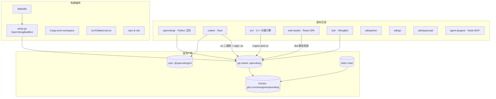

# 01 — 仓库全景：polyglot monorepo 目录布局

> **一句话总结**：OpenViking 是一个 Python 为主、Rust/C++/Go/TypeScript 四种语言各司其职的 polyglot monorepo——Python 承载全部业务语义（704 文件），Rust 承载文件系统引擎与 CLI，C++ 承载向量引擎，TS/Go 只做 SDK；所有语言产物最终拼进一个 pip wheel（`openviking`）分发。

**基准**：本地 clone HEAD=`c66b9155`（2026-08-24，= tag `v0.4.16` + 16 commits）；任务书标注版本 0.3.22 为 README 评测口径（README_CN.md L95），实际仓库已演进到 0.4.x。DeepWiki 档案基线 `f316d6ad`（2026-07-26，落后 262 commits），冲突处以本地源码为准。

---

## 1. 顶层目录速览

| 目录 | 是什么 | 文件数（约） | 主语言 | 入口/产物 |
|------|--------|------|--------|----------|
| `openviking/` | Python 主包：服务端、存储层、检索、会话全部业务 | 704 | Python | pip 包 `openviking`；server 入口 `openviking-server` |
| `crates/` | Rust workspace：`ov` CLI + RAGFS 文件系统引擎 + cache 后端 | 158 | Rust | `ov` 二进制、`ragfs_python*.so` |
| `src/` | C++ 向量引擎扩展（pybind11，x86 SIMD 多变体） | 66 | C++ | `engine.abi3.so` |
| `sdk/` | 轻量客户端 SDK：`python`/`go`/`typescript` 三语言 | 60 | Py/Go/TS | `openviking-sdk`、`@openviking/sdk`、Go module |
| `agent-plugins/` | Agent Plugins 1.0 规范的可移植插件包（MCP） | 14 | Node (mjs) | `plugin.json` + stdio MCP proxy |
| `bot/` | VikingBot：建在 OpenViking 上的 Agent 框架 | 243 | Python (+少量 mjs) | pip extra `openviking[bot]`、`vikingbot` 命令 |
| `web-studio/` | Web Studio 管理界面（React 19 + Vite 7 + Tailwind 4） | 306 | TypeScript | 静态 SPA，构建后拷入 `openviking/web_studio/dist/` |
| `integrations/` | LangChain/LangGraph 集成包 `langchain_openviking` | 21 | Python | 独立 pip 包（自带 pyproject.toml） |
| `benchmark/` | 评测：LoCoMo / tau2 / LongMemEval / RAG / retrieval 等 | 156（97 py） | Python | 复现脚本（README_CN.md L95 指向） |
| `deploy/` + `docker/` | Helm chart + Docker entrypoint 辅助 | 12 + 8 | YAML/Shell | `deploy/helm/openviking/`、GHCR 镜像 |
| `openviking_cli/` | Python 侧 CLI/客户端兼容层（随主包安装） | 49 | Python | `ov`→Rust 二极管的包装、`openviking-server` bootstrap |
| `npm/` | npm 分发壳：`@openviking/cli` | 4 | mjs/JSON | `npm i -g @openviking/cli`（README_CN.md L146） |
| `build_support/` | 构建辅助：版本解析 + x86 编译 profile | 3 | Python | `versioning.py`、`x86_profiles.py` |

另有：`third_party/`（C++ 侧 vendored 依赖：croaring、leveldb-1.23、rapidjson、spdlog-1.14.1、krl）、`examples/`（Apache 2.0，见 §5）、`tests/`、`docs/`、`scripts/`。

## 2. `openviking/`：Python 主包的 26 个子模块

每个子包的定位取自各自 `__init__.py` 的模块 docstring（本地核实）：

| 子模块 | py 数 | 一句话说明 |
|--------|------|-----------|
| `server/` | 69 | HTTP Server（FastAPI/uvicorn），`app.py` L302 实例化 `OpenVikingService`；含 auth/oauth/api_keys/routers/mcp_endpoint |
| `storage/` | 118 | 存储层：`viking_fs/`（VikingFS）、`queuefs/`（语义/向量队列）、`vectordb/`（含 C++ engine 装载）、`ovpack/`、`transaction/` |
| `session/` | 84 | 会话管理：消息记录、压缩（SessionCompressorV3）、记忆提交 |
| `parse/` | 63 | 文档解析器（PDF/MD/HTML/Office/电子书…），摄取管线第一步 |
| `metrics/` | 54 | 指标子系统（`/metrics` 端点背后） |
| `models/` | 34 | 模型接入抽象：`embedder/`、`vlm/`、`rerank/` 三族 provider |
| `utils/` | 26 | 工具函数（含 `agfs_utils.py` 存储客户端工厂） |
| `eval/` | 17 | 评测模块 |
| `retrieve/` | 17 | 检索：`intent_analyzer.py`、`hierarchical_retriever.py`、`context_assembler/`、`memory_lifecycle.py` |
| `observability/` | 17 | 统一可观测性上下文（配合 OTel） |
| `ingest/` | 18 | 对话日志回放：把本地 agent-harness 日志重放进 OpenViking 会话 |
| `service/` | 19 | Service 层：`core.py` L58 `OpenVikingService` 编排 8 个子服务（见 02 篇） |
| `telemetry/` | 14 | 运行时遥测 |
| `integrations/` | 13 | 可选框架集成 |
| `core/` | 12 | 核心上下文抽象（URI 校验、namespace、目录初始化、SKILL 加载） |
| `resource/` | 9 | 资源监控管理 |
| `privacy/` | 7 | 用户隐私配置（隐私版本管理） |
| `crypto/` | 5 | 静态数据加密模块 |
| `pyagfs/` | 5 | AGFS/RAGFS 的 Python SDK；`__init__.py` L72 `_find_ragfs_so()` 从 `openviking/lib/` 动态加载 Rust 扩展 |
| `usage_reporter/` | 7 | 用量上报扩展点 |
| `message/` | 3 | 消息模块（基于 opencode Part 设计） |
| `connector/` | 4 | 连接器（client/delegate/routing） |
| `prompts/` | 2 | Prompt 模板管理（`templates/**/*.yaml`） |
| `client/` | 1 | **只剩 HTTP client 兼容导出 shim**（见 §5 DeepWiki 过时点①） |
| `web_studio/` | 1 | 构建产物占位：`dist/` 由 web-studio SPA 填充 |
| `eval` 外的 `models` 等 | — | （已列于上） |

> 规律：**Python 包里藏了两个"外国货"**——`openviking/lib/ragfs_python*.so`（Rust）和 `openviking/storage/vectordb/engine/*.abi3.so`（C++），都在运行时由 Python 动态加载；`openviking/bin/ov`（Rust CLI）作为子进程调用。这是"以 Python 为壳的多语言单体"。

## 3. `crates/`：Rust workspace（8 个 crate）

根 `Cargo.toml` L2-13：workspace **members** = `ov_cli`、`ragfs`、`ragfs-cache-redis`、`ragfs-python`；**exclude** = `ragfs-cache-mooncake`、`ragfs-cache-yuanrong`、`ragfs-cache-yuanrong-sys`、`ragfs-python-native`（火山引擎内部存储后端依赖，默认不参与构建）。

| crate | rs 文件数 | 说明 |
|-------|-----------|------|
| `ragfs/` | 78 | **RAGFS = AGFS 的 Rust 重写**。Cargo.toml L7 自述："Rust implementation of AGFS - Aggregated File System for AI Agents"；`ORIGIN.md` 说明源自 `third_party/agfs/` 的 Go 实现。模块：`core/`（filesystem/mountable）、`plugins/`（localfs/s3fs）、`git/`（gitoxide）、`lock/`、`cache/`、`shell/`（ragfs-shell）。license = Apache-2.0（L8） |
| `ov_cli/` | 48 | Rust CLI `ov`：clap + ratatui TUI + reqwest；edition 2024；Apache-2.0 |
| `ragfs-python/` | 2 | maturin 构建的 PyO3 绑定 → `ragfs_python.abi3.so`（进程内嵌入 RAGFS） |
| `ragfs-python-native/` | 0 | 本地 native 构建辅助（excluded） |
| `ragfs-cache-redis/` | 6 | RAGFS 缓存后端：Redis（workspace 内） |
| `ragfs-cache-mooncake/` | 10 | 缓存后端：Mooncake（excluded，需内部依赖） |
| `ragfs-cache-yuanrong(-sys)/` | 10+2 | 缓存后端：元润存储（excluded） |

## 4. 其余目录要点

- **`src/`（C++ 向量引擎）**：`CMakeLists.txt` L2 `project(openviking_cpp)`；按 `OV_X86_BUILD_VARIANTS "sse3;avx2;avx512"` 编出多 SIMD 变体（L6），经 pybind11 产出 abi3 稳定 ABI 扩展。子系统：`store/`（kv/persist/volatile）、`index/`（scalar bitmap/dir_index + 向量索引）。这就是本地向量库的"内燃机"，使单机模式无需外部向量数据库。
- **`sdk/`（三语言轻客户端）**：`python/`（包名 `openviking-sdk`，HTTP-only，`client.py` 定义 `AsyncHTTPClient`(L289)/`SyncHTTPClient`(L2002)）；`typescript/`（`@openviking/sdk`）；`go/`（~20 个 .go：client/filesystem/sessions/retrieval/skills…）。**注意主包对 SDK 的依赖关系**：根 `pyproject.toml` L33 `openviking-sdk>=0.1.1` 是 `openviking` 的运行时依赖——`ov.SyncHTTPClient` 实际从 `openviking_cli` re-export。
- **`agent-plugins/`**：Agent Plugins 1.0 规范（vendor 中立，Amazon/Cursor/Microsoft/OpenAI/Vercall 背书）的可移植插件目录：`plugin.json` 清单 + `mcp.json`（声明 stdio MCP server "openviking"）+ `servers/mcp-proxy.mjs`（stdio→HTTP 代理到服务端 `/mcp`）+ `skills/openviking-memory/SKILL.md`（教模型 recall+persist 循环）。零 npm 依赖，Node 18+ 纯标准库。
- **`bot/`（VikingBot）**：Python 包 `vikingbot`（agent/bus/channels/providers/sandbox/cron/openviking_mount…），随 `openviking[bot]` extra 分发（pyproject L146-182），`openviking-server --with-bot` 启动（README_CN.md L186-190）。
- **`web-studio/`**：React 19.2 + Vite 7 + TS 5.7 + Tailwind 4 的 SPA；`make build-studio` 构建后拷贝到 `openviking/web_studio/dist/`（Makefile L159-176），服务端在 `:1933/studio` 托管。
- **`benchmark/`**：`locomo/`（内含 claudecode/hermes/openclaw/**mem0** 四组 Agent 对照）、`tau2/`、`longmemeval/`、`RAG/`、`retrieval/`、`skillsbench/`、`vectordb_perf/`、`cuvs/`——README_CN.md L93-105 的评测数字（LoCoMo 80-83% vs 原生 24-57%）从这里复现。

## 5. 设计权衡与坑

1. **polyglot 的代价**：改一行 Rust（ragfs）需要 maturin 重编 + 抽 .so 进 `openviking/lib/`；改一行 C++ 需要 CMake 全流程。本地开发心智负担集中在 Makefile L90-144（先 setup.py build_ext，再 pip install -e .，再手动 maturin 解包）——三段式是因为 `setup.py` 的 `OpenVikingBuildExt`（setup.py L106）与 Makefile 各有一套 ragfs 构建路径，行为略有差异（详见 03 篇）。
2. **许可证不是铁板一块**：主包 AGPLv3（README_CN.md L277），但 `crates/LICENSE`（Apache-2.0，200 行）覆盖 **crates/ 全部 Rust 代码**（含 ragfs），`examples/` 也是 Apache 2.0（L279）。README 的表述"crates/ov_cli Apache 2.0"（L278）**偏保守**——实际 `ragfs/Cargo.toml` L8 也是 Apache-2.0。对商用二开意味着：**Rust 文件系统引擎可独立取用，Python 服务层受 AGPL 约束**（影响见 04/05 篇）。
3. **DeepWiki 已过时点（本地源码核实）**：
   - ① **Embedded Mode 客户端已删除**：DeepWiki 1.3 引用 `openviking/async_client.py:25`（AsyncOpenViking）与 `openviking/client/local.py:73`（LocalClient）——本地两文件均不存在，`openviking/client/` 只剩 1 个 HTTP 兼容 shim（`__init__.py` 导出 `SyncHTTPClient`/`AsyncHTTPClient`）。库模式嵌入用法已被 server-first 架构取代（详见 04 篇）。
   - ② **"Go AGFS Server"（DeepWiki 5.3）名存实亡**：仓库已无 Go AGFS server；AGFS 的 Go 实现被重写为 Rust RAGFS（`crates/ragfs/ORIGIN.md` + docs/zh/concepts/05-storage.md L33 注释"AGFS 已经重写为 Rust 实现（RAGFS）"）。本地 Go 代码仅剩 `sdk/go/` 客户端。
   - ③ `openviking/storage/viking_fs.py` 单文件已拆分为 `viking_fs/` 包（`_base/_access/_grep/_ops/_semantic/_snapshot/_sync/_vector` 8 个 mixin 模块）——DeepWiki 1.3 的行号引用全部失效。
4. **版本口径混乱**：任务书/README 写 0.3.22（评测基线），git tag 已到 `v0.4.16`（2026-08-21），且存在 `python-sdk@0.1.8`、`cli@0.4.14` 独立 tag 命名空间（RELEASE_CN.md 的 tag 约定表）。引用版本时要分清是哪个产物。
5. **`json/` 空目录**出现在工作区（8 月 25 日时间戳），是会话产物而非仓库内容，读仓库结构时忽略。

## 6. 与其他模块的关系

- 目录布局直接决定 02 篇的分层：`sdk/`+`crates/ov_cli`+`agent-plugins/` = client 层；`openviking/server`+`service` = service 层；`openviking/storage`+`crates/ragfs`+`src/` = 存储层。
- 03 篇解释 §5-1 提到的三段式构建如何被 Makefile/setup.py/Cargo/CMake/npm 编排。
- 04 篇回答"这些目录拼出来的产物有几种部署形态"；05 篇回答"这个 monorepo 在记忆/上下文生态里站哪"。

📌 **下一步阅读**
- `02-architecture.md` — client→service→VikingFS→存储的四层架构与 L0/L1/L2 数据流
- `03-build-system.md` — 五套工具链如何拼进一个 pip wheel
- `../02-vikingfs-layers/` — VikingFS 与三层信息模型的逐文件精读
