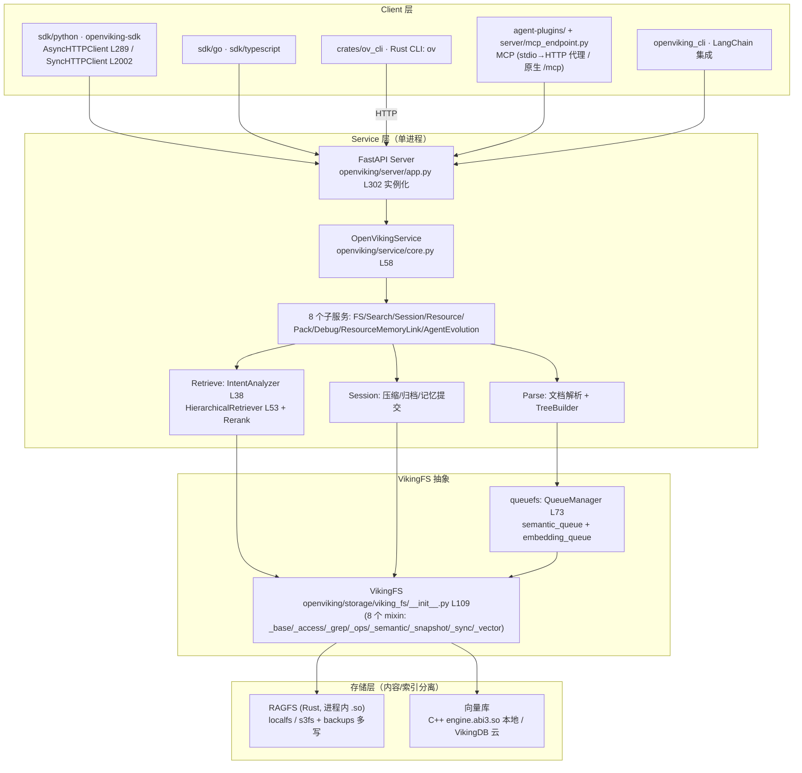
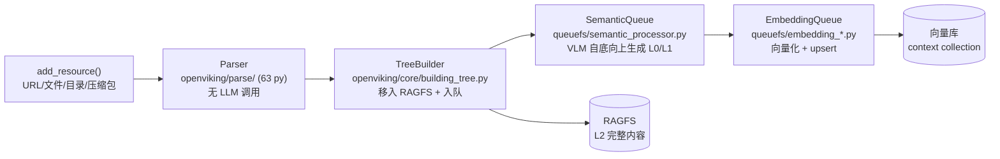

# 02 — 整体架构：四层栈 + 三层信息模型 + 两条数据流

> **一句话总结**：OpenViking 的架构是一个"数据库形状"的四层栈——client 层（SDK/CLI/MCP）→ service 层（FastAPI HTTP server 编排 8 个子服务）→ VikingFS（`viking://` 虚拟文件系统抽象）→ 存储层（RAGFS 内容存储 + 向量库索引分离）；信息以 L0/L1/L2 三层渐进分辨率组织，写入走"解析→建树→语义分层→向量化"异步管线，查询走"意图分析→目录递归→rerank"并留下可观察轨迹。

**基准**：HEAD=`c66b9155`（2026-08-24）；与 `docs/zh/concepts/01-architecture.md`（166 行，本地核实）交叉核对；DeepWiki 基线 `f316d6ad`（2026-07-26）多处过时，见 §6。

---

## 1. 分层总览

与官方文档对照（concepts/01-architecture.md）：ASCII 架构图在 L7-49，核心模块表 L53-61，Service 层表 L67-74，双层存储 L78-84——**本地代码与该文档一致**，但文档的 Service 表只列 6 个子服务，`service/core.py` L107-116 实际装配 **8 个**（新增 `ResourceMemoryLinkService` 与 `AgentEvolutionService`，文档略滞后，属良性偏差）。

## 2. 层 1：Client 层——三种入口，一个 HTTP 协议

| 入口 | 实现 | 说明 |
|------|------|------|
| Python SDK | `sdk/python/openviking_sdk/client.py`（`AsyncHTTPClient` L289、`SyncHTTPClient` L2002） | 官方轻客户端，HTTP-only；主包 `pyproject.toml` L33 依赖 `openviking-sdk>=0.1.1` 并经 `openviking_cli` re-export 成 `ov.SyncHTTPClient` |
| Rust CLI `ov` | `crates/ov_cli`（48 个 .rs） | `ov ls/tree/find/grep/add-resource` 等命令；README_CN.md L130-140 的标准工作流 |
| MCP | `agent-plugins/servers/mcp-proxy.mjs`（stdio→HTTP）+ `openviking/server/mcp_endpoint.py`（原生 `/mcp`） | 让 Claude Code/Codex/Cursor 等 coding agent 直接调用；find/search/read + remember/write 工具集 |

**关键架构事实（DeepWiki 已过时）**：DeepWiki 1.3 描述的"Embedded Mode"（`AsyncOpenViking` → `LocalClient` 直接进程内调 `OpenVikingService`）在当前版本**已不存在**——`openviking/client/` 只剩 HTTP 兼容 shim。当前所有客户端统一走 HTTP；`OpenVikingService` 成为 server 进程的内部编排类。这是从"库优先"到"服务优先"的明确转向（对部署形态的影响见 04 篇）。

## 3. 层 2：Service 层——HTTP 解耦与任务化

`openviking/server/app.py` L302 `service = OpenVikingService()` 是唯一装配点。`OpenVikingService.__init__`（`service/core.py` L58 起）职责：

1. **配置**：`initialize_openviking_config()` 读 `~/.openviking/ov.conf`（L76 附近）；
2. **基础设施**：AGFS/RAGFS 客户端（binding 模式进程内嵌 ragfs_python）、`QueueManager`（`queuefs/queue_manager.py` L73，带语义/嵌入两路并发上限）、`VikingDBManager`、`VikingFS`、`LockManager`、加密器、watch 调度器；
3. **数据目录锁**：`_ensure_data_dir_lock_acquired()` 跨进程串行化首跑初始化（core.py L121 附近）——单机多进程防竞争的关键设计；
4. **8 个子服务**：FSService（ls/mkdir/rm/mv/tree/stat/read/abstract/overview/grep/glob，docs L69）、SearchService、SessionService、ResourceService、PackService（ovpack 导入导出/备份恢复）、DebugService、ResourceMemoryLinkService、AgentEvolutionService。

Service 层的意义（docs L65："将业务逻辑与传输层解耦，便于 HTTP Server 和 CLI 复用"）——CLI 也是 HTTP 客户端而非进程内直调，与 §2 的"服务优先"一致。

## 4. 层 3：VikingFS——`viking://` 虚拟文件系统

- **类定义**：`openviking/storage/viking_fs/__init__.py` L109 `class VikingFS(`（mixin 组合，工厂 `init_viking_fs` 在 `_base.py` L144）。
- **URI 空间**（README_CN.md L50-71）：`viking://resources/`（资源）、`viking://user/{user_id}/`（memories/resources/skills/peers）、`viking://agent/`（agent 级技能）；`viking://~` 家目录别名按认证身份展开（concepts/02 L69）。物理映射示例：`viking://resources/docs/auth → /local/{account_id}/resources/docs/auth`（concepts/05-storage.md L42）。
- **三种上下文类型**（concepts/02 L7-11）：Resource（用户添加的静态知识）/ Memory（Agent 主动提取的动态认知，9 类内置：profile/preferences/entities/events/identity/soul/cases/trajectories/experiences，L55-67）/ Skill（AgentDefinedContextType，`SKILL.md` + scripts，L95-131）。
- **文件系统语义不是摆设**：`ls/tree/find/grep/glob` 全部可用（Rust CLI 直接暴露），Agent 可以像开发者一样**确定性导航**——这是与传统 RAG 黑盒 top-k 的根本差异（05 篇展开）。

## 5. 信息模型与数据流

### 5.1 L0/L1/L2 三层信息模型

（concepts/03-context-layers.md L7-11，本地核实）

| 层级 | 名称 | 存储形式 | 默认上限 | 用途 |
|------|------|----------|----------|------|
| **L0** | 摘要 | 目录级 sidecar `.abstract.md` | 256 字符 | 向量召回、快速过滤 |
| **L1** | 概览 | 目录级 sidecar `.overview.md` | 4000 字符 | Rerank、内容导航 |
| **L2** | 详情 | 原始文件/子目录 | 无统一上限 | 完整内容按需加载 |

三个容易误解的精确点（concepts/03 L13、L76、L124）：
1. L0/L1 是**目录级** sidecar，不是 per-file 伴生文件；文件摘要聚合进所在目录的 L1；
2. `ls` 默认隐藏这两个 sidecar，二者也不保证成对存在（`mkdir(description=...)` 只产生 L0）；
3. sidecar 带 YAML frontmatter（OKF 格式：`directory`/`source`/`generated_by`/`freshness`），embedding 输入只含正文 + 白名单元数据 `directory`（L128-138），metadata 受写保护（L159-168）。

### 5.2 写入流：资源摄取

对应 docs L89-96 的四步：Parser → TreeBuilder → SemanticQueue → 向量库。生成顺序"文件摘要→叶子目录 L1→叶子目录 L0→父目录→namespace 根边界"（concepts/03 L172-176）；freshness 元数据追踪子项覆盖率与待刷新数（L142-151）。

### 5.3 查询流：目录递归检索 + 轨迹

对应 docs L100-107：

1. **意图分析**：`retrieve/intent_analyzer.py` L38 `IntentAnalyzer` 把自然语言查询转成 0-5 个类型化查询；
2. **层级检索**：`retrieve/hierarchical_retriever.py` L53 `HierarchicalRetriever`——向量检索先定位**得分最高的目录**，再逐层向下探索（优先队列），而非扁平 top-k chunk；
3. **Rerank**：标量过滤 + 模型精排（`models/rerank/`）；
4. **轨迹**：每次查询保留目录浏览轨迹，结果可溯源到路径（README_CN.md L45）——"检索过程可观察"是卖点之一。

### 5.4 会话流：从对话到记忆

docs L110-119：消息累积 → 压缩（保留最近 N 轮）→ 归档生成历史片段 L0/L1 → `session.commit()` 触发后台记忆提取（schema 驱动，按 MemoryType 模板）→ 写入 RAGFS + 向量库。会话记忆落在 `viking://user/{user_id}/memories/`（concepts/02 L47），不再有独立的 `viking://agent/memories`。

## 6. 设计权衡与坑

1. **"存储层纯粹"原则的得与失**（docs L144-151）：存储层只做 AGFS 操作和基础向量搜索，rerank 上移到检索层；所有内容从 RAGFS 读，向量库仅存引用（URI+向量+元数据）→ **单一数据源**，杜绝索引与内容漂移。代价是向量库 schema 受限（context collection：uri/vector/level/context_type + 多租户字段），复杂过滤要靠 grep/glob 补。
2. **语义冒泡写放大**：concepts/03 L155-157 的官方 TODO 直言——当前每次 resource/skill 语义任务成功后都会向父目录冒泡刷新，即使摘要没变，热点目录存在重复刷新与向上写放大；freshness 节流是规划中未落地。深目录大仓库摄取时要有心理预期。
3. **L0/L1 依赖 VLM 质量**：语义分层的质量上限 = 所配 VLM 的质量（配置里 `vlm.max_concurrent` 限流）；弱模型会直接劣化检索的第一跳。
4. **单机锁**：`_ensure_data_dir_lock_acquired()` 意味着**同一数据目录不支持多 server 进程并发**，水平扩展要靠多写备份（storage.agfs.backups）+ 云 VikingDB，分布式是 roadmap（05 篇博客原文"deployment evolution"）。
5. **DeepWiki 已过时点**（架构相关）：
   - ① Embedded Mode（`AsyncOpenViking`/`LocalClient`）已删除（§2）；
   - ② `viking_fs.py` 单文件 → `viking_fs/` 包，DeepWiki 行号 `viking_fs.py:161/164` 全部失效；
   - ③ DeepWiki 1.3 的 OpenVikingService 生命周期行号（core.py:59/213/308）与本地 core.py L58 起的 `__init__` 大体对应但内容已扩展（新增 AgentEvolutionService、watch/auto-commit 调度器、加密引导）；
   - ④ DeepWiki 把身份/多租户归在"Configuration and Multi-Tenancy"，本地已发展成完整 auth 体系（`server/auth/`、`api_keys/`、`oauth/`、两层 API Key：user_key/admin_key，docs/zh/getting-started/03 L57-70）。

## 7. 与其他模块的关系

- **目录↔架构**：01 篇的目录地图是本篇分层的物理载体（sdk+ov_cli+agent-plugins=client 层；server+service=service 层；storage+crates/ragfs+src/=存储层）。
- **构建**：架构图中两个 `.so`（ragfs_python、engine.abi3.so）的产出过程见 03 篇。
- **部署**：§6-4 的单机锁与"服务优先"转向直接决定 04 篇的部署形态矩阵。

📌 **下一步阅读**
- `03-build-system.md` — 图中两个原生扩展如何被 five-toolchain 构建拼装
- `../02-vikingfs-layers/` — VikingFS mixin 与 L0/L1 sidecar 的逐文件精读
- `05-ecosystem-position.md` — "文件系统范式"对比 mem0/传统 RAG/TencentDB 的深层理由
