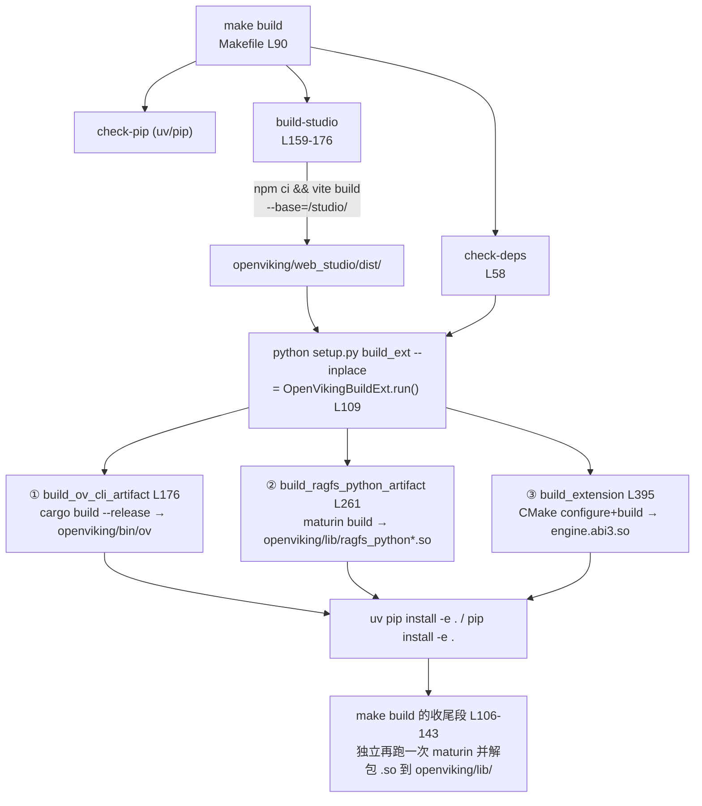

# 03 — 构建系统：五套工具链如何拼进一个 pip wheel

> **一句话总结**：OpenViking 的构建是一个以 setuptools `build_ext` 为"总调度"的多语言编排——根 Makefile 做依赖检查与流程串联，`setup.py` 的 `OpenVikingBuildExt`（L106）依次驱动 Cargo（Rust CLI）、maturin（ragfs-python 绑定）、CMake+pybind11（C++ 向量引擎）三条原生工具链，npm/vite 构建 Web Studio SPA，最终所有产物作为 package-data 塞进同一个 `openviking` wheel；另有 npm（`@openviking/cli`）与多阶段 Docker 两条独立分发通道。

**基准**：HEAD=`c66b9155`（2026-08-24）；行号均经 `read`/`grep` 本地核实。DeepWiki 5.x 系列页对构建描述大体仍准确（本篇交叉核对处见 §6）。

---

## 1. 构建入口与依赖矩阵

**工具链版本下限**（Makefile L9-13）：Python ≥3.10、CMake ≥3.15、**Rust ≥1.91.1**、GCC ≥9 / Clang ≥11。`make check-deps`（L58-88）逐项校验；`make check-pip`（L44-56）优先探测 uv。

**五个构建体系一览**：

| 体系 | 配置文件 | 产物 | 去向 |
|------|----------|------|------|
| Python | `pyproject.toml` + `setup.py` + `MANIFEST.in` | `openviking` wheel/sdist | PyPI |
| Rust | 根 `Cargo.toml`（workspace）+ 各 crate | `ov` 二进制、`ragfs_python.abi3.so` | 塞进 wheel（`openviking/bin/`、`openviking/lib/`）；`ov` 另发 npm |
| C++ | `src/CMakeLists.txt`（L2 `project(openviking_cpp)`） | `engine.abi3.so/.pyd`（SSE3/AVX2/AVX512 多变体，L6） | `openviking/storage/vectordb/engine/` |
| Node | `web-studio/package.json`（Vite）、`npm/cli/package.json` | SPA `dist/`、npm 安装壳 | `openviking/web_studio/dist/`；`@openviking/cli` |
| Docker | `Dockerfile` + `docker-compose.yml` | 容器镜像 | GHCR / Docker Hub |

`pyproject.toml` L1-9 的 `[build-system]` 一次性声明 setuptools、setuptools-scm、**cmake、maturin**、wheel——装 build 依赖即备齐全部原生工具链的 Python 侧钩子；版本号由 setuptools-scm 从 git tag 动态生成（L207-211，写入 `openviking/_version.py`）。

## 2. 总流程：`make build` 做了什么

Makefile L90-144（本地核实）：



三个值得注意的细节：

1. **ragfs-python 被构建两次的可能**：`OpenVikingBuildExt` 的 ② 与 Makefile L106-143 的收尾段各有一条 maturin 路径（后者把 wheel 解包抽出 `ragfs_python.abi3.*` 并 `chmod 755`）。Makefile 先清理 `.venv` 里的陈旧 ragfs 原生工件（L91-96）防止 ABI 不匹配。
2. **可跳过项**：`OV_SKIP_STUDIO_BUILD=1` 跳过 SPA（L161）；`dist/index.html` 已存在则跳过（L163）；无 npm 则警告跳过（L165-166）。
3. **`make build-cli`（L179-186）是独立 target**：dev 模式 `cargo build`（快）+ 拷贝到 `openviking/bin/ov`，与 `make build` 的 release 路径互不干扰。

## 3. `setup.py`：OpenVikingBuildExt 三阶段

`setup.py` L106 `class OpenVikingBuildExt(build_ext)`，`run()`（L109）顺序执行：

| 阶段 | 方法 | 工具 | 关键环境变量 |
|------|------|------|--------------|
| ① Rust CLI | `build_ov_cli_artifact` L176 | cargo（release） | `OV_PREBUILT_BIN_DIR`（L192，用预编译二进制跳过）、`OV_SKIP_OV_BUILD=1`（L199，二进制存在则跳）、`CARGO_BUILD_TARGET`（交叉编译三元组） |
| ② ragfs 绑定 | `build_ragfs_python_artifact` L261 | maturin（PyO3 abi3） | 同上 cargo 环境 |
| ③ C++ 引擎 | `build_extension` L395 | CMake + pybind11 | 传 Python 解释器路径、`-Dpybind11_DIR`、`OV_PY_EXT_SUFFIX`（abi3 后缀） |

辅助设施（`build_support/`）：`versioning.py` 的 `resolve_openviking_version` 统一版本解析；`x86_profiles.py` 的 `get_host_engine_build_config` 按宿主 CPU 选 SIMD 变体（对应 CMake 的 `OV_X86_BUILD_VARIANTS "sse3;avx2;avx512"`，src/CMakeLists.txt L6）。另外 setup.py 顶部还有一个实用主义细节：`_sanitize_native_build_env()` 会把 Linuxbrew 的 pkg-config/库路径从 Cargo 环境里剔除，防止老 glibc 机器上链接到不兼容的 Homebrew 库——polyglot 构建向真实世界妥协的样本。

**Cargo workspace 边界**（根 Cargo.toml L2-13）：members = `ov_cli`、`ragfs`、`ragfs-cache-redis`、`ragfs-python`；exclude = `ragfs-cache-mooncake`、`ragfs-cache-yuanrong(-sys)`、`ragfs-python-native`——内部存储后端不进默认构建。release profile 开 `lto=true`+`strip=true`（L16-19），ragfs 单独 `codegen-units=1`（L21-22）。

## 4. 产物组装：一个 wheel 装下四种语言

`pyproject.toml` L218-229 `[tool.setuptools.package-data]` 是组装清单：

```toml
openviking = [
    "prompts/templates/**/*.yaml",      # Python 资产
    "server/static/**/*",
    "web_studio/dist/**/*",             # ← TypeScript SPA
    "lib/ragfs_python*.so",             # ← Rust 绑定
    "lib/ragfs_python*.pyd",
    "bin/ov", "bin/ov.exe",             # ← Rust CLI 二进制
    "storage/vectordb/engine/*.abi3.so",# ← C++ 向量引擎
    "storage/vectordb/engine/*.pyd",
]
```

控制台入口（L201-205）：`ov`/`openviking` → `openviking_cli.rust_cli:main`（Rust 二进制的极简包装器）、`openviking-server` → `openviking_cli.server_bootstrap:main`、`vikingbot` → `vikingbot.cli.commands:app`。包发现范围含 `bot/`（L213-216），所以 VikingBot 随主包分发（`pip install "openviking[bot]"` 装依赖，L146-182）。

**运行时装载**：`openviking/pyagfs/__init__.py` L48 定位 `openviking/lib/`，L72 `_find_ragfs_so()` 按 EXT_SUFFIX 精确匹配或回退 abi3 稳定 ABI（L51-69 显式拒绝 ABI 不符的 cpython 特定扩展）——wheel 因此可以做到"一个 abi3 .so 通吃 CPython 3.10-3.14"。

## 5. 三条分发通道

1. **PyPI（主通道）**：`pip install openviking`。GitHub Actions `release.yml` L49 复用 `_build.yml` 可复用 workflow 产出跨平台 wheel（含 Windows `.pyd`——setup.py 有专门的 Windows SABI 库探测 `_get_windows_python_sabi_library()`）。
2. **npm（CLI 通道）**：`npm/cli/package.json` name=`@openviking/cli`，`bin/ov.mjs` + `postinstall.mjs`（README_CN.md L146：`npm i -g @openviking/cli`，等价 `cargo install --git ... ov_cli`）。
3. **Docker（全家桶通道）**：三阶段镜像——L5 `rust:1.91.1-trixie AS rust-toolchain`、L8 `uv:python3.13-trixie-slim AS py-builder`（uv sync 管依赖）、L94 `python:3.13-slim-trixie` 运行时；entrypoint 启动 API server（可选 bot 网关）。Helm chart 在 `deploy/helm/openviking/`。

**发版矩阵**（RELEASE_CN.md，本地核实）：一次主版本要保证 Python 包/Docker/TOS 资产同 tag（`vX.Y.Z`）；SDK 用 `python-sdk@X.Y.Z`、CLI 用 `cli@X.Y.Z` 独立命名空间（本地 tag 可见 `python-sdk@0.1.8`、`cli@0.4.14`）；另有 ClawHub 插件 dev/latest 双通道（`clawhub-dev-release.yml` 等 8 个发版 workflow）。

## 6. 设计权衡与坑

1. **为什么不用 Bazel/Pants**：团队选择了"setuptools 当胶水"而非统一多语言构建器——好处是 `pip install openviking` 从源码装时只需 `[build-system]` 声明即可拉起全部原生构建（隔离构建友好）；代价是构建逻辑散落在 Makefile/setup.py/CMake/npm 四处，`make build` 与 `setup.py` 存在重复的 maturin 路径（§2-1），新人排障成本高。
2. **maturin 是软依赖**：Makefile 路径下找不到 maturin 时**静默跳过** ragfs-python（L141-142 "[SKIP] maturin not found"）——产物缺 RAGFS 原生绑定，运行时退回什么行为取决于 pyagfs 装载逻辑，排查时先确认 `openviking/lib/` 是否有 `.so`。
3. **wheel 体积与平台矩阵**：一个 wheel 塞 Rust CLI 二进制 + ragfs .so + C++ 多 SIMD 变体 .so + 整个 React SPA，Linux/macOS/Windows × x86/ARM 的组合靠 CI 矩阵 + abi3 稳定 ABI 消减；`OV_PREBUILT_BIN_DIR` 允许发布流水线用交叉编译产物替换现场构建，缩短 CI。
4. **版本口径**（01 篇已提）：setuptools-scm 从 tag 推版本（tag_regex `^v...`），本地 HEAD 是 `v0.4.16+16`，即下一个 0.4.x/0.5.x dev 版；README 的"0.3.22"是评测报告口径，勿混用。
5. **DeepWiki 对照**：5.5 Build Orchestration 的三阶段描述与 setup.py 行号（106/176/255→本地 261/406→本地 395）**基本吻合但有 ~30-60 行漂移**（基线后 262 commits 的正常演化）；其引用的 `Makefile:154-155`（OV_SKIP_STUDIO_BUILD）现为 L161。无原则性错误，但引用行号时以本篇为准。DeepWiki 未覆盖的更新：ClawHub/插件发版 workflow、`uv.lock`（1.3MB）成为权威依赖锁。

## 7. 与其他模块的关系

- 01 篇 §5-1 的"三段式构建心智负担"由本篇 §2-3 展开；02 篇架构图中的 `ragfs_python.abi3.so`/`engine.abi3.so` 产物即本篇 §4。
- 部署（04 篇）：Docker 通道的镜像内嵌全部产物，是"私有化/离线部署"形态的技术底座；npm 通道服务 CLI-only 用户。

📌 **下一步阅读**
- `04-two-modes.md` — 本篇产物对应的四种部署形态与数据主权
- `../05-operations/` — 发版/CI/运维细节（RELEASE_CN.md 深读）
- mem0 案例 `notes/00-overview/04-cicd.md` — 对比一个纯 Python 仓库的极简 CI
