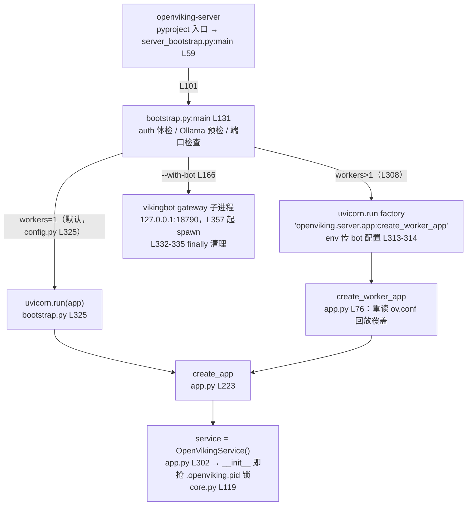
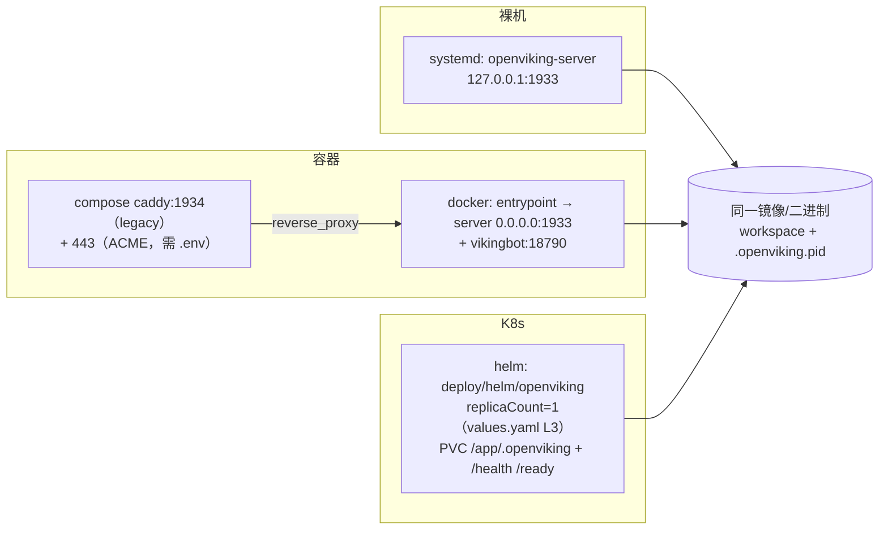

# 04 — 运行模式：Embedded 已死，一切都是 HTTP Server

> **一句话总结**：OpenViking 曾并行提供 Embedded（进程内 SDK 直调 `OpenVikingService`）与 HTTP client-server 两种模式，2026-08-10 的 PR #3712 彻底删除了 Python embedded mode，`openviking/client/` 只剩 28 行 HTTP 兼容 shim——进程形态收敛为唯一的 `openviking-server`（uvicorn + FastAPI + OpenVikingService），部署差异全部外移为运维外壳：systemd 裸机、Docker/compose、K8s Helm、Caddy 公网 HTTPS 四种形态共用同一个二进制。收敛的物理约束是 workspace 级 PID 锁（`.openviking.pid`）：同一数据目录只许一个活进程，锁冲突的报错信息原文就推荐"起一个 server、客户端走 HTTP"。代价是 Jupyter/嵌入式低延迟场景永久失去一等公民身份。

**基准**：HEAD=`c66b9155`（2026-08-24）；与 `docs/zh/guides/03-deployment.md`（369 行）、`docs/zh/guides/12-public-access.md`（163 行）、`docs/zh/configuration/01-server.md`（408 行）交叉核对，均本地核实；DeepWiki 基线 `f316d6ad`（2026-07-26）过时点见 §6。

---

## 1. 模式演变：一次自杀式重构

- git 证据：`7abd6ab2`（2026-08-10，PR #3712）`refactor(client): remove Python embedded mode`——commit 说明"Consolidate Python consumers on the HTTP SDK while keeping shared server and storage capabilities unchanged"。该 commit 触碰 40+ 文件（benchmark、bot、docs、examples 全部改写），是基线 f316d6ad 之后 15 天发生的**破坏性**变更，DeepWiki 完整错过了它。
- 现状：`openviking/client/` 目录只剩 `__init__.py` 一个文件（28 行），docstring 自述 "HTTP client compatibility exports"——`__getattr__`（L19）惰性 re-export `AsyncHTTPClient`/`SyncHTTPClient`（L21/L24，来自 `openviking_cli.client.http/sync_http`），仅为保住 `openviking.SyncHTTPClient` 旧导入路径。
- 转向写进了报错文案：数据目录锁冲突时 `acquire_data_dir_lock` 抛出的 `DataDirectoryLocked`（`openviking/utils/process_lock.py` L133）建议清单第一条就是 "Start a single OpenViking server and connect clients over HTTP (recommended for multi-session hosts)"——锁与模式收敛互为因果。
- 文档同步跟进了：`docs/zh/getting-started/02-quickstart.md` L177 的客户端示例已是 `from openviking_sdk import SyncHTTPClient`，全程 server-first 叙事。

## 2. 当前唯一的进程形态：`openviking-server`

入口链两级分离，动机是**导入顺序**：`openviking_cli/server_bootstrap.py` 刻意活在 `openviking` 包外，避免触发主包 `__init__.py` 的急切导入与配置单例（docstring L3-15）——它只预解析 `--config` 写环境变量（L65-71），然后分流子命令：

| 子命令 | 实现位置 | 说明 |
|--------|----------|------|
| `init` | server_bootstrap.py L78 → `openviking_cli.setup_wizard` | 交互式配置向导，生成 `ov.conf` |
| `doctor` | L84 → `openviking_cli.doctor` | 启动前体检（配置/模型/鉴权） |
| `ingest` | L91 → `openviking.ingest.cli` | 本地日志摄取（client 侧） |
| （无） | L31-56 `_maybe_offer_init` | TTY 交互且无配置时主动offer向导；Docker/CI 静默跳过 |
| （无） | L101 → `openviking/server/bootstrap.py:main` | 真正启动 server |

`bootstrap.py:main`（L131）的启动序列：认证健康检查（L225-228，注释标 CRITICAL，失败即退出）→ Ollama 预检（L234-253，失败仅警告）→ 端口占用自杀检查 `_abort_if_port_in_use`（L56，防"陈旧进程还在答流量、运维以为已升级"）→ `create_app`（L297）→ uvicorn：

vikingbot 托管是模式收敛的注脚：server 顺带当 supervisor（spawn/日志/优雅终止），Docker 镜像默认开启（见 §3）。

## 3. 运维外壳：四种部署形态，一个二进制

| 形态 | 载体 | 端口/入口 | 关键文件 |
|------|------|-----------|----------|
| 裸进程 | `nohup`/systemd（README_CN.md L123；03-deployment.md L90-141 给了 Type=simple + Restart=always 模板） | 127.0.0.1:1933 | systemd unit 由用户自建 |
| Docker 单容器 | `ghcr.io/volcengine/openviking:latest` | 0.0.0.0:1933 | `Dockerfile` L94 运行时层 |
| compose + Caddy | 上者 + `caddy:2` 反代 | 1933 直连 + 1934 legacy + 可选 80/443 | `docker-compose.yml` |
| K8s | Helm chart | PVC + Ingress + /health、/ready 探针 | `deploy/helm/openviking/` |

Docker 通道的全部巧思在 `docker/openviking-entrypoint.sh`（157 行）：

1. **默认带 bot**：`WITH_BOT` 默认 1（L4），`--without-bot`/`OPENVIKING_WITH_BOT=0` 关闭（L81-115 还把非 bot 参数透传 `exec "$@"`，所以 `docker run ... openviking --help` 直接跑 CLI）；
2. **无配置不崩溃**：`ensure_config`（L39）找不到 `ov.conf` 时按序尝试 `OPENVIKING_CONF_CONTENT` 整段注入（L44-47）→ 打印修复指引并起 `pending_health_server` 让所有 HTTP 请求返回 **503 JSON**（L49-64），轮询等文件出现（L67-74）——专为 Railway/Fly.io 等不给 bind mount 的 PaaS 设计（docs L242-263 的方案 A/B 与源码一一对应）；
3. **健康门**：起 server 后循环 curl `/health`，120s 超时或进程早退则容器失败（L139-153）；容器 HEALTHCHECK 复用 `openviking-entrypoint --healthcheck`（Dockerfile L118-119）；
4. **强制鉴权**：容器内绑定 0.0.0.0（L129），docs L200 明言未设 `root_api_key` 拒绝启动。

公网 HTTPS 是第四个维度而非第五种形态：OAuth 2.1/MCP 客户端对非 localhost issuer **强制 TLS**（12-public-access.md L6-8），公网地址解析有 4 级优先级——`OPENVIKING_PUBLIC_BASE_URL` > `oauth.issuer` > `X-Forwarded-*` 头 > `Host` 头（L128-133），反代后必须显式设第一级。1934 端口"仅为已书签的旧部署保留，没有任何路由价值"（L152-157，compose L39-40 同义注释）。

## 4. 单机锁：模式收敛的物理约束

- 实现：`openviking/utils/process_lock.py` 的 `acquire_data_dir_lock`——在 workspace 写 `.openviking.pid`（`LOCK_FILENAME`），读到异 PID 且存活即抛 `DataDirectoryLocked`（L133）；带 Linux PID 回收防护（查 `/proc/{pid}/cmdline`，issue #1088）与同进程引用计数。`OpenVikingService.__init__` 就抢锁（core.py L119，注释：让首跑加密 root-key 创建与存储初始化跨进程串行化），`_ensure_data_dir_lock_acquired`（L198）受 `storage.skip_process_lock` 开关（L204）。
- **暗坑：`server.workers` 与锁正面冲突**。`workers` 配置存在（config.py L325 默认 1；01-server.md L258"服务进程数量"），但 `DataDirectoryLocked` 全仓**无任何 catch**——workers>1 时第二个 uvicorn worker 进程在 `OpenVikingService()` 构造期直接崩。开多 worker 隐含要求 `skip_process_lock: true`（01-server.md L197 警告"仅在明确接受并发写风险时启用"），文档未把两者挂钩，属配置面陷阱。
- 多实例共享 workspace 的官方姿势（03-deployment.md L276-326）：`temp_upload.default_mode="shared"` + `skip_process_lock:true` + queuefs/usage-audit 的 SQLite 显式放实例本地盘（L282）——即"内容共享、易碎状态各归各家"。
- Helm 默认自洽：`deploy/helm/openviking/values.yaml` L3 `replicaCount: 1`、L103 `workers: 1`，锁决定水平扩展默认关死。

## 5. 与官方文档对照

- **03-deployment.md 基本忠实源码**：init/doctor 流程（L9-20）、root_api_key 强制（L200）、PaaS 双方案（L242-263）、多实例三件套（L276-299）均与 entrypoint/bootstrap/锁实现逐条对上。
- **文档滞后一处**：L335 说 Helm chart "位于 `examples/k8s-helm/`"——该 chart 停在 0.1.0（描述还是 "RAG ... MCP server" 旧定位）；实际活跃 chart 是 `deploy/helm/openviking/`（0.1.1，维护到 2026-07-24 #3433 "keep PVC on uninstall"），`deploy/helm/README.md` 的安装命令也指向后者。
- **README_CN.md 的商业分界线**：L194"生产环境建议把 OpenViking 作为独立 HTTP 服务运行"；L198 承诺开源版 AGPLv3 不锁功能；L226-229 私有化部署版（在线 BYOC/离线内网）"在开源版基础上增加**分布式部署能力**……通过激活码激活"——§4 的单机锁正是这条产品分界的技术呈现，开源版把"多进程共享数据目录"留在危险开关状态。

## 6. DeepWiki 已过时（基线 f316d6ad，2026-07-26）

- **§1 Embedded Mode 整节失效**：`ov.OpenViking(path="./data")`、`client.initialize()/close()`、`AsyncOpenViking` 全部随 PR #3712 删除，其引用的 quickstart L135-187 已重写为 server-first；这是该页最严重的错误。
- 其 client/server 分层图（SDK "Direct_Call" → ServiceLayer）描述的直连边已不存在。
- 仍大体有效：Docker 三阶段镜像、Systemd、K8s/PVC、端口与探针表（1933 /health /ready、1934 legacy）——这些在 262 commits 里没有结构性变化；其引用的 `deploy/helm/openviking/` 路径也仍然存在（反而是官方 guide L335 指旧 chart，见 §5）。
- 其"Embedded 加载 ragfs_python 原生扩展"的论述要改写：现在 `.so` 只在 **server 进程内**加载（binding 模式），客户端机器零原生依赖——这正是转向的部署红利之一。

## 7. 批判性收尾：得到了什么，失去了什么

**得**：①单一协议砍掉双倍测试矩阵——SDK/CLI/MCP/LangChain 全走 HTTP，server 行为即系统行为；②客户端瘦到零原生依赖（Rust/C++ 扩展只在 server 侧），`pip install openviking-sdk` 在任何平台可用；③运维外壳（entrypoint 的 503-pending、healthcheck、bot 托管）达到小型开源基础设施的及格线以上。

**失与局限**：①嵌入式低延迟场景永久出局——Jupyter 里"先起 server 再连 1933"的摩擦让探索式用户流向更轻的库（mem0 仍保留进程内模式作为对位卖点）；②每次 find/grep 都过网络与 JSON 序列化，高频细粒度调用的 Agent 循环要多付一跳 RTT；③`workers` 配置形同"自带脚铐"（§4），单进程 + 异步是唯一被锁祝福的拓扑；④多写高可用只能买商业版或等 roadmap，Helm 单副本是开源版天花板。

**不适合的场景**：serverless/短生命周期函数（冷启动拖整个原生栈）、同进程多库混用、跨进程低延迟共享内存式访问、以及需要多写 master 的 HA 集群。

📌 **下一步阅读**
- `05-ecosystem-position.md` — "HTTP-only + 单机锁"在 mem0/Zep 竞品格局中的定位
- `../05-operations/` — Helm chart、发版与镜像流水线细节
- `02-architecture.md` §2 — 客户端三入口共享同一 HTTP 协议的架构侧视图
