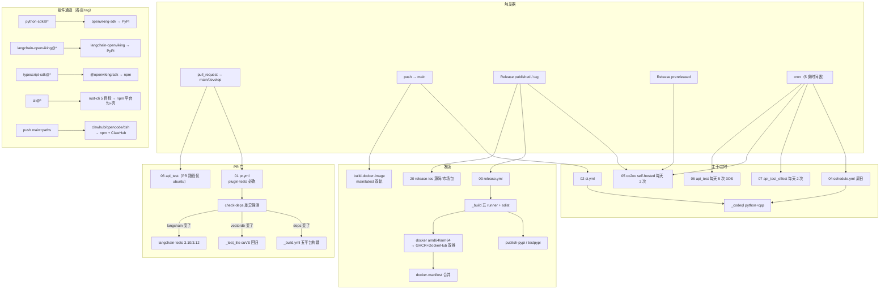

# 05 · CI/CD 流水线全景：26 个 workflow、五类触发器与十一条发版通道

> **一句话总结**：OpenViking 的 `.github/workflows/` 实际有 **26 个** yml（任务书清单 25 个漏了 `typescript-sdk-release.yml`），靠 `name:` 字段的 `01.~20.` 编号维持一套"设计意图目录"——PR 门（01/06）走"插件测试必跑 + 依赖变更条件路由"的省钱策略，主分支推送只剩 CodeQL（02），真正 heavy 的集成/效果/升级测试全部移到**定时 + release 触发**的三条流水线（05/06/07），发版则拆成 11 条通道各管一个产物、各认各的 tag 命名空间。

**基准**：HEAD=`c66b9155`（2026-08-24）；全部 yml 行号经 `read` 逐个核实。与 `CONTRIBUTING_CN.md`（601 行，L455-468 有 CI/CD 表——**该表本身已过时**，见 §8）交叉核对；DeepWiki 10.x 基线 `f316d6ad`（2026-07-26）只覆盖 12 个 workflow，差异见 §8。本地构建工具链（Makefile/setup.py/Cargo）归姊妹篇 03-build-system.md，本篇只讲 GitHub Actions 编排。

---

## 1. 分类总表：26 个 workflow 五分法

| 类别 | workflow（name 编号） | 触发器 | 一句话 |
|------|----------------------|--------|--------|
| **PR 门** | `pr.yml`（01）、`api_test.yml`（06 的 PR 路径） | PR→main/develop；PR→main | 01 管插件单测+条件路由；06 管 API 集成（仅 ubuntu） |
| **主分支/安全** | `ci.yml`（02）、`schedule.yml`（04）→复用 `_codeql.yml`（14） | push main；周日 00:00 cron | 两者都只调 CodeQL（python+cpp） |
| **定时/release 测试** | `oc2ov_test.yml`（05）、`api_test.yml`（06）、`api_test_effect.yml`（07） | cron 2-5 次/天 + release（pre）released | self-hosted P0 记忆测试、3 OS 集成、slow 效果测试 |
| **主包发版** | `release.yml`（03）→`_build.yml`（15）/`_publish.yml`（16）；`build-docker-image.yml`；`release-tos.yml`（20）；`rust-cli.yml` | Release published / tag | pip 主包、Docker 双注册表、TOS 源码包、npm CLI |
| **组件发版** | `python-sdk-release` / `python-langchain-release` / `typescript-sdk-release` / `controlplane-mcp-release` / `clawhub-dev-release` / `opencode-plugin-release` / `dsh-plugin-release` | 各自 tag 或 push main+paths | 独立版本号空间，互不阻塞 |
| **文档** | `docs.yml`（17）→`_docs.yml`/`_docs-deploy.yml`（18）；`docs-tos.yml`（19） | PR/main push paths=docs/** | GitHub Pages（官方仓）+ TOS 镜像（国内可达） |

下划线前缀 = `workflow_call` 复用模板（`_build.yml` L4、`_codeql.yml` L4 等）；但注意 **`_test_full.yml`（13）和 `_publish.yml`（16）在全仓没有任何 `uses:` 调用者**（grep 全部 26 个文件仅 7 处本地复用：_docs×2/_codeql×2/_build×2/_test_lite×1），只剩手动 dispatch 能跑——是活的死代码（§9）。

## 2. PR 质量门：条件路由省钱术

`pr.yml`（L1 `01. Pull Request Checks`）对 main+develop 的 PR 触发，四个 job 三层条件：

1. **plugin-tests 必跑**（L21-80）：Node 24 裸跑 `node --test`，一个命令列出约 36 个测试文件（L35-71）——覆盖 `examples/` 下 codex/claude-code/cursor/trae/zcode/dsh/opencode/pi 九个宿主记忆插件 + `memory-plugin-shared` + `agent-plugins`，另加 `bash -n` 安装脚本语法检查（L73-80）。**这是全仓唯一"无条件必跑"的测试**。
2. **check-deps 探测**（L82-137）：`fetch-depth: 0` 全量 checkout 后 `git diff origin/base_ref` 匹配三组正则——依赖组（L99：`pyproject.toml|setup.py|uv.lock|CMakeLists|third_party/|_build.yml`）、cuVS 组（L115：`vectordb/`+适配器+`src/`+cuvs 测试）、langchain 组（L127：`integrations/langchain/` 等）。
3. **三路条件 job**：`build` 仅当 deps_changed（L139-142 调 `_build.yml` 五平台全构建）；`cuvs-tests` 仅当 cuvs_changed（L144-150 调 `_test_lite.yml`，覆盖收窄到 ubuntu+py3.11）；`langchain-tests` 仅当 langchain_changed（L152-227，py3.10/3.12 矩阵跑 ruff+mypy+pytest+`python -m build`+twine+装 wheel 冒烟）。

**PR 没有通用 Python 测试门**：改 `openviking/` 业务代码的 PR 在 01 里什么都不跑；真正的集成门在 `api_test.yml`（L7-9 也监听 PR→main）：起真实 server（L362 `python -m openviking.server.bootstrap`）后 pytest `tests/api_test/`，PR 路径矩阵收窄为仅 ubuntu（L43 三元表达式），有 secrets 时才跑 VLM/Embedding 用例（L455-470，fork PR 自动降级）。超时 60 分钟、`max-parallel: 1`（L33/L41）。

## 3. 主干、安全与定时测试

- **`ci.yml`（02）**：push main 触发，唯一 job 是 `security-scan → _codeql.yml`（L26-27）。**名字叫 Main Branch Checks 但已不跑任何测试**——文档口径见 §8。
- **`_codeql.yml`（14）**：python+cpp 双语言矩阵（L19），`security-and-quality` 查询集（L51）；cpp 需现场 `setup.py build_ext --inplace` 供自动构建提取（L53-55）——CodeQL 顺带当了 C++ 可编译性哨兵。
- **三条定时测试线**（全部 `cancel-in-progress: true`）：`api_test.yml` cron `0 1,4,7,10,13 * * *` 每天 5 次、非 PR 场景跑满 3 OS（L43）；`api_test_effect.yml`（07）每天 2 次、仅 ubuntu、超时 120 分钟（L6/L18/L27），先轻后重跑 slow 目录，**轻量组带 `|| true` 失败不阻断**（L208），重量组串行必过（L210-215）；`oc2ov_test.yml`（05）每天 2 次（L7）+ **release prereleased 触发**（L4-5），跑在 `[self-hosted, linux, x64]`（L31）——P0 记忆测试 + `upgrade_openviking.sh` 升级路径验证（L98），是发版前的最后一道实测门。

## 4. 发版矩阵：11 条通道与 tag 命名空间

| 通道 | workflow | 触发 | 产物 | 发布目的地 |
|------|----------|------|------|-----------|
| 主包 | `release.yml`（03） | Release published，tag `v*` 门控（L48） | sdist + 五平台 wheel（abi3，py3.10 单版本 L52） | PyPI / TestPyPI（OIDC，`skip-existing` 幂等） |
| 主包 Docker | 同上 docker job | 同上（仅 release，L164） | amd64+arm64 镜像 → digest 合并 manifest | GHCR + Docker Hub 双推（L221-243） |
| 主包 Docker（第二轨） | `build-docker-image.yml` | push main（`main` tag）+ push tag `v*.*.*`（L10-12） | 同上 | 同上（与上行**同 tag 双通道重叠**，§6） |
| TOS 资产 | `release-tos.yml`（20） | Release published，tag `v*`（L26） | `git archive` 源码 zip + 插件市场精简包（L71-80） | 火山引擎 TOS（AWS CLI 走 S3 兼容 API，L65-69；secrets 缺失静默跳过 L44-57） |
| Rust CLI | `rust-cli.yml` | tag `cli@*` + push main/PR paths=`crates/**`（L5-18） | 5 目标二进制（Linux 用 zigbuild 出 **musl 静态链接**，L71-91 注释解释 glibc 兼容） | npm：5 个平台子包 + `@openviking/cli` 壳（optionalDependencies 组合，L222-243） |
| Python SDK | `python-sdk-release.yml` | Release published，tag `python-sdk@*`（L25） | `openviking-sdk` wheel | PyPI |
| LangChain | `python-langchain-release.yml` | Release published，tag `langchain-openviking@*`（L24） | `langchain-openviking` | PyPI |
| TS SDK | `typescript-sdk-release.yml` | push tag `typescript-sdk@*`（L6） | `@openviking/sdk` | npm（`--provenance`，L59） |
| 插件 ×3 | `clawhub-dev` / `opencode-plugin` / `dsh-plugin` | **push main + paths**（如 dsh L4-8 监听 `examples/dsh-memory-plugin/**`） | `@openviking/{openclaw,opencode,dsh-memory}-plugin` | npm（package.json 版本即发版号，`npm view` 幂等去重）+ ClawHub zip |
| Controlplane MCP | `controlplane-mcp-release.yml` | **仅手动 dispatch**（L9-30） | `mcp-server-openviking-controlplane` | PyPI/TestPyPI |

版本节奏（changelog 核实）：v0.4.5→v0.4.9 三周三发（约每周 1-2 个 patch），HEAD 已到 `v0.4.16`——高频发版正是"11 条通道各自独立触发"设计的需求侧原因。

## 5. 多产物顺序依赖：门控有、产物无

`release.yml` 的依赖图是 `build → permission-check → {publish-pypi, publish-testpypi, docker}`：docker job `needs: [build, permission-check]`（L159-161）但**只把 build 当故障门**——镜像由 Dockerfile 三阶段从源码自建（`OPENVIKING_VERSION` 仅作 build-arg L231），不从 PyPI 拉 pip 包。因此 **pip 与 docker 实质并行，无"镜像等包"的流水线等待**；唯一硬顺序是 docker→docker-manifest 的 digest 合并（L273-378，`buildx imagetools create`）。permission-check（L56-88）用 github-script 校验手动触发者有 write 权限，release 事件自动放行。

## 6. 新增插件发版线透露的产品动向

基线后 workflow 仅 +2（`dsh-plugin-release` c7044075、`python-langchain-release` b2e19726）−1（删 `release-vikingbot-first.yml`），但加上基线前刚生的通道，插件线已占 4 条。三个信号：①**宿主矩阵军备竞赛**——dsh（#4157）、opencode（#3836 auto-publish）、clawhub 先后加入，每个 Agent 宿主一条"push main 即发版"流水线，版本号来自各插件 package.json（不用 tag），配合 `concurrency` 串行防竞态（dsh L15-17）；②**clawhub 双轨发版**（L3-7 注释）：同一构建既发 ClawHub legacy zip 又发 npm tarball，"直到 ClawHub 的 /download 哈希兼容 npm-pack 前保持拆分"——国内插件市场与 npm 生态并行期的工程妥协；channel guard（L59-100）按 `vars.CLAWHUB_*` 判定 upstream 发 latest、fork 发 dev；③**controlplane-mcp 从外部仓 `volcengine/mcp-server` 取源**（L3-7 注释，显式 ref 可追溯，"节奏慢故仅手动"）——控制平面 MCP 已脱离本仓独立演进。

## 7. DeepWiki 差异（基线 f316d6ad，落后 262+ commits）

1. **覆盖面**：10 系列页只引用 12 个 workflow 文件，完全不知道 rust-cli/build-docker-image/双 TOS/api_test 三兄弟/typescript-sdk/4 条插件线/claude 渠道的存在；"CI/CD"条目实际只讲了 pr/ci/release/schedule+5 个 `_` 模板。
2. **PR 门描述失实**：10 页 L37 称 PR 有 "lint checks"、10.3 称 `_test_lite` 跑 `test_quick_start_lite.py` 集成测试——现状 pr.yml 无任何 lint 步骤，`_test_lite.yml` 只剩 4 个 cuVS CPU 回归文件（L86-90）。
3. **`_test_full`/`_publish` 已被架空**：DeepWiki 把它们当主力（10.5 引 `_publish.yml:66-158`），实际两者均无调用者；pypi 发布由 release.yml 内联的 `pypa/gh-action-pypi-publish` 完成。
4. **10 页 L27 "Go-based file servers"** 沿用了 01 篇 §5 已证伪的过时架构认知。

## 8. 官方文档同步缺口（CONTRIBUTING_CN.md L455-468）

本地核实的三处漂移：①称 pr.yml 跑 "Lint (Ruff, Mypy)"——不存在（ruff/mypy 只在 langchain 条件 job 里）；②称 ci.yml 跑 "Test Full 全 OS 全 Py3.10-3.14"——ci.yml 只剩 CodeQL，且 `_test_full` 默认矩阵是 3.10-3.13（`_test_full.yml` L15）；③"另外还有 Docker/Rust CLI 工作流"一句概括了实际 14 条非编号通道。文档写了三层（workflow 编号注释/CONTRIBUTING/DeepWiki），三层互相不一致——CI 演化速度超过了任何单一文档的更新频率。

## 9. 批判性收尾

1. **CI 复杂度成本已经到账**：26 个 workflow、约 5000 行 yml，编号体系（01-20）说明作者试图用命名维持秩序，但 14 个无编号通道游离其外；同一段 docker 双注册表推送+manifest 逻辑在 `release.yml` 与 `build-docker-image.yml` 间近乎完整复制（各 ~200 行），且 tag push 时双通道会**竞写同一镜像 tag**——靠 `skip-existing`/digest 幂等性兜底而非结构去重。
2. **质量门的经济学**：PR 只测插件 + 条件构建，把重测试推给定时/release——省了贡献者的等待时间，代价是"PR 绿 ≠ 主干绿"，回归可能在数小时后的 cron 才暴露（且 effect 轻量组 `|| true` 吞错）。对 274MB 级 wheel、五平台原生构建的仓库，这是理性的取舍，但新人会误以为 PR 通过即安全。
3. **单 OS 与自托管缺口**：CodeQL、效果测试、oc2ov 全部 Linux 单 OS（cpp 安全扫描不覆盖 Windows/MSVC 特有代码路径）；oc2ov 依赖 self-hosted runner，外部 fork 无法复现其 P0 门——发版质量依赖火山内网机器的可信状态。
4. **死代码与文档债**：`_test_full`/`_publish` 两具僵尸、CONTRIBUTING 三处失实、DeepWiki 落后一代——读懂这套 CI 的唯一可靠入口就是 yml 本身，这正是本篇存在的理由。

📌 **下一步阅读**
- `03-build-system.md` — `_build.yml` 调用的 setup.py 三阶段在本地如何复现
- `../05-operations/01-deploy-docker.md` — CI 产出的镜像/Dockerfile 三阶段逐行读
- mem0 案例 `notes/00-overview/04-cicd.md` — 单包单通道仓库的 CI 对照组
