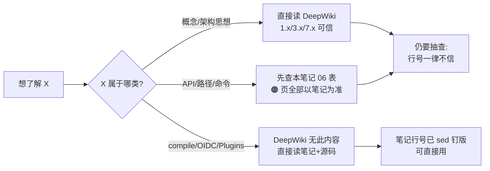

# 06 — DeepWiki 交叉对照：74 页档案 vs 本地 HEAD 的 262 commits 差异全景

> **一句话总结**：DeepWiki 档案（基线 `f316d6ad`，2026-07-26）落后本地 HEAD（`c66b9155`，2026-08-24）恰好 30 天 / 262 commits / 1702 文件 / +178641/−74912 行——这一个月 OpenViking 连续发生了"删除 Python embedded mode"（#3712）、"删除资源关系边"（#3956）、"URI 破坏性迁移 `viking://~`"（#4167/#4196）三次**破坏性变更**，并新增了上下文编译整套子系统（#3567）；DeepWiki 74 页中约 **1/4 整块失效或缺失、1/2 行号漂移、仅约 1/4 仍可直接信**——用 DeepWiki 读架构思想可靠，读 API/路径/命令面必须以本笔记系列为准。

**基准**：
- DeepWiki 侧：`f316d6ad`（2026-07-26 index），抓取于 2026-08-24 16:29 UTC，74 页全量 876KB，存于 `.understand-anything/deepwiki/`（备份 work4ai 同目录）
- 本地侧：`c66b9155`（2026-08-24，即 HEAD 本身 = feat(ragfs): fine-grain lease-mode pathlock control #4235）
- 本页所有 commit 号均经 `git log f316d6ad..HEAD --grep` 逐一核实，无一凭记忆

---

## 1. 总量对比

| 项 | 值 |
|---|---|
| commits | **262**（2026-07-26 → 2026-08-24，恰好 30 天，日均 ~8.7 个） |
| 文件变更 | **1702** |
| 行数 | **+178,641 / −74,912** |
| 引用 PR 号（去重） | 200+（#3223 → #4235） |

**目录级变更分布**（`git diff --name-only | cut -d/ -f1 | uniq -c`）：

| 目录 | 变更文件数 | 说明 |
|---|---|---|
| openviking/ | 367 | 主包：client 删除、auth 包化、retrieve 重构 |
| examples/ | 327 | 随 API 变更全量跟进改写 |
| tests/ | 324 | 同步 |
| docs/ | 223 | zh/en/ja 三语文档 + 21 份 design 文档 |
| web-studio/ | 162 | **独立 SPA 目录**（268 个 ts/tsx，DeepWiki 8.x 只覆盖其一部分） |
| bot/ | 83 | VikingBot：compile 子系统全新 + 23 commits 演进 |
| crates/ | 66 | Rust：ov_cli 命令增删、ragfs lease pathlock |
| sdk/ | 35 | 三语言 SDK 同步（#3737 等 14 commits） |
| openviking_cli/ | 24 | CLI 引导层 |
| benchmark/ | 22 | 评测微调 |
| integrations/ | 21 | LangChain 抽包（#3685） |
| agent-plugins/ | 14 | MCP 插件 |

## 2. 74 页时效性三档分层

### 🔴 整块缺失（DeepWiki 完全没有，约 4 个主题）

| 主题 | 证据 | 笔记锚点 |
|---|---|---|
| **上下文编译（ov compile）** | 主实现 `c91b0d36`（2026-07-28）晚于基线 3 天；DeepWiki grep 到的 "compile" 全是 CI 语义 | `02-vikingfs-layers/03-context-compilation.md` |
| **Web Studio 独立化** | `web-studio/` 162 文件变更、268 ts/tsx，DeepWiki 8.x 仍按 bot 内嵌描述 | `05-operations/03-vikingbot.md` |
| **Agent Plugins 1.0 规范包 / dsh 集成** | docs/zh/agent-integrations 15/17 两篇全新 | `04-integrations/01-agent-plugins-mcp.md`、`02-editor-agents.md` |
| **OIDC/LDAP 认证 + Identity Mapping** | `444cc87b`（#3708）加第五、六模式；claim/attribute/regex/composite 映射体系 | `05-operations/02-config-security.md` |

### 🟠 严重过时（结论级错误，约 10 页）

| DeepWiki 页 | 错在哪 | 真相（行号钉版见对应笔记） |
|---|---|---|
| 1.3 / 2.4 / 12.1 / 12.2 | "Python SDK supports an embedded local mode" | **#3712（`7abd6ab2`，08-10）删除 embedded mode**，`openviking/client/` 只剩 28 行 HTTP shim；三端 SDK 全部 HTTP-only |
| 1.3 / 5.3 | "Go AGFS Server" | 名存实亡：AGFS 已重写为 Rust RAGFS（concepts/05-storage.md L33），Go 代码仅剩 `sdk/go/` 客户端 |
| 1.3 | `openviking/storage/viking_fs.py` 单文件 | 已拆为 `viking_fs/` 包（8 个 mixin），其行号引用全部失效 |
| 4.2 | recall 走 `retrieve/type_quota_recall.py` 独立端点 | 该文件**已不存在**，type-quota 逻辑并入 `context_assembler/gather.py`；`/recall` 已 deprecated（`eb5aaf78` #4075 收编进 context search；`674f5e60` #3746 修 context tier ceilings） |
| 4.3 | `SessionCompressorV2` / `ov_extract_v2()` 为当前提取器 | **compressor_v2.py 已删除**，唯一入口是 V3 的 `extract_long_term_memories`（compressor_v3.py L352）；agent-evolution 分层配置/memory_diff.json/孤儿归档自愈全部缺席 |
| 12.1 | BaseClient 有 `relations()/link()/unlink()` | **#3956（`dc39985a`）删除资源关系边**，无此 API |
| 12.3 | CLI 命令面 | 仅覆盖约 1/3；grep 链路画错（实际走 `/api/v1/search/grep`）；+compile/+task cancel/+manifest 等、−relations/link/unlink |
| 12.5 | "three built-in auth modes"、`server/auth.py` | 三模式→六模式；auth.py 重构为 `server/auth/` 包（插件化 plugin.py/registry.py） |
| 6.6 | LangChain 源文件 `openviking/integrations/langchain/*` | **#3685 抽包为独立 PyPI 包 `langchain-openviking`**（6147 行），主包只剩 7 行 shim；又过时了 request-scoped actor peers（#3626）与 `viking://~`（#4196）两代 |
| 10.5 | `_publish.yml:66-158` 为主力发布 | `_test_full`/`_publish` 已是**零调用者的活死代码**；pypi 发布内联在 release.yml |

### 🟡 轻微漂移（结构对、行号旧，约 50 页）

- 5.5 构建编排：setup.py 行号漂移 ~30-60 行（106→261 等），`Makefile:154` → L161，结论仍成立
- 6.1-6.3 OpenClaw 描述与本地 03-openclaw.md 基本一致
- 7/7.1/7.2 + 8/8.1/8.2 VikingBot 本体 6 页：MessageBus/AgentLoop/ContextBuilder/ToolRegistry 描述**与当前代码一致**，是 DeepWiki 里质量最高的板块
- 11.1/11.2 benchmarks：数字可引，但 cuVS PRELIMINARY_RESULTS 有 pre-microbatch 历史 scope（L9-15），直接引用会高估当前吞吐

### 🟢 基本可信（概念/思想层，约 10 页）

1/1.1/1.2（是什么/关键概念）、3.6（L0/L1/L2 三层模型——该模型本身稳定）、13/14（社区/术语表）。

## 3. 破坏性变更清单（breaking，按时间序）

| 日期 | commit | PR | 变更 | 影响面 |
|---|---|---|---|---|
| 07-28 | `c91b0d36` | #3567 | ov compile 子系统落地 | 新增（bot/vikingbot/compile/） |
| 08-05→08-20 | `80e34984`→`1efb0dce` | — | compile 四轮演进（salvage/物化/长任务/readlist） | bot/ |
| 08-10 | `7abd6ab2` | **#3712** | **删除 Python embedded mode** | 40+ 文件（benchmark/bot/docs/examples 全改写） |
| 08-14 | `dc39985a` | **#3956** | **删除资源关系边** relations/link/unlink | API+三 SDK+CLI |
| 08-19 | `a7c77e6c` | #4180 | freshness-aware parent aggregation | 摄取调度经济学改变（延迟父级摘要） |
| 08-20 | `ff38bb5d` | #4167 | 新增 `viking://~` home 别名 | URI 空间 |
| 08-21 | `a83b8171` | **#4196** | **删除 uid-less 简写**（旧 `viking://user/memories` 写法被新版 Server 拒绝） | 所有存量客户端 URI |
| 08-24 | `c66b9155`（HEAD） | #4235 | ragfs lease-mode pathlock 细化 | 并发写安全 |

另有非破坏但重要的 API 对齐：`9eac8a6d`（#3737）三语言 SDK 与 server find/search/recall 同步（终版交付 `search_context`，SDK 无 recall 方法）。

## 4. 使用建议：怎么安全地读这份 DeepWiki 档案

1. **行号一律不信**：基线后 1702 文件变更，DeepWiki 所有 `file.py:NNN` 引用默认失效；本笔记系列 21 篇全部行号经 `sed -n` 现场钉版，引用时以笔记为准。
2. **结论要看日期**：任何"SDK 有 X 方法 / server 有 Y 端点"的断言，先到本页 §3 表对照日期——08-10（#3712）和 08-21（#4196）是两道分水岭。
3. **VikingBot 架构可读 DeepWiki、新能力不可**：7.x/8.x 六页质量高，但 compile/remote skills（#4095，1418 行）/图片输入（#3619）/凭证故障转移（#3696/#3503）全部缺席。
4. **本项目迭代速度教训**：30 天 262 commits 且含 3 次破坏性变更——任何静态 wiki 类资料（包括本页）都在过期路上；`git log --oneline -20` 永远是最新的第一手入口。

## 5. 本笔记系列的钉版原则（对标 mem0 案例）

- 所有行号基于 `c66b9155`（2026-08-24），写作时经子代理 `sed -n 'Xp'` 逐条验证（各篇尾注附抽检清单）；
- 函数名/类名比行号稳定，定位时优先按名字 grep；
- 与官方文档 `docs/zh/`（随仓库同步更新）交叉核对的结论写进各篇"与官方文档对照"节；
- 后续 HEAD 前进时：先跑 `git log c66b9155..HEAD --oneline` 评估增量，重点看是否再触 `openviking/client/`、`retrieve/`、`bot/vikingbot/compile/` 三个高频变更区。
