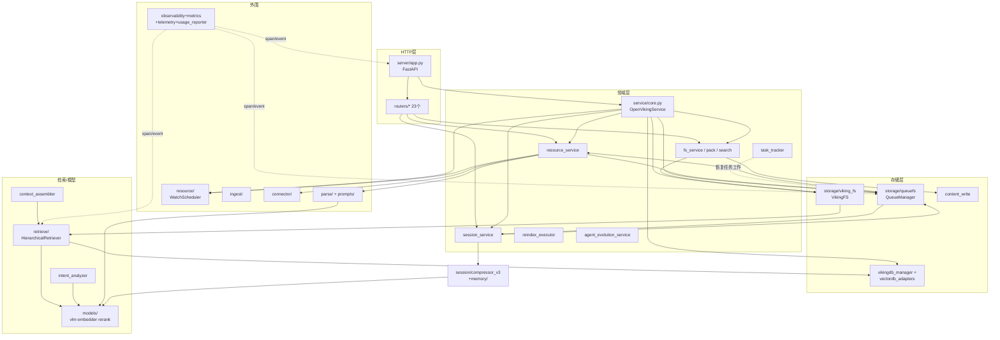

# 01 · openviking/ Python 主包全景地图

> **一句话总结**：`openviking/` 是一个以 `OpenVikingService`（`service/core.py`）为中心组装的 FastAPI 服务进程——HTTP 层（`server/`）把请求路由到领域服务层（`service/`），领域层通过 `storage/`（AGFS 内容存储 + 向量索引）与 `retrieve/`（层级检索）完成读写，异步工作全部经 `storage/queuefs/` 持久化队列消化。

**基准**：本地 clone `HEAD=c66b9155`（2026-08-25 核实），DeepWiki 档案落后 262 commits，冲突处以源码为准。
**包根**：`~/ai/photo/ocr/OpenViking/openviking/`（26 个子包 + `_sdk_import.py`）。

---

## 1. 顶层结构：两个进程入口、一个组合根

| 文件 | 行数 | 角色 |
|---|---|---|
| `openviking/server/app.py` | 821 | FastAPI 应用工厂：`create_worker_app()` L76 / `create_app(config, service)` L223，注册 23 个 router（L33-57），lifespan 中初始化 metrics、OAuth、usage audit（L296-339） |
| `openviking/service/core.py` | 644 | **组合根**：`OpenVikingService` L58 组装全部子服务并管理基础设施生命周期 |

`openviking/service/core.py`（644 行）的组装顺序就是全包的依赖图：

- **`__init__`**（L65-142）：读 ov.conf → 加数据目录进程锁（L119，见 `utils/process_lock.py`，防多进程损坏 workspace）→ `_init_storage()`（L144：建 RAGFS 客户端 → `init_queue_manager` → `VikingDBManager` → `setup_standard_queues(start=False)`）→ 建 embedder（L139）。
- **`initialize()`**（L295-512）：`init_context_collection` L337 → `init_viking_fs` L344（`storage/viking_fs/_base.py` L144）→ `DirectoryInitializer` 预置目录 L362-374 → 各子服务 `set_dependencies` L394-448 → 注册 AddResource/SessionCommit 队列消费者 L450-480 → `WatchScheduler.start()` L482 → `QueueManager.start()` L488（worker 线程刻意推迟到 VikingFS 就绪之后启动，防止恢复任务与初始化竞争，注释 L184-186）→ MinerU PDF 端点预检 L492-509。
- **`close()`**（L514-560）：严格逆序：资源后台任务 → watch/auto-commit 调度器 → 队列 → 向量库 → 释放进程锁（若清理失败则**保锁**，L555-558 注释——这是一个容易被忽略的运维坑）。

## 2. 子模块清单（每个：职责 / 关键文件 / 入口）

| 子包 | 职责一句话 | 关键文件（行数） | 入口类/函数 |
|---|---|---|---|
| `server/` | HTTP API 层：路由、鉴权、错误映射、配置热加载 | `app.py`(821) `config.py` `mcp_endpoint.py`(52KB) `routers/`(23 个) `auth/` `oauth/` | `create_app()` app.py L223 |
| `service/` | 领域服务层：FS/资源/会话/搜索/任务/Pack | `core.py`(644) `resource_service.py`(2110) `session_service.py`(674) `task_tracker.py`(1069) `reindex_executor.py`(1999) `fs_service.py`(31KB) | `OpenVikingService` core.py L58 |
| `storage/` | 双层存储：AGFS 内容 + 向量索引 + 持久队列 | `viking_fs/`(9 模块) `vikingdb_manager.py`(516) `vectordb_adapters/` `content_write.py`(1509) `queuefs/`(15 文件) `ovpack/` `transaction/` | `VikingFS` viking_fs/__init__ L109；`QueueManager` queuefs/queue_manager.py L73 |
| `retrieve/` | 层级检索 + 意图分析 + 上下文组装 | `hierarchical_retriever.py`(647) `intent_analyzer.py`(180) `context_assembler/`(13 文件) `retrieval_stats.py` | `HierarchicalRetriever` L53 |
| `session/` | 会话管理 + 长期记忆提取（Agent Evolution） | `session.py`(5307!) `compressor_v3.py`(2171) `memory/`(24 文件) `train/` `skill/` | `Session` session.py L584；`create_session_compressor` __init__ L17 |
| `resource/` | 资源 watch（定时刷新 GitHub/飞书等外部源） | `watch_manager.py`(963) `watch_scheduler.py` `staged_source.py` `uri_mutation_coordinator.py` | `WatchScheduler` L36；`WatchManager` L158 |
| `ingest/` | 本地 Agent 会话导入（backfill Claude Code/Codex/Cursor 等） | `orchestrator.py` `sources/`(7 源) `replay.py` `cursor_store.py` | `IngestOrchestrator` L51 |
| `parse/` | 文档解析（无 LLM）：路由、注册表、各格式 parser、VLM 图像理解 | `parser_router.py`(169) `registry.py` `parsers/`(17 格式) `vlm.py`(707) `understanding_api.py`(717) `image_rewrite.py` | `ParserRouter.parse` L104 |
| `prompts/` | 模板中心：按 id 渲染 prompt，携带 LLM 配置 | `manager.py`(280 逻辑行) `templates/`(11 类别) | `render_prompt()` manager.py L280 |
| `models/` | 模型抽象：VLM / Embedder / Rerank 三族 + failover | `vlm/base.py`(1098) `embedder/base.py` `rerank/` | `VLMFactory.create` base.py L318 |
| `core/` | 领域内核：URI 校验、命名空间、目录预置、retrieval targets、skill 加载 | `namespace.py` `directories.py`(354) `context.py` `retrieval_targets.py` | `PRESET_DIRECTORIES` directories.py L41 |
| `message/` | Message/Part 数据模型（user/assistant × text/image/context/tool） | `message.py`(8.6KB) `part.py`(5.5KB) | `Message`, `Part` 族 |
| `connector/` | 外部源代理：把 tos/git 等源委托给 Connector 插件进程 | `delegate.py`(33KB) `routing.py`(3.8KB) `client.py` | `ConnectorDelegate` delegate.py L97 |
| `crypto/` | 静态加密：root key 派生、provider（本地/火山 KMS） | `providers.py`(31KB) `encryptor.py` `config.py` | encryptor 工厂（core.py L124 先于 AGFS 构建） |
| `privacy/` | 隐私配置：skill 密钥等敏感配置的占位/还原 | `service.py` `skill_placeholder.py` | `UserPrivacyConfigService`（core.py L376） |
| `eval/` | RAG 评估：RAGAS 集成 + IO 录制/回放 | `ragas/`(9 文件) `recorder/`(6 文件) | `BaseEvaluator`、`IORecorder` |
| `metrics/` | 指标体系：collectors→datasources→exporters(Prometheus/OTel) | `global_api.py`(13.8KB) `collectors/`(24) `datasources/`(13) | `init_metrics_from_server_config` global_api.py L135 |
| `observability/` | HTTP 可观测中间件：span、错误上下文、usage audit | `http_observability_middleware.py`(30KB) `usage_audit/`(11 文件) | `ShardedInflightCounter` L60 起的一族 |
| `telemetry/` | 请求级遥测：OperationTelemetry、tracer、request wait tracker | `operation.py`(31KB) `tracer.py`(24KB) `request_wait_tracker.py` | `bind_telemetry` / `get_current_telemetry` |
| `usage_reporter/` | token 用量上报（从消息提取 usage 并投递 sink） | `extractors.py`(15KB) `reporter.py`(24 类 L24) `file_log_sink.py` | `UsageReporter` reporter.py L24 |
| `pyagfs/` | AGFS(Rust RAGFS) Python 绑定的异步封装 | `async_client.py`(16.6KB) `helpers.py` `exceptions.py` | `AsyncAGFSClient` |
| `integrations/` | LangChain 集成 | `langchain/` | — |
| `utils/` | 横切工具：embedding/资源处理/模型重试/断路器/进程锁等 | `resource_processor.py`(35KB) `embedding_utils.py`(25KB) `model_retry.py`(22KB) | — |
| `client/` / `web_studio/` | 兼容垫片（SDK 导入 / 静态资源挂载） | 各 `__init__.py` | — |

## 3. 依赖图

要点：
- **`queuefs` 是唯一的异步汇流点**：AddResource/SessionCommit/Semantic/Embedding 四条队列都在 `core.py` L450-480 注册消费者；服务重启后 `prepare_task_tracking`（queue_manager.py L135）用队列快照重建任务索引。
- **`service/` 与 `storage/queuefs/` 互相依赖**（processor 回调 service），靠 `get_queue_manager()` 单例 + 延迟 import 打破环（queue_manager.py L153 注释 "Import handlers here to avoid circular dependencies"）。
- `openviking_cli`（Rust CLI 的 Python 侧配置库）是全包最底层依赖：ov.conf 解析、`VikingURI`、异常类型都来自它。

## 4. 三条主线穿越路径

**① 写主线（add_resource）**：
`server/routers/resources.py` → `ResourceService.add_resource`（resource_service.py L1100）→ `_prepare_standard_source_plan`（L700：git/飞书/远程/本地四路探测，staged source 冻结到临时目录）→ `AddResourceProcessor._process`（queuefs/add_resource_processor.py L103，经队列）→ `execute_add_resource_job`（resource_service.py L536）→ parse（`ParserRouter.parse` parser_router.py L104）→ 树写入 VikingFS → Semantic 队列（`SemanticProcessor.on_dequeue` semantic_processor.py L315 → `SemanticDagExecutor.run` semantic_dag.py L219）→ Embedding 队列 → 向量库。
穿越：`server → service → connector/resource → storage/queuefs → parse → storage/viking_fs → storage/vectordb_adapters`。

**② 读主线（find/search/recall）**：
`server/routers/search.py`（find L290 / search L389 / recall L449 已弃用）→ `SearchService`（search_service.py：find L125 / search L77）→ `VikingFS.find/search`（viking_fs/_semantic.py L183 / L279）→ `IntentAnalyzer`（intent_analyzer.py L55，仅 search）→ `HierarchicalRetriever.retrieve`（hierarchical_retriever.py L101）→ `VikingDBManagerProxy.search_in_tenant/search_children_in_tenant`（vikingdb_manager.py L437 / L460）→ rerank + hotness → `MatchedContext`。
穿越：`server → service → storage/viking_fs → retrieve → models/rerank → storage/vectordb_adapters`。

**③ 会话主线（session.commit）**：
`server/routers/sessions.py` → `SessionService.commit_async`（session_service.py L399）→ `Session.commit_async`（session/session.py L1794，Phase 1：pathlock 下归档 + 入队）→ `SessionCommitProcessor`（queuefs/session_commit_processor.py L26）→ `Session.resume_queued_commit`（session.py L2197，Phase 2）→ `_run_memory_extraction`（L2355）→ `SessionCompressorV3.extract_long_term_memories`（compressor_v3.py L352）→ `ExtractLoop`（memory/extract_loop.py L82，ReAct 式记忆更新）→ `memory_updater` 写 `viking://user/{id}/memories/**` → 语义/向量队列再消化。
穿越：`server → service → session → storage/queuefs → session/memory → models/vlm → storage/viking_fs`。

## 5. 设计权衡与坑

- **上帝对象风险**：`session/session.py` 5307 行、`resource_service.py` 2110 行、`mcp_endpoint.py` 52KB——单文件聚合了大量状态机。阅读时用 grep 定位方法再精读，不要顺序读。
- **单例网**：`get_viking_fs` / `get_queue_manager` / `get_task_tracker` / `get_openviking_config` 全是模块级单例，测试靠 conftest 里对 `viking_fs._instance` 的代理 Hack（viking_fs/__init__.py L158-188 专门为此写了 `_ModuleProxy`）。
- **进程模型**：队列 worker 是**线程**（queue_manager.py L112 `_queue_threads`），线程内再 `run_coroutine_threadsafe` 跳回服务事件循环（add_resource_processor.py L318）——线程只做轮询，协程做业务；跨线程上下文（telemetry/task）必须显式 rebind（session_commit_processor.py L48-61 注释解释了为什么必须在协程内 bind）。
- **DeepWiki 差异**：DeepWiki 页面仍把 `semantic_sidecar.py` 当独立模块描述；本地 #4180 已将其重命名为 `storage/abstract_overview.py`（含 OKF frontmatter 解析与 freshness 元数据），以源码为准。
