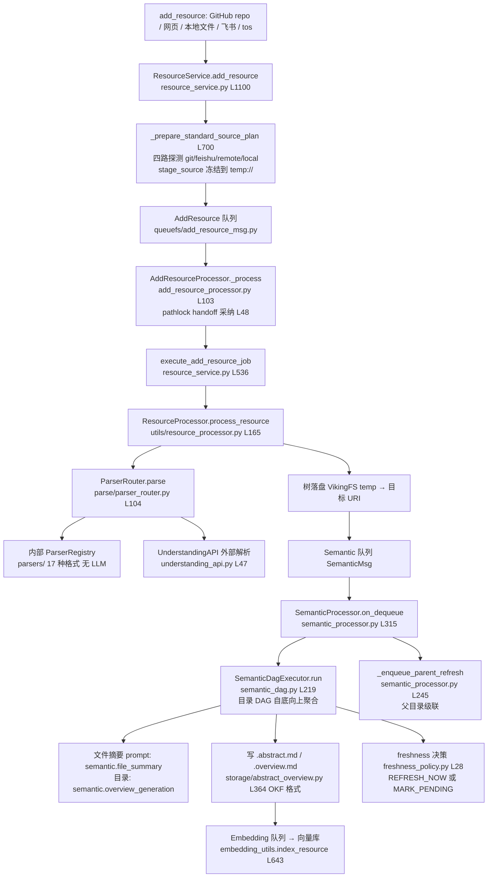

# 02 · 摄取与解析管线（resource/ + ingest/ + parse/ + prompts/）

> **一句话总结**：资源摄取是一条"同步冻结源 → 持久队列 → 无 LLM 解析 → DAG 式语义生成（.abstract/.overview）→ 向量化"的流水线；#4180 引入 freshness-aware parent aggregation 后，宽目录的父级摘要生成被延迟到变更比例阈值触发，改变了整个语义 DAG 的调度经济学。

**基准**：`HEAD=c66b9155`。PR #4180（freshness，本地 commit `a7c77e6c`，2026-08-21）**DeepWiki 档案没有**，本文全部以源码为准。
对照：`docs/zh/concepts/06-extraction.md`（三层异步架构：Parser 无 LLM / TreeBuilder / SemanticQueue）。

---

## 1. 全景数据流

## 2. 入口：`resource/` 与 source plan

### `openviking/service/resource_service.py` (2110 行)

关键方法分布：`add_resource` L1100、`refresh_resource` L1154（watch 定时刷新复用，`manage_watch=False`）、`_submit_resource_ingestion` L1197（统一校验与路由）、`_prepare_standard_source_plan` L700、`execute_add_resource_job` L536、`_monitor_queue_processing` L1760。

**`_prepare_standard_source_plan`（L700-）精读**：
- 职责：在任何工作入队前把"源"**冻结成持久形态**——注释原话 "Freeze one durable standard-pipeline source before it crosses QueueFS"（L710）。这是为了重启后任务可重放。
- 路由判定（L715-722）：`is_git_repo_url(path)` → git；`FeishuAccessor._is_feishu_url` → 飞书；`is_remote_resource_source` → 远程；`Path(path).exists()` → 本地（限长 1024 且无换行，防路径注入，L719）。
- git 路径（L736-748）：拒绝 URL 内嵌 userinfo 凭据（L737）；凭据必须走 `args.auth_config` → `create_git_http_auth_state` 存入 task_auth（凭据永远不进队列正文，对照 connector/routing.py L40 `CONNECTOR_CREDENTIAL_ARGS` 的同类设计）；`_preflight_git_source` 预探测默认分支。
- 飞书路径（L749-783）：token 传入 auth_state；若 `should_use_understanding_directly` 则在入队前就 `submit_understanding` 拿 response_id（解析与传输并行）。
- 产出 `_SourcePlan`（L168）+ `StagedSource`（`resource/staged_source.py`，本地源先快照到 `temp://`，队列消费时若任务已取消则 `delete_temp` 清理，add_resource_processor.py L63-69）。

### `resource/watch_manager.py` (963) + `watch_scheduler.py`

- `WatchTask`（watch_manager.py L55，Pydantic）：记录 source_path/to_uri/interval/next_execution_time；`calculate_next_execution_time` L146。
- `WatchScheduler`（watch_scheduler.py L36）：单循环 `_run_scheduler` L163 → `_check_and_execute_due_tasks` L192 → `_execute_stable_task` L256 → 调 `ResourceService.refresh_resource`。core.py L482 `enable_watch_scheduler=false` 可整体关闭。
- `_try_mark_executing` L418 用存储内原子标记防多 worker 重复执行。

### `ingest/`：本地 Agent 会话导入

`ingest/orchestrator.py` L51 `IngestOrchestrator.backfill` L127 把本机 Claude Code / Codex / Cursor / OpenCode / OpenClaw / Hermes 的会话记录（`sources/` 7 个源适配器）回放到 OpenViking 会话。这是"把别家 Agent 的历史变成你的记忆"的通道，与 add_resource 主线独立。

## 3. 队列消费：`add_resource_processor.py` (327 行)

`AddResourceProcessor(DequeueHandlerBase)`：
- **`on_dequeue`（L304）**：在队列 worker **线程**里反序列化 `AddResourceMsg`，然后 `asyncio.run_coroutine_threadsafe(self._process(...), self._service_loop)`（L318）跳回服务事件循环——线程只搬消息。
- **`_process`（L103-276）**：
  1. `tracker.create("add_resource", task_id=msg.task_id)`（L111）——若任务已处终态（取消/完成/失败），直接清理 staged source 并 ACK（L119-132）。
  2. **锁 handoff**（L48-61 / L85-101）：`pathlock_adopt(msg.lock_handoff)` 采纳入队时持有的 pathlock 租约；失败则重新获取，再失败重入队（最多 2 次，L86）。锁随消息走，避免"队列排队期间别人改目录"。
  3. 执行 `execute_add_resource_job`（L188），带 `stage_callback` 更新任务阶段；失败 `tracker.fail`（L201），成功 `tracker.complete`（L210）。
  4. `wait_for_descendants`（L219）等待派生的语义/向量任务，注入 `queue_status`（请求在队列里等了多久）与 token usage 快照（L233-239）。
- **失败模式**：`on_cancelled` L278 释放锁 + 清理 staged source——取消路径泄漏临时目录是最常见的垃圾来源，这里显式处理了。

## 4. 解析：`parse/`

### `openviking/parse/parser_router.py` (169 行)

- `should_use_understanding_api` L47：读 `ov.conf [parser_api] enable + extensions` 白名单按扩展名路由；飞书已归一化为 Markdown 的源强制走内部（L56-57）。
- `parse` L104：三态——`parser_backend` 显式指定 INTERNAL/UNDERSTANDING，或按白名单默认路由；`split_content=False`（no_split 模式）与外部解析器互斥，直接抛 `InvalidArgumentError`（L126-129）。
- `understanding_api.py` L47 `UnderstandingAPI`：文件走 multipart 上传（`_multipart_create_file` L584 支持分片）、URL 直提（`submit_url` L258）、轮询 `_poll_response` L476、结果 zip 下载解包回 temp 目录（`_unpack_zip_to_temp_dir` L649）。

### 内部 parsers（`parse/parsers/`，17 个文件）

按格式：markdown(69KB 最大)/pdf(34KB)/directory(27KB 代码仓库，遵循 .gitignore)/excel/html/word/epub/powerpoint/legacy_doc/text/media(图音视频，配合 `parse/vlm.py`)。设计铁律（06-extraction.md）：**Parser 不调用 LLM**——除 media 需 VLM 生成字幕/描述外，全部是确定性转换。`parse/vlm.py` L41 `VLMProcessor`：`understand_image` L59、`batch_understand_pages` L233（PDF 逐页）、`filter_meaningful_images` L583（先廉价过滤再贵模型精读，控制 token 成本）。

## 5. 语义生成：`storage/queuefs/` DAG（含 #4180 freshness）

### `semantic_processor.py` (1528 行)

`SemanticProcessor.on_dequeue`（L315）关键分支：
- **stale 消息降级**（L340-359）：新消息已合并（coalesce）时，旧消息若 trigger 是 `content_write` 且带增量变更，则**降级为 file-only 工作**（`msg.aggregate_directory = False` L356）——目录聚合交给最新消息，但本消息的文件摘要/向量照做。这是 #4180 的核心机制之一。
- 断路器（L371-382）：VLM API 已知故障时消息**重入队等待**而非报错丢弃。
- 增量判定（L421-463）：`target_uri` 与 `uri` 不同则先 `_sync_topdown_recursive` 算 diff；相同且带 `changes` 则直接增量。
- 构建 `SemanticDagExecutor`（L465-483，注意 `aggregate_directory=msg.aggregate_directory` L482），`await executor.run(run_uri)` L484。
- 成功且未 stale 且聚合开启 → `_enqueue_parent_refresh`（L498，向上冒泡）。

**`_enqueue_parent_refresh`（L245-313）——父级冒泡的入口**：子级 L0 body 变化后，对父目录调 `plan_abstract_overview_refresh(changed_entries=1, force_refresh=False)`（L263-275）。`refresh_ratio` 默认 0.10、`overview_sample_limit` 默认 32。决策为 `REFRESH_NOW` 才入队一条 `recursive=False, changes={"modified":[uri]}, generation_trigger="parent_refresh"` 的父消息（L292-312）。

### `storage/queuefs/semantic_ops/freshness_policy.py` (62 行，#4180 新增)

纯函数 `decide_parent_refresh`（L28-62）三态决策：

| 条件 | 动作 |
|---|---|
| L0 body 未变 / 无变更 | `NOOP`（pending 不动） |
| 无 freshness 基线（旧 sidecar） | `REFRESH_NOW`（首次全量） |
| `total_entries <= overview_sample_limit`（窄目录）或 force | `REFRESH_NOW` |
| `pending_after / total_entries >= refresh_ratio`（默认 0.10） | `REFRESH_NOW` |
| 否则 | `MARK_PENDING`（计数 +1，聚合延迟） |

注意 L41-44 注释：pending **按事件计数而非去重子项**，宽目录阈值等价于 `ceil(refresh_ratio * total_entries)`。

### `storage/abstract_overview.py` (634 行，由 `semantic_sidecar.py` 更名)

- **OKF 格式**（L165 `parse_abstract_overview`）：`---` 开头的 YAML frontmatter（directory/source/generated_by/freshness 四键，L29 `_METADATA_ORDER`）+ Markdown body。无 frontmatter 视为 legacy（L184）。freshness 计数约束：`sampled + unsampled == total`、pending 非负（L141-158）。
- **`write_abstract_overview`（L364-）**：读旧文档 → 合并 metadata；若请求带 freshness，则 `pending_child_changes = max(requested_pending, current_pending)` 取最大（L412-426）——防止并发写回退计数；`consume_pending` 归零发生在聚合真正完成时。
- **`plan_abstract_overview_refresh`（L481）**：读父目录 sidecar → 无 freshness 基线 → `REFRESH_NOW`；有基线 → `decide_parent_refresh`；`MARK_PENDING` 时只原子更新计数并回写 metadata（L573-579）。
- **公共写保护**（`prepare_abstract_overview_write` L241）：用户 body 编辑不得改动受保护 metadata（L267-268 抛 `AbstractOverviewMetadataError`），且新建生成式 sidecar 被协调器拒绝（L255-257 注释）。

### `semantic_dag.py` (998 行) — `SemanticDagExecutor`

- `DirNode`（L40-57）持 `file_summaries/children_abstracts/pending/pending_snapshot/sampled_*`；`SemanticNodeScheduler`（L84-148）是 per-event-loop 共享工作池（WeakKeyDictionary 缓存，L135）。
- `_dispatch_dir`（L359）：列目录 → `deterministic_sample`（abstract_overview.py L327，稳定采样上限 `overview_sample_limit` 默认 32）→ 读 `pending_snapshot`（L383-392，`read_abstract_overview_pending_snapshot` L589）→ 增量模式下只需采样文件 + 变更文件（L398-410）。
- `_file_summary_task`（L639）：增量 + 内容未变 + 非采样重建 → 复用旧 overview 里的摘要、跳过向量化（L658-663）；**pending 触发的采样重建**（L650-656）强制重新生成摘要但 `need_vectorize=False`（L664-670 注释：延迟消息已维护过向量）。
- `_overview_task`（L868）：`aggregate_directory=False` 时只收尾不动 sidecar（L872-880）；否则生成/复写 overview+abstract，`_write_directory_semantics`（L833）写入时 metadata 携带 `freshness_metadata(total_entries, sampled_entries)`（L848）并 `consume_pending=node.pending_snapshot`。media 单文件目录直通（`_select_direct_media_overview` L772）。
- 向量化失败**必须 raise**（L958-965）——commit 信息里明说 "always retry directory vectorization so stale sidecars or transient vector failures cannot be silently accepted"。

## 6. prompts/

`prompts/manager.py`：`PromptManager` L52 按目录加载模板（frontmatter 含变量元数据与可选 llm 配置），`render_prompt(id, vars)` L280 全局入口。语义管线用：`semantic.file_summary` / `semantic.document_summary`（semantic_processor.py L1012-1016）、`semantic.overview_generation`（L1352-1423，条目超 `overview_batch_size` 时分批再合并）。templates 目录分 11 类（compression/indexing/memory/parsing/processing/retrieval/semantic/skill/vision 等）。

## 7. 批判：失败模式与设计权衡

1. **token 成本结构**：全量摄取一个 N 文件 M 目录仓库 = N 次文件摘要 + M 次目录 overview + 根 abstract，每次都是完整 VLM 调用（受 `max_concurrent_semantic` 信号量约束，core.py L130 默认 32）。#4180 之前**每次单文件改动都会向上冒泡触发整条祖先链的 overview 重生成**；之后宽目录按 10% 变更率才刷新——这是把 O(变更数×深度) 的 LLM 成本压到 O(变更数 + 阈值触发数) 的关键改动。
2. **队列积压**：Semantic 队列单线程轮询（queue_manager `_poll_interval=0.2s`），VLM 慢（分钟级）时消息堆积；缓解手段是 coalesce（`build_semantic_coalesce_key`，同 URI 新消息使旧的 stale）+ 断路器重入队，但 coalesce 只对同目录生效——大量不同目录的变更仍会线性排队。`root_write_result.wrote=False` 时执行器标记 stale 让位新消息（semantic_dag.py L864-866）。
3. **freshness 的诚实代价**：pending 计数只记数量不记 URI（semantic_dag.py L665-667 注释承认），所以阈值触发时必须**重建全部采样摘要**而非增量补——正确性换简单性。
4. **双状态解耦**：语义状态（sidecar 文件）与向量状态（向量库记录）分开维护（commit 信息："preserve separate semantic/vector statuses"），一侧失败不拖垮另一侧，但代价是可能出现"有摘要无向量"的中间态，靠 reindex（service/reindex_executor.py，1999 行，支持 `--recursive`）兜底修复。
5. **本地路径信任**：`allow_local_path_resolution=True`（add_resource L1116）允许服务端读任意本地路径——服务端部署时应配合 `local_input_guard.py` 与 `enforce_public_remote_targets` 收紧。

## 自校验（抽查 3 处）

- `resource_service.py` L1100 `async def add_resource(` ✔（read 核实）
- `freshness_policy.py` L28 `def decide_parent_refresh(` ✔（read 核实）
- `semantic_dag.py` L639 `async def _file_summary_task(` ✔（read 核实）
