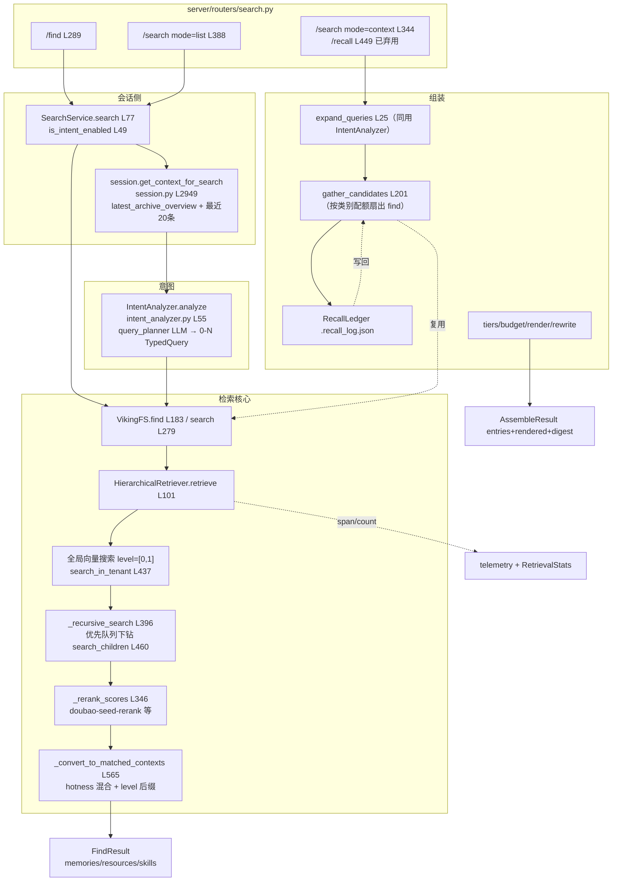

# 03 · 检索管线——find/search/recall 三入口、目录递归与可观察轨迹

> **一句话总结**：OpenViking 查询侧是一条「**入口分流 → IntentAnalyzer 意图分析（可选）→ HierarchicalRetriever 在 L0/L1 目录向量上优先队列递归 → rerank 精排 + hotness 混合 → FindResult / 组装好的 context 块**」的管线：find 是无会话单查询直检，search 是带会话的多 TypedQuery 并发，recall 已弃用、折叠为 `/search mode="context"` 的服务端上下文组装；每一步都经 telemetry span、会话级 `.recall_log.json` 台账与 RetrievalStats 留下可观察轨迹。

**基准**：本地 clone HEAD=`c66b9155`（2026-08-25 核实）；与 `docs/zh/concepts/07-retrieval.md`（194 行，本地核实）、`docs/zh/api/06-retrieval.md`（1127 行）交叉核对；DeepWiki 页 4.2 基线 `f316d6ad` 落后 262 commits，recall 相关描述整体过时（§9）。

---

## 1. 四类查询入口：确定性导航与语义检索同文件

`openviking/server/routers/search.py` 一个文件里装了查询侧全部入口——**确定性导航（grep/glob，零向量成本）与语义检索（find/search）是并列的第一层分流**：

| 入口 | 行号 | 语义 | 会话 | 下游 |
|---|---|---|---|---|
| `POST /grep` / `/glob` | search.py L476/L514 | 正则/通配确定性导航 | 无 | `service.fs.grep/glob`，不进本管线 |
| `POST /find` | search.py L289 | 语义直检：**单 TypedQuery，原查询** | 无 | `SearchService.find`（search_service.py L125）→ `VikingFS.find`（`storage/viking_fs/_semantic.py` L183） |
| `POST /search` mode="list" | search.py L388 | 语义检索 + **意图分析出 0-N 个 TypedQuery** | 可选 | `SearchService.search`（L77）→ `VikingFS.search`（_semantic.py L279） |
| `POST /search` mode="context" | search.py L404→L344 | **服务端组装注入上下文块**（预算/档位/去重/digest） | 可选 | `assemble_context`（`retrieve/context_assembler/pipeline.py` L52） |
| `POST /recall` | search.py L449，`deprecated=True` | 上面 context 模式的**薄预设**（#4075 收编） | 可选 | `fold_recall_request` → 同一 `assemble_context` |

三个语义入口的真实分界**不是**「find=导航 / search=检索 / recall=记忆」：find 与 search 走完全相同的 `HierarchicalRetriever.retrieve`（连 rerank 与否都只取决于配置，见 §4）；差别只有两点——search 多一段意图分析、多产 `query_plan`/`query_results` 字段（_semantic.py L416-422）。recall 的记忆召回特色（type-quota、peer 惩罚）没有消失，而是下沉进了 `context_assembler/`。

## 2. 查询数据流全链路

## 3. IntentAnalyzer：会话上下文 → 查询计划

`IntentAnalyzer`（`openviking/retrieve/intent_analyzer.py` **L38**）是 search 链路的"大脑前置"：

- **输入三元组**（`analyze` L55-126）：会话压缩摘要（截到 30000 字符，L49/L139）+ 最近 5 条消息（L51 `max_recent_messages=5`）+ 当前查询；`VikingFS.search` 在有 `target_uri` 时还会把目标目录 L0 摘要作为 `target_abstract` 喂进去帮助改写（_semantic.py L328-334，span `search.target_abstract`）。会话数据来自 `session.get_context_for_search`（session.py **L2949**）：最新归档 overview + 最近 20 条消息。
- **执行体不是检索模型而是 `query_planner`**（L73-74 `config.get_query_planner()`，未配置回退 `vlm`）；且有**模型专属 prompt 映射**（L24-27 `QUERY_PLANNER_PROMPT_BY_MODEL`）：两个 ollama 量化 SFT 模型各配紧凑契约 prompt——官方在用微调小模型替换通用 VLM 做这一步。
- **输出 `QueryPlan`**：0-N 个 `TypedQuery(query, context_type, intent, priority)`；concepts/07 L61-67 的查询风格约定（skill 动词开头 / resource 名词短语 / memory "用户XX"）就是这些 prompt 的契约。0 个查询=闲聊免检索（concepts/07 L71）。
- **两种消费姿势**：search 链路 `_semantic.py` L353-364 直接 `await analyzer.analyze(...)`——**无超时、无 try 包裹，解析失败直接抛 ValueError（intent_analyzer L90-92）炸掉整个请求**；recall 链路 `expand_queries`（expansion.py L25）则 `asyncio.wait_for` 套 `recall_intent_timeout_s`（默认 5s）+ 异常回退原查询（L47-60，fail-closed），并把查询数硬帽在 `MAX_PLANNED_QUERIES=3`（params.py L35），原文始终排第一。同一分析器、两套容错，是真实的失败模式差异（§10）。

## 4. HierarchicalRetriever：目录递归与 L0→L1→L2 的消费方式

`HierarchicalRetriever`（`openviking/retrieve/hierarchical_retriever.py` **L53**，锚点 `retrieve` L101）是唯一执行体，find/search/recall 最终都到这。检索消费三层模型的方式（衔接 02-l0l1l2.md，不重复 sidecar 本身）：

1. **QUICK/THINKING 双模式**（`RetrieverMode` L48-50）：默认由 **rerank 是否配置**决定（L126-127 `QUICK if not rerank_client else THINKING`）——不是由 find/search 入口决定，与文档"search() 默认 THINKING"的表述有微妙偏差；图片查询强制 QUICK+level=[2]（L128-131）。
2. **QUICK**：一次全局 `search_in_tenant`（L180-188，limit=max(limit,10)），按 URI 去重排序即返回——不 rerank、不 hotness（L216-217）、不递归。
3. **THINKING 四步**：
   - 全局向量搜索**只搜 level=[0,1]**（L227）——目录级 sidecar 向量是递归的路标，这就是"L0 进向量库"的检索端消费；
   - 起始点 = rerank 后的全局目录命中 + 显式 `target_directories`（补 0 分入队，L269-272）；无显式目标时由 `default_target_directories`（L169）按 context_type 给根（MEMORY→`viking://~/memories` 等，concepts/07 L92-98）；
   - `_recursive_search`（**L396**）：**最大堆**按分数出队（L472-481），每轮并行下钻 ≤4 个目录（`MAX_PARALLEL_CHILD_SEARCHES` L59）调 `search_children_in_tenant`（vikingdb_manager.py **L460**，每目录取 max(limit*2,20)），对子结果逐层 rerank（L500-502）；
   - **分数传播**：`final = alpha*child + (1-alpha)*parent`（L506-507），`score_propagation_alpha` 默认 **1.0**（retrieval_config.py L19）= 只信子节点自身分数、父目录分数不传播——机制存在但默认关闭，起步点 0 分时短路为子分（`if current_score`）。
4. **下钻与收网的分层**：候选里 `level != 2` 才继续入堆（L530，L2 文件是终端命中）；调用方 `level=[...]` 过滤决定收集哪些层（L517）——「目录层递归、文件层收网」。**收敛判据**（L542-556）：top-k 集合连续 3 轮不变（`MAX_CONVERGENCE_ROUNDS` L56）或候选池连续 3 轮零增长，双保险停机。
5. **输出转换**（`_convert_to_matched_contexts` **L565**）：hotness 混合 `final=(1-alpha)*semantic + alpha*hotness`（L595-599，`hotness_alpha` 默认 0=关闭，retrieval_config.py L10；hotness=sigmoid(log1p(active_count))×7 天半衰期指数衰减，memory_lifecycle.py L19）；L0/L1 命中的 abstract 经 `body_for_preview` 剥掉 OKF frontmatter（L606-613，兼容旧索引里整份 OKF 入库的情况）；目录 URI 补 `/.abstract.md`/`/.overview.md` 后缀（`_append_level_suffix` L635-647），把检索结果直接变回可 `read` 的导航句柄。

## 5. Rerank：模型、预算与回退

- **统一出口** `_rerank_scores`（**L346**）：`rerank_batch(query, documents)`，documents 就是候选的 `abstract` 字段——**rerank 的打分文本 = L0 正文**（concepts/03 L138 的"rerank scalar 是纯 L1 正文"在当前代码里实为 abstract 字段，两文档口径不一致，以代码为准）。用在两处：起始目录评估（L253-258）与每层子节点（L500-502）。
- **token 预算**（L363-371）：query 截到 `max_input_tokens*3//4`，文档按剩余预算截断。
- **Provider 族**：`RerankClient.from_config` 统一分发（L90），支持 vikingdb(volcengine)/cohere/openai/litellm（rerank_config.py L9，dispatch 在 volcengine_rerank.py L205-217）；默认模型 `doubao-seed-rerank`（rerank_config.py L22）。concepts/07 L156-160 只列了 Volcengine。
- **回退**：API 失败/长度不齐 → 回退向量分（L379-389，warn 日志）。这个降级对用户完全不可见——且 `retrieve` 上报 stats 时**只传了 `rerank_used`，`rerank_fallback` 参数从未被喂**（L314-320 vs retrieval_stats.py L109），观察面有洞。

## 6. recall → context_assembler：组装面才是记忆召回的现役形态

`assemble_context`（pipeline.py **L52**）七步：①`expand_queries` 有界扩询（§3）；②`RecallLedger.load` 读冷集合；③`gather_candidates`（gather.py **L201**）——**按类别配额扇出多路 find**：每类查各自根目录（`category_targets` L94：memories/events/entities/preferences/experiences、resources、skills），peer_scope=all 时额外以去身份 ctx 查 `~/peers` 并按 `origin_for_uri`（L119）标记 actor_peer/other_peer 施加惩罚分（`ranked_score=score-penalty`，L243-250）；冷却/排除 URI 靠 `_overfetch`（L260-267）补取避免整页被滤空；单路失败只计入 `retrieval_errors` 不炸整体（`_safe_find` L182-198，InvalidArgumentError 除外）；④tier 规划（tiers.py：abstract 免读直用向量 payload / overview、full 需 read L2 正文）+ 逐条 token 帽；⑤render；⑥可选 LLM digest 重写（`rewrite_context`，超时 30s）；⑦**写回台账**。`/recall` 预设只是叠默认值：purpose=coding、min_score=0.1、dedup_turns=5、max_chars 6500→按 4 chars/token 折算（recall_preset.py L24-34）。#3534 的动机写在 pipeline docstring：一次 HTTP 往返取代每个插件各自的 search-then-read 循环。

## 7. 可观察轨迹：三层留痕与查询方式

1. **请求级 telemetry span/counter**（可随响应返回，`telemetry=True`）：HTTP 层 `run_operation` 定名 `search.find/search.search/search.context/search.recall`（routers L308/L434/L373/L461）；管线内 span：`search.target_abstract`、`search.intent_analysis`（_semantic L331/L355）、`search.embed_query`、`search.vector_retrieval`（retriever L155/L179/L220/L285）；counter：`vector.searches/scored/scanned/passed`、`search.typed_queries_count`（_semantic L376）、`vector.returned`（L276）。
2. **会话级台账 `.recall_log.json`**（ledger.py **L21**）：`RecallLedger`（L52）在会话 URI 下记录每个 served URI 的 `{turn, detail}`；`cooled_uris`（L118）把「近 `dedup_turns` 轮已服务过且 detail≠uri」的 URI 下一轮排除；上限 500 条、按轮剪枝（L23/L147-158）；写失败降级为"无去重"（L171-173）。**查询方式**：直接 `read` 会话目录下该文件即可复盘"这轮注入了什么、何时注入"。注意 `no_relevant` digest 会清空本轮记录（pipeline L132-136）——没被读者看过的内容不该进冷却。
3. **进程级 `RetrievalStatsCollector`**（retrieval_stats.py **L78**，单例 L171）：`record_query`（**L103**）累计 zero_result_rate/avg_score/latency/rerank_used，`RetrievalObserver`（storage/observers/retrieval_observer.py）经 observer API 暴露聚合健康度；#3975/#3985 两次修的就是"空检索是否算故障"的判定。
4. `QueryResult.searched_directories`（retrieve L322-326）名字有误导——**返回的是起始根 root_uris，不是实际 visited 集合**，调试时别当递归轨迹用。

## 8. freshness-aware（#4180，a7c77e6c）对检索聚合的影响

检索消费的是向量库里的 L0/L1，而 #4180 决定这些 sidecar **何时重算**，因此直接塑造检索结果的新鲜度：

- 纯策略函数 `decide_parent_refresh`（`storage/queuefs/semantic_ops/freshness_policy.py` **L28-62**）：三态 `NOOP / MARK_PENDING / REFRESH_NOW`——**子目录 L0 正文 digest 未变 → NOOP，冒泡当场终止**；小目录（total_entries≤overview_sample_limit=32）→ 立即刷新；宽目录 pending/total ≥ `freshness_refresh_ratio`(0.10) 才刷新，否则只累计计数。
- 接线在 `_enqueue_parent_refresh`（semantic_processor.py L245-296）：仅 resource/skill 冒泡（L247-248，memory 不冒泡），`force_refresh=False` 只作用于自动路径（L270-273 注释）。
- **对检索的四点影响**：①宽目录的 L0 有界滞后成为契约——检索可能命中"3/161 子项已变但未重算"的目录摘要（设计文档 L61-67 明确接受无时间兜底）；②pending 计事件不去重（L40-44）→ 热点子项让阈值**更早**触发，滞后偏向保守；③API `semantic_status: deferred`（设计文档 L309-315）让调用方能区分"文件向量已更新 vs 目录摘要滞后"——但 grep 源码未见该字段落地，**纯策略已实现、API 表达未实现**；④由于 freshness metadata 不进 embedding 白名单（02 篇 §3）、MARK_PENDING 只写 metadata，被延迟的目录聚合不会触发重嵌入——检索看到的 abstract 分数与正文保持稳定（此点为推断，依据 02 篇白名单机制）。

## 9. 与官方文档对照 / DeepWiki 差异

- **concepts/07-retrieval.md（194 行）**：两阶段流程、根目录映射、收敛参数、score_propagation_alpha=1.0、rerank 回退均与代码一致。三处偏差：①`MatchedContext` 字段写 `is_leaf`（L171），实际代码是 `level + category + search_tags`（retriever L615-628，#3730 加了 tags）；②find vs search 表（L15-21）暗示"find 低延迟"，实际 QUICK/THINKING 由 rerank 配置决定，find 配了 rerank 一样走 THINKING；③rerank 后端只列 Volcengine，实际四 provider。
- **api/06-retrieval.md（1127 行）**：L604 起 mode="context" 契约（target_uri → 400 等）与 routers 校验（L217-231 `CONTEXT_ONLY_FIELDS` L160-172）一致，是三入口现状的权威源。
- **DeepWiki 4.2（基线 f316d6ad，过时须标注）**：仍把 recall 描述为独立端点走 `openviking/retrieve/type_quota_recall.py` 做四类记忆独立搜索——该文件**已不存在**，type-quota 逻辑重构进 `context_assembler/gather.py` 的 `gather_candidates`；`/recall` 已 deprecated（#3534 服务端组装 → #4075 收编）。以源码为准。

## 10. 批判性收尾

- **与纯 RAG top-k 的权衡**：目录递归买到了结构性剪枝和 token 经济（L0 当路标、L2 才全文），代价是延迟与调参面——THINKING 一次查询 = 1 次全局搜 + 每层 ≤4 并行的 children 搜 + **每层一次 rerank API 调用**，深树上是多轮串行 round-trip；收敛启发式（top-k 3 轮不变/池停滞）没有质量保证，只是预算刹车。`DIRECTORY_DOMINANCE_RATIO`（L57）定义后**全文无引用**——"目录分需超子项分 1.2 倍才提前停"的设计残留，死了的常量是算法演化的化石。
- **意图分析的失败模式**：search 链路的 analyze 无超时无兜底，query_planner 抖动一次就 500；0 查询判定（闲聊）误杀时**静默漏检索**，调用方只能靠 `query_plan` 事后审计。SFT 小模型 + 紧凑 prompt（L24-27）是在补这个成本/稳定性洞，但契约解析仍是 `parse_json_from_response` 单点。
- **打分信号薄**：rerank 只看 256 字符级 L0 正文（§5），目录"值不值得下钻"由最短的摘要决定；hotness 与分数传播两个混合旋钮默认全关（0.0 与 1.0），文档描述的丰富排序机制在生产默认下其实是"裸向量分 + rerank"。
- **观察面缺口**：`rerank_fallback` 恒 False（§5）、`searched_directories` 语义失真（§7）——管线最值得信的轨迹是 `.recall_log.json`（有持久化、有轮次语义）和 telemetry span（有预算数字），两者刚好一个面向会话复盘、一个面向性能剖检。

## 📌 下一步阅读

1. `openviking/storage/vikingdb_manager.py` L437/L460 两搜的过滤下推（tenant、context_type、scope DSL 如何翻译成向量库查询）；
2. `context_assembler/tiers.py` 全文——memory 文件 Summary 抽取与代码骨架（`extract_skeleton_result`）如何做档位降级；
3. `storage/observers/retrieval_observer.py`——空检索健康判定的最终形态。
