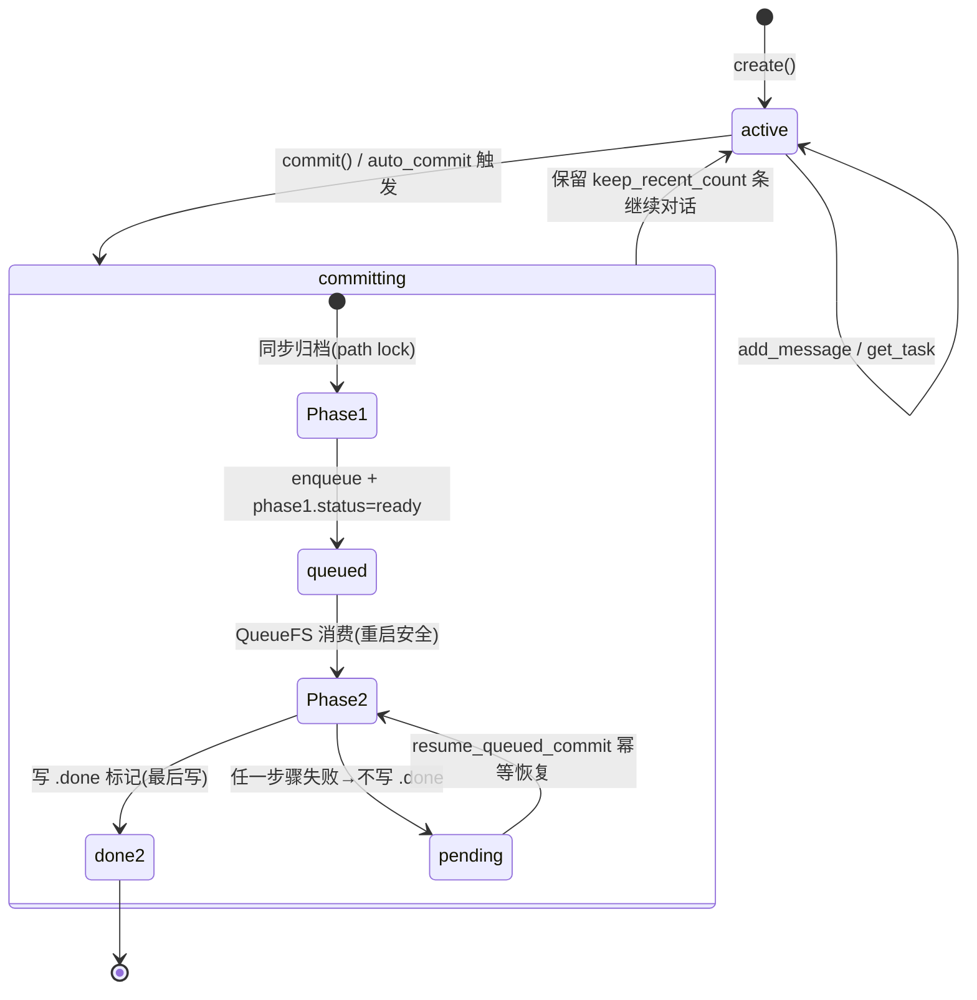
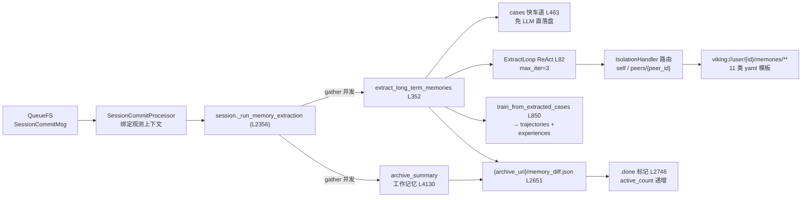

# 04 · 会话与记忆提取：Session 生命周期、CompressorV3 与 Agent Evolution

> **一句话总结**：Session 是 OpenViking 记忆系统的"进料口"——commit 时先同步归档对话（Phase 1），再由 QueueFS 异步驱动 SessionCompressorV3 用 ReAct 式 ExtractLoop 从对话中提取 11 类长期记忆，其中 cases→trajectories→experiences 这条 Agent Evolution 流水线还能把"做过的事"训练成"可复用的经验"。

**基准**：HEAD=c66b9155（2026-08-25 核实）；与 docs/zh/concepts/08-session.md、docs/zh/api/05-sessions.md、api/16-memory.md 交叉核对。DeepWiki 档案（f316d6ad，落后 262 commits）描述的 V2 提取链已过时，见 §6。

---

## 1. Session 生命周期：L0/L1/L2 三层存储

官方模型（concepts/08-session.md）：**创建 → 交互 → 提交**。每个 session 落在 `viking://user/{user_id}/sessions/{session_id}`，内部按信息密度分三层（api/05-sessions.md）：

| 层 | 内容 | 角色 |
|---|---|---|
| L0 | abstract（会话摘要） | 最低成本的路标 |
| L1 | overview（消息级压缩） | 中密度检索锚点 |
| L2 | messages + `history/archive_NNN/` 原文 | 全量事实 |

生命周期中"关闭"不是独立状态：session 没有 close/delete 的显式状态机，归档（archive）+ `.done` 标记即终态；删除走通用资源删除路径。**提交既可手动也可自动**——`session_service.py` 实现了完整的 auto_commit 判定函数族，每轮交互后 `is_next_check_due` 决定是否触发：

| 判定函数（session_service.py） | 语义 |
|---|---|
| `get_token_threshold` | 未提交 token 超阈值 → 该 commit 了 |
| `get_idle_timeout_seconds` | 用户空闲超时 → 提交（趁冷启动窗口跑 Phase 2） |
| `get_message_count_threshold` | 消息条数阈值（兜底） |
| `get_min_commit_interval_seconds` | 最小提交间隔（防抖） |
| `get_keep_recent_count` | 活跃区保留条数（默认 0=全归档，插件 afterTurn 常传 10） |
| `has_uncommitted_content` / `has_idle_uncommitted_content` | 有无可提交内容 / 空闲时可提交内容 |

读取侧对称：`get_session_context`（session.py L2883）按 token_budget=128_000 组装 L0/L1/L2 混合上下文。



## 2. commit 两阶段：同步归档 + 异步提取

`session.py::commit_async`（L1794，docstring L1807 "Archive immediately and enqueue restart-safe Phase 2 processing"）是全流程枢纽：

**Phase 1（同步，用户可感知）**
1. 拿 path 级分布式文件锁；
2. 依据 token 预算做保留计划（retention_plan），`compression_index += 1`（L2046），归档目录命名 `history/archive_{index:03d}`（L2048；同步 commit 路径在 L1965-1969 也有同构逻辑）；
3. 组装 `SessionCommitMsg`（含 memory_policy 快照、usage_uris）入队 QueueFS（L2107）；
4. 发布根状态 `phase1.status=ready`。keep_recent_count 默认 0（全部归档），插件 afterTurn 常传 10。

**Phase 2（异步，重启安全）**



- 消费者 `storage/queuefs/session_commit_processor.py::SessionCommitProcessor`：绑定可观测性上下文（token 消耗归因到提交账号），经 `task_tracker` 跟踪任务生命周期；session 已被删则任务标 fail 而非报错。
- 入口 `session.py::_run_memory_extraction`（L2356，telemetry="session_commit_phase2"）：`archive_summary`（工作记忆，`_generate_archive_summary_async` L4130）与 `long_term_memory_extraction`（长期记忆）经 `asyncio.gather` **并发**执行（L2627），每步有 `_run_retryable_phase2_step` 重试。
- **幂等恢复**：`resume_queued_commit`（L2197）重启后扫描未完成归档——`.done` 标记最后写（L2746，函数 L2820），任一步骤失败则不写；已完成步骤记录 message id（`completed_memory_steps`），恢复时跳过不重提。
- **串行保序**：`_can_run_archive`（L3863）确保 archive N 运行前，N-1 不处于 pending；若前驱 phase1=ready 但队列工作丢失（孤儿归档），写 failed 标记 + tracker.fail 后放行（L3877-3907）。
- **产出物**：提取的 memory diff 写 `{archive_uri}/memory_diff.json`（L2651）；被引用记忆的 `active_count` 递增（L2701 附近，usage 统计侧，见 §5 备注）。

## 3. 记忆提取：CompressorV3 + ExtractLoop（ReAct）

`compressor_v3.py::SessionCompressorV3.extract_long_term_memories`（L352）是**唯一公共提取入口**（设计文档 session-memory-extraction-flow.md 明确）：

1. **范围解析**：session.py L2557 `_resolve_memory_extraction_scope` 综合 memory_policy（`MemoryPolicy.from_dict`）与配置，决定 self 记忆是否允许、允许哪些 peer、哪些 memory type。MemoryPolicy 四字段（见 `_apply_agent_evolution_setting` L116-133）：`self_enabled` / `peer_enabled` / `memory_types` / `working_memory_enabled`；
2. **Agent Evolution 过滤**：开关关闭时 `_apply_agent_evolution_setting`（session.py L116）从有效类型集合中减去 `AGENT_EVOLUTION_MEMORY_TYPES`；
3. **cases 快车道**：训练用例走 `_commit_training_case_fast_path`（L463），跳过 LLM 直接落盘；
4. **常规提取** `_extract_user_memories`（L593）：构造 `SessionExtractContextProvider`（`session_extract_context_provider.py` L53，`prepare_extraction_messages` L115 负责预取：ls + 读 .overview.md + search）→ `create_default_registry()` + `initialize_memory_files`；
5. **ReAct 循环** `memory/extract_loop.py::ExtractLoop`（L82，默认 max_iterations=3，L98）：LLM 带工具（read/write memory 文件）迭代，要么调工具要么输出最终 operations（结构化 schema 由 `SchemaModelGenerator` 动态生成，L166-195）；内置**拒答检测**正则（L43，中英文 canned refusal）、格式错误重试 1 次、patch 修复指令（L868）、事务级文件锁；
6. **隔离与路由**：`memory_isolation_handler.py::MemoryIsolationHandler`（class L36，`calculate_memory_uris` L236）决定写自己（`viking://user/{id}/memories/`）还是 peer（`.../peers/{peer_id}/memories/`）；
7. **prompt 模板**：`prompts/templates/memory/` 下 11 个 yaml（profile/preferences/entities/events/identity/soul/cases/trajectories/experiences/tools/skills）+ experimental_memory/ 实验区；
8. **session skills**：独立开关 `_session_skill_extraction_enabled`（L724）/ `extract_session_skills`（L730），与长期记忆并发跑。

## 4. Agent Evolution：从 cases 到 experiences 的经验学习

traj-exp-experience-learning-redesign.md 的核心思想：**experiences 目录不是散文记忆，而是一套 Experience Policy Set**——把成功轨迹蒸馏成可执行的策略补丁。流水线：

```
cases(任务用例) → RolloutExecutor(回放) → PolicyTrainer → RolloutAnalyzer
→ GradientEstimator(经验梯度) → PolicyOptimizer(补丁合并) → PolicyUpdater
→ trajectories/(轨迹) + experiences/(经验)
```

代码锚点（compressor_v3.py）：`train_from_extracted_cases`（L850）流式训练，L880-891 装配 `ExperienceSetLoader + PatchMergePolicyOptimizerContext + ExperienceGradientContext`；`_build_training_memory_diff`（L1075）、`_link_case_to_training_outputs`（L1171）建立溯源。训练引擎在 `openviking/session/train/`（19 文件），明确四类边界：并行/串行/存储/LLM。

**溯源机制**（`memory/experience_lineage.py`）：`TRAJECTORY_OUTCOMES = ("success","failure","partial","unknown","unfinished")`（L26）；每条 experience 通过检索 tag 记录它由哪些轨迹提炼（`experience_source_tag` L52），每条轨迹带结局 tag（`trajectory_outcome_tag` L95）——查询时可反查"这个经验用过几次、成功几次"。

**查询面**：`service/agent_evolution_service.py::AgentEvolutionService`——GET `/api/v1/agent-evolution/experiences/trajectories`（api/19-agent-evolution.md），分页默认 50/上限 1000，TimeRange 过滤。

**开关演进**（代码已超越设计文档）：agent-evolution-global-switch-design.md 定义 ServerConfig 部署级开关 `server.agent_evolution.enabled` 默认 false，禁用不删文件；但 HEAD 中 `session_service.py` 已 import `AgentEvolutionConfigProvider`——**分层配置**（account settings 叠加 ov.conf），且 #4126 恢复了用户级 memory 提取策略（`read_user_memory_policy`）。运行期注入由 openclaw-agent-experience-memory-design.md 负责：`agentExperience.enabled` 默认关，transformContext 组装 `<openviking-context>` 注入。

**资源↔记忆链接**：`service/resource_memory_link_service.py`——资源文件不可变，溯源元数据（MEMORY_FIELDS：LinkType 枚举+weight）写在 memory 文件侧；`on_resource_added` 借普通 session commit 桥接（特殊 session id `__openviking_resource_reason__`，memory types 限 entities/events 等）。

## 5. 与官方文档对照

- **记忆类型数**：api/16-memory.md 列 **11 类**（9 核心 + tools + skills）；concepts/02-context-types.md L55-67 表格只列 9 类。以 11 为准（模板目录也是 11 个 yaml）。
- **recall() 已弃用**：只是 search mode="context" 的预设包装，新代码应直接用 search。
- **Phase 2 细节文档未覆盖**：`.done` 幂等标记、孤儿归档自愈（L3863）、active_count 递增（对接 usage-count-record 实施方案：memory.recalled 事件 → `experience.recall.count` 计量日志）都只在代码里。
- **设计文档漂移**：全局开关设计文档（Phase1 快照/Phase2 消费）方向正确，但开关粒度已从"部署级单一布尔"演进为分层配置；#4126 又加回用户级策略。读设计文档必须对照 HEAD。

## 6. DeepWiki 差异（基线 f316d6ad，已过时）

DeepWiki 档案把 `SessionCompressorV2`（compressor_v2.py）当作当前提取器（如 L4844、L5550-5551），并描述 `ov_extract_v2()` 入口——**HEAD 中 compressor_v2.py 已删除**（`session/__init__.py` 只导出 SessionCompressorV3），唯一入口是 V3 的 `extract_long_term_memories`。DeepWiki 也完全没有 agent-evolution 分层配置、memory_diff.json、孤儿归档自愈这些后加机制。结论：会话/记忆主题以本笔记行号为准，DeepWiki 仅作历史参考。

## 7. 批判性收尾

- **LLM 提取质量是单点**：整个长期记忆管道压在一次 ReAct 调用上（max_iterations=3），拒答检测（extract_loop L43）只防"模型不干活"，防不了"模型胡编"——记忆污染一旦写入，会通过检索持续放大（self-RAG 的经典失败模式）。active_count 机制部分缓解（被引用的记忆更"活"），但没有淘汰坏记忆的负反馈通道。
- **成本结构**：每次 commit = 1 次摘要 + 1 次多轮 ReAct（每轮带工具 schema），外加 embedding。auto_commit 的 token 阈值设计实际是在"记忆时效性"与"提取成本"间找平衡；keep_recent_count 默认 0（全归档）对高频会话意味着频繁 commit。
- **复杂度代价**：两阶段 + 队列 + 幂等标记 + 孤儿自愈，重启安全做得极认真，但状态机分支（pending/ready/done/failed/queue_missing）每一处都是维护负担——L3863 那段 45 行的前驱解析就是证明。
- **Agent Evolution 的隐含赌注**：把经验做成"策略补丁"而非自然语言，可执行性强但可解释性弱——用户很难审计一条 experience 到底改了什么行为；experience_lineage 的 tag 溯源是对此的补救，目前只到"轨迹级"，不到"补丁 diff 级"。
