# 01 · viking:// URI 规范——命名空间、home 别名与物理映射

> **一句话总结**：`viking://` 是 OpenViking 一切内容的统一寻址层——它用「scheme + scope + path」把记忆/资源/技能/会话组织成一棵虚拟文件树，`~` 家目录别名（PR #4167 新增、#4196 转正为唯一短写）在**请求边界**展开为 canonical URI，再由 `_uri_to_path` 做纯前缀替换映射到 AGFS 的 `/local/{account_id}/` 物理路径。

**基准**：本地 clone HEAD = `c66b9155`（2026-08-24）。DeepWiki 基线落后 262 commits，**不含** #4167/#4196/#4235，本文所有行号以本地源码为准。

---

## 1. URI 语法与 scope 分类

```
viking://{scope}/{path}
```

scope 的权威定义在 `openviking_cli/utils/uri.py` 的 `VikingURI` 类：

| 集合 | 成员 | 语义 | 行号 |
|---|---|---|---|
| `LISTABLE_SCOPES` | resources / user / agent | `ov ls` 根目录可列出 | uri.py L38-42 |
| `PUBLIC_SCOPES` | = LISTABLE | 公开 API 可用 | uri.py L43 |
| `LEGACY_SCOPES` | session | 向后兼容别名 | uri.py L44 |
| `INTERNAL_SCOPES` | temp / queue / upload | 内部作用域，公开 API 拒绝 | uri.py L45 |
| `ALIAS_SCOPES` | `~` | **服务端**家目录别名，仅第 0 段合法 | uri.py L48 |
| `VISITABLE_SCOPES` | 以上全并集 | 解析器/存储内部可寻址 | uri.py L51 |

`VikingURI._parse()` 只做两件事：剥离 scheme、检查 segment-0 ∈ VISITABLE_SCOPES（uri.py L70-89）。注意 L86-89 的报错信息刻意**过滤掉 ALIAS_SCOPES**——"`~` 接受但不宣传"，错误提示里永远不会教用户用 `~`。

**user 命名空间结构**（namespace.py L14-20 的三张表决定分类）：

- `_CONTENT_TYPES_BY_SCOPE["user"] = {memories→memory, resources→resource, skills→skill}`（L15）——三个内容目录，出现在 `user/{uid}/` 第 2 段时决定 context_type；
- `_PEER_CONTENT_SEGMENTS = {memories, resources}`（L18）——peer 空间下的内容段（`user/{uid}/peers/{peer_id}/...` 第 4 段，见 L126-127）；
- `_USER_RELATIVE_ROOT_SEGMENTS = {peers, privacy, sessions}`（L19）——用户相对根段，**这 6 个名字 = 保留段**（3 内容 + 3 相对根，见 L441-449 `_is_reserved_user_root_segment`）。

`classify_uri()`（namespace.py L137-150）依据这些表把任意 URI 分类为 memory/skill/resource——检索、ACL、语义处理都吃这个分类结果。

## 2. 三段式解析管线：谁在哪一层做什么

URI 从外部字符串变成存储路径，经过**三层递进的解析器**，每层权限递减：

```mermaid
flowchart LR
    A["客户端字符串<br/>viking://~/memories/x.md"] --> B["① validate_viking_uri<br/>词法校验<br/>uri_validation.py L35-64"]
    B --> C["② resolve_request_uri<br/>请求边界（需身份）<br/>namespace.py L257-266"]
    C --> D["展开别名<br/>resolve_current_user_uri<br/>namespace.py L269-313"]
    D --> E["canonical: viking://user/alice/memories/x.md"]
    E --> F["③ resolve_uri 严格解析<br/>namespace.py L228-254<br/>（拒绝 ~ 与 session）"]
    F --> G["_uri_to_path 前缀替换<br/>_access.py L430-451"]
    G --> H["/local/{account}/user/alice/memories/x.md"]
```



### 2.1 请求边界展开（`~` 的实现位置）

`resolve_request_uri`（namespace.py L257-266）：仅当 `ctx.role ∈ {USER, ADMIN}` 才走 `resolve_current_user_uri`，否则直接进严格解析器——**root 角色和内部调用方用 `~` 会直接失败**，因为那里没有"调用方"概念。

`resolve_current_user_uri`（namespace.py L269-313）处理三种情况：

1. **`~` 展开**（L282-285）：`viking://~` → `canonical_user_root(ctx)`（= `viking://user/{ctx.user.user_id}`，L157-158）；`viking://~/{rest}` 逐段拼接。同一个字符串对不同调用方指向不同目录——身份取自认证上下文，不是字符串本身。
2. **legacy `session` 展开**（L287-293）：`viking://session/{sid}` → `viking://user/{uid}/sessions/{sid}`。
3. **保留段拒绝**（L295-309）：`viking://user/memories/...` 这类**无 uid 短写**抛 `NamespaceShapeError`，错误文案同时给出两种正确写法：`'viking://~/{rest}'` 和 `'viking://user/{{user_id}}/{rest}'`。注意 L300 的 **self-id 逃生口**：如果 `parts[1] == ctx.user.user_id`（调用方真叫 "memories"），按显式 uid 处理，不拒绝。

### 2.2 严格解析器（fail-closed）

`resolve_uri`（namespace.py L228-254）是内部唯一信任的解析入口：

- scope == `~` → 直接抛 `Home alias URI is not canonical`（L244-249）。设计意图（L245-248 注释）：能带着 `~` 走到这里说明**没有身份可展开**（root 请求、内部调用、存储路径），宁可失败也不落盘一个字面 `~` 目录；
- scope == `session` → 同样拒绝（L250-251）；
- `user/{uid}` 走 `_resolve_user_uri`（L411-438）：uid 必须通过 `validate_user_id` 字符集校验（L419-421，字符集不含 `~`——这是 #4167 选择 `~` 做保留 token 的前提：**永不与真实 uid 碰撞**）；peer 段也要过 `normalize_peer_id`（L433, L360-370）。

### 2.3 校验层如何组合两者

`uri_validation.py`：

- `_PUBLIC_API_SCOPES = {""} ∪ PUBLIC ∪ LEGACY ∪ ALIAS`（L17-20）——公开 API 白名单**接受** `~`；
- L53-62：scope 报错文案排序时剔除 ALIAS_SCOPES（L56-57）——同一处"接受但不宣传"；
- `validate_request_viking_uri`（L67-85）= 词法校验 + 请求边界别名展开，REST/MCP/CLI 所有入口共用这一个漏斗。

**持久化不变式**：`VikingURI.build()` 拒绝铸造 `~`（uri.py L202-204：`scope in ALIAS_SCOPES` 直接 `ValueError`）。响应回显、向量记录、watch key 里只存在 canonical 形式——别名是纯输入态。

## 3. PR #4167 → #4196：一次教科书式的破坏性迁移

两个 commit 都在本地 git log 可查：

- **`ff38bb5d`（PR #4167，2026-08-20）**：新增 `~` 别名。改动的核心文件正是上文读过的 namespace.py（+11）、uri_validation.py（+9）、mcp_endpoint.py。commit message 明确设计点：`~` 是保留 token 不能与真实 uid 冲突；canonical parser 拒绝别名（fail closed）；接受但不宣传；MCP search 的 exclude_uris 补齐同一校验。
- **`a83b8171`（PR #4196，2026-08-21，`feat(uri)!`）**：**删除**旧的无 uid 短写。原因：`viking://user/memories/...` 与"一个真叫 memories 的用户"二义——真叫 memories 的用户对 USER/ADMIN 调用方**不可达**。既然 `~` 已无歧义覆盖同一需求，短写从"展开"改为 400 拒绝。迁移面极大：commit 改动涵盖 vikingbot/langchain/全部插件 emitter（codex、claude-code、openclaw、openwebui、dsh、zcode、pi）、Go SDK 示例、tau2 benchmark、eval golden dataset；存量用户配置里的 `viking://user/resources|skills` 由 `AddTargetsConfig` 在校验时自动归一化为 `~` 形式。

**时序洞察**：#4167（周四晚合入）→ #4196（隔天周五合入）。先铺无破坏的新写法、全量迁移自家 emitter，再砍旧写法——"先给桥、再拆路"，且兼容层放在**配置读取**处而非请求处理处，运行时路径保持单一 canonical 形态。

## 4. URI → 物理存储映射

`VikingFS._uri_to_path`（`openviking/storage/viking_fs/_access.py` L430-451）：

```python
# 纯前缀替换：viking://{remainder} -> /local/{account_id}/{remainder}
# 无隐式 space 注入——URI 必须显式携带空间段
return f"/local/{account_id}/{'/'.join(safe_parts)}"   # L451
```

三个要点：

1. **租户隔离 = 一层目录前缀**。account_id 来自 `RequestContext`（L436-437），不在 URI 里——同一 URI 在不同 account 下指向不同物理树。`/local` 是 mount 点（`agfs_utils.py` L271 将 localfs 挂载到 `/local`；queuefs 挂 `/queue` L216，serverinfofs 挂 `/serverinfo` L209）。
2. **legacy session 拒绝**（L439-440）：内部路径不允许 `viking://session/...`，读路径的兼容回退由 `_read_paths`（L492-504）显式枚举两个 legacy 候选路径实现——兼容只在读侧，写侧永远 canonical。
3. **段名截断**（`_shorten_component` L417-428）：单段 UTF-8 超 255 字节时截断 + sha256 前 8 位后缀。这就是 URI 段可以含中文（uri.py `sanitize_segment` L231-263 保留 CJK/西里尔/阿拉伯字符区间）而底层 ext4 不炸的原因。**注意 URI 与物理路径不是双射**：极端长名会物理截断，但逻辑层永远用原 URI。

反向映射 `_path_to_uri`（L753-769）要求路径以 `/local/` 开头，剥前缀拼 `viking://`。

**路径变量**（`{calendar:today}` 等）由 `openviking/core/path_variables.py` 的 `PathVariableResolver` 在**服务端 API 执行时**渲染：`CalendarVariableProvider`（L42-99）提供 today/yesterday/tomorrow/year/month/day/ym/quarter/yq/week/yw 共 11 个变量。CLI/SDK 原样传模板，服务器按时区/日期展开——客户端无时钟依赖。

## 5. 与 POSIX 路径的差异清单

| 维度 | POSIX | viking:// |
|---|---|---|
| 根 | `/` | `viking://`（scope 为空串，namespace.py L237） |
| 第一段语义 | 普通目录名 | **scope**，受 VISITABLE_SCOPES 白名单约束（uri.py L86） |
| `~` | shell 客户端展开 | **服务端**展开，仅 USER/ADMIN 角色（namespace.py L264-265） |
| 相对路径 | 支持 | 不存在，必须完整 `viking://` 形式（uri_validation.py L42-50） |
| `.` / `..` / symlink | 支持 | 无概念；`parent` 是纯字符串截断（uri.py L134-158） |
| 用户隔离 | 文件权限 | scope 规则 + account 前缀双重隔离（namespace.py L316-338 `is_accessible`） |
| 路径变量 | 无 | `{namespace:key}` 服务端模板（path_variables.py） |
| 尾斜杠 | 无意义 | 惯例上目录带尾斜杠（docs/zh/concepts/04 L356-363），解析层会 rstrip（namespace.py L94） |

## 6. 设计权衡与坑

- **为什么用 URI 而不是纯 POSIX 路径**：scope 把 ACL/生命周期/可见性编码进地址本身（resources=account 全局、user=用户私有、temp=解析期临时），检索与路由可以在**不看存储**的情况下做权限判断；同时为多租户预留了"URI 不变、物理路径随 account 变"的间接层。
- **为什么 `~` 只在第 0 段识别**：`viking://resources/~/x` 里的 `~` 是字面文件名（docs/zh/concepts/04 L38）。只做 segment-0 别名让解析保持 O(1) 前缀判断，避免每段都要查身份表。
- **坑 1：`~` 会被 root 角色请求打爆**。内部脚本/后台任务复用 root 身份发 `viking://~/...` 直接 400。必须先展开成显式 uid 形式再进内部路径。
- **坑 2：破坏性变更的迁移代价真实存在**。#4196 当天就修了 CI（api_test 全部改写）；第三方集成若缓存了旧短写会静默 400 而非报错提示迁移——错误文案里带纠正建议是唯一的自救手段（namespace.py L304-309）。
- **坑 3：物理段截断意味着不要用物理路径做 identity**。跨系统对账时以 canonical URI 为准，`/local/...` 路径可能因 255 字节截断不可逆。
- **坑 4：`viking://user` 是容器不是家目录**。user key 列它只见自己的空间（docs/zh/concepts/04 L97, L127-128）——把 `viking://user` 当自己根目录写数据是 #4196 之前最常见的误用来源。

## 7. 与其他模块的关系

- **L0/L1/L2**（`02-l0l1l2-model.md`）：sidecar `.abstract.md`/`.overview.md` 就是挂在目录 URI 下的特殊文件，URI 树的父子关系（`VikingURI.parent`）驱动摘要冒泡。
- **ragfs**（`04-ragfs-rust.md`）：canonical URI 经 `_uri_to_path` 变成 `/local/...` 后才进入 Rust 栈；pathlock 锁的也是物理路径。
- **检索**：`find`/`search` 的 target_uri 接受 `~` 形式，服务端展开后做 scope 过滤。
- **多写存储**：`.redirect.json`/`.sync_log.json`（internal_names.rs L14-17）与锁文件一样是隐藏内部名，不污染 URI 语义。

## 📌 下一步阅读

1. `02-l0l1l2-model.md`——目录级 sidecar 如何在这棵 URI 树上自底向上生成；
2. `openviking/core/namespace.py` L194-225——actor peer view 如何在 `peers/` 段上再做一层视图过滤；
3. `tests/unit/test_namespace_uri_classification.py`——保留段/别名行为的权威用例集（#4167/#4196 的测试都落在这里）。
