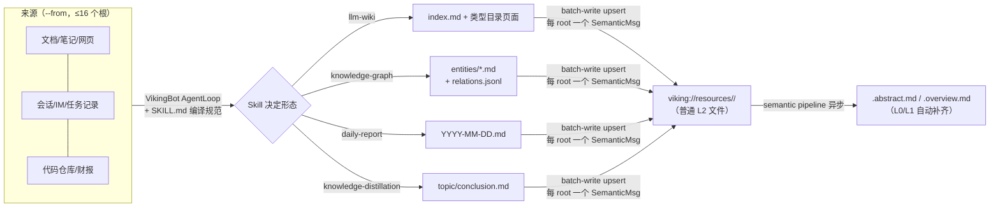

# 03 · 上下文编译——llm-wiki、知识图谱、日报与知识蒸馏四条编译管线

> **一句话总结**：`ov compile` 是 OpenViking 唯一的"静态知识库 → LLM 可用产物"编译器——用户给 `--from`（来源）、`--to`（目标）、`--skill`（编译规范）、`--reason`（本次指令），VikingBot 在独立 AgentLoop 里以用户身份 survey→定向精读来源，把结论写成 OKF Markdown 页面，经确定性 renderer 校验后 batch-write 回 `viking://` 树。Compile 本身不规定产物形态——llm-wiki（互链页面+index）、knowledge-graph（entities/*.md+relations.jsonl）、日报（每天一页）、知识蒸馏（主题/结论两级树）只是官方附带的四个 Skill 示例。产物是**普通 L2 文件**，写入后按 refresh root 合并发一个 SemanticMsg，由上一篇讲的 L0/L1 流水线自动补 sidecar——编译自带语义闭环，但不自带重编译。

**基准**：HEAD=c66b9155（2026-08-24）；与 docs/zh/context-compilation/ 五篇（01-overview 55 行、02-llm-wiki 131 行、03-knowledge-graph 106 行、04-daily-report 69 行、05-knowledge-distillation 82 行，均本地核实）及 docs/design/ov-compile-design.md（689 行）交叉核对；行号均已在本地源码核实。

---

## 1. 定位：编译体系与 L0/L1/L2 体系的关系

两套系统是**正交的编译器与摘要器**：

- compile 把"原始材料"变成"结构化知识产物"（形态由 Skill 决定）；
- semantic pipeline 把任意目录树压缩成 L0/L1 sidecar（形态固定）。

衔接点在 batch-write 的 refresh 编排——`openviking/storage/content_write.py` L503-509 把变更按 `(refresh_root, context_type)` 分组，**每个 refresh root 只入队一个 SemanticMsg**，resource/skill 目标随后由 semantic_processor 自底向上更新 `.abstract.md`/`.overview.md`。因此：

1. 编译产物确实存进 viking:// 树，且自动获得三层 sidecar；
2. Skill 明确禁止 Agent 自己写派生文件——llm-wiki SKILL.md L18-20 列出 `.overview.md`/`.abstract.md`/`AGENTS.md`/`CLAUDE.md` 均不得生成，skill 快照加载时就排除它们（service.py L90-92 `_SKILL_EXCLUDED_FILES`）。

分工一句话：**Compile owns writes & task history，semantic pipeline owns derived sidecars**。

## 2. 四条管线：同一引擎，四种 Skill

| Skill | 产物形态 | 关键约束 |
|---|---|---|
| llm-wiki | `index.md` + `entity/ concept/ method/ comparison/ analysis/ summary/` 按类型分目录的互链页面 | 默认只用 entity/concept，其余类型须过严格判定（SKILL.md L39-42）；index 是基础设施非知识页 |
| knowledge-graph | `entities/<id>.md`（frontmatter 含 type/id/title/entity_type/description/sources/aliases）+ `relations.jsonl`（每行一条 `from/relation/label/to/evidence` 边） | `relation` 是语言无关机器谓词（`member_of`），`label` 才是本地化显示名；支持增量刷新、证据合并 |
| daily-report | `<YYYY-MM-DD>.md` 每天一页 | 从对话/会话/IM/纪要还原"做了什么"；无活动日期也建页并如实声明 |
| knowledge-distillation | `<topic>/<conclusion>.md` 浅层主题树 | 每页一条独立结论（如"增长从量驱动转向价驱动"），跨来源对比是主场景 |

## 3. 执行流水线：从 CLI 到 batch-write

**入口链**：`ov` CLI（`crates/ov_cli/src/commands/compile.rs` L9-48，`--wait` 时从 500ms 起轮询、单调时钟 deadline）→ OpenViking 代理 `openviking/server/routers/bot.py` L175 `POST /compile`（L216 `GET /compile/{task_id}`，任务只能创建者查询）→ VikingBot `bot/vikingbot/compile/`（7 个文件共 4042 行：router 91 / models 282 / service 2582 / renderer 723 / store 152 / readlist 211）。

**阶段状态机**（service.py：L839 `loading_skill` → L872 `collecting_context` → L1008 `agent` → L1045 `rendering` → L1048 `writing` → L1072 `refreshing`，任一阶段失败即 `failed`+stage）：

1. **Skill 加载**：Skills API 取 canonical root → 快照物化到 task workspace → `SkillLoader.parse()` 校验；声明 `requires.bins/env` 而后端不允许 exec 时直接 `SKILL_CAPABILITY_UNAVAILABLE`（service.py L1835-1845）。
2. **来源物化**（#4059 后的默认路径）：`--from` 全部文件 eager 下载到 `compile_resources/<source_id>/...`，URI→本地路径记在 `_manifest.tsv`（models.py L17-19 常量），并发 12（service.py L98）；超 5000 文件或 1GiB 即 `RESOURCE_EXHAUSTED`（service.py L2016-2024）。无 sandbox 才回退纯 `openviking_*` 工具读取（`_source_reading_workflow(materialized=False)` 分支，L142-157）。
3. **目标 checkout**（仅 resource 目标，L940）：把目标目录整棵物化到 `__compile_staging__/target_checkout/`，Agent 在其中直接增删改最终文件。
4. **语言分类**（L963 `_classify_wiki_language`）：采 8 个文件×2000 字符判定产物语言——设计文档没有的能力。
5. **AgentLoop**：`run_structured_task()` 复用普通 `_run_agent_loop()`，但**不加载 chat history、不触发 memory recall、不加载其他 Skill**；只有 `submit_wiki_bundle` 成功才能结束，失败则带错误继续同一 loop 修复。
6. **确定性收尾**：renderer 校验渲染 → batch-write 提交 → 等索引刷新。

### 3.1 物化优先的工具收窄

工具集不是设计文档说的固定白名单，而是**按物化状态动态裁剪**（service.py L2317-2334）：

- 基础 = `_OV_READ_TOOLS`（list/search/grep/glob/multi_read/export，L71-80）∪ `_COMPILE_CORE_TOOLS`（read_file/write_file/edit_file，L81）∪ exec；
- exec 仅隔离后端（SRT/DOCKER/OPENSANDBOX/AIOSANDBOX，L82-89）或 direct+`allow_compile_exec=true`（默认开，config/schema.py L766）时注入；
- **已物化则删掉 openviking_export，无 fallback 再删 list/glob/multi_read**——迫使模型用本地 `exec grep/jq/python` 扫 `compile_resources/` 而非逐文件 round-trip 服务端（L2319-2323 注释原话：重读只写重复树、烧 turn/token）。

每个 OV 工具再包一层 `CompileScopedTool`（tools/compile.py L81）：URI 参数必须在 from/to/skill 根内，search/list 不许省略 scope 退化成全库查询。读取策略靠 prompt 教 survey→定向精读：采样文件读 **head+middle+tail 三窗口**，禁止只看开头（service.py L158-169）；#4059 加了 readlist 追踪（`__compile_staging__/tmp/readlist.md`，readlist.py docstring L1-15）——每轮提醒哪些文件已读，**是提醒不是门禁**。

### 3.2 提交协议：checkout 提交 vs 结构化 bundle

`submit_wiki_bundle` 一个名字两种实现（tools/compile.py L202-204 注释明说过渡期保留旧名）：

- **resource 目标 = `SubmitTargetCheckoutTool`（L183），零参数**——执行时扫描 checkout 目录（大小写冲突、单文件/总量超限都报错，L249-263），`finalize_resource_checkout`（renderer.py L266）确定性识别自声明 OKF 页、链接互提、生成 citation，全部文件转成 upsert 操作；**不再区分 create/update**（docstring L277-279 明言）。
- **memory 目标 = `SubmitWikiBundleTool`（L304）**，走设计文档那套结构化 `WikiBundleDraft`（models.py L174：pages+files 两个列表——files 是后来加的，支撑 relations.jsonl 这类非页面工件）。

两条路最终都汇到 renderer 的 `render()`（renderer.py L432）做 page_id 去重、路径 containment、链接两端校验；memory 目标不支持原始工件文件（L458-459 显式 raise）。

### 3.3 写入与刷新

`POST /api/v1/content/batch-write`（routers/content.py L251 → fs_service.py L695 → `ContentWriteCoordinator.batch_write`，content_write.py L185）：

- tree lock 内逐 op 写入，mode 集 replace/append/create/upsert，**不支持 delete**——checkout 里消失的目标文件会被保留；想清理旧页只能在 checkout 里放一个改写版本；
- 全部写完**释放锁后**才按 refresh root 批量刷新（避免 semantic processor 与 tree lock 互相阻塞）；
- memory 目标每目录一次 `refresh_schema_overview()` + 逐文件 embedding，且 `strict=True` 失败必须上抛；
- 语义刷新走 `plan_abstract_overview_refresh`（abstract_overview.py L481）——**freshness 阈值调度**（`freshness_refresh_ratio` 默认 0.10，parser_config.py L756）：直接子项变更不足 10% 时只累计 pending 不立即冒泡；`force_refresh=wait`（content_write.py L513）保证 `--wait` 用户拿到已刷新索引。上一篇 TODO 说的"无条件冒泡写放大"，在 compile 这条写入路径已被阈值化。

## 4. CompileLimits 资源上限（models.py L26-57 全量核实）

| 维度 | 值 |
|---|---|
| 来源 | 16 roots / catalog 200 条 / **5000 文件 / 1GiB**；目标 checkout 亦 1GiB |
| Skill | 128 文件 / 单文件 8MiB / 总 32MiB |
| 目标 | inventory 2000 条 / relevance catalog 10 页 |
| Agent | **initial_prompt 300k 字符 / agent_context 240k 字符 / 60 迭代**（迭代剩余 15/8/3 次时分级提醒，service.py L102） |
| 工具 | 单次 32 URI / 1MiB，任务累计 8MiB |
| 输出 | 128 页 / 128 工件文件 / 256 op / 4MiB |
| 任务 | 并发 10 / 接受 40 全局·10 每用户 / queue 60min / **runtime 60min**（`--runtime-timeout` 只能调小）/ salvage 120s / 终态保留 24h·1000 条 |

任务存 `bot_data_path/compile_tasks/` JSON（store.py L22-23），Bot 重启把非终态全标 `BOT_RESTARTED`（L84 `mark_interrupted_failed`）——API key 不落盘故不可恢复，靠 upsert+content hash 重跑收敛。超时/迭代超限且是 resource 目标时 salvage：在 120s grace 内扫 workspace 抢救合规产物，以 `completed/salvaged` 结束（#3948；门控见 service.py L1195-1200 的 `target_type != "resource"` 条件）。

## 5. 与官方文档对照

docs/zh/context-compilation/ 五篇与实现**一致**，且口径克制：

- 01-overview L34 明说"Compile 本身不规定编译成什么——由 Skill 决定"；L15 讲清 VikingBot 以用户身份异步执行；
- 四个 Skill 文档的差异点都属实：wiki 可视化脚本连服务直读（wiki_graph.py docstring "connects to an OpenViking service"）、KG 脚本读本地目录且兼任**产物质量检查器**（校验 JSONL 合法性/边两端可解析）。

文档没写的：物化优先、工具收窄、readlist、语言分类、salvage——全在 #4059/#3948 落地，官方用户文档刻意只保留用户视角。

## 6. 与设计文档/DeepWiki 的差异

设计文档 docs/design/ov-compile-design.md 状态字段仍是"待实现/2026-07-20"，实际 #3567 已于 07-28 实现并经四轮修订。六处过时：

1. §6.4 说 `_COMPILE_CORE_TOOLS` 固定含 exec——代码 L81 只有三个文件工具，exec 按后端条件注入；
2. limits 表 initial_prompt 200k → 代码 300k、迭代 50 → 60，还新增 agent_context_chars 240k；
3. §6.6 说物化"无单文件/总字节上限"，与自身 limits 表（5000/1GiB）和代码 L2016-2024 直接矛盾——文档内部自相矛盾；
4. §6.5 说"没有任何读取追踪"——readlist 已存在（但确实无门禁）；
5. §7 的 update_uri/path_hint 协议现在只服务 memory 目标，resource 已改 checkout 全量 upsert；
6. "先读最新内容算 base hash 再 WRITE_CONFLICT"的增量协议被 checkout 模式取代。

**DeepWiki**（74 页，基线 f316d6ad=2026-07-25）**完全不含上下文编译**——主实现 c91b0d36（07-28）晚于基线 3 天；DeepWiki 里 grep 到的 "compile" 全是 CI/CD 编译语义，与 `ov compile` 无关。此专题 DeepWiki 无对照价值，以 git log 补史：c91b0d36(07-28 实现)→80e34984(08-05)→3577f774(08-12 salvage)→81eba498(08-19)→1efb0dce(08-20 物化/长任务/readlist)。

## 7. 设计权衡与坑

- **为什么用 LLM Agent 而不是确定性管道**：异构材料的"什么值得编进知识库"本身是语义判断；代价是一切上限（60min/60 迭代/240k 上下文）都在防失控，且产物质量天花板=模型能力。确定性部分（renderer/batch-write）刻意做薄做严，把"可信写入"与"生成"分离。
- **为什么物化后删 OV 读工具**：模型最爱偷懒逐文件 `openviking_export` 重读服务端——删掉工具比 prompt 劝说可靠。
- **坑 1：`to` 不能是 namespace 根/skill 目录/派生目录**，只能是 resource 或 memory 目录（design §2.1）。
- **坑 2：compile 不删目标文件**。checkout 里没出现≠删除，增量清理要显式改写。
- **坑 3：salvage 只救 resource 目标**，memory/skill 目标超时直接 `AGENT_OUTPUT_INVALID`。
- **坑 4：direct 后端 exec 默认开**（allow_compile_exec=true，注释自认"开源工具链默认用户 shell 权限"）——多用户部署必须换隔离后端或显式关闭。

## 8. 批判性收尾：时机、成本、新鲜度

**编译时机是纯手动的**：没有源→产物的依赖图、没有脏标记、没有 make 式失效传播——源库更新后 wiki 不会自己变旧提醒，增量收敛全靠用户**重跑同一条命令**并指望模型读 catalog 后正确匹配旧页。identity 匹配靠语义而非哈希（SKILL.md L117-118 "Match existing pages by identity and meaning before title or path"），漏配会产生同义重复页，错配会污染既有结论——这是最脆的一环。**成本是任务级全量的**：每次重跑都重新 survey（尽管有 readlist/物化优化），60 分钟上限内的 LLM 调用全部重付；大库高频重编译不经济，而 24h 任务记录保留意味着审计窗口也短。**新鲜度双重异步**：batch-write 成功 ≠ sidecar 就绪（semantic 队列异步），刚编译完的目标目录在 L0/L1 生成前检索不到。三者合起来：compile 目前是"高质量的批处理知识重构工具"，离"持续保鲜的编译型记忆"还差依赖追踪与选择性增量两块基础设施——这恰好是 agent 记忆系统研究的开放问题。

## 📌 下一步阅读

1. `examples/compile/ov-compile-skills/llm-wiki/SKILL.md` 全文（274 行）——一份生产级"编译规范"范本，页面类型判定+质量门禁值得逐条读；
2. `bot/vikingbot/compile/renderer.py` 的 `finalize_resource_checkout`（L266-378）——checkout→operations 的全部确定性规则；
3. docs/zh/concepts/15-vikingbot.md——compile 背后的执行体与 AgentLoop 通用机制。
