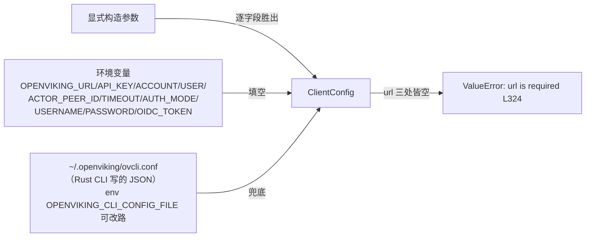

# 01 · Python SDK——`openviking_sdk` 轻客户端精读

> **一句话总结**：Python SDK 是一个**手写的双客户端薄壳**——`AsyncHTTPClient`（client.py L289）用 httpx 直连 REST API，`SyncHTTPClient`（L2002）不复制逻辑而是把每个调用经 `_utils.run_async` 投递到**全局唯一的后台事件循环线程**；它零依赖（仅 httpx）、零本地缓存，靠「JSON envelope 的 error.code → 异常类」映射错误、靠「explicit > env > ovcli.conf」三级解析配置、靠 ContextVar 实现请求级 actor_peer 多租户，并用 `extra` 逃生舱 + `_compact_request_body` 双向对齐新旧服务端。

**基准**：HEAD=`c66b9155`（2026-08-25 核实；SDK 最近一次变更是 `9eac8a6d` #3737，2026-08-24，为 HEAD~2）；与 `docs/zh/configuration/02-client.md`（186 行，本地核实）交叉核对；DeepWiki 页 12.1 基线 `f316d6ad` 整页过时，见 §10。

---

## 1. 包形态：9 个文件、一个依赖、三层 re-export

`sdk/python/openviking_sdk/` 共 9 文件 3899 行：client.py（2865 行，占 73%）、config（351）/errors（148）/options（198）/message（127）/actor_peer（45）/uploads（27）/_utils（67）。`pyproject.toml` L8 自述 "Lightweight Python HTTP SDK"，**唯一运行时依赖 `httpx>=0.25.0`**（L11-13）——对比主包要拖 server/CLI 全家桶，这就是"轻"的实体。版本走 setuptools-scm，tag 正则 `python-sdk@*`（L25），最新 tag `python-sdk@0.1.8`。

re-export 链（getting-started/03 L61 的 `import openviking as ov` 由此成立）：

```
openviking_sdk.SyncHTTPClient (本体)
  ← openviking_cli/client/_http_compat.py L265 子类化+旧签名适配
  ← openviking/client/__init__.py L24 懒加载 __getattr__
  ← openviking/__init__.py L25 主包门面
```

`test_legacy_shims.py` L26-70 锁定这条兼容链：从 `openviking_cli.client.http` 导入仍能抛 openviking_cli.exceptions 的旧异常类。姊妹篇 02-architecture §2 已给 client 层定位，本篇展开 API 面与实现内幕。

## 2. 双客户端：手写两份签名 + 共享 worker loop，不是代码生成

**不是 codegen**。`AsyncHTTPClient` 是唯一实现体；`SyncHTTPClient`（L2002）构造时直接实例化前者为 `self._async_client`（L2006），然后**手写约 846 行同名方法**，每个都是 `return run_async(self._async_client.xxx(...))` 的签名转发（如 L2035 add_resource）——为的是 IDE 补全与显式签名；漏掉的由 `__getattr__` 兜底（L2684-2692）：动态检测 `inspect.iscoroutinefunction` 后即时包一层 `run_async`。漂移风险被兜底掩盖，只能靠测试抓。

`run_async` 的实现（`_utils.py` 全文 67 行）是同步客户端的全部秘密：

- **全局单例后台循环**：`_get_worker_loop`（L21-29）懒创建一个 daemon 线程跑 `new_event_loop().run_forever`，`atexit` 注册关停（join 5s）；
- **跨线程投递**：`run_async`（L53-67）用 `asyncio.run_coroutine_threadsafe(_capture_result(coro), worker_loop)`（L63）把协程投过去、阻塞 `future.result()` 取结果；异常经 `_capture_result` 打包成 `(False, exc)` 值再原地 `raise value`（L66-67），traceback 完整保留；
- **两个防御**：在 worker loop 自己线程里调 sync API 直接 `RuntimeError`（L60-62，防死锁）；`os.register_at_fork(after_in_child=...)`（L49-50）fork 后重置单例——子进程复用父进程的 loop 句柄会炸；
- **ContextVar 能穿过去**：`call_soon_threadsafe` 在**调用线程**执行 `copy_context()`，Task 继承调用方上下文——`test_actor_peer.py` L81 `test_sync_http_client_isolates_actor_peers_across_worker_loop_calls` 用双线程 ThreadPoolExecutor 证明两个 actor_peer 互不串扰。

## 3. 一次 `add_resource` 的完整链路（本地目录上传）

```mermaid
flowchart TD
    U["用户线程<br/>SyncHTTPClient.add_resource L2026"] --> RA["run_async L53<br/>投递到全局 worker loop"]
    RA --> AC["worker 线程<br/>AsyncHTTPClient.add_resource L697"]
    AC --> ZIP["_zip_directory L654<br/>跳 symlink / 防路径逃逸<br/>zip 到系统临时目录"]
    ZIP --> TU["_upload_temp_file L674<br/>① multipart POST /api/v1/resources/temp_upload<br/>（带 upload_mode=local|shared）"]
    TU -->|"网关挑战? 先探测 L440-446<br/>multipart 不可重放"| GW["附 X-Gateway-Token 重试 L457-459"]
    TU --> ID["temp_file_id"]
    ID --> CR["② POST /api/v1/resources (JSON)<br/>to/parent/wait/source_name/temp_file_id"]
    CR --> ENV["响应 envelope {status, result}"]
    ENV -->|"status=error"| ERR["_raise_exception L624<br/>ERROR_CODE_TO_EXCEPTION L67"]
    ENV -->|ok| RES["result 字典 root_uri"]
    RA -.阻塞 future.result.-> U
    ERR -.异常原样重抛.-> U
```

两段式上传的意义：**先传字节、再发语义**。temp_file_id 把字节传输与资源语义解耦，add_resource/add_skill/update_skill/import_ovpack/restore_ovpack 五个入口复用同一 `_upload_temp_file`。

## 4. API 面全景（按路由分组，行号均为 async 版）

| 域 | 方法（行号） | 备注 |
|---|---|---|
| 文件系统 | `ls` L1037 / `tree` L1068 / `stat` L1091 / `attrs` L1097 / `mkdir` L1103 / `rm` L1110 / `mv` L1123 | tree 有 level_limit（#4110）；URI 全过 `VikingURI.normalize` L140 补 `viking://` 前缀 |
| 内容 | `read` L1131 / `read_raw` L1139 / `download_bytes` L1153 / `abstract` L1164 / `overview` L1170 / `write` L1176 / `batch_write` L1203 / `set_tags` L1235 / `reindex` L1629 | read_raw 含隐藏 OKF frontmatter；download_bytes 走 octet-stream |
| 检索 | `find` L1260 / `search` L1283 / `search_context` L1308 / `grep` L1334 / `glob` L1353 | 服务端语义见姊妹篇 03；SDK 侧只是 payload 组装与 options 校验 |
| 资源/技能 | `add_resource` L697 / `add_skill` L776 / `get/update/delete_skill` / `find_skills` L823 / `validate_skill` L844 | add_type 与 parent 互斥校验（L710-715）在客户端先做 |
| 会话 | `session()` L687→`Session` L155 / `add_message` L1500 / `batch_add_messages` L756 / `commit_session` L1464 / `get_session_context` L1413 | token_budget 默认 128_000；Turn 保留字段未配 `retention_mode='turn_budget'` 直接 ValueError（L1477-1483） |
| 任务 | `get_task` L1437 / `cancel_task` L1443 / `list_tasks` L1447 | 404→None（L1439） |
| watch | `list/get/update/delete/trigger_watch` L934-1025 | task_id 或 to_uri 二选一 |
| ovpack | `export` L1531 / `backup` L1555 / `import` L1570 / `restore` L1592 | 下载用 `_atomic_write_bytes`（L107 临时文件+`os.replace`）；导入也走 temp_upload |
| 快照 | `git_commit/restore/show/log/diff` L1864-1992 + `snapshot` 命名空间 L2695/L2780 | `git_show` 二进制分支按 `application/octet-stream` + `X-Snapshot-*` 头解析（L1927-1934） |
| 管理 | `admin_*` 12 个 L1672-1781 | #3695 新增 agent-evolution 与账户 settings |
| 运维 | `health` L1621 / `wait_processed` L1027 / observer 四状态 L1656-1670 / 经验轨迹查询 L1783 / Assets resolve+preflight L1811-1848 | wait_processed 的 http 超时默认放大到 600s（L1028） |

**options TypedDict 体系**（options.py，#3737 确立）：所有复杂调用的可选参数收进 `total=False` TypedDict，公共基类 `_ExtraOptions` 只有一个 `extra` 键（L12-13）做逃生舱。三组值得记：`FindOptions` L16-28（`filter/context_type/tags/since/until/time_field/level`——时间窗与标签过滤是 #3737/#3850 后的检索契约）；`SearchContextOptions` L35-57（`quotas/purpose/dedup_turns/exclude_uris/peer_scope/other_peer_penalty/rewrite`——逐字段对应姊妹篇 03 §6 的服务端 context_assembler 参数面）；`AddResourceOptions` L60-76（`reason/instruction/create_parent/watch_interval/processing_mode/add_type/tags/tag_mode`——watch 是"上传即订阅重摄取"的钩子）。

## 5. message.py：四种 part 与工具输出内容外置

`add_message` 的 `parts` 支持 4 种 dataclass（message.py L8-55）：`TextPart`/`ContextPart`（引用 viking:// 条目，带 abstract 快照）/`ImagePart`/`ToolPart`。`ToolPart`（L28-55）一个类 **24 个字段**，其中一半是工具输出外置簿记：`tool_output_sha256/storage_uri/truncated/original_chars/preview_chars/group_id/externalized_reason`——"长工具输出不进消息流、存 RAGFS 留引用"是会话记忆模型的一等公民，SDK 类型层直接体现。`normalize_part`（L61-127）把 dataclass 降级成 dict 时**只发非默认值**（如 `tool_output_mime_type != "text/plain"` 才带，L120-122）——与 §9 的 compact 哲学一脉相承：能省的字节不发给可能不认识它的服务端。

## 6. 上传语义：两段式 + local/shared，无分片无断点

- `uploads.py` 全文 27 行只有 `zip_directory`（L9）：symlink 跳过（L19-20）+ resolve 后越界检查（L22-23）+ 反斜杠归一。**但 grep 全 sdk/python 无任何 import**——client.py 用的是自己的私有副本 `_zip_directory`（L654，多一个 entry_count）。这是拆包时留下的**死代码**。
- 真正的上传是 `_upload_temp_file`（L674）：**单次 multipart POST** `/api/v1/resources/temp_upload`，files 一个字段 + 可选 `upload_mode` form 字段，返回 `temp_file_id`。**没有分片、没有断点续传、没有进度回调**——大目录打成一个大 zip 一次发完（test_uploads.py L41-59 锁定 form 转发契约）。
- `upload_mode` 语义在服务端 `temp_upload_store.py` L128-132：`local`=服务进程本地临时文件；`shared`=写入 RAGFS（temp_file_id 带 `shared_` 前缀，L56-59），多进程/重启后仍可消费。CLI 侧对应 `OPENVIKING_UPLOAD_MODE`（docs 02-client.md L141）。
- multipart 流**不可重放**，所以网关挑战的处理对上传特殊：先 GET `/health` 探测是否需要 token 再带上发（L440-446 注释明说）；普通请求则先裸发、被 `X-VikingBot-Gateway: true` 的 401 挑战后再重试一次（L449-459，test_ovcli_config_compat.py L149-188 锁定"只在被标记挑战后才带 token"）。

## 7. 错误处理：映射的是 envelope.code，不是 HTTP status

任务预期"HTTP status → 异常类"需要修正：SDK **不按 status 码映射**。链路是双向闭环的 code 映射：

1. 服务端 `OpenVikingError` 子类自带 code（errors.py L6 起 20 个类：`INVALID_ARGUMENT`/`NOT_FOUND`/`CONFLICT`/…/`SESSION_EXPIRED`），异常 handler（server/app.py ~L490）回 JSON envelope `{"status":"error","error":{code,message,details}}`（HTTP status 只是顺带装饰，由 `ERROR_CODE_TO_HTTP_STATUS` 决定）；框架级 HTTPException 由 `_error_code_from_framework_http_status`（app.py L196-204）**反向**把 status 折成 code 兜底。
2. SDK 侧 `_handle_response_data`（L602-619）：能解析 JSON 且 `status=="error"` → `_raise_exception(data["error"])`（L612-613）；**非 success 且无 JSON** → `OpenVikingError(code="INTERNAL")`（L606-610）；**JSON 但非 success 无 error 段** → `code="UNKNOWN"` 取 detail（L614-618）。
3. `_raise_exception`（L624-652）查 `ERROR_CODE_TO_EXCEPTION`（L67-88，20 项），未知 code 落回 `OpenVikingError` 但**原样保留 code/details**（test_error_mapping.py L30-43 锁定）——provider 私有错误码不丢失；NotFoundError/AlreadyExistsError 等有专用签名的类从 details 里抽参重建异常（L640-651）。

## 8. 配置链：读的是 ovcli.conf，不是 ov.conf



`resolve_client_config`（config.py L234）三级优先由 `_resolve_env_or_config`（L224-231）逐字段执行。**SDK 不读服务端配置 `~/.openviking/ov.conf`**——它共享的是 Rust CLI（`crates/ov_cli/src/config.rs`）写的客户端配置；allowed_keys（L136-162）容忍 CLI 能写的全部字段（`output`/`echo_command`/`root_api_key` 等 SDK 不读的也在内），未知字段才报 "Did you mean"（`get_close_matches` L112-117）。`test_ovcli_config_compat.py`（215 行）就是这个兼容契约的固化：ov 写的配置 SDK 必须能用、显式参数必须能覆盖（L67-102）。

三个精细点：① `gateway_token` 只有当解析出的 url 与 ovcli.conf 里的 url **同源**才采用（L312-318）——防止把 A 服务的 token 发给 B 服务；② 构造器 `agent_id` 是 `actor_peer_id` 的旧别名（L290-291 回退），两者互斥（client.py L313-314）；③ 认证头在 `initialize()`（L351）装配：`X-API-Key`/`X-OpenViking-Account`/`-User`/`-Actor-Peer`（L353-360），LDAP 走 Basic（L363-368），OIDC 走 Bearer 且**api_key 长得像 JWT（两个点）就自动当 token 用**（L372-377）。

## 9. 多租户身份：三层 actor_peer

① 构造器 `actor_peer_id` → 客户端级默认头；② `use_actor_peer("id")` 上下文管理器（actor_peer.py L25）→ **请求级**覆盖：ContextVar（L7）在 `_request` 里每请求读一次（client.py L434）拼 `X-OpenViking-Actor-Peer`（L41-45），Async 并发任务互不污染，Sync 靠 §2 的 context 拷贝穿透 worker 线程；③ 消息级 `add_message(peer_id=...)`（L1507）。覆盖只改 Actor-Peer，**不动 account/user**（test_actor_peer.py L38 测试名即契约：`without_overriding_tenant`）。服务端如何把 actor/other peer 映射到 `~/peers` 检索域与惩罚分，见姊妹篇 03 §6，不重复。

## 10. #3737（`9eac8a6d`）：三语 SDK 与服务端的对齐契约

commit 自述"SDKs had drifted from server"。Python 侧落点：

- **find/search 选项补齐**：`level/since/until/time_field` 进 FindOptions，配合 #3730 的结果字段变化（`tags` 进、`category/match_reason/relations/overview` 出——Python 返回 dict 不炸，Go 的严格结构体才炸）。
- **recall 的消失**：草案版加了 `recall` 方法，**终版交付的是 `search_context`**（diff 行 L778/L1346，即今 L1308/L2372）——因为服务端 #3534/#4075 已把 `/recall` 折叠为 `/search mode="context"`，当前 SDK **无 recall 方法**（grep 证实）。`search_context` 就是 mode="context" 的固定封装（L1325 fixed），返回 `SearchContextResult`（options.py L194-198：entries/rendered/digest/stats）。
- **`extra` 逃生舱**（`_build_options_payload` L526-552）：options 里未知字段直接 `TypeError` 提示 "use 'extra'"（L537-539）；`extra` 不能覆盖官方/保护字段（L546-548 冲突 ValueError）——新服务端字段不用等 SDK 发版。
- **`_compact_request_body`**（L489-511）是反向兼容：None 值与空 `args` 整体丢弃，因为**老服务端** `extra="forbid"` 会拒绝它不认识的可选字段（docstring 引 #2706/#2549，镜像 CLI 的 PR #2799）；注意只丢 None 不丢 falsy——`level=0` 能活（#3737 特意强调）；PATCH 类请求禁用此函数（null 可能表示"清空"字段）。

## 11. 与官方文档对照 / DeepWiki 差异

- **docs/zh/configuration/02-client.md（186 行）**：字段表与 SDK allowed_keys 一致；两处微妙偏差——① 文档 L151 称设置 `OPENVIKING_CLI_CONFIG_FILE` 后"文件不存在时会直接报错"（CLI 行为），SDK 的 `_resolve_ovcli_config_path`（L57-63）对 env 指定路径**不做存在性检查**，静默返回 None 后在 url 处才报 "url is required"（test_client_config.py L48-52）；② 文档 L70 给 url 标默认 `http://127.0.0.1:1933`，SDK 无默认。均属"文档描述 CLI、SDK 行为更宽容"的良性偏差。
- **DeepWiki 12.1（基线 f316d6ad，整页过时）**：① 仍讲 Embedded Mode（`AsyncOpenViking`/`SyncOpenViking`/`LocalClient` 进程内直调 `OpenVikingService`）——#3712（`7abd6ab2`）已删除，现只剩 HTTP；② BaseClient 表列 `relations()/link()/unlink()`——#3956（`dc39985a`）删除资源关系边后无此 API；③ 路径 `openviking_cli/client/http.py` 现在只是 shim（§1）；④ `add_resource` 的 `build_index/summarize` 参数、`openviking/storage/viking_fs.py` 单文件行号全部失效。以源码为准。

## 12. 批判性收尾：轻客户端的代价清单

1. **零缓存零重试**：ls/read/grep 每次 HTTP 往返，无本地缓存层；除网关挑战单次重试外**没有任何重试/退避**——网络抖动直接抛给调用方，长会话 Agent 需自包重试。
2. **同步客户端的实现税**：全局单 worker loop 意味着进程内所有同步调用共享一个 IO 线程（多线程并发 sync 调用在其上并发调度，但都过同一队列）；`close()` 之后任何调用经 `_request` 的 `RuntimeError("Client is not initialized")`（L418-419）暴露；异步回调里调 sync 有 L60-62 防死锁守卫，但没有按线程隔离连接池的选项。
3. **上传单请求**：目录全量打 zip 一次 multipart，默认 60s 超时对大目录偏紧（wait=True 时 read 超时放宽为 `max(timeout, timeout+30)`，L461-465，也只是线性放宽）；无分片意味着上传失败全量重来。
4. **错误模型依赖服务端守约**：code-in-body 映射的健壮性以"响应体 JSON envelope 不被中间层剥离"为前提；网关/代理改写成纯 HTML 错误页时降级为 INTERNAL/UNKNOWN，可诊断性下降。
5. **双份手写 + 死代码**：846 行 sync 转发是维护税（`__getattr__` 兜底让漂移静默化）；`uploads.py` 无人引用、`_zip_directory` 与其 95% 重复——拆包演化的化石层。

📌 **下一步阅读**：`sdk/go`、`sdk/typescript` 与 Python 版的三语对齐差异（#3737 里 Go 严格结构体 vs Python dict 的容错差）；`openviking_cli/client/_http_compat.py` 全文（旧关键字签名如何映射到 options API）；`crates/ov_cli/src/config.rs`（ovcli.conf 写入端的字段契约）。
