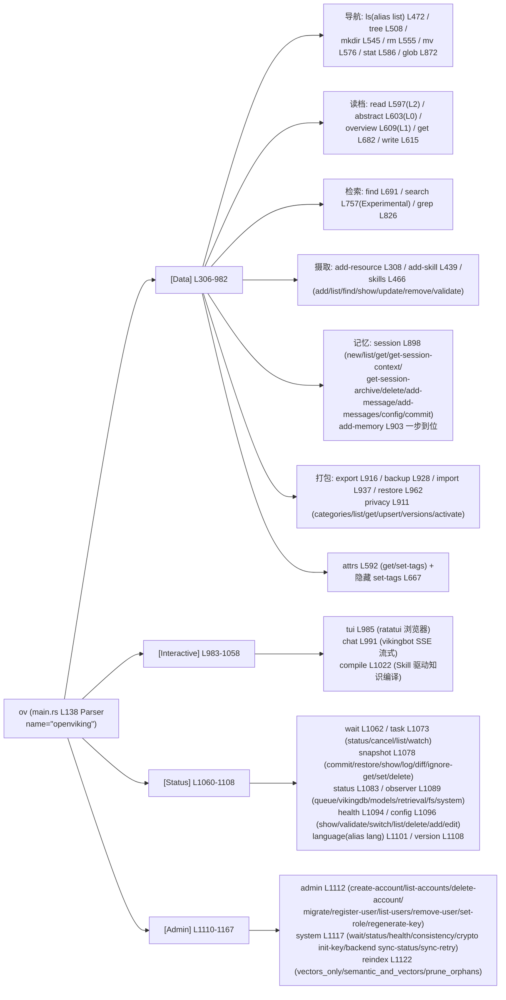
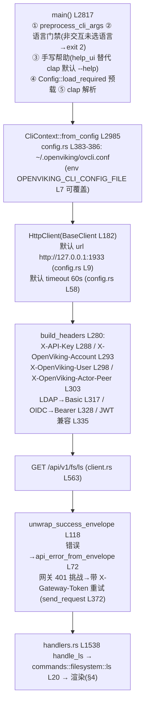

# 02 · Rust CLI `ov`：crates/ov_cli 的命令面与实现结构

> **一句话总结**：`ov` 是一个用 clap 4.5 derive 定义的纯 HTTP 客户端——main.rs（5536 行）里一个 `Commands` 枚举装下 40+ 子命令（按 `[Data]/[Interactive]/[Status]/[Admin]` 四类标签分组），所有命令经 `HttpClient`→`BaseClient`（reqwest）打到 server 的 `/api/v1/*` REST 接口，自己不碰任何存储；CLI 的独特价值在"终端体验层"：agent/original 双档输出、96 列 CJK 安全对齐的卡片渲染、ratatui TUI、双语帮助与语言门禁，外加本地目录自动 zip 上传；Python 侧 `ov` 入口只是 116 行的查找-并-execv 桥。

**基准**：HEAD=`c66b9155`（2026-08-24）；与 README_CN.md（280 行，L130-140 工作流段核实）及 docs/zh/getting-started/05-cli-setup.md（504 行）交叉核对；DeepWiki 12.3 页基线 `f316d6ad`（2026-07-25，落后 23 个 ov_cli commits）覆盖严重不全且有过时点，见 §6。

---

## 1. 文件地图：48 个 .rs 的三层结构

src/ 下 47 个 .rs + build.rs（后者从 `OPENVIKING_VERSION`/`SETUPTOOLS_SCM_PRETEND_VERSION_FOR_OPENViking` 环境变量注入版本号，保证 CLI `--version` 与 wheel 版本不漂移）。按行数分三档：

| 层 | 文件（行数） | 职责 |
|----|--------------|------|
| **命令面** | main.rs（5536）、help_ui.rs（3239）、i18n.rs（177）、cli_arg_scan.rs（136） | clap 定义 + 手写双语帮助 + 语言门禁 + clap 前参数预扫描 |
| **传输** | client.rs（2496）、base_client.rs（1139）、config.rs（855）、config_agent.rs（1378）、config_wizard/（3 文件） | 每命令一个方法 → REST 端点；鉴权头；ovcli.conf 管理 |
| **呈现/交互** | handlers.rs（1869）、commands/（18 文件：filesystem/search/session/skills/snapshot/task/watch/observer/privacy/admin/system/crypto/pack/compile/chat/content/resources/render_utils）、output.rs（1282）、error_ui.rs（1285）、status_ui.rs（960）、theme.rs、tui/（6 文件：ratatui 浏览器） | 结果渲染、错误 UI、chat REPL、TUI |

依赖（ov_cli/Cargo.toml）：clap 4.5（derive+env）、reqwest 0.12（json/**multipart**/rustls-tls/gzip）、ratatui 0.29 + crossterm、rustyline 14（chat 行编辑）、indicatif 0.18（上传进度条）、**unicode-width**（CJK 对齐）、viuer + image（TUI 内图片预览）、zip 2.2 + walkdir（目录打包上传）、termimad（chat markdown 渲染）。注意 ov_cli 不依赖同 workspace 的 ragfs crate——它是纯 HTTP 客户端，与 ragfs 同居只为共享构建工具链。

## 2. 完整命令树（读 clap 定义核实，非抄 DeepWiki）

main.rs L292-303 的注释定义了标签体系；`Commands` 枚举 L304-1168 实际分组：



四个结构细节：
1. **别名文化**：`ls↔list`（L472）、`rm↔del↔delete`（L555）、`mv↔rename`（L576）、`language↔lang`（L1101）、`skills ls`——贴近 unix 肌肉记忆。
2. **`--sudo` 白名单**（L1170-1181 的 `supports_sudo`）：仅 admin/system/reindex/task{status,list} 可切 root key；误用在解析后立刻报错（L2907 `if cli.sudo && !cli.command.supports_sudo()`），且要求配置里真的有 `root_api_key`（L3000）。
3. **config 豁免**（L1910-1927 `requires_cli_config_file`）：`config add/edit/delete/list/switch`、`skills validate`、`version` 不要求配置文件已存在——"第一次配置"和"纯本地校验 SKILL.md"因此可行。
4. **与 README_CN L134-140 工作流逐条对上**：`status`→`add-resource --wait`→`ls/tree -L`→`find`→`grep --uri`→`reindex --mode`，外加 `config switch` 多服务器切换——README 的工作流就是本命令树的子集。

## 3. 纯 HTTP 客户端：一次 `ov ls` 的生命周期



**命令→端点映射**（client.rs 逐一核实）——CLI 方法与 REST 端点几乎一一对应，这张表就是"CLI 是薄 HTTP 壳"的直接证据：

| 端点族 | REST 路径（client.rs 行号） | 对应命令 |
|--------|------------------------------|----------|
| fs | `GET /api/v1/fs/ls`(L563)、`/fs/tree`(L583)、`POST /fs/mkdir`(L591)、`DELETE /fs`(L609)、`POST /fs/mv`(L617)、`GET /fs/stat`(L622)、`GET /fs/attrs`(L627)、`POST /fs/attrs/set_tags`(L433) | ls/tree/mkdir/rm/mv/stat/attrs |
| content | `/content/read`(L379)、`/abstract`(L389)、`/overview`(L399)、`/content/write`(L417)、`/content/reindex`(L482) | read/abstract/overview/write/reindex |
| search | `POST /search/find`(L661)、`/search/search`(L695)、`/search/grep`(L715)、`/search/glob`(L729) | find/search/grep/glob |
| 摄取 | `POST /api/v1/resources`(L826/862/883/905，temp_file_id 四种变体) | add-resource |
| 技能 | `/api/v1/skills` 族(L949-1112，含 `/skills/find` L1058、`/skills/validate` L1112) | skills/add-skill |
| 任务/打包 | `/api/v1/tasks`(L1246)、`/api/v1/pack/{export,backup,import,restore}`(L1319-1388) | task/ovpack 四兄弟 |
| 管理 | `/api/v1/admin/accounts`(L1415/1420)、`/admin/migrate`(L1506)、`/api/v1/system/consistency`(L489) | admin/system |

配置面（config.rs Config 结构 L38-92）：url / api_key / root_api_key / account / user / timeout / output(table|json) / echo_command / show_progress / verbose / profile / upload.{ignore_dirs,include,exclude} / extra_headers / gateway_token / **auth_mode + ldap_username/ldap_password + oidc_token**——后三者是 #3708（基线之后）新增的 OIDC/LDAP 两种 auth 模式，05-cli-setup L127-129 还区分了 user key / root key / 双 key 三种配置形态。

**add-resource 的客户端工作流**（client.rs L760-905）最能体现"CLI 不只是壳"：本地目录 → `zip_directory`（base_client.rs L884，walkdir 遍历 + Windows 路径分隔符归一化 L58）→ `upload_temp_file` 换 temp_file_id → POST `/api/v1/resources`，超时用 `TimeoutConfig::for_resource_processing`（base_client.rs L160，按 zip 体积动态计算）；`--add-type`（Connector 声明式导入）则路径原样透传、绝不当作本地文件（L783-786）；`--manifest`（openviking-assets/1 清单）走 `openviking_assets.rs`（2012 行）本地编排再逐项导入。CLI 零业务逻辑：递归、排序、sidecar 隐藏过滤全在 server 的 FSService，CLI 只传 `node_limit/abs_limit/level_limit`——与 04-two-modes 篇"一切皆 HTTP"互为表里。

## 4. 输出格式化：Rust 承担 CLI 的核心原因之一

- **双档输出、server 侧收缩**：handlers.rs L1564/L1600 `let api_output = if ctx.compact { "agent" } else { "original" }`——`--compact`（默认 true）不是本地后处理，而是把 `output=agent` 参数发给 API，由 server 返回紧凑 JSON。好处：MCP/SDK/CLI 共享同一套 agent 紧凑格式，收缩规则只维护一份。
- **table 渲染只做加法**（filesystem.rs）：JSON 格式直接走通用 `output_success`；table 格式进卡片渲染。ls 是编号卡片——`1. dir · 4.2KB · 2026-08-24` 一行元数据 + 缩进 URI + 最多 2 行摘要（`render_ls_entry` L158-174）；tree 不用 `├──└──` 连接线，而是按 `rel_path` 的斜杠数算深度、每层缩进 2 空格（`render_tree_entry` L182-185 的 `depth.matches('/').count()` + `TREE_INDENT.repeat(depth)`）。宽度常量：正文 96 列（下限 32）、名字列 18-38、摘要 ≤2 行（filesystem.rs L12-18）。
- **CJK 刚需**：所有列宽计算走 `unicode_width`（filesystem.rs L11 import、search.rs L9）——中文路径按双宽字符对齐。这在 Python 里要手工处理 east-asian width，Rust 生态开箱即得；配套 `IsTerminal` 检测决定是否着色（colored 库自动 + 显式判断）。
- **find/grep 卡片**（search.rs）：同一套 96 列宽度体系（L11-15），结果按集合键分组——`SEARCH_RESULT_COLLECTION_KEYS = ["memories","resources","skills","results","items"]`（L16-17）；grep 命中卡片 `render_grep_match_card` L694；`wrap_display_text` 统一折行（render_utils.rs）。

`ov ls` 与 `ov tree` 的 table 输出形态（依 filesystem.rs 渲染代码推演的结构示意）：

```text
$ ov ls viking://resources/          $ ov tree viking://resources/x -L 2
1. dir · 2026-08-24                  docs/
   viking://resources/docs/            api.md  3.1KB  2026-08-20
   目录摘要最多两行，超出截断…          guides/
2. file · 12.4KB · 2026-08-23           quickstart.md  8.0KB
   viking://resources/report.pdf      tools/  （每层缩进 2 空格，深度=斜杠数）
```
- **交互层**：tui/（ratatui 目录浏览器 + viuer 图片预览 + 事件循环）；chat.rs（1596 行：rustyline REPL、SSE 流式增量渲染、termimad markdown、machine-uid 默认 session id）；error_ui.rs（1285 行：错误报告附"下一步动作"建议按钮文案，如 L2898 `ov add-resource --help`）；help_ui.rs（3239 行：手写 en/zh-CN 双语帮助，L1358 `is_top_level_help_request` / L1375 `render_top_level_help` 在 clap 之前接管 `--help`）。
- **i18n 与语言门禁**：语言存 `~/.openviking/ovcli.settings.conf`（i18n.rs L65-70，与 ovcli.conf 同目录）；未选语言时非交互 shell 里任何非豁免命令 exit 2（main.rs L2825 `ensure_language_selected_before_command`），05-cli-setup L56 专门警告 Agent/CI 用户先跑 `ov language en`。

## 5. openviking_cli/rust_cli.py：116 行桥接（L42 main()）

查找优先级：**0** `ov doctor` 是 Python 原生子命令（L53-56，体检不依赖 Rust 二进制）→ **1** `./target/release/ov` 开发版（L60）→ **2** wheel 自带 `openviking/bin/ov`（L69-77，构建侧见 03-build-system §3-①）→ **3** PATH 查找但跳过自身入口防递归（L79-90）。Unix 用 `os.execv` 替换进程（零额外开销），Windows 退 `subprocess.call`——CPython 的 execv 不真替换进程，会弄断控制台句柄继承、TUI 收不到键盘输入（L27 `_exec_binary` 注释引 #587）。全找不到时打印四条安装路径（wheel / npm / GitHub Releases / cargo install）。文件头注释自报成本账：Python 启动+导入 ~30-50ms，execv 之后是纯 Rust 二进制。

## 6. viking://~ 在 CLI 的支持 + DeepWiki 差异

### 6.1 viking://~：对 CLI 是"零改动"增益

#4167（ff38bb5d，2026-08-20）把 `~` 别名的展开放在 **server 请求边界**——`openviking/core/namespace.py` L255 `resolve_request_uri` → L269 `resolve_current_user_uri`，`parts[0]=="~"` 时展开为 `canonical_user_root(ctx)`（L282-285）。设计要点：`~` 是保留 token，`validate_user_id` 的字符集排除了它，不可能与真实 user_id 撞名；规范解析器对别名直接拒绝（root 角色/内部调用 fail-closed，绝不落成字面 `~` 目录）。因此 ov_cli 源码里 grep 不到任何 `~` URI 处理逻辑——用户直接 `ov ls viking://~/memories/` 即可，REST/MCP/SDK 同享。配套 #4196（a83b8171）**删除**旧的 uid-less 简写（`viking://user/<reserved>` 现在带纠正提示 fail-closed，指向 `viking://~/...`）——README/docs 示例都用规范 URI，CLI 无需跟改。

### 6.2 DeepWiki 12.3 差异清单

1. **覆盖严重不全**：页面只列 add-resource / ls / tree / mkdir / rm / mv / read / abstract / overview / find / search / grep / session 子集 / health / chat / config / attrs——约占命令面 1/3；**完全没提** skills 全套、tui、compile、task、snapshot、observer、language、admin、system、reindex、privacy、ovpack 四兄弟（export/backup/import/restore）、glob / get / write / add-memory。
2. **grep 链路画错**：12.3 的图把 grep 路由到 `viking_fs.py` 语义搜索；实际 CLI 打 `POST /api/v1/search/grep`（client.rs L715），与 find（`/search/find` L661）同属 search 端点族。
3. **基线后命令增删**（`git log f316d6ad..HEAD -- crates/ov_cli/` 共 23 commits，逐一核实）：
   - 新增：`compile`（#3567，Skill 驱动知识编译）、`task cancel`（#3577）、task status 显示 token 用量（#4065）、add-resource `--manifest`（#3358）、`--processing-mode`（#3615/#3566）、`--tag/--tag-mode`（#3560，reindex 侧 #3964）、auth 新增 OIDC/LDAP（#3708）；
   - 删除：`relations/link/unlink`（#3956 资源关系边整体移除）；
   - 体量：47→48 个 .rs（新增 openviking_assets.rs 等）。
4. **行号漂移**：DeepWiki 引 main.rs:34-44 的 CliContext 现为 L35-45；引用一律以本篇为准。

## 7. 批判性收尾：为什么 CLI 用 Rust 重写（而不是 Python typer）

**支持**：① **子进程调用模型**——CLI 的真实用户一半是 Agent/脚本，每次 `ov find` 都是一个新进程；Rust 冷启动毫秒级 vs Python 解释器 30-50ms × 千次调用，且不依赖 pip 环境；② **分发**——npm `@openviking/cli` 与 `cargo install` 两条零 Python 通道（README_CN L146），wheel 通道只是兜底，给非 Python 用户干净入口；③ **终端体验密度**——unicode-width CJK 对齐、ratatui TUI、SSE 流式 chat、indicatif 进度、viuer 图片预览，这些在 Rust workspace 里是顺手拼装；④ **版本解耦**——`cli@X.Y.Z` 独立发版 tag（03-build-system §5），server 迭代不必拖着 CLI 重发。
**代价**：① 命令面演进成本翻倍——基线后 23 个 commit 里 compile/manifest/processing-mode 每个都要过 Rust 编译+发版周期；help_ui.rs 3239 行手写双语帮助、error_ui.rs 1285 行是纯维护税，加一个命令要同步改三处（clap 定义、help_ui、i18n）；② `output=agent` 下放到 server 缓解了"两端各写一遍格式化"，但 table 渲染逻辑仍与 API 字段强耦合，server schema 改动会静默破坏 CLI 渲染（本仓库无 CLI-契约测试兜底）；③ **语言门禁对 CI/Agent 不友好**——非交互 shell 未选语言直接 exit 2，自动化首次接入必踩；④ ov_cli 与 ragfs 同 workspace 却零依赖，"生态协同"实为工具链复用——好的一面是 CLI 二进制不必拖存储引擎的链接依赖，坏的一面是 48 个文件里约七成行数在伺候 UI/帮助/错误文案，真正的"协议"只有 client.rs 一层。

## 8. 与其他模块的关系

- 02-architecture §2 的"OVCLI →|HTTP| FASTAPI"箭头即本篇 §3 链路；04-two-modes 的"一切皆 HTTP"以 CLI 为最纯粹样本（连"压缩输出"都委托给 server）。
- 构建与分发（wheel 塞 bin/ov、npm 壳、`make build-cli` dev 路径）见 03-build-system §2-3/§3-①/§5-2，本篇不重复。
- 姊妹篇：01-python-sdk（同一 HTTP 协议的 Python 皮肤 + SyncHTTPClient 对照）、03-go-ts-sdks（Go/TS 客户端）；04-integrations 将讲 MCP proxy 如何复用同一端点族。

📌 **下一步阅读**
- `../00-overview/04-two-modes.md` — CLI 所代表的 client 形态与数据主权
- `openviking/server/routers/filesystem.py` + `search.py` — CLI 端点的 server 侧对应物
- mem0 案例 `notes/00-overview/` — 对比纯 Python 仓库的 typer CLI 如何做同样权衡
