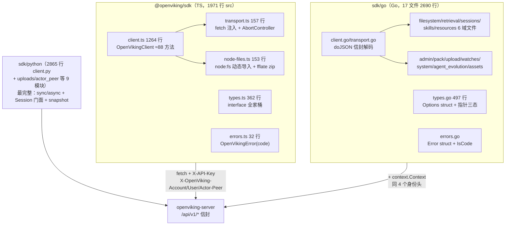

# 03 · Go + TypeScript 双 SDK 对照——同一份 HTTP 契约的两种语言投影，靠 `extra` 逃生舱和镜像测试对抗漂移

> **一句话总结**：`sdk/go/`（17 个 .go、2690 行源码）与 `sdk/typescript/`（6 个 .ts、1971 行源码）是 Python `openviking-sdk` 之外的两条官方客户端——三者共享同一 wire 契约（`/api/v1/*` + `{status,result,error}` 信封 + `X-OpenViking-*` 身份头），但完整度分层明显：**Python 最全（sync/async 双客户端 + Session 门面 + snapshot 命名空间）> TS 次之（约 88 个公开方法，独有 8 个 git 快照方法）> Go 最简（约 71 个方法，无 snapshot/git）**；TS 用「fetch 可注入 + `node:` 动态导入」保持浏览器容忍度，Go 用 `context.Context` + 指针可选字段表达三态；两边的 `extra` 逃生舱（禁止覆盖官方字段）是它们应对服务端 API 演进的共同 antidrift 机制。

**基准**：HEAD=`c66b9155`（2026-08-24）；与 `sdk/typescript/package.json`（name=`@openviking/sdk` v0.1.0，L2/L3）+ `sdk/go/go.mod`（module `github.com/volcengine/OpenViking/sdk/go`，go 1.22）+ git tag 交叉核对；DeepWiki 12.2（基线 `f316d6ad`，旧 262 commits）过时点见 §7。本篇只讲**裸 SDK**——LangChain 适配层是另一条线（`04-integrations/03-langchain.md`，那是框架适配包 `langchain-openviking`，底层才依赖 Python SDK）。

---

## 1. 全景：同契约、三种语言、三种发版节奏

发版节奏是三者成熟度的第一信号（git tag 核实）：**Python** `python-sdk@0.1.3→0.1.8` 共 6 个 tag + 独立 `python-sdk-release.yml`；**TS** 有完整的 `typescript-sdk-release.yml`（tag `typescript-sdk@*` 触发，Node 24 构建 + `npm publish --provenance` + `npm view` 查重跳过已发版本 + tag 必须等于 package.json 版本的防错位校验）**但至今零发版 tag**——0.1.0 从未发布；**Go** 只有一个 `sdk/go/v0.0.1`（2026-07-22），且 `.github/workflows/` 全目录 grep "sdk/go"/setup-go 零匹配——**Go SDK 无 CI 也无发版流水线**，消费方事实上跟踪 monorepo HEAD。诞生时间：Go 先生（2026-06-17 #2680），TS 后生（2026-07-11 #3147），Python 与主包同源。

## 2. TS 的双运行体设计：架构容忍浏览器，官方只承诺 Node

三个互相咬合的机制：

1. **fetch 可注入**（`transport.ts:39` `config.fetch ?? globalThis.fetch`）：传输层不绑定 undici，测试里 `vi.fn<typeof fetch>()` 整个替换（client.test.ts:37-39），非 Node 运行时也可接入自己的 fetch。
2. **`node-files.ts` 的条件加载**：`node:fs/promises`/`node:path` 全部走 `import()` 动态导入（node-files.ts:4-5、L13），源码注释自陈动机——"Keep built-in specifiers dynamic so bundled ESM and CommonJS outputs share this implementation without eager filesystem initialization"（L68-69）。client.ts 顶层静态 import node-files，但文件系统副作用被推迟到真正调用 `addResource("./docs")` 时；浏览器里传 URL 字符串照样能跑，传本地路径才会在 `import("node:fs/promises")` 处失败。
3. **Web 标准 API 全家桶**：FormData/Blob/URL/`btoa`/AbortController 都是 Node 18+ 与浏览器共有；tsup 双格式打包（esm+cjs，package.json:21）。

但要说清边界：**package.json `engines: node>=18`（L28）+ README 开头 "targets Node.js 18+"——官方支持面是 Node-only，浏览器是"不会主动破坏"而非"测试保障"**（41 个测试全部 Node 环境跑）。transport 抽象的真实动机还有一半是**二进制复用**：`consume()` 让 JSON 解析与 `downloadBytes`/OVPack 下载/gitShow 二进制响应共享同一套超时/取消/错误映射（transport.ts:64-129），`request()` 只是 `consume(parseResponse)` 的糖（L54-62）。

一个容易被误读的声明：README 说 "no runtime dependencies"，但 node-files.ts 顶层 `import { zipSync } from "fflate"`——真相是 fflate 只在 devDependencies（package.json:31），由 tsup 在构建期打进 dist，运行时确实零依赖，代价是包体固化了 zip 实现且升级 fflate 必须重新发版。Go 端对应物是标准库 `archive/zip` 落磁盘临时文件（upload.go:16-79），顺手做了 TS 没有的防御：相对路径逃逸检查（`relToRoot` 以 `..` 开头则跳过，upload.go:54-56）。

## 3. Go 的设计取向：ctx 显式传递、错误是值、三态靠指针

- **context 无处不在**：每个公开方法首参 `ctx context.Context`，经 `http.NewRequestWithContext`（transport.go:41）下发；SDK 自身**零 goroutine、零锁**——并发完全交给调用方，`Client` 构造后只读，天然并发安全；`CloseIdleConnections()`（client.go:65-70）是唯一的生命周期钩子。
- **错误是 struct 不是异常**：`Error{Code,Message,Details,StatusCode}`（errors.go:9-14），`IsCode(err,"NOT_FOUND")` 用 `errors.As` 解包（errors.go:27-30）；信封里 `status:"error"` 却缺 `error` 对象时兜底造 `UNKNOWN`（transport.go:124-126）。
- **三态可选字段**：Go 没法区分"未设"与"零值"，于是 `*bool/*int/*string` + `String()/Bool()/Int()/Float64()/Map()` 五个指针构造器（helpers.go:86-108）成为惯例；`CreateSession` 里 `AutoCommitPolicy *map[string]any` 甚至区分"null（禁用自动提交）"与"省略"（types.go:332、sessions.go:59-61），对应 TS 的 `"autoCommitPolicy" in options` 检查（client.ts:660-661）——同一语义两端各自发明机制。
- **超时语义与 TS 分叉**：TS 用 AbortController+setTimeout 且把超时映射成 `code:"DEADLINE_EXCEEDED"`、调用方取消映射成 `ABORTED`（transport.ts:110-119）；Go 只设 `http.Client.Timeout`（client.go:39-44），ctx 取消/超时穿透为裸 `url.Error`，**不带 OpenViking 错误码**——跨语言写重试逻辑时这是真实的语义漂移点。

## 4. 类型系统对照：核心类型两边的形状

| 概念 | TS（types.ts） | Go（types.go） | 备注 |
|---|---|---|---|
| 配置 | `ClientConfig`（L18-29，fetch/timeout/headers） | `Config`（L9-21，HTTPClient/Timeout） | 差异=运行时注入点 |
| 检索命中 | `MatchedContext`（L316-324，索引签名开放） | `MatchedContext`（L472-482，多 `Overview/Category/MatchReason`） | Go 反而更宽 |
| 检索结果 | `FindResult`（L326-331，3 组+开放） | `FindResult`（L442-449，多 `QueryPlan/QueryResults/Total`） | Go 显式建模查询计划 |
| 服务端拼装 | `SearchContextResult`（L342-347） | `SearchContextResult`（L462-467） | 形状一致 |
| 信封 | `ResponseEnvelope<T>`（L355-361） | `responseEnvelope`+`json.RawMessage`（transport.go:14-20） | RawMessage 延迟解码 |
| 错误 | `OpenVikingError` 单类 + code 字段 | `Error` struct + `ErrorInfo` wire 镜像 | TS 无类型守卫外的分支 |
| `viking://` | `normalizeURI`（client.ts:68-69） | `NormalizeURI`（client.go:73-78） | 逐字符等价 |

两处值得点名：① TS 大量返回 `Promise<JsonObject>`（弱类型逃生），Go 大量返回 `map[string]any`——**只有 find/search/searchContext 三族在两边都有强类型**；② Go 的 `Find` 有个独有怪癖：`NodeLimit` 非空时直接**覆盖** `limit` 字段发出（retrieval.go:17-19），而 TS 是 `limit`/`node_limit` 两个独立 body 字段（client.ts:379-380）——同名参数两种 wire 语义。

## 5. 三语言 API 面对比

| 能力域 | Python | TS | Go |
|---|---|---|---|
| 三类上下文（Resource/Memory/Skill） | ✅ 全 | ✅ 全（skills CRUD+find/validate） | ✅ 全 |
| 文件系统 ls/tree/stat/attrs/mkdir/rm/mv | ✅ | ✅ | ✅ |
| 内容 read/write/batch_write/set_tags/reindex/abstract/overview | ✅（多 `read_raw`） | ✅ | ✅ |
| 上传（temp_upload+目录 zip） | ✅ uploads.py | ✅ fflate 内存 zipSync→Blob | ✅ archive/zip 落临时文件 |
| 会话+commit+retention/event tags | ✅ Session 门面 | ✅ 扁平方法 | ✅ 扁平方法 |
| git 快照 commit/restore/show/log/diff/ignore | ✅ snapshot 命名空间 | ✅ **8 个 git\* 方法（client.ts:996-1080）** | ❌ **整族缺失** |
| OVPack 四件套 / admin×13 / tasks / watches | ✅ | ✅ | ✅ |
| actor-peer 作用域原语 | ✅ actor_peer.py | 仅配置头 `actorPeerId` | 仅配置头 `ActorPeerID` |
| 同步/异步 | sync+async 双客户端 | 单异步（Promise） | 单同步（ctx 取消） |

上传语义三端一致到细节：路径不存在时回退 `body.path` 让服务端按 URL/服务端路径处理（client.ts:160-164 vs upload.go:143-150）；目录上传前 zip 且跳过 symlink；OVPack import 拒绝目录（TS `allowDirectory:false` client.ts:878 / Go uploadPackFile pack.go:156-158）；下载全部"临时文件+rename"原子落盘（node-files.ts:133-152 vs pack.go:87-108）。

三端对齐最铁的证据藏在注释里：Go `AddResource` 只在 `args` 非空时才发送该字段，注释写明" Instances that predate #2549 reject an empty args object... Mirrors the Python SDK `_compact_request_body` (#2834) and the Rust CLI compact_request_body (#2799)"（resources.go:38-45）——一个服务端兼容性坑，四个客户端（含 Rust CLI）用同名机制各自修一遍，还靠注释互认，这正是 §8 批判的"无 codegen 手工同步"的微观样本。

错误驱动的控制流也是镜像的：`sessionExists` 两端都靠捕获 `NOT_FOUND` 归一化为 bool（client.ts:696-705 / sessions.go:72-81），`getTask` 都在 404 时返回 null 而非抛错（client.ts:921-933 / sessions.go:174-189）——同一"探测语义"跨语言复刻。

## 6. 成熟度：镜像测试是亮点，发布链路参差

测试：**Go 46 个测试函数/1767 行**（`httptest.NewServer` 起真 HTTP 服务断言 wire 细节）；**TS 41 个 it/1141 行**（mock fetch）+ `node-consumer` 类型消费者（用 `@ts-expect-error` 反向断言字面量联合类型，tsconfig 单独 typecheck，package.json:25）。TS 的 CI 校验链也值得抄：tag 触发后依次跑 `typecheck → format:check → build → test:node-types → test → npm pack --dry-run`，再用 `test "$RELEASE_TAG" = "typescript-sdk@$PACKAGE_VERSION"` 防版本错位，最后 `npm view` 查重跳过已发版本——发版安全设计是三条流水线里最完善的（讽刺的是一次也没用过）。最有意思的是**跨语言镜像用例**：TS 测试名直接叫 "sends identity headers and the Python/Go compatible search body"（client.test.ts:36）、"uses Go SDK defaults for skill details"（:696）——测试层互认对方为契约参照物；Go 侧 `TestAddResourceOptionsHasNoTopLevelParseMode` 用反射断言选项结构**不存在**某字段（client_test.go:19-23）。同步节奏看 git log：f316d6ad..HEAD 仅 14 个 commit 触及两 SDK，其中 `9eac8a6d` #3737 "sync go/ts/python SDKs with server find/search, recall..." 是一次手工三端对齐——**没有 OpenAPI codegen，全靠人肉同步**。

## 7. DeepWiki 差异（基线 f316d6ad 已过时）

f316d6ad..HEAD 触及两 SDK 的 14 个 commit 主题即"漂移清单"：find/search/recall 三端同步（#3737）、`viking://~` 破坏性 URI 迁移（#4196）、tree 层级上限（#4110）、reindex 标签（#3964）、资源关系边删除（#3956）、事件标签过滤（#3850）、auto-commit v2（#3736）、任务取消（#3577）、资源标签（#3560）、processing mode（#3615）——DeepWiki 一页都没赶上。

1. **"Python SDK supports an embedded local mode" 已失效**（12.2 页 L23）：#3712（`7abd6ab2`）已删除 Python embedded mode，现在三端全部 HTTP-only，DeepWiki 用来反衬 Go 的对比前提不成立。
2. **文件清单残缺**：DeepWiki "Relevant source files" 只列 8 个文件，缺 admin/pack/sessions/upload/watches/system/errors/agent_evolution/openviking_assets 九个——其 API 描述完全没有 admin、OVPack、watch、task、agent-evolution 域。
3. **行号大面积漂移**：如 `Write` 标注 filesystem.go:147-166 → 实际 L186-209；`Reindex` :198-215 → L273-302；`normalizeImageInput` helpers.go:114-140 → L146-172；`CreateSession` 标在 types.go:238-243 → 已迁至 sessions.go:12（types.go 只剩 Options）。
4. 未记录 `NodeLimit→limit` 覆盖怪癖与 `sdk/go/v0.0.1` tag 事实。

## 8. 批判性收尾：三份手写投影的漂移税

1. **API 漂移已经在发生，不是风险**：Go 缺整族 snapshot/git、缺 `read_raw`；TS 缺 actor_peer 原语；超时错误码两端语义不同；`NodeLimit` 在 Go 是 `limit` 的别名而在 TS 是独立字段。服务端每个新字段（event tags #3850、reindex tags #3964、processing mode #3615）都要三端各自补测试——14 个同步 commit 里一半是"追平"性质。
2. **`extra` 逃生舱是聪明但脆弱的解法**：`mergeExtra` 禁止覆盖官方字段（client.ts:52-64 / helpers.go:55-76）让新参数可先行透传，但它把契约检查从编译期退到运行期 TypeError，且三端的 protected 名单要人肉保持一致。
3. **Go SDK 是"发布物理学的弃儿"**：无 CI（连 `go test` 都不在任何 workflow 里跑）、无发版流水线、单版本 tag v0.0.1 停在 7 月——monorepo 子目录 Go module 要求 `<subdir>/vX.Y.Z` tag 格式，而仓库的 release 机器只认 `python-sdk@`/`typescript-sdk@` 前缀，Go 被发版体系结构性遗忘；反过来说 TS 是"流水线等火车"——CI 完备到有 provenance 与查重，却没发过一版。
4. **TS 弱类型返回面**：约 88 个方法里只有 3 族有强类型结果，其余 `JsonObject`——IDE 体验靠 cast；Go 的 `map[string]any` 同病相怜。若服务端契约继续膨胀（agent-evolution/assets 都在长），手写三投影的维护成本会逼出"要么 codegen、要么砍面"的选择。

📌 **下一步阅读**：`01-python-sdk.md`（本目录，Python 端 sync/async 与 Session 门面）· `../04-integrations/03-langchain.md`（建立在 Python SDK 之上的框架适配层）· 源码 `sdk/typescript/src/transport.ts`（consume/abort 双源判别是全 SDK 最精巧的 40 行）
