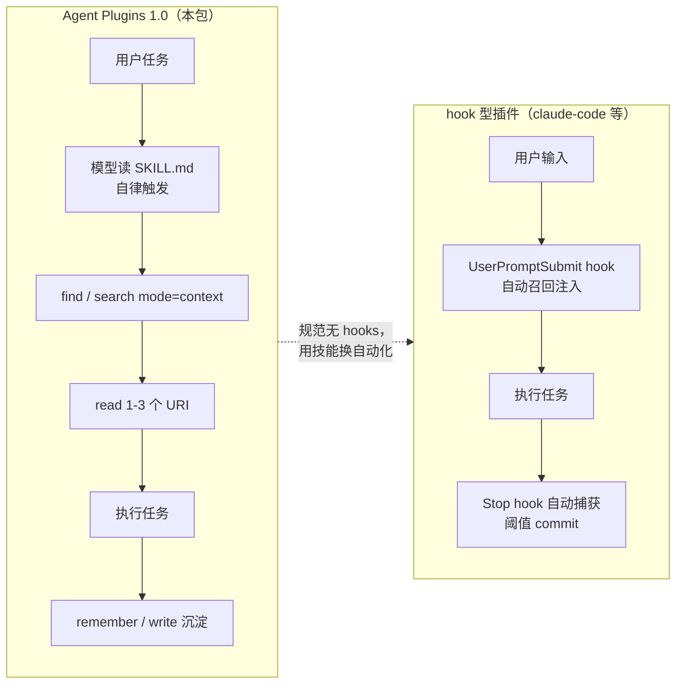

# 01 · Agent Plugins 1.0 插件包（agent-plugins/）——一个包接遍所有 MCP 客户端

> **一句话总结**：`agent-plugins/` 是 OpenViking 按 [Agent Plugins 1.0](https://agent-plugins.org/specification) 规范打包的**可移植记忆插件**——`plugin.json` 清单 + `skills/openviking-memory` 技能 + `mcp.json` 声明的 stdio MCP 代理；由于规范**有意排除 hooks**，自动召回/自动捕获被替换为「技能教模型自己驱动 recall + persist 闭环」，这是它与其他全家桶插件的分水岭。

**基准**：本地 clone `HEAD=c66b9155`，行号以此为准。对照文档 `docs/zh/agent-integrations/15-agent-plugins.md`。DeepWiki 6 系页（旧 262 commits）以 OpenClaw/Claude Code 插件为主体，**未覆盖 agent-plugins/ 目录**（该目录为规范包，属较新代码）——本文以本地源码为准。

---

## 1. 包结构与清单

```
agent-plugins/
├── plugin.json                          # Agent Plugins 1.0 清单
├── mcp.json                             # stdio MCP server 声明："openviking"
├── servers/
│   ├── mcp-proxy.mjs                    # 入口：stdio → streamable-HTTP 代理
│   ├── config.mjs                       # 凭据/配置解析（裁剪自 claude-code 插件）
│   ├── debug-log.mjs                    # JSONL 调试日志
│   └── shared/                          # 由 examples/memory-plugin-shared/lib 生成
│       ├── mcp-proxy-core.mjs           # 代理内核（传输/会话重试/SSE 解析）
│       ├── mcp-proxy-config.mjs
│       ├── workspace-peer.mjs           # cwd → actor peer 派生
│       └── credentials.mjs
├── skills/openviking-memory/
│   ├── SKILL.md                         # 教模型「召回 + 沉淀」闭环
│   └── references/optional-tools.md     # tree/write/edit 等可选工具说明
└── plugin.test.mjs                      # node --test 规范一致性校验
```

### 1.1 plugin.json：最小清单

`plugin.json:1-21` 全文仅 21 行：`$schema` 指向 `https://agent-plugins.org/schemas/1.0.0/plugin.schema.json`，`name: "openviking"`，`version: 0.1.0`，`license: AGPL-3.0`，外加 author/keywords 等元数据。**没有任何 hooks/commands/agents 字段**——规范 1.0 只认 skills + MCP servers，这正是「能力边界」的源头（见 §4）。

### 1.2 mcp.json：一个 stdio server

`mcp.json:1-10`：

```json
{
  "$schema": "https://agent-plugins.org/schemas/1.0.0/mcp.schema.json",
  "mcpServers": {
    "openviking": {
      "type": "stdio",
      "command": "node",
      "args": ["${PLUGIN_ROOT}/servers/mcp-proxy.mjs"]
    }
  }
}
```

`${PLUGIN_ROOT}` 是规范内置占位符，客户端加载时替换为插件根目录。符合规范的客户端（Cursor、VS Code、Amazon/OpenAI 系客户端等）读到这个条目就会 spawn 一个 stdio 子进程。

### 1.3 为什么是 stdio 代理而不是 `streamable-http` 直连

`agent-plugins/README.md:29-31` 给出官方理由，这是全包最重要的设计决策：

1. OpenViking 服务端在 `/mcp` 上**本来就说 streamable HTTP**，理论上 `mcp.json` 可以直接写 `streamable-http` 条目；
2. 但**服务 URL 因部署而异**（localhost / 远端），静态清单写死不可移植；
3. 且**规范禁止在静态 `headers` 里放凭据**。

stdio 代理同时解决三点：运行时从与 `ov` CLI 相同的本地来源解析 URL 和 API Key，**逐请求注入**，再把 JSON-RPC **原样**经 streamable HTTP 转发。零 npm 依赖，只要 Node 18+（用全局 `fetch`）。

---

## 2. mcp-proxy：47 行入口 + 504 行内核

### 2.1 入口 `servers/mcp-proxy.mjs`（47 行）

`mcp-proxy.mjs:27-43` 的 `readProxyConfig()` 把 `config.mjs` 的解析结果喂给共享内核：

```js
const cfg = loadConfig();
return buildMcpProxyConfig({
  baseUrl: cfg.baseUrl, apiKey: cfg.apiKey,
  account: cfg.accountId, user: cfg.userId,
  peerId: resolveEffectivePeerId({ cfg, cwd: process.cwd() }).peerId,  // L34
  ...
  credentialSource: cfg.configPath?.endsWith("ovcli.conf") ? "ovcli" : "auto",  // L39
  watchedPaths: [cfg.configPath],  // L41：热重载监听
});
```

注意两处细节：
- **peerId 来自 cwd 派生**（L34）：无显式 peer 时把工作目录路径的所有非字母数字字符替换成 `-`（`workspace-peer.mjs:2-4`），随 `X-OpenViking-Actor-Peer` 头发送——同一个包在不同项目目录下自动获得**按工作区隔离的 peer 身份**；
- **`watchedPaths`**（L41）：内核用 mtime+size 快照监听配置文件变化，**改 `ovcli.conf` 不用重启代理**。

`mcp-proxy.mjs:45-46` 是标准「直接执行才启动」守卫（被 import 时不跑）。

### 2.2 内核 `servers/shared/mcp-proxy-core.mjs`（504 行，生成代码）

内核 `createOpenVikingMcpProxy()`（L139）只管四件事，凭据加载完全交给宿主注入的 `readConfig`：

| 机制 | 行号 | 要点 |
|---|---|---|
| 并发信号量 | L14 | `MAX_CONCURRENT_REQUESTS = 16`，超出排队 |
| 协议版本协商 | L12, L249, L318-321 | 默认发 `2025-06-18`，**永远不发客户端未协商的版本**（严格上游会在 initialize 前就 400） |
| 注入头组装 | L242-258 | `Authorization: Bearer` / `X-OpenViking-Account` / `X-OpenViking-User` / `X-OpenViking-Actor-Peer` / `Mcp-Session-Id` |
| 会话重建 | L351-370 | 缓存 `initialize` 请求与 `notifications/initialized`，遇 400/404（会话过期）自动重放握手 |

最精巧的是 **401/403 自愈链**（`sendWithRetry`，L372-404）：认证失败 → 检查凭据文件是否变化（`reloadIfCredentialFilesChanged`，L235-240）→ 变了就重载配置、清 session、重放 initialize、重发原请求。也就是说：**代理运行期间你轮换了 API Key，下一个请求自动用新 Key 成功**，模型完全无感。

错误也做了人性化映射（`mapError`，L268-301）：401/403 → JSON-RPC `-32001` + "Check ~/.openviking/ovcli.conf or OPENVIKING_API_KEY"；其他 HTTP 错误 → `-32002`；网络失败 → `-32001` + "Check the configured URL … and that 'ov serve' is running"。

### 2.3 凭据解析链 `servers/config.mjs`（152 行）

`loadConfig()`（L89-152）优先级从高到低，与 `ov` CLI 完全一致：

1. **环境变量**（L100-128）：`OPENVIKING_URL`/`OPENVIKING_BASE_URL`、`OPENVIKING_API_KEY`/`OPENVIKING_BEARER_TOKEN`、`OPENVIKING_ACCOUNT`、`OPENVIKING_USER`、`OPENVIKING_PEER_ID`、`OPENVIKING_WORKSPACE_PEER`
2. **`~/.openviking/ovcli.conf`**（L104-105）：`url`/`api_key`/`account`/`user`
3. **`~/.openviking/ov.conf` 的 `server` 段**（L106-112, L119）：`url` 或 `host`/`port` + `root_api_key`
4. **默认**（L109-111）：`http://127.0.0.1:1933`，无鉴权

`0.0.0.0` 会被归一成 `127.0.0.1`（L109）；`OPENVIKING_TIMEOUT_MS` 默认 15s、下限 1s（L130-133）；`OPENVIKING_DEBUG=1` 时 JSONL 日志写入 `~/.openviking/logs/agent-plugins.log`（L135-137，路径可用 `OPENVIKING_DEBUG_LOG` 覆盖）。

与 claude-code 插件版的差异在文件头注释写明（`config.mjs:5-8`）：**裁掉了所有 hook 调参旋钮**（recall/capture/commit/profile）和 Claude 专属的 `claude_code` 段——因为这个规范没有 hooks。

---

## 3. SKILL.md：把「自动 hook」翻译成「模型自律」

`skills/openviking-memory/SKILL.md`（87 行）的 frontmatter（L1-4）用规范化的 `name` + `description` 声明触发条件：任何实质性任务（编码/配置/调试/多步/工具型工作）开始时用，闲聊不用。

正文第一段就坦白机制差异（L8-11）：

> This client has no lifecycle hooks, so nothing is recalled or captured automatically — you drive both halves of the loop with the `openviking` MCP tools.

### 3.1 工具面分层：核心 9 + 可选 5

SKILL.md L13-26 把工具分成两档：

- **核心**（所有部署都有）：召回 `find`/`search`/`read`/`list`/`grep`/`glob`，写入 `remember`/`add_resource`，维护 `forget`/`health`；
- **可选**（取决于服务端版本/托管模式，云托管会裁剪）：`tree`/`write`/`edit`/`list_watches`/`cancel_watch`——要求模型**先看会话注册的工具列表，没注册就不调，也绝不回落裸 HTTP**（L22-26）。

这个「检查注册表再调用」的写法，是给技能文件处理可选 MCP 工具的一个可复用模式。

### 3.2 召回纪律（L28-51）

五条规则值得抄进任何记忆技能：

1. **判断是否值得检索**：多步/可执行/曾见过的系统/故障恢复才查，小问题不查；
2. **单条浓缩 query**（任务目标+领域对象+操作+约束；失败后追查时附上失败操作和错误稳定部分）；
3. `find` 为主（limit 5-10），需要意图分析或 token 预算内组装好的上下文块时用 `search mode="context"`，已知位置时用 `target_uri` 收窄（如 `viking://~/memories/experiences`）；
4. 按任务契合度而非标题相似度判断，`read` 最多 1-3 个最可能改变执行方式的 URI，**忽略 `.abstract.md`/`.overview.md`/`.relations.json` 等 sidecar**；
5. 没结果就继续干活；**执行因全新原因失败时最多补一次搜索**（防记忆检索循环）。

L48-51 的优先级排序是安全条款：系统/开发者指令 > 当前用户请求 > 当前环境与工具证据 > 记忆；「prior success never authorizes a destructive action now」（过往成功不授权现在的破坏性操作）。

### 3.3 沉淀纪律（L53-75）

- `remember(messages)` 默认路径：传关键对话或简短事实摘要，**服务端自己抽取归档**（preferences/entities/events/experience）；
- `add_resource` 导入外部文档/URL；
- 已知位置的 curated notes 用可选的 `write`/`edit`，没注册就回落 `remember`；
- **该记**：稳定偏好、环境事实、带理由的决策、可复用的修复过程；**不该记**：密钥、瞬态、猜测、整段 transcript 倾倒——「store conclusions, not scrollback」（L74-75）。

### 3.4 完整闭环示例（L77-87）

修部署故障四步：`find`（target_uri 指 experiences）→ `read` 最相关经验、对照当前集群核对假设 → 修复并验证 → `remember` 根因和有效修复。

---

## 4. 注入模式对比：两条链路的取舍

Agent Plugins 包内**只有模型驱动的一条链路**，与 hook 型插件的对照：



`README.md:44-48` 与 `docs/zh/.../15-agent-plugins.md:56-62` 的官方结论：

- **本包**：可移植的 recall + write 能力面，**模型驱动**；代价是每次召回/写入都花一次工具调用，且依赖模型「想起来要记」；
- **hook 型**：召回注入和捕获零工具调用、不依赖模型自觉，**更省 token 更可靠**；代价是每家 harness 各写一套。

官方建议（`15-agent-plugins.md:62`）：harness 支持 hooks 就用专属插件；没有 hooks、或想一个包覆盖多客户端，才用这个规范包。Claude Code / Codex / Cursor / TRAE / ZCode / OpenCode / pi 共用一个安装器（`15-agent-plugins.md:64-74`，GitHub 或火山 TOS 镜像，幂等）。

---

## 5. 给任意 MCP 客户端接入的通用步骤

即使你的客户端**不认 Agent Plugins 规范**，只要支持 stdio MCP server，四步接入：

1. **起服务**：`openviking-server`（默认 `http://127.0.0.1:1933`；远程部署记好 API Key）；
2. **配凭据**（三选一）：
   - 环境变量：`OPENVIKING_URL` + `OPENVIKING_API_KEY`（+ 可选 `OPENVIKING_ACCOUNT`/`OPENVIKING_USER`/`OPENVIKING_PEER_ID`）；
   - 写 `~/.openviking/ovcli.conf`：`{"url": "...", "api_key": "..."}`；
   - 什么都不配 → 本地默认无鉴权模式；
3. **注册 MCP server**：在客户端配置里加一条 stdio 条目，command 为 `node`，args 指向 `<repo>/agent-plugins/servers/mcp-proxy.mjs`（即手动展开 `mcp.json`）；没有技能发现机制的客户端，可把 `SKILL.md` 的召回/沉淀规则手动贴进系统提示词，保住闭环语义；
4. **验证**：调 `health` 工具；设 `OPENVIKING_DEBUG=1` 看 `~/.openviking/logs/agent-plugins.log` 的 `start`/`credentials_reloaded`/`reinitialized` 事件。

---

## 6. 开发与测试

- `node --test agent-plugins/plugin.test.mjs`（`README.md:67-69`）：校验清单 schema 版本一致、name 规则、semver、每个 skill 目录都有同名 `SKILL.md` 且 frontmatter 含 `name`+`description`、`mcp.json` 引用的文件存在且不逃逸插件根、所有 `.mjs` 过 `node --check`（`15-agent-plugins.md:95`）；
- `servers/shared/*.mjs` 是 `examples/memory-plugin-shared/lib` 的**生成副本**（每文件首行 `GENERATED FROM ... DO NOT EDIT`），改共享库后跑 `node examples/memory-plugin-shared/sync.mjs` 重新分发，漂移会被 `sync.test.mjs` 钉死（`README.md:71-77`）。**注意：vendored 副本行号 = lib 源行号 + 1**（首行插入了生成注释），交叉引用行号时要换算；
- 按规范预留扩展位：客户端专属集成以后可放进反向域名目录（`com.example.client/`）或 manifest 的 `extensions` 字段，不影响其他客户端（`15-agent-plugins.md:87`）。

---

## 7. 设计权衡与坑

1. **token 开销换可移植性**：技能驱动意味着每次召回至少 1 次工具调用 + 模型决策；`find` limit 5-10 再 `read` 1-3 个 URI，一轮下来额外 token 不小。hook 型客户端应优先用专属插件（官方原话）。
2. **「模型自律」是概率性的**：SKILL.md 写得再严，模型仍可能跳过召回或忘记沉淀——`docs/zh/.../15-agent-plugins.md:58` 明说自动捕获和自动召回「不在此范围内」。对记忆完整性敏感的场景（合规、审计），这条链路不达标。
3. **默认 workspace peer 可能出乎意料**：不设 `OPENVIKING_PEER_ID` 时，peer 由 cwd 派生（`workspace-peer.mjs:2-4`）。同一台机器在不同目录起客户端，会得到**不同的 peer 身份**——记忆按 peer 隔离的话可能「换目录就失忆」。要全局身份就显式设 `OPENVIKING_PEER_ID`，或 `OPENVIKING_WORKSPACE_PEER=0` 关闭派生。
4. **404/400 重放会复用缓存的 initialize 参数**：`reinitialize()`（`mcp-proxy-core.mjs:351-370`）要求 initialize 之前必须已缓存；若客户端在 initialize 完成前就发请求，`sendWithRetry` 会等待 `initializeInFlight`（L373-375），但极端时序下仍有一次性失败重试。
5. **本地目录 marketplace 无自动更新**：这是 Claude Code 走 TOS 渠道的坑（`02-claude-code.md:21`），但对所有「拷目录安装」的 Agent Plugins 客户端同理——更新要重跑安装/重新拷贝。
6. **云托管会裁工具**：SKILL.md L19-23 提醒 managed cloud 会 trim 掉部分可选工具。依赖 `write`/`edit` 的工作流上云前先 `tools/list` 确认。

---

## 📌 下一步阅读

- `02-editor-agents.md`（本目录）——Claude Code / OpenCode 等 hook 型插件的横向对比与精讲，理解「自动化链路」与本篇「模型驱动链路」的差异
- 源码：`examples/memory-plugin-shared/lib/`——18 个共享 `.mjs` 是所有 JS 系插件的唯一事实源
- 文档：`docs/zh/agent-integrations/16-capability-reference.md`——全部集成的横向能力矩阵（工具面/召回/commit/关闭语义）
- 服务端：`openviking/server/mcp_endpoint.py`——15 个 MCP 工具的服务端定义与 schema 重写
