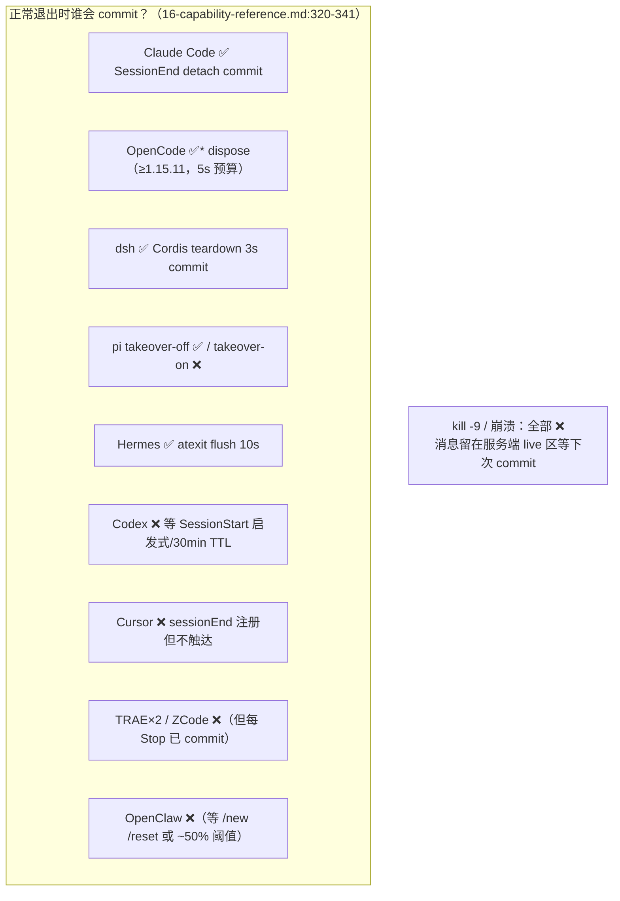

# 02 · 编辑器/CLI Agent 集成横向对比——九家 harness，一条共享管线

> **一句话总结**：OpenViking 对编辑器/CLI Agent 的集成是一套「**公共能力核 + 宿主适配层**」架构——服务端统一定义 15 个 MCP 工具与召回/commit 语义，JS 系 harness 共享 `examples/memory-plugin-shared/lib` 的 18 个模块；各家差异集中在「挂到宿主哪个生命周期事件、会话怎么关、配置放哪里」，其中 **Claude Code 是 9-hook 全家桶形态的标杆，OpenCode 是插件事件型（宿主事件面最丰富 + dispose 覆盖关闭）的代表**。

**基准**：本地 clone `HEAD=c66b9155`，行号以此为准。
**信息源**：横向对比表与机制描述均取自**本地文档 `docs/zh/agent-integrations/`（HEAD c66b9155）**及 `examples/` 源码；DeepWiki 6/6.1-6.6（旧 262 commits）仅作交叉参考，差异处已标出。

---

## 1. 全景：三种接入形态

九家 harness 按集成形态分四组（`docs/zh/agent-integrations/16-capability-reference.md:70-77`）：

| 形态 | harness | 本质 |
|---|---|---|
| **外挂 hook 型**（全家桶） | Claude Code、Codex（含 TraeCode CLI 2.0 别名） | 宿主生命周期 hook 脚本 + stdio MCP 代理 + slash/statusline/skill 周边 |
| **瘦 hook 型** | Cursor、TRAE/TRAE CN、ZCode | 共享 `agent-hook-runtime.mjs`，行为基本一致，差异只在宿主事件名与阈值 |
| **插件事件型** | OpenCode | 宿主 plugin API（进程内 JS 模块），事件面最丰富 |
| **同进程原生型** | dsh（Cordis 插件）、pi（原生扩展 + 压缩接管）、OpenClaw（context-engine 全接管）、Hermes（内置 MemoryProvider） | 无外挂进程，直接跑在宿主进程里 |

所有 MCP 型 harness（claude-code/codex/cursor/trae×2/zcode/opencode/dsh）的**主动工具面完全一致：15 个工具由服务端统一定义**（`16-capability-reference.md:24`），插件只是代理转发。这意味着工具能力升级跟随服务端，客户端零改动。

---

## 2. 大表：九家集成横向对比

> ⚠️ 信息源=本地文档 `docs/zh/`（HEAD c66b9155），主要为 `16-capability-reference.md` 的判定矩阵（§1.2/§3.1.1/§3.2.2/§3.3.2）与各家单独页面（02/03/04/05/10/11/12/13/17）。DeepWiki 6.x 对 OpenClaw 插件的描述（6.1-6.3）与本地 `03-openclaw.md` 基本一致，但 DeepWiki 未收录 dsh（17）与 Agent Plugins（15）两篇的新内容。

| harness | 接入方式 | 召回注入机制 | 会话记忆提交机制 | 配置文件位置 | 特殊能力 |
|---|---|---|---|---|---|
| **Claude Code** | CC 插件（marketplace）：**9 hook** + MCP 代理 + slash + statusline + skill（`hooks.json:1-110`） | 每轮 `UserPromptSubmit` hook 自动召回，`<openviking-context>` 块注入 `hookSpecificOutput.additionalContext`；带 session_id 走服务端 query expansion + 跨轮去重 | `Stop` 时 pending≥20000 token 才 commit（keep 10）；SessionEnd/SubagentStop 无条件 commit；PreCompact 同步 commit；写路径 detach 子进程 | env + `ovcli.conf` `plugin.claude_code` 段 + `ov.conf` `claude_code` 段 | **召回再摘要**（本地 `claude -p` 压缩，默认 auto，唯一接服务端 rewrite 的 harness）；statusline 状态栏；subagent 会话隔离最完整 |
| **Codex**（含 TraeCode CLI 2.0） | Codex 插件（marketplace）：**4 hook** + MCP 代理 + skill | 同上，`<openviking-context source="auto-recall" format="digest">`；整 hook 120s 硬截止 | `Stop` 20000/keep 10；PreCompact 全量 commit 后置空 ovSessionId；**无磁盘队列**，靠游标不推进重发补偿 | env + `ovcli.conf` `plugin.codex` + `ov.conf` `codex` | 本地 `codex exec` 压缩（gpt-5.3-codex-spark→gpt-5.6-luna）；孤儿会话靠 30min idle-TTL + 活动窗口启发式回收（`04-codex.md:59-61`） |
| **OpenClaw** | context-engine 插件（`ownsCompaction:true`）+ 15 工具 + 5 slash + 4 hook + HTTP 路由 | `transformContext` assemble（7 道 passthrough 门）前置 `<relevant-memories>`；走 `/find` **不带 session_id**（接口无该字段） | afterTurn 阈值 ~64000 token（`tokenBudget×0.5`）；`/new` `/reset` 与 compact 时 wait=true commit | `openclaw.json` 的 `plugins.entries.openviking.config`（严格校验，未知键进 setup-only 模式） | **ContextEngine 全接管宿主压缩**；`memory_store` 直写；失败轮次不重放 |
| **Hermes** | 内置 MemoryProvider（随 Hermes 发布，无需插件） | 每轮 API 调用前同步 `prefetch`，`<memory-context>` 块只进 API 请求体不写回持久化；总预算 4s | **无阈值 commit**，全靠会话边界（end/switch/缓存驱逐）；drain 不净不 commit；atexit 兜底 | `.env`（`OPENVIKING_*`）或 `hermes memory setup openviking` 向导；`config.yaml` | 唯一 `X-API-Key`+`Bearer` 双发的家族；多协议摄取（HTTP/Git/SSH/本地 zip） |
| **Cursor** | 配置驱动（写 `~/.cursor/hooks.json`+`mcp.json`）+ rule + skill：**7 hook** | `beforeSubmitPrompt` 注入 `additional_context`；事件 id + 500ms 窗口去重，同 promptHash 复用缓存 | `stop` 时 captured≥8 条（≈4 轮）commit，keep 0；`preCompact` 无条件 | 仅 env（连接信息读 `ovcli.conf`） | `beforeReadFile`/`beforeShellExecution` 拦截 `viking://` 误用；项目身份用 `workspace_roots` |
| **TRAE / TRAE CN** | 配置驱动（`~/.trae{,-cn}/hooks.json`）：**4 hook** | `UserPromptSubmit` 注入 `additionalContext`（剥历史注入块） | **每个有内容的 Stop 都 commit**（无阈值，keep 0）——短会话也能进抽取 | 仅 env | 上游无 PreCompact 事件 |
| **OpenCode** | npm 插件 `@openviking/opencode-plugin`：**7 plugin hook** + MCP 代理 | 每条 `chat.message` 的 user 消息触发；**合成 synthetic part `unshift` 到 parts 最前**（`memory-recall.mjs:58-72`）；正文已含 `<openviking-context` 则跳过 | `session.idle` flush 后 pending≥20000 才 commit（keep 10）；`session.deleted`/`error`/`dispose` 强制；**compacting 前后各一次 commit** | `openviking-config.json`（4 级搜索）+ env | `experimental.chat.system.transform` 把已索引仓库列表注入 system prompt（repo 上下文注入，独有）；有 toast |
| **pi** | 原生扩展（8 事件，jiti 直译 TS，**不支持 MCP**） | `before_agent_start` 排队、`context` 事件内检索；profile 进 systemPrompt **每轮重拼** | takeover 默认开：本地估算 ≥30000 且 >3 用户轮才 commitAndAdvance（keep 3）；非 takeover：20000/keep 10 | `~/.pi/agent/extensions/openviking/config.json` + env | **context takeover**（用 archive overview 替换已 commit 的本地历史，fail-open）；7 个 `viking_*` 原生工具；`viking_forget` 需 score>0.8 |
| **dsh**（DeepSeek Harness） | Cordis 同进程插件（`cordis.patch.yml`）+ MCP 代理 + skill | `agent/pre-step` waterfall，注入 append 到 `decision.messages` 尾部（随会话重放、对压缩可见） | `turn/end` pending≥20000（keep 10）；teardown 每 session 一次 3s 超时 commit | cordis patch config + 4 个 env（凭据 patch>env，行为开关 env>patch） | 注入是**持久消息**而非临时上下文（与其他家最大的语义差异） |

---

## 3. 精讲一：Claude Code（examples/claude-code-memory-plugin/）

### 3.1 九个 hook 的完整生命周期

`examples/claude-code-memory-plugin/hooks/hooks.json`（110 行）注册了 9 个事件，构成最完整的自动化链路：

| 事件 | 脚本 | timeout | 职责 |
|---|---|---|---|
| SessionStart | session-start.mjs | 120s | 注入 profile + 记忆索引；重放 pending 队列 |
| UserPromptSubmit | **auto-recall.mjs** | 60s | 每轮自动召回（见 3.2） |
| PostToolUse(Read) | skill-experience.mjs | 5s | 读取文件后检索相关经验 |
| PreToolUse(Read\|Glob\|Grep) | uri-guard.mjs | 5s | 拦截 `viking://` 被当本地路径 |
| Stop | auto-capture.mjs | 45s | 增量捕获 + 阈值 commit |
| PreCompact | pre-compact.mjs | 30s | 压缩前补齐并 commit |
| SessionEnd | session-end.mjs | 30s | 无条件 commit（detach） |
| SubagentStart | subagent-start.mjs | 10s | 派生 `cc-<sid>__subagent-<agent_id>` 隔离会话 |
| SubagentStop | subagent-stop.mjs | 45s | 读 subagent transcript 推送后无条件 commit |

会话 id 格式为 `cc-<CC session_id 原文>`，subagent 为 `cc-<sid>__subagent-<agent_id>`（`16-capability-reference.md:163`）——**子代理记忆完全隔离**是九家中最完整的。

### 3.2 auto-recall.mjs：召回注入的实现细节

`scripts/auto-recall.mjs`（455 行）的注入路径：

1. **禁用守卫**（L25-28）：`isPluginEnabled()` 为假时直接输出 `{"decision":"approve"}` 退出——hook 永不阻塞宿主；
2. **注入出口**（L38-42）：`approve(msg)` 把召回块放进 `hookSpecificOutput.additionalContext`（UserPromptSubmit 事件的标准注入通道）；
3. **本地重排**（L82-92 `rankItem`）：`base + leafBoost(0.12) + eventBoost(时间意图 0.10) + prefBoost(偏好意图 0.08) + overlapBoost(词面重叠 ≤0.2)`——中英文偏好/时间正则都在 L53-54；
4. **多源搜索**（L177-180）：固定两源 `viking://~/memories` + `viking://~/skills`，**resources 被刻意排除**在自动召回外（L173-175 注释："resources excluded to prevent cross-namespace leakage"）——资源类文档要模型显式 `search`；
5. **预算装填 + 降级**（L254-300 `buildInjectionBlock`）：预算内条目带正文，**超预算条目降级为 URI+score 而非丢弃**（L275-286），第一条永远保留（openclaw spec §6.2）；块格式 `<openviking-context>...</openviking-context>`（L259/289）；
6. **服务端组装优先**（L302-311 `recallViaServerAssembly`）：实际走共享库 `buildServerAssembledBlock`（context face），本地重排只是三级降级的最后一级。

`docs/zh/.../02-claude-code.md:75` 补充：tool output 截断在服务端做——超过 `tool_output_externalization.threshold_chars`（默认 20000 字符）的外置到 session tool-result 存储，part 里留 synopsis stub + `tool_output_ref`。

### 3.3 写路径 detach：关机不丢数据的关键

`async-writer.mjs`（共享库）的 Stop 默认路径：drain stdin → spawn **detached worker**（自成进程组）→ approve → write → unref（`16-capability-reference.md:295`）。这带来两个特性：

- Ctrl+C / SIGHUP / 关终端时 detached worker 不受信号波及，写入照常完成（关闭语义矩阵里 claude-code 是全 C，`16-capability-reference.md:322`）；
- 代价：Stop 的 `appended N turn(s)` 提示不再显示（`OPENVIKING_WRITE_PATH_ASYNC=0` 恢复）。

### 3.4 召回压缩（唯一双通道实现）

`01-overview.md:44-48`：`recallCompress` 四态 `off|client|server|auto`，默认 **auto**——先探测本地 `claude --version`（缓存 7 天），可用则起 `claude -p --model sonnet --effort low` 子进程压缩（输入 <1500 字不压缩；失败回落未压缩块；URI 编辑距离吸附）；不可用则下发 `rewrite:"auto"` 交服务端。**这是九家中唯一接入服务端 rewrite 的**。

---

## 4. 精讲二：OpenCode（examples/opencode-plugin/）

### 4.1 插件形态：一个导出函数，七个挂点

`examples/opencode-plugin/index.mjs:15-97`——`OpenVikingPlugin({ client, directory })` 返回的对象就是全部宿主接口：

```js
return {
  config: async (opencodeConfig) => {          // L46-56  自注入 MCP 条目
    injectOpenVikingMcpConfig(opencodeConfig, pluginRoot, config.mcp.enabled)
  },
  event: async ({ event }) => { ... },          // L58-63  session.created→刷 repo 列表
  "tool.execute.before": vikingUriGuard,        // L65     拦 viking:// 误用
  "experimental.chat.system.transform": ...,    // L67-70  repo 列表进 system prompt
  "chat.message": async (input, output) => {    // L72-80  召回注入（见 4.2）
    await sessionInject.injectSessionContext(input, output)
    await recall.injectRelevantMemories(input, output)
  },
  "experimental.session.compacting": async (input) => {  // L82-90 压缩前 commit
    await sessionManager.flushSession(input.sessionID, { commit: true, ... })
  },
  dispose: async () => {                        // L92-95  关闭兜底
    await sessionManager.flushAll({ commit: true })
  },
}
```

关键差异点：
- **MCP 条目由 `config` hook 自注入**（L46-47）——用户只需在 `opencode.json` 的 `plugin` 数组写包名，不用手配 MCP；`config.mcp.enabled=false` 时进入 hook-only 模式（L48-55 的日志三分支）；
- **`dispose` 覆盖四种关闭方式**（≥1.15.11；`16-capability-reference.md:327`），但宿主 shutdown 预算仅 5s，多会话串行最坏 5+10+30s 会被截断，且 pending queue 不覆盖此场景（fetch 未 settle 不入队）。

### 4.2 召回注入：synthetic part 的巧用

`lib/memory-recall.mjs` 是 OpenCode 形态的教科书实现：

- **query 提取**（L46-56 `extractCurrentUserText`）：拼接非 synthetic 的 text part；**正文已含 `<openviking-context` 就返回 null 跳过本轮**（L51）——这是注入回流防护的幂等检测；
- **健康预检**（L17-18）：`/health` 5s 不通直接放弃，fail-open；
- **session 映射**（L32）：`sessionManager.getMappedSessionId(sessionID)` 把 OpenCode 会话映射成 `oc-` 前缀的 OV 会话——注释写明「The mapped OV session is what turns on server-side query expansion and the cross-turn dedup ledger」；
- **注入**（L58-72 `prependSyntheticRecallPart`）：`output.parts.unshift({ ..., synthetic: true, ... })`——**合成 part 标记 synthetic**，既进上下文又不被当作真实用户输入捕获，天然防回流。

### 4.3 捕获与 commit：事件驱动的状态机

`lib/memory-session.mjs` 的事件分派（grep 验证）：

- `session.deleted` / `session.error`（L152/154）→ `flushSession(commit: true)`（L191）；
- `session.idle`（L158）→ 先 `flushSession(commit: false)` 落消息（L210），再读服务端 `pending_tokens`，≥ `commitTokenThreshold`（默认 20000）才 commit（L432-442）；
- `experimental.session.compacting` 前与 `session.compacted` 后**各 commit 一次**——一次宿主压缩 = 两次 OV commit（`16-capability-reference.md:306`）。

配置文件 `~/.config/opencode/openviking-config.json` 只放行为旋钮（`10-opencode.md:100-121`：`autoRecall.limit=6`、`commitTokenThreshold=20000`、`profileTokenBudget=10000`、`resumeContextBudget=32000` 等），凭据走 `ovcli.conf`（旧版凭据字段仍作迁移 fallback，会有 WARN toast，`index.mjs:33-38`）。

运行时日志与状态：`~/.config/opencode/openviking/openviking-memory.log` + `openviking-session-state.json`（`10-opencode.md:143-148`）。

---

## 5. 一图看懂九家的关闭语义差异



三条阅读提示（`16-capability-reference.md:337-341`）：正常退出即 commit 的五家 = claude-code、opencode(≥1.15.11)、dsh、pi(takeover off)、hermes；kill -9 所有集成都不触发 commit（消息不丢，等同一会话后续触发归档）；每轮必 commit 的 TRAE×2/ZCode 关闭语义最简单，代价是每 Stop 一次全量归档+抽取。

---

## 6. 共享层：memory-plugin-shared 的两种消费方式

`examples/memory-plugin-shared/lib/` 18 个 `.mjs` 是 JS 系唯一事实源（`16-capability-reference.md:112-137`）：

1. **Vendoring（sync.mjs 复制分发）**：claude-code/codex/opencode 各 17 个、dsh 15、pi 13、zcode 19、agent-plugins 5；vendored 副本行号 = lib 源行号 + 1（首行生成注释）；
2. **相对路径直接 import**：cursor/trae/trae-cn 不复制，安装器把包与共享 lib 一起放到 `~/.openviking/agent-integrations/{<client>,memory-plugin-shared}/`，运行期共享目录被三家共用，**任一重装整体覆盖**。

核心模块：`recall-core.mjs`（三级降级召回）、`agent-hook-runtime.mjs`（瘦 hook 运行时，19 个 env）、`pending-queue.mjs`（磁盘离线队列，≤50 条/次、≤3 次/条、TTL 7 天）、`batch-send.mjs`（100 条/批 + 404/405 降级）、`profile-inject.mjs`（CJK 感知的 profile 注入：≥U+3000 记 1.5 token/字）、`workspace-peer.mjs`、`retryable.mjs`（0/408/429/≥500 或 409+retryable 才重试，401/403 不重试）。

---

## 7. 设计权衡与坑

1. **hook 失败静默（fail-open 是双刃剑）**：所有 hook 脚本失败都不阻塞宿主（auto-recall.mjs L25-28 的 approve-then-exit 模式；memory-recall.mjs L17-18 的 health 预检放弃）。好处是记忆系统永远不会弄坏你的编辑器；坏处是**召回悄悄失效你未必发现**——`OPENVIKING_DEBUG=1` + 看 `~/.openviking/logs/<harness>-hooks.log` 是唯一排障手段（各家日志文件名不同：cc-hooks/codex-hooks/cursor-hooks/trae-hooks…）。
2. **注入召回的 token 开销分层**：context face 下注入预算由服务端 `max_tokens`（默认 1600）决定；raw find 兜底层才受客户端 `recallTokenBudget`（默认 2000）控制（`16-capability-reference.md:235`）。Claude Code/Codex 还可再叠一层本地压缩（省 token 但多一次子进程模型调用，加延迟）。低延迟场景统一关法：`OPENVIKING_RECALL_QUERY_EXPANSION=off` + `OPENVIKING_RECALL_COMPRESS=off`（`01-overview.md:38-41`，注意后者只对 cc/codex 生效）。
3. **多 Agent 并发写同一 user 的冲突**：subagent 会话各家处理不一——cc 派生独立会话（隔离最完整）；codex/dsh 的 subagent 各自独立会话；其余家基本没有 subagent 概念。共享 `~/.openviking/agent-integrations/` 目录的 cursor/trae×2，**任一重装会整体覆盖共享 lib**（`16-capability-reference.md:117`）——三家混装时升级要一起升。
4. **`plugin` 段配置只对两家生效**：`ovcli.conf` 的 `plugin.claude_code`/`plugin.codex` 段其余 harness 不解析（`01-overview.md:65`）；且 **`ov config add/edit` 会用 Rust Config 结构重写整个 ovcli.conf，丢掉它不识别的 `plugin` 段**（`16-capability-reference.md:215`）——用 `ov config switch`（字节复制）才安全。
5. **Cursor 的 sessionEnd 实际不触达**：已注册但只在 window_close 触发，此时宿主已销毁 shell-exec host，hook 在 spawn 前中止（`16-capability-reference.md:324`）——短会话（<8 条消息水位）尾部消息依赖同一会话的后续消息触发 commit，**结束了就真没归档**。
6. **dedup_turns 的 turn 是消息条数**：服务端 context 面默认 dedup_turns=0，常见值 5 来自客户端兜底；「turn」按消息计数（`total_message_count`），user+assistant 同推的 harness 上默认 5 ≈ 1-2 个真实对话轮（`16-capability-reference.md:242`）。`autoCapture=0` 且 `autoRecall=1` 时消息数恒 0 → 台账时钟不走 → 已发正文的 URI 持续冷却。
7. **DeepWiki vs 本地的差异**：DeepWiki 6.5 提到的 OpenCode 插件名为 `openviking-opencode`，本地已发布为 npm 包 `@openviking/opencode-plugin`（`10-opencode.md:48`）；DeepWiki 未收录 dsh 集成（17-dsh.md 为新增）、Agent Plugins 规范包（15）及 16-capability-reference 的完整矩阵——读旧档案时注意。

---

## 📌 下一步阅读

- `01-agent-plugins-mcp.md`（本目录）——规范包如何用「技能自律」替代「hook 自动化」
- `03-langchain.md`（本目录）——框架级集成：retriever/tools/middleware 的库形态
- 源码：`examples/memory-plugin-shared/lib/recall-core.mjs`——三级降级召回的实现核
- 文档：`docs/zh/agent-integrations/16-capability-reference.md` §3.3.3——关闭方式 × harness 终局矩阵（排障必读）
