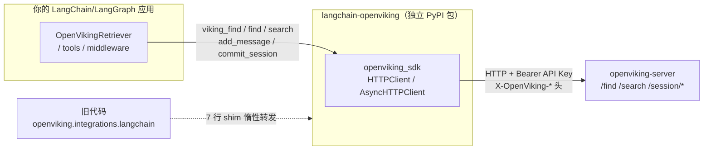
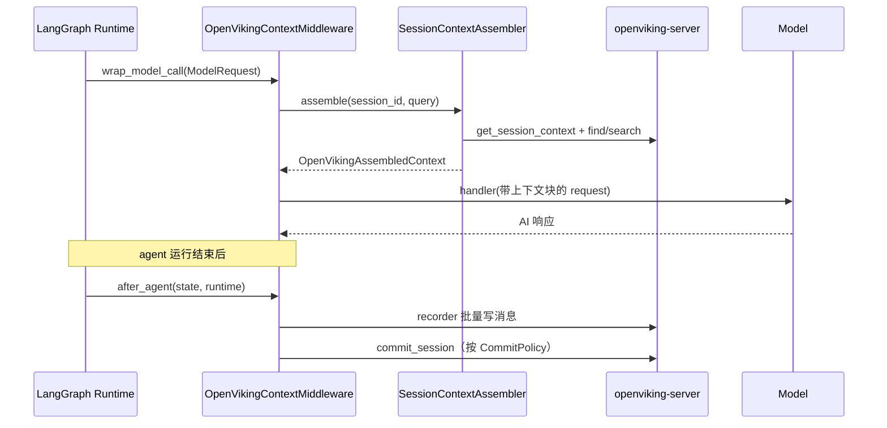

# 03 · LangChain / LangGraph 集成（integrations/langchain/）——独立发版的框架适配包，从 Retriever 到 Middleware 五件套

> **一句话总结**：OpenViking 对 LangChain/LangGraph 的集成是一个**独立发布到 PyPI 的适配包 `langchain-openviking`**（15 个 py、6147 行，LangGraph 仅作 extra 依赖），用七个适配器把 OpenViking 塞进 LangChain 的每个标准扩展点——`BaseRetriever`、`BaseStore`、`BaseChatMessageHistory`、`StructuredTool`、`AgentMiddleware`；其中 middleware 的「召回进 `wrap_model_call` + 捕获进 `after_agent`」与 hook 型插件的 OpenClaw context-engine **生命周期同构**，但 commit 从 harness 隐式阈值变成了应用侧显式的 `OpenVikingCommitPolicy`。

**基准**：本地 clone `HEAD=c66b9155`（2026-08-24），行号以此为准。与 `docs/zh/agent-integrations/07-langchain-langgraph.md`（308 行，本地核实）交叉核对。DeepWiki 6.6（147 行，基线 f316d6ad 旧 262 commits）写作时代码还在主包 `openviking/integrations/langchain/`，**未反映 #3685 之后的独立包形态**——本文以本地源码为准。
**归属澄清**：`notes/03-architecture.md` 把 LangChain 集成归入 `openviking_cli ·` 章节（Python 客户端生态视角）；但 HEAD 上 `openviking_cli/` 内 grep "langchain" **零匹配**（两次独立核实），实际代码在 `integrations/langchain/`（独立包源码）+ `openviking/integrations/langchain/`（兼容转发 shim）。

---

## 1. 形态：独立包 + 兼容 shim 的双壳结构

### 1.1 独立包 `integrations/langchain/`（src layout）

```
integrations/langchain/
├── pyproject.toml        # name=langchain-openviking，setuptools-scm 动态版本
├── src/langchain_openviking/   # 15 个 py，6147 行（wc 核实）
│   ├── context.py        # 935 行：with_openviking_context + OpenVikingSessionContextAssembler
│   ├── tools.py          # 876 行：create_openviking_tools（13 个 viking_* 工具）
│   ├── client.py         # 832 行：连接管理 + OpenVikingCommitPolicy + apply_commit_policy
│   ├── recording.py      # 689 行：OpenVikingSessionRecorder（含部分写入重试协议）
│   ├── store.py          # 603 行：OpenVikingStore（LangGraph BaseStore）
│   ├── middleware.py     # 590 行：OpenVikingContextMiddleware（LangGraph AgentMiddleware）
│   ├── retrievers.py     # 303 行：OpenVikingRetriever（BaseRetriever）
│   ├── history.py        # 290 行：OpenVikingChatMessageHistory
│   └── testing.py 等 7 个 # InMemoryOpenVikingClient/uri/async cache 等支撑件
├── tests/                # pytest + pytest-asyncio
└── README.md / README_CN.md
```

依赖刻意最小（`pyproject.toml:27-28`）：`langchain-core>=1.0.0,<2.0.0` + `openviking-sdk>=0.1.1` + pydantic；**langgraph 是 extra**（`pyproject.toml:33`，装 middleware/store 才需要 `pip install "langchain-openviking[langgraph]"`，文档 `07:10-11`）。Python >=3.10（`:10`）。

### 1.2 发版：CI 单独走一条流水线

`.github/workflows/python-langchain-release.yml` 只在 release tag 以 **`langchain-openviking@`** 开头时触发（yml:24 的 `startsWith` 条件；也支持 workflow_dispatch 到 testpypi/pypi/both）。版本由 `setuptools_scm` 从 git 算出，**发布前校验 tag 必须等于 `langchain-openviking@<解析版本>`**，防错位发布；构建用 Python 3.12 + `twine check`，发布走 PyPI trusted publishing（`id-token: write`）。根 `pyproject.toml:182-190` 里 langchain 系只出现在 `benchmark` extra——主包运行时与 LangChain 完全解耦（commit `e910c5fe` #3711 "decouple langchain client from server" 的落点）。

### 1.3 兼容 shim：`openviking/integrations/langchain/`（12 个文件，全是转发）

子模块（client/context/history/...）各 **7 行**（wc 核实），只做一件事：调 `_forward_legacy_module("retrievers", globals())` 把独立包同名子模块的公共名灌进旧命名空间。`__init__.py`（75 行）的机制更精细：装了独立包就转发 `__all__`/`__getattr__`；没装则保留 `_LEGACY_EXPORTS`（L12-29，16 个旧导出名）并在访问时抛带 **pip install 指引** 的 ImportError（L32-38、L69-72）——旧代码 `from openviking.integrations.langchain import OpenVikingRetriever` 要么无缝迁移要么得到明确修复路径，不会 cryptic 失败。



## 2. 七个适配器：一个包覆盖 LangChain 全部扩展点

选型表（`07:188-196`）：**RAG 检索** `OpenVikingRetriever`；**包装 runnable 自动召回+捕获+commit** `with_openviking_context()`；**显式记忆工具** `create_openviking_tools()`；**跨线程持久状态** `OpenVikingStore`；**LangGraph middleware** `OpenVikingContextMiddleware`；**聊天记录后端** `OpenVikingChatMessageHistory`；**自管生命周期录制** `OpenVikingSessionRecorder`。

三个「继承标准接口」的适配器值得注意基类选择：`OpenVikingRetriever(BaseRetriever)`（`retrievers.py:64`）、`OpenVikingStore(BaseStore)`（`store.py:56`）、`OpenVikingChatMessageHistory(BaseChatMessageHistory)`（`history.py:44`）——意味着 LCEL `as_retriever`、LangGraph checkpointer 的 store 注入、`RunnableWithMessageHistory` 等生态位**即插即用**。

- **Retriever**：`search_mode: find|search`（`retrievers.py:82`）映射服务端两检索面；`content_mode: auto|abstract|overview|read`（`:84`）控制返回正文的深度（read 才拉全文，`_read_or_fallback` 失败回落摘要）；`max_content_chars=12000` 截断防爆 token。还重载 `__deepcopy__`（`:99`）让 LangChain 的图复制**复用而非克隆底层 client**（commit `e9701baa` #3603）。
- **Store**：值存成 `<root_uri>/data` 下 JSON 记录，同时写一份 `<root_uri>/index` **markdown 投影**给服务端语义检索建索引（`store.py:64-68` docstring）——「结构化存储 + 向量可搜」双轨是它的独门设计；默认 `root_uri="viking://~/memories/langgraph_store"`。`batch()`（`:104-127`）完整实现 GetOp/PutOp/SearchOp/ListNamespacesOp，`put(value=None)` 语义化为 delete。
- **Context wrapper**：`with_openviking_context()`（`context.py:619`）返回 `OpenVikingContextRunnable(RunnableWithMessageHistory)`（`:566`），每次调用独立持有 history 快照/peer 身份/召回引用，**同 session 可并发**；召回参数直接暴露（`limit=5`、`token_budget=128_000`、`commit_policy`，`:642`）。

## 3. 精讲 middleware：OpenClaw 生命周期的 LangGraph 翻译

`middleware.py:77-81` 的类 docstring 自陈："**mirrors the OpenClaw-style lifecycle** at LangGraph's extension points: recall before model calls and optional session capture after agent execution"。也就是说，02 篇里九家 harness 的「hook 注入」在框架侧的等价物是 LangGraph 1.x 的 `AgentMiddleware`：



（对照 `middleware.py:189-207`：`_model_context_plan` 解析 session/query/actor_peer → `assembler.assemble` → `_request_with_context` 注入 → handler 异常时 `pop` 掉 pending 上下文防悬挂。）

**捕获与 commit 的开关分离**是这个适配器的核心语义：`capture_on_after_agent=True` 但 `commit_on_after_agent=False` 是默认（`:103-104`）——先捕获不归档；真要每次 agent 结束即归档，显式开 `commit_on_after_agent=True`（此时若未给 policy 自动升级为 `mode="always"`，`:167-168`）。`after_agent`（`:271`）每次运行时才把 middleware 的 policy 塞给 recorder，支持运行中热改。

`OpenVikingCommitPolicy`（`client.py:101-105`）是整个写路径的策略中枢：`mode: never|always|pending_tokens`，默认 `never` + 阈值 8000 pending token。`apply_commit_policy`（`:414`）实现 pending_tokens 档时优先用 `add_message` 返回的 post-write 值，**旧 SDK 不返回才回落 get_session 查询**——一次写入一趟确认，不额外查询。

## 4. 工具面：13 个 viking_* + 三档 profile

`create_openviking_tools()`（`tools.py:47`）的 docstring（`:66`）明说工具名带 `viking_*` 前缀是**让模型看到与插件/MCP 相同的概念操作**。检索七件套（find/search/browse/read/grep/archive_search/archive_expand）+ 写入（store/add_resource/add_skill）+ health + forget。`_profile_tool_names`（`:527`）三档：

| profile | 工具数 | 内容 |
|---|---|---|
| `retrieval` | 8 | 七检索 + health（纯只读） |
| `agent`（默认） | 12 | + store/add_resource/add_skill |
| `admin` | 13 | + forget（且 `allow_forget` 才追加，默认 False） |

与 MCP 的 15 工具对比：**少 tree/write/edit/list_watches/cancel_watch**（服务端文件维护类），**多 viking_archive_search/expand**（归档检索的细粒度控制）——工具面按「模型自主调用」场景重新裁剪，不是 1:1 翻译。

## 5. 异步工程：event-loop 作用域与部分写入协议

`07:46-51` 的两种 client 模式（注入=调用方所有；`url=`=每 event loop 一个可恢复 handle，由 `_async_client_cache.py` 的 LoopScopedAsyncClientCache 实现）。并发语义（`07:81-82`）：**async 写入每 loop 内按 session 串行，sync 写入跨线程按 session 串行**，只有 append-and-commit 临界区被锁。取消语义（`07:84-88`）：`arecord()` 被取消时重抛原始 `CancelledError`，配合 `get_openviking_cancellation_progress()` 读已确认前缀——`OpenVikingPartialWriteError`（`07:269`）报告 `input_messages_consumed`，重试只发未写入后缀，空后缀安全重试 pending commit。误在 async 生命周期后调 sync `close()` 会抛异常但保持 recorder 可用（`07:93-95`）。示例全部可用内存客户端无凭证跑通（`testing.py` 的 `InMemoryOpenVikingClient`，刻意只实现适配器用到的方法子集；`07:294-299` 的 `uv run --project integrations/langchain --extra langgraph ...`）。

## 6. 三条集成路线的能力对比（接 01/02 篇）

| 维度 | MCP 插件路线（01/02 篇） | LangChain 路线（本篇） |
|---|---|---|
| 接入对象 | 编辑器/CLI harness | **自研 Python 应用**（应用即宿主） |
| 自动召回 | hook 注入（cc/codex 每 UserPromptSubmit） | middleware `wrap_model_call` 或 context wrapper——**框架内同构实现** |
| 自动捕获 | Stop/afterTurn hook | `after_agent`（capture 开关分离） |
| commit 决策 | harness 隐式（cc 20000 token/keep 10） | **应用显式 `OpenVikingCommitPolicy`**（never/always/pending_tokens，默认阈值 8000） |
| 工具面 | 服务端 15 个 MCP 工具 | 客户端 13 个 `viking_*`，profile 分层 |
| Actor peer | cwd 派生 workspace peer | `actor_peer_resolver` 从**已认证 runtime 字段**解析（`07:150-184`，禁止信 model state） |
| 离线韧性 | 磁盘 pending-queue + detached worker | **无磁盘队列**；靠 PartialWriteError 前缀重试协议 |
| 会话映射 | `cc-`/`oc-` 前缀派生 | 应用自定 session_id（`session_id_resolver`） |

LangChain 路线**独有**的能力：BaseStore 跨线程持久状态 + index markdown 双投影；retriever 的 content_mode 四档正文深度；LangGraph checkpointer 生态位即插即用。**缺失**：无 SKILL.md 式召回纪律文档（开发者得自己写 system prompt 教模型何时检索）；无关闭时的 detached 写入兜底（JS 系 Stop 路径 spawn 独立进程组，Python 侧靠显式 `aclose()`）。

## 7. 设计权衡与坑

1. **双包结构的版本漂移面**：shim 转发不做版本协商——旧主包 + 过新的独立包可能出现导出名对不上；文档 `07:14-15` 只承诺「转发导入路径」。且 `has_request_actor_peer_support()` 探测的 `supports_request_actor_peer` 能力要求 `openviking-sdk` 与 `openviking` **同时升级**（`07:184`），三包（server/sdk/adapter）版本矩阵是实际运维负担。
2. **commit 默认 never 是把双刃剑交给应用**：middleware 默认捕获不归档，忘记配 policy 的应用会一直堆积 pending——不像 harness 插件有隐式阈值兜底。反过来，pending_tokens 档依赖服务端返回的 post-write 值，跨版本 SDK 回落查询还会吞异常静默跳过 commit（`client.py:414` 的 except 分支只 debug 日志）。
3. **langgraph 是 extra 但 store/middleware 强依赖**：`OpenVikingStore.__init__` 里 `_LANGGRAPH_IMPORT_ERROR` 直接 raise（`store.py:87-88`，该变量在 import langgraph 失败时于 `:48` 赋值）——装裸包 `pip install langchain-openviking` 后 import store 才报错，报错时机偏晚；文档用 `[langgraph]` 后缀引导，但错误信息是否指向 extra 需用户自己读（`client.py:49-63` 的 `OptionalDependencyError`/`missing_dependency` 有此机制）。
4. **DeepWiki 6.6 已过时两代**：它把源文件路径写成 `openviking/integrations/langchain/*`（#3685 抽包前），也未覆盖 #3626 request-scoped actor peers 与 #4196 的 `viking://~` URI 迁移（git log：`ea6e2dbb` unify recording → `8eb89a63` native async → `b2e19726` extract standalone → `e910c5fe` decouple）。但它记录的 ClientHandle 对幂等读（find/search/read）遇 `DEADLINE_EXCEEDED`/event-loop mismatch 自动重试机制仍可对照现 `client.py:727-745` 的 `_should_retry_method`/`_is_recoverable_client_error`。
5. **同一语义三处实现的维护成本**：`OpenVikingContextMiddleware`、`with_openviking_context`、`OpenVikingSessionRecorder` 各自持有一份「召回+捕获+commit」编排（middleware 内嵌 recorder+assembler，context wrapper 又一套），935 行的 context.py 是全包最大文件——框架扩展点的多样性（middleware vs runnable wrapper vs 手动 recorder）让抽象难以完全下沉，这是接框架的税。
6. **`viking://~` 依赖服务端版本**：Store 默认 root_uri 用 `~` 简写，docstring 明示需要支持该别名的新版服务端，否则要写全 `viking://user/<uid>/...`（`store.py:64-68`）——自建旧版服务的用户会踩。

---

## 📌 下一步阅读

- `01-agent-plugins-mcp.md` / `02-editor-agents.md`（本目录）——插件/hook 两条路线，与本篇构成集成三部曲
- 源码：`integrations/langchain/src/langchain_openviking/context.py`——context wrapper 与异步串行化的实现核
- 文档：`docs/zh/agent-integrations/16-capability-reference.md` §2——SDK/框架集成的能力矩阵
- 关联：`openviking_sdk`（Python SDK）——适配器之下的 HTTP client 与 actor-peer 作用域原语
