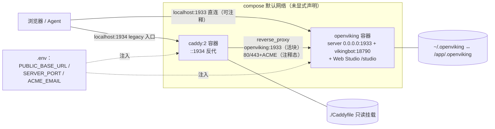
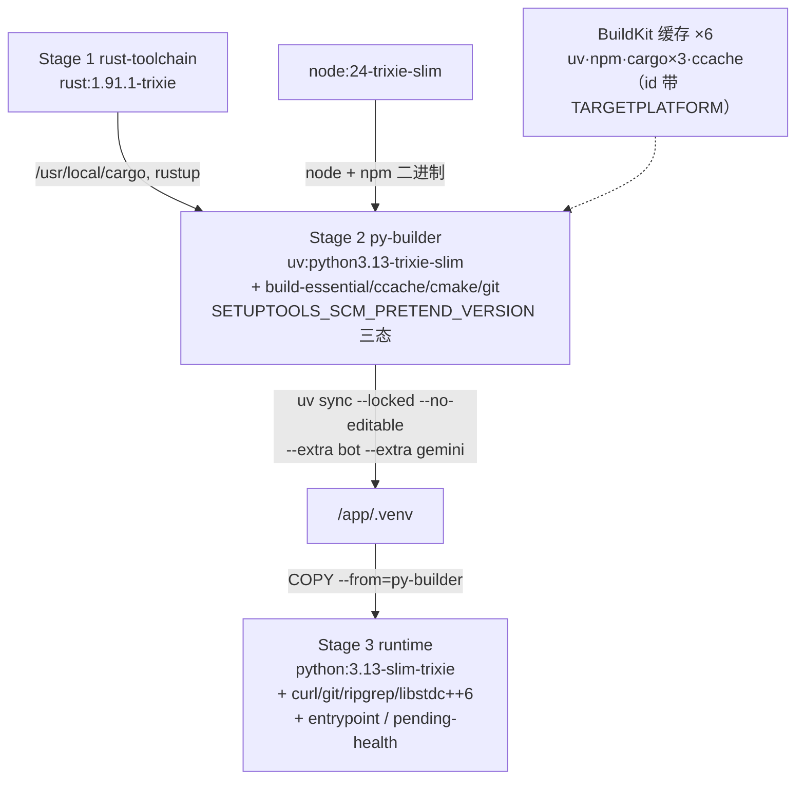

# 01 · 容器化部署工件逐行读：compose、三阶段 Dockerfile、Caddyfile、Helm chart

> **一句话总结**：OpenViking 的部署面是五个薄工件——69 行 `docker-compose.yml`、129 行三阶段 `Dockerfile`、25 行 `Caddyfile`（活代码只有 2 行）、8 模板的 Helm chart、157 行 entrypoint——共同设计哲学是"默认自洽、注释即基建"：单容器全家桶开箱能跑，公网 HTTPS / 自定义端口 / K8s 各只需解开一段注释或改一个 values 键；唯一的硬约束（单副本）被左移到 Helm 渲染期 fail-fast，而不是留到运行期崩溃。

**基准**：HEAD=`c66b9155`（2026-08-24）；与 `docs/zh/guides/03-deployment.md`（369 行）、`docs/zh/guides/12-public-access.md`（163 行）交叉核对，均本地核实；DeepWiki 基线 `f316d6ad`（2026-07-26）过时点见 §6。部署文件在 `f316d6ad..HEAD` 区间只被一个 commit 触碰：`c61471dd`（2026-07-28，PR #3547 内部审查系列，其 F-06 条目"端口可配置化"重写了健康检查链，见 §1/§5）。模式选型、entrypoint 语义、503-pending、单机锁见姊妹篇 `../00-overview/04-two-modes.md`，本文不重复。

---

## 1. docker-compose.yml（69 行）：两个服务，零自定义拓扑

| 字段 | openviking 服务 | caddy 服务 |
|---|---|---|
| 镜像 | `ghcr.io/volcengine/openviking:latest`（L20） | `caddy:2`（L46） |
| 端口 | `${OPENVIKING_SERVER_PORT:-1933}` 双侧展开（L24-25） | `1934:1934`，80/443 注释态（L50-53） |
| 卷 | `~/.openviking:/app/.openviking`（L27） | `./Caddyfile:/etc/caddy/Caddyfile:ro`（L55），caddy_data/config 注释态（L57-58） |
| 环境 | `OPENVIKING_PUBLIC_BASE_URL` + `OPENVIKING_SERVER_PORT`（L29-30） | 上两者 + `OV_ACME_EMAIL`（L60-62） |
| 健康检查 | `["CMD", "openviking-entrypoint", "--healthcheck"]`，30s/5s/3 次/30s 宽限（L31-36） | 无 |
| 其他 | `restart: unless-stopped`（L37） | `depends_on: [openviking]` 裸列表（L63-64） |

逐行读出的工程细节：

- **一个环境变量三处消费**：`.env` 里改 `OPENVIKING_SERVER_PORT=2000`，容器内 server（compose L30 → entrypoint 解析）、端口映射（L25）、Caddy upstream（Caddyfile L24 占位符）同步跟上——这正是 c61471dd 的产物，diff 前三处全是写死的 `1933`。
- **健康检查用 exec 数组形态**（L32，非 CMD-SHELL），无 shell 解析歧义；四参数与镜像 HEALTHCHECK 逐字相同（Dockerfile L118-119）——compose 级是冗余复写，但保证"只读 compose 也懂健康语义"。
- **`depends_on` 不带 `condition: service_healthy`**（L63-64）：caddy 即刻起，不等 openviking 健康——反代形态下 503-pending 也照转，无需等。
- **caddy 容器预注入的 env 只有 `{$OPENVIKING_SERVER_PORT}` 被 1934 活块用到**，`PUBLIC_BASE_URL/ACME_EMAIL` 是给注释态域名块预铺的管线：解开注释零改文件。
- **没有的东西同样算设计**：无 `networks:`（默认 bridge + 服务名 DNS 即够）、无资源限制、无日志驱动配置；`version: "3.8"`（L1）在 Compose v2 已是 obsolete 字段（仅告警）；`container_name` 锁死名字（L21/L47）→ `--scale` 不可用——与单实例哲学自洽。
- 文件头 16 行注释就是 `.env` 协议文档（L3-16），与 12-public-access.md 方式 A 逐步对应（L41-63：解端口注释、解卷注释、`up -d` 触发 ACME）。

## 2. Dockerfile（129 行）：三阶段流水线 + 六路缓存挂载

| Stage | 基础镜像 | 职责 | 产出 |
|---|---|---|---|
| 1 `rust-toolchain`（L5） | `rust:1.91.1-trixie` | 只提供工具链（ragfs-python S3 依赖要求 rustc≥1.91.1，L4 注释） | `/usr/local/cargo` + `/usr/local/rustup` |
| 2 `py-builder`（L8） | `ghcr.io/astral-sh/uv:python3.13-trixie-slim` | 编译一切：uv sync 触发 setup.py → Rust `ov` CLI + C++ 扩展 + web-studio SPA | `/app/.venv` 完整环境 |
| 3 runtime（L94） | `python:3.13-slim-trixie` | 只装运行时 5 包（L96-102）+ 拷贝 `.venv` 与两个脚本 | 最终镜像 |

builder 阶段的巧思（构建系统全貌另见 `../00-overview/03-build-system.md`）：

- **工具链按文件复用而非按镜像**：Rust 用 `COPY --from=rust-toolchain`（L11-12），Node 直接 `COPY --from=node:24-trixie-slim` 二进制 + 手工 symlink npm/npx（L14-17）——不为工具链多拉一层镜像。
- **ccache 劫持编译器发现**：`PATH` 前置 `/usr/lib/ccache`（L34）让 cmake 的 `shutil.which("gcc")` 命中缓存包装器；`CARGO_TARGET_DIR=/cargo-target`（L39）钉死路径，使 uv 在临时 wheel 目录里构建也能吃到缓存挂载（L36-38 注释自释动机）。
- **六个 BuildKit cache mount 全带 `${TARGETPLATFORM}` 后缀 id**（L63-68：uv / npm / cargo-target / cargo-registry / cargo-git / ccache）——amd64/arm64 矩阵并行构建不互踩缓存。
- **版本三态强制**（L69-76）：build-arg `OPENVIKING_VERSION` > 仓内 `_version.py` > `exit 2`——不存在"无版本号"的镜像；docs L331 的 `docker build --build-arg OPENVIKING_VERSION=0.3.12` 即此入口。
- **`UV_LOCK_STRATEGY` 二态**（L23、L77-91）：默认 `auto` 在构建上下文内自动刷新过期 lock（CI 不被依赖变更卡死），`locked` 保 fail-fast 可复现——把"便利/严格"做成一个 build-arg。
- `UV_COMPILE_BYTECODE=1`（L41）预编译 .pyc，换容器冷启动速度。

运行时层 5 包各有归宿（L96-102）：`curl`＝健康检查、`git`＝文件系统操作、`libstdc++6`＝C++/Rust 扩展、`ripgrep`＝server 内检索后端、`ca-certificates`＝HTTPS 出站。**没有 `USER` 指令**——容器以 root 运行（§7）。镜像 = slim Python + `.venv`（内含编译好的 CLI、原生扩展、SPA 静态产物）+ entrypoint 两个脚本；L94/L118-119/L129 的运行时语义 04 篇已钉，不赘述。

## 3. Caddyfile（25 行）：活代码只有最后一行反代

- **唯一活块** L23-24：`:1934 { reverse_proxy openviking:{$OPENVIKING_SERVER_PORT:1933} }`——无路径分流、无 TLS、无静态资源；`{$VAR:default}` 是 Caddy 原生 env 占位符语法，与 compose 注入闭环。
- **静态资源不在 caddy**：L9 注释明说 Web Studio 由 OV 自己在 `/studio` 出——反代是纯 TCP 级转发，没有"前端层"。
- **HTTPS 是注释态模板**（L14-18 域名块示例）＋三步激活协议（域名块、80/443 端口、caddy 卷），对应 12-public-access.md L16-66；ACME 证书缓存落在注释态的 `caddy_data` 卷。
- 1934 端口的"legacy 但保留"定性 04 篇已述（L3-5 注释自认）。

## 4. Helm chart（`deploy/helm/openviking/`）：8 模板，约束写成渲染期断言

`Chart.yaml`：apiVersion v2、version 0.1.1、无 `appVersion`——镜像 tag 完全由 values 决定（`_helpers.tpl` L76-79 `openviking.image` 把空 tag default 成 latest）。templates/ 共 8 文件：`deployment / configmap / service / ingress / serviceaccount / pvc / _helpers.tpl / NOTES.txt`。

**values.yaml（158 行）逐组拆解**：

| 组 | 键与默认 | 行号 | 要点 |
|---|---|---|---|
| 副本 | `replicaCount: 1` | L3 | 模板 L1-3 用 `fail` 熔断 >1 |
| 镜像 | `ghcr.io/.../openviking:latest` + `pullPolicy: Always` | L5-13 | 注释自知 moving tag 之弊，建议 pin 版本换 IfNotPresent |
| 服务 | ClusterIP:1933 | L38-40 | NOTES.txt 按 Ingress/NodePort/LB/port-forward 四态给访问指引 |
| 入口 | `enabled: false`，host `openviking.local` | L42-56 | tls 空数组，cert-manager 只在注释示例里 |
| 资源 | limits 2CPU/4Gi，requests 500m/1Gi | L58-64 | — |
| 持久化 | enabled/RWO/20Gi/`mountPath: /app/.openviking`/`existingClaim` | L66-76 | 与 Docker 卷布局同构 |
| bot | `enabled: false` | L78-81 | **与 Docker 默认 true 相反**：K8s 只暴露 API 端口 |
| config | 整棵 ov.conf → ConfigMap | L86-126 | `vectordb.backend: local`（L92，即 RocksDB 进 PVC）；`server` L101-103：`0.0.0.0`/1933/`workers: 1`（04 篇钉 L103）；`root_api_key: null`（L106，注释指路 extraEnv+Secret）；embedding/vlm 预填火山方舟默认模型（L111-115/L119-126） |
| extraEnv | `[]` + secretKeyRef 范例 | L130-135 | 配合 ov.conf 内 `${VAR}` 占位符（README L108-137：server 启动时展开） |
| 探针 | `/health` 30s；`/ready` 15s 起步 10s 周期 | L138-154 | liveness 与 Docker HEALTHCHECK 同频 |

**deployment.yaml 的四个非默认选择**：① L1-3 `replicaCount>1` 时 `fail`，错误信息直接给理由（RocksDB 不支持多 pod 共享 PVC）——约束左移到 `helm install` 时刻；② L15-16 `strategy: Recreate`，先杀后起防双写；③ L20 `checksum/config` 注解把 ConfigMap 哈希进 pod 模板——values 改一个字即滚动重启；④ L78-81 ConfigMap 以 `subPath: ov.conf` + `readOnly: true` 挂载——**server 在 K8s 形态下改不了自己的 ov.conf**（与 Docker 卷内可写形成对照，`openviking-server init` 向导在此不可用）。`persistence.enabled: false` 时降级 `emptyDir`（L87-91）。`configmap.yaml` L2-4 在 workspace 为空时注入 `mountPath/openviking_workspace` 默认值再 `toPrettyJson`。`pvc.yaml` L7 打 `helm.sh/resource-policy: keep`——uninstall 数据不删（04 篇引 #3433）。README 命令全指向本 chart；docs L335 仍指旧 `examples/k8s-helm/` 的滞后 04 篇已述。

## 5. docker/ 辅助工件：entrypoint 的端口解析与两个实验镜像

**entrypoint（157 行，语义见 04 篇，此处只补实现）**：核心是 c61471dd 新增的 `resolve_server_port`（L11-29）——POSIX sh 里嵌 Python heredoc 解析 JSON，优先级 env `OPENVIKING_SERVER_PORT` > ov.conf `server.port` > 1933；三重防御：`utf-8-sig` 容忍 BOM（L19）、`os.path.expandvars` 先展开配置内环境变量占位（L20，与 Helm 的 `${VAR}` 注入机制同源）、`isdigit`+1-65535 范围校验失败直接退出（L23-24）。`--healthcheck` 子命令（L96-99）复用同一解析再 `exec curl`，保证健康检查与真服务**永不分裂端口**——这正是 F-06 修的 bug：改端口后 curl 死磕 1933 必假死。末两行 `wait` + 退出码透传（L156-157）让容器 exit code 等于 server 的。

**pending_health_server.py（101 行，零依赖 http.server）**：body 在启动时预构建一次（L46）；GET/POST/PUT/PATCH/DELETE/HEAD/OPTIONS 六方法全返同一 503（L52、L60-66）；HEAD 跳过 body（L57）；`Cache-Control: no-store`（L55）防中间层缓存 pending 态；`allow_reuse_address`（L75-76）让真 server 随后能绑同端口；docstring 自述这是"防呆（poka-yoke）兜底……故意不写进用户文档"（L10-15）。

**cuvs-dev（84 行）**：GPU 向量库开发镜像，非发布链——`cuvs-cu13==26.6.0` + `cupy-cuda13x 14.1.1`（L5-6）走 `pypi.nvidia.com`（L22）；C++ 引擎按 `sse3;avx2;avx512` 三档分发编译（L59）；`ld.so.conf` 注册 nvidia wheel 库目录以兼容 Pyxis/Enroot 不跑 container-toolkit hook（L35-45 注释）；分层顺序刻意让昂贵的 cuVS 安装层不被 Python 改动击穿（L16-18）；末行 import 自检（L79）。**mooncake-test（92 行）**：Mooncake 传输引擎冒烟镜像——pinned commit `1352bbec`（L4），只建 `mooncake_store_rust` + `mooncake_master` 两目标，关 etcd/redis/cuda（L63-84）。

## 6. DeepWiki 差异（基线 f316d6ad，2026-07-26）

- **HEALTHCHECK 引的是旧形态**：其示例 `CMD curl -fsS http://127.0.0.1:1933/health || exit 1`（该页 L237-240）——c61471dd（晚基线仅 2 天）已改为 `CMD ["openviking-entrypoint", "--healthcheck"]`（Dockerfile L118-119、compose L32），连带 compose 健康检查从 CMD-SHELL curl 换成 exec 数组。
- **运行时依赖表漏 `ripgrep`**：基线 Dockerfile L101 就有（已核实 `git show f316d6ad:Dockerfile`），属遗漏而非漂移。
- **几乎不覆盖 compose/Caddyfile**：其 sources 列表两者皆无——端口参数化、`.env` 协议、1934 反代的 env 占位符全是基线之后或从未被读的内容。
- **CI 触发条件不全**：漏了 `push: branches: [main]`（`build-docker-image.yml` L11-13，另有 workflow_dispatch + tags `v*.*.*`）；多架构矩阵（amd64/ubuntu-24.04 + arm64/ubuntu-24.04-arm，L21-29）与 GHCR+Docker Hub 双推、manifest 合并的描述仍对。
- **uv sync 未提 `UV_LOCK_STRATEGY`**：该机制基线 Dockerfile L23 已存在（遗漏）；其对 setup.py 触发链（Rust CLI/C++ 扩展/SPA）的描述与现码一致。
- 仍大体有效：三阶段结构、RocksDB→Recreate→单副本链、`/app/.openviking` 持久化约定、探针端口——骨架全对；其行号引 `Dockerfile:1-130` 而实际 129 行，属 cosmetic。

## 7. 批判性收尾：薄工件的代价

**得**：①工件极薄（69+129+25 行 + 8 模板）覆盖单机→公网→K8s 全谱系，且"注释即基建"把升级路径写进文件本身，二次编辑面最小；②约束左移的一致哲学——Helm 渲染期 `fail`、entrypoint 端口校验 `exit 2`、构建期版本缺失 `exit 2`，宁可安装/构建失败，不带病运行；③六路平台分桶缓存 + 工具链文件级复用，是对"三语言单体仓库"构建时间的认真应对。

**失与取舍**：①**单容器全家桶**：server+bot+CLI+Web Studio+三种原生产物同镜像，`.venv` 必然胖，bot 与 server 同生共死无法独立升级（K8s 里 `bot.enabled: false` 正是承认）；②**安全默认薄**：无 `USER`、`securityContext` 空注释（values L34-36），root 运行全凭运维自觉；`tag: latest`+`pullPolicy: Always` 双 moving，chart 无 digest 选项；③**K8s 配置只读**：subPath+readOnly 的 ov.conf 让任何"server 写回配置"的功能在此形态静默失效；④compose 健康检查与镜像 HEALTHCHECK 冗余、`container_name` 阻止 scale——在单锁前提下是自洽，但也堵死了"compose 起多个数据目录分片实例"的野路子；⑤本地构建强依赖 BuildKit（`syntax=docker/dockerfile:1.9` + cache mount），老 Docker 直接不可用。总体这是一套"单机优先、公网一等、K8s 达标、HA 明确不做"的诚实工件集——上限与下限都写得清清楚楚。

📌 **下一步阅读**
- `../00-overview/04-two-modes.md` — 四种运维外壳的选型视角与单机锁约束（本文的模式论上游）
- `../00-overview/03-build-system.md` — setup.py 如何在 Docker 之外编排同样的三语言构建
- `02-config-security.md` — ov.conf 全量键位与 root_api_key 的鉴权语义
