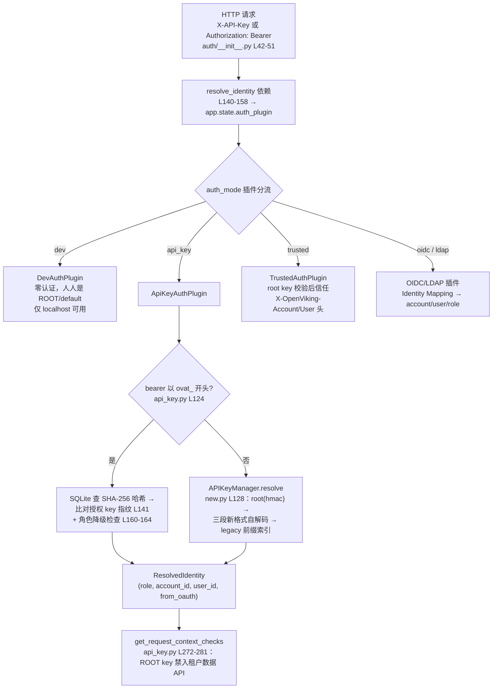

# 02 · 配置体系与安全模型：三源合并的 ov.conf 与三面分治的信任链

> **一句话总结**：OpenViking 的配置面是"一份 JSON + 四级定位 + expandvars 注入"的极简模型——`ov.conf` 由 `--config > OPENVIKING_CONFIG_FILE > ~/.openviking > /etc/openviking` 定位，加载时对全文做 `$VAR` 展开实现环境变量注入，Pydantic `extra="forbid"` 拒绝一切未知字段（写错字段名=拒绝启动）；安全面按"平面"分治：管理面是配置文件里的单一 `root_api_key`（hmac 比对、明文驻留内存、无轮换 API），数据面是 Admin API 签发的 user key（`base64url(account).base64url(user).base64url(secret)` 三段自解码格式，可选 Argon2id 哈希落盘），agent 面是叠加在 api_key 模式之上的原生 OAuth 2.1（opaque token + SQLite SHA-256 索引 + 授权 key 指纹钉死）；租户隔离不靠 URI 而靠存储路径前缀与向量后端按 account 绑定；静态加密是 Root→HKDF→Account Key→AES-256-GCM 文件信封（`OVE1` 魔术数），默认全关。

**基准**：HEAD=`c66b9155`（2026-08-24）；与 `docs/zh/configuration/01-server.md`（408 行）、`docs/zh/configuration/02-client.md`（186 行）、`docs/zh/guides/04-authentication.md`（598 行）、`docs/zh/guides/11-oauth.md`（349 行）、`docs/zh/guides/08-encryption.md`（489 行）交叉核对，均本地核实；DeepWiki 基线 `f316d6ad`（2026-07-26）过时点见 §6。姊妹篇 `00-overview/04-two-modes.md` 已讲容器强制 `root_api_key` 与 Helm values（部署侧），本文只讲配置机制与安全模型。

---

## 1. 配置三源：定位四级、注入靠 expandvars、校验靠 forbid

源码里真正的"优先级链"分两段：**文件定位**与**值注入**——并不存在很多人以为的"逐字段 env 覆盖"。

### 1.1 文件定位四级链

`resolve_config_path(explicit, env_var, filename)`（config_loader.py L23-64）：

| 级 | 来源 | 行号 | 失败行为 |
|---|---|---|---|
| ① | 显式路径（`--config`） | L40-44 | 不存在直接返回 None（不落下一级） |
| ② | `OPENVIKING_CONFIG_FILE` 环境变量 | L46-52 | 同上 |
| ③ | `~/.openviking/ov.conf` | L54-57 | 落第④级 |
| ④ | `/etc/openviking/ov.conf` | L59-62 | 全空则 FileNotFoundError |

客户端 `ovcli.conf` 同构，换 `OPENVIKING_CLI_CONFIG_FILE`（ovcli_config.py L94）。DeepWiki 2.2 页只画了三级，漏了系统级 fallback。

### 1.2 值注入：expandvars 是唯一通用 env 通道

- `load_json_config` 读入 JSON 文本后先 `os.path.expandvars(raw)` 再 `json.loads`（config_loader.py L86-88，注释明言"useful for container deployments"）——`"root_api_key": "${ROOT_API_KEY}"` 这类写法就是环境变量进配置的正规通道；未设置的变量原样保留。
- `consts.py` 定义了 30+ `OPENVIKING_*` 常量，但服务端实际只消费路径类与 `OPENVIKING_PUBLIC_BASE_URL`（mcp_endpoint.py L102-109，OAuth issuer 解析的最高优先级）等少数几个。
- 04-authentication.md L513 宣称的 `OPENVIKING_URL`/`OPENVIKING_ACCOUNT` 通用覆盖在当前代码树里只找到 Rust CLI bot 端点一处消费（`crates/ov_cli/src/main.rs:3396`）——**文档超前于实现**，真实机制只有 expandvars。

### 1.3 默认值与 forbid 校验

- 所有节由 Pydantic 模型给默认（ServerConfig：host=127.0.0.1、port=1933、workers=1，config.py L323-325），`model_config = {"extra": "forbid"}`（L367）兑现文档承诺"ov.conf 不允许未知字段"（01-server.md L39）。
- `load_server_config`（L421）的结构陷阱：`encryption` 是顶层节，`server.encryption_enabled`/`api_key_hashing_enabled` 是从顶层抽取后经 `model_copy` 注入 ServerConfig 的派生字段（L469-502）——在 `server` 节里写 `encryption` 会被 forbid 直接拒绝。

### 1.4 客户端双轨（ovcli.conf）

- Schema 归 Rust CLI 所有（`crates/ov_cli/src/config.rs` 写、Python 侧只读校验，ovcli_config.py L29-31 注释）——一份文件两个消费者。
- Key 选择语义（02-client.md L82-88）：仅 `api_key` → 普通命令用 user/admin key、`ov --sudo` 不可用；两种 key 都配 → `--sudo` 切 `root_api_key`；仅 root key → 需显式 `account`/`user` 配合。
- 多服务命名配置 `~/.openviking/ovcli.conf.<name>` + `ov config switch` 把命名配置**复制**为 Active 文件（L149-184）——是文件复制而非指针，env 变量仍压过切换结果。

## 2. 认证分层：五插件的管理面/数据面，OAuth 作叠加层

`auth_mode` 空值时自动推导：有 `root_api_key` → `api_key`，否则 `dev`（config.py L369-381）。`validate_server_config`（L529）把启动校验委托给对应 AuthPlugin，且强制内置插件夺回被第三方抢注的模式名（L556-576，日志打 "SECURITY:" 前缀——防恶意插件劫持 `api_key` 模式名）。内置五插件（dev/api_key/trusted + 基线后新增 oidc/ldap，commit `444cc87b` #3708），接口六方法见 04-authentication.md L401-410。

### 2.1 管理面：root key

- 来源是 ov.conf 明文（或 expandvars 注入），比对用 `hmac.compare_digest`（new.py L139-140）——防时序攻击但不防泄露：key 明文驻留内存与配置文件，且**无轮换 API**（user key 有 `regenerate_key`，root key 只能改配置重启）。
- 能力边界被刻意做窄：`api_key` 模式下 ROOT 只能打 `/api/v1/admin|observer|console|tasks|system/*`（api_key.py L21-33），碰租户数据 API 直接 `PermissionDeniedError`（L272-281）——"root 不是超级业务账号"是设计而非疏漏（11-multi-tenant.md L280-289）。
- Admin API 全表（04-authentication.md L589-598）：建租户/删租户/列用户/改角色/重签 key，全部 ROOT 或 ROOT+ADMIN 分级。

### 2.2 数据面：user/admin key

- 新格式 `base64url(account_id).base64url(user_id).base64url(secret)` 三段（new.py L70-80），secret 为 `secrets.token_hex(32)`；解析时直接从前两段反解身份再验 secret（L143-175），把旧格式的 O(n) 前缀索引遍历降为 O(1) base64 解码。
- 落盘在 VikingFS 的 `/local/_system/accounts.json` 与 `/local/{account_id}/_system/users.json`（legacy.py L39-40）——**密钥库和业务数据同仓**，§7 要批判。
- 读副本场景有 `api_key_watch_enabled`（config.py L348-350，commit `9097fef4` #3857）：后台轮询 key 库签名变更、热重载内存索引，默认 30s 一次。

### 2.3 agent 面板：OAuth 2.1 叠加层

- 不是独立模式，而是 api_key 模式内的 fast path：bearer 带 `ovat_` 前缀就走 token 查表（api_key.py L124-132；无 provider 时返回 None 落回普通 key 路径——OAuth 关掉不挡 API key 用户）。
- token 全部 opaque（`secrets.token_urlsafe(40)`，provider.py L380-383；access 1h / refresh 30d / code 5min，L96-98），SQLite 五张表按 SHA-256 哈希索引（storage.py L38-117 建表、L536-547 查表；otp.py L28-33 注释：高熵 token 用快速无盐摘要足够，Argon2 留给低熵口令）。设计文档 docs/design/mcp-oauth2-1.md 明言"OpenViking 侧零密码学代码"，早期 JWT/HS256 方案被整体废弃。
- 两道纵深：① 每次 bearer 鉴权重算授权方 key 的 SHA-256 指纹严格比对——轮换/删号即全链失效（api_key.py L141-145）；② 查当前角色防"签发后提权"（L160-164）。
- 授权 consent 在 Studio 内完成（sessionStorage 里的 API Key 做 verify），跨设备走 6 字符 `display_code`（11-oauth.md L57-88）；ROOT key 和 trusted 身份不能签发 OAuth——没有可绑定的 per-user key（L287-288）。

### 2.4 第四条边：临时上传的两层鉴权

`get_upload_request_context`（auth/__init__.py L191-239）：有 API key 正常走身份解析；只有 `?token=` 时消费一次性签名 token，身份由签发时绑定值决定，伪造的 `X-OpenViking-Account/User` 头被显式忽略（docstring L204-207）。

## 3. 多租户：路径前缀 + 后端绑定，而非 URI 空间

- **文件系统层**：逻辑 URI `viking://user/alice/memories` 统一，物理层自动带 `/local/{account_id}/` 前缀（11-multi-tenant.md L96-105）——`viking://resources/x` 在 A、B 租户眼里是两个不同目录；隔离靠请求上下文的 account_id/user_id 共同生效，不靠 URI 拼写。
- **向量层**：`_SingleAccountBackend` 每个 account 一个绑定实例——写入强制 `payload["account_id"] = bound`、不匹配即抛错（viking_vector_index_backend.py L230-236），读取按 account 过滤（L349-353），越界 delete 被拦截（L479-483）；`bound_account_id=None` 即 root 特权模式（L151）。"能搜到什么"与"能读到什么"一致，向量召回不会越权（11-multi-tenant.md L109-116）。
- **断言头归属**：`X-OpenViking-Account/User` **只属于 trusted 模式**；api_key 模式下发了也被中间件静默剥头（api_key.py L97-103——兼容旧客户端但不弱化安全）。trusted 模式下角色断言还要求请求带匹配 root key（trusted.py 的 `allow_assertion=bool(configured_root_api_key)`），且 `X-OpenViking-Role: root` 一律拒绝（11-multi-tenant.md L56）。
- **角色与 peer**：ROOT/ADMIN/USER 三级带 rank（identity.py L33-37），`Role.register()` 可注册中间角色（L40-48）；`X-OpenViking-Actor-Peer` 是 user 边界内的内容视图过滤（auth/__init__.py L68-75 校验无路径分隔符），不改身份——peer 不是租户（11-multi-tenant.md L118-131）。

## 4. 加密：默认关闭的三层信封

### 4.1 密钥层次与信封格式

- Root Key（实例唯一）→ HKDF-SHA256 派生 Account Key（salt=`openviking-kek-salt-v1`，info=`openviking:kek:v1:{account_id}`，providers.py L47-48/L100-106；每租户一把、不落盘、运行时派生——租户隔离做到密钥层）→ 每次写入随机 32B File Key 加密内容（AES-256-GCM，encryptor.py L118-120），File Key 本身再用 Account Key 加密进信封头（providers.py L149-163）。
- 信封以魔术数 `OVE1` 开头（encryptor.py L32），12B 定长头 `!4sBBHHH`（magic+version+provider+三段长度，L248-256）；读路径见非 `OVE1` 前缀直接当明文返回（L160-162）——向后兼容的代价是"启用加密不改造旧文件"，存量明文迁移只能走 OVPack 备份恢复（08-encryption.md L401-420）。

### 4.2 密钥管理三家 provider 与两个 breaking 默认

- Local（hex 文件，不存在则自动生成并 chmod 0600，providers.py L237-244）/ Vault Transit / 火山 KMS；信封 provider 字节 0x01/02/03 区分，跨 provider 互解必败是设计内安全行为。多写存储复用同一机制：primary backend 必须加密，backup 可各自开关（08-encryption.md L20-27）。
- `encryption.enabled` 默认 false；`api_key_hashing.enabled` 默认 false 且与文件加密**解耦**——v0.3.12 后不再隐式联动，开着文件加密却让 API key 明文躺在加密文件里会打警告日志（config.py L480-487）。
- 开启 Argon2id 后 key 以 `$argon2` 哈希存储、`ov admin list-users` 只见 `key_prefix`（前 8 字符，legacy.py L786-790；Argon2id 参数化哈希 L793-801）——默认选了"list-users 能找回 key"的可用性，把不可逆保护留给显式开启者。

## 5. 隐私与审计面：采集什么、默认开不开

| 面 | 默认 | 内容 | 关闭方式 |
|---|---|---|---|
| `telemetry.tracer` | **关**（telemetry_config.py L9） | OTLP trace 上报；schema 含 `ak`/`sk` 字段（L13-14） | 不配即关 |
| `observability.usage_audit` | **开**（config.py L235） | 用量+审计投影进本地 SQLite，usage 留 14 天 / audit 留 7 天每账号 1000 条（L242-244） | `usage_audit.enabled=false` |
| `observability.dump_body` | 关（L279） | trace span 附请求/响应体，注释直言"bodies may contain secrets"（L274-276） | 不配即关 |
| Skill 隐私（13-privacy.md） | 写入时触发 | LLM 抽取 SKILL.md 敏感值为占位符 `{{ov_privacy:...}}`，明文值版本化存 `viking://user/{u}/privacy/`（L60-77） | 不用 skill 即无 |

Skill 隐私还原规则（13-privacy.md L99-117）：① 占位符有值→替换；② 缺失→保留占位符并计入 `unresolved_entries`；③ 配置有值但正文无占位符→"额外配置"提示；④ 有异常即在文末追加 `[OpenViking Privacy Notice]`——**敏感值永不落 SKILL.md 正文**，轮换走版本 activate。`SECURITY.md`（11 行）只定义漏洞报送流程（字节安全中心 + CVSS 3.1 + 赏金），无威胁模型、无 SBOM。

## 6. DeepWiki 差异（基线 f316d6ad，2026-07-26）

- **12.5 页"three built-in modes"已错**：`444cc87b`（#3708）在其基线后加入 OIDC/LDAP 第五、六模式（oidc.py/ldap.py resolve_identity L84/L85），Identity Mapping（claim/attribute/regex/composite → account/user/role）整个体系 DeepWiki 未见。
- **12.5 页引用的 `openviking/server/auth.py` 已不存在**：中间件已重构为 `openviking/server/auth/` 包（`__init__.py` L42-51 的 `_extract_api_key`、L140-158 的 `resolve_identity`），插件化架构（plugin.py/registry.py）DeepWiki 完全没写。
- **12.5 页行号普遍漂移**：如 `identity.py:18` 的 RequestContext 实际在 L91，`identity.py:21` 的 ResolvedIdentity 在 L77。
- **owner_space 机制描述不准**：DeepWiki 说向量隔离靠"注入 owner_space 元数据过滤"；实际主机制是 `_SingleAccountBackend` 按 account 绑定（L138-171），`owner_space_for_uri`（namespace.py L403-409）只从 URI owner 派生、用于 reindex 等场景。
- **2.2 配置页**：① 仍称 ov.conf 服务"SDK embedded mode"——embedded 已被 PR #3712 删除（04-two-modes.md §6）；② 优先级链漏 `/etc/openviking` 系统级 fallback；③ 无 encryption/api_key_hashing/api_key_watch（#3857）、无五模式 auth。仍有效：ovcli.conf 双文件模型、Pydantic 校验框架、模型/存储字段表。

## 7. 批判性收尾

- **单点 root key 是整个信任链的根，却是最弱的一环**：明文存在于 ov.conf（或进程环境，经 expandvars）、明文驻留内存、无轮换 API；拿到它即可建号、提权、删租户。配套纵深只有"ROOT 禁入数据 API"这层软约束——identity 从 key 反解，ROOT 天然无租户上下文，攻击者用 root 建个 admin 号即可等效拿到数据面全权，软约束形同虚设。
- **密钥库与数据同仓 + 默认不加密**：`users.json` 与业务数据同居 workspace，`encryption` 默认关——磁盘泄露即全租户 user key 泄露；即便开了文件加密，api_key_hashing 默认 false 的组合意味着"加密文件 + 明文 key"仅一层保护。多租户隔离强度是"应用层前缀 + 后端绑定"的逻辑隔离，非内核级/物理级，root 特权后端（bound=None）提示同进程内并无硬边界。
- **默认配置的安全短板清单**：`cors_origins: ["*"]`（config.py L341）、usage_audit 默认开（审计面反成默认留存的行为日志）、dev 模式人人 ROOT 只靠 host=127.0.0.1 兜底（容器 0.0.0.0 时靠"未设 root_api_key 拒绝启动"的部署侧约定，见 04-two-modes.md §3）、expandvars 把整份配置暴露给进程环境变量扫描。OAuth 侧倒是出乎意料地扎实：opaque token 免密钥管理、指纹钉死轮换、降级防护、refresh 一次性（RFC 9700 §4.14）——安全功力集中在"新增的 agent 面"，而最古老的 root key 机制原始如初。
- **值得抄的两笔**：① 三段自解码 key 让"身份反解"从 O(n) 索引查找变 O(1) base64，同时 secret 仍可 Argon2id；② trusted 模式的"角色断言必须再带 root key"双层设计，把网关信任降级为可验证信任。

📌 **下一步阅读**
- `04-two-modes.md` §3 — 容器侧为何"未设 root_api_key 拒绝启动"
- `notes/02-vikingfs-layers/` — `_SingleAccountBackend` 所在的向量索引层全景
- `docs/design/mcp-oauth2-1.md` — OAuth 从 JWT 到 opaque 的方案演变史（含已删除的 OTP push 流）
