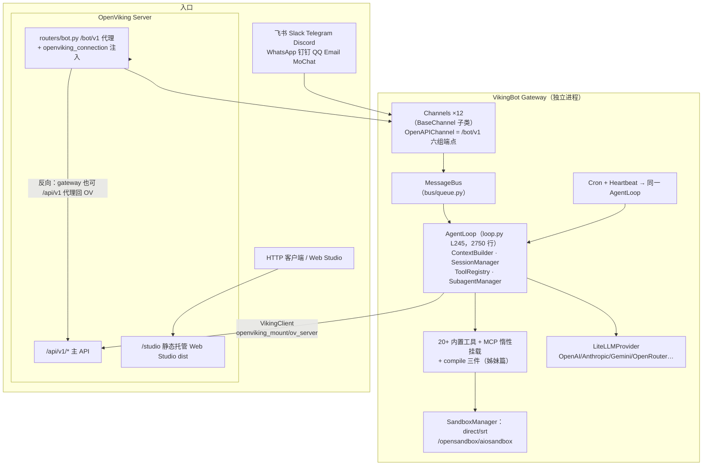

# 03 · VikingBot——bot/ 目录下的内置 Agent 框架（AgentLoop·工具面·Web Studio·bridge·deploy）

> **一句话总结**：VikingBot 是 OpenViking 仓库里自带的**应用层 Agent**——一个从 HKUDS/nanobot fork 而来、目标"OpenClaw-like bot integrated with OpenViking"（bot/package.json description 原话）的完整 Agent 框架：12 类 Channel 把 CLI/IM 平台/HTTP 统一成 InboundMessage，经 MessageBus 进**同一个 AgentLoop**（loop.py 2750 行），用 LiteLLM 接任意模型、ToolRegistry 跑 20+ 内置工具（文件/Shell/Web/图片/cron/spawn/8 件 openviking_*/MCP），本地 Workspace 装 SOUL.md 人格模板，OV Session 做长期记忆闭环。主服务以 `--with-bot` 拉起它为受管子进程并在同源暴露 `/bot/v1` 代理 + `/studio` Web Studio SPA，用户**不写一行代码**就能对话式管理上下文库。compile 四管线（bot/vikingbot/compile/ 4042 行）只是跑在这个框架上的一个特化任务，详见姊妹篇。

**基准**：HEAD=c66b9155（2026-08-24）；与 docs/zh/concepts/15-vikingbot.md（178 行，本地核实）、bot/README_CN.md（526 行）、bot/docs/zh/concepts/01~05（128/190/124/293 行）、docs/zh/api/24-vikingbot.md（325 行）、docs/zh/guides/17-vikingbot.md（261 行）交叉核对；行号均已在本地源码核实；DeepWiki 覆盖情况见 §8。

---

## 1. 定位与血统：nanobot fork，OpenClaw 形态

bot/package.json（13 行）自述：基于 HKUDS/nanobot 开发、目标是"providing an OpenClaw-like bot integrated with OpenViking"，license AGPL-3.0，唯一 npm 依赖 `@anthropic-ai/sandbox-runtime`（即 SRT 沙箱）。loop.py L361 注释"Ported from HKUDS/nanobot v0.1.5"（MCP 连接）是血统的直接化石。规模：`bot/vikingbot/` 115 个 py、约 39,421 行（不含 tests），其中 compile/ 占 4042 行——**框架本体远大于 compile**。目录骨架：`agent/`（loop/context/memory/skills/subagent + tools/）、`channels/`、`bus/`、`providers/`、`sandbox/`、`cron/`、`heartbeat/`、`hooks/`、`compile/`、`openviking_mount/`、`console/`、`observability/`、`integrations/langfuse`、`config/`、`cli/`，外加兄弟目录 bridge/demo/deploy/docs/license/scripts/workspace（SOUL.md 等 Agent 模板）。

三种入口（README_CN.md L46-51 表，与代码一致）：**A** `openviking-server --with-bot` 一体启动（主服务 bootstrap.py L282 `_start_vikingbot_gateway` 以子进程拉起 gateway，退出时回收）；**B** `vikingbot chat` 进程内直跑 AgentLoop（无 Gateway，standalone 时 OV 工具禁用）；**C** `vikingbot gateway` 长期服务（默认 127.0.0.1:18790，非 localhost 强制 Gateway Token，否则拒绝启动——cli/commands.py L473-481）。

## 2. 架构分层

所有入口殊途同归于一个 AgentLoop（concepts/15 L37："渠道差异被转换为统一消息"）；Gateway 反向又把 `/api/v1/*` 代理回 OpenViking（openapi.py L587 `@gateway_router.api_route("/api/v1/{path:path}")`），使 `ov chat` 与 `ov ls/find` 可共用一个 Gateway 地址。

## 3. AgentLoop：模型、prompt、记忆三件事

**主循环**：`run()`（loop.py L1040）以 1 秒超时轮询 `bus.consume_inbound()`（L1049）；核心在 `_run_agent_loop()`（L1260 签名，20+ 参数）——调 LLM → 有 tool_calls 则 ToolRegistry 校验执行 → 结果回填再调 LLM，直到纯文本回复。防御性设计密集：工具循环超预算时 `_compact_tool_loop()`（L1074）把旧轮次折叠成结构化摘要（默认 240,000 字符，L1089），摘要失败 best-effort 继续；OV 会话历史在服务端 Turn 感知裁剪之后还要过一道本地 `_trim_history_to_token_budget()`（L678，二分截断单条消息、保最新 User 锚点）。

**沙箱**：文件与 Shell 工具统一经 SandboxManager 执行，后端四选一——`direct`（默认，Bot 宿主权限，注释自认非隔离）/`srt`（@anthropic-ai/sandbox-runtime，网络与文件 allow/deny 策略）/`opensandbox`/`aiosandbox`（远端沙箱服务）；工作区三模式 shared（默认）/per-session/per-channel 决定活动 Workspace 路径（README_CN.md L354-360 表），compile 的 exec 注入与后端选择（姊妹篇 §3.1）用的正是这一层。

**模型接入**：providers/litellm_provider.py L33 `LiteLLMProvider`——全靠 LiteLLM 多 Provider（docstring L37 自列 OpenRouter/Anthropic/OpenAI/Gemini/MiniMax），`drop_params=True` 兼容挑剔模型（L75），thinking 参数按 Provider 白名单附加。模型配置**默认继承根级 `vlm`**（config/loader.py L71 `set_inherits_root_vlm(True)`，L114-140 合并逻辑），`bot.agents` 显式配 provider/model/api_key 才覆盖——用户配好 OpenViking 就白得一个 Agent。

**Prompt 组装**：agent/context.py `ContextBuilder.build_system_prompt()`（L101）拼接：身份段 → 沙箱环境段（L132-136）→ **bootstrap 四件**（L31 `BOOTSTRAP_FILES = ["AGENTS.md","SOUL.md","TOOLS.md","IDENTITY.md"]`，从 bot/workspace/ 模板首次物化）→ Skills 两级渐进加载（always 全文 + 其余摘要，L143-179；远程 OV Skill 用 `openviking_multi_read` 读，L172-178）→ 记忆/Profile 注入。**本地记忆是文件不是 OV**：agent/memory.py L48-49 `MemoryStore`："MEMORY.md (long-term facts) + HISTORY.md (grep-searchable log)"。OV 侧记忆靠 `_publish_auto_memory_context()`（loop.py L394-425）把每轮自动召回伪装成 `auto_memory_search` 工具事件，供 UI 观测。

**OV Session 闭环**（`session_context_enabled` 开启时）：取 `get_session_context(token_budget=12000)`（L849 默认值）+ 未同步本地尾巴；写前按 `commit_token_threshold=6000` 或消息数达 `memory_window` 自动 commit（L978-1013），commit 成功即清空本地会话、OV 侧归档提取记忆——**本地 Session 是缓存，OV Session 是真相**。子 Agent 走 SubagentManager（agent/subagent.py L25，`spawn()` L53）后台跑、结果回主 loop；cron（cron/service.py 366 行）与 heartbeat（周期读 `HEARTBEAT.md`，默认 600s）最终都调同一个 AgentLoop。

**观测闭环**：loop.py L32 导入 `evaluate_response_outcome`——每轮回复离线评估结果质量，配合 `/bot/v1/feedback` 显式反馈双轨沉淀（observability/feedback_stats.py 供 `vikingbot feedback-stats` 汇总）；生命周期事件走 hooks（hooks/manager.py，`message.compact` 等事件在 loop.py L936-946 触发，hooks/builtins/openviking_hooks.py 承接 OV 会话同步）；可选 Langfuse 全链路追踪（integrations/langfuse.py，deploy/docker/ 附一键 compose）。

## 4. 工具面全景（compile 之外列全）

注册集中在 tools/factory.py `register_default_tools()`（L31-132）：

| 类别 | 工具 | 实现 |
|---|---|---|
| 文件 | `read_file`/`write_file`/`edit_file`/`list_dir` | filesystem.py（L72-75） |
| Shell | `exec` | shell.py，经 SandboxManager |
| Web | `web_search`/`web_fetch` | web.py + websearch/ 四后端 brave/ddgs/exa/tavily（L84-93） |
| **OV 八件套** | `openviking_list`/`search`/`add_resource`/`grep`/`glob`/`memory_commit`/`multi_read`/`export` | ov_file.py（1215 行；类定义 L191/269/524/606/711/786/926/1060） |
| 交互 | `message`（跨轮主动发消息） | message.py |
| 生成 | `generate_image`（默认 doubao-seedream） | image.py |
| 自动化 | `cron` | cron.py |
| 并发 | `spawn` | spawn.py |
| 外接 | `mcp_<server>_<tool>` | mcp.py；stdio/sse/streamableHttp，**惰性连接**（loop.py L358，失败不阻断、下条消息重试） |
| compile | `CompileScopedTool` 装饰 + `SubmitTargetCheckoutTool`/`SubmitWikiBundleTool` | tools/compile.py L81/183/304 → **见下节及姊妹篇 §3.1-3.2，不重复** |

### 4.1 compile 工具去哪了：引用姊妹篇

compile 的三件工具（scope 装饰器 + 两种提交协议）不属于常规工具面——它们只在 compile 任务私有的 AgentLoop 里按物化状态动态注入，且伴随工具收窄（删 `openviking_export` 逼模型用本地 exec）。四条管线（wiki/KG/日报/蒸馏）、`service.py` L2016 物化上限、L2317 工具集、CompileLimits 全表，**全部钉版在姊妹篇 `02-vikingfs-layers/03-context-compilation.md`**，本篇不重复。本文视角只需记一件事：compile 是 VikingBot AgentLoop 的一个"无历史、无记忆召回、无其他 Skill"的特化调用（`run_structured_task()` 复用 `_run_agent_loop()`），框架能力（Provider/沙箱/预算提醒）与 compile 共享一套底座。

工具可见性四重裁剪：`bot.mode=readonly` 不注册 `openviking_add_resource`（factory.py L104-105）；渠道 `ov_tools_enable=false` 整组隐藏且不注入记忆；请求级 `disabled_tools`；子 Agent 用 `register_subagent_tools()`（L135-154）只给文件/Shell/Web 基础件。另一个易漏的细节：loop.py L51-55 `_is_tool_result_success` 用"结果非空且不以 `Error:` 开头"判定工具成败，喂给 outcome 评估——朴素但够用。

## 5. Gateway 与渠道：OpenAPIChannel 是第六个"渠道"

channels/ 共 **12 类**：9 个 IM 平台（feishu L77/slack/telegram/discord/dingtalk L84/email/qq L47/whatsapp/mochat L232）+ `chat`（CLI）+ `single_turn`（无状态 HTTP 单轮）+ **`OpenAPIChannel`（openapi.py L158，1812 行——Gateway 的 HTTP 面本身就是一个 Channel）**。会话隔离键 = `type + channel_id + chat_id`。`/bot/v1` 端点全表（openapi.py `_create_router` L359-566）：`GET /health`（L371）、`POST /chat`（L383）、`POST /chat/stream` SSE（L393）、compile 三条**条件注册**（L405-413，仅 compile_service 存在时）、`POST /feedback`（L415）、sessions CRUD（L441-528，按 principal_scope 隔离）、`/chat/channel(/stream)` 路由到特定 bot 渠道（L532-564）。安全是**双边界**：`X-Gateway-Token` 护 Gateway 入口，OV API Key 表调用者身份，二者不可互替；请求体里的 `openviking_connection`（request-scoped 身份）**只接受可信 Server 代理注入**（L422-427 显式 403）。

Bot↔OV 连接三态（README_CN.md L147-151 表）：**Explicit**（配 `bot.ov_server.server_url`，不可达即启动失败）/ **Inherited**（从同份 ov.conf 的 `server` 推导，不可达降级 standalone）/ **Standalone**（Chat 可用、OV 工具禁用、`/api/v1/*` 返回 503）——降级路径单向且显式，启动日志会打出 `openviking_explicit`/`openviking_inherited`/`standalone_local`。

## 6. Web Studio：SPA 不在 bot/ 里，在仓库根 web-studio/

**物理位置与栈**：`web-studio/`（仓库根），Vite + React + TanStack Router/Query/Form/Table + CodeMirror 全家 + Tailwind v4 + vitest；`vite build --base=/studio/` 产物塞进 wheel 的 `openviking/web_studio/dist/`（构建链见 00-overview/03-build-system.md）。主服务 app.py L749-788 静态托管：`/` 302 跳 `/studio/`（L769-773），SPA fallback 交 TanStack Router 深链（L779-782），源码外开发用 `OPENVIKING_WEB_STUDIO_DIR` 指向本地 dist（L755）。

**通信与身份链**：同源调 `/api/v1/*`（资源/检索/监控，生成客户端 `src/gen/ov-client/sdk.gen.ts`）+ `/bot/v1/health|chat|chat/stream|feedback`（`src/lib/sessions/api.ts` L398/428，SSE 走 fetch 流）。核心页面 **Playground**（`src/routes/playground/`）= `agent-panel`（对话，useChat）+ `context-explorer`（看 Agent 实际吃到哪些上下文）+ `terminal-panel`——这正是"对话式管理上下文库"的落点。身份链：浏览器持 User/Admin Key → 主 server 鉴权 → routers/bot.py `_attach_openviking_connection()`（L98，docstring 明说"Bot tools must keep using that same identity"）把认证身份塞进转发体 → Bot 工具以**该请求身份**而非 Bot 静态配置访问 OV——多用户共享一个 Bot 而记忆各自隔离的关键。路由挂载：app.py L631 `include_router(bot_router, prefix="/bot/v1")`，L599-606 仅 `--with-bot` 时 `set_bot_api_url/set_bot_api_key`。另有 12 个路由域（resources/skills/sessions/watches/users/oauth…）。注意 **bot/vikingbot/console/web_console.py（571 行）是 Gradio 旧控制台**（L520-551 mount_gradio_app）——Web Studio 的前身，仍残留在包里。官方还提供端到端验证文档 docs/zh/guides/12-vikingbot-metrics-validation.md（1228 行）：用真实问答走 `用户提问 → /bot/v1/chat → 会话持久化 → /bot/v1/feedback → /metrics → Prometheus → Grafana` 全链路，确认反馈指标真的在动。

## 7. bridge/ 与 deploy/：Node 侧与容器化

**bridge/**（TypeScript）：Node WebSocket server + `@whiskeysockets/baileys` 跑 WhatsApp Web 协议（server.ts；**只绑 127.0.0.1**，L29，可选 BRIDGE_TOKEN 握手）。Python 侧 channels/whatsapp.py（L1 docstring"using Node.js bridge"，L43 `websockets.connect(bridge_url)`）作为 WS 客户端收发。为什么跨语言：WhatsApp 协议生态在 Node，Python 没有可用实现——bridge 是务实补丁而非架构偏好。

**deploy/**：`docker/`（python:3.13-slim 镜像，COPY vikingbot+bridge，entrypoint 为 docker-entrypoint.sh，`CMD ["gateway"]`，EXPOSE 18791——deploy.sh 把 `bot.gateway.port` 写成容器 18791，与源码默认 18790 错一位；entrypoint 运行时把 /opt/vikingbot-bridge 物化到数据卷；另有 langfuse compose 一键观测栈）；`vke/` 火山引擎 K8s（deployment + NAS/TOS PVC）；`ecs/`。**demo/werewolf/**：多 Agent 狼人杀演示——god/player 两个 SOUL 模板 + 对局服务器 + Web UI（1995 端口），展示"多 Agent + OV 记忆"玩法的官方样例，tests/ 里还有它的安全测试。

## 8. DeepWiki 差异：本体不缺失，但落后一个月的新能力

与姊妹篇 compile"整块缺失"不同，**DeepWiki（基线 f316d6ad=2026-07-25）对 VikingBot 本体覆盖良好**：7/7.1/7.2（VikingBot 框架/架构/渠道与 Provider）+ 8/8.1/8.2（Web Studio 总览/功能/API 客户端与鉴权）共 6 页 1036 行，MessageBus/AgentLoop/ContextBuilder/ToolRegistry/VikingClient 的描述与当前代码一致。过时点（f316d6ad..HEAD 触及 bot/ 的 23 个 commit）：① **compile 全套缺失**（c91b0d36 07-28，姊妹篇已详）；② **OpenViking remote skills**（#4095，`agent/remote_skills.py` 现 1418 行）；③ Chat API 图片输入（#3619）；④ OpenAI 凭证流式/故障转移（#3696、#3503）；⑤ `viking://~` 别名迁移（#4196，README L16 专门警告旧 `viking://user/memories` 写法会被新版 Server 拒绝）；⑥ add-resource 精确目标（#4015）、cron 单次时间规范化（#4064）、Windows 会话路径（#4162）。用 DeepWiki 读 VikingBot 架构可靠，读新能力清单不可靠。

## 9. VikingBot vs agent-plugins：两条 MCP 路线的定位差

| | agent-plugins/（MCP servers） | VikingBot |
|---|---|---|
| 方向 | OV **作为工具**被外部 Agent（Claude Code/Codex/Cursor，经 stdio→HTTP 代理或原生 /mcp）调用 | OV **自带 Agent**，用户零代码获得助手 |
| 用户 | 已有 coding agent 的开发者 | 要"开箱即用上下文库管家"的任何人 |
| 记忆写入 | 外部 Agent 显式调 remember/write | 自动：session 同步/commit/经验提取全在 loop 内 |
| 形态 | 无头工具集 | 带渠道/沙箱/cron/Web Studio 的完整应用 |

docs/design/openclaw-agent-experience-memory-design.md L378-389 把界线说透：VikingBot 的经验注入是"agent loop 的直接拼接逻辑，不是跨插件公共 envelope"；OV 面向所有 Agent 插件的统一上下文外壳应叫 `<openviking-context>`，不绑定 OpenClaw/VikingBot 任一消费方——**VikingBot 是 OV 的首席消费者，不是 OV 的形状本身**。

## 10. 批判性收尾：耦合、成本与 fork 债

**耦合度是"进程松、协议紧"**：Bot 与主服务只靠 HTTP 通信、可 standalone 生存，看似解耦漂亮；但真正的接口面是 `openviking_connection` 注入协议 + 共享 `~/.openviking/ov.conf` + `--with-bot` 子进程管理 + `viking://~` 语义联动——每项都在双边快速演进（#4196 这类 breaking change 需要 README 专门警告），代理链（浏览器→server→gateway→AgentLoop→OV API）任何一环模式变化都 fail closed。**Web Studio 维护成本不低**：独立 npm 栈（React/TanStack 全家/CodeMirror/vitest/i18n/生成客户端），27 个路由域对 25+ 个 server router 的追随成本，且 Gradio 旧控制台（console/ 571 行）未清理——双前端并存是过渡期负债。**nanobot fork 债**：loop.py 已深度改造（OV session/compaction/compile 集成/subagent），与上游 v0.1.5 的可同步性基本归零，AGPL-3.0 许可也限制了商业嵌入姿势。但公允地说：正是这套"fork 一个成熟 bot 骨架 + OV 记忆内脏"的取舍，让 OpenViking 在数据库之外一次性获得了渠道/沙箱/定时/观测/前端全家桶——自研这些至少多一年。对 agent 记忆研究者的价值：**VikingBot 是"记忆系统如何改造一个真实 Agent loop"的最完整标本**——每轮召回注入、token 预算双重裁剪、commit-清空-归档的生命周期，都比论文里的抽象架构多一层工程约束。

## 📌 下一步阅读

1. `bot/vikingbot/agent/memory.py`（1358 行）——MemoryStore 的 MEMORY/HISTORY 双文件设计与 OV 记忆的分工；
2. `bot/docs/zh/concepts/04-openviking-integration.md`（293 行）——召回/提交的官方调用链全图；
3. `web-studio/src/routes/playground/-components/context-explorer.tsx`——"Agent 看见了什么上下文"如何被可视化，记忆系统的可观察性出口；
4. `bot/docs/zh/concepts/03-channels-and-gateway.md`（124 行）——渠道生命周期与 Gateway 运维的官方口径，与本篇 §5 对照读。
