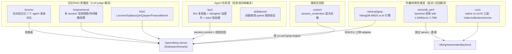

# 01 · 基准测试体系——9 个套件、四层被测对象：从 LLM judge 记忆评测到 GPU 向量索引

> **一句话总结**：OpenViking 的 `benchmark/` 按**被测层**切分成 9 个套件——locomo/longmemeval 用 LLM judge 测长对话记忆质量，tau2/skillsbench 测记忆对 agent 任务成功率的端到端贡献，RAG/retrieval 测检索质量，vectordb_perf/cuvs/custom 测向量库与服务性能；质量类评测全是"自报口径"（自家 judge 模型 + 自家采样，无第三方复现），而性能类的 cuVS 基准反而是全仓库方法论最严谨的部分（独立进程 ×5 取中位数 ±MAD、index/collection/service 三层分离、诚实的 caveat 文化）。

**基准**：HEAD=`c66b9155`（2026-08-24）；与 `docs/design/openviking-cuvs-benchmark-plan.md`（243 行）、`benchmark/cuvs/PRELIMINARY_RESULTS.md`（497 行）、各子目录 README（行号均本地核实）交叉核对；DeepWiki 基线 `f316d6ad` 过时点见 §9。`git log f316d6ad..HEAD -- benchmark/` 仅 3 个 commit（9eac8a6d/a83b8171/7abd6ab2，均非评测本体改动），评测代码基线与 DeepWiki 时代基本一致。

---

## 1. 评测矩阵总览：9 套件 × 四层被测对象

| 套件 | 被测对象 | 裁决方式 | 公开数字 |
|---|---|---|---|
| locomo | 长对话记忆（7 变体：vikingbot/openclaw/mem0/supermemory/claudecode/hermes） | LLM judge 二值 CORRECT/WRONG | README_CN L104：80.08–82.86% |
| longmemeval | 记忆检索+回答（haystack sessions） | LLM judge，lenient/strict 双 prompt | 仓内未公开 |
| tau2 | 经验记忆对任务成功率的贡献 | 外部 tau2-bench 官方计分 | README_CN L105：+6.87/+11.87pp |
| skillsbench | OpenClaw 技能使用 | pytest 规则（非 LLM） | 仓内未公开 |
| RAG | 端到端检索问答 | LLM judge 0-4 + Recall/F1 | README L470-475 小样本参考表 |
| retrieval | grep 引擎质量与规模延迟 | fs 引擎结果作 ground truth | 仓内未公开 |
| vectordb_perf | 向量 backend 验收 | gt_recall@K + QPS/延迟 | 仓内未公开 |
| cuvs | native vs cuVS（GPU） | Recall@K + p50/p95/p99/QPS | PRELIMINARY_RESULTS.md 全公开 |
| custom | Server 混合负载退化 | 吞吐/失败率/积压 | 仓内未公开 |

## 2. locomo：长对话记忆主战场

目录含 7 个变体（README L8-29）：`vikingbot/`（官方 agent）、`openclaw/`、`mem0/`、`supermemory/`、`claudecode/`、`hermes/`（对比基线）+ `locomo_bad_case_questions.csv`。数据 `locomo10.json`（10 段超长对话）或 1528 题 QA CSV。四步流水（README L92-178）：

1. **import_to_ov.py**：按 sample 逐 session `commit`，`user_id=sample_id`（如 conv-26）；**必须开多租户**（README L37：server 配 `root_api_key`）；
2. **run_eval.py**：并发 QA（默认 5 线程，可 20）；
3. **judge.py**：LLM 裁判，默认模型 `doubao-seed-2-0-pro-260215`（L155），ARK endpoint；输出二值 CORRECT/WRONG + reasoning；
4. **stat_judge_result.py**：准确率、平均耗时、迭代数、token（QA 侧 input/output/cacheRead + Import 侧 embedding/vlm tokens 分开统计）。

**断点续传是默认行为**（README L424-425：重跑同命令自动跳过已处理项），`--force-ingest` 强制重导；judge 支持并行（默认 5，openclaw 侧 40）。

**公开对比数字**（README_CN.md L101/L104，0.3.22 版，judge 同 Doubao）：OpenClaw 24.20%→**82.08%**、Hermes 33.38%→**82.86%**、Claude Code 57.21%→**80.32%**；输入 token 降 34.3–91.0%，查询时延降 58.45–66.10%。mem0/supermemory 只有 ingest/eval 脚本（mem0 README L3：借 OpenClaw 做 agent、`user_id=sample_id` 存 mem0），对比数字不落仓，只在博客报告。**官方自曝标注噪声**：bad case CSV 首行 sample_0/Q139——gold 说 Caroline 分享画作，证据 D17:14 实为 Melanie；第二例 gold 把 Caroline 的碗记成 Melanie 的——judge 给 WRONG 但 reasoning 列承认"记忆正确，gold 错了"。

## 3. longmemeval：更严格的长记忆评测

流程 5 步（README L3-9）：import haystack sessions → 每题一次检索 → 可选 rerank → 带记忆上下文作答 → judge+统计。用户空间 `lm_user_<id>`（L23-25）。核心检索三参数（L66-74）：`--single-search-context-limit 50`（取 50 条）、`--single-search-rerank-limit 10`（rerank 后留 10）、`--single-search-max-context-chars 30000`（token 预算）。judge 有**两套 prompt**：默认 lenient、`--strict-prompt` 切官方严格版（L92-93；`longmemeval_prompts.py` 385 行，L219 明言"Judge against the gold answer, not what might be plausible"）。统计按 LongMemEval 题型分组报准确率 + 平均记忆 token。与 locomo 的差异：这里**检索调用是显式参数化的一跳**（可关 rerank、可 debug 打印完整 model input），更适合做消融。调试姿势（L46-58）：先 `--count 1 --threads 1 --debug-print-model-input` 跑单题 smoke，CSV 会带完整作答 prompt 与检索轨迹，查 `retrieved_uris_by_iteration` 确认 rerank 生效、`context_uris` 确认记忆条数，再放开全量。

## 4. tau2：经验记忆让 agent 自提升

三条互补路径：

- **`llm/`（窄复现面）**：只保留两个策略（README L6-8）——`no_memory` 同种子基线 vs `template_indexed_trajectory_top4_prewrite_top2`（轨迹模板索引 `{{ trajectory_name }}\n\n{{ retrieval_anchor }}`，首 user 轮注入 top4、写型工具调用前再注入 top2）。协议 `fixed_first_user_full8`（baseline.yaml L30）：retail+airline、8 次重复、固定首 user 轮 fixture、confirmation_aware 用户模拟器（baseline.yaml L35，对齐上游 tau2-bench#297）。**计分委托外部 tau2-bench 官方 CLI**，产物 `scoreboard.json`。证据边界写得很硬（README L290-292）：只有同配置同种子完整跑才算证据。
- **`vikingbot/`（完整自提升 agent）**：跑完整 VikingBot AgentLoop。**记忆只从 train split 提取，test split held out**（README L8-11，防泄漏）。epoch 0 冷启动（注销记忆工具、不注入经验）→ epoch>0 记忆增强（README L203-206）；test 每 epoch 并行跑 8 次取平均（L131-134）；epoch 间显式 `commit_trajectory_to_memory.py`（可选 `--only-wrong` 只学失败）。
- **`train/`（批处理管线）**：`restart_vikingbot_train_eval.sh` 一键重启服务→健康检查→batch runner；slot 隔离（slot N 用端口 1933+N、`~/.openviking_N`、独立 result 目录，README L129-133）；每个 rollout 落 `memory_context.md`/`messages.json`/`tool_calls.json`/`evaluation.json`。架构图在 `docs/design/assets/tau2-train-eval-architecture.svg`。

公开数字（README_CN L105）：经验记忆使任务成功率 Retail +6.87pp、Airline +11.87pp（vs 同 LLM 无记忆）。

## 5. RAG：四数据集端到端检索问答

独立评测框架（README L7），adapter 模式接 4 数据集（L222-225）：Locomo（10 文档/1540 QA）、SyllabusQA（39/5078）、Qasper（1585/5049）、FinanceBench（84/150）。5 阶段管线（L290-307）：数据准备→ingest→作答→评测→**删除**（清场）。指标（L309-315）：Recall（检索召回）、F1（答案词重叠）、Accuracy（LLM judge 0-4 分制，归一化 `/4`）、Latency、Token。检索可注入 `retrieval_instruction`（推荐格式 `Target_modality: xxx.\nInstruction:xxx.\nQuery:`，L538-546），为空则用原始问题检索——这是调分的一个隐藏旋钮。注意此处的 locomo 口径与 §2 不同——**把对话当文档 ingest 成资源**，不是 session 记忆。自报参考表（L470-475，top-5 检索、seed=42 小样本）：F1 0.224–0.344、Recall 0.592–0.694、归一化 Accuracy 0.529–0.636——数字并不亮眼，官方定位是"reference"而非营销素材。

## 6. 向量层三套件：性能评测的金标准区

- **vectordb_perf**：新向量 backend 验收。走 `VikingVectorIndexBackend`（建表 `context_collection` schema、`upsert_many`、`search_in_tenant`），**绕过 server/AGFS/embedding/rerank**（README L3-12）。双 workload：synthetic（128/1 万/10 万行三档 profile）或真实 dir-vector-dataset（wiki 1,941,679 条 / arxiv 2,763,543 条，均 1024 维，L257-262）。报告含 gt_recall@K、QPS、P95；Wiki 目录过滤查询无官方 constraint，提供诊断口径 `derived_gt_lca_v1` 并**明确声明不能当作官方 Directory recall**（L357-360）——诚实边界意识。
- **cuvs**：native C++ flat vs cuVS brute-force/CAGRA，三层分离（README + plan L99-127）：L1 index 层（纯 kernel）、L2 collection 层（走 `CollectionAdapter`，含过滤/回表/懒重建）、L3 service 层（走 `asyncio.to_thread` 调度边界，含租户过滤）。L2 的过滤矩阵覆盖 10%/1%/0.1% 三档选择性 × uniform/clustered 分布 + 层级 URI 前缀，`--filter-cache-size`（默认 16）控制已编译 GPU bitset 的 LRU（README L230-239）。关键数字（PRELIMINARY_RESULTS，H20 GPU、ann-benchmarks GloVe、5 独立进程取中位±MAD）：batch=1 时 cuVS 精确检索 p50 0.796ms vs native 40.209ms = **50.5×**（L88-96）；warm 交叉点 768D 在 2K–5K 向量之间（L150-153）；native int8 量化 vs cuVS fp32 **不是等精度比较**（L46，native Recall 仅 0.982）；任何 mutation 后下一次查询同步重建 GPU 索引 ~1.4–1.7s（L485）；并发下 cuVS 锁把吞吐钉在 600–680 QPS（L492）。文件开头有整段"历史口径"免责声明（L9-15：pre-microbatch 数字不得推断当前吞吐）。缺 recall 显示 N/A、绝不当作满分（README L87-89）。
- **retrieval/grep**：VikingDB BM25 grep 引擎。effectiveness 用 **fs 引擎结果作 ground truth**（缓存后其他引擎对比，README L42-51）；performance 用 20 万合成文件 + 15 个目标词 5 个概率档（1%→0.01%，期望命中 2000→20，L73-79）测延迟与返回条数。换引擎靠改 `ov.conf` 的 `grep.engine` + 重启。

## 7. skillsbench 与 custom

- **skillsbench**：克隆 `benchflow-ai/skillsbench`（skill_bench_eval.py L33），排除 10 个任务（L35-46），OpenClaw 执行，三个子命令 `prepare/list/run`（L6-17）。**裁决是规则不是 LLM**：跑任务目录 `tests/` 下的 pytest/test.sh，score=passed/total（L412-413）——全仓库唯一非 LLM judge 的质量评测。
- **custom**：`session_contention_benchmark.py` 压已启动的 Server。三种 adapter（L71-75）：sdk（AsyncHTTPClient）/cli-http（共用 HTTP client 层）/cli-subprocess（真实 `ov` 子进程，量端到端 CLI 成本）；六阶段（L89-97）：warmup→add_resources→session_messages→retrieval→session_commit→mixed。重点观察混合负载下检索延迟退化与后台任务积压。

## 8. 指标体系设计与工程要求

**一个澄清**：`docs/design/metric-design.md`（827 行）不是 benchmark 指标设计，而是**运行时可观测性**方案（MetricDataSource→Collector→Registry→Exporter 四角色，L131-152，Prometheus 导出、标签基数治理）——评测与监控是两套体系。真正的评测指标分层在 `openviking-cuvs-benchmark-plan.md` L54-98：三张互相独立的 scoreboard——**Vector index performance**（L1/L2：延迟/QPS/recall/build/内存）、**Memory quality**（LongMemEval 为主 LoCoMo 为辅，固定 embedder/reader/judge/top-k 只换 backend）、**Agent task utility**（TAU-2 任务成功率+总成本）；并直言 LoCoMo/LongMemEval-S 规模太小（500 题、单 user 向量不足以体现 GPU）——质量基准只能当 guardrail 不能证明吞吐。

**跑通一套质量基准的清单**：① OpenViking server 已起（locomo 需 `root_api_key` 多租户）；② judge 走 ARK（`ARK_API_KEY`，doubao 系裁判）；③ **account/user 三处对齐**——`ovcli.conf.account`、`ov.conf` 的 `bot.ov_server.account_id`、评测脚本的 user（locomo README L433-434 专门写了排查节，错位症状是"导入成功但查不到上下文"）；④ tau2 另需 Python 3.12/3.13 + 外部 tau2-bench checkout + 固定首 user fixtures；⑤ RAG 需 `uv pip install -e ".[benchmark]"` + 手动下载数据集。输出统一是 CSV（逐题）+ JSON（汇总）+ summary 报告，全部支持断点续传。

**输出格式速查**：质量类逐题 CSV（question/response/result= CORRECT|WRONG/reasoning/token 列）+ summary；tau2/train 每 rollout 一个目录（`memory_context.md`/`messages.json`/`tool_calls.json`/`evaluation.json`，README L263-269）+ `scoreboard.json`；cuvs/vectordb_perf/custom 统一为 JSON 报告 + `summary_zh.md` + `events.jsonl` 明细。

## 9. DeepWiki 差异（基线 f316d6ad，2026-07-26）

1. **客户端类名已失效**：11 页组件图写 `AsyncOpenViking / SyncOpenViking`、11.1 页 L105 引 `OV_SDK["openviking.AsyncOpenViking"]`——embedded mode 已被 `7abd6ab2` 删除，现全部走 HTTP SDK（`AsyncHTTPClient`）；
2. **覆盖面缺失**：11/11.2 只讲 locomo+skillsbench+cuVS+tau2/llm 一条路径；`tau2/train/` 批处理 slot 体系、longmemeval 独立套件、retrieval、vectordb_perf、custom 五块完全没写；
3. **tau2 双路径描述混乱**：11.2 L91 把 "LLM-Harness" 的引用指到 vikingbot/README L16-17（实际那是 vikingbot 路径的描述），两条路径的分工（native ReAct vs 完整 AgentLoop）本地 README L14-20 更准确；
4. **cuVS 历史口径未强调**：DeepWiki 引 PRELIMINARY_RESULTS 但未提示文件自带的 pre-microbatch 历史 scope 声明（L9-15），直接引用数字会高估当前并发吞吐。

## 10. 批判性收尾：自报基准的可信度

1. **judge 即家族**：LoCoMo 82% 的裁判是 `doubao-seed-2-0-pro`——与被测系统的 VLM 同厂同族；lenient prompt 是默认，strict 只是开关。跨厂 judge 复核、多 judge 一致性（kappa）、judge 置信度均未做。longmemeval 的 lenient/strict 双口径是好设计，但仓内未公开任何数字。
2. **标注噪声有实锤**：官方 bad case CSV 前两行都是 gold 错、系统对——LoCoMo 标注质量问题会系统性压低所有系统的表观准确率，也意味着 82% vs 24% 的差距中有一部分是"谁更能猜对有缺陷的 gold"。
3. **小样本**：RAG 参考表 12–90 queries（FinanceBench 仅 12），无置信区间；LoCoMo 10 段对话。cuVS 侧反而做了 5 独立进程 + MAD，质量侧没做重复实验的方差报告。
4. **基线由官方代跑**：mem0/supermemory/hermes 的"原生记忆"数字出自自家脚本与博客，配置细节（agent、top-k、prompt）不在仓内可审计范围。
5. **无第三方复现、无 CI、无 leaderboard**：全部结果都是自报一次性实验；`benchmark/.gitignore` 排除 results/，没有持续回归。
6. **值得表扬的部分**：cuvs 的方法论（分层、独立进程、N/A≠满分、明确非等精度比较、历史口径免责）和 tau2/llm 的证据边界（同配置同种子才算证据、fixture 固定首 user 轮）是工业级水准——建议把这套严谨性反哺到质量评测侧。

## 📌 下一步阅读

1. `benchmark/locomo/vikingbot/judge.py` + `longmemeval_prompts.py`——两套 judge prompt 的具体措辞差异（lenient vs strict）；
2. `docs/design/openviking-cuvs-benchmark-plan.md` L54-98——三 scoreboard 设计与"质量基准规模不足以体现 GPU"的论证；
3. `../07-agent-memory/`（如有）——tau2 的轨迹→经验两级提取（trajectories/experiences schema）如何被本篇评测消费。
