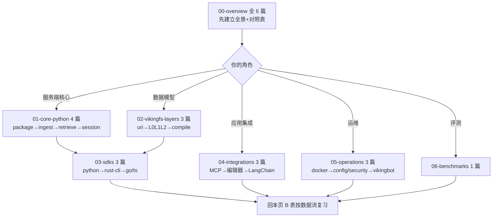

# 附录 — 术语表 + 数据流汇总 + 阅读顺序

> 全笔记系列的索引。读完任一篇后回来这里找下一个去哪。

---

## A. 术语表（Glossary）

### 核心概念

| 术语 | 含义 | 详见 |
|------|------|------|
| **viking://** | 一切内容的统一寻址层：scheme + scope + path 虚拟文件树 | [01-viking-uri](../02-vikingfs-layers/01-viking-uri.md) |
| **`viking://~`** | home 别名，请求边界展开为当前用户根（#4167 增/#4196 转正唯一短写，旧 uid-less 写法被 Server 拒绝） | 同上 §6 |
| **VikingFS** | `viking://` 虚拟文件系统抽象（8 个 mixin 组合的 Python 类） | [02-architecture](../00-overview/02-architecture.md) §4 |
| **AGFS / RAGFS** | 内容存储层；AGFS 的 Go 实现已重写为 Rust RAGFS（进程内 .so） | 同上 §5 |
| **L0/L1/L2** | 目录级三层信息模型：`.abstract.md`（≤256 字符，向量召回）/ `.overview.md`（≤4000 字符，rerank 导航）/ 原始文件 | [02-l0l1l2-model](../02-vikingfs-layers/02-l0l1l2-model.md) |
| **sidecar** | 挂在目录边的语义伴生文件（L0/L1），SemanticProcessor 异步自底向上生成 | 同上 |
| **OKF** | sidecar 的 frontmatter 格式（open knowledge format），含 freshness 元数据 | [01-package-map](../01-core-python/01-package-map.md) |
| **freshness-aware** | #4180：宽目录的父级摘要延迟到变更比例阈值触发，改变语义 DAG 调度经济学 | [02-ingest-pipeline](../01-core-python/02-ingest-pipeline.md) |
| **hotness** | 检索热度混合分数（hotness_alpha 加权） | [03-retrieve-pipeline](../01-core-python/03-retrieve-pipeline.md) |

### 上下文类型与记忆

| 术语 | 含义 | 详见 |
|------|------|------|
| **Resource** | 用户添加的静态知识（viking://resources/） | [02-architecture](../00-overview/02-architecture.md) §4 |
| **Memory** | Agent 主动提取的动态认知，9 类内置（profile/preferences/entities/events/identity/soul/cases/trajectories/experiences） | [04-session-memory](../01-core-python/04-session-memory.md) |
| **Skill** | AgentDefinedContextType：`SKILL.md` + scripts | 同上 |
| **SessionCompressorV3** | 当前唯一会话压缩/记忆提取器（v2 已删除）；入口 `extract_long_term_memories` | 同上 §2 |
| **ExtractLoop** | 记忆提取循环（max_iterations=3） | 同上 |
| **AgentEvolutionService** | 子服务之一：agent 自我进化（traj→exp 经验学习） | 同上 §4 |
| **ResourceMemoryLinkService** | 子服务之一：资源与记忆的关联 | 同上 |
| **commit（会话语义）** | 会话内容固化为长期记忆的动作；policy: never/always/pending_tokens | [03-langchain](../04-integrations/03-langchain.md) |

### 检索

| 术语 | 含义 | 详见 |
|------|------|------|
| **find** | 确定性导航（ls/tree/find/grep/glob，无 LLM） | [03-retrieve-pipeline](../01-core-python/03-retrieve-pipeline.md) §2 |
| **search** | 语义检索（L0 召回 → L1 rerank → 递归下钻） | 同上 |
| **recall** | **已 deprecated**：#4075 收编进 context search（SDK 侧是 `search_context`） | 同上 §9 |
| **IntentAnalyzer** | 意图分析器（SFT 模型 prompt 映射，L38） | 同上 |
| **HierarchicalRetriever** | 层级检索器：全局搜 level=[0,1] → 递归 → 分数传播 → hotness 混合 | 同上 §3 |
| **ledger** | 检索可观察轨迹（`.recall_log.json`） | 同上 §4 |

### 子系统与工程

| 术语 | 含义 | 详见 |
|------|------|------|
| **ov compile** | 上下文编译：llm-wiki/知识图谱/日报/知识蒸馏四管线（bot/vikingbot/compile/） | [03-context-compilation](../02-vikingfs-layers/03-context-compilation.md) |
| **VikingBot** | 内置 Agent 框架：AgentLoop + 工具面 + Web Studio + 渠道 | [03-vikingbot](../05-operations/03-vikingbot.md) |
| **Web Studio** | 独立 SPA（web-studio/，268 ts/tsx，vite 构建） | 同上 |
| **AgentLoop** | bot 执行循环（loop.py L245；compaction 阈值 240k） | 同上 §2 |
| **Agent Plugins 1.0** | agent-plugins.org 规范的可移植插件包（plugin.json + skills + mcp.json；规范有意排除 hooks） | [01-agent-plugins-mcp](../04-integrations/01-agent-plugins-mcp.md) |
| **langchain-openviking** | 独立 PyPI 包（6147 行，#3685 从主包抽出；langgraph 为 extra） | [03-langchain](../04-integrations/03-langchain.md) |
| **ovpack** | 数据导入导出/备份恢复格式（PackService） | [02-architecture](../00-overview/02-architecture.md) §3 |
| **ov / ov_cli** | Rust CLI（crates/ov_cli，clap）；Python 经 openviking_cli 桥接 | [02-rust-cli](../03-sdks/02-rust-cli.md) |
| **ov.conf / ovcli.conf** | 服务端配置（~/.openviking/ov.conf）/ 客户端 JSON 配置（SDK 与 CLI 共享） | [02-config-security](../05-operations/02-config-security.md) |
| **root_api_key** | 管理面根密钥（数据面封禁 ROOT；恒时比较） | 同上 §3 |
| **六认证模式** | api_key/root/oauth2/oidc/ldap/jwt（#3708 加后两个） | 同上 |
| **`.openviking.pid`** | 单机数据目录锁（多进程首跑串行化；workers>1 会撞锁） | [04-two-modes](../00-overview/04-two-modes.md) §5 |

---

## B. 数据流图汇总（各篇 mermaid 索引）

| 数据流 | 图在哪 |
|---|---|
| 四层栈总架构 | [02-architecture](../00-overview/02-architecture.md) §1 |
| 启动链路（CLI→uvicorn） | [04-two-modes](../00-overview/04-two-modes.md) §2 |
| 写入：摄取解析管线 | [02-ingest-pipeline](../01-core-python/02-ingest-pipeline.md) |
| 查询：意图→递归→rerank 全链路 | [03-retrieve-pipeline](../01-core-python/03-retrieve-pipeline.md) |
| 会话生命周期状态机 | [04-session-memory](../01-core-python/04-session-memory.md) §1 |
| 记忆提取（Phase 2） | 同上 §3 |
| 上下文编译四管线 | [03-context-compilation](../02-vikingfs-layers/03-context-compilation.md) §1 |
| LangChain 调用链 + middleware 时序 | [03-langchain](../04-integrations/03-langchain.md) §2 |
| Python SDK 上传链路 | [01-python-sdk](../03-sdks/01-python-sdk.md) §1 |
| CLI→HTTP→server 生命周期 | [02-rust-cli](../03-sdks/02-rust-cli.md) §3 |
| compose 服务拓扑 / Dockerfile 三阶段 | [01-deploy-docker](../05-operations/01-deploy-docker.md) §1-2 |
| 认证分层鉴权流 | [02-config-security](../05-operations/02-config-security.md) §2 |
| VikingBot 架构分层 | [03-vikingbot](../05-operations/03-vikingbot.md) §2 |
| 评测矩阵四层 | [01-benchmarks](../06-benchmarks/01-benchmarks.md) §1 |
| CI 触发关系 | [05-cicd](../00-overview/05-cicd.md) §2 |
| DeepWiki 安全阅读决策 | [06-deepwiki-cross-reference](../00-overview/06-deepwiki-cross-reference.md) §4 |

---

## C. 阅读顺序建议

- **最短速通（2-3 小时）**：`02-architecture → 02-l0l1l2-model → 03-retrieve-pipeline → 06-deepwiki-cross-reference`
- **要二次开发**：速通 + `01-package-map + 02-ingest-pipeline + 04-session-memory + 02-config-security`
- **要写客户端**：速通 + `03-sdks 全部 + 01-agent-plugins-mcp`
- **完整精读（建议 3-5 天）**：00→01→02→03→04→05→06→本页

## D. 行号与时效约定

- 本系列 21 篇全部基于 HEAD=`c66b9155`（2026-08-24），行号经 `sed -n` 逐条钉版（各篇尾注附抽检清单）；
- 函数名/类名比行号稳定，定位优先按名字 grep；
- 本仓库 30 天 262 commits（含 3 次破坏性变更），阅读前先 `git log c66b9155..HEAD --oneline` 评估增量；三个高频变更区：`openviking/client/`、`retrieve/`、`bot/vikingbot/compile/`。
