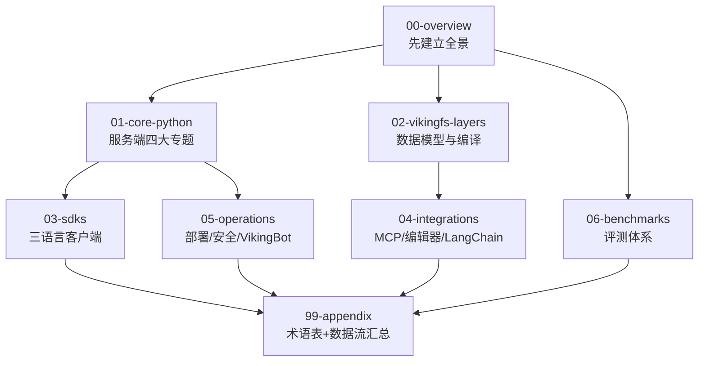

# OpenViking 源码精读笔记

> 基于上游 [`volcengine/OpenViking`](https://github.com/volcengine/OpenViking) 完整 clone 的源码精读笔记。
> 目的：①学懂 OpenViking 的工程设计 ②为基于 OpenViking 的二次开发提供内部技术文档 ③与 mem0 案例对照，理解"Agent 记忆系统"两种形态（记忆层 vs 上下文数据库）。
> 范围：全仓库（Python 主包 + Rust CLI/ragfs + C++ 向量引擎 + 三语言 SDK + bot/web-studio + benchmark + CI/CD）。
> 深度：架构级总览 + 核心模块精读级（关键行号引用，全部经 `sed -n` 现场钉版）。

---

## 当前基准

| 项 | 值 |
|---|---|
| 上游 HEAD（笔记起点） | `c66b9155`（2026-08-24）— `feat(ragfs): fine-grain lease-mode pathlock control (#4235)` |
| 项目定位 | 面向 AI Agent 的上下文数据库：`viking://` 虚拟文件系统 + L0/L1/L2 三层信息模型 |
| 关键架构事实 | **一切皆 HTTP**（embedded mode 已于 #3712 删除）；8 个子服务单进程编排 |
| 公开评测数字 | LoCoMo 80–83%（token −34.3~−91.0%）/ tau2 +6.87~+11.87pp（README_CN L104-105，自报） |
| 体量 | 1769 文件 25 语言；Python 主包 704 文件 |
| DeepWiki 档案 | 74 页 876KB（基线 `f316d6ad`，落后 262 commits）→ 见 [06-deepwiki-cross-reference](./00-overview/06-deepwiki-cross-reference.md) |

> ⚠️ 本仓库迭代极快（30 天 262 commits 含 3 次破坏性变更）。阅读时如发现行号对不上，先 `git log --oneline` 看是否有更新；所有笔记行号基于上述 HEAD，函数名/类名比行号稳定。

---

## 阅读路径（推荐顺序）



**最短速通路径（2-3 小时）**：`00-overview/02-architecture → 02-vikingfs-layers/02-l0l1l2-model → 01-core-python/03-retrieve-pipeline → 00-overview/06-deepwiki-cross-reference`

## 目录索引

### 🏛 [00-overview](./00-overview/) — 项目全景（必读）

- [`01-repo-layout.md`](./00-overview/01-repo-layout.md) — polyglot monorepo：五语言各司其职，全部拼进一个 pip wheel
- [`02-architecture.md`](./00-overview/02-architecture.md) — ⭐ 四层栈 + 三层信息模型 + 两条数据流总架构
- [`03-build-system.md`](./00-overview/03-build-system.md) — setuptools `build_ext` 总调度：Cargo/maturin/CMake/npm 四链合流
- [`04-two-modes.md`](./00-overview/04-two-modes.md) — Embedded 已死，一切皆 HTTP：四种运维外壳 + 单机锁约束
- [`05-cicd.md`](./00-overview/05-cicd.md) — 26 个 workflow 分五组；两具僵尸流水线；三层文档互相失实
- [`06-deepwiki-cross-reference.md`](./00-overview/06-deepwiki-cross-reference.md) — ⭐ DeepWiki 74 页 vs HEAD 262 commits 差异全景（时效三档分层）

### 🧠 [01-core-python](./01-core-python/) — Python 主包核心

- [`01-package-map.md`](./01-core-python/01-package-map.md) — `openviking/` 全景地图：以 OpenVikingService 为中心的组装
- [`02-ingest-pipeline.md`](./01-core-python/02-ingest-pipeline.md) — ⭐ 摄取解析管线：冻结源→队列→无 LLM 解析→语义 DAG→向量化
- [`03-retrieve-pipeline.md`](./01-core-python/03-retrieve-pipeline.md) — ⭐ 检索管线：意图分析→L0/L1 递归→rerank→hotness；find/search/recall 分野
- [`04-session-memory.md`](./01-core-python/04-session-memory.md) — ⭐ 会话与记忆：CompressorV3 压缩提取、9 类记忆、agent-evolution

### 🗄 [02-vikingfs-layers](./02-vikingfs-layers/) — 数据模型与上下文编译

- [`01-viking-uri.md`](./02-vikingfs-layers/01-viking-uri.md) — `viking://` URI 规范：命名空间、home 别名（#4167/#4196）、物理映射
- [`02-l0l1l2-model.md`](./02-vikingfs-layers/02-l0l1l2-model.md) — ⭐ L0/L1/L2 三层模型：目录级 sidecar、自底向上生成、token 经济学
- [`03-context-compilation.md`](./02-vikingfs-layers/03-context-compilation.md) — ov compile 四管线：llm-wiki/知识图谱/日报/蒸馏（DeepWiki 整块缺失的主题）

### 📦 [03-sdks](./03-sdks/) — 客户端 SDK

- [`01-python-sdk.md`](./03-sdks/01-python-sdk.md) — Async/SyncHTTPClient、envelope 错误映射、上传链路
- [`02-rust-cli.md`](./03-sdks/02-rust-cli.md) — `ov` 命令树全解（clap 定义核实）+ 双端配置与鉴权
- [`03-go-ts-sdks.md`](./03-sdks/03-go-ts-sdks.md) — Go/TS 双 SDK 对照：API 面、双运行时、成熟度

### 🔌 [04-integrations](./04-integrations/) — 集成生态

- [`01-agent-plugins-mcp.md`](./04-integrations/01-agent-plugins-mcp.md) — ⭐ Agent Plugins 1.0 规范包：无 hooks 的技能驱动闭环
- [`02-editor-agents.md`](./04-integrations/02-editor-agents.md) — 九家编辑器/CLI Agent 横向对比：公共能力核 + 宿主适配层
- [`03-langchain.md`](./04-integrations/03-langchain.md) — 独立包 `langchain-openviking`：middleware 生命周期与 commit policy

### 🛠 [05-operations](./05-operations/) — 部署运维与内置 Bot

- [`01-deploy-docker.md`](./05-operations/01-deploy-docker.md) — compose 逐服务拆解 + Dockerfile 三阶段 + Caddy/Helm
- [`02-config-security.md`](./05-operations/02-config-security.md) — ⭐ 配置四源链 + 六认证模式 + 加密信封 + 隐私审计
- [`03-vikingbot.md`](./05-operations/03-vikingbot.md) — VikingBot：AgentLoop/工具面/Web Studio/bridge

### 🧪 [06-benchmarks](./06-benchmarks/) — 评测体系

- [`01-benchmarks.md`](./06-benchmarks/01-benchmarks.md) — 9 套评测矩阵（locomo/longmemeval/tau2/cuvs/RAG/retrieval/skillsbench/vectordb_perf/custom）

### 📚 [99-appendix](./99-appendix/) — 附录

- [`index.md`](./99-appendix/index.md) — ⭐ 术语表 + 数据流图汇总 + 阅读顺序建议

---

## 文档约定

每个精读文档的标准结构：

```markdown
# NN —/· 标题

> **一句话总结**：...（150-250 字，凝练有观点）

**基准**：HEAD=c66b9155（2026-08-24）；与 docs/zh/xxx.md（N 行，本地核实）交叉核对；...

## 1-N. 正文（含 ≥1 张 mermaid；关键结论行号钉版 `file.py L123`）
## 与官方文档对照 / DeepWiki 差异（专节）
## 批判性收尾（设计权衡、局限、失败模式）
```

- ⭐ = 该目录下最推荐先读的篇目
- 行号全部基于 HEAD `c66b9155` 并经子代理 `sed -n` 抽检验证；引用一律"函数/类名优先于行号"
- 交叉核对三方：本地源码 > `docs/zh/`（随仓库更新）> DeepWiki（基线 `f316d6ad`，过时点在 06 篇统一管理）

## 与 mem0 案例的对照（读法建议）

| 维度 | mem0 | OpenViking |
|---|---|---|
| 定位 | 记忆层（Memory Layer）库 | 上下文数据库（Context Database）服务 |
| 核心抽象 | `Memory.add()/search()` API | `viking://` 文件系统语义 + ls/find/grep |
| 信息组织 | 扁平 memory 条目 + entity 链接 | L0/L1/L2 目录树渐进分辨率 |
| 形态 | 库优先（可 embedded） | 服务优先（embedded 已删，一切 HTTP） |
| 笔记入口 | `../mem0开源记忆层/notes/README.md` | 本文件 |

先读 mem0 的 `00-overview/02-architecture` 再读本系列 `00-overview/02-architecture`，能清晰看到"记忆层"与"上下文库"两条产品路线的分野。
