# DeepWiki 全文归档：basecamp/omarchy

> 抓取：2026-08-25 · DeepWiki MCP `read_wiki_contents`（v2.14.3）· wiki 索引 2026-08-18 @ fa955b
> 上游：https://deepwiki.com/basecamp/omarchy · 39 页全量（含 83 个 mermaid 架构图）
> 分叉对照：本归档来自上游 basecamp/omarchy；/data/usershare/linux-src/omarchy-quattro 为其 v4 分叉（见 ../omarchy-深读卡.md §分叉差异）

# Page: 1 Overview

# Overview

<details>
<summary>Relevant source files</summary>

The following files were used as context for generating this wiki page:

- [AGENTS.md](AGENTS.md)
- [README.md](README.md)
- [bin/omarchy](bin/omarchy)
- [bin/omarchy-capture-region](bin/omarchy-capture-region)
- [bin/omarchy-install-dev-env](bin/omarchy-install-dev-env)
- [bin/omarchy-menu](bin/omarchy-menu)
- [bin/omarchy-menu-keybindings](bin/omarchy-menu-keybindings)
- [default/hypr/bindings/utilities.lua](default/hypr/bindings/utilities.lua)
- [docs/audio-tuning.md](docs/audio-tuning.md)
- [docs/cli-router.md](docs/cli-router.md)
- [docs/file-layout.md](docs/file-layout.md)
- [docs/menu.md](docs/menu.md)
- [docs/notifications.md](docs/notifications.md)
- [docs/testing.md](docs/testing.md)
- [docs/theming.md](docs/theming.md)
- [docs/update-process.md](docs/update-process.md)
- [install/omarchy-base.packages](install/omarchy-base.packages)
- [migrations/1781043107.sh](migrations/1781043107.sh)
- [migrations/1786451567.sh](migrations/1786451567.sh)
- [test/cli](test/cli)

</details>


## Purpose and Scope

This page provides a high-level introduction to Omarchy, its architecture, core components, and design philosophy. It serves as an entry point for understanding how the system is organized and how its major subsystems interact.

For detailed information on specific subsystems, see:
- Installation process: [Installation and Setup](2)
- User interface components: [User Interface](3)
- Desktop environment configuration: [Desktop Environment](4)
- Package management: [Package Management](6)
- Theming and customization: [Customization and Theming](7)

## What is Omarchy

Omarchy is a desktop Linux distribution built on Arch Linux with Hyprland as its compositor. It provides a complete, opinionated desktop environment with integrated tooling for package management, theming, system updates, and recovery. 

The system is designed around these principles:
- **Declarative Package Manifests**: Core system state is defined in `omarchy-base.packages` [install/omarchy-base.packages:1-150]().
- **Command-Centric Architecture**: System actions are routed through a unified `omarchy` binary [bin/omarchy:1-20]().
- **Snapshot-Based Recovery**: Uses Btrfs and Snapper, integrated with the Limine bootloader [docs/file-layout.md:18-20]().
- **Idempotent Migrations**: Automated system repairs and updates via ordered shell scripts [docs/update-process.md:31-62]().
- **Integrated Extension System**: A "Quickshell" desktop architecture for plugins and widgets [AGENTS.md:8]().

## System Architecture

Omarchy is organized into distinct layers that interact through well-defined interfaces. The primary entry point for users is the `omarchy` command, which provides a routing layer to specific utility binaries.

```mermaid
graph TB
    subgraph "Routing Layer"
        ["bin/omarchy"] -- "Scans" --> metadata["Command Metadata"]
        ["bin/omarchy"] -- "Dispatches" --> bincmds["bin/omarchy-*"]
    end
    
    subgraph "Desktop Shell Layer"
        ["shell/ (omarchy-shell)"] -- "IPC" --> ["omarchy.menu"]
        ["shell/ (omarchy-shell)"] -- "IPC" --> ["omarchy.audio / .network"]
    end
    
    subgraph "Environment Layer"
        hypr["Hyprland (Compositor)"] -- "Keybinds" --> ["bin/omarchy-menu"]
        hypr -- "Rules" --> apps["Applications"]
    end
    
    subgraph "System Layer"
        pacman["Pacman / ALPM"] -- "Hooks" --> updateguard["omarchy-update-pacman-guard"]
        migration["omarchy-migrate"] -- "State" --> state["~/.local/state/omarchy/migrations/"]
    end

    ["bin/omarchy-menu"] -- "Calls" --> ["bin/omarchy"]
    ["bin/omarchy-*"] -- "Triggers" --> pacman
```
**Architecture Overview Diagram**

Sources: [bin/omarchy:1-100](), [bin/omarchy-menu:1-31](), [docs/update-process.md:63-80](), [docs/file-layout.md:11-28]()

## Core Components

### Command Routing System (`bin/omarchy`)

Omarchy uses a centralized command router. The `bin/omarchy` script scans all files in the same directory for specific metadata headers (e.g., `# omarchy:summary`) within a 80-line limit [bin/omarchy:5-6](). It allows executing commands using a grouped hierarchy (e.g., `omarchy capture screenshot`) [bin/omarchy:29-94]().

| Group | Code Identity | Description |
|---|---|---|
| `capture` | `omarchy-capture-*` | Screenshots and recording [bin/omarchy:37]() |
| `pkg` | `omarchy-pkg-*` | Package management helpers [bin/omarchy:67]() |
| `theme` | `omarchy-theme-*` | Theme management [bin/omarchy:84]() |
| `shell` | `omarchy-shell` | Omarchy shell IPC helpers [bin/omarchy:78]() |

Sources: [bin/omarchy:29-94](), [AGENTS.md:36-60]()

### Menu and IPC System

The user interface is driven by `omarchy-shell` (based on Quickshell). Components like the main menu communicate via IPC routes.


```mermaid
graph LR
    input["SUPER + SPACE"] -- "Executes" --> menu_bin["bin/omarchy-menu"]
    menu_bin -- "IPC call" --> shell_proc["omarchy-shell"]
    shell_proc -- "Toggle Plugin" --> menu_plugin["omarchy.menu"]
    menu_plugin -- "Route" --> json_defs["omarchy-menu.jsonc"]
```
**UI Communication Flow**

Sources: [bin/omarchy-menu:7-31](), [default/hypr/bindings/utilities.lua:1](), [AGENTS.md:93-98]()

### Package and Update Management

Omarchy wraps standard Arch package operations to ensure system integrity. 
- **Guard**: `omarchy-update-pacman-guard` aborts raw `pacman -Syu` calls to ensure migrations run [docs/update-process.md:63-100]().
- **Update**: `omarchy-update` orchestrates snapshots, package updates, and `omarchy-migrate` [docs/update-process.md:109-134]().
- **Migration**: Shell scripts in `migrations/` track completion state per-user in `~/.local/state/omarchy/migrations/` [docs/update-process.md:31-62]().

Sources: [docs/update-process.md:1-175]()

## File and Build Layout

The project builds two main Arch packages:
1. **`omarchy`**: Contains runtime binaries, migrations, themes, and the Quickshell desktop [docs/file-layout.md:11-13]().
2. **`omarchy-settings`**: Contains system-level defaults, `/etc/skel/` seeds for new users, and bootloader configurations [docs/file-layout.md:14-23]().

| Repository Path | Installed Path | Purpose |
|---|---|---|
| `bin/` | `/usr/bin/` | System commands [docs/file-layout.md:68]() |
| `config/` | `/etc/skel/.config/` | Default user configuration [docs/file-layout.md:84]() |
| `themes/` | `/usr/share/omarchy/themes/` | Theme definitions [docs/file-layout.md:79]() |
| `shell/` | `/usr/share/omarchy/shell/` | Desktop UI plugins [docs/file-layout.md:80]() |

Sources: [docs/file-layout.md:64-130]()

## Design Philosophy: Standardized Helpers

Omarchy promotes using high-level helpers instead of raw primitives:
- `omarchy-notification-send`: Unified notification handling [AGENTS.md:84]().
- `omarchy-pkg-add`: Unified pacman/AUR wrapper [AGENTS.md:83]().
- `omarchy-install-dev-env`: Standardized environment setups for Ruby, Node, Rust, etc. [bin/omarchy-install-dev-env:1-155]().

Sources: [AGENTS.md:78-90](), [bin/omarchy-install-dev-env:1-12]()

---


# Page: 2 Installation and Setup

# Installation and Setup

<details>
<summary>Relevant source files</summary>

The following files were used as context for generating this wiki page:

- [bin/omarchy-provision-first-run](bin/omarchy-provision-first-run)
- [bin/omarchy-provision-owner](bin/omarchy-provision-owner)
- [bin/omarchy-system-factory-reset](bin/omarchy-system-factory-reset)
- [bin/omarchy-system-factory-reset-finish](bin/omarchy-system-factory-reset-finish)
- [default/systemd/user/app.slice.d/10-oomd.conf](default/systemd/user/app.slice.d/10-oomd.conf)
- [etc/systemd/oomd.conf.d/10-omarchy.conf](etc/systemd/oomd.conf.d/10-omarchy.conf)
- [install/config/all.sh](install/config/all.sh)
- [install/config/docker.sh](install/config/docker.sh)
- [install/config/enable-services.sh](install/config/enable-services.sh)
- [install/config/increase-lockout-limit.sh](install/config/increase-lockout-limit.sh)
- [install/hardware/all.sh](install/hardware/all.sh)
- [install/hardware/apple/fix-brcmfmac-supplicant.sh](install/hardware/apple/fix-brcmfmac-supplicant.sh)
- [install/hardware/apple/fix-t2.sh](install/hardware/apple/fix-t2.sh)
- [install/login/all.sh](install/login/all.sh)
- [install/omarchy-other.packages](install/omarchy-other.packages)
- [install/post-install/all.sh](install/post-install/all.sh)
- [install/post-install/pacman.sh](install/post-install/pacman.sh)
- [install/provisioning/setup-form.sh](install/provisioning/setup-form.sh)
- [install/user/first-run/welcome.sh](install/user/first-run/welcome.sh)
- [install/user/first-run/wifi.sh](install/user/first-run/wifi.sh)
- [install/user/mise-work.sh](install/user/mise-work.sh)
- [migrations/1784568652.sh](migrations/1784568652.sh)
- [migrations/1785273276.sh](migrations/1785273276.sh)
- [migrations/1785424256.sh](migrations/1785424256.sh)
- [migrations/1785944594.sh](migrations/1785944594.sh)
- [migrations/1786391100.sh](migrations/1786391100.sh)
- [test/shell.d/brcmfmac-supplicant-test.sh](test/shell.d/brcmfmac-supplicant-test.sh)
- [test/shell.d/t2-hardware-test.sh](test/shell.d/t2-hardware-test.sh)

</details>


This page provides an overview of Omarchy's installation system, covering installation methods, repository channels, and the installation process structure. Omarchy uses a modular installation system that configures pacman repositories, installs base packages, and sets up the desktop environment.

For detailed installation instructions, see [Installation Process](#2.1). For boot management and snapshot functionality, see [Boot Management and Snapshots](#2.2). For session services and autostart configuration, see [Session Services and Autostart](#2.3).

---

## System Requirements

Omarchy requires an Arch Linux base system with specific hardware and filesystem configurations. The installation is protected by a guard script that enforces these prerequisites:

| Requirement | Description |
|------------|-------------|
| **Base System** | Vanilla Arch Linux (Derivatives like Manjaro or EndeavourOS are blocked) |
| **Architecture** | `x86_64` only |
| **User Account** | Non-root user with sudo privileges |
| **Filesystem** | **Btrfs root filesystem** is mandatory for snapshot features |
| **Bootloader** | **Limine** must be the installed bootloader |
| **Security** | Secure Boot must be disabled |
| **Clean Slate** | Must not have GNOME or KDE Plasma already installed |

**Sources:** [install/preflight/guard.sh:7-43](), [install/preflight/pacman.sh:1-3]()

---

## Installation Methods

Omarchy provides two installation entry points:

### Installation System Architecture

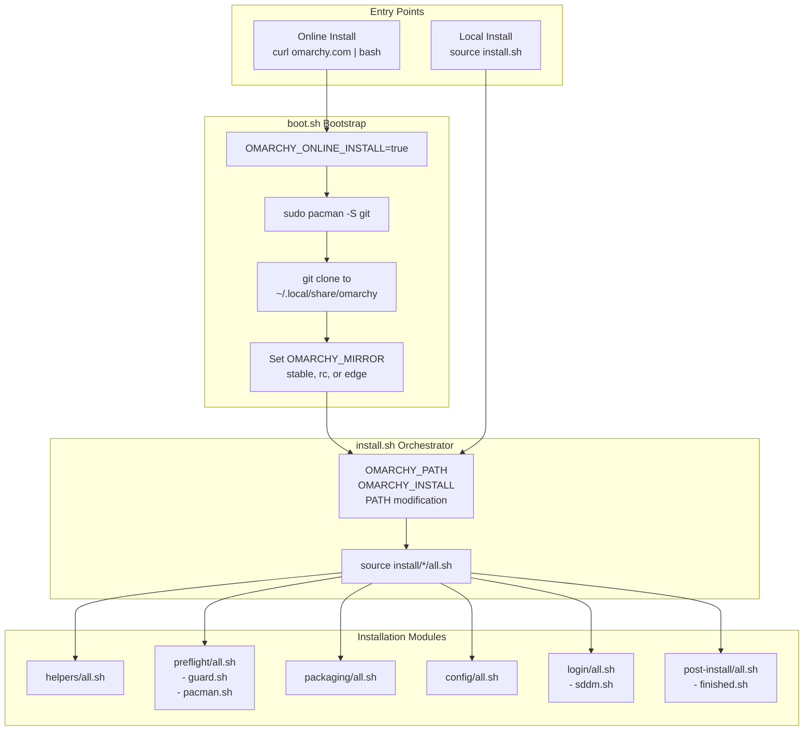
```mermaid
graph TB
    subgraph "Entry Points"
        OnlineInstall["Online Install<br/>curl omarchy.com | bash"]
        LocalInstall["Local Install<br/>source install.sh"]
    end
    
    subgraph "boot.sh Bootstrap"
        SetOnlineFlag["OMARCHY_ONLINE_INSTALL=true"]
        InstallGit["sudo pacman -S git"]
        CloneRepo["git clone to<br/>~/.local/share/omarchy"]
        SetMirror["Set OMARCHY_MIRROR<br/>stable, rc, or edge"]
    end
    
    subgraph "install.sh Orchestrator"
        SetPaths["OMARCHY_PATH<br/>OMARCHY_INSTALL<br/>PATH modification"]
        SourceModules["source install/*/all.sh"]
    end
    
    subgraph "Installation Modules"
        Helpers["helpers/all.sh"]
        Preflight["preflight/all.sh<br/>- guard.sh<br/>- pacman.sh"]
        Packaging["packaging/all.sh"]
        Config["config/all.sh"]
        Login["login/all.sh<br/>- sddm.sh"]
        PostInstall["post-install/all.sh<br/>- finished.sh"]
    end
    
    OnlineInstall --> SetOnlineFlag
    SetOnlineFlag --> InstallGit
    InstallGit --> CloneRepo
    CloneRepo --> SetMirror
    SetMirror --> SetPaths
    
    LocalInstall --> SetPaths
    
    SetPaths --> SourceModules
    SourceModules --> Helpers
    SourceModules --> Preflight
    SourceModules --> Packaging
    SourceModules --> Config
    SourceModules --> Login
    SourceModules --> PostInstall
```

**Sources:** [boot.sh:1-51](), [install.sh:1-19]()

### Online Installation via boot.sh

The `boot.sh` script bootstraps a new installation by setting the environment and fetching the source code:

1. Sets `OMARCHY_ONLINE_INSTALL=true` ([boot.sh:4]()).
2. Configures mirrors based on the `OMARCHY_REF` (e.g., `dev` branch uses `edge` mirror) ([boot.sh:24-33]()).
3. Clones the repository to `~/.local/share/omarchy` ([boot.sh:41-42]()).
4. Sources `install.sh` to begin the main installation loop ([boot.sh:50]()).

**Sources:** [boot.sh:1-51]()

---

## Repository Channels

Omarchy provides three package repository channels: `stable`, `rc` (Release Candidate), and `edge`.

### Channel Selection and Configuration

The `OMARCHY_MIRROR` environment variable controls which channel is used. During installation, the system applies these configurations to `/etc/pacman.conf` and `/etc/pacman.d/mirrorlist`.

| Channel | Branch | Mirror URL |
|---------|--------|------------|
| **stable** | `master` | `https://stable-mirror.omarchy.org` |
| **rc** | `rc` | `https://rc-mirror.omarchy.org` |
| **edge** | `dev` | `https://mirror.omarchy.org` |

**Sources:** [boot.sh:24-33](), [install/preflight/pacman.sh:6-7](), [install/post-install/pacman.sh:2-4]()

### Repository Keyring

The Omarchy repository uses a GPG key for package verification. During the preflight phase:
1. The key is received and signed ([install/preflight/pacman.sh:9-10]()).
2. The `omarchy-keyring` package is installed to maintain trust ([install/preflight/pacman.sh:13]()).

---

## Installation Phases

The `install.sh` script orchestrates the setup through sequential phases:

| Phase | Module Path | Purpose |
|-------|-------------|---------|
| **Helpers** | `install/helpers/all.sh` | Utility functions for logging and error handling ([install.sh:13]()). |
| **Preflight** | `install/preflight/all.sh` | Validates system requirements via `guard.sh` and prepares `pacman` ([install.sh:14]()). |
| **Packaging** | `install/packaging/all.sh` | Installs base desktop and system packages ([install.sh:15]()). |
| **Config** | `install/config/all.sh` | Deploys system-wide configurations, including Docker, Snapper, and firewall ([install/config/all.sh:1-11]()). |
| **Login** | `install/login/all.sh` | Sets up SDDM for graphical login ([install/login/all.sh:1]()). |
| **Post-Install** | `install/post-install/all.sh` | Finalizes repository settings and triggers a reboot ([install.sh:18]()). |

### Hardware and Boot Integration

Omarchy includes specialized hardware detection and boot configuration, particularly for Apple T2 MacBooks and other specialized hardware.

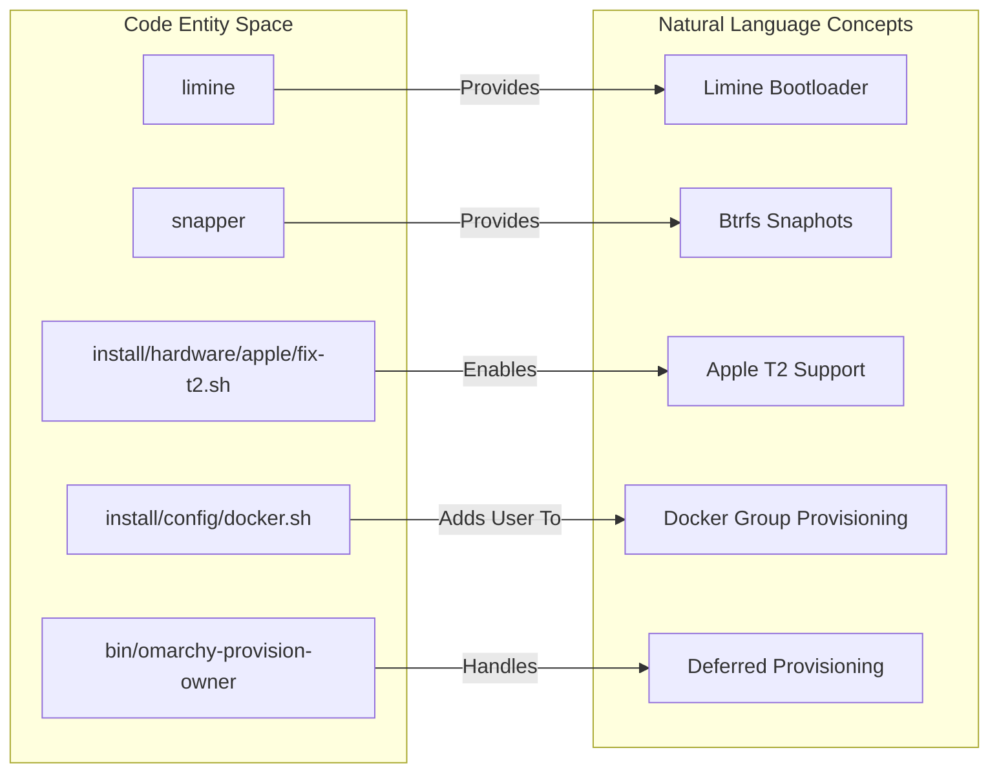
```mermaid
graph LR
    subgraph "Code Entity Space"
        LiminePkg["limine"]
        SnapperPkg["snapper"]
        T2Script["install/hardware/apple/fix-t2.sh"]
        DockerScript["install/config/docker.sh"]
        ProvisionOwner["bin/omarchy-provision-owner"]
    end

    subgraph "Natural Language Concepts"
        Bootloader["Limine Bootloader"]
        Snapshots["Btrfs Snaphots"]
        T2Support["Apple T2 Support"]
        UserGroups["Docker Group Provisioning"]
        DeferredProv["Deferred Provisioning"]
    end

    LiminePkg -- "Provides" --> Bootloader
    SnapperPkg -- "Provides" --> Snapshots
    T2Script -- "Enables" --> T2Support
    DockerScript -- "Adds User To" --> UserGroups
    ProvisionOwner -- "Handles" --> DeferredProv
```

**Sources:** [install/omarchy-other.packages:20-22, 41](), [install/hardware/apple/fix-t2.sh:1-14](), [install/config/docker.sh:1-10](), [bin/omarchy-provision-owner:7-12]()

---

## Post-Installation and First Run

Upon completion, the system enters a "First Run" state. For deferred provisioning (like ISO installs), `omarchy-provision-owner` runs on TTY1 to create the user account and re-key LUKS ([bin/omarchy-provision-owner:7-12]()).

### First-Run Sequence

Once a user logs in for the first time, `omarchy-provision-first-run` executes a series of hooks and configuration scripts:

1. **Service Activation**: Enables user-level systemd units ([bin/omarchy-provision-first-run:78-79]()).
2. **Hardware Tuning**: Applies speaker tuning and GTK themes ([bin/omarchy-provision-first-run:80-85]()).
3. **Network Notification**: Probes for a connection and prompts for Wi-Fi or system updates via `omarchy-notification-send` ([install/user/first-run/wifi.sh:6-27]()).
4. **Welcome**: Displays a welcome notification with keybinding reminders ([install/user/first-run/welcome.sh:1-5]()).

For details on how the system manages recovery, see [Boot Management and Snapshots](#2.2). For details on the desktop services that start after login, see [Session Services and Autostart](#2.3).

**Sources:** [bin/omarchy-provision-owner:7-12](), [bin/omarchy-provision-first-run:71-96](), [install/user/first-run/wifi.sh:1-30](), [install/user/first-run/welcome.sh:1-5]()

---


# Page: 2.1 Installation Process

# Installation Process

<details>
<summary>Relevant source files</summary>

The following files were used as context for generating this wiki page:

- [default/systemd/user/app.slice.d/10-oomd.conf](default/systemd/user/app.slice.d/10-oomd.conf)
- [etc/systemd/oomd.conf.d/10-omarchy.conf](etc/systemd/oomd.conf.d/10-omarchy.conf)
- [install/config/all.sh](install/config/all.sh)
- [install/config/docker.sh](install/config/docker.sh)
- [install/config/enable-services.sh](install/config/enable-services.sh)
- [install/config/increase-lockout-limit.sh](install/config/increase-lockout-limit.sh)
- [install/hardware/all.sh](install/hardware/all.sh)
- [install/hardware/apple/fix-brcmfmac-supplicant.sh](install/hardware/apple/fix-brcmfmac-supplicant.sh)
- [install/hardware/apple/fix-t2.sh](install/hardware/apple/fix-t2.sh)
- [install/helpers/logging.sh](install/helpers/logging.sh)
- [install/login/all.sh](install/login/all.sh)
- [install/login/sddm.sh](install/login/sddm.sh)
- [install/omarchy-other.packages](install/omarchy-other.packages)
- [install/post-install/all.sh](install/post-install/all.sh)
- [install/post-install/pacman.sh](install/post-install/pacman.sh)
- [migrations/1784568652.sh](migrations/1784568652.sh)
- [migrations/1785273276.sh](migrations/1785273276.sh)
- [migrations/1785424256.sh](migrations/1785424256.sh)
- [migrations/1785944594.sh](migrations/1785944594.sh)
- [migrations/1786391100.sh](migrations/1786391100.sh)
- [test/shell.d/brcmfmac-supplicant-test.sh](test/shell.d/brcmfmac-supplicant-test.sh)
- [test/shell.d/t2-hardware-test.sh](test/shell.d/t2-hardware-test.sh)

</details>


## Purpose and Scope

This document details the technical workflow for installing Omarchy, from initial system bootstrap through base package installation and hardware configuration. It covers the online installation method via `boot.sh`, preflight validation requirements, the multi-phase package installation process, hardware-specific driver setup, and system configuration steps.

For information about bootloader setup and snapshot configuration that occurs during installation, see [Boot Management and Snapshots](). For post-installation service startup configuration, see [Session Services and Autostart]().

---

## Installation Methods

Omarchy supports two installation modes, distinguished by the `OMARCHY_ONLINE_INSTALL` environment variable:

| Installation Mode | Entry Point | Use Case | Mirror Configuration |
|------------------|-------------|----------|---------------------|
| **Online** | `boot.sh` | Fresh system installation via curl | Configured based on branch (edge/rc/stable) |
| **Offline** | `install.sh` | Updates to existing installations | Uses existing mirror configuration |

The online installation method is triggered when a user executes:
```bash
curl -sSL https://boot.omarchy.org | bash
```

**Sources:** `boot.sh` (entire file), `install.sh` (entire file)

---

## Online Installation Bootstrap

### Boot Script Architecture

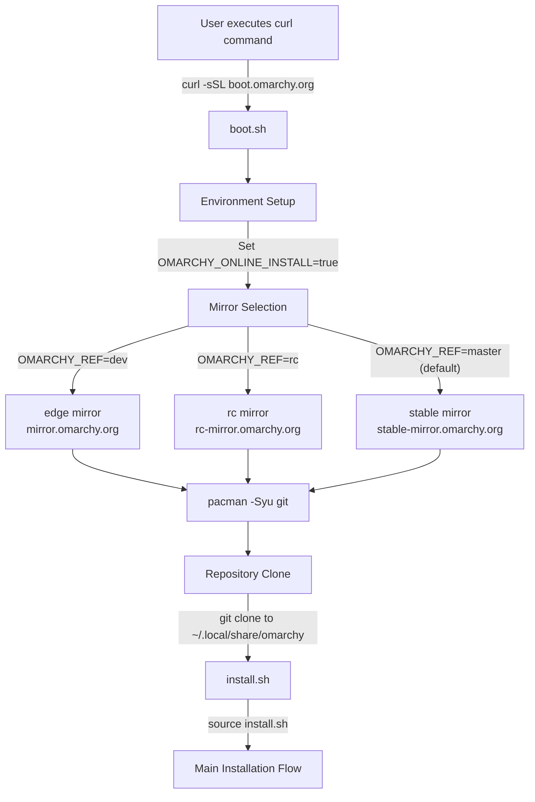
```mermaid
graph TB
    User["User executes curl command"]
    BootSh["boot.sh"]
    EnvSetup["Environment Setup"]
    MirrorSelect["Mirror Selection"]
    RepoClone["Repository Clone"]
    InstallSh["install.sh"]
    
    User -->|"curl -sSL boot.omarchy.org"| BootSh
    BootSh --> EnvSetup
    EnvSetup -->|"Set OMARCHY_ONLINE_INSTALL=true"| MirrorSelect
    
    MirrorSelect -->|"OMARCHY_REF=dev"| EdgeMirror["edge mirror<br/>mirror.omarchy.org"]
    MirrorSelect -->|"OMARCHY_REF=rc"| RCMirror["rc mirror<br/>rc-mirror.omarchy.org"]
    MirrorSelect -->|"OMARCHY_REF=master (default)"| StableMirror["stable mirror<br/>stable-mirror.omarchy.org"]
    
    EdgeMirror --> PackageInstall["pacman -Syu git"]
    RCMirror --> PackageInstall
    StableMirror --> PackageInstall
    
    PackageInstall --> RepoClone
    RepoClone -->|"git clone to ~/.local/share/omarchy"| InstallSh
    InstallSh -->|"source install.sh"| MainInstall["Main Installation Flow"]
```

**Diagram: Online Installation Bootstrap Sequence**

The `boot.sh` script performs the following operations:

1. **Environment Configuration**: Sets `OMARCHY_ONLINE_INSTALL=true` to signal online installation mode.
2. **Branch Detection**: Reads `OMARCHY_REF` environment variable (defaults to `master`).
3. **Mirror Selection**: Maps branch to appropriate package mirror and updates `/etc/pacman.d/mirrorlist`:
   - `dev` branch → edge mirror (`mirror.omarchy.org`)
   - `rc` branch → rc mirror (`rc-mirror.omarchy.org`)
   - `master` branch → stable mirror (`stable-mirror.omarchy.org`)
4. **Git Installation**: Installs git via `pacman -Syu --noconfirm --needed git`.
5. **Repository Clone**: Clones Omarchy repository to `~/.local/share/omarchy`.
6. **Branch Checkout**: Switches to specified branch.
7. **Installation Handoff**: Sources `install.sh` to begin main installation.

**Sources:** `boot.sh` (entire file)

---

## Main Installation Script Architecture

### Module Loading Structure

The main `install.sh` script establishes the Omarchy environment and sources installation modules in sequence.

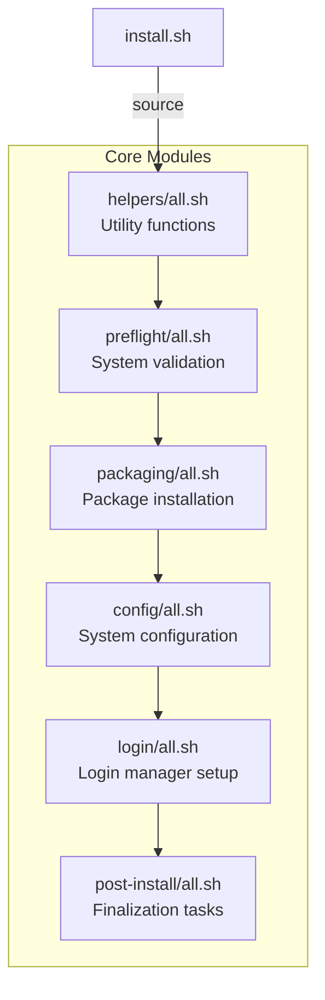
```mermaid
graph TB
    InstallSh["install.sh"]
    
    subgraph "Core Modules"
        Helpers["helpers/all.sh<br/>Utility functions"]
        Preflight["preflight/all.sh<br/>System validation"]
        Packaging["packaging/all.sh<br/>Package installation"]
        Config["config/all.sh<br/>System configuration"]
        Login["login/all.sh<br/>Login manager setup"]
        PostInstall["post-install/all.sh<br/>Finalization tasks"]
    end
    
    InstallSh -->|"source"| Helpers
    Helpers --> Preflight
    Preflight --> Packaging
    Packaging --> Config
    Config --> Login
    Login --> PostInstall
```

**Diagram: Install Script Module Organization**

**Environment Setup**:
- `OMARCHY_PATH="$HOME/.local/share/omarchy"` - Base installation directory.
- `OMARCHY_INSTALL="$OMARCHY_PATH/install"` - Installation scripts location.
- `OMARCHY_INSTALL_LOG_FILE="/var/log/omarchy-install.log"` - Installation log.
- `PATH="$OMARCHY_PATH/bin:$PATH"` - Adds Omarchy binaries to `PATH`.

**Module Loading Sequence**:
1. `helpers/all.sh`: Core utilities like `run_logged` for execution logging [install/helpers/logging.sh:41-77]().
2. `preflight/all.sh`: System validation and repository initialization.
3. `packaging/all.sh`: Base package installation via `omarchy-pkg-add`.
4. `config/all.sh`: Orchestrates hardware detection and system-wide configuration [install/config/all.sh:1-11]().
5. `login/all.sh`: Configures the display manager and session settings [install/login/all.sh:1]().
6. `post-install/all.sh`: Finalizes system settings and triggers migrations [install/post-install/all.sh:1-3]().

**Sources:** `install.sh` (entire file), [install/helpers/logging.sh:41-77](), [install/config/all.sh:1-11](), [install/login/all.sh:1](), [install/post-install/all.sh:1-3]()

---

## System Configuration Phase

### Configuration Module Execution Order

The configuration phase applies system-wide settings and hardware-specific fixes.

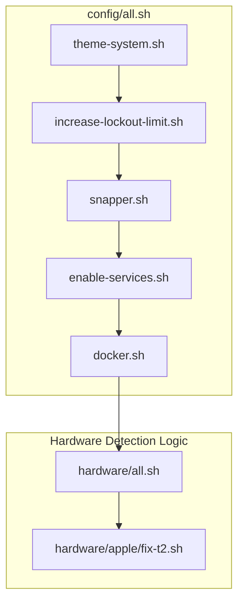
```mermaid
graph TD
    subgraph "config/all.sh"
        C1["theme-system.sh"]
        C2["increase-lockout-limit.sh"]
        C3["snapper.sh"]
        C4["enable-services.sh"]
        C5["docker.sh"]
    end
    
    subgraph "Hardware Detection Logic"
        H1["hardware/all.sh"]
        H2["hardware/apple/fix-t2.sh"]
    end

    C1 --> C2 --> C3 --> C4 --> C5
    C5 --> H1
    H1 --> H2
```

**Diagram: Configuration Module Flow**

**Critical Modules:**
- **Security Tweaks**: `increase-lockout-limit.sh` modifies `/etc/pam.d/system-auth` and `sddm-autologin` to increase failure limits to 10 and set unlock time to 120 seconds [install/config/increase-lockout-limit.sh:1-12]().
- **Service Management**: `enable-services.sh` enables critical daemons like `cups`, `docker`, `NetworkManager`, and `sddm`, while masking `NetworkManager-wait-online.service` to prevent boot delays [install/config/enable-services.sh:1-20]().
- **Docker Setup**: `docker.sh` ensures the `docker` group is recorded for provisioning and adds the install user to the group [install/config/docker.sh:1-10]().

**Sources:** [install/config/all.sh:1-11](), [install/config/increase-lockout-limit.sh:1-12](), [install/config/enable-services.sh:1-20](), [install/config/docker.sh:1-10]()

---

## Hardware-Specific Configuration

Omarchy features an extensive hardware detection suite within `install/hardware/`.

### Apple T2 MacBook Support
The installer specifically targets Apple hardware with T2 security chips [install/hardware/apple/fix-t2.sh:1-50]():
- **Detection**: Uses `lspci -nn` to find PCI IDs `106b:1801` or `106b:1802` [install/hardware/apple/fix-t2.sh:3]().
- **Drivers**: Installs `linux-t2`, `apple-t2-audio-config`, and `t2fanrd` [install/hardware/apple/fix-t2.sh:6-11]().
- **Kernel Parameters**: Configures `intel_iommu=on iommu=pt pm_async=off mem_sleep_default=deep` via `limine-entry-tool.d` [install/hardware/apple/fix-t2.sh:32]().
- **Fan Control**: Deploys a custom `/etc/t2fand.conf` for linear speed curves [install/hardware/apple/fix-t2.sh:37-49]().

### Other Specialized Hardware
The system maintains a list of hardware-specific packages in `install/omarchy-other.packages` [install/omarchy-other.packages:1-76]():
- **Surface Devices**: `linux-firmware-marvell` [install/omarchy-other.packages:60]().
- **Framework 16**: `qmk-hid` [install/omarchy-other.packages:76]().
- **Asus/ROG**: `asusctl` [install/omarchy-other.packages:5]().
- **GPU Drivers**: Auto-detects and installs `nvidia-dkms`, `vulkan-intel`, or `vulkan-radeon` [install/omarchy-other.packages:29-35, 54-57]().

**Sources:** [install/hardware/apple/fix-t2.sh:1-50](), [install/omarchy-other.packages:1-76]()

---

## Post-Installation and Migrations

The final stage ensures the system is in a consistent state and applies any pending updates.

1. **Pacman Finalization**: Restores the production `pacman.conf` and `mirrorlist` based on the selected mirror (`stable`, `rc`, or `edge`) [install/post-install/pacman.sh:1-4]().
2. **SDDM Configuration**: Modifies PAM settings to prevent password-based SDDM logins from creating encrypted keyrings that conflict with Omarchy's passwordless default [install/login/sddm.sh:1-7]().
3. **Migrations**: The update system checks for scripts in `migrations/`. For example, migration `1785944594.sh` updates T2 Mac suspend and fan defaults for existing installations, ensuring idempotency via repair markers [migrations/1785944594.sh:1-57]().
4. **Logging**: The entire process is wrapped in `start_install_log` and `stop_install_log`, which calculates the total duration and logs it to `/var/log/omarchy-install.log` [install/helpers/logging.sh:13-39]().

**Sources:** [install/post-install/pacman.sh:1-4](), [install/login/sddm.sh:1-7](), [migrations/1785944594.sh:1-57](), [install/helpers/logging.sh:13-39]()

---


# Page: 2.2 Boot Management and Snapshots

# Boot Management and Snapshots

<details>
<summary>Relevant source files</summary>

The following files were used as context for generating this wiki page:

- [agents/skills/install-scripts.md](agents/skills/install-scripts.md)
- [bin/omarchy-apply-hardware](bin/omarchy-apply-hardware)
- [bin/omarchy-apply-lock](bin/omarchy-apply-lock)
- [bin/omarchy-apply-system](bin/omarchy-apply-system)
- [bin/omarchy-debug](bin/omarchy-debug)
- [bin/omarchy-games-retro-install](bin/omarchy-games-retro-install)
- [bin/omarchy-install-gaming-battlenet](bin/omarchy-install-gaming-battlenet)
- [bin/omarchy-plymouth-preview](bin/omarchy-plymouth-preview)
- [bin/omarchy-plymouth-reset](bin/omarchy-plymouth-reset)
- [bin/omarchy-plymouth-set](bin/omarchy-plymouth-set)
- [bin/omarchy-refresh-limine](bin/omarchy-refresh-limine)
- [bin/omarchy-refresh-sddm](bin/omarchy-refresh-sddm)
- [bin/omarchy-setup-direct-boot](bin/omarchy-setup-direct-boot)
- [bin/omarchy-show-logo](bin/omarchy-show-logo)
- [bin/omarchy-snapshot](bin/omarchy-snapshot)
- [bin/omarchy-update](bin/omarchy-update)
- [bin/omarchy-update-confirm](bin/omarchy-update-confirm)
- [bin/omarchy-upload-log](bin/omarchy-upload-log)
- [bin/omarchy-version](bin/omarchy-version)
- [bin/omarchy-version-branch](bin/omarchy-version-branch)
- [default/applications/battlenet.desktop](default/applications/battlenet.desktop)
- [default/limine/default.conf](default/limine/default.conf)
- [default/limine/limine.conf](default/limine/limine.conf)
- [etc/limine-entry-tool.d/omarchy-defaults.conf](etc/limine-entry-tool.d/omarchy-defaults.conf)
- [etc/limine-entry-tool.d/omarchy-uki.conf](etc/limine-entry-tool.d/omarchy-uki.conf)
- [etc/mkinitcpio.conf.d/omarchy_hooks.conf](etc/mkinitcpio.conf.d/omarchy_hooks.conf)
- [etc/mkinitcpio.conf.d/thunderbolt_module.conf](etc/mkinitcpio.conf.d/thunderbolt_module.conf)
- [install/config/lockscreen-pam.sh](install/config/lockscreen-pam.sh)
- [migrations/1784476564.sh](migrations/1784476564.sh)
- [migrations/1784917531.sh](migrations/1784917531.sh)
- [migrations/1786605598.sh](migrations/1786605598.sh)
- [test/shell.d/battlenet-test.sh](test/shell.d/battlenet-test.sh)
- [test/shell.d/nvidia-kms-hook-test.sh](test/shell.d/nvidia-kms-hook-test.sh)
- [test/shell.d/nvidia-kms-migration-test.sh](test/shell.d/nvidia-kms-migration-test.sh)
- [test/shell.d/plymouth-set-test.sh](test/shell.d/plymouth-set-test.sh)
- [test/shell.d/snapper-test.sh](test/shell.d/snapper-test.sh)
- [test/shell.d/snapshot-create-test.sh](test/shell.d/snapshot-create-test.sh)
- [test/shell.d/version-test.sh](test/shell.d/version-test.sh)
- [version](version)

</details>


## Purpose and Scope

This document explains Omarchy's boot management system, which integrates the Limine bootloader with Snapper for Btrfs snapshot-based recovery. The system provides automatic snapshot creation, boot menu generation with snapshot selection, and rollback capabilities. For session startup services that launch after boot, see [Session Services and Autostart](2.3). For the update system that creates snapshots before updates, see [Update System](6.4).

---

## Boot System Architecture

Omarchy uses a three-component boot management architecture that enables snapshot-aware booting and system recovery.

### Boot Component Interaction

The following diagram illustrates the relationship between the bootloader, snapshot management, and the Omarchy configuration templates.

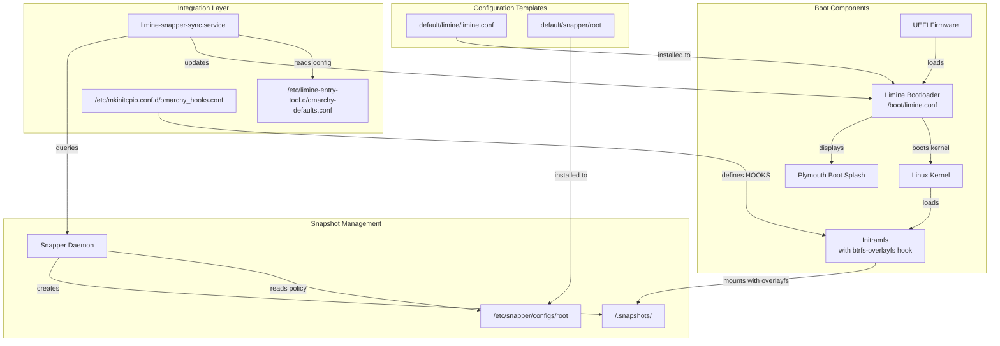
```mermaid
graph TB
    subgraph "Boot Components"
        UEFI["UEFI Firmware"]
        Limine["Limine Bootloader<br/>/boot/limine.conf"]
        Plymouth["Plymouth Boot Splash"]
        Kernel["Linux Kernel"]
        Initramfs["Initramfs<br/>with btrfs-overlayfs hook"]
    end
    
    subgraph "Snapshot Management"
        Snapper["Snapper Daemon"]
        RootConfig["/etc/snapper/configs/root"]
        Snapshots["/.snapshots/"]
    end
    
    subgraph "Integration Layer"
        LimineSnapperSync["limine-snapper-sync.service"]
        LimineDefaults["/etc/limine-entry-tool.d/omarchy-defaults.conf"]
        MkinitcpioConf["/etc/mkinitcpio.conf.d/omarchy_hooks.conf"]
    end
    
    subgraph "Configuration Templates"
        LimineTemplate["default/limine/limine.conf"]
        SnapperTemplate["default/snapper/root"]
    end
    
    UEFI -->|"loads"| Limine
    Limine -->|"displays"| Plymouth
    Limine -->|"boots kernel"| Kernel
    Kernel -->|"loads"| Initramfs
    Initramfs -->|"mounts with overlayfs"| Snapshots
    
    Snapper -->|"creates"| Snapshots
    Snapper -->|"reads policy"| RootConfig
    
    LimineSnapperSync -->|"queries"| Snapper
    LimineSnapperSync -->|"updates"| Limine
    LimineSnapperSync -->|"reads config"| LimineDefaults
    
    MkinitcpioConf -->|"defines HOOKS"| Initramfs
    
    LimineTemplate -->|"installed to"| Limine
    SnapperTemplate -->|"installed to"| RootConfig
```

**Sources:** [default/limine/limine.conf:1-20](), [etc/mkinitcpio.conf.d/omarchy_hooks.conf:1-1](), [test/shell.d/snapper-test.sh:7-16]()

---

## Limine Bootloader Configuration

### Configuration Refresh and Sync
The system manages the Limine configuration through specialized scripts that ensure the bootloader remains synchronized with the current system state and available snapshots.

1. **Manual Refresh:** `omarchy-refresh-limine` resets the bootloader configuration by moving the existing `limine.conf` to a backup and copying the official Omarchy template [bin/omarchy-refresh-limine:14-16]().
2. **Snapshot Synchronization:** After updating the config, it calls `limine-snapper-sync` to populate the boot menu with available Btrfs snapshots [bin/omarchy-refresh-limine:19-19]().
3. **UKI Management:** It performs cleanup of legacy Unified Kernel Images (UKI) to prevent boot entry duplication [bin/omarchy-refresh-limine:6-11]().

**Sources:** [bin/omarchy-refresh-limine:6-19]()

### Visual Customization (Plymouth)
Omarchy provides deep integration between the bootloader, the Plymouth splash screen, and the SDDM login manager to provide a unified visual experience.

The `omarchy-plymouth-set` command orchestrates this by:
- Staging theme assets from `default/plymouth` [bin/omarchy-plymouth-set:45-45]().
- Dynamically generating the Plymouth script with user-defined hex colors [bin/omarchy-plymouth-set:48-51]().
- Recolorizing theme assets (bullets, progress bars) using ImageMagick [bin/omarchy-plymouth-set:53-55]().
- Rebuilding the initramfs via `limine-mkinitcpio` or `mkinitcpio -P` to commit the changes [bin/omarchy-plymouth-set:60-64]().

**Sources:** [bin/omarchy-plymouth-set:41-64]()

---

## Snapper and Snapshot Management

### Snapshot Creation Workflow
Omarchy utilizes `snapper` for system snapshots, primarily during the update process managed by `omarchy-update`.

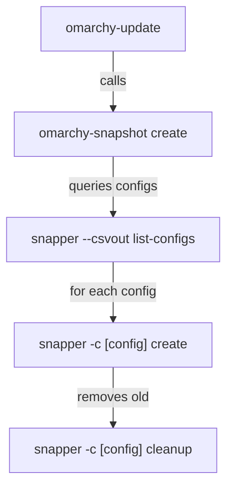
```mermaid
graph TD
    Update["omarchy-update"]
    SnapCmd["omarchy-snapshot create"]
    SnapperList["snapper --csvout list-configs"]
    SnapperCreate["snapper -c [config] create"]
    SnapperClean["snapper -c [config] cleanup"]
    
    Update -->|"calls"| SnapCmd
    SnapCmd -->|"queries configs"| SnapperList
    SnapperList -->|"for each config"| SnapperCreate
    SnapperCreate -->|"removes old"| SnapperClean
```

1. **Update Integration:** `omarchy-update` calls `omarchy-snapshot create` before performing system updates [bin/omarchy-update:36-36]().
2. **Description:** Snapshots are labeled with the current system version (e.g., `4.0.0.alpha`) via `omarchy-version` [bin/omarchy-snapshot:23-23]().
3. **Multi-Config Support:** The script iterates through all Snapper configurations found on the system [bin/omarchy-snapshot:26-42]().
4. **Cleanup:** It triggers a cleanup of old snapshots after creating a new one to adhere to retention policies [bin/omarchy-snapshot:41-41]().

**Sources:** [bin/omarchy-update:36-37](), [bin/omarchy-snapshot:21-45](), [version:1-1]()

### Snapshot Retention Policy
Omarchy enforces a specific retention policy to balance recovery capability with disk space usage.

| Setting | Value | Rationale |
|---------|-------|-----------|
| `NUMBER_CLEANUP` | `yes` | Enables automatic pruning of old snapshots [test/shell.d/snapper-test.sh:11-11]() |
| `NUMBER_LIMIT` | `5` | Keeps the last 5 snapshots [test/shell.d/snapper-test.sh:12-12]() |
| `TIMELINE_CREATE` | `no` | Disables hourly snapshots to prevent unexpected disk growth [test/shell.d/snapper-test.sh:13-13]() |
| `MAX_SNAPSHOT_ENTRIES` | `6` | Limine limit allows for one extra entry during the update transition [test/shell.d/snapper-test.sh:15-15]() |

**Sources:** [test/shell.d/snapper-test.sh:11-16](), [etc/limine-entry-tool.d/omarchy-defaults.conf:15-15]()

---

## Initramfs Configuration

### mkinitcpio Hook Logic
The initramfs is configured via `/etc/mkinitcpio.conf.d/omarchy_hooks.conf`. It uses a specific hook order to support encryption, snapshots, and graphics [etc/mkinitcpio.conf.d/omarchy_hooks.conf:1-1]().

**Hardware-Specific KMS Handling:**
The system includes logic to intelligently drop the `kms` (Kernel Mode Setting) hook on pure NVIDIA systems. This prevents the `autodetect` hook from pulling in unnecessary `nouveau` firmware (~100MB) when the proprietary driver is handling modesetting [etc/mkinitcpio.conf.d/omarchy_hooks.conf:3-6](). 

The script scans PCI devices at `/sys/bus/pci/devices` to determine if an Intel or other iGPU is present; if it's a hybrid system, `kms` is retained for early LUKS prompt rendering [etc/mkinitcpio.conf.d/omarchy_hooks.conf:17-39]().

### Keyboard Layout Preservation
To ensure users can type their LUKS passphrases, the system bundles `/etc/vconsole.conf` into the initramfs. However, it explicitly excludes non-Latin layouts (e.g., Arabic, Hebrew, Cyrillic) because passphrases must be entered using Latin characters, and a non-Latin early-boot layout would effectively lock the user out [etc/mkinitcpio.conf.d/omarchy_hooks.conf:47-52]().

**Sources:** [etc/mkinitcpio.conf.d/omarchy_hooks.conf:1-52]()

---

## Recovery and Debugging

### Snapshot Restoration
The `omarchy-snapshot restore` command provides a shortcut to `limine-snapper-restore`, allowing users to roll back the system state from within a running session [bin/omarchy-snapshot:47-47]().

### Debugging Boot Issues
If a boot failure occurs, the `omarchy-debug` and `omarchy-upload-log` utilities can be used to gather critical information:
- **Journal Logs:** Captures `journalctl -b -p 4..1` for the current boot's warnings and errors [bin/omarchy-debug:55-55]().
- **Previous Boot Logs:** `omarchy-upload-log last-boot` captures logs from the failed boot attempt [bin/omarchy-upload-log:111-122]().
- **System State:** Gathers hardware info via `inxi -Farz` and kernel ring buffer via `dmesg` [bin/omarchy-debug:35-50]().

**Sources:** [bin/omarchy-snapshot:46-48](), [bin/omarchy-debug:35-61](), [bin/omarchy-upload-log:111-122]()

---


# Page: 2.3 Session Services and Autostart

# Session Services and Autostart

<details>
<summary>Relevant source files</summary>

The following files were used as context for generating this wiki page:

- [bin/omarchy-agent-crash](bin/omarchy-agent-crash)
- [bin/omarchy-crash-watch](bin/omarchy-crash-watch)
- [bin/omarchy-provision-user](bin/omarchy-provision-user)
- [bin/omarchy-toggle-crash-capture](bin/omarchy-toggle-crash-capture)
- [config/hypr/.luarc.json](config/hypr/.luarc.json)
- [config/hypr/autostart.lua](config/hypr/autostart.lua)
- [config/hypr/bindings.lua](config/hypr/bindings.lua)
- [config/hypr/hyprland.lua](config/hypr/hyprland.lua)
- [config/hypr/input.lua](config/hypr/input.lua)
- [config/hypr/monitors.lua](config/hypr/monitors.lua)
- [default/agents/skills/diagnose-crash/SKILL.md](default/agents/skills/diagnose-crash/SKILL.md)
- [default/agents/skills/diagnose-crash/reporting.md](default/agents/skills/diagnose-crash/reporting.md)
- [default/bash/env-bootstrap](default/bash/env-bootstrap)
- [default/bash/envs](default/bash/envs)
- [default/bashrc](default/bashrc)
- [default/hypr/autostart.lua](default/hypr/autostart.lua)
- [default/hypr/helpers.lua](default/hypr/helpers.lua)
- [default/hypr/input.lua](default/hypr/input.lua)
- [default/systemd/user/omarchy-crash-watch.service](default/systemd/user/omarchy-crash-watch.service)
- [default/uwsm/default](default/uwsm/default)
- [default/uwsm/env.d/10-omarchy](default/uwsm/env.d/10-omarchy)
- [etc/profile.d/omarchy.sh](etc/profile.d/omarchy.sh)
- [install/config/ssh-command-path.sh](install/config/ssh-command-path.sh)
- [install/user/first-run/enable-user-units.sh](install/user/first-run/enable-user-units.sh)
- [migrations/1786181929.sh](migrations/1786181929.sh)
- [migrations/1786539345.sh](migrations/1786539345.sh)
- [test/shell.d/browser-env-test.sh](test/shell.d/browser-env-test.sh)
- [test/shell.d/crash-capture-test.sh](test/shell.d/crash-capture-test.sh)
- [test/shell.d/dev-env-path-test.sh](test/shell.d/dev-env-path-test.sh)
- [test/shell.d/editor-env-test.sh](test/shell.d/editor-env-test.sh)
- [test/shell.d/hyprland-keyboard-layout-test.sh](test/shell.d/hyprland-keyboard-layout-test.sh)
- [test/shell.d/locale-env-test.sh](test/shell.d/locale-env-test.sh)
- [test/shell.d/systemd-test.sh](test/shell.d/systemd-test.sh)

</details>


## Purpose and Scope

This page documents the session initialization system in Omarchy, covering the autostart configuration that launches desktop services and background processes when Hyprland starts. It explains the architecture combining Hyprland's `hl.on("hyprland.start", ...)` events with supervised systemd user services, the role of the `uwsm-app` wrapper, and environment variable synchronization for proper application integration.

For boot-level services and system initialization, see [Boot Management and Snapshots](2.2). For desktop interaction with running services, see [Waybar Status Bar](3.2).

---

## Session Initialization Flow

When a user logs in and Hyprland starts, the session initialization follows a specific sequence to ensure all desktop services are available and properly configured.

### Session Startup Sequence

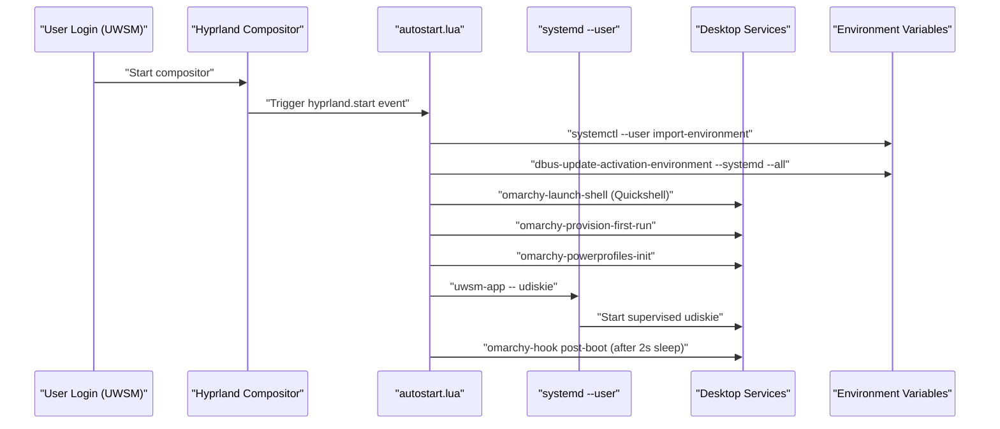
```mermaid
sequenceDiagram
    participant Login as "User Login (UWSM)"
    participant Hyprland as "Hyprland Compositor"
    participant Autostart as "autostart.lua"
    participant Systemd as "systemd --user"
    participant Services as "Desktop Services"
    participant Env as "Environment Variables"

    Login->>Hyprland: "Start compositor"
    Hyprland->>Autostart: "Trigger hyprland.start event"
    
    Autostart->>Env: "systemctl --user import-environment"
    Autostart->>Env: "dbus-update-activation-environment --systemd --all"
    
    Autostart->>Services: "omarchy-launch-shell (Quickshell)"
    Autostart->>Services: "omarchy-provision-first-run"
    Autostart->>Services: "omarchy-powerprofiles-init"
    
    Autostart->>Systemd: "uwsm-app -- udiskie"
    Systemd->>Services: "Start supervised udiskie"
    
    Autostart->>Services: "omarchy-hook post-boot (after 2s sleep)"
```

**Sources:** [default/hypr/autostart.lua:1-14]()

---

## Hyprland Autostart Configuration

The primary autostart configuration is defined in `default/hypr/autostart.lua`, which is processed by the Hyprland Lua integration during initialization.

### Environment Synchronization
Before launching applications, Omarchy synchronizes the environment between the compositor and the systemd user manager. This prevents "slow app launch" bugs where applications wait for D-Bus timeouts.
- `systemctl --user import-environment` [default/hypr/autostart.lua:3]()
- `dbus-update-activation-environment --systemd --all` [default/hypr/autostart.lua:4]()

### Core Service Launches
Services are launched using the `o.launch` helper, which wraps commands in `uwsm-app` to ensure they are managed as systemd scopes [default/hypr/helpers.lua:108-110]().

| Service | Command | Purpose |
|---------|---------|---------|
| **Quickshell** | `omarchy-launch-shell` | Launches the primary UI shell/panels [default/hypr/autostart.lua:6]() |
| **Monitor Watch** | `omarchy-hyprland-monitor-watch` | Background daemon for monitor hotplug handling [default/hypr/autostart.lua:9]() |
| **Udiskie** | `udiskie --automount` | Automounts removable media without notifications [default/hypr/autostart.lua:10]() |
| **Power Profiles** | `omarchy-powerprofiles-init` | Initializes power management states [default/hypr/autostart.lua:8]() |

**Sources:** [default/hypr/autostart.lua:1-14](), [default/hypr/helpers.lua:108-110]()

---

## Systemd User Services

Omarchy heavily utilizes systemd user units for long-running background tasks that require supervision (auto-restart) and specific execution conditions.

### Supervised Units
The following units are enabled and started during the `first-run` phase [install/user/first-run/enable-user-units.sh:15-21]():

- `bt-agent.service`: Manages Bluetooth pairing; includes an `ExecCondition` to skip if the system Bluetooth service is inactive [default/systemd/user/bt-agent.service:9]().
- `omarchy-sleep-lock.service`: Monitors system sleep signals to trigger the screen locker via `omarchy-system-sleep-monitor` [test/shell.d/systemd-test.sh:15-17]().
- `omarchy-fcitx5.service`: The input method framework. Unlike a standard autostart, this is supervised with `Restart=always` to ensure keyboard compose sequences (`~/.XCompose`) remain functional if the process crashes [test/shell.d/systemd-test.sh:61-89]().
- `omarchy-crash-watch.service`: Monitors system logs for application crashes to trigger AI-assisted diagnostics [install/user/first-run/enable-user-units.sh:21]().

### Session Gating
User services are often gated by `ConditionEnvironment=WAYLAND_DISPLAY` or `After=graphical-session.target` to ensure they only run during an active desktop session and don't attempt to start during headless SSH logins [test/shell.d/systemd-test.sh:25-27](), [test/shell.d/systemd-test.sh:65-72]().

**Sources:** [install/user/first-run/enable-user-units.sh:1-21](), [test/shell.d/systemd-test.sh:1-90]()

---

## Environment and Shell Configuration

Environment variables are established through a chain of bootstrap files to ensure consistency across interactive shells, SSH sessions, and the graphical environment.

### Bootstrap Chain
1. **`/etc/profile.d/omarchy.sh`**: Sources the Omarchy bootstrap for all login shells [etc/profile.d/omarchy.sh:1]().
2. **`default/bash/env-bootstrap`**: Sets the core `OMARCHY_PATH` [default/bash/env-bootstrap:1]().
3. **`default/bash/envs`**: Defines standard CLI tools:
   - `EDITOR`: Defaults to `omarchy-launch-editor --inline` [default/bash/envs:2]().
   - `BROWSER`: Defaults to `omarchy-launch-browser` [default/bash/envs:8]().
   - `MANPAGER`: Configured to use `bat` for colorized man pages [default/bash/envs:13]().

### Locale Handling
For non-interactive sessions (like SSH or remote commands) that might miss `/etc/profile.d/locale.sh`, `default/bash/envs` manually mirrors `/etc/locale.conf` to prevent encoding issues in `printf` and other utilities [default/bash/envs:23-29]().

**Sources:** [etc/profile.d/omarchy.sh:1](), [default/bash/envs:1-34](), [default/bashrc:1-9]()

---

## Service Architecture Diagram

This diagram bridges the conceptual "Services" to the specific code entities and systemd units that implement them.

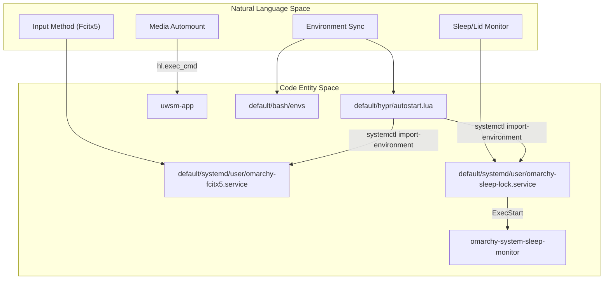
```mermaid
graph TB
    subgraph "Natural Language Space"
        InputMethod["Input Method (Fcitx5)"]
        SleepLock["Sleep/Lid Monitor"]
        AutoMount["Media Automount"]
        EnvSync["Environment Sync"]
    end

    subgraph "Code Entity Space"
        FcitxUnit["default/systemd/user/omarchy-fcitx5.service"]
        SleepUnit["default/systemd/user/omarchy-sleep-lock.service"]
        SleepMonitor["omarchy-system-sleep-monitor"]
        AutostartLua["default/hypr/autostart.lua"]
        UWSM["uwsm-app"]
        BashEnvs["default/bash/envs"]
    end

    InputMethod --> FcitxUnit
    SleepLock --> SleepUnit
    SleepUnit -- "ExecStart" --> SleepMonitor
    AutoMount -- "hl.exec_cmd" --> UWSM
    EnvSync --> AutostartLua
    EnvSync --> BashEnvs

    AutostartLua -- "systemctl import-environment" --> FcitxUnit
    AutostartLua -- "systemctl import-environment" --> SleepUnit
```

**Sources:** [default/hypr/autostart.lua:1-14](), [test/shell.d/systemd-test.sh:15-27](), [test/shell.d/systemd-test.sh:61-72](), [default/bash/envs:1-34]()

---


# Page: 3 User Interface

# User Interface

<details>
<summary>Relevant source files</summary>

The following files were used as context for generating this wiki page:

- [bin/omarchy-bar](bin/omarchy-bar)
- [config/omarchy/extensions/omarchy-menu.jsonc](config/omarchy/extensions/omarchy-menu.jsonc)
- [default/fonts/omarchy/README.md](default/fonts/omarchy/README.md)
- [default/fonts/omarchy/omarchy.ttf](default/fonts/omarchy/omarchy.ttf)
- [default/omarchy/omarchy-menu.jsonc](default/omarchy/omarchy-menu.jsonc)
- [docs/omarchy-shell.md](docs/omarchy-shell.md)
- [shell/README.md](shell/README.md)
- [shell/Ui/WidgetButton.qml](shell/Ui/WidgetButton.qml)
- [shell/plugins/README.md](shell/plugins/README.md)
- [shell/plugins/bar/Bar.qml](shell/plugins/bar/Bar.qml)
- [shell/plugins/bar/BarModel.js](shell/plugins/bar/BarModel.js)
- [shell/plugins/bar/README.md](shell/plugins/bar/README.md)
- [shell/plugins/menu/Menu.qml](shell/plugins/menu/Menu.qml)
- [shell/plugins/menu/MenuModel.js](shell/plugins/menu/MenuModel.js)
- [shell/services/PluginRegistry.qml](shell/services/PluginRegistry.qml)
- [shell/shell.qml](shell/shell.qml)
- [test/shell.d/bar-test.sh](test/shell.d/bar-test.sh)
- [test/shell.d/config-test.sh](test/shell.d/config-test.sh)
- [test/shell.d/fixtures/plugin-registry/shell.qml](test/shell.d/fixtures/plugin-registry/shell.qml)
- [test/shell.d/menu-guards-test.sh](test/shell.d/menu-guards-test.sh)
- [test/shell.d/menu-test.sh](test/shell.d/menu-test.sh)
- [test/shell.d/runtime-smoke-test.sh](test/shell.d/runtime-smoke-test.sh)

</details>


This page documents Omarchy's user-facing interface components and interaction patterns. The UI layer consists of three primary systems: the Omarchy Menu System (hierarchical navigation), the Status Bar (persistent system status), and the Application Launcher. For desktop environment configuration and window management, see [Desktop Environment](#4). For screen capture utilities, see [Screen Capture and Recording](#5).

## Architecture Overview

Omarchy's UI is hosted by `omarchy-shell`, a long-running Quickshell instance [shell/README.md:1-6](). The shell manages first-party and third-party plugins that provide the bar, menus, and panels [docs/omarchy-shell.md:3-6]().

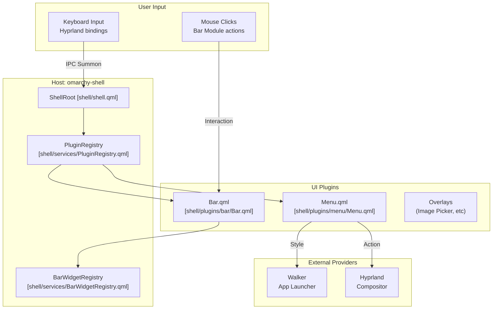
```mermaid
graph TB
    subgraph "User Input"
        Keyboard["Keyboard Input<br/>Hyprland bindings"]
        Mouse["Mouse Clicks<br/>Bar Module actions"]
    end
    
    subgraph "Host: omarchy-shell"
        Root["ShellRoot [shell/shell.qml]"]
        Registry["PluginRegistry<br/>[shell/services/PluginRegistry.qml]"]
        BarRegistry["BarWidgetRegistry<br/>[shell/services/BarWidgetRegistry.qml]"]
    end
    
    subgraph "UI Plugins"
        MenuPlugin["Menu.qml<br/>[shell/plugins/menu/Menu.qml]"]
        BarPlugin["Bar.qml<br/>[shell/plugins/bar/Bar.qml]"]
        OverlayPlugin["Overlays<br/>(Image Picker, etc)"]
    end
    
    subgraph "External Providers"
        Walker["Walker<br/>App Launcher"]
        Hyprland["Hyprland<br/>Compositor"]
    end
    
    Keyboard -->|"IPC Summon"| Root
    Mouse -->|"Interaction"| BarPlugin
    Root --> Registry
    Registry --> MenuPlugin
    Registry --> BarPlugin
    BarPlugin --> BarRegistry
    MenuPlugin -->|"Action"| Hyprland
    MenuPlugin -->|"Style"| Walker
```

**Sources**: [shell/shell.qml:11-20](), [shell/README.md:1-15](), [docs/omarchy-shell.md:1-10]()

## Menu System Hierarchy

The Omarchy menu system is defined in JSONC and provides a hierarchical interface for system control, learning, and configuration [default/omarchy/omarchy-menu.jsonc:1-9](). The menu logic is implemented in QML and JavaScript, supporting deep nesting and dynamic content providers [shell/plugins/menu/Menu.qml:47-53](). For a complete reference, see **[Omarchy Menu System](#3.1)**.

### Root Menu Categories
| ID | Icon | Label | Purpose |
|----|------|-------|---------|
| `apps` | 󰀻 | Apps | Application library access [default/omarchy/omarchy-menu.jsonc:24]() |
| `learn` | 󰧑 | Learn | Documentation and keybindings [default/omarchy/omarchy-menu.jsonc:25]() |
| `trigger` | 󱓞 | Trigger | Actions (Capture, Toggles, Hardware) [default/omarchy/omarchy-menu.jsonc:26]() |
| `style` |  | Style | Theming and appearance [default/omarchy/omarchy-menu.jsonc:27]() |
| `setup` |  | Setup | System settings [default/omarchy/omarchy-menu.jsonc:28]() |
| `system` |  | System | Power and session management [default/omarchy/omarchy-menu.jsonc:33]() |

**Sources**: [default/omarchy/omarchy-menu.jsonc:23-34](), [shell/plugins/menu/MenuModel.js:13-40]()

## Status Bar (omarchy-shell bar)

The status bar is a first-party plugin of `omarchy-shell` [shell/plugins/bar/README.md:3-6](). It is highly dynamic, supporting drag-and-drop reordering and multi-monitor support [shell/plugins/bar/Bar.qml:84-97](). For detailed configuration of modules and indicators, see **[Waybar Status Bar](#3.2)** (Note: The status bar was migrated to a Quickshell-based system).

### Module Slots
The bar is divided into regions defined in `shell.json` [shell/plugins/bar/README.md:21-47]():
- **Left**: Typically contains `omarchy.menu` and `omarchy.workspaces` [shell/shell.qml:47]().
- **Center**: Often anchored by `omarchy.clock` [shell/plugins/bar/Bar.qml:39]().
- **Right**: Contains system status like `omarchy.audio`, `omarchy.network`, and `omarchy.power` [shell/plugins/bar/README.md:67-72]().

### Interactive Indicators
Indicators (e.g., Recording, DND, Updates) appear in the `omarchy.indicators` widget [shell/plugins/bar/README.md:75](). These are revealed when active or on hover to maintain a clean interface [test/shell.d/bar-test.sh:87-95]().

**Sources**: [shell/plugins/bar/Bar.qml:11-58](), [shell/plugins/bar/README.md:53-76]()

## Walker Application Launcher

Walker serves as the primary application launcher and a general-purpose selector tool. It is integrated into the shell for tasks like background selection and clipboard management. For details, see **[Walker Application Launcher](#3.3)**.

### Dmenu Integration
Omarchy utilizes Walker's dmenu mode to render the hierarchical menu system when invoked via the CLI [shell/plugins/menu/Menu.qml:27-32](). This allows the menu to share the visual style and performance of the application launcher.

**Sources**: [shell/plugins/menu/Menu.qml:56-62](), [shell/plugins/menu/MenuModel.js:177-191]()

## Customization and Plugins

The UI is extended via a plugin architecture. Plugins can be `bar-widget`, `panel`, `overlay`, `menu`, or `service` [docs/omarchy-shell.md:29-36]().

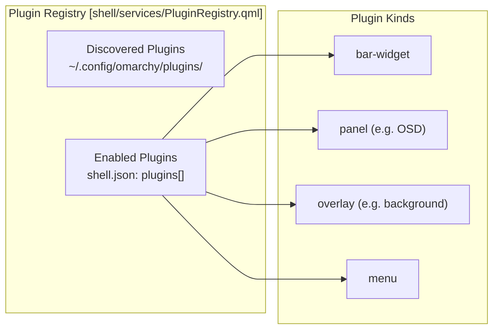
```mermaid
graph LR
    subgraph "Plugin Registry [shell/services/PluginRegistry.qml]"
        Discovered["Discovered Plugins<br/>~/.config/omarchy/plugins/"]
        Enabled["Enabled Plugins<br/>shell.json: plugins[]"]
    end
    
    subgraph "Plugin Kinds"
        BarWidget["bar-widget"]
        Panel["panel (e.g. OSD)"]
        Overlay["overlay (e.g. background)"]
        MenuKind["menu"]
    end
    
    Enabled --> BarWidget
    Enabled --> Panel
    Enabled --> Overlay
    Enabled --> MenuKind
```

### Theming and Fonts
The `omarchy-font-set` utility updates the system monospace font across all UI components, including the bar, menu, and terminal emulators [test/shell.d/bar-test.sh:59-62](). Theme changes are pushed to the shell via IPC using `applyTheme` [docs/omarchy-shell.md:117]().

**Sources**: [docs/omarchy-shell.md:51-80](), [shell/shell.qml:148-156]()

---


# Page: 3.1 Omarchy Menu System

# Omarchy Menu System

<details>
<summary>Relevant source files</summary>

The following files were used as context for generating this wiki page:

- [bin/omarchy](bin/omarchy)
- [bin/omarchy-capture-region](bin/omarchy-capture-region)
- [bin/omarchy-install-dev-env](bin/omarchy-install-dev-env)
- [bin/omarchy-install-service-sunshine](bin/omarchy-install-service-sunshine)
- [bin/omarchy-menu](bin/omarchy-menu)
- [bin/omarchy-menu-file](bin/omarchy-menu-file)
- [bin/omarchy-menu-input](bin/omarchy-menu-input)
- [bin/omarchy-menu-keybindings](bin/omarchy-menu-keybindings)
- [bin/omarchy-menu-plugin](bin/omarchy-menu-plugin)
- [bin/omarchy-menu-select](bin/omarchy-menu-select)
- [bin/omarchy-remove-service-sunshine](bin/omarchy-remove-service-sunshine)
- [config/omarchy/extensions/omarchy-menu.jsonc](config/omarchy/extensions/omarchy-menu.jsonc)
- [default/fonts/omarchy/README.md](default/fonts/omarchy/README.md)
- [default/fonts/omarchy/omarchy.ttf](default/fonts/omarchy/omarchy.ttf)
- [default/hypr/bindings/utilities.lua](default/hypr/bindings/utilities.lua)
- [default/omarchy/omarchy-menu.jsonc](default/omarchy/omarchy-menu.jsonc)
- [install/omarchy-base.packages](install/omarchy-base.packages)
- [shell/plugins/menu/Menu.qml](shell/plugins/menu/Menu.qml)
- [shell/plugins/menu/MenuModel.js](shell/plugins/menu/MenuModel.js)
- [test/shell.d/menu-guards-test.sh](test/shell.d/menu-guards-test.sh)
- [test/shell.d/menu-plugin-test.sh](test/shell.d/menu-plugin-test.sh)
- [test/shell.d/menu-test.sh](test/shell.d/menu-test.sh)

</details>


The Omarchy Menu System is a high-performance, hierarchical command dispatcher built on the **Quickshell** framework. It serves as the primary interface for system discovery and interaction, providing a unified surface for application launching, hardware control, system configuration, and package management.

## Overview

The menu system operates as a first-party plugin (`omarchy.menu`) within the Omarchy shell architecture. It is defined by structured JSONC data that allows for dynamic hierarchical navigation, condition-based visibility, and deep integration with system utilities.

Key characteristics include:
- **Hierarchical Navigation**: Uses dotted ID notation (e.g., `trigger.capture.screenshot`) to define parent-child relationships [default/omarchy/omarchy-menu.jsonc:4-5]().
- **Fuzzy Search**: Integrated search scoring that prioritizes exact matches and aliases [shell/plugins/menu/MenuModel.js:101-105]().
- **Dynamic Content**: Submenus can be backed by "providers" that inject live system data, such as active applications or available updates [shell/plugins/menu/Menu.qml:7-8]().
- **Conditionals**: Menu rows can be hidden (`when`), marked as active (`checked`), or rendered as non-selectable (`disabled`) based on shell command results [default/omarchy/omarchy-menu.jsonc:16-21]().

**Sources:** [bin/omarchy-menu:1-52](), [default/omarchy/omarchy-menu.jsonc:1-34](), [shell/plugins/menu/Menu.qml:1-115]()

## Architecture and Data Flow

The menu system is split between a shell-resident QML plugin and a bash wrapper for IPC communication.

**Diagram: Menu System Entity Map**

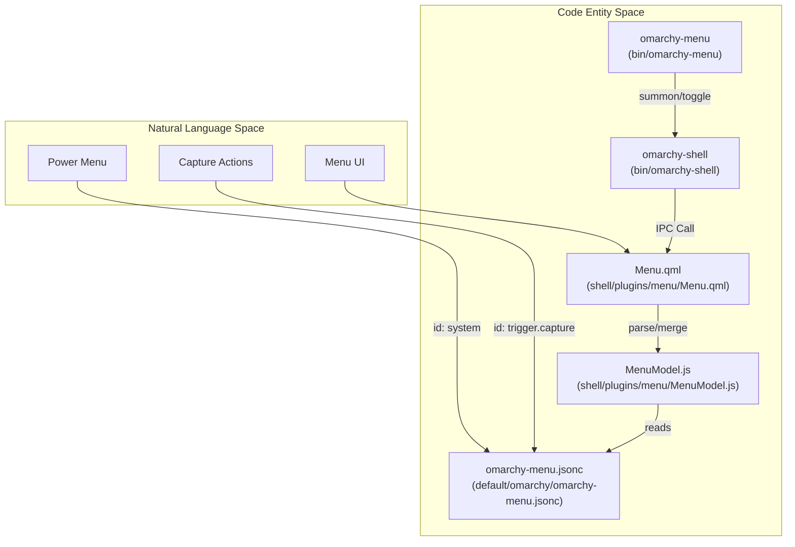
```mermaid
graph TD
    subgraph "Natural Language Space"
        MenuUI["Menu UI"]
        PowerMenu["Power Menu"]
        CaptureActions["Capture Actions"]
    end

    subgraph "Code Entity Space"
        MenuQML["Menu.qml<br/>(shell/plugins/menu/Menu.qml)"]
        MenuModel["MenuModel.js<br/>(shell/plugins/menu/MenuModel.js)"]
        MenuJSONC["omarchy-menu.jsonc<br/>(default/omarchy/omarchy-menu.jsonc)"]
        MenuBin["omarchy-menu<br/>(bin/omarchy-menu)"]
        ShellIPC["omarchy-shell<br/>(bin/omarchy-shell)"]
    end

    MenuUI --> MenuQML
    PowerMenu -->|"id: system"| MenuJSONC
    CaptureActions -->|"id: trigger.capture"| MenuJSONC
    
    MenuBin -->|"summon/toggle"| ShellIPC
    ShellIPC -->|"IPC Call"| MenuQML
    MenuQML -->|"parse/merge"| MenuModel
    MenuModel -->|"reads"| MenuJSONC
```
**Sources:** [bin/omarchy-menu:7-31](), [shell/plugins/menu/Menu.qml:7-15](), [default/omarchy/omarchy-menu.jsonc:1-34]()

### Execution Flow

When a user invokes a menu command (e.g., via `Super + Space`), the following sequence occurs:

1.  **Invocation**: The `omarchy-menu` script is called with a verb (default `toggle`) and an optional route [bin/omarchy-menu:12-13]().
2.  **IPC Dispatch**: The script calls `omarchy-shell shell toggle omarchy.menu` with a JSON payload containing the target route [bin/omarchy-menu:20-22]().
3.  **Plugin Activation**: The Quickshell `Menu.qml` plugin receives the `open()` call [shell/plugins/menu/Menu.qml:21-32]().
4.  **Route Resolution**: `MenuModel.js` resolves aliases (e.g., "power" to "system") and determines the specific submenu to display [shell/plugins/menu/MenuModel.js:177-191]().
5.  **Rendering**: The QML engine renders the rows, evaluating `when` and `checked` shell conditions to determine row state [shell/plugins/menu/Menu.qml:155-160]().

**Sources:** [bin/omarchy-menu:19-31](), [shell/plugins/menu/Menu.qml:21-32](), [shell/plugins/menu/MenuModel.js:177-191]()

## Menu Hierarchy and Configuration

The menu is defined in `default/omarchy/omarchy-menu.jsonc`. Each entry is an object keyed by a unique ID.

### Root Menu Structure
| ID | Label | Provider / Action | Purpose |
|:---|:---|:---|:---|
| `apps` | Apps | `apps` provider | Dynamic list of desktop applications [default/omarchy/omarchy-menu.jsonc:24]() |
| `learn` | Learn | - | Documentation and keybinding links [default/omarchy/omarchy-menu.jsonc:25]() |
| `trigger` | Trigger | - | System actions and hardware controls [default/omarchy/omarchy-menu.jsonc:26]() |
| `style` | Style | - | Theming, fonts, and backgrounds [default/omarchy/omarchy-menu.jsonc:27]() |
| `setup` | Setup | - | Interactive wizards and config editors [default/omarchy/omarchy-menu.jsonc:28]() |
| `install` | Install | - | Package installation categories [default/omarchy/omarchy-menu.jsonc:29]() |
| `system` | System | - | Power, lock, and session management [default/omarchy/omarchy-menu.jsonc:33]() |

### Implementation of Logic Guards
The menu uses shell-based conditions to dynamically alter the UI:
- **`when`**: If the command returns non-zero, the row is omitted. Example: `trigger.hardware.laptop-display` only appears if `omarchy-hw-laptop` is true [default/omarchy/omarchy-menu.jsonc:74]().
- **`checked`**: If true, a checkmark (✓) is appended to the label. Example: Touchpad haptic levels [default/omarchy/omarchy-menu.jsonc:79-81]().
- **`disabled`**: If true, the row is dimmed and non-selectable. Used in the `install` menu to show software already present [default/omarchy/omarchy-menu.jsonc:18-21]().

**Sources:** [default/omarchy/omarchy-menu.jsonc:10-21](), [shell/plugins/menu/MenuModel.js:66-68]()

## Submenu Deep Dive

### Trigger and Capture
The `trigger.capture` submenu provides access to Omarchy's advanced screenshot and recording suite.

| Menu Item | Action / Logic |
|:---|:---|
| **Screenshot** | Calls `omarchy-capture-screenshot` [default/omarchy/omarchy-menu.jsonc:59]() |
| **Stop Recording** | Visible only if `gpu-screen-recorder` is running [default/omarchy/omarchy-menu.jsonc:60]() |
| **Webcam Record** | Only visible if `omarchy-hw-webcam` returns true [default/omarchy/omarchy-menu.jsonc:68]() |

### System and Power
The `system` menu handles session lifecycle.
- **Lock**: Executes `omarchy-system-lock` [default/omarchy/omarchy-menu.jsonc:37]().
- **Suspend**: Conditional check `! omarchy-toggle-enabled suspend-off` ensures suspension is not blocked by the user [default/omarchy/omarchy-menu.jsonc:38]().
- **Hibernate**: Only shown if `omarchy-hibernation-available` returns true [default/omarchy/omarchy-menu.jsonc:39]().

**Sources:** [default/omarchy/omarchy-menu.jsonc:36-42](), [default/omarchy/omarchy-menu.jsonc:58-68]()

## Menu Navigation and Keybindings

The menu system is bound to several global hotkeys within the Hyprland configuration.

**Diagram: Keybinding to Menu Route Mapping**

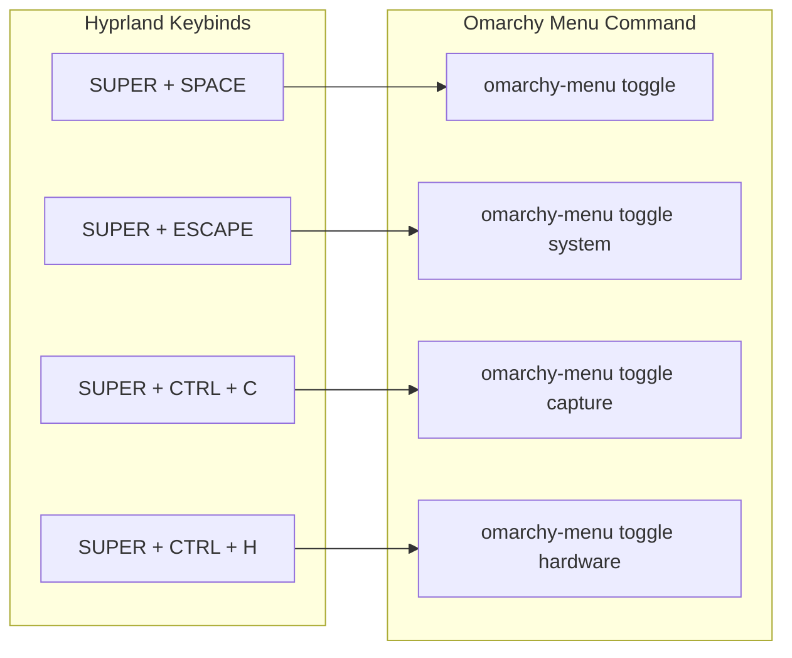
```mermaid
graph LR
    subgraph "Hyprland Keybinds"
        SuperSpace["SUPER + SPACE"]
        SuperEsc["SUPER + ESCAPE"]
        SuperCtrlC["SUPER + CTRL + C"]
        SuperCtrlH["SUPER + CTRL + H"]
    end

    subgraph "Omarchy Menu Command"
        ToggleRoot["omarchy-menu toggle"]
        ToggleSystem["omarchy-menu toggle system"]
        ToggleCapture["omarchy-menu toggle capture"]
        ToggleHardware["omarchy-menu toggle hardware"]
    end

    SuperSpace --> ToggleRoot
    SuperEsc --> ToggleSystem
    SuperCtrlC --> ToggleCapture
    SuperCtrlH --> ToggleHardware
```
**Sources:** [default/hypr/bindings/utilities.lua:1-8]()

### Navigation Logic
The `resolveRoute` function in `MenuModel.js` handles navigation by:
1. Checking for an exact ID match [shell/plugins/menu/MenuModel.js:180]().
2. Searching through defined `aliases` in the JSONC configuration [shell/plugins/menu/MenuModel.js:185-189]().
3. Normalizing input (lowercase, underscore to hyphen) to ensure consistent routing [shell/plugins/menu/MenuModel.js:178]().

**Sources:** [shell/plugins/menu/MenuModel.js:177-191]()

## Development and Extension

### Adding Custom Menu Items
Users can extend the menu by creating a JSONC file at `~/.config/omarchy/extensions/omarchy-menu.jsonc` [shell/plugins/menu/Menu.qml:51](). The shell automatically merges these user-defined items with the defaults during the `refresh()` operation [shell/plugins/menu/Menu.qml:38-42]().

### Menu CLI Reference
The `omarchy-menu` binary provides the following verbs:
- `toggle [route]`: Open at route, or close if already open [bin/omarchy-menu:37]().
- `summon [route]`: Always open the menu at the specified route [bin/omarchy-menu:38]().
- `close`: Force close the menu [bin/omarchy-menu:39]().
- `refresh`: Re-parse all JSONC files (useful after editing configuration) [bin/omarchy-menu:40]().

**Sources:** [bin/omarchy-menu:33-47](), [shell/plugins/menu/Menu.qml:38-42](), [shell/plugins/menu/MenuModel.js:66-96]()

---


# Page: 3.2 Waybar Status Bar

# Waybar Status Bar

<details>
<summary>Relevant source files</summary>

The following files were used as context for generating this wiki page:

- [bin/omarchy-bar](bin/omarchy-bar)
- [bin/omarchy-notification-dismiss](bin/omarchy-notification-dismiss)
- [bin/omarchy-theme-bg-next](bin/omarchy-theme-bg-next)
- [bin/omarchy-toggle-idle](bin/omarchy-toggle-idle)
- [bin/omarchy-toggle-nightlight](bin/omarchy-toggle-nightlight)
- [bin/omarchy-toggle-notification-silencing](bin/omarchy-toggle-notification-silencing)
- [docs/omarchy-shell.md](docs/omarchy-shell.md)
- [shell/README.md](shell/README.md)
- [shell/Ui/BarIndicator.qml](shell/Ui/BarIndicator.qml)
- [shell/Ui/KeyboardPanel.qml](shell/Ui/KeyboardPanel.qml)
- [shell/Ui/PopupCard.qml](shell/Ui/PopupCard.qml)
- [shell/Ui/WidgetButton.qml](shell/Ui/WidgetButton.qml)
- [shell/plugins/README.md](shell/plugins/README.md)
- [shell/plugins/bar/Bar.qml](shell/plugins/bar/Bar.qml)
- [shell/plugins/bar/BarModel.js](shell/plugins/bar/BarModel.js)
- [shell/plugins/bar/README.md](shell/plugins/bar/README.md)
- [shell/plugins/bar/indicators/NightLight.qml](shell/plugins/bar/indicators/NightLight.qml)
- [shell/plugins/bar/indicators/StayAwake.qml](shell/plugins/bar/indicators/StayAwake.qml)
- [shell/plugins/bar/widgets/Indicators.manifest.json](shell/plugins/bar/widgets/Indicators.manifest.json)
- [shell/plugins/bar/widgets/Indicators.qml](shell/plugins/bar/widgets/Indicators.qml)
- [shell/plugins/bar/widgets/SystemUpdate.qml](shell/plugins/bar/widgets/SystemUpdate.qml)
- [shell/plugins/bar/widgets/Tray.qml](shell/plugins/bar/widgets/Tray.qml)
- [shell/plugins/bar/widgets/TrayModel.js](shell/plugins/bar/widgets/TrayModel.js)
- [shell/plugins/bar/widgets/Workspaces.qml](shell/plugins/bar/widgets/Workspaces.qml)
- [shell/plugins/services/idle/Service.qml](shell/plugins/services/idle/Service.qml)
- [shell/plugins/services/nightlight/NightlightModel.js](shell/plugins/services/nightlight/NightlightModel.js)
- [shell/plugins/services/nightlight/Service.qml](shell/plugins/services/nightlight/Service.qml)
- [shell/plugins/services/nightlight/manifest.json](shell/plugins/services/nightlight/manifest.json)
- [shell/services/PluginRegistry.qml](shell/services/PluginRegistry.qml)
- [shell/shell.qml](shell/shell.qml)
- [test/shell.d/bar-test.sh](test/shell.d/bar-test.sh)
- [test/shell.d/config-test.sh](test/shell.d/config-test.sh)
- [test/shell.d/fixtures/indicator-contract/shell.qml](test/shell.d/fixtures/indicator-contract/shell.qml)
- [test/shell.d/fixtures/plugin-registry/shell.qml](test/shell.d/fixtures/plugin-registry/shell.qml)
- [test/shell.d/idle-test.sh](test/shell.d/idle-test.sh)
- [test/shell.d/nightlight-test.sh](test/shell.d/nightlight-test.sh)
- [test/shell.d/runtime-smoke-test.sh](test/shell.d/runtime-smoke-test.sh)
- [test/shell.d/tray-test.sh](test/shell.d/tray-test.sh)

</details>


## Purpose and Scope

The status bar in Omarchy is implemented as a first-party plugin of `omarchy-shell` [shell/plugins/bar/README.md:1-6](). While previous versions of Omarchy used Waybar, the current architecture utilizes a **Quickshell-based implementation** that provides deep integration with the Omarchy theme system, interactive widget reordering, and a unified plugin registry [shell/plugins/bar/README.md:15-20](). This page documents the bar's engine (`Bar.qml`), its configuration via `shell.json`, and the interactive module catalog.

Sources: [shell/plugins/bar/README.md:1-20]()

## Configuration Architecture

The bar configuration is stored under the `bar:` key within `~/.config/omarchy/shell.json` [shell/plugins/bar/README.md:12-17](). The `omarchy-shell` host injects this configuration into the bar plugin as the `barConfig` property [shell/plugins/bar/Bar.qml:22-22]().

### shell.json Structure
The bar layout is divided into three sections: `left`, `center`, and `right`. Each section contains an array of widget objects [shell/plugins/bar/README.md:30-47]().

| Property | Purpose |
|:--- |:--- |
| `position` | Screen edge for the bar (`top`, `bottom`, `left`, `right`) [shell/plugins/bar/README.md:27-27]() |
| `transparent` | Boolean to toggle background transparency [shell/plugins/bar/README.md:28-28]() |
| `centerAnchor` | ID of a module to pin to the exact visual center of the screen [shell/plugins/bar/README.md:29-29]() |
| `layout` | Object containing `left`, `center`, and `right` arrays [shell/plugins/bar/README.md:30-30]() |

**Data Flow: From Config to Glass**

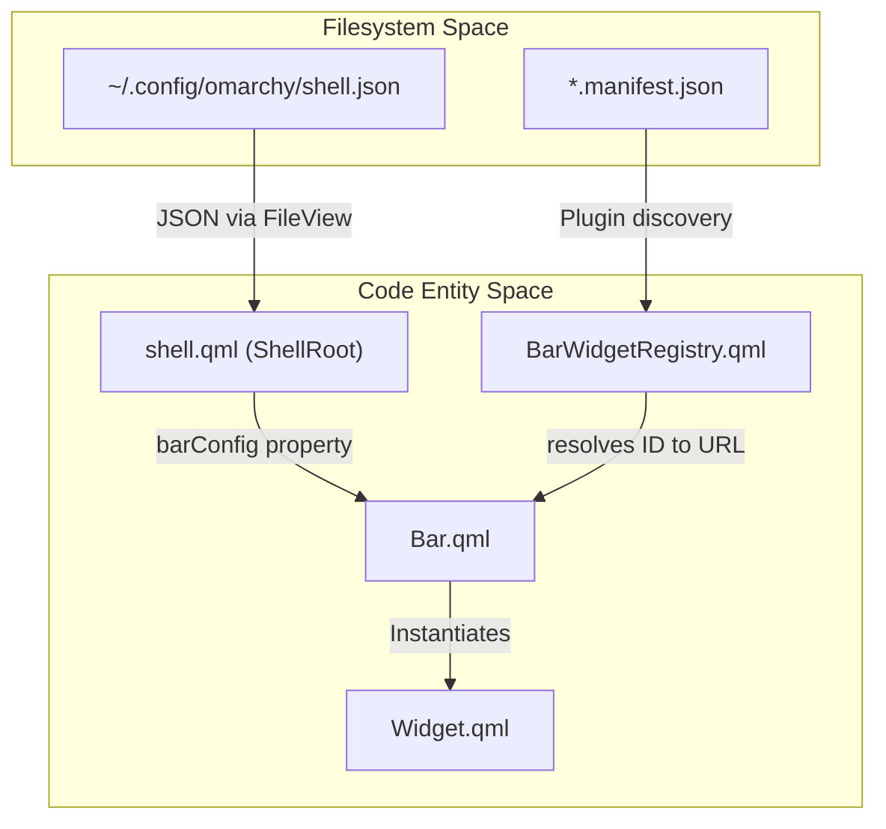
```mermaid
graph TD
    subgraph "Filesystem Space"
        Config["~/.config/omarchy/shell.json"]
        Manifests["*.manifest.json"]
    end

    subgraph "Code Entity Space"
        Host["shell.qml (ShellRoot)"]
        Registry["BarWidgetRegistry.qml"]
        BarEngine["Bar.qml"]
        Widget["Widget.qml"]
    end

    Config -->|"JSON via FileView"| Host
    Host -->|"barConfig property"| BarEngine
    Manifests -->|"Plugin discovery"| Registry
    Registry -->|"resolves ID to URL"| BarEngine
    BarEngine -->|"Instantiates"| Widget
```

Sources: [shell/shell.qml:115-139](), [shell/plugins/bar/Bar.qml:17-22](), [shell/plugins/bar/README.md:8-12]()

## Module Management and Interactivity

Unlike static bars, the Omarchy bar supports direct manipulation:
*   **Reordering**: Widgets can be dragged to new positions within or between sections [shell/plugins/bar/README.md:19-19]().
*   **Positioning**: Dragging empty bar space moves the bar to a different screen edge [shell/plugins/bar/README.md:19-19]().
*   **Transparency**: Double-clicking empty center-bar space toggles background transparency [shell/plugins/bar/README.md:19-19]().

### Custom Modules
The engine supports three types of modules:
1.  **First-party Widgets**: Built-in QML components (e.g., `omarchy.clock`).
2.  **Command Modules**: Shell-driven output using `type: "command"`. These can return Waybar-style JSON (`{"text": "...", "class": "..."}`) [shell/plugins/bar/README.md:85-106]().
3.  **Custom QML Modules**: User-provided QML files using `type: "qml"` [shell/plugins/bar/README.md:108-125]().

Sources: [shell/plugins/bar/README.md:15-20](), [shell/plugins/bar/README.md:81-125]()

## Core Module Catalog

| ID | Functionality | Interactions |
|:--- |:--- |:--- |
| `omarchy.workspaces` | Hyprland workspace switcher | Left: Focus workspace [shell/plugins/bar/README.md:58-58]() |
| `omarchy.clock` | Time/Date displaying month grid | Left: Popup; Right: Cycle format [shell/plugins/bar/README.md:59-59]() |
| `omarchy.media` | MPRIS controls and track info | Left: Play/Pause; Scroll: Track skip [shell/plugins/bar/README.md:60-60]() |
| `omarchy.indicators` | Manual state indicators | Loads items from `indicators/` [shell/plugins/bar/README.md:61-61]() |
| `omarchy.tray` | SNI System Tray | Hover: Reveal drawer; Right: Manage [shell/plugins/bar/README.md:63-63]() |
| `omarchy.audio` | Volume and device management | Left: Open Panel; Scroll: Master vol [shell/plugins/bar/README.md:67-67]() |

### System Indicators
The `omarchy.indicators` widget serves as a container for specialized status icons [shell/plugins/bar/widgets/Indicators.qml:7-11]().
*   **Default Indicators**: Dictation, Screen Recording, Reminder, NightLight, DND, and StayAwake [shell/plugins/bar/widgets/Indicators.qml:11-11]().
*   **Visibility Logic**: Indicators are hidden by default and revealed when active or when the bar is hovered [shell/plugins/bar/widgets/Indicators.qml:18-18]().

**Indicator/Service Integration**

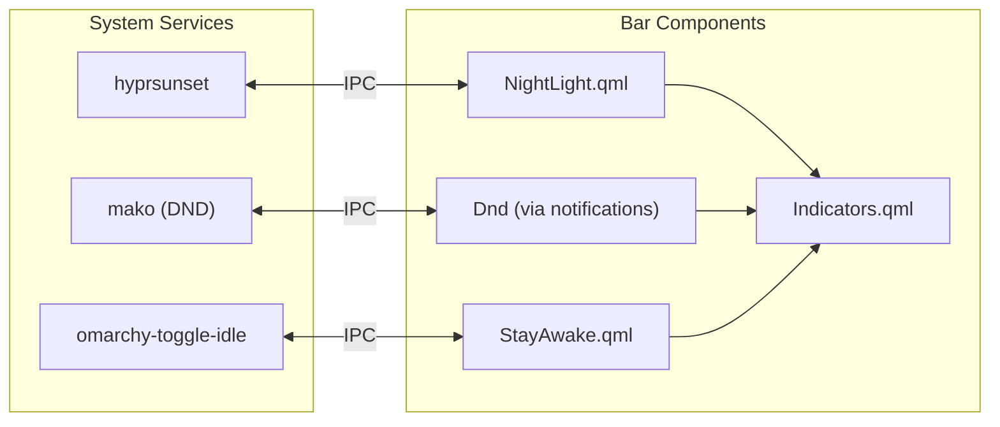
```mermaid
graph LR
    subgraph "System Services"
        Hyprsunset["hyprsunset"]
        Mako["mako (DND)"]
        IdleSvc["omarchy-toggle-idle"]
    end

    subgraph "Bar Components"
        NightLight["NightLight.qml"]
        Dnd["Dnd (via notifications)"]
        StayAwake["StayAwake.qml"]
        IndContainer["Indicators.qml"]
    end

    Hyprsunset <-->|"IPC"| NightLight
    Mako <-->|"IPC"| Dnd
    IdleSvc <-->|"IPC"| StayAwake
    NightLight --> IndContainer
    Dnd --> IndContainer
    StayAwake --> IndContainer
```

Sources: [shell/plugins/bar/widgets/Indicators.qml:11-18](), [bin/omarchy-toggle-nightlight:37-40](), [shell/plugins/bar/README.md:75-75]()

## Implementation Details

### Bar Geometry and Hiding
The bar uses a "parking" mechanism for hiding rather than unmapping. When `barHidden` is true, the surface is moved off-screen by `-root.barSize` while maintaining its mapped status [test/shell.d/bar-test.sh:48-64](). This ensures that revealing the bar is instantaneous (~12ms) compared to a full rebuild (~150ms) [test/shell.d/bar-test.sh:48-50]().

### Theming and Fonts
*   **Colors**: Bound to the `Color` singleton; the bar tracks sections in `shell.toml` [shell/plugins/bar/Bar.qml:63-72]().
*   **Fonts**: Resolves via fontconfig using the `Style.font.family` (defaults to `monospace`). Changing the system font via `omarchy-font-set` updates the bar live without re-rendering [shell/plugins/bar/Bar.qml:59-62]().
*   **Animation**: Theme color transitions use a 420ms `ColorAnimation` with `InOutCubic` easing [shell/plugins/bar/Bar.qml:74-76]().

### IPC Contract
The bar is managed via the `shell` IPC target in `omarchy-shell` [docs/omarchy-shell.md:101-105]().

| Method | Effect | Source |
|:--- |:--- |:--- |
| `toggleBarTransparency` | Flips background solid/transparent | [docs/omarchy-shell.md:118-118]() |
| `putBarWidget` | Places a widget only if absent | [docs/omarchy-shell.md:121-121]() |
| `moveBarWidget` | Relocates an existing widget | [docs/omarchy-shell.md:122-122]() |
| `debugBarGeometry` | Dumps module positions and visibility | [docs/omarchy-shell.md:126-126]() |

Sources: [shell/plugins/bar/Bar.qml:59-76](), [test/shell.d/bar-test.sh:48-64](), [docs/omarchy-shell.md:101-126]()

---


# Page: 3.3 Walker Application Launcher

# Walker Application Launcher

<details>
<summary>Relevant source files</summary>

The following files were used as context for generating this wiki page:

- [bin/omarchy-clipboard-open](bin/omarchy-clipboard-open)
- [bin/omarchy-clipboard-paste-file](bin/omarchy-clipboard-paste-file)
- [bin/omarchy-clipboard-paste-text](bin/omarchy-clipboard-paste-text)
- [bin/omarchy-install-and-launch](bin/omarchy-install-and-launch)
- [bin/omarchy-install-editor-emacs](bin/omarchy-install-editor-emacs)
- [bin/omarchy-install-editor-vscode](bin/omarchy-install-editor-vscode)
- [bin/omarchy-install-editor-zed](bin/omarchy-install-editor-zed)
- [bin/omarchy-install-gaming-heroic](bin/omarchy-install-gaming-heroic)
- [bin/omarchy-install-gaming-steam](bin/omarchy-install-gaming-steam)
- [bin/omarchy-menu-emoji-insert](bin/omarchy-menu-emoji-insert)
- [bin/omarchy-reminder](bin/omarchy-reminder)
- [bin/omarchy-remove-gaming-heroic](bin/omarchy-remove-gaming-heroic)
- [bin/omarchy-remove-security-sshd](bin/omarchy-remove-security-sshd)
- [bin/omarchy-setup-security-sshd](bin/omarchy-setup-security-sshd)
- [bin/omarchy-system-stats](bin/omarchy-system-stats)
- [shell/plugins/bar/indicators/Reminder.qml](shell/plugins/bar/indicators/Reminder.qml)
- [shell/plugins/clipboard/Clipboard.qml](shell/plugins/clipboard/Clipboard.qml)
- [shell/plugins/clipboard/ClipboardHistory.js](shell/plugins/clipboard/ClipboardHistory.js)
- [shell/plugins/clipboard/capture.sh](shell/plugins/clipboard/capture.sh)
- [shell/plugins/emojis/Emojis.qml](shell/plugins/emojis/Emojis.qml)
- [shell/plugins/image-picker/list.sh](shell/plugins/image-picker/list.sh)
- [shell/plugins/reminders/ReminderFlow.qml](shell/plugins/reminders/ReminderFlow.qml)
- [shell/services/AppLibrary.qml](shell/services/AppLibrary.qml)
- [test/shell.d/app-search-test.sh](test/shell.d/app-search-test.sh)
- [test/shell.d/clipboard-test.sh](test/shell.d/clipboard-test.sh)
- [test/shell.d/desktop-entry-launch-test.sh](test/shell.d/desktop-entry-launch-test.sh)
- [test/shell.d/emojis-test.sh](test/shell.d/emojis-test.sh)

</details>


Walker is the universal launcher and selector application in Omarchy. It serves as the primary application launcher, clipboard manager, theme/background selector, and dmenu replacement for interactive menus.

## Overview

Walker provides multiple interaction modes. In Omarchy, it is configured to stay in keyboard focus and supports selection wrapping to ensure a fluid keyboard-driven workflow.

| Mode | Purpose | Access Method | Provider |
|------|---------|---------------|----------|
| Application Launcher | Search and launch installed applications | `SUPER + SPACE` | `AppLibrary.qml` |
| Clipboard Manager | Browse and select clipboard history | `SUPER + CTRL + V` | `Clipboard.qml` |
| Emoji Picker | Insert symbols and emojis | `SUPER + CTRL + E` | `Emojis.qml` |
| Theme Selector | Interactive theme preview and selection | Via menu system | `omarchy-theme-switcher` |
| Background Selector | Browse and select wallpapers | `SUPER + CTRL + SPACE` | `omarchy-menu-images` |

**Sources:** [shell/services/AppLibrary.qml:11-34](), [shell/plugins/clipboard/Clipboard.qml:9-40](), [shell/plugins/emojis/Emojis.qml:9-43]().

## Clipboard Management

The clipboard system in Omarchy is a sophisticated Quickshell plugin that provides persistent history, image previews, and smart content handling.

### Data Flow and Persistence
The clipboard manager monitors the Wayland clipboard using `wl-paste` via a capture script [shell/plugins/clipboard/Clipboard.qml:166-172](). History is stored as a JSON array at `~/.local/state/omarchy/clipboard-history.json` [shell/plugins/clipboard/Clipboard.qml:20-20]().

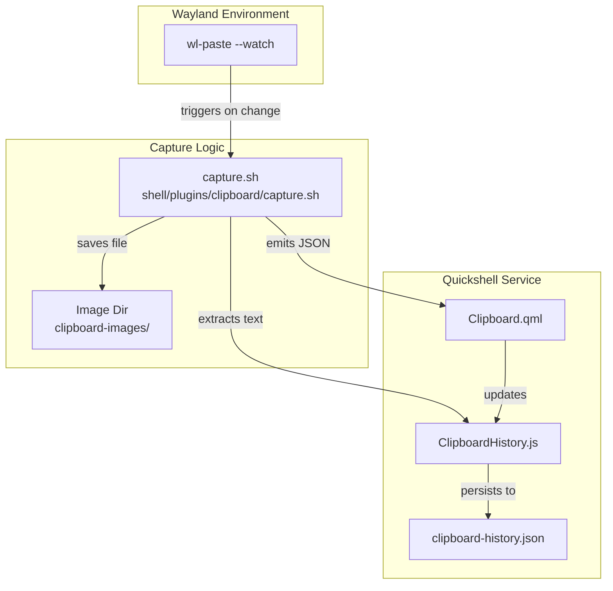
```mermaid
graph TD
    subgraph "Wayland Environment"
        WLP["wl-paste --watch"]
    end

    subgraph "Capture Logic"
        CS["capture.sh<br/>shell/plugins/clipboard/capture.sh"]
        IMG["Image Dir<br/>clipboard-images/"]
    end

    subgraph "Quickshell Service"
        CQML["Clipboard.qml"]
        CHJS["ClipboardHistory.js"]
        JSON["clipboard-history.json"]
    end

    WLP -->|"triggers on change"| CS
    CS -->|"extracts text"| CHJS
    CS -->|"saves file"| IMG
    CS -->|"emits JSON"| CQML
    CQML -->|"updates"| CHJS
    CHJS -->|"persists to"| JSON
```
**Sources:** [shell/plugins/clipboard/Clipboard.qml:20-21](), [shell/plugins/clipboard/capture.sh:1-43](), [shell/plugins/clipboard/ClipboardHistory.js:35-49]().

### Content Normalization
The `ClipboardHistory.js` library handles the transformation of raw clipboard data into structured entries. It specifically identifies:
- **Text**: Trimmed and stored as `text` type [shell/plugins/clipboard/ClipboardHistory.js:2-3]().
- **Images**: Saved to disk with a SHA256 hash filename to avoid duplicates [shell/plugins/clipboard/capture.sh:33-39]().
- **Files**: Text containing `file://` URIs are parsed and displayed with file-specific previews [shell/plugins/clipboard/ClipboardHistory.js:98-124]().

### Integration Utilities
Omarchy provides binary wrappers for clipboard actions:
- `omarchy-clipboard-paste-text`: Uses `wtype` to simulate typing or `wl-copy` to copy text from history [bin/omarchy-clipboard-paste-text:1-63]().
- `omarchy-clipboard-paste-file`: Handles image/file pasting [bin/omarchy-clipboard-paste-file:1-33]().
- `omarchy-clipboard-open`: Intelligently opens history items (URLs in browser, text in editor, images in `tensaku-edit`) [bin/omarchy-clipboard-open:1-70]().

## Application Launcher Architecture

The application launcher is powered by `AppLibrary.qml`, which acts as a centralized service for searching, launching, and managing desktop entries.

### Entity Association Diagram

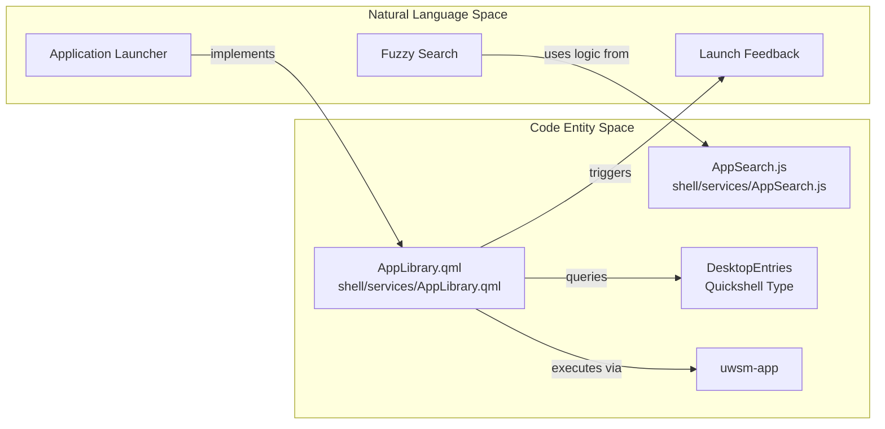
```mermaid
graph LR
    subgraph "Natural Language Space"
        Launcher["Application Launcher"]
        Search["Fuzzy Search"]
        Feedback["Launch Feedback"]
    end

    subgraph "Code Entity Space"
        AL["AppLibrary.qml<br/>shell/services/AppLibrary.qml"]
        AS["AppSearch.js<br/>shell/services/AppSearch.js"]
        DE["DesktopEntries<br/>Quickshell Type"]
        UWSM["uwsm-app"]
    end

    Launcher -- "implements" --> AL
    Search -- "uses logic from" --> AS
    AL -- "queries" --> DE
    AL -- "executes via" --> UWSM
    AL -- "triggers" --> Feedback
```
**Sources:** [shell/services/AppLibrary.qml:11-34](), [shell/services/AppSearch.js:1-10](), [shell/services/AppLibrary.qml:77-86]().

### Launch Mechanism
Applications are launched using `uwsm-app -- gtk-launch` [shell/services/AppLibrary.qml:85-85](). This ensures that applications are started in their own CGroup scope under `app-graphical.slice`, preventing them from inheriting the environment of the Wayland compositor service [shell/services/AppLibrary.qml:81-83]().

### Icon Management
Because the Qt icon cache may not re-scan after the shell starts, `AppLibrary.qml` implements a manual `iconIndex` [shell/services/AppLibrary.qml:23-24](). It performs a recursive scan of XDG icon directories and `/usr/share/pixmaps`, preferring SVG over PNG and specific `apps/` or `devices/` paths to avoid ambiguous matches [shell/services/AppLibrary.qml:122-148]().

## Emoji and Symbol Selection

The emoji picker (`Emojis.qml`) provides a grid-based interface for searching and inserting Unicode characters.

- **Search Logic**: Uses `EmojiSearch.js` to filter a local `emojis.json` database [shell/plugins/emojis/Emojis.qml:156-159]().
- **Insertion**: Selected emojis are passed to `omarchy-menu-emoji-insert`, which uses `wtype` to insert the character into the active window [shell/plugins/emojis/Emojis.qml:148-152]().
- **UI Consistency**: The picker shares the same `Color.menu` tokens as the main menu system for visual consistency [shell/plugins/emojis/Emojis.qml:23-32]().

**Sources:** [shell/plugins/emojis/Emojis.qml:1-152](), [bin/omarchy-menu-emoji-insert:1-10]().

## Specialized Selector Integration

Walker-style functionality is extended through `quickshell` for visual selection tasks.

### Visual Selection Flow
Selectors like the background or theme switcher use a grid of images.

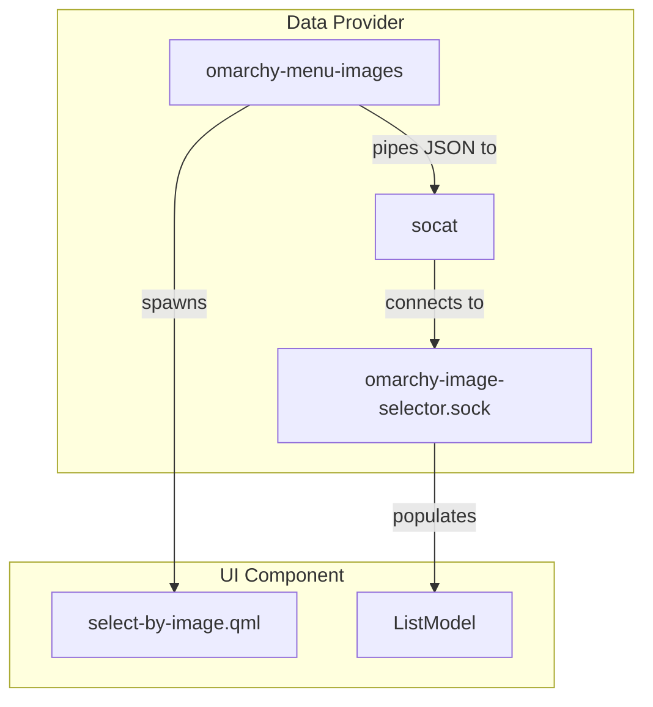
```mermaid
graph TD
    subgraph "UI Component"
        QML["select-by-image.qml"]
        Model["ListModel"]
    end

    subgraph "Data Provider"
        Bin["omarchy-menu-images"]
        Socat["socat"]
        Socket["omarchy-image-selector.sock"]
    end

    Bin -->|"spawns"| QML
    Bin -->|"pipes JSON to"| Socat
    Socat -->|"connects to"| Socket
    Socket -->|"populates"| Model
```
**Sources:** [bin/omarchy-menu-images:86-87](), [bin/omarchy-menu-images:254-257]().

### Background Selection
The background selector locates images within the current theme's `backgrounds/` directory [bin/omarchy-theme-bg-next:7-15](). It manages the `~/.config/omarchy/current/background` symlink, which is used by the compositor and other UI elements [bin/omarchy-theme-bg-next:9-47]().

**Sources:** [bin/omarchy-theme-bg-next:1-47](), [bin/omarchy-theme-switcher:45-98]().

---


# Page: 4 Desktop Environment

# Desktop Environment

<details>
<summary>Relevant source files</summary>

The following files were used as context for generating this wiki page:

- [config/hypr/.luarc.json](config/hypr/.luarc.json)
- [config/hypr/autostart.lua](config/hypr/autostart.lua)
- [config/hypr/bindings.lua](config/hypr/bindings.lua)
- [config/hypr/hyprland.lua](config/hypr/hyprland.lua)
- [config/hypr/input.lua](config/hypr/input.lua)
- [config/hypr/monitors.lua](config/hypr/monitors.lua)
- [default/hypr/autostart.lua](default/hypr/autostart.lua)
- [default/hypr/bindings/tiling.lua](default/hypr/bindings/tiling.lua)
- [default/hypr/helpers.lua](default/hypr/helpers.lua)
- [default/hypr/input.lua](default/hypr/input.lua)
- [default/hypr/looknfeel.lua](default/hypr/looknfeel.lua)
- [default/hypr/omarchy.lua](default/hypr/omarchy.lua)
- [default/hypr/qconsole.lua](default/hypr/qconsole.lua)
- [manual/04-navigation.md](manual/04-navigation.md)
- [manual/05-the-top-bar.md](manual/05-the-top-bar.md)
- [manual/07-hotkeys.md](manual/07-hotkeys.md)
- [migrations/1781485962.sh](migrations/1781485962.sh)
- [test/shell.d/hyprland-default-config-test.sh](test/shell.d/hyprland-default-config-test.sh)
- [test/shell.d/hyprland-keyboard-layout-test.sh](test/shell.d/hyprland-keyboard-layout-test.sh)
- [test/shell.d/hyprland-qconsole-test.sh](test/shell.d/hyprland-qconsole-test.sh)

</details>


This document covers the Hyprland compositor configuration and its role as the core of Omarchy's desktop environment. It explains the layered configuration system, window management behavior, and how Hyprland integrates with desktop components.

For detailed information on specific subsystems, see:
- Configuration layering and file structure: [Hyprland Configuration](#4.1)
- Window behavior and visual decorations: [Window Management Rules](#4.2)
- Complete keyboard shortcut reference: [Keybindings Reference](#4.3)
- Terminal screensaver implementation: [Screensaver System](#4.4)

For related desktop components:
- Status bar functionality: [Waybar Status Bar](#3.2)
- Application launcher: [Walker Application Launcher](#3.3)
- Session initialization: [Session Services and Autostart](#2.3)

## Architecture Overview

The Omarchy desktop environment is built on Hyprland, a dynamic tiling Wayland compositor. The system uses a layered configuration approach where default configurations are loaded via Lua and can be overridden by user customizations. The configuration entry point is `~/.config/hypr/hyprland.lua`, which sets up the Lua package path to include both Omarchy defaults and user configurations [config/hypr/hyprland.lua:1-23]().

### Hyprland Configuration Sourcing

Title: Hyprland Configuration Sourcing (Lua-based)
```mermaid
graph TB
    subgraph ["Hyprland Compositor"]
        HyprlandBin["hyprland"]
        HyprlandLua["~/.config/hypr/hyprland.lua"]
    end
    
    subgraph ["Default Layer ($OMARCHY_PATH/default/hypr/)"]
        OmarchyLua["omarchy.lua"]
        AutostartLuaDef["autostart.lua"]
        LookFeelLuaDef["looknfeel.lua"]
        HelpersLua["helpers.lua"]
    end
    
    subgraph ["User Layer (~/.config/hypr/)"]
        MonitorsLua["monitors.lua"]
        InputLua["input.lua"]
        BindingsLua["bindings.lua"]
        LookFeelLua["looknfeel.lua"]
        AutostartLua["autostart.lua"]
    end
    
    HyprlandLua -->|"require line 14"| OmarchyLua
    HyprlandLua -->|"require line 19"| MonitorsLua
    HyprlandLua -->|"require line 20"| InputLua
    HyprlandLua -->|"require line 21"| BindingsLua
    HyprlandLua -->|"require line 22"| LookFeelLua
    HyprlandLua -->|"require line 23"| AutostartLua
    
    OmarchyLua --> HelpersLua
    OmarchyLua --> AutostartLuaDef
    OmarchyLua --> LookFeelLuaDef
    
    HyprlandLua --> HyprlandBin
```

**Sources:** [config/hypr/hyprland.lua:1-24](), [default/hypr/omarchy.lua:1-23](), [default/hypr/helpers.lua:1-154]()

## Configuration System

The desktop environment uses a hierarchy loaded via Lua's `require` system:

| Layer | Location | Purpose | Priority |
|-------|----------|---------|----------|
| **Default** | `$OMARCHY_PATH/default/hypr/` | System-wide defaults, look-and-feel, and `o` / `hl` globals | Lowest |
| **User** | `~/.config/hypr/` | User-specific overrides for monitors, input, and bindings | Highest |

### Configuration Helpers

Omarchy provides a helper library in `default/hypr/helpers.lua` that simplifies common tasks like binding keys with descriptions [default/hypr/helpers.lua:92-106]() and defining window rules [default/hypr/helpers.lua:142-154](). It also handles application launching via `uwsm` [default/hypr/helpers.lua:108-110]().

For details, see [Hyprland Configuration](#4.1).

**Sources:** [default/hypr/helpers.lua:1-154](), [config/hypr/hyprland.lua:4-14]()

## Compositor Execution and Control

Hyprland manages window layouts and dispatches actions. Omarchy extends this with several specialized scripts and Lua-driven behaviors.

### Look and Feel
The default look and feel defines the `dwindle` layout, window gaps (5px in, 10px out), and border colors [default/hypr/looknfeel.lua:7-20](). It also configures complex animations for windows, layers, and workspaces using custom bezier curves like `easeOutQuint` [default/hypr/looknfeel.lua:68-88]().

### Input Management
Input configuration is derived from `/etc/vconsole.conf` to ensure keyboard layouts (like `XKBLAYOUT`) match the system console [default/hypr/input.lua:3-31](). If a non-Latin layout is detected, Omarchy automatically prepends `us` to the layout list to ensure core shortcuts remain functional [default/hypr/input.lua:43-48]().

### Quake Console (Scratchpad)
Omarchy implements a "Quake-style" console using a special workspace (`special:scratchpad`). It features a dimmed overlay (`dim_special = 0.6`) and is dynamically sized to cover a specific share of the screen, typically 50% [default/hypr/qconsole.lua:5-24]().

**Sources:** [default/hypr/looknfeel.lua:1-125](), [default/hypr/input.lua:1-75](), [default/hypr/qconsole.lua:1-88]()

## Keybindings and User Interaction

Keybindings are categorized into media, clipboard, tiling, and utilities. Omarchy uses a custom `o.bind` helper that associates bindings with descriptions for the `omarchy-menu-keybindings` display system [default/hypr/helpers.lua:92-97]().

### Interaction Flow

Title: Input Event to Omarchy Utility Mapping
```mermaid
graph LR
    subgraph ["User Input"]
        Keypress["Key Combo"]
        MouseScroll["SUPER + Mouse Scroll"]
    end

    subgraph ["Hyprland / Lua Bindings"]
        o_bind["o.bind (helpers.lua)"]
        hl_dsp["hl.dsp (Dispatcher)"]
    end

    subgraph ["Omarchy Actions"]
        OWorkspace["Switch Workspace"]
        OAgent["omarchy-agent (Scratchpad)"]
        OMenu["omarchy-menu toggle root"]
    end

    Keypress --> o_bind
    MouseScroll -->|"SUPER + mouse_down"| hl_dsp
    
    o_bind -->|"SUPER + S"| OAgent
    o_bind -->|"SUPER + SPACE"| OMenu
    hl_dsp --> OWorkspace
```

For a complete reference of all available keybindings, see [Keybindings Reference](#4.3).

**Sources:** [default/hypr/bindings/tiling.lua:1-97](), [config/hypr/bindings.lua:1-29](), [default/hypr/helpers.lua:92-106]()

## Window Management and Rules

Window behavior is defined using the `o.window` helper, which allows matching applications by class or other properties to apply rules like floating, workspace pinning, or specific touchpad scroll factors [default/hypr/helpers.lua:142-154](). For example, terminal emulators like Alacritty are given a specific `scroll_touchpad` factor for better navigation [default/hypr/input.lua:78-79]().

For details, see [Window Management Rules](#4.2).

**Sources:** [default/hypr/helpers.lua:142-154](), [default/hypr/input.lua:77-79](), [default/hypr/omarchy.lua:20-20]()

## Screensaver and Security

The desktop environment integrates `hyprlock` for session locking and `hypridle` for power management. A specialized screensaver system based on TTE (Terminal Teletype) is also available, often launched via `omarchy-launch-screensaver`.

For details, see [Screensaver System](#4.4).

**Sources:** [default/hypr/autostart.lua:1-14](), [default/hypr/looknfeel.lua:112-114]()

---


# Page: 4.1 Hyprland Configuration

# Hyprland Configuration

<details>
<summary>Relevant source files</summary>

The following files were used as context for generating this wiki page:

- [bin/omarchy-channel-current](bin/omarchy-channel-current)
- [bin/omarchy-channel-set](bin/omarchy-channel-set)
- [bin/omarchy-dev-link](bin/omarchy-dev-link)
- [bin/omarchy-dev-pkg-test](bin/omarchy-dev-pkg-test)
- [bin/omarchy-dev-status](bin/omarchy-dev-status)
- [bin/omarchy-dev-unlink](bin/omarchy-dev-unlink)
- [bin/omarchy-version-channel](bin/omarchy-version-channel)
- [bin/omarchy-version-pkgs](bin/omarchy-version-pkgs)
- [config/hypr/.luarc.json](config/hypr/.luarc.json)
- [config/hypr/autostart.lua](config/hypr/autostart.lua)
- [config/hypr/bindings.lua](config/hypr/bindings.lua)
- [config/hypr/hyprland.lua](config/hypr/hyprland.lua)
- [config/hypr/input.lua](config/hypr/input.lua)
- [config/hypr/monitors.lua](config/hypr/monitors.lua)
- [default/hypr/autostart.lua](default/hypr/autostart.lua)
- [default/hypr/bindings/tiling.lua](default/hypr/bindings/tiling.lua)
- [default/hypr/bootstrap.lua](default/hypr/bootstrap.lua)
- [default/hypr/helpers.lua](default/hypr/helpers.lua)
- [default/hypr/input.lua](default/hypr/input.lua)
- [default/hypr/looknfeel.lua](default/hypr/looknfeel.lua)
- [default/hypr/omarchy.lua](default/hypr/omarchy.lua)
- [default/hypr/paths.lua](default/hypr/paths.lua)
- [default/hypr/qconsole.lua](default/hypr/qconsole.lua)
- [manual/04-navigation.md](manual/04-navigation.md)
- [manual/05-the-top-bar.md](manual/05-the-top-bar.md)
- [manual/07-hotkeys.md](manual/07-hotkeys.md)
- [migrations/1781063758.sh](migrations/1781063758.sh)
- [migrations/1781485962.sh](migrations/1781485962.sh)
- [test/shell.d/channel-test.sh](test/shell.d/channel-test.sh)
- [test/shell.d/dev-link-test.sh](test/shell.d/dev-link-test.sh)
- [test/shell.d/dev-unlink-test.sh](test/shell.d/dev-unlink-test.sh)
- [test/shell.d/hyprland-default-config-test.sh](test/shell.d/hyprland-default-config-test.sh)
- [test/shell.d/hyprland-keyboard-layout-test.sh](test/shell.d/hyprland-keyboard-layout-test.sh)
- [test/shell.d/hyprland-qconsole-test.sh](test/shell.d/hyprland-qconsole-test.sh)

</details>


## Purpose and Scope

This page documents Omarchy's layered Hyprland configuration system, explaining how configuration files are organized, sourced, and override each other. It covers the configuration architecture, the transition to a Lua-based configuration environment, and the relationship between default settings, themes, and user customizations.

For specific configuration topics, see:
- Window rules, animations, and visual decorations: [Window Management Rules](#4.2)
- Complete keybinding reference: [Keybindings Reference](#4.3)
- Screensaver configuration and idle management: [Screensaver System](#4.4)
- Autostart services and session initialization: [Session Services and Autostart](#2.3)

## Configuration Architecture

Omarchy utilizes a three-layer configuration system primarily driven by Lua. This architecture allows for dynamic logic, theme switching, and user customization without modifying core system files. The entry point for the compositor configuration is `~/.config/hypr/hyprland.lua`.

### Configuration Layer Diagram

```mermaid
graph TB
    subgraph Entry["Entry Point"]
        MainLua["~/.config/hypr/hyprland.lua"]
    end
    
    subgraph Layer1["Layer 1: Default Configuration (Read-Only)"]
        DefaultOmarchy["default.hypr.omarchy"]
        DefaultHelpers["default.hypr.helpers"]
        DefaultBindings["default.hypr.bindings.*"]
    end
    
    subgraph Layer2["Layer 2: Theme Configuration"]
        ThemeConf["omarchy.current.theme.hyprland"]
    end
    
    subgraph Layer3["Layer 3: User Overrides (Mutable)"]
        UserMonitors["hypr.monitors"]
        UserInput["hypr.input"]
        UserBindings["hypr.bindings"]
        UserLook["hypr.looknfeel"]
        UserAutostart["hypr.autostart"]
    end
    
    MainLua --> DefaultOmarchy
    MainLua --> UserMonitors
    MainLua --> UserInput
    MainLua --> UserBindings
    MainLua --> UserLook
    MainLua --> UserAutostart
    
    DefaultOmarchy --> DefaultHelpers
    DefaultOmarchy --> DefaultBindings
    DefaultOmarchy -.-> ThemeConf
    
    note1["Loaded via require()<br/>Sets system defaults"]
    note2["Loaded via require_optional<br/>Theme styling"]
    note3["User-editable Lua files<br/>Final authority"]
    
    Layer1 -.-> note1
    Layer2 -.-> note2
    Layer3 -.-> note3
```
**Sources:** [config/hypr/hyprland.lua:1-25](), [default/hypr/omarchy.lua:1-23](), [default/hypr/helpers.lua:1-4]()

### Lua Module Sourcing
The system configures the Lua `package.path` to search for modules in the user's home directory (`~/.config/?.lua`) and the Omarchy system path (`$OMARCHY_PATH/?.lua`) [test/shell.d/hyprland-default-config-test.sh:12-12](). This enables the `require()` syntax to load either local user overrides or system defaults.

| Layer | Location | Purpose | Can Override |
|-------|----------|---------|--------------|
| 1. Defaults | `$OMARCHY_PATH/default/hypr/` | System baseline configuration and helper functions | None |
| 2. Theme | `~/.config/omarchy/current/theme/` | Theme-specific colors and visual variables | Defaults |
| 3. User | `~/.config/hypr/` | Personal customizations and application bindings | Defaults + Theme |

**Sources:** [default/hypr/omarchy.lua:1-23](), [test/shell.d/hyprland-default-config-test.sh:11-12]()

## Key Configuration Entities

Omarchy provides a helper object `o` and uses the `hl` (Hyprland) global to interface with the compositor.

### Binding Helpers
The `o.bind` function abstracts complex `uwsm` and `omarchy-launch` commands into simple Lua calls.

| Helper Function | Purpose | Implementation |
|-----------------|---------|----------------|
| `o.bind(keys, desc, dispatcher)` | General keybinding | Wraps `hl.bind` and handles command quoting [default/hypr/helpers.lua:92-106]() |
| `o.bind_toggle(keys, desc, toggle)`| Toggles system states | Executes `omarchy-toggle-<name>` [default/hypr/helpers.lua:134-136]() |
| `o.launch(command)` | Standard app launch | Prepends `uwsm-app --` [default/hypr/helpers.lua:108-110]() |
| `o.window(match, rules)` | Window management | Wraps `hl.window_rule` [default/hypr/helpers.lua:142-154]() |

**Sources:** [default/hypr/helpers.lua:1-154]()

### Data Flow: Keybinding to Execution
This diagram traces how a Lua binding definition results in a system command execution.

```mermaid
sequenceDiagram
    participant B as bindings.lua
    participant H as helpers.lua (o.bind)
    participant HL as Hyprland API (hl)
    participant S as System Shell

    B->>H: o.bind("SUPER + RETURN", "Terminal", { focus = "Alacritty", launch = "alacritty" })
    H->>H: command_from({ focus = "Alacritty", launch = "alacritty" })
    Note right of H: Resolves to "omarchy-launch-or-focus 'Alacritty' 'uwsm-app -- alacritty'"
    H->>HL: hl.bind("SUPER + RETURN", hl.dsp.exec_cmd("omarchy-launch-or-focus ..."))
    Note over HL: User presses Keys
    HL->>S: omarchy-launch-or-focus ...
```
**Sources:** [default/hypr/helpers.lua:63-65](), [default/hypr/helpers.lua:99-105](), [default/hypr/helpers.lua:130-132]()

## Default Bindings and Logic

Omarchy defines an extensive set of default bindings in specialized sub-modules within `default/hypr/bindings/`.

### Conditional Bindings
Bindings are often conditional based on the presence of binaries or user settings:
- **Voxtype**: Dictation bindings (`SUPER + CTRL + X`, `F9`) are only registered if the `voxtype` binary is present in the `PATH` [default/hypr/bindings/voxtype.lua:3-4]().
- **Global Toggles**: All Omarchy default bindings can be disabled by setting `omarchy_default_bindings = false` in the user's `hyprland.lua` before the default module is required [default/hypr/omarchy.lua:8-15]().
- **Preinstalled Apps**: Optional web app bindings can be skipped by setting `omarchy_preinstalled_bindings = false` or by the presence of a state file at `~/.local/state/omarchy/preinstalls-removed` [default/hypr/helpers.lua:84-90]().

### Tiling and Workspace Management
Located in `default/hypr/bindings/tiling.lua`, these manage the core layout:
- **Workspaces**: `SUPER + 1-10` for switching, `SUPER + SHIFT + 1-10` for moving windows [default/hypr/bindings/tiling.lua:20-25]().
- **Scratchpad**: `SUPER + S` or `SUPER + grave` toggles the special scratchpad workspace [default/hypr/bindings/tiling.lua:27-30]().
- **Resizing**: `SUPER + code:20/21` (typically `-` and `=`) handles relative window resizing [default/hypr/bindings/tiling.lua:54-67]().

**Sources:** [default/hypr/bindings/tiling.lua:1-97](), [default/hypr/omarchy.lua:1-23](), [default/hypr/helpers.lua:84-90]()

## Development and Channel Management

Omarchy supports different package channels (`stable`, `rc`, `edge`, `dev`) which affect how Hyprland and its environment are sourced.

### Channel Definitions
| Channel | Package Source | `OMARCHY_PATH` |
|---------|----------------|----------------|
| `stable` | `omarchy` package | `/usr/share/omarchy` |
| `rc` | `omarchy` package (rc mirror) | `/usr/share/omarchy` |
| `edge` | `omarchy-dev` package | `/usr/share/omarchy` |
| `dev` | Git checkout | `~/omarchy` (or custom) |

**Sources:** [bin/omarchy-channel-set:48-73](), [bin/omarchy-channel-current:7-13]()

### Dev Linking Implementation
The `dev` channel uses `omarchy-dev-link` to point the system at a local git checkout. This script:
1. Writes `/etc/omarchy.conf` to export the new `OMARCHY_PATH` [bin/omarchy-dev-link:105-109]().
2. Creates a sudoers drop-in at `/etc/sudoers.d/omarchy-dev-path` to ensure `sudo omarchy-*` calls use the checkout's `bin/` directory [bin/omarchy-dev-link:111-111]().

**Sources:** [bin/omarchy-dev-link:23-45](), [bin/omarchy-dev-link:105-111]()

## Look and Feel Defaults

Visual defaults are defined in `default/hypr/looknfeel.lua`, setting the baseline for gaps, borders, and animations.

- **Layout**: Uses the `dwindle` layout by default [default/hypr/looknfeel.lua:19-19]().
- **Borders**: Active borders use a gradient from `rgba(33ccffee)` to `rgba(00ff99ee)` [default/hypr/looknfeel.lua:3-3]().
- **Animations**: Defines custom bezier curves like `easeOutQuint` and `almostLinear` for window and layer transitions [default/hypr/looknfeel.lua:68-87]().

**Sources:** [default/hypr/looknfeel.lua:1-125]()

---


# Page: 4.2 Window Management Rules

# Window Management Rules

<details>
<summary>Relevant source files</summary>

The following files were used as context for generating this wiki page:

- [bin/omarchy-hyprland-toggle](bin/omarchy-hyprland-toggle)
- [bin/omarchy-hyprland-toggle-disabled](bin/omarchy-hyprland-toggle-disabled)
- [bin/omarchy-hyprland-toggle-enabled](bin/omarchy-hyprland-toggle-enabled)
- [bin/omarchy-hyprland-window-gaps-toggle](bin/omarchy-hyprland-window-gaps-toggle)
- [bin/omarchy-hyprland-window-single-square-aspect-toggle](bin/omarchy-hyprland-window-single-square-aspect-toggle)
- [bin/omarchy-launch-about](bin/omarchy-launch-about)
- [bin/omarchy-launch-editor](bin/omarchy-launch-editor)
- [bin/omarchy-launch-or-focus](bin/omarchy-launch-or-focus)
- [bin/omarchy-launch-or-focus-tui](bin/omarchy-launch-or-focus-tui)
- [bin/omarchy-launch-or-focus-webapp](bin/omarchy-launch-or-focus-webapp)
- [bin/omarchy-launch-tui](bin/omarchy-launch-tui)
- [bin/omarchy-menu-clipboard](bin/omarchy-menu-clipboard)
- [default/hypr/apps/omarchy-shell.lua](default/hypr/apps/omarchy-shell.lua)
- [default/hypr/apps/system.lua](default/hypr/apps/system.lua)
- [default/hypr/apps/terminals.lua](default/hypr/apps/terminals.lua)
- [default/hypr/bindings/clipboard.lua](default/hypr/bindings/clipboard.lua)
- [default/hypr/windows.lua](default/hypr/windows.lua)
- [etc/fastfetch/config.jsonc](etc/fastfetch/config.jsonc)
- [migrations/1785637426.sh](migrations/1785637426.sh)
- [shell/plugins/clipboard/manifest.json](shell/plugins/clipboard/manifest.json)
- [themes/kanagawa/hyprland.lua](themes/kanagawa/hyprland.lua)
- [themes/lumon/hyprland.lua](themes/lumon/hyprland.lua)
- [themes/retro-82/hyprland.lua](themes/retro-82/hyprland.lua)

</details>


This document explains Omarchy's window rule system, layer rules, and visual styling configuration. It covers how windows are automatically configured based on their application class and title, how special UI layers (like the Omarchy Quickshell) are managed, and how visual decorations and behaviors are controlled via Lua-based configuration helpers.

For keybinding configuration, see [Keybindings Reference](). For the overall Hyprland configuration structure, see [Hyprland Configuration]().

## Window Rule Architecture

Omarchy utilizes a Lua-based configuration system for Hyprland, abstracting complex window rules into a helper function `o.window`. This system allows for modular rules that are easy to read and maintain. The configuration is layered, starting from global defaults and moving to app-specific overrides.

### Data Flow and Rule Processing

```mermaid
graph TD
    WINDOWS_LUA["default/hypr/windows.lua"]
    APPS_DIR["default/hypr/apps/"]
    SYSTEM_LUA["default/hypr/apps/system.lua"]
    SHELL_LUA["default/hypr/apps/omarchy-shell.lua"]
    TERM_LUA["default/hypr/apps/terminals.lua"]
    
    subgraph "Rule Definition Logic"
        O_WINDOW["o.window(match, rules)"]
        HL_RULE["hl.window_rule(rules)"]
    end
    
    WINDOWS_LUA -->|"require"| APPS_DIR
    APPS_DIR --> SYSTEM_LUA
    APPS_DIR --> SHELL_LUA
    APPS_DIR --> TERM_LUA
    SYSTEM_LUA -->|"calls"| O_WINDOW
    SHELL_LUA -->|"calls"| O_WINDOW
    O_WINDOW -->|"transforms & calls"| HL_RULE
```

**Sources:** [default/hypr/windows.lua:21-22](), [default/hypr/apps/system.lua:1-57](), [default/hypr/apps/omarchy-shell.lua:1-14]()

## The `o.window` Helper

The `o.window` function simplifies the application of rules to specific window classes or properties. It handles string matches for classes automatically and allows for complex table-based matching.

| Parameter | Type | Description |
|-----------|------|-------------|
| `match` | `string` or `table` | If string, matches `window.class`. If table, matches provided keys (e.g., `title`, `tag`). |
| `rules` | `table` | Hyprland window rules (e.g., `float`, `opacity`, `maximize`, `tag`). |

**Implementation Detail:**
The function ensures the `rules.match` table exists and assigns the `match` string to `rules.match.class` if a string is provided. It also supports dynamic tagging, where adding a tag (e.g., `+terminal`) marks a window for specific group behaviors [default/hypr/apps/terminals.lua:5-8]().

**Sources:** [default/hypr/apps/system.lua:1-11](), [default/hypr/apps/terminals.lua:1-8]()

## Floating and Special Window Behaviors

Omarchy defines a set of default behaviors for specific types of windows, such as file pickers, media players, and system dialogs.

### Floating Windows
Windows tagged with `floating-window` are automatically centered and sized to `875x600` [default/hypr/apps/system.lua:2-4](). 
*   **System Tools:** `btop`, `imv`, `mpv`, and `NautilusPreviewer` are forced into floating mode [default/hypr/apps/system.lua:6-11]().
*   **Dialogs:** `xdg-desktop-portal-gtk` and various "Open/Save" dialogs from Sublime Text or GNOME Nautilus are automatically floated [default/hypr/apps/system.lua:13-20]().

### Opacity and Transparency
By default, all windows receive a default opacity of `0.985` (active) and `0.96` (inactive) [default/hypr/windows.lua:6-25]().
*   **Media Override:** Media-heavy applications (Zoom, VLC, Kdenlive, OBS, Pinta) opt out of transparency using the `-default-opacity` tag and are forced to `1.0` opacity [default/hypr/apps/system.lua:40-51]().

**Sources:** [default/hypr/apps/system.lua:1-51](), [default/hypr/windows.lua:1-25]()

## Omarchy Quickshell Layer Rules

The Omarchy Quickshell components (bar, menu, clipboard) use `layer-shell` surfaces. To ensure a snappy feel, specific namespaces are configured to skip compositor-level animations.

| Namespace | Rule | Purpose |
|-----------|------|---------|
| `omarchy-bar` | `no_anim = true` | Instant visibility for the status bar [default/hypr/apps/omarchy-shell.lua:5](). |
| `omarchy-menu` | `no_anim = true` | Prevents fade/slide on the main menu [default/hypr/apps/omarchy-shell.lua:10](). |
| `omarchy-clipboard` | `no_anim = true` | Instant pop-up for the clipboard manager [default/hypr/apps/omarchy-shell.lua:10](). |

**Sources:** [default/hypr/apps/omarchy-shell.lua:1-14]()

## Launch and Focus Logic

Omarchy uses a suite of helper binaries to manage how applications are instantiated or brought to the foreground.

```mermaid
graph LR
    USER["User Action"]
    BIND["o.bind (SUPER+V)"]
    LAUNCH_FOCUS["omarchy-launch-or-focus"]
    HYPR_CLIENTS["hyprctl clients -j"]
    JQ["jq filter"]
    UWSM["uwsm-app --"]

    USER --> BIND
    BIND --> LAUNCH_FOCUS
    LAUNCH_FOCUS --> HYPR_CLIENTS
    HYPR_CLIENTS --> JQ
    JQ -->|"Found Address"| FOCUS["hyprctl dispatch focuswindow"]
    JQ -->|"Not Found"| UWSM
```

*   **`omarchy-launch-or-focus`**: Checks if a window matching a pattern exists using `hyprctl clients -j`. If found, it focuses the existing window; otherwise, it launches a new instance via `uwsm` [bin/omarchy-launch-or-focus:11-19]().
*   **`omarchy-launch-about`**: A specialized launcher for the "About" TUI. It measures the content (logo + system info), calculates the required terminal grid size, and applies a temporary Hyprland window rule via `hyprctl eval` so the window maps at the perfect size [bin/omarchy-launch-about:50-75]().

**Sources:** [bin/omarchy-launch-or-focus:1-19](), [bin/omarchy-launch-about:1-181]()

## Universal Clipboard Rules

Omarchy implements a universal clipboard system that handles the differences between standard GUI applications and terminal emulators.

1.  **Terminal Detection:** The system uses the `+terminal` tag defined in `default/hypr/apps/terminals.lua` to identify if the active window is a terminal [default/hypr/bindings/clipboard.lua:20-33]().
2.  **Shortcut Mapping:**
    *   `SUPER + C`: Sends `CTRL + C` to normal windows, but `CTRL + Insert` to terminals [default/hypr/bindings/clipboard.lua:45]().
    *   `SUPER + V`: Sends `CTRL + V` to normal windows, but `SHIFT + Insert` to terminals [default/hypr/bindings/clipboard.lua:46]().
3.  **State Reliability:** To prevent stuck keys in Hyprland's `send_key_state`, the `send_shortcut_once` function explicitly dispatches a "down" state followed by an "up" state after a 50ms delay [default/hypr/bindings/clipboard.lua:8-16]().

**Sources:** [default/hypr/bindings/clipboard.lua:1-48](), [default/hypr/apps/terminals.lua:1-8]()

## Visual and Behavior Toggles

Users can toggle specific Hyprland behaviors dynamically. These scripts modify state by copying/removing Lua fragments in `~/.local/state/omarchy/toggles/hypr/` which are then sourced by the main configuration [bin/omarchy-hyprland-toggle:15-31]().

| Feature | Binary | Keybinding / Action |
|---------|--------|---------------------|
| **Square Aspect** | `omarchy-hyprland-window-single-square-aspect-toggle` | Toggles 1:1 ratio for single windows [bin/omarchy-hyprland-window-single-square-aspect-toggle:5-8](). |
| **Gaps** | `omarchy-hyprland-window-gaps-toggle` | Toggles inner/outer gaps. |
| **Generic Toggle** | `omarchy-hyprland-toggle` | Backend script that reloads Hyprland after applying flags [bin/omarchy-hyprland-toggle:54](). |

**Sources:** [bin/omarchy-hyprland-window-single-square-aspect-toggle:1-8](), [bin/omarchy-hyprland-toggle:1-54]()

---


# Page: 4.3 Keybindings Reference

# Keybindings Reference

<details>
<summary>Relevant source files</summary>

The following files were used as context for generating this wiki page:

- [bin/omarchy](bin/omarchy)
- [bin/omarchy-audio-source-switch](bin/omarchy-audio-source-switch)
- [bin/omarchy-capture-region](bin/omarchy-capture-region)
- [bin/omarchy-install-dev-env](bin/omarchy-install-dev-env)
- [bin/omarchy-launch-1password](bin/omarchy-launch-1password)
- [bin/omarchy-launch-floating-terminal-with-presentation](bin/omarchy-launch-floating-terminal-with-presentation)
- [bin/omarchy-launch-terminal-herdr](bin/omarchy-launch-terminal-herdr)
- [bin/omarchy-menu](bin/omarchy-menu)
- [bin/omarchy-menu-clipboard](bin/omarchy-menu-clipboard)
- [bin/omarchy-menu-keybindings](bin/omarchy-menu-keybindings)
- [default/hypr/apps/terminals.lua](default/hypr/apps/terminals.lua)
- [default/hypr/bindings/applications.lua](default/hypr/bindings/applications.lua)
- [default/hypr/bindings/clipboard.lua](default/hypr/bindings/clipboard.lua)
- [default/hypr/bindings/media.lua](default/hypr/bindings/media.lua)
- [default/hypr/bindings/utilities.lua](default/hypr/bindings/utilities.lua)
- [default/hypr/windows.lua](default/hypr/windows.lua)
- [install/omarchy-base.packages](install/omarchy-base.packages)
- [shell/Commons/Util.qml](shell/Commons/Util.qml)
- [shell/Ui/PanelSeparator.qml](shell/Ui/PanelSeparator.qml)
- [shell/Ui/PanelSlider.qml](shell/Ui/PanelSlider.qml)
- [shell/plugins/clipboard/manifest.json](shell/plugins/clipboard/manifest.json)
- [shell/plugins/osd/Osd.qml](shell/plugins/osd/Osd.qml)
- [shell/plugins/services/media/MediaModel.js](shell/plugins/services/media/MediaModel.js)
- [shell/plugins/services/media/Service.qml](shell/plugins/services/media/Service.qml)
- [shell/plugins/services/media/manifest.json](shell/plugins/services/media/manifest.json)
- [test/shell.d/floating-terminal-test.sh](test/shell.d/floating-terminal-test.sh)
- [test/shell.d/launch-1password-test.sh](test/shell.d/launch-1password-test.sh)
- [test/shell.d/media-test.sh](test/shell.d/media-test.sh)
- [test/shell.d/shell-launch-test.sh](test/shell.d/shell-launch-test.sh)
- [themes/kanagawa/hyprland.lua](themes/kanagawa/hyprland.lua)
- [themes/lumon/hyprland.lua](themes/lumon/hyprland.lua)
- [themes/retro-82/hyprland.lua](themes/retro-82/hyprland.lua)

</details>


This document provides a comprehensive reference of all keyboard shortcuts available in Omarchy. It covers the keybinding system architecture, how bindings are organized and sourced via the Lua configuration layer, and a complete categorized listing of all available shortcuts.

For information about configuring Hyprland more broadly, see [Hyprland Configuration](#4.1). For window management rules and visual behavior, see [Window Management Rules](#4.2).

## Keybinding System Architecture

Omarchy's keybinding system uses a layered configuration approach, allowing default bindings to be overridden by themes and user customizations. The system uses a Lua-based configuration via the `o.bind` helper to provide consistent behavior, descriptive metadata for menus, and automatic `uwsm` integration.

### Logic Flow and Data Mapping

The following diagram maps the relationship between the Natural Language intent of a keybinding and the code entities that process it.

```mermaid
graph TD
    subgraph "Natural Language Space"
        Intent["User Intent<br/>(e.g. 'Take a Screenshot')"]
        BindingDef["Binding Definition<br/>(SUPER + PRINT)"]
    end

    subgraph "Code Entity Space"
        LuaHelper["o.bind() in<br/>default/hypr/helpers.lua"]
        HyprLua["hyprland.lua<br/>Configuration Entry"]
        CaptureScript["omarchy-capture-screenshot<br/>bin/omarchy-capture-screenshot"]
        HyprlandRuntime["Hyprland Compositor<br/>Dispatcher"]
    end

    Intent --> BindingDef
    BindingDef --> LuaHelper
    LuaHelper --> HyprLua
    HyprLua --> HyprlandRuntime
    HyprlandRuntime -- "Executes" --> CaptureScript
```

**Sources:** [default/hypr/bindings/utilities.lua:37](), [bin/omarchy:79](), [bin/omarchy-menu:1-10]()

## Interactive Keybinding Viewer

Omarchy provides an interactive keybinding viewer (`omarchy-menu-keybindings`) that dynamically reads all configured bindings from Hyprland and displays them in a searchable interface.

```mermaid
graph LR
    subgraph "Natural Language"
        Search["Search: 'Volume'"]
    end

    subgraph "Code Entity Space"
        MenuBin["omarchy-menu-keybindings<br/>(Bash Script)"]
        LuaCache["build_lua_bind_cache()<br/>(Lua Scraper)"]
        XKBTool["xkbcli compile-keymap<br/>(Keycode Resolver)"]
        Hyprctl["hyprctl binds -j<br/>(Runtime Data)"]
        Walker["walker --dmenu<br/>(UI Provider)"]
    end

    Search --> Walker
    Walker --> MenuBin
    MenuBin --> Hyprctl
    MenuBin --> LuaCache
    MenuBin --> XKBTool
```

**Sources:** [bin/omarchy-menu-keybindings:1-10](), [bin/omarchy-menu-keybindings:65-235](), [bin/omarchy-menu-keybindings:15-61]()

### Data Flow in `omarchy-menu-keybindings`
1. **Lua Cache Generation**: The script uses an embedded Lua script to parse `~/.config/hypr/hyprland.lua` and its includes. This is necessary because Hyprland's `hyprctl binds` reports Lua-defined dispatchers as `__lua`, losing the original command description [bin/omarchy-menu-keybindings:65-235]().
2. **Keycode Resolution**: Hyprland often reports raw XKB keycodes (e.g., `code:20`). The `parse_keycodes` function uses `xkbcli compile-keymap` to map these back to human-readable symbols like `MINUS` or `EQUAL` [bin/omarchy-menu-keybindings:15-61]().
3. **Display**: The final list is piped into `walker --dmenu` for interactive filtering [bin/omarchy-menu-keybindings:243]().

## Complete Keybinding Reference

### Utilities and Menus
Central command menus and interface controls are primarily defined in `utilities.lua`.

| Keybinding | Description | Command / Implementation |
|:---|:---|:---|
| `SUPER + SPACE` | Omarchy menu | `omarchy-menu toggle` [default/hypr/bindings/utilities.lua:1]() |
| `SUPER + ALT + SPACE` | Apps menu | `omarchy-menu toggle apps` [default/hypr/bindings/utilities.lua:2]() |
| `SUPER + ESCAPE` | System menu | `omarchy-menu toggle system` [default/hypr/bindings/utilities.lua:8]() |
| `SUPER + K` | Keybindings Reference | `omarchy-menu-keybindings` [default/hypr/bindings/utilities.lua:10]() |
| `SUPER + CTRL + C` | Capture menu | `omarchy-menu toggle capture` [default/hypr/bindings/utilities.lua:4]() |
| `SUPER + CTRL + Q` | Calculator | `omacalc` [default/hypr/bindings/utilities.lua:13]() |
| `SUPER + SHIFT + SPACE` | Toggle top bar | `omarchy-shell shell toggle bar` [default/hypr/bindings/utilities.lua:16]() |
| `SUPER + BACKSPACE` | Toggle transparency | `omarchy-hyprland-window-transparency-toggle` [default/hypr/bindings/utilities.lua:19]() |
| `SUPER + CTRL + L` | Lock system | `omarchy-system-lock` [default/hypr/bindings/utilities.lua:126]() |

**Sources:** [default/hypr/bindings/utilities.lua:1-126]()

### Clipboard and Editing
Omarchy implements "Universal Clipboard" shortcuts that adapt based on whether the active window is a terminal.

| Keybinding | Action | Implementation Detail |
|:---|:---|:---|
| `SUPER + C` | Universal copy | Sends `CTRL+C` or `CTRL+Insert` [default/hypr/bindings/clipboard.lua:45]() |
| `SUPER + V` | Universal paste | Sends `CTRL+V` or `SHIFT+Insert` [default/hypr/bindings/clipboard.lua:46]() |
| `SUPER + X` | Universal cut | Sends `CTRL+X` [default/hypr/bindings/clipboard.lua:47]() |
| `SUPER + CTRL + V` | Clipboard manager | `omarchy-shell shell toggle omarchy.clipboard` [default/hypr/bindings/clipboard.lua:48]() |
| `SUPER + comma` | Dismiss notification | `omarchy-shell notifications dismissOne` [default/hypr/bindings/utilities.lua:24]() |

**Sources:** [default/hypr/bindings/clipboard.lua:1-48](), [default/hypr/bindings/utilities.lua:24-28]()

### Media and Hardware Controls
These bindings are often "locked" (active even when the screen is locked) and "repeating".

| Keybinding | Action | Command |
|:---|:---|:---|
| `XF86AudioRaiseVolume` | Volume Up | `omarchy-audio-output-volume raise` [default/hypr/bindings/media.lua:2]() |
| `XF86AudioMute` | Mute Toggle | `omarchy-audio-output-volume mute-toggle` [default/hypr/bindings/media.lua:4]() |
| `XF86MonBrightnessUp` | Brightness Up | `omarchy-brightness-display +5%` [default/hypr/bindings/media.lua:6]() |
| `XF86AudioPlay` | Play/Pause | `omarchy-shell media playPause` [default/hypr/bindings/media.lua:27]() |
| `SUPER + CTRL + N` | Toggle Nightlight | `omarchy-shell shell toggle nightlight` [default/hypr/bindings/utilities.lua:31]() |
| `SUPER + CTRL + I` | Toggle Idle Lock | `omarchy-shell shell toggle idle` [default/hypr/bindings/utilities.lua:30]() |

**Sources:** [default/hypr/bindings/media.lua:1-34](), [default/hypr/bindings/utilities.lua:30-35]()

### Screen Capture
Capture bindings integrate with the OSD and specialized selection logic.

| Keybinding | Action | Implementation |
|:---|:---|:---|
| `PRINT` | Screenshot | `omarchy-capture-screenshot` [default/hypr/bindings/utilities.lua:37]() |
| `ALT + PRINT` | Screen Recording | `omarchy-capture-screenrecording` [default/hypr/bindings/utilities.lua:38]() |
| `SUPER + PRINT` | Color Picker | `hyprpicker -a` [default/hypr/bindings/utilities.lua:41]() |
| `SUPER + CTRL + PRINT` | OCR (Text Extract) | `omarchy-capture-text` [default/hypr/bindings/utilities.lua:42]() |

**Sources:** [default/hypr/bindings/utilities.lua:37-43]()

## Tiling and Window Management
These bindings control the Hyprland compositor layout.

| Keybinding | Action | Command |
|:---|:---|:---|
| `SUPER + W` | Close Window | `closewindow` |
| `SUPER + J` | Toggle Split | `togglesplit` |
| `SUPER + F` | Fullscreen | `fullscreen` |
| `SUPER + T` | Toggle Floating | `togglefloating` |
| `SUPER + Arrows` | Move Focus | `movefocus` |
| `SUPER + SHIFT + Arrows`| Move Window | `movewindow` |

**Sources:** [default/hypr/bindings/utilities.lua:19-21]() (Window toggles), standard Hyprland dispatchers.

## Terminal and Development
Shortcuts for launching development environments and terminal tools.

| Keybinding | Action | Command |
|:---|:---|:---|
| `SUPER + CTRL + T` | System Activity | `btop` (TUI mode) [default/hypr/bindings/utilities.lua:103]() |
| `SUPER + SHIFT + CTRL + A`| AI Agent | `omarchy-agent --pick` [default/hypr/bindings/utilities.lua:96]() |
| `SUPER + ALT + K` | Tmux Bindings | `omarchy-menu-tmux-keybindings` [default/hypr/bindings/utilities.lua:11]() |

**Sources:** [default/hypr/bindings/utilities.lua:96-103](), [bin/omarchy-install-dev-env:1-12]()

---


# Page: 4.4 Screensaver System

# Screensaver System

<details>
<summary>Relevant source files</summary>

The following files were used as context for generating this wiki page:

- [bin/omarchy-debug-idle](bin/omarchy-debug-idle)
- [bin/omarchy-font-list](bin/omarchy-font-list)
- [bin/omarchy-font-set](bin/omarchy-font-set)
- [bin/omarchy-launch-screensaver](bin/omarchy-launch-screensaver)
- [bin/omarchy-refresh-config](bin/omarchy-refresh-config)
- [bin/omarchy-restart-terminal](bin/omarchy-restart-terminal)
- [bin/omarchy-screensaver](bin/omarchy-screensaver)
- [bin/omarchy-system-lock](bin/omarchy-system-lock)
- [bin/omarchy-theme-set](bin/omarchy-theme-set)
- [bin/omarchy-toggle](bin/omarchy-toggle)
- [bin/omarchy-toggle-bar](bin/omarchy-toggle-bar)
- [bin/omarchy-toggle-screensaver](bin/omarchy-toggle-screensaver)
- [bin/omarchy-toggle-suspend](bin/omarchy-toggle-suspend)
- [migrations/1786355450.sh](migrations/1786355450.sh)
- [test/shell.d/refresh-config-test.sh](test/shell.d/refresh-config-test.sh)
- [test/shell.d/system-lock-test.sh](test/shell.d/system-lock-test.sh)

</details>


## Overview

The Screensaver System provides a terminal-based animated screensaver using the Terminal Text Effects (`ttfx`) tool. The system launches fullscreen terminal instances on each monitor, displays random ASCII art animations, and exits on any user input. The screensaver is integrated with the Omarchy shell for automatic activation and can be toggled on/off via a state file mechanism.

**Key Components:**
- `omarchy-launch-screensaver`: Launcher that spawns screensaver per monitor.
- `omarchy-screensaver`: Execution loop that runs `ttfx` animations and monitors exit conditions.
- `omarchy-toggle-screensaver`: Toggle script to enable/disable screensaver availability.
- `org.omarchy.screensaver` window class: Used for Hyprland window rules and focus tracking.
- `~/.config/omarchy/branding/screensaver.txt`: ASCII art content source.

---

## System Architecture

The diagram below maps the screensaver lifecycle from trigger to termination, associating natural language actions with specific code entities.

### Screensaver Lifecycle and Code Entities

```mermaid
graph TB
    subgraph "Trigger Sources"
        Idle["omarchy-shell idle status"]
        Manual["Manual: omarchy-launch-screensaver force"]
    end
    
    subgraph "Launch Logic [omarchy-launch-screensaver]"
        CheckTTE["omarchy-cmd-missing ttfx"]
        CheckRunning["pgrep -f org.omarchy.screensaver"]
        CheckToggle["omarchy-toggle-enabled screensaver-off"]
        GetTerminal["xdg-terminal-exec --print-id"]
        FocusLoop["hypr_focus_monitor loop"]
        ExecTerminal["hypr_exec terminal-specific"]
        WaitWindow["wait_for_screensaver_window"]
    end
    
    subgraph "Animation Loop [omarchy-screensaver]"
        TrapSignals["trap exit_screensaver SIGINT..."]
        SetBG["printf \\033]11;rgb:00/00/00\\007"]
        HideCursor["hyprctl eval cursor:invisible true"]
        WaitResize["wait_for_terminal_resize"]
        TTELoop["while true: ttfx --random-effect"]
        MonitorInput["read -n1 -t 1"]
        CheckFocus["screensaver_in_focus()"]
    end
    
    subgraph "Hyprland Integration"
        WindowClass["class: org.omarchy.screensaver"]
        EventStream["socat .socket2.sock"]
    end
    
    Idle --> CheckTTE
    Manual --> CheckTTE
    
    CheckTTE --> CheckRunning
    CheckRunning --> |"if not running"| CheckToggle
    CheckToggle --> |"if enabled"| GetTerminal
    
    GetTerminal --> FocusLoop
    FocusLoop --> ExecTerminal
    ExecTerminal --> WaitWindow
    WaitWindow --> EventStream
    
    ExecTerminal --> WindowClass
    WindowClass --> TrapSignals
    TrapSignals --> SetBG
    SetBG --> HideCursor
    HideCursor --> WaitResize
    WaitResize --> TTELoop
    
    TTELoop --> MonitorInput
    TTELoop --> CheckFocus
    
    MonitorInput --> |"Keypress"| ExitFunc["exit_screensaver()"]
    CheckFocus --> |"Focus Lost"| ExitFunc
    
    ExitFunc --> |"pkill ttfx"| Cleanup["Restore Cursor"]
```

**Sources:** [bin/omarchy-launch-screensaver:5-75](), [bin/omarchy-screensaver:9-48]()

---

## Launch Process

### Validation and Environment Preparation

The `omarchy-launch-screensaver` script performs several checks before spawning windows:
1. **Binary Check**: Verifies `ttfx` is installed via `omarchy-cmd-missing` [bin/omarchy-launch-screensaver:5-7]().
2. **Instance Check**: Prevents duplicates by checking for the `org.omarchy.screensaver` process [bin/omarchy-launch-screensaver:10-10]().
3. **Toggle Check**: Checks if the user has disabled the screensaver via `omarchy-toggle-screensaver`. This check is bypassed if the `force` argument is provided [bin/omarchy-launch-screensaver:13-15]().

### Multi-Monitor Deployment

The script iterates through all active monitors to ensure a fullscreen instance appears on every display. It utilizes Hyprland's socket2 event stream to ensure sequential mapping; it waits for a monitor's screensaver to successfully open before moving focus to the next to prevent slow-starting terminals from piling onto a single monitor [bin/omarchy-launch-screensaver:39-75]().

```bash
for m in $(hyprctl monitors -j | jq -r '.[] | .name'); do
  hypr_focus_monitor "$m"
  # ... launch terminal ...
  wait_for_screensaver_window
done
```

**Sources:** [bin/omarchy-launch-screensaver:49-75]()

### Terminal Compatibility

The launcher supports specific terminal emulators, applying overrides to ensure the ASCII art renders correctly without padding or standard decorations.

| Terminal | Class/App-ID | Arguments / Overrides |
|:---|:---|:---|
| **Alacritty** | `org.omarchy.screensaver` | Uses `screensaver.toml` config [bin/omarchy-launch-screensaver:61-61]() |
| **Ghostty** | `org.omarchy.screensaver` | Uses `screensaver` config, `font-size=18` [bin/omarchy-launch-screensaver:64-64]() |
| **Foot** | `org.omarchy.screensaver` | Uses `screensaver.ini` config [bin/omarchy-launch-screensaver:67-67]() |
| **Kitty** | `org.omarchy.screensaver` | `font_size=18`, `window_padding_width=0` [bin/omarchy-launch-screensaver:70-70]() |

**Sources:** [bin/omarchy-launch-screensaver:59-72]()

---

## Animation Execution

### The Animation Loop

The `omarchy-screensaver` script handles the rendering loop. It uses `ttfx` (Terminal Text Effects) to display the content of `~/.config/omarchy/branding/screensaver.txt`.

Before starting the animation, it calls `wait_for_terminal_resize` to ensure the PTY has updated from the default 80x24 to the actual window size, preventing the animation from being pinned to a small corner of the screen [bin/omarchy-screensaver:29-36]().

```bash
while true; do
  ttfx -i ~/.config/omarchy/branding/screensaver.txt \
    --frame-rate 120 --canvas-width 0 --canvas-height 0 --reuse-canvas --anchor-canvas c --anchor-text c\
    --random-effect --no-eol --no-restore-cursor &

  while pgrep -t "${tty#/dev/}" -x ttfx >/dev/null; do
    if read -n1 -t 1 || ! screensaver_in_focus; then
      exit_screensaver
    fi
  done
done
```

**Sources:** [bin/omarchy-screensaver:29-48]()

### Exit Conditions and Cleanup

The screensaver terminates under three conditions:
1. **Keyboard/Mouse Input**: Detected by `read -n1 -t 1` [bin/omarchy-screensaver:44-44]().
2. **Focus Change**: If the window loses focus (e.g., user switches workspaces), checked via `screensaver_in_focus()` [bin/omarchy-screensaver:44-44]().
3. **System Signals**: Traps `SIGINT`, `SIGTERM`, `SIGHUP`, and `SIGQUIT` [bin/omarchy-screensaver:17-17]().

The `exit_screensaver` function restores the cursor visibility via `hyprctl` and kills all `ttfx` and screensaver wrapper processes [bin/omarchy-screensaver:9-14]().

---

## System Integration

### System Lock Handling

When `omarchy-system-lock` is executed, it explicitly terminates the screensaver to prevent it from consuming resources behind the lock screen. It uses a sequenced shutdown: first signaling `ttfx`, waiting for it to exit, and then closing the parent terminal process [bin/omarchy-system-lock:23-26]().

### State Management

The screensaver can be enabled or disabled globally using `omarchy-toggle-screensaver`. This script manages a toggle state named `screensaver-off` in `~/.local/state/omarchy/toggles/` [bin/omarchy-toggle:13-17]().

- **Disable**: Creates the `screensaver-off` flag file [bin/omarchy-toggle-screensaver:5-8]().
- **Enable**: Removes the `screensaver-off` flag file [bin/omarchy-toggle-screensaver:5-10]().

**Sources:** [bin/omarchy-system-lock:23-26](), [bin/omarchy-toggle-screensaver:1-11](), [bin/omarchy-toggle:11-31]()

---

## Diagnostics

The `omarchy-debug-idle` utility provides deep visibility into the screensaver state, including:
- **Process Status**: Checks for running `ttfx` and `org.omarchy.screensaver` instances [bin/omarchy-debug-idle:33-37]().
- **Hyprland Clients**: Lists active screensaver windows and their focus history [bin/omarchy-debug-idle:41-43]().
- **Toggle State**: Reports if the screensaver is currently disabled via the toggle system [bin/omarchy-debug-idle:54-55]().

**Sources:** [bin/omarchy-debug-idle:33-60]()

---


# Page: 5 Screen Capture and Recording

# Screen Capture and Recording

<details>
<summary>Relevant source files</summary>

The following files were used as context for generating this wiki page:

- [bin/omarchy-capture-screenrecording](bin/omarchy-capture-screenrecording)
- [bin/omarchy-capture-screenrecording-with-webcam](bin/omarchy-capture-screenrecording-with-webcam)
- [bin/omarchy-capture-screenshot](bin/omarchy-capture-screenshot)
- [bin/omarchy-capture-webcam-list](bin/omarchy-capture-webcam-list)
- [bin/omarchy-capture-webcam-resize](bin/omarchy-capture-webcam-resize)
- [bin/omarchy-hw-webcam](bin/omarchy-hw-webcam)
- [bin/omarchy-install-app](bin/omarchy-install-app)
- [bin/omarchy-install-font](bin/omarchy-install-font)
- [bin/omarchy-launch-config-editor](bin/omarchy-launch-config-editor)
- [bin/omarchy-notification-send](bin/omarchy-notification-send)
- [default/hypr/apps/webcam-overlay.lua](default/hypr/apps/webcam-overlay.lua)
- [migrations/1786517850.sh](migrations/1786517850.sh)
- [shell/plugins/notifications/NotificationLogic.js](shell/plugins/notifications/NotificationLogic.js)
- [shell/plugins/notifications/Service.qml](shell/plugins/notifications/Service.qml)
- [shell/plugins/notifications/components/NotificationCard.qml](shell/plugins/notifications/components/NotificationCard.qml)
- [test/shell.d/notification-send-test.sh](test/shell.d/notification-send-test.sh)
- [test/shell.d/notifications-test.sh](test/shell.d/notifications-test.sh)
- [test/shell.d/screenrecording-test.sh](test/shell.d/screenrecording-test.sh)

</details>


This document covers Omarchy's screen capture and recording capabilities, including screenshot taking, screen recording, and their integration with the desktop environment. These systems use Wayland-native tools to capture screen content and provide user-friendly workflows for editing, sharing, and saving captured content.

For information about the screensaver system, see [Screensaver System](#4.4).

---

## Overview

Omarchy provides two primary capture utilities:

- **`omarchy-capture-screenshot`**: Captures static images using `grim`, `slurp`, and hardware cursor management. [bin/omarchy-capture-screenshot:1-5]()
- **`omarchy-capture-screenrecording`**: Records video using `gpu-screen-recorder` with audio and webcam overlay support. [bin/omarchy-capture-screenrecording:1-7]()

Both utilities integrate with the notification system via `omarchy-notification-send` to provide visual feedback and quick actions (like editing a screenshot). [bin/omarchy-capture-screenshot:71-73](), [bin/omarchy-capture-screenrecording:25-26]()

**Sources:** [bin/omarchy-capture-screenshot:1-10](), [bin/omarchy-capture-screenrecording:1-22](), [bin/omarchy-notification-send:1-6]()

---

## Screenshot System Architecture

The screenshot system provides several modes for capturing the screen, accessible via the `PRINT` key or the `omarchy-menu capture` command. [bin/omarchy-capture-screenshot:3-7]()

### Core Components

```mermaid
graph TB
    UserTrigger["User Trigger<br/>(PRINT key / omarchy-menu)"]
    
    CmdScreenshot["bin/omarchy-capture-screenshot<br/>Main orchestrator"]
    
    subgraph "Selection Layer"
        CaptureRegion["bin/omarchy-capture-region<br/>Selection logic"]
        Slurp["slurp<br/>Region selector"]
        HyprctlQuery["hyprctl getoption<br/>Check cursor state"]
    end
    
    subgraph "Capture Layer"
        Grim["grim -g<br/>Wayland screenshot tool"]
    end
    
    subgraph "Post-Capture Processing"
        WlCopy["wl-copy<br/>Clipboard manager"]
        Notify["bin/omarchy-notification-send<br/>Notification system"]
    end
    
    subgraph "Storage"
        OutputDir["Output Directory<br/>XDG_PICTURES_DIR / OMARCHY_SCREENSHOT_DIR"]
    end
    
    UserTrigger --> CmdScreenshot
    
    CmdScreenshot -->|"set_no_hw_cursors 0"| HyprctlQuery
    CmdScreenshot --> CaptureRegion
    CaptureRegion --> Slurp
    Slurp -->|"selection coordinates"| CmdScreenshot
    
    CmdScreenshot -->|"capture region"| Grim
    Grim -->|"PNG data"| OutputDir
    Grim -->|"PNG data"| WlCopy
    
    CmdScreenshot -->|"send notification"| Notify
```

**Diagram: Screenshot System Component Flow**

The system uses `grim` for the actual capture and `slurp` (via `omarchy-capture-region`) for selection. A critical step involves forcing hardware cursors via `hyprctl keyword cursor:no_hardware_cursors` to ensure software-composited cursors aren't baked into the frame during capture. [bin/omarchy-capture-screenshot:39-55]()

For details on modes (smart, region, windows, fullscreen) and editor integration, see [Screenshot System](#5.1).

**Sources:** [bin/omarchy-capture-screenshot:32-82](), [bin/omarchy-notification-send:101-118]()

---

## Screen Recording System Architecture

The recording system is managed by `omarchy-capture-screenrecording`. It supports hardware-accelerated recording and can be triggered via CLI or the Omarchy menu. [bin/omarchy-capture-screenrecording:1-7]()

### Core Components and Flow

```mermaid
graph TB
    UserTrigger["User Trigger<br/>(omarchy-capture-screenrecording)"]
    
    CmdScreenrecord["bin/omarchy-capture-screenrecording<br/>Recording orchestrator"]
    
    subgraph "Selection & Capture"
        Slurp["slurp<br/>Manual region selection"]
        XDP["xdg-desktop-portal-hyprland<br/>Portal-based selection"]
        GSR["gpu-screen-recorder<br/>Hardware encoding"]
    end
    
    subgraph "Audio Pipeline"
        DesktopAudio["Desktop Audio<br/>default_output"]
        MicAudio["Microphone<br/>default_input"]
    end
    
    subgraph "Webcam Overlay (Optional)"
        V4L2["bin/omarchy-capture-webcam-list<br/>Device detection"]
        MPV["mpv av://v4l2<br/>Webcam window"]
        Resize["bin/omarchy-capture-webcam-resize<br/>Positioning logic"]
    end
    
    subgraph "Output"
        OutputDir["XDG_VIDEOS_DIR / OMARCHY_SCREENRECORD_DIR"]
    end
    
    UserTrigger --> CmdScreenrecord
    
    CmdScreenrecord -->|"--with-webcam"| V4L2
    V4L2 --> MPV
    MPV --> Resize
    
    CmdScreenrecord -->|"default: slurp"| Slurp
    CmdScreenrecord -->|"OMARCHY_SCREENRECORD_USE_PORTAL"| XDP
    
    Slurp --> GSR
    XDP --> GSR
    
    GSR -->|"Record to file"| OutputDir
```

**Diagram: Screen Recording System Architecture**

The recording system uses `gpu-screen-recorder` for hardware-accelerated encoding. It supports mixing `default_output` (desktop) and `default_input` (microphone) audio into a single AAC stream. [bin/omarchy-capture-screenrecording:180-189]()

### Recording Features

| Feature | Flag / Env | Description |
|------|----------|-------------------|
| **Audio** | `--with-desktop-audio` | Captures system output (`default_output`). [bin/omarchy-capture-screenrecording:180]() |
| **Microphone** | `--with-microphone-audio` | Captures mic input (`default_input`). [bin/omarchy-capture-screenrecording:182]() |
| **Webcam** | `--with-webcam` | Overlays a webcam feed using `mpv` with low-latency profiles. [bin/omarchy-capture-screenrecording:86-92]() |
| **Portal** | `OMARCHY_SCREENRECORD_USE_PORTAL` | Uses XDG portal for HDR and window capture. [bin/omarchy-capture-screenrecording:9-15]() |
| **Webcam Resize** | `omarchy-capture-webcam-resize` | Dynamically resizes the `WebcamOverlay` window. [bin/omarchy-capture-webcam-resize:3-6]() |

For details, see [Screen Recording](#5.2).

**Sources:** [bin/omarchy-capture-screenrecording:1-192](), [bin/omarchy-capture-webcam-resize:1-10](), [default/hypr/apps/webcam-overlay.lua:1-14]()

---

## Integration with Desktop Environment

### Notifications and Interaction

Capture tools use the `omarchy-notification-send` utility to provide interactive feedback. These notifications are specially tagged with `app_name="omarchy-action"` to bypass Do Not Disturb (DND) settings, ensuring users receive immediate confirmation of their actions. [shell/plugins/notifications/Service.qml:123-125](), [shell/plugins/notifications/NotificationLogic.js:36]()

- **Screenshot Actions**: Notifications include an `--image` hint for a thumbnail preview and an `--exec` hint to launch a screenshot editor (default: `tensaku-edit`) on click. [bin/omarchy-capture-screenshot:19-25, 71-73]()
- **Webcam Management**: The `WebcamOverlay` window is managed via specific Hyprland rules in `webcam-overlay.lua`, ensuring it stays pinned, floating, and above other windows during recording. [default/hypr/apps/webcam-overlay.lua:18-25]()

### User State and Persistence

The notification system persists capture-related toasts across shell restarts by writing them to `~/.local/state/omarchy/notifications/`. This ensures that a "Screenshot saved" notification survives a system update or shell reload. [shell/plugins/notifications/Service.qml:25-31](), [shell/plugins/notifications/NotificationLogic.js:168-173]()

**Sources:** [shell/plugins/notifications/Service.qml:123-132](), [bin/omarchy-capture-screenshot:71-73](), [bin/omarchy-notification-send:115-117](), [shell/plugins/notifications/NotificationLogic.js:34-38]()

---


# Page: 5.1 Screenshot System

# Screenshot System

<details>
<summary>Relevant source files</summary>

The following files were used as context for generating this wiki page:

- [bin/omarchy](bin/omarchy)
- [bin/omarchy-capture-region](bin/omarchy-capture-region)
- [bin/omarchy-capture-screenrecording](bin/omarchy-capture-screenrecording)
- [bin/omarchy-capture-screenshot](bin/omarchy-capture-screenshot)
- [bin/omarchy-install-dev-env](bin/omarchy-install-dev-env)
- [bin/omarchy-menu](bin/omarchy-menu)
- [bin/omarchy-menu-keybindings](bin/omarchy-menu-keybindings)
- [bin/omarchy-notification-send](bin/omarchy-notification-send)
- [default/hypr/bindings/utilities.lua](default/hypr/bindings/utilities.lua)
- [install/omarchy-base.packages](install/omarchy-base.packages)
- [migrations/1786517850.sh](migrations/1786517850.sh)
- [shell/plugins/notifications/NotificationLogic.js](shell/plugins/notifications/NotificationLogic.js)
- [shell/plugins/notifications/Service.qml](shell/plugins/notifications/Service.qml)
- [shell/plugins/notifications/components/NotificationCard.qml](shell/plugins/notifications/components/NotificationCard.qml)
- [test/shell.d/notification-send-test.sh](test/shell.d/notification-send-test.sh)
- [test/shell.d/notifications-test.sh](test/shell.d/notifications-test.sh)

</details>


The screenshot system provides comprehensive screen capture capabilities with interactive region selection, window snapping, and built-in editor integration. It leverages Wayland-native tools to support multiple capture modes (smart selection, window-based, region, and fullscreen) while managing clipboard state and desktop notifications.

For screen recording capabilities, see [5.2 Screen Recording]().

## Purpose and Components

The screenshot system orchestrates several specialized Wayland utilities to provide a seamless user experience:

| Tool | Purpose | Package |
|------|---------|---------|
| `grim` | Captures image data from the Wayland compositor | `grim` |
| `slurp` | Interactive region selector with visual feedback | `slurp` |
| `hyprpicker` | Used as a color picker and precise selection aid | `hyprpicker` |
| `wl-copy` | Handles image data transfer to the system clipboard | `wl-clipboard` |
| `tensaku-edit` | Default annotation and editing UI for captured images | `tensaku` |

The primary interface is `omarchy-capture-screenshot`, which coordinates these tools based on user-selected modes.

**Sources:** [bin/omarchy-capture-screenshot:1-7](), [install/omarchy-base.packages:47-147](), [default/hypr/bindings/utilities.lua:37-42]()

## System Architecture

The following diagram illustrates the data flow from the user trigger through the selection logic to the final output.

```mermaid
graph TB
    subgraph "User Interfaces"
        Menu["omarchy-menu<br/>capture.screenshot"]
        Keybind["Hyprland Keybinding<br/>PRINT"]
    end
    
    subgraph "Screenshot Orchestrator"
        CmdScript["omarchy-capture-screenshot"]
        RegionCmd["omarchy-capture-region"]
    end
    
    subgraph "Selection & Capture"
        Slurp["slurp<br/>Interactive selection"]
        Hyprctl["hyprctl<br/>Query windows/monitors"]
        Grim["grim -g SELECTION<br/>Capture to file"]
    end
    
    subgraph "Output & Feedback"
        File["~/Pictures/<br/>screenshot-YYYY-MM-DD.png"]
        Clipboard["Wayland Clipboard<br/>wl-copy"]
        Notify["omarchy-notification-send<br/>Preview + Edit Action"]
        Editor["Screenshot Editor<br/>tensaku-edit"]
    end
    
    Menu --> CmdScript
    Keybind --> CmdScript
    
    CmdScript --> RegionCmd
    RegionCmd --> Slurp
    RegionCmd --> Hyprctl
    
    RegionCmd -- "Geometry" --> Grim
    Grim --> File
    File --> Clipboard
    File --> Notify
    
    Notify -- "Click Action" --> Editor
    Editor -- "Open" --> File
```

**Sources:** [bin/omarchy-capture-screenshot:32-82](), [default/hypr/bindings/utilities.lua:37-42](), [bin/omarchy-menu:20-25]()

## Screenshot Modes

The `omarchy-capture-screenshot` script supports several modes that dictate how the capture area is defined:

| Mode | Behavior |
|------|----------|
| `smart` (default) | Combines region selection with intelligent snapping to windows or monitors. |
| `region` | Standard freehand region selection via dragging. |
| `windows` | Limits selection targets to active window rectangles. |
| `fullscreen` | Captures the entire focused monitor immediately. |

### Selection Logic and Cursor Handling
To ensure high-quality captures, the system temporarily disables software-composited cursors before `grim` runs. This prevents the cursor from being "baked" into the screenshot frames on GPUs that don't support hardware cursors.

**Sources:** [bin/omarchy-capture-screenshot:32-55]()

## Screenshot Workflow

The workflow involves freezing the screen state, selecting the region, and processing the result. A `cleanup` trap ensures the screen freeze is released even if the capture is cancelled.

```mermaid
sequenceDiagram
    participant User
    participant cmd as omarchy-capture-screenshot
    participant region as omarchy-capture-region
    participant grim
    participant wlcopy as wl-copy
    participant notify as omarchy-notification-send
    
    User->>cmd: Trigger (PRINT key)
    cmd->>cmd: Disable no_hardware_cursors
    cmd->>region: omarchy-capture-region --keep-freeze
    region-->>cmd: FREEZE_PID & SELECTION
    User->>region: Selects Area
    
    alt User Cancelled
        region-->>cmd: (empty selection)
        cmd->>cmd: exit
    else Selection Confirmed
        cmd->>grim: grim -g $SELECTION $FILEPATH
        cmd->>cmd: Kill $FREEZE_PID
        cmd->>wlcopy: wl-copy < $FILEPATH
        cmd->>notify: Send toast with --image and --exec editor
    end
    cmd->>cmd: Restore cursor settings (trap)
```

**Sources:** [bin/omarchy-capture-screenshot:44-82](), [bin/omarchy-capture-region:1-50]()

## Integration and Configuration

### Output Handling
Screenshots are saved to `~/Pictures` by default, or the directory specified by `OMARCHY_SCREENSHOT_DIR`. The filename format is `screenshot-YYYY-MM-DD_HH-MM-SS.png`.

**Sources:** [bin/omarchy-capture-screenshot:9-15](), [bin/omarchy-capture-screenshot:60-61]()

### Processing Options
The script supports three processing verbs:
1. `slurp`: The full workflow (Save + Clipboard + Notification).
2. `copy`: Captures directly to the clipboard via `stdout` pipe, skipping the file system.
3. `save`: Saves to file and prints the path to `stdout` without clipboard interaction.

**Sources:** [bin/omarchy-capture-screenshot:63-82]()

### Notification and Editor Integration
Upon successful capture, `omarchy-notification-send` is used to provide immediate feedback. The notification includes an image preview and a clickable action that opens the screenshot in the configured editor (defaulting to `tensaku-edit`).

```bash
omarchy-notification-send "Screenshot saved to clipboard and file" "Edit with Super + Alt + , (or click this)" \
  --image "$FILEPATH" \
  --exec "$(printf '%q %q' "$SCREENSHOT_EDITOR" "$FILEPATH")"
```

**Sources:** [bin/omarchy-capture-screenshot:71-73](), [bin/omarchy-notification-send:1-20]()

## Keybindings

Keybindings for the screenshot system are defined in the Hyprland utility bindings:

| Keybinding | Action | Command |
|------------|--------|---------|
| `PRINT` | Take Screenshot | `omarchy-capture-screenshot` |
| `SUPER + PRINT` | Color Picker | `hyprpicker -a` |
| `SUPER + CTRL + PRINT` | OCR / Extract Text | `omarchy-capture-text` |

**Sources:** [default/hypr/bindings/utilities.lua:37-42]()

---


# Page: 5.2 Screen Recording

# Screen Recording

<details>
<summary>Relevant source files</summary>

The following files were used as context for generating this wiki page:

- [bin/omarchy-capture-screenrecording](bin/omarchy-capture-screenrecording)
- [bin/omarchy-capture-screenrecording-with-webcam](bin/omarchy-capture-screenrecording-with-webcam)
- [bin/omarchy-capture-screenshot](bin/omarchy-capture-screenshot)
- [bin/omarchy-capture-webcam-list](bin/omarchy-capture-webcam-list)
- [bin/omarchy-capture-webcam-resize](bin/omarchy-capture-webcam-resize)
- [bin/omarchy-hw-webcam](bin/omarchy-hw-webcam)
- [bin/omarchy-install-app](bin/omarchy-install-app)
- [bin/omarchy-install-font](bin/omarchy-install-font)
- [bin/omarchy-launch-config-editor](bin/omarchy-launch-config-editor)
- [bin/omarchy-notification-send](bin/omarchy-notification-send)
- [default/hypr/apps/webcam-overlay.lua](default/hypr/apps/webcam-overlay.lua)
- [migrations/1786517850.sh](migrations/1786517850.sh)
- [shell/plugins/notifications/NotificationLogic.js](shell/plugins/notifications/NotificationLogic.js)
- [shell/plugins/notifications/Service.qml](shell/plugins/notifications/Service.qml)
- [shell/plugins/notifications/components/NotificationCard.qml](shell/plugins/notifications/components/NotificationCard.qml)
- [test/shell.d/notification-send-test.sh](test/shell.d/notification-send-test.sh)
- [test/shell.d/notifications-test.sh](test/shell.d/notifications-test.sh)
- [test/shell.d/screenrecording-test.sh](test/shell.d/screenrecording-test.sh)

</details>


This page documents Omarchy's screen recording system, which provides GPU-accelerated video capture with flexible audio mixing, webcam overlay capabilities, and tight integration with the Hyprland compositor and Waybar status bar.

---

## Overview

The screen recording system is primarily implemented by `omarchy-capture-screenrecording` (aliased as `omarchy screenrecord`). It uses `gpu-screen-recorder` as its high-performance backend, leveraging hardware acceleration to minimize CPU impact during capture.

Key features include:
- **Audio Options:** Support for desktop audio, microphone audio, or a merged mix of both.
- **Webcam Overlay:** A low-latency floating webcam window with configurable sizes.
- **Capture Modes:** Fullscreen, region selection, or smart snapping to windows/monitors.
- **Visual Feedback:** Waybar integration for real-time recording status.

**Sources:** [bin/omarchy-capture-screenrecording:1-52](), [bin/omarchy-capture-screenrecording-with-webcam:1-21]()

---

## System Architecture

The system coordinates between the `gpu-screen-recorder` binary, `mpv` (for webcam rendering), and the Hyprland compositor.

### Capture Logic and Data Flow

```mermaid
graph TD
    subgraph "Natural Language Space"
        User["User Interface"]
        VideoFile["Output Video (.mp4)"]
    end

    subgraph "Code Entity Space"
        Cmd["omarchy-capture-screenrecording"]
        Picker["omarchy-capture-region"]
        GSR["gpu-screen-recorder"]
        WebcamOverlay["mpv (WebcamOverlay)"]
        ResizeHelper["omarchy-capture-webcam-resize"]
    end

    User -->|"Triggers"| Cmd
    Cmd -->|"Calls"| Picker
    Picker -->|"Returns Geometry"| Cmd
    Cmd -->|"Launches"| WebcamOverlay
    Cmd -->|"Executes"| GSR
    WebcamOverlay -->|"Resized by"| ResizeHelper
    GSR -->|"Writes to"| VideoFile
    Cmd -->|"Notifies"| Waybar["Waybar (RTMIN+8)"]
```

**Sources:** [bin/omarchy-capture-screenrecording:129-144](), [bin/omarchy-capture-screenrecording:191-210](), [bin/omarchy-capture-screenrecording:228-230]()

---

## Target Selection and Resolution

The system supports two primary capture paths determined by the `OMARCHY_SCREENRECORD_USE_PORTAL` environment variable:

1.  **KMS Backend (Default):** Uses `omarchy-capture-region` (leveraging `slurp`) to select a monitor or region. It prefers `monitor:NAME` targets for native resolution and performance. [bin/omarchy-capture-screenrecording:129-144]()
2.  **Portal Backend:** Uses `xdg-desktop-portal` for HDR support, external GPU configurations, and specific window capture. [bin/omarchy-capture-screenrecording:9-15]()

### Resolution Handling
`default_resolution()` determines the target size. If the focused monitor exceeds 4K (3840x2160), the recording is capped at 4K to prevent performance degradation; otherwise, it defaults to `0x0` (native resolution).

**Sources:** [bin/omarchy-capture-screenrecording:115-123](), [bin/omarchy-capture-screenrecording:154-160]()

---

## Webcam Overlay System

The webcam overlay is implemented using `mpv` to render a low-latency video stream from `/dev/video*` devices.

### Hardware Interaction
- **Detection:** `omarchy-capture-webcam-list` filters `/dev/video*` nodes to identify capture-capable devices using `v4l2-ctl`. [bin/omarchy-capture-webcam-list:1-15]()
- **Selection:** If multiple cameras exist, `omarchy-capture-screenrecording-with-webcam` invokes `omarchy-menu-select` to prompt the user. [bin/omarchy-capture-screenrecording-with-webcam:12-17]()

### Window Management and Resizing
The overlay window is tagged with `WebcamOverlay-<size>` app-ids, which Hyprland uses to apply specific rules (floating, pinned, no focus). [default/hypr/apps/webcam-overlay.lua:3-25]()

| Preset | Implementation Detail |
| :--- | :--- |
| **Sizing** | `small`, `medium`, and `large` presets are calculated as a percentage of monitor height to ensure consistency across resolutions. [bin/omarchy-capture-webcam-resize:89-94]() |
| **Anchoring** | When recording a region, the webcam anchors to the corner of that region via `REGION_FILE` (`/tmp/omarchy-screenrecord-region`). [bin/omarchy-capture-webcam-resize:69-76]() |
| **Scaling** | `omarchy-capture-webcam-resize` uses `hyprctl dispatch` to move and resize the window precisely. [bin/omarchy-capture-webcam-resize:143-149]() |

**Sources:** [bin/omarchy-capture-screenrecording:62-108](), [bin/omarchy-capture-webcam-resize:31-76](), [default/hypr/apps/webcam-overlay.lua:1-25]()

---

## Audio Mixing

Omarchy supports simultaneous capture of system audio and microphone input.

- **Desktop Audio:** Passed to GSR as `default_output`.
- **Microphone:** Passed as `default_input`.
- **Merging:** When both are enabled, the script merges tracks into a single stream using the `|` separator (`default_output|default_input`) and encodes as `aac`. This ensures compatibility with standard video players that may only play the first audio track.

**Sources:** [bin/omarchy-capture-screenrecording:177-189]()

---

## Waybar Integration

The recording state is communicated to the user via a Waybar indicator.

### State Synchronization
1.  **Start:** When `gpu-screen-recorder` begins, the script sends signal `RTMIN+8` to Waybar. [bin/omarchy-capture-screenrecording:228-230]()
2.  **Stop:** The stop sequence sends `SIGINT` to the recorder to finalize the MP4 container safely, then triggers the Waybar signal again to clear the indicator. [bin/omarchy-capture-screenrecording:242-261]()

### Notification Feedback
On startup failure (e.g., missing directory or no webcam), the system uses `omarchy-notification-send` to alert the user. [bin/omarchy-capture-screenrecording:24-27](), [bin/omarchy-capture-screenrecording-with-webcam:7-10]()

```mermaid
graph LR
    subgraph "Notification Logic Space"
        NotifySend["omarchy-notification-send"]
        Card["NotificationCard.qml"]
    end

    subgraph "Code Entity Space"
        RecordCmd["omarchy-capture-screenrecording"]
        Logic["NotificationLogic.js"]
    end

    RecordCmd -->|"Errors"| NotifySend
    NotifySend -->|"Hints"| Logic
    Logic -->|"Populates"| Card
```

**Sources:** [bin/omarchy-notification-send:1-123](), [shell/plugins/notifications/NotificationLogic.js:74-93](), [shell/plugins/notifications/components/NotificationCard.qml:12-48]()

---


# Page: 6 Package Management

# Package Management

<details>
<summary>Relevant source files</summary>

The following files were used as context for generating this wiki page:

- [bin/omarchy-debug](bin/omarchy-debug)
- [bin/omarchy-pkg-aur-install](bin/omarchy-pkg-aur-install)
- [bin/omarchy-pkg-install](bin/omarchy-pkg-install)
- [bin/omarchy-pkg-remove](bin/omarchy-pkg-remove)
- [bin/omarchy-snapshot](bin/omarchy-snapshot)
- [bin/omarchy-sudo-keepalive](bin/omarchy-sudo-keepalive)
- [bin/omarchy-update](bin/omarchy-update)
- [bin/omarchy-update-confirm](bin/omarchy-update-confirm)
- [bin/omarchy-upload-log](bin/omarchy-upload-log)
- [bin/omarchy-version](bin/omarchy-version)
- [bin/omarchy-version-branch](bin/omarchy-version-branch)
- [test/shell.d/snapshot-create-test.sh](test/shell.d/snapshot-create-test.sh)
- [test/shell.d/version-test.sh](test/shell.d/version-test.sh)
- [version](version)

</details>


Omarchy's package management system integrates the standard Arch Linux package ecosystem with a custom Omarchy Package Repository (OPR). The system provides a three-tiered package source architecture (Arch official repositories, OPR, and AUR), a channel system for managing stable vs edge releases, interactive command-line tools for package operations, and a comprehensive update mechanism featuring automatic Btrfs snapshots.

This page provides an overview of the package management architecture and workflow. For detailed information on specific subsystems, see:
- **[Package Repositories](#6.1)**: Repository configuration, mirror selection (edge/rc/stable), and pacman configuration.
- **[Base Package Manifest](#6.2)**: The `omarchy-base.packages` manifest and package selection rationale.
- **[Interactive Package Tools](#6.3)**: Documentation for `omarchy-pkg-install`, `omarchy-pkg-remove`, and `omarchy-pkg-aur-install` with fuzzy-finder integration.
- **[Update System](#6.4)**: The `omarchy-update` system workflow, snapshot creation, and update orchestration.

---

## Package Ecosystem Architecture

Omarchy's package management is built on three distinct package sources that work together to provide system packages, desktop environment components, and additional software.

### Package Source Hierarchy

```mermaid
graph TB
    subgraph Sources["Package Sources"]
        ArchCore["Arch Linux Repositories<br/>core, extra, multilib"]
        OPR["Omarchy Package Repository<br/>pkgs.omarchy.org"]
        AUR["Arch User Repository<br/>aur.archlinux.org"]
    end
    
    subgraph Managers["Package Managers"]
        Pacman["pacman<br/>Official package manager"]
        Yay["yay<br/>AUR helper"]
    end
    
    subgraph Tools["Omarchy Package Tools"]
        PkgInstall["omarchy-pkg-install"]
        PkgRemove["omarchy-pkg-remove"]
        PkgAUR["omarchy-pkg-aur-install"]
    end
    
    subgraph Update["Update Pipeline"]
        Updater["omarchy-update"]
        Migrate["omarchy-migrate"]
        Snapshot["omarchy-snapshot"]
    end
    
    ArchCore --> Pacman
    OPR --> Pacman
    AUR --> Yay
    
    Pacman --> PkgInstall
    Pacman --> PkgRemove
    Yay --> PkgAUR
    
    Updater --> Snapshot
    Updater --> Pacman
    Updater --> Migrate
    Updater --> Yay
```

**Sources:**
- [bin/omarchy-pkg-install:18-24]()
- [bin/omarchy-pkg-remove:18-22]()
- [bin/omarchy-pkg-aur-install:20-26]()
- [bin/omarchy-update:47-52]()

### Repository Priority and Purpose

| Repository | Purpose | Tooling |
|------------|---------|---------|
| `core/extra` | Essential Arch Linux system packages | `pacman` |
| `omarchy` | Custom components and desktop configuration | `pacman` |
| `AUR` | Community-maintained packages | `yay` |

Omarchy uses the `omarchy-version` utility to determine the currently installed package version, checking both `omarchy-dev` (edge) and `omarchy` (stable) packages [bin/omarchy-version:20-24]().

---

## Interactive Package Tools

Omarchy provides a suite of TUI (Terminal User Interface) tools that leverage `fzf` for fuzzy searching and multi-selection of packages. These tools provide rich previews (package info or PKGBUILDs) before installation or removal.

### Interactive Tools Mapping

| Tool | Code Identifier | Backend | Functionality |
|------|-----------------|---------|---------------|
| **Install** | `omarchy-pkg-install` | `pacman -Slq` | Search and install from official/OPR repos [bin/omarchy-pkg-install:18]() |
| **Remove** | `omarchy-pkg-remove` | `yay -Qqe` | Search and remove explicitly installed packages [bin/omarchy-pkg-remove:18]() |
| **AUR** | `omarchy-pkg-aur-install` | `yay -Slqa` | Search and install from AUR [bin/omarchy-pkg-aur-install:20]() |

For details, see **[Interactive Package Tools](#6.3)**.

**Sources:**
- [bin/omarchy-pkg-install:6-16]()
- [bin/omarchy-pkg-remove:6-16]()
- [bin/omarchy-pkg-aur-install:6-18]()

---

## Update System

The `omarchy-update` command orchestrates a full system maintenance cycle. It is designed for safety, utilizing a lock mechanism [bin/omarchy-update:15-17]() and creating Btrfs snapshots before performing modifications.

### Update Workflow Logic

```mermaid
sequenceDiagram
    participant U as omarchy-update
    participant C as omarchy-update-confirm
    participant S as omarchy-snapshot
    participant P as pacman/yay
    participant M as omarchy-migrate

    U->>C: Prompt for confirmation
    C-->>U: Confirmed
    U->>S: Create Pre-update Snapshot
    S->>S: snapper create (number)
    U->>P: Update System Packages (pacman -Syyu)
    U->>M: Run Migrations (omarchy-migrate)
    U->>P: Update AUR Packages (yay -Sua)
    U->>U: Analyze Logs & Status
```

**Sources:**
- [bin/omarchy-update:28-63]()
- [bin/omarchy-snapshot:20-45]()
- [bin/omarchy-update-confirm:15-18]()

### Key Components
- **Safety Snapshots**: The `omarchy-snapshot` utility uses `snapper` to create restore points labeled with the current version [bin/omarchy-snapshot:23-40]().
- **Migration System**: The update process calls `omarchy-migrate` after system package updates but before AUR updates to ensure configuration consistency [bin/omarchy-update:48]().
- **Logging**: The entire update process is logged to `/tmp/omarchy-update.log` using the `script` command for post-update analysis [bin/omarchy-update:10-13]().

For details, see **[Update System](#6.4)**.

---

## Troubleshooting and Debugging

Omarchy includes specialized tools for gathering package and system state to facilitate troubleshooting.

- **`omarchy-debug`**: Generates a comprehensive report including `inxi` output, `dmesg`, `journalctl` logs, and a sorted list of all installed packages (Arch vs AUR) [bin/omarchy-debug:37-61]().
- **`omarchy-upload-log`**: A hidden utility used to upload installation or boot logs to `logs.omarchy.org` for community support [bin/omarchy-upload-log:153-165]().

**Sources:**
- [bin/omarchy-debug:1-96]()
- [bin/omarchy-upload-log:1-165]()

---


# Page: 6.1 Package Repositories

# Package Repositories

<details>
<summary>Relevant source files</summary>

The following files were used as context for generating this wiki page:

- [bin/omarchy-channel-current](bin/omarchy-channel-current)
- [bin/omarchy-channel-set](bin/omarchy-channel-set)
- [bin/omarchy-dev-link](bin/omarchy-dev-link)
- [bin/omarchy-dev-pkg-test](bin/omarchy-dev-pkg-test)
- [bin/omarchy-dev-status](bin/omarchy-dev-status)
- [bin/omarchy-dev-unlink](bin/omarchy-dev-unlink)
- [bin/omarchy-refresh-pacman](bin/omarchy-refresh-pacman)
- [bin/omarchy-version-channel](bin/omarchy-version-channel)
- [bin/omarchy-version-pkgs](bin/omarchy-version-pkgs)
- [config/omarchy/hooks/pre-refresh-pacman.d/add-custom-repo.sample](config/omarchy/hooks/pre-refresh-pacman.d/add-custom-repo.sample)
- [default/hypr/bootstrap.lua](default/hypr/bootstrap.lua)
- [default/hypr/paths.lua](default/hypr/paths.lua)
- [default/pacman/mirrorlist-rc](default/pacman/mirrorlist-rc)
- [default/pacman/pacman-edge.conf](default/pacman/pacman-edge.conf)
- [default/pacman/pacman-rc.conf](default/pacman/pacman-rc.conf)
- [default/pacman/pacman-stable.conf](default/pacman/pacman-stable.conf)
- [default/systemd/user/app.slice.d/10-oomd.conf](default/systemd/user/app.slice.d/10-oomd.conf)
- [etc/systemd/oomd.conf.d/10-omarchy.conf](etc/systemd/oomd.conf.d/10-omarchy.conf)
- [install/config/docker.sh](install/config/docker.sh)
- [install/config/enable-services.sh](install/config/enable-services.sh)
- [install/config/increase-lockout-limit.sh](install/config/increase-lockout-limit.sh)
- [install/post-install/pacman.sh](install/post-install/pacman.sh)
- [migrations/1781063758.sh](migrations/1781063758.sh)
- [migrations/1784568652.sh](migrations/1784568652.sh)
- [migrations/1785424256.sh](migrations/1785424256.sh)
- [test/shell.d/channel-test.sh](test/shell.d/channel-test.sh)
- [test/shell.d/dev-link-test.sh](test/shell.d/dev-link-test.sh)
- [test/shell.d/dev-unlink-test.sh](test/shell.d/dev-unlink-test.sh)

</details>


## Purpose and Scope

This document explains the repository configuration system in Omarchy, including the three package source types (Official Arch repositories, Omarchy Package Repository, and AUR), repository priority ordering in `pacman.conf`, and mirror selection for the Omarchy Package Repository. For information about interactive package installation tools, see [Interactive Package Tools](6.3). For the update process that syncs with these repositories, see [Update System](6.4).

---

## Repository Architecture

Omarchy uses a three-tier package source architecture:

```mermaid
graph TB
    subgraph Sources["Package Sources"]
        ArchCore["Official Arch Repos<br/>core/extra/multilib"]
        OPR["Omarchy Package Repository<br/>(OPR)"]
        AUR["Arch User Repository<br/>(AUR)"]
    end
    
    subgraph Managers["Package Managers"]
        Pacman["pacman<br/>Official Package Manager"]
        Yay["yay<br/>AUR Helper"]
    end
    
    subgraph Tools["Omarchy Tools"]
        PkgInstall["omarchy-pkg-install"]
        PkgRemove["omarchy-pkg-remove"]
        PkgAurInstall["omarchy-pkg-aur-install"]
    end
    
    ArchCore -->|"pacman -Slq"| Pacman
    OPR -->|"pacman -Slq"| Pacman
    AUR -->|"yay -Slqa"| Yay
    
    Pacman -->|"used by"| PkgInstall
    Pacman -->|"used by"| PkgRemove
    Yay -->|"used by"| PkgAurInstall
    Yay -->|"used by"| PkgRemove
```

**Sources:** [bin/omarchy-pkg-install:17](), [bin/omarchy-pkg-aur-install:19](), [bin/omarchy-pkg-remove:17]()

### Repository Types

| Repository | Access Method | Purpose | Package Count |
|------------|---------------|---------|---------------|
| **Official Arch** | `pacman` | Core system packages, official software | ~13,000+ |
| **Omarchy Package Repository (OPR)** | `pacman` | Omarchy-specific packages and configurations | Custom |
| **Arch User Repository (AUR)** | `yay` | Community-maintained packages | ~85,000+ |

The official Arch repositories and OPR are accessed directly through `pacman` and listed together when running `pacman -Slq` [bin/omarchy-pkg-install:17](). AUR packages require a separate query using `yay -Slqa` [bin/omarchy-pkg-aur-install:19]().

---

## Omarchy Package Repository

The Omarchy Package Repository (OPR) is a custom Arch-compatible repository that provides Omarchy-specific packages and configurations. It is configured as a standard `pacman` repository in `/etc/pacman.conf`.

### Mirror Channels

Omarchy provides four mirror channels with different stability levels:

| Channel | Stability | Update Frequency | Use Case |
|---------|-----------|------------------|----------|
| **stable** | Stable | Official releases | Production use, recommended default |
| **rc** | Release candidate | Pre-release | Testing before stable release |
| **edge** | Bleeding edge | Continuous | Development, testing latest features |
| **dev** | Local Checkout | Manual | Development of Omarchy itself |

### Channel Identification Logic

The `omarchy-channel-current` utility determines the active channel by checking the `$OMARCHY_PATH` and installed packages.

```mermaid
graph TD
    Start["Check Current Channel"]
    PathCheck{"$OMARCHY_PATH != /usr/share/omarchy?"}
    PkgCheck{"pacman -Q omarchy-dev?"}
    VersionCheck["omarchy-version-channel"]

    Start --> PathCheck
    PathCheck -- Yes --> Dev["Channel: dev"]
    PathCheck -- No --> PkgCheck
    PkgCheck -- Yes --> Edge["Channel: edge"]
    PkgCheck -- No --> VersionCheck
    VersionCheck --> StableRC{"Check first token"}
    StableRC -- stable --> Stable["Channel: stable"]
    StableRC -- rc --> RC["Channel: rc"]
```

**Sources:** [bin/omarchy-channel-current:7-30]()

---

## Pacman Configuration

### Repository Priority Order

The order of repositories in `/etc/pacman.conf` determines package resolution priority. The Omarchy Package Repository configuration files are stored within the codebase and deployed to `/etc/pacman.conf` and `/etc/pacman.d/mirrorlist` [bin/omarchy-refresh-pacman:19-20]().

### Post-Installation Configuration

After the initial installation, `install/post-install/pacman.sh` finalizes the system configuration by copying the selected channel's configuration files [install/post-install/pacman.sh:3-4]().

**Sources:** [install/post-install/pacman.sh:1-13](), [default/pacman/pacman-stable.conf:1-10](), [default/pacman/pacman-rc.conf:1-10](), [default/pacman/pacman-edge.conf:1-10]()

---

## Channel Management

### `omarchy-channel-set` Utility

The `omarchy-channel-set` command allows users to switch between channels. It orchestrates the transition between package sets and repositories.

| Target Channel | Pacman Channel | Packages Installed | Post-Action |
|:---|:---|:---|:---|
| **stable** | stable | `omarchy`, `omarchy-settings` | `omarchy-dev-unlink` |
| **rc** | rc | `omarchy`, `omarchy-settings` | `omarchy-dev-unlink` |
| **edge** | edge | `omarchy-dev`, `omarchy-settings-dev` | `omarchy-dev-unlink` |
| **dev** | edge | `omarchy-dev`, `omarchy-settings-dev` | `omarchy-dev-link` |

**Sources:** [bin/omarchy-channel-set:48-97]()

### Development Channel (`dev`)

The `dev` channel is unique because it links the system directly to a source checkout (typically `~/omarchy`) [bin/omarchy-channel-set:15-16](). 

1. **`omarchy-dev-link`**: Points `OMARCHY_PATH` to the checkout by writing to `/etc/omarchy.conf` [bin/omarchy-dev-link:106-109](). It also modifies `sudoers` via `/etc/sudoers.d/omarchy-dev-path` so that `sudo omarchy-*` commands execute from the checkout's `bin/` directory instead of `/usr/bin/` [bin/omarchy-dev-link:23-24, 111]().
2. **`omarchy-dev-unlink`**: Reverts the system to the package-backed install at `/usr/share/omarchy` and removes the sudoers override [bin/omarchy-dev-unlink:50-57]().

**Sources:** [bin/omarchy-dev-link:1-119](), [bin/omarchy-dev-unlink:1-64]()

### `omarchy-refresh-pacman` Utility

The `omarchy-refresh-pacman` script updates the `pacman` configuration files to reflect the chosen channel [bin/omarchy-refresh-pacman:3]().

```mermaid
graph TD
    CallRefresh["omarchy-refresh-pacman <channel>"]
    BackupConf["sudo cp -f /etc/pacman.conf /etc/pacman.conf.bak"]
    CopyNewConf["sudo cp -f $OMARCHY_PATH/default/pacman/pacman-$channel.conf /etc/pacman.conf"]
    Hook["omarchy-hook pre-refresh-pacman"]
    FullSyncUpdate["sudo pacman -Syyuu --noconfirm"]
    
    CallRefresh --> BackupConf
    CallRefresh --> CopyNewConf
    CopyNewConf --> Hook
    Hook --> FullSyncUpdate
```

The script includes a hook `pre-refresh-pacman` allowing users to inject custom repository configurations (e.g., local mirrors or third-party repos) before the database sync occurs [bin/omarchy-refresh-pacman:23]().

**Sources:** [bin/omarchy-refresh-pacman:1-26]()

---

## Package Query and Installation

### Repository Interaction Table

| Operation | Command | Repositories | Omarchy Tool |
|-----------|---------|--------------|--------------|
| List available packages | `pacman -Slq` | Official + OPR | `omarchy-pkg-install` |
| List AUR packages | `yay -Slqa` | AUR only | `omarchy-pkg-aur-install` |
| List installed packages | `yay -Qqe` | All sources | `omarchy-pkg-remove` |
| Install official/OPR | `pacman -S` | Official → OPR | `omarchy-pkg-install` |
| Install AUR | `yay -S aur/` | AUR only | `omarchy-pkg-aur-install` |
| Remove packages | `pacman -Rns` | All sources | `omarchy-pkg-remove` |

**Sources:** [bin/omarchy-pkg-install:17,21](), [bin/omarchy-pkg-aur-install:19,24](), [bin/omarchy-pkg-remove:17,21]()

---


# Page: 6.2 Base Package Manifest

# Base Package Manifest

<details>
<summary>Relevant source files</summary>

The following files were used as context for generating this wiki page:

- [applications/foot.desktop](applications/foot.desktop)
- [bin/omarchy](bin/omarchy)
- [bin/omarchy-capture-region](bin/omarchy-capture-region)
- [bin/omarchy-install-dev-env](bin/omarchy-install-dev-env)
- [bin/omarchy-install-preinstalls](bin/omarchy-install-preinstalls)
- [bin/omarchy-install-terminal](bin/omarchy-install-terminal)
- [bin/omarchy-menu](bin/omarchy-menu)
- [bin/omarchy-menu-keybindings](bin/omarchy-menu-keybindings)
- [bin/omarchy-refresh-applications](bin/omarchy-refresh-applications)
- [bin/omarchy-remove-preinstalls](bin/omarchy-remove-preinstalls)
- [default/alacritty/Alacritty.desktop](default/alacritty/Alacritty.desktop)
- [default/hypr/bindings/utilities.lua](default/hypr/bindings/utilities.lua)
- [install/omarchy-base.packages](install/omarchy-base.packages)
- [test/shell.d/preinstalls-test.sh](test/shell.d/preinstalls-test.sh)

</details>


## Purpose and Scope

This document describes the base package manifest file that defines the core software installed during an Omarchy installation. This manifest serves as the canonical list of packages providing the desktop environment, development toolchain, and essential utilities.

The manifest `install/omarchy-base.packages` is utilized by the installer, the ISO builder for offline mirror construction, and the system's "preinstall" management scripts.

---

## Manifest File Structure

The manifest is located at `install/omarchy-base.packages`. It is a line-delimited text file containing package names. Lines starting with `#` are treated as comments [install/omarchy-base.packages:1-3]().

### Manifest Usage Workflow

```mermaid
graph TD
    subgraph "Manifest Source"
        Manifest["install/omarchy-base.packages"]
    end

    subgraph "Consumers"
        ISO["ISO Builder (Offline Mirror)"]
        Installer["Pacstrap / Installer"]
        Preinstall["omarchy-install-preinstalls"]
        RemovePre["omarchy-remove-preinstalls"]
    end

    Manifest --> ISO
    Manifest --> Installer
    Manifest --> Preinstall
    Manifest --> RemovePre
    
    Preinstall --> PacmanAdd["omarchy-pkg-add"]
    RemovePre --> PacmanDrop["omarchy-pkg-drop"]
```
**Diagram: Manifest Consumer Flow**

**Sources:** [install/omarchy-base.packages:1-3](), [bin/omarchy-install-preinstalls:13-30](), [bin/omarchy-remove-preinstalls:20-33]()

---

## Package Categories

### Desktop Environment and Window Management

The foundational packages for the Hyprland-based Wayland environment:

| Package | Purpose |
|---------|---------|
| `hyprland` | The Wayland compositor [install/omarchy-base.packages:54]() |
| `quickshell-git` | Framework for the Omarchy shell and widgets [install/omarchy-base.packages:111]() |
| `sddm` | Display manager for graphical login [install/omarchy-base.packages:115]() |
| `uwsm` | Universal Wayland Session Manager [install/omarchy-base.packages:135]() |
| `mako` | Lightweight notification daemon |
| `waybar` | Status bar (dependency of the shell environment) |
| `xdg-desktop-portal-hyprland` | Hyprland-specific portal for screen sharing/file picking [install/omarchy-base.packages:143]() |

### Development and Runtimes

Omarchy provides a polyglot development environment centered around `mise`:

| Package | Purpose |
|---------|---------|
| `mise-bin` | Multi-language runtime manager [install/omarchy-base.packages:81]() |
| `docker`, `docker-compose` | Containerization stack [install/omarchy-base.packages:24-26]() |
| `git`, `lazygit` | Version control and TUI interface [install/omarchy-base.packages:44,69]() |
| `clang`, `llvm` | C/C++ compiler toolchain [install/omarchy-base.packages:17,75]() |
| `ruby` | Base language for system scripts [install/omarchy-base.packages:113]() |
| `nodejs` | (Managed via `mise`) used for AI agents and web tools |

The `omarchy-install-dev-env` script leverages these packages to bootstrap specific environments like Ruby on Rails, Laravel, or Rust [bin/omarchy-install-dev-env:54-155]().

**Sources:** [install/omarchy-base.packages:17-113](), [bin/omarchy-install-dev-env:1-155]()

### Shell and CLI Utilities

Modern replacements for traditional Unix tools:

| Package | Purpose |
|---------|---------|
| `foot` | Default terminal emulator [install/omarchy-base.packages:42]() |
| `bat` | Enhanced `cat` with syntax highlighting [install/omarchy-base.packages:9]() |
| `eza` | Modern replacement for `ls` [install/omarchy-base.packages:33]() |
| `fzf` | Fuzzy finder used in Omarchy menus [install/omarchy-base.packages:43]() |
| `zoxide` | Smart directory navigation tool [install/omarchy-base.packages:150]() |
| `btop` | Terminal-based system monitor [install/omarchy-base.packages:15]() |
| `ripgrep` | Performance-oriented `grep` [install/omarchy-base.packages:112]() |

### Productivity and Media

Desktop applications preinstalled for an "out-of-the-box" experience:

| Package | Purpose |
|---------|---------|
| `chromium` | Default web browser [install/omarchy-base.packages:16]() |
| `libreoffice-fresh` | Full office suite [install/omarchy-base.packages:74]() |
| `obsidian` | Knowledge base and note-taking [install/omarchy-base.packages:94]() |
| `kdenlive` | Non-linear video editor [install/omarchy-base.packages:66]() |
| `obs-studio` | Screen recording and streaming [install/omarchy-base.packages:93]() |
| `pinta` | Simple image editing [install/omarchy-base.packages:101]() |
| `evince` | Document viewer [install/omarchy-base.packages:30]() |

**Sources:** [install/omarchy-base.packages:9-150]()

---

## Preinstall Management

Omarchy differentiates between "core" system packages and "preinstalled applications." The latter can be removed or restored in bulk.

### Removal and Restoration Logic

The script `omarchy-remove-preinstalls` drops a specific subset of applications listed in the manifest to allow users to slim down their installation [bin/omarchy-remove-preinstalls:20-33](). Conversely, `omarchy-install-preinstalls` restores them [bin/omarchy-install-preinstalls:14-27]().

A marker file at `~/.local/state/omarchy/preinstalls-removed` is used to track the user's preference and prevents certain keybindings or launchers from appearing [bin/omarchy-remove-preinstalls:11-12]().

### Preinstall Synchronization Test

The codebase includes a test suite `test/shell.d/preinstalls-test.sh` to ensure that the packages managed by the removal/installation scripts are actually present in the `omarchy-base.packages` manifest [test/shell.d/preinstalls-test.sh:60-64]().

```mermaid
classDiagram
    class Manifest {
        +install/omarchy-base.packages
    }
    class InstallScript {
        +omarchy-install-preinstalls
        +omarchy-pkg-add()
    }
    class RemoveScript {
        +omarchy-remove-preinstalls
        +omarchy-pkg-drop()
    }
    class TestSuite {
        +preinstalls-test.sh
    }

    Manifest <.. TestSuite : validates against
    InstallScript ..> Manifest : references subset
    RemoveScript ..> Manifest : references subset
    TestSuite ..> InstallScript : executes
    TestSuite ..> RemoveScript : executes
```
**Diagram: Preinstall Management Entities**

**Sources:** [bin/omarchy-remove-preinstalls:1-34](), [bin/omarchy-install-preinstalls:1-36](), [test/shell.d/preinstalls-test.sh:46-64]()

---

## Package Rationale

1.  **Modern Tooling**: Omarchy favors Rust-based CLI tools (`ripgrep`, `fd`, `starship`) for performance and modern UI features.
2.  **Container-First Development**: Docker and its supporting TUIs (`lazydocker`) are included in the base set to support immediate developer onboarding [install/omarchy-base.packages:24-26,68]().
3.  **Hyprland Ecosystem**: Selection of utilities like `hyprpicker`, `hyprsunset`, and `grim` ensures full compatibility with the Wayland compositor [install/omarchy-base.packages:47,57-58]().
4.  **Hardware Enablement**: Packages like `brightnessctl`, `bluez`, and `networkmanager` are included to ensure broad laptop and peripheral support [install/omarchy-base.packages:10,14,64]().

**Sources:** [install/omarchy-base.packages:1-150]()

---


# Page: 6.3 Interactive Package Tools

# Interactive Package Tools

<details>
<summary>Relevant source files</summary>

The following files were used as context for generating this wiki page:

- [applications/icons/windows.png](applications/icons/windows.png)
- [bin/omarchy-cmd-missing](bin/omarchy-cmd-missing)
- [bin/omarchy-cmd-present](bin/omarchy-cmd-present)
- [bin/omarchy-pkg-add](bin/omarchy-pkg-add)
- [bin/omarchy-pkg-aur-install](bin/omarchy-pkg-aur-install)
- [bin/omarchy-pkg-drop](bin/omarchy-pkg-drop)
- [bin/omarchy-pkg-install](bin/omarchy-pkg-install)
- [bin/omarchy-pkg-missing](bin/omarchy-pkg-missing)
- [bin/omarchy-pkg-present](bin/omarchy-pkg-present)
- [bin/omarchy-pkg-remove](bin/omarchy-pkg-remove)
- [bin/omarchy-sudo-keepalive](bin/omarchy-sudo-keepalive)
- [bin/omarchy-windows-vm](bin/omarchy-windows-vm)
- [test/shell.d/pkg-drop-test.sh](test/shell.d/pkg-drop-test.sh)
- [test/shell.d/windows-vm-test.sh](test/shell.d/windows-vm-test.sh)

</details>


This document covers the `fzf`-based interactive package management utilities that provide terminal user interfaces (TUIs) for browsing, selecting, and managing packages. These tools enable multi-select package operations with live preview panes showing detailed package information.

For repository configuration and package sources, see [Package Repositories](). For the system-wide update mechanism, see [Update System]().

## Overview

Omarchy provides three interactive package management tools that wrap `pacman` and `yay` with `fzf`-based selection interfaces:

| Tool | Purpose | Package Source | Selection From |
|------|---------|----------------|----------------|
| `omarchy-pkg-install` | Install new packages | Arch official + OPR | All available packages |
| `omarchy-pkg-remove` | Remove installed packages | System installation | Explicitly installed packages |
| `omarchy-pkg-aur-install` | Install AUR packages | Arch User Repository | All AUR packages |

All three tools share a consistent interface design with multi-select capabilities, keyboard-driven navigation, and live preview panes showing package metadata.

Sources: [bin/omarchy-pkg-install:1-4](), [bin/omarchy-pkg-remove:1-4](), [bin/omarchy-pkg-aur-install:1-4]()

## Command Flow

The following diagram maps the interactive tools to their underlying Arch Linux package management commands and `fzf` integration points.

### Interactive Tool Architecture
```mermaid
graph TB
    subgraph "User Interface Space"
        "omarchy-menu"["omarchy-menu"]
        "Terminal"["Direct Terminal Call"]
        "omarchy-windows-vm"["omarchy-windows-vm"]
    end
    
    subgraph "Interactive Scripts (Code Space)"
        "pkg_install"["omarchy-pkg-install"]
        "pkg_remove"["omarchy-pkg-remove"]
        "pkg_aur"["omarchy-pkg-aur-install"]
        "pkg_add"["omarchy-pkg-add"]
    end
    
    subgraph "Data Retrieval"
        "pacman_slq"["pacman -Slq"]
        "yay_qqe"["yay -Qqe"]
        "yay_slqa"["yay -Slqa"]
    end
    
    subgraph "FZF Engine"
        "fzf_proc"["fzf --multi --preview"]
        "fzf_args"["fzf_args array"]
    end
    
    subgraph "Package Operations"
        "pac_s"["sudo pacman -S --noconfirm"]
        "pac_r"["sudo pacman -Rns --noconfirm"]
        "yay_s"["yay -S --noconfirm"]
    end

    "omarchy-menu" --> "pkg_install"
    "Terminal" --> "pkg_install"
    "omarchy-windows-vm" -- "Dependency Check" --> "pkg_add"
    
    "pkg_install" --> "pacman_slq"
    "pkg_remove" --> "yay_qqe"
    "pkg_aur" --> "yay_slqa"
    
    "pacman_slq" --> "fzf_proc"
    "yay_qqe" --> "fzf_proc"
    "yay_slqa" --> "fzf_proc"
    
    "fzf_args" --> "fzf_proc"
    
    "fzf_proc" -- "Selection" --> "pac_s"
    "fzf_proc" -- "Selection" --> "pac_r"
    "fzf_proc" -- "Selection" --> "yay_s"
```
Sources: [bin/omarchy-pkg-install:18-24](), [bin/omarchy-pkg-remove:18-22](), [bin/omarchy-pkg-aur-install:20-26](), [bin/omarchy-windows-vm:43]()

## Package Installation Tool

### omarchy-pkg-install

The `omarchy-pkg-install` command provides an interactive interface for installing packages from the official Arch repositories and the Omarchy Package Repository (OPR).

#### Package Source
The tool generates its package list using `pacman -Slq` [bin/omarchy-pkg-install:18](), which queries all available packages across all configured repositories.

#### Preview Display
The preview pane shows detailed package information using `pacman -Sii {1}` [bin/omarchy-pkg-install:8](). This includes extended descriptions and dependencies.

#### Installation Execution
Selected packages are installed using `sudo pacman -S --noconfirm` [bin/omarchy-pkg-install:24](). To ensure the session remains active during long downloads, it sources `omarchy-sudo-keepalive` [bin/omarchy-pkg-install:21](), which spawns a background process to refresh sudo credentials [bin/omarchy-sudo-keepalive:7-8]().

Sources: [bin/omarchy-pkg-install:6-26](), [bin/omarchy-sudo-keepalive:1-9]()

## Package Removal Tool

### omarchy-pkg-remove

The `omarchy-pkg-remove` command provides an interactive interface for removing installed packages.

#### Package Source
The tool lists explicitly installed packages using `yay -Qqe` [bin/omarchy-pkg-remove:18](). This filters out dependencies that were installed automatically.

#### Preview Display
The preview pane shows installed package information using `yay -Qi {1}` [bin/omarchy-pkg-remove:8]().

#### Removal Execution
Selected packages are removed using `sudo pacman -Rns --noconfirm` [bin/omarchy-pkg-remove:22](). 
- `-Rns` ensures that the package and its unneeded dependencies are purged [bin/omarchy-pkg-remove:22]().
- The interface uses a red color scheme (`pointer:red,marker:red`) to signify a destructive operation [bin/omarchy-pkg-remove:15]().

Sources: [bin/omarchy-pkg-remove:6-24]()

## AUR Installation Tool

### omarchy-pkg-aur-install

The `omarchy-pkg-aur-install` command provides an interactive interface for installing packages from the Arch User Repository (AUR).

#### Package Source
The tool generates its package list using `yay -Slqa` [bin/omarchy-pkg-aur-install:20](), which lists all packages available in the AUR.

#### Preview Display
This tool features an advanced preview system with switchable modes:
- **Metadata Mode**: Uses `yay -Siia {1}` to show AUR-specific package details [bin/omarchy-pkg-aur-install:8]().
- **PKGBUILD Mode**: Triggered by `alt-b`, it runs `yay -Gpa {1} | tail -n +5` to show the build script source [bin/omarchy-pkg-aur-install:15]().
- **Reset Mode**: `alt-B` returns the preview to the standard metadata view [bin/omarchy-pkg-aur-install:16]().

#### Installation Execution
Selected packages are installed using `yay -S --noconfirm` [bin/omarchy-pkg-aur-install:26](). The script automatically prepends the `aur/` prefix to selected names [bin/omarchy-pkg-aur-install:26]().

Sources: [bin/omarchy-pkg-aur-install:6-29]()

## Common Interface Features

All three tools share a consistent `fzf` configuration and keyboard interface defined in the `fzf_args` array.

### Keyboard Reference

| Key | Action | Code Binding |
|-----|--------|--------------|
| `Tab` | Multi-select | `--multi` [bin/omarchy-pkg-install:7]() |
| `Alt-p` | Toggle Preview | `alt-p:toggle-preview` [bin/omarchy-pkg-install:12]() |
| `Alt-j/k` | Scroll Preview | `alt-k:preview-up,alt-j:preview-down` [bin/omarchy-pkg-install:14]() |
| `Alt-u/d` | Page Scroll | `alt-d:preview-half-page-down,alt-u:preview-half-page-up` [bin/omarchy-pkg-install:13]() |

### Data Flow for Batch Operations
The following diagram illustrates how multiple selections are processed from the TUI to the system package manager.

```mermaid
graph LR
    subgraph "FZF Selection (pkg_names)"
        "S1"["Package A\nPackage B\nPackage C"]
    end

    subgraph "Transformation"
        "TR"["tr '\n' ' '"]
        "SED"["sed 's/^/aur\//' (AUR Only)"]
    end

    subgraph "System Command"
        "XARGS"["xargs sudo pacman -S"]
        "YAY"["xargs yay -S"]
    end

    "S1" --> "TR"
    "TR" --> "SED"
    "SED" --> "YAY"
    "TR" --> "XARGS"
```
Sources: [bin/omarchy-pkg-install:24](), [bin/omarchy-pkg-aur-install:26]()

## Programmatic Package Management

Beyond interactive tools, Omarchy provides scripts for programmatic package handling, used primarily by the update system, installation scripts, and specialized setup tools like `omarchy-windows-vm`.

### Package Utility Scripts
- `omarchy-pkg-add`: Installs packages only if they are missing using `pacman -S --needed` [bin/omarchy-pkg-add:8-13](). It performs a secondary verification using `pacman -Q` after the install command to ensure registration [bin/omarchy-pkg-add:18-22]().
- `omarchy-pkg-drop`: Removes packages only if they are currently installed, ignoring those that aren't [bin/omarchy-pkg-drop:11-20](). It uses `pacman -Qq` to build an exact list of installed packages before attempting removal [bin/omarchy-pkg-drop:11-13]().
- `omarchy-pkg-missing`: Returns true (exit code 0) if any of the named packages are missing from the system [bin/omarchy-pkg-missing:6-12]().

### Practical Integration Example: Windows VM
The `omarchy-windows-vm` script uses `omarchy-pkg-add` to ensure required dependencies like `freerdp` and `openbsd-netcat` are present before attempting to launch the VM container [bin/omarchy-windows-vm:43]().

### Dependency Flow for Programmatic Add
```mermaid
graph TD
    "caller"["Caller (e.g., omarchy-windows-vm)"] --> "pkg_add"["omarchy-pkg-add"]
    "pkg_add" --> "missing_check"["omarchy-pkg-missing"]
    "missing_check" -- "Iterate Packages" --> "pacman_q"["pacman -Q pkg"]
    "missing_check" -- "Exit 0 if any missing" --> "pkg_add"
    "pkg_add" -- "Install" --> "pacman_s"["sudo pacman -S --needed"]
    "pacman_s" --> "final_verify"["pacman -Q verification loop"]
```
Sources: [bin/omarchy-pkg-add:8-22](), [bin/omarchy-pkg-missing:6-12](), [bin/omarchy-windows-vm:43]()

## Post-Installation Actions

### Completion Notification
All interactive tools call `omarchy-show-done` upon successful completion [bin/omarchy-pkg-install:25](), [bin/omarchy-pkg-remove:23](), [bin/omarchy-pkg-aur-install:28]().

### Database Updates
The AUR tool specifically executes `sudo updatedb` [bin/omarchy-pkg-aur-install:27]() after installation to ensure that files provided by the new AUR package are immediately searchable via `locate`.

Sources: [bin/omarchy-pkg-install:25](), [bin/omarchy-pkg-aur-install:27-28]()

---


# Page: 6.4 Update System

# Update System

<details>
<summary>Relevant source files</summary>

The following files were used as context for generating this wiki page:

- [bin/omarchy-debug](bin/omarchy-debug)
- [bin/omarchy-snapshot](bin/omarchy-snapshot)
- [bin/omarchy-update](bin/omarchy-update)
- [bin/omarchy-update-aur-pkgs](bin/omarchy-update-aur-pkgs)
- [bin/omarchy-update-available](bin/omarchy-update-available)
- [bin/omarchy-update-confirm](bin/omarchy-update-confirm)
- [bin/omarchy-update-dev](bin/omarchy-update-dev)
- [bin/omarchy-update-lock](bin/omarchy-update-lock)
- [bin/omarchy-update-orphan-pkgs](bin/omarchy-update-orphan-pkgs)
- [bin/omarchy-update-pkg-prune](bin/omarchy-update-pkg-prune)
- [bin/omarchy-update-requires-free-space](bin/omarchy-update-requires-free-space)
- [bin/omarchy-update-status](bin/omarchy-update-status)
- [bin/omarchy-update-stay-awake](bin/omarchy-update-stay-awake)
- [bin/omarchy-update-system-pkgs](bin/omarchy-update-system-pkgs)
- [bin/omarchy-update-system-pkgs-when-conflicted](bin/omarchy-update-system-pkgs-when-conflicted)
- [bin/omarchy-upload-log](bin/omarchy-upload-log)
- [bin/omarchy-version](bin/omarchy-version)
- [bin/omarchy-version-branch](bin/omarchy-version-branch)
- [shell/plugins/bar/widgets/SystemUpdate.manifest.json](shell/plugins/bar/widgets/SystemUpdate.manifest.json)
- [test/shell.d/snapshot-create-test.sh](test/shell.d/snapshot-create-test.sh)
- [test/shell.d/unowned-system-paths-test.sh](test/shell.d/unowned-system-paths-test.sh)
- [test/shell.d/update-available-test.sh](test/shell.d/update-available-test.sh)
- [test/shell.d/update-dev-test.sh](test/shell.d/update-dev-test.sh)
- [test/shell.d/update-disk-space-test.sh](test/shell.d/update-disk-space-test.sh)
- [test/shell.d/update-file-conflict-test.sh](test/shell.d/update-file-conflict-test.sh)
- [test/shell.d/update-lock-test.sh](test/shell.d/update-lock-test.sh)
- [test/shell.d/update-package-conflict-test.sh](test/shell.d/update-package-conflict-test.sh)
- [test/shell.d/update-pkg-prune-test.sh](test/shell.d/update-pkg-prune-test.sh)
- [test/shell.d/update-sequence-test.sh](test/shell.d/update-sequence-test.sh)
- [test/shell.d/update-status-test.sh](test/shell.d/update-status-test.sh)
- [test/shell.d/version-test.sh](test/shell.d/version-test.sh)
- [version](version)

</details>


## Purpose and Scope

The Omarchy update system orchestrates a comprehensive update workflow that includes system packages, AUR packages, configuration migrations, development environment runtimes, and the Omarchy repository itself. The system ensures safe updates through strict concurrency locking, disk space pre-flight checks, Btrfs snapshot creation, and automated conflict resolution for system files.

This document covers the complete update workflow: locking mechanisms, confirmation prompts, snapshot creation, keyring updates, system/AUR package updates, orphan removal, and log analysis.

For information about configuration migrations run during updates, see page 10.2. For information about the snapshot system used for rollback, see page 2.2.

**Sources:** [bin/omarchy-update:1-7](), [bin/omarchy-update:15-22]()

## Update Workflow Overview

The update system follows a strict sequential workflow managed by `omarchy-update`. It prevents partial updates through careful orchestration and utilizes a global lock to prevent concurrent update attempts.

### High-Level Update Flow

```mermaid
graph TB
    Trigger["User triggers update<br/>(omarchy-update)"]
    Lock["omarchy-update-lock held?<br/>Check /run/user/ID/omarchy-update.lock"]
    Space["omarchy-update-requires-free-space<br/>Check for 10GiB free"]
    Flag["Check for -y flag"]
    Confirm["omarchy-update-confirm<br/>Display warning"]
    UserApprove{"User confirms?"}
    Prune["omarchy-update-pkg-prune<br/>Clean pacman cache"]
    Snapshot["omarchy-snapshot create<br/>Create Btrfs snapshot"]
    StayAwake["omarchy-update-stay-awake start<br/>Inhibit sleep/idle"]
    Steps["Execute Update Steps"]
    Complete["Update complete"]
    Error["Error trap handler<br/>Display help message"]
    
    Trigger --> Lock
    Lock -->|"No"| Space
    Space --> Flag
    Flag -->|"-y provided"| Prune
    Flag -->|"No"| Confirm
    Confirm --> UserApprove
    UserApprove -->|"Yes"| Prune
    UserApprove -->|"No"| Cancel["Update cancelled"]
    Prune --> Snapshot
    Snapshot --> StayAwake
    StayAwake --> Steps
    Steps --> Complete
    Steps -.->|"Error"| Error
```

**Sources:** [bin/omarchy-update:10-22](), [bin/omarchy-update:31-39](), [bin/omarchy-update-requires-free-space:1-5]()

### Detailed Update Steps

The main execution block in `omarchy-update` orchestrates the following sequence:

```mermaid
graph TB
    Start["Update Steps"]
    Dev["omarchy-update-dev<br/>Pull repo changes"]
    Keyring["omarchy-update-keyring<br/>Update signing keys"]
    SystemPkgs["omarchy-update-system-pkgs<br/>pacman -Syu"]
    Migrate["omarchy-migrate<br/>Run config migrations"]
    Hook["omarchy-hook post-update<br/>Run post-update hooks"]
    AURPkgs["omarchy-update-aur-pkgs<br/>Update AUR packages"]
    Mise["omarchy-update-mise<br/>Update dev runtimes"]
    Orphans["omarchy-update-orphan-pkgs<br/>Remove orphans"]
    Analyze["omarchy-update-analyze-logs<br/>Check for errors"]
    Status["omarchy-update-status<br/>Update UI state"]
    Restart["omarchy-update-restart<br/>Restart services/reboot"]
    
    Start --> Dev
    Dev --> Keyring
    Keyring --> SystemPkgs
    SystemPkgs --> Migrate
    Migrate --> Hook
    Hook --> AURPkgs
    AURPkgs --> Mise
    Mise --> Orphans
    Orphans --> Analyze
    Analyze --> Status
    Status --> Restart
```

**Sources:** [bin/omarchy-update:41-55](), [bin/omarchy-update:63]()

## Core Components

### omarchy-update

The primary entry point. It wraps itself in `script` to log all output to `/tmp/omarchy-update.log` [bin/omarchy-update:10-13](). It uses `omarchy-update-lock` to ensure only one instance runs at a time [bin/omarchy-update:15-17]().

| Feature | Implementation | Source |
|---------|----------------|--------|
| **Logging** | Uses `script -qefc` to capture PTY output | [bin/omarchy-update:10-13]() |
| **Locking** | `omarchy-update-lock` uses `flock` on a runtime file | [bin/omarchy-update:15-17]() |
| **Error Trap** | Displays Discord help link on `ERR` | [bin/omarchy-update:19]() |
| **Stay Awake** | Inhibits system sleep via `systemd-inhibit` | [bin/omarchy-update:39](), [bin/omarchy-update-stay-awake:1-10]() |

### Disk Space Pre-flight

Before starting, `omarchy-update-requires-free-space` checks if the root partition has at least 10 GiB of free space [bin/omarchy-update-requires-free-space:1-10](). If space is insufficient, the update aborts to prevent corruption during large package transactions or snapshot creation [bin/omarchy-update:22](). This can be bypassed by setting `OMARCHY_UPDATE_FORCE=1`.

**Sources:** [bin/omarchy-update-requires-free-space:1-17](), [test/shell.d/update-disk-space-test.sh:88-105]()

### System Package Update & Conflict Resolution

`omarchy-update-system-pkgs` handles the core `pacman -Syu` transaction. It includes a specialized conflict handler to deal with unowned files.

1.  **Initial Attempt**: Runs `pacman -Syu --noconfirm --overwrite '/usr/share/omarchy/*'` [bin/omarchy-update-system-pkgs:26-27]().
2.  **Conflict Detection**: If `pacman` fails, it passes the error log to `omarchy-update-system-pkgs-when-conflicted` [bin/omarchy-update-system-pkgs:39]().
3.  **Unowned File Handling**: The handler identifies files that Omarchy needs to take over (e.g., from an earlier manual install). It moves these files to `/var/lib/omarchy/replaced/` before retrying the update [bin/omarchy-update-system-pkgs-when-conflicted:84-108]().
4.  **Interactive Fallback**: If a true package conflict (e.g., two packages providing the same binary) is detected, the script re-runs `pacman` without `--noconfirm` to allow user intervention [bin/omarchy-update-system-pkgs-when-conflicted:69-82]().

**Sources:** [bin/omarchy-update-system-pkgs:8-39](), [bin/omarchy-update-system-pkgs-when-conflicted:32-115]()

### Snapshot Integration

`omarchy-snapshot` manages Btrfs snapshots via `snapper`. 

*   **Creation**: It reads available snapper configs via `snapper --csvout list-configs` and creates a "number" type snapshot for each [bin/omarchy-snapshot:21-42]().
*   **Versioning**: The snapshot description is set to the current Omarchy version string [bin/omarchy-snapshot:23-40]().
*   **Recovery**: Snapshots are integrated into the bootloader, allowing users to select previous system states during boot [bin/omarchy-snapshot:44-48]().

**Sources:** [bin/omarchy-snapshot:1-49]()

## Version Management

Omarchy tracks its version using the `omarchy-version` utility.

| Context | Detection Method | Source |
|---------|------------------|--------|
| **Development** | Checks `git rev-parse --short HEAD` if `OMARCHY_PATH` is not default | [bin/omarchy-version:8-18]() |
| **Production** | Queries `pacman -Q omarchy` or `omarchy-dev` | [bin/omarchy-version:20-28]() |
| **File Path** | Defaults to `/usr/share/omarchy/version` | [bin/omarchy-version:5](), [version:1]() |

## Debugging and Logs

The system provides `omarchy-debug` to gather comprehensive system state for troubleshooting.

*   **Data Collection**: Gathers `inxi` hardware info, `dmesg` logs, `journalctl` errors, and a list of all installed packages (Arch + AUR) [bin/omarchy-debug:37-61]().
*   **Log Upload**: Offers to upload the generated log to `logs.omarchy.org` for community support [bin/omarchy-debug:76-88]().
*   **Manual Upload**: `omarchy-upload-log` can be used to upload installation logs or previous boot journals [bin/omarchy-upload-log:1-165]().

**Sources:** [bin/omarchy-debug:1-96](), [bin/omarchy-upload-log:98-142]()

## Update Availability Detection

The `omarchy-update-available` script is used by the UI (e.g., Waybar) to notify users of pending updates.

1.  **Dev Checkout**: If running from a git clone, it checks `git rev-list --count HEAD..@{upstream}` [bin/omarchy-update-available:9-21]().
2.  **Packages**: It uses `checkupdates` to see if a newer version of the `omarchy` or `omarchy-dev` package exists in the repositories [bin/omarchy-update-available:23-36]().

**Sources:** [bin/omarchy-update-available:1-44](), [shell/plugins/bar/widgets/SystemUpdate.manifest.json:1-10]()

## Code Entity Mapping

The following diagram maps the association between update logic and the specific code entities that execute them.

```mermaid
graph TB
    subgraph "Update Logic"
        L1["Disk Space Check"]
        L2["System Package Transaction"]
        L3["AUR Package Transaction"]
        L4["File Conflict Resolver"]
        L5["Snapshot Manager"]
        L6["Concurrency Lock"]
    end

    subgraph "Code Entity"
        E1["omarchy-update-requires-free-space"]
        E2["omarchy-update-system-pkgs"]
        E3["omarchy-update-aur-pkgs"]
        E4["omarchy-update-system-pkgs-when-conflicted"]
        E5["omarchy-snapshot"]
        E6["omarchy-update-lock"]
    end

    L1 --- E1
    L2 --- E2
    L3 --- E3
    L4 --- E4
    L5 --- E5
    L6 --- E6
```

**Sources:** [bin/omarchy-update:15-22](), [bin/omarchy-update-system-pkgs:39](), [bin/omarchy-snapshot:1-5]()

---


# Page: 7 Customization and Theming

# Customization and Theming

<details>
<summary>Relevant source files</summary>

The following files were used as context for generating this wiki page:

- [bin/omarchy-debug-idle](bin/omarchy-debug-idle)
- [bin/omarchy-dev-theme-preview](bin/omarchy-dev-theme-preview)
- [bin/omarchy-font-list](bin/omarchy-font-list)
- [bin/omarchy-font-set](bin/omarchy-font-set)
- [bin/omarchy-launch-screensaver](bin/omarchy-launch-screensaver)
- [bin/omarchy-refresh-config](bin/omarchy-refresh-config)
- [bin/omarchy-restart-terminal](bin/omarchy-restart-terminal)
- [bin/omarchy-screensaver](bin/omarchy-screensaver)
- [bin/omarchy-system-lock](bin/omarchy-system-lock)
- [bin/omarchy-theme-colors-from-alacritty](bin/omarchy-theme-colors-from-alacritty)
- [bin/omarchy-theme-osc](bin/omarchy-theme-osc)
- [bin/omarchy-theme-set](bin/omarchy-theme-set)
- [bin/omarchy-theme-set-browser](bin/omarchy-theme-set-browser)
- [bin/omarchy-theme-set-foot](bin/omarchy-theme-set-foot)
- [bin/omarchy-theme-set-gnome](bin/omarchy-theme-set-gnome)
- [bin/omarchy-theme-set-templates](bin/omarchy-theme-set-templates)
- [bin/omarchy-theme-set-tmux](bin/omarchy-theme-set-tmux)
- [bin/omarchy-theme-set-vscode](bin/omarchy-theme-set-vscode)
- [migrations/1786355450.sh](migrations/1786355450.sh)
- [test/shell.d/refresh-config-test.sh](test/shell.d/refresh-config-test.sh)
- [test/shell.d/system-lock-test.sh](test/shell.d/system-lock-test.sh)
- [test/shell.d/vscode-theme-test.sh](test/shell.d/vscode-theme-test.sh)

</details>


This document covers Omarchy's visual customization system, including theme switching, background management, fonts, and application styling. The theming system provides unified visual control across the desktop environment, terminal applications, and productivity software.

For detailed architecture and implementation details, see [Theme System Architecture](#7.1). For application-specific theming configurations, see [Application-Specific Theming](#7.2).

## Overview

Omarchy's theming system provides centralized control over visual appearance across multiple layers:

| Layer | Components | Control Mechanism |
|-------|-----------|-------------------|
| **Desktop Environment** | Hyprland, Waybar, Mako notifications | Theme configuration files + component restarts |
| **Terminal Applications** | Alacritty, Foot, Ghostty, Kitty, Btop | Configuration file templating + font configuration |
| **Code Editors** | VS Code, VSCodium, Cursor, Helix | Extension installation + settings modification |
| **Productivity Apps** | Web browsers, GNOME applications | Application-specific theme setters |
| **Input Systems** | Keyboard layouts | Theme-aware configuration |

The system uses an atomic swap pattern to prevent partial theme states and ensures all themed components restart automatically to apply changes.

## Theme Selection and Activation

### Basic Usage

Switch themes using the `omarchy-theme-set` command [bin/omarchy-theme-set:7-9]():

```bash
omarchy theme set "Tokyo Night"
```

Themes can also be selected interactively through the Omarchy Menu System or the Walker launcher.

### Available Themes

Omarchy includes multiple built-in themes, each with coordinated color schemes. The system handles official themes in `$OMARCHY_PATH/themes` and user themes in `~/.config/omarchy/themes` [bin/omarchy-theme-set:17-18]().

**Sources:** [bin/omarchy-theme-set:1-19]()

## Theme System Architecture

The core of the system is the `omarchy-theme-set` orchestrator, which manages the lifecycle of a theme change.

### Theme Orchestration Flow

```mermaid
graph TB
    User["User Input"]
    Orchestrator["bin/omarchy-theme-set"]
    
    OfficialThemes["$OMARCHY_PATH/themes/"]
    UserThemes["~/.config/omarchy/themes/"]
    
    NextDir["~/.local/state/omarchy/current/next-theme"]
    CurrentDir["~/.local/state/omarchy/current/theme"]
    
    TemplateEngine["bin/omarchy-theme-set-templates"]
    BGManager["set_theme_background"]
    
    RestartScripts["Component Restart Cascade"]
    TerminalR["bin/omarchy-restart-terminal"]
    BtopR["bin/omarchy-restart-btop"]
    HelixR["bin/omarchy-restart-helix"]
    
    AppSetters["Application Setters"]
    VSCodeS["bin/omarchy-theme-set-vscode"]
    BrowserS["bin/omarchy-theme-set-browser"]
    GnomeS["bin/omarchy-theme-set-gnome"]
    
    User --> Orchestrator
    Orchestrator -->|"1. Copy Official"| OfficialThemes
    OfficialThemes --> NextDir
    Orchestrator -->|"2. Overlay User"| UserThemes
    UserThemes --> NextDir
    Orchestrator -->|"3. Process Templates"| TemplateEngine
    TemplateEngine --> NextDir
    Orchestrator -->|"4. Atomic Swap (mv)"| CurrentDir
    NextDir --> CurrentDir
    Orchestrator -->|"5. Rotate BG"| BGManager
    Orchestrator -->|"6. Trigger Restarts"| RestartScripts
    RestartScripts --> TerminalR
    RestartScripts --> BtopR
    RestartScripts --> HelixR
    Orchestrator -->|"7. Sync Apps"| AppSetters
    AppSetters --> VSCodeS
    AppSetters --> BrowserS
    AppSetters --> GnomeS
```

**Sources:** [bin/omarchy-theme-set:142-205]()

### Atomic Theme Swap Process

1. **Staging**: A clean directory `next-theme` is prepared [bin/omarchy-theme-set:143-144]().
2. **Composition**: Official theme files are copied first, then user overrides are overlaid on top [bin/omarchy-theme-set:147-148]().
3. **Templating**: `omarchy-theme-set-templates` processes templates using values from `colors.toml` [bin/omarchy-theme-set:156]().
4. **Swap**: The active `theme` directory is replaced by the new `next-theme` [bin/omarchy-theme-set:164-165]().

For more details, see [Theme System Architecture](#7.1).

## Font Management

Omarchy manages the system monospace font through `omarchy-font-set`. This command updates configurations for terminal emulators (Alacritty, Kitty, Ghostty, Foot) and the system-wide fontconfig [bin/omarchy-font-set:29-50]().

The fontconfig update ensures that any application resolving the `monospace` alias (such as Qt apps) respects the user's choice [bin/omarchy-font-set:47-51]().

**Sources:** [bin/omarchy-font-set:1-78]()

## Application-Specific Theme Integration

### VS Code and Browsers

The `omarchy-theme-set-vscode` utility synchronizes themes with VS Code, VSCodium, and Cursor [bin/omarchy-theme-set-vscode:150-153](). It can automatically install required 3rd-party extensions or generate a local theme extension [bin/omarchy-theme-set-vscode:105-126](). Chromium-based browsers are themed via `omarchy-theme-set-browser` using managed policies [bin/omarchy-theme-set-browser:16-21]().

### Integration Logic

```mermaid
classDiagram
    class ThemeOrchestrator {
        +omarchy-theme-set()
    }
    class VSCodeSetter {
        +vscode.json
        +set_theme(editor_cmd, settings_path)
        +install_generated_extension()
    }
    class BrowserSetter {
        +chromium.theme
        +set_browser_policy(policy_dir)
        +refresh_running_browser()
    }
    class GnomeSetter {
        +colors.toml
        +gsettings set color-scheme
    }

    ThemeOrchestrator ..> VSCodeSetter : calls
    ThemeOrchestrator ..> BrowserSetter : calls
    ThemeOrchestrator ..> GnomeSetter : calls
    
    VSCodeSetter : Path ~/.config/Code/User/settings.json
    BrowserSetter : Path /etc/chromium/policies/managed/color.json
    GnomeSetter : Path org.gnome.desktop.interface
```

**Sources:** [bin/omarchy-theme-set-vscode:96-148](), [bin/omarchy-theme-set-browser:16-31](), [bin/omarchy-theme-set-gnome:20-26]()

### GNOME and Desktop Environment

- **GNOME Apps**: `omarchy-theme-set-gnome` toggles between light and dark modes based on the theme's `colors.toml` and updates the icon theme [bin/omarchy-theme-set-gnome:18-34]().
- **Screensaver**: The screensaver uses the `ttfx` terminal effect engine and respects specific font and terminal configurations [bin/omarchy-launch-screensaver:59-72]().

For more details, see [Application-Specific Theming](#7.2).

## Configuration Refresh System

Omarchy provides `omarchy-refresh-config` to restore shipped user configurations from `$OMARCHY_PATH/config` into `~/.config` while automatically creating backups [bin/omarchy-refresh-config:20-33]().

**Sources:** [bin/omarchy-refresh-config:1-43]()

---

For implementation details and template processing, see [Theme System Architecture](#7.1).
For browser, GNOME, and editor theming details, see [Application-Specific Theming](#7.2).

---


# Page: 7.1 Theme System Architecture

# Theme System Architecture

<details>
<summary>Relevant source files</summary>

The following files were used as context for generating this wiki page:

- [bin/omarchy-debug-idle](bin/omarchy-debug-idle)
- [bin/omarchy-font-list](bin/omarchy-font-list)
- [bin/omarchy-font-set](bin/omarchy-font-set)
- [bin/omarchy-launch-screensaver](bin/omarchy-launch-screensaver)
- [bin/omarchy-refresh-config](bin/omarchy-refresh-config)
- [bin/omarchy-restart-helix](bin/omarchy-restart-helix)
- [bin/omarchy-restart-terminal](bin/omarchy-restart-terminal)
- [bin/omarchy-screensaver](bin/omarchy-screensaver)
- [bin/omarchy-system-lock](bin/omarchy-system-lock)
- [bin/omarchy-theme-install](bin/omarchy-theme-install)
- [bin/omarchy-theme-remove](bin/omarchy-theme-remove)
- [bin/omarchy-theme-set](bin/omarchy-theme-set)
- [bin/omarchy-theme-update](bin/omarchy-theme-update)
- [default/themed/helix.toml.tpl](default/themed/helix.toml.tpl)
- [default/themed/hyprland.lua.tpl](default/themed/hyprland.lua.tpl)
- [default/themed/shell.toml.tpl](default/themed/shell.toml.tpl)
- [migrations/1786355450.sh](migrations/1786355450.sh)
- [shell/Commons/Color.qml](shell/Commons/Color.qml)
- [shell/Commons/Style.qml](shell/Commons/Style.qml)
- [shell/Ui/Button.qml](shell/Ui/Button.qml)
- [shell/Ui/ButtonGroup.qml](shell/Ui/ButtonGroup.qml)
- [shell/Ui/PanelActionButton.qml](shell/Ui/PanelActionButton.qml)
- [shell/Ui/PanelToolTip.qml](shell/Ui/PanelToolTip.qml)
- [shell/plugins/dev-gallery/GalleryPanel.qml](shell/plugins/dev-gallery/GalleryPanel.qml)
- [test/shell.d/refresh-config-test.sh](test/shell.d/refresh-config-test.sh)
- [test/shell.d/system-lock-test.sh](test/shell.d/system-lock-test.sh)
- [themes/catppuccin-latte/neovim.lua](themes/catppuccin-latte/neovim.lua)
- [themes/catppuccin/neovim.lua](themes/catppuccin/neovim.lua)
- [themes/ethereal/colors.toml](themes/ethereal/colors.toml)
- [themes/flexoki-light/colors.toml](themes/flexoki-light/colors.toml)
- [themes/hackerman/colors.toml](themes/hackerman/colors.toml)
- [themes/last-horizon/colors.toml](themes/last-horizon/colors.toml)
- [themes/matte-black/colors.toml](themes/matte-black/colors.toml)
- [themes/miasma/colors.toml](themes/miasma/colors.toml)
- [themes/miasma/icons.theme](themes/miasma/icons.theme)
- [themes/retro-82/colors.toml](themes/retro-82/colors.toml)
- [themes/solitude/colors.toml](themes/solitude/colors.toml)
- [themes/tokyo-night/colors.toml](themes/tokyo-night/colors.toml)
- [themes/tokyo-night/neovim.lua](themes/tokyo-night/neovim.lua)
- [themes/vantablack/backgrounds/0-dot-hands.jpg](themes/vantablack/backgrounds/0-dot-hands.jpg)
- [themes/vantablack/colors.toml](themes/vantablack/colors.toml)
- [themes/white/colors.toml](themes/white/colors.toml)

</details>


## Overview

The theme system provides atomic visual theme switching across all desktop components through a directory-based architecture with template generation. Themes are stored as directories containing configuration files for Waybar, Hyprland, Walker, and other components. The system uses a two-stage swap mechanism (`next-theme` → `current/theme`) to ensure configuration consistency during theme changes.

**Key Components:**
- `omarchy-theme-set`: Main theme switching orchestrator that serializes theme changes using a file lock. [bin/omarchy-theme-set:1-210]()
- `omarchy-theme-set-templates`: Dynamic configuration generator for template-based files. [bin/omarchy-theme-set:156]()
- `~/.local/state/omarchy/current/theme/`: Active theme directory (consumed by system). [bin/omarchy-theme-set:12]()
- `~/.config/omarchy/themes/`: Directory for user-installed theme repositories. [bin/omarchy-theme-set:17]()
- `omarchy-shell`: The Quickshell-based UI that handles smooth theme transitions and background crossfades. [bin/omarchy-theme-set:34-36]()

**Sources:** [bin/omarchy-theme-set:1-210]()

---

## Theme Directory Structure

The theme system organizes themes in a hierarchical directory structure, distinguishing between official system themes and user-installed themes.

### Directory Layout

| Path | Purpose | Type |
|------|---------|------|
| `$OMARCHY_PATH/themes/` | Official system themes provided by the distribution | Directory |
| `~/.config/omarchy/themes/` | Root directory for user-installed themes | Directory |
| `~/.local/state/omarchy/current/theme/` | Active theme files (consumed by components) | Directory |
| `~/.local/state/omarchy/current/next-theme/` | Staging directory for atomic theme preparation | Directory |
| `~/.local/state/omarchy/current/theme.name` | Current theme name identifier | File |

### File manifest within a theme
A complete theme typically contains:
- `colors.toml`: Core color definitions (can be derived from `alacritty.toml`). [bin/omarchy-theme-set:151-153]()
- `shell.toml`: UI scaling, typography, and surface-specific color overrides for `omarchy-shell`. [default/themed/shell.toml.tpl:1-180]()
- `waybar.css`: Styling for the status bar.
- `vscode.json`: Configuration for VS Code/Codium/Cursor. [bin/omarchy-theme-set:202]()
- `neovim.lua`: Plugin and colorscheme settings for Neovim. [themes/catppuccin/neovim.lua:1-13]()
- `btop.theme`: Colors for the system monitor. [bin/omarchy-theme-set:193]()
- `backgrounds/`: Directory containing theme-specific wallpapers. [bin/omarchy-theme-set:65]()

**Sources:** [bin/omarchy-theme-set:12-18](), [bin/omarchy-theme-set:147-156](), [themes/catppuccin/neovim.lua:1-13](), [default/themed/shell.toml.tpl:1-10]()

---

## Atomic Theme Switching

### The Two-Stage Swap Pattern

The `omarchy-theme-set` script implements atomic theme switching using a two-stage directory swap to prevent configuration inconsistencies during theme changes. It uses `flock` on `omarchy-theme-set.lock` to serialize concurrent requests. [bin/omarchy-theme-set:139-140]()

**Diagram: Theme Set Execution Flow**

```mermaid
graph TB
    Start["omarchy-theme-set <name>"]
    
    Normalize["THEME_NAME normalization:<br/>sed -E 's/<[^>]+>//g'<br/>tr '[:upper:]' '[:lower:]'<br/>tr ' ' '-'"]
    
    ResolveTheme["Resolve theme path:<br/>1. Check USER_THEMES_PATH<br/>2. Check OMARCHY_THEMES_PATH"]
    
    Lock["flock 9 OMARCHY-THEME-SET.LOCK"]
    
    CleanNext["rm -rf NEXT_THEME_PATH<br/>mkdir -p NEXT_THEME_PATH"]
    
    CopyStatic["cp -r OMARCHY_THEMES_PATH/... NEXT_THEME_PATH/<br/>cp -r USER_THEMES_PATH/... NEXT_THEME_PATH/"]
    
    GenTemplates["omarchy-theme-set-templates<br/>(generate dynamic configs)"]
    
    AtomicSwap["rm -rf CURRENT_THEME_PATH<br/>mv NEXT_THEME_PATH CURRENT_THEME_PATH"]
    
    IPC["shell_ipc background themeTransition<br/>(Smooth Crossfade)"]
    
    Unlock["flock -u 9"]
    
    RestartDesktop["omarchy-restart-terminal<br/>omarchy-restart-hyprctl<br/>omarchy-restart-btop<br/>omarchy-restart-opencode<br/>omarchy-restart-helix"]
    
    SetApps["omarchy-theme-set-gnome<br/>omarchy-theme-set-browser<br/>omarchy-theme-set-vscode<br/>omarchy-theme-set-claude"]
    
    Start --> Normalize
    Normalize --> ResolveTheme
    ResolveTheme --> Lock
    Lock --> CleanNext
    CleanNext --> CopyStatic
    CopyStatic --> GenTemplates
    GenTemplates --> AtomicSwap
    AtomicSwap --> IPC
    IPC --> Unlock
    Unlock --> RestartDesktop
    RestartDesktop --> SetApps
```

This pattern ensures that:
1. Component configuration files always point to a complete, valid theme directory. [bin/omarchy-theme-set:164-165]()
2. Template generation happens in isolation before activation. [bin/omarchy-theme-set:156]()
3. User overrides in `~/.config/omarchy/themes/` take precedence over official themes by being copied last. [bin/omarchy-theme-set:147-148]()

**Sources:** [bin/omarchy-theme-set:125-188]()

### Component Restart Cascade

After the atomic swap and IPC transition, `omarchy-theme-set` triggers a parallel cascade of component restarts and application-specific theme setters. [bin/omarchy-theme-set:20-32]()

| Target | Mechanism | Code Reference |
|--------|-----------|----------------|
| **Terminals** | `omarchy-restart-terminal` | [bin/omarchy-theme-set:191]() |
| **Hyprland** | `omarchy-restart-hyprctl` | [bin/omarchy-theme-set:192]() |
| **Btop** | `omarchy-restart-btop` | [bin/omarchy-theme-set:193]() |
| **Helix** | `omarchy-restart-helix` | [bin/omarchy-theme-set:195]() |
| **GNOME/GTK** | `omarchy-theme-set-gnome` | [bin/omarchy-theme-set:198]() |
| **VS Code** | `omarchy-theme-set-vscode` | [bin/omarchy-theme-set:202]() |

**Sources:** [bin/omarchy-theme-set:190-205]()

---

## Shell Theme Integration

The `omarchy-shell` (Quickshell) is the primary consumer of the theme system's color and style tokens. It uses a singleton architecture to reactively update the UI when a new theme is applied.

### Color and Style Resolution
- `Color.qml`: Resolves foundational palette roles (`foreground`, `background`, `accent`, `urgent`) from `colors.toml` and surface roles from `shell.toml`. [shell/Commons/Color.qml:7-12]()
- `Style.qml`: Manages structural tokens like `cornerRadius`, `gapsOut`, typography scale, and interactive state affordances (hover, focus, selection). [shell/Commons/Style.qml:6-28]()

**Diagram: Shell Theme Entity Space**

```mermaid
classDiagram
    class Color {
        <<Singleton>>
        +foreground: color
        +background: color
        +accent: color
        +shellValues: var
        +pick(key, fallback)
        +composed(colorKey, alphaKey)
    }
    class Style {
        <<Singleton>>
        +cornerRadius: int
        +gapsOut: int
        +fontBaseSize: int
        +resolveStateColor(token)
    }
    class ThemeSetScript {
        +shell_ipc()
        +applyTheme(colors, shell)
    }
    
    ThemeSetScript ..> Color : IPC call applyTheme
    Color --> Style : Provides palette for states
    Style --> UI_Components : Corner radius / Padding
```

**Sources:** [shell/Commons/Color.qml:1-33](), [shell/Commons/Style.qml:1-100]()

---

## Background and Image Selection

### Background Orchestration
`omarchy-theme-set` handles background selection through `choose_theme_background`. [bin/omarchy-theme-set:59-87]() It looks for images in both user background directories and the theme's own `backgrounds/` folder. [bin/omarchy-theme-set:65]()

When a theme is set, the system performs a `themeTransition` via `shell_ipc`, passing base64 encoded color and shell payloads to `omarchy-shell` to allow for a synchronized visual transition between the old and new background snapshots. [bin/omarchy-theme-set:107-116]()

**Sources:** [bin/omarchy-theme-set:59-123]()

---

## Theme Installation and Removal

### Installation
`omarchy-theme-install` clones git repositories into `~/.config/omarchy/themes/`. It normalizes the repository name (e.g., removing `omarchy-` prefix and `-theme` suffix) to determine the theme name before calling `omarchy-theme-set`. [bin/omarchy-theme-install:21-39]()

### Removal
`omarchy-theme-remove` deletes the theme directory from user storage. If no argument is provided, it uses `omarchy-menu-select` to present an interactive list of user-installed themes. [bin/omarchy-theme-remove:7-36]()

**Sources:** [bin/omarchy-theme-install:19-39](), [bin/omarchy-theme-remove:7-36]()

---


# Page: 7.2 Application-Specific Theming

# Application-Specific Theming

<details>
<summary>Relevant source files</summary>

The following files were used as context for generating this wiki page:

- [bin/omarchy-dev-theme-preview](bin/omarchy-dev-theme-preview)
- [bin/omarchy-notification-dismiss](bin/omarchy-notification-dismiss)
- [bin/omarchy-theme-bg-next](bin/omarchy-theme-bg-next)
- [bin/omarchy-theme-colors-from-alacritty](bin/omarchy-theme-colors-from-alacritty)
- [bin/omarchy-theme-osc](bin/omarchy-theme-osc)
- [bin/omarchy-theme-set-browser](bin/omarchy-theme-set-browser)
- [bin/omarchy-theme-set-foot](bin/omarchy-theme-set-foot)
- [bin/omarchy-theme-set-gnome](bin/omarchy-theme-set-gnome)
- [bin/omarchy-theme-set-obsidian](bin/omarchy-theme-set-obsidian)
- [bin/omarchy-theme-set-pi](bin/omarchy-theme-set-pi)
- [bin/omarchy-theme-set-templates](bin/omarchy-theme-set-templates)
- [bin/omarchy-theme-set-tmux](bin/omarchy-theme-set-tmux)
- [bin/omarchy-theme-set-vscode](bin/omarchy-theme-set-vscode)
- [bin/omarchy-toggle-idle](bin/omarchy-toggle-idle)
- [bin/omarchy-toggle-nightlight](bin/omarchy-toggle-nightlight)
- [bin/omarchy-toggle-notification-silencing](bin/omarchy-toggle-notification-silencing)
- [default/themed/alacritty.toml.tpl](default/themed/alacritty.toml.tpl)
- [default/themed/btop.theme.tpl](default/themed/btop.theme.tpl)
- [default/themed/ghostty.conf.tpl](default/themed/ghostty.conf.tpl)
- [default/themed/neovim.lua.tpl](default/themed/neovim.lua.tpl)
- [default/themed/obsidian.css.tpl](default/themed/obsidian.css.tpl)
- [default/themed/pi.json.tpl](default/themed/pi.json.tpl)
- [shell/Ui/BarIndicator.qml](shell/Ui/BarIndicator.qml)
- [shell/plugins/bar/indicators/NightLight.qml](shell/plugins/bar/indicators/NightLight.qml)
- [shell/plugins/bar/indicators/StayAwake.qml](shell/plugins/bar/indicators/StayAwake.qml)
- [shell/plugins/services/idle/Service.qml](shell/plugins/services/idle/Service.qml)
- [shell/plugins/services/nightlight/NightlightModel.js](shell/plugins/services/nightlight/NightlightModel.js)
- [shell/plugins/services/nightlight/Service.qml](shell/plugins/services/nightlight/Service.qml)
- [shell/plugins/services/nightlight/manifest.json](shell/plugins/services/nightlight/manifest.json)
- [test/shell.d/fixtures/indicator-contract/shell.qml](test/shell.d/fixtures/indicator-contract/shell.qml)
- [test/shell.d/idle-test.sh](test/shell.d/idle-test.sh)
- [test/shell.d/nightlight-test.sh](test/shell.d/nightlight-test.sh)
- [test/shell.d/vscode-theme-test.sh](test/shell.d/vscode-theme-test.sh)

</details>


This page documents how Omarchy applies themes to individual applications beyond the desktop environment components. When `omarchy-theme-set` changes the system theme, it triggers application-specific theme setters that configure VS Code, web browsers, GNOME applications, Obsidian, and terminal emulators to match the selected theme.

## Application Theming Architecture

The application-specific theming system is orchestrated by `omarchy-theme-set`, which invokes specialized setter scripts after updating desktop environment components. The architecture relies on an atomic swap mechanism where a `next-theme` directory is prepared and then moved to the `current` theme location.

### Application Theme Setter Invocation Flow

```mermaid
graph TB
    ThemeSet["omarchy-theme-set"]
    
    subgraph "Core State Preparation"
        Templates["omarchy-theme-set-templates"]
        AtomicSwap["Atomic Swap: current/theme"]
    end

    subgraph "Desktop Environment Restarts"
        RestartWaybar["omarchy-restart-waybar"]
        RestartSwayOSD["omarchy-restart-swayosd"]
        RestartTerminal["omarchy-restart-terminal"]
        RestartHyprctl["omarchy-restart-hyprctl"]
        RestartBtop["omarchy-restart-btop"]
        RestartOpencode["omarchy-restart-opencode"]
        RestartMako["omarchy-restart-mako"]
        RestartHelix["omarchy-restart-helix"]
    end
    
    subgraph "Application Theme Setters"
        SetFoot["omarchy-theme-set-foot"]
        SetGNOME["omarchy-theme-set-gnome"]
        SetBrowser["omarchy-theme-set-browser"]
        SetVSCode["omarchy-theme-set-vscode"]
        SetObsidian["omarchy-theme-set-obsidian"]
        SetKeyboard["omarchy-theme-set-keyboard"]
    end
    
    ThemeSet --> Templates
    Templates --> AtomicSwap
    AtomicSwap --> RestartWaybar
    AtomicSwap --> RestartSwayOSD
    AtomicSwap --> RestartTerminal
    AtomicSwap --> RestartHyprctl
    AtomicSwap --> RestartBtop
    AtomicSwap --> RestartOpencode
    AtomicSwap --> RestartMako
    AtomicSwap --> RestartHelix
    
    RestartHelix --> SetFoot
    SetFoot --> SetGNOME
    SetGNOME --> SetBrowser
    SetBrowser --> SetVSCode
    SetVSCode --> SetObsidian
    SetObsidian --> SetKeyboard
```

Sources: `bin/omarchy-theme-set` (logic referenced by existing content)

## Template Processing and Variables

Omarchy uses a template system to generate configuration files for applications that don't support native variable injection. The `omarchy-theme-set-templates` script reads a theme's `colors.toml` and processes `.tpl` files found in `$OMARCHY_PATH/default/themed/` and `~/.config/omarchy/themed/` [bin/omarchy-theme-set-templates:6-7]().

### Variable Substitution Functions
The script provides several helper functions to transform color data for specific configuration formats:

*   **`hex_to_rgb`**: Converts hex (e.g., `#1e1e2e`) to decimal RGB (e.g., `30,30,46`) [bin/omarchy-theme-set-templates:14-17]().
*   **`mix_color`**: Interpolates between two colors based on a percentage [bin/omarchy-theme-set-templates:20-60]().
*   **`hypr_gradient_value`**: Generates Hyprland-specific gradient syntax `{ colors = { ... }, angle = ... }` [bin/omarchy-theme-set-templates:141-161]().
*   **`add_template_value`**: Injects `{{ key }}`, `{{ key_strip }}` (hex without #), and `{{ key_rgb }}` into the `sed` processing pipeline [bin/omarchy-theme-set-templates:195-207]().

Sources: [bin/omarchy-theme-set-templates:6-207]()

## VS Code / VSCodium / Cursor Theming

The `omarchy-theme-set-vscode` script synchronizes themes for four editor variants: VS Code, VS Code Insiders, VSCodium, and Cursor [bin/omarchy-theme-set-vscode:150-153]().

### Local Extension Generation
If a theme does not specify a 3rd-party extension, Omarchy generates a local VS Code extension on the fly [bin/omarchy-theme-set-vscode:122-126]().
1. **`install_generated_extension`**: Creates an extension directory with a `package.json` that contributes a theme named "Omarchy" [bin/omarchy-theme-set-vscode:60-91]().
2. **`register_generated_extension`**: Updates the editor's `extensions.json` and `.obsolete` files to ensure the local extension is recognized [bin/omarchy-theme-set-vscode:12-57]().

### Theme Application Process
The script uses a `set_theme` function that performs the following:
1. **Extension Management**: If `vscode.json` specifies a 3rd-party extension, it is installed via `$editor_cmd --install-extension` [bin/omarchy-theme-set-vscode:105-121]().
2. **Settings Modification**: Edits the editor's `settings.json` in-place using `sed` to update `"workbench.colorTheme"` without losing comments or trailing commas [bin/omarchy-theme-set-vscode:132-147]().

Sources: [bin/omarchy-theme-set-vscode:1-153]()

## Browser Theming (Chromium-based)

The `omarchy-theme-set-browser` script applies colors to Chromium, Chrome, Edge, and Brave via managed policies.

### Color Data Flow
1. The script reads `~/.local/state/omarchy/current/theme/chromium.theme`, which contains an RGB string (e.g., `30,30,46`) [bin/omarchy-theme-set-browser:6-9]().
2. It converts the RGB to Hex [bin/omarchy-theme-set-browser:10-10]().
3. **`set_browser_policy`**: Writes a `color.json` file to the browser's managed policy directory (e.g., `/etc/chromium/policies/managed/color.json`) [bin/omarchy-theme-set-browser:16-21]().
4. **`refresh_running_browser`**: Triggers a policy refresh by calling the browser with `--refresh-platform-policy --no-startup-window` [bin/omarchy-theme-set-browser:23-31]().

Sources: [bin/omarchy-theme-set-browser:1-46]()

## GNOME and GTK Theming

The `omarchy-theme-set-gnome` script manages GNOME color schemes and icon themes via `gsettings`.

*   **Mode Detection**: Uses `omarchy-theme-color` to determine if the current theme is "light" or "dark" based on `colors.toml` [bin/omarchy-theme-set-gnome:18-18]().
*   **Color Scheme**: Sets `org.gnome.desktop.interface color-scheme` to `prefer-light` or `prefer-dark` and updates the `gtk-theme` to `Adwaita` or `Adwaita-dark` [bin/omarchy-theme-set-gnome:20-26]().
*   **Icon Theme**: Reads `icons.theme` from the theme directory and applies it via `gsettings set org.gnome.desktop.interface icon-theme` [bin/omarchy-theme-set-gnome:29-34]().

Sources: [bin/omarchy-theme-set-gnome:1-34]()

## Obsidian Theming

Obsidian theming is handled by `omarchy-theme-set-obsidian`, which synchronizes a `theme.css` file across all discovered vaults.

1. The script reads `~/.config/obsidian/obsidian.json` to find all registered vault paths [bin/omarchy-theme-set-obsidian:10-10]().
2. For each vault, it creates a theme directory at `.obsidian/themes/Omarchy` [bin/omarchy-theme-set-obsidian:13-14]().
3. It writes a `manifest.json` and copies the current `obsidian.css` to the vault's `theme.css` [bin/omarchy-theme-set-obsidian:16-28]().

Sources: [bin/omarchy-theme-set-obsidian:1-28]()

## Dynamic Indicators and Toggles

Application-specific behaviors are often controlled by shell indicators and toggles.

*   **Nightlight**: `omarchy-toggle-nightlight` manages screen temperature via `hyprsunset` [bin/omarchy-toggle-nightlight:37-57](). It communicates with the shell via `omarchy-shell -q nightlight refresh` [bin/omarchy-toggle-nightlight:59-59]().
*   **Idle Management**: `omarchy-toggle-idle` creates a state file at `~/.local/state/omarchy/indicators/stay-awake` to prevent the system from idling [bin/omarchy-toggle-idle:8-41]().
*   **Notification Silencing**: `omarchy-toggle-notification-silencing` triggers the `toggleDnd` method in the shell's notification service [bin/omarchy-toggle-notification-silencing:5-6]().

Sources: [bin/omarchy-toggle-nightlight:1-59](), [bin/omarchy-toggle-idle:1-67](), [bin/omarchy-toggle-notification-silencing:1-6]()

## Entity Mapping: Theming System

The following diagram maps high-level theming concepts to the specific scripts and configuration files that implement them.

```mermaid
graph LR
    subgraph "Natural Language Space"
        VSCode["VS Code Theming"]
        Browser["Browser Theming"]
        Vaults["Obsidian Vaults"]
        GNOME["GNOME/GTK Mode"]
    end

    subgraph "Code Entity Space"
        ScriptVS["bin/omarchy-theme-set-vscode"]
        ScriptBrowser["bin/omarchy-theme-set-browser"]
        ScriptObsidian["bin/omarchy-theme-set-obsidian"]
        ScriptGNOME["bin/omarchy-theme-set-gnome"]
        
        CfgVS["vscode.json"]
        CfgBrowser["chromium.theme"]
        CfgObsidian["obsidian.css"]
        CfgColors["colors.toml"]
        
        PolicyDir["/etc/chromium/policies/managed"]
        VaultDir[".obsidian/themes/Omarchy"]
        GSettings["gsettings"]
    end

    VSCode --- ScriptVS
    ScriptVS --> CfgVS
    
    Browser --- ScriptBrowser
    ScriptBrowser --> CfgBrowser
    ScriptBrowser --> PolicyDir
    
    Vaults --- ScriptObsidian
    ScriptObsidian --> CfgObsidian
    ScriptObsidian --> VaultDir

    GNOME --- ScriptGNOME
    ScriptGNOME --> CfgColors
    ScriptGNOME --> GSettings
```

Sources: [bin/omarchy-theme-set-vscode:1-41](), [bin/omarchy-theme-set-browser:1-45](), [bin/omarchy-theme-set-obsidian:1-28](), [bin/omarchy-theme-set-gnome:1-34]()

## Entity Mapping: Background and UI State

This diagram maps user-facing UI changes to the underlying state management.

```mermaid
graph LR
    subgraph "Natural Language Space"
        BGNext["Next Background"]
        IdleToggle["Stay Awake Toggle"]
        Nightlight["Nightlight Toggle"]
    end

    subgraph "Code Entity Space"
        ScriptBG["bin/omarchy-theme-bg-next"]
        ScriptIdle["bin/omarchy-toggle-idle"]
        ScriptNight["bin/omarchy-toggle-nightlight"]
        
        StateBG["current/background"]
        StateIdle["indicators/stay-awake"]
        HyprSunset["hyprsunset"]
        
        ShellService["shell/plugins/services"]
    end

    BGNext --- ScriptBG
    ScriptBG --> StateBG
    
    IdleToggle --- ScriptIdle
    ScriptIdle --> StateIdle
    
    Nightlight --- ScriptNight
    ScriptNight --> HyprSunset
    ScriptNight --> ShellService
```

Sources: [bin/omarchy-theme-bg-next:1-48](), [bin/omarchy-toggle-idle:1-67](), [bin/omarchy-toggle-nightlight:1-59]()

---


# Page: 8 Shell Environment

# Shell Environment

<details>
<summary>Relevant source files</summary>

The following files were used as context for generating this wiki page:

- [bin/omarchy-agent](bin/omarchy-agent)
- [bin/omarchy-agent-prompt](bin/omarchy-agent-prompt)
- [bin/omarchy-default-agent](bin/omarchy-default-agent)
- [default/bash/aliases](default/bash/aliases)
- [default/bash/fns/compression](default/bash/fns/compression)
- [default/bash/fns/drives](default/bash/fns/drives)
- [default/bash/fns/ssh-port-forwarding](default/bash/fns/ssh-port-forwarding)
- [default/bash/fns/tmux](default/bash/fns/tmux)
- [default/bash/functions](default/bash/functions)
- [install/user/first-run/setup-agent.hook](install/user/first-run/setup-agent.hook)
- [install/user/mise.sh](install/user/mise.sh)
- [migrations/1785617047.sh](migrations/1785617047.sh)
- [migrations/1785633225.sh](migrations/1785633225.sh)
- [migrations/1786549201.sh](migrations/1786549201.sh)
- [test/shell.d/agent-invitation-test.sh](test/shell.d/agent-invitation-test.sh)
- [test/shell.d/default-agent-test.sh](test/shell.d/default-agent-test.sh)

</details>


This document covers Omarchy's bash shell customizations, including aliases for common tools, utility functions for development workflows, and tmux terminal multiplexer configuration. These components provide enhanced command-line productivity through integrated tools like `eza`, `zoxide`, `fzf`, and a comprehensively configured tmux environment.

For development environment setup including language runtimes and frameworks, see [Development Tools Installation](#9.1). For editor configuration, see [Theme System Architecture](#7.1).

---

## System Overview

Omarchy's shell environment consists of three primary components:

1.  **Bash Aliases**: Tool-specific shortcuts loaded from [default/bash/aliases]().
2.  **Bash Functions**: Utility function library sourced from [default/bash/functions]() which loads all scripts in `default/bash/fns/*` [default/bash/functions:1]().
3.  **Tmux Configuration**: Terminal multiplexer settings in [config/tmux/tmux.conf]().

### Shell Environment Loading Sequence

```mermaid
sequenceDiagram
    participant Bash
    participant init as "default/bash/init"
    participant aliases as "default/bash/aliases"
    participant functions as "default/bash/functions"
    participant tmux_conf as "tmux.conf"
    participant Tmux

    Bash->>init: "source default/bash/init"
    init->>init: "Activate mise, starship, zoxide"
    init->>aliases: "source default/bash/aliases"
    
    aliases->>aliases: "Initialize eza aliases"
    aliases->>aliases: "Initialize zoxide (zd)"
    aliases->>aliases: "Initialize AI agent shortcuts (a, cx, cy)"
    
    Bash->>functions: "source default/bash/functions"
    functions->>Bash: "source default/bash/fns/*"
    
    Note over Bash,functions: "Functions available: tdl, fip, iso2sd, etc."
    
    Bash->>Tmux: "t (tmux attach || tmux new)"
    Tmux->>tmux_conf: "source ~/.config/tmux/tmux.conf"
    tmux_conf->>Tmux: "Apply keybindings & settings"
```

**Sources**: [default/bash/aliases:1-64](), [default/bash/functions:1](), [default/bash/fns/tmux:1-124]()

---

## Bash Aliases and Tool Integration

Omarchy integrates modern CLI tools directly into the shell experience. The environment uses `starship` for the prompt and `mise` for tool version management.

### File System Navigation

Standard commands are replaced with enhanced alternatives:

| Standard Command | Omarchy Alias | Tool | Description |
| :--- | :--- | :--- | :--- |
| `ls` | `ls` (aliased) | `eza` | Long format with icons [default/bash/aliases:3]() |
| `ls -a` | `lsa` | `eza` | Show hidden files [default/bash/aliases:4]() |
| `ls -R` | `lt` | `eza` | Tree view (depth 2) [default/bash/aliases:5]() |
| `cd` | `cd` (aliased) | `zoxide` | Smart directory jumping via `zd` [default/bash/aliases:18-33]() |
| `find \| fzf` | `ff` | `fzf` + `bat` | Fuzzy search with preview [default/bash/aliases:10-13]() |

### AI Agent Integration
Omarchy provides direct shell access to various AI coding assistants through `omarchy-agent` [bin/omarchy-agent:1-109]().

*   `a`: Launches the default agent inline [default/bash/aliases:46]().
*   `cx`: Launches Claude with auto-permissions [default/bash/aliases:48]().
*   `cy`: Launches Codex with auto-approval [default/bash/aliases:49]().

For details on navigation and tool integration, see [Bash Aliases and Tool Integration](#8.1).

**Sources**: [default/bash/aliases:2-58](), [bin/omarchy-agent:103-109](), [bin/omarchy-default-agent:1-65]()

---

## Bash Functions Library

Utility functions are modularized under `default/bash/fns/`. These provide high-level automation for development and system tasks.

### Core Function Categories

| Category | Primary Functions | Purpose |
| :--- | :--- | :--- |
| **Tmux Layouts** | `tdl`, `tdlm`, `tsl`, `tds` | Automated dev layouts (IDE, AI, Terminal) [default/bash/fns/tmux:3-124]() |
| **SSH Tunnels** | `fip`, `dip`, `lip` | Port forwarding management (forward, drop, list) [default/bash/fns/ssh-port-forwarding:2-20]() |
| **Drives** | `iso2sd`, `format-drive` | Disk imaging and exFAT formatting [default/bash/fns/drives:2-59]() |
| **Compression**| `extract`, `compress` | Unified interface for tar, zip, rar, etc. |

For the full library of utility functions, see [Bash Functions Library](#8.2).

**Sources**: [default/bash/functions:1](), [default/bash/fns/tmux:1-124](), [default/bash/fns/ssh-port-forwarding:1-20](), [default/bash/fns/drives:1-59]()

---

## Tmux Configuration

Omarchy provides a highly customized `tmux.conf` designed for efficiency and aesthetics, integrating closely with the shell functions.

### Code-to-System Mapping

```mermaid
graph TD
    subgraph "Configuration Entities"
        Conf["config/tmux/tmux.conf"]
        Fns["default/bash/fns/tmux"]
        Agent["bin/omarchy-agent"]
    end

    subgraph "Shell Experience"
        TDL["tdl (Dev Layout)"]
        TSL["tsl (Swarm Layout)"]
        TDS["tds (Square Layout)"]
        AliasT["alias t='tmux attach'"]
    end

    Conf --> AliasT
    Fns --> TDL
    Fns --> TSL
    Fns --> TDS
    TDL --> Agent
    TSL --> Agent
```

### Layout Management
The `tdl` function automates the creation of a development environment by splitting the window into an editor pane (running `nvim`), an AI agent pane, and a terminal pane [default/bash/fns/tmux:3-38](). The `tdlm` variant applies this layout across multiple subdirectories in a session [default/bash/fns/tmux:69-94]().

For detailed configuration settings and keybindings, see [Tmux Configuration](#8.3).

**Sources**: [default/bash/fns/tmux:1-124](), [default/bash/aliases:52]()

---

## Environment Variables and Defaults

System-wide shell defaults are managed via configuration files and the `omarchy-default-agent` utility.

*   **Coding Agents**: The default agent is stored in `~/.config/omarchy/defaults/agent` [bin/omarchy-default-agent:13](). Supported agents include `pi`, `claude`, `codex`, `grok`, and `gemini` [bin/omarchy-default-agent:26-35]().
*   **Mise Integration**: Agents are installed and managed via `mise` [bin/omarchy-default-agent:48-55]().
*   **Terminal Performance**: Scrollback behavior in the `foot` terminal is optimized via migrations [migrations/1785633225.sh:1-20]().

**Sources**: [bin/omarchy-default-agent:1-65](), [bin/omarchy-agent:38-47](), [migrations/1785633225.sh:1-20]()

---


# Page: 8.1 Bash Aliases and Tool Integration

# Bash Aliases and Tool Integration

<details>
<summary>Relevant source files</summary>

The following files were used as context for generating this wiki page:

- [bin/omarchy-agent](bin/omarchy-agent)
- [bin/omarchy-agent-prompt](bin/omarchy-agent-prompt)
- [bin/omarchy-default-agent](bin/omarchy-default-agent)
- [config/starship.toml](config/starship.toml)
- [default/bash/aliases](default/bash/aliases)
- [default/bash/init](default/bash/init)
- [default/bash/inputrc](default/bash/inputrc)
- [default/bash/rc](default/bash/rc)
- [install/user/first-run/setup-agent.hook](install/user/first-run/setup-agent.hook)
- [install/user/mise.sh](install/user/mise.sh)
- [migrations/1785617047.sh](migrations/1785617047.sh)
- [migrations/1785633225.sh](migrations/1785633225.sh)
- [migrations/1786549201.sh](migrations/1786549201.sh)
- [test/shell.d/agent-invitation-test.sh](test/shell.d/agent-invitation-test.sh)
- [test/shell.d/default-agent-test.sh](test/shell.d/default-agent-test.sh)

</details>


## Purpose and Scope

This document covers the default bash aliases and tool integrations provided by Omarchy in the shell environment. These aliases enhance productivity through modern CLI tools and provide convenient shortcuts for common operations.

The aliases are defined in [default/bash/aliases:1-64]() and include:
- File system navigation using `eza` and `zoxide`.
- Fuzzy finding with `fzf` integration, including image previews in supported terminals.
- Git operation shortcuts.
- Tool shortcuts (Docker, Rails, tmux, Neovim, and AI Agents).
- The intelligent `zd()` directory navigation function.

For general bash utility functions (tmux layouts, SSH port forwarding, media transcoding), see [8.2](). For tmux configuration details, see [8.3]().

---

## Alias Architecture and Tool Dependencies

### Tool Dependency Chain

```mermaid
graph TB
    subgraph "File System Navigation"
        ls["ls alias"]
        lsa["lsa alias"]
        lt["lt alias"]
        lta["lta alias"]
        eza["eza<br/>(modern ls replacement)"]
    end
    
    subgraph "Directory Navigation"
        cd["cd alias"]
        zd["zd()<br/>function"]
        zoxide["zoxide<br/>(smart directory jumper)"]
        builtin_cd["builtin cd"]
        z["z command"]
    end
    
    subgraph "Fuzzy Finding"
        ff["ff alias"]
        eff["eff alias"]
        sff["sff() function"]
        fzf["fzf<br/>(fuzzy finder)"]
        bat["bat<br/>(syntax highlighter)"]
        kitty["kitty icat<br/>(image preview)"]
        EDITOR["$EDITOR"]
    end
    
    subgraph "Tool Shortcuts"
        a["a alias"]
        c["c alias"]
        cx["cx alias"]
        cy["cy alias"]
        d["d alias"]
        r["r alias"]
        t["t alias"]
        n["n()<br/>function"]
        omarchy_agent["omarchy-agent"]
        opencode["opencode"]
        claude["claude"]
        codex["codex"]
        docker["docker"]
        rails["rails"]
        tmux["tmux"]
        nvim["nvim"]
    end
    
    subgraph "Git Shortcuts"
        g["g alias"]
        gcm["gcm alias"]
        gcam["gcam alias"]
        gcad["gcad alias"]
        git["git"]
    end
    
    ls -->|requires| eza
    lsa -->|requires| eza
    lt -->|requires| eza
    lta -->|requires| eza
    
    cd -->|aliases to| zd
    zd -->|uses if exists| zoxide
    zd -->|fallback to| builtin_cd
    zd -->|calls| z
    
    ff -->|pipes to| fzf
    ff -->|previews with| bat
    ff -->|previews with| kitty
    eff -->|executes| EDITOR
    eff -->|uses| ff
    sff -->|uses| ff
    
    a -->|executes| omarchy_agent
    c -->|executes| opencode
    cx -->|executes| claude
    cy -->|executes| codex
    d -->|executes| docker
    r -->|executes| rails
    t -->|executes| tmux
    n -->|executes| nvim
    
    g -->|executes| git
    gcm -->|executes| git
    gcam -->|executes| git
    gcad -->|executes| git
```

**Sources:** [default/bash/aliases:1-64]()

---

## File System Navigation Aliases

### Eza Integration

Omarchy replaces the traditional `ls` command with `eza`, a modern replacement that provides enhanced directory listings with icons, git status, and better formatting [default/bash/aliases:2-7]().

| Alias | Command | Description |
|-------|---------|-------------|
| `ls` | `eza -lh --group-directories-first --icons=auto` | Long format listing with human-readable sizes, directories first, automatic icons |
| `lsa` | `ls -a` | Same as `ls` but includes hidden files |
| `lt` | `eza --tree --level=2 --long --icons --git` | Tree view (2 levels deep) with git status |
| `lta` | `lt -a` | Tree view including hidden files |

The aliases are conditionally defined only when `eza` is available in the system [default/bash/aliases:2]().

### Directory Navigation Shortcuts

Traditional parent directory navigation shortcuts are provided [default/bash/aliases:41-43]().

| Alias | Equivalent | Description |
|-------|------------|-------------|
| `..` | `cd ..` | Go up one directory level |
| `...` | `cd ../..` | Go up two directory levels |
| `....` | `cd ../../..` | Go up three directory levels |

---

## Fuzzy Finding with FZF

### FZF Aliases and Functions

Three primary tools provide enhanced file finding and editing workflows:

| Alias/Function | Command | Description |
|----------------|---------|-------------|
| `ff` | `fzf --preview ...` | Fuzzy find files with context-aware preview [default/bash/aliases:10-12]() |
| `eff` | `$EDITOR "$(ff)"` | Edit a file selected via fuzzy finder [default/bash/aliases:14]() |
| `sff` | `sff <destination>` | Select a recently modified file via `fzf` and `scp` it [default/bash/aliases:15]() |

**Image Previews:** If the `$TERM` is `xterm-kitty`, `ff` uses `kitty icat` to display image previews directly in the terminal [default/bash/aliases:9-10](). Otherwise, it falls back to `bat` for text previews [default/bash/aliases:12]().

**Sources:** [default/bash/aliases:9-15](), [default/bash/init:21-28]()

---

## The `zd()` Directory Navigation Function

### Function Architecture

The `zd()` function is an intelligent wrapper around directory navigation that integrates `zoxide` and `cd` [default/bash/aliases:19-33]().

```mermaid
flowchart TD
    Start["zd() called<br/>with arguments"]
    CheckArgs{"Arguments<br/>count?"}
    NoArgs["No args:<br/>builtin cd ~"]
    OneArg{"First arg<br/>is directory?"}
    IsDir["Execute:<br/>builtin cd $1"]
    NotDir["Execute:<br/>z $@"]
    ZError{"z command<br/>succeeded?"}
    ShowError["Echo error<br/>return 1"]
    ShowIcon["printf '\\U000F17A9 '<br/>pwd"]
    End["Function complete"]
    
    Start --> CheckArgs
    CheckArgs -->|0 args| NoArgs
    CheckArgs -->|1+ args| OneArg
    
    NoArgs --> End
    OneArg -->|Yes: -d test| IsDir
    OneArg -->|No| NotDir
    
    IsDir --> End
    NotDir --> ZError
    
    ZError -->|Failed| ShowError
    ZError -->|Success| ShowIcon
    ShowIcon --> End
    ShowError --> End
```

**Sources:** [default/bash/aliases:17-34]()

### Function Behavior

The `zd()` function replaces `cd` when `zoxide` is available and provides three navigation modes:

1. **No arguments** (`zd`): Change to home directory using `builtin cd ~` [default/bash/aliases:20-21]().
2. **Existing directory path** (`zd /path/to/dir`): Use `builtin cd` for direct navigation [default/bash/aliases:22-23]().
3. **Zoxide query** (`zd projectname`): Use the `z` command for fuzzy directory jumping [default/bash/aliases:25]().

**Visual Feedback:** Successful `zoxide` navigation displays a Nerd Font icon (󱊩) followed by the current working directory [default/bash/aliases:30-31]().

---

## Tool Shortcuts

### AI Agent and Development Tool Aliases

Quick access aliases for common development tools and AI coding assistants:

| Alias | Command | Tool | Description |
|-------|---------|------|-------------|
| `a` | `omarchy-agent --inline` | Omarchy Agent | Launches default agent in current terminal [default/bash/aliases:46]() |
| `c` | `opencode --auto` | Code editor | Opens preferred IDE with auto-detection [default/bash/aliases:47]() |
| `cx` | `printf ... && claude --permission-mode auto` | Claude AI | Clears screen and launches Claude CLI [default/bash/aliases:48]() |
| `cy` | `codex --approve-for-me` | Codex AI | Launches Codex with auto-approval [default/bash/aliases:49]() |
| `d` | `docker` | Docker | Container management [default/bash/aliases:50]() |
| `r` | `rails` | Ruby on Rails | Rails command runner [default/bash/aliases:51]() |
| `t` | `tmux attach \|\| tmux new -s Work` | Tmux | Attach to existing session or create "Work" [default/bash/aliases:52]() |
| `mup` | `MISE_MINIMUM_RELEASE_AGE=0 mise up` | Mise | Update tool runtimes via mise [default/bash/aliases:57]() |
| `ic/ix/icx` | `tdl c` / `tdl cx` / `tdl c cx` | Tmux Dev Layout | Launch specific development layouts [default/bash/aliases:54-56]() |

### AI Agent Integration Flow

The `omarchy-agent` script handles the orchestration of various AI agents, mapping aliases to specific execution flags [bin/omarchy-agent:56-101]().

```mermaid
graph TD
    subgraph "Agent Invocation Space"
        A_Alias["alias a"] --> OA_Inline["omarchy-agent --inline"]
        OA_Inline --> OA_Logic["omarchy-agent logic"]
    end

    subgraph "Agent Command Mapping"
        OA_Logic -->|default=claude| C_Cmd["claude --permission-mode auto"]
        OA_Logic -->|default=codex| CX_Cmd["codex --approve-for-me"]
        OA_Logic -->|default=omp| OMP_Cmd["omp --auto-approve"]
        OA_Logic -->|default=grok| G_Cmd["grok --permission-mode bypassPermissions"]
    end

    subgraph "Configuration Entities"
        AgentFile["~/.config/omarchy/defaults/agent"]
        OA_Logic -.->|reads| AgentFile
    end
```

**Sources:** [bin/omarchy-agent:1-109](), [bin/omarchy-default-agent:1-65](), [default/bash/aliases:46-49]()

### The `n()` Neovim Function

The `n()` function provides intelligent Neovim launching [default/bash/aliases:58]():
- **No arguments** (`n`): Opens current directory (`nvim .`).
- **With arguments** (`n file.txt`): Opens specified files.

### The `open()` Function

A background-executing wrapper for `xdg-open` that suppresses output [default/bash/aliases:36-38]().

---

## Git Shortcuts

Frequently used git operations are aliased for rapid execution [default/bash/aliases:61-64]().

| Alias | Command | Description |
|-------|---------|-------------|
| `g` | `git` | Git base command |
| `gcm` | `git commit -m` | Commit with message |
| `gcam` | `git commit -a -m` | Commit all changes with message |
| `gcad` | `git commit -a --amend` | Amend previous commit with all changes |

---

## Shell Configuration and Input Handling

### Initialization and Environment

The shell environment is initialized through a series of sourced files [default/bash/rc:1-6]().

1. **Environment Variables:** Sourced from `envs` [default/bash/rc:2]().
2. **Aliases:** Sourced from `aliases` [default/bash/rc:4]().
3. **Functions:** Sourced from `functions` [default/bash/rc:5]().
4. **Tool Init:** Sourced from `init`, which activates `mise`, `starship`, `zoxide`, and `fzf` completions [default/bash/init:1-28]().

### Prompt and Visuals

Omarchy uses `starship` for the shell prompt, configured in `config/starship.toml` [default/bash/init:5-7](). The prompt includes directory truncation and git status symbols [config/starship.toml:9-32]().

### InputRC and Readline

The `default/bash/inputrc` file configures advanced shell behavior [default/bash/rc:7]():
- **History Search:** Up/Down arrow keys (`\e[A`, `\e[B`) search history matching the current typed prefix [default/bash/inputrc:11-12]().
- **Tab Completion:** Case-insensitive completion and menu-based cycling [default/bash/inputrc:5, 43-44]().
- **Symlinks:** Immediately adds trailing slashes when autocompleting symlinked directories [default/bash/inputrc:17]().

**Sources:** [default/bash/rc:1-7](), [default/bash/init:1-30](), [default/bash/inputrc:1-47](), [config/starship.toml:1-32]()

---


# Page: 8.2 Bash Functions Library

# Bash Functions Library

<details>
<summary>Relevant source files</summary>

The following files were used as context for generating this wiki page:

- [default/bash/envs](default/bash/envs)
- [default/bash/fns/compression](default/bash/fns/compression)
- [default/bash/fns/drives](default/bash/fns/drives)
- [default/bash/fns/ssh-port-forwarding](default/bash/fns/ssh-port-forwarding)
- [default/bash/fns/tmux](default/bash/fns/tmux)
- [default/bash/functions](default/bash/functions)
- [default/uwsm/default](default/uwsm/default)
- [default/uwsm/env.d/10-omarchy](default/uwsm/env.d/10-omarchy)
- [etc/profile.d/omarchy.sh](etc/profile.d/omarchy.sh)
- [test/shell.d/browser-env-test.sh](test/shell.d/browser-env-test.sh)
- [test/shell.d/editor-env-test.sh](test/shell.d/editor-env-test.sh)
- [test/shell.d/locale-env-test.sh](test/shell.d/locale-env-test.sh)

</details>


## Purpose and Scope

This document covers the utility functions library available in the Omarchy bash shell environment. These functions provide high-level interfaces for common development and system administration tasks including tmux session management, SSH port forwarding, drive management, and compression.

For general bash aliases and tool integration, see [Bash Aliases and Tool Integration](8.1). For tmux configuration details, see [Tmux Configuration](8.3).

---

## Function Loading Architecture

The bash functions library uses a modular loading system where individual function files are sourced from a central directory.

```mermaid
graph TB
    functions["default/bash/functions"]
    fns_dir["default/bash/fns/"]
    
    tmux_fn["default/bash/fns/tmux"]
    ssh_fn["default/bash/fns/ssh-port-forwarding"]
    drives_fn["default/bash/fns/drives"]
    compress_fn["default/bash/fns/compression"]
    
    functions -->|"for loop sources all files in"| fns_dir
    
    fns_dir --> tmux_fn
    fns_dir --> ssh_fn
    fns_dir --> drives_fn
    fns_dir --> compress_fn
    
    tmux_fn -->|"defines"| tdl["tdl()"]
    tmux_fn -->|"defines"| tdlm["tdlm()"]
    tmux_fn -->|"defines"| tsl["tsl()"]
    tmux_fn -->|"defines"| tds["tds()"]
    
    ssh_fn -->|"defines"| fip["fip()"]
    ssh_fn -->|"defines"| dip["dip()"]
    ssh_fn -->|"defines"| lip["lip()"]
    
    drives_fn -->|"defines"| iso2sd["iso2sd()"]
    drives_fn -->|"defines"| format_drive["format-drive()"]
    
    compress_fn -->|"defines"| compress["compress()"]
    compress_fn -->|"defines"| decompress["decompress (alias)"]
```

**Function Loading System**: `default/bash/functions` sources all files in the `default/bash/fns/` directory using a globbing loop [default/bash/functions:1](), making each function immediately available in new shell sessions.

**Sources:** [default/bash/functions:1]()

---

## Tmux Development Layouts

The tmux functions create pre-configured pane layouts optimized for development workflows, particularly when working with AI assistants.

### Layout Architecture

```mermaid
graph TB
    subgraph "tdl Function Flow"
        tdl_call["tdl &lt;ai&gt; [ai2]"]
        check_tmux["Check TMUX session active"]
        rename_window["Rename window to basename"]
        split_bottom["Split vertically: 15% terminal"]
        split_right["Split horizontally: 30% AI"]
        split_ai2["Optional: Split AI pane if ai2 provided"]
        launch_ais["Launch AI commands in panes"]
        launch_editor["Launch $EDITOR in main pane"]
        focus_editor["Focus editor pane"]
        
        tdl_call --> check_tmux
        check_tmux --> rename_window
        rename_window --> split_bottom
        split_bottom --> split_right
        split_right --> split_ai2
        split_ai2 --> launch_ais
        launch_ais --> launch_editor
        launch_editor --> focus_editor
    end
    
    subgraph "tdlm Function Flow"
        tdlm_call["tdlm &lt;ai&gt; [ai2]"]
        rename_session["Rename session to directory name"]
        iterate_subdirs["Iterate over subdirectories"]
        first_window["First: Reuse current window"]
        new_windows["Subsequent: Create new windows"]
        run_tdl["Each window: tdl &lt;ai&gt;"]
        
        tdlm_call --> rename_session
        rename_session --> iterate_subdirs
        iterate_subdirs --> first_window
        iterate_subdirs --> new_windows
        first_window --> run_tdl
        new_windows --> run_tdl
    end
```

### tdl - Tmux Dev Layout

The `tdl` function creates a three-pane layout with an editor, AI assistant, and terminal.

| Pane | Size | Location | Purpose |
|------|------|----------|---------|
| Editor | 70% width, 85% height | Top-left | Main editor (`$EDITOR`) |
| AI Assistant | 30% width, 85% height | Top-right | AI command interface |
| Terminal | 100% width, 15% height | Bottom | Command execution |
| Optional AI 2 | 30% width, 42.5% height | Middle-right | Second AI assistant |

**Implementation Details:**
- Uses `$TMUX_PANE` for stable pane reference [default/bash/fns/tmux:13]().
- Captures new pane IDs using `-P -F '#{pane_id}'` [default/bash/fns/tmux:22,26]().
- Launches `$EDITOR .` in the primary pane [default/bash/fns/tmux:34]().

**Sources:** [default/bash/fns/tmux:1-38]()

### tds - Tmux Dev Square

The `tds` function creates a four-pane "square" layout [default/bash/fns/tmux:42-65]().

- **Editor**: Top-left, running `nvim .` [default/bash/fns/tmux:57-58]().
- **Diff Watch**: Top-right, running `hunk diff --watch` [default/bash/fns/tmux:59-60]().
- **Terminal**: Bottom-left [default/bash/fns/tmux:53]().
- **OpenCode**: Bottom-right, running `opencode` [default/bash/fns/tmux:61-62]().

**Sources:** [default/bash/fns/tmux:42-65]()

### tdlm - Multi-Directory Layout

The `tdlm` function creates one `tdl` window per subdirectory in the current directory.

- Renames the tmux session to the current directory name, sanitizing dots/colons [default/bash/fns/tmux:79]().
- Iterates through subdirectories and executes `tdl` in each [default/bash/fns/tmux:81-93]().

**Sources:** [default/bash/fns/tmux:69-94]()

### tsl - Tmux Swarm Layout

The `tsl` function creates a tiled layout with N panes running the same command.

- Creates panes by splitting horizontally [default/bash/fns/tmux:114]().
- Applies the `tiled` layout after each split to balance the screen [default/bash/fns/tmux:116]().
- Sends the specified command to every pane in the swarm [default/bash/fns/tmux:119-121]().

**Sources:** [default/bash/fns/tmux:98-124]()

---

## SSH Port Forwarding Functions

These utilities provide simple interfaces for managing SSH tunnels.

```mermaid
graph LR
    fip["fip (Forward)"] --> ssh_L["ssh -f -N -L"]
    dip["dip (Drop)"] --> pkill["pkill -f ssh...-L"]
    lip["lip (List)"] --> pgrep["pgrep -af ssh...-L"]
```

- **fip**: Forwards local ports to a remote host. Uses `-f` to background the process and `-N` to skip command execution [default/bash/fns/ssh-port-forwarding:2-9]().
- **dip**: Stops active forwarding for specific ports by killing the matching SSH process [default/bash/fns/ssh-port-forwarding:11-16]().
- **lip**: Lists all active SSH port forwarding processes [default/bash/fns/ssh-port-forwarding:18-20]().

**Sources:** [default/bash/fns/ssh-port-forwarding:1-20]()

---

## Drive Management Functions

### iso2sd - Write ISO to Drive

Writes an ISO image to a removable drive using `dd`.

- If no drive is specified, it lists `/dev/sd*` devices [default/bash/fns/drives:13]().
- Uses `omarchy-drive-select` for interactive selection [default/bash/fns/drives:20]().
- Executes `sudo dd bs=4M status=progress oflag=sync` [default/bash/fns/drives:28]().

**Sources:** [default/bash/fns/drives:2-30]()

### format-drive - Format Drive as exFAT

Creates a single exFAT partition on a drive.

- Prompts for confirmation before wiping [default/bash/fns/drives:41-43]().
- Uses `wipefs -a` and `dd` to clear the drive [default/bash/fns/drives:44-45]().
- Uses `parted` to create a GPT label and partition [default/bash/fns/drives:46-48]().
- Formats the partition with `mkfs.exfat` [default/bash/fns/drives:54]().

**Sources:** [default/bash/fns/drives:33-59]()

---

## Compression Utilities

- **`compress`**: Creates a `.tar.gz` archive of the specified target [default/bash/fns/compression:2]().
- **`decompress`**: Alias for `tar -xzf` [default/bash/fns/compression:3]().

**Sources:** [default/bash/fns/compression:1-3]()

---

## Environment Variables

The library relies on several environment variables defined in the shell bootstrap:

| Variable | Source | Default Value |
|----------|--------|---------------|
| `EDITOR` | `default/bash/envs` | `omarchy-launch-editor --inline` [default/bash/envs:2]() |
| `BROWSER` | `default/bash/envs` | `omarchy-launch-browser` [default/bash/envs:8]() |
| `LANG` | `default/bash/envs` | `C.UTF-8` (fallback) [default/bash/envs:25]() |

**Sources:** [default/bash/envs:1-34](), [default/uwsm/env.d/10-omarchy:1-19]()

---


# Page: 8.3 Tmux Configuration

# Tmux Configuration

<details>
<summary>Relevant source files</summary>

The following files were used as context for generating this wiki page:

- [bin/omarchy-dev-benchmark-theme-switcher](bin/omarchy-dev-benchmark-theme-switcher)
- [bin/omarchy-menu-images](bin/omarchy-menu-images)
- [bin/omarchy-menu-tmux-keybindings](bin/omarchy-menu-tmux-keybindings)
- [bin/omarchy-theme-bg-set](bin/omarchy-theme-bg-set)
- [bin/omarchy-theme-bg-switcher](bin/omarchy-theme-bg-switcher)
- [bin/omarchy-theme-switcher](bin/omarchy-theme-switcher)
- [config/tmux/tmux.conf](config/tmux/tmux.conf)
- [migrations/1786386460.sh](migrations/1786386460.sh)
- [test/shell.d/menu-images-test.sh](test/shell.d/menu-images-test.sh)

</details>


This document describes Omarchy's tmux configuration, including key bindings for panes, windows, and sessions, vi mode integration, status bar theming, and the configuration refresh system. For bash aliases that interact with tmux, see [8.1](). For tmux development layout functions like `tdl` and `tsl`, see [8.2]().

## Configuration Architecture

Omarchy's tmux configuration is managed as a single file located at `~/.config/tmux/tmux.conf`. The configuration system integrates with Omarchy's theme system and provides utilities for refreshing and reloading the configuration without restarting tmux sessions.

### Configuration File Lifecycle

```mermaid
graph TB
    DefaultConfig["config/tmux/tmux.conf<br/>Default Configuration"]
    UserConfig["~/.config/tmux/tmux.conf<br/>User Configuration"]
    RefreshUtil["omarchy-refresh-tmux<br/>Config Refresh"]
    RestartUtil["omarchy-restart-tmux<br/>Live Reload"]
    MigrationScripts["Migration Scripts<br/>1786386460.sh"]
    RunningTmux["Running tmux<br/>Process"]
    
    DefaultConfig -->|"initial copy"| UserConfig
    MigrationScripts -->|"config updates"| UserConfig
    UserConfig -->|"reads on startup"| RunningTmux
    RefreshUtil -->|"overwrites from default"| UserConfig
    RefreshUtil -->|"calls"| RestartUtil
    RestartUtil -->|"source-file command"| RunningTmux
    
    UserConfig -.->|"manual edit"| UserConfig
```

**Configuration File Management**

The configuration lifecycle begins with the default configuration at [config/tmux/tmux.conf:1-106]() being copied to the user's config directory. The user configuration can be modified by migration scripts for incremental updates (e.g., package additions like `libvips` [migrations/1786386460.sh:3]()) or manual user edits.

**Refresh and Reload Utilities**

The `omarchy-refresh-tmux` utility [bin/omarchy-refresh-tmux:5-6]() (referenced in section 10.1) calls `omarchy-refresh-config` to overwrite the user configuration with the default, then invokes `omarchy-restart-tmux` to reload the configuration in any running tmux processes [bin/omarchy-restart-tmux:5-7]().

**Sources:** [config/tmux/tmux.conf:1-106](), [migrations/1786386460.sh:1-3]()

## Prefix Keys and Help

Tmux uses prefix keys to enter command mode. Omarchy configures two prefix keys for flexibility:

| Prefix | Keybinding | Usage |
|--------|------------|-------|
| Primary | `Ctrl+Space` | Default prefix [config/tmux/tmux.conf:2]() |
| Secondary | `Ctrl+b` | Traditional tmux prefix [config/tmux/tmux.conf:3]() |

Pressing `Ctrl+Space` followed by another key sends the prefix-qualified command. The `bind -N "Send prefix" C-Space send-prefix` [config/tmux/tmux.conf:4]() allows sending a literal `Ctrl+Space` to applications by pressing the prefix twice.

**Keybinding Help and Reload**

- `Prefix + q` - Reloads `~/.config/tmux/tmux.conf` [config/tmux/tmux.conf:7]()
- `Prefix + ?` - Displays an interactive popup menu of all keybindings [config/tmux/tmux.conf:8]() using the `omarchy-menu-tmux-keybindings` script [bin/omarchy-menu-tmux-keybindings:1-137]().

**Sources:** [config/tmux/tmux.conf:1-8](), [bin/omarchy-menu-tmux-keybindings:1-137]()

## Pane Management

Panes are splits within a single tmux window. Omarchy provides comprehensive keybindings for creating, navigating, resizing, and destroying panes.

### Pane Operations

**Splitting and Closing Panes**

| Keybinding | Action | Config Line |
|------------|--------|-------------|
| `Alt+Enter` | Split pane vertically (creates pane below) | [config/tmux/tmux.conf:16]() |
| `Alt+Shift+Enter` | Split pane horizontally (creates pane to right) | [config/tmux/tmux.conf:17]() |
| `Alt+Escape` | Kill current pane | [config/tmux/tmux.conf:18]() |
| `Prefix + h` | Split pane vertically (traditional) | [config/tmux/tmux.conf:20]() |
| `Prefix + v` | Split pane horizontally (traditional) | [config/tmux/tmux.conf:21]() |
| `Prefix + x` | Kill current pane (traditional) | [config/tmux/tmux.conf:22]() |

Split commands use `-c "#{pane_current_path}"` to open the new pane in the same directory as the current pane.

**Pane Navigation**

| Keybinding | Action | Config Line |
|------------|--------|-------------|
| `Ctrl+Alt+Left` | Select pane to the left | [config/tmux/tmux.conf:24]() |
| `Ctrl+Alt+Right` | Select pane to the right | [config/tmux/tmux.conf:25]() |
| `Ctrl+Alt+Up` | Select pane above | [config/tmux/tmux.conf:26]() |
| `Ctrl+Alt+Down` | Select pane below | [config/tmux/tmux.conf:27]() |

**Pane Resizing**

| Keybinding | Action | Config Line |
|------------|--------|-------------|
| `Ctrl+Alt+Shift+Left` | Resize 5 columns left | [config/tmux/tmux.conf:29]() |
| `Ctrl+Alt+Shift+Down` | Resize 5 rows down | [config/tmux/tmux.conf:30]() |
| `Ctrl+Alt+Shift+Up` | Resize 5 rows up | [config/tmux/tmux.conf:31]() |
| `Ctrl+Alt+Shift+Right` | Resize 5 columns right | [config/tmux/tmux.conf:32]() |

**Sources:** [config/tmux/tmux.conf:15-33]()

## Window Management

Windows are tabs within a tmux session. Omarchy provides both prefix-based commands and direct keybindings for window management.

### Window Operations

**Window Lifecycle**

| Keybinding | Action | Config Line |
|------------|--------|-------------|
| `Prefix + c` | Create new window in current directory | [config/tmux/tmux.conf:36]() |
| `Prefix + r` | Rename current window (prompts with current name) | [config/tmux/tmux.conf:35]() |
| `Prefix + k` | Kill current window | [config/tmux/tmux.conf:37]() |

**Window Selection**

| Keybinding | Action | Config Line |
|------------|--------|-------------|
| `Alt+1` through `Alt+9` | Select windows 1-9 directly | [config/tmux/tmux.conf:39-47]() |
| `Alt+Left` | Select previous window | [config/tmux/tmux.conf:49]() |
| `Alt+Right` | Select next window | [config/tmux/tmux.conf:50]() |

**Window Reordering**

| Keybinding | Action | Config Line |
|------------|--------|-------------|
| `Alt+Shift+Left` | Swap with previous window and follow | [config/tmux/tmux.conf:51]() |
| `Alt+Shift+Right` | Swap with next window and follow | [config/tmux/tmux.conf:52]() |

**Automatic Window Renaming**

The configuration enables `automatic-rename` [config/tmux/tmux.conf:90](), using the basename of the current path: `#{b:pane_current_path}` [config/tmux/tmux.conf:91]().

**Sources:** [config/tmux/tmux.conf:34-53](), [config/tmux/tmux.conf:90-91]()

## Session Management

Sessions are independent tmux environments. Omarchy provides both prefix-based session commands and direct keybindings.

### Session Operations

| Keybinding | Action | Config Line |
|------------|--------|-------------|
| `Prefix + C` | Create new session in current directory | [config/tmux/tmux.conf:56]() |
| `Prefix + R` | Rename current session (prompts with current name) | [config/tmux/tmux.conf:55]() |
| `Prefix + K` | Kill current session | [config/tmux/tmux.conf:57]() |
| `Prefix + P` | Switch to previous session | [config/tmux/tmux.conf:58]() |
| `Prefix + N` | Switch to next session | [config/tmux/tmux.conf:59]() |

**Direct Session Navigation**

| Keybinding | Action | Config Line |
|------------|--------|-------------|
| `Alt+Up` | Switch to previous session | [config/tmux/tmux.conf:61]() |
| `Alt+Down` | Switch to next session | [config/tmux/tmux.conf:62]() |

**Sources:** [config/tmux/tmux.conf:54-63]()

## Copy Mode and Vi Integration

Tmux's copy mode is configured with vi-style keybindings for selecting and copying text.

### Copy Mode Configuration

| Setting | Value | Config Line |
|---------|-------|-------------|
| Mode keys | `vi` | [config/tmux/tmux.conf:11]() |
| Begin selection | `v` in copy mode | [config/tmux/tmux.conf:12]() |
| Copy and exit | `y` in copy mode | [config/tmux/tmux.conf:13]() |

The `send -X copy-selection-and-cancel` command copies the selection and automatically exits copy mode.

**Sources:** [config/tmux/tmux.conf:10-14]()

## General Settings

Tmux is configured for performance and integration with modern terminal features, including extended keyboard support.

### Terminal and Display Settings

| Setting | Value | Purpose | Config Line |
|---------|-------|---------|-------------|
| `default-terminal` | `tmux-256color` | 256 color support | [config/tmux/tmux.conf:65]() |
| `terminal-overrides` | `*:RGB` | True color support | [config/tmux/tmux.conf:66]() |
| `mouse` | `on` | Enable mouse support | [config/tmux/tmux.conf:67]() |
| `escape-time` | `10` | Small delay for ESC key | [config/tmux/tmux.conf:82]() |
| `focus-events` | `on` | Forward focus events | [config/tmux/tmux.conf:73]() |
| `set-clipboard` | `on` | Enable clipboard integration | [config/tmux/tmux.conf:74]() |
| `allow-passthrough` | `on` | Allow terminal escape sequences | [config/tmux/tmux.conf:75]() |
| `extended-keys` | `on` | Enable extended keyboard support | [config/tmux/tmux.conf:78]() |
| `extended-keys-format`| `csi-u` | Set format for extended keys | [config/tmux/tmux.conf:79]() |

### Window and Pane Settings

| Setting | Value | Purpose | Config Line |
|---------|-------|---------|-------------|
| `base-index` | `1` | Windows start at 1 | [config/tmux/tmux.conf:68]() |
| `pane-base-index` | `1` | Panes start at 1 | [config/tmux/tmux.conf:69]() |
| `renumber-windows` | `on` | Keep sequential numbering | [config/tmux/tmux.conf:70]() |
| `aggressive-resize` | `on` | Resize to smallest client viewing | [config/tmux/tmux.conf:76]() |
| `detach-on-destroy` | `off` | Don't detach when destroying session | [config/tmux/tmux.conf:77]() |

**Sources:** [config/tmux/tmux.conf:65-83]()

## Status Bar and Theming

The status bar displays session information, window list, and status indicators with themed styling.

### Status Bar Settings

| Setting | Value | Config Line |
|---------|-------|-------------|
| Position | `top` | [config/tmux/tmux.conf:85]() |
| Update interval | `5` seconds | [config/tmux/tmux.conf:86]() |
| Left section length | `30` characters | [config/tmux/tmux.conf:87]() |
| Right section length | `50` characters | [config/tmux/tmux.conf:88]() |

### Themed Components

| Component | Style | Config Line |
|-----------|-------|-------------|
| Status Style | `bg=default,fg=default` | [config/tmux/tmux.conf:96]() |
| Status Left | `#S` (Session) in blue/black | [config/tmux/tmux.conf:97]() |
| Status Right | Indicators for COPY, PREFIX, ZOOM | [config/tmux/tmux.conf:98]() |
| Window Format | `#I:#W` in brightblack | [config/tmux/tmux.conf:99]() |
| Current Window | `#I:#W` in bold blue | [config/tmux/tmux.conf:100]() |
| Pane Border | `fg=brightblack` | [config/tmux/tmux.conf:101]() |
| Active Border | `fg=blue` | [config/tmux/tmux.conf:102]() |

**Sources:** [config/tmux/tmux.conf:84-106]()

## Keybinding Discovery System

Omarchy provides an interactive system to discover tmux keybindings.

```mermaid
graph TD
    UserKey["Prefix + ?"]
    TmuxPopup["tmux display-popup"]
    KeyScript["omarchy-menu-tmux-keybindings"]
    Walker["omarchy-menu-select (interactive search)"]
    PrintMode["--print mode (less)"]

    UserKey --> TmuxPopup
    TmuxPopup --> KeyScript
    KeyScript -->|"--print"| PrintMode
    KeyScript -->|"interactive"| Walker
```

The `omarchy-menu-tmux-keybindings` script [bin/omarchy-menu-tmux-keybindings:1-137]() parses the current `tmux.conf` using `awk` [bin/omarchy-menu-tmux-keybindings:52-120]() to generate a human-readable list of keybindings. It translates tmux internal codes (like `C-` to `CTRL` [bin/omarchy-menu-tmux-keybindings:56]()) and maps internal tables to descriptive names (like `copy-mode-vi` to "COPY MODE" [bin/omarchy-menu-tmux-keybindings:85]()).

**Sources:** [bin/omarchy-menu-tmux-keybindings:1-137](), [config/tmux/tmux.conf:8]()

---


# Page: 9 Development Environment

# Development Environment

<details>
<summary>Relevant source files</summary>

The following files were used as context for generating this wiki page:

- [bin/omarchy-agent](bin/omarchy-agent)
- [bin/omarchy-agent-prompt](bin/omarchy-agent-prompt)
- [bin/omarchy-default-agent](bin/omarchy-default-agent)
- [bin/omarchy-mise-install](bin/omarchy-mise-install)
- [bin/omarchy-update-mise](bin/omarchy-update-mise)
- [default/bash/aliases](default/bash/aliases)
- [install/user/first-run/setup-agent.hook](install/user/first-run/setup-agent.hook)
- [install/user/mise.sh](install/user/mise.sh)
- [migrations/1785617047.sh](migrations/1785617047.sh)
- [migrations/1785633225.sh](migrations/1785633225.sh)
- [migrations/1785846769.sh](migrations/1785846769.sh)
- [migrations/1786183928.sh](migrations/1786183928.sh)
- [migrations/1786549201.sh](migrations/1786549201.sh)
- [test/shell.d/agent-invitation-test.sh](test/shell.d/agent-invitation-test.sh)
- [test/shell.d/default-agent-test.sh](test/shell.d/default-agent-test.sh)

</details>


This page provides an overview of Omarchy's development environment setup capabilities, covering programming language runtime installation, AI coding agent integration, authentication system configuration, and hardware-specific driver setup. These components work together to create a fully-functional development workstation.

For detailed information about specific package management operations, see [Package Management](#6). For shell customizations and development workflows, see [Shell Environment](#8).

## Overview

Omarchy provides four main categories of development environment configuration:

1.  **Language Runtime Installation** — Automated setup for 18+ programming languages and frameworks via `omarchy-install-dev-env` [bin/omarchy-install-dev-env:1-155]().
2.  **AI Coding Agents** — Integrated management of AI assistants (Claude, Codex, Grok, etc.) via `omarchy-agent` [bin/omarchy-agent:1-109]() and `omarchy-default-agent` [bin/omarchy-default-agent:1-65]().
3.  **Authentication Systems** — Biometric (fingerprint) and hardware key (FIDO2) authentication via `omarchy-setup-security-fingerprint` [bin/omarchy-setup-security-fingerprint:1-96]() and `omarchy-setup-security-fido2` [bin/omarchy-setup-security-fido2:1-81]().
4.  **Hardware-Specific Configuration** — Automatic detection and driver installation for Apple (T2, SPI), Intel, and gaming peripherals.

These systems are designed to be installed post-initial-setup via the Omarchy Menu System (see [Omarchy Menu System](#3.1)) or command-line utilities.

## Development Environment Installation Architecture

The `omarchy-install-dev-env` script provides a unified interface for installing development environments across multiple programming languages. Most languages use `mise` as a universal version manager, with some languages requiring specialized installers like `rustup` or `uv`.

```mermaid
graph TB
    subgraph "Entry Point"
        InstallDevEnv["omarchy-install-dev-env<br/>&lt;language&gt;"]
    end
    
    subgraph "Version Managers"
        Mise["mise<br/>Universal Version Manager"]
        Rustup["rustup<br/>Rust Toolchain"]
        Opam["opam<br/>OCaml Package Manager"]
        UV["uv<br/>Python Package Manager"]
    end
    
    subgraph "Mise-Managed Languages"
        Ruby["ruby@latest<br/>+ Rails gem"]
        Node["node@latest"]
        Bun["bun@latest"]
        Deno["deno@latest"]
        Go["go@latest"]
        Python["python@latest"]
        Erlang["erlang@latest"]
        Elixir["elixir@latest<br/>+ Phoenix"]
        Java["java@latest"]
        Zig["zig@latest<br/>+ zls@latest"]
        Dotnet["dotnet@latest"]
        Clojure["clojure@latest"]
        Scala["scala@latest<br/>+ scala-cli"]
    end
    
    subgraph "Specialized Installers"
        RustInstall["curl sh.rustup.rs"]
        OpamInstall["curl opam install.sh"]
        UVInstall["curl astral.sh/uv/install.sh"]
    end
    
    subgraph "System Packages"
        PHP["php + composer<br/>+ xdebug"]
        PHPExtensions["php.ini extensions:<br/>bcmath, intl, pdo_*"]
        SymfonyCLI["symfony-cli"]
        Libyaml["libyaml"]
        Rlwrap["rlwrap"]
    end
    
    InstallDevEnv -->|"ruby"| Libyaml
    InstallDevEnv -->|"ruby"| Mise
    Mise -->|"mise use --global"| Ruby
    
    InstallDevEnv -->|"node/bun/deno/go"| Mise
    Mise --> Node
    Mise --> Bun
    Mise --> Deno
    Mise --> Go
    
    InstallDevEnv -->|"php/laravel/symfony"| PHP
    PHP --> PHPExtensions
    InstallDevEnv -->|"symfony"| SymfonyCLI
    
    InstallDevEnv -->|"python"| Mise
    Mise --> Python
    InstallDevEnv -->|"python"| UVInstall
    UVInstall --> UV
    
    InstallDevEnv -->|"elixir/phoenix"| Mise
    Mise --> Erlang
    Mise --> Elixir
    
    InstallDevEnv -->|"rust"| RustInstall
    RustInstall --> Rustup
    
    InstallDevEnv -->|"java/scala/clojure"| Mise
    Mise --> Java
    Mise --> Scala
    InstallDevEnv -->|"clojure"| Rlwrap
    Mise --> Clojure
    
    InstallDevEnv -->|"zig/dotnet"| Mise
    Mise --> Zig
    Mise --> Dotnet
    
    InstallDevEnv -->|"ocaml"| OpamInstall
    OpamInstall --> Opam
```

**Supported Language Environments:**

| Language/Framework | Installer | Version Manager | Additional Components |
| :--- | :--- | :--- | :--- |
| Ruby on Rails | `ruby` | `mise` | `libyaml`, Rails gem, `.gemrc` config [bin/omarchy-install-dev-env:54-63]() |
| Node.js | `node` | `mise` | Global node installation [bin/omarchy-install-dev-env:48-51]() |
| Bun | `bun` | `mise` | `bun@latest` [bin/omarchy-install-dev-env:67-70]() |
| Deno | `deno` | `mise` | `deno@latest` [bin/omarchy-install-dev-env:71-74]() |
| Go | `go` | `mise` | `go@latest` [bin/omarchy-install-dev-env:75-78]() |
| PHP | `php` | `pacman` | `composer`, `xdebug`, `php.ini` extensions [bin/omarchy-install-dev-env:14-46]() |
| Laravel | `laravel` | `composer` | PHP + Node.js + Laravel installer [bin/omarchy-install-dev-env:83-89]() |
| Symfony | `symfony` | `symfony-cli` | PHP + Symfony CLI [bin/omarchy-install-dev-env:90-95]() |
| Python | `python` | `mise` | `uv` package manager [bin/omarchy-install-dev-env:96-101]() |
| Elixir | `elixir` | `mise` | `erlang`, `elixir`, `hex` [bin/omarchy-install-dev-env:102-107]() |
| Phoenix | `phoenix` | `mise` | Elixir + `hex` + `rebar` + `phx_new` [bin/omarchy-install-dev-env:108-119]() |
| Rust | `rust` | `rustup` | `rustup` toolchain installer [bin/omarchy-install-dev-env:120-123]() |
| Java | `java` | `mise` | `java@latest` [bin/omarchy-install-dev-env:124-127]() |
| Zig | `zig` | `mise` | `zig` + `zls` (language server) [bin/omarchy-install-dev-env:128-132]() |
| OCaml | `ocaml` | `opam` | `opam` + `lsp-server` + `ocamlformat` [bin/omarchy-install-dev-env:133-139]() |
| .NET | `dotnet` | `mise` | `dotnet@latest` [bin/omarchy-install-dev-env:140-143]() |
| Clojure | `clojure` | `mise` | `rlwrap` [bin/omarchy-install-dev-env:144-148]() |
| Scala | `scala` | `mise` | Java + Scala + `scala-cli` [bin/omarchy-install-dev-env:149-154]() |

**Sources:** [bin/omarchy-install-dev-env:1-155]()

## AI Agent Integration

Omarchy integrates several AI coding agents into the terminal environment. These agents are managed via `mise` using lazy-loading wrappers created by `omarchy-mise-install` [bin/omarchy-mise-install:1-29]().

The `omarchy-agent` utility [bin/omarchy-agent:1-109]() serves as the central dispatcher, allowing users to launch their preferred agent (set via `omarchy-default-agent` [bin/omarchy-default-agent:1-65]()) with project-aware settings.

```mermaid
graph TD
    subgraph "Command Interface"
        AliasA["alias a='omarchy-agent --inline'"]
        CmdAgent["omarchy-agent"]
        CmdPrompt["omarchy-agent-prompt"]
    end

    subgraph "Configuration"
        AgentFile["~/.config/omarchy/defaults/agent"]
        DefAgent["omarchy-default-agent"]
    end

    subgraph "Infrastructure"
        MiseInstall["omarchy-mise-install"]
        MiseWrapper["~/.local/bin/&lt;agent&gt;"]
    end

    subgraph "Supported Agents"
        Claude["claude-code"]
        Codex["codex"]
        Grok["@xai-official/grok"]
        Omp["oh-my-pi"]
        OpenCode["opencode"]
        Crush["crush"]
    end

    AliasA --> CmdAgent
    CmdPrompt --> CmdAgent
    CmdAgent --> DefAgent
    DefAgent --> AgentFile
    
    MiseInstall --> MiseWrapper
    MiseWrapper -->|"mise x"| Claude
    MiseWrapper -->|"mise x"| Codex
    MiseWrapper -->|"mise x"| Grok
```

**Key Features:**
- **Automated Installation:** Agents are installed globally via `mise` when selected [bin/omarchy-default-agent:48-55]().
- **Unattended Execution:** Agents launched via keybindings use flags like `--auto`, `--yolo`, or `--permission-mode auto` to minimize prompts [bin/omarchy-agent:56-101]().
- **Project Awareness:** If launched from `$HOME`, the agent automatically switches to `~/Work` if it exists [bin/omarchy-agent:34-36]().

**Sources:** [bin/omarchy-agent:1-109](), [bin/omarchy-default-agent:1-65](), [bin/omarchy-mise-install:1-29](), [default/bash/aliases:46-46]()

## Authentication and Security

Omarchy provides a cascading PAM authentication system that prioritizes hardware-based authentication (FIDO2, Fingerprint) over passwords.

*   **FIDO2 Hardware Keys:** Setup via `omarchy-setup-security-fido2` configures `pam_u2f.so` for `sudo` and `polkit` [bin/omarchy-setup-security-fido2:18-40]().
*   **Fingerprint Biometrics:** Setup via `omarchy-setup-security-fingerprint` configures `pam_fprintd.so` and enables `hyprlock` integration [bin/omarchy-setup-security-fingerprint:21-49]().
*   **Hyprlock Integration:** Biometric status is reflected in the lock screen placeholder text with a fingerprint icon [bin/omarchy-setup-security-fingerprint:45-49]().

For details, see [Authentication and Security](#9.2).

## Hardware-Specific Configurations

Omarchy automatically detects and configures hardware-specific drivers and modules during installation or through targeted setup scripts.

*   **Apple T2 MacBooks:** Configures specialized kernels and modules.
*   **Apple SPI Keyboards:** Installs `macbook12-spi-driver-dkms` for 2015-2017 models.
*   **Asus ROG Hardware:** Support for specialized Asus tools and kernel modules.

For details, see [Hardware-Specific Configurations](#9.3).

## Interactive Package Management

Omarchy uses `fzf` to provide interactive TUIs for managing system and AUR packages.

*   **Install:** `omarchy-pkg-install` uses `pacman -Slq` with a preview window showing `pacman -Sii` [bin/omarchy-pkg-install:6-18]().
*   **AUR Install:** `omarchy-pkg-aur-install` uses `yay -Slqa` with previews for package info and `PKGBUILD` [bin/omarchy-pkg-aur-install:6-20]().
*   **Remove:** `omarchy-pkg-remove` uses `yay -Qqe` with a preview showing `yay -Qi` [bin/omarchy-pkg-remove:6-18]().

**Sources:** [bin/omarchy-pkg-install:1-26](), [bin/omarchy-pkg-aur-install:1-29](), [bin/omarchy-pkg-remove:1-24]()

## Child Pages

*   [Development Tools Installation](#9.1) — Detailed guide for language runtimes and frameworks.
*   [Authentication and Security](#9.2) — PAM, Fingerprint, and FIDO2 setup details.
*   [Hardware-Specific Configurations](#9.3) — Driver and module setup for specialty hardware like Apple T2 and Surface devices.

**Sources:** [bin/omarchy-install-dev-env:1-155](), [bin/omarchy-agent:1-109](), [bin/omarchy-default-agent:1-65](), [bin/omarchy-setup-security-fido2:1-81](), [bin/omarchy-setup-security-fingerprint:1-96]()

---


# Page: 9.1 Development Tools Installation

# Development Tools Installation

<details>
<summary>Relevant source files</summary>

The following files were used as context for generating this wiki page:

- [bin/omarchy](bin/omarchy)
- [bin/omarchy-capture-region](bin/omarchy-capture-region)
- [bin/omarchy-install-and-launch](bin/omarchy-install-and-launch)
- [bin/omarchy-install-dev-env](bin/omarchy-install-dev-env)
- [bin/omarchy-install-editor-emacs](bin/omarchy-install-editor-emacs)
- [bin/omarchy-install-editor-vscode](bin/omarchy-install-editor-vscode)
- [bin/omarchy-install-editor-zed](bin/omarchy-install-editor-zed)
- [bin/omarchy-install-gaming-heroic](bin/omarchy-install-gaming-heroic)
- [bin/omarchy-install-gaming-steam](bin/omarchy-install-gaming-steam)
- [bin/omarchy-menu](bin/omarchy-menu)
- [bin/omarchy-menu-keybindings](bin/omarchy-menu-keybindings)
- [bin/omarchy-mise-install](bin/omarchy-mise-install)
- [bin/omarchy-remove-gaming-heroic](bin/omarchy-remove-gaming-heroic)
- [bin/omarchy-update-mise](bin/omarchy-update-mise)
- [default/hypr/bindings/utilities.lua](default/hypr/bindings/utilities.lua)
- [install/omarchy-base.packages](install/omarchy-base.packages)
- [migrations/1785846769.sh](migrations/1785846769.sh)
- [migrations/1786183928.sh](migrations/1786183928.sh)
- [shell/services/AppLibrary.qml](shell/services/AppLibrary.qml)
- [test/shell.d/app-search-test.sh](test/shell.d/app-search-test.sh)
- [test/shell.d/desktop-entry-launch-test.sh](test/shell.d/desktop-entry-launch-test.sh)

</details>


## Purpose and Scope

This document covers the development environment installation system provided by Omarchy. The `omarchy-install-dev-env` utility supports 18+ programming languages and frameworks, using `mise` as the primary version manager for most languages and language-specific installers for others. This page focuses on the installation mechanisms, language-specific configurations, and auxiliary tools like Docker-based databases and specialized application installers.

For information about authentication and security setup (fingerprint, FIDO2), see [Authentication and Security](9.2). For hardware-specific driver installation, see [Hardware-Specific Configurations](9.3).

## Overview

The development tools installation system is centered around the `omarchy-install-dev-env` command, which provides a unified interface for installing language runtimes, frameworks, and their associated tooling. The system follows a multi-tier architecture:

1.  **Mise-based installations**: Most languages use `mise` as a universal version manager [bin/omarchy-install-dev-env:50-155]().
2.  **Native installers**: Some languages use their ecosystem-specific installers (Rust via `rustup`, OCaml via `opam`, Python's `uv`) [bin/omarchy-install-dev-env:99-139]().
3.  **Mise Wrappers**: Small scripts generated by `omarchy-mise-install` to provide global access to tools while maintaining mise-backed versioning [bin/omarchy-mise-install:21-29]().
4.  **Package Manager Integration**: Languages like PHP are installed directly via `pacman` to ensure deep system integration [bin/omarchy-install-dev-env:15]().

### Installation Architecture

Title: Development Environment Installation Architecture
```mermaid
graph TB
    subgraph "Entry Point"
        CLI["omarchy-install-dev-env <language>"]
    end
    
    subgraph "Installation Strategies"
        Mise["mise use --global <tool>@latest"]
        NativeInstaller["Language-Specific Installer"]
        PackageManager["omarchy-pkg-add"]
    end
    
    subgraph "Mise-Managed Languages"
        Ruby["Ruby + Rails"]
        Node["Node.js"]
        Bun["Bun"]
        Deno["Deno"]
        Go["Go"]
        Python["Python"]
        Erlang["Erlang"]
        Elixir["Elixir + Phoenix"]
        Java["Java"]
        Scala["Scala"]
        Clojure["Clojure"]
        Zig["Zig + ZLS"]
        Dotnet[".NET"]
    end
    
    subgraph "Native Installer Languages"
        Rust["Rust via rustup"]
        OCaml["OCaml via opam"]
        UV["uv for Python packaging"]
    end
    
    subgraph "Hybrid Installations"
        PHP["PHP via pacman"]
        Laravel["Laravel = PHP + Node + Composer"]
        Symfony["Symfony = PHP + symfony-cli"]
    end
    
    CLI --> Mise
    CLI --> NativeInstaller
    CLI --> PackageManager
    
    Mise --> Ruby
    Mise --> Node
    Mise --> Bun
    Mise --> Deno
    Mise --> Go
    Mise --> Python
    Mise --> Erlang
    Mise --> Elixir
    Mise --> Java
    Mise --> Scala
    Mise --> Clojure
    Mise --> Zig
    Mise --> Dotnet
    
    NativeInstaller --> Rust
    NativeInstaller --> OCaml
    NativeInstaller --> UV
    
    PackageManager --> PHP
    PackageManager --> Laravel
    PackageManager --> Symfony
```
Sources: [bin/omarchy-install-dev-env:1-155]()

## Language Support Matrix

The following table summarizes supported languages, their installation mechanisms, and post-installation tooling:

| Language | Installation Method | Version Manager | Additional Tools | Frameworks |
| :--- | :--- | :--- | :--- | :--- |
| Ruby | `mise use --global ruby@latest` | `mise` | `gem`, bundler | Rails |
| Node.js | `mise use --global node` | `mise` | npm, npx | - |
| Bun | `mise use -g bun@latest` | `mise` | bun | - |
| Deno | `mise use -g deno@latest` | `mise` | deno | - |
| Go | `mise use --global go@latest` | `mise` | go toolchain | - |
| PHP | `omarchy-pkg-add php composer` | pacman | composer, xdebug | Laravel, Symfony |
| Python | `mise use --global python@latest` | `mise` | pip, uv | - |
| Elixir | `mise use --global erlang elixir` | `mise` | mix, hex | Phoenix |
| Rust | `curl https://sh.rustup.rs` | `rustup` | cargo, rustc | - |
| Java | `mise use --global java@latest` | `mise` | javac, jar | - |
| Scala | `mise use --global java scala` | `mise` | scala-cli | - |
| Clojure | `mise use --global clojure@latest` | `mise` | rlwrap | - |
| Zig | `mise use --global zig zls@latest` | `mise` | zig, zls | - |
| OCaml | `opam init --yes` | `opam` | ocaml-lsp-server | - |
| .NET | `mise use --global dotnet@latest` | `mise` | dotnet CLI | - |

Sources: [bin/omarchy-install-dev-env:5-7](), [bin/omarchy-install-dev-env:49-155](), [install/omarchy-base.packages:81]()

## Installation Workflow

The `omarchy-install-dev-env` script coordinates between system package management (`pacman` via `omarchy-pkg-add`), language managers (`mise`), and native installers.

Title: Installation Workflow Sequence
```mermaid
sequenceDiagram
    participant User
    participant CLI as "omarchy-install-dev-env"
    participant PackageMgr as "omarchy-pkg-add"
    participant Mise as "mise"
    participant Installer as "Native Installer"
    participant Config as "Configuration Files"
    
    User->>CLI: omarchy install dev-env ruby
    CLI->>CLI: Parse argument (case statement)
    
    alt Mise-managed language
        CLI->>PackageMgr: Install system dependencies
        Note over PackageMgr: e.g., libyaml for Ruby
        CLI->>Mise: mise use --global tool@latest
        Mise->>Mise: Download and install runtime
        CLI->>Mise: mise settings add (optional)
        CLI->>Mise: mise x tool -- install framework
    else Native installer language
        CLI->>Installer: curl installer script | bash
        Installer->>Config: Update PATH in ~/.bashrc or ~/.cargo/env
    else Package manager language
        CLI->>PackageMgr: Install via pacman
        CLI->>Config: Modify /etc/php/php.ini
    end
    
    CLI->>User: Installation complete message
```
Sources: [bin/omarchy-install-dev-env:49-155](), [bin/omarchy-install-dev-env:15-20]()

## Mise-Based Installations

`mise` serves as the primary engine for runtime management. It is included in the base package manifest as `mise-bin` [install/omarchy-base.packages:81]().

### Ruby on Rails
Ruby installation is optimized for speed and modern standards:
- **Dependencies**: `libyaml` is installed via `omarchy-pkg-add` [bin/omarchy-install-dev-env:56]().
- **Binary Installation**: `mise settings add ruby.compile false` forces the use of pre-compiled binaries [bin/omarchy-install-dev-env:57]().
- **Rails**: Installed via `mise x ruby -- gem install rails --no-document` [bin/omarchy-install-dev-env:61]().

### Elixir and Phoenix
The Phoenix installation demonstrates mise's multi-tool coordination:
1.  Installs `erlang@latest` and `elixir@latest` [bin/omarchy-install-dev-env:111-112]().
2.  Installs `hex` and `rebar` via `mise x elixir -- mix local.hex` [bin/omarchy-install-dev-env:114-115]().
3.  Installs the `phx_new` archive for project scaffolding [bin/omarchy-install-dev-env:117]().

### Mise Wrappers
The `omarchy-mise-install` utility creates small bash wrappers in `~/.local/bin/` [bin/omarchy-mise-install:15](). These wrappers set `MISE_MINIMUM_RELEASE_AGE=0` to bypass mise's default release cooldown, ensuring users get the latest version immediately [bin/omarchy-mise-install:24]().

Sources: [bin/omarchy-install-dev-env:54-63](), [bin/omarchy-install-dev-env:102-119](), [bin/omarchy-mise-install:1-29]()

## Package Manager Installations (PHP)

PHP and its frameworks use `pacman` directly for system integration.

### PHP Configuration
The `install_php` function performs the following [bin/omarchy-install-dev-env:14-46]():
- Installs `php`, `composer`, `php-sqlite`, and `xdebug` [bin/omarchy-install-dev-env:15]().
- Appends the Composer global bin to `PATH` in `~/.bashrc` [bin/omarchy-install-dev-env:19]().
- Enables extensions in `/etc/php/php.ini`: `bcmath`, `intl`, `iconv`, `openssl`, `pdo_sqlite`, `pdo_mysql` [bin/omarchy-install-dev-env:28-45]().
- Configures Xdebug by modifying `/etc/php/conf.d/xdebug.ini` [bin/omarchy-install-dev-env:38-41]().

Sources: [bin/omarchy-install-dev-env:14-46]()

## Integrated Tooling and UI

The development environment is integrated into the Omarchy shell and menu system.

### Editor Installation
Specialized scripts handle editor installation with Omarchy-specific defaults:
- **VS Code/Cursor**: `omarchy-install-editor-vscode` [bin/omarchy-install-editor-vscode:1]().
- **Zed**: `omarchy-install-editor-zed` [bin/omarchy-install-editor-zed:1]().
- **Emacs**: `omarchy-install-editor-emacs` installs `omarchy-emacs` from the AUR and launches `emacsclient` via `uwsm-app` [bin/omarchy-install-editor-emacs:6-9]().

### Keybindings and TUI
The shell provides quick access to development tools:
- **Btop**: Bound to `SUPER + CTRL + T` for activity monitoring [default/hypr/bindings/utilities.lua:103]().
- **Menu Integration**: The `omarchy-menu` provides a `dev` route for development-related commands [bin/omarchy:45]().
- **Keybinding Search**: `omarchy-menu-keybindings` provides an interactive `fzf` search for Hyprland binds, including Lua-defined binds from `hyprland.lua` [bin/omarchy-menu-keybindings:3-10]().

Title: Developer UI and Command Mapping
```mermaid
graph LR
    subgraph "Shell Keybindings"
        KB_Btop["SUPER + CTRL + T"] -- "exec" --> Btop["btop"]
        KB_Menu["SUPER + SPACE"] -- "exec" --> Menu["omarchy-menu"]
        KB_Binds["SUPER + K"] -- "exec" --> BindMenu["omarchy-menu-keybindings"]
    end

    subgraph "Menu System"
        Menu -- "route: dev" --> DevTools["Development Tools"]
        DevTools -- "install" --> CLI["omarchy-install-dev-env"]
    end

    subgraph "System Services"
        CLI -- "uses" --> MiseBin["mise"]
        CLI -- "uses" --> Pacman["pacman"]
    end
```
Sources: [default/hypr/bindings/utilities.lua:103](), [bin/omarchy-menu:21](), [bin/omarchy-menu-keybindings:10](), [bin/omarchy:45]()

## System Maintenance
- **Updating Mise**: `omarchy-update-mise` forces a check for tool updates by setting `MISE_MINIMUM_RELEASE_AGE=0` before running `mise up` [bin/omarchy-update-mise:11]().
- **Base Packages**: The core development toolchain (clang, llvm, git, tmux, nvim) is defined in `omarchy-base.packages` and installed during system setup [install/omarchy-base.packages:17-125]().

Sources: [bin/omarchy-update-mise:1-12](), [install/omarchy-base.packages:1-150]()

---


# Page: 9.2 Authentication and Security

# Authentication and Security

<details>
<summary>Relevant source files</summary>

The following files were used as context for generating this wiki page:

- [bin/omarchy-hw-clamshell](bin/omarchy-hw-clamshell)
- [bin/omarchy-hw-fingerprint](bin/omarchy-hw-fingerprint)
- [bin/omarchy-hw-laptop-closed](bin/omarchy-hw-laptop-closed)
- [bin/omarchy-hyprland-session-locked](bin/omarchy-hyprland-session-locked)
- [bin/omarchy-launch-shell](bin/omarchy-launch-shell)
- [bin/omarchy-remove-security-fido2](bin/omarchy-remove-security-fido2)
- [bin/omarchy-remove-security-fingerprint](bin/omarchy-remove-security-fingerprint)
- [bin/omarchy-restart-shell](bin/omarchy-restart-shell)
- [bin/omarchy-setup-security-fido2](bin/omarchy-setup-security-fido2)
- [bin/omarchy-setup-security-fingerprint](bin/omarchy-setup-security-fingerprint)
- [bin/omarchy-shell](bin/omarchy-shell)
- [migrations/1784818437.sh](migrations/1784818437.sh)
- [migrations/1785090473.sh](migrations/1785090473.sh)
- [shell/plugins/lock/LockView.qml](shell/plugins/lock/LockView.qml)
- [shell/plugins/lock/Service.qml](shell/plugins/lock/Service.qml)
- [shell/plugins/polkit/PolkitAgent.qml](shell/plugins/polkit/PolkitAgent.qml)
- [shell/plugins/polkit/PolkitModel.js](shell/plugins/polkit/PolkitModel.js)
- [test/shell.d/fixtures/lock-fingerprint-indicator/shell.qml](test/shell.d/fixtures/lock-fingerprint-indicator/shell.qml)
- [test/shell.d/fixtures/lock-password-overflow/shell.qml](test/shell.d/fixtures/lock-password-overflow/shell.qml)
- [test/shell.d/hw-fingerprint-test.sh](test/shell.d/hw-fingerprint-test.sh)
- [test/shell.d/hyprland-session-locked-test.sh](test/shell.d/hyprland-session-locked-test.sh)
- [test/shell.d/launch-shell-test.sh](test/shell.d/launch-shell-test.sh)
- [test/shell.d/lock-blank-fingerprint-test.sh](test/shell.d/lock-blank-fingerprint-test.sh)
- [test/shell.d/lock-stranded-recovery-test.sh](test/shell.d/lock-stranded-recovery-test.sh)
- [test/shell.d/polkit-test.sh](test/shell.d/polkit-test.sh)
- [test/shell.d/restart-shell-test.sh](test/shell.d/restart-shell-test.sh)
- [test/shell.d/shell-ipc-display-test.sh](test/shell.d/shell-ipc-display-test.sh)

</details>


This document covers Omarchy's authentication systems, including PAM configuration, biometric integration (fingerprint), and the custom Quickshell-based screen locker. The architecture emphasizes a cascading authentication stack where hardware-based biometrics are preferred but traditional passwords remain the primary fallback.

## Authentication Architecture

Omarchy implements a multi-tier authentication system using Linux PAM (Pluggable Authentication Modules). The system supports cascading authentication methods with special handling for laptop hardware states (e.g., clamshell mode).

### PAM Authentication Flow

The following diagram illustrates how PAM handles authentication requests, bridging the gap between natural language security concepts and the specific modules used in the Omarchy codebase.

```mermaid
flowchart TD
    subgraph "System Access Points"
        SudoEntry["sudo command"]
        PolkitEntry["PolkitAgent.qml"]
        LockEntry["Service.qml (Lock)"]
    end

    subgraph "Hardware Gates"
        LidGate["omarchy-hw-laptop-closed"]
    end

    subgraph "PAM Modules"
        Fprint["pam_fprintd.so"]
        Unix["pam_unix.so"]
    end

    SudoEntry --> LidGate
    PolkitEntry --> LidGate
    LockEntry --> Fprint

    LidGate -->|"Success=1 (Lid Closed)"| Unix
    LidGate -->|"Default (Lid Open)"| Fprint
    
    Fprint -->|"Success"| Grant["Access Granted"]
    Fprint -->|"Failure"| Unix
    Unix -->|"Success"| Grant
    Unix -->|"Failure"| Deny["Access Denied"]
```

**Sources:** [bin/omarchy-setup-security-fingerprint:9-19](), [shell/plugins/lock/Service.qml:210-217](), [shell/plugins/polkit/PolkitAgent.qml:43-47]()

### The Clamshell Gate

Omarchy utilizes a custom "clamshell gate" to prevent the authentication system from hanging on unreachable hardware. When a laptop is closed, the fingerprint reader is physically inaccessible.

The script `omarchy-hw-laptop-closed` returns true if the lid is shut [bin/omarchy-hw-laptop-closed:1-5](). In PAM configurations, this is used with `pam_exec.so`:
`auth [success=1 default=ignore] pam_exec.so quiet /usr/bin/omarchy-hw-laptop-closed` [bin/omarchy-setup-security-fingerprint:19]().
If the script succeeds (lid is closed), PAM skips the next module (`pam_fprintd.so`) and falls back immediately to the password prompt [bin/omarchy-setup-security-fingerprint:10-13]().

## Fingerprint Authentication

Fingerprint support is managed via `fprintd` and the `libfprint` library.

### Hardware Detection
The `omarchy-hw-fingerprint` utility detects sensors by scanning `/sys/bus/usb/devices` [bin/omarchy-hw-fingerprint:12-14](). It matches against known vendor IDs (Goodix, Synaptics, ELAN, etc.) and validates that no kernel driver is bound to the interface, which is typical for libfprint-driven devices [bin/omarchy-hw-fingerprint:11-32]().

### Setup and Configuration
The `omarchy-setup-security-fingerprint` command orchestrates the following:
1. **Enrollment:** Runs `fprintd-enroll` to register the user's right index finger [bin/omarchy-setup-security-fingerprint:90]().
2. **PAM Sudo/Polkit:** Injects authentication rules into `/etc/pam.d/sudo` and `/etc/pam.d/polkit-1` [bin/omarchy-setup-security-fingerprint:21-53]().
3. **Lock Integration:** Creates `/etc/pam.d/omarchy-lock-fingerprint` for the Quickshell screen locker [bin/omarchy-setup-security-fingerprint:56-63]().

**Sources:** [bin/omarchy-hw-fingerprint:1-56](), [bin/omarchy-setup-security-fingerprint:1-111]()

## Quickshell Lock Screen

Unlike standard distributions using `hyprlock`, Omarchy utilizes a native Quickshell plugin (`shell/plugins/lock/`) to provide an integrated, high-performance screen locker.

### Core Logic (`Service.qml`)
The `Service.qml` component manages the state machine for the lock screen.

| Property/Function | Description |
|-------------------|-------------|
| `WlSessionLock` | Wayland interface that communicates with Hyprland to secure the session [shell/plugins/lock/Service.qml:230-245](). |
| `beginLock()` | Initializes authentication state and requests the Wayland lock [shell/plugins/lock/Service.qml:128-146](). |
| `submitPassword()` | Interfaces with `Quickshell.Services.Pam` to validate credentials [shell/plugins/lock/Service.qml:176-191](). |
| `startFingerprint()` | Begins a biometric session if `fingerprintConfigured` is true [shell/plugins/lock/Service.qml:209-217](). |

### Recovery of Stranded Locks
If the Omarchy shell crashes while the session is locked, Hyprland enters a "failsafe" lock mode. `omarchy-restart-shell` detects this state using `omarchy-hyprland-session-locked` [bin/omarchy-restart-shell:29](). Upon restarting, the shell uses `relock_session` to re-acquire the lock before the user can see the desktop, ensuring no "security gap" occurs during crashes [bin/omarchy-restart-shell:45-62]().

**Sources:** [shell/plugins/lock/Service.qml:1-250](), [bin/omarchy-restart-shell:21-44]()

### UI and Input Handling (`LockView.qml`)
The visual interface provides a blurred view of the current wallpaper [shell/plugins/lock/LockView.qml:104-113](). Key features include:
- **Dynamic Scaling:** The `passwordDotScale` property shrinks password dots to fit the field if the input string is exceptionally long [shell/plugins/lock/LockView.qml:32-34]().
- **Visual Feedback:** Displays a `failureMessage` and visual "Checking..." state during PAM validation [shell/plugins/lock/LockView.qml:187-191]().

**Sources:** [shell/plugins/lock/LockView.qml:1-195]()

## Polkit Integration

Omarchy provides a custom Polkit authentication agent (`PolkitAgent.qml`) that handles elevated privilege requests from GUI applications.

- **Dual-Mode UI:** The agent switches between `fingerprintMode` and password input based on hardware availability and PAM prompts [shell/plugins/polkit/PolkitAgent.qml:43-51]().
- **Shake Animation:** Provides tactile feedback on authentication failure using a `SequentialAnimation` on the `shakeOffset` property [shell/plugins/polkit/PolkitAgent.qml:154-159]().
- **Lid Awareness:** Calls `refreshLidState()` on every request to ensure it doesn't wait for a fingerprint reader inside a closed laptop [shell/plugins/polkit/PolkitAgent.qml:96]().

**Sources:** [shell/plugins/polkit/PolkitAgent.qml:1-210]()

## Hardware Keys (FIDO2)

FIDO2 authentication is supported via `pam-u2f`. The setup utility `omarchy-setup-security-fido2` (and its removal counterpart) manages the installation of `libfido2` and configuration of hardware tokens for sudo and Polkit access.

**Sources:** [bin/omarchy-setup-security-fido2:1-50](), [bin/omarchy-remove-security-fido2:1-30]()

---


# Page: 9.3 Hardware-Specific Configurations

# Hardware-Specific Configurations

<details>
<summary>Relevant source files</summary>

The following files were used as context for generating this wiki page:

- [bin/omarchy-brightness-display](bin/omarchy-brightness-display)
- [bin/omarchy-brightness-display-apple](bin/omarchy-brightness-display-apple)
- [bin/omarchy-brightness-display-ddc](bin/omarchy-brightness-display-ddc)
- [bin/omarchy-brightness-keyboard](bin/omarchy-brightness-keyboard)
- [bin/omarchy-hw-hybrid-gpu](bin/omarchy-hw-hybrid-gpu)
- [bin/omarchy-hw-touchpad](bin/omarchy-hw-touchpad)
- [bin/omarchy-hw-touchscreen](bin/omarchy-hw-touchscreen)
- [bin/omarchy-hyprland-monitor-focused-apple](bin/omarchy-hyprland-monitor-focused-apple)
- [bin/omarchy-system-wake](bin/omarchy-system-wake)
- [bin/omarchy-toggle-hybrid-gpu](bin/omarchy-toggle-hybrid-gpu)
- [bin/omarchy-toggle-input-device](bin/omarchy-toggle-input-device)
- [bin/omarchy-toggle-touchpad](bin/omarchy-toggle-touchpad)
- [bin/omarchy-toggle-touchscreen](bin/omarchy-toggle-touchscreen)
- [default/systemd/system-sleep/force-igpu](default/systemd/system-sleep/force-igpu)
- [default/systemd/system/supergfxd.service.d/delay-start.conf](default/systemd/system/supergfxd.service.d/delay-start.conf)
- [install/config/all.sh](install/config/all.sh)
- [install/hardware/all.sh](install/hardware/all.sh)
- [install/hardware/apple/fix-brcmfmac-supplicant.sh](install/hardware/apple/fix-brcmfmac-supplicant.sh)
- [install/hardware/apple/fix-t2.sh](install/hardware/apple/fix-t2.sh)
- [install/login/all.sh](install/login/all.sh)
- [install/omarchy-other.packages](install/omarchy-other.packages)
- [install/post-install/all.sh](install/post-install/all.sh)
- [migrations/1785273276.sh](migrations/1785273276.sh)
- [migrations/1785608251.sh](migrations/1785608251.sh)
- [migrations/1785944594.sh](migrations/1785944594.sh)
- [migrations/1786391100.sh](migrations/1786391100.sh)
- [test/shell.d/brcmfmac-supplicant-test.sh](test/shell.d/brcmfmac-supplicant-test.sh)
- [test/shell.d/brightness-display-test.sh](test/shell.d/brightness-display-test.sh)
- [test/shell.d/hw-hybrid-gpu-test.sh](test/shell.d/hw-hybrid-gpu-test.sh)
- [test/shell.d/hybrid-gpu-test.sh](test/shell.d/hybrid-gpu-test.sh)
- [test/shell.d/t2-hardware-test.sh](test/shell.d/t2-hardware-test.sh)

</details>


## Purpose and Scope

This document documents the automatic hardware detection and configuration mechanisms in Omarchy. The system identifies specific hardware components—such as Apple T2 chips, Intel GPUs, hybrid GPU setups (Asus ROG), and Surface devices—to apply tailored drivers, kernel parameters, and system services. This logic is primarily executed during the installation phase and maintained through system updates and migrations.

## Hardware Detection and Configuration Flow

Hardware-specific logic is orchestrated during installation via `install/config/all.sh` [install/config/all.sh:1-11](). While many configurations are applied generally, specific hardware drivers are defined in `install/omarchy-other.packages` [install/omarchy-other.packages:1-76]().

```mermaid
flowchart TD
    subgraph Detection["Detection Logic"]
        Match["PCI ID / DMI Matching"]
        GPU["omarchy-hw-hybrid-gpu"]
        Apple["lspci 106b:180[12]"]
    end

    subgraph Configs["Configuration Scripts"]
        T2["install/hardware/apple/fix-t2.sh"]
        Hybrid["bin/omarchy-toggle-hybrid-gpu"]
        Bright["bin/omarchy-brightness-display"]
    end

    subgraph Drivers["Hardware Packages"]
        P_T2["apple-t2-audio-config"]
        P_NV["nvidia-dkms"]
        P_ASUS["asusctl"]
        P_INTEL["intel-media-driver"]
    end

    Detection --> Configs
    Configs --> Drivers
```
**Sources:** [install/config/all.sh:1-11](), [install/omarchy-other.packages:1-76](), [install/hardware/apple/fix-t2.sh:1-50]()

## Apple Hardware Support

Omarchy provides extensive support for Intel-based MacBooks, with a focus on models equipped with the T2 Security Chip.

### T2 MacBook Configuration
The system detects T2 chips by searching for Apple's PCI vendor ID (`106b`) and specific device IDs (`1801`, `1802`) [install/hardware/apple/fix-t2.sh:3-3]().

*   **Kernel & Drivers:** Installs `linux-t2` and `linux-t2-headers` along with `apple-t2-audio-config` and `apple-bcm-firmware` [install/hardware/apple/fix-t2.sh:6-11]().
*   **Input & Keyboard:** Configures `mkinitcpio` to include `t2bce_vhci` (virtual USB host for internal keyboard) and `hid_apple` [install/hardware/apple/fix-t2.sh:25-27]().
*   **Thermal Management:** Installs and enables `t2fanrd.service` with a custom linear speed curve defined in `/etc/t2fand.conf` [install/hardware/apple/fix-t2.sh:14-49]().
*   **Kernel Parameters:** Adds `intel_iommu=on`, `iommu=pt`, and `mem_sleep_default=deep` via `limine-entry-tool` to ensure hardware stability [install/hardware/apple/fix-t2.sh:29-33]().

### Apple Display Brightness
Brightness for Apple Studio and XDR displays is managed via `asdcontrol`. The utility `omarchy-brightness-display-apple` detects these displays by scanning `/dev/hiddev*` paths [bin/omarchy-brightness-display-apple:14-25](). It calculates percentage values by parsing the `BRIGHTNESS` attribute from `asdcontrol` output (mapping 0-60000 raw values to 0-100%) [bin/omarchy-brightness-display-apple:46-57]().

**Sources:** [install/hardware/apple/fix-t2.sh:1-50](), [bin/omarchy-brightness-display-apple:1-94](), [install/omarchy-other.packages:68-74]()

## Hybrid GPU and ASUS ROG Support

For laptops with hybrid graphics (e.g., ASUS G14/G15), Omarchy utilizes `supergfxctl` to manage switching between Integrated and Hybrid modes.

### GPU Switching Logic
The `omarchy-toggle-hybrid-gpu` script handles the transition between power-saving and performance modes:
*   **Integrated Mode:** Detaches the NVIDIA dGPU and forces it into a powered-off state. It uses a systemd sleep hook (`force-igpu`) to ensure the dGPU stays off after a suspend/wake cycle [bin/omarchy-toggle-hybrid-gpu:56-68]().
*   **Hybrid Mode:** Enables both GPUs for standard Wayland/Hyprland usage [bin/omarchy-toggle-hybrid-gpu:40-54]().
*   **Sleep Hook:** The `force-igpu` script detaches the driver via `Vfio` before hibernation and detaches/re-powers off the device post-resume to prevent resume failures [default/systemd/system-sleep/force-igpu:8-29]().

### Hardware Detection
The `omarchy-hw-hybrid-gpu` utility determines if the system is in a hybrid state by querying `supergfxctl -s` or counting VGA/3D controllers via `lspci` if the daemon is unresponsive [bin/omarchy-hw-hybrid-gpu:5-24]().

**Sources:** [bin/omarchy-toggle-hybrid-gpu:1-77](), [bin/omarchy-hw-hybrid-gpu:1-24](), [default/systemd/system-sleep/force-igpu:1-29]()

## Input and Peripheral Management

### Brightness Control Heuristics
The primary `omarchy-brightness-display` script implements a multi-tier detection strategy:
1.  **Apple Displays:** Uses `omarchy-brightness-display-apple` if an Apple HID display is detected [bin/omarchy-brightness-display:47-49]().
2.  **External Displays (DDC):** Uses `omarchy-brightness-display-ddc` for non-internal monitors [bin/omarchy-brightness-display:50-52]().
3.  **Standard Backlight:** Uses `brightnessctl` for internal panels (eDP/LVDS) [bin/omarchy-brightness-display:55-57]().

It applies a non-uniform step size (1% steps below 5% brightness, 5% steps otherwise) to provide finer control at low light levels [bin/omarchy-brightness-display:95-115]().

### Keyboard Backlight
`omarchy-brightness-keyboard` scans `/sys/class/leds/` for devices matching `*kbd_backlight*` [bin/omarchy-brightness-keyboard:14-21](). It calculates steps as 10% of the hardware's `max_brightness` to support varied hardware (from 3-level toggles to 512-level PWM controllers) [bin/omarchy-brightness-keyboard:37-43]().

### Specialized Input
*   **Touchpads:** Managed via `omarchy-toggle-touchpad`, which wraps a generic input device toggler [bin/omarchy-toggle-touchpad:1-6]().
*   **Surface Devices:** Supported via `linux-firmware-marvell` [install/omarchy-other.packages:60]().
*   **Framework 16:** Includes `qmk-hid` for input module management [install/omarchy-other.packages:76]().

**Sources:** [bin/omarchy-brightness-display:1-122](), [bin/omarchy-brightness-keyboard:1-58](), [bin/omarchy-toggle-touchpad:1-6](), [install/omarchy-other.packages:60-76]()

## Summary of Specialty Hardware Packages

The following table maps specific hardware needs to the packages provided in `install/omarchy-other.packages`.

| Hardware Category | Packages |
| :--- | :--- |
| **Intel GPU / Media** | `intel-media-driver`, `libva-intel-driver`, `vpl-gpu-rt`, `intel-lpmd` |
| **NVIDIA GPU** | `nvidia-dkms`, `nvidia-open-dkms`, `libva-nvidia-driver` |
| **Apple T2** | `linux-t2`, `apple-t2-audio-config`, `apple-bcm-firmware`, `t2fanrd` |
| **Asus ROG** | `asusctl`, `supergfxctl` |
| **Surface** | `linux-firmware-marvell` |
| **Network (Broadcom)** | `broadcom-wl` |
| **Ethernet (YT6801)** | `yt6801-dkms` |
| **Thermal/Power** | `thermald`, `zram-generator` |

**Sources:** [install/omarchy-other.packages:4-76]()

---


# Page: 10 Advanced Topics

# Advanced Topics

<details>
<summary>Relevant source files</summary>

The following files were used as context for generating this wiki page:

- [AGENTS.md](AGENTS.md)
- [bin/omarchy-migrate](bin/omarchy-migrate)
- [bin/omarchy-migrate-notify](bin/omarchy-migrate-notify)
- [bin/omarchy-notification-wait](bin/omarchy-notification-wait)
- [default/systemd/user/omarchy-migrate-notify.service](default/systemd/user/omarchy-migrate-notify.service)
- [docs/audio-tuning.md](docs/audio-tuning.md)
- [docs/cli-router.md](docs/cli-router.md)
- [docs/file-layout.md](docs/file-layout.md)
- [docs/menu.md](docs/menu.md)
- [docs/notifications.md](docs/notifications.md)
- [docs/testing.md](docs/testing.md)
- [docs/theming.md](docs/theming.md)
- [docs/update-process.md](docs/update-process.md)
- [migrations/1781043107.sh](migrations/1781043107.sh)
- [migrations/1786451567.sh](migrations/1786451567.sh)
- [test/cli](test/cli)
- [test/shell.d/migrate-notify-test.sh](test/shell.d/migrate-notify-test.sh)
- [test/shell.d/migrate-wrapper-test.sh](test/shell.d/migrate-wrapper-test.sh)

</details>


## Purpose and Scope

This section covers advanced system internals, configuration management, and the architectural components that allow Omarchy to evolve while preserving user state. It documents the orchestration of updates, the idempotent migration system, the AI agent integration for development assistance, and the Quickshell-based plugin architecture.

The core advanced systems documented here are:

| System | Purpose | Typical Use Case |
|--------|---------|------------------|
| **Configuration Refresh** | Synchronizes or resets user `~/.config` files with system defaults | Adopting new upstream configuration features without a full reinstall |
| **Migration System** | Applies incremental, versioned system and user-level repairs | Automated evolution of file layouts or settings during updates |
| **AI Agent Integration** | Manages AI coding assistants and their specific skill sets | Managing LLM-based tools like Claude or Codex via `mise` |
| **Quickshell Plugins** | Extends the desktop shell with widgets, panels, and services | Adding new system indicators or custom desktop overlays |

For details on specific systems:
- Configuration refresh and service restart utilities: See [Configuration Refresh System](#10.1)
- Migration architecture and idempotency: See [Migration System](#10.2)
- AI Agent management and usage: See [AI Agent Integration](#10.3)
- Shell plugin contracts and IPC: See [Quickshell Plugin Architecture](#10.4)

---

## System Evolution and Coordination

Omarchy uses a package-backed update model where `omarchy update` owns the visible pipeline, including package transactions and post-update migrations [docs/update-process.md:12-14]().

### Update and Migration Lifecycle

This diagram associates high-level system operations with the code entities that execute them.

```mermaid
graph TD
    subgraph "Update Orchestrator [bin/omarchy-update]"
        Update["omarchy-update"]
        Lock["omarchy-update-lock"]
        Status["omarchy-update-status"]
    end
    
    subgraph "System Guard [ALPM Hooks]"
        Guard["omarchy-update-pacman-guard"]
        ReloadGuard["omarchy-hyprland-reload-guard"]
    end

    subgraph "User Evolution [bin/omarchy-migrate]"
        Migrate["omarchy-migrate"]
        Notify["omarchy-migrate-notify"]
    end

    Update -->|"1. Acquires"| Lock
    Update -->|"2. Triggers"| Guard
    Guard -->|"3. Allows"| pacman["pacman -Syu"]
    pacman -->|"4. Triggers"| ReloadGuard
    pacman -->|"5. Completes"| Migrate
    Migrate -->|"6. Updates"| Status
    Notify -.->|"If bypassed"| Migrate
```

**Sources:** [docs/update-process.md:109-134](), [bin/omarchy-migrate:88-97](), [bin/omarchy-migrate-notify:7-18]()

---

## Configuration Management

Omarchy manages configuration through a three-layer model: **Seed** (static defaults in `/etc/skel`), **Finalize** (one-time user setup), and **Resync** (explicit restoration of defaults) [docs/file-layout.md:33-46]().

### Configuration Refresh System
The `refresh-` prefix identifies commands that copy default configurations to the user's `~/.config/` directory [AGENTS.md:48](). These are complemented by `restart-` commands that reload components like `waybar`, `hyprland`, or `btop` to apply changes immediately [AGENTS.md:49]().

For details, see [Configuration Refresh System](#10.1).

### Migration System
Migrations are timestamped scripts located in `migrations/*.sh` [docs/update-process.md:36-39](). They run as the current user and maintain completion state in `~/.local/state/omarchy/migrations/` to ensure idempotency [bin/omarchy-migrate:32-33](). If an update is performed via raw `pacman` and bypasses the standard flow, the `omarchy-migrate-notify.service` alerts the user to pending migrations upon their next login [docs/update-process.md:151-165]().

For details, see [Migration System](#10.2).

---

## AI Agent Integration

Omarchy includes an integrated system for managing AI coding assistants. These agents are installed via `mise` and are categorized by "skills" defined in the codebase [AGENTS.md:3-12]().

### Agent Architecture
The `omarchy-agent` system handles:
- **Selection**: Choosing between available models (Claude, Gemini, etc.).
- **Installation**: Automated setup of agent runtimes.
- **Context**: Providing agents with task-specific guides located in `agents/skills/` [AGENTS.md:18]().

For details, see [AI Agent Integration](#10.3).

---

## Quickshell Plugin Architecture

The desktop environment is powered by a Quickshell-based desktop shell. It utilizes a plugin architecture that allows for modular extensions of the bar, panels, and background services [AGENTS.md:8]().

### Plugin Contract
Plugins are defined by a `manifest.json` and interact with the core shell via an IPC interface [docs/notifications.md:43-44](). The system distinguishes between:
- **Bar Widgets**: Modules for the Waybar-like status area.
- **Panels**: Interactive overlays like the Menu or Audio settings.
- **Services**: Background logic such as the `NotificationServer` which claims `org.freedesktop.Notifications` [docs/notifications.md:3-5]().

For details, see [Quickshell Plugin Architecture](#10.4).

---

## Testing and Verification

Omarchy employs a multi-tiered testing strategy to ensure advanced system stability.

| Suite | Code Location | Purpose |
|-------|---------------|---------|
| **CLI Suite** | `test/cli` | Validates command routing, metadata, and theme helpers [test/cli:1-10]() |
| **Shell Suite** | `test/shell.d/` | Unit tests for Quickshell logic and migrations using Node.js stubs [test/testing.md:24-27]() |
| **Acceptance** | `test/acceptance.d/` | Graphical verification in a disposable VM [AGENTS.md:117-118]() |

**Sources:** [test/testing.md:9-31](), [AGENTS.md:105-115]()

---


# Page: 10.1 Configuration Refresh System

# Configuration Refresh System

<details>
<summary>Relevant source files</summary>

The following files were used as context for generating this wiki page:

- [bin/omarchy-battery-present](bin/omarchy-battery-present)
- [bin/omarchy-debug-idle](bin/omarchy-debug-idle)
- [bin/omarchy-font-list](bin/omarchy-font-list)
- [bin/omarchy-font-set](bin/omarchy-font-set)
- [bin/omarchy-launch-screensaver](bin/omarchy-launch-screensaver)
- [bin/omarchy-refresh-config](bin/omarchy-refresh-config)
- [bin/omarchy-refresh-hyprland](bin/omarchy-refresh-hyprland)
- [bin/omarchy-refresh-hyprsunset](bin/omarchy-refresh-hyprsunset)
- [bin/omarchy-remove-dev-env](bin/omarchy-remove-dev-env)
- [bin/omarchy-restart-app](bin/omarchy-restart-app)
- [bin/omarchy-restart-bluetooth](bin/omarchy-restart-bluetooth)
- [bin/omarchy-restart-hyprsunset](bin/omarchy-restart-hyprsunset)
- [bin/omarchy-restart-terminal](bin/omarchy-restart-terminal)
- [bin/omarchy-restart-wifi](bin/omarchy-restart-wifi)
- [bin/omarchy-restart-xcompose](bin/omarchy-restart-xcompose)
- [bin/omarchy-screensaver](bin/omarchy-screensaver)
- [bin/omarchy-system-lock](bin/omarchy-system-lock)
- [bin/omarchy-theme-set](bin/omarchy-theme-set)
- [bin/omarchy-update-restart](bin/omarchy-update-restart)
- [config/omarchy/shell.json](config/omarchy/shell.json)
- [default/systemd/user/omarchy-fcitx5.service](default/systemd/user/omarchy-fcitx5.service)
- [migrations/1784672586.sh](migrations/1784672586.sh)
- [migrations/1784989000.sh](migrations/1784989000.sh)
- [migrations/1785167800.sh](migrations/1785167800.sh)
- [migrations/1785189600.sh](migrations/1785189600.sh)
- [migrations/1785344985.sh](migrations/1785344985.sh)
- [migrations/1786279107.sh](migrations/1786279107.sh)
- [migrations/1786355450.sh](migrations/1786355450.sh)
- [test/shell.d/refresh-config-test.sh](test/shell.d/refresh-config-test.sh)
- [test/shell.d/system-lock-test.sh](test/shell.d/system-lock-test.sh)
- [test/shell.d/tmux-alert-removal-migration-test.sh](test/shell.d/tmux-alert-removal-migration-test.sh)

</details>


## Purpose and Scope

The Configuration Refresh System provides utilities for synchronizing configuration files between Omarchy defaults and user locations, and reloading services to apply configuration changes. This system enables automated configuration updates during theme changes and system migrations while maintaining the ability to revert to known-good defaults via a backup mechanism.

This page documents the `omarchy-refresh-*` utilities for updating configuration files and the `omarchy-restart-*` utilities for reloading services. For information about the theme system that triggers these utilities, see [Theme System Architecture](). For information about migrations that use these utilities to update configurations, see [Migration System]().

---

## System Architecture

The Configuration Refresh System operates as a bridge between configuration file storage and live service state, enabling atomic configuration updates with immediate application.

### Configuration Refresh Flow

Title: Configuration Data Flow and Service Application
```mermaid
graph TB
    subgraph "Configuration Sources"
        DefaultConfigs["Default Configurations<br/>$OMARCHY_PATH/config/"]
        ThemeTemplates["Theme Templates<br/>omarchy-theme-set-templates"]
        MigrationScripts["Migration Scripts<br/>migrations/*.sh"]
    end
    
    subgraph "Refresh Utilities"
        RefreshConfig["omarchy-refresh-config<br/>Generic Config Copier"]
        RefreshTmux["omarchy-theme-set-tmux"]
        RefreshWaybar["omarchy-refresh-waybar"]
        RefreshHypr["omarchy-refresh-hyprland"]
        RefreshPacman["omarchy-refresh-pacman"]
    end
    
    subgraph "User Configuration"
        UserTmux["~/.config/tmux/tmux.conf"]
        UserWaybar["~/.config/waybar/config.jsonc"]
        UserHypr["~/.config/hypr/*.lua"]
        UserPacman["/etc/pacman.conf"]
    end
    
    subgraph "Restart Utilities"
        RestartTmux["omarchy-restart-tmux"]
        RestartWaybar["omarchy-restart-waybar"]
        RestartShell["omarchy-restart-shell"]
        RestartApp["omarchy-restart-app"]
    end
    
    subgraph "Running Services"
        TmuxServer["tmux server"]
        WaybarProcess["waybar process"]
        HyprlandCompositor["Hyprland"]
    end
    
    DefaultConfigs --> RefreshConfig
    RefreshConfig --> RefreshWaybar
    RefreshConfig --> RefreshHypr
    
    MigrationScripts --> RefreshHypr
    MigrationScripts --> RefreshPacman
    
    RefreshTmux --> UserTmux
    RefreshWaybar --> UserWaybar
    RefreshHypr --> UserHypr
    RefreshPacman --> UserPacman
    
    RefreshTmux --> RestartTmux
    RefreshWaybar --> RestartWaybar
    RefreshHypr --> RestartShell
    
    RestartTmux --> TmuxServer
    RestartWaybar --> WaybarProcess
    RestartShell --> HyprlandCompositor
```
Sources: [bin/omarchy-refresh-config:1-43](), [bin/omarchy-refresh-hyprland:1-14](), [bin/omarchy-theme-set:190-203](), [bin/omarchy-update-restart:36-51]()

---

## Refresh Utilities

Refresh utilities copy configuration files from Omarchy defaults to user locations, overwriting any user modifications. This ensures consistency after system updates or theme changes.

### Core Refresh Mechanism

The foundational tool is `omarchy-refresh-config`, which handles the logic of copying files from `$OMARCHY_PATH/config/` to `~/.config/` while creating timestamped backups of existing user files [bin/omarchy-refresh-config:20-22]().

| Utility | Purpose | Target Configuration | Service Impact |
|---------|---------|---------------------|----------------|
| `omarchy-refresh-config` | Generic config copier | Copies specified file from defaults | None (called by other utilities) |
| `omarchy-refresh-hyprland` | Reset Hyprland configuration | `~/.config/hypr/*.lua` files | Overwrites core Hyprland Lua files |
| `omarchy-refresh-pacman` | Reset package manager config | `/etc/pacman.conf` | Resets DBs and updates packages |
| `omarchy-font-set` | Update system font | `~/.config/fontconfig/fonts.conf` | Restarts shell and terminal apps |
| `omarchy-theme-set` | Apply full theme | `~/.local/state/omarchy/current/theme` | Cascading restart of all themed apps |

### omarchy-refresh-config Implementation

The script ensures the destination directory exists [bin/omarchy-refresh-config:29](), creates a backup with a Unix timestamp [bin/omarchy-refresh-config:22-32](), and performs a comparison. If the new file is identical to the backup, the backup is removed [bin/omarchy-refresh-config:35-36](). Otherwise, it displays a diff of the changes to the user [bin/omarchy-refresh-config:38-40]().

**Sources:** [bin/omarchy-refresh-config:1-43]()

### Component-Specific Refresh Patterns

*   **Hyprland:** Overwrites the Lua-based configuration files including `autostart.lua`, `bindings.lua`, `input.lua`, `looknfeel.lua`, `hyprland.lua`, and `monitors.lua` by calling `omarchy-refresh-config` for each [bin/omarchy-refresh-hyprland:5-11](). It also ensures default flags are present in `~/.local/state/omarchy/toggles/hypr/` [bin/omarchy-refresh-hyprland:13-14]().
*   **Fonts:** `omarchy-font-set` modifies terminal configs (Alacritty, Kitty, Ghostty, Foot) using `sed` [bin/omarchy-font-set:29-45]() and updates the canonical `fonts.conf` to prepend the chosen family to the "monospace" pattern [bin/omarchy-font-set:51-66]().
*   **Theming:** `omarchy-theme-set` performs an atomic swap of the theme directory. It prepares a `next-theme` directory [bin/omarchy-theme-set:142-144](), overlays user customizations [bin/omarchy-theme-set:147-148](), generates dynamic templates [bin/omarchy-theme-set:156](), and then moves the directory to the `current` path [bin/omarchy-theme-set:164-165]().

---

## Restart Utilities

Restart utilities reload running services with updated configuration files. These are often triggered by the update system or theme changes.

### Service Reload Mechanisms

| Utility | Method | Implementation Detail |
|---------|--------|-----------------------|
| `omarchy-restart-app` | `pkill` + `uwsm-app` | Kills process by name and relaunches via UWSM [bin/omarchy-restart-app:6-7]() |
| `omarchy-restart-xcompose`| `systemctl --user` | Stops/starts `omarchy-fcitx5.service` to apply XCompose changes [bin/omarchy-restart-xcompose:8-10]() |
| `omarchy-update-restart` | State-based restart | Checks for `.local/state/omarchy/restart-*-required` files and calls specific restart scripts [bin/omarchy-update-restart:36-44]() |
| `omarchy-system-lock` | `pkill` + `timeout` | Specifically handles stopping the screensaver (`ttfx`) and locking 1Password before session lock [bin/omarchy-system-lock:8-26]() |

### Screensaver Lifecycle Management

The screensaver system uses specific refresh/restart logic to ensure it doesn't conflict with system locks. `omarchy-launch-screensaver` uses `socat` to listen to Hyprland's event stream, ensuring terminals map correctly to monitors before proceeding [bin/omarchy-launch-screensaver:39-54](). Conversely, `omarchy-system-lock` kills `ttfx` and the screensaver class windows to ensure the screen is clear before locking [bin/omarchy-system-lock:23-26]().

Title: Screensaver and Lock State Transition
```mermaid
graph LR
    subgraph "Launch Logic (omarchy-launch-screensaver)"
        Start["Start"] --> MonitorLoop["Loop Monitors"]
        MonitorLoop --> Focus["hypr_focus_monitor"]
        Focus --> Exec["hypr_exec terminal -e omarchy-screensaver"]
        Exec --> Wait["wait_for_screensaver_window (socat)"]
        Wait --> MonitorLoop
    end

    subgraph "Lock Logic (omarchy-system-lock)"
        LockCmd["omarchy-shell lock"] --> KillTTFX["pkill -x ttfx"]
        KillTTFX --> WaitTTFX["timeout 1s pidwait ttfx"]
        WaitTTFX --> KillTerm["pkill -f org.omarchy.screensaver"]
    end
```
Sources: [bin/omarchy-launch-screensaver:49-75](), [bin/omarchy-system-lock:23-26](), [bin/omarchy-screensaver:9-14]()

---

## Update-Driven Restarts

The `omarchy-update-restart` utility is the primary entry point for post-update service management. It detects kernel updates by comparing `uname -r` with installed modules [bin/omarchy-update-restart:11-23]() and detects Hyprland updates by checking if the running binary is marked as `(deleted)` in `/proc` [bin/omarchy-update-restart:31-34]().

If a service requires a restart, the update system looks for flag files in `~/.local/state/omarchy/` and dynamically executes the corresponding `omarchy-restart-` script [bin/omarchy-update-restart:36-44](). Finally, it always attempts to restart the Omarchy shell to reload QML plugins [bin/omarchy-update-restart:51]().

**Sources:** [bin/omarchy-update-restart:1-51](), [bin/omarchy-font-set:68-78]()

---


# Page: 10.2 Migration System

# Migration System

<details>
<summary>Relevant source files</summary>

The following files were used as context for generating this wiki page:

- [AGENTS.md](AGENTS.md)
- [bin/omarchy-migrate](bin/omarchy-migrate)
- [bin/omarchy-migrate-notify](bin/omarchy-migrate-notify)
- [bin/omarchy-notification-wait](bin/omarchy-notification-wait)
- [bin/omarchy-upgrade-to-quattro](bin/omarchy-upgrade-to-quattro)
- [default/chromium/extensions/whatsapp-slim/manifest.json](default/chromium/extensions/whatsapp-slim/manifest.json)
- [default/chromium/extensions/whatsapp-slim/system-theme.js](default/chromium/extensions/whatsapp-slim/system-theme.js)
- [default/chromium/extensions/whatsapp-slim/whatsapp.css](default/chromium/extensions/whatsapp-slim/whatsapp.css)
- [default/systemd/user/omarchy-migrate-notify.service](default/systemd/user/omarchy-migrate-notify.service)
- [docs/audio-tuning.md](docs/audio-tuning.md)
- [docs/cli-router.md](docs/cli-router.md)
- [docs/file-layout.md](docs/file-layout.md)
- [docs/menu.md](docs/menu.md)
- [docs/notifications.md](docs/notifications.md)
- [docs/testing.md](docs/testing.md)
- [docs/theming.md](docs/theming.md)
- [docs/update-process.md](docs/update-process.md)
- [migrations/1781043107.sh](migrations/1781043107.sh)
- [migrations/1785543725.sh](migrations/1785543725.sh)
- [migrations/1785591762.sh](migrations/1785591762.sh)
- [migrations/1786451567.sh](migrations/1786451567.sh)
- [migrations/1786643346.sh](migrations/1786643346.sh)
- [test/cli](test/cli)
- [test/shell.d/chromium-whatsapp-slim-test.sh](test/shell.d/chromium-whatsapp-slim-test.sh)
- [test/shell.d/copy-url-shortcut-migration-test.sh](test/shell.d/copy-url-shortcut-migration-test.sh)
- [test/shell.d/migrate-notify-test.sh](test/shell.d/migrate-notify-test.sh)
- [test/shell.d/migrate-wrapper-test.sh](test/shell.d/migrate-wrapper-test.sh)
- [test/shell.d/upgrade-to-quattro-test.sh](test/shell.d/upgrade-to-quattro-test.sh)
- [test/shell.d/whatsapp-slim-test.sh](test/shell.d/whatsapp-slim-test.sh)

</details>


## Purpose and Scope

The migration system provides a framework for applying incremental configuration changes and system repairs as Omarchy evolves. Migrations are timestamped scripts that execute during system updates to modify user configurations, fix compatibility issues, and introduce new features. The system ensures idempotent execution so migrations can safely re-run without causing duplicate modifications.

For information about refreshing live configurations after modifications, see [Configuration Refresh System](#10.1). For the overall update workflow, see [Update System](#6.4).

---

## System Architecture

The migration system is designed to run per-user after system packages are updated. This ensures that configuration changes can take advantage of newly installed binaries while avoiding conflicts with user-installed AUR packages [docs/update-process.md:13-16]().

### Migration Execution Context

**Diagram: Migration System Integration with Update Flow**

```mermaid
graph TB
    UpdateMain["omarchy-update<br/>Main Entry Point"]
    UpdateLock["omarchy-update-lock<br/>Acquire Update Lock"]
    SnapshotCreate["omarchy-snapshot create<br/>Btrfs Snapshot"]
    
    subgraph "Update Sequence (omarchy-update-perform)"
        UpdateSystemPkgs["omarchy-update-system-pkgs<br/>pacman -Syu"]
        Migrate["omarchy-migrate<br/>Run Migrations"]
        UpdateAurPkgs["omarchy-update-aur-pkgs<br/>Update AUR Packages"]
        PostUpdate["omarchy-hook post-update<br/>Custom Hooks"]
    end
    
    UpdateMain --> UpdateLock
    UpdateLock --> SnapshotCreate
    SnapshotCreate --> UpdateSystemPkgs
    UpdateSystemPkgs --> Migrate
    Migrate --> UpdateAurPkgs
    UpdateAurPkgs --> PostUpdate
```

**Sources:** [docs/update-process.md:109-134](), [bin/omarchy-migrate:83-97]()

The migration execution happens after system packages are updated because migrations may depend on newly installed binaries. `omarchy-migrate` includes a guard that waits for the pacman transaction to finish before proceeding to avoid lock contention [bin/omarchy-migrate:68-83]().

---

## Migration Script Organization

### Timestamp-Based Ordering

Migration scripts live in `/usr/share/omarchy/migrations/` and use Unix timestamp prefixes to ensure deterministic execution order [bin/omarchy-migrate:31-33](). This naming scheme guarantees that migrations always run in chronological order regardless of filesystem listing order.

**Diagram: Migration Script Naming Convention**

```mermaid
graph LR
    subgraph "Migration Directory Structure"
        MigrationDir["/usr/share/omarchy/migrations/"]
        
        Script1["1781043107.sh<br/>Legacy Cleanup"]
        Script2["1785543725.sh<br/>Service Migration"]
        Script3["1786451567.sh<br/>Config Update"]
        Script4["1786643346.sh<br/>Chromium Shortcut Repair"]
    end
    
    MigrateCmd["omarchy-migrate"]
    ExecutionOrder["Execution Order:<br/>Sorted by filename<br/>ascending"]
    StateDir["~/.local/state/omarchy/migrations/"]
    
    MigrationDir -->|"contains"| Script1
    MigrationDir -->|"contains"| Script2
    MigrationDir -->|"contains"| Script3
    MigrationDir -->|"contains"| Script4
    
    MigrateCmd -->|"scans"| MigrationDir
    MigrateCmd -->|"sorts"| ExecutionOrder
    MigrateCmd -->|"checks"| StateDir
```

**Sources:** [bin/omarchy-migrate:31-45](), [docs/update-process.md:36-40]()

### Migration State Tracking

The system tracks which migrations have already been executed per-user to prevent duplicate runs. `omarchy-migrate` maintains state in `~/.local/state/omarchy/migrations/` [bin/omarchy-migrate:32](). When a migration script finishes successfully, an empty marker file named after the script is created in this directory [bin/omarchy-migrate:91-96]().

---

## Idempotency and User Interaction

Migrations must be idempotent; if one user already applied a machine-wide repair, the migration should no-op for other users [docs/update-process.md:55-57]().

### Code-Level Entity Association

**Diagram: Migration Logic to Code Entity Mapping**

```mermaid
graph TD
    subgraph "Natural Language Logic"
        CheckPending["Check for pending migrations"]
        RunMigration["Execute migration script"]
        NotifyUser["Notify of pending work"]
        WaitLock["Wait for update lock"]
    end

    subgraph "Code Entity Space"
        MigrateCmd["omarchy-migrate --pending"]
        BashExec["bash -euo pipefail"]
        NotifyCmd["omarchy-migrate-notify"]
        UpdateLock["omarchy-update.lock"]
    end

    CheckPending --> MigrateCmd
    RunMigration --> BashExec
    NotifyUser --> NotifyCmd
    WaitLock --> UpdateLock
```

**Sources:** [bin/omarchy-migrate:58-66](), [bin/omarchy-migrate:93](), [bin/omarchy-migrate-notify:1-44]()

### Browser-Aware Migrations

Complex migrations, such as the Chromium shortcut repair (`1786643346.sh`), demonstrate advanced idempotency and safety patterns. This migration checks if a browser profile is currently open by looking for `SingletonLock` files [migrations/1786643346.sh:129-133](). If the profile is open, it uses `gum confirm` to ask the user to close their browser windows, preventing the browser from overwriting the migration's changes on exit [migrations/1786643346.sh:169-175]().

---

## Notification System Integration

When a user bypasses the blessed `omarchy update` flow (e.g., via `sudo env OMARCHY_ALLOW_DIRECT_PACMAN=1 pacman -Syu`), migrations are not automatically applied [docs/update-process.md:91-97](). To handle this, Omarchy includes a notification service.

### Pending Migration Alerts

The `omarchy-migrate-notify.service` starts after the graphical session is reached [bin/omarchy-migrate-notify:29-32](). It checks for pending migrations using `omarchy-migrate --pending` [bin/omarchy-migrate-notify:20](). If migrations are found, it sends an actionable desktop notification using `omarchy-notification-send` [bin/omarchy-migrate-notify:43-44]().

| Component | Role |
|-----------|------|
| `omarchy-migrate --pending` | Returns non-zero exit code if no migrations are pending [bin/omarchy-migrate:58-65](). |
| `omarchy-migrate-notify` | Orchestrates the notification toast and re-checks for update locks [bin/omarchy-migrate-notify:7-18](). |
| `omarchy-update.lock` | Prevents notifications from firing while an update is already running [bin/omarchy-migrate-notify:8-14](). |
| `omarchy-notification-dismiss` | Clears stale notifications once migrations are manually applied [bin/omarchy-migrate:102](). |

**Sources:** [bin/omarchy-migrate-notify:1-60](), [bin/omarchy-migrate:99-102](), [docs/update-process.md:151-165]()

---

## Upgrade to Quattro

The migration system also facilitates major system architecture shifts, such as the transition from legacy Omarchy to the package-backed "Quattro" layout. The `omarchy-upgrade-to-quattro` script orchestrates this by:
1. Creating a pre-upgrade snapshot [bin/omarchy-upgrade-to-quattro:243]().
2. Configuring new pacman channels and keyrings [bin/omarchy-upgrade-to-quattro:254-263]().
3. Running `omarchy-migrate` to apply all packaged migrations for the new system state [bin/omarchy-upgrade-to-quattro:320]().

**Sources:** [bin/omarchy-upgrade-to-quattro:1-350](), [test/shell.d/upgrade-to-quattro-test.sh:9-35]()

---


# Page: 10.3 AI Agent Integration

# AI Agent Integration

<details>
<summary>Relevant source files</summary>

The following files were used as context for generating this wiki page:

- [AGENTS.md](AGENTS.md)
- [bin/omarchy-agent](bin/omarchy-agent)
- [bin/omarchy-agent-prompt](bin/omarchy-agent-prompt)
- [bin/omarchy-agent-usage-claude](bin/omarchy-agent-usage-claude)
- [bin/omarchy-agent-usage-codex](bin/omarchy-agent-usage-codex)
- [bin/omarchy-agent-usage-fireworks](bin/omarchy-agent-usage-fireworks)
- [bin/omarchy-default-agent](bin/omarchy-default-agent)
- [default/bash/aliases](default/bash/aliases)
- [docs/audio-tuning.md](docs/audio-tuning.md)
- [docs/cli-router.md](docs/cli-router.md)
- [docs/file-layout.md](docs/file-layout.md)
- [docs/menu.md](docs/menu.md)
- [docs/notifications.md](docs/notifications.md)
- [docs/testing.md](docs/testing.md)
- [docs/theming.md](docs/theming.md)
- [docs/update-process.md](docs/update-process.md)
- [install/user/first-run/setup-agent.hook](install/user/first-run/setup-agent.hook)
- [install/user/mise.sh](install/user/mise.sh)
- [migrations/1781043107.sh](migrations/1781043107.sh)
- [migrations/1785617047.sh](migrations/1785617047.sh)
- [migrations/1785633225.sh](migrations/1785633225.sh)
- [migrations/1786451567.sh](migrations/1786451567.sh)
- [migrations/1786549201.sh](migrations/1786549201.sh)
- [shell/plugins/agents/Main.qml](shell/plugins/agents/Main.qml)
- [shell/plugins/agents/Panel.qml](shell/plugins/agents/Panel.qml)
- [shell/plugins/agents/README.md](shell/plugins/agents/README.md)
- [shell/plugins/agents/assets/fireworks.svg](shell/plugins/agents/assets/fireworks.svg)
- [shell/plugins/agents/manifest.json](shell/plugins/agents/manifest.json)
- [test/cli](test/cli)
- [test/shell.d/agent-invitation-test.sh](test/shell.d/agent-invitation-test.sh)
- [test/shell.d/agent-usage-claude-limits-test.sh](test/shell.d/agent-usage-claude-limits-test.sh)
- [test/shell.d/agent-usage-claude-scanner-test.sh](test/shell.d/agent-usage-claude-scanner-test.sh)
- [test/shell.d/agent-usage-codex-scanner-test.sh](test/shell.d/agent-usage-codex-scanner-test.sh)
- [test/shell.d/agent-usage-fireworks-scanner-test.sh](test/shell.d/agent-usage-fireworks-scanner-test.sh)
- [test/shell.d/agents-panel-test.sh](test/shell.d/agents-panel-test.sh)
- [test/shell.d/default-agent-test.sh](test/shell.d/default-agent-test.sh)

</details>


The `omarchy-agent` system provides a unified interface for managing, launching, and tracking the usage of various AI coding assistants (Claude Code, Codex, Gemini, Grok, etc.). It abstracts the differences between individual agent CLI flags and installation methods while providing deep integration into the Omarchy shell via a dedicated agents panel.

## System Architecture

The integration consists of three layers: the **Management CLI** for configuration and installation, the **Execution Wrapper** for launching agents with standardized behaviors, and the **Usage Pipeline** for real-time monitoring.

### Agent Lifecycle and Data Flow

```mermaid
graph TD
    subgraph "Natural Language Space (User Interaction)"
        UI["Agents Panel (Main.qml)"]
        Menu["omarchy-menu (setup.default.agent)"]
        Alias["alias a='omarchy-agent --inline'"]
    end

    subgraph "Code Entity Space (System Logic)"
        DefaultAgent["omarchy-default-agent"]
        AgentLauncher["omarchy-agent"]
        MiseInstall["omarchy-mise-install"]
        ClaudeUsage["omarchy-agent-usage-claude"]
        CodexUsage["omarchy-agent-usage-codex"]
    end

    subgraph "Persistence & External"
        AgentFile["~/.config/omarchy/defaults/agent"]
        ClaudeTranscripts["~/.claude/projects/*.jsonl"]
        OpencodeDB["~/.local/share/opencode/opencode.db"]
        MiseBin["~/.local/bin/ (Lazy Stubs)"]
    end

    UI -- "summon" --> Menu
    Menu -- "sets" --> DefaultAgent
    DefaultAgent -- "writes" --> AgentFile
    Alias -- "calls" --> AgentLauncher
    AgentLauncher -- "reads" --> DefaultAgent
    AgentLauncher -- "executes" --> MiseBin
    
    ClaudeUsage -- "scans" --> ClaudeTranscripts
    ClaudeUsage -- "scans" --> OpencodeDB
    UI -- "renders" --> ClaudeUsage
```
**Sources:** [bin/omarchy-agent:1-109](), [bin/omarchy-default-agent:1-65](), [shell/plugins/agents/Panel.qml:8-66](), [AGENTS.md:46-52]()

## Agent Management

### Default Agent Selection
Omarchy does not ship with a default agent selected. Users must choose an agent via `omarchy-default-agent <name>` or through the Omarchy Menu [bin/omarchy-agent:43-47](). The selection is persisted in `~/.config/omarchy/defaults/agent` [bin/omarchy-default-agent:13-17]().

Supported agents include:
*   `claude` (Claude Code)
*   `codex` (Codex)
*   `omp` (Oh My Pi)
*   `grok` (xAI Grok)
*   `gemini` (Gemini CLI)
*   `pi`, `opencode`, `copilot`, `crush` [bin/omarchy-default-agent:26-35]().

### Installation via mise
Agents are primarily installed and managed using `mise`. If a selected agent is not found in the path, `omarchy-default-agent` triggers an installation flow using `omarchy-launch-floating-terminal-with-presentation` to run the installation interactively [bin/omarchy-default-agent:44-46]().

The system uses "lazy stubs" in `~/.local/bin/` to provide immediate availability for agents like Grok or Oh My Pi, even before they are fully installed via `mise` [test/shell.d/default-agent-test.sh:99-115]().

## The Agent Launcher (`omarchy-agent`)

The `omarchy-agent` binary serves as a standardized wrapper that handles:
1.  **Work Directory Detection**: If launched from `$HOME`, it automatically attempts to `cd` into `$HOME/Work` to ensure agents have a relevant context and avoid re-prompting for directory trust [bin/omarchy-agent:34-36]().
2.  **Unattended Execution**: It maps standard flags to agent-specific "yolo" or "auto-approve" modes (e.g., `--permission-mode auto` for Claude, `--approve-for-me` for Codex) [bin/omarchy-agent:54-92]().
3.  **UI Presentation**: By default, agents are launched in a specialized terminal via `omarchy-launch-tui` with the `app-id=org.omarchy.agent` to allow consistent window rules and theming [bin/omarchy-agent:103-109]().

**Sources:** [bin/omarchy-agent:1-109](), [default/bash/aliases:46-49]()

## Usage Tracking and Agents Panel

The Quickshell-based agents panel (`shell/plugins/agents/`) provides a unified view of token usage, rate limits, and account balances.

### Multi-Provider Scanning
Usage data is aggregated from multiple sources by specialized collector scripts (e.g., `omarchy-agent-usage-claude`). These collectors perform local scans of:
*   Native agent transcripts (e.g., `~/.claude/projects/*.jsonl`) [bin/omarchy-agent-usage-claude:136-198]().
*   `opencode` SQLite databases (`~/.local/share/opencode/opencode.db`) [test/shell.d/agent-usage-claude-scanner-test.sh:57-93]().
*   External API endpoints for authoritative rate limits (e.g., Anthropic OAuth usage endpoint) [bin/omarchy-agent-usage-claude:36-37]().

### Usage Data Normalization
The agents panel normalizes disparate limit formats (e.g., Claude's "5-hour" vs Codex's "30m window") into a single UI record for meters and "hero" displays [shell/plugins/agents/Panel.qml:67-122]().

| Metric | Claude Logic | Codex Logic |
| :--- | :--- | :--- |
| **Session Window** | 5-hour rolling [bin/omarchy-agent-usage-claude:30-31]() | 30m / 5h window [shell/plugins/agents/Panel.qml:74-78]() |
| **Weekly Window** | 7-day rolling [bin/omarchy-agent-usage-claude:30-31]() | 7-day window [shell/plugins/agents/Panel.qml:74-78]() |
| **Alarm State** | >90% token usage [shell/plugins/agents/Panel.qml:47-48]() | >90% token usage [shell/plugins/agents/Panel.qml:47-48]() |

### Implementation Details: Claude Collector
The `omarchy-agent-usage-claude` script is a Python utility that:
1.  Scans `.jsonl` files for `assistant` role messages with `usage` blocks [bin/omarchy-agent-usage-claude:151-169]().
2.  De-duplicates messages based on `messageId` or `uuid` [bin/omarchy-agent-usage-claude:159-163]().
3.  Aggregates tokens by model (Input, Output, Cache Read, Cache Write) [bin/omarchy-agent-usage-claude:180-184]().
4.  Caches Anthropic API responses to `~/.cache/omarchy/agent-usage/claude-limits.json` to respect rate limits on the usage endpoint itself [test/shell.d/agent-usage-claude-limits-test.sh:92-95]().

**Sources:** [bin/omarchy-agent-usage-claude:1-210](), [shell/plugins/agents/Panel.qml:1-183](), [test/shell.d/agent-usage-claude-scanner-test.sh:1-128]()

---


# Page: 10.4 Quickshell Plugin Architecture

# Quickshell Plugin Architecture

<details>
<summary>Relevant source files</summary>

The following files were used as context for generating this wiki page:

- [AGENTS.md](AGENTS.md)
- [bin/omarchy-bar](bin/omarchy-bar)
- [bin/omarchy-hyprland-session-locked](bin/omarchy-hyprland-session-locked)
- [bin/omarchy-install-service-dropbox](bin/omarchy-install-service-dropbox)
- [bin/omarchy-install-service-tailscale](bin/omarchy-install-service-tailscale)
- [bin/omarchy-launch-shell](bin/omarchy-launch-shell)
- [bin/omarchy-plugin-catalog](bin/omarchy-plugin-catalog)
- [bin/omarchy-plugin-clone](bin/omarchy-plugin-clone)
- [bin/omarchy-remove-service-dropbox](bin/omarchy-remove-service-dropbox)
- [bin/omarchy-remove-service-tailscale](bin/omarchy-remove-service-tailscale)
- [bin/omarchy-restart-shell](bin/omarchy-restart-shell)
- [bin/omarchy-shell](bin/omarchy-shell)
- [docs/audio-tuning.md](docs/audio-tuning.md)
- [docs/cli-router.md](docs/cli-router.md)
- [docs/file-layout.md](docs/file-layout.md)
- [docs/menu.md](docs/menu.md)
- [docs/notifications.md](docs/notifications.md)
- [docs/omarchy-shell.md](docs/omarchy-shell.md)
- [docs/testing.md](docs/testing.md)
- [docs/theming.md](docs/theming.md)
- [docs/update-process.md](docs/update-process.md)
- [migrations/1781043107.sh](migrations/1781043107.sh)
- [migrations/1786451567.sh](migrations/1786451567.sh)
- [shell/README.md](shell/README.md)
- [shell/Ui/WidgetButton.qml](shell/Ui/WidgetButton.qml)
- [shell/plugins/README.md](shell/plugins/README.md)
- [shell/plugins/bar/Bar.qml](shell/plugins/bar/Bar.qml)
- [shell/plugins/bar/BarModel.js](shell/plugins/bar/BarModel.js)
- [shell/plugins/bar/README.md](shell/plugins/bar/README.md)
- [shell/plugins/lock/LockView.qml](shell/plugins/lock/LockView.qml)
- [shell/plugins/lock/Service.qml](shell/plugins/lock/Service.qml)
- [shell/plugins/panels/tailscale/README.md](shell/plugins/panels/tailscale/README.md)
- [shell/services/PluginRegistry.qml](shell/services/PluginRegistry.qml)
- [shell/shell.qml](shell/shell.qml)
- [test/cli](test/cli)
- [test/shell.d/bar-test.sh](test/shell.d/bar-test.sh)
- [test/shell.d/config-test.sh](test/shell.d/config-test.sh)
- [test/shell.d/fixtures/lock-password-overflow/shell.qml](test/shell.d/fixtures/lock-password-overflow/shell.qml)
- [test/shell.d/fixtures/plugin-registry/shell.qml](test/shell.d/fixtures/plugin-registry/shell.qml)
- [test/shell.d/hyprland-session-locked-test.sh](test/shell.d/hyprland-session-locked-test.sh)
- [test/shell.d/launch-shell-test.sh](test/shell.d/launch-shell-test.sh)
- [test/shell.d/lock-blank-fingerprint-test.sh](test/shell.d/lock-blank-fingerprint-test.sh)
- [test/shell.d/lock-stranded-recovery-test.sh](test/shell.d/lock-stranded-recovery-test.sh)
- [test/shell.d/plugin-clone-test.sh](test/shell.d/plugin-clone-test.sh)
- [test/shell.d/restart-shell-test.sh](test/shell.d/restart-shell-test.sh)
- [test/shell.d/runtime-smoke-test.sh](test/shell.d/runtime-smoke-test.sh)
- [test/shell.d/shell-ipc-display-test.sh](test/shell.d/shell-ipc-display-test.sh)

</details>


The Omarchy desktop environment is hosted by `omarchy-shell`, a long-running [Quickshell](https://quickshell.org/) instance that serves as a container for all UI and desktop service components. The architecture is strictly plugin-based; the status bar, notification system, session locker, and application menus are all implemented as plugins that interact via a centralized registry and IPC interface.

## Plugin Kinds and Contracts

Plugins are categorized by their role and lifecycle within the shell. A single plugin repository can declare multiple kinds in its `manifest.json` [docs/omarchy-shell.md:27-36]().

| Kind | Description | Lifecycle |
| :--- | :--- | :--- |
| `bar-widget` | Small components dropped into the status bar (e.g., clock, tray). | Loaded by the active bar component. |
| `bar` | A full status bar implementation. Only one is active at a time. | Replaces the default `omarchy.bar`. |
| `panel` | Floating UI windows (e.g., OSD, Volume mixer). | Loaded when summoned; can be kept in memory. |
| `overlay` | Fullscreen UI surfaces (e.g., Background picker). | Loaded when summoned. |
| `menu` | Summoned menu surfaces for interaction. | Loaded when summoned. |
| `service` | Headless logic singletons with no UI (e.g., idle watcher). | Loaded at shell startup. |

### The `manifest.json` Contract
Every plugin must contain a `manifest.json` at its root. This file defines the plugin's identity, version, and entry points for the shell host.

```json
{
  "schemaVersion": 1,
  "id": "org.omarchy.example-widget",
  "kinds": ["bar-widget"],
  "entryPoints": {
    "barWidget": "Widget.qml"
  },
  "keepLoaded": true
}
```
*   **`id`**: A unique reverse-DNS string used for IPC and configuration [docs/omarchy-shell.md:17]().
*   **`entryPoints`**: Maps a `kind` to a specific QML file [docs/omarchy-shell.md:23]().
*   **`keepLoaded`**: If `true`, the plugin survives between summons instead of being destroyed when hidden [docs/omarchy-shell.md:41]().

**Sources:** [docs/omarchy-shell.md:12-49](), [shell/services/PluginRegistry.qml:1-50]()

## The Plugin Registry

The `PluginRegistry` (defined in `shell/services/PluginRegistry.qml`) is the central orchestrator for plugin discovery, lifecycle management, and configuration persistence.

### Discovery and Loading
At startup, the registry scans two primary locations for plugins:
1.  **First-party**: `$OMARCHY_PATH/shell/plugins/` [shell/shell.qml:29]().
2.  **Third-party**: `~/.config/omarchy/plugins/` [shell/shell.qml:31]().

The registry watches these directories for changes. When a file is modified in a third-party plugin directory, the shell triggers a hot-reload of that specific plugin [test/shell.d/runtime-smoke-test.sh:53-56](), [test/shell.d/runtime-smoke-test.sh:146-158]().

### Configuration (shell.json)
Plugin state (enabled/disabled) and bar layouts are persisted in `~/.config/omarchy/shell.json` [shell/shell.qml:31](). The host shell does not deep-merge defaults; a valid user `shell.json` overrides the system default entirely [shell/shell.qml:72-88]().

### System Relationship: Registry to Code Entities
The following diagram maps the conceptual plugin management to the specific QML and JS entities responsible for them.

```mermaid
graph TD
    subgraph "Plugin Management Space"
        Registry["PluginRegistry.qml"]
        BarRegistry["BarWidgetRegistry.qml"]
        ShellRoot["shell.qml"]
    end

    subgraph "Code Entities"
        Manifest["manifest.json"]
        BarModel["BarModel.js"]
        BarQML["Bar.qml"]
    end

    ShellRoot -- "instantiates" --> Registry
    ShellRoot -- "instantiates" --> BarRegistry
    Registry -- "parses" --> Manifest
    BarQML -- "uses logic from" --> BarModel
    BarRegistry -- "injected into" --> BarQML
```
**Sources:** [shell/shell.qml:11-20](), [shell/plugins/bar/Bar.qml:17-22](), [shell/plugins/bar/BarModel.js:1-10]()

## Status Bar Architecture

The bar is a specialized plugin (`omarchy.bar`) that acts as a container for `bar-widget` plugins.

### Layout and Slots
The bar layout is divided into `left`, `center`, and `right` regions [shell/plugins/bar/README.md:30-46](). Each region contains `ModuleSlot` components that dynamically load widgets based on the `barWidgetRegistry` [shell/plugins/bar/Bar.qml:116-126]().

*   **Center Anchor**: A specific widget ID can be set as the `centerAnchor`. This pins that widget to the exact horizontal center of the screen, flanking other center-region widgets around it [shell/plugins/bar/README.md:49-50]().
*   **Transparency**: Toggled via `omarchy-shell shell toggleBarTransparency` or by double-clicking the center bar [shell/plugins/bar/README.md:19](), [test/shell.d/bar-test.sh:39]().

### Data Flow: Bar Widget Injection
Widgets are injected with properties from the host bar, allowing them to adapt to the bar's position and theme.

```mermaid
sequenceDiagram
    participant Host as shell.qml
    participant Bar as Bar.qml
    participant Registry as BarWidgetRegistry
    participant Widget as Widget.qml (Plugin)

    Host->>Bar: Injects barConfig (from shell.json)
    Host->>Bar: Injects barWidgetRegistry
    Bar->>Registry: Request component for ID "omarchy.clock"
    Registry-->>Bar: Return QML Component
    Bar->>Widget: Instantiate and Inject (bar, moduleName, settings)
    Widget-->>Bar: Render implicitWidth/Height
```
**Sources:** [shell/plugins/bar/Bar.qml:15-28](), [shell/plugins/bar/README.md:126-134](), [shell/shell.qml:115-116]()

## IPC Interface

The `omarchy-shell` binary acts as an IPC client, communicating with the running Quickshell process over a Unix socket. This is the primary method for CLI tools and keybindings to trigger shell actions.

### Key IPC Methods
| Method | Description |
| :--- | :--- |
| `summon <id> <json>` | Loads and opens a panel, overlay, or menu with the provided payload [docs/omarchy-shell.md:110](). |
| `hide <id>` | Closes a summoned plugin [docs/omarchy-shell.md:111](). |
| `rescanPlugins` | Forces a re-scan of plugin directories and hot-reloads code [docs/omarchy-shell.md:115](). |
| `listPlugins` | Returns a JSON array of all discovered plugins and their metadata [docs/omarchy-shell.md:124](). |
| `putBarWidget` | Adds a widget to the bar layout if not already present [docs/omarchy-shell.md:121](). |

### Usage Example
```bash
# Summon the apps menu overlay
omarchy-shell shell summon omarchy.menu '{"menu":"apps"}'

# Toggle Do Not Disturb in the notification service
omarchy-shell notifications setDnd true
```
**Sources:** [docs/omarchy-shell.md:107-130](), [test/shell.d/runtime-smoke-test.sh:180-195]()

## First-Party vs. Third-Party Plugins

Omarchy distinguishes between core system plugins and user-installed extensions.

### First-Party Plugins
Located in the core repository under `shell/plugins/`. These include:
*   `omarchy.bar`: The default status bar [shell/plugins/bar/README.md:8]().
*   `omarchy.menu`: The main system menu [shell/plugins/bar/README.md:57]().
*   `omarchy.notifications`: The desktop notification server [test/shell.d/runtime-smoke-test.sh:134]().
*   `omarchy.lock`: The session locker and PAM interface [shell/plugins/lock/Service.qml:8-37]().

### Third-Party Plugins
Users can add plugins via `omarchy plugin add <git-url>`. These are cloned into `~/.config/omarchy/plugins/` [docs/omarchy-shell.md:53-58]().
*   **Cloning**: Users can "clone" a first-party plugin to customize it. This creates a copy in the user plugin directory with a new ID (e.g., `user.clock`), allowing modification without touching system files [docs/omarchy-shell.md:69-74]().
*   **Security**: Plugins run unsandboxed. The shell warns users before cloning and land plugins in a `disabled` state for code review [docs/omarchy-shell.md:84-87]().

**Sources:** [docs/omarchy-shell.md:51-98](), [bin/omarchy-plugin-clone:1-20]()

---


# Page: 11 Glossary

# Glossary

<details>
<summary>Relevant source files</summary>

The following files were used as context for generating this wiki page:

- [AGENTS.md](AGENTS.md)
- [bin/omarchy](bin/omarchy)
- [bin/omarchy-bar](bin/omarchy-bar)
- [bin/omarchy-capture-region](bin/omarchy-capture-region)
- [bin/omarchy-debug](bin/omarchy-debug)
- [bin/omarchy-debug-idle](bin/omarchy-debug-idle)
- [bin/omarchy-font-list](bin/omarchy-font-list)
- [bin/omarchy-font-set](bin/omarchy-font-set)
- [bin/omarchy-install-dev-env](bin/omarchy-install-dev-env)
- [bin/omarchy-launch-screensaver](bin/omarchy-launch-screensaver)
- [bin/omarchy-menu](bin/omarchy-menu)
- [bin/omarchy-menu-keybindings](bin/omarchy-menu-keybindings)
- [bin/omarchy-refresh-config](bin/omarchy-refresh-config)
- [bin/omarchy-restart-terminal](bin/omarchy-restart-terminal)
- [bin/omarchy-screensaver](bin/omarchy-screensaver)
- [bin/omarchy-snapshot](bin/omarchy-snapshot)
- [bin/omarchy-system-lock](bin/omarchy-system-lock)
- [bin/omarchy-theme-set](bin/omarchy-theme-set)
- [bin/omarchy-update](bin/omarchy-update)
- [bin/omarchy-update-confirm](bin/omarchy-update-confirm)
- [bin/omarchy-upload-log](bin/omarchy-upload-log)
- [bin/omarchy-version](bin/omarchy-version)
- [bin/omarchy-version-branch](bin/omarchy-version-branch)
- [default/hypr/bindings/utilities.lua](default/hypr/bindings/utilities.lua)
- [docs/audio-tuning.md](docs/audio-tuning.md)
- [docs/cli-router.md](docs/cli-router.md)
- [docs/file-layout.md](docs/file-layout.md)
- [docs/menu.md](docs/menu.md)
- [docs/notifications.md](docs/notifications.md)
- [docs/omarchy-shell.md](docs/omarchy-shell.md)
- [docs/testing.md](docs/testing.md)
- [docs/theming.md](docs/theming.md)
- [docs/update-process.md](docs/update-process.md)
- [install/omarchy-base.packages](install/omarchy-base.packages)
- [migrations/1781043107.sh](migrations/1781043107.sh)
- [migrations/1786355450.sh](migrations/1786355450.sh)
- [migrations/1786451567.sh](migrations/1786451567.sh)
- [shell/README.md](shell/README.md)
- [shell/Ui/WidgetButton.qml](shell/Ui/WidgetButton.qml)
- [shell/plugins/README.md](shell/plugins/README.md)
- [shell/plugins/bar/Bar.qml](shell/plugins/bar/Bar.qml)
- [shell/plugins/bar/BarModel.js](shell/plugins/bar/BarModel.js)
- [shell/plugins/bar/README.md](shell/plugins/bar/README.md)
- [shell/services/PluginRegistry.qml](shell/services/PluginRegistry.qml)
- [shell/shell.qml](shell/shell.qml)
- [test/cli](test/cli)
- [test/shell.d/bar-test.sh](test/shell.d/bar-test.sh)
- [test/shell.d/config-test.sh](test/shell.d/config-test.sh)
- [test/shell.d/fixtures/plugin-registry/shell.qml](test/shell.d/fixtures/plugin-registry/shell.qml)
- [test/shell.d/refresh-config-test.sh](test/shell.d/refresh-config-test.sh)
- [test/shell.d/runtime-smoke-test.sh](test/shell.d/runtime-smoke-test.sh)
- [test/shell.d/snapshot-create-test.sh](test/shell.d/snapshot-create-test.sh)
- [test/shell.d/system-lock-test.sh](test/shell.d/system-lock-test.sh)
- [test/shell.d/version-test.sh](test/shell.d/version-test.sh)
- [version](version)

</details>


This glossary defines codebase-specific terms, abbreviations, and domain concepts used throughout the Omarchy distribution. It provides technical details on Omarchy-specific binaries, configuration patterns, and system components to assist onboarding engineers.

## Core System Terms

### Omarchy Path (`$OMARCHY_PATH`)
The primary directory containing the distribution's core logic, default configurations, and binaries. It is set at the top level by the `uwsm` session environment and is always available to Omarchy runtime code [AGENTS.md:63-64](). Commands and Quickshell QML rely on this variable rather than deriving paths from `HOME` [AGENTS.md:64-64]().

### Metadata Routing
Omarchy uses a custom command routing system defined in the `omarchy` entry point. Binaries in `bin/` contain metadata comments (e.g., `# omarchy:summary=...`) that the system scans to build a command tree and documentation [bin/omarchy:166-202](). The authoritative list of user-facing command groups lives in `GROUP_DESCRIPTIONS` [bin/omarchy:29-94]().

### Migration System
A mechanism for applying system-wide configuration updates or fixes to existing installations. Migrations are timestamped scripts located in the `migrations/` directory [docs/file-layout.md:78-78](). They are executed during the update process via `omarchy-migrate` [bin/omarchy-update:48-48]().

### Seed vs. Resync
*   **Seed**: `omarchy-settings` ships static defaults to `/etc/skel/`, which `useradd -m` copies to new users [docs/file-layout.md:35-38]().
*   **Resync**: `omarchy-reinstall-configs` is the destructive command for an existing user to clobber their configs back to shipped defaults [docs/file-layout.md:43-45]().

## System Components and Binaries

### Omarchy Shell (`omarchy-shell`)
The desktop environment shell built on **Quickshell**. It manages the top bar, panels, and plugins. It exposes an IPC surface for other binaries to interact with the UI [bin/omarchy-menu:7-8]().
*   **Bar**: A Quickshell surface (one per monitor) that renders widgets defined in `barConfig` [shell/plugins/bar/Bar.qml:22-22]().
*   **Plugins**: Modular UI components (like `omarchy.menu` or `omarchy.audio`) managed by the `PluginRegistry` [shell/services/PluginRegistry.qml:1-20]().

### Omarchy Menu (`omarchy-menu`)
A thin wrapper around the `omarchy.menu` plugin IPC surface [bin/omarchy-menu:7-8](). It allows toggling, summoning, or closing the menu at specific routes (e.g., `system`, `apps`, `style.theme`) [bin/omarchy-menu:19-52]().

### Theme Orchestrator (`omarchy-theme-set`)
Manages atomic theme transitions. It stages a theme in `~/.local/state/omarchy/current/next-theme`, processes templates, and then performs an atomic swap by moving the directory to `current/theme` [bin/omarchy-theme-set:142-165]().

### Update Wrapper (`omarchy-update`)
Orchestrates system updates, handling Btrfs snapshots, keyring updates, `pacman` system packages, AUR packages via `yay`, and migrations [bin/omarchy-update:36-52](). It uses `script` to log the entire session to `/tmp/omarchy-update.log` [bin/omarchy-update:10-13]().

## Relationship: Natural Language to Code Entities

The following diagrams bridge high-level system concepts to their specific implementation entities in the codebase.

### Desktop Interaction Flow
This diagram shows how a user's request for a system menu flows through the Omarchy IPC system into the Quickshell-based UI.

```mermaid
graph TD
    Keybind["SUPER + SPACE (utilities.lua)"] --> MenuCmd["bin/omarchy-menu toggle"]
    MenuCmd --> ShellIPC["bin/omarchy-shell shell toggle omarchy.menu"]
    
    subgraph "omarchy-shell (Quickshell)"
        ShellIPC --> PluginRegistry["PluginRegistry.qml"]
        PluginRegistry --> MenuPlugin["shell/plugins/menu/ (omarchy.menu)"]
    end
    
    MenuPlugin -->|Action: System| SystemRoute["omarchy-menu toggle system"]
    MenuPlugin -->|Action: Power| PowerRoute["omarchy-menu toggle system.power"]

    style ShellIPC stroke-width:2px
    style MenuPlugin stroke-width:2px
```
**Sources:** [bin/omarchy-menu:20-22](), [default/hypr/bindings/utilities.lua:1-1](), [shell/services/PluginRegistry.qml:1-10]()

### Theme Application Cascade
This diagram illustrates the process of applying a theme, showing the atomic swap and the subsequent component refresh.

```mermaid
graph TD
    ThemeSet["bin/omarchy-theme-set"] --> Staging["~/.local/state/omarchy/current/next-theme"]
    Staging --> TemplateGen["omarchy-theme-set-templates"]
    TemplateGen --> AtomicSwap["mv next-theme theme"]
    
    AtomicSwap --> ShellApply["omarchy-shell shell applyTheme"]
    AtomicSwap --> ParallelRestart["run_parallel()"]
    
    subgraph "Parallel Refresh Tasks"
        ParallelRestart --> Terminal["omarchy-restart-terminal"]
        ParallelRestart --> VSCode["omarchy-theme-set-vscode"]
        ParallelRestart --> Tmux["omarchy-theme-set-tmux"]
    end
```
**Sources:** [bin/omarchy-theme-set:142-202]()

## Key Command Table

| Command | Purpose | Code Pointer |
| :--- | :--- | :--- |
| `omarchy-menu` | Control the Omarchy menu (toggle/summon/close/refresh) | [bin/omarchy-menu:3-4]() |
| `omarchy-update` | Update Omarchy and system packages with logging and snapshots | [bin/omarchy-update:3-4]() |
| `omarchy-theme-set` | Apply an Omarchy theme and refresh app colors | [bin/omarchy-theme-set:3-4]() |
| `omarchy-install-dev-env` | Install supported development environments (Ruby, Node, etc.) | [bin/omarchy-install-dev-env:3-5]() |
| `omarchy-snapshot` | System snapshot management for Btrfs/Snapper | [bin/omarchy:80-80]() |
| `omarchy-migrate` | Migration runner for system-wide configuration updates | [bin/omarchy:61-61]() |

## Technical Abbreviations

*   **AUR**: Arch User Repository. Omarchy uses `yay` for AUR package management [install/omarchy-base.packages:147-147]().
*   **Btrfs**: The default filesystem, used for snapshot-based recovery via `snapper` [bin/omarchy-update:36-36]().
*   **IPC**: Inter-Process Communication. `omarchy-shell` uses a standard plugin IPC surface for communication with external binaries [bin/omarchy-menu:7-8]().
*   **QML**: Qt Modeling Language. Used to build the `omarchy-shell` desktop interface [shell/plugins/bar/Bar.qml:1-10]().
*   **UWSM**: Universal Wayland Session Manager. Manages the Wayland session and environment variables like `$OMARCHY_PATH` [AGENTS.md:63-63]().

**Sources:**
- [bin/omarchy-menu:1-52]()
- [bin/omarchy-update:1-64]()
- [bin/omarchy-theme-set:1-205]()
- [bin/omarchy:1-186]()
- [shell/plugins/bar/Bar.qml:1-100]()
- [docs/file-layout.md:1-125]()
- [AGENTS.md:34-90]()
