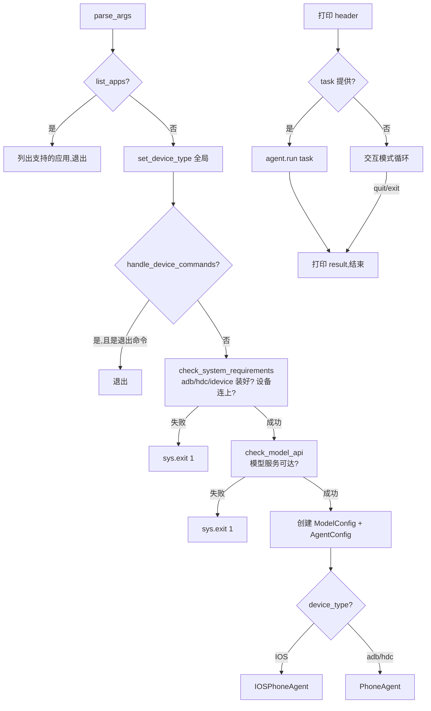

# 01 · 入口与 CLI

> 本文解析项目根目录的入口脚本：`main.py`（853 行，统一入口）和 `ios.py`（550 行，iOS 独立入口，历史遗留）。
> 读完本文你会知道 `python main.py` 执行时发生了什么、所有 CLI 参数的含义、如何改 CLI 行为。

## 文件地图

| 文件 | 行数 | 作用 |
|------|------|------|
| `main.py` | 853 | **统一 CLI** 入口（Android/HarmonyOS/iOS 三平台） |
| `ios.py` | 550 | iOS 独立 CLI 入口（**与 main.py 重叠**，历史遗留） |

`main.py` 是当前推荐入口，README 所有示例都用它。`ios.py` 是早期 iOS 单独入口，现在 `python main.py --device-type ios` 已能做所有事，**`ios.py` 可以视为遗留**。

## `main.py` 的完整流程

`python main.py [OPTIONS] [task]` 执行时的步骤：



## `parse_args`：所有 CLI 参数

`main.py:355-524`。参数分组：

### 模型参数

| 参数 | 默认 | 环境变量 | 说明 |
|------|------|---------|------|
| `--base-url` | `http://localhost:8000/v1` | `PHONE_AGENT_BASE_URL` | 模型 API 地址 |
| `--model` | `autoglm-phone-9b` | `PHONE_AGENT_MODEL` | 模型名 |
| `--apikey` | `EMPTY` | `PHONE_AGENT_API_KEY` | API 密钥 |
| `--max-steps` | `100` | `PHONE_AGENT_MAX_STEPS` | 每任务最大步数 |

### 设备参数

| 参数 | 默认 | 环境变量 | 说明 |
|------|------|---------|------|
| `--device-id` / `-d` | 自动检测 | `PHONE_AGENT_DEVICE_ID` | ADB/HDC 设备 ID |
| `--device-type` | `adb` | `PHONE_AGENT_DEVICE_TYPE` | `adb`/`hdc`/`ios` 三选一 |
| `--connect` / `-c` | 无 | — | 连接远程设备 `ip:port` |
| `--disconnect` | 无 | — | 断开远程设备（或 `all`）|
| `--list-devices` | False | — | 列出已连设备并退出 |
| `--enable-tcpip` | 5555 | — | 在 USB 设备上启用 TCP/IP |

### iOS 专用参数

| 参数 | 默认 | 环境变量 | 说明 |
|------|------|---------|------|
| `--wda-url` | `http://localhost:8100` | `PHONE_AGENT_WDA_URL` | WebDriverAgent URL |
| `--pair` | False | — | 与 iOS 设备配对 |
| `--wda-status` | False | — | 显示 WDA 状态并退出 |

### 其他参数

| 参数 | 默认 | 环境变量 | 说明 |
|------|------|---------|------|
| `--quiet` / `-q` | False | — | 关闭 verbose 输出 |
| `--list-apps` | False | — | 列出支持的应用并退出 |
| `--lang` | `cn` | `PHONE_AGENT_LANG` | `cn` 或 `en` |
| `task` (位置参数) | 无 | — | 任务描述，不提供则进交互模式 |

### 任务参数（位置参数）

`task` 是**可选位置参数**：

```python
parser.add_argument("task", nargs="?", type=str, help="Task to execute")
```

- 提供了 → 单次任务模式：`agent.run(task)` 后退出
- 没提供 → 交互模式：循环 `input("Enter your task: ")`，输入 `quit/exit/q` 退出

## `check_system_requirements`：启动前自检

`main.py:37-269`。按 `device_type` 做三件检查：

### 检查 1：工具已安装

```python
if shutil.which(tool_cmd) is None:
    print("❌ FAILED")
    ...
```

| device_type | 工具 | 检测命令 |
|------------|------|---------|
| `adb` | ADB | `adb version` |
| `hdc` | HDC | `hdc -v` |
| `ios` | libimobiledevice | `idevice_id -ln` |

工具未安装时给出平台特定的安装提示（macOS brew、Linux apt、Windows 链接）。

### 检查 2：设备已连接

| device_type | 命令 | 解析 |
|------------|------|------|
| `adb` | `adb devices` | 过滤含 `\tdevice` 的行 |
| `hdc` | `hdc list targets` | 非空行 |
| `ios` | `list_ios_devices()` | 调 `idevice_id -ln` |

无设备时给出连接提示。

### 检查 3：辅助组件

| device_type | 检查内容 |
|------------|---------|
| `adb` | **ADB Keyboard 已装**：`adb shell ime list -s` 含 `com.android.adbkeyboard/.AdbIME` |
| `hdc` | 跳过（用原生输入） |
| `ios` | **WebDriverAgent 已运行**：`XCTestConnection(wda_url).is_wda_ready()` |

任何一项失败 → `sys.exit(1)`，不进入 Agent 主循环。

## `check_model_api`：模型服务探活

`main.py:272-352`。**用真实 chat completion 探活**（而非 `/models` 列表）：

```python
client = OpenAI(base_url=base_url, api_key=api_key, timeout=30.0)
response = client.chat.completions.create(
    model=model_name,
    messages=[{"role": "user", "content": "Hi"}],
    max_tokens=5, temperature=0.0, stream=False,
)
if response.choices and len(response.choices) > 0:
    print("✅ OK")
```

**为什么用 chat 而非 /models？** `/models` 端点在某些推理引擎（如 vLLM 启动初期）可能不可用，但 chat 已可工作；反之亦然。chat completion 是最普适的探活方式。

错误分类提示：
- `Connection refused` → 检查服务是否启动
- `timed out` → 检查网络
- `Name or service not known` → DNS 问题

## `handle_device_commands`：设备子命令

`main.py:602-681`。处理**不需要进 Agent 循环**的设备命令：

| 子命令 | 行为 |
|--------|------|
| `--list-devices` | 列出所有已连设备并退出 |
| `--connect ip:port` | 连接远程设备，**成功后继续主流程**（不退出） |
| `--disconnect [addr]` | 断开远程设备并退出 |
| `--enable-tcpip [port]` | 启用 TCP/IP 模式并退出，打印后续 `--connect` 提示 |

**特别注意 `--connect`**：成功连接后**返回 `not success`**（即 success 时返回 False），让主流程继续。其他子命令返回 True 表示"已处理，退出"。

iOS 专用子命令（`handle_ios_device_commands`，`main.py:527-599`）：
- `--list-devices`：显示 iOS 设备（UDID、型号、iOS 版本、连接类型）
- `--pair`：`idevicepair pair`
- `--wda-status`：显示 WDA 状态（sessionId、build time、当前 app）

## `main()`：主流程

`main.py:684-850`。核心逻辑：

```python
def main():
    args = parse_args()

    # 1. 设 device_type 全局
    device_type = {"adb": DeviceType.ADB, "hdc": DeviceType.HDC, "ios": DeviceType.IOS}[args.device_type]
    if device_type != DeviceType.IOS:
        set_device_type(device_type)   # iOS 不走 factory
    if device_type == DeviceType.HDC:
        from phone_agent.hdc import set_hdc_verbose
        set_hdc_verbose(True)

    # 2. --list-apps 提前退出
    if args.list_apps:
        ...
        return

    # 3. 设备子命令
    if handle_device_commands(args):
        return

    # 4. 自检
    if not check_system_requirements(device_type, ...):
        sys.exit(1)
    if not check_model_api(args.base_url, args.model, args.apikey):
        sys.exit(1)

    # 5. 创建配置 + Agent
    model_config = ModelConfig(base_url=args.base_url, model_name=args.model,
                               api_key=args.apikey, lang=args.lang)
    if device_type == DeviceType.IOS:
        agent_config = IOSAgentConfig(max_steps=args.max_steps, wda_url=args.wda_url,
                                      device_id=args.device_id, verbose=not args.quiet, lang=args.lang)
        agent = IOSPhoneAgent(model_config=model_config, agent_config=agent_config)
    else:
        agent_config = AgentConfig(max_steps=args.max_steps, device_id=args.device_id,
                                   verbose=not args.quiet, lang=args.lang)
        agent = PhoneAgent(model_config=model_config, agent_config=agent_config)

    # 6. 打印 header
    print("=" * 50)
    print(f"Model: {model_config.model_name}")
    print(f"Base URL: {model_config.base_url}")
    ...

    # 7. 运行
    if args.task:
        result = agent.run(args.task)
        print(f"\nResult: {result}")
    else:
        # 交互模式
        while True:
            task = input("Enter your task: ").strip()
            if task.lower() in ("quit", "exit", "q"):
                break
            if not task:
                continue
            result = agent.run(task)
            print(f"\nResult: {result}\n")
            agent.reset()    # ★ 每任务后重置
```

**交互模式注意**：
- 每个任务后调 `agent.reset()` 清空上下文，下一个任务从头开始
- `Ctrl+C` 退出（`KeyboardInterrupt` 被捕获）
- 单任务异常被 catch 并打印，**不退出**循环

## `ios.py`：历史遗留入口

`ios.py` 是 **iOS 专用独立 CLI**，与 `main.py --device-type ios` 功能重叠。

### 与 main.py 的差异

| 维度 | main.py | ios.py |
|------|---------|--------|
| 支持平台 | adb/hdc/ios 三平台 | 仅 ios |
| iOS 检查 | `check_system_requirements(DeviceType.IOS)` | 独立的 `check_system_requirements(wda_url)` |
| Agent | `IOSPhoneAgent` | `IOSPhoneAgent`（同） |
| 设备子命令 | 在 `handle_ios_device_commands` | 直接写在 main() |
| 交互模式 | 支持 | 支持 |

`ios.py` 是早期 iOS 支持单独开发时的入口，后来 `main.py` 整合了三平台，`ios.py` 变成冗余但未删除。

### 推荐

**所有场景都用 `main.py`**，`ios.py` 可以视为废弃。如果维护，建议从仓库删除或加 deprecation warning。

## 环境变量速查

| 变量 | 用途 | 默认 |
|------|------|------|
| `PHONE_AGENT_BASE_URL` | 模型 API 地址 | `http://localhost:8000/v1` |
| `PHONE_AGENT_MODEL` | 模型名 | `autoglm-phone-9b` |
| `PHONE_AGENT_API_KEY` | API 密钥 | `EMPTY` |
| `PHONE_AGENT_MAX_STEPS` | 最大步数 | `100` |
| `PHONE_AGENT_DEVICE_ID` | 设备 ID | 自动检测 |
| `PHONE_AGENT_DEVICE_TYPE` | 设备类型 | `adb` |
| `PHONE_AGENT_LANG` | 语言 | `cn` |
| `PHONE_AGENT_WDA_URL` | WDA URL | `http://localhost:8100` |
| `PHONE_AGENT_*_DELAY` | 14 个时间常量 | 见 [06](06-config-prompts.md#timing-时间常量) |

**优先级**：命令行参数 > 环境变量 > 代码默认值。

## 常见用法

### 基础

```bash
# 交互模式(默认 adb)
python main.py --base-url http://localhost:8000/v1

# 单任务
python main.py "打开小红书搜索美食攻略"

# 用智谱 BigModel 托管服务
python main.py --base-url https://open.bigmodel.cn/api/paas/v4 \
               --model autoglm-phone --apikey sk-xxx "打开美团"
```

### 设备管理

```bash
# 列出设备
python main.py --list-devices

# 远程设备
python main.py --connect 192.168.1.100:5555
python main.py --device-id 192.168.1.100:5555 "打开微信"

# 启用 TCP/IP(USB 转 WiFi)
python main.py --enable-tcpip
```

### 跨平台

```bash
# HarmonyOS
python main.py --device-type hdc "打开抖音"

# iOS
python main.py --device-type ios --wda-url http://192.168.1.50:8100 "Open Safari"
```

### 调试

```bash
# 英文 prompt + verbose 关
python main.py --lang en --quiet

# 限制步数(防失控)
python main.py --max-steps 20 "复杂任务"
```

## 改 CLI 的常见诉求

| 我想... | 改哪里 |
|--------|-------|
| 加新 CLI 参数 | `parse_args` 里 `parser.add_argument(...)` |
| 加新环境变量 | 在对应参数的 `default=os.getenv(...)` |
| 改自检逻辑 | `check_system_requirements` |
| 加新设备子命令 | `handle_device_commands` 加分支 |
| 改交互模式退出词 | `main()` 里 `task.lower() in (...)` |
| 加自定义 header | `main()` 第 6 段 print |

## 下一步

- 想知道 Agent 怎么循环 → [02-agent-loop.md](02-agent-loop.md)
- 想知道怎么用 Python API 而非 CLI → `examples/basic_usage.py`
- 想加新设备平台 → [EXTENDING.md](EXTENDING.md)

---
