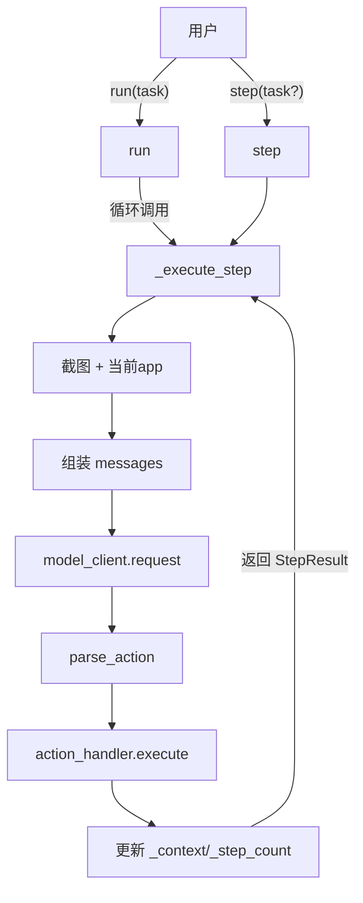

# 02 · Agent 核心循环

> 阅读本文前建议先看 [ARCHITECTURE.md](ARCHITECTURE.md) 的「一次 Agent Step 的数据流」时序图。
> 本文聚焦 `phone_agent/agent.py` 的 `PhoneAgent` 类，逐方法拆解。
> iOS 版 `IOSPhoneAgent`（`agent_ios.py`）逻辑几乎完全相同，差异在末尾单独列出。

## 文件地图

| 文件 | 行数 | 作用 |
|------|------|------|
| `phone_agent/agent.py` | 253 | **PhoneAgent** 主类（Android/HarmonyOS）|
| `phone_agent/agent_ios.py` | 277 | IOSPhoneAgent（与 agent.py 重复度 ~90%）|

## 类结构总览

```python
@dataclass
class AgentConfig:        # agent.py:16-28
    max_steps: int = 100
    device_id: str | None = None
    lang: str = "cn"
    system_prompt: str | None = None   # __post_init__ 里默认调 get_system_prompt(lang)
    verbose: bool = True

@dataclass
class StepResult:         # agent.py:31-39
    success: bool
    finished: bool
    action: dict[str, Any] | None
    thinking: str
    message: str | None = None

class PhoneAgent:         # agent.py:42-252
    def __init__(model_config, agent_config, confirmation_callback, takeover_callback)
    def run(task) -> str                          # 高层入口
    def step(task=None) -> StepResult             # 单步(调试用)
    def reset()                                   # 清空上下文
    def _execute_step(user_prompt, is_first) -> StepResult  # 核心
    @property context / step_count                # 状态读取
```

## 三层 API：run / step / _execute_step



| API | 何时用 |
|-----|-------|
| `run(task)` | 一次性跑完整个任务（最常用） |
| `step(task?)` | 手动单步调试，看每步细节 |
| `_execute_step(...)` | 内部实现，**不要直接调** |

## `run(task)`：高层入口

`agent.py:84-110`：

```python
def run(self, task: str) -> str:
    self._context = []
    self._step_count = 0

    result = self._execute_step(task, is_first=True)   # 第一步带 task
    if result.finished:
        return result.message or "Task completed"

    while self._step_count < self.agent_config.max_steps:
        result = self._execute_step(is_first=False)    # 后续步不带 task
        if result.finished:
            return result.message or "Task completed"

    return "Max steps reached"
```

**三个关键点**：
1. **每次 `run` 都重置上下文** —— `_context = []`，多次调用 `run` 之间不共享历史。
2. **第一步特殊** —— `is_first=True` 决定是否注入 system prompt 和把用户 task 文本放进 message。
3. **终止条件** —— 两个出口：模型主动 `finish(...)`，或步数耗尽返回 `"Max steps reached"`。

> **陷阱**：如果模型在第 1 步就直接 `finish`（比如任务太简单或模型误解），`run` 会立即返回，连设备都没操作过。这是合理的早退，不是 bug。

## `_execute_step`：核心方法（逐段拆解）

这是整个项目的心脏。`agent.py:136-243`，分 6 段：

### 段 1：截图 + 当前 app（136-145）

```python
self._step_count += 1

device_factory = get_device_factory()
screenshot = device_factory.get_screenshot(self.agent_config.device_id)
current_app = device_factory.get_current_app(self.agent_config.device_id)
```

- `get_device_factory()` 读全局单例（由 `main.py` 在启动时通过 `set_device_type()` 设置）。
- 截图返回 `Screenshot{base64_data, width, height, is_sensitive}` —— `width/height` 后面给 `_convert_relative_to_absolute` 用。
- **iOS 不走这段** —— `agent_ios.py:161-168` 直接调 `xctest.get_screenshot(wda_url, session_id, device_id)`。

### 段 2：组装消息（147-169）

```python
if is_first:
    # 第一步: 注入 system + 带 task 的 user message
    self._context.append(
        MessageBuilder.create_system_message(self.agent_config.system_prompt)
    )
    screen_info = MessageBuilder.build_screen_info(current_app)
    text_content = f"{user_prompt}\n\n{screen_info}"
    self._context.append(
        MessageBuilder.create_user_message(text=text_content, image_base64=screenshot.base64_data)
    )
else:
    # 后续步: 只有 screen info,无 task 文本
    screen_info = MessageBuilder.build_screen_info(current_app)
    text_content = f"** Screen Info **\n\n{screen_info}"
    self._context.append(
        MessageBuilder.create_user_message(text=text_content, image_base64=screenshot.base64_data)
    )
```

`build_screen_info` 生成 JSON 字符串：

```json
{"current_app": "小红书"}
```

`create_user_message` 生成 OpenAI 多模态消息格式（图在文前）：

```python
{
  "role": "user",
  "content": [
    {"type": "image_url", "image_url": {"url": "data:image/png;base64,..."}},
    {"type": "text", "text": "打开小红书搜索美食攻略\n\n{\"current_app\": \"小红书\"}"}
  ]
}
```

### 段 3：调模型 + 实时打印 thinking（171-187）

```python
try:
    msgs = get_messages(self.agent_config.lang)
    print("\n" + "=" * 50)
    print(f"💭 {msgs['thinking']}:")
    print("-" * 50)
    response = self.model_client.request(self._context)
except Exception as e:
    if self.agent_config.verbose:
        traceback.print_exc()
    return StepResult(
        success=False, finished=True, action=None,
        thinking="", message=f"Model error: {e}",
    )
```

**注意**：`💭 thinking:` 标头是在**调模型之前**打印的——这是给 `ModelClient` 流式输出预留的"行头"，因为 `ModelClient.request` 内部会边收边把 thinking 内容打到 stdout（详见 [05-model-client.md](05-model-client.md)）。

**模型异常 = 任务终止**：网络错误、API 限流、模型崩溃等，都直接 `finished=True`，把异常塞进 `message` 返回。

### 段 4：解析动作（189-202）

```python
try:
    action = parse_action(response.action)
except ValueError:
    if self.agent_config.verbose:
        traceback.print_exc()
    action = finish(message=response.action)   # 解析失败兜底: 当 finish 处理

if self.agent_config.verbose:
    print("-" * 50)
    print(f"🎯 {msgs['action']}:")
    print(json.dumps(action, ensure_ascii=False, indent=2))
    print("=" * 50 + "\n")
```

**解析失败兜底**是个有意思的设计：如果模型输出了无法解析的内容（比如直接说了一段话没动作），就把它当 `finish(message=那段话)` 处理 —— 任务结束，把那段话作为结果返回。这避免了死循环。

详见 [04-action-handler.md](04-action-handler.md#parse_action-解析逻辑)。

### 段 5：图片清理 + 动作执行（204-217）

```python
# 移除历史 message 中的图片,省 token
self._context[-1] = MessageBuilder.remove_images_from_message(self._context[-1])

try:
    result = self.action_handler.execute(action, screenshot.width, screenshot.height)
except Exception as e:
    if self.agent_config.verbose:
        traceback.print_exc()
    result = self.action_handler.execute(
        finish(message=str(e)), screenshot.width, screenshot.height
    )
```

**两个关键设计**：

1. **图片一次性消费**：模型已经看过这张图并给出决策了，之后这张图不再有价值，留在上下文里只浪费 token。所以**模型回复到达后，立刻把这条 user message 里的 image 内容剥掉，只保留 text**。效果是：上下文中永远只有最新一步的截图。

2. **执行异常兜底**：如果动作执行抛异常（比如点击坐标越界、ADB 断连），把它转成 `finish(message=str(e))` —— 任务终止，把异常作为结果。注意这里**会真的执行 finish handler**（虽然 finish handler 只是返回 `should_finish=True`），目的可能是让 confirmation/takeover 回调有机会被触发（实际 finish 不会触发，但保持代码路径一致）。

### 段 6：回填上下文 + 终止判断（219-243）

```python
# 把模型回复加入 context(注意是 response.action 原始字符串,不是解析后的 dict)
self._context.append(
    MessageBuilder.create_assistant_message(
        f"<think>{response.thinking}</think><answer>{response.action}</answer>"
    )
)

# 终止判断
finished = action.get("_metadata") == "finish" or result.should_finish

if finished and self.agent_config.verbose:
    msgs = get_messages(self.agent_config.lang)
    print("\n" + "🎉 " + "=" * 48)
    print(f"✅ {msgs['task_completed']}: {result.message or action.get('message', msgs['done'])}")
    print("=" * 50 + "\n")

return StepResult(
    success=result.success,
    finished=finished,
    action=action,
    thinking=response.thinking,
    message=result.message or action.get("message"),
)
```

**两个细节**：

1. **assistant message 用 XML 包裹格式**：即使模型实际输出是裸 `do(...)`，回填时也重新包成 `<think>...</think><answer>...</answer>`。这是为了**让模型在后续步看到自己之前的"思考过程"**，保持上下文格式一致。
2. **两个 finished 来源**：
   - `action._metadata == "finish"` —— 模型主动结束
   - `result.should_finish` —— handler 决定结束（目前只有 `finish` handler 会设这个，但架构允许其他 handler 也强制结束，比如未来加"重试 3 次仍失败"逻辑）

## `step(task=None)`：单步调试

`agent.py:112-129`：

```python
def step(self, task: str | None = None) -> StepResult:
    is_first = len(self._context) == 0
    if is_first and not task:
        raise ValueError("Task is required for the first step")
    return self._execute_step(task, is_first)
```

跟 `run` 的区别：**不循环**。你可以逐步手动推进，观察每步状态：

```python
agent = PhoneAgent(...)
result = agent.step("打开美团搜索火锅")     # 第 1 步
while not result.finished:
    result = agent.step()                    # 第 2, 3, ... 步
    print(f"Step {agent.step_count}: {result.action}")
```

**用例**：调试某个具体步骤、加断点、在两步之间插入自定义逻辑（如截图保存、状态检查）。

> **配套示例**：`examples/demo_thinking.py`（64 行）是个最小 verbose 模式 demo，跑 `agent.run("打开小红书搜索美食攻略")` 并打印思考过程；`examples/basic_usage.py`（190 行）则覆盖基础任务、带回调、单步、批量、远程 5 种场景。

## `reset()`：清空状态

```python
def reset(self) -> None:
    self._context = []
    self._step_count = 0
```

`run` 内部第一行就调它，所以连续多次 `run` 之间是隔离的。如果你想**保留上下文跨任务**（少见），直接调 `agent._execute_step(...)` 而不是 `run`，但要注意手动管理状态。

## 上下文（_context）的演化

跟踪一个 3 步任务的 `_context` 增长：

| 步骤后 | _context 内容 |
|-------|--------------|
| 初始 | `[]` |
| Step 1 准备 | `[system, user_1(text+image)]` |
| Step 1 完成 | `[system, user_1(text only), assistant_1]` |
| Step 2 准备 | `[system, user_1(text), assistant_1, user_2(text+image)]` |
| Step 2 完成 | `[system, user_1(text), assistant_1, user_2(text), assistant_2]` |
| Step 3 准备 | `[..., user_3(text+image)]` |

**永远只有最新一个 user message 带图片**。token 增长主要来自 text 部分（每步累积约 200-500 token），图片 token 固定（单张截图约 1000-2000 token，取决于分辨率和模型）。

## iOS 版差异（agent_ios.py）

`IOSPhoneAgent` 与 `PhoneAgent` 的代码重复度约 90%，主要差异：

| 维度 | PhoneAgent | IOSPhoneAgent |
|------|-----------|---------------|
| 设备访问 | `get_device_factory()` 全局单例 | 直接调 `xctest.get_screenshot(wda_url, session_id, ...)` |
| ActionHandler | `ActionHandler`（通过 factory） | `IOSActionHandler`（直接持 wda_url/session_id） |
| 构造时 | 无 | **自动创建 WDA session**（`start_wda_session`）|
| verbose thinking 打印 | 只打 `💭 thinking:` 头 | 头 + `response.thinking` 全文 |

**WDA session 自动创建**（`agent_ios.py:83-90`）：

```python
if self.agent_config.session_id is None:
    success, session_id = self.wda_connection.start_wda_session()
    if success and session_id != "session_started":
        self.agent_config.session_id = session_id
```

这是 iOS 多出来的步骤——WebDriverAgent 是有状态 HTTP 服务，操作前必须先 `POST /session` 创建会话。

## 常见陷阱与边界情况

### 1. verbose 模式下的 thinking 不一致

`PhoneAgent`（Android）在 `agent.py:174-176` 只打印 `💭 thinking:` 头，**没有打印 `response.thinking` 内容**——因为 `ModelClient` 在流式过程中已经实时打过了。

但 `IOSPhoneAgent`（`agent_ios.py:219-222`）在头之后又显式 `print(response.thinking)` —— **会重复打印两次**（流式一次 + 这里一次）。

这看起来是 iOS 版的 copy-paste 遗留小 bug。修复方法：删掉 `agent_ios.py:222` 的 `print(response.thinking)`。

### 2. 第一步立即 finish

如果模型在第 1 步就 `finish`（罕见但合法），`run` 会返回 `result.message`，`step_count == 1`，设备可能完全没动过。这不是 bug，是合理早退。

### 3. max_steps 边界

`run` 用 `while self._step_count < self.agent_config.max_steps`，所以最大实际执行 `max_steps` 步。`_execute_step` 一开始就 `self._step_count += 1`，所以即使第一步就 finish，`step_count` 也是 1。

### 4. 异常 = 终止

模型异常（段 3）和执行异常（段 5）都被设计成**直接终止任务**，而不是重试。这意味着：

- 网络抖动一次 → 整个任务失败
- 一次 ADB 命令超时 → 整个任务失败

如果你想要容错（如重试 N 次），需要在 `_execute_step` 外包一层 retry 装饰器，或修改 `run` 循环逻辑。

### 5. _context 跨 run 不清空已弃用

`run` 开头主动 `self._context = []`，所以**不存在跨任务泄漏**。但 `step` 不清空，连续 `step` 之间共享上下文（这是设计意图）。

## 改 Agent 行为的常见诉求

| 我想... | 改哪里 |
|--------|-------|
| 限制最大步数 | `AgentConfig(max_steps=N)` 或 `--max-steps N` |
| 加重试逻辑 | 改 `run` 的 while 循环,catch 后不 break 而是重试 |
| 每步保存截图 | 在 `_execute_step` 段 1 后加 `screenshot.save(...)` |
| 两步之间插钩子 | 用 `step()` 手动驱动,在两步之间加自定义代码 |
| 改终止条件 | 改段 6 的 `finished` 计算 |
| 关闭 verbose | `AgentConfig(verbose=False)` |
| 跨任务保持上下文 | 不要用 `run`,用 `step()` 系列,手动管理 |

## 下一步

- 想知道 `parse_action` 怎么把字符串变成 dict → [04-action-handler.md](04-action-handler.md)
- 想知道 `model_client.request` 怎么流式解析 → [05-model-client.md](05-model-client.md)
- 想知道为什么 iOS 不走 DeviceFactory → [03-device-layer.md](03-device-layer.md)
- 想加自定义动作或扩展 Agent → [EXTENDING.md](EXTENDING.md)

---
