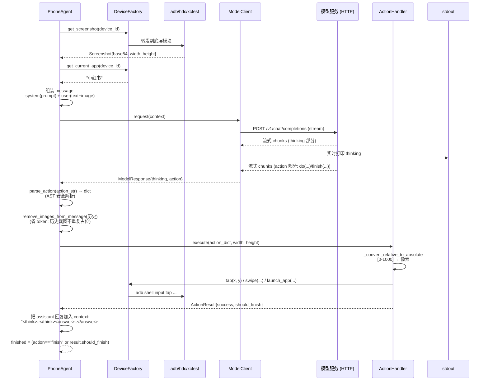

# Open-AutoGLM 架构总览

> 本文档是源码级技术文档集的入口。如果你只想安装使用，请看根目录的 [README.md](../README.md)。
> 本文假设你已能跑通项目，想理解**它是怎么工作的**，或者准备**二次开发**。

## 一句话定位

Open-AutoGLM 是一个 **"截图 → 视觉模型决策 → 设备执行 → 循环"** 的手机 GUI Agent 框架，跨 Android（ADB）、HarmonyOS（HDC）、iOS（XCTest/WebDriverAgent）三个平台。

它本身**不包含模型**，模型（AutoGLM-Phone-9B）通过 OpenAI 兼容的 HTTP API 提供，框架负责：

1. 从设备截图、识别当前 app
2. 把"截图 + 当前 app + 任务描述"组装成 OpenAI 消息发给模型
3. 解析模型回复为结构化动作（`do(action="Tap", element=[500, 300])`）
4. 在设备上执行动作（点击坐标 / 滑动 / 输入文本 / 启动 app…）
5. 把动作结果回填进对话上下文，进入下一轮，直到模型输出 `finish(...)` 或达到步数上限

## 高层架构

```
┌────────────────────────────────────────────────────────────────────┐
│                         用户 (CLI / Python API)                     │
│                  "打开小红书搜索美食攻略"                            │
└──────────────┬─────────────────────────────────────────────────────┘
               │
               ▼
┌────────────────────────────────────────────────────────────────────┐
│  Entry Layer  (main.py / ios.py)                                    │
│  ─ argparse 参数解析, 环境变量加载                                   │
│  ─ check_system_requirements: 检查 adb/hdc/idevice 装好 + 设备连上  │
│  ─ check_model_api: 用一次 chat completion 探活模型服务              │
│  ─ 根据 --device-type 实例化 PhoneAgent / IOSPhoneAgent             │
└──────────────┬─────────────────────────────────────────────────────┘
               │
               ▼
┌────────────────────────────────────────────────────────────────────┐
│  Agent Layer  (phone_agent/agent.py / agent_ios.py)                 │
│  ─ PhoneAgent.run(task) → 循环 _execute_step                        │
│  ─ 每步: 截图 → 组消息 → 调模型 → 解析动作 → 执行动作 → 回填上下文  │
│  ─ 终止条件: action._metadata == "finish" 或 step_count >= max_steps│
└──────┬──────────────────────────────┬──────────────────────────────┘
       │                              │
       ▼                              ▼
┌──────────────────────┐    ┌──────────────────────────────────────┐
│  Model Layer         │    │  Action Layer                        │
│  (model/client.py)   │    │  (actions/handler.py, handler_ios.py)│
│  ─ OpenAI 流式 chat  │    │  ─ parse_action: AST 解析模型回复     │
│  ─ 实时打印 thinking │    │  ─ 14 种 action handler              │
│  ─ 分离 think/action │    │  ─ 相对坐标 → 绝对像素 (0-1000 系)   │
│  ─ 性能指标采集      │    │  ─ 敏感操作 confirmation_callback     │
└──────────┬───────────┘    │  ─ 人工接管 takeover_callback        │
           │                └────────────────┬─────────────────────┘
           │ HTTP /v1                        │
           ▼                                 ▼
┌──────────────────────┐    ┌──────────────────────────────────────┐
│  External Model Svc  │    │  Device Layer                        │
│  vLLM / SGLang /     │    │  ─ device_factory.py: 工厂选 adb/hdc │
│  BigModel / ModelScope│   │  ─ adb/  hdc/  xctest/  (平行三套)   │
│  AutoGLM-Phone-9B    │    │  ─ 每套: connection/device/input/    │
└──────────────────────┘    │            screenshot                 │
                            └──────────────────────────────────────┘
```

## 一次 Agent Step 的数据流（核心）

下图展示 **一个 `_execute_step`** 的完整时序，这是理解整个项目的钥匙：



记住这张图，整个项目就是这一过程的反复。

## 6 层架构（DeepWiki 视角）

DeepWiki 把系统划分成 6 层，对理解职责边界很有帮助：

| 层 | 职责 | 关键组件 | 主要文件 |
|----|------|---------|---------|
| **1. User Interface** | 任务入口 | `main.py`、`ios.py` | [main.py](../main.py)、[phone_agent/__init__.py](../phone_agent/__init__.py) |
| **2. Core Agent** | 任务编排、感知-动作循环 | `PhoneAgent.run()`、`PhoneAgent.step()`、`AgentConfig` | [agent.py](../phone_agent/agent.py)、[agent_ios.py](../phone_agent/agent_ios.py) |
| **3. AI Model** | 视觉语言模型集成 | `ModelClient.request()`、`MessageBuilder`、`ModelResponse` | [model/client.py](../phone_agent/model/client.py) |
| **4. Action Processing** | 动作解析、校验、调度 | `ActionHandler.execute()`、`parse_action()` | [actions/handler.py](../phone_agent/actions/handler.py) |
| **5. Device Abstraction** | 平台无关设备接口 | `DeviceFactory`、`DeviceType`、lazy loading | [device_factory.py](../phone_agent/device_factory.py) |
| **6. Platform Implementation** | 平台特定协议 | ADB / HDC / WDA 命令执行 | [adb/](../phone_agent/adb/)、[hdc/](../phone_agent/hdc/)、[xctest/](../phone_agent/xctest/) |
| 配置层（横切）| 应用映射、提示词、时间常量 | `APP_PACKAGES`、`get_system_prompt()`、`TIMING_CONFIG` | [config/](../phone_agent/config/) |

**注意**：第 5 层 `DeviceFactory` 当前只覆盖 ADB/HDC，**iOS 跳过它直接走第 6 层**（`xctest/`）。这是历史遗留的不一致，详见 [03-device-layer.md](03-device-layer.md#为什么-ios-不走-devicefactory)。

## 模块依赖图

```mermaid
graph LR
    main[main.py / ios.py<br/>CLI 入口] --> agent
    main --> factory[device_factory.py]
    main --> config[config/*]
    main --> xctest

    agent[agent.py<br/>PhoneAgent] --> model[model/client.py<br/>ModelClient]
    agent --> actions[actions/handler.py<br/>ActionHandler]
    agent --> factory
    agent --> config

    agent_ios[agent_ios.py<br/>IOSPhoneAgent] --> model
    agent_ios --> actions_ios[actions/handler_ios.py<br/>IOSActionHandler]
    agent_ios --> xctest[xctest/*]
    agent_ios --> config

    factory --> adb[adb/*]
    factory --> hdc[hdc/*]
    %% iOS 不走 factory!

    actions --> factory
    actions --> timing[config/timing.py]
    actions_ios --> xctest

    model --> openai[(openai SDK)]
    model --> i18n[config/i18n.py]

    adb -->[(subprocess: adb shell)]
    hdc -->[(subprocess: hdc shell)]
    xctest -->[(HTTP: WebDriverAgent)]
    xctest -->[(subprocess: idevice*)]
```

**两个关键观察**：
1. **iOS 不走 DeviceFactory** —— `agent_ios.py` 直接 import `xctest/` 模块，绕过了工厂抽象。这是历史原因（iOS 用 HTTP API 而非 subprocess 命令），也是当前架构的一处不一致。详见 [03-device-layer.md](03-device-layer.md)。
2. **ActionHandler 通过 DeviceFactory 间接调用设备** —— 只有 `IOSActionHandler` 直接持有 wda_url/session_id 直调 xctest 函数。

## 核心设计决策

### 1. AutoGLM 协议：函数调用风格 + 相对坐标

模型输出**不是** JSON、不是 tool_call，而是一段「Python 函数调用风格的字符串」：

```
用户想要搜索美食，当前在小红书首页，需要先点击搜索框。
do(action="Tap", element=[500, 120])
```

或者结束任务：

```
finish(message="已成功搜索美食攻略")
```

**解析路径**（`actions/handler.py:332` `parse_action`）：

| 输入样例 | 处理 |
|---------|------|
| `do(action="Tap", element=[500, 120])` | `ast.parse` + 遍历 keywords → `{"_metadata": "do", "action": "Tap", "element": [500, 120]}` |
| `do(action="Type", text="带引号\"和换行\n")` | 走 Type 特殊路径（直接 `split("text=", 1)`），因为复杂字符串会破坏 AST |
| `finish(message="done")` | 简单字符串切分 |

**坐标系统**：模型输出的坐标是 `[0-1000, 0-1000]` 范围的**相对值**（左上角原点），handler 在执行前用 `_convert_relative_to_absolute` 转成绝对像素：

```python
# actions/handler.py:110-116
x = int(element[0] / 1000 * screen_width)
y = int(element[1] / 1000 * screen_height)
```

这样模型不需要知道具体设备分辨率，同一份决策可跨设备复用。**iOS 多一层缩放**：WDA Actions API 用逻辑像素（points），而截图是物理像素，`xctest/device.py` 把坐标再除以 `SCALE_FACTOR = 3`。

### 2. 上下文管理：图片一次性消费

VLM 推理贵在图片 token。Agent 采取**「每步只保留当前截图，历史截图即时移除」**的策略（`agent.py:205`）：

```python
# 模型回复后，立刻把刚才那张图从历史 message 里删掉
self._context[-1] = MessageBuilder.remove_images_from_message(self._context[-1])
```

效果：第 N 步的上下文 = `[system, user_1(text only), assistant_1, user_2(text only), assistant_2, ..., user_N(text+image)]`，图片永远只有最新一张。

### 3. 流式响应 + thinking 实时打印

`ModelClient.request` 用 `stream=True`，边收边打印 thinking 部分。它的核心逻辑（`model/client.py:88-140`）是一个**带缓冲的 marker 检测器**：

- 维护一个 `buffer`，逐字符累积
- 检测到 `do(action=` 或 `finish(message=` 标记 → 把标记前的内容当 thinking 打印出来
- 检测到标记**前缀**（如 `do(ac`）→ 不打印，等下一 chunk（防止把 marker 片段提前打到屏幕）
- 标记之后的内容当 action，静默累积

> **协议演进点**：`prompts_zh.py` 仍要求模型输出 `<think>...</think><answer>...</answer>` XML 包裹格式，但 `client.py:_parse_response` **优先匹配裸 `do(...)`/`finish(...)` 函数调用**，XML 标签只是 fallback。这说明实际部署中模型已演化为直接输出函数调用，prompt 描述滞后于实现。详见 [05-model-client.md](05-model-client.md)。

### 4. 三平台抽象：DeviceFactory + 平行三套

| 平台 | 后端 | 接入方式 | 走 DeviceFactory? |
|------|------|---------|------------------|
| Android | `phone_agent/adb/` | subprocess 调 `adb shell` | ✅ |
| HarmonyOS | `phone_agent/hdc/` | subprocess 调 `hdc shell uitest` | ✅ |
| iOS | `phone_agent/xctest/` | HTTP 调 WebDriverAgent + subprocess 调 `idevice*` | ❌（独立路径） |

ADB 与 HDC 结构高度同构（都是「命令前缀 + shell 命令」），iOS 差异最大（HTTP + WDA session + 坐标缩放）。三套实现代码重复度约 70-80%，**没有共同基类**——这是潜在的改进点。详见 [03-device-layer.md](03-device-layer.md)。

### 5. 安全机制：confirmation + takeover 双回调

```python
# 敏感操作（带 message 字段的 Tap）
if "message" in action:
    if not self.confirmation_callback(action["message"]):
        return ActionResult(success=False, should_finish=True, message="User cancelled")

# 人工接管（登录、验证码）
def _handle_takeover(self, action, w, h):
    self.takeover_callback(action.get("message", "User intervention required"))
```

两个回调默认实现是 `input()` 阻塞终端，但可注入自定义实现（GUI 弹窗、Web 通知等），见 `examples/basic_usage.py:44-58`。

## 平台能力对照

| 能力 | Android (ADB) | HarmonyOS (HDC) | iOS (XCTest) |
|------|--------------|-----------------|--------------|
| 启动 app | `monkey -p pkg` | `aa start -b bundle -a ability` | WDA `/wda/apps/launch` |
| 点击 | `input tap x y` | `uitest uiInput click x y` | WDA Actions pointerDown/Up |
| 输入文本 | `ADB_INPUT_B64` 广播（需 ADB Keyboard） | `uitest uiInput text` 原生 | WDA `/wda/keys` |
| 截图 | `screencap` + `adb pull` | `screenshot` + `hdc file recv` | WDA `/screenshot` + `idevicescreenshot` fallback |
| 列设备 | `adb devices -l` | `hdc list targets` | `idevice_id -ln` |
| 远程连接 | `adb connect ip:port` | `hdc tconn ip:port` | WiFi 网络 + WDA URL |
| 输入法切换 | 需要（ADB Keyboard） | 不需要（原生 uitest） | 不需要（WDA） |

完整对照见 [03-device-layer.md](03-device-layer.md#平台能力对照表)。

## 文档导航

| 章节 | 文件 | 适合谁读 |
|------|------|---------|
| **入口与 CLI** | [01-entry-cli.md](01-entry-cli.md) | 想理解 `python main.py` 全流程、改 CLI 参数 |
| **核心循环** | [02-agent-loop.md](02-agent-loop.md) | 想改 Agent 行为、加 step hook、调循环逻辑 |
| **设备抽象** | [03-device-layer.md](03-device-layer.md) | 想加新平台、调试设备控制 |
| **动作执行器** | [04-action-handler.md](04-action-handler.md) | 想加新动作类型、改协议 |
| **模型客户端** | [05-model-client.md](05-model-client.md) | 想换模型、调流式解析 |
| **配置与 Prompt** | [06-config-prompts.md](06-config-prompts.md) | 想加 app、改 prompt、调时间常量 |
| **二次开发** | [EXTENDING.md](EXTENDING.md) | 想做扩展（新动作/平台/回调）|
| iOS 安装 | [ios_setup/ios_setup.md](ios_setup/ios_setup.md) | iOS 用户（已有）|

## 项目文件结构（带行数）

```
Open-AutoGLM/                              (8309 行 Python)
├── main.py                    853 行     ★ 统一 CLI 入口 (Android/HarmonyOS/iOS)
├── ios.py                     550 行      iOS 独立 CLI 入口 (与 main.py 重叠,历史遗留)
├── setup.py                    49 行      包定义
├── requirements.txt                       依赖清单
│
├── phone_agent/                           核心包
│   ├── __init__.py             12 行      导出 PhoneAgent, IOSPhoneAgent
│   ├── agent.py               253 行  ★   PhoneAgent 主类 (Android/HarmonyOS)
│   ├── agent_ios.py           277 行      IOSPhoneAgent (与 agent.py 90% 重复)
│   ├── device_factory.py      167 行      DeviceFactory + 全局单例
│   │
│   ├── actions/                           动作执行层
│   │   ├── __init__.py          5 行
│   │   ├── handler.py         399 行  ★   ActionHandler + parse_action + do/finish
│   │   └── handler_ios.py     280 行      IOSActionHandler
│   │
│   ├── model/                             模型客户端
│   │   ├── __init__.py          5 行
│   │   └── client.py          290 行  ★   ModelClient (流式) + MessageBuilder
│   │
│   ├── adb/                               Android (subprocess: adb)
│   │   ├── __init__.py         51 行      统一接口导出
│   │   ├── connection.py      353 行      ADBConnection + 设备列举/连接管理
│   │   ├── device.py          252 行      tap/swipe/launch_app/get_current_app
│   │   ├── input.py           109 行      ADB Keyboard 文本输入
│   │   └── screenshot.py      109 行      screencap + adb pull
│   │
│   ├── hdc/                               HarmonyOS (subprocess: hdc,平行于 adb/)
│   │   ├── __init__.py         53 行
│   │   ├── connection.py      381 行      HDCConnection
│   │   ├── device.py          310 行      uitest uiInput 系列命令
│   │   ├── input.py           149 行      原生 uitest 输入
│   │   └── screenshot.py      125 行      screenshot + hdc file recv
│   │
│   ├── xctest/                            iOS (HTTP: WebDriverAgent + idevice*)
│   │   ├── __init__.py         47 行
│   │   ├── connection.py      382 行      XCTestConnection + WDA session + pair
│   │   ├── device.py          458 行      WDA Actions API + SCALE_FACTOR=3
│   │   ├── input.py           299 行      WDA keys + 剪贴板 + 键盘检测
│   │   └── screenshot.py      230 行      WDA /screenshot + idevicescreenshot
│   │
│   └── config/                            配置层
│       ├── __init__.py         53 行      统一导出 + get_system_prompt(lang)
│       ├── apps.py            226 行      Android 168 个 app 包名
│       ├── apps_harmonyos.py  266 行      HarmonyOS 154 个 app + APP_ABILITIES
│       ├── apps_ios.py        339 行      iOS 182 个 bundle ID + iTunes API
│       ├── prompts.py          75 行      ⚠ 遗留废弃 (与 prompts_zh.py 重复,无人 import)
│       ├── prompts_zh.py       77 行      中文 system prompt (15 种动作 + 18 条规则)
│       ├── prompts_en.py       79 行      英文 system prompt (7 种动作,精简版)
│       ├── i18n.py             81 行      UI 消息国际化 (22 个 key × 中/英)
│       └── timing.py          167 行      14 个时间常量 + 环境变量覆盖
│
├── examples/                              示例
│   ├── basic_usage.py         190 行      5 种用法示例
│   └── demo_thinking.py        64 行      verbose 模式演示
│
├── scripts/                               辅助脚本
│   ├── check_deployment_cn.py 115 行      中文部署检查
│   ├── check_deployment_en.py 129 行      英文部署检查
│   ├── sample_messages.json               测试消息
│   └── sample_messages_en.json
│
├── docs/                                  本文档集
│   ├── ARCHITECTURE.md         ← 你在这里
│   ├── ios_setup/                         iOS 安装指南 (已有)
│   └── ...
│
└── resources/                             静态资源 (logo/截图/隐私政策)
```

★ 标记的是核心文件，二次开发优先读这些。

## 入口与命令

| 入口 | 命令 | 何时用 |
|------|------|-------|
| `python main.py` | `python main.py [opts] [task]` | 通用（推荐）|
| `python ios.py` | `python ios.py [opts] [task]` | iOS 独立（历史遗留，与 `main.py --device-type ios` 重叠）|
| **`phone-agent`** | `phone-agent [opts] [task]` | **`pip install -e .` 后注册的命令**（setup.py entry_points）|

`phone-agent` 命令是 `setup.py:44-48` 通过 `console_scripts` 注册的：

```python
entry_points={
    "console_scripts": ["phone-agent=main:main"],
},
```

效果等同 `python main.py`，但更短。详见 [08-development.md](08-development.md#setuppy-详解)。

## 最小可运行示例

```python
from phone_agent import PhoneAgent
from phone_agent.agent import AgentConfig
from phone_agent.model import ModelConfig

agent = PhoneAgent(
    model_config=ModelConfig(base_url="http://localhost:8000/v1"),
    agent_config=AgentConfig(max_steps=50, lang="cn"),
)

result = agent.run("打开小红书搜索美食攻略")
print(result)
```

更多示例（带回调、单步调试、批量任务、远程设备）见 `examples/basic_usage.py` 和 [09-remote-advanced.md](09-remote-advanced.md)。

## 下一步

- **想改 Agent 循环逻辑** → [02-agent-loop.md](02-agent-loop.md)
- **想加一个新动作**（如 `Scroll_To_End`） → [04-action-handler.md](04-action-handler.md) + [EXTENDING.md](EXTENDING.md)
- **想支持新平台**（如 Linux Desktop） → [03-device-layer.md](03-device-layer.md) + [EXTENDING.md](EXTENDING.md)
- **想换模型或调流式** → [05-model-client.md](05-model-client.md)
- **想加新 app 或改 prompt** → [06-config-prompts.md](06-config-prompts.md)
- **想部署模型服务** → [07-deployment.md](07-deployment.md)
- **想做开发/贡献代码** → [08-development.md](08-development.md)
- **想做远程/交互/回调实战** → [09-remote-advanced.md](09-remote-advanced.md)

## 附录：与 DeepWiki 的差异勘误

[DeepWiki](https://deepwiki.com/zai-org/Open-AutoGLM) 是个自动生成的项目 wiki，覆盖范围广但存在若干错误。本节列出本文档与 DeepWiki 的关键差异，**以源码为准**：

| # | DeepWiki 说法 | 实际（源码验证）| 出处 |
|---|--------------|---------------|------|
| 1 | `ModelClient.request(messages, images)` 双参数 + 有 `stream_request()` 方法 | 实际只有 `request(messages)` 单参数，无 `stream_request()` | [05-model-client.md](05-model-client.md#request流式请求--实时分离) |
| 2 | `ModelResponse` 在 `model/types.py` 文件，有 `parse()` 方法 | 实际在 `model/client.py:28-38`，是普通 dataclass，parse 逻辑在 `ModelClient._parse_response` | client.py:28 |
| 3 | `ModelConfig` 在 `model/config.py` 文件 | 实际在 `model/client.py:13-25` | client.py:13 |
| 4 | `ActionHandler` 有 `parse_action()` 方法和 `convert_coordinates()` 方法 | `parse_action` 是**模块级函数**（handler.py:332），`convert_coordinates` 实际叫 `_convert_relative_to_absolute`（handler.py:110）| handler.py |
| 5 | `ActionHandler.execute()` 接 `screen_size, callbacks` 参数 | 实际签名 `execute(action, screen_width, screen_height)`，callbacks 在构造器注入 | handler.py:45 |
| 6 | iOS 走 `DeviceFactory`，模块路径 `phone_agent.xctest` | 实际 `DeviceFactory` 遇 iOS 会 `raise ValueError`，iOS 走独立 `IOSPhoneAgent` | device_factory.py:44-45 |
| 7 | HarmonyOS Back 用 `hdc shell input keyevent KEYCODE_BACK` | 实际用 `uitest uiInput keyEvent Back`（HarmonyOS 专用 uitest 命令）| hdc/device.py:228 |
| 8 | 截图命令是 `adb exec-out screencap -p` | 实际是 `adb shell screencap -p /sdcard/tmp.png` + `adb pull`（两步）| adb/screenshot.py:46,59 |
| 9 | 部署验证脚本输出示例 `Action: Tap(0.5, 0.3)` | 实际 AutoGLM 输出 `do(action="Tap", element=[500, 300])` 函数调用风格 | sample_messages.json + client.py |
| 10 | `.pre-commit-config.yaml` 排除 `apps.py` 和 `README_en.md` | 实际 YAML 有**两个 `exclude:` key**，后者覆盖前者，**只生效排除 README_en.md**（apps.py 仍被检查）| .pre-commit-config.yaml:4-5 |

**DeepWiki 也有几处组织上的优点值得吸收**（本文档已整合）：
- 6 层架构划分（已加入本文「6 层架构」小节）
- 动作 6 大分类（已加入 [04-action-handler.md](04-action-handler.md)）
- 平台能力矩阵的表格化呈现
- 性能基准典型值

DeepWiki 最后 indexed 时间：2026 年 3 月 9 日，commit `86f553`（与本文档同步）。

---
