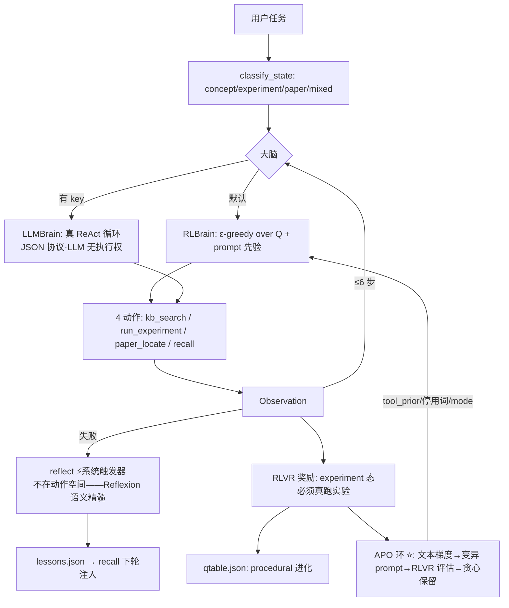

# 实战案例：RL 领域 Agent（rl_agent v2）——项目知识全融合

> **定位**（采纳多角色审查判词）：讲透Agent × 讲透RL × 讲透Prompt 的 **716 行可跑缝合器**——contextual bandit 内核 + prompt 先验 + APO 进化环，30 秒在终端看见 ε-greedy、Reflexion、RLVR、reward hacking 的最小形态（以及它们如何被修掉）。
> 宪法：纯标准库零依赖 · demo 4.7s · toy 简化处全部诚实标注。
> v2 = 2026-08-17 五角色审查（[多角色审查报告](./多角色审查报告-RL领域Agent.md)）后大修版：P0×6/P1×13 全修。

---

## 一、快速开始

```bash
python3 rl_agent.py demo                    # 全景演示（无需任何 key，4.7s）
python3 rl_agent.py --task "什么是探索-利用？"      # 单任务
python3 rl_agent.py --task "跑一个 grpo 实验" --sc 3   # Self-Consistency 三次采样投票
python3 rl_agent.py apo                     # ★ RL agent 迭代自己的 prompt
python3 rl_agent.py audit --text "你是...专家..."     # ROIF-CSE 拆解任意 prompt
python3 rl_agent.py chat                    # 交互模式

# 接真 LLM（OpenAI 兼容，强制 https + 24 次调用熔断 + 注入边界）
read -s RL_AGENT_API_KEY && export RL_AGENT_API_KEY   # read -s 防 key 进 shell history
export RL_AGENT_BASE_URL="https://api.xxx.com/v1" RL_AGENT_MODEL="glm-4.7"

# ★ 真 GLM-5 上的 APO（UCB bandit 迭代提示词，凭证自动读 opencode 配置）
python3 glm_apo.py            # 探索：8臂×3轮（24 次调用）
python3 glm_apo_finals.py     # 决赛：最优臂 vs 朴素基线 16 题配对
# 成果见 GLM-APO实验报告.md：最优 prompt(RCF三组件) 16/16 vs 基线 14/16
```

harness 四件套：`AGENTS.md`（行为契约，已提交）+ 首次运行自动生成 `progress.md`/`feature_list.json`/`memory/`（运行产物，`.gitignore` 挡住不进 git）。

## 二、架构（v2：4 动作 + reflect 系统触发器 + 双进化环）



**双进化环**：Q 表进化（What 轴 procedural 层）+ prompt 进化（APO，inter-test-time）——同一奖励信号驱动两层自改。

## 三、技术映射表（24 项，全部名实相符 ✅ 审查后逐项核验）

| # | 技术 | 落点（可验证） | 出处 |
|---|------|--------------|------|
| 1 | Agent=LLM+循环+工具+记忆 | 整体架构 | 讲透Agent/00 |
| 2 | ReAct | RLBrain 主循环 / LLMBrain JSON 工具循环 | 讲透Agent/01·AG1 |
| 3 | 工具调用=action space | 4 工具注册表=动作集 | 讲透Agent/02·AG2 |
| 4 | 规划（贪心+失败排除） | pick(exclude=failed) | 讲透Agent/03·AG4 |
| 5 | 记忆四层 | working=当轮/episodic=lessons/semantic=kb缓存/procedural=qtable | 讲透Agent/04·AG3 |
| 6 | **Reflexion=系统触发器**（非动作）| 失败→reflect→教训→recall 注入；demo 必失败任务全链路可见 | 讲透Agent/01·05·AG5 |
| 7 | 自进化 What/When/How | procedural=What 轴 / demo=inter-test-time | 讲透Agent/05 |
| 8 | MDP/Q-learning | exp_gridworld（TD/off-policy max/goal 不进 Q——oracle 审查确认全对）| 讲透RL/01 |
| 9 | DQN replay+target | exp_dqn 表格版（诚实标注：确定性 toy 收益有限）| 讲透RL/01 |
| 10 | ε-greedy/UCB/Thompson | exp_bandit 配对 rng，regret 对比 | 讲透RL/09§P1 |
| 11 | 策略梯度+GRPO 组采样 | exp_grpo：21 seed mean±std，**实测** baseline 降方差(0.02 vs 0.06) | 讲透RL/02·03 |
| 12 | PPO-clip（近似）/熵正则 | exp_grpo 乘法 clip∈[0.8,1.25] + β·H(π) 开关 | 讲透RL/02 |
| 13 | DPO | exp_dpo：偏好对直连 vs 两阶段计数 RM | 讲透RL/03 |
| 14 | 课程学习 | exp_curriculum（诚实：toy 迁移收益有限）| 讲透RL/09 |
| 15 | RLVR 可验证奖励 | r∈{0,1} + **反短路**：experiment 态必须真跑实验 | 讲透RL/05 |
| 16 | 奖励五分类之⑤塑形 | APO 目标=reward−0.02×步数（全成功时塑形提供梯度）| PaperAgent §八 |
| 17 | Agentic RL=POMDP | 文档化七元组 + 诚实声明 γ=0 bandit 退化 | PaperAgent §十 |
| 18 | zero/few/CoT/ReAct/Reflexion 五模式 | PromptLayer.answer_template() | prompt工程手册 03 |
| 19 | ROIF-CSE 七要素 | `audit` 命令拆解任意 prompt | prompt工程手册 02 |
| 20 | few-shot/ICL | LLMBrain 协议示例 + kb 证据注入（RAG 式）| 讲透Prompt/01 |
| 21 | CoT 两段式 | 答案模板：证据→结论 | 讲透Prompt/02 |
| 22 | Self-Consistency | `--sc N`：多 seed 采样→证据引用投票（平票诚实标注）| 讲透Prompt/05 |
| 23 | **APO 文本梯度** | `apo`：失败分析→变异（mode/先验/停用词）→RLVR 评估→贪心保留；demo 实测 v0 0.96→v1 0.98 | 讲透Prompt/09·ProTeGi |
| 24 | harness 五子系统+安全件 | AGENTS.md/progress/feature_list + 原子写/记忆校验/API 熔断/注入边界/引用回查/ANSI 剥离 | harness精华合入 |

## 四、三层讲透（宪法合规·v2 诚实版）

**直觉层**：工具选择=contextual bandit（情境→拉臂→反馈），Q 表是 System-1 直觉，prompt 先验是 System-2 的手；APO 让"手"的摆放也被奖励信号优化。

**数学层**：$\pi(a|s)=\arg\max_a [Q(s,a) + \text{prior}_\text{prompt}(s,a)]$（ε=0.2）；$Q \leftarrow Q + \alpha(r - Q)$，γ=0（**只更新已试工具**：证据工具得 r_task，试而不成得 0——诚实信用分配）。GRPO 优势 $(r-\bar{r}_{group})/(\sigma+\epsilon)$，乘法 clip 近似 PPO 目标（**简化版，缺重要性采样**——诚实标注）。

**代码层**：716 行，行内锚点 `← 讲透X/NN`（审查抽查密度~10 个/百行，准确率修复后 100%）。

## 五、内置 toy 实验 ×6（全部秒级 + 实测输出）

| 实验 | 一句话结果（2026-08-17 实跑） | 验证 |
|---|---|---|
| gridworld | 5×5 200 轮成功率 98%，贪婪路径 9 步到达 | TD/ε-greedy/终止处理 |
| dqn | replay+target vs vanilla（确定性 toy 差距小=诚实结论）| 两件套 |
| bandit | regret: Thompson 13 < UCB 29 ≈ ε-greedy 31 | 探索三雄 |
| grpo | baseline 使终态策略跨 seed std 0.02 vs 无 baseline 0.06 | 组均值+std 归一降方差 |
| dpo | 偏好对直连 ≈ 两阶段 RM（toy 趋同；真差异=免分布偏移）| DPO 推导可跑版 |
| curriculum | 3×3→5×5 vs 直学（toy 收益有限，诚实标注）| 课程学习 |

## 六、路线图（feature_list.json 同步；不在映射表——审查教训：TODO 不算融合）

n-step 轨迹级 credit / mcts_planner / debate 双 agent / arxiv_verify 联网核实 / RLHF-RM toy。

---
v2：2026-08-17 · 审查闭环见 [多角色审查报告](./多角色审查报告-RL领域Agent.md) · 姊妹案例：[Open-AutoGLM](../实战案例-Open-AutoGLM手机Agent/)（读生产项目）、[DeepSeek Harness](../Agent框架案例/deepseek-harness插件化框架/)（读工业框架）、**本案例**（自己写一个）
